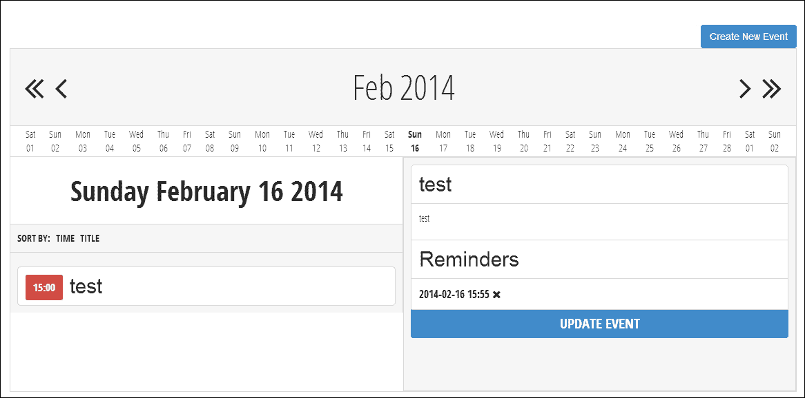
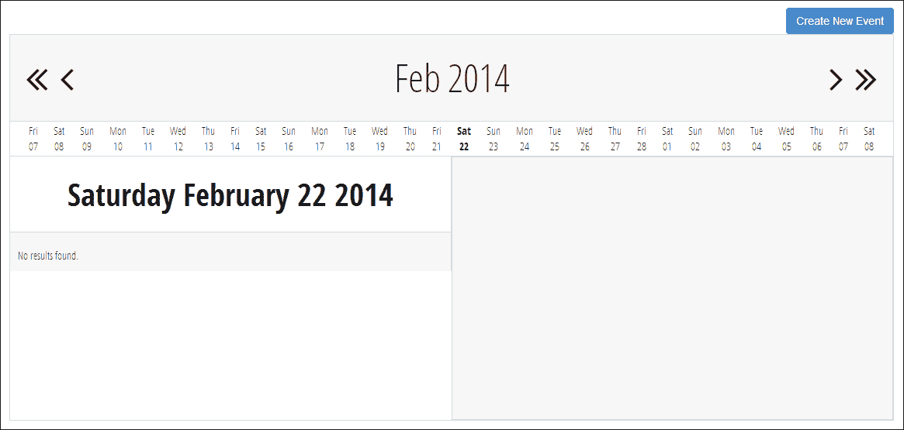

# 第三章：预定提醒

在前两个章节中，我们开发了简单的反应式应用程序，覆盖了 Yii 框架的基本组件。对于我们的下一个项目，我们将通过创建一个允许用户搜索、创建和为自己安排事件和提醒的预定提醒应用程序来扩展之前讨论的概念。此应用程序还将自动在预定提醒发生时向用户发送通知。

# 先决条件

在我们开始之前，有一些我们需要安装和获取的东西：

+   安装 MySQL 的最新版本（在撰写本文时，MySQL 5.6）。MySQL 是最受欢迎的开源数据库，是 LAMP（Linux、Apache、MySQL 和 PHP）的关键部分。由于其受到网络托管提供商的青睐，MySQL 通常是现代 Web 应用程序的事实上的选择。

    ### 备注

    MySQL 可以从您的发行版包管理系统中安装，或者从[mysql.com](http://mysql.com)下载。更多详细信息可以在[`dev.mysql.com/doc/refman/5.6/en/installing.html`](http://dev.mysql.com/doc/refman/5.6/en/installing.html)找到。

+   为我们的应用程序获取一个 SMTP 服务器或 SMTP 服务器的凭据，以便发送电子邮件。我们需要的关键细节包括 SMTP 主机、端口、用户名和密码。根据服务器不同，您可能还需要了解您的服务器使用的安全类型（如 SSL 或 TLS）。如果您没有可用的 SMTP 服务器，有许多选项可供选择，从设置 Postfix SMTP 服务器，使用 Gmail 作为 SMTP 中继，甚至从 SendGrid 获取免费的 SMTP 账户（[`www.sendgrid.com`](http://www.sendgrid.com)）。

+   验证我们的 PHP 实例已安装 mcrypt 库，以便我们可以正确地散列我们将使用的密码。如果您的 PHP 实例已经支持 mcrypt，您应该在`phpinfo()`中看到一个 mcrypt 部分。如果 mcrypt 在您的 PHP 实例中未启用，您可以从您的上游提供商安装它，通过启用 mcrypt 模块，或者通过重新编译 PHP。

+   最后，我们需要从[`getcomposer.org/`](https://getcomposer.org/)下载并安装 Composer。Composer 是一个 PHP 依赖管理器，它将允许我们声明并自动安装应用程序将使用的库。

一旦我们获取了应用程序的所有先决条件，我们就可以开始开发工作了。

# 描述项目

我们计划中的提醒项目可以分为四个主要部分：

+   将创建事件和提醒的用户

+   用户希望被提醒的事件

+   实际事件的提醒（可能有很多）

+   一个命令行任务，用于处理并发送提醒到用户通过电子邮件

## 用户

我们应用程序的第一个组件是使用它的用户。用户将负责为自己创建事件和提醒。用户也将是他们创建的提醒电子邮件的收件人。使用这些信息，我们可以简化我们的数据库模式为以下结构：

```php
ID INTEGER PRIMARY KEY
email STRING
password STRING
created INTEGER
updated INTEGER
```

在第一章《任务管理应用》中，我们创建了一个非常原始的用户认证系统，我们将在后面的章节中重新使用、扩展并重复使用它。在本章中，我们将开发一个系统，使用我们的应用程序创建、删除和管理用户的密码。我们还将介绍一些基本指南，以正确地保护、存储和处理我们用户的凭据。

## 事件

我们应用程序的第二个组件是事件。事件是特定用户希望被提醒的事情，将在特定日期的特定时间发生。事件应该易于搜索且直观。此外，事件可以有一个、多个或没有与之关联的提醒。我们可以在我们的数据库模式中表达如下：

```php
ID INTEGER PRIMARY KEY
user_id INTEGER
title STRING
data TEXT
time INTEGER
created INTEGER
updated INTEGER
```

本章我们将引入的新概念是数据库关系。很多时候，我们数据库中的数据将与另一个表中的属性或数据相关联。在这种情况下，事件是某个特定用户拥有的东西。我们在本应用程序中创建的关系将使我们能够轻松地表示表中的数据，而无需在多个地方存储该数据。

## 提醒

提醒是一个对用户创建的事件具有时间敏感性的事件，它作为对任务运行器的指示，通知用户事件的详细信息。这可以在我们的简化数据库模式中表达如下：

```php
ID INTEGER PRIMARY KEY
event_id INTEGER
title STRING
offset INTEGER
time INTEGER
created INTEGER
updated INTEGER
```

当我们设置提醒模型时，我们将定义提醒和事件之间的关系。由于事件已经与用户绑定，我们可以通过传递方式确定应该发送提醒的用户，而无需在提醒本身中添加`user_id`字段。

我们提醒系统的最后一部分与处理时间戳的方式有关。在之前的章节中，时间戳仅作为特定记录的元数据。然而，我们的提醒必须考虑事件被触发的时间，这意味着我们将涉及时区。虽然使用协调世界时（UTC）在处理时间问题时解决了许多问题，但我们的提醒必须了解特定提醒的时间偏移量。

对于我们的应用程序来说，这意味着我们需要存储最终用户将看到的时间，以及用户的时区偏移量或将其转换为真实 UTC 时间。

## 任务运行器

我们应用程序的最后一个组件是任务运行器，它将找到需要发送的提醒，并将它们实际发送给用户。虽然有许多方法可以创建这个任务运行器，但我们将创建一个在*n*分钟后重复运行的命令行任务，并处理触发时间和提供的分钟间隔之间的所有事件。这种方法将允许我们定义我们希望提醒处理得多频繁或少频繁，而无需重写代码。

# 初始化项目

到目前为止，您应该已经相当熟悉如何初始化一个基本的 Yii 框架项目。继续创建基础文件夹结构，并创建`index.php`、`yiic`、`yiic.bat`和`yiic.php`文件。然后在我们的应用程序的`webroot`目录中创建一个名为`vendors`的文件夹。这个文件夹将用于我们所有的 Composer 依赖项。

## 创建 MySQL 用户和数据库名

如果您还没有为项目创建 MySQL 用户、密码和数据库名，请现在创建。从 MySQL 命令行，您可以运行以下命令来完成此操作：

```php
CREATE USER 'ch3_reminders'@'localhost' IDENTIFIED BY 'ch3_reminders';
CREATE DATABASE IF NOT EXISTS `ch3_reminders`;
GRANT ALL PRIVILEGES ON `ch3\_reminders` . * TO 'ch3_reminders'@'localhost';
```

## 创建 Yii 配置文件

由于使用了 MySQL 数据库，我们的 Yii 配置文件将与我们之前的配置文件略有不同。我们将从基础配置`protected/config/main.php`开始，然后添加新的组件：

```php
<?php return array(
   'basePath'=>dirname(__FILE__).DIRECTORY_SEPARATOR.'..',
   'name'=>'Scheduled Reminders',
   'import'=>array(
      'application.models.*',
   ),
   'components'=>array(

      'errorHandler'=>array(
            'errorAction'=>'site/error',
        ),
       'urlManager'=>array(
         'urlFormat'=>'path',
         'showScriptName'=>false,
         'rules'=>array(
            '/' => 'event/index',
            'event/date/<date:[\w-]+>' => 'event/index', '<controller:\w+>/<action:\w+>/<id:\d+>'=>'<controller>/<action>', <controller:\w+>/<action:\w+>'=>'<controller>/<action>')
      )
   )
);
```

为了让我们的应用程序与 MySQL 交互，我们需要更新数据库组件，以便 Yii 知道如何使用 MySQL PDO 适配器。我们可以通过向我们的组件数组中添加以下内容来实现：

```php
'db' => array(
    'class' => 'CDbConnection',
    'connectionString' => 'mysql:host=127.0.0.1;dbname=ch3_reminders',
    'emulatePrepare' => true,
    'username' => 'ch3_reminders',
    'password' => 'ch3_reminders',
    'charset' => 'utf8',
    'schemaCachingDuration' => '3600'
),
```

### 注意

在这个配置中，我们添加了`schemeaCachingDuration`，它说明了 Yii 将缓存我们的 MySQL 模式多长时间。这将防止不必要的 SQL 命令，例如`DESCRIBE TABLE`，这将减慢我们的应用程序。需要注意的是，如果您使用此选项，您需要清除 Yii 的内部缓存。您可以在[`www.yiiframework.com/doc/api/1.1/CDbConnection`](http://www.yiiframework.com/doc/api/1.1/CDbConnection)了解更多有关 MySQL 特定数据库配置的信息。

## 创建参数配置文件

许多时候，我们希望将敏感信息存储在我们的配置文件中，但我们可能不会出于安全原因将其与版本控制软件一起存储。我们可以通过将此信息存储在单独的文件中，然后将其排除在源控制提交之外来解决这个问题。当我们将应用程序部署到我们的生产服务器时，我们可以手动添加此文件。

在 Yii 中，我们可以通过向我们的配置文件的基础数组中添加以下内容来完成此操作：

```php
'params' => array(
    'smtp' => require __DIR__ . '/params.php'
)
```

接下来，在`config`文件夹中创建一个名为`params.php`的新文件。此文件将存储我们应用程序的 SMTP 凭据。请查看以下代码：

```php
<?php return array(
   'host' => '',
   'username' => '',
   'password' => '',
   'from' => '',
   'port' => ''
);
```

在此期间，请将您的 SMTP 凭据添加到`params.php`文件中。

## 添加 Composer 依赖项

我们需要做的最后一个配置更改是在`webroot`目录中包含一个名为`composer.json`的文件。对于这个项目，我们将使用一个名为`PHPMailer`的依赖项，它将帮助我们从应用程序发送电子邮件。我们还将包括一个名为`password-compat`的包，它将为我们提供与 Bcrypt 密码散列库一起工作的必要用户空间函数，我们将在开始处理用户和身份验证时更详细地介绍 Bcrypt。

此文件应如下所示：

```php
{
   "minimum-stability" : "dev",
   "require": {
       "phpmailer/phpmailer": "dev-master"
	   "ircmaxell/password-compat": "dev-master"
   }
}
```

在定义了我们的 Composer 依赖项之后，我们现在可以通过在命令行中运行以下命令来安装它们：

```php
cd /path/to/project
php /path/to/composer.phar

```

如果一切顺利，你应该会在屏幕上看到类似的内容输出。如果不顺利，Composer 将返回并通知你错误，以便你进行纠正：

```php
Loading composer repositories with package information
Installing dependencies (including require-dev) from lock file
 - Installing phpmailer/phpmailer (dev-master f9d229a)
 Cloning f9d229af549d28d4c9fdd3273bf6525cde3bc472
Generating autoload files

```

最后，我们需要将依赖项加载到 Yii 中。最简单的方法是在`index.php`文件中的`require_once($yii)`之前添加以下内容：

```php
require_once(__DIR__ . '/vendor/autoload.php');
```

# 创建数据库

在我们的依赖项和配置文件就绪后，我们现在可以创建我们的数据库。使用`yiic`命令，创建一个名为 users 的迁移和一个名为 reminders 的迁移。

## 用户迁移

用户迁移将创建`users`数据库并确保在数据库级别不能输入重复的电子邮件地址。在`protected/migrations`文件夹中，打开用户迁移：

在`up()`方法中添加以下内容：

```php
$this->createTable('users', array(
   'id'           => 'pk',
   'email'        => 'string',
   'password'     => 'string',
   'created'      => 'integer',
   'updated'      => 'integer'
));
```

### 注意

你可能会注意到我们选择的列类型与 MySQL 列类型不匹配。这是因为我们允许 Yii 为我们使用的数据库适配器确定适当的列类型。这允许多个数据库驱动程序之间的互操作性，这意味着我们可以无缝地在 MySQL 数据库、SQLite 或 Postgres 数据库之间切换底层数据库技术，而无需更改我们的迁移。Yii 手册有更多关于有效列类型的信息，请参阅[`www.yiiframework.com/doc/api/1.1/CDbSchema#getColumnType-detail`](http://www.yiiframework.com/doc/api/1.1/CDbSchema#getColumnType-detail)。

接下来，我们想在`email`列上创建一个唯一索引，我们可以这样做：

```php
$this->createIndex('email_index', 'users', 'email', true);
```

最后，在`down()`方法中添加一个调用以删除`users`表：

```php
$this->dropTable('users');
```

## 提醒和事件迁移

现在，我们将创建提醒和事件迁移，这些迁移将在我们的数据库中创建`reminders`和`events`表。这两个表将存储我们应用程序的大部分数据。

1.  在我们的提醒迁移中，将以下内容添加到`up()`方法以创建`events`表：

    ```php
    $this->createTable('events', array(
       'id'        => 'pk',
       'user_id'   => 'integer',
       'title'     => 'string',
       'data'      => 'text',
       'time'      => 'integer',
       'created'   => 'integer',
       'updated'   => 'integer'
    ));
    ```

1.  然后在`events`和`users`之间创建一个外键关系：

    ```php
    $this->addForeignKey('event_users', 'events', 'user_id', 'users', 'id', NULL, 'CASCADE', 'CASCADE');
    ```

1.  然后创建`reminders`表，如下所示：

    ```php
       $this->createTable('reminders', array(
       'id'          => 'pk',
       'event_id'    => 'integer',
       'offset'      => 'integer',
       'time'        => 'integer',
       'created'     => 'integer',
       'updated'     => 'integer'
    ));
    ```

1.  最后，在`reminders`和`events`之间创建一个外键关系：

    ```php
    $this->addForeignKey('reminder_events', 'reminders', 'event_id', 'events', 'id', NULL, 'CASCADE', 'CASCADE');
    ```

注意，对于两个外键，我们希望在删除父记录时删除所有内容。例如，如果我们删除一个事件，与该事件关联的所有提醒也应该被删除。同样，如果删除一个用户，与该用户关联的所有事件和提醒也应该被删除。

然后，向`down()`方法添加以下内容以删除外键和表。一旦数据已添加到我们的数据库中，除非删除外键关系，否则我们无法删除表：

```php
$this->dropForeignKey('event_users', 'events');
$this->dropForeignKey('reminder_events', 'reminders');
$this->dropTable('events');
$this->dropTable('reminders');
```

一切添加完毕后，应用迁移。

# 创建模型

到目前为止，您应该熟悉使用 Gii 工具为我们新创建的表创建模型。请继续创建`Users`、`Reminders`和`Events`模型的模型。创建每个模型后，我们需要对每个模型进行一些更改。

## 模型行为

我们需要对我们新创建的模型进行的第一个更改是自动设置创建和更新时间戳。在之前的章节中，我们修改了`beforeSave()`方法来实现这一点；然而，Yii 提供了一个更简单的方法来实现这个功能，它是数据库无关的，并且减少了我们需要添加到模型中的代码量。为此，我们将为每个模型附加一个行为。

Yii 中的行为是具有可以附加到组件（在我们的情况下是模型）的方法的对象。这些行为会监听附加组件上的某些事件（如`beforeSave()`方法），并在事件触发时执行。

我们将添加到每个模型中的行为称为`CTimestampBehavior`，它提供了自动设置创建和更新时间的必要工具。要附加此行为，只需将以下方法添加到我们的`Users.php`、`Events.php`和`Reminders.php`文件中，这些文件位于`protected/models`目录内：

```php
public function behaviors()
{
   return array(
      'CTimestampBehavior' => array(
         'class' => 'zii.behaviors.CTimestampBehavior',
         'createAttribute'    => 'created',
         'updateAttribute'    => 'updated',
         'setUpdateOnCreate' => true
      )
   );
}
```

### 注意

关于`CTimestampBehavior`的更多信息可以在 Yii 文档中找到，该文档可在[`www.yiiframework.com/doc/api/1.1/CTimestampBehavior/`](http://www.yiiframework.com/doc/api/1.1/CTimestampBehavior/)找到。

## 用户模型

我们需要对`Users`模型进行的第一个更改是定义用户和事件之间的关系。如果您使用了 Gii 来生成模型，它必须已经为您预先填充了`relations()`方法。否则，请将以下方法添加到`protected/models/`目录下的`Users.php`模型中：

```php
public function relations()
{
   return array(
      'events' => array(self::HAS_MANY, 'Events', 'user_id'),
   );
}
```

接下来，我们需要给我们的模型添加一个私有属性，用于存储模型的老旧属性，这样我们就可以在不需要重新查询数据库的情况下，比较旧值和更改后的值。请看以下代码行：

```php
private $_oldAttributes = array();
```

我们可以通过给我们的模型添加一个`afterFind()`方法来自动填充此属性：

```php
public function afterFind()
{
   if ($this !== NULL)
      $this->_oldAttributes = $this->attributes;
   return parent::afterFind();
}
```

最后，我们希望给我们的模型添加一个`beforeSave()`方法，当更改用户的电子邮件地址时，该方法不会修改用户的密码，并且如果确实更改了密码，将正确地加密密码：

```php
public function beforeSave()
{
   if ($this->password == NULL)
      $this->password = $this->_oldAttributes['password'];
   else
      $this->password = password_hash($this->password, PASSWORD_BCRYPT, array('cost' => 13));

   return parent::beforeSave();
}
```

### Bcrypt 密码散列

在数据库中存储密码时，非常重要的一点是，要以一种使我们能够轻松验证用户提供了正确的密码，同时使攻击者难以猜测密码的方式存储这些密码。由于大多数用户使用相同的电子邮件地址和密码来处理他们的所有在线身份，因此我们保持该信息尽可能安全至关重要。

实现这一点的其中一种方法是通过使用对称块加密算法，如 Bcrypt。Bcrypt 将明文密码转换为加盐的哈希值，根据成本因子迭代多次。当使用 Bcrypt 时，成本因子增加了生成和验证密码所需的工作量。通过增加生成和验证密码所需的时间，我们可以使暴力攻击对潜在攻击者变得非常昂贵。此成本因子还允许我们作为开发者随着计算能力的增加调整密码的难度。

### 注意

你可以在 [`us2.php.net/manual/en/ref.password.php`](http://us2.php.net/manual/en/ref.password.php) 上了解更多关于 PHP 5.5 中引入的密码函数的信息。

## 提醒模型

接下来，我们需要对我们的提醒模型进行一些修改。首先，让我们验证关系是否已经正确设置。在 `protected/models/Reminders.php` 中添加以下内容：

```php
public function relations()
{
   return array(
      'event' => array(self::BELONGS_TO, 'Events', 'event_id'),
   );
}
```

然后，添加一个 `beforeValidate()` 方法，将用户提交的时间转换为整数时间戳，并将偏移时间存储为 UTC 到我们的数据库中：

```php
public function beforeValidate()
{
   $this->time = (int)strtotime($this->time);
   $this->offset = ($this->offset*60 + $this->time);

   return parent::beforeValidate();
}
```

## 事件模型

接下来，我们将在 `protected/models/Events.php` 模型中添加和更新几个方法。步骤如下：

1.  首先验证关系是否已经正确设置：

    ```php
    public function relations()
    {
       return array(
          'user' => array(self::BELONGS_TO, 'Users', 'user_id'),
          'reminders' => array(self::HAS_MANY, 'Reminders', 'event_id'),
       );
    }
    ```

1.  然后添加一个 `beforeValidate()` 方法来自动调整提交时间和时间，并自动将用户设置为当前登录用户：

    ```php
    public function beforeValidate()
    {
       $this->time = (int)strtotime($this->time);

       // Set the user_id to be the current user
       $this->user_id = Yii::app()->user->id;

       return parent::beforeValidate();
    }
    ```

    ### 注意

    `Yii::app()->user` 是对一个 `CWebUser` 对象的引用，一旦我们进行身份验证，它将处理我们的用户身份。要了解更多关于 `CWebUser` 的信息，请查看 [`www.yiiframework.com/doc/api/1.1/CWebUser`](http://www.yiiframework.com/doc/api/1.1/CWebUser)。

1.  接下来，添加以下获取器方法到我们的模型中。此方法将允许我们从 URL 检索所需数据以搜索我们的活动数据库：

    ```php
    private function getDate()
    {
        if (isset($_GET['date']))
           return $_GET['date'];

        return gmdate("Y-m-d");
    }
    ```

1.  然后，我们将更新我们的模型 `search()` 方法，以便我们能够搜索在特定时间发生的事件，特别是单日的时间段。修改方法签名如下：

    ```php
    public function search($between = false)
    ```

1.  然后，在方法返回之前添加以下内容：

    ```php
    if ($between)
        $criteria->addBetweenCondition('time', strtotime($this->getDate() . ' 00:00:00'), strtotime($this->getDate() . ' 23:59:59'));
    ```

# 搜索事件并显示它们

在我们深入到控制器之前，让我们看看我们的前端将如何搜索和显示事件，因为它将有助于解释对事件模型所做的模型更改，并将帮助我们确定我们还需要实现什么。请查看以下截图：



我们的前端视图被分解为几个不同的组件。首先，我们在右上角有一个按钮，该按钮应链接到一个简单的 CRUD 表单，用于创建和更新事件。我们还有一个月份和年份选择器，显示当前选定的年份，并允许我们按一个月或一年的增量向前或向后推进时间。直接在下面，我们有一个日期选择器，显示当前选定的日期（如果没有选择，则为当前日期），在其两侧各有十五天。

在左侧，我们显示当前选定的日期文本，然后是显示在选定日期下的事件的时间和标题的排序器。

最后，在右侧，我们有一个 Ajax 视图，当点击事件时将显示事件详情以及与该事件相关的所有提醒，并提供一些额外功能，可以立即删除该提醒。此外，我们还将为用户提供一个链接来编辑所选事件。

要达到这一级别的功能，我们需要创建一个自定义列表视图，该视图将扩展`CListView`，添加一个自定义 URL 路由，并创建几个新的控制器方法。让我们开始吧。

## 日期的自定义路由

我们需要做的第一个更改是更改主配置文件中的`urlManager`。在`urlManager['rules']`数组中，添加以下路由：

```php
'event/date/<date:[\w-]+>' => 'event/index',
```

这个自定义路由将允许我们任意地在 URL 中设置一个日期字符串，并将其自动作为`$_GET`参数传递给我们的`EventController`类的`indexAction()`方法，该类我们将很快创建。

## 创建事件控制器

让我们继续到我们的`EventController`。这个控制器将处理我们应用程序中与事件相关的所有必要操作。在`protected/controllers`中创建一个名为`EventController.php`的新文件，其中包含以下类定义：

```php
<?php class EventController extends CController{}
```

执行以下步骤：

1.  我们应该创建的第一个方法是我们的`indexAction()`。传递给此方法的`$_GET`参数将决定最终将在页面上显示哪些事件。为此，我们将利用我们的活动模型的`search()`方法。在搜索时，我们还想确保只显示当前登录用户的数据：

    ```php
    public function actionIndex()
    {
        $model = new Events('search');
        $model->unsetAttributes();

        if (isset($_GET['Events']))
            $model->attributes = $_GET['Events'];

        $model->user_id = Yii::app()->user->id;

        $this->render('index', array('model' => $model));
    }
    ```

1.  接下来，我们需要创建一个实用方法来通过给定的主键加载我们的模型。我们将在整个模型中使用此方法：

    ```php
    private function loadModel($id)
    {
       if ($id == NULL)
          throw new CHttpException(400, 'Bad Request');

       $model = Events::model()->findByPk($id);

       if ($model == NULL)
          throw new CHttpException(404, 'No model with that ID was found');

       return $model;
    }
    ```

1.  最后，我们需要创建一个 AJAX 方法来在我们的列表视图中显示特定事件的详情：

    ```php
    public function actionDetails($id = NULL)
    {
       if (Yii::app()->request->isAjaxRequest)
       {
          $model = $this->loadModel($id);

          $this->renderPartial('details', array('model' => $model));
          Yii::app()->end();
       }
        Throw new CHttpException(400, 'Bad Request');
    }
    ```

1.  当我们在`EventController`中时，实现保存和删除事件所需的其他功能是值得的。我们的`save()`方法将简单地接受来自视图文件的`$_POST`输入，并应如下所示：

    ```php
    public function actionSave($id = NULL)
    {
       if ($id != NULL)
          $model = $this->loadModel($id);
       else
          $model = new Events;

       if (isset($_POST['Events']))
       {
          $model->attributes = $_POST['Events'];

          if ($model->save())
             $this->redirect($this->createUrl('/event/save', array('id' => $model->id)));
       }

       $this->render('save', array('model' => $model));
    }
    ```

1.  最后，是我们的`delete()`方法，它将促进事件的删除：

    ```php
    public function actionDelete($id = NULL)
    {
       $model = $this->loadModel($id);

       if ($model->delete())
          $this->redirect($this->createUrl('/event'));

       throw new CHttpException(400, 'Bad Request');
    }
    ```

## 创建提醒控制器

我们接下来要实现的是 `ReminderController` 控制器。与我们的 `EventController` 不同，这个控制器应该只提供 AJAX 响应，并且不需要任何视图。

我们将首先在 `protected/controllers` 目录下创建一个新的文件 `ReminderController.php`，并将类扩展为 `CController`。执行以下步骤：

1.  首先，我们想要确保只有 POST 请求被发送到这个控制器。强制所有请求在执行每个操作之前都是 POST 请求的一个简单方法是检查请求类型。我们可以通过使用 `beforeAction()` 方法来实现这个检查：

    ```php
    public function beforeAction($action)
    {
       if (!Yii::app()->request->isPostRequest)
          throw new CHttpException(400, 'Bad Request');

       return parent::beforeAction($action);
    }
    ```

1.  接下来，我们应该实现一个方法来加载特定的提醒，以及另一个方法来验证我们是否有权访问特定提醒关联的事件，如下所示：

    ```php
    private function loadEvent($event_id)
    {
       $event = Events::model()->findByPk($event_id);
       if ($event == NULL)
          return false;

       if ($event->user_id != Yii::app()->user->id)
          return false;

       return true;
    }

    private function loadModel($id)
    {
       if ($id == NULL)
          throw new CHttpException(400, 'Bad Request');

       $model = Reminders::model()->findByPk($id);

       if ($model == NULL)
          throw new CHttpException(404, 'No model with that ID was found');

       return $model;
    }
    ```

1.  然后，我们将添加删除提醒所需的功能：

    ```php
    public function actionDelete($id = NULL)
    {
       $model = $this->loadModel($id);

       if (!$this->loadEvent($model->event_id))
          return false;

       if ($model->delete())
          return true;

       throw new CHttpException(400, 'Bad Request');
    }
    ```

1.  最后，我们将添加保存和修改提醒所需的功能：

    ```php
    public function actionSave($id = NULL)
    {
       if ($id != NULL)
          $model = $this->loadModel($id);
       else
          $model = new Reminders;

       if (isset($_POST['Reminders']))
       {
          $model->attributes = $_POST['Reminders'];

          if (!$this->loadEvent($model->event_id))
             return false;

          if ($model->save())
             return true;
          else
             throw new CHttpException(400, print_r($model->getErrors(), true));
       }

       return true;
    }
    ```

我们的 `save()` 方法被设计成允许通过单一操作创建和修改提醒，而不是多个操作。

### 创建布局

我们应该实现的第一视图是位于 `views/layouts/` 目录下的 `main.php` 文件。由于这个文件将与我们在前两章中创建的布局相同，所以请将项目资源文件夹中的 `views/layouts/main.php` 文件复制到您的应用程序中。

### 创建主视图

接下来，我们将实现一个列表视图，用于显示所有事件。为此，我们将扩展 `CListView` 类。执行以下步骤：

1.  首先，在 `protected/views/events` 中创建一个名为 `index.php` 的视图文件，该文件将调用这个自定义类，然后添加一个按钮，允许用户创建新事件：

    ```php
    <?php echo CHtml::link('Create New Event', $this->createUrl('/event/save'), array('class' => 'pull-right btn btn-primary')); ?>
    <div class="clearfix"></div>
    ```

1.  然后，添加以下内容以实现列表视图。首先，我们需要实例化一个新的小部件，它将包含我们的自定义列表视图：

    ```php
    <?php $this->widget('application.components.EventListView', array(
    ```

1.  之后，我们需要指定 `dataProvider`，它将填充我们的模型。这是我们之前对事件模型 `search()` 方法所做的更改发挥作用的地方：

    ```php
        'dataProvider'=>$model->search(true),
    ```

1.  接下来，我们想要指定列表视图将使用的模板，以及列表视图应该包含的元素标签：

    ```php
        'template' => '{items}',
        'itemsTagName' => 'ul',
    ```

1.  然后，我们将启用列表视图的排序功能，并指定哪些模型属性可以用于排序：

    ```php
        'enableSorting' => true,
        'sortableAttributes' => array(
           'time',
           'title'
        ),
    ```

1.  最后，我们需要指定 `itemView`，这将定义列表中每个项目的样子：

    ```php
        'itemView'=>'_event'
    ));
    ```

在此文件的末尾，我们还应该注册用于使视图看起来更漂亮的 CSS，同时创建 CSS 文件 `/css/calendar.css`，以便在下一步中 Yii 不会抛出错误。请参考本章的源代码以检索 `calendar.css` 文件：

```php
Yii::app()->clientScript->registerCssFile(Yii::app()->baseUrl . '/css/calendar.css');
```

### 创建项目视图

接下来，我们需要创建的是 `itemView` 文件，即 `protected/views/events/_event.php`，如下所示：

```php
<li class="event" data-attr-id="<?php echo $data->id; ?>">
   <div class="time"><?php echo gmdate("H:i", $data->time); ?></div>
   <h2 class="title"><?php echo CHtml::encode($data->title); ?></h2>
</li>
```

为了节省以后的时间，让我们先实现一个视图来显示特定事件的详细信息，在`protected/views/events/details.php`。当我们创建`EventListView`时，我们将添加 JavaScript 绑定来显示它。从项目资源文件夹中获取此文件，并将其添加到你的应用程序中。

### 创建事件列表视图

在我们的视图就绪后，我们现在需要实现我们的`EventListView`，它将显示我们的日历选择器和事件。步骤如下：

1.  要做到这一点，在`protected/components`中创建一个名为`EventListView.php`的新文件。这个类应该扩展`CListView`，我们将必须显式加载它以使 Yii 了解它。通过扩展`CListView`，我们立即可以访问几个有用的函数，例如排序和显示我们的事件：

    ```php
    <?php
    Yii::import('zii.widgets.CListView');
    class EventListView extends CListView {}
    ```

1.  接下来，我们需要创建另一个自定义获取器来从 URL 中检索当前日期：

    ```php
    public function getDate()
    {
        if (isset($_GET['date']))
           return $_GET['date'];

        return gmdate("Y-m-d");
    }
    ```

1.  现在，我们将重载`CListView`的`renderItems()`方法，这将允许我们按我们的喜好显示我们的事件。为此，创建`renderItems()`方法，如下所示：

    ```php
    public function renderItems()
    {
       echo CHtml::openTag('div', array('class' => 'event_container'));
       echo CHtml::closeTag('div');
    }
    ```

1.  在我们刚刚创建的`events_container` `div`中，我们需要添加我们的月/年选择器。这些链接将通过当前日期确定下一个和上一个月份和年份，它将从这个我们之前定义的`getDate()`方法中检索：

    ```php
    echo CHtml::openTag('div', array('class' => 'month_year_picker'));
       echo CHtml::link(NULL, $this->controller->createUrl('/event', array('date' => gmdate("Y-m-d", strtotime($this->date ." previous year")))), array('class' => 'fa fa-angle-double-left pull-left'));
       echo CHtml::link(NULL, $this->controller->createUrl('/event', array('date' => gmdate("Y-m-d", strtotime($this->date ." previous month")))), array('class' => 'fa fa-angle-left pull-left'));
       echo CHtml::tag('span', array(), date('M Y', strtotime($this->date)));
       echo CHtml::link(NULL, $this->controller->createUrl('/event', array('date' => gmdate("Y-m-d", strtotime($this->date ." next year")))), array('class' => 'fa fa-angle-double-right pull-right'));
       echo CHtml::link(NULL, $this->controller->createUrl('/event', array('date' => gmdate("Y-m-d", strtotime($this->date ." next month")))), array('class' => 'fa fa-angle-right pull-right'));
    echo CHtml::closeTag('div');
    ```

1.  紧接着这个关闭`div`之后，我们需要添加我们的日期选择器，它将显示当前选定日期两侧的 15 天。我们可以这样实现它：

    ```php
    echo CHtml::openTag('div', array('class' => 'day_picker'));
       echo CHtml::openTag('ul');
          $this->renderDays(gmdate('Y-m-d', strtotime($this->date . ' -15 days')), $this->date);
          $this->renderDays($this->date, gmdate('Y-m-d', strtotime($this->date . ' +15 days')));
       echo CHtml::closeTag('ul');
    echo CHtml::closeTag('div');
    ```

1.  为了使我们的生活更简单，我们可以创建一个实用方法，它会自动显示一系列日期，称为`renderDays()`。这将使我们的代码更易于阅读和调试，如果我们需要的话。这个方法应该接受两个参数：一个开始日期和一个结束日期：

    ```php
    private function renderDays($start, $end)
    {
       $start    = new DateTime($start);
       $end      = new DateTime($end);
       $interval = new DateInterval('P1D');
       $period   = new DatePeriod($start, $interval, $end);

       foreach ($period as $dt)
          $this->renderDay($dt->format('Y-m-d'));
    }
    ```

1.  然后，我们需要创建另一个实用方法来显示特定日期并提供一个链接：

    ```php
    private function renderDay($date)
    {
       $class = 'day';
       if ($this->date == $date)
          $class .= ' selected';
       echo CHtml::openTag('li', array('class' => $class));
          echo CHtml::tag('span', array('class' => 'day_string'), gmdate('D', strtotime($date)));
          echo CHtml::link(date('d', strtotime($date)), $this->controller->createUrl('/event', array('date' => gmdate('Y-m-d', strtotime($date)))), array('class' => 'day_date'));
       echo CHtml::closeTag('li');
    }
    ```

我们自定义视图的最后一部分是一个容器，用于显示排序器、项目以及特定项目的详细信息。我们应该立即添加我们之前打开的`day_picker` `div`。因为我们利用了`CListView`，我们可以简单地引用父类的`renderItems()`方法来显示我们所有的项目，以及父类的`renderSorter()`方法来根据我们在索引视图中传递的配置显示排序器：

```php
echo CHtml::openTag('div', array('class' => 'outer_container'));
   echo CHtml::openTag('div', array('class' => 'inner_container'));
      echo CHtml::openTag('div', array('class' => 'selected_date'));
         echo CHtml::tag('span', array('class' => 'selected_date_date'), gmdate("l F d Y", strtotime($this->date)));
      echo CHtml::closeTag('div');
      $this->renderSorter();
      parent::renderItems();
   echo CHtml::closeTag('div');

   // Details container is populated via Ajax Request
   echo CHtml::tag('div', array('class' => 'details'), NULL);
   echo CHtml::tag('div', array('class' => 'clearfix'), NULL);
echo CHtml::closeTag('div');
```

然后，让我们添加一些 AJAX 来在点击事件时显示事件的详细信息，如果事件有任何附加的提醒，则移除它。我们可以在关闭`renderItems()`方法之前添加这个：

```php
Yii::app()->clientScript->registerScript('li_click', '
   $(".items li").click(function() {
      var id = $(this).attr("data-attr-id");
      $.get("/event/details/" + id, function(data) {
         $(".details").replaceWith(data);

         $(".fa-times").click(function() {
            var id = $(this).parent().attr("id");
            var self = $(this).parent();
            $.post("/reminder/delete/id/" + id, function() {
               $(self).remove();
            })
         });
      });
   });
');
```

一旦你将关联项目源代码中的`calendar.css`文件中的 CSS 添加进来，我们的视图就应该完成了。看看下面的截图：



### 创建和保存事件

现在我们有了显示事件的方法，我们需要实际创建它们。这个视图将允许我们保存事件以及动态向现有事件添加多个提醒。首先创建`protected/views/events/save.php`，如下所示：

1.  首先，我们将创建修改事件核心属性（标题、日期和时间）所需的功能：

    ```php
    <h3><?php echo $model->isNewRecord ? 'Create New' : 'Update'; ?> Event</h3>
    <?php $form=$this->beginWidget('CActiveForm', array(
       'id'=>'project-form',
       'htmlOptions' => array(
          'class' => 'form-horizontal',
          'role' => 'form'
       )
    )); ?>
       <?php echo $form->errorSummary($model); ?>

       <div class="form-group">
          <?php echo $form->labelEx($model,'title', array('class' => 'col-sm-2 control-label')); ?>
          <div class="col-sm-10">
             <?php echo $form->textField($model,'title', array('class' => 'form-control')); ?>
          </div>
       </div>

       <div class="form-group">
          <?php echo $form->labelEx($model,'data', array('class' => 'col-sm-2 control-label')); ?>
          <div class="col-sm-10">
             <?php echo $form->textArea($model,'data', array('class' => 'form-control')); ?>
          </div>
       </div>

       <div class="form-group">
          <?php echo $form->labelEx($model,'time', array('class' => 'col-sm-2 control-label')); ?>
          <div class="col-sm-10">
             <div class="input-append date">
                <?php echo $form->textField($model, 'time', array('value' => $model->isNewRecord ? NULL : gmdate('Y-m-d H:i:s', $model->time), 'class' => 'form-control')); ?>
             </div>
          </div>
       </div>
    ```

1.  接下来，如果我们已经创建了事件，我们希望显示所有附加到事件上的提醒。由于我们已经建立了提醒和事件之间的关系，我们可以通过迭代`$events->reminders`关系来实现，这将填充与我们的事件相关联的所有提醒：

    ```php
    <?php if (!$model->isNewRecord): ?>
       <input type="hidden" id="event_id" value="<?php echo $model->id; ?>" />
       <hr />
       <h3>Reminders</h3>
       <div class="reminders_container">
          <?php foreach ($model->reminders as $reminder): ?>
             <div class="form-group">
                <?php echo CHtml::tag('label', array('class' => 'col-sm-2 control-label'), 'Reminder'); ?>
                <div class="col-sm-9">
                   <?php echo CHtml::tag('input', array(
                      'id' => $reminder->id,
                      'name' => 'Reminders[' . $reminder->id . '][time]',
                      'class' => 'form-control',
                      'value' => gmdate('Y-m-d H:i:s', $reminder->time)
                   ), NULL); ?>
                </div>
                <span class="fa fa-times"></span>
             </div>
          <?php endforeach; ?>
       </div>
    <?php endif; ?>
    ```

1.  在这个`if`子句中，我们还想创建一个模板提醒，我们可以使用 JavaScript 将其附加和克隆。这将允许我们为事件创建尽可能多的提醒：

    ```php
    <div class="form-group template" style="display:none">
       <?php echo CHtml::tag('label', array('class' => 'col-sm-2 control-label'), 'Reminder'); ?>
       <div class="col-sm-9">
          <?php echo CHtml::tag('input', array(
             'id' => NULL,
             'name' => 'Reminders[0][time]',
             'class' => 'form-control'
          ), NULL); ?>
       </div>
    </div>
    ```

1.  最后，我们需要添加一些按钮并关闭我们的小部件：

    ```php
    <div class="row buttons">
       <?php echo CHtml::submitButton($model->isNewRecord ? 'Create' : 'Save', array('class' => 'btn btn-primary pull-right col-md-offset-1')); ?>

       <?php if (!$model->isNewRecord): ?>
          <?php echo CHtml::link('Delete Event', $this->createUrl('/event/delete', array('id' => $model->id)), array('class' => 'btn btn-danger pull-right col-md-offset-1')); ?>
          <?php echo CHtml::link('Add Reminder', '#', array('class' => 'btn btn-success pull-right', 'id' => 'add_reminder')); ?>
       <?php endif; ?>
    </div>
    <?php $this->endWidget(); ?>
    ```

在当前状态下，我们的时间字段对用户来说并不十分友好，因为用户必须手动输入特定的日期时间戳，例如 `2014-02-21 19:50:00`。为了让用户体验更简单，我们可以从 GitHub 下载一个名为 bootstrap-datetimepicker 的插件。只需使用`git`将仓库克隆到应用程序的`/js`目录，或者直接下载该包：

```php
git clone https://github.com/smalot/bootstrap-datetimepicker


```

然后，注册相关的 CSS 和 JavaScript：

```php
<?php Yii::app()->clientScript->registerCssFile(Yii::app()->baseUrl . '/js/bootstrap-datetimepicker/css/bootstrap-datetimepicker.min.css'); ?>
<?php Yii::app()->clientScript->registerScriptFile(Yii::app()->baseUrl . '/js/bootstrap-datetimepicker/js/bootstrap-datetimepicker.js', CCLientScript::POS_END); ?>
```

最后，我们可以添加必要的 JavaScript 绑定来显示日期时间选择器，并动态添加新的提醒。在项目资源文件夹中，将`protected/views/events/`目录下的`save.php`文件中的剩余 JavaScript 代码复制到该文件中。

由于我们已经创建了保存和显示事件所需的所有控制器操作，我们现在可以创建和修改新事件，添加提醒，并在我们之前构建的界面上查看它们。看看吧！

# 创建用于管理用户的控制器

接下来，我们需要实现创建和修改我们应用程序中用户所需的方法。由于我们的`users`表还没有角色的概念，我们将通过`CConsoleCommand`从命令行管理用户。此方法将确保只有经过身份验证的用户（可以访问我们的服务器）才能修改用户信息。在实际应用中，此功能可以移动到我们应用程序中的受保护`UsersController`。

## 创建用户

要开始用户管理，请在`protected/commands/UserCommand.php`中创建一个新的控制台命令，并添加以下内容：

```php
<?php class UserCommand extends CConsoleCommand {}
```

`CConsoleCommand`类与我们控制器非常相似。在那里，我们可以定义要运行的操作以及我们想要添加的任何参数。我们应该创建的第一个操作是创建我们的用户。由于我们已经设置了用户模型来处理适当的密码散列，我们可以简单地使用以下内容：

```php
public function actionCreateUser($email, $password)
{
   $model = new Users;
   $model->attributes = array(
      'email' => $email,
      'password' => $password
   );

   if (!$model->validate())
      echo "Missing Required Attribute\n";
   else
   {
      try {
         if ($model->save())
            echo "User Created\n";
         else
            print_r($model->getErrors);
         return;
      } catch (Exception $e) {
         print_r($e->getMessage());
      }
   }
}
```

然后，我们可以从命令行创建新用户，如下所示：

```php
php protected/yiic.php user createuser --email=test@test.com --password=password123

```

如果成功，命令将输出`User Created`；否则，将返回错误。

## 删除用户

删除用户也可以是一个可调用的操作，它接受用户的电子邮件地址作为参数：

```php
public function actionDeleteUser($email)
{
   $model = Users::model()->findByAttributes(array('email' => $email));
   if ($model == NULL)
   {
      echo "No user with that email was found.\n";
      return 0;
   }

   if ($model->delete())
      echo "User has been deleted.\n";
   else
      echo "User could not be deleted.\n";
}
```

然后，我们可以通过从我们的命令行运行以下命令来调用我们刚刚创建的操作：

```php
php protected/yiic.php user deleteuser --email=test@test.com

```

## 修改用户的密码

接下来，我们将提供更改用户密码的功能。在我们更改用户密码之前，我们需要验证用户的身份。通常，我们通过验证他们是否有账户密码来完成这项工作。我们可以在`protected/commands/UserCommand.php`中按照以下方式实现这一点：

```php
public function actionChangePassword($email, $oldPassword, $newPassword)
{
   $model = Users::model()->findByAttributes(array('email' => $email));

   if ($model == NULL)
   {
      echo "No user with that email was found.\n";
      return 0;
   }

   if (password_verify($oldPassword, $model->password))
   {
      $model->password = password_hash($newPassword, PASSWORD_BCRYPT, array('cost' => 13));

      if ($model->save())
         echo "Password has been changed.\n";
      else
         echo "Password could not be changed.\n";
   }
   else
      echo "Unable to Verify Old Password.\n";
}
```

再次利用 PHP 的`password_*`函数，这些函数包括验证密码的能力：

```php
if (password_verify($oldPassword, $model->password))
```

假设用户的密码有效，然后我们可以对用户在命令行提供的密码进行散列，并将其与模型一起存储：

```php
$model->password = password_hash($newPassword, PASSWORD_BCRYPT, array('cost' => 13));
```

从命令行运行此命令如下：

```php
php protected/yiic.php user changepassword --email=test@test.com --oldpassword=password123 --newpassword=newsecurepassword

```

### 注意

虽然从命令行管理用户很简单，但并不安全，因为用户的密码可能以纯文本形式存储在您的终端命令历史记录中。在实际应用中，请考虑通过安全连接从 Web 界面管理用户。

## 使用 Bcrypt 进行认证

我们需要为我们的用户实现最后一件事情，那就是认证。为此，我们将扩展我们在第一章中开发的认证流程，*任务管理应用*，并将其修改为与我们的 Bcrypt 散列密码一起工作。

首先，从第一章的源代码（或本章的源代码）中复制以下文件到我们的项目中：

+   `css/signin.css`

+   `protected/views/layouts/signin.php`

+   `protected/views/site/login.php`

+   `protected/models/LoginForm.php`

+   `protected/controllers/SiteController.php`

+   `protected/components/UserIdentity.php`

由于验证用户的大部分工作已经完成，我们只需要修改我们的认证流程中的`UserIdentity`类。首先，打开`protected/components/UserIdentity.php`文件。我们将首先按照以下方式定义该类：

### 注意

Yii 可能已经为您生成了此文件。如果是这样，请删除其全部内容，并按照本节中概述的说明进行操作。

```php
class UserIdentity extends CUserIdentity {}
```

执行以下步骤：

1.  首先，我们想确保将数据库中每个用户的 ID 存储在我们的`WebUser`属性中。为此，创建一个新的私有属性`$_id`：

    ```php
    private $_id;
    ```

1.  然后，创建一个 getter 来检索它：

    ```php
    public function getId()
    {
       return $this->_id;
    }
    ```

1.  接下来，我们需要定义我们的`authenticate()`方法，该方法将从`LoginForm`中调用：

    ```php
    public function authenticate() {}
    ```

1.  在此方法中，我们需要使用用户通过`LoginForm`提供的电子邮件地址找到适当的用户模型：

    ```php
    $record = Users::model()->findByAttributes(array('email'=>$this->username));
    ```

1.  使用这些信息，我们可以验证是否存在具有该电子邮件地址的用户：

    ```php
    if ($record == NULL)
        $this->errorCode = self::ERROR_UNKNOWN_IDENTITY;
    ```

1.  然后，我们需要验证用户的密码是否与我们记录的密码匹配。如果匹配，我们应该确保不向`LoginForm`返回任何错误，并设置`WebUser` ID：

    ```php
    else if (password_verify($this->password, $record->password))
    {
       $this->errorCode = self::ERROR_NONE;
       $this->_id        = $record->id;   
    }
    ```

1.  然后，我们应该拒绝通过该方法传入的其他任何内容：

    ```php
    else
       $this->errorCode = self::ERROR_UNKNOWN_IDENTITY;
    ```

1.  最后，将错误代码返回给`LoginForm`：

    ```php
    return !$this->errorCode;
    ```

### 注意

在实际应用中，我们希望尽可能少地向用户或潜在攻击者暴露有关潜在登录尝试的信息，这就是为什么我们返回`ERROR_UNKNOWN_IDENTITY`。在调试您的应用程序时，您可能会发现返回`ERROR_USERNAME_INVALID`或`ERROR_PASSWORD_INVALID`很有用，这有助于您更好地理解登录请求失败的原因。

## 需要身份验证

最后，我们可以通过在`EventController`和`ReminderController`中添加以下内容来强制用户对我们的数据库进行身份验证：

```php
public function filters()
{
   return array(
        'accessControl',
   );
}

public function accessRules()
{
   return array(
        array('allow',
            'users'=>array('@'),
        ),
        array('deny',  // deny all users
            'users'=>array('*'),
        ),
    );
}
```

# 发送电子邮件提醒

到目前为止，用户可以通过我们的网络界面创建新的事件和提醒；然而，他们目前还不能接收这些提醒。为了发送这些提醒，我们将在`protected/commands/RemindersCommand.php`中创建一个新的控制台命令`RemindersCommand`。完成之后，我们可以将此命令添加到 crontab 或计划任务中，以便在后台自动处理提醒。

一旦创建了`RemindersCommand`文件，除了创建一个接受时间间隔作为参数的动作来发送提醒外，还需要创建类定义。这个时间间隔将定义我们应该运行命令的分钟数。它将找到该时间间隔时间段内的所有提醒进行处理：

```php
class RemindersCommand extends CConsoleCommand
{
   public function actionSendReminders($interval) {}
}
```

在我们的动作中，定义我们应该开始的时间戳以及我们应该结束的时间，针对我们正在处理的时间间隔。结束时间应该在下一个间隔开始之前的所有微秒之前，这样我们就不发送重复的提醒：

```php
$time = time();
$start = $time - ($time % $interval * 60);
$end = $start + (($interval *60) - 1));
```

定义了时间间隔后，我们现在可以使用`CDBCriteria`创建一个数据库搜索条件，我们可以将其传递给`reminders`的`find()`方法：

```php
$criteria = new CDbCriteria;
$criteria->addBetweenCondition('offset', $start, $end);
$reminders = Reminders::model()->findAll($criteria);
```

`find()`方法将返回我们指定的所有时间间隔内的提醒。现在我们可以简单地遍历`$reminders`数组，并向提醒所属的用户发送电子邮件：

```php
foreach ($reminders as $reminder)
{
   // Load the PHPMailer Class
   $mail = new PHPMailer;

   // Tell PHP Mailer to use SMTP with authentication
   $mail->isSMTP();
   $mail->SMTPAuth = true;

      // Specify the Host and Port we should connect to
   $mail->Host = Yii::app()->params['smtp']['host'];
   $mail->Port = Yii::app()->params['smtp']['port'];

   // Specify the username and password we should use
   // (if required by our SMTP server)
   $mail->Username = Yii::app()->params['smtp']['username'];
   $mail->Password = Yii::app()->params['smtp']['password'];

   // Set the security type of required
   $mail->SMTPSecure = 'tls';

   // Set the from and to addresses
   $mail->from = Yii::app()->params['smtp']['from'];
   $mail->addAddress($reminder->event->user->email);

   // This should be an HTML email
   $mail->isHTML(true);

   // Set the subject and body
   $mail->Subject ='Reminder from Scheduled Reminders';
   $mail->Body = 'This is a reminder that '.$reminder->event->title.' is due on '. gmdate("Y-m-d H:i UTC", $reminder->offset) . '. This event has the following details:<br />' . $reminder->event->data;

   // Then send the email
   if (!$mail->send())
        echo $mail->ErrorInfo . "\n";
   else
        echo ".";
}
```

### 注意

如果您正在使用远程 SMTP 服务器，并且已经将 SMTP 信息填充到`protected/config/params.php`文件中，则前面的代码应该适用于您。如果您正在使用本地邮件服务器，如 Postfix 或其他配置，请确保阅读 PHPMailer 文档[`github.com/PHPMailer/PHPMailer`](https://github.com/PHPMailer/PHPMailer)，了解如何正确配置 PHPMailer。

从命令行，我们现在可以通过运行以下命令来发送提醒（在示例中我们使用的是`5`分钟间隔）：

```php
php protected/yiic.php reminders sendreminder --interval=5

```

一旦你在数据库中创建了事件，你可以运行该命令或将此命令放入你的 crontab 或计划任务中，让你的应用程序自动向用户发送提醒。

# 摘要

我们在本章中涵盖了大量的信息！我们学习了如何将我们的应用程序与 MySQL 数据库集成，开始安全地存储用户信息到我们的数据库中，并扩展了我们对控制台命令的知识。我们还介绍了如何为我们的模型添加行为和关系。此外，我们还讨论了如何将 Composer 及其依赖项包含到我们的项目中，以减少需要手动导入的代码量。

在下一章中，我们将扩展我们在本章中学到的知识和我们开发的工具，以构建更复杂和集成的 Web 应用程序。在继续之前，请务必查看官方 Yii 文档中我们本章引用的所有类，文档位于[`www.yiiframework.com/doc/`](http://www.yiiframework.com/doc/)。
