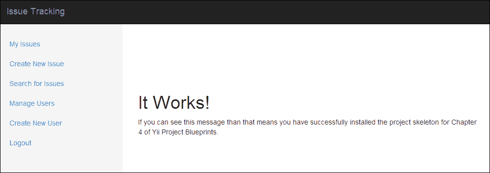
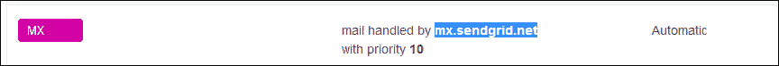
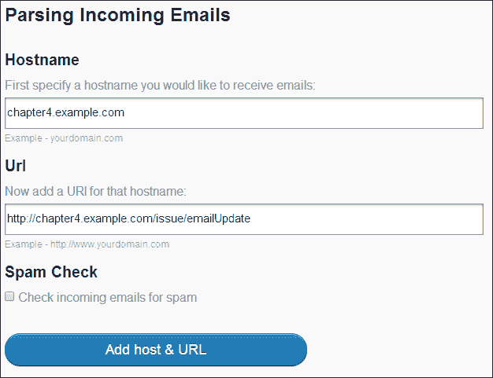

# 第四章。开发问题跟踪应用程序

在前面的章节中，我们研究了非常简单和实用的应用。随着我们继续前进，我们的应用将变得更加复杂和精细。对于我们接下来的项目，我们将开发一个问题跟踪系统，该系统将允许客户报告问题，并使我们能够从单一应用程序中管理这些用户和问题。在这个应用程序中，我们还将提供通过电子邮件创建和更新问题的支持。最后，我们将扩展我们的用户管理系统，以允许为每个用户分配角色。

在本章中，我们将涵盖以下主题：

+   创建用户管理界面

+   添加基于角色的授权

+   从 Yii 应用程序发送和接收电子邮件

+   将第三方库和工具集成到我们的应用程序中

# 先决条件

在我们开始之前，有一些事情我们需要设置并运行：

+   由于我们将从我们的应用程序发送和接收电子邮件，我们需要一个注册并活跃的域名。如果您还没有一个正在工作的域名，您可以从域名注册商那里购买一个，例如 [www.namecheap.com](http://www.namecheap.com)，[www.name.com](http://www.name.com)，或 [www.gandi.net](http://www.gandi.net)。

+   我们还需要能够修改该域名的域名系统（DNS）记录。为了我们的应用程序能够接收电子邮件，我们需要能够修改我们域名的 DNS 记录。大多数注册商提供基本的 DNS 管理系统。如果您的注册商没有，您可以使用免费的 DNS 托管服务，例如 [www.cloudflare.com](http://www.cloudflare.com) 或 [`www.rackspace.com/cloud/dns`](http://www.rackspace.com/cloud/dns)。

+   接下来，您需要一个具有公开 IP 地址的 Web 服务器。这将允许电子邮件发送到我们的应用程序。许多云**虚拟专用服务器**（**VPS**）提供商以低月费或时费提供使用。这些服务包括 [www.digitalocean.com](http://www.digitalocean.com)，[www.linode.com](http://www.linode.com)，以及 [`www.rackspace.com/cloud/servers`](http://www.rackspace.com/cloud/servers)。

+   我们不必创建、配置和维护自己的电子邮件服务器和 SMTP 中继，我们可以利用第三方工具和库。这将使我们能够专注于应用程序的开发，而不是次要服务的维护。使用这项服务和其伴随的 PHP 库，我们可以利用已经经过彻底测试和审查的代码，这使我们作为开发者能够直接进入编码。为了利用 SendGrid，我们将创建一个免费的 SendGrid 开发者账户，该账户可以在 [`www.sendgrid.com/developers`](https://www.sendgrid.com/developers) 上设置。目前，只需设置您的账户。在章节的后面部分，我们将介绍如何设置我们的应用程序以接收来自该服务的电子邮件。

+   在本章中，我们还将使用最新的 MySQL 版本（在撰写本文时为 MySQL 5.6）。请确保你的 MySQL 服务器已经设置并运行在你的服务器上。

+   最后，我们需要从[`getcomposer.org/`](https://getcomposer.org/)下载并安装 Composer。

一旦你获得了前面步骤中列出的所有内容，在你的域名上创建一个子域名，并将其指向你的服务器。在本章中，我将使用`chapter4.example.com`来指代这个子域名。在一切设置完毕并且你的服务器对该域名做出响应后，我们就可以开始了。

# 描述项目

我们的问题跟踪项目可以分为以下三个主要组成部分：

+   将创建和响应问题的用户

+   可以由最终用户或支持者（一种将支持我们的最终用户的特定类型的用户）更新的问题

+   SendGrid 可以 POST 任何我们可能收到的电子邮件的公开可用端点

## 用户

我们应用程序的第一个组成部分是将会使用它的用户。对于这个应用程序，我们将使用与我们在第三章中相同的数据库结构，即“计划提醒”，并增加一个名为`role_id`的新列，这将允许我们区分用户在我们应用程序中的位置。对于这个应用程序，我们将扩展我们的登录过程，以确保用户的角色可供我们在应用程序中引用和操作。

### 角色

而不是有一个能够管理我们系统的单个管理员，在这个应用程序中，我们可以有多个用户，我们可以提升或降低他们在我们应用程序中的不同角色。我们与用户关联的角色将允许我们确定该角色的用户在我们应用程序中可以做什么。

对于这个应用程序，我们将支持三个基本角色：一个提交问题和更新的客户，一个拥有与客户相同权限并且能够更新属于其他客户的问题的支持者，以及一个拥有与支持者相同权限并且可以管理其他用户角色的管理员。

为了存储这些信息，我们将在数据库设置中使用一个简单的角色表，如下所示。然后我们将设置用户和角色之间的关系，以便这些信息自动与我们的用户关联。

```php
ID INTEGER PRIMARY KEY
name STRING
created INTEGER
updated INTEGER
```

## 问题

我们应用程序的第二个组成部分是用户将创建的问题。问题是一个可以创建于应用程序内部或通过向我们的应用程序发送电子邮件从外部创建的项目。问题也可以从应用程序内部或通过客户发送的电子邮件进行更新。问题还将有一个与之关联的状态，这将帮助我们的支持者跟踪特定问题的当前项目。我们将使用的数据库将如下所示：

```php
ID INTEGER PRIMARY KEY
customer_id INTEGER FK
title STRING
description TEXT
status_id INTEGER FK
created INTEGER
updated INTEGER
```

### 状态

每个问题都将有一个唯一的状态。这些状态将允许我们的支持者跟踪问题的项目，并允许我们在问题从一个状态变为另一个状态时触发特定事件。我们用于这些记录的表将与我们的角色表相同：

```php
ID INTEGER PRIMARY KEY
name STRING
created INTEGER
updated INTEGER
```

### 更新

每个问题都与一个更新相关联。每个问题可以有一个或多个更新附加到它们，这将允许支持者看到对特定问题所做的工作，并作为用户与我们支持者沟通的媒介。每个更新都将与一个用户和一个问题相关联。我们用于此信息的数据库表将如下所示：

```php
ID INTEGER PRIMARY KEY
issue_id INTEGER FK
author_id INTEGER FK
update TEXT
created INTEGER
updated INTEGER
```

## 接收电子邮件

我们应用程序的最后一个组件将允许客户通过电子邮件创建新问题并更新现有问题。对于最终用户来说，这个过程将感觉无缝，同时它将允许我们的支持者跟踪特定问题的工作和更新。此自定义端点还将允许我们在应用程序中无缝创建新用户，并在必要时将信息与这些用户关联。

# 初始化项目

到现在为止，您应该已经熟悉了从头创建项目。为了提供一个共同起点，本章的项目资源中包含了一个骨架项目。此骨架项目包括必要的迁移、数据文件、控制器和视图，以帮助我们开始。还包括我们将用于本章整个章节的登录系统。

我们将首先将章节资源中包含的骨架项目复制到我们的 Web 服务器上，并按照章节开头概述的配置，使其响应`chapter4.example.com`，然后按照以下步骤进行，以确保一切设置正确：

1.  由于提供了一个骨架项目，请首先调整`index.php`中的 Yii 框架路径，使其指向您的 Yii 安装路径。在此阶段，您还希望调整`assets`和`protected/runtime`文件夹的权限。

1.  接下来，创建我们的应用程序将使用的 MySQL 用户和数据库表。如果您不想修改提供的默认配置文件，以下 MySQL 命令将为您创建数据库和用户：

    ```php
    CREATE USER 'ch4_issue'@'localhost' IDENTIFIED BY 'ch4_issue';
    CREATE DATABASE IF NOT EXISTS  `ch4_issue` ;
    GRANT ALL PRIVILEGES ON  `ch4\_issue` . * TO  'ch4_issue'@'localhost';
    FLUSH PRIVILEGES;
    ```

1.  接下来，我们需要运行初始迁移，然后导入`protected/data`文件夹中提供的示例数据。这些示例数据将使我们能够在应用程序运行后立即登录并开始使用它。导航到项目根目录，然后运行以下命令：

    ```php
    php protected/yiic.php migrate up --interactive=0
    mysql –u ch4_issue –p ch4_issue < protected/data/combined.sql

    ```

1.  我们需要在`protected/config/`中的`params.php`更新我们的 SendGrid 信息。您的用户名和密码将与您的 SendGrid 用户名和密码相对应。按照我们的示例域名，将发件人地址设置为`noreply@chapter4.example.com`。

1.  最后，我们需要安装必要的 composer 依赖项：

    ```php
    composer install

    ```

执行这些步骤后，您应该能够在浏览器中导航到`chapter4.example.com`，并看到我们的应用程序的登录页面。在登录到我们的应用程序并使用本段之后表格中提供的凭证之一后，您应该看到表格之后的页面加载：

| 用户名 | 密码 |
| --- | --- |
| `customer@example.com` | `test` |
| `supporter@example.com` | `test` |
| `admin@example.com` | `test` |



# 管理用户

在我们开始处理问题之前，我们首先需要确保用户可以从我们的应用程序中创建和管理。在第三章“计划提醒”中，我们使用命令行工具来完成这个任务。在本章中，我们将从 Web 界面创建一个完整的管理工具，以补充该工具。

## 角色和认证

在我们开始管理用户之前，让我们看看在我们的应用程序中如何处理认证和角色。在骨架应用程序提供的`UserController`和`IssueController`中有一个更复杂的`accessRules()`方法，它添加了一个新属性。让我们看看`UserController`中的这个方法：

```php
public function accessRules()
{
   return array(
      array('allow',
         'actions' => array('search', 'view'),
         'users'=>array('@'),
         'expression' => 'Yii::app()->user->role>=2'
      ),
      array('allow',
         'actions' => array('index', 'save', 'delete'),
         'users'=>array('@'),
         'expression' => 'Yii::app()->user->role==3'
      ),
      array('deny',  // deny all users
         'users'=>array('*'),
      ),
   );
}
```

如您所见，我们现在在这个方法中列出了一个名为`expression`的新属性。在内部，Yii 将评估这个表达式为一个布尔值。如果该表达式解析为 true，并且操作和用户条件匹配，则允许用户继续执行操作。在我们的情况下，我们正在检查`Yii::app()->user->role`是否具有特定的值。

默认情况下，Yii 不知道该值应该是多少，除非我们定义它，否则它将是未定义的。由于`Yii::app()->user`是一个`CWebUser`对象，我们可以在创建`UserIdentity`组件时向其添加额外的信息。如果我们查看项目提供的`UserIdentity`组件，我们可以看到这个属性是通过`CUserIdentity setState()`方法添加的：

```php
public function authenticate()
{
   $record = User::model()->findByAttributes(array('email'=>$this->username));

   if ($record == NULL)
      $this->errorCode = self::ERROR_UNKNOWN_IDENTITY;
   else if (password_verify($this->password, $record->password))
   {
      $this->errorCode = self::ERROR_NONE;
      $this->_id 		 = $record->id;
      $this->setState('email', $record->email);
      $this->setState('role', $record->role_id);
   }
   else
      $this->errorCode = self::ERROR_UNKNOWN_IDENTITY;

   return !$this->errorCode;
}
```

用户登录后，Yii 将把此信息存储在我们的`$_SESSION`变量中，允许我们在会话活跃期间引用它。

### 注意

虽然使用简单的布尔表达式很容易，但如果我们想更改哪些用户可以访问我们的系统，我们就必须重构我们的控制器方法，而不是数据库中的数据。相反，可以考虑创建一个模型方法，例如`User::isSupporter()`或`User::isAdmin()`。这些方法使谁有权访问我们的操作更加清晰，并将使您的应用程序在未来更容易维护。

## 列出用户

现在我们已经了解了在我们的应用程序中角色是如何工作的，让我们开始构建我们的`UserController`控制器方法。打开`protected/controllers/UserController.php`，您可以看到我们已经为将要实现的方法提供了定义。

要显示用户列表，我们将在控制器中使用 `User::search()` 方法，并在视图中使用 `CGridView` 小部件：

```php
public function actionIndex()
{
   $users = new User('search');
   $users->unsetAttributes();

   if (isset($_GET['User']))
      $users->attributes = $_GET['Users'];

   $this->render('index', array(
      'model' => $users
   ));
}
```

在 `views/user/` 的 `index.php` 文件中，我们将加载一个 `CGridView` 实例：

```php
<h3>Manage Users</h3>
<?php $this->widget('zii.widgets.grid.CGridView', array(
   'itemsCssClass' => 'table table-striped',
   'enableSorting' => true,
   'dataProvider'  =>$model->search(),
    'columns' => array(
        'id',
        'email',
        'name',
       array(
            'class'=>'CButtonColumn',
            'template' => '{view}{update}{delete}',
            'viewButtonOptions' => array(
                'class' => 'fa fa-search'
            ),
            'viewButtonLabel' => false,
            'viewButtonImageUrl' => false,
            'viewButtonUrl' => 'Yii::app()->createUrl("user/view", array("id" => "$data->id"))',
            'updateButtonOptions' => array(
               'class' => 'fa fa-pencil'
            ),
            'updateButtonLabel' => false,
            'updateButtonImageUrl' => false,
            'updateButtonUrl' => 'Yii::app()->createUrl("user/save", array("id" => "$data->id"))',
            'deleteButtonOptions' => array(
                'class' => 'fa fa-trash-o'
            ),
            'deleteButtonLabel' => false,
            'deleteButtonImageUrl' => false,
            'deleteButtonUrl' => 'Yii::app()->createUrl("user/delete", array("id" => "$data->id"))'
        ),
    )
));
```

在我们的 `CGridView` 实例的列属性中，我们定义了一个名为 `CButtonColumn` 的自定义列。`CButtonColumn` 允许我们在 `CGridView` 实例中添加一系列有用的按钮，例如查看按钮、更新按钮和删除按钮，并包含所有必要的 JavaScript。通过利用这个列，我们现在可以快速从我们的视图中访问这些操作。

### 注意

你可以在其 Yii 类参考页面了解更多关于 `CButtonColumn` 的信息，页面地址为 [`www.yiiframework.com/doc/api/1.1/CButtonColumn`](http://www.yiiframework.com/doc/api/1.1/CButtonColumn).

## 删除用户

接下来，我们应该实现一个 `actionDelete()` 方法来处理我们的删除按钮。为了简化操作，我们可以添加一个有用的 `loadModel()` 方法来为我们执行所有必要的检查。查看以下代码：

```php
public function actionDelete($id=NULL)
{
   if ($id == Yii::app()->user->id)
      throw new CHttpException(403, 'You cannot delete yourself');

   $user = $this->loadModel($id);

   if ($user->delete())
      $this->redirect($this->createUrl('user/index'));

   throw new CHttpException(400, 'Bad Request');
}

private function loadModel($id=NULL)
{
   if ($id == NULL)
      throw new CHttpException(400, 'Missing ID');

   $model = User::model()->findByPk($id);

   if ($model == NULL)
      throw new CHttpException(404, 'No user with that ID could be found');

   return $model;
}
```

## 创建和更新用户

接下来，我们可以创建一个 `actionSave()` 方法来处理创建和更新用户。由于我们的视图将传递给我们所有需要的信息，我们使用简单的 `$user->save()` 调用来保存我们的信息。查看以下代码：

```php
public function actionSave($id=NULL)
{
   if ($id == NULL)
      $user = new User;
   else
      $user = $this->loadModel($id);

   if (isset($_POST['User']))
   {
      $user->attributes = $_POST['User'];

      try
      {
         if ($user->save())
         {
            Yii::app()->user->setFlash('success', 'The user has sucessfully been updated');
            $this->redirect($this->createUrl('user/save', array('id' => $user->id)));
         }
      } catch (Exception $e) {
         $user->addError('email', 'A user with that email address already exists');
      }
   }

   $this->render('save', array(
      'model' => $user
   ));
}
```

在这个操作中，我们还故意在 `save` 方法周围添加了一个 `try`/`catch` 块。我们这样做是因为我们在数据库的 `email` 字段上设置了一个唯一索引约束。如果我们尝试将两个具有相同电子邮件的用户保存到我们的数据库中，由于 Yii 不知道如何处理约束，它将抛出一个内部错误。在我们的控制器中，我们可以捕获这个错误，并通过在视图中使用 `$user->addError()` 方法，在 `$form->errorSummary($model)` 中向用户返回一个更友好的错误信息。

然后，将项目资源文件夹中的 `view/user/save.php` 文件复制到你的项目中。在我们的视图中，我们可以使用 `CHtml::listData()` 来填充一个下拉选择框，显示我们数据库中当前所有的角色。使用这种方法，我们可以在未来无需修改视图的情况下向数据库中添加新的角色：

```php
CHtml::listData(Role::model()->findAll(), 'id', 'name');
```

## 查看用户和相关问题

最后，我们应该创建一个视图来显示特定用户及其当前分配的所有未解决问题的详细信息。对于我们的 `actionView()` 方法，添加以下代码：

```php
public function actionView($id=NULL)
{
    $user = $this->loadModel($id);
    $issues = new Issue('search');
    $issues->unsetAttributes();

    if(isset($_GET['Issue']))
        $issues->attributes=$_GET['Issue'];
    $issues->status_id = '<5';

    $issues->customer_id = $user->id;

    $this->render('view', array(
       'user' 	 => $user,
      'issues' => $issues
   ));
}
```

然后，将 `views/user/` 中的 `view.php` 文件从项目资源文件夹复制到我们的项目中，并打开它。在文件的底部，你会看到一个 `renderPartial()` 调用，用于渲染我们尚未创建的视图：

```php
<?php $this->renderPartial('//issue/issues', array('model' => $issues)); ?>
```

### 注意

在 Yii 中，布局前的 `//` 注释表示 Yii 应该在主应用程序的 `views` 文件夹中搜索视图文件。你可以在 [`www.yiiframework.com/doc/api/1.1/CController#getLayoutFile-detail`](http://www.yiiframework.com/doc/api/1.1/CController#getLayoutFile-detail) 了解更多关于 Yii 加载视图文件的信息。

我们将在整个应用程序中使用这个视图文件，以确保所有列表看起来一致。在继续之前，让我们创建这个问题视图。在 `views/issues/issue.php` 中创建一个新文件，并添加以下 `CGridView` 小部件：

```php
<?php $this->widget('zii.widgets.grid.CGridView', array(
   'itemsCssClass' => 'table table-striped',
   'enableSorting' => true,
    'dataProvider'=>$model->search(),
    'columns' => array(
       'id',
       'customer_id' => array(
          'name' => 'Customer',
          'value' => '$data->customer->name'
       ),
       'title',
        'status_id' => array(
            'name' => 'Status',
            'value' => '$data->status->name'
        ),
       'updated' => array(
          'name' => 'Last Updated',
          'value' => 'date("F m, Y @ H:i", $data->updated) . " UTC"'
       ),
       array(
            'class'=>'CButtonColumn',
            'template' => '{update}',
            'updateButtonOptions' => array(
            	'class' => 'fa fa-pencil'
            ),
            'updateButtonLabel' => false,
            'updateButtonImageUrl' => false
        ),
    )
));
```

虽然我们的视图现在可以渲染，但我们数据库中还没有任何问题可以显示，因此不会显示结果。一旦我们添加了问题，我们就可以回到这个视图来查看与用户相关联的所有问题。

# 实现问题管理组件

我们应用程序的核心是用户将提交的问题。对于这个应用程序，我们将假设用户将为自己提交新问题，支持者将支持这些问题。为了确保只为登录用户创建问题，我们必须对我们的问题模型进行一些更改。打开 `protected/models/Issues.php`，让我们开始吧。

## 问题模型

在我们的骨架模型顶部提供了属性，这些属性将帮助我们稍后在模型中使用：

```php
   private $_isNewRecord = false;
   public  $_isEmailCreate = false;
```

第一个属性 `$_isNewRecord` 是一个布尔值，我们将在 `afterSave()` 方法中使用它来决定发送什么电子邮件。虽然 `CActiveRecord` 提供了一个名为 `$isNewRecord` 的属性，但 Yii 在 `afterSave()` 方法之前将此值更改为 FALSE。

第二个属性 `$_isEmailCreate` 也是一个布尔值。由于我们收到的电子邮件不会有与之关联的会话，我们需要知道将问题关联给哪个用户。由于我们将限制问题的所有者为当前登录用户，我们需要一种方法来覆盖电子邮件提交的行为。

在验证这些属性已添加后，我们可以开始工作于需要添加到该模型的其他方法：

1.  我们在 Issue 模型中需要实现的第一种方法是 `beforeSave()` 方法，以限制问题的客户。在这个方法中，我们还想将新问题的状态设置为 `New`，并标记我们的 `$_isNewRecord` 属性，以便我们可以在 `afterSave()` 方法中使用它。此外，我们还想防止对 `customer_id` 的意外更改，如果它在现有问题中意外更改：

    ```php
    public function beforeSave()
    {
       if ($this->isNewRecord)
       {
          // If this is a new issue, set the customer_id to be the currently logged in user
          if (!$this->_isEmailCreate)
             $this->customer_id = Yii::app()->user->id;

          // And set the status to 'New'
          $this->status_id = 1;

          // Set IsNewRecord so that afterSave can pick this up
          $this->_isNewRecord = true;
       }
       else // Otherwise reset the customer_id back to what it previously was (prevent it from being changed)
          $this->customer_id = $this->_oldAttributes['customer_id'];

       return parent::beforeSave();
    }
    ```

1.  接下来，我们需要更新 `afterSave()` 方法，以便向客户发送电子邮件。对于这个模型，如果为他们创建了一个问题或解决了问题的状态，我们将向用户发送电子邮件。为此，我们将使用 SendGrid。在添加此方法之前，请确保您的 `protected/config/` 目录中的 `params.php` 文件包含正确的凭证：

    ```php
    public function afterSave()
    {
       $user = User::model()->findByPk($this->customer_id);
       $sendgrid = new SendGrid(Yii::app()->params['sendgrid']['username'], Yii::app()->params['sendgrid']['password']);
       $email    = new SendGrid\Email();
       $email->setFrom(Yii::app()->params['sendgrid']['from'])
            ->addTo($user->email);

       if ($this->_isNewRecord)
       {
          $email->setSubject("[Issue #$this->id] $this->subject | A New Issue Has Been Created For You")
               ->setText('Issue has been created')
               ->setHtml(Yii::app()->controller->renderPartial('//email/created', array('issue' => $this, 'user' => $user), true));

          // Send the SendGrid email
          $sendgrid->send($email);
       }
       else
       {
          if ($this->status_id == 5 && $this->_oldAttributes['status'] != 5)
          {
             $email->addTo($user->email)
               ->setSubject("[Issue #$this->id] Issue has been resolved")
               ->setText('Issue has been resolved')
               ->setHtml(Yii::app()->controller->renderPartial('//email/resolved', array('issue' => $this, 'user' => $user), true));

             // Send the SendGrid email
             $sendgrid->send($email);
          }
       }

       return parent::afterSave();
    }
    ```

1.  我们需要对 Issue 模型进行的最后一个更改是在 `search()` 方法中。理想情况下，我们希望我们的支持者能够通过问题的 ID 或标题或描述中的关键字来搜索问题。为此，我们可以简单地重用 `Issue::search()` 方法，通过更改 `$criteria->compare()` 调用这两个属性来使用 `$criteria->addSearchCondition()`：

    ```php
    $criteria->addSearchCondition('title',$this->title,true, 'OR');
    $criteria->addSearchCondition('description',$this->title,true, 'OR');
    ```

## 问题更新模型

在开始工作于 `IssueController` 之前，我们还需要对我们的 `protected/models/Update.php` 模型进行一些更改。这些更改将允许我们自动将正确的所有者分配给更新，并帮助我们向用户发送在议题中添加更新时的电子邮件。

再次在我们的模型中，我们有一个属性，我们可以用它来确定这个更新是否来自电子邮件：

```php
public $isEmailUpdate = false;
```

在这个模型中，我们使用这个属性来确定是否应该向用户发送电子邮件，因为我们不应该通知用户他们提交的更新。

此外，我们还需要对我们的模型方法进行两项更新：

1.  我们需要对模型进行的第一次更新是在 `beforeSave()` 方法中。如果用户已登录，该更新的作者应分配给该用户。请查看以下代码：

    ```php
    public function beforeSave()
    {
       // Allow the author_id to be set, but reset it to the logged in user->id if it isn't set
       if ($this->author_id == NULL)
          $this->author_id = Yii::app()->user->id;

       if ($this->update == '')
          return false;

       return parent::beforeSave();
    }
    ```

1.  然后，我们应该更新我们的 `afterSave()` 方法，以便在适当的实例中向用户发送电子邮件：

    ```php
    public function afterSave()
    {
       // If the issue was created by the currently logged in user, or this is an email update, don't send an email
       $issue = Issue::model()->findByPk($this->issue_id);

       // Don't send an email if the customer provides an update, if this came from email, or the status of the issue is resolved
       if ($issue->customer_id == Yii::app()->user->id || $this->isEmailUpdate || $issue->status_id == 5)
          return parent::afterSave();

       // If this is a NEW issue, send the user an email with the detais
       $user = User::model()->findByPk($issue->customer_id);

       // Init the SendGrid object and the Email Object
       $sendgrid = new SendGrid(Yii::app()->params['sendgrid']['username'], Yii::app()->params['sendgrid']['password']);
       $email    = new SendGrid\Email();

       $email->setFrom(Yii::app()->params['sendgrid']['from'])
            ->addTo($user->email)
            ->setSubject("[Issue #$issue->id] $this->subject | Issue has been updated")
            ->setText('Issue has been updated')
            ->setHtml(Yii::app()->controller->renderPartial('//email/updated', array('issue' => $issue, 'update' => $this, 'user' => $user), true));

       $sendgrid->send($email);

       return parent::afterSave();
    }
    ```

## 显示属于用户的议题

完成我们对模型的更新后，现在我们可以开始工作于 `IssueController`。我们应该实现的第一种方法是 `actionIndex()`，它将向登录用户展示所有当前分配给他们的未解决事项：

```php
public function actionIndex()
{
    $issues = new Issue('search');
    $issues->unsetAttributes();

    if(isset($_GET['Issue']))
        $issues->attributes=$_GET['Issue'];

    // Don't search resolved issues
    $issues->status_id = '<5';

    $issues->customer_id = Yii::app()->user->id;

    $this->render('index', array(
      'issues' => $issues
   ));
}
```

然后，在我们的 `index.php` 文件 `views/issue/` 中，我们可以重用我们之前创建的局部视图来显示所有这些议题：

```php
<h3>My Issues</h3>
<?php $this->renderPartial('issues', array('model' => $issues)); ?>
```

## 搜索议题

我们需要实现的下一个方法是 `actionSearch()` 方法，它将允许我们通过议题 ID 或标题或描述中的关键词来搜索议题。为此，我们将创建一个搜索视图，该视图将带有搜索参数发送到我们的动作。如果那个 `$_GET` 参数是数字的，并且我们可以找到具有该 ID 的议题，我们将立即重定向到它。否则，我们将使用我们之前修改过的 `Issue::search()` 方法来搜索数据库中的所有议题。我们的控制器动作将如下所示：

```php
public function actionSearch()
{
   $issues = new Issue('search');
   $issues->status_id = '<5';

   if (isset($_GET['issue']))
   {
      if (is_numeric($_GET['issue']))
      {
         $issue = Issue::model()->findByPk($_GET['issue']);
         if ($issue != NULL)
            $this->redirect($this->createUrl('issue/update', array('id' => $issue->id)));
      }

      $issues->title = $_GET['issue'];
      $issues->description = $_GET['issue'];
   }

   $this->render('search', array(
      'issues' => $issues
   ));
}
```

然后，我们的 `search.php` 文件在 `views/issue/` 下的样子如下：

```php
<h3>Search for Issues</h3>
<?php $form=$this->beginWidget('CActiveForm', array(
   'id'=>'project-form',
   'method' => 'get',
   'htmlOptions' => array(
      'class' => 'form-horizontal',
      'role' => 'form',
   )
)); ?>
   <p>Search for issues...</p>
   <div class="form-group">
      <?php echo CHtml::textField('issue', isset($_GET['issue']) ? $_GET['issue'] : NULL, array('class' => 'form-control', 'placeholder' => 'Search for Issues by ID, Title, or Description...')); ?>
   </div>
   <div class="row buttons">
      <?php echo CHtml::submitButton('Search', array('class' => 'btn btn-primary pull-right col-md-offset-1')); ?>
   </div>
<?php $this->endWidget(); ?>

<?php if ($issues != NULL): ?>
   <?php $this->renderPartial('issues', array('model' => $issues)); ?>
<?php endif; ?>
```

## 创建事项

接下来，我们需要实现一个创建新议题的动作和视图。由于新议题不会有相关的更新，创建和更新动作需要分开。对于 `actionCreate()` 方法，我们将简单地从 `$_POST` 参数中填充值：

```php
public function actionCreate()
{
   $issue = new Issue;
   if (isset($_POST['Issue']))
   {
      $issue->attributes = $_POST['Issue'];

      if ($issue->save())
      {
         Yii::app()->user->setFlash('success', "Issue #{$issue->id} has successfully been created");
         $this->redirect($this->createUrl('issue/update', array('id' => $issue->id)));
      }
   }

   $this->render('create', array(
      'model' => $issue
   ));
}
```

然后，将位于 `views/issue/` 下的 `create.php` 文件从我们的项目资源文件夹复制到你的项目中。

在这个控制器动作中，还有一个对我们 `CWebUser` 对象的引用。在之前的章节中，每次我们从控制器更改数据库项时，我们不是重新加载页面就是重定向到新页面。为了使我们的应用程序更友好，我们可以设置只显示一次的闪存消息。为了设置这些消息，我们将使用 `CWebUser` 对象的 `setFlash()` 方法：

```php
Yii::app()->user->setFlash($key, $value);
```

然后，从我们的视图中，我们可以使用 `hasFlash()` 来查看是否存在特定键的闪存消息：

```php
Yii::app()->user->hasFlash($key);
```

然后，使用`getFlash()`显示该闪存消息：

```php
Yii::app()->user->getFlash($key);
```

或者，如果我们不想在特定视图中查找闪存消息，我们可以告诉布局查找所有闪存消息并将它们显示出来。查看以下代码：

```php
foreach (Yii::app()->user->getFlashes() as $key => $message)
   echo '<div class="flash-' . $key . '">' . $message . "</div>";
```

## 查看和更新问题

现在我们能够创建和查找问题，我们需要能够查看和更新它们。为此操作，我们将合并这两个功能到单个操作中。因为不同角色的用户将访问此操作，我们需要调整它，以便特定角色的用户只能执行某些任务：

1.  首先，我们应该生成一个`loadModel()`方法：

    ```php
    private function loadModel($id=NULL)
    {
       if ($id == NULL)
          throw new CHttpException(400, 'Missing ID');

       $model = Issue::model()->findByPk($id);

       if ($model == NULL)
          throw new CHttpException(404, 'No issue with that ID was found');

       return $model;
    }
    ```

1.  然后，我们需要创建`actionUpdate()`函数。我们将从加载具有该 ID 的模型并创建一个新的`Update`对象开始，以防通过`$_POST`发送更新：

    ```php
    public function actionUpdate($id=NULL)
    {
       // Load the necessary models
       $issue = $this->loadModel($id);
       $update = new Update;
       $update->update = NULL;
       $customer_id = $issue->customer_id;
    ```

1.  然后，我们应该确保只有管理员、支持者或问题所有者可以查看问题。查看以下代码：

    ```php
    if (Yii::app()->user->role == 1)
    {
       if (Yii::app()->user->id != $customer_id)
          throw new CHttpException(403, 'You do not have permission to view this issue');
    }
    ```

1.  然后，我们应该允许管理员和支持者修改`Issue`对象本身，如下所示：

    ```php
    if (Yii::app()->user->role >= 2)
    {
       if (isset($_POST['Issue']))
       {
          $issue->attributes = $_POST['Issue'];
          if ($issue->save())
             Yii::app()->user->setFlash('success', "Issue #{$issue->id} has successfully been updated");
       }
    }
    ```

1.  然后，允许任何用户提交更新，如下所示：

    ```php
    if (isset($_POST['Update']))
    {
       $update->issue_id = $issue->id;
       $update->update = $_POST['Update']['update'];
       if ($update->save())
       {
          Yii::app()->user->setFlash('success', "Issue #{$issue->id} has successfully been updated");
          $this->redirect($this->createUrl('issue/update', array('id' => $issue->id)));
       }
    }
    ```

1.  最后，我们应该渲染视图。在渲染视图时，我们还将传递一个`CMarkdownParser`对象。以 Markdown 语法渲染问题更新将使我们能够轻松访问许多不同的格式化功能，例如换行、文本样式和引用功能。以 Markdown 格式渲染更新还将保护我们免受简单的 XSS 攻击，例如 JavaScript 注入尝试：

    ```php
       $this->render('update', array(
          'issue' => $issue,
          'update' => $update,
          'md' => new CMarkdownParser
       ));
    }
    ```

### 注意

您可以在[`daringfireball.net/projects/markdown/`](http://daringfireball.net/projects/markdown/)了解更多关于 Markdown 语法以及如何使用 Markdown 的信息。

最后，我们将创建一个更新视图，使我们能够从不同的角色查看问题和更新。将位于`view/issue/`的`update.php`视图从项目资源文件夹复制到您的项目中。

## 电子邮件视图

在我们开始使用应用程序之前，我们需要创建三个不同的电子邮件视图，一个用于将发送给用户的每种类型的电子邮件。这些视图将包含有关问题本身的信息以及对其应用了哪些更改的信息。它还将包含特殊的格式化，使用户能够回复该电子邮件，并使我们能够理解哪些电子邮件部分应包含在更新中：

1.  我们应该创建的第一个视图是创建视图。此视图将包含有关新创建的问题的信息。它还将包含一个特殊标记，我们的应用程序将能够识别，以便只包含用户的响应。在`views/email/created.php`中创建一个新文件，并添加以下代码：

    ```php
    --------------- DO NOT EDIT BELOW THIS LINE ---------------
    <div class="email">
       Hello <?php echo $user->name; ?>,<br /><br />

       This is a notification that a new issue (#<?php echo $issue->id; ?>) has been opened for you. A member of our team will review this shortly.<br /><br />

       As a reminder, here is the description of the issue you provided:<br /><br />

       <strong><?php echo $issue->title; ?></strong>
       <blockquote>
          <?php echo $issue->description; ?>
       </blockquote>

       <br /><br />

       To add additional information to this issue, you may either reply to this email, or login <?php echo CHtml::link('here', $this->createAbsoluteUrl('issue/update', array('id' => $issue->id))); ?>.
       <br /><br />

       Thank you,<br />
       Issue Tracking System
    </div>
    ```

1.  然后在`views/email/updated.php`中创建一个更新的视图。这封电子邮件将告知用户他们的问题已更新，并将包含对问题应用更新的内容。同样，它将包含一个特殊标记，以便如果用户回复我们的电子邮件，我们知道在更新中包含哪些内容以及忽略哪些内容：

    ```php
    --------------- DO NOT EDIT BELOW THIS LINE ---------------
    <div class="email">
       Hello <?php echo $user->name; ?>,<br /><br />

       This is a notification that a new issue (#<?php echo $issue->id; ?>) has been updated with the following message:<br /><br />

       <blockquote>
          <?php echo $update->update; ?>
       </blockquote>
       <hr />
       As a reminder, here is the description of the issue you provided:<br /><br />
       <strong><?php echo $issue->title; ?></strong>
       <blockquote>
          <?php echo $issue->description; ?>
       </blockquote>
       <br /><br />
       To reply to this issue you may either reply to this email, or login <?php echo CHtml::link('here', $this->createAbsoluteUrl('issue/update', array('id' => $issue->id))); ?>.
       <br /><br />
       Thank you,<br />
       Issue Tracking System
    </div>
    ```

1.  最后，我们需要创建一个视图来通知用户他们的问题已被解决。在`views/email/`中打开`resolved.php`并添加以下内容：

    ```php
    --------------- DO NOT EDIT BELOW THIS LINE ---------------
    <div class="email">
       Hello <?php echo $user->name; ?>,<br /><br />

       This is a notification that a new issue (#<?php echo $issue->id; ?>) has been resolved.<br /><br />

       Thank you,<br />
       Issue Tracking System
    </div>
    ```

## 测试我们的应用程序

由于域名`example.com`不是一个有效的发送电子邮件的域名，因此为自己创建一个具有有效电子邮件地址的新用户，以该用户身份登录，并创建几个问题。对于您创建的每个问题，都会向您发送一封新电子邮件，通知您问题已被创建。此外，任何支持者或管理员更新问题都会通过电子邮件通知当前的支持者，并提供更新内容。最后，如果您有支持者或管理员解决问题，您将收到一封电子邮件通知您问题已被解决。

一旦您验证了所有功能正常，我们就可以继续使用 SendGrid 处理和解析传入的电子邮件。

# 处理传入电子邮件解析

虽然处理传入电子邮件解析的方法有很多种，但其中最简单的方法之一是将电子邮件发送给第三方，然后由第三方为我们解析内容，并将其作为`$_POST`请求发送到我们应用程序的公开端点。这正是 SendGrid 为我们所做的事情。然而，在我们开始使用 SendGrid 之前，我们需要对我们的域名 DNS 服务器和 SendGrid 账户进行一些更改。

## 发送电子邮件到 SendGrid

为了将我们的电子邮件定向到 SendGrid 以通过，我们首先需要更改我们的 DNS 设置。按照我们的示例域名`chapter4.example.com`，我们首先需要登录到我们的 DNS 主机，并在子域名中添加一个新的邮件交换（MX）记录。具体来说，我们需要添加一个优先级为`10`的 MX 记录到`mx.sendgrid.net`。在大多数 DNS 系统中，该记录如下所示：

```php
chapter4     IN     MX     10     mx.sendgrid.net.
```

或者，如果您使用像 CloudFlare 这样的服务来处理您的 DNS，您的条目可能如下所示：



### 注意

根据您的 DNS 提供商，DNS 设置可能需要 24 到 48 小时才能传播。在离开此步骤之前，请验证 MX 记录是否已添加并传播，可以使用命令行工具，如 DIG 或免费的在线网络工具。

## 调整 SendGrid 解析设置

更新您的 DNS 设置后，您接下来需要更新您的 SendGrid 解析 API 设置，以便 SendGrid 知道将您的电子邮件发送到何处。导航到[www.sendgrid.com/developer/reply](http://www.sendgrid.com/developer/reply)，然后填写以下解析设置页面并提交记录：



添加记录后，你应该在页面底部看到确认信息。一旦完成，你现在可以向`*@chapter4.example.com`发送电子邮件，SendGrid 将解析它并将它转发到我们的`IssueController`的`actionEmailUpdate()`方法。

### 注意

你可以在[`sendgrid.com/docs/API_Reference/Webhooks/parse.html`](http://sendgrid.com/docs/API_Reference/Webhooks/parse.html)了解更多关于 SendGrid 解析 API webhook 的信息。

## 通过电子邮件创建和更新问题

现在我们已经设置了 DNS 设置和 SendGrid 账户，我们需要添加必要的功能来通过电子邮件创建和更新问题。然后，我们创建的操作也将在我们数据库中为创建问题的任何新用户创建新用户：

1.  配置好 SendGrid 后，我们的`actionEmailUpdate()`方法将在有人向我们的应用程序发送电子邮件时收到一个`POST`请求。一旦到达，我们将需要的所有信息都将包含在`$_POST`变量中。然而，其中一些信息可能不容易访问。例如，电子邮件地址将以`"Example User" <test@chapter4.example.com>`的形式到达，这对我们来说并不太有用。为了使这封电子邮件更有用，我们需要在`IssueController`中创建一个实用函数，将信息拆分如下：

    ```php
    private function _parseEmailAddress($raw)
    {
       $name = "";
       $email = trim($raw, " '\"");

       if (preg_match("/^(.*)<(.*)>.*$/", $raw, $matches))
       {
          array_shift($matches);
          $name = trim($matches[0], " '\"");
          $email = trim($matches[1], " '\"");
       }

       return array(
          "name" => $name,
          "email" => $email,
          "full" => $name . " <" . $email . ">"
       );
    }
    ```

1.  然后，在我们的`actionEmailUpdate()`方法中，我们首先将检索以下信息：

    ```php
    $from = $this->_parseEmailAddress($_POST['from']);
       $subject = $_POST['subject'];
    ```

1.  然后，我们需要搜索电子邮件的主题以找到我们问题的 ID。在我们发送的电子邮件中，主题的格式为`[问题编号#<ID>] <info>`。请看以下代码：

    ```php
    $idString = NULL;
    preg_match('/\[Issue #.*?\]/', $subject, $idString);
    $id = str_replace(']', '', str_replace('[Issue #', '', (isset($idString[0]) ? $idString[0] : 0)));
    ```

1.  然后，我们需要在我们的系统中找到具有该电子邮件地址的用户。如果我们无法找到该用户，我们需要使用该电子邮件地址创建一个新用户：

    ```php
    $user = User::model()->findByAttributes(array('email' => $from['email']));

    if ($user == NULL)
    {
       $user = new User;
       $user->attributes = array(
          'name' => $from['name'],
          'email' => $from['email'],
          'password' => 'changeme9',
          'role_id' => 1
       );

       if (!$user->save())
          return true;
    }
    ```

1.  然后，我们需要定位具有该 ID 的问题。如果不存在具有该 ID 的问题，或者该问题不属于我们正在处理的那位用户，我们应该创建一个新的问题，而不是更新现有的问题：

    ```php
    $issue = Issue::model()->findByPk($id);

    // If the user or ID are NULL, or that email address doesn't belong to that customer, Create a new issue
    if ($issue == NULL || $id == NULL || $issue->customer_id != $user->id)
    {
       // create the issue, save it, then return - no further work needs to be done.
       $issue = new Issue;
       $issue->_isEmailCreate = true;

       $issue->attributes = array(
          'title' => $subject,
          'description' => $_POST['text'],
          'customer_id' => $user->id
       );

       $issue->save();
       return true;
    }
    ```

1.  最后，如果我们有一个好的用户和问题，我们应该应用更新。在这个时候，我们将拆分电子邮件的内容，只包括特殊标记之上的内容在我们的更新中。这减少了我们需要存储在数据库中的数据量，并保持我们的界面看起来干净、清晰，没有电子邮件的杂乱。

    ```php
    $body = explode('--------------- DO NOT EDIT BELOW THIS LINE ---------------', $_POST['text']);
    $body = $body[0];

    // Set the update
    $update = new Update;
    $update->author_id = $user->id;
    $update->issue_id = $issue->id;
    $update->update = $body;
    $update->isEmailUpdate = true;

    $update->save();
    return true;
    ```

现在我们应用程序可以接收电子邮件，回复你之前收到的其中一封电子邮件。过一会儿，你将能够导航到该问题，并看到你通过电子邮件发送的更新确实已经应用。或者，你也可以向你的应用程序发送新的电子邮件。过一会儿，将创建一个新的问题，应用程序将通过电子邮件通知你已创建新问题。

# 摘要

在本章中，我们涵盖了大量的内容！我们讨论了如何在应用程序内部创建和管理用户，发送关于特定事件的电子邮件，以及如何接收电子邮件并将这些信息整合到我们的应用程序中。我们还为我们的用户添加了角色，并使我们的应用程序只对具有特定角色的用户的某些操作做出响应。

在继续之前，想想您如何改进这个应用程序，并尝试实现这些改进。例如，您可以将其修改为让模型而不是硬编码的值来回答访问规则表达式。或者，您可以给应用程序添加新的状态，并在这些状态发生变化时发送不同的电子邮件。想想所有可以使这个应用程序对最终用户更易用的方法。

在添加了一些新功能之后，请查阅位于[`www.yiiframework.com/doc/`](http://www.yiiframework.com/doc/)的 Yii 文档，以帮助您更好地理解我们在本章中使用的一些方法和属性。

在下一章中，我们将扩展我们的知识，以实现一个类似于 Twitter 的微型博客平台。在我们的微型博客平台上，我们将为最终用户添加注册和密码重置系统，并允许我们的最终用户管理自己的账户。一旦您准备好了，翻到下一页，准备好深入探索 Yii！
