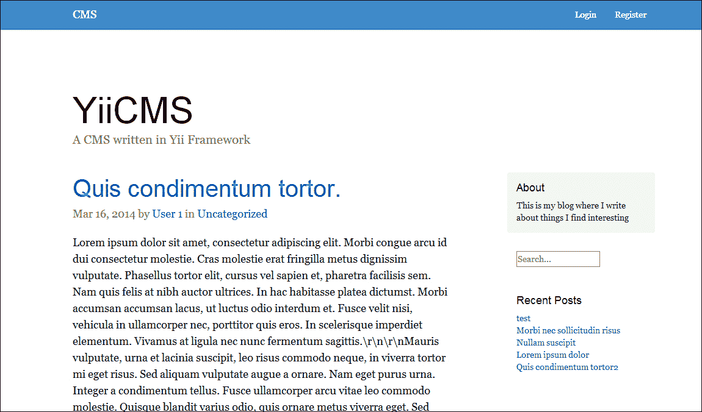
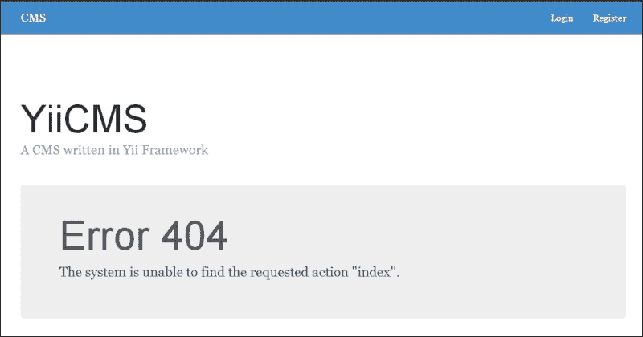
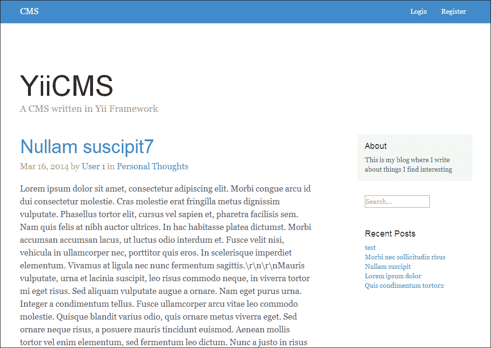
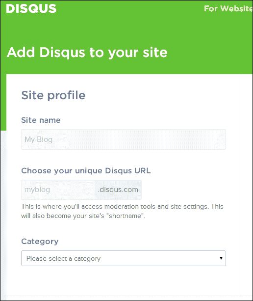
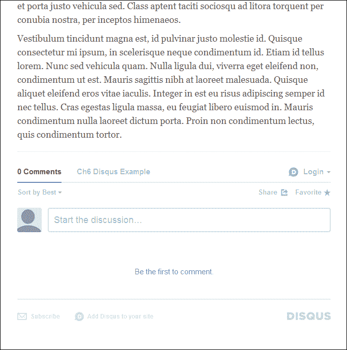
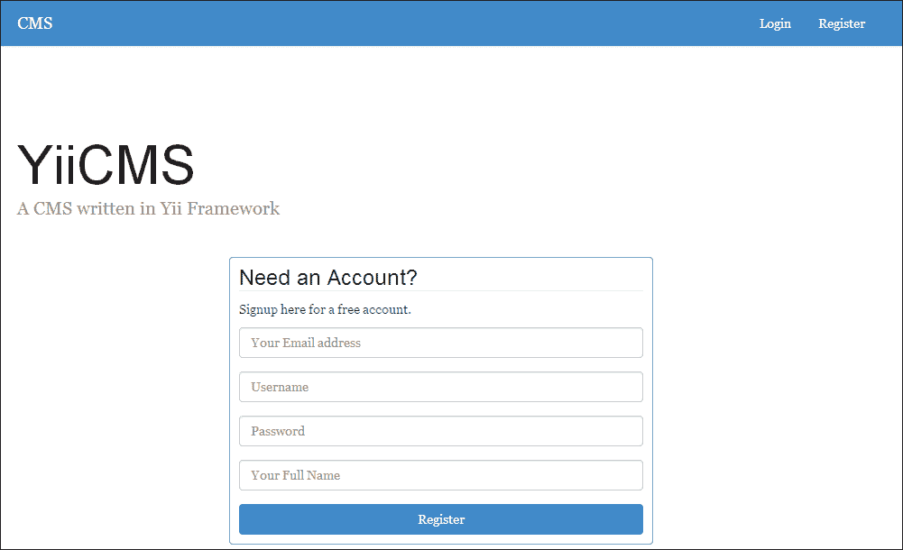
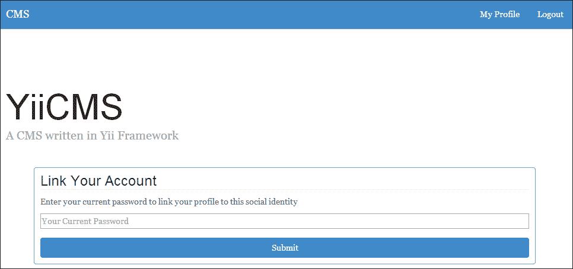

# 第六章. 构建内容管理系统

对于我们的下一个项目，我们将开发一个可扩展的多用户内容管理系统，这将允许我们的用户创建和更新博客文章，并使他们能够对这些博客文章进行评论。除了重新利用我们在以前的应用程序中开发的一些功能外，这个系统还将针对搜索引擎的最佳定位进行优化。此外，这个系统将具有社交登录功能，允许用户从第三方社交网络提供商注册和登录。我们还将探索在我们的应用程序中使用主题，这将使我们能够以最小的努力更改应用程序的表现层。

当我们完成时，我们的 CMS 将如下所示：



# 前提条件

在我们开始之前，有一些事情我们需要设置并使其工作：

+   再次强调，我们需要一个具有公开 IP 地址的 Web 服务器。这将允许将电子邮件发送到我们的应用程序。许多云虚拟专用服务器 (VPS) 提供商都提供低月费或按小时计费的服务。这些服务包括 [`www.digitalocean.com`](https://www.digitalocean.com)、[www.linode.com](http://www.linode.com) 和 [www.rackspace.com/cloud/servers](http://www.rackspace.com/cloud/servers)。

+   为了在我们的应用程序中发送电子邮件，我们再次将利用一个免费的 SendGrid 开发者账户，该账户可以在 [`www.sendgrid.com/developers`](https://www.sendgrid.com/developers) 上设置。

+   在本章中，我们再次将使用最新的 MySQL 版本（在撰写本文时为 MySQL 5.6）。请确保你的 MySQL 服务器已经设置并运行在你的服务器上。

    ### 注意

    你想尝试更具挑战性的内容吗？完成这个项目后，尝试找出你需要对这个应用程序进行哪些更改才能使其与 Postgres 而不是 MySQL 兼容。

+   对于这个项目，我们再次将通过 Composer 管理我们的依赖项，你可以从 [`getcomposer.org/`](https://getcomposer.org/) 下载和安装它。

+   我们还将使用 **Disqus**，这是一个第三方评论系统，我们将将其集成以在我们的网站上显示评论。对于这个项目，你需要注册一个 [`www.disqus.com`](https://www.disqus.com) 的账户。

+   最后，你需要一个 Twitter 开发者账户，可以从 [`dev.twitter.com/`](https://dev.twitter.com/) 获取。这个账户将允许我们通过 Twitter 的 OAuth API 启用我们应用程序的社交登录功能。

一旦你获得了列出的前提条件，在你的域名上创建一个子域名并将其指向你的服务器。在本章中，我将使用 `chapter6.example.com` 来指代这个子域名。在一切设置完毕并且你的服务器对该域名做出响应后，我们就可以开始了。

# 描述项目

我们的 CMS 可以分解为几个不同的组件：

+   负责查看和管理内容的用户

+   要管理的内客

+   我们内容要放入的类别

+   元数据帮助我们进一步定义我们的内容和用户

+   搜索引擎优化

## 用户

我们应用程序的第一个组成部分是用户，他们将执行我们应用程序中的所有任务。对于这个应用程序，我们将大量重用我们在第五章“创建一个微博平台”中扩展的`user`数据库和认证系统。在本章中，我们将通过允许社交认证来增强这一功能。我们的 CMS 将允许用户通过在 Twitter 上注册来注册新账户；注册后，CMS 将允许他们通过在 Twitter 上登录来登录我们的应用程序。

为了让我们能够知道一个用户是否是社交认证用户，我们必须对我们的数据库和认证方案进行一些修改。首先，我们需要一种方式来指示用户是否是社交认证用户。而不是在我们的数据库中硬编码一个`isAuthenticatedViaTwitter`列，我们将创建一个新的数据库表，称为`user_metadata`，它将是一个简单的表，包含用户的 ID、一个唯一键和一个值。这将允许我们存储有关我们用户的其他信息，而无需每次我们想要进行更改时都明确更改我们的用户数据库表：

```php
ID INTEGER PRIMARY KEY
user_id INTEGER
key STRING
value STRING
created INTEGER
updated INTEGER
```

我们还需要修改我们的`UserIdentity`类，以允许社交认证用户登录。为此，我们将扩展这个类来创建一个`RemoteUserIdentity`类，它将使用 Twitter（或任何其他与 HybridAuth 合作的第三方来源）提供给我们的 OAuth 代码，而不是通过用户名和密码进行认证。

## 内容

我们 CMS 的核心是我们将管理的内客。对于这个项目，我们将管理可以附加额外元数据的简单博客帖子。每个帖子将有一个标题、正文、作者、类别、唯一的 URI 或缩略名，以及一个指示它是否已发布的标志。我们这个表的数据库结构将如下所示：

```php
ID INTEGER PRIMARY KEY
title STRING
body TEXT
published INTEGER
author_id INTEGER
category_id INTEGER
slug STRING
created INTEGER
updated INTEGER
```

每个帖子还将有一个或多个元数据列，将进一步描述我们将创建的帖子。我们可以使用这个表（我们将称之为`content_metadata`）来让我们的系统自动为我们存储有关每个帖子的信息，或者我们自己添加信息到我们的帖子中，从而消除每次我们想要向内容添加新属性时都需要不断迁移数据库的需求：

```php
ID INTEGER PRIMARY KEY
content_id INTEGER
key STRING
value STRING
created INTEGER
updated INTEGER
```

## 类别

每个帖子都将与我们的系统中的一个类别相关联。这些类别将帮助我们进一步细化我们的帖子。就像我们的内容一样，每个类别都将有自己的缩略名。在保存帖子或类别之前，我们需要验证缩略名是否已被使用。我们的表结构将如下所示：

```php
ID INTEGER PRIMARY KEY
name STRING
description TEXT
slug STRING
created INTEGER
updated INTEGER
```

## 搜索引擎优化

我们应用程序的最后一个核心组件是对搜索引擎的优化，以便我们的内容可以快速索引。SEO 很重要，因为它增加了我们在搜索引擎和其他营销材料上的可发现性和可用性。在我们的应用程序中，我们将执行一些操作来提高我们的 SEO：

+   我们将添加的第一个 SEO 增强功能是一个`sitemap.xml`文件，我们可以将其提交给流行的搜索引擎以进行索引。搜索引擎可以非常快速地索引我们的`sitemap.xml`文件，这意味着我们的内容将更快地出现在搜索引擎中。

+   我们将添加的第二个增强功能是我们之前讨论过的 slugs。Slugs 允许我们从 URL 直接指示特定帖子是关于什么的。因此，我们不必有像`http://chapter6.example.com/content/post/id/5`这样的 URL，我们可以有像`http://chapter6.example.com/my-awesome-article`这样的 URL。这类 URL 允许搜索引擎和我们的用户在甚至不看内容本身的情况下了解我们的内容，例如当用户在浏览他们的书签或浏览搜索引擎时。

# 初始化项目

为了给我们提供一个共同的起点，本章的项目资源中包含了一个骨架项目。这个骨架项目中包含了必要的迁移、数据文件、控制器和视图，以便我们开始开发。此外，骨架项目中还包含了我们在第五章“创建一个微博平台”中工作的用户认证类。将这个骨架项目复制到您的 Web 服务器上，按照本章开头概述的配置，使其响应`chapter6.example.com`，然后执行以下步骤以确保一切设置正确：

1.  调整`assets`和`protected/runtime`文件夹的权限，以便它们可以被您的 Web 服务器写入。

1.  在本章中，我们将再次使用 MySQL 的最新版本（在撰写本文时为 MySQL 5.6）。请确保您的 MySQL 服务器已在您的服务器上设置并运行。然后，为我们的项目创建一个用户名、密码和数据库名，并相应地更新您的`protected/config/main.php`文件。为了简单起见，您可以使用`ch6_cms`作为每个值。

1.  安装我们的 Composer 依赖项：

    ```php
    Composer install

    ```

1.  运行`migrate`命令并安装我们的模拟数据：

    ```php
    php protected/yiic.php migrate up --interactive=0
    psql ch6_cms -f protected/data/postgres.sql

    ```

1.  最后，将您的 SendGrid 凭据添加到`protected/config/params.php`文件中：

    ```php
    'sendgrid' => array(
    'username' => '<username>',
       'password' => '<password>',
       'from' => 'noreply@ch6.home.erianna.net'
    )
    ```

如果一切加载正确，你应该会看到一个类似于以下内容的 404 页面：



# 探索骨架项目

实际上，在后台有很多不同的操作来使这个工作即使这是一个 404 错误。在我们开始任何开发之前，让我们看看在`protected/components`文件夹中提供的几个类。

## 从通用类扩展模型

我们提供的第一类是一个名为`CMSActiveRecord`的 ActiveRecord 扩展，所有我们的模型都将从此类派生。此类允许我们减少每个类中需要编写的代码量。目前，我们将简单地添加`CTimestampBehavior`和我们在前几章中使用的`afterFind()`方法，以存储在需要比较更改属性与新属性时所需的老属性：

```php
class CMSActiveRecordCMSActiveRecord extends CActiveRecord
{
   public $_oldAttributes = array();

   public function behaviors()
   {
      return array(
         'CTimestampBehavior' => array(
            'class'          => 'zii.behaviors.CTimestampBehavior',
            'createAttribute'    => 'created',
            'updateAttribute'    => 'updated',
            'setUpdateOnCreate' => true
         )
      );
   }

   public function afterFind()
   {
      if ($this !== NULL)
         $this->_oldAttributes = $this->attributes;
      return parent::afterFind();
   }
}
```

## 为别名创建自定义验证器

由于`Content`和`Category`类都有别名，我们需要为每个类添加一个自定义验证器，以确保别名没有被帖子或类别使用。为此，我们有一个名为`CMSSlugActiveRecord`的类，它扩展了`CMSActiveRecord`并具有一个`validateSlug()`方法，我们将按以下方式实现它：

```php
class CMSSLugActiveRecord extends CMSActiveRecord
{
   public function validateSlug($attributes, $params)
   {
      // Fetch any records that have that slug
      $content = Content::model()->findByAttributes(array('slug' => $this->slug));
      $category = Category::model()->findByAttributes(array('slug' => $this->slug));

      $class = strtolower(get_class($this));

      if ($content == NULL && $category == NULL)
         return true;
      else if (($content == NULL && $category != NULL) || ($content != NULL && $category == NULL))
      {
         $this->addError('slug', 'That slug is already in use');
         return false;
      }
      else
      {
         if ($this->id == $$class->id)
            return true;
      }

      $this->addError('slug', 'That slug is already in use');
      return false;
   }
}
```

此实现仅检查数据库中是否存在具有该别名的任何项。如果没有找到，或者当前项是正在修改的项，则验证器将返回 true。否则，它将在`slug`属性中添加一个错误并返回 false。我们的内容模型和类别模型都将从此类扩展。

## 使用主题进行视图管理

与大型应用程序一起工作的最大挑战之一是在不锁定功能到我们的视图中的情况下更改其外观。进一步将我们的业务逻辑与我们的展示逻辑分离的一种方法就是使用主题。在 Yii 中使用主题，我们可以通过利用`Yii::app()->setTheme('themename')`方法简单地动态更改应用程序的展示层。一旦调用此方法，Yii 将查找`themes/themename/views`目录中的视图文件，而不是`protected/views`目录。在本章的其余部分，我们将向位于`themes`文件夹中的自定义主题`main`添加视图。为了全局设置此主题，我们将创建一个名为`CMSController`的自定义类，所有我们的控制器都将从此类扩展。目前，我们的主题名称将硬编码在我们的应用程序中。然而，这个值可以很容易地从数据库中检索，这样我们就可以通过缓存或数据库值动态更改主题，而不是在控制器中更改它。请查看以下代码行：

```php
class CMSController extends CController
{
   public function beforeAction($action)
   {
      Yii::app()->setTheme('main');
      return parent::beforeAction($action);
   }
}
```

### 注意

或者，您可以使用官方文档中概述的`protected/config/main.php`文件中的`theme`属性[`www.yiiframework.com/doc/guide/1.1/en/topics.theming`](http://www.yiiframework.com/doc/guide/1.1/en/topics.theming)。虽然在那里操作主题很简单，但它要求我们的最终用户了解如何操作 PHP 数组。如果您打算允许您的最终用户操作他们网站的主题，建议您通过`Yii::app()->setTheme`从缓存或数据库值以编程方式操作。确保查看文档以获取有关使用主题的更多信息。

## 真正的动态路由

在我们之前的应用程序中，我们有许多长而无聊的 URL，其中包含大量的 ID 和参数。这些 URL 提供了糟糕的用户体验，并阻止搜索引擎和用户一眼就能知道内容是什么，这反过来又会损害我们在许多搜索引擎上的 SEO 排名。为了解决这个问题，我们将对我们的`UrlManager`类进行重大修改，以允许真正的动态路由，这意味着每次我们创建或更新一篇帖子或一个类别时，我们的 URL 规则都将被更新。

### 告诉 Yii 使用我们的自定义 UrlManager

在我们可以开始处理我们的控制器之前，我们需要创建一个自定义的`UrlManager`来处理我们内容的路由，这样我们就可以通过其别名来访问我们的内容。步骤如下：

1.  我们需要做的第一个更改是更新我们的`protected/config/main.php`文件中的`components`部分。这将告诉 Yii 使用哪个类作为`UrlManager`组件：

    ```php
    'urlManager' => array(
             'class'          => 'application.components.CMSUrlManager',
            'urlFormat'      => 'path',
            'showScriptName' => false
    )
    ```

1.  接下来，在我们的`protected/components`文件夹中，我们需要创建`CMSUrlManager.php`：

    ```php
    class CMSUrlManager extends CUrlManager {}
    ```

1.  `CUrlManager` 通过填充一个规则数组来工作。当 Yii 启动时，它将触发`processRules()`方法来确定应该执行哪个路由。我们可以重载这个方法来注入我们自己的规则，这将确保我们想要执行的操作被执行。

1.  要开始，让我们首先定义一组我们想要加载的默认路由。以下代码片段中定义的路由将允许我们在搜索和主页上进行分页，为我们的`sitemap.xml`文件提供一个静态路径，并为 HybridAuth 提供用于社交认证的路由：

    ```php
    public $defaultRules    = array(
       '/sitemap.xml'           => '/content/sitemap',
       '/search/<page:\d+>'     => '/content/search',
       '/search'                => '/content/search',
       '/blog/<page:\d+>'       => '/content/index',
       '/blog'                  => '/content/index',
       '/'                      => '/content/index',
       '/hybrid/<provider:\w+>' => '/hybrid/index',
    );
    ```

1.  然后，我们将实现我们的`processRules()`方法：

    ```php
    protected function processRules() {}
    ```

1.  `CUrlManager`已经有一个公开属性，我们可以通过它来修改规则，所以我们将把我们的规则注入到这个属性中。`rules`属性是可以在我们的配置文件中访问的相同属性。由于`processRules()`在每次页面加载时都会被调用，我们还将利用缓存，这样我们的规则就不需要每次都生成。我们将首先尝试从我们的缓存中加载任何预先生成的规则，这取决于我们是否处于调试模式：

    ```php
    $this->rules = !YII_DEBUG ? Yii::app()->cache->get('Routes') : array();
    ```

    如果我们获取的规则已经设置好了，我们将直接返回它们；否则，我们将生成规则，将它们放入我们的缓存中，然后附加我们在前几章中使用的基准 URL 规则：

    ```php
    if ($this->rules == false || empty($this->rules))
    {
       $this->rules = array();
       $this->rules = $this->generateClientRules();
       $this->rules = CMap::mergearray($this->addRssRules(), $this->rules);

       Yii::app()->cache->set('Routes', $this->rules);
    }        

    $this->rules['<controller:\w+>/<action:\w+>/<id:\w+>'] = '<controller>/<action>';
    $this->rules['<controller:\w+>/<action:\w+>'] = '<controller>/<action>';

    return parent::processRules();
    ```

1.  为了抽象起见，在我们的`processRules()`方法中，我们使用了两个我们需要创建的方法：`generateClientRules`，它将生成内容和类别的规则，以及`addRSSRules`，它将为每个类别生成 RSS 路由。

    第一个方法`generateClientRules()`只是加载我们之前定义的默认规则，以及从我们的内容和类别生成的规则，这些规则由`generateRules()`方法填充：

    ```php
    private function generateClientRules()
    {
       $rules = CMap::mergeArray($this->defaultRules, $this->rules);
       return CMap::mergeArray($this->generateRules(), $rules);
    }

    private function generateRules()
    {
       return CMap::mergeArray($this->generateContentRules(), $this->generateCategoryRules());
    }
    ```

1.  我们刚刚定义的 `generateRules()` 方法实际上调用了构建我们路由的方法。每个路由都是一个键值对，其形式如下：

    ```php
    array(
        '<slug>' => '<controller>/<action>/id/<id>'
    )
    ```

    内容规则将包括一个已发布的条目。请看以下代码：

    ```php
    private function generateContentRules()
    {
       $rules = array();
       $criteria = new CDbCriteria;
       $criteria->addCondition('published = 1');

       $content = Content::model()->findAll($criteria);
       foreach ($content as $el)
       {
          if ($el->slug == NULL)
             continue;

          $pageRule = $el->slug.'/<page:\d+>';
          $rule = $el->slug;

          if ($el->slug == '/')
             $pageRule = $rule = '';

          $pageRule = $el->slug . '/<page:\d+>';
       $rule = $el->slug;

       $rules[$pageRule] = "content/view/id/{$el->id}";
       $rules[$rule] = "content/view/id/{$el->id}";
       }

       return $rules;
    }
    ```

1.  我们的分类规则将包括我们数据库中的所有分类。请看以下代码：

    ```php
    private function generateCategoryRules()
    {
       $rules = array();
       $categories = Category::model()->findAll();
       foreach ($categories as $el)
       {
          if ($el->slug == NULL)
             continue;

          $pageRule = $el->slug.'/<page:\d+>';
          $rule = $el->slug;

          if ($el->slug == '/')
             $pageRule = $rule = '';

          $pageRule = $el->slug . '/<page:\d+>';
       $rule = $el->slug;

       $rules[$pageRule] = "category/index/id/{$el->id}";
       $rules[$rule] = "category/index/id/{$el->id}";
       }

       return $rules;
    }
    ```

1.  最后，我们将添加允许 RSS 阅读器读取整个网站或特定分类的所有内容的 RSS 规则，如下所示：

    ```php
    private function addRSSRules()
    {
       $categories = Category::model()->findAll();
       foreach ($categories as $category)
          $routes[$category->slug.'.rss'] = "category/rss/id/{$category->id}";

       $routes['blog.rss'] = '/category/rss';
       return $routes;
    }
    ```

### 注意

`CUrlManager` 有许多不同的组件。如果您有任何问题，请确保参考 [`www.yiiframework.com/doc/api/1.1/CUrlManager`](http://www.yiiframework.com/doc/api/1.1/CUrlManager) 中的 Yii 类参考。

# 显示和管理内容

现在，Yii 已经知道如何路由我们的内容，我们可以开始工作，显示和管理它。首先，在 `protected/controllers` 中创建一个新的控制器，命名为 `ContentController`，它继承自 `CMSController`。请看以下代码行：

```php
class ContentController extends CMSController {}
```

首先，我们将定义我们的 `accessRules()` 方法和我们将要使用的默认布局。以下是方法：

```php
public $layout = 'default';

public function filters()
{
   return array(
      'accessControl',
   );
}

public function accessRules()
{
   return array(
      array('allow',
         'actions' => array('index', 'view', 'search'),
         'users' => array('*')
      ),
      array('allow',
         'actions' => array('admin', 'save', 'delete'),
         'users'=>array('@'),
         'expression' => 'Yii::app()->user->role==2'
      ),
      array('deny',  // deny all users
         'users'=>array('*'),
      ),
   );
}
```

## 渲染网站地图

我们将要实现的第一种方法是我们的网站地图行为。在 `ContentController` 中创建一个新的方法，命名为 `actionSitemap()`：

```php
public function actionSitemap() {}
```

需要执行的步骤如下：

1.  由于网站地图以 XML 格式提供，我们将首先在 `protected/config/main.php` 文件中禁用 `WebLogRoute`。这将确保当搜索引擎尝试索引它时，我们的 XML 能够通过验证：

    ```php
    Yii::app()->log->routes[0]->enabled = false;
    ```

1.  然后，我们将发送适当的 XML 头部，禁用布局的渲染，并刷新任何可能被排入队列发送到浏览器的所有内容：

    ```php
    ob_end_clean();
    header('Content-type: text/xml; charset=utf-8');
    $this->layout = false;
    ```

1.  接下来，我们将加载所有已发布的条目和分类，并将它们发送到我们的网站地图视图：

    ```php
    $content = Content::model()->findAllByAttributes(array('published' => 1));
    $categories = Category::model()->findAll();

    $this->renderPartial('sitemap', array(
       'content'      => $content,
       'categories'   => $categories,
       'url'          => 'http://'.Yii::app()->request->serverName . Yii::app()->baseUrl
    ));
    ```

1.  最后，我们有两种渲染此视图的方法。我们既可以将其作为主题的一部分放在 `themes/main/views/content/sitemap.php` 中，也可以将其放在 `protected/views/content/sitemap.php` 中。由于网站地图的结构不太可能改变，让我们将其放在 `protected/views` 文件夹中：

    ```php
    <?php echo '<?xml version="1.0" encoding="UTF-8"?>'; ?>
    <urlset >
       <?php foreach ($content as $v): ?>
          <url>
             <loc><?php echo $url .'/'. htmlspecialchars(str_replace('/', '', $v['slug']), ENT_QUOTES, "utf-8"); ?></loc>
             <lastmod><?php echo date('c', strtotime($v['updated']));?></lastmod>
             <changefreq>weekly</changefreq>
             <priority>1</priority>
          </url>
       <?php endforeach; ?>
       <?php foreach ($categories as $v): ?>
          <url>
             <loc><?php echo $url .'/'. htmlspecialchars(str_replace('/', '', $v['slug']), ENT_QUOTES, "utf-8"); ?></loc>
             <lastmod><?php echo date('c', strtotime($v['updated']));?></lastmod>
             <changefreq>weekly</changefreq>
             <priority>0.7</priority>
          </url>
       <?php endforeach; ?>
    </urlset>
    ```

    ### 注意

    尽管我们已经告诉 Yii 在主题内查找视图文件，但如果它无法在 `themes` 文件夹内找到视图文件，它仍然会在 `protected/views` 文件夹中查找。这个特性允许我们将不会改变的观点（如网站地图和 RSS 源）与将实际呈现给用户的观点分开。

您现在可以在浏览器中加载 `http://chapter6.example.com/sitemap.xml` 来查看网站地图。在您的网站上线之前，请确保将此文件提交给搜索引擎以便它们进行索引。

## 显示内容列表视图

接下来，我们将实现显示所有内容和一个特定帖子所需的行为。我们将首先提供我们帖子的分页视图。由于 `CListView` 和内容模型的 `search()` 方法已经提供了这个功能，我们可以利用这些类来生成和显示这些数据：

1.  首先，打开`protected/models/Content.php`并修改`search()`方法的返回值，如下所示。这将确保 Yii 的分页在我们的`CListView`中使用正确的变量，并告诉 Yii 每页要加载多少结果。

    ```php
    return new CActiveDataProvider($this, array(
    'criteria'    =>$criteria,
    'pagination'  => array(
    'pageSize'    => 5,
    'pageVar'     =>'page'
    )
    ));
    ```

1.  接下来，实现带有`$page`参数的`actionIndex()`方法。我们之前已经告诉了我们的`UrlManager`如何处理这个问题，这意味着我们将获得用于分页的相当不错的 URI（例如，`/blog`、`/blog/2`、`/blog/3`等等）：

    ```php
    public function actionIndex($page=1)
    {
       // Model Search without $_GET params
       $model = new Content('search');
       $model->unsetAttributes();
       $model->published = 1;

       $this->render('//content/all', array(
          'dataprovider' => $model->search()
       ));
    }
    ```

1.  然后，在`themes/main/views/content/all.php`中创建一个视图；这将显示`dataProvider`内的数据：

    ```php
    <?php $this->widget('zii.widgets.CListView', array(
        'dataProvider'=>$dataprovider,
        'itemView'=>'//content/list',
        'summaryText' => '',
        'pager' => array(
           'htmlOptions' => array(
              'class' => 'pager'
           ),
           'header' => '',
           'firstPageCssClass'=>'hide',
           'lastPageCssClass'=>'hide',
           'maxButtonCount' => 0
        )
    ));
    ```

1.  最后，从项目资源文件夹中复制`themes/main/views/content/all.php`，以便我们的视图可以渲染。

由于我们的数据库已经填充了一些示例数据，你可以立即开始尝试结果，如下面的截图所示：



## 通过 ID 显示内容

由于我们的路由规则已经设置，显示我们的内容非常简单。我们只需要搜索一个传递给视图动作的已发布的模型并渲染它：

```php
public function actionView($id=NULL)
{
   // Retrieve the data
   $content = Content::model()->findByPk($id);
   // beforeViewAction should catch this
   if ($content == NULL || !$content->published)
      throw new CHttpException(404, 'The article you specified does not exist.');
   $this->render('view', array(
      'id'   => $id,
      'post' => $content
   ));
}
```

在将`themes/main/views/content/view.php`从项目资源文件夹复制到你的项目中后，你将能够从主页点击进入特定的帖子。在其当前形式下，这个动作引入了一个有趣的副作用，可能会对我们的搜索引擎优化排名产生负面影响——相同的条目现在可以从两个 URI 访问。例如，`http://chapter6.example.com/content/view/id/1`和`http://chapter6.example.com/quis-condimentum-tortor`现在都会显示相同的帖子。幸运的是，修复这个错误相当简单。由于我们的 slugs 的目的是提供更具描述性的 URI，我们将简单地阻止用户从非 slugged URI 访问视图：

我们将通过创建一个名为`beforeViewAction()`的新方法来实现这一点，该方法接受条目 ID 作为参数，并在调用`actionView()`方法后立即被调用。这个私有方法将简单地检查`CHttpRequest`中的 URI 以确定`actionView`是如何被访问的，如果它不是通过我们漂亮的 slugs，则返回 404：

```php
private function beforeViewAction($id=NULL)
{
   // If we do not have an ID, consider it to be null, and throw a 404 error
   if ($id == NULL)
      throw new CHttpException(404,'The specified post cannot be found.');

   // Retrieve the HTTP Request
   $r = new CHttpRequest();

   // Retrieve what the actual URI
   $requestUri = str_replace($r->baseUrl, '', $r->requestUri);

   // Retrieve the route
   $route = '/' . $this->getRoute() . '/' . $id;
   $requestUri = preg_replace('/\?(.*)/','',$requestUri);

   // If the route and the uri are the same, then a direct access attempt was made, and we need to block access to the controller
   if ($requestUri == $route)
      throw new CHttpException(404, 'The requested post cannot be found.');

    return str_replace($r->baseUrl, '', $r->requestUri);
}
```

然后，在我们的`actionView`开始之后，我们可以同时设置正确的返回 URL，并阻止未通过 slug 访问的内容，如下所示：

```php
Yii::app()->user->setReturnUrl($this->beforeViewAction($id));
```

### 使用 Disqus 在我们的 CMS 中添加评论

目前，我们的内容仅具有信息性质——我们无法让我们的用户与我们交流他们对条目的看法。为了鼓励参与，我们可以在我们的 CMS 中添加一个评论系统，以进一步与读者互动。我们不必编写自己的评论系统，可以利用 Disqus 提供的评论，Disqus 是一个免费的三方评论系统。即使通过 Disqus，评论也是通过 JavaScript 实现的，我们可以为它创建一个自定义的小部件包装器，以便在我们的网站上显示评论。步骤如下：

1.  首先，按照前言部分概述的先决条件登录您在本章开头创建的 Disqus 账户。然后，导航到[`disqus.com/admin/create/`](http://disqus.com/admin/create/)并填写表单字段，如提示和以下截图所示：

1.  然后，在`protected/config/params.php`文件中添加一个`disqus`部分，包含您的网站`shortname`：

    ```php
    'disqus' => array(
        'shortname' => 'ch6disqusexample',
    )
    ```

1.  接下来，在`protected/components`中创建一个新的小部件`DisqusWidget.php`。这个小部件将在我们的视图中加载，并由我们的内容模型填充：

    ```php
    class DisqusWidget extends CWidget {}
    ```

1.  首先，指定我们的视图将能够注入的公共属性，如下所示：

    ```php
    public $shortname = NULL;

    public $identifier = NULL;

    public $url = NULL;

    public $title = NULL;
    ```

1.  然后，重载`init()`方法以加载 Disqus JavaScript 回调，并将 JavaScript 变量填充到小部件中，如下所示：

    ```php
    public function init()
    {
       parent::init();
       if ($this->shortname == NULL)
          throw new CHttpException(500, 'Disqus shortname is required');

       echo "<div id='disqus_thread'></div>";
       Yii::app()->clientScript->registerScript('disqus', "
           var disqus_shortname = '{$this->shortname}';
           var disqus_identifier = '{$this->identifier}';
           var disqus_url = '{$this->url}';
           var disqus_title = '{$this->title}';

            /* * * DON'T EDIT BELOW THIS LINE * * */
            (function() {
                var dsq = document.createElement('script'); dsq.type = 'text/javascript'; dsq.async = true;
                dsq.src = '//' + disqus_shortname + '.disqus.com/embed.js';
                (document.getElementsByTagName('head')[0] || document.getElementsByTagName('body')[0]).appendChild(dsq);
            })();
       ");
    }
    ```

1.  最后，在我们的`themes/main/views/content/view.php`文件中，按照以下方式加载小部件：

    ```php
    <?php $this->widget('DisqusWidget', array(
          'shortname'  => Yii::app()->params['includes']['disqus']['shortname'],
          'url'        => $this->createAbsoluteUrl('/'.$post->slug),
          'title'     => $post->title,
          'identifier' => $post->id
       )); ?>
    ```

现在，当您加载任何给定帖子时，Disqus 评论也将与该帖子一起加载。试试看吧！



### 注意

使用 Disqus 作为服务提供商的最大好处是，它使我们能够专注于产品的集成，而不是原始实现。通过每次需要服务时不必重新发明轮子，我们可以节省大量时间和金钱。然而，当依赖第三方时，请注意，服务提供商可能第二天就不存在了。虽然不太可能，但大型服务提供商可能一夜之间就会倒闭，因此请准备好制定计划以替换或替代您集成到应用程序中的任何第三方服务。

## 搜索内容

接下来，我们将实现一个搜索方法，以便我们的用户可以搜索帖子。为此，我们将实现`CActiveDataProvider`的一个实例，并将该数据传递到我们的`themes/main/views/content/all.php`视图以进行渲染和分页：

```php
public function actionSearch()
{
    $param = Yii::app()->request->getParam('q');

    $criteria = new CDbCriteria;

    $criteria->addSearchCondition('title',$param,'OR');
    $criteria->addSearchCondition('body',$param,'OR');

    $dataprovider = new CActiveDataProvider('Content', array(
        'criteria'=>$criteria,
        'pagination' => array(
            'pageSize' => 5,
            'pageVar'=>'page'
        )
    ));

    $this->render('//content/all', array(
      'dataprovider' => $dataprovider
   ));
}
```

由于我们的视图文件已经存在，我们现在可以在我们的 CMS 中搜索内容。

### 注意

在前面的章节中，我们可能会简单地查询`$_POST`数组以获取我们的搜索参数。使用`Yii::app()->request->getParam()`方法从`CHttpRequest`类检索这些变量的更 Yii 的方式是。但是，请注意，此方法同时操作`$_GET`和`$_POST`参数。如果相同的参数通过两种 HTTP 方法发送（在可能的情况下应避免这样做），则仅返回`$_GET`方法。确保阅读[`www.yiiframework.com/doc/api/1.1/CHttpRequest`](http://www.yiiframework.com/doc/api/1.1/CHttpRequest)的`CHttpRequest`类参考页面以获取更多信息。

## 管理内容

接下来，我们将实现一组基本的管理工具，这将使我们能够创建、更新和删除条目：

1.  我们将首先定义我们的`loadModel()`方法和`actionDelete()`方法：

    ```php
    private function loadModel($id=NULL)
    {
       if ($id == NULL)
          throw new CHttpException(404, 'No category with that ID exists');

       $model = Content::model()->findByPk($id);

       if ($model == NULL)
          throw new CHttpException(404, 'No category with that ID exists');

       return $model;
    }

    public function actionDelete($id)
    {
       $this->loadModel($id)->delete();

       $this->redirect($this->createUrl('content/admin'));
    }
    ```

1.  接下来，我们可以实现我们的管理视图，这将使我们能够查看系统中所有的内容并创建新的条目。在使用此视图之前，请确保将项目资源文件夹中的`themes/main/views/content/admin.php`文件复制到您的项目中：

    ```php
    public function actionAdmin()
    {
       $model = new Content('search');

       $model->unsetAttributes();

       if (isset($_GET['Content']))
          $model->attributes = $_GET;

       $this->render('admin', array(
          'model' => $model
       ));
    }
    ```

1.  最后，我们将实现一个保存视图来创建和更新条目。保存内容将简单地通过我们的内容模型的验证规则。我们将添加的唯一覆盖是确保作者被分配给编辑条目的用户。在使用此视图之前，请确保将项目资源文件夹中的`themes/main/views/content/save.php`文件复制到您的项目中：

    ```php
    public function actionSave($id=NULL)
    {
       if ($id == NULL)
          $model = new Content;
       else
          $model = $this->loadModel($id);

       if (isset($_POST['Content']))
       {
          $model->attributes = $_POST['Content'];

          $model->author_id = Yii::app()->user->id;

          if ($model->save())
          {
             Yii::app()->user->setFlash('info', 'The articles was saved');
             $this->redirect($this->createUrl('content/admin'));
          }
       }

       $this->render('save', array(
          'model' => $model
       ));
    }
    ```

到目前为止，您现在可以使用以下表格中提供的凭据登录系统并开始管理条目：

| 用户名 | 密码 |
| --- | --- |
| `user1@example.com` | `test` |
| `user2@example.com` | `test` |

# 查看和管理分类

现在，让我们转向查看和管理分类。如前所述，每个分类将通过一个专门的路由访问，并且只会显示该分类内的内容。我们将首先在`protected/controllers/CategoryController.php`中定义我们的默认访问规则和布局名称：

```php
public $layout = 'default';

public function filters()
{
   return array(
      'accessControl',
   );
}

public function accessRules()
{
   return array(
      array('allow',
         'actions' => array('index', 'view', 'rss'),
         'users' => array('*')
      ),
      array('allow',
         'actions' => array('admin', 'save', 'delete'),
         'users'=>array('@'),
         'expression' => 'Yii::app()->user->role==2'
      ),
      array('deny',  // deny all users
         'users'=>array('*'),
      ),
   );
}
```

## 在分类中查看条目

在每个分类中显示条目几乎与显示所有条目相同，因此我们可以如下实现我们的索引操作。请注意，传递给此方法的参数只是从我们之前生成的路由中传递过来的。

```php
public function actionIndex($id=1, $page=1)
{
   $category = $this->loadModel($id);

   // Model Search without $_GET params
   $model = new Content('search');
   $model->unsetAttributes();

   $model->attributes = array(
      'published' => 1,
      'category_id' => $id
   );

   $_GET['page'] = $page;

   $this->render('//content/all', array(
      'dataprovider' => $model->search()
   ));
}
```

### 查看分类的 RSS 源

在特定分类中查看条目的另一种方法是通过 RSS 源。RSS 源是一个非常流行的媒介，允许用户订阅您的内容，并在不访问每个网站的情况下定期收到更新通知。我们显示分类条目在 RSS 源中的操作如下：

```php
public function actionRss($id=NULL)
{
   Yii::app()->log->routes[0]->enabled = false;

   ob_end_clean();
   header('Content-type: text/xml; charset=utf-8');

   $this->layout = false;

   $criteria = new CDbCriteria;

   if ($id != NULL)
      $criteria->addCondition("category_id = " . $id);

   $criteria->order = 'created DESC';
   $data = Content::model()->findAll($criteria);

   $this->renderPartial('rss', array(
      'data'   => $data,
      'url'   => 'http://'.Yii::app()->request->serverName . Yii::app()->baseUrl
   ));
}
```

然后，将以下内容添加到您的`protected/views/category/rss.php`文件中：

```php
<?php echo '<?xml version="1.0" encoding="UTF-8" ?>'; ?>
<rss version="2.0" >
   <channel>
      <atom:link href="<?php echo $url.Yii::app()->request->requestUri; ?>" rel="self" type="application/rss+xml" />
      <title><?php echo Yii::app()->name; ?></title>
      <link><?php echo $url; ?></link>
      <description><?php echo Yii::app()->name; ?> Blog</description>
      <language>en-us</language>
      <pubDate><?php echo date('D, d M Y H:i:s T'); ?></pubDate>
      <lastBuildDate><?php echo date('D, d M Y H:i:s T'); ?></lastBuildDate>
      <docs>http://blogs.law.harvard.edu/tech/rss</docs>

      <?php foreach ($data as $k=>$v): ?>
         <item>
            <title><?php echo htmlspecialchars(str_replace('/', '', $v['title']), ENT_QUOTES, "utf-8"); ?></title>
            <link><?php echo $url.'/'.htmlspecialchars(str_replace('/', '', $v['slug']), ENT_QUOTES, "utf-8"); ?></link>
            <description>
               <?php
                  $md = new CMarkdownParser;
                  echo htmlspecialchars(strip_tags($md->transform($v['body'])), ENT_QUOTES, "utf-8");
               ?>
            </description>
            <category><?php echo htmlspecialchars(Category::model()->findByPk($v['category_id'])->name,  ENT_QUOTES, "utf-8"); ?></category>
            <author><?php echo User::model()->findByPk($v['author_id'])->email; ?> (<?php echo User::model()->findByPk($v['author_id'])->username; ?>)</author>
            <pubDate><?php echo date('D, d M Y H:i:s T', strtotime($v['created'])); ?></pubDate>
            <guid><?php echo $url.'/'.htmlspecialchars(str_replace('/', '', $v['slug']), ENT_QUOTES, "utf-8"); ?></guid>
         </item>
      <?php endforeach; ?>
   </channel>
</rss>
```

现在，如果您导航到`3`，您可以查看所有未分类条目的 RSS 源。每个分类都将有自己的 RSS 源，使用户能够订阅他们感兴趣的内容，而不是您网站上所有内容。

## 管理分类

接下来，我们需要实现我们分类的管理：

1.  我们将从`loadModel()`和`actionDelete()`方法开始：

    ```php
    public function actionDelete($id)
    {
       $this->loadModel($id)->delete();

       $this->redirect($this->createUrl('content/admin'));
    }

    public function loadModel($id=NULL)
    {
       if ($id == NULL)
          throw new CHttpException(404, 'No category with that ID exists');

       $model = Category::model()->findByPk($id);

       if ($model == NULL)
          throw new CHttpException(404, 'No category with that ID exists');

       return $model;
    }
    ```

1.  然后，我们将实现管理操作。请确保将项目资源文件夹中的`themes/main/views/category/admin.php`文件复制。请查看以下代码：

    ```php
    public function actionAdmin()
    {
       $model = new Category('search');
       $model->unsetAttributes();

       if (isset($_GET['Category']))
          $model->attributes = $_GET;

       $this->render('admin', array(
          'model' => $model
       ));
    }
    ```

1.  最后，我们将实现`save()`方法。请确保将项目资源文件夹中的`themes/main/views/category/save.php`文件复制。请查看以下代码：

    ```php
    public function actionSave($id=NULL)
    {
       if ($id == NULL)
          $model = new Category;
       else
          $model = $this->loadModel($id);

       if (isset($_POST['Category']))
       {
          $model->attributes = $_POST['Category'];

          if ($model->save())
          {
             Yii::app()->user->setFlash('info', 'The category was saved');
             $this->redirect($this->createUrl('category/admin'));
          }
       }

       $this->render('save', array(
          'model' => $model
       ));
    }
    ```

我们现在已经完成了我们内容管理系统的基础部分。我们为 CMS 构建的结构虽然极其简单，但为我们提供了很大的灵活性，使我们能够以最小的努力进行扩展。

# 使用 HybridAuth 进行社交认证

在上一章，第五章，*创建一个微博平台*，我们使用了 HybridAuth 作为用户登录到 Twitter 并分享内容的工具。在本章中，我们使用 HybridAuth 在我们的 CMS 中注册账户，并登录到我们的 CMS 而无需输入用户名和密码。为了实现这一点，我们将创建三个新的表单，一个新的`UserIdentity`类，以及一个控件，这将使我们能够利用 HybridAuth 提供的所有提供者。

然而，在我们开始任何编码之前，我们首先需要创建一个新的 Twitter 应用程序，类似于我们在第五章中创建的，即*创建一个微博平台*。这将使我们能够在编写代码时专注于开发而不是配置。一旦你的 Twitter 应用程序创建完成并且权限设置好，将一个`hybridauth`部分添加到你的`protected/config/params.php`文件中，包含你的 OAuth 密钥和令牌：

```php
'hybridauth' => array(
   'providers' => array(
      'Twitter' => array(
         'enabled' => true,
         'keys' => array(
            'key' => '<key>',
            'secret' => '<secret>
         )
      )
   )
)
```

### 注意

完成后，你将能够添加 HybridAuth 文档中列出的任何受支持的 HybridAuth 提供者，该文档位于[`hybridauth.sourceforge.net/userguide.html`](http://hybridauth.sourceforge.net/userguide.html)。

## 验证远程身份

对于我们的应用程序，我们需要从社交网络注册用户，从社交网络验证用户到我们数据库中的用户，并将现有用户链接到一个社交身份。我们还将让用户在我们的系统中进行身份验证。为了实现这一点，我们将创建三个单独的表单，`RemoteRegistrationForm`、`RemoteLinkAccountForm`和`RemoteIdentityForm`，它们将作为我们的远程用户`LoginForm`。我们还将创建一个`RemoteUserIdentity`类，我们将使用它来验证用户进入我们的系统。让我们开始吧。

### 远程注册

我们需要创建的第一个类是`RemoteRegistrationForm`。这个表单将允许我们使用用户的社交身份信息来注册用户。步骤如下：

1.  要开始，请在`protected/models`中创建一个新的类`RemoteRegistrationForm.php`，其定义如下。为了简化问题，我们将重用`RegistrationForm`类中已经可用的许多功能。看看以下代码行：

    ```php
    class RemoteRegistrationForm extends RegistrationForm {}
    ```

1.  然后，我们将指定两个额外的属性，即我们从稍后创建的控制器中提供的 HybridAuth 适配器以及我们正在验证的提供者名称。我们还将为这些属性设置验证器以确保它们被设置。请注意，我们正在使用`CMap`类的`mergeArray()`方法来利用已经存在的验证规则：

    ```php
    public $adapter;

    public $provider;

    public function rules()
    {
        return CMap::mergeArray(parent::rules(), array(
            array('adapter, provider', 'required')
        ));
    }
    ```

1.  最后，我们将重载我们的`save()`方法，以便将提供者名称和 OAuth 令牌写入我们的数据库。当我们创建`RemoteIdentityForm`类时，我们将利用这些元数据：

    ```php
    public function save()
    {
        // If the parent form saved and validated
        if (parent::save())
        {
            // Then bind the identity to this user permanently
            $meta = new UserMetadata;
            $meta->attributes = array(
                'user_id' => $this->_user->id,
                'key' => $this->provider.'Provider',
                'value' => (string)$this->adapter->identifier
            );

            // Save the associative object
            return $meta->save();
        }

        return false;
    }
    ```

### 将社交身份链接到现有账户

为了帮助将社交身份链接到我们系统中的现有账户，我们将创建一个新的类，称为`RemoteLinkAccountForm`。此表单将提示已登录用户输入他们的密码以验证其身份，然后将 HybridAuth 提供的 OAuth 令牌绑定到该用户，以便他们将来可以使用社交身份登录。步骤如下：

1.  要开始，请在`protected/models`中创建一个新的类，名为`RemoteLinkAccountForm.php`，其定义如下：

    ```php
    class RemoteLinkAccountForm extends CFormModel {}
    ```

1.  然后，我们将定义我们想要收集的公共属性并为其创建验证器。我们还将定义一个私有属性以存储我们想要将我们的社交身份链接到的用户信息。请查看以下代码行：

    ```php
    public $password;

    public $adapter;

    public $provider;

    private $_user;

    public function rules()
    {
        return array(
            array('password, adapter, provider', 'required'),
            array('password', 'validateUserPassword')
        );
    }
    ```

1.  由于安全原因，我们只想让经过认证的用户能够将社交身份链接到他们的账户。为了验证我们正在处理账户所有者，我们将提示用户输入他们的密码。为了验证他们的密码，我们将创建一个自定义验证器，称为`validateUserPassword`。请查看以下代码行：

    ```php
    public function validateUserPassword($attributes, $params)
    {
        $this->_user = User::model()->findByPk(Yii::app()->user->id);

        if ($this->_user == NULL)
        {
            $this->addError('password', 'Unable to identify user.');
            return false;
        }

        $result = password_verify($this->password, $this->_user->password);

        if ($result == false)
        {
            $this->addError('password', 'The password you entered is invalid.');
            return false;
        }

        return true;
    }
    ```

1.  最后，我们创建一个`save()`方法，将社交身份信息保存到我们的`user_metdata`表中，前提是用户能够验证他们的身份：

    ```php
    public function save()
    {
        if (!$this->validate())
            return false;

        $meta = new UserMetadata;
        $meta->attributes = array(
            'user_id' => $this->_user->id,
            'key' => $this->provider.'Provider',
            'value' => (string)$this->adapter->identifier
        );

        // Save the associative object
        return $meta->save();
    }
    ```

### 使用社交身份进行认证

要使用社交身份进行认证，我们需要创建一个类似于我们的`LoginForm`的表单；然而，它将接受提供者名称和我们在其中工作的 HybridAuth 适配器作为输入，而不是用户名和密码。步骤如下：

1.  首先，在`protected/models`中创建一个新的表单，名为`RemoteIdentityForm.php`：

    ```php
    class RemoteIdentityForm extends CFormModel {}
    ```

1.  如前所述，我们将收集提供者名称和 HybridAuth 适配器，而不是用户名和密码，因此让我们声明这些属性。我们还将声明属性以存储用户信息（如果存在）以及`RemoteUserIdentity`类，我们将最终使用该类进行身份验证：

    ```php
    public $adapter;

    public $provider;

    private $_identity;

    public $_user;
    ```

1.  然后，我们将定义我们的验证规则并创建一个自定义验证器，它将检索我们系统中的适当用户。这将防止未经授权的用户在没有首先通过与用户账户链接的社交网络进行身份验证的情况下认证到我们的 CMS：

    ```php
    public function rules()
    {
        return array(
            array('adapter, provider', 'required'),
            array('adapter', 'validateIdentity')
        );
    }

    public function validateIdentity($attributes, $params)
    {
        // Search the database for a user with that information
        $metadata = UserMetadata::model()->findByAttributes(array(
            'key' => $this->provider.'Provider',
            'value' => (string)$this->adapter->identifier
        ));

        // Return an error if we didn't find them
        if ($metadata == NULL)
        {
            $this->addError('adapter', 'Unable to determine local user for identity');
            return false;
        }

        // Otherwise load that user
        $this->_user = User::model()->findByPk($metadata->user_id);
        if ($this->_user == NULL)
        {
            $this->addError('adapter', 'Unable to determine local user for identity');
            return false;
        }

        // And return true
        return true;
    }
    ```

1.  然后，我们将创建一个`authenticate()`方法，其行为将与我们的`LoginForm`中的`authenticate()`方法相同；然而，它将使用`RemoteUserIdentity`类而不是`UserIdentity`类。请查看以下代码：

    ```php
    public function authenticate()
    {
        if (!$this->validate())
            return false;

        // Load the RemoteUserIdentity model, and return if we successfully could authenticate against it
        $this->_identity = new RemoteUserIdentity($this->adapter, $this->provider, $this->_user);
        return $this->_identity->authenticate();
    }
    ```

1.  最后，我们将创建一个`login()`方法，实际上将我们的用户登录到我们的 CMS：

    ```php
    public function login()
    {
        if (!$this->authenticate())
            return false;

        if($this->_identity->errorCode===RemoteUserIdentity::ERROR_NONE)
       {
          $duration = 3600*24*30;
            Yii::app()->user->allowAutoLogin = true;
            Yii::app()->user->login($this->_identity,$duration);
            return true;
       }
       else
          return false;
    }
    ```

### 从远程身份创建 Yii CWebUser 对象

在将所有内容链接在一起之前，我们还需要创建一个`RemoteUserIdentity`类。此类将检索我们表单中的所有信息；如果经过验证，它将以与我们的`UserIdentity`类相同的方式将用户登录到我们的 CMS。步骤如下：

1.  要开始，请在`protected/components`目录中创建一个名为`RemoteUserIdentity.php`的新类。

    ```php
    class RemoteUserIdentity extends CUserIdentity {}
    ```

1.  然后，定义我们从构造函数中收集的属性，如下所示：

    ```php
    public $adapter;

    public $provider;

    public $_user;

    public function __construct($adapter, $provider, $user)
    {
        $this->adapter  = $adapter;
        $this->provider = $provider;
        $this->_user    = $user;
    }
    ```

1.  我们还应该定义一种方法来检索存储在我们系统中的用户 ID。我们将遵循`UserIdentity`类中设定的模式以保持一致性：

    ```php
    private $_id;

    public function getId()
    {
        return $this->_id;
    }
    ```

1.  最后，我们将创建一个`authenticate()`方法来设置我们的`CWebUser`状态。由于我们需要检查数据是否可供我们使用，因此提供给我们的信息应该已经过验证：

    ```php
    public function authenticate($force=false)
    {
        // Set the error code first
        this->errorCode = self::ERROR_UNKNOWN_IDENTITY;

        // Check that the user isn't NULL, or that they're not in a locked state
        if ($this->_user == NULL)
            $this->errorCode = Yii_DEBUG ? self::ERROR_USERNAME_INVALID : self::ERROR_UNKNOWN_IDENTITY;

        // The user has already been provided to us, so immediately log the user in using that information
        $this->errorCode = self::ERROR_NONE;

        $this->_id       = $this->_user->id;
        $this->setState('email', $this->_user->email);
        $this->setState('role', $this->_user->role_id);

        return !$this->errorCode;
    }
    ```

## 整合所有内容

在所有必要的组件就绪后，我们现在可以创建我们的控制器，该控制器将使用 HybridAuth 处理身份验证组件。步骤如下：

1.  首先，在`protected/controllers`目录中创建一个名为`HybridController.php`的新控制器：

    ```php
    class HybridController extends CMSController {}
    ```

1.  接下来，我们将创建三个属性来保存 HybridAuth 适配器、提供者名称以及我们从 Twitter 获取的用户个人资料：

    ```php
    protected $_provider;

    private $_adapter = NULL;

    private $_userProfile = NULL;
    ```

    我们还将创建自定义的获取器和设置器方法来设置适配器，如下所示：

    ```php
    public function setAdapter($adapter)
    {
        return $this->_adapter = $adapter;
    }

    public function getAdapter()
    {
        return $this->_adapter;
    }
    ```

1.  然后，我们将添加一个块来从用户登录的社交网络中检索用户的个人资料信息：

    ```php
    public function getUserProfile()
    {
        if ($this->_userProfile == NULL)
            $this->_userProfile = $this->getAdapter()->getUserProfile();

        return $this->_userProfile;
    }
    ```

1.  然后，为了从 URI 获取并设置提供者的名称，需要使用以下代码：

    ```php
    public function setProvider($provider=NULL)
    {
        // Prevent the provider from being NULL
        if ($provider == NULL)
            throw new CException("You haven't supplied a provider");

        // Set the property
        $this->_provider = $provider;

        return $this->_provider;
    }

    public function getProvider()
    {
        return $this->_provider;
    }
    ```

1.  通过参考 HybridAuth 文档（[`hybridauth.sourceforge.net/userguide/Configuration.html`](http://hybridauth.sourceforge.net/userguide/Configuration.html)），我们可以确定 HybridAuth 初始化时所需的变量。我们可以在控制器内部动态填充这些信息，而不是在配置文件中硬编码所有这些信息。这种方法将确保我们的基本 URL 始终设置正确，并且将日志信息发送到正确的位置。它还有一个额外的好处，即只有在启用`YII_DEBUG`时才记录日志，这意味着在调试时我们只需更改配置文件一次，而不是多次更改。请看以下代码：

    ```php
    public function getConfig()
    {
        return array(
            'baseUrl' => Yii::app()->getBaseUrl(true),
            'base_url' => Yii::app()->getBaseUrl(true) . '/hybrid/callback', // URL for Hybrid_Auth callback
            'debug_mode' => YII_DEBUG,
            'debug_file' => Yii::getPathOfAlias('application.runtime.hybridauth').'.log',
            'providers' => Yii::app()->params['includes']['hybridauth']['providers']
        );
    }
    ```

1.  接下来，我们将定义我们的`actionIndex()`。此操作将作为 HybridAuth 的初始化 URL 和我们的社交网络的回调 URL。在此操作中，我们将设置提供者并启动 HybridAuth 过程：

    ```php
    public function actionIndex($provider=NULL)
    {
        // Set the provider
        $this->setProvider($provider);

        if (isset($_GET['hauth_start']) || isset($_GET['hauth_done']))
            Hybrid_Endpoint::process();

        try {
           $this->hybridAuth();
        } catch (Exception $e) {
            throw new CHttpException(400, $e->getMessage());
        }
    }
    ```

    ### 注意

    在内部，每当 HybridAuth 在处理远程网络时遇到错误时，它都会抛出一个异常。为了防止我们的应用程序泄露过多信息，我们可以简单地通知用户发生了错误。

1.  然后，我们将定义我们之前开始使用的`hybridauth()`方法。我们首先初始化 HybridAuth 对象，并设置适配器（如果尚未设置）：

    ```php
    private function hybridAuth()
    {
        // Preload some configuration options
        if (strtolower($this->getProvider()) == 'openid')
       {
          if (!isset($_GET['openid-identity']))
             throw new CException("You chose OpenID but didn't provide an OpenID identifier");
          else
             $params = array("openid_identifier" => $_GET['openid-identity']);
       }
       else
          $params = array();

       $hybridauth = new Hybrid_Auth($this->getConfig());

        if (!$this->adapter)
            $this->setAdapter($hybridauth->authenticate($this->getProvider(),$params));
    }
    ```

    ### 注意

    我们为我们的适配器声明了一个自定义的 getter 和 setter，这样我们就可以在我们的流程中只加载它一次。这将防止我们在单个请求中达到 Twitter API 的速率限制。

1.  在这一点上，HybridAuth 将执行几个不同的重定向，以验证用户是否对其系统进行了认证。当请求返回给我们时，我们将能够验证用户是否连接到我们的适配器。如果没有，可以安全地抛出异常。请看以下代码：

    ```php
    if ($this->adapter->isUserConnected())
    {
        // We'll add our actions here...
    }
    else
        throw new CHttpException(403, 'Failed to establish remote identity');
    ```

1.  在我们的`if`语句中，我们将尝试使用我们之前创建的`RemoteIdentityForm`类来认证用户。如果我们能够认证用户，我们将显示一个闪存消息并将用户重定向到主页。如果我们不能认证用户，我们将显示`LinkAccountForm`类（如果用户在我们的系统中进行了认证但未进行社交认证），或者显示`RemoteRegistrationForm`类，以便用户可以在我们的 CMS 中注册新账户：

    ```php
    if ($this->authenticate())
    {
        Yii::app()->user->setFlash('success', 'You have been successfully logged in!');

        $this->redirect(Yii::app()->getBaseUrl(true));
    }
    else
    {
        if (!Yii::app()->user->isGuest)
            $this->renderLinkForm();
        else
            $this->renderRegisterForm();
    }
    ```

1.  我们的`authenticate()`方法将简单地返回`RemoteIdentityForm` `login()`方法的调用结果：

    ```php
    private function authenticate()
    {
        $form = new RemoteIdentityForm;
        $form->attributes = array(
            'adapter'  => $this->getUserProfile(),
            'provider' => $this->getProvider()
        );

        return $form->login();
    }
    ```

1.  如果用户已经在我们的 CMS 中进行了认证但尚未使用此提供者进行认证，我们假设他们想要将他们的社交网络身份链接到他们的登录信息；因此，我们将展示`RemoteLinkAccountForm`并提示他们输入密码。然后，请确保将`themes/main/views/users/linkaccount.php`从项目资源文件夹复制到您的项目中：

    ```php
    private function renderLinkForm()
    {
        $form = new RemoteLinkAccountForm;

        if (Yii::app()->request->getParam('RemoteLinkAccountForm'))
        {
            // Populate the model
            $form->Attributes = Yii::app()->request->getParam('RemoteLinkAccountForm');
            $form->provider   = $this->getProvider();
            $form->adapter    = $this->getUserProfile();

            if ($form->save())
            {
                if ($this->authenticate())
                {
                    Yii::app()->user->setFlash('success', 'You have been successfully logged in');
                    $this->redirect($this->createAbsoluteUrl('content/index'));
                }
            }
        }

        // Reuse the register form
        $this->render('//user/linkaccount', array('model' => $form));
    }
    ```

1.  最后，如果用户未登录到我们的 CMS，我们将显示我们的`RemoteRegisterForm`并重新利用`themes/main/views/user/register.php`视图：

    ```php
    private function renderRegisterForm()
    {
        $form = new RemoteRegistrationForm;

        if (Yii::app()->request->getParam('RemoteRegistrationForm'))
        {
            // Populate the model
            $form->attributes = Yii::app()->request->getParam('RemoteRegistrationForm');
            $form->provider   = $this->getProvider();
            $form->adapter    = $this->getUserProfile();

            if ($form->save())
            {
                if ($this->authenticate())
                {
                    Yii::app()->user->setFlash('success', 'You have been successfully logged in');
                    $this->redirect($this->createUrl('content/index'));
                }
            }
        }

        // Reuse the register form
        $this->render('//user/register', array('user' => $form));
    }
    ```

现在我们已经一切准备就绪，我们可以测试我们的社交认证。对于第一次测试，请从我们的 CMS 登出，导航到`http://chapter6.example.com/site/login`，然后点击底部的**使用 Twitter 登录**链接。点击链接，并输入您的 Twitter 凭据。在重定向后，您应该会看到一个注册表单，您可以在此输入您的新账户信息，如下面的截图所示：



输入您的新用户信息，然后点击**注册**。如果成功，您将以您刚刚创建的用户身份登录到 CMS，并且我们在上一章中创建的激活电子邮件将发送到该电子邮件地址。现在，如果您从 CMS 登出并使用**登录 Twitter**链接登录，您将自动登录到 CMS，而无需输入用户名和密码。

在验证使用社交身份注册有效后，请从 CMS 登出，然后使用之前提供的凭据以`user1@example.com`的身份登录。登出 Twitter 后，导航至`http://chapter6.example.com/hybrid/twitter`。使用与之前登录不同的账户登录 Twitter 后，系统会提示您输入当前密码，如下面的截图所示：



输入密码后，您的社交身份将与您的账户关联，您将能够通过 Twitter 登录，而无需输入用户名和密码。

### 探索其他 HybridAuth 提供者

由于我们实现了我们的控制器，我们可以轻松且无缝地向我们的`protected/config/params.php`文件中的`hybridauth`部分添加额外的提供者，而无需修改系统中任何其他代码。请务必查看位于[`hybridauth.sourceforge.net/userguide.html#index`](http://hybridauth.sourceforge.net/userguide.html#index)的 HybridAuth 用户指南，以获取有关如何与其他第三方提供者（如 Google+和 Facebook）集成的更多信息，并尝试一下！

# 摘要

哇，我们确实在本章中实现了很多功能。在本章中，我们创建了一个非常健壮且可重用的内容管理系统，它具有内容和类别功能。我们还通过操作我们的`CUrlManager`类来生成完全动态和干净的 URI，进一步深入研究了 Yii 框架。我们还介绍了使用 Yii 内置的主题，通过简单地更改配置值来动态更改网站的前端外观。最后，我们学习了如何与第三方社交网络集成，以提供无缝集成的社交登录功能。

在下一章中，我们将重用本章构建的大量代码，以进一步将应用程序的管理功能与表示逻辑分离。我们还将通过学习如何创建模块来深入了解 Yii 框架。在继续下一章之前，请务必查阅位于[`www.yiiframework.com/doc/api/`](http://www.yiiframework.com/doc/api/)的 Yii 类参考，并回顾本章中使用的所有类。然后，当您准备好时，前往下一章，让我们为我们的 CMS 构建一个自定义仪表板模块！
