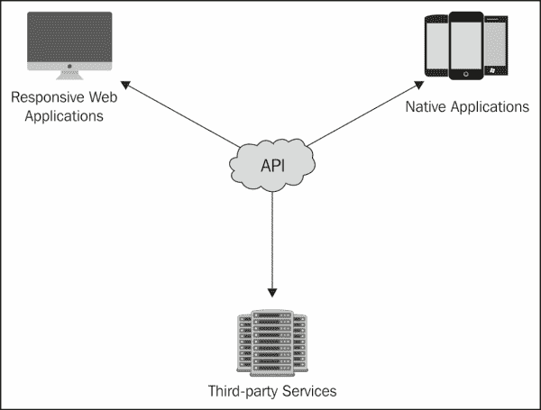
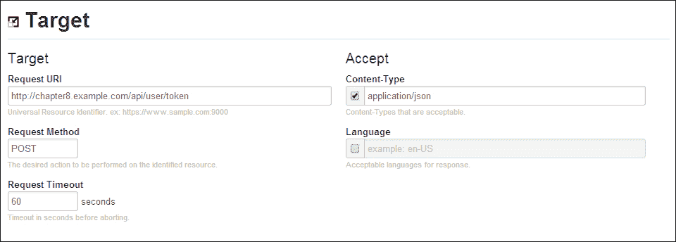
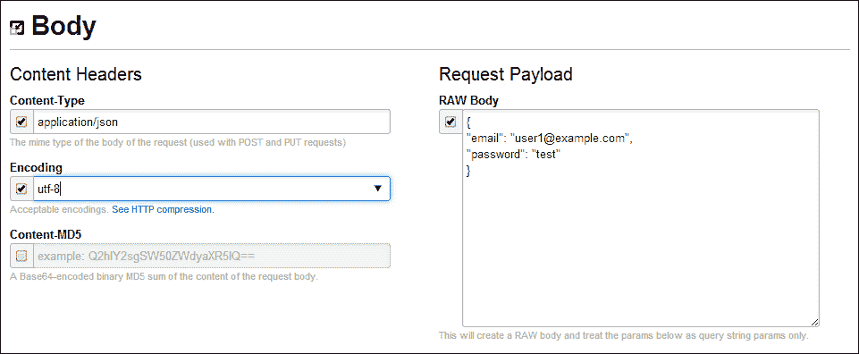
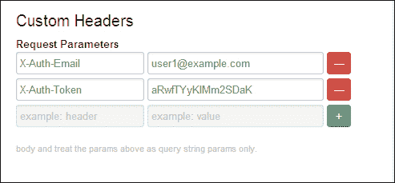

# 第八章. 为 CMS 构建 API

在整本书中，我们已经涵盖了面向视图的应用程序的开发——用户可以直接与之交互的应用程序。然而，我们的面向视图的方法并不允许我们轻松地与其他服务集成或为原生应用程序提供功能。这种面向视图的方法通常会使我们陷入硬编码的功能，并使集成变得显著更加困难。然而，Yii 框架非常灵活，使我们能够构建 API 驱动应用程序而不是视图驱动应用程序。API 减少了我们需要维护的代码量；如果执行得当，它减少了当我们想要添加功能时需要更改的代码量。最终，这使我们能够更快地工作，并更适应变化。

构建一个 API 驱动的应用程序也使我们能够轻松地开发与我们的 API 一起工作的 Web 和原生客户端，从而完全将面向视图的逻辑与我们应用程序分离。在本章中，我们将讨论为了构建我们之前创建的内容管理系统（CMS）的 API 驱动模块，我们需要做什么。通过在我们的应用程序周围培养一个生态系统，我们可以为开发者和用户都提供价值，并提高我们应用程序的价值。

以下为演示：



在本章中，我们将讨论为了构建我们之前创建的内容管理系统的 API 驱动模块，我们需要做什么。

# 前提条件

由于我们将基于我们在第七章中完成的工作进行扩展，即第七章. 为 CMS 创建管理模块，我们需要前一章的完整源代码。你可以自己构建项目，或者你可以使用前一章项目资源文件夹中可用的完整源代码。我们还需要一个 URL 请求客户端，它将允许我们向应用程序发送带有 JSON 编码数据的`GET`、`POST`和`DELETE`请求。你可以使用 cURL，或者你可以下载一个名为**RESTClient**的 Google Chrome 扩展程序，该扩展程序可在[`chrome.google.com/webstore/detail/rest-console/cokgbflfommojglbmbpenpphppikmonn?hl=en`](https://chrome.google.com/webstore/detail/rest-console/cokgbflfommojglbmbpenpphppikmonn?hl=en)找到。本章中的示例将使用 RESTClient。

# 描述项目

在本章中，我们将为我们的内容管理系统构建一个 API 模块。这个模块的开发可以分为几个部分：

+   配置模块

+   扩展 Yii 以“RESTfully”渲染 JSON 或 XML 而不是视图文件

+   处理数据输入

+   处理用户身份验证

+   处理异常和错误

+   指定每个响应将返回哪些数据

+   实现身份验证、注销和基本的 CRUD 操作

## 配置模块

本项目的第一个组件将包括创建和配置我们的模块，以便它与我们的主应用程序集成。由于我们在上一章中添加了无缝将模块集成到我们的应用程序的功能，本节所需的工作仅限于清除我们的模块缓存，初始化模块，并添加必要的路由。

## 扩展 Yii 以以 RESTful 方式渲染 JSON 或 XML

由于 Yii 框架旨在与视图文件一起工作，我们需要扩展 Yii 框架的几个组件，以便使其能够输出和渲染 JSON 或 XML 文档。我们还需要对 Yii 进行一些不同的修改，以便它能够独立处理 `GET`、`POST` 和 `DELETE` 操作。为了实现这一点，我们将创建一个新的控制器，该控制器将扩展我们在之前章节中创建的 `CMSController`。这将覆盖 `CController` 的几个关键方法，即 `runAction()`、`filterAccessControl()`、`createAction()` 和 `beforeAction()`。我们还将扩展其他几个类——`CInlineAction`、`CAccessControlFilter` 和 `CAccessRule`——以实现我们所需的所有功能。最后，我们还将更改渲染器的工作方式，以便我们可以从我们的操作中返回数据，并让我们的基本控制器处理输出，从而减少在每个控制器中需要执行的回声数量。

## 处理数据输入

对于任何修改我们应用程序中数据的请求，我们需要处理将数据接受到 RESTful 端点。为了使事情简单，我们将接受 JSON 编码的数据，或者接受使用 `application/x-www-form-urlencoded` 或 HTML 表单字段编码的数据，以方便我们。在我们的应用程序中，我们将将这些数据源转换为可用的属性，我们可以从中修改并完成任务。

## 对 API 进行用户认证

在 Yii 中，用户认证和识别通常由我们的 `UserIdentity` 类和 cookies 处理。按照惯例，RESTful API 不发送或接受任何 cookies，这意味着我们不得不改变在应用程序中执行认证的方式。为此，我们将创建一个自定义的 `AccessControlFilter`，它将最初使用用户的用户名和密码来认证我们的用户。如果用户成功认证我们的 API，我们将返回一个唯一的令牌给用户，用户将使用此令牌进行所有需要认证的未来请求。此令牌和用户的电子邮件地址将通过两个自定义头 `X-Auth-Token` 和 `X-Auth-Email` 发送，并允许我们在 API 中识别用户，而无需他们重新发送密码信息。此令牌将存储在我们之前章节中创建的 `user_metadata` 表中，与我们的用户一起。

## 处理 API 异常

我们接下来需要处理的是错误和异常。这些将包括 Yii 自然遇到的错误，例如当找不到操作时的 404 错误，以及我们在应用程序中抛出的异常，以通知与我们的 API 交互的客户端意外错误或警告。由于我们将更改应用程序内渲染的方式，我们将简单地以与任何操作响应相同的方式重定向我们的错误。

## 处理数据响应

对于每个请求，我们将返回 HTTP 状态码，如果发生错误，将返回一条消息，以及一个混合内容响应属性，它将包含我们希望返回给客户端消费的所有信息。响应将如下所示：

```php
{
   "status": <integer::http_status_code>,
   "message": "<string::null_or_error_message>",
   "response": <mixed::boolean_string_or_array_response"
}
```

我们还将让我们的操作返回一个方法，这将允许我们定义每个请求应该返回哪些属性。这将使我们能够只返回有限的信息，防止意外信息泄露，并使我们能够保护像密码或凭证这样的私人信息。

## 实现操作

我们将要处理的最后一个大问题是实现所有控制器操作。这包括我们的认证端点，所有用户操作，如注册和重置密码，以及我们三个核心数据模型：用户、类别和内容。

# 初始化项目

对于这个项目，我们将从第七章，*为 CMS 创建管理模块*，我们上次停止的地方开始。步骤如下：

1.  为了您的方便，本章的项目资源文件夹中包含了一个骨架项目，其中包含我们将开始的基础。首先，将源代码复制到一个新文件夹中，并确保它位于与上一章中使用的不同 URL 下。在本章中，我将使用`http://chapter8.example.com`作为我们的示例 URL。

1.  在使用上一章中提供的说明导入数据库并更新数据库配置后，在`protected/modules`中创建一个名为`api`的新文件夹，并创建以下目录结构：

    ```php
    api/
       components/
       config/
       controllers/
    ```

1.  接下来，在`protected/modules/api/`中创建`ApiModule`类，`ApiModule.php`，这将引导我们的模块：

    ```php
    <?php

    class ApiModule extends CWebModule
    {
       public function init()
       {
          // import the module-level models and components
          $this->setImport(array(
             'api.components.*',
          ));

          Yii::app()->log->routes[0]->enabled = false;

          Yii::app()->setComponents(array(
                'errorHandler' => array(
                   'errorAction'  => 'api/default/error',
               )
            ));
       }
    }
    ```

1.  接下来，在`protected/modules/api/config/`中创建`routes.php`，并填充以下信息：

    ```php
    <?php return array(
       '/api/<controller:\w+>/<action:\w+>' => '/api/<controller>/<action>',
       '/api/<controller:\w+>/<action:\w+>/<id:\w+>' => '/api/<controller>/<action>'
    );
    ```

最后，在`protected/runtime/`目录中删除`modules.config.php`文件，以及`protected/runtime/cache`目录的内容，以清除我们在上一章中实现的模块缓存。这将确保 Yii 能够识别并缓存我们的新模块。下次我们访问 Yii 时，此文件将被重新生成，并将包含适用于我们应用程序的适当模块配置。

# 扩展 Yii 以返回数据

有两种方法让 Yii 渲染 JSON 或 XML 数据。第一种也是最简单的方法是创建一个 JSON 或 XML 视图文件，并从每个动作中调用`$this->render('json')`。虽然这很简单，但它迫使我们存储大量信息，并在每个动作中显式调用`render()`方法。如果我们扩展的类修改了`render()`方法，那么在以后想要进行更改时可能会非常麻烦。这种方法另一个问题是它将错误视为不同的响应类型。当使用这种方法抛出错误时，Yii 会希望将错误渲染为 HTML 而不是 JSON。根据我们的日志和调试级别，这可能会导致我们的 API 向客户端返回错误的数据。

更好的方法是，在每一个动作中简单地返回我们想要向客户端展示的数据，并由父控制器类处理渲染和输出。这种方法使得识别每个动作展示的数据更加容易，并确保即使在发生异常或错误的情况下，我们的 API 也能始终返回正确的数据格式。

1.  然而，为了使这个功能正常工作，我们需要从 Yii 框架扩展几个类并修改它们，以便它们返回数据而不是输出。我们需要扩展的第一个类是`CInlineAction`。`CInlineAction`代表我们控制器中的实际动作方法，并由`runAction()`控制器方法调用。为了使我们的 API 返回数据而不是输出，我们首先需要通过修改`CInlineAction`的`runWithParamsInternal()`方法来拦截我们动作的响应，然后将其返回给父控制器中的`runAction()`方法。

1.  我们将通过创建一个新的类`ApiInlineAction`来扩展`CInlineAction`并重载`runWithParamsInternal()`方法。为了方便起见，我们将这段代码放在`ApiInlineAction.php`中，位于`protected/modules/api/components/`目录下：

    ```php
    <?php
    class ApiInlineAction extends CInlineAction
    {
        protected function runWithParamsInternal($object, $method, $params)
        {
            $ps=array();
            foreach($method->getParameters() as $i=>$param)
            {
                $name=$param->getName();
                if(isset($params[$name]))
                {
                    if($param->isArray())
                        $ps[]=is_array($params[$name]) ? $params[$name] : array($params[$name]);
                    elseif(!is_array($params[$name]))
                        $ps[]=$params[$name];
                    else
                        return false;
                }
                elseif($param->isDefaultValueAvailable())
                    $ps[]=$param->getDefaultValue();
                else
                    return false;
            }

            return $method->invokeArgs($object,$ps);
        }
    }
    ```

1.  接下来，我们需要创建一个基类控制器，所有我们的 API 控制器都将从这个基类扩展。这个父类将最终成为`runWithParamsInternal`类。首先，在`protected/modules/api/components`目录下创建一个新的类`ApiController.php`，其定义如下：

    ```php
    <?php class ApiController extends CMSController {}
    ```

1.  在整个类中，我们将引用私有的`$_action`变量，我们需要从父类中重新定义它。我们还将在此处定义状态和消息变量。这些变量将包含 HTTP 状态码以及我们想要向客户端展示的任何错误消息：

    ```php
    private $_action;
    public $status = 200;
    public $message = null;
    ```

1.  我们将重载`runAction()`方法，调用我们的输出方法而不是 Yii 的渲染方法：

    ```php
    public function runAction($action)
    {
       $response = null;
        $priorAction=$this->_action;
        $this->_action=$action;

        if($this->beforeAction($action))
        {
           $response = $action->runWithParams($this->getActionParams());
            if($response===false)
                $this->invalidActionParams($action);
            else
                $this->afterAction($action);
        }

        $this->_action=$priorAction;

        $this->renderOutput($response);
    }
    ```

    ### 注意

    关于`CInlineAction`有疑问？请务必查看类文档，链接为[`www.yiiframework.com/doc/api/1.1/CInlineAction`](http://www.yiiframework.com/doc/api/1.1/CInlineAction)。

## 渲染数据

输出我们的数据的下一部分是创建我们之前调用的 `renderOutput()` 方法：

1.  我们将首先定义方法。为了使其尽可能适应，我们希望有手动调用此方法的能力，并显示我们想要呈现的状态和消息：

    ```php
    public function renderOutput($response = array(), $status=NULL, $message=NULL) {}
    ```

1.  在此时，我们将定义几个响应头，这将允许网络客户端与我们的 API 通信，并获取现代网络浏览器中设置的相同源策略设置，以保护用户。没有这些跨源资源共享头（简称 CORS），网络客户端将无法与我们的 API 通信。这还将允许网络浏览器发送我们稍后定义的自定义身份验证头：

    ```php
    header("Access-Control-Allow-Origin: *");
    header("Access-Control-Allow-Headers: x-auth-token, x-auth-email");
    header('Access-Control-Allow-Methods: PUT, PATCH, DELETE, POST, GET, OPTIONS');
    ```

1.  我们将定义我们的基本数据响应：

    ```php
    $data = array(
        'status' => $status != NULL ? $status : $this->status,
        'message' => $message != NULL ? $message : ($this->message == NULL ? 'Your request was successfully fulfilled' : $this->message),
        'response' => $response
    );
    ```

1.  然后，我们将确定我们想要从名为 `format` 的 `GET` 参数返回数据的数据格式，并适当地渲染数据：

    ```php
    $format = Yii::app()->request->getParam('format', 'json');
    if ($format == 'xml')
    {
        header ("Content-Type:text/xml");
        echo $this->renderXML($data);
    }
    else
        echo $this->renderJSON($data);
    Yii::app()->end();
    ```

1.  要渲染 JSON 数据，我们只需将我们在上一步骤中构建的数据响应输出，并使用 `CJSON::encode()`：

    ```php
    private function renderJSON($data)
    {
        header('Content-Type: application/json');
        return CJSON::encode($data);
    }
    ```

1.  渲染 XML 数据稍微复杂一些，但可以使用以下递归方法轻松完成：

    ```php
    private function renderXML($array, $level=1)
    {
        $xml = '';
        if ($level==1)
            $xml .= '<?xml version="1.0" encoding="ISO-8859-1"?>'."\n<data>\n";

        foreach ($array as $key=>$value)
        {
            $key = strtolower($key);
            if (is_array($value))
            {
                $multi_tags = false;
                foreach($value as $key2=>$value2)
                {
                    if (is_array($value2))
                    {
                        $xml .= str_repeat("\t",$level)."<$key>\n";
                        $xml .= $this->renderXML($value2, $level+1);
                        $xml .= str_repeat("\t",$level)."</$key>\n";
                        $multi_tags = true;
                    }
                    else
                    {
                        if (trim($value2)!='')
                        {
                            if (htmlspecialchars($value2)!=$value2)
                                $xml .= str_repeat("\t",$level)."<$key><![CDATA[$value2]]>"."</$key>\n";
                            else
                                $xml .= str_repeat("\t",$level)."<$key>$value2</$key>\n";
                        }

                        $multi_tags = true;
                    }
                }

                if (!$multi_tags and count($value)>0)
                {
                    $xml .= str_repeat("\t",$level)."<$key>\n";
                    $xml .= $this->renderXML($value, $level+1);
                    $xml .= str_repeat("\t",$level)."</$key>\n";
                }

            }
            else
            {
                if (trim($value)!='')
                {
                    if (htmlspecialchars($value)!=$value)
                        $xml .= str_repeat("\t",$level)."<$key>"."<![CDATA[$value]]></$key>\n";
                    else
                        $xml .= str_repeat("\t",$level)."<$key>$value</$key>\n";
                }
            }
        }

        if ($level==1)
            $xml .= "</data>\n";

        return $xml;
    }
    ```

    ### 注意

    对我们从 `CController` 扩展的方法有疑问？请务必查看该类的指南，链接为 [`www.yiiframework.com/doc/api/1.1/CController`](http://www.yiiframework.com/doc/api/1.1/CController)。

## 以 RESTful 方式调用操作

在 RESTful API 中，单个端点可能对不同类型的 HTTP 请求有不同的响应。例如，`/api/user/index` 端点可能会在带有 ID 参数的 `GET` 请求下返回用户列表或特定用户。然而，如果调用 `POST` 请求，则可能创建或修改新用户。如果对该端点调用带有 ID 的 `DELETE` 请求，则将从系统中删除用户。

为了在 Yii 中模拟这种行为，我们需要重载 `ApiController` 的 `createAction()` 方法，以便调用正确的操作。在我们的控制器中，这将允许我们通过请求类型来分离功能。内部，我们的 API 将以 `action<Name><Method>` 的格式调用操作，默认的 `GET` 操作将击中原始操作方法（例如，`actionIndex()`、`actionIndexPost()` 和 `actionIndexDelete()`）。此方法还将调用我们之前定义的 `ApiInlineAction` 类，而不是 `CInlineAction`：

```php
public function createAction($actionID)
{
    if($actionID==='')
        $actionID=$this->defaultAction;

    if (Yii::app()->request->getRequestType() != 'GET' && $actionID != 'error')
        $actionID .= Yii::app()->request->getRequestType();

    if(method_exists($this,'action'.$actionID) && strcasecmp($actionID,'s')) // we have actions method
        return new ApiInlineAction($this,$actionID);
    else
    {
        $action=$this->createActionFromMap($this->actions(),$actionID,$actionID);
        if($action!==null && !method_exists($action,'run'))
            throw new CException(Yii::t('yii', 'Action class {class} must implement the "run" method.', array('{class}'=>get_class($action))));
        return $action;
    }
}
```

## 用户认证

由于 RESTful API 不会在 API 和客户端之间传递 cookie 信息，因此我们需要对我们的控制器进行一些修改，以便将认证用户与非认证用户分开。为此，我们将重载 `CAccessControlFilter`，使其针对我们在控制器中填充的用户信息操作：

1.  我们将首先在我们的`ApiController`中添加一些更多的公共属性。`xauth`属性将存储用于认证的`X-Auth-Token`和`X-Auth-Email`头信息，而`user`属性将存储认证用户的原始用户模型。我们将传递这些信息到子控制器进行认证，以及到我们重载的`CAccessControlFilter`类：

    ```php
    public $xauthtoken = null;
    public $xauthemail = null;
    public $user = null;
    ```

1.  接下来，我们将加载我们的`accessControl`过滤器。我们还将定义另一个名为`CHttpCacheFilter`的过滤器，它将通知客户端不要缓存 API 返回的响应：

    ```php
    public function filters()
    {
        return array(
            array(
                'CHttpCacheFilter',
                'cacheControl'=>'public, no-store, no-cache, must-revalidate',
            ),
            'accessControl'
        );
    }
    ```

1.  然后，我们将定义我们的基本`accessRules()`，它将拒绝访问除错误操作之外的所有方法：

    ```php
    public function accessRules()
    {   
        return array(
            array('allow',
                'actions' => array('error')
            ),
            array('deny')
        );
    }
    ```

1.  接下来，我们将在控制器中处理认证，然后再将其传递给`CInlineActionFilter`。我们将首先在我们的`ApiController`中重载`filterAccessControl()`方法：

    ```php
    public function filterAccessControl($filterChain) {}
    ```

1.  我们将检索`X-Auth-Token`和`X-Auth-Email`头信息：

    ```php
    $this->xauthtoken = isset($_SERVER['HTTP_X_AUTH_TOKEN']) ? $_SERVER['HTTP_X_AUTH_TOKEN'] : NULL;
    $this->xauthemail =isset($_SERVER['HTTP_X_AUTH_EMAIL']) ? $_SERVER['HTTP_X_AUTH_EMAIL'] : NULL;
    ```

1.  接下来，我们将对这些信息与我们的数据库进行验证。为此，我们将使用`X-Auth-Email`地址在我们的数据库中查找一个用户；如果找到，我们将检查稍后在`user_metadata`表中生成的 API 令牌。如果找到 API 令牌，我们将使用原始用户模型填充`$this->user`：

    ```php
    if ($this->xauthemail != NULL)
    {
        // If a user exists with that email address
        $user = User::model()->findByAttributes(array('email' => $this->xauthemail));
        if ($user != NULL)
        {
            $q = new CDbCriteria();
            $q->addCondition('t.key LIKE :key');
            $q->addCondition('value = :value');
            $q->addCondition('user_id = :user_id');
            $q->params = array(
                ':user_id' => $user->id,
                ':value' => $this->xauthtoken,
                ':key' => 'api_key'
            );

            $meta = UserMetadata::model()->find($q);

            // And they have an active XAuthToken, set $this->user = the User object
            if ($meta != NULL)
                $this->user = $user;
        }
    }
    ```

1.  最后，我们将调用我们的自定义`CAccessControlFilter`类，将用户传递给它，设置规则，并调用过滤器：

    ```php
    $filter=new ApiAccessControlFilter;
    $filter->user = $this->user;
    $filter->setRules($this->accessRules());
    $filter->filter($filterChain);
    ```

### 重载 CAccessControlFilter

我们需要在`protected/modules/api/components/`中创建一个新的类`ApiAccessControl`过滤器，这样我们就可以在我们的控制器中继续使用`accessRules`数组。这个类将操作我们从控制器传递给它的`user`对象，并使我们的`accessRules`数组与新的用户对象一起工作：

1.  在创建`ApiAccessControlFilter.php`文件后，定义如下：

    ```php
    <?php class ApiAccessControlFilter extends CAccessControlFilter {}
    ```

1.  然后，我们需要添加`user`属性以存储从我们的控制器传递的用户，并重新定义父类操作的`private $_rules`属性：

    ```php
    public $user;
    private $_rules;
    ```

1.  由于父类中的`$_rules`数组是私有的，我们还需要重新定义规则数组的获取器和设置器，以及使用私有属性的`preFilter()`方法。我们首先从`preFilter()`方法开始：

    ```php
    protected function preFilter($filterChain)
    {
        $app=Yii::app();
        $request=$app->getRequest();
        $user=$this->user;
        $verb=$request->getRequestType();
        $ip=$request->getUserHostAddress();

        foreach($this->getRules() as $rule)
        {
            if(($allow=$rule->isUserAllowed($user,$filterChain->controller,$filterChain->action,$ip,$verb))>0) // allowed
                break;
            elseif($allow<0) // denied
            {
                if(isset($rule->deniedCallback))
                    call_user_func($rule->deniedCallback, $rule);
                else
                    $this->accessDenied($user,$this->resolveErrorMessage($rule));
                return false;
            }
        }

        return true;
    }
    ```

1.  然后，我们将为我们的`rules`数组创建获取器和设置器：

    ```php
    public function getRules()
    {
        return $this->_rules;
    }

    public function setRules($rules)
    {
        foreach($rules as $rule)
        {
            if(is_array($rule) && isset($rule[0]))
            {
                $r=new ApiAccessRule;
                $r->allow=$rule[0]==='allow';
                foreach(array_slice($rule,1) as $name=>$value)
                {
                    if($name==='expression' || $name==='roles' || $name==='message' || $name==='deniedCallback')
                        $r->$name=$value;
                    else
                        $r->$name=array_map('strtolower',$value);
                }
                $this->_rules[]=$r;
            }
        }
    }
    ```

1.  在这个时候，我们还想重新定义当用户没有访问特定操作时的`accessDenied`行为。在这里，我们将简单地调用`ApiController`的`renderOutput()`方法：

    ```php
    protected function accessDenied($user,$message=NULL)
    {
        http_response_code(403);
        Yii::app()->controller->renderOutput(array(), 403, $message);
    }
    ```

1.  为了遵循 Yii 的相同约定，我们还将添加第二个类，`ApiAccessRule`，它扩展了同一文件中的`CAccessRule`。这只是简单的修改，确保我们的信息被加载，而不是传递给`CAccessRule`的信息：

    ```php
    class ApiAccessRule extends CAccessRule
    {
        public function isUserAllowed($user,$controller,$action,$ip,$verb)
        {
            if($this->isActionMatched($action)
                && $this->isIpMatched($ip)
                && $this->isVerbMatched($verb)
                && $this->isControllerMatched($controller)
                && $this->isExpressionMatched($user))
                return $this->allow ? 1 : -1;
            else
                return 0;
        }
    }
    ```

    ### 注意

    想了解更多关于`CAccessControlFilter`的信息？请查看类文档[`www.yiiframework.com/doc/api/1.1/CAccessControlFilter`](http://www.yiiframework.com/doc/api/1.1/CAccessControlFilter)。

## 处理传入的数据

由于我们的 RESTful API 将返回 JSON，因此它也接受 JSON 是合适的。为了方便，我们将配置我们的 API 接受来自数据的`application/x-www-form-urlencoded`（从表单发送的数据），这样我们的 Web 客户端可以直接 POST 到我们的 API，而无需进行数据转换。

为了让我们的 API 接受这些数据，我们将重载`beforeAction()`方法，以便在提供的情况下获取原始 JSON 主体，并将其填充到我们的`$_POST`数据中，如果它是一个有效的 JSON 请求。如果发送了无效的 JSON，我们将返回 HTTP 400 错误，表示请求存在问题。错误将触发我们的`actionError()`方法，并冒泡到我们的`runAction()`方法，最终显示错误：

```php
public function beforeAction($action)
{
    // If content was sent as application/x-www-form-urlencoded, use it. Otherwise, assume raw JSON was sent and convert it into
    // the $_POST variable for ease of use
    if (Yii::app()->request->rawBody != "" && empty($_POST))
    {
        // IF the rawBody is malformed, throw an HTTP 500 error. Use json_encode so that we can get json_last_error
        $_POST = json_decode(Yii::app()->request->rawBody);
        if (json_last_error() != JSON_ERROR_NONE)
        {
            header('HTTP/1.1 400 Bad Request');
            $this->status = 400;
            $this->message = 'Request payload not properly formed JSON.';
            return null;
        }

        $_POST = CJSON::decode(Yii::app()->request->rawBody);
    }

    return parent::beforeAction($action);
}
```

## 处理错误

在继续创建控制器之前，我们需要确保我们的父类可以处理发送给它的任何错误。我们将要处理的错误有两种类型——第一种是 Yii 内部遇到的错误或通过我们调用的异常，第二种是我们想要展示给用户但不想通过异常发送的错误。

### 异常处理

为了处理我们抛出或 Yii 内部抛出的异常，我们将定义基`actionError()`方法如下。这里的数据集将简单地填充我们之前重载的`runAction()`方法，并确保以正确的格式显示适当的错误：

```php
public function actionError()
{
    if($error=Yii::app()->errorHandler->error)
    {
        $this->status = $error['code'];
        $this->message = $error['message'];
    }
}
```

### 自定义错误处理

在我们的控制器中，将会有我们想要返回错误给用户而不触发异常的情况。一个很好的例子是模型验证错误。我们想要通知用户出了问题，但希望优雅地返回错误而不使我们的应用程序停滞。为此，我们将创建一个`returnError()`方法，从我们的控制器中调用，并将数据填充回我们之前定义的`runAction()`方法：

```php
public function returnError($status, $message = NULL, $response)
{
    header('HTTP/1.1 '. $status);
    $this->status = $status;

    if ($message === NULL)
        $this->message = 'Failed to set model attributes.';
    else
        $this->message = $message;

    return $response;
}
```

## 测试是否一切正常

在我们开始创建其他控制器和操作之前，让我们创建一个非常简单的控制器，以验证我们的 API 是否按预期工作。为此，让我们在`protected/modules/api/controllers`中创建一个名为`DefaultController`的类，并按照以下设置进行：

```php
class DefaultController extends ApiController
{
    public function accessRules()
    {
        return array(
            array('allow',
                'actions' => array('index', 'error')
            ),
            array('deny')
        );
    }

    public function actionIndex()
    {
        return "test";
    }
}
```

如果您的 API 设置正确，您应该能够打开浏览器到`http://chapter8.example.com/api`并看到以下内容显示：

```php
{
    "status":200,
    "message":"Your request was successfully fulfilled",
    "response":"test"
}
```

如您所见，我们从操作返回的任何数据现在都在我们的 JSON 对象的响应属性中。此外，如果我们想渲染 XML 而不是 JSON，我们可以在`http://chapter8.example.com/api?format=xml` URL 中添加`format=xml GET`参数，如下所示：

```php
<data>
    <status>200</status>
    <message>Your request was successfully fulfilled</message>
    <response>test</response>
</data>
```

### 注意

大多数负载均衡器和健康检查服务都会验证端点返回`200`状态。因此，如果你打算在你的 API 中添加健康检查，建议你只需从默认方法返回 true。

# 用户认证

现在我们 API 已经可用，让我们添加用户认证 API 的能力。为此，我们将创建一个端点，该端点接受以下 JSON 请求体：

```php
{
   "email": "user@example.com",
   "password": "<example_password>"
}
```

使用这些信息，API 将通过我们在前面的章节中工作的`LoginForm`进行认证。如果用户有效，我们将生成一个新的 API 令牌，该令牌将被存储在`user_metadata`表中。此令牌将返回给发起请求的客户端，并将用于所有未来的请求：

1.  要开始，请在`protected/modules/api/controllers/`目录下创建一个新的控制器，命名为`UserController.php`，其定义如下：

    ```php
    <?php class UserController extends ApiController {}
    ```

1.  接下来，我们需要定义一组默认的访问规则，以便我们的认证方法可以在不进行认证的情况下使用：

    ```php
    public function accessRules()
    {
        return array(
           array('allow',
              'actions' => array('tokenPost'),
           ),
            array('deny')
        );
    }
    ```

1.  由于这是一个`POST`端点，我们将按照以下方式定义我们的新方法：

    ```php
    public function actionTokenPost() {}
    ```

1.  然后，我们将实例化一个新的`LoginForm`实例，并从 JSON 体中检索我们的电子邮件地址和密码。记住，在我们的`ApiController`类中，我们直接将原始 JSON 体转换成了我们的`$_POST`参数，以便更容易处理：

    ```php
    $model = new LoginForm;
    $model->username = Yii::app()->request->getParam('email', NULL);
    $model->password = Yii::app()->request->getParam('password', NULL);
    ```

1.  在获取这些信息后，我们将尝试登录：

    ```php
    if ($model->login()) {}
    ```

1.  如果成功，我们将加载用户信息：

    ```php
    $user = User::model()->findByAttributes(array('email' => $model->username));
    ```

1.  尝试更新现有的 API 令牌，或者生成一个新的：

    ```php
    $token = UserMetadata::model()->findByAttributes(array(
        'user_id' => $user->id,
        'key' => 'api_key'
    ));

    if ($token == NULL)
        $token = new UserMetadata;

    $token->attributes = array(
       'user_id' => $user->id,
       'key' => 'api_key',
       'value' => $user->generateActivationKey() // Reuse this method for cryptlib
    );
    ```

1.  如果我们能够将令牌保存到数据库中，我们将返回它：

    ```php
    if ($token->save())
        return $token->value;
    ```

1.  在我们的`if ($model->login())`条件之外，我们将简单地返回一个错误给用户，表明出了些问题。由于这是一个认证方法，我们不希望泄露太多信息，以防止人们尝试暴力破解我们的 API 端点：

    ```php
    return $this->returnError(401, $model->getErrors(), null);
    ```

## 测试认证

在继续之前，让我们确保我们的认证端点是正常工作的。为此，我们将使用一个名为**RestConsole**的 Google Chrome 扩展程序进行测试，该扩展程序可以从 Chrome 应用商店下载，网址为[`chrome.google.com/webstore/detail/rest-console/cokgbflfommojglbmbpenpphppikmonn?hl=en`](https://chrome.google.com/webstore/detail/rest-console/cokgbflfommojglbmbpenpphppikmonn?hl=en)。如果你还没有安装 Google Chrome，你可以从[`www.google.com/intl/en-US/chrome/browser/`](https://www.google.com/intl/en-US/chrome/browser/)下载。安装后，导航到 RestConsole 下载页面并安装插件。安装完成后，你可以在 Chrome 应用商店点击**启动应用**按钮来加载 RestConsole。加载完成后，你将看到几个不同的部分：

### 注意

像 RestConsole 这样的工具将允许我们从漂亮的 GUI 界面快速测试我们的 API 端点。如果您愿意，您可以直接从命令行使用 cURL 实用程序测试端点，该实用程序可通过大多数包管理器获得。

1.  在**目标**部分，填写如下截图所示的内容。请确保根据您的本地环境进行调整。本部分的关键细节是**请求 URI**字段。

1.  然后，滚动到**正文**部分，并按照以下方式填写该部分：

    ### 注意

    这一部分的关键部分是**请求有效载荷**部分。这是您将添加要发送到服务器的原始 JSON 正文的区域。在这个例子中，我们使用的是我们在第七章中建立的凭据，*为 CMS 创建管理模块*。

    ```php
    {
        "email": "user1@example.com",
        "password": "test"
    }
    ```

    如果您在此之后更改了这些凭据，请确保在您的 JSON 正文中更改它们。

1.  最后，点击页面底部的**提交**按钮。这将向服务器发送请求。如果成功，您将收到一个包含响应正文中 API 令牌的 HTTP 200 状态码响应：

    ```php
    {
        "status": 200,
        "message": "Your request was successfully fulfilled",
        "response": "aRwfTYyKlMm2SDaK"
    }
    ```

    ### 注意

    您的响应正文将略有不同，因为 API 令牌在每个身份验证请求中都是随机生成的。

## 发送经过身份验证的请求

现在我们能够对我们的 API 进行身份验证，让我们确保我们可以发送经过身份验证的请求。为此，我们将创建一个 API 端点，以便注销我们的用户。这将接受用户的凭据，然后从数据库中删除 API 令牌，以防止未来的使用：

1.  创建此端点包括两个部分。首先，我们需要向我们的`accessRules`数组添加一个项目，允许经过身份验证的用户向令牌端点发送`DELETE`请求。我们将通过向我们的`accessRules`数组添加以下内容来实现这一点：

    ```php
    array('allow',
       'actions' => array('tokenDelete'),
       'expression' => '$user!=NULL'
    )
    ```

1.  然后，我们将为我们的令牌端点添加删除方法，该方法将通过 HTTP `DELETE`方法提供：

    ```php
    public function actionTokenDelete()
    {
       $model = UserMetadata::model()->findByAttributes(array('user_id' => $this->user->id, 'value' => $this->xauthtoken));

       if ($model === NULL)
          throw new CHttpException(500, 'An unexpected error occured while deleting the token. Please re-generate a new token for subsequent requests.');
       return $model->delete();
    }
    ```

现在我们已经设置了端点，返回 RestConsole，删除请求正文，并在请求正文下面的**自定义头部**部分添加以下自定义头部，如下截图所示：

```php
X-Auth-Email: user1@example.com
X-Auth-Token: aRwfTYyKlMm2SDaK
```



然后，点击页面底部的**删除**按钮以发送`DELETE`请求。您应该会收到以下响应：

```php
{
    "status": 200,
    "message": "Your request was successfully fulfilled",
    "response": true
}
```

我们现在已经成功测试了用户身份验证并添加了从我们的 API 中注销的能力。请注意，如果您再次尝试提交一个`DELETE`请求，我们的`acccessRules`数组将启动并阻止该请求，从而返回以下响应：

```php
{
    "status": 403,
    "message": "You are not authorized to perform this action.",
    "response": []
}
```

# 实现 CRUD 操作

现在我们可以认证并使用我们的 API，我们可以以 RESTful 方式实现四个基本的 CRUD 操作。RESTful 操作归结为三种主要的 HTTP 请求类型——`GET`、`POST`和`DELETE`。我们将为我们的用户实现每一种：

我们需要实现的第一种方法是我们的`loadModel()`方法。此方法将在我们的用户模型中加载，并在出现错误时抛出适当的错误：

```php
private function loadModel($id=NULL)
{
    if ($id == NULL)
        throw new CHttpException(400, 'Missing ID');

    $model = User::model()->findByPk($id);

    if ($model == NULL)
        throw new CHttpException(400, 'User not found');

    return $model;
}
```

## 删除用户

我们将要实现的第一种方法是我们的`DELETE`方法。记住，对于每个方法，我们将针对单个端点`/api/user/index`使用不同的 HTTP 请求类型：

1.  我们需要做的第一个更改是`accessRules`。我们希望只有管理员才有权删除用户。我们将通过设置一个表达式来检查用户是否是管理员来实现这一点：

    ```php
    array('allow',
        'actions' => array('indexDelete'),
        'expression' => '$user!=NULL&&$user->role->id==2'
    )
    ```

1.  然后，我们将实现删除操作。我们想要确保用户不能删除自己：

    ```php
    public function actionIndexDelete($id=NULL)
    {
        if ($id == $this->user->id)
             return $this->returnError(401, 'You cannot delete yourself', null);

         return $this->loadModel($id)->delete();
    }
    ```

向`/api/user/index/id/<user_id>`发送`DELETE`请求现在将删除具有给定 ID 的用户。

## 检索用户

我们将要实现的第二种方法是`GET`方法，该方法将根据是否提供了 ID 来检索单个用户，或者如果用户是管理员，则检索多个用户。在任何情况下，我们都需要确保用户已经认证：

1.  第一个更改，再次，将是我们的`accessRules`数组。我们将检查用户是否是管理员，或者给定的 ID 是否属于当前认证的用户：

    ```php
    array('allow',
        'actions' => array('index'),
        'expression' => '$user!=NULL&&($user->role->id==2||Yii::app()->request->getParam("id")==$user->id)'
    )
    ```

1.  然后，我们在控制器中设置一个`GET`方法。记住，我们在`ApiController`类中设置了`createAction()`方法，这样`GET`请求就不需要在方法末尾使用 HTTP 动词：

    ```php
    public function actionIndex($id=NULL) {}
    ```

1.  然后，如果提供了 ID，我们将简单地加载请求的用户。如果用户不是管理员并且他们请求了另一个用户，我们将抛出一个异常；否则，我们将返回适当的数据：

    ```php
    array('allow',
        'actions' => array('index', 'indexPost'),
        'expression' => '$user!=NULL&&($user->role->id==2||Yii::app()->request->getParam("id")==$user->id)'
    if ($id !== NULL)
    {
        if ($this->user->role->id != 2 && $this->user->id != $id)
           throw new CHttpException(403, 'You do not have access to this resource');

        return $this->loadModel($id)->getApiAttributes(array('password'), array('role', 'metadata'));
    }
    ```

    如果您还记得，我们为了添加`getApiAttributes()`方法而更改了我们的`CMSActiveRecord`模型。现在调用此方法允许我们排除我们不希望在请求中发送的某些元素，例如用户密码。这也允许我们返回有关用户的元数据，例如角色和与用户关联的任何元数据。

1.  继续进行，如果没有指定 ID，我们将确保用户是管理员：

    ```php
    if ($this->user->role->id != 2)
        throw new CHttpException(403, 'You do not have access to this resource');
    ```

1.  如果是这样，我们将加载我们模型的搜索实例。这扩展了我们的端点以允许动态搜索：

    ```php
    $model = new User('search');
    $model->unsetAttributes();  // clear any default values
    if(isset($_GET['User']))
        $model->attributes = $_GET['User'];
    ```

1.  为了允许分页，我们将从`$model->search()`方法实例化一个`CActiveDataProvider`的副本，并将页面变量设置为`GET`参数页面。这将允许我们通过分页浏览我们的用户，而不是在单个请求中一次性显示所有用户：

    ```php
    $dataProvider = $model->search();
    $dataProvider->pagination = array(
        'pageVar' => 'page'
    );
    ```

1.  为了处理分页，我们将继续显示结果，直到没有找到结果。当没有找到结果时，我们将抛出一个 HTTP 404 错误。这将允许客户端进行无限滚动，并让我们的客户知道何时停止请求数据：

    ```php
    if ($dataProvider->totalItemCount == 0 || ($dataProvider->totalItemCount / ($dataProvider->itemCount * Yii::app()->request->getParam('page', 1))) < 1)
        throw new CHttpException(404, 'No results found');
    ```

1.  然后，我们将使用`getData()`方法遍历我们的`dataProvider`，生成当前页面上所有用户对象的数组：

    ```php
    $response = array();

    foreach ($dataProvider->getData() as $user)
        $response[] = $user->getAPIAttributes(array('password'), array('role', 'metadata'));
    ```

1.  最后，我们将返回整个响应：

    ```php
    return $response;
    ```

现在，向 API 端点发送几个请求来测试一切。你应该能够以管理员身份登录并查看所有用户或任何用户。你也应该能够以普通用户身份登录，只检索有关自己的信息。

## 创建和更新用户

我们需要实现的最后一个端点是`POST`方法，它将作为创建和更新现有用户的端点：

1.  我们将首先更新上一节中定义的`accessRules`数组，以包括`indexPost`：

    ```php
    array('allow',
        'actions' => array('index', 'indexPost'),
        'expression' => '$user!=NULL&&($user->role->id==2||Yii::app()->request->getParam("id")==$user->id)'
    )
    ```

1.  然后，我们将创建一个`POST`端点，它将分支为两个独立的方法——一个用于创建用户，另一个用于修改用户：

    ```php
    public function actionIndexPost($id=NULL)
    {
        if ($id == NULL)
            return $this->createUser();
        else
            return $this->updateUser($id);
    }
    ```

1.  由于创建用户的所有信息都将来自正常的`POST`响应，因此我们创建新用户所需做的只是验证他们是否是管理员，实例化一个新的用户模型，验证它，并保存它。如果由于任何原因遇到错误（例如无效的属性），我们只需在 JSON 响应中返回`$model->getErrors()`中的错误：

    ```php
    private function createUser()
    {
        if ($this->user->role->id != 2)
            throw new CHttpException(403, 'You do not have access to this resource');

        $model = new User;
        $model->attributes = $_POST;

        if ($model->save())
            return User::model()->findByPk($model->id)->getApiAttributes(array('password'), array('role', 'metadata'));
        else
            return $this->returnError(400, $model->getErrors(), null);
    }
    ```

1.  事实上，更新用户就像加载现有的用户模型并执行与创建新用户相同的事情一样简单。在这个端点中，唯一的区别是我们需要确保用户是管理员，或者他们正在尝试修改自己的数据：

    ```php
    private function updateUser($id=NULL)
    {
        if ($this->user->role->id != 2 && $this->user->id != $id)
            throw new CHttpException(403, 'You do not have permission to modify this user');

        $model = $this->loadModel($id);

        $model->attributes = $_POST;

        if ($model->save())
             return User::model()->findByPk($model->id)->getApiAttributes(array('password'), array('role', 'metadata'));
        else
            return $this->returnError(400, $model->getErrors(), null);
    }
    ```

到目前为止，请确保你可以作为管理员创建新用户，以及现有用户可以修改自己的数据。

## 实现主应用程序中的其他控制器操作

到目前为止，我们已经为我们的用户数据模型创建了基本的 CRUD 接口。虽然这处理了很多管理任务，但还有一些其他方法我们可以从应用程序的前端移动到我们的 API。这些方法包括注册、账户验证和密码重置请求等操作。将这些方法从我们的前端移动到 API 中，可以立即使此功能对任何 API 消费者可用，这使得我们的 API 对 Web 和本地客户端都更有价值。

例如，我们可以通过简单地用表示注册成功的布尔值或由模型生成的错误列表替换渲染操作，轻松地将我们的注册操作从前端适配到 API。因为所有的验证规则和验证检查都是在模型中执行的，所以适配操作相对简单，如下所示：

```php
public function actionRegisterPost()
{
    $form = new RegistrationForm;
    $form->attributes = $_POST;

    if ($form->save())
        return true;
    else
        return $this->returnError(400, $form->getErrors(), null);
}
```

现在尝试实现前端控制器中的其他操作，例如`actionVerifyPost`、`actionActivate`、`actionForgotPost`和`actionResetPasswordPost`。

## 实现分类和内容 API 控制器

我们的 CMS 不仅包括与用户相关的操作——我们还需要管理内容和分类。再次强调，将此功能从我们的仪表板控制器移动到我们的 API 相当简单。我们只是移除了与视图相关的功能，并返回布尔值或由模型生成的错误。在我们的`GET`方法中，我们只是添加了一些使用已提供的`CActiveDataProvider`分页功能进行分页，并返回相关结果。这两个控制器将几乎与我们的`UserController`相同，因为它们以相同的方式工作，只是数据模型不同。请尝试自己完成这些控制器。

### 注意

请记住，完整的应用程序已包含在项目资源中。如果您遇到困难，请查看资源文件夹。

## 记录我们的 API

虽然我们的 API 使用起来很有趣，并且易于集成，但如果可用的端点、细节和示例没有清晰地记录，那么对于想要使用我们的 API 的开发者来说，这毫无意义。在将您的 API 与全世界分享之前，请确保记录下客户端可以访问的端点。同样，详细记录用户需要执行的操作以验证 API 也是一个好主意。通常，这是通过提供详细的示例请求和详细的示例响应来完成的。

# 摘要

正如本书中所示，Yii 框架是一个极其强大、灵活且易于使用的 PHP 框架。在本章中，我们彻底改变了 Yii 框架通过 JSON 请求处理用户认证的方式，并使其能够返回 JSON 和 XML 文档类型，以便 Web 和原生应用程序都可以消费 API。在本章中，我们还介绍了我们需要对之前设计为直接渲染给客户端的功能进行哪些更改，以便将其迁移到我们的 API 以作为 JSON 或 XML 渲染。最后，我们调整了我们的 API，使其能够对同一端点的不同类型的 HTTP 请求做出响应，从而使我们能够创建一个文档齐全的 RESTful JSON API。

感谢您阅读这本书。在这本书中，我们展示了无数个例子，说明了 Yii 框架是多么强大和灵活。从与第三方 API 的交互到执行数据库无关的迁移，再到开发功能齐全的应用程序，包括 API，Yii 框架使我们能够快速工作、开发和调整我们的代码，以便及时满足我们的目标和最终目标。我希望您觉得这本书中的信息是有益的、有用的，并且有趣的。我也希望您已经学会了如何使用 Yii 框架来做不仅仅是创建简单的 Web 应用程序。

在 Yii 框架的关于页面，Yii 被描述为 "Yes It Is" 的缩写，它回答了关于 Yii 的一些最基本的问题。Yii 快速吗？Yii 安全吗？Yii 专业吗？Yii 适合您的下一个项目吗？我希望这本书已经向您表明，这些问题的答案是一个简单的“是的，它是”。
