# 第五章：安全

在本章中，我们将涵盖以下主题：

+   认证

+   使用控制器过滤器

+   防止 XSS

+   防止 SQL 注入

+   防止 CSRF

+   使用 RBAC

+   加密/解密数据

# 简介

安全是任何 Web 应用程序的关键部分。

在本章中，您将学习如何根据通用 Web 应用程序安全原则“过滤输入，转义输出”来保持您的应用程序安全。我们将涵盖创建自己的控制器过滤器、防止 XSS、CSRF 和 SQL 注入、转义输出以及使用基于角色的访问控制等主题。要了解安全最佳实践，请参阅[`www.yiiframework.com/doc-2.0/guide-security-best-practices.html#avoiding-debug-info-and-tools-at-production`](http://www.yiiframework.com/doc-2.0/guide-security-best-practices.html#avoiding-debug-info-and-tools-at-production)。

# 认证

大多数 Web 应用程序都为用户提供了一种登录或重置忘记的密码的方式。在 Yii2 中，默认情况下我们没有这个机会。对于 `basic` 应用程序模板，Yii 默认提供了两个测试用户，这些用户在 `User` 模型中静态描述。因此，我们必须实现特殊的代码才能从数据库中启用用户登录。

## 准备工作

1.  按照官方指南使用 Composer 包管理器创建一个新应用程序，官方指南请参阅[`www.yiiframework.com/doc-2.0/guide-start-installation.html`](http://www.yiiframework.com/doc-2.0/guide-start-installation.html)。

1.  在您的配置组件部分添加：

    ```php
    'user' => [
        'identityClass' => 'app\models\User',
        'enableAutoLogin' => true,
    ],
    ```

1.  创建一个 `User` 表。通过输入以下命令创建迁移：

    ```php
    ./yii migrate/create create_user_table

    ```

1.  使用以下代码更新刚刚创建的迁移：

    ```php
    <?php

    use yii\db\Schema;
    use yii\db\Migration;

    class m150626_112049_create_user_table extends Migration
    {
      public function up()
      {
          $tableOptions = null;
          if ($this->db->driverName === 'mysql') {
              $tableOptions = 'CHARACTER SET utf8 COLLATE utf8_general_ci ENGINE=InnoDB';
          }

          $this->createTable('{{%user}}', [
              'id' => Schema::TYPE_PK,
              'username' => Schema::TYPE_STRING . ' NOT NULL',
              'auth_key' => Schema::TYPE_STRING . '(32) NOT NULL',
              'password_hash' => Schema::TYPE_STRING . ' NOT NULL',
              'password_reset_token' => Schema::TYPE_STRING,
          ], $tableOptions);
      }

      public function down()
      {
          $this->dropTable('{{%user}}');
      }
    }
    ```

1.  使用以下代码更新现有的 `models/User` 模型：

    ```php
    <?php

    namespace app\models;
    use yii\db\ActiveRecord;
    use yii\web\IdentityInterface;
    use yii\base\NotSupportedException;
    use Yii;

    class User extends ActiveRecord implements IdentityInterface
    {
      /**
       * @inheritdoc
       */
      public function rules()
      {
          return [

              ['username', 'required'],
              ['username', 'unique'],
              ['username', 'string', 'min' => 3],
              ['username', 'match', 'pattern' => '~^[A-Za-z][A-Za-z0-9]+$~', 'message' => 'Username can contain only alphanumeric characters.'],

              [['username', 'password_hash', 'password_reset_token'],
                  'string', 'max' => 255
              ],
              ['auth_key', 'string', 'max' => 32],
          ];
      }

      /**
       * @inheritdoc
       */
      public static function findIdentity($id)
      {
          return static::findOne($id);
      }

      public static function findIdentityByAccessToken($token, $type = null)
      {
          throw new NotSupportedException('"findIdentityByAccessToken" is not implemented.');
      }

      /**
       * Finds user by username
       *
       * @param  string      $username
       * @return User
       */
      public static function findByUsername($username)
      {
          return static::findOne(['username' => $username]);
      }
      /**
       * @inheritdoc
       */
      public function getId()
      {
          return $this->getPrimaryKey();
      }

      /**
       * @inheritdoc
       */
      public function getAuthKey()
      {
          return $this->auth_key;
      }

      /**
       * @inheritdoc
       */
      public function validateAuthKey($authKey)
      {
          return $this->getAuthKey() === $authKey;
      }

      /**
       * Validates password
       *
       * @param  string  $password password to validate
       * @return boolean if password provided is valid for current user
       */
      public function validatePassword($password)
      {
          return Yii::$app->getSecurity()->validatePassword($password, $this->password_hash);
      }

      /**
       * Generates password hash from password and sets it to the model
       *
       * @param string $password
       */
      public function setPassword($password)
      {
          $this->password_hash = Yii::$app->getSecurity()->generatePasswordHash($password);
      }

      /**
       * Generates "remember me" authentication key
       */
      public function generateAuthKey()
      {
          $this->auth_key = Yii::$app->getSecurity()->generateRandomString();
      }

      /**
       * Generates new password reset token
       */
      public function generatePasswordResetToken()
      {
          $this->password_reset_token = Yii::$app->getSecurity()->generateRandomString() . '_' . time();
      }

      /**
       * Finds user by password reset token
       *
       * @param  string      $token password reset token
       * @return static|null
       */

      public static function findByPasswordResetToken($token)
      {
          $expire = Yii::$app->params['user.passwordResetTokenExpire'];
          $parts = explode('_', $token);
          $timestamp = (int) end($parts);
          if ($timestamp + $expire < time()) {
              return null;
          }
          return static::findOne([
              'password_reset_token' => $token
          ]);
      }
    }
    ```

1.  创建一个迁移，该迁移将添加一个测试用户。使用以下命令：

    ```php
    ./yii migrate/create create_test_user

    ```

1.  使用以下代码更新刚刚创建的迁移：

    ```php
    <?php

    use yii\db\Migration;
    use app\models\User;

    class m150626_120355_create_test_user extends Migration
    {
      public function up()
      {
          $testUser = new User();
          $testUser->username = 'admin';
          $testUser->setPassword('admin');
          $testUser->generateAuthKey();
          $testUser->save();

      }

      public function down()
      {
          User::findByUsername('turbulence')->delete();
          return false;
      }
    }
    ```

1.  使用以下命令安装所有迁移：

    ```php
    ./yii migrate up

    ```

## 如何操作...

1.  现在，跟随 URL `site/login` 动作并使用 `admin`/`admin` 作为您的凭据：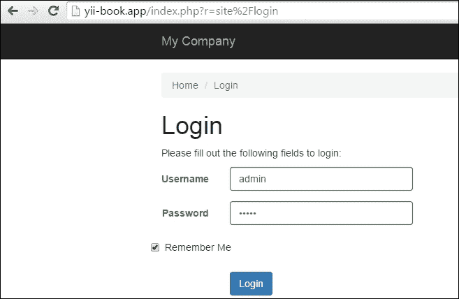

1.  恭喜！如果您已完成这些步骤，您应该能够登录。

## 如何工作...

1.  首先，我们为用户表创建了一个迁移。除了我们的 ID 和用户名外，我们的表还包含一些特殊字段，如 `auth_key`（此字段的主要用途是通过 cookie 验证用户），`password_hash`（出于安全原因，我们不会存储密码本身，而只存储密码哈希），以及 `password_reset_token`（在我们需要重置用户密码时使用）。

1.  安装后和 `create_test_user` 迁移的结果应如下截图所示：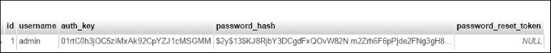

我们还向 `User` 模型添加了特殊方法，并将继承改为 `class User extends ActiveRecord implements IdentityInterface`，因为我们需要能够在数据库中找到用户。

您还可以从高级应用程序 [`github.com/yiisoft/yii2-app-advanced/blob/master/common/models/User.php`](https://github.com/yiisoft/yii2-app-advanced/blob/master/common/models/User.php) 复制 `User` 模型。

## 参见

更多信息，请参阅 [`www.yiiframework.com/doc-2.0/guide-security-authentication.html`](http://www.yiiframework.com/doc-2.0/guide-security-authentication.html)

# 使用控制器过滤器

在许多情况下，我们需要根据数据过滤传入的数据或执行某些操作。例如，使用自定义过滤器，我们可以根据 IP 过滤访客，强制用户使用 HTTPS，或者在用户使用应用程序之前将其重定向到安装页面。

在 Yii2 中，过滤器本质上是一种特殊的行为，因此使用过滤器与使用行为相同。

Yii 有很多内置的可用过滤器，包括：

+   核心

+   自定义

+   认证

+   内容协商

+   HttpCache

+   页面缓存

+   RateLimiter

+   请求动词

+   跨源资源共享（CORS）

在本配方中，我们将实现以下内容：

+   仅允许授权用户访问控制器操作

+   限制控制器操作对指定 IP 的访问

+   限制对特定用户角色的访问

## 准备工作

1.  使用 Composer 软件包管理器创建一个新应用程序，如官方指南 [`www.yiiframework.com/doc-2.0/guide-start-installation.html`](http://www.yiiframework.com/doc-2.0/guide-start-installation.html) 中所述。

1.  创建 `app/components/AccessRule.php`：

    ```php
    <?php

    namespace app\components;

    use app\models\User;
    class AccessRule extends \yii\filters\AccessRule {

      /**
       * @inheritdoc
       */
      protected function matchRole($user)
      {
          if (empty($this->roles)) {
              return true;
          }
          $isGuest = $user->getIsGuest();
          foreach ($this->roles as $role) {
              switch($role) {
                  case '?':
                      return ($isGuest) ? true : false;
                  case User::ROLE_USER:
                      return (!$isGuest) ? true : false;
                  case $user->identity->role: // Check if the user is logged in, and the roles match

                      return (!$isGuest) ? true : false;
                  default:
                      return false;
              }
          }
          return false;
      }
    }
    ```

1.  按如下方式创建 `app/controllers/AccessController.php`：

    ```php
    <?php

    namespace app\controllers;
    use app\models\User;
    use Yii;
    use yii\filters\AccessControl;
    use app\components\AccessRule;
    use yii\web\Controller;

    class AccessController extends Controller
    {
      public function behaviors()
      {
          return [
              'access' => [
                  'class' => AccessControl::className(),
                  // We will override the default rule config with the new AccessRule class
                  'ruleConfig' => [
                      'class' => AccessRule::className(),
                  ],
                  'rules' => [
                      [
                          'allow' => true,
                          'actions' => ['auth-only'],
                          'roles' => [User::ROLE_USER]
                      ],
                      [
                          'allow' => true,
                          'actions' => ['ip'],
                          'ips' => ['127.0.0.1'],
                      ],
                      [
                          'allow' => true,
                          'actions' => ['user'],
                          'roles' => [ User::ROLE_ADMIN],
                      ],
                      [
                          'allow' => false,
                      ]
                  ],
              ]
          ];
      }

      public function actionAuthOnly()
      {
          echo "Looks like you are authorized to run me.";
      }
      public function actionIp()
      {
          echo "Your IP is in our list. Lucky you!";
      }
      public function actionUser()
      {
          echo "You're the right man. Welcome!";
      }
    }
    ```

1.  按如下方式修改 `User` 类：

    ```php
    <?php

    namespace app\models;

    class User extends \yii\base\Object implements \yii\web\IdentityInterface
    {
     // add roles contstants 
      CONST ROLE_USER  = 200;
      CONST ROLE_ADMIN  = 100; 

      public $id;
      public $username;
      public $password;
      public $authKey;
      public $accessToken;
      public $role;

      private static $users = [
          '100' => [
              'id' => '100',
              'username' => 'admin',
              'password' => 'admin',
              'authKey' => 'test100key',
              'accessToken' => '100-token',
              'role' => USER::ROLE_ADMIN // add admin role for admin user
          ],
          '101' => [
              'id' => '101',
              'username' => 'demo',
              'password' => 'demo',
              'authKey' => 'test101key',
              'accessToken' => '101-token',
              'role' => USER::ROLE_USER // add user role for admin user
          ],
      ];
    …
    }
    ```

## 如何操作...

1.  要使用 `AccessControl`，在控制器类的 `behaviors()` 方法中声明它。我们这样做如下：

    ```php
    public function behaviors()
    {
      return [
          'access' => [
              'class' => AccessControl::className(),
              'rules' => [
                  [
                      'allow' => true,
                      'actions' => ['auth-only'],
                      'roles' => ['@'],
                  ],
                  [
                      'allow' => true,
                      'actions' => ['ip'],
                      'ips' => ['127.0.0.1'],
                  ],
                  [
                      'allow' => true,
                      'actions' => ['user'],
                        'roles' => ['admin'],
                  ],
                  [
                    'allow' => true,
                    'actions' => ['user'],
                    'matchCallback' => function ($rule, $action) {
                      return preg_match('/MSIE 9/',$_SERVER['HTTP_USER_AGENT']) !== false;
                    }
                  ],

                  ['allow' => false]
              ],
          ]
      ];
    }
    ```

1.  现在尝试使用 Internet Explorer 和其他浏览器通过使用 `admin` 和 `demo` 用户名来运行控制器操作。

## 工作原理...

我们将从仅允许授权用户访问控制器操作开始。请参阅 `rules` 数组中的以下代码：

```php
[
  'allow' => true,
  'actions' => ['auth-only'],
  'roles' => [User::ROLE_USER]
],
```

这里每个数组都是一个访问规则。您可以使用 `allow=true` 或 `allow=false` 为拒绝规则。对于每个规则，都有几个参数。

默认情况下，Yii 不拒绝所有内容，因此如果您需要最大安全性，请考虑在您的规则列表末尾添加 `['allow' => false]`。

在我们的规则中，我们使用两个参数。第一个是动作参数，它接受一个动作数组，规则将应用于这些动作。第二个是角色参数，它接受一个用户角色数组，以确定此规则应用于哪些用户。

Yii2 的内置访问控制默认只支持两个角色：访客（未登录），用 `?` 表示，和认证用户，用 `@` 表示。

通过简单的访问控制，我们可以根据登录状态限制对特定页面或控制器操作的访问。如果用户在访问这些页面时未登录，Yii 将将他们重定向到登录页面。

规则按顺序执行，从顶部开始，直到匹配为止。如果没有匹配项，则将操作视为允许。

下一个任务是限制对特定 IP 的访问。在这种情况下，涉及以下两个访问规则：

```php
              [
                  'allow' => true,
                  'actions' => ['ip'],
                  'ips' => ['127.0.0.1'],
              ],
```

第一条规则允许来自指定 IP 列表的 IP 访问 IP 操作。在我们的例子中，我们使用的是回环地址，它始终指向我们自己的计算机。尝试将其更改为`127.0.0.2`，例如，以查看当地址不匹配时它是如何工作的。第二条规则拒绝所有内容，包括所有其他 IP。

接下来，我们限制对特定用户角色的访问，如下所示：

```php
[
  'allow' => true,
  'actions' => ['user'],
  'roles' => [ User::ROLE_ADMIN],
],
```

前一条规则允许具有等于`admin`角色的用户运行用户操作。因此，如果你以`admin`身份登录，它将允许你进入，但如果你以`demo`身份登录，则不会。

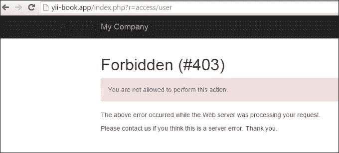

我们已经覆盖了我们自己的标准`AccessRule`类，该类位于`components/AccessRule.php`文件中。在我们的`AccessRule`类中，我们覆盖了自己的`matchRole`方法，在那里我们获取并检查当前用户角色，并将其与我们的规则中的角色匹配。

最后，我们需要拒绝对特定浏览器的访问。对于这个配方，我们只拒绝 Internet Explorer 9。规则本身放在最上面，因此它首先执行，如下所示：

```php
[
  'allow' => true,
  'actions' => ['user'],
  'matchCallback' => function ($rule, $action) {
      return preg_match('/MSIE 9/',$_SERVER['HTTP_USER_AGENT'])!== false;
  }
],
```

我们所使用的检测技术并不非常可靠，因为 MSIE 包含在许多其他用户代理字符串中。有关可能的用户代理字符串列表，您可以参考[`www.useragentstring.com/`](http://www.useragentstring.com/)。

在前面的代码中，我们使用了另一个过滤器规则属性，名为`'matchCallback'`。此属性仅在描述在此属性中的函数返回`true`时应用。

我们的功能检查用户代理字符串是否包含 MSIE 9.0 字符串。根据您的需求，您可以指定任何 PHP 代码。

## 参见

为了了解更多关于访问控制和过滤器的内容，请参考以下链接：

+   [`www.yiiframework.com/doc-2.0/guide-structure-filters.html`](http://www.yiiframework.com/doc-2.0/guide-structure-filters.html)

+   [`www.yiiframework.com/doc-2.0/yii-filters-accesscontrol.html`](http://www.yiiframework.com/doc-2.0/yii-filters-accesscontrol.html)

+   [`www.yiiframework.com/doc-2.0/yii-filters-accessrule.html`](http://www.yiiframework.com/doc-2.0/yii-filters-accessrule.html)

+   [`github.com/yiisoft/yii2/blob/master/docs/guide/structure-filters.md`](https://github.com/yiisoft/yii2/blob/master/docs/guide/structure-filters.md)

+   [`www.yiiframework.com/doc-2.0/guide-security-authorization.html#access-control-filter`](http://www.yiiframework.com/doc-2.0/guide-security-authorization.html#access-control-filter)

+   *使用 RBAC*配方

# 防止 XSS

XSS 代表跨站脚本，是一种允许在由其他用户查看的页面上注入客户端脚本（通常是 JavaScript）的漏洞。考虑到客户端脚本的力量，这可能导致非常严重的后果，如绕过安全检查、获取其他用户的凭证或数据泄露。

在这个菜谱中，我们将看到如何通过使用 `\yii\helpers\Html` 和 `\yii\helpers\HtmlPurifier` 转义输出来防止 XSS。

## 准备中

1.  按照官方指南使用 Composer 包管理器创建一个新应用，官方指南链接为 [`www.yiiframework.com/doc-2.0/guide-start-installation.html`](http://www.yiiframework.com/doc-2.0/guide-start-installation.html)。

1.  创建 `controllers/XssController.php`：

    ```php
    <?php

    namespace app\controllers;

    use Yii;
    use yii\helpers\Html;
    use yii\web\Controller;

    /**
    * Class SiteController.
    * @package app\controllers
    */
    class XssController extends Controller
    {
       /**
        * @return string
        */
       public function actionIndex()
       {
           $username = Yii::$app->request->get('username', 'nobody');

           return $this->renderContent(Html::tag('h1',
               'Hello, ' . $username . '!'
           ));
       }
    }
    ```

1.  通常，它将被用作 `/xss/simple?username=Administrator`。然而，由于没有考虑到主要的安全原则 *过滤输入，转义输出*，恶意用户将能够以下这种方式使用它：

    ```php
    /xss/simple?username=<script>alert('XSS');</script>
    ```

1.  之前的代码将导致脚本执行，如下截图所示：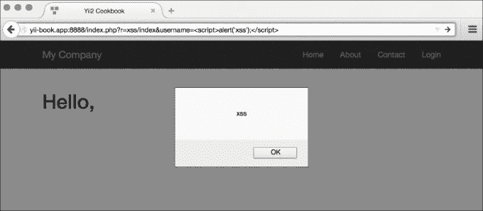

## 如何操作...

执行以下步骤：

1.  为了防止之前截图中的 XSS 警告，我们需要在传递给浏览器之前转义数据。我们这样做如下：

    ```php
    <?php

    namespace app\controllers;

    use Yii;
    use yii\helpers\Html;
    use yii\web\Controller;

    /**
    * Class SiteController.
    * @package app\controllers
    */
    class XssController extends Controller
    {
       /**
        * @return string
        */
       public function actionIndex()
       {
           $username = Yii::$app->request->get('username', 'nobody');

           return $this->renderContent(Html::tag('h1',
               Html::encode('Hello, ' . $username . '!')
           ));
       }
    }
    ```

1.  现在，我们将得到正确转义的 HTML，如下截图所示：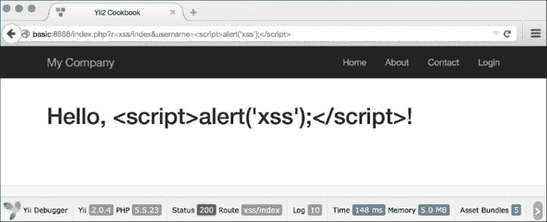

1.  因此，基本规则是始终转义所有动态数据。例如，我们也应该对链接名称做同样的处理：

    ```php
    use \yii\helpers\Html;

    echo Html::a(Html::encode($_GET['username']), array());
    ```

就这样。你有一个没有 XSS 的页面。现在，如果我们想允许一些 HTML 通过，我们不能再使用 `\yii\helpers\Html::encode`，因为它会将 HTML 渲染为代码，而我们需要实际的表示。幸运的是，Yii 中有一个工具可以用来过滤恶意 HTML。它被称为 `HTML Purifier`，可以使用以下方式：

```php
<?php

namespace app\controllers;

use Yii;
use yii\helpers\Html;
use yii\helpers\HtmlPurifier;
use yii\web\Controller;

/**
* Class SiteController.
* @package app\controllers
*/
class XssController extends Controller
{
   /**
    * @return string
    */
   public function actionIndex()
   {
       $username = Yii::$app->request->get('username', 'nobody');

       $content = Html::tag('h1', 'Hello, ' . $username . '!');

       return $this->renderContent(
           HtmlPurifier::process($content)
       );
   }
}
```

现在如果我们通过类似 `/xss/index?username=<i>username</i>!<script>alert('XSS')</script>` 的 URL 访问 HTML 动作，HTML Purifier 将移除恶意部分，我们得到以下结果：

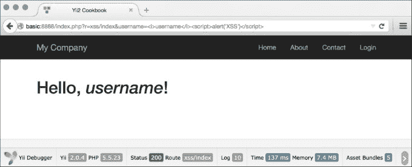

## 它是如何工作的...

1.  在内部，`\yii\helpers\Html::encode` 看起来如下：

    ```php
    public static function encode($content, $doubleEncode = true)
    {
       return htmlspecialchars($content, ENT_QUOTES | ENT_SUBSTITUTE, Yii::$app ? Yii::$app->charset : 'UTF-8', $doubleEncode);
    }
    ```

1.  因此，基本上，我们使用 PHP 的内部 `htmlspecialchars` 函数，如果不会忘记在第三个参数中传递正确的字符集，它相当安全。

`\yii\helpers\HtmlPurifier` 使用 HTML Purifier 库，这是目前最先进的解决方案，用于防止 HTML 中的 XSS。我们使用了它的默认配置，这对于大多数用户输入的内容来说是足够的。

## 还有更多...

关于 XSS 和 HTML Purifier 有更多需要了解的内容；它们将在以下部分中讨论。

### XSS 类型

XSS 注入主要有两种类型，具体如下：

+   非持久性

+   持久性

第一种类型是我们菜谱中使用的，也是最常见的一种 XSS 类型；它可以在大多数不安全的 Web 应用程序中找到。用户通过或通过 URL 传递的数据不会存储在任何地方，因此注入的脚本只会被执行一次，并且只针对输入它的用户。尽管如此，它并不像看起来那么安全。恶意用户可以在指向另一个网站的链接中包含 XSS，并且当另一个用户点击链接时，其核心将被执行。

第二种类型要严重得多，因为恶意用户输入的数据被存储在数据库中，并且被许多，如果不是所有网站用户看到。使用这种 XSS，恶意用户可以命令所有用户删除他们可以访问的所有数据，从而实际上破坏你的网站。

## 参见

为了了解更多关于 XSS 及其处理方法的信息，请参考以下资源：

+   [`htmlpurifier.org/docs`](http://htmlpurifier.org/docs)

+   [`ha.ckers.org/xss.html`](http://ha.ckers.org/xss.html)

+   [`shiflett.org/blog/2007/may/character-encoding-and-xss`](http://shiflett.org/blog/2007/may/character-encoding-and-xss)

# 防止 SQL 注入

SQL 注入是一种代码注入类型，它利用数据库级别的漏洞，允许你执行任意的 SQL 语句，使得恶意用户能够执行诸如删除数据或提升权限等操作。

在这个菜谱中，我们将看到易受攻击的代码示例并修复它们。

## 准备工作

1.  使用 Composer 包管理器创建一个新的应用程序，如官方指南[`www.yiiframework.com/doc-2.0/guide-start-installation.html`](http://www.yiiframework.com/doc-2.0/guide-start-installation.html)中所述。

1.  执行以下 SQL：

    ```php
    DROP TABLE IF EXISTS `user`;
    CREATE TABLE `user` (
       `id` int(11) unsigned NOT NULL AUTO_INCREMENT,
       `username` varchar(100) NOT NULL,
       `password` varchar(32) NOT NULL,
       PRIMARY KEY (`id`)
    );

    INSERT INTO `user`(`id`,`username`,`password`) VALUES ( '1','Alex','202cb962ac59075b964b07152d234b70');

    INSERT INTO `user`(`id`,`username`,`password`) VALUES ( '2','Qiang','202cb962ac59075b964b07152d234b70');
    ```

1.  使用 Gii 生成`User`模型。

## 如何操作...

1.  首先，我们将实现一个简单的动作，检查来自 URL 的用户名和密码是否正确。创建`app/controllers/SqlController.php`：

    ```php
    <?php

    namespace app\controllers;

    use app\models\User;
    use Yii;
    use yii\base\Controller;
    use yii\base\Exception;
    use yii\helpers\ArrayHelper;
    use yii\helpers\Html;

    /**
    * Class SqlController.
    * @package app\controllers
    */
    class SqlController extends Controller
    {
       protected function renderContentByResult($result)
       {
           if ($result) {
               $content = "Success";
           } else {
               $content = "Failure";
           }

           return $this->renderContent($content);
       }

       public function actionSimple()
       {
           $userName = Yii::$app->request->get('username');
           $password = Yii::$app->request->get('password');

           $passwordHash = md5($password);

           $sql = "SELECT * FROM `user`"
                  ." WHERE `username` = '".$userName."'"
                  ." AND password = '".$passwordHash."' LIMIT |1";

           $result = Yii::$app->db->createCommand($sql)->queryOne();

           return $this->renderContentByResult($result);
       }

    }
    ```

1.  让我们尝试使用`/sql/simple?username=test&password=test` URL 来访问它。由于我们不知道用户名和密码，它将像预期的那样打印**失败**。

1.  现在尝试访问`/sql/simple?username=%27+or+%271%27%3D%271%27%3B+--&password=whatever`。这次，它让我们进去了，尽管我们仍然不知道实际的凭证。`usernamevalue`解码部分看起来如下：

    ```php
    ' or '1'='1'; --
    ```

1.  关闭引号以保持语法正确。添加`OR '1'='1',`使条件始终为真。使用`; --`结束查询并注释其余部分。

1.  由于没有进行转义，整个查询执行如下：

    ```php
    SELECT * FROM user WHERE username = '' or '1'='1'; --' AND password = '008c5926ca861023c1d2a36653fd88e2' LIMIT 1;

    ```

1.  解决这个问题最好的方法是使用预处理语句，如下所示：

    ```php
    public function actionPrepared()
    {
       $userName = Yii::$app->request->get('username');
       $password = Yii::$app->request->get('password');

       $passwordHash = md5($password);

       $sql = "SELECT * FROM `user`"
              ." WHERE `username` = :username"
              ." AND password = :password LIMIT 1";

       $command = Yii::$app->db->createCommand($sql);
       $command->bindValue(':username', $userName);
       $command->bindValue(':password', $passwordHash);
       $result = $command->queryOne();

       return $this->renderContentByResult($result);
    }
    ```

1.  现在用相同的恶意参数检查`/sql/prepared`。这次一切正常，我们收到了**失败**消息。同样的原则也适用于 ActiveRecord。这里唯一的区别是 AR 使用不同的语法：

    ```php
    public function actionAr()
    {
       $userName = Yii::$app->request->get('username');
       $password = Yii::$app->request->get('password');

       $passwordHash = md5($password);

       $result = User::findOne([
           'username' => $userName,
           'password' => $passwordHash
       ]);

       return $this->renderContentByResult($result);
    }
    ```

1.  在之前的代码中，我们像数组键一样使用了`username`和`password`参数，并带有值样式。如果我们只使用第一个参数来编写之前的代码，它就会变得脆弱：

    ```php
    public function actionWrongAr()
    {
       $userName = Yii::$app->request->get('username');
       $password = Yii::$app->request->get('password');

       $passwordHash = md5($password);

       $condition = "`username` = '".$userName." AND `password` = '".$passwordHash."'";

       $result = User::find()->where($condition)->one();

       return $this->renderContentByResult($result);
    }
    ```

1.  如果使用得当，预处理语句可以让你免受所有类型的 SQL 注入。尽管如此，还有一些常见问题：

    +   你只能将一个值绑定到一个参数上，所以如果你想查询`WHERE IN(1, 2, 3, 4)`，你将不得不创建并绑定四个参数。

    +   预处理语句不能用于表名、列名和其他关键字。

1.  当使用`ActiveRecord`时，第一个问题可以通过添加`where`来解决，如下所示：

    ```php
    public function actionIn()
    {
       $names  = ['Alex', 'Qiang'];
       $users = User::find()->where(['username' => $names])->all();

       return $this->renderContent(Html::ul(
           ArrayHelper::getColumn($users, 'username')
       ));
    }
    ```

1.  第二个问题可以通过多种方式解决。第一种方式是依赖于活动记录和 PDO 引号：

    ```php
    public function actionColumn()
    {
       $attr = Yii::$app->request->get('attr');
       $value = Yii::$app->request->get('value');

       $users = User::find()->where([$attr => $value])->all();

       return $this->renderContent(Html::ul(
           ArrayHelper::getColumn($users, 'username')
       ));
    }
    ```

1.  但最安全的方式是使用白名单方法，如下所示：

    ```php
    public function actionWhiteList()
    {
       $attr = Yii::$app->request->get('attr');
       $value = Yii::$app->request->get('value');

       $allowedAttr = ['username', 'id'];

       if (!in_array($attr, $allowedAttr)) {
           throw new Exception("Attribute specified is not allowed.");
       }

       $users = User::find()->where([$attr => $value])->all();

       return $this->renderContent(Html::ul(
           ArrayHelper::getColumn($users, 'username')
       ));
    }
    ```

## 它是如何工作的...

防止 SQL 注入的主要目标是正确地过滤输入。在除了表名之外的所有情况下，我们使用了预处理语句——这是大多数关系型数据库服务器支持的一个特性。它们允许你一次性构建语句，然后多次使用，并提供了一种绑定参数值的安全方式。

在 Yii 中，你可以为 Active Record 和 DAO 使用预处理语句。当使用 DAO 时，可以通过使用`bindValue`或`bindParam`来实现。后者在我们想要执行多个相同类型的查询同时改变参数值时很有用：

```php
public function actionBind()
{
   $userName = 'Alex';
   $passwordHash = md5('password1');

   $sql = "INSERT INTO `user` (`username`, `password`) VALUES (:username, :password);";

   // insert first user
   $command = Yii::$app->db->createCommand($sql);
   $command->bindParam('username', $userName);
   $command->bindParam('password', $passwordHash);
   $command->execute();

   // insert second user
   $userName = 'Qiang';
   $passwordHash = md5('password2');
   $command->execute();

   return $this->renderContent(Html::ul(
       ArrayHelper::getColumn(User::find()->all(), 'username')
   ));
}
```

大多数 Active Record 方法都接受参数。为了安全起见，你应该使用这些参数而不是直接传递原始数据。

至于引号表名、列名和其他关键字，你可以依赖于活动记录或使用白名单方法。

## 参见

为了了解更多关于 SQL 注入以及通过 Yii 与数据库交互的信息，请参考以下内容：

+   [`www.slideshare.net/billkarwin/sql-injection-myths-and-fallacies`](http://www.slideshare.net/billkarwin/sql-injection-myths-and-fallacies)

+   [`www.yiiframework.com/doc-2.0/yii-db-connection.html`](http://www.yiiframework.com/doc-2.0/yii-db-connection.html)

+   [`www.yiiframework.com/doc-2.0/yii-db-command.html`](http://www.yiiframework.com/doc-2.0/yii-db-command.html)

+   [`www.yiiframework.com/doc-2.0/guide-security-best-practices.html#avoiding-sql-injections`](http://www.yiiframework.com/doc-2.0/guide-security-best-practices.html#avoiding-sql-injections)

+   在第三章的*从数据库获取数据*食谱中，*ActiveRecord, Model, 和数据库*

# 防止 CSRF

CSRF 是跨站请求伪造的缩写，恶意用户欺骗用户的浏览器在用户登录时静默地向网站执行 HTTP 请求。

这种攻击的一个例子是插入一个不可见的图像标签，其 `src` 指向 `http://example.com/site/logout`。即使该 `image` 标签插入在其他网站上，你也会立即从 `example.com` 登出。CSRF 的后果可能非常严重：破坏网站数据，阻止所有网站用户登录，泄露私人数据等等。

关于 CSRF 的几个事实：

+   由于 CSRF 应该由受害者用户的浏览器执行，攻击者通常无法更改发送的 HTTP 头部。然而，存在浏览器和 Flash 插件漏洞，允许用户伪造头部，因此我们不应依赖这些。

+   攻击者应该传递与用户通常相同的参数和值。

考虑到这些，处理 CSRF 的一个好方法是，在表单提交期间传递和检查一个唯一的令牌，并且，此外，根据 HTTP 规范使用 GET。

Yii 包含内置的令牌生成和令牌检查功能。此外，它还可以自动将令牌插入到 HTML 表单中。

为了避免 CSRF，你应该始终：

+   遵循 HTTP 规范，即 `GET` 不应改变其应用程序状态

+   保持 Yii CSRF 保护启用

在这个菜谱中，我们将看到如何确保我们的应用程序对 CSRF 具有抵抗力。

## 准备工作

通过使用官方指南中描述的 Composer 包管理器创建一个新的应用程序，官方指南的网址为 [`www.yiiframework.com/doc-2.0/guide-start-installation.html`](http://www.yiiframework.com/doc-2.0/guide-start-installation.html)。

## 如何操作...

1.  为了启用反 CSRF 保护，我们应该按照以下方式添加 `config/main.php`：

    ```php
    'components' => [
        ..
       request => [
            ..
           'enableCsrfValidation => true,
            ..
       ],
        ..
    ],
    ```

1.  选项 `enableCsrfValidation` 默认为 `true`。当 CSRF 验证启用时，提交给 Yii 网络应用程序的表单必须来自同一应用程序。如果不是，将引发 `400 HTTP 异常`。

    注意，此功能要求用户客户端接受 cookie。

1.  在配置应用程序后，你应该在带有 `ActiveForm` 的视图中使用 `ActiveForm::beginForm` 和 `CHtml::endForm` 而不是 HTML 表单标签：

    ```php
    <?php $form = ActiveForm::begin(['id' => 'login-form']); ?>
         <input type='text' name='name'
         .........
    <?php ActiveForm::end(); ?>
    ```

1.  或者手动：

    ```php
    <form action='#' method='POST'>
      <input type="hidden" name="<?= Yii::$app->request->csrfParam ?>" value="<?=Yii::$app->request->getCsrfToken()?>" />
      ....
    </form>
    ```

1.  在第一种情况下，Yii 自动添加一个隐藏的令牌字段，如下所示：

    ```php
          <form action="/csrf/create" method="post">
          <div style="display:none"><input type="hidden" value="e4d1021e79ac
          269e8d6289043a7a8bc154d7115a" name="YII_CSRF_TOKEN" />
    ```

1.  如果你将此表单保存为 HTML 并尝试提交，你将收到如下截图所示的提示信息，而不是常规的数据处理：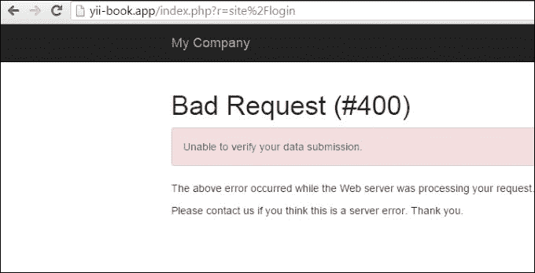

## 它是如何工作的...

在内部，在表单渲染期间，我们有如下代码：

```php
if ($request->enableCsrfValidation && !strcasecmp($method, 'post')) {
  $hiddenInputs[] = static::hiddenInput($request->csrfParam, $request->getCsrfToken());
}

if (!empty($hiddenInputs)) {
  $form .= "\n" . implode("\n", $hiddenInputs);
}
```

在前面的代码中，`getCsrfToken()` 生成一个唯一的令牌值并将其写入到 cookie 中。然后，在随后的请求中，比较 cookie 和 `POST` 值。如果它们不匹配，将显示错误信息而不是常规的数据处理。

如果你需要执行 `POST` 请求但不想使用 `CHtml` 构建表单，则可以传递一个参数，其名称来自 `Yii::app()->request->csrfParam`，其值来自 `Yii::$app->request->getCsrfToken()`。

## 还有更多...

让我们看看更多功能。

禁用所有操作的 CSRF 令牌

1.  如果你有 `enableCsrfValidation` 的问题，你可以将其关闭。

1.  要禁用 CSRF，将以下代码添加到你的控制器中：

    ```php
    public function beforeAction($action) { 
        $this->enableCsrfValidation = false; 
        return parent::beforeAction($action);
    }
    ```

### 禁用特定操作的 CSRF 令牌

```php
public function beforeAction($action) { 
    $this->enableCsrfValidation =  ($action->id !== "actionId"); 
    return parent::beforeAction($action);
}
```

### CSRF 验证用于 Ajax 调用

当主布局中的 `enableCsrfValidation` 选项启用时，添加 `csrfMetaTags`：

```php
<head>
  .......
  <?= Html::csrfMetaTags() ?>
</head>

Now you will be able to simply add it to ajax-call
var csrfToken = $('meta[name="csrf-token"]').attr("content");
$.ajax({
        url: 'request'
        type: 'post',
        dataType: 'json',
        data: {param1: param1, _csrf : csrfToken},
});
```

### 此外 [重命名]

如果你的应用程序需要非常高的安全级别，例如银行账户管理系统，可以采取额外措施。

首先，你可以使用 `config/main.php` 关闭记住我功能，如下所示：

```php
'components' => [
    ..
   'user' => [
        ..
       'enableAutoLogin' => false,
        ..
   ],
    ..
],
```

注意，如果 `enabledSession` 选项为 `true`，则此方法将不起作用。

然后，你可以降低会话超时时间，如下所示：

```php
'components' => [
    ..
   'session' => [
        ..
       'timeout' => 200,
        ..
   ],
    ..
],
```

这设置了数据被视为垃圾并清理后的秒数。

当然，这些措施将使用户体验更差，但它们将增加一个额外的安全层。

### 正确使用 GET 和 POST

HTTP 强制不使用会更改数据或状态的 `GET` 操作。坚持这个规则是良好的实践。它不能阻止所有类型的 CSRF，但至少可以实施一些注入，如 ``。

## 参见

为了了解更多关于 SQL 注入和通过 Yii 与数据库交互的信息，请参考以下 URL：

+   [`en.wikipedia.org/wiki/Cross-site_request_forgery`](http://en.wikipedia.org/wiki/Cross-site_request_forgery)

+   [`www.yiiframework.com/doc-2.0/guide-security-best-practices.html#avoiding-csrf`](http://www.yiiframework.com/doc-2.0/guide-security-best-practices.html#avoiding-csrf)

+   [`www.yiiframework.com/doc-2.0/yii-web-request.html#$enableCsrfValidation-detail`](http://www.yiiframework.com/doc-2.0/yii-web-request.html#%24enableCsrfValidation-detail)

+   *防止 XSS* 食谱。

# 使用 RBAC

**基于角色的访问控制**（**RBAC**）提供简单而强大的集中式访问控制。它是 Yii 中最强大的访问控制方法。它在指南中有描述，但由于它相当复杂且强大，如果不稍微深入了解，可能不容易理解。

在本食谱中，我们将从 definitive guide 中获取角色层次结构，导入它，并解释内部发生的情况。

## 准备工作

1.  使用 Composer 包管理器创建一个新的应用程序，如官方指南中所述 [`www.yiiframework.com/doc-2.0/guide-start-installation.html`](http://www.yiiframework.com/doc-2.0/guide-start-installation.html)。

1.  创建一个 MySQL 数据库并配置它。

1.  在你的 `config/main.php` 和 `config/console.php` 中配置 `authManager` 组件，如下所示：

    ```php
    return [
       // ...
       'components' => [
           'authManager' => [
               'class' => 'yii\rbac\DbManager',
           ],
           // ...
       ],
    ];
    ```

1.  运行迁移：

    ```php
    yii migrate --migrationPath=@yii/rbac/migrations
    ```

## 如何做到这一点...

执行以下步骤：

1.  创建访问规则 `rbac/AuthorRule.php`：

    ```php
    <?php

    namespace app\rbac;

    use yii\rbac\Rule;

    /**
    * Class AuthorRule.
    * @package app\rbac
    */
    class AuthorRule extends Rule
    {
       public $name = 'isAuthor';

       /**
        * @param int|string $user
        * @param \yii\rbac\Item $item
        * @param array $params
        *
        * @return bool
        */
       public function execute($user, $item, $params)
       {
           return isset($params['post']) ? $params['post']->createdBy == $user : false;
       }
    }
    ```

1.  创建一个控制台命令，`command/RbacController.php`，以 `init` RBAC 规则命令：

    ```php
    <?php

    namespace app\commands;

    use app\models\User;
    use Yii;
    use yii\console\Controller;

    /**
    * Class RbacController.
    * @package app\commands
    */
    class RbacController extends Controller
    {
       public function actionInit()
       {
           $auth = Yii::$app->authManager;

           $createPost = $auth->createPermission('createPost');
           $createPost->description = 'Create a post';

           $updatePost = $auth->createPermission('updatePost');
           $updatePost->description = 'Update a post';

           $updatePost = $auth->createPermission('updatePost');
           $updatePost->description = 'Update a post';

           $deletePost = $auth->createPermission('deletePost');
           $deletePost->description = 'Delete a post';

           $readPost = $auth->createPermission('readPost');
           $readPost->description = 'Read a post';

           $authorRule = new \app\rbac\AuthorRule();

           // add permissions
           $auth->add($createPost);
           $auth->add($updatePost);
           $auth->add($deletePost);
           $auth->add($readPost);
           $auth->add($authorRule);

           // add the "updateOwnPost" permission and associate the rule with it.
           $updateOwnPost = $auth->createPermission('updateOwnPost');
           $updateOwnPost->description = 'Update own post';
           $updateOwnPost->ruleName = $authorRule->name;

           $auth->add($updateOwnPost);
           $auth->addChild($updateOwnPost, $updatePost);

           // create Author role
           $author = $auth->createRole('author');
           $auth->add($author);
           $auth->addChild($author, $createPost);
           $auth->addChild($author, $updateOwnPost);
           $auth->addChild($author, $readPost);

           // create Admin role
           $admin = $auth->createRole('admin');
           $auth->add($admin);
           $auth->addChild($admin, $updatePost);
           $auth->addChild($admin, $deletePost);
           $auth->addChild($admin, $author);

           // assign roles
           $auth->assign($admin, User::findByUsername('admin')->id);
           $auth->assign($author, User::findByUsername('demo')->id);

           echo "Done!\n";
       }
    }
    ```

1.  就这样。在控制台中运行它：

    ```php
    yii rbac/init

    ```

1.  按如下方式创建 `controllers/RbacController.php`：

    ```php
    <?php

    namespace app\controllers;

    use app\models\User;
    use stdClass;
    use Yii;
    use yii\filters\AccessControl;
    use yii\helpers\Html;
    use yii\web\Controller;

    /**
    * Class RbacController.
    */
    class RbacController extends Controller
    {
       public function behaviors()
       {
           return [
               'access' => [
                   'class' => AccessControl::className(),
                   'rules' => [
                       [
                           'allow' => true,
                           'actions' => ['delete'],
                           'roles' => ['deletePost'],
                       ],
                       [
                           'allow' => true,
                           'actions' => ['test'],
                       ],
                   ],
               ],
           ];
       }

       public function actionDelete()
       {
           return $this->renderContent(
               Html::tag('h1', 'Post deleted.')
           );
       }

       /**
        * @param $description
        * @param $rule
        * @param array $params
        *
        * @return string
        */
       protected function renderAccess($description, $rule, $params = [])
       {
           $access = Yii::$app->user->can($rule, $params);

           return $description.': '.($access ? 'yes' : 'no');
       }

       public function actionTest()
       {
           $post = new stdClass();
           $post->createdBy = User::findByUsername('demo')->id;

           return $this->renderContent(
               Html::tag('h1', 'Current permissions').
               Html::ul([
                   $this->renderAccess('Use can create post', 'createPost'),
                   $this->renderAccess('Use can read post', 'readPost'),
                   $this->renderAccess('Use can update post', 'updatePost'),
                   $this->renderAccess('Use can own update post', 'updateOwnPost', [
                       'post' => $post,
                   ]),
                   $this->renderAccess('Use can delete post', 'deletePost'),
               ])
           );
       }
    }
    ```

1.  现在运行一次`rbac/test`以检查对 RBAC 层次结构中创建的所有权限的访问权限：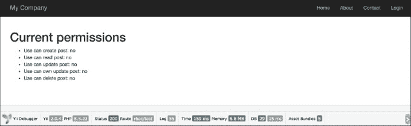

1.  然后，尝试以`demo`（密码是`demo`）身份登录并再次运行`rbac/test`：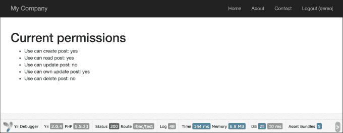

1.  然后，尝试以`admin`（密码是`admin`）身份登录并再次运行`rbac/test`：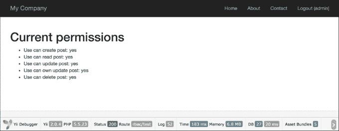

1.  以`demo`用户身份登录并运行`rbac/delete`：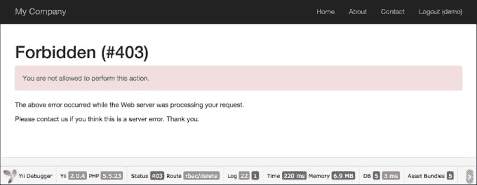

1.  以`admin`身份登录并运行`rbac/delete`：

## 它是如何工作的…

Yii 实现了遵循`NIST RBAC`模型的通用层次结构 RBAC。它通过`authManagerapplication`组件提供 RBAC 功能。

RBAC 层次结构是一个有向无环图，即一组节点及其有向连接或边。有三种类型的节点可用：角色、权限和规则。

角色代表一组权限（例如创建帖子和管理帖子）。一个角色可以分配给一个或多个用户。为了检查用户是否具有指定的权限，我们可以检查用户是否被分配了一个包含该权限的角色。

角色和权限都可以组织成层次结构。特别是，一个角色可能包含其他角色或权限，一个权限也可能包含其他权限。Yii 实现了一个部分顺序的层次结构，它包括更特殊的`tree`层次结构。虽然一个角色可以包含一个权限，但反过来不一定成立。

为了测试权限，我们创建了两个操作。第一个操作是`test`，它包含了对创建的权限和角色的检查器。第二个操作是`delete`，它通过访问过滤器进行限制。访问过滤器的规则包含以下代码：

```php
[
   'allow' => true,
   'actions' => ['delete'],
   'roles' => ['deletePost'],
],
```

这意味着我们允许所有具有`deletePost`权限的用户运行`deletePost`操作。Yii 从`deletePost`权限开始检查。除了访问规则元素被命名为`roles`之外，您还可以指定 RBAC 层次结构节点，无论是角色、规则还是权限。检查`updatePost`是复杂的：

```php
Yii::$app->user->can('updatePost', ['post' => $post]);
```

我们使用第二个参数来传递一个帖子（在我们的例子中，我们用`stdClass`模拟了它）。如果用户以`demo`身份登录，那么为了获取访问权限，我们需要从`updatePost`到作者。如果你很幸运，你可能只需要通过`updatePost`、`updateOwnPost`和作者。

由于`updateOwnPost`定义了一个规则，它将在传递给`checkAccess`的参数下运行。如果结果是 true，则将授予访问权限。由于 Yii 不知道最短路径是什么，它会尝试检查所有可能性，直到成功或没有其他选择。

## 更多内容…

以下是一些有用的技巧，可以帮助您有效地使用 RBAC，这些技巧将在以下小节中讨论。

### 保持层次结构简单和高效

在可能的情况下遵循以下建议，以最大限度地提高性能并减少层次结构复杂性：

+   避免将多个角色分配给单个用户

+   不要连接相同类型的节点；例如，避免将一个任务连接到另一个任务

### 命名 RBAC 节点

如果不使用某种命名约定，复杂的层次结构就难以理解。以下是一个可能的约定，有助于减少混淆：

```php
  [group_][own_]entity_action
```

其中 `own` 用于规则确定只有当当前用户是元素的拥有者且 `group` 只是一个命名空间时，用户才能修改元素。`entity` 是我们正在处理的实体的名称，`action` 是我们正在执行的操作。

例如，如果我们需要创建一个规则来决定用户是否可以删除博客文章，我们将将其命名为 `blog_post_delete`。如果规则决定用户是否可以编辑自己的博客评论，名称将是 `blog_own_comment_edit`。

## 参见

为了了解更多关于 SQL 注入和通过 Yii 与数据库交互的信息，请参考以下内容：

+   [RBAC 沙恩杜-费拉伊奥洛-库恩 00](http://csrc.nist.gov/rbac/sandhu-ferraiolo-kuhn-00.pdf)

+   [基于角色的访问控制](http://en.wikipedia.org/wiki/Role-based_access_control)

+   [有向无环图](http://en.wikipedia.org/wiki/Directed_acyclic_graph)

+   [`www.yiiframework.com/doc-2.0/guide-security-authorization.html#role-based-access-control-rbac`](http://www.yiiframework.com/doc-2.0/guide-security-authorization.html#role-based-access-control-rbac)

+   使用控制器过滤器的配方

# 加密/解密数据

Yii2 框架包含一个特殊的网络安全组件，该组件提供了一套处理常见安全相关任务的方法。`\yii\base\Security` 类需要 `OpenSSL` PHP 扩展而不是 `mcrypt`。

## 准备工作

1.  按照官方指南使用 Composer 包管理器创建一个新应用程序，[官方指南链接](http://www.yiiframework.com/doc-2.0/guide-start-installation.html)。

1.  按如下方式设置数据库连接并创建一个名为 `order` 的表：

    ```php
    DROP TABLE IF EXISTS `order`;
    CREATE TABLE IF NOT EXISTS `order` (
    `id` INT(10) UNSIGNED NOT NULL AUTO_INCREMENT,
    `client` VARCHAR(255) NOT NULL,
    `total` FLOAT NOT NULL,
    `encrypted_field` BLOB NOT NULL,
    PRIMARY KEY (`id`)
    );
    ```

1.  使用 Gii 生成 `Order` 模型。

## 如何操作...

1.  在 `config/params.php` 中添加一个额外的键参数，如下所示：

    ```php
    <?php

    return [
        'adminEmail' => 'admin@example.com',
        'key' => 'mysecretkey'
    ];
    ```

1.  将 `behaviors` 和 `helper` 属性添加到 `Order` 模型中，如下所示：

    ```php
    public $encrypted_field_temp;

    public function behaviors()
    {
       return [
           [
               'class' => AttributeBehavior::className(),
               'attributes' => [
                   ActiveRecord::EVENT_BEFORE_INSERT => 'encrypted_field',
                   ActiveRecord::EVENT_BEFORE_UPDATE => 'encrypted_field',
               ],
               'value' => function ($event) {
                   $event->sender->encrypted_field_temp = $event->sender->encrypted_field;
                   return Yii::$app->security->encryptByKey(
                       $event->sender->encrypted_field,
                       Yii::$app->params['key']
                   );
               },
           ],
           [
               'class' => AttributeBehavior::className(),
               'attributes' => [
                   ActiveRecord::EVENT_AFTER_INSERT => 'encrypted_field',
                   ActiveRecord::EVENT_AFTER_UPDATE => 'encrypted_field',
               ],
               'value' => function ($event) {
                   return $event->sender->encrypted_field_temp;
               },
           ],
           [
               'class' => AttributeBehavior::className(),
               'attributes' => [
                   ActiveRecord::EVENT_AFTER_FIND => 'encrypted_field',
               ],
               'value' => function ($event) {
                   return Yii::$app->security->decryptByKey(
                       $event->sender->encrypted_field,
                       Yii::$app->params['key']
                   );
               },
           ],
       ];
    }
    ```

1.  添加 `controllers/CryptoController.php`：

    ```php
    <?php

    namespace app\controllers;

    use app\models\Order;
    use Yii;
    use yii\db\Query;
    use yii\helpers\ArrayHelper;
    use yii\helpers\Html;
    use yii\helpers\VarDumper;
    use yii\web\Controller;

    /**
    * Class CryptoController.
    * @package app\controllers
    */
    class CryptoController extends Controller
    {
       public function actionTest()
       {
           $newOrder = new Order();
           $newOrder->client = "Alex";
           $newOrder->total = 100;
           $newOrder->encrypted_field = 'very-secret-info';
           $newOrder->save();

           $findOrder = Order::findOne($newOrder->id);

           return $this->renderContent(Html::ul([
               'New model: ' . VarDumper::dumpAsString($newOrder->attributes),
               'Find model: ' . VarDumper::dumpAsString($findOrder->attributes)
           ]));

       }

       public function actionRaw()
       {
           $row = (new Query())->from('order')
               ->where(['client' => 'Alex'])
               ->one();

           return $this->renderContent(Html::ul(
               $row
           ));
       }
    }
    ```

1.  运行 `crypto/test`，你将得到以下结果：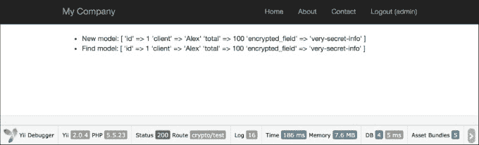

1.  要查看原始数据，运行 `crypto/raw`：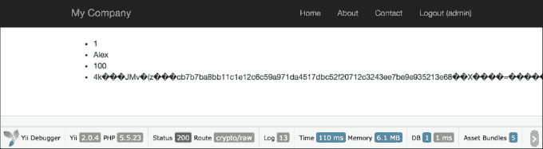

## 它是如何工作的...

首先，我们添加了 `AttributeBehavior`，它会在某些事件发生时自动处理我们的数据。我们的事件是 `ActiveRecord::EVENT_AFTER_INSERT`、`ActiveRecord::EVENT_AFTER_UPDATE` 和 `ActiveRecord::EVENT_AFTER_FIND`。

在插入和更新事件期间，我们使用特殊方法`Yii::$app->security->encryptByKey();`解密我们的数据：在将其保存到数据库之前，使用 HKDF 和随机盐解密我们的数据。从数据库获取数据后，我们还可以使用`ActiveRecord::EVENT_AFTER_FIND`方法来解密我们的数据。在这种情况下，我们也使用特殊的 Yii2 方法`Yii::$app->security->encryptByKey();`。此方法接受两个参数：加密数据和密钥。

## 更多内容...

除了数据加密和解密，安全组件还提供使用标准算法进行密钥派生、数据篡改预防和密码验证。

### 处理密码

验证密码：

```php
if (Yii::$app->getSecurity()->validatePassword($password, $hash)) {
 // all good, logging user in
} else {
 // wrong password
}
```

## 参见

为了了解更多关于 SQL 注入和通过 Yii 与数据库工作的信息，请参阅[`www.yiiframework.com/doc-2.0/guide-security-passwords.html`](http://www.yiiframework.com/doc-2.0/guide-security-passwords.html)
