# 第八章。扩展 Yii

在本章中，我们将涵盖以下主题：

+   创建辅助器

+   创建模型行为

+   创建组件

+   创建可重用的控制器操作

+   创建可重用的控制器

+   创建小部件

+   创建 CLI 命令

+   创建过滤器

+   创建模块

+   创建自定义视图渲染器

+   创建多语言应用程序

+   使扩展准备分发

# 简介

在本章中，我们将向您展示如何实现自己的 Yii 扩展，以及如何使您的扩展可重用并对社区有用。此外，我们将关注许多您应该做的事情，以确保您的扩展尽可能高效。

# 创建辅助器

在 `yii\helpers` 命名空间中有很多内置框架辅助器，如 `StringHelper`。这些包含用于操作字符串、文件、数组和其他主题的静态方法集。

在许多情况下，为了添加额外的行为，你可以创建一个自己的辅助器并将任何静态函数放入其中。例如，我们在本食谱中实现了数字辅助器。

## 准备工作

使用官方指南中描述的 composer 包管理器创建一个新的 `yii2-app-basic` 应用程序，请参阅 [`www.yiiframework.com/doc-2.0/guide-start-installation.html`](http://www.yiiframework.com/doc-2.0/guide-start-installation.html).

## 如何操作…

1.  在你的项目中创建 `helpers` 目录并编写 `NumberHelper` 类：

    ```php
    <?php
    namespace app\helpers;

    class NumberHelper
    {
        public static function format($value, $decimal = 2)
        {
            return number_format($value, $decimal, '.', ',');
        }
    }
    ```

1.  将 `actionNumbers` 方法添加到 `SiteController`：

    ```php
    <?php
    ...
    class SiteController extends Controller
    {
        …

        public function actionNumbers()
        {
            return $this->render('numbers', ['value' => 18878334526.3]);
        }
    }
    ```

1.  添加 `views/site/numbers.php` 视图：

    ```php
    <?php
    use app\helpers\NumberHelper;
    use yii\helpers\Html;

    /* @var $this yii\web\View */
    /* @var $value float */

    $this->title = 'Numbers';
    $this->params['breadcrumbs'][] = $this->title;
    ?>
    <div class="site-numbers">
        <h1><?= Html::encode($this->title) ?></h1>

        <p>
            Raw number:<br />
            <b><?= $value ?></b>
        </p>
        <p>
            Formatted number:<br />
            <b><?= NumberHelper::format($value) ?></b>
        </p>
    </div>
    ```

1.  打开操作。你应该看到以下结果：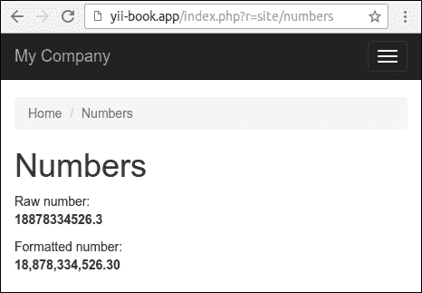

在其他情况下，你可以指定另一个小数位数。观察以下示例：

```php
NumberHelper::format($value, 3)
```

## 它是如何工作的…

任何 Yii2 辅助器都只是一组函数，作为相应类中的静态方法实现。

你可以使用辅助器来实现任何不同格式的输出，对任何变量的值进行操作，以及其他情况。

### 注意

通常，静态辅助器是轻量级的干净函数，具有少量参数。避免将业务逻辑和其他复杂操作放入辅助器中。在其他情况下，使用小部件或其他组件代替辅助器。

## 参见

关于辅助器的更多信息，请参阅：

[`www.yiiframework.com/doc-2.0/guide-helper-overview.html`](http://www.yiiframework.com/doc-2.0/guide-helper-overview.html).

关于内置辅助器的示例，请参阅框架 `helpers` 目录中的源代码。对于框架，请参阅：

[`github.com/yiisoft/yii2/tree/master/framework/helpers`](https://github.com/yiisoft/yii2/tree/master/framework/helpers).

# 创建模型行为

当前的 Web 应用程序中有许多类似的解决方案。领先的产品，如 Google 的 Gmail，正在定义良好的 UI 模式。其中之一是软删除。与需要大量确认的永久删除不同，Gmail 允许我们立即标记消息为已删除，然后轻松撤销。同样的行为可以应用于任何对象，如博客文章、评论等。

让我们创建一个允许标记模型为已删除、恢复模型、选择尚未删除的模型、已删除的模型以及所有模型的行为。在这个菜谱中，我们将遵循测试驱动开发的方法来规划行为并测试实现是否正确。

## 准备工作

1.  使用官方指南中描述的 composer 创建一个新的`yii2-app-basic`应用程序，指南链接为[`www.yiiframework.com/doc-2.0/guide-start-installation.html`](http://www.yiiframework.com/doc-2.0/guide-start-installation.html)。

1.  为工作和测试创建两个数据库。

1.  在`config/db.php`中配置 Yii 以使用您主应用程序中的第一个数据库。确保测试应用程序使用`tests/codeception/config/config.php`中的第二个数据库。

1.  创建一个新的迁移：

    ```php
    <?php
    use yii\db\Migration;

    class m160427_103115_create_post_table extends Migration
    {
        public function up()
        {
            $this->createTable('{{%post}}', [
                'id' => $this->primaryKey(),
                'title' => $this->string()->notNull(),
                'content_markdown' => $this->text(),
                'content_html' => $this->text(),
            ]);
        }

        public function down()
        {
            $this->dropTable('{{%post}}');
        }
    }
    ```

1.  将迁移应用到工作数据库和测试数据库：

    ```php
    ./yii migrate
    tests/codeception/bin/yii migrate
    ```

1.  创建`Post`模型：

    ```php
    <?php
    namespace app\models;

    use app\behaviors\MarkdownBehavior;
    use yii\db\ActiveRecord;

    /**
     * @property integer $id
     * @property string $title
     * @property string $content_markdown
     * @property string $content_html
     */
    class Post extends ActiveRecord
    {
        public static function tableName()
        {
            return '{{%post}}';
        }

        public function rules()
        {
            return [
                [['title'], 'required'],
                [['content_markdown'], 'string'],
                [['title'], 'string', 'max' => 255],
            ];
        }
    }
    ```

## 如何做…

首先，让我们准备一个测试环境，从定义`Post`模型的固定数据开始。创建`tests/codeception/unit/fixtures/PostFixture.php`文件：

```php
<?php
namespace app\tests\codeception\unit\fixtures;

use yii\test\ActiveFixture;

class PostFixture extends ActiveFixture
{
    public $modelClass = 'app\models\Post';
    public $dataFile = '@tests/codeception/unit/fixtures/data/post.php';
}
```

1.  将固定数据文件添加到`tests/codeception/unit/fixtures/data/post.php`：

    ```php
    <?php
    return [
        [
            'id' => 1,
            'title' => 'Post 1',
            'content_markdown' => 'Stored *markdown* text 1',
            'content_html' => "<p>Stored <em>markdown</em> text 1</p>\n",
        ],
    ];
    ```

1.  然后，我们需要创建一个测试用例，`tests/codeception/unit/MarkdownBehaviorTest.php`：

    ```php
    <?php
    namespace app\tests\codeception\unit;

    use app\models\Post;
    use app\tests\codeception\unit\fixtures\PostFixture;
    use yii\codeception\DbTestCase;

    class MarkdownBehaviorTest extends DbTestCase
    {
        public function testNewModelSave()
        {
            $post = new Post();
            $post->title = 'Title';
            $post->content_markdown = 'New *markdown* text';

            $this->assertTrue($post->save());
            $this->assertEquals("<p>New <em>markdown</em> text</p>\n", $post->content_html);
        }

        public function testExistingModelSave()
        {
            $post = Post::findOne(1);

            $post->content_markdown = 'Other *markdown* text';
            $this->assertTrue($post->save());

            $this->assertEquals("<p>Other <em>markdown</em> text</p>\n", $post->content_html);
        }

        public function fixtures()
        {
            return [
                'posts' => [
                    'class' => PostFixture::className(),
                ]
            ];
        }
    }
    ```

1.  运行单元测试：

    ```php
    codecept run unit MarkdownBehaviorTest
    Ensure that tests has not passed:
    Codeception PHP Testing Framework v2.0.9
    Powered by PHPUnit 4.8.27 by Sebastian Bergmann and contributors.

    Unit Tests (2) ---------------------------------------------------------------------------
    Trying to test ... MarkdownBehaviorTest::testNewModelSave             Error
    Trying to test ... MarkdownBehaviorTest::testExistingModelSave        Error
    ---------------------------------------------------------------------------

    Time: 289 ms, Memory: 16.75MB

    ```

1.  现在我们需要实现行为，将其附加到模型上，并确保测试通过。创建一个新的目录，`behaviors`。在这个目录下，创建一个`MarkdownBehavior`类：

    ```php
    <?php
    namespace app\behaviors;

    use yii\base\Behavior;
    use yii\base\Event;
    use yii\base\InvalidConfigException;
    use yii\db\ActiveRecord;
    use yii\helpers\Markdown;

    class MarkdownBehavior extends Behavior
    {
        public $sourceAttribute;
        public $targetAttribute;

        public function init()
        {
            if (empty($this->sourceAttribute) || empty($this->targetAttribute)) {
                throw new InvalidConfigException('Source and target must be set.');
            }
            parent::init();
        }

        public function events()
        {
            return [
                ActiveRecord::EVENT_BEFORE_INSERT => 'onBeforeSave',
                ActiveRecord::EVENT_BEFORE_UPDATE => 'onBeforeSave',
            ];
        }

        public function onBeforeSave(Event $event)
        {
            if ($this->owner->isAttributeChanged($this->sourceAttribute)) {
                $this->processContent();
            }
        }

        private function processContent()
        {
            $model = $this->owner;
            $source = $model->{$this->sourceAttribute};
            $model->{$this->targetAttribute} = Markdown::process($source);
        }
    }
    ```

1.  让我们将行为附加到`Post`模型上：

    ```php
    class Post extends ActiveRecord
    {
        ...

        public function behaviors()
        {
            return [
                'markdown' => [
                    'class' => MarkdownBehavior::className(),
                    'sourceAttribute' => 'content_markdown',
                    'targetAttribute' => 'content_html',
                ],
            ];
        }
    }
    ```

1.  运行测试并确保通过：

    ```php
    Codeception PHP Testing Framework v2.0.9
    Powered by PHPUnit 4.8.27 by Sebastian Bergmann and contributors.

    Unit Tests (2) ---------------------------------------------------------------------------
    Trying to test ... MarkdownBehaviorTest::testNewModelSave             Ok
    Trying to test ... MarkdownBehaviorTest::testExistingModelSave        Ok
    ---------------------------------------------------------------------------

    Time: 329 ms, Memory: 17.00MB

    ```

1.  就这样。我们已经创建了一个可重用的行为，并且可以通过将其连接到模型来在所有未来的项目中使用它。

## 它是如何工作的…

让我们从测试用例开始。由于我们想要使用一组模型，我们正在定义固定数据。每次执行测试方法时，固定数据集都会放入“数据库”中。

我们准备单元测试来指定行为应该如何工作：

+   首先，我们正在测试新模型内容的处理。行为必须将源属性中的 Markdown 文本转换为 HTML，并将第二个存储到目标属性中。

+   其次，我们正在测试更新现有模型的内容。在更改 Markdown 内容并保存模型后，我们必须获取更新的 HTML 内容。

现在，让我们转到有趣的实现细节。在行为中，我们可以添加自己的方法，这些方法将被混合到附加行为到的模型中。我们还可以订阅所有者组件的事件。我们正在使用它来添加一个自己的监听器：

```php
public function events()
{
    return [
        ActiveRecord::EVENT_BEFORE_INSERT => 'onBeforeSave',
        ActiveRecord::EVENT_BEFORE_UPDATE => 'onBeforeSave',
    ];
}
```

现在我们可以实现这个监听器：

```php
public function onBeforeSave(Event $event)
{
    if ($this->owner->isAttributeChanged($this->sourceAttribute))
    {
        $this->processContent();
    }
}
```

在所有方法中，我们可以使用`owner`属性来获取行为附加到的对象。一般来说，我们可以将任何行为附加到我们的模型、控制器、应用程序和其他扩展`yii\base\Component`类的组件上。此外，我们还可以将一个行为重复附加到模型上以处理不同的属性：

```php
class Post extends ActiveRecord
{
    ...

    public function behaviors()
    {
        return [
            [
                'class' => MarkdownBehavior::className(),
                'sourceAttribute' => 'description_markdown',
                'targetAttribute' => 'description_html',
            ],
            [
                'class' => MarkdownBehavior::className(),
                'sourceAttribute' => 'content_markdown',
                'targetAttribute' => 'content_html',
            ],
        ];
    }
}
```

此外，我们可以像`yii\behaviors\TimestampBehavior`一样扩展`yii\base\AttributeBehavior`类，以更新任何事件指定的属性。

## 参见

要了解更多关于行为和事件的信息，请参阅以下页面：

+   [`www.yiiframework.com/doc-2.0/guide-concept-behaviors.html`](http://www.yiiframework.com/doc-2.0/guide-concept-behaviors.html)

+   [`www.yiiframework.com/doc-2.0/guide-concept-events.html`](http://www.yiiframework.com/doc-2.0/guide-concept-events.html)

有关 Markdown 语法的更多信息，请参阅[`daringfireball.net/projects/markdown/`](http://daringfireball.net/projects/markdown/)。

此外，请参阅本章的*使扩展准备就绪*配方。

# 创建组件

如果您有一些看起来可以重用的代码，但不知道它是一个行为、小部件还是其他东西，那么它很可能是组件。组件应该继承自`yii\base\Component`类。稍后，组件可以附加到应用程序中，并使用配置文件的`components`部分进行配置。与仅使用纯 PHP 类相比，这是主要优势。此外，我们获得了行为、事件、获取器和设置器支持。

对于我们的示例，我们将实现一个简单的交换应用程序组件，该组件将能够从[`fixer.io`](http://fixer.io)站点获取货币汇率，将其附加到应用程序中，并使用它。

## 准备工作

使用 composer 创建一个新的`yii2-app-basic`应用程序，如官方指南中所述，[`www.yiiframework.com/doc-2.0/guide-start-installation.html`](http://www.yiiframework.com/doc-2.0/guide-start-installation.html)。

## 如何做到这一点…

对于获取货币汇率，我们的组件应该向服务 URL（如[`api.fixer.io/2016-05-14?base=USD`](http://api.fixer.io/2016-05-14?base=USD)）发送 HTTP GET 查询。

服务必须返回最近工作日的所有支持的汇率：

```php
{
    "base":"USD",
    "date":"2016-05-13",
    "rates": {
        "AUD":1.3728,
        "BGN":1.7235,
        ...
        "ZAR":15.168,
        "EUR":0.88121
    }
}
```

组件应从 JSON 格式的响应中提取针币货币并返回目标汇率：

1.  在您的应用程序结构中创建`components`目录。

1.  使用以下接口创建组件类示例：

    ```php
    <?php
    namespace app\components;

    use yii\base\Component;

    class Exchange extends Component
    {
        public function getRate($source, $destination, $date = null)
        {

        }
    }
    ```

1.  实现组件功能：

    ```php
    <?php
    namespace app\components;

    use yii\base\Component;
    use yii\base\InvalidConfigException;
    use yii\base\InvalidParamException;
    use yii\caching\Cache;
    use yii\di\Instance;
    use yii\helpers\Json;

    class Exchange extends Component
    {
        /**
        * @var string remote host
        */
        public $host = 'http://api.fixer.io';
        /**
        * @var bool cache results or not
        */
        public $enableCaching = false;
        /**
        * @var string|Cache component ID
        */
        public $cache = 'cache';

        public function init()
        {
            if (empty($this->host)) {
                throw new InvalidConfigException('Host must be set.');
            }
            if ($this->enableCaching) {
                $this->cache = Instance::ensure($this->cache, Cache::className());
            }
            parent::init();
        }

        public function getRate($source, $destination, $date = null)
        {
            $this->validateCurrency($source);
            $this->validateCurrency($destination);
            $date = $this->validateDate($date);
            $cacheKey = $this->generateCacheKey($source, $destination, $date);
            if (!$this->enableCaching || ($result = $this->cache->get($cacheKey)) === false) {
                $result = $this->getRemoteRate($source, $destination, $date);
                if ($this->enableCaching) {
                    $this->cache->set($cacheKey, $result);
                }
            }
            return $result;
        }

        private function getRemoteRate($source, $destination, $date)
        {
            $url = $this->host . '/' . $date . '?base=' . $source;
            $response = Json::decode(file_get_contents($url));
            if (!isset($response['rates'][$destination])) {
                throw new \RuntimeException('Rate not found.');
            }
            return $response['rates'][$destination];
        }

        private function validateCurrency($source)
        {
            if (!preg_match('#^[A-Z]{3}$#s', $source)) {
                throw new InvalidParamException('Invalid currency format.');
            }
        }

        private function validateDate($date)
        {
            if (!empty($date) && !preg_match('#\d{4}\-\d{2}-\d{2}#s', $date)) {
                throw new InvalidParamException('Invalid date format.');
            }
            if (empty($date)) {
                $date = date('Y-m-d');
            }
            return $date;
        }

        private function generateCacheKey($source, $destination, $date)
        {
            return [__CLASS__, $source, $destination, $date];
        }
    }
    ```

1.  将组件附加到您的`config/console.php`或`config/web.php`配置文件中：

    ```php
    'components' => [
        'cache' => [
            'class' => 'yii\caching\FileCache',
        ],
        'exchange' => [
            'class' => 'app\components\Exchange',
            'enableCaching' => true,
        ],
        // ...
        db' => $db,
    ],
    ```

1.  目前，我们可以直接使用新组件或通过`get`方法使用：

    ```php
    echo \Yii::$app->exchange->getRate('USD', 'EUR');
    echo \Yii::$app->get('exchange')->getRate('USD', 'EUR', '2014-04-12');
    ```

1.  创建一个演示控制台控制器：

    ```php
    <?php
    namespace app\commands;

    use yii\console\Controller;

    class ExchangeController extends Controller
    {
        public function actionTest($currency, $date = null)
        {
            echo \Yii::$app->exchange->getRate('USD', $currency, $date) . PHP_EOL;
        }
    }
    ```

1.  现在尝试运行任何命令：

    ```php
    $ ./yii exchange/test EUR
    > 0.90196

    $ ./yii exchange/test EUR 2015-11-24
    > 0.93888

    $ ./yii exchange/test OTHER
    > Exception 'yii\base\InvalidParamException' with message 'Invalid currency format.'

     $ ./yii exchange/test EUR 2015/24/11
    Exception 'yii\base\InvalidParamException' with message 'Invalid date format.'

    $ ./yii exchange/test ASD
    > Exception 'RuntimeException' with message 'Rate not found.'
    ```

因此，您必须在成功情况下看到汇率值或在错误情况下看到特定的异常。除了创建自己的组件外，您还可以做更多的事情。

### 覆盖现有应用程序组件

大多数情况下，您不需要创建自己的应用程序组件，因为其他类型的扩展，如小部件或行为，几乎涵盖了所有可重用代码的类型。然而，覆盖核心框架组件是一种常见的做法，并且可以用来根据您的特定需求自定义框架的行为，而无需修改核心。

例如，为了能够使用`Yii::app()->formatter->asNumber($value)`方法而不是从*创建辅助工具*配方中的`NumberHelper::format`方法格式化数字，您可以按照以下步骤操作：

1.  如下扩展`yii\i18n\Formatter`组件：

    ```php
    <?php
    namespace app\components;

    class Formatter extends \yii\i18n\Formatter
    {
        public function asNumber($value, $decimal = 2)
        {
            return number_format($value, $decimal, '.', ',');
        }
    }
    ```

1.  覆盖内置的`formatter`组件的类：

    ```php
    'components' => [
        // ...
        formatter => [
            'class' => 'app\components\Formatter,
        ],
        // ...
    ],
    ```

1.  目前，我们可以直接使用此方法：

    ```php
    echo Yii::app()->formatter->asNumber(1534635.2, 3);
    ```

    或者，它也可以用作`GridView`和`DetailView`小部件的新格式：

    ```php
    <?= \yii\grid\GridView::widget([
        'dataProvider' => $dataProvider,
        'columns' => [
            'id',
            'created_at:datetime',
            'title',
            'value:number',
        ],
    ]) ?>
    ```

1.  此外，您还可以扩展每个现有组件，而无需覆盖其源代码。

## 它是如何工作的…

要将组件附加到应用程序中，可以从`yii\base\Component`类扩展。附加操作就像在配置的组件部分添加一个新的数组一样简单。在那里，类值指定组件的类，所有其他值都通过相应组件的公共属性和设置方法设置给组件。

实现本身非常简单；我们将[`api.fixer.io`](http://api.fixer.io)调用封装到一个方便的 API 中，其中包含验证器和缓存。我们可以通过`Yii::$app`使用其组件名称访问我们的类。在我们的例子中，它将是`Yii::$app->exchange`。

## 参见

关于组件的官方信息，请参阅[`www.yiiframework.com/doc-2.0/guide-concept-components.html`](http://www.yiiframework.com/doc-2.0/guide-concept-components.html)。

对于`NumberHelper`类的源代码，请参考*创建辅助工具*配方。

# 创建可重用的控制器操作

常见操作，如通过主键删除 AR 模型或获取用于 AJAX 自动完成的 数据，可以移动到可重用的控制器操作，并在需要时附加到控制器。

在本配方中，我们将创建一个可重用的删除操作，该操作将通过主键删除指定的 AR 模型。

## 准备中

1.  使用官方指南中描述的 composer 创建一个新的`yii2-app-basic`应用程序，[`www.yiiframework.com/doc-2.0/guide-start-installation.html`](http://www.yiiframework.com/doc-2.0/guide-start-installation.html)。

1.  创建一个新的数据库并对其进行配置。

1.  创建并应用以下迁移：

    ```php
    <?php
    use yii\db\Migration;

    class m160308_093233_create_post_table extends Migration
    {
        public function up()
        {
            $this->createTable('{{%post}}', [
                'id' => $this->primaryKey(),
                'title' => $this->string()->notNull(),
                'text' => $this->text()->notNull(),
            ]);
        }

        public function down()
        {
            $this->dropTable('{{%post}}');
        }
    }
    ```

1.  使用 Gii 为帖子生成模型和评论。

1.  使用 Gii 生成标准的 CRUD 控制器`app\controllers\PostController`。

1.  确保 CRUD 操作正常工作：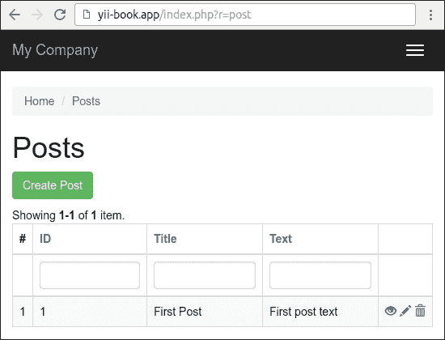

1.  在成功的情况下，添加一组示例帖子。

## 如何操作…

执行以下步骤：

1.  创建操作目录并添加`DeleteAction`独立操作：

    ```php
    <?php
    namespace app\actions;

    use yii\base\Action;
    use yii\base\InvalidConfigException;
    use yii\web\MethodNotAllowedHttpException;
    use yii\web\NotFoundHttpException;

    class DeleteAction extends Action
    {
        public $modelClass;
        public $redirectTo = ['index'];

        public function init()
        {
            if (empty($this->modelClass)) {
                throw new InvalidConfigException('Empty model class.');
            }
            parent::init();
        }

        public function run($id)
        {
            if (!\Yii::$app->getRequest()->getIsPost()) {
                throw new MethodNotAllowedHttpException('Method not allowed.');
            }
            $model = $this->findModel($id);
            $model->delete();
            return $this->controller->redirect($this->redirectTo);
        }

        /**
        * @param $id
        * @return \yii\db\ActiveRecord
        * @throws NotFoundHttpException
        */
        private function findModel($id)
        {
            $class = $this->modelClass;
            if (($model = $class::findOne($id)) !== null) {
                return $model;
            } else {
                throw new NotFoundHttpException('Page does not exist.');
            }
        }
    }
    ```

1.  现在我们需要将其附加到 `controllers/PostController.php` 控制器。删除控制器的 `actionDelete` 和 `behaviors` 方法，并在 `action` 方法中附加您自己的操作：

    ```php
    <?php
    namespace app\controllers;

    use app\actions\DeleteAction;
    use Yii;
    use app\models\Post;
    use app\models\PostSearch;
    use yii\web\Controller;
    use yii\web\NotFoundHttpException;

    class PostController extends Controller
    {
        public function actions()
        {
            return [
                'delete' => [
                    'class' => DeleteAction::className(),
                    'modelClass' => Post::className(),
                ],
            ];
        }

        public function actionIndex()  {  ...  }

        public function actionView($id)  {  ...  }

        public function actionCreate()  {  ...  }

        public function actionUpdate($id)  {  ...  }

        protected function findModel($id)
        {
            if (($model = Post::findOne($id)) !== null) {
                return $model;
            } else {
                throw new NotFoundHttpException('The requested page does not exist.');
            }
        }
    }
    ```

1.  就这样。确保删除操作仍然正确工作，并且在删除后，您将被重定向到相应的索引操作。

## 它是如何工作的…

要创建外部控制器操作，您需要从 `yii\base\Action` 类扩展您的类。唯一必须实现的方法是 `run`。在我们的例子中，它使用 Yii 的自动参数绑定功能从 `$_GET` 接收名为 `$id` 的参数，并尝试删除相应的模型。

为了使其可定制，我们创建了两个可以从控制器配置的公共属性。这些是 `modelName`，它包含我们正在工作的模型名称，以及 `redirectTo`，它指定用户将被重定向到的路由。

配置本身是通过在控制器中实现 `actions` 方法来完成的。在那里，您可以一次或多次附加操作并配置其公共属性。

如果需要将其重定向到另一个操作或渲染特定视图，您可以通过控制器属性访问原始控制器对象。

## 参见

+   要了解更多关于控制器和操作的信息，请参阅 [`www.yiiframework.com/doc-2.0/guide-structure-controllers.html`](http://www.yiiframework.com/doc-2.0/guide-structure-controllers.html)

+   本章中的 *创建可重用控制器* 菜谱

# 创建可重用控制器

在 Yii 中，您可以创建可重用控制器。如果您正在创建大量应用程序或同类型的控制器，将所有通用代码移动到可重用控制器将为您节省大量时间。

在这个菜谱中，我们尝试创建一个通用的 `CleanController`，该控制器将清除临时目录并刷新缓存数据。

## 准备工作

使用官方指南中描述的 composer 创建一个新的 `yii2-app-basic` 应用程序 [`www.yiiframework.com/doc-2.0/guide-start-installation.html`](http://www.yiiframework.com/doc-2.0/guide-start-installation.html)。

## 如何操作…

执行以下步骤以创建可重用控制器：

1.  创建名为 `cleaner` 的目录并添加独立的 `CleanController` 控制器：

    ```php
    <?php
    namespace app\cleaner;

    use Yii;
    use yii\filters\VerbFilter;
    use yii\helpers\FileHelper;
    use yii\web\Controller;

    class CleanController extends Controller
    {
        public $assetPaths = ['@app/web/assets'];
        public $runtimePaths = ['@runtime'];
        public $caches = ['cache'];

        public function behaviors()
        {
            return [
                'verbs' => [
                    'class' => VerbFilter::className(),
                    'actions' => [
                        'assets' => ['post'],
                        'runtime' => ['post'],
                        'cache' => ['post'],
                    ],
                ],
            ];
        }

        public function actionIndex()
        {
            return $this->render('@app/cleaner/views/index');
        }

        public function actionAssets()
        {
            foreach ((array)$this->assetPaths as $path) {
                $this->cleanDir($path);
                Yii::$app->session->addFlash(
                    'cleaner',
                    'Assets path "' . $path . '" is cleaned.'
                );
            }
            return $this->redirect(['index']);
        }

        public function actionRuntime()
        {
            foreach ((array)$this->runtimePaths as $path) {
                $this->cleanDir($path);
                Yii::$app->session->addFlash(
                    'cleaner',
                    'Runtime path "' . $path . '" is cleaned.'
                );
            }
            return $this->redirect(['index']);
        }

        public function actionCache()
        {
            foreach ((array)$this->caches as $cache) {
                Yii::$app->get($cache)->flush();
                Yii::$app->session->addFlash(
                    'cleaner',
                    'Cache "' . $cache . '" is cleaned.'
                );
            }
            return $this->redirect(['index']);
        }

        private function cleanDir($dir)
        {
            $iterator = new \DirectoryIterator(Yii::getAlias($dir));
            foreach($iterator as $sub) {
                if(!$sub->isDot() && $sub->isDir()) {
                    FileHelper::removeDirectory($sub->getPathname());
                }
            }
        }
    }
    ```

1.  为 `actionIndex` 方法创建 `cleaner/views/index.php` 视图文件：

    ```php
    <?php
    use yii\helpers\Html;
    /* @var $this yii\web\View */
    $this->title = 'Cleaner';
    $this->params['breadcrumbs'][] = $this->title;
    ?>
    <div class="clean-index">
        <h1><?= Html::encode($this->title) ?></h1>

        <?php if (Yii::$app->session->hasFlash('cleaner')): ?>
        <?php foreach ((array)Yii::$app->session->getFlash('cleaner', []) as $message): ?>
        <div class="alert alert-success">
            <?= $message ?>
        </div>
        <?php endforeach; ?>
        <?php endif; ?>

        <p>
            <?= Html::a('Clear Caches', ['cache'], [
                'class' => 'btn btn-primary',
                'data' => [
                    'confirm' => 'Are you sure you want to clear all cache data?',
                    'method' => 'post',
                ],
            ]) ?>
            <?= Html::a('Clear Assets', ['assets'], 
                ['class' => 'btn btn-primary',
                    'data' => [
                        'confirm' => 'Are you sure you want to 
                            clear all temporary assets?',
                    'method' => 'post',
                ],
            ]) ?>
            <?= Html::a('Clear Runtime', ['runtime'], 
                ['class' => 'btn btn-primary',
                    'data' => [
                        'confirm' => 'Are you sure you want to clear all runtime files?',
                            'method' => 'post',
                    ],
                ]) ?>
        </p>
    </div>
    ```

1.  通过 `config/web.php` 配置文件的 `controllerMap` 部分将控制器附加到应用程序：

    ```php
    $config = [
        'id' => 'basic',
        'basePath' => dirname(__DIR__),
        'bootstrap' => ['log'],
        'controllerMap' => [
            'clean' => 'app\cleaner\CleanController',
        ],
        'components' => [
            ...
        ]
        ...
    ];
    ```

1.  向主菜单添加新项目：

    ```php
    echo Nav::widget([
        'options' => ['class' => 'navbar-nav navbar-right'],
        'items' => [
            ['label' => 'Home', 'url' => ['/site/index']],
            ['label' => 'Cleaner', 'url' => ['/clean/index']],
            ['label' => 'About', 'url' => ['/site/about']],
            ...
        ],
    ]);
    ```

1.  打开控制器并清除资源：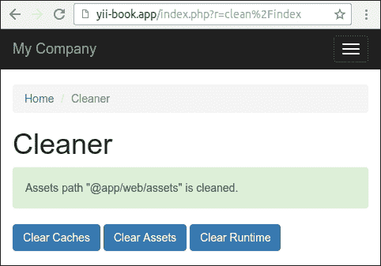

1.  如果您使用的是 yii2-app-advanced 应用程序模板，只需在配置中指定正确的路径：

    ```php
    'controllerMap' => [
        'clean' => 'app\cleaner\CleanController',
        'assetPaths' => [
            '@backend/web/assets',
            '@frontend/web/assets',
        ],
        'runtimePaths' => [
            '@backend/runtime',
            '@frontend/runtime',
            '@console/runtime',
        ],
    ],
    ```

现在我们可以将控制器附加到任何应用程序。

## 它是如何工作的…

当您运行应用程序并传递一个如 `clean/index` 的路由时，在执行 `CleanController::actionIndex` 之前，Yii 会检查是否定义了 `controllerMap`。由于我们已在那里定义了一个干净的控制器，因此 Yii 将执行它而不是走常规路线。

在控制器本身中，我们定义了 `assetPaths`、`runtimePaths` 和 `caches` 属性，以便能够将控制器连接到具有不同目录和缓存结构的应用程序。我们在附加控制器时设置它。

## 参见

+   要了解更多关于控制器和控制器映射的信息，请参阅 [`www.yiiframework.com/doc-2.0/guide-structure-controllers.html`](http://www.yiiframework.com/doc-2.0/guide-structure-controllers.html)

+   本章中的 *创建可重用控制器* 菜谱

# 创建控件

小部件是视图的可重用部分，它不仅渲染一些数据，而且还根据某些逻辑进行渲染。它甚至可以从模型中获取数据并使用自己的视图，因此它类似于模块的简化可重用版本。

让我们创建一个使用 Google API 绘制饼图的控件。

## 准备工作

使用官方指南中描述的 composer 创建一个新的 `yii2-app-basic` 应用程序 [`www.yiiframework.com/doc-2.0/guide-start-installation.html`](http://www.yiiframework.com/doc-2.0/guide-start-installation.html)。

## 如何做…

1.  创建 `widgets` 目录并添加 `ChartWidget` 类：

    ```php
    <?php
    namespace app\widgets;

    use yii\base\Widget;

    class ChartWidget extends Widget
    {
        public $title;
        public $width = 300;
        public $height = 200;
        public $data = [];
        public $labels = [];

        public function run()
        {
            $path = 'http://chart.apis.google.com/chart';

            $query = http_build_query([
                'chtt' => $this->title,
                'cht' => 'pc',
                'chs' => $this->width . 'x' . $this->height,
                'chd' => 't:' . implode(',', $this->data),
                'chds' => 'a',
                'chl' => implode('|', $this->labels),
                'chxt' => 'y',
                'chxl' => '0:|0|' . max($this->data)
            ]);

            $url = $path  . '?' . $query;

            return $this->render('chart', [
                'url' => $url,
            ]);
        }
    }
    ```

1.  创建 `widgets/views/chart.php` 视图：

    ```php
    <?php
    use yii\helpers\Html;

    /* @var $this yii\web\View */
    /* @var $url string */
    ?>

    <div class="chart">
        <?= Html::img($url) ?>
    </div>
    ```

1.  现在创建一个 `ChartController` 控制器：

    ```php
    <?php
    namespace app\controllers;

    use yii\base\Controller;

    class ChartController extends Controller
    {
        public function actionIndex()
        {
            return $this->render('index');
        }
    }
    ```

1.  添加 `views/chart/index.php` 视图：

    ```php
    <?php
    use app\widgets\ChartWidget;
    use yii\helpers\Html;

    /* @var $this yii\web\View */

    $this->title = 'Chart';
    $this->params['breadcrumbs'][] = $this->title;
    ?>
    <div class="site-about">
        <h1><?= Html::encode($this->title) ?></h1>

        <?= ChartWidget::widget([
            'title' => 'My Chart Diagram',
            'data' => [
                100 - 32,
                    32,
            ],
            'labels' => [
                'Big',
                'Small',
            ],
        ]) ?>
    </div>
    ```

1.  现在尝试运行控制器的索引操作。您应该看到如下所示的饼图：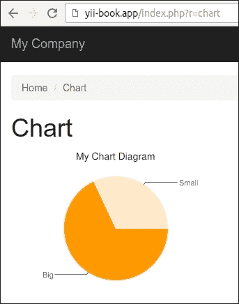

1.  您可以使用不同的大小和数据集显示任何图表。

## 它是如何工作的…

正如在其他任何类型的扩展中一样，我们创建了一些公共属性，我们可以在调用控件的 `widget` 方法时进行配置。在这种情况下，我们配置了标题、数据集和数据标签。

控件的主要方法是 `run()`。在我们的控件中，我们生成一个 URL 并渲染控件视图，该视图使用 Google 图表 API 打印 `` 标签。

## 参见

+   要了解更多关于小部件的信息，请参阅 [`www.yiiframework.com/doc-2.0/guide-structure-widgets.html`](http://www.yiiframework.com/doc-2.0/guide-structure-widgets.html)

+   本章中的 *制作扩展可分发* 菜谱

# 创建 CLI 命令

Yii 具有良好的命令行支持，并允许创建可重用的控制台命令。控制台命令的创建速度比 Web 图形用户界面快。如果您需要为您的应用程序创建一些将被开发人员或管理员使用的实用程序，控制台命令是正确的工具。

为了展示如何创建控制台命令，我们将创建一个简单的命令，该命令将清理各种内容，例如资源和临时目录。

## 准备工作

使用 composer 创建一个新的`yii2-app-basic`应用程序，如官方指南中所述，[`www.yiiframework.com/doc-2.0/guide-start-installation.html`](http://www.yiiframework.com/doc-2.0/guide-start-installation.html)。

## 如何操作…

执行以下步骤以创建 CLI 命令：

1.  使用以下代码创建`commands/CleanController.php`文件：

    ```php
    <?php
    namespace app\commands;

    use yii\console\Controller;
    use yii\helpers\FileHelper;

    /**
    * Removes content of assets and runtime directories.
    */
    class CleanController extends Controller
    {
        public $assetPaths = ['@app/web/assets'];
        public $runtimePaths = ['@runtime'];

        /**
        * Removes temporary assets.
        */
        public function actionAssets()
        {
            foreach ((array)$this->assetPaths as $path) {
                $this->cleanDir($path);
            }

            $this->stdout('Done' . PHP_EOL);
        }

        /**
        * Removes runtime content.
        */
        public function actionRuntime()
        {
            foreach ((array)$this->runtimePaths as $path) {
                $this->cleanDir($path);
            }

            $this->stdout('Done' . PHP_EOL);
        }

        private function cleanDir($dir)
        {
            $iterator = new \DirectoryIterator(\Yii::getAlias($dir));
            foreach($iterator as $sub) {
                if(!$sub->isDot() && $sub->isDir()) {
                    $this->stdout('Removed ' . $sub->getPathname() . PHP_EOL);
                    FileHelper::removeDirectory($sub->getPathname());
                }
            }
        }
    }
    ```

1.  现在我们可以使用我们自己的具有默认设置的 console 控制器。只需运行`yii`shell 脚本：

    ```php
    ./yii

    ```

1.  查找自己的`clean`命令：

    ```php
    This is Yii version 2.0.7.

    The following commands are available:

    - asset                    Allows you to combine...
     asset/compress         Combines and compresses the asset...
     asset/template         Creates template of configuration file...

    ...

    - clean                    Removes content of assets and runtime directories.
     clean/assets           Removes temporary assets.
     clean/runtime          Removes runtime content.

    - fixture                  Manages fixture data loading and unloading.
     fixture/load (default) Loads the specified fixture data.
     fixture/unload         Unloads the specified fixtures.

    ...

    ```

1.  现在运行资产清理：

    ```php
    .yii clean/assets

    ```

1.  查看过程报告：

    ```php
    Removed /yii-book.app/web/assets/25f82b8a
    Removed /yii-book.app/web/assets/9b3b2888
    Removed /yii-book.app/web/assets/f4307424
    Done

    ```

1.  如果您想在`yii2-app-advanced`应用程序中使用此控制器，只需指定自定义工作路径：

    ```php
    return [
        'id' => 'app-console',
        'basePath' => dirname(__DIR__),
        'bootstrap' => ['log'],
        'controllerNamespace' => 'console\controllers',
        'controllerMap' => [
            'clean' => [
                'class' => 'console\controllers\CleanController',
                'assetPaths' => [
                    '@backend/web/assets',
                    '@frontend/web/assets',
                ],
                'runtimePaths' => [
                    '@backend/runtime',
                    '@frontend/runtime',
                    '@console/runtime',
                ],
            ],
        ],
        // ...
    ];
    ```

## 它是如何工作的…

所有控制台命令都应该扩展自`yii\console\Controller`类。由于所有控制台命令都是在`yii\console\Application`而不是`yii\web\Application`中运行的，我们没有方法来确定`@webroot`别名的值。此外，在`yii2-app-advanced`模板中，我们默认有后端、前端和控制台子目录。为此，我们正在创建可配置的公共属性，称为`assetPaths`和`runtimePaths`。

控制台命令结构本身就像一个典型的控制器。我们正在定义几个可以通过`yii <console command>/<command action>`运行的操作。

如您所见，没有使用视图，因此我们可以专注于编程任务而不是设计、标记等。然而，您需要提供一些有用的输出，以便用户知道正在发生什么。这是通过简单的 PHP echo 语句完成的。

如果您的命令相对复杂，例如与 Yii 捆绑的消息或迁移，提供一些关于可用选项和操作的额外描述是一个好主意。这可以通过重写`getHelp`方法来完成：

```php
public function getHelp()
{
    $out = "Clean command allows you to clean up various temporary data Yii and an application are generating.\n\n";
    return $out . parent::getHelp();
}
```

执行以下命令：

```php
./yii help clean

```

您可以按以下方式查看完整输出：

```php
DESCRIPTION
Clean command allows you to clean up various temporary data Yii and an application are generating.
Removes content of assets and runtime directories.
SUB-COMMANDS
- clean/assets   Removes temporary assets.
- clean/runtime  Removes runtime content.

```

默认情况下，当我们运行 shell 命令时：

```php
./yii

```

我们已经在输出列表中看到了所有命令的简化描述：

```php
- clean                    Removes content of assets and runtime directories.
 clean/assets           Removes temporary assets.
 clean/runtime          Removes runtime content.

```

此描述将来自类和动作之前的注释：

```php
/**
* Removes content of assets and runtime directories.
*/
class CleanController extends Controller
{
    /**
    * Removes temporary assets.
    */
    public function actionAssets() { … }

    * Removes runtime content.
    */
    public function actionRuntime() { … }
}
```

为您的类添加描述是可选的。您绝对不应该为您的 CLI 命令这样做。

## 参见

+   本章中的*创建可重用控制器*配方

+   本章中的*制作扩展分发准备就绪*配方

# 创建过滤器

过滤器是一个可以在执行动作之前/之后运行的类。它可以用来修改执行上下文或装饰输出。在我们的例子中，我们将实现一个简单的访问过滤器，它将允许用户在接受**用户协议**后才能看到私有内容。

## 准备工作

使用 composer 创建一个新的`yii2-app-basic`应用程序，如官方指南中所述，[`www.yiiframework.com/doc-2.0/guide-start-installation.html`](http://www.yiiframework.com/doc-2.0/guide-start-installation.html)。

## 如何操作…

1.  创建协议表单模型：

    ```php
    <?php
    namespace app\models;

    use yii\base\Model;

    class AgreementForm extends Model
    {
        public $accept;

        public function rules()
        {
            return [
                ['accept', 'required'],
                ['accept', 'compare', 'compareValue' => 1, 'message' => 'You must agree the rules.'],
            ];
        }

        public function attributeLabels()
        {
            return [
                'accept' => 'I completely accept the rules.'
            ];
        }
    }
    ```

1.  创建协议检查器服务：

    ```php
    <?php
    namespace app\services;

    use Yii;
    use yii\web\Cookie;

    class AgreementChecker
    {
        public function isAllowed()
        {
            return Yii::$app->request->cookies->has('agree');
        }

        public function allowAccess()
        {
            Yii::$app->response->cookies->add(new Cookie([
                'name' => 'agree',
                'value' => 'on',
                'expire' => time() + 3600 * 24 * 90, // 90 days
            ]));
        }
    }
    ```

    1.  它封装了对协议 cookie 的操作。

1.  创建`filter`类：

    ```php
    <?php
    namespace app\filters;

    use app\services\AgreementChecker;
    use Yii;
    use yii\base\ActionFilter;

    class AgreementFilter extends ActionFilter
    {
        public function beforeAction($action)
        {
            $checker = new AgreementChecker();
            if (!$checker->isAllowed()) {
                Yii::$app->response->redirect(['/content/agreement'])->send();
                return false;
            }
            return true;
        }
    }
    ```

1.  创建内容控制器并将过滤器附加到其行为：

    ```php
    <?php
    namespace app\controllers;

    use app\filters\AgreementFilter;
    use app\models\AgreementForm;
    use app\services\AgreementChecker;
    use Yii;
    use yii\web\Controller;

    class ContentController extends Controller
    {
        public function behaviors()
        {
            return [
                [
                    'class' => AgreementFilter::className(),
                    'only' => ['index'],
                ],
            ];
        }

        public function actionIndex()
        {
            return $this->render('index');
        }

        public function actionAgreement()
        {
            $model = new AgreementForm();
            if ($model->load(Yii::$app->request->post()) && $model->validate()) {
                $checker = new AgreementChecker();
                $checker->allowAccess();
                return $this->redirect(['index']);
            } else {
                return $this->render('agreement', [
                    'model' => $model,
                ]);
            }
        }
    }
    ```

1.  添加带有私有内容的`views/content/index.php`视图：

    ```php
    <?php
    use yii\helpers\Html;

    /* @var $this yii\web\View */
    $this->title = 'Content';
    $this->params['breadcrumbs'][] = $this->title;
    ?>
    <div class="site-about">
        <h1><?= Html::encode($this->title) ?></h1>

        <div class="well">
            This is our private page.
        </div>
    </div>
    ```

1.  添加带有表单的`views/content/agreement.php`视图：

    ```php
    <?php
    use yii\helpers\Html;
    use yii\bootstrap\ActiveForm;

    /* @var $this yii\web\View */
    /* @var $form yii\bootstrap\ActiveForm */
    /* @var $model app\models\AgreementForm */

    $this->title = 'User agreement';
    $this->params['breadcrumbs'][] = $this->title;
    ?>
    <div class="site-login">
        <h1><?= Html::encode($this->title) ?></h1>

        <p>Please agree with our rules:</p>

        <?php $form = ActiveForm::begin(); ?>

        <?= $form->field($model, 'accept')->checkbox() ?>

        <div class="form-group">
            <?= Html::submitButton('Accept', ['class' => 'btn btn-success']) ?>
            <?= Html::a('Cancel', ['/site/index'], ['class' => 'btn btn-danger']) ?>
        </div>

        <?php ActiveForm::end(); ?>
    </div>
    ```

1.  将主菜单项添加到`views/layouts/main.php`文件：

    ```php
    echo Nav::widget([
        'options' => ['class' => 'navbar-nav navbar-right'],
        'items' => [
            ['label' => 'Home', 'url' => ['/site/index']],
            ['label' => 'Content', 'url' => ['/content/index']],
            ['label' => 'About', 'url' => ['/site/about']],
            ...
        ],
    ]);
    ```

1.  尝试打开内容页面。过滤器必须将你重定向到协议页面：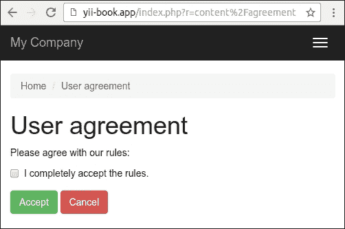

1.  只有在接受规则之后，你才能看到私有内容：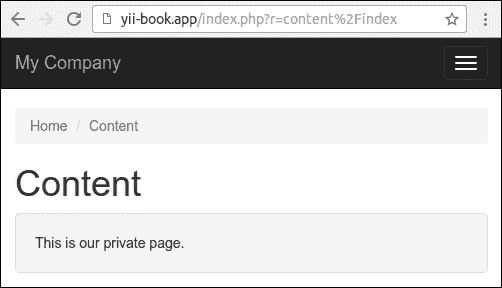

1.  此外，你还可以将过滤器附加到其他控制器或模块。

## 它是如何工作的…

过滤器应该扩展`yii\base\ActionFilter`类，该类扩展了`yii\base\Behavior`。如果我们想进行后过滤和前过滤，我们可以重写`beforeAction`或`afterAction`方法。

例如，我们可以在失败情况下检查用户访问并抛出相应的 HTTP 异常。在这个菜谱中，如果特定的 cookie 值不存在，我们将用户重定向到协议页面：

```php
class AgreementFilter extends ActionFilter
{
    public function beforeAction($action)
    {
        $checker = new AgreementChecker();
        if (!$checker->isAllowed()) {
            Yii::$app->response->redirect(['/content/agreement'])->send();
            return false;
        }
        return true;
    }
}
```

你可以将过滤器附加到任何控制器或模块。要指定必要的路由列表，只需使用`only`或`except`选项。例如，我们只为控制器的 index 动作应用我们的过滤器：

```php
public function behaviors() 
{
    return [
        [
            'class' => AgreementFilter::className(),
            'only' => ['index'],
        ],
    ];
}
```

### 注意

不要忘记在`beforeAction`方法中返回一个`true`值（在成功情况下）。否则，控制器动作将不会执行。

## 相关内容

关于过滤器的更多信息，请参阅 [`www.yiiframework.com/doc-2.0/guide-structure-filters.html`](http://www.yiiframework.com/doc-2.0/guide-structure-filters.html).

对于内置缓存和访问控制过滤器，请参阅：

+   [`www.yiiframework.com/doc-2.0/guide-caching-http.html`](http://www.yiiframework.com/doc-2.0/guide-caching-http.html)

+   [`www.yiiframework.com/doc-2.0/guide-securityauthorization.html`](http://www.yiiframework.com/doc-2.0/guide-securityauthorization.html)

+   *创建模型行为*的菜谱

# 创建模块

如果你已经创建了一个复杂的应用程序部分，并希望在下一个项目中以某种程度的定制使用它，那么你很可能需要创建一个模块。在这个菜谱中，我们将看到如何创建一个应用程序日志视图模块。

## 准备工作

使用官方指南中描述的 composer 创建一个新的`yii2-app-basic`应用程序，指南链接为 [`www.yiiframework.com/doc-2.0/guide-start-installation.html`](http://www.yiiframework.com/doc-2.0/guide-start-installation.html).

## 如何做…

让我们先做一些规划。

在默认配置的`yii2-app-basic`中，所有日志条目都存储在`runtime/logs/app.log`文件中。我们可以使用正则表达式从该文件中提取所有消息，并在**GridView**小部件上显示它们。此外，我们必须允许用户配置自定义日志文件的路径。

执行以下步骤：

1.  创建`modules/log`目录，并使用新文件选项创建`Module`类：

    ```php
    <?php
    namespace app\modules\log;

    class Module extends \yii\base\Module
    {
        public $file = '@runtime/logs/app.log';
    }
    ```

1.  创建一个简单的模型，用于从日志文件中传输行：

    ```php
    <?php
    namespace app\modules\log\models;

    use yii\base\Object;

    class LogRow extends Object
    {
        public $time;
        public $ip;
        public $userId;
        public $sessionId;
        public $level;
        public $category;
        public $text;
    }
    ```

1.  编写一个日志文件读取器类，它将解析文件行，反转其顺序，并返回 `LogRow` 模型实例的数组：

    ```php
    <?php
    namespace app\modules\log\services;

    use app\modules\log\models\LogRow;

    class LogReader
    {
        public function getRows($file)
        {
            $result = [];
            $handle = @fopen($file, "r");
            if ($handle) {
                while (($row = fgets($handle)) !== false) {
                    $pattern =
                        '#^' .
                        '(?P<time>\d{4}\-\d{2}\-\d{2} \d{2}:\d{2}:\d{2}) ' .
                        '\[(?P<ip>[^\]]+)\]' .
                        '\[(?P<userId>[^\]]+)\]' .
                        '\[(?P<sessionId>[^\]]+)\]' .
                        '\[(?P<level>[^\]]+)\]' .
                        '\[(?P<category>[^\]]+)\]' .
                        ' (?P<text>.*?)' .
                        '(\$\_(GET|POST|REQUEST|COOKIE|SERVER) = \[)?' .
                        '$#i';
                    if (preg_match($pattern, $row, $matches)) {
                        if ($matches['text']) {
                            $result[] = new LogRow([
                                'time' => $matches['time'],
                                'ip' => $matches['ip'],
                                'userId' => $matches['userId'],
                                'sessionId' => $matches['sessionId'],
                                'level' => $matches['level'],
                                'category' => $matches['category'],
                                'text' => $matches['text'],
                            ]);
                        }
                    }
                }
                fclose($handle);
            }
            return array_reverse($result);
        }
    }
    ```

1.  添加一个用于显示日志级别的美观 HTML 徽章的辅助器：

    ```php
    <?php
    namespace app\modules\log\helpers;

    use yii\helpers\ArrayHelper;
    use yii\helpers\Html;

    class LogHelper
    {
        public static function levelLabel($level)
        {
            $classes = [
                'error' => 'danger',
                'warning' => 'warning',
                'info' => 'primary',
                'trace' => 'default',
                'profile' => 'success',
                'profile begin' => 'info',
                'profile end' => 'info',
            ];

            $class = ArrayHelper::getValue($classes, $level, 'default');
            return Html::tag('span', Html::encode($level), ['class' => 'label-' . $class]);
        }
    }
    ```

1.  创建一个模块控制器，它将从读取器获取行数组并将它们传递到 `ArrayDataProvider`：

    ```php
    <?php
    namespace app\modules\log\controllers;

    use app\modules\log\services\LogReader;
    use yii\data\ArrayDataProvider;
    use yii\web\Controller;

    class DefaultController extends Controller
    {
        public function actionIndex()
        {
            $reader = new LogReader();
            $dataProvider = new ArrayDataProvider([
                'allModels' => $reader->getRows($this->getFile()),
            ]);
            return $this->render('index', [
                'dataProvider' => $dataProvider,
            ]);
        }

        private function getFile()
        {
            return \Yii::getAlias($this->module->file);
        }
    }
    ```

1.  现在，创建 `modules/log/default/index.php` 视图文件：

    ```php
    <?php
    use app\modules\log\helpers\LogHelper;
    use app\modules\log\models\LogRow;
    use yii\grid\GridView;
    use yii\helpers\Html;

    /* @var $this yii\web\View */
    /* @var $dataProvider yii\data\ArrayDataProvider */

    $this->title = 'Application log';
    $this->params['breadcrumbs'][] = $this->title;
    ?>
    <div class="log-index">
        <h1><?= Html::encode($this->title) ?></h1>

        <?= GridView::widget([
            'dataProvider' => $dataProvider,
            'columns' => [
                [

                'attribute' => 'time',
                    'format' => 'datetime',
                    'contentOptions' => [
                        'style' => 'white-space: nowrap',
                    ],
                ],
                'ip:text:IP',
                'userId:text:User',
                [
                    'attribute' => 'level',
                    'value' => function (LogRow $row) {
                        return LogHelper::levelLabel($row->level);
                    },
                    'format' => 'raw',
                ],
                'category',
                'text',
            ],
        ]) ?>
    </div>
    ```

1.  在 `config/web.php` 文件中将模块附加到你的应用程序中：

    ```php
    $config = [
        'id' => 'basic',
        'basePath' => dirname(__DIR__),
        'bootstrap' => ['log'],
        'modules' => [
            'log' => 'app\modules\log\Module',
        ],
        'components' => [

        ],
        ...
    ];
    ```

1.  在 `views/layouts/main.php` 文件中添加对控制器的链接：

    ```php
    echo Nav::widget([
        'options' => ['class' => 'navbar-nav navbar-right'],
        'items' => [
            ['label' => 'Home', 'url' => ['/site/index']],
            ['label' => 'Log', 'url' => ['/log/default/index']],
            ['label' => 'About', 'url' => ['/site/about']],
            ['label' => 'Contact', 'url' => ['/site/contact']],
            ...
        ],
    ]);
    NavBar::end();
    ```

1.  前往 `url /index.php?r=lo``g` 并确保模块正常工作：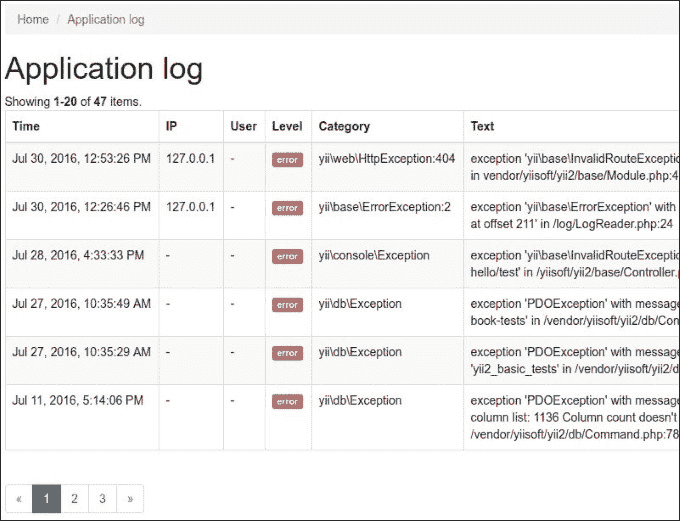

## 它是如何工作的...

你可以通过分离的模块将控制器、模型、视图和其他组件分组，并将它们附加到你的应用程序中。你可以使用 Gii 生成模块模板，或者手动创建它。

每个模块都包含一个主模块类，我们可以在其中定义可配置的属性、定义更改路径、附加控制器等。默认情况下，使用 Gii 生成的模块运行默认控制器的 `index` 动作。

## 参见

+   有关模块和最佳实践的更多信息，请参阅 [`www.yiiframework.com/doc-2.0/guide-structure-modules.html`](http://www.yiiframework.com/doc-2.0/guide-structure-modules.html)

+   *制作扩展准备就绪* 菜谱

# 创建自定义视图渲染器

现在有大量的 PHP 模板引擎。Yii2 只提供原生 PHP 模板。如果你想使用现有的模板引擎或创建自己的模板引擎，你必须实现它——当然，如果它还没有被 Yii 社区实现的话。

在这个菜谱中，我们将重新实现 Smarty 模板支持。

## 准备工作

1.  使用 composer 创建一个新的 `yii2-app-basic` 应用程序，如官方指南中所述，[`www.yiiframework.com/doc-2.0/guide-start-installation.html`](http://www.yiiframework.com/doc-2.0/guide-start-installation.html)。

1.  安装 Smarty 库：

    ```php
    composer require smarty/smarty

    ```

## 如何操作…

执行以下步骤以创建自定义视图渲染器：

1.  创建 `smarty/ViewRenderer.php` 文件：

    ```php
    <?php
    namespace app\smarty;

    use Smarty;
    use Yii;

    class ViewRenderer extends \yii\base\ViewRenderer
    {
        public $cachePath = '@runtime/smarty/cache';
        public $compilePath = '@runtime/smarty/compile';

        /**
        * @var Smarty
        */
        private $smarty;

        public function init()
        {
            $this->smarty = new Smarty();
            $this->smarty->setCompileDir(Yii::getAlias($this->compilePath));
            $this->smarty->setCacheDir(Yii::getAlias($this->cachePath));
            $this->smarty->setTemplateDir([
                dirname(Yii::$app->getView()->getViewFile()),
                Yii::$app->getViewPath(),
            ]);
        }

        public function render($view, $file, $params)
        {
            $templateParams = empty($params) ? null : $params;
            $template = $this->smarty->createTemplate($file, null, null, $templateParams, false);
            $template->assign('app', \Yii::$app);
            $template->assign('this', $view);
            return $template->fetch();
        }
    }
    ```

1.  现在我们需要将视图渲染器连接到应用程序。在 `config/web php` 中，我们需要添加视图组件的渲染器：

    ```php
    'components' => [
        ....
        'view' => [
            'renderers' => [
                'tpl' => [
                    'class' => 'app\smarty\ViewRenderer',
                ],
            ],
        ],
        ...
    ];
    ```

1.  现在让我们来测试它。创建一个新的 `SmartyController`：

    ```php
    <?php
    namespace app\controllers;

    use yii\web\Controller;

    class SmartyController extends Controller
    {
        public function actionIndex()
        {
            return $this->render('index.tpl', [
                'name' => 'Bond',
            ]);
        }
    }
    ```

1.  接下来，我们需要创建 `views/smarty/index.tpl` 视图：

    ```php
    <div class="smarty-index">
        <h1>Smarty Example</h1>
        <p>Hello, {$name}!</p>
    </div>
    ```

1.  现在尝试运行控制器。在成功的情况下，你应该得到以下输出：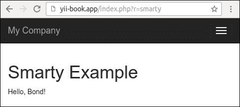

## 它是如何工作的…

视图渲染器是 `yii\base\ViewRenderer` 抽象类的子类，它只实现了一个名为 `render` 的方法：

```php
<?php
namespace yii\base;

abstract class ViewRenderer extends Component
{
    /**
    * Renders a view file.
    *
    * This method is invoked by [[View]] whenever it tries to render a view.
    * Child classes must implement this method to render the given view file.
    *
    * @param View $view the view object used for rendering the file.
    * @param string $file the view file.
    * @param array $params the parameters to be passed to the view file.
    * @return string the rendering result
    */
   abstract public function render($view, $file, $params);
}
```

因此，我们得到了一个视图组件、文件路径和渲染变量。我们需要处理文件并返回渲染结果。在我们的例子中，处理本身是由 Smarty 模板引擎完成的，所以我们需要正确地初始化它并调用其处理方法：

```php
class ViewRenderer extends \yii\base\ViewRenderer
{
    public $cachePath = '@runtime/smarty/cache';
    public $compilePath = '@runtime/smarty/compile';
    private $smarty;

    public function init()
    {
        $this->smarty = new Smarty();
        $this->smarty->setCompileDir(Yii::getAlias($this->compilePath));
        $this->smarty->setCacheDir(Yii::getAlias($this->cachePath));
        $this->smarty->setTemplateDir([
            dirname(Yii::$app->getView()->getViewFile()),
            Yii::$app->getViewPath(),
        ]);
    }
    …
}
```

将 Yii 临时文件存储在应用程序运行时目录中是一个好习惯。这就是为什么我们将`compile`目录（Smarty 存储编译成 PHP 的模板的地方）设置为`runtime/smarty/compile`。

渲染本身稍微简单一些：

```php
public function render($view, $file, $params)
{
    $templateParams = empty($params) ? null : $params;
    $template = $this->smarty->createTemplate($file, null, null, $templateParams, false);
    $template->assign('app', \Yii::$app);
    $template->assign('this', $view);
    return $template->fetch();
}
```

通过`$this->render`设置的所有数据都原样传递给 Smarty 模板。此外，我们正在创建特殊的 Smarty 模板变量`app`和`this`，它们指向`Yii::$app`和`Yii::$app->view`，允许我们在模板内部获取应用程序属性。

然后，我们将渲染模板。

## 参见

你可以在[`github.com/yiisoft/yii2-smarty`](https://github.com/yiisoft/yii2-smarty)上获取使用 Smarty 视图渲染器以及插件和配置支持的准备信息。

要了解更多关于 Smarty 和一般视图渲染器的信息，请参考以下 URL：

+   [`www.smarty.net`](http://www.smarty.net)

+   [`www.yiiframework.com/doc-2.0/guide-tutorial-templateengines.html`](http://www.yiiframework.com/doc-2.0/guide-tutorial-templateengines.html)

+   [`www.yiiframework.com/doc-2.0/guide-structure-views.html`](http://www.yiiframework.com/doc-2.0/guide-structure-views.html)

# 创建多语言应用程序

每天我们都遇到越来越多的国际公司、软件产品和信息资源，它们在多种语言上发布内容。Yii2 为制作多语言应用程序提供了内置的 i18n 支持。

在这个菜谱中，我们将应用程序界面翻译成不同的语言。

## 准备工作

使用 composer 创建一个新的`yii2-app-basic`应用程序，具体步骤请参考官方指南中的[`www.yiiframework.com/doc-2.0/guide-start-installation.html`](http://www.yiiframework.com/doc-2.0/guide-start-installation.html)。

## 如何操作...

1.  在`views/layouts/main.php`文件中将主菜单标签更改为使用`Yii::t('app/nav', '...')`方法：

    ```php
    echo Nav::widget([
        'options' => ['class' => 'navbar-nav navbar-right'],
        'items' => [
            ['label' => Yii::t('app/nav', 'Home'), 'url' => ['/site/index']],
            ['label' => Yii::t('app/nav', 'About'), 'url' => ['/site/about']],
            ['label' => Yii::t('app/nav', 'Contact'), 'url' => ['/site/contact']],
            ...
        ],
    ]);
    ```

1.  将所有标题和面包屑更改为使用通用的`Yii::t('app', '...')`方法：

    ```php
    $this->title = Yii::t('app', 'Contact');
    $this->params['breadcrumbs'][] = $this->title;
    ```

1.  同时，更改所有按钮的标签：

    ```php
    <div class="form-group">
        <?= Html::submitButton(Yii::t('app', 'Submit'), ['class' => 'btn btn-primary'']) ?>
    </div>
    ```

    同时更改其他硬编码的消息：

    ```php
    <p>
        <?= Yii::t('app', 'The above error occurred while the Web server was processing your request.') ?>
    </p>
    ```

1.  更改你的`ContactForm`模型的属性标签：

    ```php
    class LoginForm extends Model
    {
        ...

        public function attributeLabels()
        {
            return [
                'username' => Yii::t('app/user', 'Username'),
                'password' => Yii::t('app/user', 'Password'),
                'rememberMe' => Yii::t('app/user', 'Remember Me'),
            ];
        }
    }
    ```

    同时，更改`LoginForm`模型的属性标签：

    ```php
    class ContactForm extends Model
    {
        ...

        public function attributeLabels()
        {
            return [
                'name' => Yii::t('app/contact', 'Name'),
                'email' => Yii::t('app/contact', 'Email'),
                'subject' => Yii::t('app/contact', 'Subject'),
                'body' => Yii::t('app/contact', 'Body'),
                'verifyCode' => Yii::t('app', 'Verification Code'),
            ];
        }
    }
    ```

    它将输出当前语言的翻译标签而不是原始标签。

1.  为了准备翻译，创建`messages`目录。目前，我们可以为所有需要的语言创建翻译文件。我们可以手动操作，但有一个有用的爬虫可以扫描所有项目文件并从`Yii::t()`结构中提取所有消息。让我们使用它。

1.  生成消息扫描器的配置文件：

    ```php
    ./yii message/config-template config/messages.php

    ```

1.  打开配置文件并设置以下值：

    ```php
    <?php

    return [
        'sourcePath' => '@app',
        'languages' => ['de', 'fr'],
        'translator' => 'Yii::t',
        'sort' => false,
        'removeUnused' => false,
        'markUnused' => true,
        'only' => ['*.php'],
        'except' => [
            '.svn',
            '.git',
            '.gitignore',
            '.gitkeep',
            '.hgignore',
            '.hgkeep',
            '/messages',
            '/vendor',
        ],

        'format' => 'php',
        'messagePath' => '@app/messages',
        'overwrite' => true,

        'ignoreCategories' => [
            'yii',
        ],
    ];
    ```

1.  在传递此配置文件的同时运行爬虫：

    ```php
    ./yii message config/messages.php

    ```

1.  在此过程中，我们必须获得以下目录结构：

    ```php
    messages
    ├── de
    │   ├── app
    │   │   ├── contact.php
    │   │   ├── nav.php
    │   │   └── user.php
    │   └── app.php
    └── fr
        ├── app
        │   ├── contact.php
        │   ├── nav.php
        │   └── user.php
        └── app.php
    ```

1.  例如，`messages/de/app/contact`文件包含以下内容：

    ```php
    <?php
    ... 
    return [
        'Body' => '',
        'Email' => '',
        'Name' => '',
        'Subject' => '',
    ];
    ```

1.  它是一个普通的 PHP 数组，键是原始句子，值是翻译的消息。

1.  只需输入翻译德语消息所需的价值：

    ```php
    <?php
    ... 
    return [
        'Password' => 'Passwort',
        'Remember Me' => 'Erinnere dich an mich',
        'Username' => 'Benutzername',
    ];
    ```

1.  在 `config/web.php` 文件中将这些翻译附加到应用程序的 `i18n` 组件：

    ```php
    $config = [
        'id' => 'basic',
        'basePath' => dirname(__DIR__),
        'bootstrap' => ['log'],
        'components' => [
            …
            'i18n' => [
                'translations' => [
                    'app*' => [
                        'class' => 'yii\i18n\PhpMessageSource',
                        'sourceLanguage' => 'en-US',
                    ],
                ],
            ],
            'db' => require(__DIR__ . '/db.php'),
        ],
        'params' => $params,
    ];
    ```

1.  使用默认语言打开登录页面：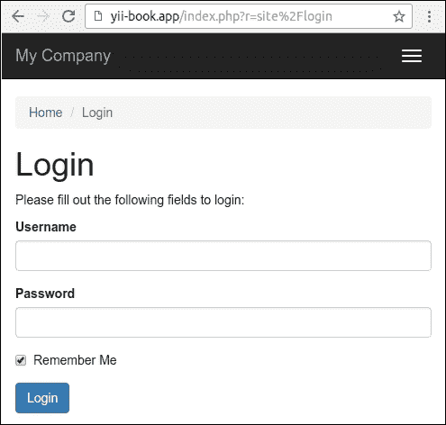

1.  将应用程序语言切换为 `de`：

    ```php
    $config = [
        'id' => 'basic',
        'language' => 'de',
        'basePath' => dirname(__DIR__),
        'bootstrap' => ['log'],
        ...
    ];
    ```

    然后刷新登录页面：

    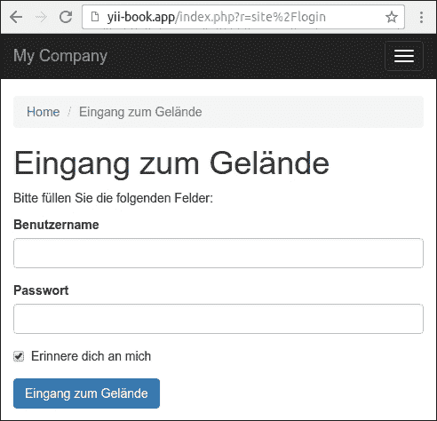

1.  内置框架的消息和默认验证错误将自动翻译。

## 它是如何工作的…

Yii2 提供了 `Yii::t()` 方法，通过 `i18n` 组件翻译界面消息，该组件支持不同类型的源。在本食谱中，我们使用 `yii\i18n\hpMessageSource`，它将翻译消息存储在纯 PHP 文件中。

框架没有人工智能，并且不会自动翻译消息。你必须将准备好的翻译放入文件或数据库中，并将框架中的消息源获取所需的消息。

你可以手动设置当前语言：

```php
$config = [
    'id' => 'basic',
    'language' => 'de',
    ...
];
```

而不是在配置文件中设置语言，你可以在运行时切换应用程序语言：

```php
Yii::$app->language = 'fr';
```

例如，如果你在 `User` 模型的 `lang` 字段中存储用户语言，你可以创建语言加载器：

```php
<?php
namespace app\bootstrap;

use yii\base\BootstrapInterface;

class LanguageBootstrap implements BootstrapInterface
{
    public function bootstrap($app)
    {
        if (!$app->user->isGuest) {
            $app->language = $app->user->identity->lang;
        }
    }
}
```

在引导列表中注册此类：

```php
$config = [
    'id' => 'basic',
    'basePath' => dirname(__DIR__),
    'bootstrap' => ['log', 'app'bootstrap\LanguageBoostrap'],
    ...
];
```

现在，每个经过身份验证的用户都将看到他们自己的语言界面。

此外，你可以覆盖 `yii\web\UrlManager` 类，通过 GET 参数或 URL 的前缀传递当前语言。另外，作为一个替代方案，你可以在浏览器 cookie 中存储选定的语言。

当你使用 Gii 生成模型和其他代码时，你可以检查以下选项：

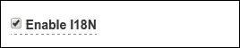

生成代码中的所有标签都将包含在 `Yii::t()` 调用中。

### 注意

我们在本食谱中没有涵盖模型内容的翻译。然而，例如，你可以在数据库中单独的表中（如用于帖子模型的 `post_lang` 表）存储翻译文本，并使用 `Yii::$app->language` 属性的值来获取当前语言，并通过该值提取模型所需的内容。

## 参考也

有关 Yii2 国际化的更多信息，请参阅 [`www.yiiframework.com/doc-2.0/guide-tutorial-i18n.html`](http://www.yiiframework.com/doc-2.0/guide-tutorial-i18n.html)。

# 使扩展准备分发

在本章中，你学习了如何创建各种类型的 Yii 扩展。现在我们将讨论如何与他人分享你的成果以及为什么这很重要。

## 准备工作

让我们先为好的扩展制定一个清单。一个好的编程产品应该遵循以下这些要点：

+   良好的编码风格

+   人们应该能够找到它

+   一致、易于阅读和易于使用的 API

+   良好的文档

+   扩展应该适用于最常见的用例

+   应该得到维护

+   代码经过良好测试，理想情况下带有单元测试

+   你需要提供对其的支持

当然，拥有所有这些需要大量的工作，但这些对于创建一个好的产品是必要的。

## 如何做…

1.  每个现代 PHP 产品都必须遵循[`www.php-fig.org/psr/`](http://www.php-fig.org/psr/)指南中的 PSR4 自动加载标准和 PSR1 和 PSR2 编码风格标准。

1.  让我们更详细地审查我们的列表，从 API 开始。API 应该是一致的、易于阅读和使用的。一致性意味着整体风格不应该改变，所以没有不同的变量命名，没有像`isFlag1()`和`isNotFlag2()`这样的不一致的名称，等等。一切都应该遵循你为你的代码定义的规则。这允许减少对文档的检查，让你可以专注于编码。

1.  没有任何文档的代码几乎毫无用处。一个例外是相对简单的代码，但即使只有几行，如果没有关于如何安装和使用的说明，也会感觉不太对劲。好的文档有哪些特点？代码的目的和优点应该尽可能明显，并且应该写得清晰易懂。

1.  如果开发者不知道代码应该放在哪里以及应用配置中应该有什么，那么代码就毫无用处。不要期望人们知道如何做框架特定的东西。安装指南应该详细说明。大多数开发者更喜欢逐步的形式。如果代码需要 SQL 模式才能工作，请提供它。

1.  即使你的 API 方法和属性命名得当，你仍然需要用 PHPDoc 注释来记录它们，指定参数类型和返回类型，并为每个方法提供简要的描述。不要忘记受保护的和方法和属性，因为有时阅读这些内容是理解代码工作细节的必要条件。同时，考虑在文档中列出公共方法和属性，以便作为参考。

1.  提供带有良好注释的代码用例示例。尽量涵盖扩展使用最常见的方式。

1.  在示例中，不要试图一次解决多个问题，因为这可能会造成混淆。

1.  让你的代码灵活很重要，这样它就可以适用于许多用例。然而，由于不可能为每个可能的用例编写代码，因此尽量涵盖最常见的用例。

1.  让人们感到舒适很重要。提供良好的文档是第一步。第二步是提供证明你的代码按预期工作并且会与后续更新一起工作的证据。最好的方式是一套单元测试。

1.  扩展应该得到维护，至少直到它稳定，没有更多的功能请求和错误报告。因此，预计会有问题和报告，并留出一些时间来进一步工作在代码上。如果你不能投入更多时间来维护扩展，但它非常创新，之前没有人做过，那么仍然值得分享。如果社区喜欢它，肯定有人会提供帮助。

1.  最后，您需要使扩展可用。从您的扩展创建 Composer 包，将其推送到 GitHub 或其他共享仓库存储，并在[`packagist.org`](https://packagist.org)网站上发布。

1.  每个扩展都应该有一个版本号和变更日志。这将允许社区检查他们是否拥有最新版本，并在升级前查看发生了什么变化。我们建议遵循来自[`semver.org`](http://semver.org)网站的**语义版本控制**规则。

1.  即使您的扩展相对简单且文档良好，也可能会有问题，而且第一次，唯一能回答这些问题的人就是您。通常，这些问题会在官方论坛上提出，因此最好创建一个人们可以讨论您的代码并在此扩展页面上提供链接的主题。

## 它是如何工作的…

如果您想与社区分享一个扩展并确保它有用且受欢迎，您需要做的不仅仅是编写代码。使扩展准备分发需要做更多的工作。这甚至可能比创建扩展本身还要多。那么，为什么一开始就要与社区分享扩展呢？

将您在自己的项目中使用的代码开源有其优点。您将获得人们，比您能接触到测试封闭源代码项目的人多得多的测试人员。使用您扩展的人们正在测试它，提供宝贵的反馈，并报告错误。如果您的代码受欢迎，将会有热情的开发者尝试改进您的代码，使其更广泛、更稳定、更可重用。此外，这感觉很好，因为您正在做一件好事。

我们已经涵盖了最重要的内容。尽管如此，还有更多的事情需要检查。在编写自己的扩展之前，尝试使用现有的扩展。如果一个扩展几乎符合要求，尝试联系扩展作者并贡献您的想法。审查现有代码有助于您发现有用的技巧、应该做的和不应该做的。此外，不时查看维基文章和官方论坛；关于创建扩展和一般使用 Yii 进行开发的信息非常丰富。

## 参见

+   关于 PHP 编码标准的现代信息，请参考[`www.php-fig.org/psr/`](http://www.php-fig.org/psr/)

+   想了解更多关于语义版本控制的信息，请参考[`semver.org`](http://semver.org)
