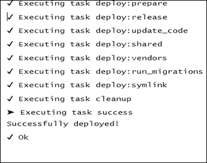

# 第十章 部署

在本章中，我们将介绍以下菜谱：

+   修改 Yii 目录布局

+   移动应用程序 webroot

+   修改高级应用程序模板

+   将配置部分移动到单独的文件中

+   使用多个配置来简化部署

+   实现和执行 cron 作业

+   维护模式

+   部署工具

# 简介

在本章中，我们将介绍一些特别有用的提示，这些提示在应用程序部署期间非常有用；这些提示在团队开发应用程序或只是想要使你的开发环境更舒适时也非常有用。

# 修改 Yii 目录布局

默认情况下，我们有基本的和高级的 Yii2 应用程序骨架，具有不同的目录结构。但这些结构并非教条，如果需要，我们可以自定义它们。

例如，我们可以将运行时目录从项目中移出。

## 准备工作

使用 Composer 包管理器创建一个新的`yii2-app-basic`应用程序，如官方指南中所述[`www.yiiframework.com/doc-2.0/guidestart-installation.html`](http://www.yiiframework.com/doc-2.0/guidestart-installation.html)。

## 如何操作...

### 修改运行时目录位置

打开`config/web.php`和`config/console.php`并定义`runtimePath`参数：

```php
$config = [
    'id' => 'basic',
    'basePath' => dirname(__DIR__),
    'bootstrap' => ['log'],
    'runtimePath' => '/tmp/runtime',
    'components' => [
        // ...
    ],
]
```

将运行时目录移动到新位置。

### 修改供应商目录位置

1.  打开`config/web.php`和`config/console.php`并定义`vendorPath`参数：

    ```php
    $config = [
        'id' => 'basic',
        'basePath' => dirname(__DIR__),
        'bootstrap' => ['log'],
        'vendorPath' => dirname(__DIR__), '/../vendor,
        'components' => [
            // ...
        ],
    ]
    ```

1.  将包含`composer.json`和`composer.lock`文件的`vendor`目录移动到新位置。

1.  打开`web/index.php`和`yii`文件，并找到以下行：

    ```php
    require(__DIR__ . '/../vendor/autoload.php');
    require(__DIR__ . '/../vendor/yiisoft/yii2/Yii.php');
    ```

1.  更改包含路径。

### 修改控制器位置

1.  将`commands`目录重命名为`console`。

1.  将`app\commands\HelloController`的命名空间更改为`app\console\HelloController`。

1.  打开`config/console.php`并重新定义`controllerNamespace`参数：

    ```php
    $config = [
        'id' => 'basic-console',
        'basePath' => dirname(__DIR__),
        'bootstrap' => ['log'],
        'controllerNamespace' => 'app\console,
        'components' => [
            // ...
        ],
    ]
    ```

### 修改视图目录位置

1.  打开`config/web.php`并定义`viewPath`参数：

    ```php
    $config = [
        'id' => 'basic',
        'basePath' => dirname(__DIR__),
        'bootstrap' => ['log'],
        'viewPath' => '@app/myviews',
        'components' => [
            // ...
        ],
    ]
    ```

1.  重命名你的`views`目录。

## 它是如何工作的...

在`yii\base\Application::preInit`方法中，我们的应用程序定义了`basePath`、`runtimePath`和`vendorPath`参数。

默认情况下，这些值指向根应用程序目录、根目录中的`runtime`和`vendor`路径。

例如，如果你想与同一项目的某些实例共享供应商目录，可以重新定义`vendorPath`。但请注意包的版本兼容性。

`yii\base\Application`类扩展了`yii\base\Module`，其中包含`controllerNamespace`和`viewPath`参数。第一个参数允许你更改应用程序和模块的基本命名空间。如果你想在同一个模块目录中提供前端和后端控制器，这将很有帮助。只需将`controllers`目录更改为前端和后端，或者创建子目录并配置你的前端和后端应用程序：

```php
return [
    'id' => 'app-frontend',
    'basePath' => dirname(__DIR__),
    'controllerNamespace' => frontend\controllers',
    'bootstrap' => ['log'],
    'modules' => [
        'user' => [
            'my\user\Module',
            'controllerNamespace' => 'my\user\controllers\frontend',
        ]
    ],
    // ...
]
return [
    'id' => 'app-backend',
    'basePath' => dirname(__DIR__),
    'controllerNamespace' => 'backend\controllers',
    'bootstrap' => ['log'],
    'modules' => [
        'user' => [
            'my\user\Module',
            'controllerNamespace' => 'my\user\controllers\backend',
        ]
    ],
    // ...
]
```

## 参见

为了了解更多关于应用程序结构的信息，请参阅[`www.yiiframework.com/doc-2.0/guide-structure-applications.html`](http://www.yiiframework.com/doc-2.0/guide-structure-applications.html)。

# 移动应用程序 webroot

默认情况下，Yii2 应用程序从 `web` 目录运行你的网站入口脚本。但是，共享主机环境在配置和目录结构方面通常非常有限。你不能更改你网站的运行目录。大多数服务器只为你的网站入口脚本提供 `public_html` 目录。

## 准备工作

使用官方指南中描述的 Composer 包管理器创建一个新的 `yii2-app-basic` 应用程序，官方指南请见[`www.yiiframework.com/doc-2.0/guidestart-installation.html`](http://www.yiiframework.com/doc-2.0/guidestart-installation.html)。

## 如何操作...

让我们讨论移动应用程序 webroot 的方法。

### 将文件放置在根目录

1.  将应用程序文件上传到你的主机。

1.  将 `web` 目录重命名为 `public_html`。

1.  确认网站运行正常。

### 将文件放置在子目录

主机用户目录可能包含其他文件和文件夹。以下是你可以将文件移动到子目录的方法：

1.  创建 `application` 和 `public_html` 目录。

1.  将应用程序文件移动到 `application` 目录。

1.  将 `application/web` 目录的内容移动到 `public_html`。

1.  打开 `public_html/index.php` 文件并更改包含路径：

    ```php
    require(__DIR__ . '/../application/vendor/autoload.php');
    require(__DIR__ . '/../application/vendor/yiisoft/yii2/Yii.php');
    ```

## 它是如何工作的...

Yii2 应用程序会自动基于入口脚本的位置设置 `@web` 和 `@webroot` 别名路径。因此，我们可以轻松地移动或重命名 `web` 目录而无需更改应用程序配置。

对于 `yii2-app-advanced`，你可以将 `web` 目录的内容从 `backend` 移动到子目录，例如 `admin`：

```php
public_html
    index.php
    ...
    admin
        index.php
        ...       
backend
common
console
frontend
...
```

## 参见

要获取在共享主机环境中安装 Yii 的更多信息，请参阅[`www.yiiframework.com/doc-2.0/guide-tutorial-shared-hosting.html`](http://www.yiiframework.com/doc-2.0/guide-tutorial-shared-hosting.html)。

# 修改高级应用程序模板

默认情况下，Yii2 的高级模板包含 `console`、`frontend` 和 `backend` 应用程序。然而，在你的特定情况下，你可以重命名现有的应用程序并创建自己的应用程序。例如，如果你为你的网站开发 API，你可以添加 `api` 应用程序。

## 准备工作

使用官方指南中描述的 Composer 包管理器创建一个新的 `yii2-app-advanced` 项目，官方指南请见[`github.com/yiisoft/yii2-app-advanced/blob/master/docs/guide/start-installation.md`](https://github.com/yiisoft/yii2-app-advanced/blob/master/docs/guide/start-installation.md)。

## 如何操作...

1.  将 `backend` 目录的内容复制到应用程序根目录下的新 `api` 目录。

1.  打开 `api/config/main.php` 文件并更改 `controllerNamespace` 选项的值：

    ```php
    return [
        'id' => 'app-manager',
        'basePath' => dirname(__DIR__),
        'controllerNamespace' => 
        'api\controllers',
        // ....
    ]
    ```

1.  打开`api/assets/AppAsset.php`和`api/controllers/SiteController.php`，并将命名空间从`backend`更改为`api`，如下所示：

    ```php
    namespaces api\assets;
    namespaces api\controllers;
    ```

1.  打开`api/views/layouts/main.php`文件，找到以下行：

    ```php
    use backend\assets\AppAsset;
    ```

    更改为这个：

    ```php
    use api\assets\AppAsset;
    ```

1.  打开`common/config/bootstrap.php`并为新应用程序添加`@api`别名：

    ```php
    <?php
    Yii::setAlias('@common', dirname(__DIR__));
    Yii::setAlias('@frontend', dirname(dirname(__DIR__)) . '/frontend');
    Yii::setAlias('@backend', dirname(dirname(__DIR__)) . '/backend');
    Yii::setAlias('@console', dirname(dirname(__DIR__)) . '/console');
    Yii::setAlias('@api', dirname(dirname(__DIR__)) . '/api);
    ```

1.  打开`environments`目录，并在`dev`和`prod`子目录中将`api`目录复制为`backend`。

1.  打开`environments/index.php`文件并为`api`应用程序添加行：

    ```php
    return [
        'Development' => [
            'path' => 'dev',
            'setWritable' => [
                'backend/runtime',
                'backend/web/assets',
                'frontend/runtime',
                'frontend/web/assets',
                'api/runtime',
                'api/web/assets',
            ],
            'setExecutable' => [
                'yii',
                'tests/codeception/bin/yii',
            ],
            'setCookieValidationKey' => [
                'backend/config/main-local.php',
                'frontend/config/main-local.php',
                'api/config/main-local.php',
            ],
        ],
        'Production' => [
            'path' => 'prod',
            'setWritable' => [
                'backend/runtime',
                'backend/web/assets',
                'frontend/runtime',
                'frontend/web/assets',
                'api/runtime',
                'api/web/assets',
            ],
            'setExecutable' => [
                'yii',
            ],
            'setCookieValidationKey' => [
                'backend/config/main-local.php',
                'frontend/config/main-local.php',
                'api/config/main-local.php',
            ],
        ],
    ];
    ```

现在您有了`console`、`frontend`、`backend`和`api`应用程序。

## 它是如何工作的...

高级应用程序模板是一组具有自定义别名的应用程序，例如`@frontend`、`@backend`、`@common`和`@console`，以及相应的命名空间，而不是`Basic`模板中的简单`@app`别名。

如果需要，您可以轻松地添加、删除或重命名这些应用程序（包括它们的别名和命名空间）。

## 参见

若想了解更多关于应用程序目录结构的使用信息，请参阅[`github.com/yiisoft/yii2-app-advanced/tree/master/docs/guide`](https://github.com/yiisoft/yii2-app-advanced/tree/master/docs/guide)。

# 将配置部分移动到单独的文件中

在基本应用程序模板中，我们已经将 Web 和控制台配置文件分开。通常，我们在两个配置文件中设置一些应用程序组件。

此外，当我们开发大型应用程序时，可能会遇到一些不便。例如，如果我们需要调整一些设置，我们很可能会在 Web 应用程序配置和控制台应用程序配置中重复更改。

## 准备工作

通过使用 Composer 包管理器创建一个新的`yii2-app-basic`应用程序，如官方指南中所述[`www.yiiframework.com/doc-2.0/guidestart-installation.html`](http://www.yiiframework.com/doc-2.0/guidestart-installation.html)。

## 如何操作...

1.  打开`config/web.php`文件并在组件配置中添加`urlManager`部分：

    ```php
    'components' => [
        // ...
        'db' => require(__DIR__ . '/db.php'),
        'urlManager' => [
            'class' => 'yii\web\UrlManager',
            'enablePrettyUrl' => true,
            'showScriptName' => false,
            'rules' => [
                '' => 'site/index',
                '<_c:[\w\-]+>/<id:\d+>' => '<_c>/view',
                '<_c:[\w\-]+/<_a:[\w\-]+>>/<id:\d+>' => '<_c>/<_a>',
                '<_c:[\w\-]+>' => 
                '<_c>/index',
            ],
        ],
    ],
    ```

1.  创建`config/urlRules.php`文件并将规则数组移动到其中：

    ```php
    <?php
    return [
        '' => 'site/index',
        '<_c:[\w\-]+>/<id:\d+>' => '<_c>/view',
        '<_c:[\w\-]+/<_a:[\w\-]+>>/<id:\d+>' => '<_c>/<_a>',
        '<_c:[\w\-]+>' => '<_c>/index',
    ];
    ```

1.  将规则数组替换为需要此文件的文件：

    ```php
    'urlManager' => [
        'class' => 'yii\web\UrlManager',
        'enablePrettyUrl' => true,
        'showScriptName' => false,
        'rules' => require(__DIR__ .  '/urlRules.php'),
    ],
    ```

## 它是如何工作的...

上述技术依赖于 Yii 配置文件是本地的 PHP 文件，包含数组：

```php
<?php
return [...];
```

让我们看看`require`结构：

```php
'rules' => require(__DIR__ . '/urlRules.php'),
```

当我们使用这个时，它会读取指定的文件，如果这个文件中有`return`语句，它会返回一个值。

因此，将一部分从主配置文件移出并放入单独的文件中需要创建一个单独的文件，将配置部分移动到`return`语句之后，并在主配置文件中使用`require`。

如果单独的应用程序（在我们的例子中，这些是 Web 应用程序和控制台应用程序）需要一些共同的配置部分，那么我们可以使用`require`将它们移动到一个单独的文件中。

## 参见

为了了解更多关于 PHP `require`和`include`语句的信息，请参阅以下 URL：

+   [`php.net/manual/en/function.require.php`](http://php.net/manual/en/function.require.php)

+   [`php.net/manual/en/function.include.php`](http://php.net/manual/en/function.include.php)

# 使用多个配置简化部署

高级应用程序模板为每个应用程序使用不同的配置文件：

```php
common
    config
        main.php
        main-local.php
        params.php
        params-local.php
console
    config
        main.php
        main-local.php
        params.php
        params-local.php
backend
    config
        main.php
        main-local.php
        params.php
        params-local.php
frontend
    config
        main.php
        main-local.php
        params.php
        params-local.php
```

每个`web/index.php`脚本合并自己的配置文件集：

```php
$config = yii\helpers\ArrayHelper::merge(
    require(__DIR__ . '/../../common/config/main.php'),
    require(__DIR__ . '/../../common/config/main-local.php'),
    require(__DIR__ . '/../config/main.php'),
    require(__DIR__ . '/../config/main-local.php')
);
$application = new yii\web\Application($config);
$application->run();
```

每个`config/main.php`文件合并参数：

```php
<?php
$params = array_merge(
    require(__DIR__ . '/../../common/config/params.php'),
    require(__DIR__ . '/../../common/config/params-local.php'),
    require(__DIR__ . '/params.php'),
    require(__DIR__ . '/params-local.php')
);
return [
    // ... 
    'params' => $params,
];
```

这个系统允许你配置我们应用程序的公共和特定属性以及组件。我们可以在版本控制系统上存储默认配置文件，并忽略所有`*-local.php`文件。

所有本地文件模板都在`environments`目录中准备。当你通过控制台运行`php init`并选择一个针环境时，这个初始化脚本会复制相应的文件并将它们放置到目标文件夹中。

但基本应用程序模板不包含敏捷配置系统，只提供了以下文件：

```php
config
    console.php
    web.php
    db.php
    params.php
```

让我们尝试向`yii2-app` `-basic`应用程序模板添加一个高级配置系统。

## 准备工作

按照官方指南使用 Composer 包管理器创建一个新的`yii2-app-basic`应用程序，如[`www.yiiframework.com/doc-2.0/guidestart-installation.html`](http://www.yiiframework.com/doc-2.0/guidestart-installation.html)中所述。

## 如何做到这一点...

1.  创建`config/common.php`文件：

    ```php
    <?php
    $params = array_merge(
        require(__DIR__ . '/params.php'),
        require(__DIR__ . '/params-local.php')
    );
    return [
        'basePath' => dirname(__DIR__),
        'components' => [
            'cache' => [
                'class' => 'yii\caching\FileCache',
            ],
            'mailer' => [
                'class' => 'yii\swiftmailer\Mailer',
            ],
            'db' => [],
        ],
        'params' => $params,
    ];
    ```

1.  创建`config/common-local`文件：

    ```php
    <?php
    return [
        'components' => [
            'db' => [
                'class' => 'yii\db\Connection',
                'dsn' => 'mysql:host=localhost;dbname=yii2basic',
                'username' => 'root',
                'password' => '',
                'charset' => 'utf8',
            ],
            'mailer' => [
                'useFileTransport' => true,
            ],
        ],
    ];
    ```

1.  移除`config/db.php`文件。

1.  从`config/console.php`中移除重复的代码：

    ```php
    <?php
    Yii::setAlias('@tests', dirname(__DIR__) . '/tests');
    return [
        'id' => 'basic-console',
        'bootstrap' => ['log', 'gii'],
        'controllerNamespace' => 'app\commands',
        'modules' => [
            'gii' => 'yii\gii\Module',
        ],
        'components' => [
            'log' => [
                'targets' => [
                    [
                        'class' => 'yii\log\FileTarget',
                        'levels' => ['error', 'warning'],
                    ],
                ],
            ],
        ],
    ];
    ```

1.  创建一个空的`config/console-local.php`文件：

    ```php
    <?php
    return [
    ];
    ```

1.  修改`config/web.php`文件：

    ```php
    $config = [
        'id' => 'basic',
        'bootstrap' => ['log'],
        'components' => [
            'user' => [
                'identityClass' => 'app\models\User',
                'enableAutoLogin' => true,
            ],
            'errorHandler' => [
                'errorAction' => 'site/error',
            ],
            'log' => [
                'traceLevel' => YII_DEBUG ? 3 : 0,
                'targets' => [
                    [
                        'class' => 'yii\log\FileTarget',
                        'levels' => ['error', 'warning'],
                    ],
                ],
            ],
        ],
    ];
    if (YII_ENV_DEV) {
        // configuration adjustments for 'dev' environment
        $config['bootstrap'][] = 'debug';
        $config['modules']['debug'] = 'yii\debug\Module';

        $config['bootstrap'][] = 'gii';
        $config['modules']['gii'] = 'yii\gii\Module';
    }
    return $config;
    ```

1.  将`request`配置移动到`config/web-local.php`：

    ```php
    <?php
    return [
        'components' => [
            'request' => [
                'cookieValidationKey' => 'TRk9G1La5kvLFwqMEQTp6PmC1NHdjtkq',
            ],
        ],
    ];
    ```

1.  从`config/params.php`中移除电子邮件 ID：

    ```php
    <?php
    return [
        'adminEmail' => '',
    ];
    ```

1.  将 ID 粘贴到`config/params-local.php`：

    ```php
    <?php
    return [
        'adminEmail' => 'admin@example.com',
    ];  
    ```

1.  从`tests/codeception/config/config.php`中移除`dsn`字符串：

    ```php
    <?php
    /**
     * Application configuration shared by all test types
     */
    return [
        'controllerMap' => [
            // ...
        ],
        'components' => [
            'db' => [
                'dsn' => '',
            ],
            'mailer' => [
                'useFileTransport' => true,
            ],
            'urlManager' => [
                'showScriptName' => true,
            ],
        ],
    ];
    ```

1.  将字符串放入新的`tests/codeception/config/config-local.php`文件：

    ```php
    <?php
    return [
        'components' => [
            'db' => [
                'dsn' => 'mysql:host=localhost;dbname=yii2_basic_tests',
            ],
        ],
    ];
    ```

1.  将配置合并添加到`web/index.php`文件：

    ```php
    $config = yii\helpers\ArrayHelper::merge(
        require(__DIR__ . '/../config/common.php'),
        require(__DIR__ . '/../config/common-local.php'),
        require(__DIR__ . '/../config/web.php'),
        require(__DIR__ . '/../config/web-local.php')
    );
    ```

1.  将配置合并添加到控制台入口脚本`yii`：

    ```php
    $config = yii\helpers\ArrayHelper::merge(
        require(__DIR__ . '/config/common.php'),
        require(__DIR__ . '/config/common-local.php'),
        require(__DIR__ . '/config/console.php'),
        require(__DIR__ . '/config/console-local.php')
    );
    ```

1.  将配置合并添加到单元测试、功能测试和验收测试的测试配置中，从`tests/codeception/config`：

    ```php
    return yii\helpers\ArrayHelper::merge(
        require(__DIR__ . '/../../../config/common.php'),
        require(__DIR__ . '/../../../config/common-local.php'),
        require(__DIR__ . '/../../../config/web.php'),
        require(__DIR__ . '/../../../config/web-local.php'),
        require(__DIR__ . '/config.php'),
        require(__DIR__ . '/config-local.php'),
        [
            // ...
        ]
    );
    ```

1.  将配置合并添加到测试环境控制台的入口脚本`tests/codeception/bin/yii`：

    ```php
    $config = yii\helpers\ArrayHelper::merge(
        require(YII_APP_BASE_PATH . '/config/common.php'),
        require(YII_APP_BASE_PATH . '/config/common-local.php'),
        require(YII_APP_BASE_PATH . '/config/console.php'),
        require(YII_APP_BASE_PATH . '/config/console-local.php'),
        require(__DIR__ . '/../config/config.php'),
        require(__DIR__ . '/../config/config-local.php')
    );
    ```

1.  结果，你必须在你的配置目录中得到以下内容：

    ```php
    config
        common.php
        common-local.php
        console.php
        console-local.php
        web.php
        web-local.php
        params.php
        params-local.php
    ```

1.  最后，你可以在`config`和`tests/codeception/config`目录中添加一个包含此内容的新的`.gitignore`文件，这样你就可以通过 Git 版本控制系统忽略本地配置文件。

    ```php
    /*-local.php
    ```

## 它是如何工作的...

你可以在`config/common.php`文件中存储公共应用程序组件配置，并为 Web 和命令行应用程序设置特定配置。你可以将你的临时和安全的配置数据放入`*-local.php`文件中。

此外，你也可以从`yii2-app-advanced`复制初始化 shell 脚本。

1.  创建一个新的`environments`目录并将你的模板复制进去：

    ```php
    environments
        dev
            config
                common-local.php
                console-local.php
                web-local.php
                params-local.php
            web
                index.php
                index-test.php
            tests
                codeception
                    config
                        config.php
                        config-local.php
            yii
        prod
            config
                common-local.php
                console-local.php
                web-local.php
                params-local.php
            web
                index.php
            yii
    ```

1.  使用以下代码创建`environments/index.php`文件：

    ```php
    <?php
    return [
        'Development' => [
            'path' => 'dev',
            'setWritable' => [
                'runtime',
                'web/assets',
            ],
            'setExecutable' => [
                'yii',
                'tests/codeception/bin/yii',
            ],
            'setCookieValidationKey' => [
                'config/web-local.php',
            ],
        ],
        'Production' => [
            'path' => 'prod',
            'setWritable' => [
                'runtime',
                'web/assets',
            ],
            'setExecutable' => [
                'yii',
            ],
            'setCookieValidationKey' => [
                'config/web-local.php',
            ],
        ],
    ];
    ```

1.  从你的`composer.json`中移除默认的`Installer::postCreateProject`配置：

    ```php
    "extra": {
        "asset-installer-paths": {
            "npm-asset-library": "vendor/npm",
            "bower-asset-library": "vendor/bower"
        }
    }
    ```

1.  从高级模板[`github.com/yiisoft/yii2-app-advanced`](https://github.com/yiisoft/yii2-app-advanced)复制`init`和`init.bat`脚本，并在从仓库克隆项目后使用命令`php init`运行初始化过程。

## 参见

关于应用程序配置的更多信息，请参阅[`www.yiiframework.com/doc-2.0/guide-concept-configurations.html`](http://www.yiiframework.com/doc-2.0/guide-concept-configurations.html)。

# 实现和执行 cron 作业

有时，应用程序需要一些后台任务，例如重新生成网站地图或刷新统计数据。实现这一点的常见方法是使用 cron 作业。当使用 Yii 时，有一种方法可以使用命令作为作业运行。

在这个菜谱中，我们将看到如何实现这两个。对于我们的菜谱，我们将实现将当前时间戳写入受保护目录下的`t` `imestamp.txt`文件。

## 准备工作

使用 Composer 创建一个新的`yii2-app-basic`应用程序，如官方指南中所述，[`www.yiiframework.com/doc-2.0/guide-startinstallation.html`](http://www.yiiframework.com/doc-2.0/guide-startinstallation.html)。

## 如何做...

### 运行 Hello 命令

让我们尝试将`app\commands\HelloController::actionIndex`作为一个 shell 命令来运行：

```php
<?php
namespace app\commands;
use yii\console\Controller;

/**
 * This command echoes the first argument that you have entered.
 */
class HelloController extends Controller
{
    /**
    * This command echoes what you have entered as the message.
    * @param string $message the message to be echoed.
    */
    public function actionIndex($message = 'hello world')
    {
        echo $message . "\n";
    }
}
```

1.  在你的应用程序目录中打开 shell 并执行此命令：

    ```php
    php yii

    ```

    或者，你也可以调用以下内容并确保 shell 工作正常：

    ```php
    ./yii

    ```

1.  输入以下命令以显示`hello`：

    ```php
    ./yii help hello

    ```

1.  框架必须显示一些信息：

    ```php
    DESCRIPTION
    This command echoes what you have entered as the message.

    USAGE
    yii hello [message] [...options...]
    - message: string (defaults to 'hello world')
     the message to be echoed.

    ```

1.  运行默认命令动作：

    ```php
    ./yii hello

    ```

    或者，运行具体的`index`动作：

    ```php
    ./yii hello/index

    ```

1.  你现在应该看到默认短语：

    ```php
    Hello world
    ```

1.  使用任何参数运行命令并查看响应：

    ```php
    ./yii hello 'Bond, James Bond'

    ```

### 创建自己的命令

你也可以创建自己的控制台控制器。例如，创建一个`commands/CronController.php`文件，包含以下示例代码：

```php
<?php
namespace app\commands;

use yii\console\Controller;
use yii\helpers\Console;
use Yii;

/**
* Console crontab actions
*/
class CronController extends Controller
{
    /**
    * Regenerates timestamp
    */
    public function actionTimestamp()
    {
        file_put_contents(Yii::getAlias('@app/timestamp.txt'), time());
        $this->stdout('Done!', Console::FG_GREEN, Console::BOLD);
        $this->stdout(PHP_EOL);
    }
}
```

一切完成后，在 shell 中运行命令：

```php
./yii cron/timestamp

```

然后，检查响应文本和新的文件是否存在，即`timestamp.txt`。

### 设置 cron 计划

在你的 Linux 服务器上创建`/etc/cron.d/myapp`，并添加以下行以在午夜运行我们的命令：

```php
0 0 
* * * www-data /path/to/yii cron/timestamp >/dev/null

```

## 它是如何工作的...

控制台命令被定义为扩展自`yii\console\Controller`的控制器类。在控制器类中，你定义一个或多个动作，这些动作对应于控制器的子命令。在每个动作中，你编写代码以实现特定子命令的适当任务。

当运行一个命令时，您需要指定控制器操作的路径。例如，路径 `migrate/create` 调用与 `MigrateController::actionCreate()` 操作方法相对应的子命令。如果在执行过程中提供的路由不包含操作 ID，则将执行默认操作（类似于网络控制器）。

请注意，您的控制台控制器应放置在 `web/console.php` 配置中定义的 `c` `ontrollerNamespace` 选项指定的目录中。

## 参见

+   要获取有关 Yii2 控制台命令的更多信息，请参阅 [`www.yiiframework.com/doc-2.0/guide-tutorial-console.html`](http://www.yiiframework.com/doc-2.0/guide-tutorial-console.html)

+   要了解更多关于 Cron 守护进程的信息，请参阅 [`en.wikipedia.org/wiki/Cron`](https://en.wikipedia.org/wiki/Cron)

+   `controllerNamespace` 的 `Changing the Yii directory layout` 菜谱

# 维护模式

有时，需要微调一些应用程序设置或从备份中恢复数据库。在处理此类任务时，不希望允许每个人使用应用程序，因为这可能导致丢失最近的用户消息或显示应用程序实现细节。

在这个菜谱中，我们将看到如何向除开发者外的人显示维护消息。

## 准备工作

通过使用官方指南中描述的 Composer 软件包管理器创建一个新的 `yii2-app-basic` 应用程序，如 [`www.yiiframework.com/doc-2.0/guidestart-installation.html`](http://www.yiiframework.com/doc-2.0/guidestart-installation.html) 所述。

## 如何操作...

执行以下步骤：

1.  首先，我们需要创建 `protected/controllers/MaintenanceController.php`。我们这样做如下：

    ```php
    class MaintenanceController extends Controller
    {
        public function actionIndex()
        {
            $this->renderPartial("index");
        }
    }
    ```

1.  然后，我们创建一个名为 `views/maintenance/index.php` 的视图，如下所示：

    ```php
    <?php
    use yii\helpers\Html;
    ?>
    <!doctype html>
    <head>
        <meta charset="utf-8" />
        <title><?php echo 
        Html::encode(Yii::$app->name)?>is under maintenance</title>
    </head>
    <body>
        <h1><?php echo CHtml::encode(Yii::$app->name)?>is under maintenance</h1>
        <p>We'll be back soon. If we aren't back for too long,please drop a message to <?php echo Yii::$app->params['adminEmail']?>.</p>
        <p>Meanwhile, it's a good time to get a cup of coffee,to read a book or to check email.</p>
    </body>
    ```

1.  现在我们需要在 `config/web.php` 中添加一行代码，如下所示：

    ```php
    $config = [
        'catchAll' => file_exists(dirname(__DIR__) .'/.maintenance') 
        && !(isset($_COOKIE['secret']) && $_COOKIE['secret']=="password") ?
        ['maintenance/index'] : null,
        // …
    ]
    ```

1.  现在为了进入维护模式，您需要在您的站点目录中创建一个名为 `.maintenance` 的文件。完成此操作后，您应该看到这个页面。

为了恢复正常，您只需将其删除。要查看维护模式下的网站，您可以在您的站点目录中创建一个名为 `secret` 的 cookie，其值等于 `password`。

## 它是如何工作的...

Yii 网络应用程序提供了一种拦截所有可能的请求并将这些请求路由到单个控制器操作的方法。您可以通过将 `yii\web\Application::catchAll` 设置为包含应用程序路由的数组来实现这一点，如下所示：

```php
'catchAll' => ['maintenance/index'],

```

维护控制器本身并没有什么特别之处；它只是渲染一个包含一些文本的视图。

我们需要一个简单的方法来开启和关闭维护模式。由于应用程序配置是一个常规的 PHP 文件，我们可以通过简单地检查文件是否存在来实现，如下所示：

```php
file_exists(dirname(__DIR__) . '/.maintenance')

```

此外，我们检查 cookie 值以能够覆盖维护模式。我们这样做如下：

```php
!
(isset($_COOKIE['secret']) && $_COOKIE['secret']=="password")

```

## 参见

为了了解如何在 Yii 应用程序中捕获所有请求以及检查生产就绪解决方案的维护，请参阅[`www.yiiframework.com/doc-2.0/yii-web-application.html#$catchAll-detail`](http://www.yiiframework.com/doc-2.0/yii-web-application.html#%24catchAll-detail)。

# 部署工具

如果你使用 Git 等版本控制系统来管理项目代码并将发布版本推送到远程仓库，你可以通过 `git pull` 命令将代码部署到生产服务器，而不是手动上传文件。此外，你可以编写自己的 shell 脚本来拉取新的仓库提交、更新供应商、应用迁移以及执行更多操作。

然而，有许多工具可用于自动化部署过程。在本配方中，我们考虑名为 Deployer 的工具。

## 准备工作

通过使用官方指南中描述的 Composer 包管理器创建一个新的 `yii2-app-basic` 应用程序，官方指南请参阅[`www.yiiframework.com/doc-2.0/guidestart-installation.html`](http://www.yiiframework.com/doc-2.0/guidestart-installation.html)。

## 如何操作...

如果你有一个共享的远程仓库，你可以将其用作部署源。

### 第 1 步 - 准备远程主机

1.  前往你的远程主机并安装 Composer 和 `asset-plugin`：

    ```php
    global require 'fxp/composer-asset-plugin:~1.1.1'

    ```

1.  通过 `ssh-keygen` 生成 SSH 密钥。

1.  将 `~/.ssh/id_rsa.pub` 文件内容添加到 GitHub、Bitbucket 或其他存储库的仓库设置中的部署 SSH 密钥页面。

1.  尝试手动克隆你的仓库：

    ```php
    git clone git@github.com:user/repo.git

    ```

1.  如果系统要求你这样做，添加 Github 地址和已知主机列表。

### 第 2 步 - 准备本地主机

1.  在本地主机上全局安装 `deploy.phar`：

    ```php
    sudo wget http://deployer.org/deployer.phar
    sudo mv deployer.phar /usr/local/bin/dep
    sudo chmod +x /usr/local/bin/dep
    ```

1.  添加带有部署配置的 `deploy.php` 文件：

    ```php
    <?php
    require 'recipe/yii2-app-basic.php';

    set('shared_files', [
        'config/db.php',
        'config/params.php',
        'web/index.php',
        'yii',
    ]);

    server('prod', 'site.com', 22) // SSH access to remote server
        ->user('user')
        // ->password(password) // uncomment for authentication by password
        // ->identityFile()               // uncomment for authentication by SSH key
        ->stage('production')
        ->env('deploy_path', '/var/www/project');

    set('repository', 'git@github.com:user/repo.git');
    ```

1.  尝试准备远程项目目录结构：

    ```php
    dep deploy:prepare prod

    ```

### 第 3 步 - 添加远程配置

1.  打开服务器的 `/var/www/project` 目录。初始化后，它有两个子目录：

    ```php
    project
    ├── releases
    └── shared
    ```

1.  在 `shared` 目录中创建具有私有配置的原始文件，如下所示：

    ```php
    project
    ├── releases
    └── shared
            ├── config
            │       ├── db.php
            │       └── params.php
            ├── web
            │       └── index.php
            └── yii
    ```

Deployer 工具将通过符号链接将这些文件包含在每个发布子目录中。

在 `share/config/db.php` 中指定你的私有配置：

```php
<?php
return [
    'class' => 'yii\db\Connection',
    dsn' => 'mysql:host=localhost;dbname=catalog',
    'username' => 'root',
    'password' => 'root',
    'charset' => 'utf8',
];
```

还要在 `share/config/params.php` 中指定它：

```php
<?php
return [
    'adminEmail' => 'admin@example.com',
];
```

设置 `share/web/index.php` 的内容：

```php
<?php
defined('YII_DEBUG') or define('YII_DEBUG', false);
defined('YII_ENV') or define('YII_ENV', 'prod');

$dir = dirname($_SERVER['SCRIPT_FILENAME']);

require($dir . '/../vendor/autoload.php');
require($dir . '/../vendor/yiisoft/yii2/Yii.php');

$config = require($dir . '/../config/web.php');

(new yii\web\Application($config))->run();
```

还要设置 `share/yii` 文件的内容：

```php
#!/usr/bin/env php
<?php
defined('YII_DEBUG') or define('YII_DEBUG', false);
defined('YII_ENV') or define('YII_ENV', 'prod');

$dir = dirname($_SERVER['SCRIPT_FILENAME']);

require($dir . '/vendor/autoload.php');
require($dir . '/vendor/yiisoft/yii2/Yii.php');

$config = require($dir. '/config/console.php');

$application = new yii\console\Application($config);
$exitCode = $application->run();
exit($exitCode);
```

### 注意

**注意**：我们故意使用 `dirname($_SERVER['SCRIPT_FILENAME'])` 代码而不是原始的 `__DIR__` 常量，因为当文件通过符号链接包含时，`__DIR__` 将返回不正确的值。

注意：如果你使用 `yii2-app-advanced` 模板，你只能重新声明每个（后端、前端、控制台和公共）的 `config/main-local.php` 和 `config/params-local.php` 文件，因为 `web/index.php` 和 `yii` 文件将由 `init` 命令自动创建。

### 第 4 步 - 尝试部署

1.  使用 `deploy.php` 文件回到本地主机并运行部署命令：

    ```php
    dep deploy prod

    ```

1.  如果成功，您将看到部署报告：

1.  Deployer 在您的远程服务器上创建了一个新的发布子目录，并从您的项目到共享项目以及从 `current` 目录到当前发布添加了符号链接：

    ```php
    project
    ├── current -> releases/20160412140556
    ├── releases
    │    └── 20160412140556
    │        ├── ...
    │        ├── runtime -> /../../shared/runtime
    │        ├── web
    │        ├── vendor
    │        ├── ...
    │        └── yii -> /../../shared/yii
    └── shared
       ├── config
       │   ├── db.php
       │   └── params.php
       ├── runtime
       ├── web
       │   └── index.php
       └── yii
    ```

1.  所有工作完成后，您必须在 `project/current/web` 目录中设置服务器的 `DocumentRoot`。

1.  如果在部署过程中出现问题，您可以回滚到先前的有效发布：

    ```php
    dep rollback prod

    ```

    `current` 目录将指向您的前一个发布文件。

## 它是如何工作的...

大多数部署工具都执行相同的任务：

+   创建新的发布子目录

+   克隆仓库文件

+   从项目到共享目录以及到本地配置文件的符号链接

+   安装 Composer 包

+   应用项目迁移

+   将符号链接从服务器的 `DocumentRoot` 路径切换到当前发布目录

Deployer 工具为流行的框架预定义了食谱。您可以为任何现有食谱扩展或为特定情况编写一个新的食谱。

## 参见

+   关于 Deployer 的更多信息，请参阅 [`deployer.org/docs`](http://deployer.org/docs)

+   关于创建 SSH 密钥，请参阅 [`git-scm.com/book/en/v2/Git-on-the-Server-Generating-Your-SSH-Public-Key`](https://git-scm.com/book/en/v2/Git-on-the-Server-Generating-Your-SSH-Public-Key)
