# 第十一章。测试

在本章中，我们将介绍以下主题：

+   使用 Codeception 测试应用程序

+   使用 PHPUnit 进行单元测试

+   使用 Atoum 进行单元测试

+   使用 Behat 进行单元测试

# 简介

在本章中，您将学习如何使用最佳的测试技术，如 Codeception、PhpUnit、Atoum 和 Behat。您将了解如何编写简单的测试以及如何避免应用程序中的回归错误。

# 使用 Codeception 测试应用程序

默认情况下，基本和高级 Yii2 应用程序骨架使用 **Codeception** 作为测试框架。Codeception 支持开箱即用的单元、功能和验收测试。对于单元测试，它使用 PHPUnit 测试框架，这将在下一个菜谱中介绍。

## 准备中

1.  使用 Composer 包管理器创建一个新的 `yii2-app-basic` 应用程序，具体操作请参考官方指南 [`www.yiiframework.com/doc-2.0/guide-start-installation.html`](http://www.yiiframework.com/doc-2.0/guide-start-installation.html)。

    ### 注意

    注意：如果您使用的是基本应用程序的 2.0.9 版本（或更早版本），只需手动升级 `tests` 目录，并添加 `config/test.php`、`config/test_db.php` 和 `web/index-test.php` 文件。此外，您必须复制 `composer.json` 文件的 `require` 和 `require-dev` 部分，并运行 `composer update`。

1.  创建并应用以下迁移：

    ```php
    <?php
    use yii\db\Migration;

    class m160309_070856_create_post extends Migration
    {
        public function up()
        {
            $this->createTable('{{%post}}', [
                'id' => $this->primaryKey(),
                'title' => $this->string()->notNull(),
                'text' => $this->text()->notNull(),
                'status' => $this->smallInteger()->notNull()-
                >defaultValue(0),
            ]);
        }

        public function down()
        {
            $this->dropTable('{{%post}}');
        }
    }
    ```

1.  创建 `Post` 模型：

    ```php
    namespace app\models;

    use Yii;
    use yii\db\ActiveRecord;

    /**
     * @property integer $id
     * @property string $title
     * @property string $text
     * @property integer $status
     * @property integer $created_at
     * @property integer $updated_at
     */
    class Post extends ActiveRecord
    {
        const STATUS_DRAFT = 0;
        const STATUS_ACTIVE = 1;

        public static function tableName()
        {
            return '{{%post}}';
        }

        public function rules()
        {
            return [
                [['title', 'text'], 'required'],
                [['text'], 'string'],
                ['status', 'in', 'range' => [self::STATUS_DRAFT, self::STATUS_ACTIVE]],
                ['status', 'default', 'value' => self::STATUS_DRAFT],
                [['title'], 'string', 'max' => 255],
            ];
        }

        public function behaviors()
        {
            return [
                TimestampBehavior::className(),
            ];
        }

        public static function getStatusList()
        {
            return [
                self::STATUS_DRAFT => 'Draft',
                self::STATUS_ACTIVE => 'Active',
            ];
        }
        public function publish()
        {
            if ($this->status == self::STATUS_ACTIVE) {
                throw new \DomainException('Post is already published.');
            }
            $this->status = self::STATUS_ACTIVE;
        }

        public function draft()
        {
            if ($this->status == self::STATUS_DRAFT) {
                throw new \DomainException('Post is already drafted.');
            }
            $this->status = self::STATUS_DRAFT;
        }
    }
    ```

1.  生成 CRUD：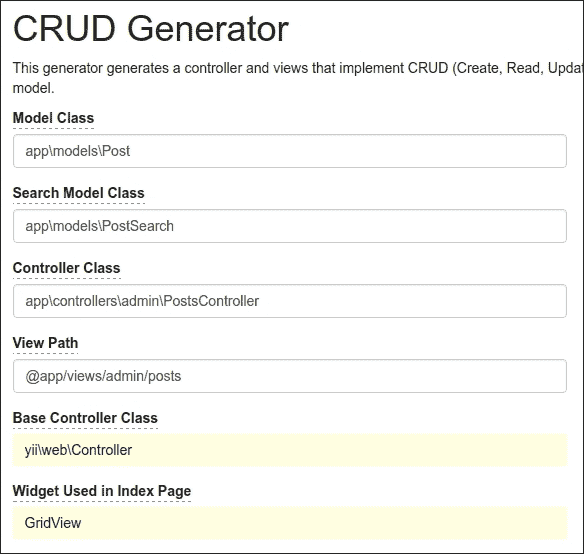

1.  此外，在 `views/admin/posts/_form.php` 中为 `status` 字段添加状态下拉列表，并为提交按钮命名：

    ```php
    <div class="post-form">

        <?php $form = ActiveForm::begin(); ?>

        <?= $form->field($model, 'title')->textInput(['maxlength' => true])  ?>

        <?= $form->field($model, 'text')->textarea(['rows' => 6]) ?>

        <?= $form->field($model, 'status')->dropDownList(Post::getStatusList()) ?>

        <div class="form-group">
            <?= Html::submitButton($model->isNewRecord ? 'Create' : 'Update', [
                'class' => $model->isNewRecord ? 'btn btn-success' : 'btn btn-primary',
                'name' => 'submit-button',
            ]) ?>
        </div>

        <?php ActiveForm::end(); ?>

    </div>
    ```

1.  现在检查控制器是否正常工作：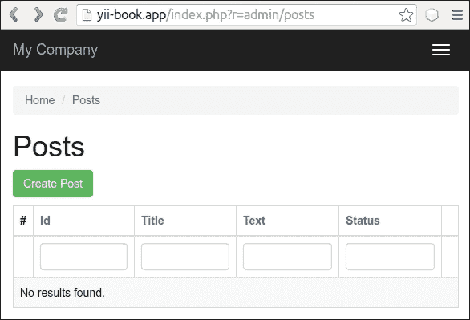

创建任何演示帖子。

## 如何做到这一点...

### 准备测试

按照以下步骤准备测试：

1.  创建 `yii2_basic_tests` 或其他测试数据库，并通过应用迁移来更新它：

    ```php
    tests/bin/yii migrate

    ```

    需要在测试目录中运行此命令。您可以在配置文件 `/config/test_db.php` 中指定您的测试数据库选项。

1.  Codeception 使用自动生成的 Actor 类为自身的测试套件。使用以下命令构建它们：

    ```php
    composer exec codecep
    t build

    ```

### 运行单元和功能测试

我们现在可以运行应用程序的任何类型的测试：

```php
# run all available tests
composer exec codecept run

# run functional tests
composer exec codecept run functional

# run unit tests
composer exec codecept run unit

```

结果，您可以查看如下测试报告：

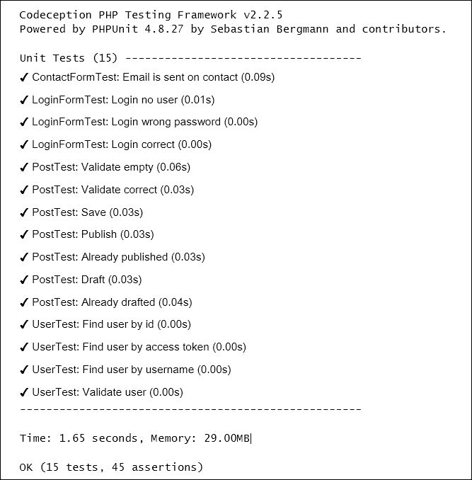

### 获取覆盖率报告

您可以为您的代码获取代码覆盖率报告。默认情况下，代码覆盖率在 `tests/codeception.yml` 配置文件中是禁用的；您应该取消注释必要的行以便能够收集代码覆盖率：

```php
coverage:
   enabled: true
   whitelist:
       include:
           - models/*
           - controllers/*
           - commands/*
           - mail/*
   blacklist:
       include:
           - assets/*
           - config/*
           - runtime/*
           - vendor/*
           - views/*
           - web/*
           - tests/*
```

您必须从 [`xdebug.org`](https://xdebug.org) 安装 XDebug PHP 扩展。例如，在 Ubuntu 或 Debian 上，您可以在终端中输入以下命令：

```php
sudo apt-get install php5-xdebug

```

在 Windows 上，您必须打开 `php.ini` 文件，并添加带有您 PHP 安装目录路径的自定义代码：

```php
[xdebug]
zend_extension_ts=C:/php/ext/php_xdebug.dll
```

或者，如果您使用的是非线程安全版本，请输入以下命令：

```php
[xdebug]
zend_extension=C:/php/ext/php_xdebug.dll
```

最后，您可以使用以下命令运行测试并收集覆盖率报告：

```php
#collect coverage for all tests
composer exec codecept run --coverage-html

#collect coverage only for unit tests
composer exec codecept run unit --coverage-html

#collect coverage for unit and functional tests
composer exec codecept run functional,unit --coverage-html

```

你可以在终端中看到文本代码覆盖率输出：

```php
Code Coverage Report: 
 2016-03-31 08:13:05 

 Summary: 
 Classes: 20.00% (1/5) 
 Methods: 40.91% (9/22) 
 Lines:   30.65% (38/124)

\app\models::ContactForm
 Methods:  33.33% ( 1/ 3)   Lines:  80.00% ( 12/ 15)
\app\models::LoginForm
 Methods: 100.00% ( 4/ 4)   Lines: 100.00% ( 18/ 18)
\app\models::User
 Methods:  57.14% ( 4/ 7)   Lines:  53.33% (  8/ 15)
Remote CodeCoverage reports are not printed to console

HTML report generated in coverage

```

你还可以在`tests/codeception/_output/coverage`目录下看到 HTML 报告：

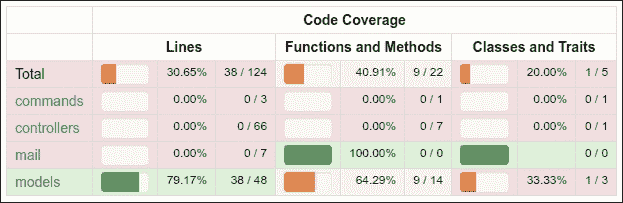

你可以点击任何类并分析在测试过程中哪些代码行没有被执行。

### 运行验收测试

在验收测试中，你可以使用 PhpBrowser 通过 Curl 请求服务器。这有助于检查你的网站控制器并解析 HTTP 和 HTML 响应代码。但如果你想测试 CSS 或 JavaScript 行为，你必须使用真实浏览器。

Selenium Server 是一个交互式工具，它可以集成到 Firefox 和其他浏览器中，允许打开网站页面并模拟人类行为。

为了与真实浏览器协同工作，我们必须安装 Selenium Server：

1.  使用完整的 Codeception 包而不是基本包：

    ```php
    composer require --dev codeception/codeception
    composer remove --dev codeception/base

    ```

1.  下载以下软件：

    +   从 https://www.mozilla.org 安装 Mozilla Firefox 浏览器

    +   从 https://www.java.com/en/download/安装 Java 运行时环境

    +   从 http://www.seleniumhq.org/download/下载 Selenium Standalone Server

    +   从 https://github.com/mozilla/geckodriver/releases 下载 Geckodriver

1.  在新的终端窗口中启动带有驱动程序的服务器：

    ```php
    java -jar -Dwebdriver.gecko.driver=~/geckodriver ~/selenium-server-standalone-x.xx.x.jar

    ```

1.  将`tests/acceptance.suite.yml.example`复制到`tests/acceptance.suite.yml`文件，并配置如下：

    ```php
    class_name: AcceptanceTester
    modules:
     enabled:
     - WebDriver:
     url: http://127.0.0.1:8080/
     browser: firefox
     - Yii2:
     part: orm
     entryScript: index-test.php
     cleanup: false

    ```

1.  打开新的终端窗口并启动 Web 服务器：

    ```php
    tests/bin/yii serve

    ```

1.  运行验收测试：

    ```php
    composer exec codecept run acceptance

    ```

你应该看到 Selenium 如何启动浏览器并检查所有网站页面。

### 创建数据库固定数据

在运行自己的测试之前，我们必须清除自己的测试数据库并将特定的测试数据加载到其中。`yii2-codeception`扩展提供了`ActiveFixture`基类，用于为自己的模型创建测试数据集。按照以下步骤创建数据库固定数据：

1.  为`Post`模型创建固定数据类：

    ```php
    <?php
    namespace tests\fixtures;

    use yii\test\ActiveFixture;

    class PostFixture extends ActiveFixture
    {
        public $modelClass = 'app\modules\Post';
        public $dataFile = '@tests/_data/post.php';
    }
    ```

1.  在`test/_data/post.php`文件中添加演示数据集：

    ```php
    <?php
    return [
        [
            'id' => 1,
            'title' => 'First Post',
            'text' => 'First Post Text',
            'status' => 1,
            'created_at' => 1457211600,
            'updated_at' => 1457211600,
        ],
        [
            'id' => 2,
            'title' => 'Old Title For Updating',
            'text' => 'Old Text For Updating',
            'status' => 1,
            'created_at' => 1457211600,
            'updated_at' => 1457211600,
        ],
        [
            'id' => 3,
            'title' => 'Title For Deleting',
            'text' => 'Text For Deleting',
            'status' => 1,
            'created_at' => 1457211600,
            'updated_at' => 1457211600,
        ],
    ];
    ```

1.  激活单元和验收测试的固定数据支持。只需将`fixtures`部分添加到`unit.suite.yml`文件中：

    ```php
    class_name: UnitTester
    modules:
       enabled:
         - Asserts
         - Yii2:
               part: [orm, fixtures, email]
    ```

    此外，将`fixtures`部分添加到`acceptance.suite.yml`：

    ```php
    class_name: AcceptanceTester
    modules:
       enabled:
           - WebDriver:
               url: http://127.0.0.1:8080/
               browser: firefox
           - Yii2:
               part: [orm, fixtures]
               entryScript: index-test.php
               cleanup: false
    ```

1.  通过以下命令重新生成`tester`类以应用这些更改：

    ```php
    composer exec codecept build

    ```

### 编写单元或集成测试

单元和集成测试检查我们项目的源代码。

单元测试只检查当前类或其方法，与其他类和资源（如数据库、文件等）隔离。

集成测试检查你的类与其他类和资源集成的运行情况。

在 Yii2 中，ActiveRecord 模型始终使用数据库来加载表模式，因为我们必须创建一个真实的测试数据库，并且我们的测试将是集成性的。

1.  编写测试以检查模型验证、保存和更改其状态：

    ```php
    <?php
    namespace tests\unit\models;

    use app\models\Post;
    use Codeception\Test\Unit;
    use tests\fixtures\PostFixture;

    class PostTest extends Unit
    {
        /**
        * @var \UnitTester
        */
        protected $tester;

        public function _before()
        {
            $this->tester->haveFixtures([
                'post' => [
                    'class' => PostFixture::className(),
                    'dataFile' => codecept_data_dir() . 'post.php'
                ]
            ]);
        }

        public function testValidateEmpty()
        {
            $model = new Post();

            expect('model should not validate', $model->validate())->false();

            expect('title has error', $model->errors)->hasKey('title');
            expect('title has error', $model->errors)->hasKey('text');
        }

        public function testValidateCorrect()
        {
             $model = new Post([
                 'title' => 'Other Post',
                 'text' => 'Other Post Text',
             ]);

             expect('model should validate', $model->validate())->true();
        }

        public function testSave()
        {
            $model = new Post([
                'title' => 'Test Post',
                'text' => 'Test Post Text',
            ]);

             expect('model should save', $model->save())->true();

            expect('title is correct', $model->title)->equals('Test Post');
            expect('text is correct', $model->text)->equals('Test Post Text');
            expect('status is draft', $model->status)->equals(Post::STATUS_DRAFT);
            expect('created_at is generated', $model->created_at)->notEmpty();
            expect('updated_at is generated', $model->updated_at)->notEmpty();
        }

        public function testPublish()
        {
            $model = new Post(['status' => Post::STATUS_DRAFT]);

            expect('post is drafted', $model->status)->equals(Post::STATUS_DRAFT);
            $model->publish();
            expect('post is published', $model->status)->equals(Post::STATUS_ACTIVE);
        }

        public function testAlreadyPublished()
        {
            $model = new Post(['status' => Post::STATUS_ACTIVE]);

            $this->setExpectedException('\LogicException');
            $model->publish();
        }

        public function testDraft()
        {
            $model = new Post(['status' => Post::STATUS_ACTIVE]);

            expect('post is published', $model->status)->equals(Post::STATUS_ACTIVE);
            $model->draft();
            expect('post is drafted', $model->status)->equals(Post::STATUS_DRAFT);
        }

        public function testAlreadyDrafted()
        {
            $model = new Post(['status' => Post::STATUS_ACTIVE]);

            $this->setExpectedException('\LogicException');
            $model->publish();
        }
    }
    ```

1.  运行测试：

    ```php
    composer exec codecept run unit

    ```

1.  现在看看结果：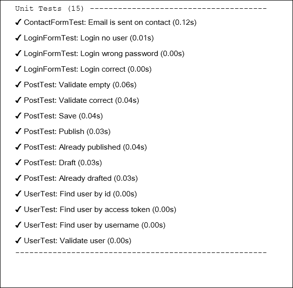

那就是全部了。如果你故意或偶然地破坏了任何模型的方法，你将看到失败的测试。

### 编写功能测试

功能测试检查您的应用程序是否运行正确。此套件准备 `$_GET`、`$_POST` 和其他请求变量，并调用 `Application::handleRequest` 方法。它有助于测试您的控制器及其响应，而无需运行真实服务器。

现在我们可以为我们的管理员 CRUD 编写测试：

1.  生成一个新的测试类：

    ```php
    codecept generate:cest functional admin/Posts
    ```

1.  在生成的文件中修复命名空间并编写自己的测试：

    ```php
    <?php
    namespace tests\functional\admin;

    use app\models\Post;
    use FunctionalTester;
    use tests\fixtures\PostFixture;
    use yii\helpers\Url;

    class PostsCest
    {
        function _before(FunctionalTester $I)
        {
            $I->haveFixtures([
                'user' => [
                    'class' => PostFixture::className(),
                    'dataFile' => codecept_data_dir() . 'post.php'
                ]
            ]);
        }

        public function testIndex(FunctionalTester $I)
        {
            $I->amOnPage(['admin/posts/index']);
            $I->see('Posts', 'h1');
        }

        public function testView(FunctionalTester $I)
        {
            $I->amOnPage(['admin/posts/view', 'id' => 1]);
            $I->see('First Post', 'h1');
        }

        public function testCreateInvalid(FunctionalTester $I)
        {
            $I->amOnPage(['admin/posts/create']);
            $I->see('Create', 'h1');

            $I->submitForm('#post-form', [
                'Post[title]' => '',
                'Post[text]' => '',
            ]);

            $I->expectTo('see validation errors');
            $I->see('Title cannot be blank.', '.help-block');
            $I->see('Text cannot be blank.', '.help-block');
        }

        public function testCreateValid(FunctionalTester $I)
        {
            $I->amOnPage(['admin/posts/create']);
            $I->see('Create', 'h1');

            $I->submitForm('#post-form', [
                'Post[title]' => 'Post Create Title',
                'Post[text]' => 'Post Create Text',
                'Post[status]' => 'Active',
            ]);

            $I->expectTo('see view page');
            $I->see('Post Create Title', 'h1');
        }

        public function testUpdate(FunctionalTester $I)
        {
            // ...
        }
        public function testDelete(FunctionalTester $I)
        {
            $I->amOnPage(['/admin/posts/view', 'id' => 3]);
            $I->see('Title For Deleting', 'h1');

            $I->amGoingTo('delete item');
            $I->sendAjaxPostRequest(Url::to(['/admin/posts/delete', 'id' => 3]));
            $I->expectTo('see that post is deleted');
            $I->dontSeeRecord(Post::className(), [
                'title' => 'Title For Deleting',
            ]);
        }
    }
    ```

1.  使用以下命令运行测试：

    ```php
    composer exec codecept run functional

    ```

1.  现在查看结果：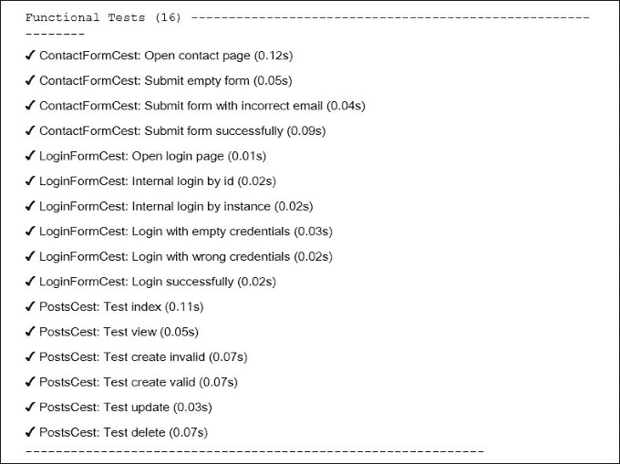

所有测试都通过。在其他情况下，您可以在 `tests/_output` 目录中查看失败的测试的页面快照。

### 编写验收测试

1.  验收测试人员从测试服务器直接访问真实网站，而不是调用 `Application::handleRequest` 方法。高级验收测试看起来像中级功能测试，但在 Selenium 的情况下，它允许检查真实浏览器中的 JavaScript 行为。

1.  您必须在 `tests/acceptance` 目录中获取以下类：

    ```php
    <?php
    namespace tests\acceptance\admin;

    use AcceptanceTester;
    use tests\fixtures\PostFixture;
    use yii\helpers\Url;

    class PostsCest
    {
        function _before(AcceptanceTester $I)
        {
            $I->haveFixtures([
                'post' => [
                    'class' => PostFixture::className(),
                    'dataFile' => codecept_data_dir() . 'post.php'
                ]
            ]);
        }

        public function testIndex(AcceptanceTester $I)
        {
            $I->wantTo('ensure that post index page works');
            $I->amOnPage(Url::to(['/admin/posts/index']));
            $I->see('Posts', 'h1');
        }

        public function testView(AcceptanceTester $I)
       {
            $I->wantTo('ensure that post view page works');
            $I->amOnPage(Url::to(['/admin/posts/view', 'id' => 1]));
            $I->see('First Post', 'h1');
        }

        public function testCreate(AcceptanceTester $I)
        {
            $I->wantTo('ensure that post create page works');
            $I->amOnPage(Url::to(['/admin/posts/create']));
            $I->see('Create', 'h1');

            $I->fillField('#post-title', 'Post Create Title');
            $I->fillField('#post-text', 'Post Create Text');
            $I->selectOption('#post-status', 'Active');

            $I->click('submit-button');
            $I->wait(3);

            $I->expectTo('see view page');
            $I->see('Post Create Title', 'h1');
        }

        public function testDelete(AcceptanceTester $I)
        {
            $I->amOnPage(Url::to(['/admin/posts/view', 'id' => 3]));
            $I->see('Title For Deleting', 'h1');

            $I->click('Delete');
            $I->acceptPopup();
            $I->wait(3);

            $I->see('Posts', 'h1');
        }
    }
    ```

    不要忘记调用 `wait` 方法以等待页面打开或重新加载。

1.  在新的终端窗口中运行 PHP 测试服务器：

    ```php
    tests/bin/yii serve

    ```

1.  运行验收测试：

    ```php
    composer exec codecept run acceptance

    ```

1.  查看结果：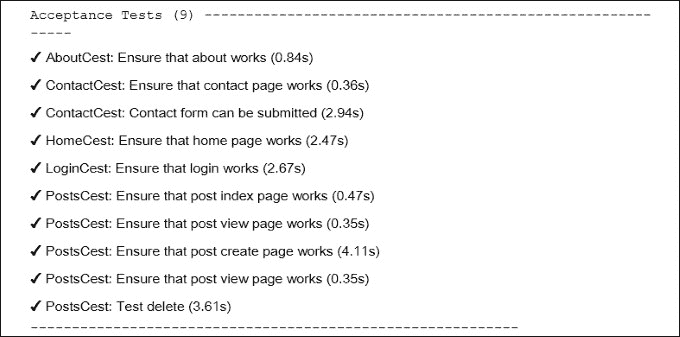

Selenium 将启动 Firefox 网络浏览器并执行我们的测试命令。

### 创建 API 测试套件

除了单元、功能和验收套件之外，Codeception 允许创建特定的测试套件。例如，我们可以为支持 XML 和 JSON 解析的 API 测试创建一个。

1.  为 `Post` 模型创建 REST API 控制器 `controllers/api/PostsController.php`：

    ```php
    <?php
    namespace app\controllers\api;

    use yii\rest\ActiveController;

    class PostsController extends ActiveController
    {
        public $modelClass = '\app\models\Post';
    }
    ```

1.  在 `config/web.php` 中为 `UrlManager` 组件添加 REST 路由：

    ```php
    'components' => [
        // ...
        'urlManager' => [
            'enablePrettyUrl' => true,
            'showScriptName' => false,
            'rules' => [
                ['class' => 'yii\rest\UrlRule', 'controller' => 'api/posts'],
            ],
        ],
    ],
    ```

    并在 `config/test.php` 中添加一些配置（但启用 `showScriptName` 选项）：

    ```php
    'components' => [
        // ...
        'urlManager' => [
            'enablePrettyUrl' => true,
            'showScriptName' => true,
            'rules' => [
                ['class' => 'yii\rest\UrlRule', 'controller' => 'api/posts'],
            ],
         ],
    ],
    ```

1.  添加以下内容的 `web/.htaccess` 文件：

    ```php
    RewriteEngine On

    RewriteCond %{REQUEST_FILENAME} !-f
    RewriteCond %{REQUEST_FILENAME} !-d
    RewriteRule . index.php
    ```

1.  检查 `api/posts` 控制器是否工作：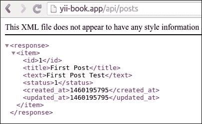

1.  使用 REST 模块创建 API 测试套件 `tests/api.suite.yml` 配置文件：

    ```php
    class_name: ApiTester
    modules:
       enabled:
           - REST:
               depends: PhpBrowser
               url: 'http://127.0.0.1:8080/index-test.php'
               part: [json]
           - Yii2:
               part: [orm, fixtures]
               entryScript: index-test.php
    ```

    现在重新构建测试人员：

    ```php
    composer exec codecept build

    ```

1.  创建 `tests/api` 目录并生成新的测试类：

    ```php
    composer exec codecept generate:cest api Posts

    ```

1.  为您的 REST-API 编写测试：

    ```php
    <?php
    namespace tests\api;

    use ApiTester;
    use tests\fixtures\PostFixture;
    use yii\helpers\Url;

    class PostsCest
    {
       function _before(ApiTester $I)
       {
           $I->haveFixtures([
               'post' => [
                   'class' => PostFixture::className(),
                   'dataFile' => codecept_data_dir() . 'post.php'
               ]
           ]);
       }

       public function testGetAll(ApiTester $I)
       {
           $I->sendGET('/api/posts');
           $I->seeResponseCodeIs(200);
           $I->seeResponseIsJson();
           $I->seeResponseContainsJson([0 => ['title' => 'First Post']]);
       }

       public function testGetOne(ApiTester $I)
       {
           $I->sendGET('/api/posts/1');
           $I->seeResponseCodeIs(200);
           $I->seeResponseIsJson();
           $I->seeResponseContainsJson(['title' => 'First Post']);
       }

       public function testGetNotFound(ApiTester $I)
       {
           $I->sendGET('/api/posts/100');
           $I->seeResponseCodeIs(404);
           $I->seeResponseIsJson();
           $I->seeResponseContainsJson(['name' => 'Not Found']);
       }

       public function testCreate(ApiTester $I)
       {
           $I->sendPOST('/api/posts', [
               'title' => 'Test Title',
               'text' => 'Test Text',
           ]);
           $I->seeResponseCodeIs(201);
           $I->seeResponseIsJson();
           $I->seeResponseContainsJson(['title' => 'Test Title']);
       }

       public function testUpdate(ApiTester $I)
       {
           $I->sendPUT('/api/posts/2', [
               'title' => 'New Title',
           ]);
           $I->seeResponseCodeIs(200);
           $I->seeResponseIsJson();
           $I->seeResponseContainsJson([
               'title' => 'New Title',
               'text' => 'Old Text For Updating',
           ]);
       }

       public function testDelete(ApiTester $I)
       {
           $I->sendDELETE('/api/posts/3');
           $I->seeResponseCodeIs(204);
       }
    }
    ```

1.  运行应用程序服务器：

    ```php
    tests/bin yii serve

    ```

1.  运行 API 测试：

    ```php
    composer exec codecept run api

    ```

    现在查看结果：

    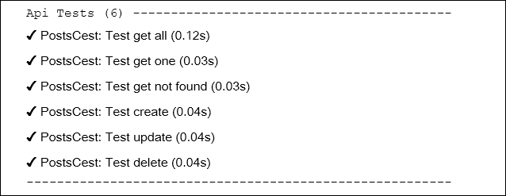

所有测试都通过，并且我们的 API 运行正确。

## 它是如何工作的…

Codeception 是一个基于 PHPUnit 包的高级测试框架，用于提供编写单元、集成、功能和验收测试的基础设施。

我们可以使用 Codeception 内置的 Yii2 模块，它允许我们加载固定数据、与模型和其他事物一起工作，来自 Yii 框架。

## 参见

+   更多信息，请参阅：

    +   [`codeception.com/docs/01-Introduction`](http://codeception.com/docs/01-Introduction)

    +   [`phpunit.de/manual/5.2/en/installation.html`](https://phpunit.de/manual/5.2/en/installation.html)

+   您的基本或高级应用程序的 `tests/README.md` 文件：

    +   [`github.com/yiisoft/yii2-app-basic/blob/master/tests/README.md`](https://github.com/yiisoft/yii2-app-basic/blob/master/tests/README.md)

    +   [`github.com/yiisoft/yii2-app-advanced/blob/master/tests/README.md`](https://github.com/yiisoft/yii2-app-advanced/blob/master/tests/README.md)

+   *使用 PHPUnit 进行单元测试*的菜谱

# 使用 PHPUnit 进行单元测试

PHPUnit 是最受欢迎的 PHP 测试框架。它配置和使用的简单性。此外，该框架支持代码覆盖率报告，并且有许多附加插件。前一个菜谱中的 Codeception 使用 PHPUnit 进行自己的工作和编写单元测试。在这个菜谱中，我们将使用 PHPUnit 测试创建一个演示购物车扩展。

## 准备工作

使用 Composer 包管理器创建一个新的`yii2-app-basic`应用程序，如官方指南中所述，[`www.yiiframework.com/doc-2.0/guidestart-installation.html`](http://www.yiiframework.com/doc-2.0/guidestart-installation.html)。

## 如何做到这一点...

首先，我们必须为我们的扩展创建一个新的空目录。

### 准备扩展结构

1.  首先，为您的扩展创建目录结构：

    ```php
    book
    └── cart
        ├── src
        └── tests
    ```

    要将扩展作为 Composer 包使用，准备`book/cart/composer.json`文件如下：

    ```php
    {
        "name": "book/cart",
        "type": "yii2-extension",
        "require": {
            "yiisoft/yii2": "~2.0"
        },
        "require-dev": {
            "phpunit/phpunit": "4.*"
        },
        "autoload": {
            "psr-4": {
                "book\\cart\\": "src/",
                "book\\cart\\tests\\": "tests/"
            }
        },
        "extra": {
            "asset-installer-paths": {
                "npm-asset-library": "vendor/npm",
                "bower-asset-library": "vendor/bower"
            }
        }
    }
    ```

1.  添加`book/cart/.gitignore`文件，包含以下行：

    ```php
    /vendor
    /composer.lock
    ```

1.  将以下行添加到 PHPUnit 默认配置文件`book/cart/phpunit.xml.dist`中，如下所示：

    ```php
    <?xml version="1.0" encoding="utf-8"?>
    <phpunit bootstrap="./tests/bootstrap.php"
             colors="true"
             convertErrorsToExceptions="true"
             convertNoticesToExceptions="true"
             convertWarningsToExceptions="true"
             stopOnFailure="false">
        <testsuites>
            <testsuite name="Test Suite">
                <directory>./tests</directory>
            </testsuite>
        </testsuites>
        <filter>
            <whitelist>
                <directory suffix=".php">./src/</directory>
            </whitelist>
        </filter>
    </phpunit>
    ```

1.  安装扩展的所有依赖项：

    ```php
    composer install

    ```

1.  现在我们必须得到以下结构：

    ```php
    book
    └── cart
        ├── src
        ├── tests
        ├── .gitignore
        ├── composer.json
        ├── phpunit.xml.dist
        └── vendor
    ```

### 编写扩展代码

要编写扩展代码，请按照以下步骤操作：

1.  在`src`目录中创建`book\cart\Cart`类：

    ```php
    <?php
    namespace book\cart;

    use book\cart\storage\StorageInterface;
    use yii\base\Component;
    use yii\base\InvalidConfigException;

    class Cart extends Component
    {
        /**
         * @var StorageInterface
         */
        private $_storage;
        /**
         * @var array
         */
        private $_items;

        public function setStorage($storage)
        {
            if (is_array($storage)) {
                $this->_storage = \Yii::createObject($storage);
            } else {
                $this->_storage = $storage;
            }
        }

        public function add($id, $amount = 1)
        {
            $this->loadItems();
            if (isset($this->_items[$id])) {
                $this->_items[$id] += $amount;
            } else {
                $this->_items[$id] = $amount;
            }
            $this->saveItems();
        }

        public function set($id, $amount)
        {
            $this->loadItems();
            $this->_items[$id] = $amount;
            $this->saveItems();
        }

        public function remove($id)
        {
            $this->loadItems();
            if (isset($this->_items[$id])) {
                unset($this->_items[$id]);
            }
            $this->saveItems();
        }

        public function clear()
        {
            $this->loadItems();
            $this->_items = [];
            $this->saveItems();
        }

        public function getItems()
        {
            $this->loadItems();
            return $this->_items;
        }

        public function getCount()
        {
            $this->loadItems();
            return count($this->_items);
        }

        public function getAmount()
        {
            $this->loadItems();
            return array_sum($this->_items);
        }

        private function loadItems()
        {
            if ($this->_storage === null) {
                throw new InvalidConfigException('Storage must be set');
            }
            if ($this->_items === null) {
                $this->_items = $this->_storage->load();
            }
        }

        private function saveItems()
        {
             $this->_storage->save($this->_items);
        }
    }
    ```

1.  在`src/storage`子目录中创建`StorageInterface`接口：

    ```php
    <?php
    namespace book\cart\storage;

    interface StorageInterface
    {
        /**
         * @return array
         */
        public function load();

        /**
         * @param array $items
         */
        public function save(array $items);
    }
    ```

    以及 SessionStorage 类：

    ```php
    namespace book\cart\storage;

    use Yii;

    class SessionStorage implements StorageInterface
    {
        public $sessionKey = 'cart';

        public function load()
        {
            return Yii::$app->session->get($this->sessionKey, []);
        }

        public function save(array $items)
        {
            Yii::$app->session->set($this->sessionKey, $items);
        }
    }
    ```

1.  现在我们必须得到以下结构：

    ```php
    book
    └── cart
        ├── src
        │   ├── storage
        │   │   ├── SessionStorage.php
        │   │   └── StorageInterface.php
        │   └── Cart.php
        ├── tests
        ├── .gitignore
        ├── composer.json
        ├── phpunit.xml.dist
        └── vendor
    ```

### 编写扩展测试

要进行扩展测试，请按照以下步骤操作：

1.  添加`book/cart/tests/bootstrap.php`入口脚本以供 PHPUnit 使用：

    ```php
    <?php

    defined('YII_DEBUG') or define('YII_DEBUG', true);
    defined('YII_ENV') or define('YII_ENV', 'test');

    require(__DIR__ . '/../vendor/autoload.php');
    require(__DIR__ . '/../vendor/yiisoft/yii2/Yii.php');
    ```

1.  在每个测试之前初始化 Yii 应用程序并在之后销毁应用程序以创建一个测试基类：

    ```php
    <?php
    namespace book\cart\tests;

    use yii\di\Container;
    use yii\web\Application;

    abstract class TestCase extends \PHPUnit_Framework_TestCase
    {
        protected function setUp()
        {
            parent::setUp();
            $this->mockApplication();
        }

        protected function tearDown()
        {
            $this->destroyApplication();
            parent::tearDown();
        }

        protected function mockApplication()
        {
            new Application([
                'id' => 'testapp',
                'basePath' => __DIR__,
                'vendorPath' => dirname(__DIR__) . '/vendor',
            ]);
        }

        protected function destroyApplication()
        {
            \Yii::$app = null;
            \Yii::$container = new Container();
        }
    }
    ```

1.  添加一个基于内存的清洁模拟类，该类实现了`StorageInterface`接口：

    ```php
    <?php

    namespace book\cart\tests\storage;

    use book\cart\storage\StorageInterface;

    class FakeStorage implements StorageInterface
    {
        private $items = [];

        public function load()
        {
            return $this->items;
        }

        public function save(array $items)
        {
            $this->items = $items;
        }
    }
    ```

    它将项目存储到私有变量中，而不是与真实会话一起工作。它允许独立运行测试（没有真实存储驱动程序），并且也提高了测试性能。

1.  添加`CartTest`类：

    ```php
    <?php
    namespace book\cart\tests;

    use book\cart\Cart;
    use book\cart\tests\storage\FakeStorage;

    class CartTest extends TestCase
    {
        /**
         * @var Cart
         */
        private $cart;

        public function setUp()
        {
            parent::setUp();
            $this->cart = new Cart(['storage' => new FakeStorage()]);
        }

        public function testEmpty()
        {
            $this->assertEquals([], $this->cart->getItems());
            $this->assertEquals(0, $this->cart->getCount());
            $this->assertEquals(0, $this->cart->getAmount());
        }

        public function testAdd()
        {
            $this->cart->add(5, 3);
            $this->assertEquals([5 => 3], $this->cart->getItems());

            $this->cart->add(7, 14);
            $this->assertEquals([5 => 3, 7 => 14], $this->cart->getItems());

            $this->cart->add(5, 10);
            $this->assertEquals([5 => 13, 7 => 14], $this->cart->getItems());
        }

        public function testSet()
        {
            $this->cart->add(5, 3);
            $this->cart->add(7, 14);
            $this->cart->set(5, 12);
            $this->assertEquals([5 => 12, 7 => 14], $this->cart->getItems());
        }

        public function testRemove()
        {
            $this->cart->add(5, 3);
            $this->cart->remove(5);
            $this->assertEquals([], $this->cart->getItems());
        }

        public function testClear()
        {
            $this->cart->add(5, 3);
            $this->cart->add(7, 14);
            $this->cart->clear();
            $this->assertEquals([], $this->cart->getItems());
        }

        public function testCount()
        {
            $this->cart->add(5, 3);
            $this->assertEquals(1, $this->cart->getCount());

            $this->cart->add(7, 14);
            $this->assertEquals(2, $this->cart->getCount());
        }

        public function testAmount()
        {
            $this->cart->add(5, 3);
            $this->assertEquals(3, $this->cart->getAmount());

            $this->cart->add(7, 14);
            $this->assertEquals(17, $this->cart->getAmount());
        }

        public function testEmptyStorage()
        {
            $cart = new Cart();
            $this->setExpectedException('yii\base\InvalidConfigException');
            $cart->getItems();
        }
    }
    ```

1.  添加一个单独的测试来检查`SessionStorage`类：

    ```php
    <?php
    namespace book\cart\tests\storage;

    use book\cart\storage\SessionStorage;
    use book\cart\tests\TestCase;

    class SessionStorageTest extends TestCase
    {
        /**
         * @var SessionStorage
         */
        private $storage;

        public function setUp()
        {
            parent::setUp();
            $this->storage = new SessionStorage(['key' => 'test']);
        }

        public function testEmpty()
        {
            $this->assertEquals([], $this->storage->load());
        }

        public function testStore()
        {
            $this->storage->save($items = [1 => 5, 6 => 12]);

            $this->assertEquals($items, $this->storage->load());
        }
    }
    ```

1.  目前我们必须得到以下结构：

    ```php
    book
    └── cart
        ├── src
        │   ├── storage
        │   │   ├── SessionStorage.php
        │   │   └── StorageInterface.php
        │   └── Cart.php
        ├── tests
        │   ├── storage
        │   │   ├── FakeStorage.php
        │   │   └── SessionStorageTest.php
        │   ├── bootstrap.php
        │   ├── CartTest.php
        │   └── TestCase.php
        ├── .gitignore
        ├── composer.json
        ├── phpunit.xml.dist
        └── vendor
    ```

### 运行测试

在使用`composer install`命令安装所有依赖项期间，Composer 包管理器将`PHPUnit`包安装到`vendor`目录，并将可执行文件`phpunit`放置在`vendor/bin`子目录中。

现在我们可以运行以下脚本：

```php
cd book/cart
vendor/bin/phpunit
```

我们必须查看以下测试报告：

```php
PHPUnit 4.8.26 by Sebastian Bergmann and contributors.

..........

Time: 906 ms, Memory: 11.50MB

OK (10 tests, 16 assertions)

```

每个点表示对应测试的成功结果。

尝试通过注释`unset`操作故意破坏自己的购物车：

```php
class Cart extends Component
{
    …

    public function remove($id)
    {
        $this->loadItems();
        if (isset($this->_items[$id])) {
            // unset($this->_items[$id]);
        }
        $this->saveItems();
    }

    ...
}
```

再次运行测试：

```php
PHPUnit 4.8.26 by Sebastian Bergmann and contributors.

...F......

Time: 862 ms, Memory: 11.75MB

There was 1 failure:

1) book\cart\tests\CartTest::testRemove
Failed asserting that two arrays are equal.
--- Expected
+++ Actual
@@ @@
 Array (
+    5 => 3
 )

/book/cart/tests/CartTest.php:52

FAILURES!
Tests: 10, Assertions: 16, Failures: 1

```

在这种情况下，我们看到了一个失败（用`F`代替点）和失败报告。

### 分析代码覆盖率

您必须从 [`xdebug.org`](https://xdebug.org) 安装 XDebug PHP 扩展。例如，在 Ubuntu 或 Debian 上，您可以在终端中输入以下内容：

```php
sudo apt-get install php5-xdebug

```

在 Windows 上，您必须打开 `php.ini` 文件，并将路径添加到您的 PHP 安装目录中的自定义代码：

```php
[xdebug]
zend_extension_ts=C:/php/ext/php_xdebug.dll
```

或者，如果您使用的是非线程安全版本，请输入以下内容：

```php
[xdebug]
zend_extension=C:/php/ext/php_xdebug.dll
```

安装 XDebug 后，再次运行测试，并使用 `--coverage-html` 标志指定报告目录：

```php
vendor/bin/phpunit --coverage-html tests/_output
```

运行后，在浏览器中打开 `tests/_output/index.html` 文件，您将看到每个目录和类的显式覆盖率报告：

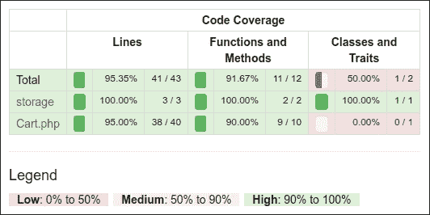

您可以点击任何类并分析在测试过程中未执行的代码行。例如，打开我们的 `Cart` 类报告：

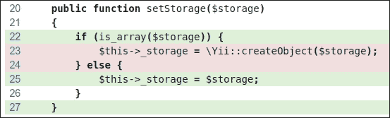

在我们的例子中，我们忘记测试从数组配置创建存储。

### 组件的使用

在 Packagist 上发布扩展后，我们可以安装一个一对一的任何项目：

```php
composer require book/cart

```

此外，在应用程序配置文件中启用组件：

```php
'components' => [
    // …
    'cart' => [
        'class' => 'book\cart\Cart',
        'storage' => [
            'class' => 'book\cart\storage\SessionStorage',
        ],
    ],
],
```

作为不发布扩展到 Packagist 的替代方法，我们必须设置 `@book` 别名以启用正确的类自动加载：

```php
$config = [
    'id' => 'basic',
    'basePath' => dirname(__DIR__),
    'bootstrap' => ['log'],
    'aliases' => [
        '@book' => dirname(__DIR__) . '/book',
    ],
    'components' => [
        'cart' => [
            'class' => 'book\cart\Cart',
            'storage' => [
                'class' => 'book\cart\storage\SessionStorage',
            ],
        ],
        // ...
    ],
]
```

无论如何，我们可以在项目中将其用作 `Yii::$app->cart` 组件：

```php
Yii::$app->cart->add($product->id, $amount);
```

## 它是如何工作的…

在创建自己的测试之前，您只需在项目的根目录中创建任何子目录，并添加 `phpunit.xml` 或 `phpunit.xml.dist` 文件：

```php
<?xml version="1.0" encoding="utf-8"?>
<phpunit bootstrap="./tests/bootstrap.php"
         colors="true"
         convertErrorsToExceptions="true"
         convertNoticesToExceptions="true"
         convertWarningsToExceptions="true"
         stopOnFailure="false">
    <testsuites>
        <testsuite name="Test Suite">
            <directory>./tests</directory>
        </testsuite>
    </testsuites>
    <filter>
        <whitelist>
            <directory suffix=".php">./src/</directory>
        </whitelist>
    </filter>
</phpunit>
```

如果工作目录中不存在第一个文件，PHPUnit 从第二个文件加载配置。您还可以通过初始化自动加载器和您的框架环境来创建 `bootstrap.php` 文件：

```php
<?php
defined('YII_DEBUG') or define('YII_DEBUG', true);
defined('YII_ENV') or define('YII_ENV', 'test');
require(__DIR__ . '/../vendor/autoload.php');
require(__DIR__ . '/../vendor/yiisoft/yii2/Yii.php');
```

最后，您可以通过 Composer（本地或全局）安装 PHPUnit，并在包含 XML 配置文件的目录中使用 `phpunit` 控制台命令。

PHPUnit 扫描测试目录，并找到以 `*Test.php` 后缀的文件。您所有的测试类都必须扩展 `PHPUnit_Framework_TestCase` 类，并包含具有 `test*` 前缀的公共方法，如下所示：

```php
class MyTest extends TestCase
{
    public function testSomeFunction()
    {
        $this->assertTrue(true);
    }
}
```

在测试的主体中，您可以使用任何现有的 `assert*` 方法：

```php
$this->assertEqual('Alex', $model->name);
$this->assertTrue($model->validate());
$this->assertFalse($model->save());
$this->assertCount(3, $items);
$this->assertArrayHasKey('username', $model->getErrors());
$this->assertNotNull($model->author);
$this->assertInstanceOf('app\models\User', $model->author);
```

此外，您还可以覆盖 `setUp()` 或 `tearDown()` 方法以添加在每次测试方法前后运行的表达式。

例如，您可以通过重新初始化 Yii 应用程序来定义自己的基础 `TestCase` 类：

```php
<?php
namespace book\cart\tests;

use yii\di\Container;
use yii\web\Application;

abstract class TestCase extends \PHPUnit_Framework_TestCase
{
    protected function setUp()
    {
        parent::setUp();
        $this->mockApplication();
    }

    protected function tearDown()
    {
        $this->destroyApplication();
        parent::tearDown();
    }

    protected function mockApplication()
    {
        new Application([
            'id' => 'testapp',
            'basePath' => __DIR__,
            'vendorPath' => dirname(__DIR__) . '/vendor',
        ]);
    }

    protected function destroyApplication()
    {
        \Yii::$app = null;
        \Yii::$container = new Container();
    }
}
```

现在，您可以在子类中扩展此类。即使您的 `test` 方法也会使用应用程序的独立实例。这有助于避免副作用并创建独立的测试。

### 注意

Yii 2.0.* 使用旧的 PHPUnit 4.* 版本以与 PHP 5.4 兼容。

## 参见

+   关于 PHPUnit 使用的所有信息，请参阅官方文档[`phpunit.de/manual/current/en/index.html`](https://phpunit.de/manual/current/en/index.html)

+   *使用 Codeception 测试应用程序* 的配方

# 使用 Atoum 进行单元测试

除了 PHPUnit 和 Codeception，Atoum 还是一个简单的单元测试框架。您可以使用此框架来测试您的扩展或测试应用程序的代码。

## 准备工作

为新项目创建一个空目录。

## 如何做到这一点…

在这个菜谱中，我们将创建一个带有 Atoum 测试的演示购物车扩展。

### 准备扩展结构

1.  首先，为您的外部扩展创建目录结构：

    ```php
    book
    └── cart
        ├── src
        └── tests
    ```

1.  为了将扩展作为 composer 包使用，按照以下方式准备`book/cart/composer.json`文件：

    ```php
    {
        "name": "book/cart",
        "type": "yii2-extension",
        "require": {
            "yiisoft/yii2": "~2.0"
        },
        "require-dev": {
            "atoum/atoum": "².7"
        },
        "autoload": {
            "psr-4": {
                "book\\cart\\": "src/",
                "book\\cart\\tests\\": "tests/"
            }
        },
        "extra": {
            "asset-installer-paths": {
                "npm-asset-library": "vendor/npm",
                "bower-asset-library": "vendor/bower"
            }
        }
    }
    ```

1.  将以下行添加到`book/cart/,gitignore`文件中：

    ```php
    /vendor
    /composer.lock
    ```

1.  安装扩展的所有依赖项：

    ```php
    composer install
    ```

1.  现在我们将得到以下结构：

    ```php
    book
    └── cart
        ├── src
        ├── tests
        ├── .gitignore
        ├── composer.json
        ├── phpunit.xml.dist
        └── vendor
    ```

### 编写扩展代码

从*使用 PHPUnit 进行单元测试*菜谱中复制`Cart`、`StorageInterface`和`SessionStorage`类。

最后，我们必须得到以下结构：

```php
book
└── cart
    ├── src
    │   ├── storage
    │   │   ├── SessionStorage.php
    │   │   └── StorageInterface.php
    │   └── Cart.php
    ├── tests
    ├── .gitignore
    ├── composer.json
    └── vendor
```

### 编写扩展测试

1.  添加`book/cart/tests/bootstrap.php`入口脚本：

    ```php
    <?php
    defined('YII_DEBUG') or define('YII_DEBUG', true);
    defined('YII_ENV') or define('YII_ENV', 'test');
    require(__DIR__ . '/../vendor/autoload.php');
    require(__DIR__ . '/../vendor/yiisoft/yii2/Yii.php');
    ```

1.  通过在每个测试之前初始化 Yii 应用程序并在测试之后销毁应用程序来创建一个测试基类：

    ```php
    <?php

    namespace book\cart\tests;

    use yii\di\Container;
    use yii\console\Application;
    use mageekguy\atoum\test;

    abstract class TestCase extends test
    {
        public function beforeTestMethod($method)
        {
            parent::beforeTestMethod($method);
            $this->mockApplication();
        }

        public function afterTestMethod($method)
        {
            $this->destroyApplication();
            parent::afterTestMethod($method);
        }

        protected function mockApplication()
        {
            new Application([
                'id' => 'testapp',
                'basePath' => __DIR__,
                'vendorPath' => dirname(__DIR__) . '/vendor',
                'components' => [
                    'session' => [
                        'class' => 'yii\web\Session',
                    ],
                ]
            ]);
        }

        protected function destroyApplication()
        {
            \Yii::$app = null;
            \Yii::$container = new Container();
        }
    }
    ```

1.  添加一个基于内存的清洁模拟类，该类实现了`StorageInterface`接口：

    ```php
    <?php
    namespace book\cart\tests;

    use book\cart\storage\StorageInterface;

    class FakeStorage implements StorageInterface
    {
        private $items = [];

        public function load()
        {
            return $this->items;
        }

        public function save(array $items)
        {
            $this->items = $items;
        }
    }
    ```

    这将把项目存储到私有变量中，而不是与真实会话一起工作。这允许我们独立运行测试（没有真实存储驱动程序），并且也提高了测试性能。

1.  添加`Cart`测试类：

    ```php
    <?php
    namespace book\cart\tests\units;

    use book\cart\tests\FakeStorage;
    use book\cart\Cart as TestedCart;
    use book\cart\tests\TestCase;

    class Cart extends TestCase
    {
        /**
         * @var TestedCart
         */
        private $cart;

        public function beforeTestMethod($method)
        {
            parent::beforeTestMethod($method);
            $this->cart = new TestedCart(['storage' => new FakeStorage()]);
        }

        public function testEmpty()
        {
            $this->array($this->cart->getItems())->isEqualTo([]);
            $this->integer($this->cart->getCount())->isEqualTo(0);
            $this->integer($this->cart->getAmount())->isEqualTo(0);
        }

        public function testAdd()
        {        
            $this->cart->add(5, 3);
            $this->array($this->cart->getItems())->isEqualTo([5 => 3]);

            $this->cart->add(7, 14);
            $this->array($this->cart->getItems())->isEqualTo([5 => 3, 7 => 14]);

            $this->cart->add(5, 10);
            $this->array($this->cart->getItems())->isEqualTo([5 => 13, 7 => 14]);
        }

        public function testSet()
        {
            $this->cart->add(5, 3);
            $this->cart->add(7, 14);
            $this->cart->set(5, 12);
            $this->array($this->cart->getItems())->isEqualTo([5 => 12, 7 => 14]);
        }

        public function testRemove()
        {
            $this->cart->add(5, 3);
            $this->cart->remove(5);
            $this->array($this->cart->getItems())->isEqualTo([]);
        }

        public function testClear()
        {
            $this->cart->add(5, 3);
            $this->cart->add(7, 14);
            $this->cart->clear();
            $this->array($this->cart->getItems())->isEqualTo([]);
        }

        public function testCount()
        {
            $this->cart->add(5, 3);
            $this->integer($this->cart->getCount())->isEqualTo(1);

            $this->cart->add(7, 14);
            $this->integer($this->cart->getCount())->isEqualTo(2);
        }

        public function testAmount()
        {
            $this->cart->add(5, 3);
            $this->integer($this->cart->getAmount())->isEqualTo(3);

            $this->cart->add(7, 14);
            $this->integer($this->cart->getAmount())->isEqualTo(17);
        }

        public function testEmptyStorage()
        {
            $cart = new TestedCart();

            $this->exception(function () use ($cart) {
                $cart->getItems();
            })->hasMessage('Storage must be set');
        }
    }
    ```

1.  添加一个单独的测试来检查`SessionStorage`类：

    ```php
    <?php
    namespace book\cart\tests\units\storage;

    use book\cart\storage\SessionStorage as TestedStorage;
    use book\cart\tests\TestCase;

    class SessionStorage extends TestCase
    {
        /**
         * @var TestedStorage
         */
        private $storage;

        public function beforeTestMethod($method)
        {
            parent::beforeTestMethod($method);
            $this->storage = new TestedStorage(['key' => 'test']);
        }

        public function testEmpty()
        {
            $this
                ->given($storage = $this->storage)
                ->then
                    ->array($storage->load())
                        ->isEqualTo([]);
        }

        public function testStore()
        {
            $this
                ->given($storage = $this->storage)
                ->and($storage->save($items = [1 => 5, 6 => 12]))
                ->then
                    ->array($this->storage->load())
                        ->isEqualTo($items)
            ;
        }
    }
    ```

1.  现在我们将得到以下结构：

    ```php
    book
    └── cart
        ├── src
        │   ├── storage
        │   │   ├── SessionStorage.php
        │   │   └── StorageInterface.php
        │   └── Cart.php
        ├── tests
        │   ├── units
        │   │   ├── storage
        │   │   │   └── SessionStorage.php
        │   │   └── Cart.php
        │   ├── bootstrap.php
        │   ├── FakeStorage.php
        │   └── TestCase.php
        ├── .gitignore
        ├── composer.json
        └── vendor
    ```

### 运行测试

在使用`composer install`命令安装所有依赖项期间，Composer 包管理器将`Atounm`包安装到`vendor`目录，并将可执行文件`atoum`放置在`vendor/bin`子目录中。

现在我们可以运行以下脚本：

```php
cd book/cart
vendor/bin/atoum -d tests/units -bf tests/bootstrap.php

```

此外，我们还必须看到以下测试报告：

```php
> atoum path: /book/cart/vendor/atoum/atoum/vendor/bin/atoum
> atoum version: 2.7.0
> atoum path: /book/cart/vendor/atoum/atoum/vendor/bin/atoum
> atoum version: 2.7.0
> PHP path: /usr/bin/php5
> PHP version:
=> PHP 5.5.9-1ubuntu4.16 (cli)
> book\cart\tests\units\Cart...
[SSSSSSSS__________________________________________________][8/8]
=> Test duration: 1.13 seconds.
=> Memory usage: 3.75 Mb.
> book\cart\tests\units\storage\SessionStorage...
[SS________________________________________________________][2/2]
=> Test duration: 0.03 second.
=> Memory usage: 1.00 Mb.
> Total tests duration: 1.15 seconds.
> Total tests memory usage: 4.75 Mb.
> Code coverage value: 16.16%

```

每个`S`符号表示对应测试的成功结果。

尝试通过注释`unset`操作来故意破坏购物车：

```php
class Cart extends Component
{
    ...

    public function remove($id)
    {
        $this->loadItems();
        if (isset($this->_items[$id])) {
            // unset($this->_items[$id]);
        }
        $this->saveItems();
    }

    ...
}
```

再次运行测试：

```php
> atoum version: 2.7.0
> PHP path: /usr/bin/php5
> PHP version:
=> PHP 5.5.9-1ubuntu4.16 (cli)
book\cart\tests\units\Cart...
[SSFSSSSS__________________________________________________][8/8]
=> Test duration: 1.09 seconds.
=> Memory usage: 3.25 Mb.
> book\cart\tests\units\storage\SessionStorage...
[SS________________________________________________________][2/2]
=> Test duration: 0.02 second.
=> Memory usage: 1.00 Mb.
...
Failure (2 tests, 10/10 methods, 0 void method, 0 skipped method, 0 uncompleted method, 1 failure, 0 error, 0 exception)!
> There is 1 failure:
=> book\cart\tests\units\Cart::testRemove():
In file /book/cart/tests/units/Cart.php on line 53, mageekguy\atoum\asserters\phpArray() failed: array(1) is not equal to array(0)
-Expected
+Actual
@@ -1 +1,3 @@
-array(0) {
+array(1) {
+  [5] =>
+  int(3)

```

在这种情况下，我们看到了一个失败（用`F`代替点）和一份失败报告。

### 分析代码覆盖率

您必须从[`xdebug.org`](https://xdebug.org)安装 XDebug PHP 扩展。例如，在 Ubuntu 或 Debian 上，您可以在终端中输入以下内容：

```php
sudo apt-get install php5-xdebug

```

在 Windows 上，您必须打开`php.ini`文件，并添加带有您 PHP 安装目录路径的自定义代码：

```php
[xdebug]
zend_extension_ts=C:/php/ext/php_xdebug.dll
```

或者，如果您使用的是非线程安全版本，请输入以下内容：

```php
[xdebug]
zend_extension=C:/php/ext/php_xdebug.dll
```

在安装 XDebug 之后，创建一个包含覆盖率报告选项的`book/cart/coverage.php`配置文件：

```php
<?php
use \mageekguy\atoum;
/** @var atoum\scripts\runner $script */
$report = $script->addDefaultReport();
$coverageField = new atoum\report\fields\runner\coverage\html('Cart', __DIR__ . '/tests/coverage');
$report->addField($coverageField);
```

现在再次运行测试，使用`-c`选项来使用此配置：

```php
vendor/bin/atoum -d tests/units -bf tests/bootstrap.php -c coverage.php
```

运行测试后，在浏览器中打开`tests/coverage/index.html`文件。您将看到每个目录和类的明确覆盖率报告：

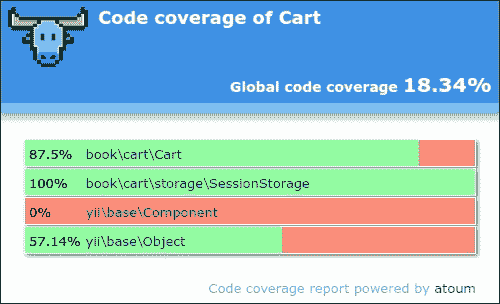

您可以点击任何类并分析在测试过程中未执行的代码行。

## 它是如何工作的…

Atoum 测试框架支持 **行为驱动设计** (**BDD**) 语法流，如下所示：

```php
public function testSome()
{
    $this
        ->given($cart = new TestedCart())
        ->and($cart->add(5, 13))
        ->then
            ->sizeof($cart->getItems())
                ->isEqualTo(1)
            ->array($cart->getItems())
                ->isEqualTo([5 => 3])
            ->integer($cart->getCount())
                ->isEqualTo(1)
            ->integer($cart->getAmount())
                ->isEqualTo(3);
}
```

然而，您可以使用类似于 PHPUnit 的常规语法来编写单元测试：

```php
public function testSome()
{
    $cart = new TestedCart();
    $cart->add(5, 3);

    $this
        ->array($cart->getItems())->isEqualTo([5 => 3])
        ->integer($cart->getCount())->isEqualTo(1)
        ->integer($cart->getAmount())->isEqualTo(3)
    ;
}
```

Atoum 还支持代码覆盖率报告，用于分析测试质量。

## 参见

+   有关 Atoum 的更多信息，请参阅 [`docs.atoum.org/en/latest/`](http://docs.atoum.org/en/latest/)

+   有关源代码和使用示例，请参阅 [`github.com/atoum/atoum`](https://github.com/atoum/atoum)

+   *使用 PHPUnit 进行单元测试* 菜谱

# 使用 Behat 进行单元测试

Behat 是一个用于测试代码的 BDD 框架，它使用人类可读的句子描述各种用例中的代码行为。

## 准备就绪

为新项目创建一个空目录。

## 如何做到这一点…

在本菜谱中，我们将创建一个带有 Behat 测试的演示购物车扩展。

### 准备扩展结构

1.  首先，为您的扩展创建目录结构：

    ```php
    book
    └── cart
        ├── src
        └── features
    ```

1.  要将扩展作为 Composer 包使用，请按如下准备 `book/cart/composer.json` 文件：

    ```php
    {
        "name": "book/cart",
        "type": "yii2-extension",
        "require": {
            "yiisoft/yii2": "~2.0"
        },
        "require-dev": {
            "phpunit/phpunit": "4.*",
            "behat/behat": "³.1"
        },
        "autoload": {
            "psr-4": {
                "book\\cart\\": "src/",
                "book\\cart\\features\\": "features/"
            }
        },
        "extra": {
            "asset-installer-paths": {
                "npm-asset-library": "vendor/npm",
                "bower-asset-library": "vendor/bower"
            }
        }
    }
    ```

1.  将以下行添加到 `book/cart/.gitignore` 文件中：

    ```php
    /vendor
    /composer.lock
    ```

1.  安装扩展的所有依赖项：

    ```php
    composer install
    ```

1.  现在我们得到以下结构：

    ```php
    book
    └── cart
        ├── src
        ├── features
        ├── .gitignore
        ├── composer.json
        └── vendor
    ```

### 编写扩展代码

从 *使用 PHPUnit 进行单元测试* 菜谱中复制 `Cart`、`StorageInterface` 和 `SessionStorage` 类。

最后，我们得到以下结构：

```php
book
└── cart
    ├── src
    │   ├── storage
    │   │   ├── SessionStorage.php
    │   │   └── StorageInterface.php
    │   └── Cart.php
    ├── features
    ├── .gitignore
    ├── composer.json
    └── vendor
```

### 编写扩展测试

1.  添加 `book/cart/features/bootstrap/bootstrap.php` 入口脚本：

    ```php
    <?php
    defined('YII_DEBUG') or define('YII_DEBUG', true);
    defined('YII_ENV') or define('YII_ENV', 'test');

    require_once __DIR__ . '/../../vendor/yiisoft/yii2/Yii.php';
    ```

1.  创建 `features/cart.feature` 文件并编写购物车测试场景：

    ```php
    Feature: Shopping cart
      In order to buy products
      As a customer
      I need to be able to put interesting products into a cart

      Scenario: Checking empty cart
        Given there is a clean cart
        Then I should have 0 products
        Then I should have 0 product
        And the overall cart amount should be 0

      Scenario: Adding products to the cart
        Given there is a clean cart
        When I add 3 pieces of 5 product
        Then I should have 3 pieces of 5 product
        And I should have 1 product
        And the overall cart amount should be 3

        When I add 14 pieces of 7 product
        Then I should have 3 pieces of 5 product
        And I should have 14 pieces of 7 product
        And I should have 2 products
        And the overall cart amount should be 17

        When I add 10 pieces of 5 product
        Then I should have 13 pieces of 5 product
        And I should have 14 pieces of 7 product
        And I should have 2 products
        And the overall cart amount should be 27

      Scenario: Change product count in the cart
        Given there is a cart with 5 pieces of 7 product
        When I set 3 pieces for 7 product
        Then I should have 3 pieces of 7 product

      Scenario: Remove products from the cart
        Given there is a cart with 5 pieces of 7 product
        When I add 14 pieces of 7 product
        And I clear cart
        Then I should have empty cart
    ```

1.  添加存储测试 `features/storage.feature` 文件：

    ```php
    Feature: Shopping cart storage
      I need to be able to put items into a storage

      Scenario: Checking empty storage
        Given there is a clean storage
        Then I should have empty storage

      Scenario: Save items into storage
        Given there is a clean storage
        When I save 3 pieces of 7 product to the storage
        Then I should have 3 pieces of 7 product in the storage
    ```

1.  在 `features/bootstrap/CartContext.php` 文件中添加所有步骤的实现：

    ```php
    <?php
    use Behat\Behat\Context\SnippetAcceptingContext;
    use book\cart\Cart;
    use book\cart\features\bootstrap\storage\FakeStorage;
    use yii\di\Container;
    use yii\web\Application;

    require_once __DIR__ . '/bootstrap.php';

    class CartContext implements SnippetAcceptingContext
    {
        /**
         * @var Cart
         * */
        private $cart;

        /**
         * @Given there is a clean cart
         */
        public function thereIsACleanCart()
        {
            $this->resetCart();
        }

        /**
         * @Given there is a cart with :pieces of :product product
         */
        public function thereIsAWhichCostsPs($product, $amount)
        {
            $this->resetCart();
            $this->cart->set($product, floatval($amount));
        }

        /**
         * @When I add :pieces of :product
         */
        public function iAddTheToTheCart($product, $pieces)
        {
            $this->cart->add($product, $pieces);
        }

        /**
         * @When I set :pieces for :arg2 product
         */
        public function iSetPiecesForProduct($pieces, $product)
        {
            $this->cart->set($product, $pieces);
        }

        /**
         * @When I clear cart
         */
        public function iClearCart()
        {
            $this->cart->clear();
        }

        /**
         * @Then I should have empty cart
         */
        public function iShouldHaveEmptyCart()
        {
            PHPUnit_Framework_Assert::assertEquals(
                0,
                $this->cart->getCount()
            );
        }

        /**
         * @Then I should have :count product(s)
         */
        public function iShouldHaveProductInTheCart($count)
        {
            PHPUnit_Framework_Assert::assertEquals(
                intval($count),
                $this->cart->getCount()
            );
        }

        /**
         * @Then the overall cart amount should be :amount
         */
        public function theOverallCartPriceShouldBePs($amount)
        {
            PHPUnit_Framework_Assert::assertSame(
                intval($amount),
                $this->cart->getAmount()
            );
        }

        /**
         * @Then I should have :pieces of :product
         */
        public function iShouldHavePiecesOfProduct($pieces, $product)
        {
            PHPUnit_Framework_Assert::assertArraySubset(
                [intval($product) => intval($pieces)],
                $this->cart->getItems()
            );
        }

        private function resetCart()
        {
            $this->cart = new Cart(['storage' => new FakeStorage()]);
        }
    }
    ```

1.  在 `features/bootstrap/StorageContext.php` 文件中，添加以下内容：

    ```php
    <?php
    use Behat\Behat\Context\SnippetAcceptingContext;
    use book\cart\Cart;
    use book\cart\features\bootstrap\storage\FakeStorage;
    use book\cart\storage\SessionStorage;
    use yii\di\Container;
    use yii\web\Application;

    require_once __DIR__ . '/bootstrap.php';

    class StorageContext implements SnippetAcceptingContext
    {
        /**
         * @var SessionStorage
         * */
        private $storage;

        /**
         * @Given there is a clean storage
         */
        public function thereIsACleanStorage()
        {
            $this->mockApplication();
            $this->storage = new SessionStorage(['key' => 'test']);
        }

        /**
         * @When I save :pieces of :product to the storage
         */
        public function iSavePiecesOfProductToTheStorage($pieces, $product)
        {
            $this->storage->save([$product => $pieces]);
        }

        /**
         * @Then I should have empty storage
         */
        public function iShouldHaveEmptyStorage()
        {
            PHPUnit_Framework_Assert::assertCount(
                0,
                $this->storage->load()
            );
        }

        /**
         * @Then I should have :pieces of :product in the storage
         */
        public function iShouldHavePiecesOfProductInTheStorage($pieces, $product)
        {
            PHPUnit_Framework_Assert::assertArraySubset(
                [intval($product) => intval($pieces)],
                $this->storage->load()
            );
        }

        private function mockApplication()
        {
            Yii::$container = new Container();
            new Application([
                'id' => 'testapp',
                'basePath' => __DIR__,
                'vendorPath' => __DIR__ . '/../../vendor',
            ]);
        }
    }
    ```

1.  添加 `features/bootstrap/CartContext/FakeStorage.php` 文件，其中包含一个模拟存储类：

    ```php
    <?php
    namespace book\cart\features\bootstrap\storage;

    use book\cart\storage\StorageInterface;

    class FakeStorage implements StorageInterface
    {
        private $items = [];

        public function load()
        {
            return $this->items;
        }

        public function save(array $items)
        {
            $this->items = $items;
        }
    }
    ```

1.  添加 `book/cart/behat.yml` 并定义上下文：

    ```php
    default:
        suites:
            default:
                contexts:
                    - CartContext
                    - StorageContext
    ```

1.  现在我们将得到以下结构：

    ```php
    book
    └── cart
        ├── src
        │   ├── storage
        │   │   ├── SessionStorage.php
        │   │   └── StorageInterface.php
        │   └── Cart.php
        ├── features
        │   ├── bootstrap
        │   │   ├── storage
        │   │   │   └── FakeStorage.php
        │   │   ├── bootstrap.php
        │   │   ├── CartContext.php
        │   │   └── StorageContext.php
        │   ├── cart.feature
        │   └── storage.feature
        ├── .gitignore
        ├── behat.yml
        ├── composer.json
        └── vendor
    ```

现在我们可以运行我们的测试。

### 运行测试

在使用 `composer install` 命令安装所有依赖项期间，Composer 包管理器将 Behat 包安装到 `vendor` 目录，并将可执行文件 `behat` 放在 `vendor/bin` 子目录中。

现在我们可以运行以下脚本：

```php
cd book/cart
vendor/bin/behat
```

此外，我们还必须查看以下测试报告：

```php
Feature: Shopping cart
 In order to buy products
 As a customer
 I need to be able to put interesting products into a cart

 Scenario: Checking empty cart             # features/cart.feature:6
 Given there is a clean cart             # thereIsACleanCart()
 Then I should have 0 products           # iShouldHaveProductInTheCart()
 Then I should have 0 product            # iShouldHaveProductInTheCart()
 And the overall cart amount should be 0 # theOverallCartPriceShouldBePs()

 ...

Feature: Shopping cart storage
 I need to be able to put items into a storage

 Scenario: Checking empty storage   # features/storage.feature:4
 Given there is a clean storage   # thereIsACleanStorage()
 Then I should have empty storage # iShouldHaveEmptyStorage()

 ...

6 scenarios (6 passed)
31 steps (31 passed)
0m0.23s (13.76Mb)

```

尝试通过注释 `unset` 操作来故意破坏购物车：

```php
class Cart extends Component
{
    …

    public function set($id, $amount)
    {
        $this->loadItems();
        // $this->_items[$id] = $amount;
        $this->saveItems();
    }

    ...
}
```

现在再次运行测试：

```php
Feature: Shopping cart
  In order to buy products
  As a customer
Feature: Shopping cart
  In order to buy products
  As a customer
  I need to be able to put interesting products into a cart

  ...

  Scenario: Change product count in the cart       # features/cart.feature:31
    Given there is a cart with 5 pieces of 7 prod  # thereIsAWhichCostsPs()
    When I set 3 pieces for 7 product              # iSetPiecesForProduct()
    Then I should have 3 pieces of 7 product       # iShouldHavePiecesOf()
      Failed asserting that an array has the subset Array &0 (
          7 => 3
      ).

  Scenario: Remove products from the cart         # features/cart.feature:36
    Given there is a cart with 5 pieces of 7 prod # thereIsAWhichCostsPs()
    When I add 14 pieces of 7 product             # iAddTheToTheCart()
    And I clear cart                              # iClearCart()
    Then I should have empty cart                 # iShouldHaveEmptyCart()

--- Failed scenarios:

    features/cart.feature:31

6 scenarios (5 passed, 1 failed)
31 steps (30 passed, 1 failed)
0m0.22s (13.85Mb)
```

在这种情况下，我们看到了一次失败和一份失败报告。

## 它是如何工作的…

Behat 是一个 BDD 测试框架。它简化了编写先导的人类可读测试场景到低级技术实现的转换。

当我们为每个功能编写场景时，我们可以使用一组操作符：

```php
Scenario: Adding products to the cart
    Given there is a clean cart
    When I add 3 pieces of 5 product
    Then I should have 3 pieces of 5 product
    And I should have 1 product
    And the overall cart amount should be 3
```

Behat 解析我们的句子，并在上下文类中找到与句子关联的实现：

```php
class FeatureContext implements SnippetAcceptingContext
{    
    /**
     * @When I add :pieces of :product
     */
    public function iAddTheToTheCart($product, $pieces)
    {
        $this->cart->add($product, $pieces);
    }
}
```

您可以创建一个单个的 `FeatureContex` `t` 类（默认）或为功能组和场景创建一组特定上下文。

## 参见

有关 Behat 的更多信息，请参阅以下 URL：

+   [`docs.behat.org/en/v3.0/`](http://docs.behat.org/en/v3.0/)

+   [`github.com/Behat/Behat`](https://github.com/Behat/Behat)

要获取有关替代测试框架的更多信息，请参阅本章中的其他食谱。
