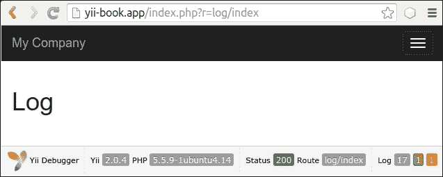
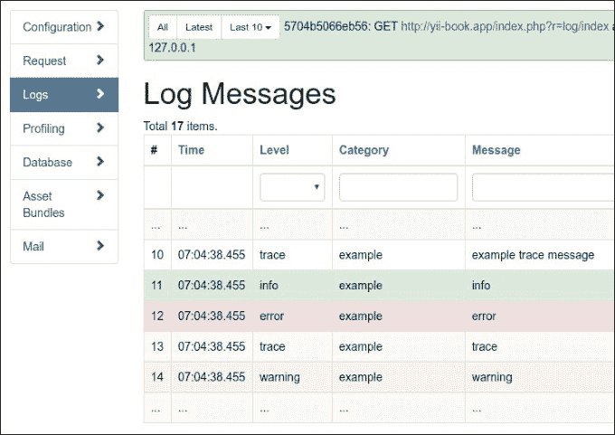
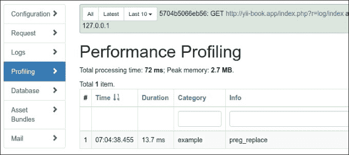
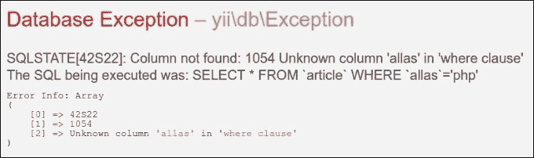
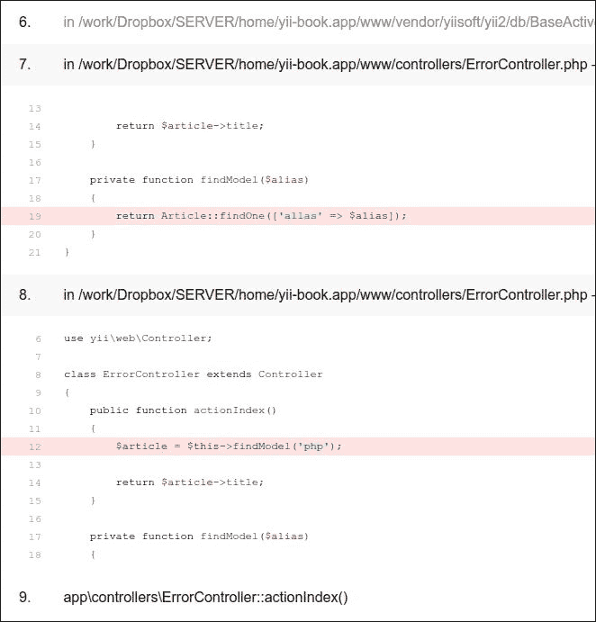
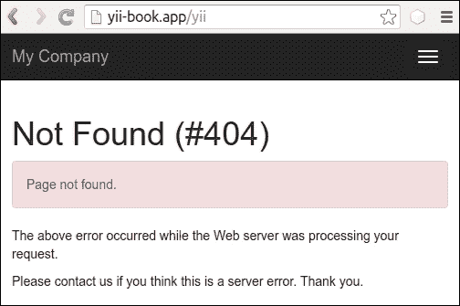
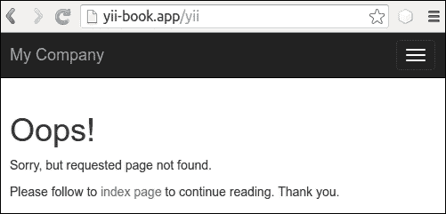
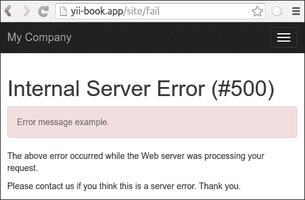
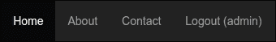
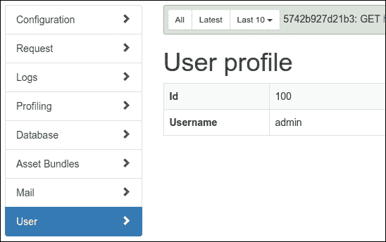

# 第十二章。调试、日志记录和错误处理

在本章中，我们将涵盖以下主题：

+   使用不同的日志路由

+   分析 Yii 错误堆栈跟踪

+   记录和使用上下文信息

+   显示自定义错误

+   调试扩展的自定义面板

# 简介

如果应用程序相对复杂，那么不可能创建一个无错误的程序，因此开发者必须尽快检测错误并处理它们。Yii 提供了一套良好的实用功能来处理日志记录和错误处理。此外，在调试模式下，如果出现错误，Yii 会提供堆栈跟踪。使用它，你可以更快地修复错误。

在本章中，我们将回顾日志记录、分析异常堆栈跟踪以及实现我们自己的错误处理器。

# 使用不同的日志路由

日志记录是在你无法调试应用程序时理解应用程序实际行为的关键。信不信由你，即使你 100%确信应用程序将按预期行为，在生产环境中，它可能做许多你不知道的事情。这是正常的，因为没有人能了解一切。因此，如果我们期望出现异常行为，我们需要尽快了解它，并拥有足够的详细信息来重现它。这就是日志记录发挥作用的地方。

Yii 不仅允许开发者记录消息，还可以根据消息级别和类别以不同的方式处理它们。例如，你可以将消息写入数据库，发送电子邮件，或者只是在浏览器中显示。

在本食谱中，我们将以明智的方式处理日志消息：最重要的消息将通过电子邮件发送，不太重要的消息将保存在文件 A 和 B 中，性能分析将路由到 Firebug。此外，在开发模式下，所有消息和性能信息都将显示在屏幕上。

## 准备工作

使用 Composer 包管理器创建一个新的`yii2-app-basic`应用程序，如官方指南中所述，[`www.yiiframework.com/doc-2.0/guide-start-installation.html`](http://www.yiiframework.com/doc-2.0/guide-start-installation.html)。

## 如何操作...

执行以下步骤：

1.  使用`config/web.php`配置日志：

    ```php
    'components' => [
        'log' => [
            'traceLevel' => 0,
            'targets' => [
                [
                    'class' => 'yii\log\EmailTarget',
                    'categories' => ['example'],
                    'levels' => ['error'],
                    'message' => [
                        'from' => ['log@example.com'],
                        'to' => ['developer1@example.com', 'developer2@example.com'],
                        'subject' => 'Log message',
                    ],
                ],
                [
                    'class' => 'yii\log\FileTarget',
                    'levels' => ['error'],
                    'logFile' => '@runtime/logs/error.log',
                ],
                [
                    'class' => 'yii\log\FileTarget',
                    'levels' => ['warning'],
                    'logFile' => '@runtime/logs/warning.log',
                ],
                [
                    'class' => 'yii\log\FileTarget',
                    'levels' => ['info'],
                    'logFile' => '@runtime/logs/info.log',
                ],
            ],
        ],

        'db' => require(__DIR__ . '/db.php'),
    ],
    ```

1.  现在，我们将在`protected/controllers/LogController.php`中生成一些日志消息，如下所示：

    ```php
    <?php
    namespace app\controllers;

    use yii\web\Controller;
    use Yii;

    class LogController extends Controller
    {
        public function actionIndex()
        {
            Yii::trace('example trace message', 'example');
            Yii::info('info', 'example');
            Yii::error('error', 'example');
            Yii::trace('trace', 'example');
            Yii::warning('warning','example');

            Yii::beginProfile('preg_replace', 'example');
            for($i=0;$i<10000;$i++){
                preg_replace('~^[ a-z]+~', '', 'test it');
            }
            Yii::endProfile('preg_replace', 'example');

            return $this->render('index');
        }
    }
    ```

    并查看`views/log/index.php`：

    ```php
    <div class="log-index">
        <h1>Log</h1>
    </div>
    ```

1.  现在多次运行前面的操作。在屏幕上，你应该看到`日志`标题和一个带有日志消息数量的调试面板：

1.  如果你点击**17**，你将看到一个类似于以下截图的网页日志：

1.  日志包含我们记录的所有消息以及堆栈跟踪、时间戳、级别和类别。

1.  现在打开**性能分析**页面。你应该能看到分析器消息，如下面的截图所示：

    性能分析信息显示自身代码块的总执行时间。

1.  由于我们只更改了日志文件名而没有更改路径，你应该在 `runtime/logs` 中查找名为 `error.log`、`warning.log` 和 `info.log` 的日志文件。

1.  在内部，你可以找到以下消息：

    ```php
    2016-03-06 07:28:35 [127.0.0.1][-][-][error][example] error
    ...
    2016-03-06 07:28:35 [127.0.0.1][-][-][warning][example] warning
    ...
    2016-03-06 07:28:35 [127.0.0.1][-][-][info][example] inf
    o

    ```

## 它是如何工作的…

当使用 `Yii::error`、`Yii::warning`、`Yii::info` 或 `Yii::trace` 记录消息时，Yii 会将其传递给日志路由器。

根据其配置方式，它将消息传递给一个或多个目标，例如，通过 `Yii::$app->mailer` 组件通过电子邮件发送错误，将调试信息写入文件 A，并将警告信息写入文件 B。

`yii\log\Dispatcher` 类的对象通常附加到名为 log 的应用程序组件。因此，为了配置它，我们应该在配置文件的 components 部分设置其属性。那里唯一可配置的属性是 targets，它包含一个日志路由及其配置的数组。

我们已经定义了四个日志路由。以下是如何回顾它们的：

```php
[
    'class' => 'yii\log\EmailTarget',
    'categories' => ['example'],
    'levels' => ['error'],
    // 'mailer' => 'mailer',
    'message' => [
        'from' => ['log@example.com'],
        'to' => ['developer1@example.com', 'developer2@example.com'],
        'subject' => 'Log error,
    ],
],
```

`EmailTarget` 默认通过 `Yii::$app->mailer` 组件通过电子邮件发送日志消息。我们限制类别为 example 和级别为 error。一封电子邮件将从 `log@example.com` 发送到两位开发者，主题为 `Log error`：

```php
[
    'class' => 'yii\log\FileTarget',
    'levels' => [warning],
    'logFile' => '@runtime/logs/warning.log',
],
```

`FileTarget` 将错误消息追加到指定的文件。我们限制消息级别为警告，并使用名为 `warning.log` 的文件。我们使用名为 `Info.log` 的文件以相同的方式为 info 级别的消息执行相同的操作。

此外，我们可以使用 `yii\log\SyslogTarget` 将消息写入 `Unix /var/log/syslog` 系统文件，以及使用 `yii\log\DbTarget` 将日志写入数据库。对于后者，你必须应用它们的迁移：

```php
./yii migrate --migrationPath=@yii/log/migrations/
```

## 还有更多…

关于 Yii 日志还有更多有趣的事情，将在以下子节中介绍。

### Yii::trace 与 Yii::getLogger()->log 的比较

`Yii::trace` 是 `Yii::log` 的简单包装：

```php
public static function trace($message, $category = 'application')
{
    if (YII_DEBUG) {
        static::getLogger()->log($message, Logger::LEVEL_TRACE, $category);
    }
}
```

因此，如果 Yii 处于 `debug` 模式，`Yii::trace` 会记录一个具有跟踪级别的消息。

### `Yii::beginProfile` 和 `Yii::endProfile`

这些方法用于测量应用程序代码某些部分的执行时间。在我们的 `LogController` 中，我们测量了 `preg_replace` 的 10,000 次执行，如下所示：

```php
Yii::beginProfile('preg_replace', 'example');
for($i=0;$i<10000;$i++){
    preg_replace('~^[ a-z]+~', '', 'test it');
}
Yii::endProfile('preg_replace', 'example');
```

`Yii::beginProfile` 标记了代码块开始进行性能分析。我们必须为每个代码块设置一个唯一的令牌，并可选地指定一个类别：

```php
public static function beginProfile($token, $category = 'application') { … }
```

`Yii::endProfile` 必须与具有相同类别名称的先前 `beginProfile` 调用相匹配：

```php
public static function endProfile($token, $category = 'application') { … }
```

`begin-` 和 `end-` 调用也必须正确嵌套。

### 立即记录日志

默认情况下，Yii 会将所有日志消息保存在内存中，直到应用程序终止。这样做是为了性能原因，并且通常工作得很好。

然而，如果有一个运行时间较长的控制台应用程序，日志消息将不会立即写入。为了确保你的消息在任何时候都会被记录，你可以显式地使用 `Yii::$app->getLogger()->flush(true)` 或更改控制台应用程序配置中的 `flushInterval` 和 `exportInterval`：

```php
'components' => ['log' => ['flushInterval' => 1,'targets' => [['class' => 'yii\log\FileTarget','exportInterval' => 1,],],    ],
],
```

## 参见

+   为了了解更多关于日志记录的信息，请参阅[`www.yiiframework.com/doc-2.0/guide-runtime-logging.html`](http://www.yiiframework.com/doc-2.0/guide-runtime-logging.html)

+   *日志记录和使用上下文信息*配方

# 分析 Yii 错误堆栈跟踪

当发生错误时，Yii 可以显示错误堆栈跟踪以及错误信息。堆栈跟踪在需要知道真正导致错误的原因，而不仅仅是错误发生的事实时特别有用。

## 准备工作

1.  使用 Composer 包管理器创建一个新的`yii2-app-basic`应用程序，如官方指南中所述，请参阅[`www.yiiframework.com/doc-2.0/guide-start-installation.html`](http://www.yiiframework.com/doc-2.0/guide-start-installation.html)。

1.  配置数据库并导入以下迁移：

    ```php
    <?php
    use yii\db\Migration;
    class m160308_093234_create_article_table extends Migration
    {
        public function up()
        {
            $this->createTable('{{%article}}', [
                'id' => $this->primaryKey(),
                'alias' => $this->string()->notNull(),
                'title' => $this->string()->notNull(),
                'text' => $this->text()->notNull(),
            ]);
        }

        public function down()
        {
            $this->dropTable('{{%article}}');
        }
    }
    ```

1.  使用 Yii 生成一个`Article`模型。

## 如何操作...

执行以下步骤：

1.  现在我们需要创建一些代码来工作。创建`protected/controllers/ErrorController.php`如下：

    ```php
    <?php

    namespace app\controllers;

    use app\models\Article;
    use yii\web\Controller;

    class ErrorController extends Controller
    {
        public function actionIndex()
        {
            $article = $this->findModel('php');

            return $article->title;
        }

        private function findModel($alias)
        {
            return Article::findOne(['allas' => $alias]);
        }
    }
    ```

1.  运行前面的动作后，我们应该得到以下错误：

1.  此外，堆栈跟踪显示了以下错误：

## 它是如何工作的...

从错误信息中，我们知道数据库中没有别名列，但我们却在代码的某个地方使用了它。在我们的例子中，只需通过搜索所有项目文件就能轻松找到它，但在大型项目中，一个列可能存储在一个变量中。此外，我们可以在显示堆栈跟踪的屏幕上修复错误，而无需离开。我们只需仔细阅读即可。

堆栈跟踪显示了一系列调用，从导致错误的调用开始，顺序相反。通常，我们不需要阅读整个跟踪来了解发生了什么。框架代码本身经过了良好的测试，因此错误的可能性较小。这就是为什么 Yii 显示应用程序跟踪条目展开，而框架跟踪条目折叠。

因此，我们选择第一个展开的部分，查找别名。在找到它之后，我们可以立即告诉它在`ErrorController.php`的第 19 行被使用。

## 参见

+   为了了解更多关于错误处理的信息，请参阅[`www.yiiframework.com/doc-2.0/guide-runtime-handling-errors.html`](http://www.yiiframework.com/doc-2.0/guide-runtime-handling-errors.html)

+   *日志记录和使用上下文信息*配方

# 日志记录和使用上下文信息

有时日志消息不足以修复错误。例如，如果你遵循最佳实践，并使用所有可能出现的错误报告开发和测试应用程序，你可能会得到一个错误消息。然而，没有执行上下文，它只是在告诉你有一个错误，但并不清楚实际上是什么导致了它。

对于我们的示例，我们将使用一个非常简单且编码质量差的动作，该动作只是回显`Hello, <username>!`，其中`username`直接从`$_GET`获取。

## 准备工作

使用 Composer 包管理器创建一个新的`yii2-app-basic`应用程序，具体操作请参考官方指南中的[`www.yiiframework.com/doc-2.0/guidestart-installation.html`](http://www.yiiframework.com/doc-2.0/guidestart-installation.html)。

## 如何操作...

执行以下步骤：

1.  首先，我们需要一个控制器来工作。因此，创建`protected/controllers/LogController.php`如下：

    ```php
    <?php
    namespace app\controllers;

    use yii\web\Controller;

    class LogController extends Controller
    {
        public function actionIndex()
        {
            return 'Hello, ' . $_GET['username'];
        }
    }
    ```

1.  现在，如果我们运行索引操作，我们将得到错误消息`Undefined index: username`。让我们配置记录器将这类错误写入文件：

    ```php
    config/web.php:

    'components'=>array(
        ...
        'log' => [
            'targets' => [
                [
                    'class' => 'yii\log\FileTarget',
                    'levels' => ['error'],
                    'logFile' => '@runtime/logs/errors.log',
                ],
            ],
        ],
    ],
    ```

1.  再次运行索引操作并检查`runtime/logs/errors.log`文件。应该会有如下类似的日志信息：

    ```php
    2016-03-06 09:27:09 [127.0.0.1][-][-][error][yii\base\ErrorException:8] exception 'yii\base\ErrorException' with message 'Undefined index: username' in /controllers/LogController.php:11
    Stack trace:
    #0 /yii2/base/InlineAction.php(55): ::call_user_func_array()
    #1 /yii2/base/Controller.php(151): yii\base\InlineAction->runWithParams()
    #2 /yii2/base/Module.php(455): yii\base\Controller->runAction()
    #3 /yii2/web/Application.php(84): yii\base\Module->runAction()
    #4 /yii2/base/Application.php(375): yii\web\Application->handleRequest()
    #5 /web/index.php(12): yii\base\Application->run()
    #6 {main}
    2016-03-06 09:27:09 [127.0.0.1][-][-][info][application] $_GET = [
     'r' => 'log/index'
    ]

    $_COOKIE = [
     '_csrf' => 'ca689043348e...a69ea:2:{i:0;s:...\"DSS...KJ\";}'
     'PHPSESSID' => '30584oqhat4ek8b0hrqsapsbf4'
    ]

    $_SERVER = [
     'USER' => 'www-data'
     'HOME' => '/var/www'
     'FCGI_ROLE' => 'RESPONDER'
     'QUERY_STRING' => 'r=log/index'
     ...
     'PHP_SELF' => '/index.php'
     'REQUEST_TIME_FLOAT' => 1459934829.3067
     'REQUEST_TIME' => 1459934829
    ]

    ```

1.  现在，我们可以将我们的应用程序交给测试团队，并定期检查错误日志。默认情况下，错误报告日志包含`$_GET`、`$_POST`、`$_FILES`、`$_COOKIE`、`$_SESSION`和`$_SERVER`变量的值。如果你不想显示所有值，你可以指定一个自定义变量列表：

    ```php
    'log' => [
        'targets' => [
            [
                'class' => 'yii\log\FileTarget',
                'levels' => ['error'],
                'logVars' => ['_GET', '_POST'],
                'logFile' => '@runtime/logs/errors.log',
            ],
        ],
    ],
    ```

1.  在这种情况下，报告将只包含`$_GET`和`$_POST`数组：

    ```php
    ...
    2016-04-06 09:49:08 [127.0.0.1][-][-][info][application] $_GET = [ 'r' => 'log/index'
    ]
    ```

## 它是如何工作的...

在记录错误信息的情况下，Yii 会在执行上下文和环境信息中添加完整信息。如果我们手动记录消息，那么我们可能知道需要哪些信息，因此我们可以设置一些目标选项，只写入我们真正需要的信息：

```php
'log' => [
    'targets' => [
        [
            'class' => 'yii\log\FileTarget',
            'levels' => ['error'],
            'logVars' => ['_GET', '_POST'],
            'logFile' => '@runtime/logs/errors.log',
        ],
    ],
],
```

上述代码将错误记录到名为 errors 的文件中。除了消息本身外，如果`$_GET`或`$_POST`变量不为空，它还会记录这些变量的内容。

## 参见

+   为了了解更多关于日志过滤器和上下文信息，请参考[`www.yiiframework.com/doc-2.0/guide-runtime-logging.html`](http://www.yiiframework.com/doc-2.0/guide-runtime-logging.html)

+   *使用不同的日志路由*菜谱

# 显示自定义错误

在 Yii 中，错误处理非常灵活，因此你可以为特定类型的错误创建自己的错误处理器。在这个菜谱中，我们将以智能的方式处理 404 未找到错误。我们将显示一个自定义的 404 页面，该页面将根据地址栏中输入的内容建议内容。

## 准备工作

1.  使用 Composer 包管理器创建一个新的`yii2-app-basic`应用程序，具体操作请参考官方指南中的[`www.yiiframework.com/doc-2.0/guide-start-installation.html`](http://www.yiiframework.com/doc-2.0/guide-start-installation.html)。

1.  将失败操作添加到你的`SiteController`中：

    ```php
    class SiteController extends Controller
    {
        // …

        public function actionFail()
        {
            throw new ServerErrorHttpException('Error message example.');
        }
    }
    ```

1.  添加以下内容的`web/.htaccess`文件：

    ```php
    RewriteEngine on
    RewriteCond %{REQUEST_FILENAME} !-f
    RewriteCond %{REQUEST_FILENAME} !-d
    RewriteRule . index.php
    ```

1.  在你的`config/web.php`文件中为`urlManager`组件配置漂亮的 URL：

    ```php
    'components' => [
        // …
        'urlManager' => [
            'enablePrettyUrl' => true,
                'showScriptName' => false,
            ],
    ],
    ```

1.  检查框架是否为不存在的 URL 显示`Not found`异常：

1.  此外，检查框架是否为我们的`actionFail`显示`Internal Server Error`异常：

1.  现在，我们想要为`Not` `Found`页面创建一个自定义页面。让我们开始吧。

## 如何操作...

现在我们需要更改 `Not Found` 页面的内容，但保留其他错误类型的原始内容。为了实现这一点，请按照以下步骤操作：

1.  打开 `SiteController` 类，并查找 `actions()` 方法：

    ```php
    class SiteController extends Controller
    {
        // ...
        public function actions()
        {
            return [
                'error' => [
                    'class' => 'yii\web\ErrorAction',
                ],
                'captcha' => [
                    'class' => 'yii\captcha\CaptchaAction',
                    'fixedVerifyCode' => YII_ENV_TEST ? 'testme' : null,
                ],
            ];
        }
        // ...
    }
    ```

1.  删除默认的 `error` 部分，并将 `actions()` 保留如下：

    ```php
    class SiteController extends Controller
    {
        // ...
        public function actions()
        {
            return [
                'captcha' => [
                    'class' => 'yii\captcha\CaptchaAction',
                    'fixedVerifyCode' => YII_ENV_TEST ? 'testme' : null,
                ],
            ];
        }
        // ...
    }
    ```

1.  添加自己的 `actionError()` 方法：

    ```php
    class SiteController extends Controller
    {
        // ...
        public function actionError()
        {

        }
    }
    ```

1.  打开原始的 `\yii\web\ErrorAction` 类，并将其操作内容复制到我们的 `actionError()` 中，并对其进行自定义，以便渲染自定义的 `error-404` 视图，用于具有 `404` 代码的 `Not Found` 错误：

    ```php
    // ...
    use yii\base\Exception;
    use yii\base\UserException;

    class SiteController extends Controller
    {
        // ...
        public function actionError()
        {
            if (($exception = Yii::$app->getErrorHandler()->exception)== null) {
                $exception = new HttpException(404, Yii::t('yii', 'Page not found.'));
            }

            if ($exception instanceof HttpException) {
                $code = $exception->statusCode;
            } else {
                $code = $exception->getCode();
            }
            if ($exception instanceof Exception) {
                $name = $exception->getName();
            } else {
                $name = Yii::t('yii', 'Error');
            }
            if ($code) {
                $name .= " (#$code)";
            }

            if ($exception instanceof UserException) {
                $message = $exception->getMessage();
            } else {
                $message = Yii::t('yii', 'An internal server error occurred.');
            }

            if (Yii::$app->getRequest()->getIsAjax()) {
                return "$name: $message";
            } else {
                if ($code == 404) {
                    return $this->render('error-404');
                } else {
                    return $this->render('error', [
                        'name' => $name,
                        'message' => $message,
                        'exception' => $exception,
                    ]);
                }
            }
        }

    }
    ```

1.  添加带有自定义信息的 `views/site/error-404.php` 视图文件：

    ```php
    <?php
    use yii\helpers\Html;

    /* @var $this yii\web\View */

    $this->title = 'Not Found!'
    ?>
    <div class="site-error-404">

        <h1>Oops!</h1>

        <p>Sorry, but requested page not found.</p>

        <p>
            Please follow to <?= Html::a('index page', ['site/index'])?>
            to continue reading. Thank you.
        </p>

    </div>
    ```

1.  就这样。现在尝试访问一个不存在的 URL，并从 `error-404.php` 视图中查看我们的内容：

1.  然而，对于失败的操作，我们必须看到来自 `error.php` 文件中的默认内容：

## 它是如何工作的...

默认情况下，在 `yii2-app-basic` 应用程序中，我们在配置文件 `config/web.php` 中为 `errorHandler` 组件配置 `errorAction` 为 `site/error`。这意味着框架将使用此路由来显示每个处理的异常：

```php
'components' => [
    'errorHandler' => [
        'errorAction' => 'site/error',
    ],
],
```

在 `SiteController` 类中，我们使用内置的独立 `yii\web\ErrorAction` 类，该类渲染所谓的 `error.php` 视图：

```php
class SiteController extends Controller
{
    // ...
    public function actions()
    {
        return [
            'error' => [
                'class' => 'yii\web\ErrorAction',
            ],
            'captcha' => [
                'class' => 'yii\captcha\CaptchaAction',
                'fixedVerifyCode' => YII_ENV_TEST ? 'testme' : null,
            ],
        ];
    }
    // ...
}
```

如果我们想覆盖其实现，我们可以在内联的 `actionError()` 方法中用我们自己的自定义内容替换它。

在这个菜谱中，我们添加了自己的 `if` 语句，以便基于错误代码渲染特定的视图：

```php
if ($code == 404) {
    return $this->render('error-404');
} else {
    return $this->render('error', [
        'name' => $name,
        'message' => $message,
        'exception' => $exception,
    ]);
}
```

此外，我们还可以为 `Not Found` 页面使用自定义设计。

## 参见

为了了解更多关于在 Yii 中处理错误的信息，请参阅 [`www.yiiframework.com/doc-2.0/guide-runtime-handling-errors.html`](http://www.yiiframework.com/doc-2.0/guide-runtime-handling-errors.html)。

# 调试扩展的自定义面板

`Yii2-debug` 扩展是一个强大的调试工具，可以用于调试自己的代码、分析请求信息或数据库查询等。因此，您可以为任何自定义报告添加自己的面板。

## 准备工作

按照官方指南使用 Composer 包管理器创建一个新的 `yii2-app-basic` 应用程序，官方指南请见 [`www.yiiframework.com/doc-2.0/guidestart-installation.html`](http://www.yiiframework.com/doc-2.0/guidestart-installation.html)。

## 如何操作...

1.  在您网站的根路径上创建 `panels` 目录。

1.  添加一个新的 `UserPanel` 类：

    ```php
    <?php
    namespace app\panels;

    use yii\debug\Panel;
    use Yii;

    class UserPanel extends Panel
    {
        public function getName()
        {
            return 'User';
        }

        public function getSummary()
        {
            return Yii::$app->view->render('@app/panels/views/summary', ['panel' => $this]);
        }

        public function getDetail()
        {
            return Yii::$app->view->render('@app/panels/views/detail', ['panel' => $this]);
        }

        public function save()
        {
            $user = Yii::$app->user;

            return !$user->isGuest ? [
                'id' => $user->id,
                'username' => $user->identity->username,
            ] : null;
        }
    }
    ```

1.  使用以下代码创建 `panels/view/summary.php` 视图：

    ```php
    <?php
    /* @var $panel app\panels\UserPanel */
    use yii\helpers\Html;
    ?>
    <div class="yii-debug-toolbar__block">
        <?php if (!empty($panel->data)): ?>
            <a href="<?= $panel->getUrl() ?>">
                User
                <span class="yii-debug-toolbar__label yii-debug-toolbar__label_info">
                    <?= Html::encode($panel->data['username']) ?>
                </span>
            </a>
        <?php else: ?>
            <a href="<?= $panel->getUrl() ?>">Guest session</a>
        <?php endif; ?>
    </div>
    ```

1.  添加 `panels/view/detail.php` 视图，代码如下：

    ```php
    <?php
    /* @var $panel app\panels\UserPanel */
    use yii\widgets\DetailView;
    ?>
    <h1>User profile</h1>
    <?php if (!empty($panel->data)): ?>
        <?= DetailView::widget([
            'model' => $panel->data,
            'attributes' => [
                'id',
                'username',
            ]
        ]) ?>
    <?php else: ?>
        <p>Guest session.</p>
    <?php endif;?>
    ```

1.  在 `config/web.php` 配置文件中打开您的工具栏：

    ```php
    if (YII_ENV_DEV) {
        $config['bootstrap'][] = 'debug';
        $config['modules']['debug'] = [
            'class' => 'yii\debug\Module',
            'panels' => [
                'views' => ['class' => 'app\panels\UserPanel'],
            ],
        ];
        $config['bootstrap'][] = 'gii';
        $config['modules']['gii'] = 'yii\gii\Module';
    }
    ```

1.  重新加载 `index` 页面，并在调试面板的末尾查找 **Guest Session** 单元：

1.  使用 `admin` 用户名和 `admin` 密码登录到您的网站。在成功的情况下，您必须在主菜单中看到您的用户名：

1.  再次观察调试面板。现在，您将看到 `admin` 用户名：

1.  您可以在调试面板中点击用户名，查看详细的用户信息：

## 它是如何工作的...

要为`yii2-debug`模块创建自己的面板，我们需要扩展`yii\debug\Panel`类并重写其模板方法：

+   `getName()`: 调试详细页面上的菜单项标签

+   `getSummary()`: 调试面板单元格代码

+   `getDetail()`: 详细页面视图代码

+   `save()`: 您的信息将被保存在调试存储中，并在加载回`$panel->data`字段

您的对象可以存储任何调试数据，并在面板的摘要块和详细页面上显示它。

在我们的示例中，我们存储用户信息：

```php
public function save()
{
    $user = Yii::$app->user;
    return !$user->isGuest ? [
        'id' => $user->id,
        'username' => $user->identity->username,
    ] : null;
}
```

从`$panel->data`字段在摘要和详细页面上显示它。

### 处理事件

您可以在`init()`方法中订阅应用程序或任何组件的任何事件。例如，内置的`yii\debug\panels\MailPanel`面板收集并存储所有发送的消息：

```php
class MailPanel extends Panel
{
    private $_messages = [];

    public function init()
    {
        parent::init();
        Event::on(
            BaseMailer::className(),
            BaseMailer::EVENT_AFTER_SEND,
            function ($event) {
                $message = $event->message;
                $messageData = [
                    // ...
                ];
                $this->_messages[] = $messageData;
            }
        );
    }

    // …

    public function save()
    {
        return $this->_messages;
    }
}
```

此外，它还在我们的详细页面上显示存储消息的列表网格。

## 参见

+   为了了解更多关于`yii2-debug`扩展的信息，请参阅[`www.yiiframework.com/doc-2.0/ext-debug-index.html`](http://www.yiiframework.com/doc-2.0/ext-debug-index.html)

+   更多关于创建视图计数器面板的信息，请参阅[`github.com/yiisoft/yii2-debug/blob/master/docs/guide/topics-creating-your-own-panels.md`](https://github.com/yiisoft/yii2-debug/blob/master/docs/guide/topics-creating-your-own-panels.md)
