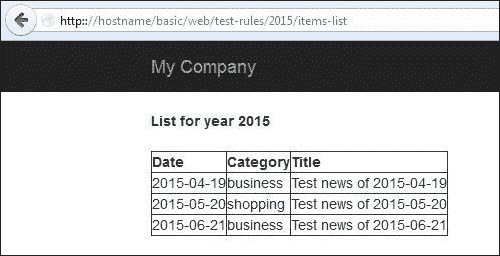
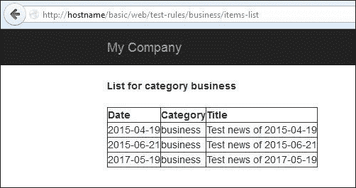
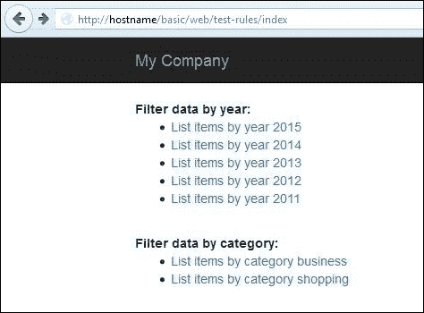
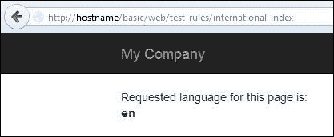
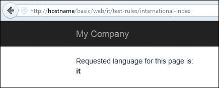
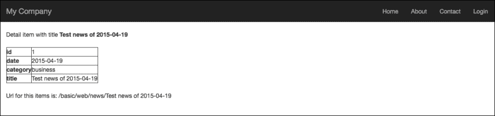

# 第三章. 制作漂亮的 URL

本章解释了如何配置 URL 规则并使 URL 变得漂亮，特别是对于搜索引擎。在本章中，我们将涵盖以下主题：

+   使用漂亮的 URL

+   自定义 URL 规则

    +   示例 - 按年份或类别列出新闻条目

+   规则中的默认参数

    +   示例 - 显示列表链接的索引页面

+   完整的 URL 规则参数

+   支持多语言视图的 URL 模式

+   创建规则类

# 使用漂亮的 URL

URL 格式对于 SEO 非常重要。人们不会关注 URL（一些浏览器甚至完全不显示它们），但搜索引擎会在页面中的文本和 URL 之间建立对应关系。

到目前为止，我们使用了这种类型的 URL `index.php?r=site/index` 或 `index.php?r=site/about`，其中`r`表示要遵循的参数路由。现在，我们将看到如何更改`site/index`和`site/about`的这些格式，它们更易于阅读，并且对搜索引擎更有用。

为了使用漂亮的 URL，我们需要配置 Yii2 来处理它们，这可以在几分钟内完成。

首先，我们必须确保所有请求都被重写到`web/index.php`。在 Linux 中，我们可以使用 Apache 更改 Web 服务器配置，并在 Yii2 的应用程序根目录中插入`.htaccess`文件，如果该文件不存在。`.htaccess`文件允许我们覆盖 Web 服务器的一些默认配置。

### 注意

在 Linux 环境中，以点开头的文件名表示该文件是隐藏的。

`.htaccess`的内容与 Yii1 相同：

```php
RewriteEngine on

# If a directory or a file exists, use it directly
RewriteCond %{REQUEST_FILENAME} !-f
RewriteCond %{REQUEST_FILENAME} !-d
# Otherwise forward it to index.php
RewriteRule . web/index.php
```

如果应用程序根目录是`/var/www/vhosts/yiiapp/basic`，我们将`.htaccess`插入到`/var/www/vhosts/yiiapp/basic`。

第一行激活了 Web 服务器的`RewriteEngine`；然后，在第二行和第三行，脚本检查请求是否不在现有的文件或文件夹中；最后，请求被重写为`web/index.php`。通过这些更改，所有不是现有文件或路径文件夹的请求都将被重写为`web/index.php`。

### 注意

如果我们有访问 Apache 配置这一级别的权限，我们也可以在 Apache 配置中配置重写规则，而不是`.htaccess`文件。

如果`.htaccess`配置已被忽略，请检查是否已将`AllowOverride`设置为`All`，如下所示：

```php
<Directory /var/www/path/to/folder>
   AllowOverride All
</Directory>
```

而这个选项并没有设置为`None`。

现在最后要做的就是配置 Yii2 以处理漂亮的 URL。

让我们打开`config/web.php`并在`components`属性中添加以下内容：

```php
'urlManager' => [
  'enablePrettyUrl' => true,
],
```

添加`enablePrettyUrl`属性，我们刚刚配置了`urlManager`以启用漂亮的 URL，切换漂亮的 URL 格式。

之前的 URL `index.php?r=site/index` 变成了 `/index.php/site/index`，而 `index.php?r=site/about` 变成了 `/index.php/site/about`。

使用`enablePrettyUrl`属性，我们将再次拥有`index.php`前缀。我们可以选择是否保留它；然而，为了限制 URL 长度，建议移除它。

为了控制`index.php`前缀的存在，我们使用另一个名为`showScriptName`的属性。

如果我们将此属性设置为`false`，我们将删除 URL 的第一部分。这是我们的更新配置：

```php
'urlManager' => [
    'enablePrettyUrl' => true,
    'showScriptName' => false,
],
```

现在，将浏览器指向`http://hostname/basic/web/site/index`以查看 Yii2 应用程序的第一页，并检查其他链接是否以美观的格式显示。

最后，还有一个用于`urlManager`组件的属性，用于仅基于给定的 URL 规则启用 URL 解析，该属性名为`enableStrictParsing`。如果此属性为`true`，则仅执行在`urlManager`中定义的规则；如果没有与请求匹配的 URL，将显示错误。

# 自定义 URL 规则

Yii2 给我们提供了自定义 URL 规则的机会，正如我们想要的。这可以通过在`urlManager`中使用`rules`属性来完成，其中键是模式，值是对应的路由。模式是常见的正则表达式模式，因此有必要对正则表达式有一些了解。

模式可以包含参数，这些参数将被传递到路由中。在下一个示例中，我们将显示一个可以通过年份或类别参数进行筛选的新闻列表，这些参数基于传递到 URL 的参数。

## 示例 - 按年份或类别列出新闻条目

在这个示例中，我们将在`controllers/NewsController.php`中创建一个新的名为`News`的控制器。在这个新的控制器中，我们将插入一个包含测试数据的数组`data()`函数，以及一个名为`actionItemsList`的函数。

首先要做的事情是在`config/web.php`文件下的`urlManager`组件中配置`rules`属性：

```php
'rules' => [
    news/<year:\d{4}>/items-list' => ' news/items-list',
    'news/<category:\w+>/items-list' => 'test-rules/items-list',
],
```

这里，我们有两种模式：

+   `news/<year:\d{4}>/items-list`

+   `news/<category:\w+>/items-list`

第一个模式捕获带有四位数字的数字参数的请求，该参数作为`news/items-list`路由的`year` GET 参数传递。我们可以请求`news/2014/items-list`或`news/2015/items-list`。

第二个模式捕获带有单词参数的请求，该参数作为`news/items-list`路由的`category` GET 参数传递。我们可以请求`news/business/items-list`或`news/shopping/items-list`。

然后，我们创建`NewsController`，在其中定义`data()`函数，以返回作为数据源使用的静态数据，以及处理对`news/year/or/category/itemsList`请求的`actionItemsList()`函数：

```php
<?php

namespace app\controllers;

use Yii;
use yii\web\Controller;

class NewsController extends Controller
{
  public function data()
  {
    return [
    [ "id" => 1, "date" => "2015-04-19", "category" => "business", "title" => "Test news of 2015-04-19" ],
    [ "id" => 2, "date" => "2015-05-20", "category" => "shopping", "title" => "Test news of 2015-05-20" ],
    [ "id" => 3, "date" => "2015-06-21", "category" => "business", "title" => "Test news of 2015-06-21" ],
    [ "id" => 4, "date" => "2016-04-19", "category" => "shopping", "title" => "Test news of 2016-04-19" ],
    [ "id" => 5, "date" => "2017-05-19", "category" => "business", "title" => "Test news of 2017-05-19" ],
    [ "id" => 6, "date" => "2018-06-19", "category" => "shopping", "title" => "Test news of 2018-06-19" ]
    ];
  }

  public function actionItemsList()
  {
    // if missing, value will be null
    $year = Yii::$app->request->get('year');
    // if missing, value will be null
    $category = Yii::$app->request->get('category');

    $data = $this->data();
    $filteredData = [];

    foreach($data as $d)
    {
      if(($year != null)&&(date('Y', strtotime($d['date'])) == $year)) $filteredData[] = $d;
      if(($category != null)&&($d['category'] == $category)) $filteredData[] = $d;
    }

    return $this->render('itemsList', ['year' => $year, 'category' => $category, 'filteredData' => $filteredData] );
    }
```

最后，我们在`views/news/itemsList.php`中创建一个视图，显示使用的参数，年份或类别，以及结果列表：

```php
<?php if($year != null) { ?>
<b>List for year <?php echo $year ?></b>
<?php } ?>
<?php if($category != null) { ?>
<b>List for category <?php echo $category ?></b>
<?php } ?>

<br /><br />

<table border="1">
    <tr>
        <th>Date</th>
        <th>Category</th>
        <th>Title</th>
    </tr>

<?php foreach($filteredData as $fd) { ?>
    <tr>
        <td><?php echo $fd['date'] ?></td>
        <td><?php echo $fd['category'] ?></td>
        <td><?php echo $fd['title'] ?></td>
    </tr>
<?php } ?>
</table>
```

现在，让我们指向`http://hostname/basic/web/news/2015/items-list`以显示通过年份筛选出的项目列表：



按年份筛选列表项

尝试在新闻和条目列表之间更改年份，以查看列表中的数据结果如何变化。创建的规则允许我们按分类显示条目列表。指向`http://hostname/basic/web/news/business/items-list`以查看按商业分类筛选的列表：



按分类筛选的列表项

我们还可以指向`http://hostname/basic/web/news/shopping/items-list`以查看按购物分类筛选的列表。

# 规则中的默认参数

在规则中，所有声明的参数都是必需的；如果 URL 缺少某些参数，则规则将不会应用。这个问题可以使用规则的默认属性来解决。

URL 规则结构有一个名为`defaults`的参数，包含作为默认值传递的默认参数。参数默认值是一个数组，其中键是参数名称，值是它们对应的值。

例如，将第二条规则更改为完整的数组，并添加`['category' => 'shopping']`作为默认属性规则：

```php
'rules' => [
    'news/<year:\d{4}>/items-list' => 'news/items-list',
    [
        'pattern' => 'news/<category:\w+>/items-list',
        'route' => 'news/items-list',
        'defaults' => ['category' => 'shopping']
    ]
],
```

现在，如果我们指向`http://hostname/basic/web/news/items-list`而不指定年份或分类参数，第一条规则将被跳过，第二条规则将使用默认值“购物”执行，因为缺少分类参数。

## 示例 – 显示链接列表的索引页面

现在，创建一个索引页面以查看如何创建这些自定义 URL。在这个页面中，我们将显示按年份（过去 5 年）筛选数据和按分类（购物和商业）筛选数据的 URL 链接。

使用`yii\helpers\Url`和`to()`方法创建 URL，其中第一个参数可以是：

第一个参数可以是：

+   一个将要传递给`toRoute()`方法以生成 URL 的数组。这个数组的第一个元素是要渲染的路由，其他元素是要传递给路由的参数；例如，`Url::to(['news/items-list', 'year' => 2015])`。

+   一个以`@`开头的前缀字符串；这被视为一个别名，并将返回相应的别名字符串

+   一个空字符串，它将返回当前请求的 URL。

+   一个将按原样返回的正常字符串。

在`NewsController`中创建一个简单的`actionIndex`操作：

```php
public function actionIndex()
{
    return $this->render('index');
}
```

然后，在`views/news/index.php`下为索引操作创建一个视图：

```php
<?php

use yii\helpers\Url;
use yii\helpers\Html;

?>

<b>Filter data by year:</b>
<br />
<ul>
  <?php $currentYear = date('Y'); ?>
  <?php for($year=$currentYear;$year>($currentYear-5);$year--) { ?>
  <li><?php echo Html::a( 'List items by year '.$year, Url::to(['news/items-list', 'year' => $year]) ) ?></li>
  <?php } ?>
</ul>

<br />

<b>Filter data by category:</b>
<br />
<ul>
  <?php $categories = ['business', 'shopping']; ?>
  <?php foreach($categories as $category) { ?>
  <li><?php echo Html::a( 'List items by category '.$category, Url::to(['news/items-list', 'category' => $category]) ) ?></li>
  <?php } ?>
</ul>

<br /><br />
```

指向`http://hostname/news/index`，它将显示：



可用筛选数据的索引

# 完整的 URL 规则参数

URL 规则包含以下参数：

+   `defaults`：正如我们所见，我们可以声明这个规则提供的默认 GET 参数

+   `encodeParams`：此值表示是否应对参数进行编码

+   `host`：这是 URL 的主机信息部分

+   `mode`：这表示此规则是否用于解析请求的 URL 或创建 URL

+   `name`：这是规则的名称

+   `pattern`：这是用于解析和创建 URL 路径信息部分的模式

+   `route`：这是控制器操作的路径

+   `suffix`：这是用于此规则的 URL 后缀（`.json`、`.html`等）

+   `verb`：这是此规则应与之匹配的 HTTP 动词（GET、POST、DELETE 等）

# 支持多语言视图的 URL 模式

在不同语言中显示相同视图有不同的方法。支持多语言视图的基本方法可以在路由的开头插入一个语言代码。例如，之前的路由`news/index`在英语中变为`en/news/index`，在意大利语中变为`it/news/index`，在法语中变为`fr/news/index`，依此类推。

将此规则附加到`UrlManager`的`rules`属性：

```php
[
    'pattern' => '<lang:\w+>/<controller>/<action>',
    'route' => '<controller>/<action>',
],
```

所有在路径信息中以语言 ID 作为前缀的请求都将匹配并传递到带有 GET 中传递的`$lang`参数的`<controller>/<action>`路由。

现在，在`NewsController`中创建一个名为`actionInternationalIndex`的新操作来测试多语言支持：

```php
public function actionInternationalIndex()
{
    // if missing, value will be 'en'
    $lang = Yii::$app->request->get('lang', 'en');

    Yii::$app->language = $lang;

    return $this->render('internationalIndex');
}
```

在此操作中，`$lang`是从 GET 参数中获取的。如果请求不包含`$lang`参数，则默认使用`en`值。

在`views/news/internationalIndex.php`中创建新的视图来检查传递给 URL 的语言代码。

```php
Requested language for this page is:
<br />
<b><?php echo Yii::$app->language ?></b>
```

通过访问`http://hostname/news/international-index`来验证此操作是否正确：



设置英语

我们正在用英语可视化此页面，因为没有将语言代码传递给 URL。因此，已使用默认语言代码`en`。然而，如果我们把语言代码写入 URL，结果将改变。

例如，指向`http://hostname/basic/web/it/news/international-index`将显示以下内容：



设置意大利语

这个响应确认我们已经使用了`it`作为语言代码。

### 注意

在支持多语言这种简单的方法中，我们从请求中获取`$lang`值，就像我们在`actionInternationalIndex`中所做的那样；然而，这是多余的，并且必须在所有请求中通用化。我们可以创建一个`BaseController`类作为每个 Controller 的基础类，然后覆盖`beforeAction()`方法，在那里我们可以设置`Yii::$app->language`参数。

# 创建规则类

以模式-路由对的形式声明的 URL 规则可以覆盖大多数项目。然而，对于 URL 可以是任何格式和数据库中存储的值的动态数据，这种规则不够灵活。

现在，我们需要使用只包含项目标题的 URL 来显示项目详情，例如`http://hostname/basic/web/news/Test` 2015-04-19 的新闻

就像我们现在所做的那样，没有方法可以用 URL 规则解决这个问题。

解析和创建 URL 请求的更通用解决方案是使用`Rule`类。

`Rule`类扩展了`Object`并实现了`UrlRuleInterface`。

下一个示例将解释如何显示项目详情，从标题（在对象的`data()`数组中定义）中找到它，并使用`Rule`类解析和创建路由。

浏览器中显示的路由将具有`news/title`格式。

为了这个目的，如果基本文件夹下不存在，请在基本文件夹下创建一个名为`components`的新文件夹，并创建`components/NewsUrlRule.php`，内容如下：

```php
<?php

namespace app\components;

use yii\web\UrlRuleInterface;
use yii\base\Object;

class NewsUrlRule extends Object implements UrlRuleInterface
{

  public function createUrl($manager, $route, $params)
  {
    if ($route === 'news/item-detail') {
      if (isset($params['title'])) {
        return 'news/'.$params['title'];
      }
    }
    return false;  // this rule does not apply
  }

  public function parseRequest($manager, $request)
  {
    $pathInfo = $request->getPathInfo();

    if (preg_match('%^([^\/]*)\/([^\/]*)$%', $pathInfo, $matches)) {
      if($matches[1] == 'news')
      {
        $params = [ 'title' => $matches[2]];
        return ['news/item-detail', $params];
      }
      else
      {
        return false;
      }
    }
    return false;  // this rule does not apply
  }
}
```

第一种方法，`createUrl()`接收`$manager`、`$route`和`$params`。有了路由和参数，框架会构建 URL。在这种情况下，我们检查传递的路由是否等同于`news/item-detail`，如果是，则返回相应的 URL。

第二种方法，`parseRequest()`接收`$manager`和`$request`。将使用自定义正则表达式进行匹配，以使用`$request`数据提取所需的部分。这个过程将返回要执行的路由。

现在，将这些组件链接到位于`config/`的`web.php`文件的`urlManager`，在`urlManager`组件的`rule`属性中追加以下行：

```php
[
'class' => 'app\components\NewsUrlRule',
// ...configure other properties...
],
```

下一步要做的是在`NewsController`中创建`actionItemDetail`，如下所示：

```php
public function actionItemDetail()
{
    $title = Yii::$app->request->get('title');

    $data = $this->data();

    $itemFound = null;

    foreach($data as $d)
    {
        if($d['title'] == $title) $itemFound = $d;
    }        

    return $this->render('itemDetail', ['title' => $title, 'itemFound' => $itemFound]);
}
```

在这个操作中，我们简单地从路由中接收到的标题开始查找项目。我们将标题和`itemFound`传递给视图。

最后要创建的文件是`views`下的`itemDetail.php`：

```php
Detail item with title <b><?php echo $title ?></b>
<br /><br />
<?php if($itemFound != null) { ?>
    <table border="1">
        <?php foreach($itemFound as $key=>$value) { ?>
        <tr>
            <th><?php echo $key ?></th>
            <td><?php echo $value ?></td>
        </tr>
        <?php } ?>
    </table>

    <br />

    Url for this items is: <?php echo yii\helpers\Url::to(['news/item-detail', 'title' => $title]); ?>

<?php } else { ?>
    <i>No item found</i>
<?php } ?>
```



项目详情输出

在这个视图中，将显示项目详情（如果找到项目），以及如何构建项目详情的 URL。

# 摘要

在本章中，我们看到了如何实现漂亮的 URL，这对于搜索引擎优化很有用。我们还创建了使用自定义规则解析和创建 URL 的示例。最后，我们学习了如何通过规则类构建更定制的 URL 规则。

在下一章中，我们将介绍数据库的使用，这是每个 Web 应用的基本方面。我们将从数据库连接的配置开始，一直到 Yii2 为开发者提供的工具，并使用框架小部件构建基于数据库数据的完整预订系统。
