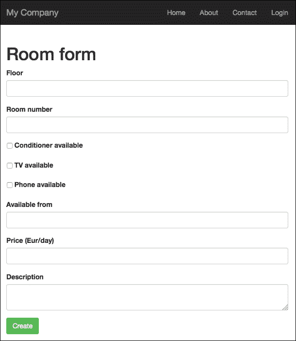
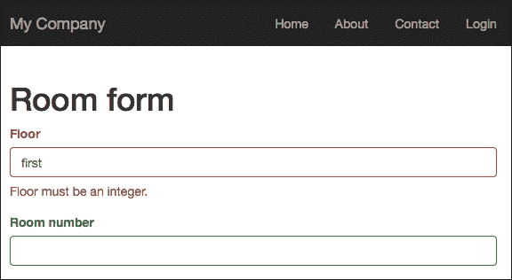
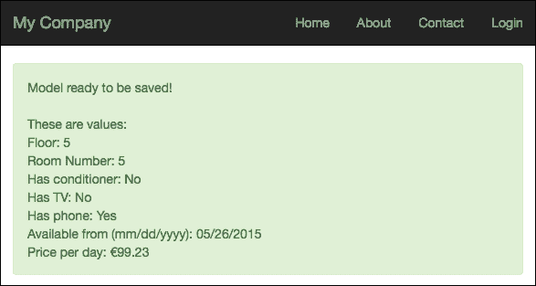

# 第四章：创建房间通过表单

本章解释了如何编写模型类来存储将使用表单从视图发送到控制器使用的数据，包括验证输入、格式化数据和上传文件。在本章中，我们将涵盖以下主题：

+   创建模型

    +   示例 - 存储房间数据的模型

+   使用 ActiveForm

    +   示例 - 从 HTML 表单创建新房间

+   格式化日期、时间和数字

+   上传文件

    +   示例 - 上传房间图片

# 创建模型

在视图和控制器之间操作数据的第一个步骤是创建一个模型。**模型**是一个类，它扩展了位于 `yii\base\` 下的 `Model` 类，这是数据模型的基础。

这是一个合适的类，用于提供简单的解决方案，以封装数据、从数组（表单数据）分配内容，并使用规则验证数据。模型基类实现了以下常用功能：

+   **属性声明**：默认情况下，每个公共类成员都被视为模型属性；我们可以使用模型的 `attributes` 属性访问所有成员。

+   **属性标签**：每个属性都可以与一个用于显示的标签相关联；我们可以扩展 `attributeLabels()` 方法以返回与模型公共成员相关的标签。

+   **大量属性赋值**：我们可以通过传递一个包含所有值的整个数组来填充模型的成员内容。当我们需要用表单中的数据填充模型时，这很方便。

+   **基于场景的验证**：模型提供了验证数据的规则。我们可以根据场景选择哪些规则适用，场景是一个定义要应用规则的键词。

在执行数据验证时，模型还会引发以下事件：

+   `EVENT_BEFORE_VALIDATE`: 这是在 `validate()` 方法开始时引发的事件

+   `EVENT_AFTER_VALIDATE`: 这是在 `validate()` 方法结束时引发的事件

您可以直接使用模型来存储模型数据或对其进行自定义扩展。

## 示例 - 存储房间数据的模型

现在，让我们创建一个模型来存储房间数据。为了创建这个模型，我们选择将所有字段命名为小写字母，并用下划线分隔。

我们可以这样识别模型的这些字段：

+   `floor`: 在更通用的情况下，我们将其视为字符串成员

+   `room_number`: 这是一个整型成员

+   `has_conditioner`: 这是一个整型成员，有两个值 0 和 1

+   `has_tv`: 这是一个整型成员，有两个值 0 和 1

+   `has_phone`: 这是一个整型成员，有两个值 0 和 1

+   `available_from`: 这是一个日期成员，在 PHP 中用字符串表示

+   `price_per_day`: 这是一个浮点型成员

+   `assistance_email`: 这是一个包含电子邮件地址的字符串成员

+   `description`: 这是一个字符串成员

现在，创建名为 `Room` 的 `Model` 类，作为基类，在之前的字段列表中，在 `basic/models/Room.php` 下创建一个文件，内容如下：

```php
<?php
namespace app\models;
use Yii;
use yii\base\Model;
class Room extends Model {
    public $floor;
    public $room_number;
    public $has_conditioner;
    public $has_tv;
    public $has_phone;
    public $available_from;
    public $price_per_day;
    public $description;
}
```

第二件事是附加`attributeLabels()`方法，以便为每个成员分配一个标签。这不是必需的，但这是一个有用的方法，可以在最终用户前端显示标签。

```php
public function attributeLabels()
{
    return [
        'floor' => 'Floor',
        'room_number' => 'Room number',
        'has_condition' => 'Condition available',
        'has_tv' => 'TV available',
        'has_phone' => 'Phone available',
        'available_from' => 'Available from',
        'price_per_day' => 'Price (EUR/day)',
        'description' => 'Description',
    ];
}
```

最后，创建规则以验证数据。规则基于验证器，其默认值如下：

+   `boolean`: `yii\validators\BooleanValidator`

+   `captcha`: `yii\captcha\CaptchaValidator`

+   `compare`: `yii\validators\CompareValidator`

+   `date`: `yii\validators\DateValidator`

+   `double`: `yii\validators\NumberValidator`

+   `email`: `yii\validators\EmailValidator`

+   `exist`: `yii\validators\ExistValidator`

+   `file`: `yii\validators\FileValidator`

+   `filter`: `yii\validators\FilterValidator`

+   `image`: `yii\validators\ImageValidator`

+   `in`: `yii\validators\RangeValidator`

+   `integer`: `yii\validators\NumberValidator`

+   `match`: `yii\validators\RegularExpressionValidator`

+   `required`: `yii\validators\RequiredValidator`

+   `safe`: `yii\validators\SafeValidator`

+   `string`: `yii\validators\StringValidator`

+   `trim`: `yii\validators\FilterValidator`

+   `unique`: `yii\validators\UniqueValidator`

+   `url`: `yii\validators\UrlValidator`

规则是一个数组，其值按以下顺序排列：

+   一个字符串或数组，用于定义要应用规则的属性或属性列表

+   验证器的类型

+   使用`on`属性来定义要使用哪种场景

+   其他参数取决于所使用的验证器

编写`Room`模型类的`rules()`方法：

```php
/**
 * @return array the validation rules.
 */
public function rules()
{
    return [
        ['floor', 'integer', 'min' => 0],
        ['room_number', 'integer', 'min' => 0],
        [['has_conditioner', 'has_tv', 'has_phone'], 'integer', 'min' => 0, 'max' => 1],
        ['available_from', 'date', 'format' => 'php:Y-m-d'],
        ['price_per_day', 'number', 'min' => 0],
        ['description', 'string', 'max' => 500]
    ];
}
```

前面的代码解释如下：

+   第一条规则规定`floor`是一个整数，最小值为`0`

+   第二条规则规定`room_number`是一个整数，最小值为`0`；我们可以将楼层和房间合并为一个规则，将它们作为单个规则的第一个参数放入数组中

+   第三条规则规定`has_condition`、`has_tv`和`has_phone`是介于 0 和 1 之间的整数（形式上为布尔值）

+   第四条规则规定`available_from`是一个日期

+   第五条规则规定`price_per_day`是一个数字，其最小值为 0

+   最后一条规则规定`description`是一个最多包含 500 个字符的字符串

当调用`Model`的`validate()`方法时，将应用这些规则。当我们尝试调用`save()`方法时，此方法会自动调用。

# 使用 ActiveForm

现在，我们将在视图中创建一个 HTML 表单，以便从视图发送数据到控制器。我们可以使用标准方式通过表单标签和输入字段来构建表单，但 Yii2 提供了简化表单及其内容构建的辅助类。

为了这个目的，我们将使用`ActiveForm`，这是一个用于为单个或多个数据模型构建交互式 HTML 表单的控件。

对于任何 Yii2 控件，我们将使用`begin()`静态方法来指示开始使用它的时刻，以及使用`end()`静态方法来指示停止使用它的时刻，从`yii\widgets\ActiveForm`开始。这些方法之间的代码将被放置在表单中：

```php
$form = ActiveForm::begin();
... content here ...
ActiveForm::end();
```

第一个方法，`begin()`，返回一个对象，我们可以在内容中使用它来创建输入字段。此方法接受一个数组作为参数，以指示要应用的配置属性。最后一个方法，`end()`，标记小部件的结束，因此可以将其内容渲染出来。

现在，我们需要在代码中插入一些输入字段，这是通过使用我们刚刚创建的`ActiveForm`实例的`field()`方法来完成的。此方法需要两个参数：模型和字段名，并返回一个类型为`ActiveField`的对象。使用此方法，我们只是要求`ActiveForm`创建一个新的字段；然而，在这种情况下，我们还需要指定我们想要的字段类型。

此操作是通过调用与实例输入类型相关的`ActiveField`方法来完成的。最常见的是：

+   `label()`: 这用于生成一个标签标签

+   `textInput()`: 这用于生成类型为`text`的输入字段

+   `textarea()`: 这用于生成`textarea`标签

+   `radio()`: 这用于生成类型为`radio`的输入字段

+   `checkbox()`: 这用于生成类型为`checkbox`的输入字段

## 示例 – 从 HTML 表单创建新房间

首先，在`basic/controllers/RoomsController.php`下创建一个新的控制器，名为`RoomsController`，并有一个名为`create`的操作：

```php
<?php

namespace app\controllers;

use Yii;
use yii\web\Controller;
use app\models\Room;

class RoomsController extends Controller
{
    public function actionCreate()
    {
        $model = new Room();
        $modelCanSave = false;

        if ($model->load(Yii::$app->request->post()) && $model->validate()) {
            $modelCanSave = true;
        }

        return $this->render('create', [
            'model' => $model,
            'modelSaved' => $modelCanSave
        ]);
    }
}
```

在`create()`方法开始时，我们为`$model`变量创建了一个新的`Room`类实例。`load()`方法将数据填充到`$model`属性中，这些数据是从作为参数传递的数组中名为`$model->formName()`的关键位置获取的。默认情况下，`$model->formName()`返回对象的类名，如下面的代码所示：

```php
$model->load(Yii::$app->request->post())
```

前面的代码等同于：

```php
if (isset($_POST[$model->formName()])) {
  $this->setAttributes($_POST[$model->formName()]);
}
```

回到`load()&&validate()`条件，如果`load()`返回 true，则`validate()`也会被执行，并且模型`rules()`方法中的所有规则都将被评估。

在这种情况下，`Model`已准备好保存到数据存储（在下一章中将在数据库中保存）。现在，用简单变量`$modelCanSave`标记此条件非常重要，并将其传递给`create`视图。

在`basic/views/rooms/create.php`下创建`create`视图的文件：

```php
<?php
use yii\helpers\Html;
use yii\widgets\ActiveForm;
use yii\helpers\Url;
use yii\helpers\ArrayHelper;
?>

<?php if($modelCanSave) { ?>
<div class="alert alert-success">
    Model ready to be saved!
</div>
<?php } ?>

<?php $form = ActiveForm::begin(); ?>
<div class="row">
    <div class="col-lg-12">
        <h1>Room form</h1>
        <?= $form->field($model, 'floor')->textInput() ?>
        <?= $form->field($model, 'room_number')->textInput() ?>
        <?= $form->field($model, 'has_conditioner')->checkbox() ?>
        <?= $form->field($model, 'has_tv')->checkbox() ?>
        <?= $form->field($model, 'has_phone')->checkbox() ?>
        <?= $form->field($model, 'available_from')->textInput() ?>
        <?= $form->field($model, 'price_per_day')->textInput() ?>
        <?= $form->field($model, 'description')->textarea() ?>
   </div>
</div>
<div class="form-group">
    <?= Html::submitButton('Create' , ['class' => 'btn btn-success']) ?>
</div>
<?php ActiveForm::end(); ?>
```

如果`$modelCanSave`变量为 true，将显示一个带有绿色背景的`alert` div，以通知`$model`已加载并验证（准备在数据库中保存）。

对于测试代码，指向`http://hostname/basic/web/rooms/create`。以下屏幕应出现：



创建房间 HTML 表单

框架会自动处理输入字段的验证检查，这些检查对应于模型`rules()`方法中的规则列表。我们可以通过在**Floor**输入框中输入字符来检查这一点。我们应该看到以下截图：



整数字段的验证检查

验证通知我们 **Floor** 必须是一个整数，正如规则列表中要求的那样。一旦所有字段都填写了正确的值（日期格式，yyyy-mm-dd），只需点击 **创建** 按钮，我们应该会看到一个绿色背景的框显示 **模型准备保存**。

# 格式化日期、时间和数字

现在，让我们看看如何格式化日期、时间和数字字段。Yii2 为这些类型提供了辅助工具。

要格式化一个值，我们将使用 `Yii::$app->formatter`；此对象属于位于 `yii\i18n\` 下的 `Formatter` 类，支持多种格式化类型。用于此目的的所有方法都以 `as` 前缀开头。因此，`asDate` 方法将用于格式化日期，而 `asCurrency` 方法将用于格式化货币。

每个格式化方法的第一个参数是要格式化的值，其他字段指的是要使用的格式以及其他可选参数。

让我们通过添加准备保存的模型内容来更改视图内容：

```php
<?php if($modelCanSave) { ?>
<div class="alert alert-success">
    Model ready to be saved!
    <br /><br />
    These are values: <br />
    Floor: <?php echo $model->floor; ?> <br />
    Room Number: <?php echo $model->room_number; ?> <br />
    Has conditioner: <?php echo Yii::$app->formatter->asBoolean($model->has_conditioner); ?> <br />
    Has TV: <?php echo Yii::$app->formatter->asBoolean($model->has_tv); ?> <br />
    Has phone: <?php echo Yii::$app->formatter->asBoolean($model->has_phone); ?> <br />
    Available from (mm/dd/yyyy): <?php echo Yii::$app->formatter->asDate($model->available_from,'php:m/d/Y'); ?> <br />
    Price per day: <?php echo Yii::$app->formatter->asCurrency($model->price_per_day,'EUR'); ?> <br />

</div>
<?php } ?>
```

如果 `$model` 准备好保存，在绿色背景的框中，我们将看到模型每个字段的输出。

在此示例中，我们使用了：

+   `has_condition`、`has_tv` 和 `has_phone` 成员的 `boolean` 格式化器使用默认的 false 和 true 值表示；默认情况下，false 为 `No`，true 为 `Yes`，但我们可以通过 `Yii::$app->formatter` 的 `$booleanFormat` 成员来更改此行为设置。

+   `available_from` 成员的 `date` 格式化器将使用的日期格式作为第二个参数；此日期格式可以用 PHP 日期函数风格或 ICU 标准表示。

+   `price_per_day` 成员的 `currency` 格式化器是第二个参数，包含三个字符类型的货币要使用。

这就是包含模型内容的框的显示方式：



当验证成功时显示模型内容的摘要。

# 上传文件

当数据从视图发送到控制器时，常见的任务是上传文件。在这种情况下，Yii2 也提供了一个方便的辅助工具来处理此任务：`yii\web\UploadedFile`。此类有两个重要方法：`getInstance()`（复数形式 `getInstances()`）和 `saveAs()`。

第一种方法 `getInstance()` 允许我们从表单的输入字段中获取文件，而第二种方法 `saveAs()`，正如其名称所暗示的，允许我们将文件输入字段的内容保存到服务器文件系统中。

在开始示例之前，创建一个将包含上传文件的文件夹是很重要的。创建此文件夹的最佳位置是应用程序的根目录。因此，在 `basic/` 文件夹下创建一个名为 `uploadedfiles` 的文件夹。

### 注意

确保此文件夹可写。

接下来，为了集中配置，为这个新文件夹定义一个别名，这样我们就可以从应用程序配置中更改此路径。在`basic/config/web.php`中输入，如果不存在，则将这些行追加到`$config`数组中：

```php
'aliases' =>
[
        '@uploadedfilesdir' => '@app/uploadedfiles'
],
```

### 注意

`@app`是一个系统别名，它定义了应用程序的根目录。

## 示例 - 上传一个房间的图片

在这个示例中，我们将看到如何上传一个房间的图片。

我们需要在模型、视图和控制器中进行更改。让我们从模型开始。

在模型中，我们需要添加一个新的属性，命名为`fileImage`，并为其指定特定的规则。

这是模型的最终版本：

```php
<?php
namespace app\models;
use Yii;
use yii\base\Model;
class Room extends Model
{
    public $floor; 
    public $room_number;
    public $has_conditioner;
    public $has_tv;
    public $has_phone;
    public $available_from;
    public $price_per_day;
    public $description;

    public $fileImage;

    public function attributeLabels()
    {
        return [
            'floor' => 'Floor',
            'room_number' => 'Room number',
            'has_conditioner' => 'Conditioner available',
            'has_tv' => 'TV available',
            'has_phone' => 'Phone available',
            'available_from' => 'Available from',
            'price_per_day' => 'Price (Eur/day)',
            'description' => 'Description',
            'fileImage' => 'Image'
        ];
    }

    /**
     * @return array the validation rules.
     */
    public function rules()
    {
        return [
            ['floor', 'integer', 'min' => 0],
            ['room_number', 'integer', 'min' => 0],
            [['has_conditioner', 'has_tv', 'has_phone'], 'integer', 'min' => 0, 'max' => 1],
            ['available_from', 'date', 'format' => 'php:Y-m-d'],
            ['price_per_day', 'number', 'min' => 0],
            ['description', 'string', 'max' => 500],

            ['fileImage', 'file']
        ];
    } 
}
```

在规则中，对于`fileImage`字段，我们可以添加多种类型的验证；例如，检查是否必需，检查 MIME 类型（`.gif`，`.jpeg`和`.png`）。

接下来，我们将使用`UploadedFile`类的静态方法`getInstance()`在控制器中获取输入文件字段中的文件，然后使用`saveAs`将其保存到特定文件夹。这是`RoomsController`的最终版本：

```php
<?php

namespace app\controllers;

use Yii;
use yii\web\Controller;
use app\models\Room;

class RoomsController extends Controller
{
    public function actionCreate()
    {
        $model = new Room();
        $modelCanSave = false;

        if ($model->load(Yii::$app->request->post()) && $model->validate()) {

            $model->fileImage = UploadedFile::getInstance($model, 'fileImage');

            if ($model->fileImage) { 
                $model->fileImage->saveAs(Yii::getAlias('@uploadedfilesdir/' . $model->fileImage->baseName . '.' . $model->fileImage->extension)));
            } 

            $modelCanSave = true;
        }

        return $this->render('create', [
            'model' => $model,
            'modelSaved' => $modelCanSave
        ]);
    }
}
```

`UploadedFile::getInstance`从`$_FILES`数组中获取文件，以填充 Model 的`fileImage`属性并使用其数据。

最后要做的事情是更新`create`视图内容，通过添加`fileInput`字段。这是最终版本：

```php
<?php
use yii\helpers\Html;
use yii\widgets\ActiveForm;
use yii\helpers\Url;
use yii\helpers\ArrayHelper;
?>

<?php if($modelCanSave) { ?>
<div class="alert alert-success">
    Model ready to be saved!
    <br /><br />
    These are values: <br />
    Floor: <?php echo $model->floor; ?> <br />
    Room Number: <?php echo $model->room_number; ?> <br />
    Has conditioner: <?php echo Yii::$app->formatter->asBoolean($model->has_conditioner); ?> <br />
    Has TV: <?php echo Yii::$app->formatter->asBoolean($model->has_tv); ?> <br />
    Has phone: <?php echo Yii::$app->formatter->asBoolean($model->has_phone); ?> <br />
    Available from (mm/dd/yyyy): <?php echo Yii::$app->formatter->asDate($model->available_from,'php:m/d/Y'); ?> <br />
    Price per day: <?php echo Yii::$app->formatter->asCurrency($model->price_per_day,'EUR'); ?> <br />
    Image:
    <?php if(isset($model->fileImage)) { ?>
        fileImage->name) ?>" />
    <?php } ?>
</div>
<?php } ?>

<?php $form = ActiveForm::begin(['options' => ['enctype' => 'multipart/form-data']]); ?>  
<div class="row">
    <div class="col-lg-12">
        <h1>Room form</h1>
        <?= $form->field($model, 'floor')->textInput() ?>
        <?= $form->field($model, 'room_number')->textInput() ?>
        <?= $form->field($model, 'has_conditioner')->checkbox() ?>
        <?= $form->field($model, 'has_tv')->checkbox() ?>
        <?= $form->field($model, 'has_phone')->checkbox() ?>
        <?= $form->field($model, 'available_from')->textInput() ?>
        <?= $form->field($model, 'price_per_day')->textInput() ?>
        <?= $form->field($model, 'description')->textarea() ?>

        <?= $form->field($model, 'fileImage')->fileInput() ?>
   </div>
</div>
<div class="form-group">
    <?= Html::submitButton('Create' , ['class' => 'btn btn-success']) ?>
</div>
<?php ActiveForm::end(); ?>
```

注意最后一行此示例，`ActiveForm::end()`关闭了在文件顶部使用`ActiveForm::begin()`方法定义的`$form`小部件的主体。

### 注意

在这个示例中，`ActiveForm`小部件是通过将配置数组的`enctype`属性填充为`multipart/form-data`值创建的，这允许我们发送除了表单文本参数之外的二进制数据。然而，这并不涉及 Yii 或 PHP，因为这是一个 HTML 要求，用于通知浏览器如何将文件发送到服务器。

在这个视图中，如果模型已经经过验证并且`fileImage`属性已填充，则将显示相应的图片。

# 摘要

在本章中，我们看到了如何从头开始构建 Model 类，并使用 Yii2 ActiveForm 小部件创建的表单从视图向控制器发送数据。我们还探讨了格式化数据以及从表单发送文件的常用方法。

在下一章中，你将学习如何与数据库交互并将视图表单中的模型数据保存到数据库中。
