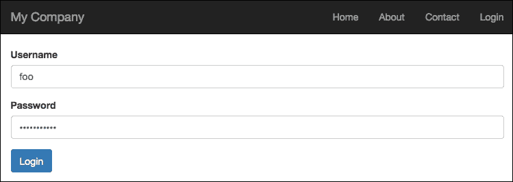
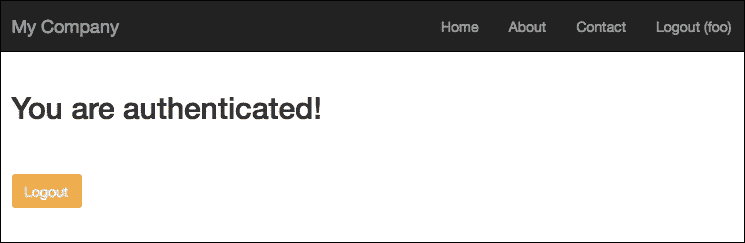
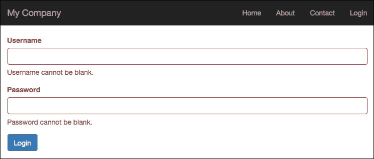
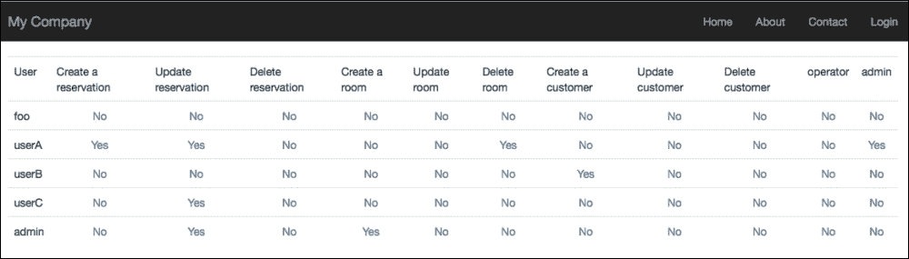

# 第八章. 登录应用

本章将解释如何设置登录认证和授权。登录是保护我们应用的基本步骤，您将学习如何从头开始实现这些目标，使用在互联网上广泛可用的免费 Web 管理扩展。

本章将涵盖以下主题：

+   创建用户登录：

    +   例如：创建登录表单以访问

+   配置用户授权

    +   例如：创建一个访问控制过滤器以授权

+   **基于角色的访问控制**（**RBAC**）

    +   例如：配置 RBAC 为用户设置权限

+   混合**访问控制过滤器**（**ACF**）和 RBAC

    +   例如：管理用户角色以访问房间、预订和客户

第一步将是使用数据库表创建对我们的应用的认证访问，并将其与通过扩展`IdentityInterface`的用户模型关联到 Yii 用户组件。我们将提供一个如何使用它的示例：构建一个登录表单以认证用户。

下一步将是控制用户可以执行哪些操作，使用 ACF 和 RBAC。我们将通过一些使用 ACF 和 RBAC 的示例，并在后者中从头开始构建一个完整的授权管理器。

# 创建用户登录

应用程序的安全始于用户登录的两个明显区分的阶段：认证和授权。

第一个，认证，是验证用户身份的过程，通常使用用户名和密码，或者电子邮件和密码进行。认证完成时，用户已被识别，并且他们的状态已被保留以供后续请求。

第二个，授权，是验证用户是否有权限执行特定操作的过程。

### 注意

由于 HTTP 请求是无状态的，我们需要保留登录状态，这意味着它们之间没有数据上下文共享。这个限制通过会话得到解决，主要是文件，其中 Web 服务器存储数据。一个文件名用作会话标识符，并通过 HTML 响应中包含的链接的 URL 参数传递给浏览器。这样，浏览器通过发送会话标识符到 Web 服务器通过 cookie 或请求 URL 中的参数来保持会话活跃，而 Web 服务器知道哪个文件包含会话数据。

可以使用具有相同功能的数据库表代替文件。

Yii2 通过`yii\web\User`组件实现认证，该组件管理用户认证状态，并包含一个指向代表我们引用的具体对象的`identityClass`的引用。

一个`identityClass`类应该实现五个方法：

+   `findIdentity()`: 此方法使用提供的 ID 参数查找一个身份类实例。它通常在我们需要通过会话保持登录状态时使用。

+   `findIdentityByAccessToken()`: 此方法使用参数提供的访问令牌查找身份类的实例。它通常在我们需要使用单个密钥进行认证时使用。

+   `getId()`: 此方法返回身份实例的 ID。

+   `getAuthKey()`: 此方法返回在登录完成后使用浏览器发送的 cookie（在登录时勾选**记住我**）时用于验证基于 cookie 的登录的密钥。

+   `validateAuthKey()`: 此方法验证提供的作为参数传递的`authKey`是否正确（在基于 cookie 的登录中）。

通常，`identityClass`类对应于`User`数据库表的一条记录。因此，通常`identityClass`类实现`IdentityInterface`并扩展`ActiveRecord`。

现在是时候实现认证了。首先要做的是配置`yii\web\User`组件及其`identityClass`。打开`basic/config/web.php`文件，如果尚未存在，则将`user`属性添加到`components`中：

```php
    'components' => [
        …
        …
        'user' => [
            'identityClass' => 'app\models\User',
        ],
    ],
```

接下来，我们必须创建一个数据库表，用于存储用户的记录：

```php
CREATE TABLE `user` (
 `id` int(11) NOT NULL AUTO_INCREMENT,
 `username` varchar(255) NOT NULL,
 `auth_key` varchar(32) NOT NULL,
 `password_hash` varchar(255) NOT NULL,
 `access_token` varchar(100) DEFAULT NULL,
 PRIMARY KEY (`id`)
) ENGINE=InnoDB DEFAULT CHARSET=utf8
```

### 注意

注意，我们没有密码字段，但有`password_hash`字段。这是因为密码是使用散列方法存储的。在模型中，我们将有一个`setPassword()`设置器方法，它获取纯文本密码以填充`password_hash`字段。

最后，让我们更新处理登录状态的`basic/models/User`类，通过实现`IdentityInterface`并将其连接到数据库的`user`表。这是`basic/models/User`的常见实现：

```php
<?php
namespace app\models;

use Yii;
use yii\base\NotSupportedException;
use yii\db\ActiveRecord;
use yii\web\IdentityInterface;

class User extends ActiveRecord implements IdentityInterface
{
    public static function tableName()
    {
        return 'user';
    }

    public static function findIdentity($id)
    {
        return static::findOne(['id' => $id]);
    }

    public static function findIdentityByAccessToken($token, $type = null)
    {
        return static::findOne(['access_token' => $token]);
    }

    public static function findByUsername($username)
    {
        return static::findOne(['username' => $username]);
    }

    public function getId()
    {
        return $this->getPrimaryKey();
    }

    public function getAuthKey()
    {
        return $this->auth_key;
    }

    public function validateAuthKey($authKey)
    {
        return $this->getAuthKey() === $authKey;
    }

    public function validatePassword($password)
    {
        return Yii::$app->security->validatePassword($password, $this->password_hash);
    }

    public function setPassword($password)
    {
        $this->password_hash = Yii::$app->security->generatePasswordHash($password);
    }

    public function generateAuthKey()
    {
        $this->auth_key = Yii::$app->security->generateRandomString();
    }

}
```

### 注意

如果我们的应用程序也使用基于 cookie 的认证，我们还需要填写`auth_key`字段，因为这将作为 http 响应传递给客户端。当通过覆盖`\app\models\User`模型中的`beforeSave()`方法插入新用户时，自动填充`auth_key`字段是方便的：

```php
    public function beforeSave($insert)
    {
        if (parent::beforeSave($insert)) {
            if ($this->isNewRecord) {
                $this->auth_key = \Yii::$app->security->generateRandomString();
            }
            return true;
        }
        return false;
    }
```

用户组件提供登录、注销和访问`identityClass`的方法，并验证用户认证的有效性。

要验证用户是否已正确认证，请使用以下方法：

```php
// whether the current user is a guest (not authenticated)
$isGuest = Yii::$app->user->isGuest;
```

当用户认证并通过`\app\models\User`模型实例化时，我们可以通过调用以下方法来完成认证：

```php
// find a user identity with the specified username.
// note that you may want to check the password if needed
$userModel = User::findOne(['username' => $username]);

// logs in the user
Yii::$app->user->login($userModel);
```

然后，当我们需要访问身份类时：

```php
// access to identity class that it is equivalent to $userModel
$identity = Yii::$app->user->identity;
```

最后，为了注销用户：

```php
Yii::$app->user->logout();
```

## 示例 - 登录表单以访问

在此示例中，我们将创建一个登录表单并完成用户认证。为了进行此操作，需要根据前一段描述创建一个`user`数据库表。

要添加用户，只需在`user`表中插入一条新记录，其中`foo`作为用户名，`foopassword`作为密码：

```php
INSERT INTO `user` (
`username` ,
`password_hash` ,
)
VALUES (
'foo',
'$2a$12$hL0rmIMjxhLqI.xr7jD1FugNWEgZNh62HuJj5.y34XBUfBWB4cppW'
);
```

### 注意

密码使用 bcrypt 方法进行散列，成本值为 12，可以通过快速 Google 搜索在互联网上找到。

然后，在 `basic/controllers/MyAuthenticationController.php` 中创建一个名为 `MyAuthentication` 的新控制器，并确保它包含两个操作：`actionLogin` 和 `actionLogout`。

`actionLogin` 方法从 `$_POST` 获取用户名和密码数据，并使用 `$error` 变量将错误描述传递到视图。如果填写了用户名和密码数据，用户将在数据库表中找到，并验证插入的密码，然后用户将被登录。

最后，`actionLogout` 简单地将用户从会话中注销，并将浏览器重定向到登录页面：

```php
<?php

namespace app\controllers;

use Yii;
use yii\web\Controller;

use app\models\User;

class MyAuthenticationController extends Controller
{
    public function actionLogin()
    {
        $error = null;

        $username = Yii::$app->request->post('username', null);
        $password = Yii::$app->request->post('password', null);

        $user = User::findOne(['username' => $username]);

        if(($username!=null)&&($password!=null))
        {
            if($user != null)
            {
                if($user->validatePassword($password))
                {
                    Yii::$app->user->login($user);
                }
                else {
                    $error = 'Password validation failed!';
                }
            }
            else
            {
                $error = 'User not found';
            }
        }

        return $this->render('login', ['error' => $error]);
    }
    public function actionLogout()
    {
        Yii::$app->user->logout();
        return $this->redirect(['login']);
    }

}
```

现在，在 `basic/views/my-authentication/login.php` 中创建包含以下内容的视图。在用户可以登录之前，将显示一个包含要填写的用户名和密码的表单。当用户名和密码与用户数据库表中的条目匹配时，将显示确认消息和注销按钮：

```php
<?php
use \yii\bootstrap\ActiveForm;
use \yii\helpers\Html;
use \yii\bootstrap\Alert;
?>

<?php
if($error != null) {
    echo Alert::widget([ 'options' => [ 'class' => 'alert-danger' ], 'body' => $error ]);    
}
?>

<?php if(Yii::$app->user->isGuest) { ?>

    <?php ActiveForm::begin(); ?>

    <div class="form-group">
    <?php echo Html::label('Username', 'username'); ?>
    <?php echo Html::textInput('username', '', ['class' => 'form-control']); ?>
    </div>

    <div class="form-group">
    <?php echo Html::label('Password', 'password'); ?>
    <?php echo Html::passwordInput('password', '', ['class' => 'form-control']); ?>
    </div>

    <?php echo Html::submitButton('Login', ['class' => 'btn btn-primary']); ?>

    <?php ActiveForm::end(); ?>

<?php } else { ?>

    <h2>You are authenticated!</h2>
    <br /><br />
    <?php echo Html::a('Logout',  ['my-authentication/logout'], ['class' => 'btn btn-warning']); ?>

<?php } ?>
```

通过将浏览器指向 `http://hostname/basic/web/my-authentication/login` 并填写 `foo` 作为用户名和 `foopassword` 作为密码来测试它，应该会显示：



访问的登录表单

点击 **登录** 按钮后，你应该会看到：



成功认证

此方法不提供字段错误处理，因为我们没有使用模型来创建表单字段。如果我们创建了一个包含用户名和密码字段的表单模型，我们就可以向此模型添加规则验证，并看到输入错误处理（如字段值缺失、字段长度错误等）。幸运的是，Yii2 在 `basic/models/LoginForm.php` 中提供了一个可用的登录表单模型。

如果我们想要使用此模型，我们会在 `MyAuthenticationController` 中创建一个名为 `actionLoginWithForm` 的新操作，该操作通过模型处理登录字段，而不是从 `$_POST` 参数中获取：

```php
    public function actionLoginWithModel()
    {
        $error = null;

        $model = new \app\models\LoginForm();
        if ($model->load(Yii::$app->request->post())) {
            if(($model->validate())&&($model->user != null))
            {
                Yii::$app->user->login($model->user);
            }
            else
            {
                $error = 'Username/Password error';
            }
        }

        return $this->render('login-with-model', ['model' => $model, 'error' => $error]);
    }
```

这是 `basic/views/my-authentication/login-with-model.php` 的内容：

```php
<?php
use \yii\bootstrap\ActiveForm;
use \yii\helpers\Html;
use \yii\bootstrap\Alert;
?>

<?php
if($error != null) {
    echo Alert::widget([ 'options' => [ 'class' => 'alert-danger' ], 'body' => $error ]);    
}
?>
<?php if(Yii::$app->user->isGuest) { ?>

    <?php $form = ActiveForm::begin([
        'id' => 'login-form',
    ]); ?>

    <?= $form->field($model, 'username') ?>

    <?= $form->field($model, 'password')->passwordInput() ?>

    <div class="form-group">
        <?= Html::submitButton('Login', ['class' => 'btn btn-primary', 'name' => 'login-button']) ?>
    </div>

    <?php ActiveForm::end(); ?>

<?php } else { ?>
    <h2>You are authenticated!</h2>
    <br /><br />
    <?php echo Html::a('Logout',  ['my-authentication/logout'], ['class' => 'btn btn-warning']); ?>    
<?php } ?>    
```

我们可以通过将浏览器指向 `http://hostname/basic/web/my-authentication/login-with-model` 来查看输出。

如果我们尝试提交未填写所有字段的表单，我们会立即得到错误，因为它们通过表单客户端验证激活：



使用模型的登录错误

如果标准行为不足以满足我们的需求，我们可以按需自定义 `LoginForm` 模型类。

# 配置用户授权

Yii 有两种方法来授权用户：ACF 和 RBAC。

第一个，ACF，用于需要最小和简单访问控制的应用程序。基本上，其行为基于五个参数：

+   `allow`: 此参数指定这是一个允许还是拒绝规则；可能的值是 `allow` 或 `deny`

+   `actions`: 此参数指定此规则匹配哪些操作，它们使用字符串数组声明

+   `roles`：此参数指定此规则匹配哪些用户角色；可能的值是`?`和`@`，分别表示访客用户和已认证用户。

+   `ips`：此参数指定此规则匹配哪个客户端 IP 地址；IP 地址可以包含`*`作为通配符。

+   `verbs`：此参数指定此规则匹配哪个动词（请求方法）。

默认情况下，如果没有规则匹配，将拒绝访问。

ACF 通过覆盖`Controller`的`behaviors()`方法，并用一些（或所有）前一个参数的内容填充其`access`属性来实现。

```php
    public function behaviors()
    {
        return [
            'access' => [
                'class' => AccessControl::className(),
                'only' => ['login', 'logout', 'signup', 'index'],
                'rules' => [
                    [
                        'allow' => true,
                        'actions' => ['login', 'signup', 'index'],
                        'roles' => ['?'],
                    ],
                    [
                        'allow' => true,
                        'actions' => ['logout'],
                        'roles' => ['@'],
                    ],
                ],
            ],
        ];
    }
```

在这个例子中，`login`、`logout`、`signup`和`index`操作对访客用户（所有用户）可用，而`logout`操作仅对已认证用户可用。

ACF 有许多其他参数可以定义，例如`controllers`，用于定义此规则匹配哪些控制器（如果为空，则表示所有控制器）；`matchCallback`，其值是一个 PHP 可调用函数，用于验证此规则是否可以应用；最后是`denyCallback`，其值是一个 PHP 可调用函数，当此规则将拒绝访问时使用。

当规则被拒绝时，根据用户的角色，会有两种不同的行为。如果访客被拒绝，拒绝的规则将调用`yii\web\User::loginRequired()`方法将用户的浏览器重定向到登录页面；如果用户已认证，它将抛出`yii\web\ForbiddenHttpException`异常。

可以使用前面提到的`denyCallback`属性以及定义正确的 PHP 可调用函数来自定义此行为。

显然，任何关于已登录用户的具体信息都不会被这种授权方式考虑。实际上，在`behaviors()`方法的配置中，用户的任何详细信息（例如，`role`）都不会出现。因此，我们无法更精确地定义用户可以执行或不能执行控制器操作的条件。

ACF 建议，如果我们必须限制对已认证用户的访问，而不需要其他详细信息来允许执行控制器操作，那么这是最佳选择。

但在所有这些情况下，如果仅基于用户是否登录的条件来限制访问就足够了，那么这是最佳方法。在有限访问的 REST API（其中只有已认证用户能够进行调用）中，ACF 可能是最佳解决方案。

## 示例 - 创建一个 ACF 来授权用户

现在我们来看看如何创建一个 ACF 来授权用户显示或不显示页面内容。

我们有两个操作：`actionPrivatePage`和`actionPublicPage`。第一个操作仅对已认证用户可用，第二个操作是公开可访问的。

在`MyAuthenticationController.php`中，让我们添加以下内容的`behaviors()`方法：

```php
    public function behaviors()
    {
        return [
            'access' => [
                'class' => AccessControl::className(),
                'only' => ['public-page', 'private-page'],
                'rules' => [
                    [
                        'allow' => true,
                        'actions' => ['public-page'],
                        'roles' => ['?'],
                    ],
                    [
                        'allow' => true,
                        'actions' => ['private-page'],
                        'roles' => ['@'],

                    ],
                ],

                // Callable function when user is denied
                'denyCallback' => function($rule, $data) {
                        $this->redirect(['login']);
                }
            ],
        ];
    }
```

此方法将 ACF 应用于仅两个操作`actionPublicPage`和`actionPrivatePage`（仅基于属性值），并限制指定角色为`@`的私有页面的访问。

然后，我们添加了 `denyCallback` 属性来指示当用户访问被拒绝时应该如何显示行为。在这种情况下，我们将其设置为用户应重定向到 `MyAuthenticationController` 的 `login` 操作。

## RBAC

当我们需要更细粒度的授权控制时，RBAC 是正确的选择。

RBAC 包括两个部分：

+   第一种方法是构建 RBAC 授权数据

+   第二种方法是使用授权数据执行进一步的访问控制

我们现在开始构建 RBAC 授权数据。RBAC 可以通过两种方式初始化：通过 PhpManager，实例化 `yii\rbac\PhpManager` 组件，该组件将在 `@app/rbac` 文件夹中存储 RBAC 数据，以及通过 DbManager，实例化 `yii\rbac\DbManager` 组件，该组件将使用四个数据库表来存储其数据。

我们需要在主配置文件中配置 `authManager` 应用组件，使用其中一个授权管理器，即 `yii\rbac\PhpManager` 或 `yii\rbac\DbManager`。

以下代码展示了如何在 `basic/config/web.php` 中使用 `yii\rbac\PhpManager` 类配置 `authManager`：

```php
return [
    // ...
    'components' => [
        'authManager' => [
            'class' => 'yii\rbac\PhpManager',
        ],
        // ...
    ],
];
```

以下代码展示了如何在 `basic/config/web.php` 中使用 `yii\rbac\DbManager` 类配置 `authManager`：

```php
return [
    // ...
    'components' => [
        'authManager' => [
            'class' => 'yii\rbac\DbManager,
        ],
        // ...
    ],
];
```

这两种方法都基于三个对象：`permissions`、`roles` 和 `rules`。`permissions` 方法表示可以控制的操作；`roles` 是一组权限，目标可以启用或禁用；`rules` 是在检查权限时执行的额外验证。最后，`permissions` 或 `roles` 可以分配给用户，并由 `Yii::$app->user` 组件的 `IdentityInterface::getId()` 值识别。

当访问权限不改变时，我们可以创建一个控制台命令以在权限更改的情况下启动，或者一旦更改权限就启动。然而，我们现在不会讨论这个问题，因为您将在下一章中深入了解控制台命令。

相反，我们将使用一个假操作来仅执行权限、角色和分配设置。

在 `basic/controllers/MyAuthenticationController.php` 文件中，添加名为 `actionInitializeAuthorizations` 的操作：

```php
    public function actionInitializeAuthorizations()
    {
        $auth = Yii::$app->authManager;

        // Reset all
        $auth->removeAll();

        // add "createReservation" permission
        $permCreateReservation = $auth->createPermission('createReservation');
        $permCreateReservation->description = 'Create a reservation';
        $auth->add($permCreateReservation);

        // add "updatePost" permission
        $permUpdateReservation = $auth->createPermission('updateReservation');
        $permUpdateReservation->description = 'Update reservation';
        $auth->add($permUpdateReservation);

        // add "operator" role and give this role the "createReservation" permission
        $roleOperator = $auth->createRole('operator');
        $auth->add($roleOperator);
        $auth->addChild($roleOperator, $permCreateReservation);

        // add "admin" role and give this role the "updateReservation" permission
        // as well as the permissions of the "operator" role
        $roleAdmin = $auth->createRole('admin');
        $auth->add($roleAdmin);
        $auth->addChild($roleAdmin, $permUpdateReservation);
        $auth->addChild($roleAdmin, $roleOperator);

        // Assign roles to users. 1 and 2 are IDs returned by IdentityInterface::getId()
        // usually implemented in your User model.
        $auth->assign($roleOperator, 2);
        $auth->assign($roleAdmin, 1);
    }
```

### 注意

在从浏览器调用此操作之前，请确保 `basic/rbac` 文件夹已存在并且可写。

为了从开始执行此操作，创建了两个权限和两个角色，然后将 `createReservation` 权限作为子项添加到操作员角色中，将 `updateReservation` 权限作为子项添加到管理员角色中，并一起添加到操作员角色中。

如果我们检查具有 `roleOperator` 角色的用户对 `createReservation` 权限的检查，它将成功确认。同样，如果检查具有 `adminOperator` 的用户，也会发生这种情况。但是，当我们检查具有 `roleOperator` 角色的用户对 `updateReservation` 权限的检查时，它将被拒绝，因为该权限未分配给该特定角色。

### 注意

权限和角色名称可以无限制地选择，因为它们在检查权限时用作参数。

现在，让我们将浏览器指向 `http://hostname/basic/my-authentication/initialize-authorizations` 以启动权限创建。

通过此操作在 `basic/rbac` 文件夹中创建的文件内容仅仅是数组。这是 `items.php` 文件的内容：

```php
<?php
return [
    'createReservation' => [
        'type' => 2,
        'description' => 'Create a reservation',
    ],
    'updateReservation' => [
        'type' => 2,
        'description' => 'Update reservation',
    ],
    'operator' => [
        'type' => 1,
        'children' => [
            'createReservation',
        ],
    ],
    'admin' => [
        'type' => 1,
        'children' => [
            'updateReservation',
            'operator',
        ],
    ],
];
```

这是 `assignments.php` 的内容：

```php
<?php
return [
    2 => [
        'operator',
    ],
    1 => [
        'admin',
    ],
];
```

最后，为了检查用户授权，只需调用 `yii\web\User::can()` 方法：

```php
if (\Yii::$app->user->can()) {
    // create reservation permission is enabled to current user
}
```

### 示例 - 配置 RBAC 以设置用户权限

在此示例中，我们将从头开始创建一个基于 RBAC 的用户权限管理系统。我们将在 `basic/controllers/AuthorizationManagerController.php` 中创建一个名为 `AuthorizationManagerController` 的新控制器，该控制器将显示数据库中的所有用户和所有可用的权限和角色。此示例基于前几段中已使用的用户数据库表。

让我们再次看看它的结构：

```php
CREATE TABLE `user` (
 `id` int(11) NOT NULL AUTO_INCREMENT,
 `username` varchar(255) COLLATE utf8_unicode_ci NOT NULL,
 `auth_key` varchar(32) COLLATE utf8_unicode_ci NOT NULL,
 `password_hash` varchar(255) COLLATE utf8_unicode_ci NOT NULL,
 `access_token` varchar(100) COLLATE utf8_unicode_ci DEFAULT NULL,
 PRIMARY KEY (`id`)
)
```

我们将截断数据库表并插入这些记录，五个条目，用于后续示例：

```php
TRUNCATE user;

INSERT INTO `user` (`id`, `username`, `auth_key`, `password_hash`, `access_token`) VALUES
(1, 'foo', '', '$2a$12$hL0rmIMjxhLqI.xr7jD1FugNWEgZNh62HuJj5.y34XBUfBWB4cppW', NULL),
(2, 'userA', '', '$2a$12$hL0rmIMjxhLqI.xr7jD1FugNWEgZNh62HuJj5.y34XBUfBWB4cppW', NULL),
(3, 'userB', '', '$2a$12$hL0rmIMjxhLqI.xr7jD1FugNWEgZNh62HuJj5.y34XBUfBWB4cppW', NULL),
(4, 'userC', '', '$2a$12$hL0rmIMjxhLqI.xr7jD1FugNWEgZNh62HuJj5.y34XBUfBWB4cppW', NULL),
(5, 'admin', '', '$2a$12$hL0rmIMjxhLqI.xr7jD1FugNWEgZNh62HuJj5.y34XBUfBWB4cppW', NULL);
```

现在我们有了可以工作的数据，我们可以编写代码。

在此控制器中要创建的第一个方法是 `initializeAuthorizations()`，它必须初始化系统中的所有可用授权：

```php
    <?php

namespace app\controllers;

use Yii;
use yii\web\Controller;
use yii\filters\AccessControl;
use app\models\User;
use app\models\LoginForm;

class MyAuthenticationController extends Controller
{

public function initializeAuthorizations()
    {
        $auth = Yii::$app->authManager;

        $permissions = [
            'createReservation' => array('desc' => 'Create a reservation'),
            'updateReservation' => array('desc' => 'Update reservation'),
            'deleteReservation' => array('desc' => 'Delete reservation'),

            'createRoom' => array('desc' => 'Create a room'),
            'updateRoom' => array('desc' => 'Update room'),
            'deleteRoom' => array('desc' => 'Delete room'),

            'createCustomer' => array('desc' => 'Create a customer'),
            'updateCustomer' => array('desc' => 'Update customer'),
            'deleteCustomer' => array('desc' => 'Delete customer'),
        ];

        $roles = [
            'operator' => array('createReservation', 'createRoom', 'createCustomer'),
        ];

        // Add all permissions
        foreach($permissions as $keyP=>$valueP)
        {
            $p = $auth->createPermission($keyP);
            $p->description = $valueP['desc'];
            $auth->add($p);

            // add "operator" role and give this role the "createReservation" permission
            $r = $auth->createRole('role_'.$keyP);
            $r->description = $valueP['desc'];
            $auth->add($r);
            if( false == $auth->hasChild($r, $p)) $auth->addChild($r, $p);
        }

        // Add all roles
        foreach($roles as $keyR=>$valueR)
        {
            $r = $auth->createRole($keyR);
            $r->description = $keyR;
            $auth->add($r);

            foreach($valueR as $permissionName)
            {
             if( false == $auth->hasChild($r, $auth->getPermission($permissionName))) $auth->addChild($r, $auth->getPermission($permissionName));
            }

        }

        // Add all permissions to admin role
        $r = $auth->createRole('admin');
        $r->description = 'admin';
        $auth->add($r);
        foreach($permissions as $keyP=>$valueP)
        {
            if( false == $auth->hasChild($r, $auth->getPermission($permissionName))) $auth->addChild($r, $auth->getPermission($keyP));
        }
    }
}
```

在此方法顶部，我们创建了一个权限和角色列表，然后我们将它们分配给 Yii 授权组件。请注意，在第一次调用此方法后，您需要通过在每个 `addChild()` 插入尝试上调用 `hasChild` 方法来检查是否已存在任何子项。

### 注意

我们为每个权限创建了一个角色，因为 `assign()` 和 `revoke()` 方法将角色而不是权限作为第一个参数，因此我们需要为每个权限复制一个角色。

接下来，我们可以创建 `actionIndex()`，它启动之前的初始化授权，获取所有用户并将所有分配给每个用户的权限填充到一个数组中。这是 `actionIndex()` 方法的具体内容：

```php
    public function actionIndex()
    {
        $auth = Yii::$app->authManager;

        // Initialize authorizations
        $this->initializeAuthorizations();

        // Get all users        
        $users = User::find()->all();

        // Initialize data
        $rolesAvailable = $auth->getRoles();
        $rolesNamesByUser = [];

        // For each user, fill $rolesNames with name of roles assigned to user
        foreach($users as $user)
        {
            $rolesNames = [];

            $roles = $auth->getRolesByUser($user->id);
            foreach($roles as $r)
            {
                $rolesNames[] = $r->name;
            }

            $rolesNamesByUser[$user->id] = $rolesNames;
        }

        return $this->render('index', ['users' => $users, 'rolesAvailable' => $rolesAvailable, 'rolesNamesByUser' => $rolesNamesByUser]);
    }
```

按照索引操作视图的内容 `basic/views/authorization-manager/index.php`：

```php
<?php
use yii\helpers\Html;
?>

<table class="table">
    <tr>
        <td>User</td>
        <?php foreach($rolesAvailable as $r) { ?>
            <td><?php echo $r->description ?></td>
        <?php } ?>
    </tr>

    <?php foreach($users as $u) { ?>
        <tr>
            <td><?php echo $u->username ?></td>

            <?php foreach($rolesAvailable as $r) { ?>
                <td align="center">
                <?php if(in_array($r->name, $rolesNamesByUser[$u->id])) { ?>
                  <?php echo Html::a('Yes', ['remove-role', 'userId' => $u->id, 'roleName' => $r->name]); ?>
                <?php } else { ?>
                    <?php echo Html::a('No', ['add-role', 'userId' => $u->id, 'roleName' => $r->name]); ?>
                <?php } ?>
                </td>
            <?php } ?>
        </tr>
    <?php } ?>

</table>
```

这个循环遍历 `$rolesAvailable` 数组中的每个用户的角色内容。要查看此输出，请将浏览器指向 `http://hostname/basic/web/authorization-manager/index`：



用户/权限表

每个权限状态都是一个链接，指向添加角色或删除角色的操作（根据当前状态而定）。

现在我们必须创建最后两个操作：向用户添加角色和撤销角色：

```php
    public function actionAddRole($userId, $roleName)
    {
        $auth = Yii::$app->authManager;

        $auth->assign($auth->getRole($roleName), $userId);

        return $this->redirect(['index']);
    }

    public function actionRemoveRole($userId, $roleName)
    {
        $auth = Yii::$app->authManager;

        $auth->revoke($auth->getRole($roleName), $userId);

        return $this->redirect(['index']);
    }
```

# 混合 ACF 和 RBAC

ACF 包含一个名为 `role` 的属性，通常用 `?` 填充以表示对所有用户开放访问，用 `@` 表示仅对认证用户开放访问。但还有一个第三种选项，它将内容引用到 RBAC 系统的角色名称。

因此，对于每个控制器来说，只需要通过指定可以访问控制器内部动作的角色来覆盖 `behaviors()` 方法，然后将用户关联到该角色，以便允许或拒绝访问。

## 示例 - 管理用户角色以访问房间、预订和客户

在这个例子中，我们将向你展示如何使用 ACF 和 RBAC 管理控制器动作的访问。

我们将使用 `foo` 用户来模拟 `RoomsController` 的认证用户。首先要做的事情是在 `basic/controller/RoomsController.php` 中扩展 `behaviors()` 方法，添加以下内容：

```php
Use yii\filters\AccessControl;

    public function behaviors()
    {
        return [
            'access' => [
                'class' => AccessControl::className(),
                'rules' => [
                    [
                        'allow' => true,
                        'actions' => ['create'],
                        'roles' => ['operator'],
                    ],
                    [
                        'allow' => true,
                        'actions' => ['index'],
                    ],                    
                ],

            ],
        ];
    }
```

通过这段代码，我们将保证只有具有 `operator` 角色的用户才能访问 `create` 动作，而 `index` 动作的访问权限给予所有用户，其他所有动作则拒绝所有人。

因此，如果我们尝试浏览到 `http://hostname/basic/web/rooms/create`，我们应该看到一个包含禁止错误的错误页面。这是因为我们正在尝试访问一个权限不足的页面。

现在，我们可以通过访问 `http://hostname/basic/web/my-authentication/login` 并输入 `foo` 作为用户名和 `foopassword` 作为密码来执行认证，因为我们已经在上一章的数据库中创建了一个具有这些凭证的用户。我们应该看到一个成功登录的页面。

最后要做的就是将 `operator` 角色分配给 `foo` 用户。我们可以使用刚刚创建的授权管理器 `http://hostname/basic/web/authorization-manager/index`。现在，点击指向 `foo` 用户和 `operator` 角色的单元格。这样，我们就已经将 `operator` 角色分配给了 `foo` 用户。

最后，我们可以在 `http://hostname/basic/web/rooms/create` 刷新房间创建页面。现在我们可以看到房间控制器的创建动作页面。

# 摘要

在本章中，你学习了如何将用户认证和授权应用到应用中。第一步是为应用程序创建一个认证访问。为此，我们创建了一个数据库表来管理用户，并通过一个扩展 `IdentityInterface` 的用户模型将其关联到 Yii 用户组件。

本章的第一个例子是构建一个登录表单以验证用户。下一步是控制用户可以执行或不执行哪些动作，这在授权阶段也是如此。正如你所看到的，Yii 提供了两种解决方案：ACF 和 RBAC。我们配置了一个控制器使用 ACF，然后你看到了 RBAC 是如何作为一个更强大的工具，以更细粒度地管理用户授权。最后，我们完全自己构建了一个授权管理器。

在下一章中，我们将介绍如何安装和使用高级模板，以及在同一上下文中拥有多个应用。
