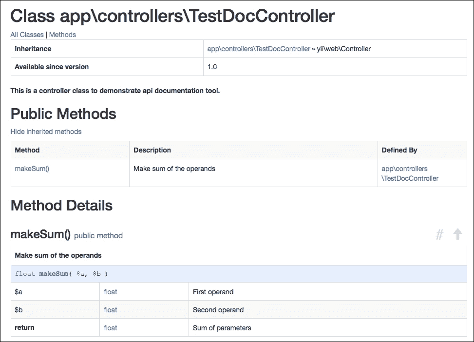
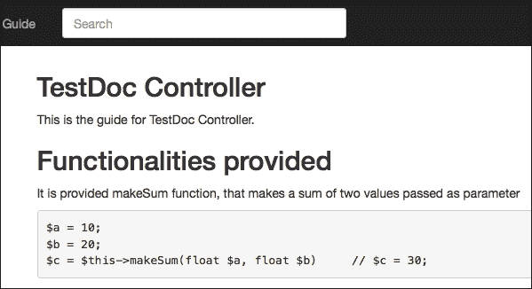

# 第十三章。最终重构

这是我们的开发阶段的最后阶段。现在我们已经编写了所有的工作代码，我们必须使其可重用，但更重要的是，可维护。本章将帮助你通过小部件和其他组件重用代码。我们将看到一些如何使用它们的实际示例。然后，我们将处理文档，这是应用开发的一个重要方面，它允许每个人快速了解项目的结构和构建方式。

对于文档，我们将使用框架提供的两个最重要的工具来构建 API 和指南参考，通过一个真实世界的示例。我们将涵盖以下主题：

+   创建小部件

    +   示例 - 创建带有轮播的小部件

+   创建组件

    +   示例 - 创建一个创建 MySQL 数据库备份并发送电子邮件给管理员的组件

+   创建模块

+   生成 API 文档

    +   示例 - 使用 API 文档生成应用的文档

# 创建小部件

小部件是一个可重用的客户端代码（包含 JavaScript、CSS 和 HTML），它包含最少的逻辑，并封装在`yii\base\Widget`对象中，我们可以轻松地将其插入并应用于任何视图。

构建小部件需要你扩展`yii\base\Widget`的两个方法：

+   `init()`方法初始化对象

+   `run()`方法执行对象

为了实例化一个小部件，只需调用接受一个参数或更好的是一个包含其公共属性值的数组的静态`widget()`方法。

以下是一个示例：

```php
    MyWidget::widget(['prop1' => 'value of prop1', …])
```

这将返回一个包含小部件输出的字符串，传递其`prop1`公共属性的`value of prop1`值。

如果我们需要在部件的执行中插入额外的代码（例如，在 ActiveForm 部件中），我们可以使用`begin()`和`end()`方法以更复杂的方式实例化部件。

第一种方法，`begin()`，接受一个带有配置数组的函数参数，并将其传递给小部件，然后它将返回小部件对象。

当调用第二种方法`end()`时，这两个方法之间的代码将被显示，并且同时，`end()`方法直接回显小部件`run()`方法的输出：

```php
    $widget = MyWidget::begin(['prop1' => 'value of prop1', …]);

    ..
    .. I can use $widget object here  ..
    ..

     MyWidget::end();
```

对于任何其他视图，在`run()`方法中，我们可以通过`render()`方法引用视图文件，以显示小部件输出。

例如，一个部件可能是一个实时日期/时间时钟。为此目的，我们将基于一个包含由 JavaScript 代码更新的日期/时间字符串的块来构建一个时钟。我们可以向部件构造函数传递一些值，例如边框框的颜色。

为了创建一个实例，让我们从基本的模板应用开始（但这显然也适用于高级模板应用）。在项目的根目录中创建一个名为`components`的新文件夹（如果不存在），位于`controllers`、`models`、`views`等同一级别，它将包含我们想要构建的所有小部件。

然后，在这个文件夹中，我们将创建一个名为 `ClockWidget.php` 的新文件，完整路径为 `basic/components/ClockWidget.php`：

```php
<?php

namespace app\components;

use yii\base\Widget;

class ClockWidget extends Widget
{

    public function init()
    {
        \yii\web\JqueryAsset::register($this->getView());
    }

    public function run()
    {
        return $this->render('clock');
    }

}
```

在 `init()` 方法中，我们还引用了 jQuery 资产，请求框架加载 jQuery 插件，因为我们需要在视图文件中使用它。

在 `run()` 方法中，我们渲染了 `clock` 视图，其内容将在下一行讨论。

因此，在 `basic/components/views` 下创建一个新的文件夹，并在其中创建一个名为 `clock.php` 的新文件，其代码如下：

```php
<?php

$this->registerJs( <<< EOT_JS

    function ClockWidget_refresh_datetime()
    {
        var dateTimeString = new Date().toString();
        $('#ClockWidget_realtime_clock').html(dateTimeString);
    }

    setInterval(ClockWidget_refresh_datetime,1000);

    ClockWidget_refresh_datetime();
EOT_JS
);

?>

<div style="border:1px solid black;padding:5px;width:200px;text-align:center">
    <span id="ClockWidget_realtime_clock"></span>
</div>
```

这段代码简单地显示一个包含实时日期和时间值的字符串的框，每秒更新一次。

最后，我们可以使用以下代码在任何视图中使用我们的组件：

```php
<?= \app\components\ClockWidget::widget(); ?>
```

## 示例 - 创建带有轮播的组件

在这个例子中，我们将创建一个包含一些房间的轮播组件（我们可以通过将它们传递给组件的公共属性来选择显示哪一个）。再次，我们将使用基本的模板应用程序；然而，所有这些同样适用于高级模板应用程序。

对于这个例子，我们将创建一个新的控制器来使用其视图作为组件容器。

那么，让我们在 `basic/controller/TestCarouselController.php` 下创建这个名为 `TestCarouselController` 的新控制器。从这里，我们将传递 `models` 属性，它包含最多三个房间的列表：

```php
<?php

namespace app\controllers;

use yii\web\Controller;
use app\models\Room;

class TestCarouselController extends Controller
{
    public function actionIndex()
    {
        $models = Room::find()->limit(3)->all();

        return $this->render('index', ['models' => $models]);
    }
}
```

接下来，我们在 `basic/views/test-carousel/index.php` 下创建视图，组件输出如下：

```php
This is a carousel widget with some rooms:
<?= \app\components\CarouselWidget\CarouselWidget::widget(['models' => $models, 'options' => ['style' => 'border:1px solid black;text-align:center;padding:5px;']]); ?>
```

这将构建组件填充及其公共属性 `models` 和 `options`。

现在是创建我们的组件的时候了。为了尽可能地将组件与其他代码隔离，我们在 `basic/components` 文件夹下创建一个特定的组件文件夹，在 `CarouselWidget` 子文件夹中，我们将创建一个名为 `CarouselWidget.php` 的组件文件。

这个组件包含一个公共属性 `models`，它包含从容器视图传递过来的房间模型。在 `\yii\bootstrap\Carousel` 中将这些模型作为此类数组传递是必要的：

```php
items => [
['content' => '...', 'caption' => '...'],
['content' => '...', 'caption' => '...'],
['content' => '...', 'caption' => '...'],
...
];
```

这样，在 `init()` 方法中，我们将根据 Bootstrap Yii2 组件的期望创建模型的内部表示。

最后，在 `run()` 方法中，我们将输出现在位于 `basic/components/CarouselWidget/views` 视图文件夹中的视图。这是组件内容；请记住，它存储在 `basic/components/CarouselWidget` 下的 `CarouselWidget.php` 中：

```php
<?php

namespace app\components\CarouselWidget;

use yii\base\Widget;

class CarouselWidget extends Widget
{
    public $carouselId = 'carouselWidget_0';
    public $options = [];
    public $models = [];

    private $carouselItemsContent;

    public function init()
    {
        // It is not necessary because yii bootstrap Carousel widget will load it automatically
        // \yii\jui\JuiAsset::register($this->getView());

        $this->carouselItemsContent = [];
        foreach($this->models as $model)
        {
            $caption = sprintf('<h1>Room #%d</h1>', $model->id);
            $content = sprintf('This is room #%d at floor %d with %0.2f€ price per day', $model->id, $model->floor, $model->price_per_day);
            $itemContent = ['content' => $content, 'caption' => $caption];
            $this->carouselItemsContent[] = $itemContent;
        }

    }

    public function run()
    {
        return $this->render('carousel', ['carouselItemsContent' => $this->carouselItemsContent]);
    }

}
```

在 `run()` 方法中调用的组件视图将存储在 `basic/components/CarouselWidget/views` 下的 `carousel.php` 文件中：

```php
<?php $styleOption = isset($this->context->options['style'])?$this->context->options['style']:''; ?>
<div id="<?php echo $this->context->id ?>" style="<?php echo $styleOption ?>">
    <?php
    echo \yii\bootstrap\Carousel::widget([
        'id' => $this->context->carouselId,
        'items' => $carouselItemsContent

    ]);
    ?>

</div>
```

浏览到 `http://hostname/basic/web/test-carousel/index`，我们将看到轮播组件（仅包含文本，但我们也可以在其中插入一些图片）。

# 创建组件

组件是一个可重用的对象，应该只包含逻辑，并且可以从应用程序的任何位置调用。在组件中，我们放置所有在应用程序的多个位置可用的函数。

技术上，一个组件扩展了`yii\base\Component`，实现了属性、事件和行为功能。我们可以有两种类型的组件：组件和应用组件。它们之间的唯一区别是第二个组件还需要在应用的配置文件中的`components`属性中进行配置，并且它作为属性从`Yii::$app`对象中可用。应用组件的例子有`db`、`user`等等。

通常，组件存储在项目根目录开始的`components`文件夹中。

让我们看看如何创建一个简单的自定义组件：

```php
namespace app\components;

use Yii;
use yii\base\Component;

class MyComponent extends Component
{
..
..
}
```

我们可以按以下方式实例化此组件：

```php
$myCmp = new \app\components\MyComponent();
```

然后，我们将有一个新的`MyComponent`对象实例。

如果我们想将此组件渲染为应用组件并通过`Yii::$app->myComponent`访问它，我们必须更新配置文件`web.php`中的`basic/config`：

```php
'components' => [
    ..
    ..
        'myComponent' => [
            'class' => '\app\components\MyComponent'
        ],
]
```

在这个阶段，我们可以使用以下方式调用`myComponent`：

```php
Yii:$app->myComponent
```

### 注意

记住，应用组件是相同对象的单个共享实例。

我们可以通过覆盖组件的`init()`方法来在组件实例化时进行自定义初始化。

组件的一个具体例子（或根据我们的需求，应用组件）可能是向应用短信网关发送短信。

组件可以是：

```php
namespace app\components;

use Yii;
use yii\base\Component;

class SmsGateway extends Component
{
    public function send($to, $text)
    {
        ..
        ..
        ..
    }
}
```

此示例适合将此组件用作应用组件：

```php
'components' => [
    ..
    ..
        'smsgw' => [
            'class' => '\app\components\SmsGateway
        ],
]
```

这可以直接从以下位置使用：

```php
Yii:$app->smsgw->send('+3913456789', 'hello world!');
```

应用组件的另一个常见例子可能是向移动设备发送推送通知的对象，它是以与之前短信网关对象相同的方式制作的。

## 示例 - 创建一个组件，该组件备份 MySQL 数据库并向管理员发送电子邮件

此示例将展示一个关于创建主数据库备份副本和管理员完成时接收的警报消息的常见任务。

将使用命令行 MySQL 工具进行备份。

维护操作应在控制台环境中执行，因为它们可以被安排（每天、每周、每周两天等），并且如果此操作耗时超过最大时间，可能会导致 Web 服务器超时（通常，如果操作未完成，Web 服务器将在 30 秒后返回超时错误）。因此，我们将首先在之前安装的高级模板中创建一个控制台控制器。

记住，高级模板的项目根文件夹是`yiiadv`。

在`yiiadv/common/components`的`Maintenance.php`中创建一个新的组件，内容如下：

```php
<?php
namespace common\components;

use Yii;
use yii\base\Component;

class Maintenance extends Component
{
    public function launchBackup($database, $username, $password, $pathDestSqlFile)
    {
        $cmd = sprintf('mysqldump -u %s -p%s %s > %s', $username, $password, $database, $pathDestSqlFile);
        $outputLines = [];
        exec($cmd, $outputLines, $exitCode);

        return ['cmd' => $cmd, 'exitCode' => $exitCode, 'outputLines' => $outputLines];        
    }
}
?>
```

`launchBackup()`方法将通过传递用户名、密码、数据库和 SQL 命令输出要存储的目标文件路径来启动`mysqldump`（应该在系统中安装）。

然后，它将返回一个包含这些值的数组：命令、命令的退出代码以及可能的输出文本。现在让我们创建将用于启动命令的控制台控制器。我们也可以从网络控制器启动它，例如在点击按钮后。

让我们在 `yiiadv/console/controllers` 下的 `MaintenanceController.php` 中创建控制台控制器：

```php
<?php

namespace console\controllers;

use \yii\console\Controller;
use \yii\helpers\Console;
use \common\components\Maintenance;

class MaintenanceController extends Controller
{
    public function actionBackupDatabase()
    {
        $tmpfname = tempnam(sys_get_temp_dir(), 'FOO');
        $obj = new Maintenance();
        $ret = $obj->launchBackup('username', 'password', 'database_name', $tmpfname);

        if($ret['exitCode'] == 0)
        {
            $this->stdOut("OK\n");        
            $this->stdOut(sprintf("Backup successfully stored in: %s\n", $tmpfname));        
        }
        else
        {
            $this->stdOut("ERR\n");
        }

        // equivalent to return 0;
        return $ret['exitCode'];
    }

}

?>
```

让我们做一些考虑：

+   我们可以通过避免创建对象实例来将维护组件的 `launchBackup()` 方法设置为静态；然而，如果我们保持它为非静态，我们也可以将其用作应用程序组件。否则，如果我们将方法标记为静态，然后在调用对象中的静态方法 `launchBackup()` 时将其用作应用程序组件，我们将收到 PHP 的警告。

+   我们可以将文件创建移动到 `launchBackup()` 方法内部，因为在这种情况下它是一个临时文件，但通常我们可以使用特定的文件路径。

+   如果我们将数据库信息存储在参数文件中，我们可以避免传递数据库信息，并从 Yii 参数中获取它。

一个更完整的操作是备份并发送电子邮件给管理员，包含备份结果，如果需要，还可以包含备份文件：

```php
    public function actionBackupDatabaseAndSendEmail()
    {
        $tmpfname = tempnam(sys_get_temp_dir(), 'FOO'); // good
        $obj = new Maintenance();
        $ret = $obj->launchBackup('username', 'password', 'database_name', $tmpfname);

        $emailAttachment = null;
        if($ret['exitCode'] == 0)
        {
            $this->stdOut("OK\n");        
            $this->stdOut(sprintf("Backup successfully stored in: %s\n", $tmpfname));

            $textEmail = 'Backup database successful! Find it in attachment';
            $emailAttachment = $tmpfname;
        }
        else
        {
            $this->stdOut("ERR\n");

            $textEmail = 'Error in backup database! Check it!';
        }

        $emailMsg = Yii::$app->mailer->compose()
            ->setFrom('from@example.com')
            ->setTo('to@example.com')
            ->setSubject('Backup database')
            ->setTextBody($textEmail);

        if($emailAttachment!=null) $emailMsg->attach($emailAttachment, ['fileName' => 'backup_db.sql']);
        $emailMsg->send();            

        // equivalent to return 0;
        return $ret['exitCode'];
    }
```

# 创建模块

模块实际上是在主应用内部的一个应用。实际上，它被组织成一个名为模块基本路径的目录。在目录内，有包含其控制器、模型、视图和其他代码的文件夹，就像在一个应用中一样。

按照模块的典型结构：

```php
myCustomModule/
    Module.php                   the module class file
    controllers/                 containing controller class files
        DefaultController.php    the default controller class file
    models/                      containing model class files
    views/                       containing controller view and layout files
        layouts/                 containing layout view files
        default/                 containing view files for DefaultController
            index.php            the index view file
```

当访问模块时，会实例化 `module` 类文件，它用于在代码中共享数据组件，例如应用程序实例。

`module` 类文件具有以下特点：

+   默认命名为 `Module.php`

+   在代码执行过程中仅实例化一次

+   它位于模块基本路径的直接下方

+   它继承自 `yii\base\Module`

让我们看看 `myCustomModule` 模块（在 `app\modules\myCustomModule` 命名空间下）的模块类文件示例：

```php
namespace app\modules\myCustomModule;

class Module extends \yii\base\Module
{
    public function init()
    {
        parent::init();

        $this->params['foo'] = 'bar';
        // ...  other initialization code ...
    }
}
```

作为标准应用，模块可以基于具有与标准应用相同内容的配置文件有自己的配置：

```php
<?php
return [
    'components' => [
        // list of component configurations
    ],
    'params' => [
        // list of parameters
    ],
  ..
  ..
  ..
];
```

我们在模块的 `init()` 方法中加载这个：

```php
public function init()
{
    parent::init();
    // initialize the module with the configuration loaded from config.php
    \Yii::configure($this, require(__DIR__ . '/config.php'));
}
```

然后，我们以与普通应用相同的方式创建和使用控制器、模型和视图。

### 注意

我们总是需要在每个文件的最顶部指定正确的命名空间。

最后，要在应用中使用模块，我们只需在应用的模块属性中列出模块。以下代码在应用配置中使用论坛模块：

```php
[
    'modules' => [
        'myCustomModule' => [
            'class' => 'app\modules\myCustomModule\Module',
            // ... other configurations for the module ...
        ],
    ],
]
```

# 生成 API 文档

文档无疑是应用最重要的方面之一，因为它提供了关于其流程和结构的信息。不幸的是，由于时间不足，它经常被省略。

Yii 为我们提供了一个强大的工具来自动生成漂亮的文档。基本上，它使用应用程序中存在的所有文档注释，那些以`/**`开头而不是经典的`/*`。

因此，我们有这样的优势，即代码中的注释被用来生成完整的文档。

在这些注释中，有一些关键字可以根据上下文使用——文件、类或函数/方法。

在文件的情况下，最常见的关键字放在顶部的是：

+   `@link url`，其中`url`是链接到文件的参考 URL

+   `@copyright text`，其中`text`是版权内容

+   `@license url`，其中`url`是许可证内容的参考

在类的情况下，最常见的关键字放在顶部的是：

+   `@author name`，其中`name`是作者名称

+   `@since version`，其中`version`是包含此类的项目版本

在函数/方法的情况下，最常见的关键字放在顶部的是：

+   `@param type name`，其中`type`是参数的类型，`name`是作为函数参数传递的参数名称

+   `@return type`，其中`type`是返回的类型

+   `@throws class`，其中`class`是抛出的异常类

除了 API 文档外，Yii 还提供创建`.md`格式（典型的 GitHub）的漂亮指南文件的工具。通过在互联网上搜索，很容易找到有关格式化`.md`文件的信息。

## 示例 - 使用 API 文档生成应用程序和服务的文档

现在我们来看看哪些命令能自动从 Yii 应用程序生成文档。

文档有两种类型：

+   API 文档，它是项目中每个`.php`文件的参考，由指向单个文件、类或函数的 doc 注释完成

+   指南，这是一个相当好的应用程序手册，使用 Yii 渲染的`.md`文件创建的`.html`文件

第一步是安装`api-doc`，如果尚未安装。

指向项目根目录并启动此命令：

```php
$ php composer.phar require --prefer-dist yiisoft/yii2-apidoc

```

这将安装`yii2-apidoc`扩展。

### 注意

如果此命令没有正确完成，请按以下方式启动 Composer 更新：

```php
$ php composer.phar update

```

现在我们可以从项目根目录启动命令以生成 API 文档：

```php
$ vendor/bin/apidoc api ./ ../app-doc

```

参数如下：

+   第一个参数`api`标识要执行的命令

+   第二个参数`./`标识要扫描的源文件路径

+   第三个参数`../app-doc`标识创建的文档的目标文件夹

启动命令后，在浏览器中转到`../app-doc`文件夹将显示框架创建的 API 文档。

当我们在源文件中做出任何更改时，必须重新启动命令以更新 API 文档。第二种文档是指南，是一组由`.md`文件生成的`.html`文件。

因此，我们需要从项目根文件夹创建一个文件夹，例如名为`guide`的文件夹，我们将把所有想要从命令`guide`转换为`.html`格式漂亮文件的`.md`文件放入其中。

现在我们准备启动命令来创建我们的指南，这与之前制作的 API 命令完全相同：

```php
$ vendor/bin/apidoc guide ./guide ../app-doc

```

此命令将把`./guide`文件夹中所有的`.md`文件转换为`.html`文件，并将它们存储在`../app-doc`文件夹中（与 API 文档文件一起）。

让我们举一个具体的例子。从基本模板项目开始，在`basic/controllers`中的`TestDocController.php`创建一个名为`TestDocController`的新控制器：

```php
<?php

/**
 * This file contains a controller to demonstrate api documentation tool.  
 *
 * @link http://www.example.com/
 * @copyright Copyright (c) 2015
 * @license http://www.example.com/license/
 */

namespace app\controllers;

use Yii;
use yii\web\Controller;

/**
 * This is a controller class to demonstrate api documentation tool.  
 *
 * @author Fabrizio Caldarelli
 * @since 1.0
 */
class TestDocController extends Controller
{
    /**
     * Make sum of the operands
     *
     * @param float $a first operand
     * @param float $b second operand
     * @return float sum of parameters
     * @author  
     */
    public function makeSum(float $a, float $b)
    {
        return $a+$b;
    }
}
```

现在在主机上打开一个 shell 控制台，从项目根文件夹启动生成 API 文档的命令：

```php
$  vendor/bin/apidoc api ./ ../app-doc

```

这将为从根文件夹（`./`）开始的 所有文件创建文档，并将 HTML 结果文件存储在`../app-doc`。

现在，在你的浏览器中，访问`http://hostname/app-doc`，我们将显示 API 文档索引页面。在侧菜单中搜索`TestDocController.php`并点击它。这应该是输出：



TestDocController API 文档

现在，我们想展示第二种文档类型——指南文档。

从项目根文件夹创建一个名为`app-guide`的文件夹。在其中，放置一个名为`test-doc-controller.md`的新文件，内容如下：

```php
## TestDoc Controller

This is the guide for TestDoc Controller.

## Functionalities

It is provided makeSum function, that makes a sum of two values passed as parameter

```

`$a = 10;`

`$b = 20;`

`$c = $this->makeSum(float $a, float $b)`     // $c = 30;

```php
```

前往托管的 shell 控制台，从项目根文件夹启动生成指南文档的命令：

```php
$  vendor/bin/apidoc guide ./app-guide ../app-doc

```

这将为`./app-guide`文件夹中的所有`.md`文件创建指南文档，并将`.html`结果存储在`../app-doc`。

在你的浏览器中访问`http://hostname/app-doc/guide-test-doc-controller.html`，你应该看到以下屏幕：



TestDocController 指南文档

# 摘要

在本章的最后，你学习了如何使用小部件和组件制作可重用且易于维护的代码。谈到可重用视图代码（HTML、JavaScript 和 CSS），我们介绍了小部件，定义了它们并为项目带来的好处。接下来，你学习了如何构建和使用它们，最后，我们通过从头开始构建一个新的小部件进行了实际示例。谈到可重用逻辑代码，我们发现了其组件，区分了组件和应用组件，并通过为现实生活中的问题构建有用的组件进行了一些实际示例。

然后我们掌握了文档生成器，特别是 API 和指南文档。你学习了如何启动和使用 Yii 提供的工具。最后，我们构建了一个控制器类，通过一个实际示例来解释如何为该控制器构建 API 参考和指南参考。
