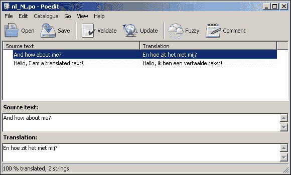

# 第二章 翻译和邮件处理

在本章中，我们将涵盖：

+   翻译您的应用程序

+   本地化您的应用程序

+   发送邮件

+   接收邮件

# 简介

一个应用程序如果不能响应用户，那就不是一个真正的应用程序。显然，一个简单而有效的方法是显示文本和发送电子邮件。在过去的几年里，国际化（i18n）和本地化（l10n）变得越来越重要。如今，用户期望以他们的语言被问候，甚至在日常工作中从应用程序中收到自动化的电子邮件。

# 翻译您的应用程序

在这个菜谱中，我们将使用 **Zend Framework 2** 框架作为基础，但我们将创建一个新的模块来展示它是如何工作的。

## 准备工作

对于这个菜谱，我们假设您已经有一个运行的 Zend Framework 2 应用程序/框架。为了确保我们可以实际运行在菜谱中产生的代码，我们需要确保 PHP 中的 `intl` 和 `gettext` 扩展已被启用。

在翻译字符串时，我们将使用 **Poedit**，这是一个跨平台的开源应用程序，用于翻译 `gettext` 目录。当前版本是 1.5.5，可以在 [`www.poedit.net/`](http://www.poedit.net/) 网站找到。我们使用 gettext，因为这是一个广泛使用的国际化本地化系统，用于编写多语言应用程序。由 Poedit 生成的文件扩展名为 `.po` 或 `.mo`。`.po` 文件用于编辑；让我们假设这是一个未编译的翻译文件。`.mo` 文件是编译后的翻译文件，用于我们的应用程序。

## 如何操作…

在这个菜谱中，我们将讨论如何将我们的应用程序翻译成其他语言，这在当今的应用程序中非常有用。

### 设置和检查基本要素

我们将假设我们至少设置了一个基本的模块，其中包含一个简单的 `IndexController`，它输出一个简单的视图。

我们首先要做的是确保在我们的模块结构中有一个语言目录，如下面的代码所示：

```php
SampleModule/
  config/
    module.config.php
  language/
  src/
    SampleModule/
      Controller/
        IndexController.php
  view/
    samplemodule/
      index/
        index.phtml
  Module.php
```

在这个目录中，所有 `gettext` 文件都将被存储，这将使我们更容易控制它们。现在，我们已经设置了一个简单的文件夹结构，我们需要确保模块配置也知道我们在做什么。现在，我们打开 `module.config.php` 并向数组中添加以下行：

```php
// We want to have our translator available through the 
// ServiceManager.
'service_manager' => array(
  'factories' => array(
    // Make our translator available in the 
    // ServiceManager so we can retrieve it under the 
    // 'translator' key.
    'translator' => 'Zend\I18n\Translator\TranslatorServiceFactory',
  ),
),

// Now to configure the Translator
'translator' => array(
  'locale' => 'en_US',

  // We would like using file patterns when matching 
  // i18n files, as that makes our lives so much easier, 
  // this is default in the skeleton.
  'translation_file_patterns' =>array(
    array(
      // The type of i18n we want to use is gettext.
      'type'     => 'gettext',

      // Here we define our i18n file directory, this is 
      // the directory we just made.
      'base_dir' => __DIR__ . '/../language',

      // We want to match our i18n files through this 
      // pattern, what will be for example 'nl_NL.mo'.
      'pattern'  => '%s.mo',
    ),
  ),
),
```

通过上述配置，我们已经将我们的模块设置成我们需要的样子。就这样；我们的模块现在已设置好以使用国际化。

### 在控制器中翻译字符串

一旦我们设置了翻译器，翻译字符串将变得非常简单。在以下示例（文件：`/module/Application/src/Application/Controller/IndexController.php`）中，我们将翻译控制器中的字符串，但在实际应用中这样做并不好，这里仅作为示例展示：

```php
<?php

// Set our namespace
namespace Application\Controller;

// We need to use the following abstract on our 
// controller
use Zend\Mvc\Controller\AbstractActionController;

// Begin our index controller class

class IndexController extends AbstractActionController
{
  // We can use this property to translate the strings, 
  // or do some other translator related stuff.
  public $i18n;

  // Lets attach the setLocale to the dispatch event, so 
  // it will be run before the action logic is executed
  public function setEventManager(EventManagerInterface $events) 
  {
    // Instantiate the i18n through our ServiceLocator.
    parent::setEventManager($events);

    // We want to use this controller in our event
    $c = $this;

    // Attach our locale setting to the dispatch event
    $events->attach(
      'dispatch', 

      // Variable $e is a Zend\Mvc\MvcEvent
      function ($e) use ($c) 
      {
        // Put our translator in a local property
        $c->i18n = $this->getServiceLocator()
                        ->get('translator'); 

        // while we are here, let's change the locale 
        // to Dutch.
        $c->i18n->setLocale('nl_NL');
      }, 

      // Make sure this event is triggered before the 
      // action execution
      100
    ); 

    // Return our selves
    return $this;
  }

  public function indexAction()
  {
    // Now simply translate this string with our i18n.
    $myTranslatedString = $this->i18n
                               ->translate("And how about me?");
  }
}
```

### 在视图中翻译字符串

视图中的翻译甚至比控制器（已经很简单了）还要简单。我们只需要我们想要翻译的字符串，就是这样。我们对`index.phtml`文件进行以下修改：

```php
<?php
  // Translate and display this text.
  echo $this->translate(
      "Hello, I am a translated text!"
  );
```

### 使用 Poedit 翻译字符串

在我们安装 Poedit 后，在开始翻译字符串之前，我们需要设置一些设置。Gettext 与称为目录的文件一起工作。目录是表示特定语言的源文本和翻译文本的文件。

首先，我们应该创建一个新的目录。在输入项目名称和要翻译的语言（例如，nl-NL）的第一个标签后，我们应该转到名为“源路径”的第二个标签。该路径应包含我们想要翻译的源路径，并且很可能是按模块划分的，这意味着基本路径应该是模块目录。

在第三个标签中，应该有一些标识符，Poedit 可以通过这些标识符识别哪些字符串应该翻译或不应翻译。因为我们将会使用`translate()`方法，我们需要确保至少单词“translate”在列表中，我们可以保留其余的，因为它们不会造成任何伤害。

在我们完成所有能做的事情后，点击**确定**并选择一个保存文件的位置。此文件需要保存在模块的语言目录中，并且应该有一个命名模式，例如，`nl_NL.po`，`en_GB.po`，`en_US.po`。文件的命名约定是`[language]_[COUNTRY]`；一些国家（例如，比利时和加拿大）有多个州语言，也需要定义。

保存后，点击**更新**按钮，这将导致代码被扫描以查找可翻译的字符串。现在出现了一个新列表，列出了所有可翻译的字符串。我们可以轻松地将我们的翻译放入**翻译**框中并保存。

如果我们完成了所有这些，我们的屏幕可能看起来类似于以下截图：



恭喜，我们现在已经成功创建了一个国际化应用程序！

## 它是如何工作的...

在 ZF2 中翻译字符串有多种方式，而且它们都相对容易实现。

### 在你的模块中基本设置翻译

虽然应用程序模块已经设置了翻译功能，但这可能不是我们想要在整个应用程序中使用的。例如，如果我们（我们将这样做）使用不同的模块，我们不想使用应用程序模块中的翻译文件，因为这会使它变得不那么动态。

如果我们在所有模块中使用相同的`gettext`文件，并将其存储在应用程序模块中，这意味着如果我们没有使用特定的模块，翻译仍然会被加载。当然，这将意味着更多的内存使用，而这本不应该发生。

因此，为每个模块单独设置翻译是一个好主意。

在 ZF2 中，翻译工作显然是因为有`Zend\I18n\Translator\Translator`类。这个类然后查看配置并加载我们需要的相关`Zend\I18n\Translator\Loader`。如果找到，它将查看当前选定的区域设置（例如，通过`setLocale()`设置的`nl_NL`、`en_GB`、`en_US`等）然后解析相关的翻译文件——对于 gettext 是`.mo`，对于 INI 是`.ini`，对于 PHP 数组是`.php`等——并让加载器解析。

一旦我们调用`translate()`或`translatePlural()`方法，翻译器将在会话中搜索相关的未翻译字符串。如果找到，它可以轻松返回翻译后的字符串，但如果是未翻译的字符串，它将只返回未翻译的字符串。

## 还有更多...

除了使用 gettext，还有其他几种方法可以作为翻译文件使用。默认情况下，ZF2 有选项使用以下格式之一：

### PHP 数组

虽然这是一种可行且易于翻译的方法，但就我个人而言，我不会推荐它。我的个人经验是，使用这种方法限制了翻译文件的使用范围仅限于 PHP。例如，gettext 是一个行业标准，可以被许多平台和应用使用。

在语言目录中，我们将 PHP 文件命名为`[language]_[COUNTRY].php`的格式，例如`nl_NL.php`。我们的`module.config.php`需要如以下代码所示的条目：

```php
'translator' => array(
  'locale' => 'en_US',
  'translation_file_patterns' =>array(
    array(
      // This is the method we want to use.
      'type' => 'phparray',

      // We tell the config that our translations can be 
      // found in the language directory.
      'base_dir' => __DIR__ . '/../language',

      // It will now search for files like en_US.php and 
      // nl_NL.php.
      'pattern' => '%s.php',
    ),
  ),
),
```

当这在`module.config.php`文件中定义时，翻译本身将完全相同，翻译文件（例如，`nl_NL.php`）将类似于以下代码：

```php
<?php

// We need to return an array with the translated 
// strings.
return array(

  // The key is the untranslated string, while the value 
  // is the translated text.
  'And how about me?'=> 'En hoe zit het met mij?',

  // More translations here [..]
);
```

### Gettext

我们在先前的例子中使用了这种格式，正如我们所见，它们可以通过像 Poedit 这样的应用程序轻松编辑。根据维基百科，gettext 最常用的实现是 GNU gettext。编辑 gettext 文件是在所谓的`.po`文件中完成的，其中 po 代表**可移植对象**，一旦文件编译用于使用，它们将被放置在`.mo`文件中，其中 mo 代表**机器对象**。

我们可以在[`www.poedit.net/`](http://www.poedit.net/)网站上找到翻译工具 Poedit。

### Ini

这种`ini`文件的工作方式基本上与之前描述的任何其他方法相同。语言目录中的文件可以命名为`[locale].ini`（例如，`nl_NL.ini`），在`module.config.php`中，我们会有一个类似于以下代码的条目：

```php
'translator' => array(
  'locale' =>array('en_US', 'nl_NL'),
  'translation_file_patterns' =>array(
    array(
      'type' => 'ini',
      'base_dir' => __DIR__ . '/../language',
      'pattern' => '%s.ini',
    ),
  ),
),
```

正如我们所见，我们在配置中定义了两个区域设置，这意味着这两个是我们的可用 i18n，但我们的`en_US`是我们的后备区域设置。后备区域设置在找不到合适的区域设置时使用。我们的翻译文件（`nl_NL.ini`）将类似于以下示例：

```php
translation.0.message = "And how about me?"
translation.0.translation = "En hoe zit het met mij?"

translation.1.message = "Hello, I am a translated text!"
translation.1.translation = "Hallo, ik ben een vertaaldetekst!"
```

我们总是从一个翻译开始，使用`translation.X`，其中`X`是一个之前未使用的数字。我们应该将其视为一个 INI 数组，类似于它在 PHP 中的工作方式。

# 本地化您的应用程序

在这个菜谱中，我们将解释本地化及其用途。本地化与国际化的区别在于，本地化指的是例如数字、日期和时间格式，以及货币的使用。

## 如何操作...

在这个菜谱中，我们将讨论我们应用程序本地化的重要过程。

### 因此，故事开始了

当用户访问我们的网站时，我们很可能希望用户自动跳转到正确的语言。尽管有几种实现方法，但我们将使用手动检查来查看用户偏好的语言是否也在我们的语言列表中。

我们通过几个简单的技巧来实现这一点：

+   首先，我们从 HTTP 请求中获取`Accept-Language`头

+   然后我们遍历它们，看看标题中提到的语言中是否有与我们所拥有的语言相匹配的

+   最后，我们将语言设置为找到的语言，或者如果没有找到，则设置为回退语言

让我们看看它在我们的`Module.php`代码中的样子：

```php
// We will be using a modified version of the default 
// Module.php which comes with the Application module on 
// the ZF2 Skeleton.
namespace Application;

// onBootStrap requires a McvEvent.
use Zend\Mvc\MvcEvent;
```

首先，我们需要声明命名空间（在我们的情况下是`Application`），因为我们希望框架知道我们的代码在哪里。然后我们想要确保我们总是将所有必需的类放在使用声明中，这样我们就可以在代码进一步之前预加载这些类。

```php
// Start of our Module class
class Module
{
  // Private storage of all our local languages
  // available.
  private $locales;

  /**
   * Retrieves any locale that is available in the 
   * language directory. This
   * assumes that our language directory contains files 
   * in the format of en_GB.ext, nl_NL.ext.
   */
  private function retrieveLocales()
  {
    // If we haven't already got all the locales,
    // please do it now.
    if ($this->locales === null) {
      $handle = opendir(__DIR__. '/language');
      $locales = array();

     if ($handle !== false) {
       // Loop through the directory
       while (false !== ($entry = readdir($handle))) {
         if ($entry === '..' || $entry === '.') {
            continue;
          }

         // We only want the front part of the filename
          $split = explode('.', $entry);

          // Split[0] should be en_GB if the file is 
          // en_GB.ext.
          if (in_array($split[0], $locales) === false) {
            $locales[] = $split[0];
          }

          unset($split);
        }

        // We are done, now close the directory again
        closedir($handle);
      }

      // Make sure the locale is available for next time
      $this->locales = $locales;

      unset($handle, $locales);
    }

    // Return our available locales
    return $this->locales;
  }
```

在`retrieveLocales()`方法中，我们正在解析语言目录，并假设我们的文件名为`en_GB.ext`。这样我们就可以轻松地将所有语言解析到一个数组中：

```php
public function onBootstrap(MvcEvent $e)
{
  // Retrieve the HTTP headers of the user's request
  $headers = $e->getApplication()
               ->getRequest()
               ->getHeaders();

  // Get the translator
  $translator = $e->getApplication()
                  ->getServiceManager()
                  ->get('translator');

  // Check if we have a user that accepts specific 
  // languages.
  if ($headers->has('Accept-Language')) {
    // Retrieve our locales that our user accepts
    $headerLocales = $headers->get('Accept-Language')
                             ->getPrioritized();

    // Retrieve the locales that we have in our system
    $locales = $this->retrieveLocales();

    // Make sure that our fallback has been set in 
    // case we couldn't find a locale
    $translator->setFallbackLocale('en_US');

    // Go through all accepted languages, most of the 
    // time this will be only 1 or 2 languages.
    foreach ($headerLocales as $locale) {
      // getLanguage retrieves languages in a en-GB 
      // manner, but ZF2 only supports the underscore, 
      // like en_GB.
      $language = str_replace(
        '-', 
        '_', 
        $locale->getLanguage()
      );

      // See if this is a language we support in our application.
      if (in_array($language, $locales) === true) {
       // We have found our *exact* match
        break;
      }
    }

    // Now set our locale 
    $translator->setLocale($language);
  }
}

// We can just use the methods that are already in the 
// module.php, let's not repeat that code here.  
public function getConfig() {}

public function getAutoloaderConfig() {}
}

```

如前所述的代码所示，我们试图实现的是查看我们是否与支持的语言（`en_GB`、`nl_NL`）中的任何一个完全匹配。如果没有找到完全匹配，我们已经确保正在使用回退语言（`en_US`）。

### 小贴士

请确保在配置中启用了 PHP 的`intl`扩展，否则此示例将无法正确工作。

### 本地化货币

在 Zend Framework 2 中，可以通过 i18n 视图助手在视图中本地化货币，该助手是 ZF2 的标准功能。可以通过以下方法调用轻松在视图中使用名为`CurrencyFormat`的视图助手。我们对`sometemplate.phtml`文件进行了以下修改：

```php
<?php

// We always use $this for accessing a view helper.
echo $this->currencyFormat(45312.56, "EUR", "nl_NL");
```

这段代码将输出`45.312,56 €`，因为我们指定了使用荷兰本地化格式本地化欧元货币符号，在这种情况下是千位点的逗号和十位点的分隔符。我们也可以省略`nl_NL`，然后`CurrencyFormat`视图助手将自动选择应用程序的默认区域设置。

### 本地化日期/时间

要在我们的应用程序中格式化任何日期和时间，我们可以使用 `DateFormat` 视图助手，它就像货币视图助手一样容易使用，但有一些额外的选项可以使用。我们对 `sometemplate.phtml` 文件进行了以下修改。

```php
<?php
echo $this->dateFormat(
    // Format the current UNIX timestamp.
    time(),

    // Our date is to be a LONG date format.
    IntlDateFormatter::LONG,

    // We want to omit the time, defining this is 
    // optional as the default is NONE.
    IntlDateFormatter::NONE
);
```

之前的代码只会显示日期，它将被格式化为 `Monday, May 14, 2012 AD`。我们可以省略提供任何参数，但这样将不会显示任何内容，因为默认选项是 `IntlDateFormatter::NONE`。

## 它是如何工作的…

本地化（l10n）就像国际化（i18n）一样，是公共应用程序的一个重要方面。我们在上一个食谱中讨论了如何确保你的应用程序可以翻译，但现在我们需要确保我们能够找到使用任何 l10n 的方法。

Zend Framework 2 与 PHP 内置的 i18n/l10n 功能紧密协作。尽管我们可以单独使用 PHP 的 `Locale` 类而不依赖于 ZF2 类，但并不推荐这样做，因为 ZF2 已经使用了 PHP 自身的 Locale，但它提供了一个更优雅、更快捷的接口。

然而，在幕后，ZF2 直接与 PHP 的 `Locale` 进行通信，但如果我们想使用更强大的功能，我们应该使用 ZF2 库（这在创建多语言 Web 应用程序时非常有用）。

### 识别客户端语言

之前的示例代码依赖于客户端浏览器发送 `Accept-Language` 头部。尽管大多数现代浏览器都会这样做，但这仍然可能不是总是可行的。总的来说，这是一个相当好的工具，可以预先选择任何语言。

与之前展示的自行构建一切不同，还有一个非常巧妙的模块叫做 `SlmLocale`，由 *Jurian Sluiman* 创建（[`github.com/juriansluiman/SlmLocale`](https://github.com/juriansluiman/SlmLocale)），我们推荐用于检测和选择默认区域设置。

### 本地化货币和日期

本地化货币和日期通常在视图中完成，因为这基本上只是格式化信息的一部分。你可以在其他地方做，但我们应该始终小心，确保我们不会在例如模型中本地化任何内容，因为它们只应包含逻辑。在大多数情况下，语言不是逻辑的一部分，而是一种使视图更用户友好的简单方式。

# 发送邮件

通过 `sendmail` 发送电子邮件通常是一种相当标准的操作方式，因为它可能是 Linux 系统上传输电子邮件（或代理电子邮件到 SMTP 服务器）最常用的方式之一。在大多数 Linux 服务器上，`sendmail` 已经安装好了，因此使用它来发送电子邮件非常简单。

因此，我们将首先讨论这种发送电子邮件的方法，这样我们可以从简单开始。

## 如何操作…

在本食谱中，我们将讨论在应用程序内部发送邮件的方法。

### Transport\Sendmail

让我们看看以下通过`sendmail`发送电子邮件的示例，尽管这个功能被放置在控制器中，但在现实生活中，这需要远离控制器，安全地放置在模型中：

```php
<?php

namespace Application\Controller;

// We need the following libraries at a minimum to 
// send an e-mail.
use Zend\Mail\Message;
use Zend\Mail\Transport\Sendmail;
use Zend\Mvc\Controller\AbstractActionController;

class IndexController extends AbstractActionController
{
  public function indexAction()
  {
    // We start off by creating a new Message, which 
    // will contain our message body, subject, to, 
    // etcetera.
    $message = new Message();

    // Add the options we would like to give the 
    // message, in this case we will be creating a text 
    // message.
    $message->addFrom('awesome.coder@example.com')
            ->addTo('rookie.coder@example.com')
            ->setSubject('Watch and learn.')
            ->setBody('My wisdom in a message.');

    // Now we have set up our message, let's initialize 
    // the transport.
    $sendmail = new Sendmail();

    // Although checking isValid is optional, it is a 
    // great way of checking if our message would send 
    //if we are getting input from outside.
    if ($message->isValid() === true) {
      // Send the message through sendmail.
      $sendmail->send($message);
    }
  }
}
```

通常情况下，设置通过`sendmail`发送的电子邮件不需要配置，因为它仅是本地主机上的邮件传输应用程序。

### Transport\Smtp

如果我们想通过 SMTP 发送电子邮件（如果我们知道 SMTP 服务器的详细信息的话）：

```php
<?php
// Usually this sort of code is defined in the Model, 
// but to test it out we can place it in the 
// controller as well.
namespace Application\Controller;

// We need these classes to initiate a SMTP sending.
use Zend\Mail\Message;
use Zend\Mail\Transport\Smtp;
use Zend\Mail\Transport\SmtpOptions;
use Zend\Mvc\Controller\AbstractActionController;

class IndexController extends AbstractActionController
{
  public function indexAction()
  {
    // First we built up a small message that we want to 
    // send off.
    $message = new Message();

    // We need at least one recipient and a message body 
    // to send off a message.
    $message->addTo('someone@example.com')
            ->addFrom('developer@example.com')
            ->setSubject('An example message!')
            ->setBody('This is a test message!');

    // Now we created our message we need to set up our 
    // SMTP transportation.
    $smtp = new Smtp();

    // Set our authentication and host details of our 
    // SMTP server.
    $smtp->setOptions(new SmtpOptions(array(
      // Name represents our domain name.
      'name' => 'ourdomain.com',

      // Host represents the SMTP server that will 
      // handle the sending of our mail. This could also 
      // be 'localhost' if the sending happens on our 
      // local server.
      'host' => 'smtp.somewhere.com',

      // Port is default 25, which in most cases is 
      // fine, but this is just to show how we can 
      // change it.
      'port' => '1234',

      // Connection class is the class used for 
      // authenticating with the SMTP server. Normally 
      // login will suffice, but sometimes the SMTP 
      // server requires a PLAIN (plain) or CRAM-MD5 
      // (crammd5) authentication method.
      'connection_class' => 'login',

      // This tells the connection_class which 
      // properties to set. The default three connection
      // classes only require username and password.
      'connection_config' =>array(
        'username' => 'someuser',
        'password' => 'someplainpassword',
      ),
    ))); 

    // We have set the options, now let's send the 
    // message.
    $smtp->send($message);
  }
}
```

### Transport\File

让我们看看如何将我们的电子邮件发送到文件的示例…

```php
<?php
// Usually this sort of code is defined in the Model, 
// but to test it out we can place it in the 
// controller as well.
namespace Application\Controller;

// We need these classes to initiate a SMTP sending.
use Zend\Mail\Message;
use Zend\Mail\Transport\File;
use Zend\Mail\Transport\FileOptions;
use Zend\Mvc\Controller\AbstractActionController;

class IndexController extends AbstractActionController
{
  public function indexAction()
  {
    // First we create our simple message. 
    $message = new Message();

    // Set the essential fields send it off.
    $message->addTo('someone@example.com')
            ->addFrom('developer@example.com')
            ->setSubject('An example message!')
            ->setBody('This is a test message!');

    // Now we will initialize our File transport.
     $file = new File();

    // Set the options for the File transport.
    $file->setOptions(new FileOptions(array(
      // We want to save our e-mail in the /tmp path,   
      // this can be anything where we have write  
      // permission on.
      'path' => '/tmp',

      // Define our callback, which will be ran when 
      // the e-mail is being saved to our system. This 
      // also called an anonymous function, as it 
      // isn't defined as a normal method.
      'callback' = function(File $file) {

      // We want to return a name in which the file 
      // should be saved, which should be a unique.
      return 'mail_'. time(). '.txt';
    }
   )));

   // Now send off the message.
   $file->send($message);
  }
}
```

发送电子邮件后，文件传输器将创建一个可能看起来像`mail_453421020.txt`的文件。我们指定了`/tmp`作为文件应该保存的目录，我们应该在那里查看我们的文件是否存在。

当然，我们可以在回调函数中做任何事情，例如，我们可以检查某个文件是否存在，或者从数据库中拉取一个名称。选项是无限的。

## 工作原理…

Zend Framework 2 需要至少两个对象来使电子邮件发送工作。首先是`Zend\Mail\Message`对象，用于完全定义需要发送的消息。我们可以在该对象中定义`to`、`cc`、`bcc`和`from`地址。该对象还用于设置消息正文；这可以是 HTML 或纯文本，完全取决于我们的需求。

作为第二个对象，我们需要一个类来实现`Zend\Mail\Transport\TransportInterface`类，该类负责处理电子邮件的实际发送。这个类目前（至少现在）只定义了一个`send(Mail\Message $message)`方法，在我们实现传输时需要添加。

定义两个对象之后，我们将`Message`对象交给`Transport`对象，并告诉它发送。发送是如何处理的，显然是由`Transport`对象决定的。

### 通过 SMTP 发送邮件

通过 SMTP 传输邮件可能对我们来说不熟悉，但它是通过另一个系统发送电子邮件的常用方法。想想看，桌面电子邮件客户端从另一个服务器检索我们的电子邮件。当我们从这个相同的电子邮件客户端发送电子邮件时，我们可能会使用 SMTP 来发送它。简而言之，SMTP 是将电子邮件发送到另一个邮件服务器，然后由该服务器为我们处理邮件传输。

### 通过文件发送邮件

虽然不常用，但有一些电子邮件发送者会简单地从特定目录中提取需要发送的完整消息的纯文本文件，并将它们发送出去。显然，如果我们没有测试实际电子邮件发送的方法，这也是测试系统是否工作的一种很好的方式。

# 接收邮件

现在，让我们处理接收邮件的部分。

## 准备工作

在这个菜谱中，我们将给出通过 ZF2 连接到邮箱的不同方法的示例，因此如果我们能访问我们连接到的邮箱那就太好了。当然，这不是必需的，但有一个实际工作的邮箱确实增加了乐趣。

## 如何做到这一点...

我们现在将讨论在应用程序内接收电子邮件，这在某些场合可能很有用。

### 连接到 IMAP 邮件服务器

连接到邮件服务器的第一种方法是使用 IMAP。该协议基本上允许我们连接到邮件服务器，并在服务器上的不同文件夹中查找是否有未读电子邮件。

让我们来看看我们的示例：

```php
<?php
// Usually this sort of code is defined in the Model,
// but to test it out we can place it in the 
// controller as well.
namespace Application\Controller;

// We need these classes to initiate an IMAP connection
use Zend\Mail\Storage\Imap;
use Zend\Mvc\Controller\AbstractActionController;

class IndexController extends AbstractActionController
{
  public function indexAction()
  {

    // We will create a new IMAP connection here:
    // host: user/password: The username and password 
    // to use. 
    $mail = new Imap(array(
   // Refers to the host where we want to connect to.
   'host' => 'imap.example.com',

   // The username/password to connect to the server 
   // with.
   'user' => 'some_user',
   'password' => 'some_password',

   // Do we want to explicitly use a secure 
   // connection.
   'ssl' => true,

   // If we want to use a port that is different to 
   // the default port, we can do that here.
   'port' => 1234,

   // Specify the folder we want to use, if none 
   // given it will always use INBOX. This will also 
   // work with the Mbox and Maildir protocol.
   'folder' => 'Some_Folder',
 ));

 // We want to parse through all our e-mails.
 foreach ($mail as $message) {
   // Display the from and subject line.
      echo $message->from. ': '. $message->subject;
    }
  }
}
```

### 连接到 POP3 邮件服务器

让我们来看看我们的简单连接示例：

```php
<?php
// Usually this sort of code is defined in the Model, 
// but to test it out we can place it in the 
// controller as well.
namespace Application\Controller;

// We need these classes to initiate a POP3 connection
use Zend\Mail\Storage\Pop3;
use Zend\Mvc\Controller\AbstractActionController;

class IndexController extends AbstractActionController
{
  public function indexAction()
  {        
    // We will create a new POP3 connection here
    $mail = new Pop3(array(
      // Refers to the host where we want to connect 
      // to
      'host' => 'pop3.example.com',

      // The username/password to connect to the 
      // server with.
      'user' => 'some_user',
      'password' => 'some_password',

      // Do we want to explicitly use a secure 
      // connection.
      'ssl' => true,

      // If we want to use a port that is different to 
      // the default port, we can do that here.
      'port' => 4321
    ));

    // We want to parse through all our e-mails.
    foreach ($mail as $message) {
      // Display the from and subject line.
      echo $message->from. ': '. $message->subject;
    }
  }
}
```

### 在 IMAP 或 Maildir 连接上处理标志

标志是附加到消息上的属性，我们可以从中看到消息的特定属性。简单来说，它可以告诉我们，例如，消息是否已阅读或回复。我们可以通过使用 `getFlags()` 方法或 `hasFlag()` 方法从消息中获取标志。可用的标志可以在 `Zend\Mail\Storage` 类中找到。

### Maildir++ 配额系统

让我们来看看以下示例：

```php
<?php
// Usually this sort of code is defined in the Model,
// but to test it out we can place it in the 
// controller as well.
namespace Application\Controller;

// We need these classes to initiate a Maildir storage 
// connection
use Zend\Mail\Storage\Maildir;
use Zend\Mvc\Controller\AbstractActionController;

class IndexController extends AbstractActionController
{
  public function indexAction()
  {	
    // Open up a new Maildir connection
    $mail = new Maildir(array(
      // Our mail folder on the server.
      'dirname' => '/home/user/.mymail/'
    ));

    if ($mail->checkQuota() === true) {
      // We are over quote, let's check what we are 
      // using!

      // Give us extended information about the quota.
      $quota = $mail->checkQuota(true);

      // Normalise the string if we are over the
      // quota.
      $overQuota = $quota['over_quota'] ? 'Yes' : 'No';

      // Display the information.
      echo "
        -- QUOTA --
        Total quota size: {$quota['quota']['size']}
        Total quota objects: {$quota['quota']['count']}
        -- USE --
        Total used size: {$quota['size']}
        Total used objects: {$quota['count']}
        Are we over quota: {$overQuota}
     ";
    }
  }
}
```

### 保持连接活跃

以下是一个使用 NOOP 的示例：

```php
<?php
// Usually this sort of code is defined in the Model,
// but to test it out we can place it in the 
// controller as well.
namespace Application\Controller;

// We need these classes to initiate a IMAP connection
use Zend\Mail\Storage\IMAP;
use Zend\Mvc\Controller\AbstractActionController;

class IndexController extends AbstractActionController
{
  public function indexAction()
  {
    // Open up a new connection to the mail server.
    $mail = new Imap(array(
     'host' => 'imap.example.com',
     'user' => 'some_user',
     'password' => 'some_password'
  ));

 // Loop through the messages.
 foreach ($mail as $message) {
   /** Do stuff which takes a lot of time.. **/

   // Now let the server know we are still alive..
   $mail->noop(); 

   /** Do some more stuff..  **/

   // Let the server know again we are still here..
   $mail->noop();
    }
  }
}
```

这里棘手的部分是何时使用 `noop()`，因为有时很难预测哪个进程耗时最长。这就是为什么我们创建了一个特殊的示例来向您展示确保 `noop()` 定期执行有多容易，直到我们完成我们的进程。

我们可以通过利用 `register_tick_function` 来实现这一点，它使我们能够在每个 tick 上调用一个特定的进程。我们将创建一个处理 `noop()` 的类，并每 5 分钟执行一次，直到我们说它应该停止：

```php
<?php

// We can make this anything we want, we just decided on 
// this though
namespace Application\System;

// Lets call our class this
class NoopTick
{
  // This is our Zend\Mail\Storage\Imap which is a 
  // static so we can call from outside the context of 
  // this class without instantiating the class
  private static $imap;

  // This is the time value in seconds of the next time 
  // we want to execute our noop functionality
  private static $newTime;

  // This is the amount of seconds between noop
  // executions, which in this case is 5 minutes
  private static $timeInBetween = 300;

  // This is our main method, which will only call the 
  // noop method
  public static function tickTock()
  {
    if (time() >= self::$newTime) {
      // We can execute our noop now
      self::$imap->noop();

      // Now set the new time
      self::$newTime = (time() + self::$timeInBetween);
    }
  }

  // Now we want to have a method that starts up the 
  // noop triggering
  public static function start($imap)
  {
    // Set our imap storage to use
    self::$imap = $imap;

    // Now we register the tick function, which executes 
    // every tick of the process, we will use the class 
    // NoopTicks (this class) and method 'tickTock'
    register_tick_function(array(
      'Application\System\NoopTick','tickTock'
    ));
  }

  // And we now unregister our tick function again when 
  // we are done with our operation
  public static function stop()
  {
    // Unregister our tick function again, mind that we 
    // don't have to provide our class name here
    unregister_tick_function('tickTock');
  }
}
```

如果我们现在遇到一段需要长时间执行的代码，我们可以轻松地调用 `start()` 方法来为我们执行 NOOP，如下面的代码行所示：

```php
Application\System\NoopTick::start($imapStorage);
```

当我们完成时，我们只需再次 `stop()` NOOP'ing，如下面的代码行所示：

```php
Application\System\NoopTick::stop();
```

## 它是如何工作的...

邮箱正在连接；然而，在 ZF2 中我们将它们视为存储对象。正因为如此，我们可以轻松地遍历所有消息，在某些情况下，我们甚至能够操纵存储中的消息，例如复制或移动它们。我们需要记住，消息始终是只读的，而存储是可以被操纵的。例如，我们可以创建和删除文件夹，但永远不能编辑现有的消息。

我们用于操作消息的唯一可写功能是 `appendMessage()`，它将消息追加到存储中。但是，当它被存储后，我们就无法再次编辑它。

### 连接到 POP3 服务器

使用 POP3 服务器连接与使用 IMAP 服务器非常相似（方便，不是吗？）。唯一的重大区别通常在于，使用 POP3 服务器，在检索消息后，消息会从邮件服务器上消失，除非我们明确告诉服务器否则。

### 关于 Maildir++配额系统

Maildir++是 Maildir 的扩展版本，但仍然与正常的 Maildir 程序兼容，并支持配额系统。这是一个非常有用的系统，因为它有配额以及如何存储消息（在文件系统上）。这个系统在许多公司中被使用，但显然它也伴随着自己的问题。例如，当尝试在 Maildir++服务器上写入/复制消息时，可能会抛出异常，因为我们已经超过了系统配额。

正因如此，除非你确定 Maildir++没有被使用，否则在尝试执行任何基于写入的功能之前，实施一个配额检查是明智的。

### 保持连接活跃

一旦建立了连接并且解析消息被实例化，如果时间过长，连接有很大可能会关闭。在那个时刻，实施一个“无操作”命令，或称 NOOP，总是明智的。这将告诉邮件服务器我们还在那里，但此刻正在做其他事情。

## 还有更多…

显然，关于从邮件服务器检索电子邮件还有很多可以说的，找到所有这些内容将是一次伟大的冒险。不幸的是，详细讲解所有高级细节几乎可以写成一本书，所以我们只列出了一些值得探索的主题：

+   缓存实例（参见第八章优化性能，*优化性能*）

+   读取 HTML 消息，或带有附件的多部分消息

+   在 IMAP/Maildir/Mbox 上的文件夹的高级使用

+   协议类扩展

+   通过配置设置电子邮件箱设置
