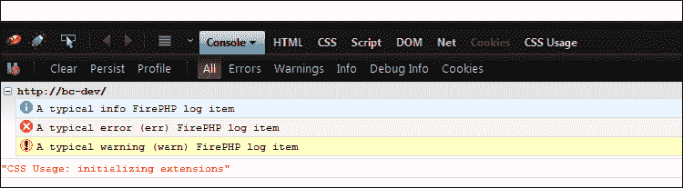

# 第九章：捕获错误

在本章中，我们将涵盖：

+   处理异常——你的犯罪伙伴

+   日志记录以及它如何使你的生活更轻松

+   单元测试——你为什么要做

+   设置和使用单元测试

# 简介

1947 年 9 月 9 日，Grace Hopper 发现了第一个计算机错误。这个计算机错误实际上是一只昆虫，而不是软件错误。从那时起，我们基本上在我们的软件应用程序中追逐错误，而且我们学到的代码越多，我们就越开始欣赏良好的错误处理，并及时捕获错误。

对于一个程序员来说，没有什么比接到客户电话说“它不起作用”，而我们不知道到底发生了什么，更令人烦恼的了。这就是为什么本章的重点是尽早捕获错误，并更容易地找到错误的原因。

# 处理异常——你的犯罪伙伴

为了找到错误源，应该实现良好的错误处理。在本食谱中，我们将讨论在 Zend Framework 2 中的异常处理以及如何最佳地使用它。

## 准备工作

我们可以安全地假设我们所有人都知道关于 try-catch 和异常的知识，但为了确保没有人被遗漏，请查看本节“参见”子节中的 PHP 手册链接。

## 如何做到...

异常处理并不难使用，但如果使用得当，它是一个非常实用的工具。

### Zend Framework 2 中的异常类

让我们看看以下示例：

```php
<?php 

// This non existing method throws a couple of Exception, which  
// is a PDOException, BadMethodCallException and probably more.
try {
  $object->executeMe();
} catch(PDOException $e) {
  // We catch the most specific Exception first, as this is an 
  // Exception that has to do with a database query that went wrong
} catch(BadMethodCallException $e) {
  // Next up this one, as this tells us that we have done 
  // something wrong when calling this method, maybe we forgot 
  // some arguments, or the method might not exist?
} catch(Exception $e) {
  // We don't know what is going wrong, but we know something did 
  // go wrong. Perhaps we just want to log this, or handle it on 
  // another way?
}
```

这种`try-catch`的实现也被称为级联异常。

### 在分发或渲染时处理异常

要在这些事件之一上实现触发器，我们应该在我们的模块中的一个模块的`/module/Application/Module.php`文件中添加一些代码（具体是哪一个并不重要）。

```php
<?php
  use Zend\Mvc\Application;
  use Zend\Mvc\MvcEvent;

  // We'll skip the beginning of the file as it has no 
  // effect on us
class Module
{
  // We want to add/create the onBootstrap method to put 
  // our event attachment in
  public function onBootstrap(MvcEvent $e)
  {
    // Get the event manager from the application
    $eventManager = $e->getApplication()
                      ->getEventManager();

    // Make sure our module router listens to our event 
    // manager as well
    $moduleRouteListener = new ModuleRouteListener();
    $moduleRouteListener->attach($eventManager);

    // Get the service manager for later use
    $serviceManager = $e->getApplication()
                        ->getServiceManager();

    // Attach our handler to the events  
    $eventManager->attach(
        // What events do we want to attach to
        array(
          MvcEvent::EVENT_DISPATCH_ERROR,
          MvcEvent::EVENT_RENDER_ERROR,
        ),  

        // What class and method do we want to trigger
        array($this, 'handleException')
    ); 
  }

  // This is the method we use to handle the exception
  public function handleException(MvcEvent $event) 
  {
    // Make sure the error is an exception, otherwise 
    // it might be some other parameter in the event
       if ($event->getError() === Application::ERROR_EXCEPTION) {
      // Now get the exception from the event
      $exception = $event->getParam('exception');

      // Do whatever with this exception 
    }
  }

  // Again, we are not bothered by the rest of the 
  // Module class
}
```

## 它是如何工作的...

现在我们已经看到了如何做到这一点，让我们看看它在 Zend Framework 2 中实际上是如何工作的。

### Zend Framework 2 中的异常类

Zend Framework 2 几乎为框架的每个组件抛出不同的异常，尽管名称不同，但它们在功能上都是相同的。

首先，这里是一个列表，列出了 PHP 中默认的异常，但被 Zend Framework 2 覆盖，因为 Zend Framework 2 喜欢使用在 Zend 命名空间中的异常，而不是在全局命名空间中：

+   `BadMethodCallException`

+   `DomainException`

+   `ExtensionNotLoadedException`

+   `InvalidArgumentException`

+   `InvalidCallbackException`

+   `LogicException`

+   `RuntimeException`

幸运的是，我们可以在捕获异常时使用全局的`\DomainException`以及`\Zend\Stdlib\Exception\DomainException`（它太长了），因为异常已经从原始的异常中覆盖了。

然而，如果我们使用一系列的捕获来了解特定的异常来源，这可能会很有用；例如，当我们捕获`RuntimeException`并且我们知道`Zend\Cache`或`Zend\Authentication`可能会抛出一个异常时。然而，通常情况下，它可能很清楚是什么，或者对异常的反应可能因实例而异。

然而，Zend Framework 2 为每个类和方法都提供了 docblocks，并且幸运的是，它还为我们提供了文档化的 `@throws`。这意味着我们可以轻松地查看文档，并了解特定功能抛出了什么，这样我们就可以轻松地将代码包裹在 `try-catch` 块中，并处理异常。

我们也可以捕获任何抛出的 `\Exception`，而不是专门针对命名异常，但我们通常不会这样做，因为这不会给我们对错误的有效控制。一般来说，当我们处理异常时，我们希望尽可能具体，规则是从最具体到最不具体地捕获它们。

### 在调度或渲染时处理异常

如果我们在调度或渲染时没有处理异常，我们将会遇到麻烦。可能出现的问题之一是白屏问题，因为我们不会在屏幕上看到任何东西，因为发生了错误。在开发阶段，这只会让开发者感到轻微的挫败感，但想想看，当用户在实时环境中看到这种情况时，他们想告诉你他们的侄子/表亲/叔叔的编码能力比我们强。我们不能有这种情况。

正因如此，我们需要确保我们监听 `Zend\Mvc\MvcEvent::EVENT_DISPATCH_ERROR` 和 `Zend\Mvc\MvcEvent::EVENT_RENDER_ERROR` 事件。当控制器或路由未找到或模板渲染期间发生错误时，这些事件将被触发。

如我们从示例中可以看到，此事件仅在发生错误、调度或渲染时触发。然后可以检索到的异常可以用来记录或显示在屏幕上，无论哪种方式都感觉合适。这里的想法是我们即使没有看到错误发生，也能有效地进行调试。

例如，如果这项技术在实时应用程序中实现，它可以将所有异常记录到日志（或发送到支持部门的电子邮件）中，这样我们就可以看到当我们“不在场”时发生的错误。

### 关于 try-catch

PHP 中的 `try-catch` 块是贸易中一个极其有用的工具，我们需要尽可能多地使用它，因为异常链比方法返回 `false` 或 `null` 更容易解决。特别是结合事件，我们能够及时捕获任何异常，或者至少确保我们能够以合理的方式对其进行调试。

## 参见

异常手册和 try-catch 介绍：[`php.net/manual/en/language.exceptions.php`](http://php.net/manual/en/language.exceptions.php)

# 记录和它如何使你的生活更轻松

除了良好的错误处理外，记录是确保你从系统中获得最多知识的好方法。大多数时候，我们甚至可以构建它，以便记录导致错误的事件，然后可以追溯到原始问题。

## 准备工作

因为我们要在 Zend Framework 2 中尝试所有外来的记录方式，所以我们需要在我们的 Web 服务器上安装 FirePHP 核心。我们可以通过 Composer 工具安装这个库（我们假设我们已经在服务器上使用了它，否则事情会变得有些复杂）。

我们可以通过在`composer.json`文件的 require 部分添加以下行来安装 FirePHP 库：

```php
"firephp/firephp-core" : "dev-master"
```

如果我们现在在命令行中执行`'php composer.phar update'`，它将安装库以便稍后在我们的代码中使用。为了充分利用记录器功能，使用一个能够理解 FirePHP 头部的浏览器也是明智的。使用 Mozilla Firefox 浏览器，我们需要安装 Firebug 和 FirePHP 插件来使其工作。如果我们想在 Google 的 Chrome 浏览器或 Microsoft Internet Explorer 中使用 FirePHP 记录，我们也需要安装相应的扩展/插件，因为这些浏览器默认都不支持。

## 如何做到...

在这个菜谱中，我们将展示如何在我们的应用程序中实现记录器系统的示例。

### 实现一个真正简单的文件记录器

让我们先实现一个简单的文件记录器，这可以在我们的配置文件之一中完成。我们将把我们的记录器添加到我们的`/config/autoload/global.php`文件中，因为我们希望它在我们的应用程序的任何地方都可以使用：

```php
return array( 
  // We want to put our logger in the service manager
  'service_manager' => array(
    'factories' => array(
      // We will call our logger 'log' so we can find it 
      // easily back in our application
      'log' => function () {
        // Instantiate our logger
        $log = new Zend\Log\Logger();

        // Add the writer to our logger (don't forget to  
        // make the data directory writable)
        $log->addWriter(new Zend\Log\Writer\Stream(
            getcwd(). '/data/application.log'
        ));

        // Return our logger now
        return $log;
      },
    ),
  ),
);
```

如我们所见，这很简单，现在我们可以在任何地方使用`ServiceManager`对象来获取记录器，如下面的`Controller`（文件：`/module/Application/src/Application/Controller/IndexController.php`）代码所示：

```php
<?php

namespace Application\Controller;

use Zend\Mvc\Controller\AbstractActionController;
use Zend\View\Model\ViewModel;

class IndexController extends AbstractActionController 
{
  public function indexAction() 
  {
    $this->getServiceLocator()
         ->get('log')
         ->debug("A Debug Log Message");
  }
}
```

### 实现 FirePHP 记录器

FirePHP 记录器与之前在`/config/autoload/global.php`中显示的记录器初始化相同，只有一个区别，那就是`Zend\Log\Writer`附加到`Zend\Log\Logger`。

```php
// As we can see we can just change (or add if 
// we want more loggers) the log writer to FirePHP.
$log->addWriter(new Zend\Log\Writer\FirePhp());
```

## 它是如何工作的...

记录是代码中最被低估的部分之一，我们往往忘记实现它。而且当我们实现它时，我们忘记定期使用它。

我们都知道这是很重要的，但出于某种原因，我们犹豫不决是否要定期实现它。

我们将要做的就是在我们的基本 Zend Framework 2 应用程序中安装一个记录器，以及使用 FirePHP 的更特殊记录方式。

### 实现一个真正简单的文件记录器

正如我们在先前的`indexAction`方法中看到的，我们只是简单地在我们的`application.log`文件中放入了一个调试语句，它看起来可能如下所示：

```php
2013-03-04T13:58:38+02:00 DEBUG (7): A Debug Log Message
```

我们可以使用的记录方法有`log()`、`info()`、`warn()`、`err()`和`debug()`，如果我们使用`log()`，我们需要先给出优先级，然后传递消息作为参数。正如我们也可以看到的，分配给`DEBUG`的值是`7`，这指的是优先级的级别。在我们的情况下，`DEBUG`的优先级是`7`，但还有更多的优先级：

```php
/**
 * @const int defined from the BSD Syslog message severities
 * @link http://tools.ietf.org/html/rfc3164
 */
const EMERG  = 0;
const ALERT  = 1;
const CRIT   = 2;
const ERR    = 3;
const WARN   = 4;
const NOTICE = 5;
const INFO   = 6;
const DEBUG  = 7;
```

### 实现 FirePHP 记录器

如果我们现在开始使用 FirePHP 写入器进行记录，我们将在我们的浏览器控制台中看到以下条目。（在 Mozilla Firefox、Chrome 和 Microsoft Internet Explorer 中按*F12*键。）



如我们所见，这为我们通过浏览器发送的日志项提供了一个相当清晰的视图。

### 小贴士

请注意，在 Zend Framework 2.2.4 中使用`debug()`日志方法仍然会执行并输出一个`trace()`，而不是我们使用 FirePHP writer 时想要显示的消息。这目前被报告为一个错误，但尚未得到确认，所以我们不能确定它是否会被解决。

然而，使用这个`debug()`方法会导致一个非常（非常）大的返回头，并且会通过实际分钟来减慢大型应用程序的响应时间。

在我们继续之前，还有一件事，请勿在生产环境中使用 FirePHP 的`log()`方法，因为每个人（字面上）都能看到你何时登录和注销，而这并不是你想要的。

### 关于记录器

`Log\Logger`包含了一组可以用来以标准化方式记录的方法。`Logger`有一个或多个`Zend\Log\Writer`对象附加到它上，`Logger`将写入这些对象。`Writer`是唯一一个实际将内容写入请求的日志方法。

使用`Writer\FirePhp`，这是通过响应向客户端浏览器发送头信息来实现的，而使用`Writer\Stream`则是一个物理文件（有趣的是，我们在这里使用物理，不是吗？）。

# 单元测试 – 你为什么要做它

单元测试是编程世界中广泛接受的一种测试形式。不幸的是，许多 PHP 开发者仍然缺乏如何利用它来获得利益的知识，或者他们根本不知道如何开始。这个食谱将尝试改变这一点。

## 准备工作

要开始使用 PHPUnit 进行单元测试 Zend Framework 2 应用程序，我们需要安装 PHPUnit 3.7.x。我们可以通过几种不同的方式来做这件事，但最简单、最推荐的方式是通过 Composer 安装，它随 Zend Framework 2 应用程序一起提供。

要通过 Composer 安装 PHPUnit，我们只需将以下行添加到`composer.json`中：

```php
{
  "require-dev": {
    "phpunit/phpunit": "3.7.*"
  }
}
```

保存`composer.json`文件后，运行 Composer 来更新新的需求。

```php
$ php composer.phar update
```

经过一段时间的安装，Composer 安装器将完成，我们就可以开始创建我们的单元测试了。我们可以看到，我们现在在 vendor 目录中有一个额外的目录，名为 phpunit。

## 如何做...

在我们展示如何真正进行单元测试我们的应用程序之前，最好先展示其背后的概念。

### 伪代码示例

我们现在将检查几个伪代码示例，这些示例展示了一种根据（某种）TDD 原则（技术上将是 PHP，但我们不会太认真，因为我们只想展示一些示例）进行有效编码的方法。

在这个例子中，我们将有一个名为`Person`的类，其中只包含`isAdult()`方法。在我们定义了该方法之后，我们应该编写我们的第一个测试，这个测试应该让我们的初始结果失败。

```php
public function testIsAdult()
{
  // Initialize our Person
  $person = new Person();

  // Our first fail test that makes sure that when no 
  // parameters are given the test will result in false
  assertFalse($person->isAdult());
}
```

由于我们的方法中还没有代码，结果将始终为 null，因此这个测试将立即失败，正如我们预期的那样，此时应该返回`false`。

当我们现在执行 PHPUnit 时，它将（假设性地）产生以下结果：

```php
PHPUnit 3.7.9 by Sebastian Bergmann.

F

FAILURES!
Tests: 1, Assertions: 1, Failures: 3.

```

通常看到失败会被认为是错误的，然而在这个例子中，我们会知道我们的方法正在做我们期望它做的事情：失败！下一步是让测试通过，所以让我们在我们的`isAdult`定义中添加一个简单的返回`false`。

```php
public function isAdult()
{
  // If the return value is set, return that, otherwise
  // return false; which will always happen at this 
  // point
  return isset($retval) ? $retval : false;
}
```

如果我们现在再次运行测试，我们会看到测试已经通过了：

```php
PHPUnit 3.7.9 by Sebastian Bergmann.

.

OK (1 test, 1 assertion)

```

现在是时候继续进行测试，确保测试再次失败，这次我们想要确保我们接受一个参数，`$age`，并且我们希望这个值始终是一个大于或等于 18 的整数，如果不是，我们希望返回`false`作为结果。

所以让我们继续并编辑`test`脚本，让它再次失败（从未有失败如此有趣）。

```php
public function testIsAdult()
{
  // Initialize our Person
  $person = new Person();

  // Our first fail test that makes sure that when no 
  // parameters are given the test will result in false
  assertFalse($person->isAdult());

  // Ok, that works now, let's now parse in an integer 
  // parameter so that we get result true back
  assertTrue($person->isAdult(21)); 
}
```

如果我们现在再次运行测试，我们会看到测试失败了，在这种情况下，这会触发我们重写以下代码，以便测试再次通过：

```php
public function isAdult($age)
{
  // Check if $age is an integer, and if so,  
  // make sure the person is above 18
  if (isset($age) && is_int($age) && $age >= 18) {
      $retval = true;
  }

  // If the return value is set, return that, otherwise   
  // return false; which will always happen at this 
  // point
  return isset($retval) ? $retval : false;
```

如果我们现在运行测试，测试将再次通过，这意味着我们可以（如果需要的话）再次运行测试失败的循环，更改代码让它再次通过，等等！这个循环将继续，直到我们对方法的输出结果满意，并且它确实做了我们计划让它做的事情。

## 它是如何工作的...

当我们谈论单元测试时，许多开发者对它有以下几种看法：

他们根本不知道它是什么，或者它的用途是什么；或者他们知道他们应该做，但他们往往不做。

当然，偶尔也会有“我看不出它有任何积极的一面”这样的开发者，但我们现在就忽略这个评论。

### 单元测试是什么

单元测试是测试应用程序中最小可测试部分的技艺。单元测试被划分为测试用例，这些是隔离的测试，应该只测试你代码的一个特定部分。

这个单元测试可以通过使用模拟对象、伪造和存根方法来使用其他对象，但主要部分是，在任何给定时间，单元测试中只应该测试一段特定的代码。这个想法的背后的理念是我们有一个小的单元测试，它只测试代码的一小部分，所以当问题发生时，我们不需要四处寻找问题所在。

在参考 Zend Framework 2 时，我们通常会单元测试模型、服务和控制器，但不会测试 HTML 输出（除非我们在测试`ViewRenderer`）。

### 我们应该在什么时候进行测试？——在编写代码之前还是之后

从纯 **TDD**（**测试驱动开发**）的角度来看，答案很简单：在开发之前。TDD 整个理念是，在开发开始之前编写测试，因此它总是失败的。测试之所以重要，是因为我们知道我们编写的测试至少是失败的。如果我们编写了一个从未失败的测试，我们怎么知道它会在实际应该失败时失败呢？

显然，也有人在编写测试之后进行争论，其中之一是，我们无法测试尚未设计的代码。虽然这个论点有一定道理，但就我个人而言，我认为这不是一个有效的论点。我们可以在事先编写测试，但这并不意味着我们应该在编写代码之前就编写完整的测试。理念是这样的：编写一个测试，让它失败，编写代码让它通过，然后从开始再次重复这个过程。这也迫使你在开始编写应用程序之前就考虑应用程序的架构。

### 这是一项纪律问题

单元测试是一项严格的纪律问题，因为它要求我们停止急切地编写代码，并先编写测试。对于许多开发者来说，这意味着我们应该摒弃当前的“肌肉记忆”编码，真正思考我们想要编写的内容，然后再开始编写代码。

当然，当我们开始编写新的代码时，我们有一个关于我们想要的功能实现的想法，例如从数据库中获取记录。然而，考虑我们想要从该功能中获得什么作为返回值是很重要的。是数组吗？还是 `boolean`？它是否抛出异常？如果我们没有得到有效的参数怎么办？所有这些问题都与架构相关，但通常在事先并没有定义。

单元测试之所以有效，是因为团队中有着严格的纪律。如果我们是我们团队中唯一编写测试代码的人，我们肯定无法维持代码的维护，因为其他团队成员（可能无意中）在修改代码时可能会破坏我们的单元测试。

然而，不能低估单元测试在软件开发中的价值，即使是在代码编写之后（正如你所见，我非常支持先编写测试）。

# 设置和使用单元测试

在 Zend Framework 2 中开始使用单元测试可能会有些麻烦。但别担心；随着我们引导你完成 Zend Framework 2 单元测试的正确设置，帮助即将到来。

## 准备工作

要开始使用 Zend Framework 2 应用程序的单元测试，我们需要安装 PHPUnit 3.7.x。我们可以通过几种不同的方式来完成这项工作，但最简单、最推荐的方式是通过 Composer 来安装，它随 Zend Framework 2 应用程序一起提供。

通过 composer 安装 PHPUnit，我们只需将以下几行添加到 `composer.json` 文件中。

```php
{
  "require-dev": {
    "phpunit/phpunit": "3.7.*"
  }
}
```

保存 `composer.json` 文件后，运行 Composer 来更新新的需求。

```php
$ php composer.phar update
```

经过一段时间，Composer 安装程序将完成，我们将准备好开始创建我们的单元测试。我们可以看到，现在在我们的 vendor 目录中有一个额外的目录叫做 `phpunit`。

## 如何操作...

在 Zend Framework 2 中使用 PHPUnit 设置单元测试相当简单，而且幸运的是，它也得到了很好的文档记录。

### 设置测试框架

为了让一切按顺序工作，我们首先需要设置我们独立的测试框架。为此，我们需要三个新文件：`Bootstrap.php`、`TestConfig.php` 和 `phpunit.xml`。

因为我们基本上想要按模块进行测试（记住，要保持它们彼此分离），我们需要为每个测试的模块设置此配置。

首先，我们应该在 `module` 目录的根目录下创建一个名为 `test` 的目录。在那个目录中，我们在 `/module/Application/test/` 中创建一个名为 `phpunit.xml` 的文件，该文件由 PHPUnit 用于确定一些配置。

```php
<?xml version="1.0" encoding="UTF-8"?>

<!-- we want to bootstrap with the Bootstrap.php file, and we want tooutput in pretty colors. -->
<phpunit bootstrap="Bootstrap.php" colors="true">
  <testsuites>
    <!-- we can just give this a name for our own 
         identification -->
    <testsuite name="Application Module Tests">
      <!-- this is the directory we want to use for 
           testing -->
      <directory>./Application</directory>
    </testsuite>
  </testsuites>
</phpunit>
```

这个第一个文件用于 PHPUnit 的一般配置，比我们在这里展示的选项要多得多，但这些选项对我们当前的设置并不相关。

接下来，我们想要在 `/module/Application/test/` 中设置 `TestConfig.php` 文件，这是一个简单的配置文件，它加载启动应用程序和运行我们的代码所需的最基本配置。它基本上与正常的 `application.config.php` 相同，但我们需要将其放在单独的文件中，因为我们希望能够在不影响主应用程序的情况下对其进行更改。

```php
<?php

// Just as the normal configuration we simply return the 
// array
return array(
  // These are the modules we need to test our module. 
  // Normally this only the current module, but if 
  // this module has dependencies we need to add them 
  // here as well.
  'modules' => array(
    'Application',
  ),

  // Here we define our default module listener options, 
  // nothing special to note here.
  'module_listener_options' => array(
    'module_paths' => array(
      'module',
      'vendor',
    ),
  ),
);
```

在我们的测试框架中最后要设置的是 `/module/Application/test/` 中的 `Bootstrap.php` 文件，我们在 `phpunit.xml` 文件中将其作为引导。这个引导类是由整个 ZF2 模块系统的首席作者 *Evan Coury* 创建的，但我们添加了注释，使整个过程更加清晰。了解这个引导的工作原理对我们来说很重要，以确保我们可以最大限度地利用它。

```php
<?php
// The namespace needs to reflect the namespace of the 
// module we want to test.
namespace Application; 

// The following imports are needed for our class
use Zend\Loader\AutoloaderFactory;
use Zend\Mvc\Service\ServiceManagerConfig;
use Zend\ServiceManager\ServiceManager;
use Zend\Stdlib\ArrayUtils;
use RuntimeException;

// We want to put the error reporting on, so that we see 
// if there is something going wrong
error_reporting(E_ALL | E_STRICT);

// Our current directory is going to be our root 
// directory
chdir(__DIR__);

// Begin our bootstrap class here
class Bootstrap
{
  // Here we will define our ServiceManager in
  protected static $serviceManager;

  // The merged configuration of our application will be 
  // put in this property
  protected static $config;

  // This property isn't used, but we copied it for 
  // originality sake any way
  protected static $bootstrap;
```

现在，让我们先创建 init() 方法，这个方法将在稍后用于引导应用程序，以便我们可以用它来进行测试。

```php
  public static function init()
  {
    // Read our created TestConfig file, and if it 
    // doesn't exist try the TestConfig.php.dist, but 
    // that won't exist in our environment
    if (is_readable(__DIR__ . '/TestConfig.php')) {
      $testConfig = include __DIR__ . '/TestConfig.php';
    } else {
      $testConfig = include __DIR__ . '/TestConfig.php.dist';
    }

    $zf2ModulePaths = array();

    // Now we will load in all the module paths from the 
    // configuration (if set). 
    if (isset($testConfig['module_listener_options']['module_paths'])) 
    {
      // Get the module path from the configuration
      $modulePaths = $testConfig['module_listener_options']['module_paths'];

      // Now loop through the module paths and find out 
      // what the parent path is of the module
      foreach ($modulePaths as $modulePath) {
        // This method is defined later in the class
        if ($path = static::findParentPath($modulePath)) {
          $zf2ModulePaths[] = $path;
        }
      }
    }

    // Now make a concatenated string with all the 
    // module paths separated by a colon.
    $zf2ModulePaths = implode(
        PATH_SEPARATOR, $zf2ModulePaths
    ) . PATH_SEPARATOR;

    // See if we defined some module paths outside this 
    // class or configuration and add them to the 
    // existing module paths
    $zf2ModulePaths .= getenv('ZF2_MODULES_TEST_PATHS') 
                ?: (defined('ZF2_MODULES_TEST_PATHS') 
                ? ZF2_MODULES_TEST_PATHS : '');

    // Make sure that we initiate auto loading so we 
    // don't have to worry about that (this method is 
    // defined later in the class)
    static::initAutoloader();

    // Now create a new configuration array so that we 
    // can merge it with the loaded configuration.
    $baseConfig = array(
        'module_listener_options' => array(
        'module_paths' => explode(
            PATH_SEPARATOR, $zf2ModulePaths
        ),
      ),
    );

    // Merge our configuration with the base 
    // configuration that we just generated.
    $config = ArrayUtils::merge(
        $baseConfig, $testConfig
    );
```

到目前为止，我们已经展示了配置文件的定义，现在它已经合并，供我们的引导使用。接下来是服务管理器的定义。

```php
    // Let's create a new service manager
    $serviceManager = new ServiceManager(
        new ServiceManagerConfig()
    );

    // Set the service manager to load the configuration 
    // so that the ModuleManager can use it to load up 
    // the modules and dependencies
    $serviceManager->setService(
        'ApplicationConfig', $config
    );

    // Now get the module manager, and load up the 
    // modules plus dependencies
    $serviceManager->get('ModuleManager')
                   ->loadModules();

    // Make the service manager and configuration 
    // available as a static in the bootstrap class
    static::$serviceManager = $serviceManager;
    static::$config = $config;
  }
```

我们的初始化到此结束，正如我们所看到的，所做的工作相当直接。引导初始化首先读取配置，然后创建服务管理器。在创建服务管理器之后，我们使用模块管理器加载我们测试所需的模块（及其依赖项）。现在我们已经定义了类最重要的部分，让我们定义在先前的 `init()` 方法中使用到的其他方法。

```php
  // Not completely unimportant, this is a getter for 
  // our servicemanager property.
  public static function getServiceManager()
  {
    return static::$serviceManager;
  }

  // A simple getter for our static configuration.
  public static function getConfig()
  {
    return static::$config;
  }

  protected static function initAutoloader()
  {
    // Get the parent path of the ZF2 library (this 
    // method is defined later on)
    $vendorPath = static::findParentPath('vendor');

    // Now make sure the ZF2 path is ready to go
    if (is_readable($vendorPath . '/autoload.php')) {
      $loader = include $vendorPath . '/autoload.php';
    } else {
      // The vendor path isn't in the configuration, try 
      // to find it ourselves.
      $zf2Path = getenv('ZF2_PATH') 
               ?: (defined('ZF2_PATH') ? ZF2_PATH 
               : (is_dir($vendorPath . '/ZF2/library') 
               ? $vendorPath . '/ZF2/library' : false));

      // If the path is not defined, we cannot continue
      if (!$zf2Path) {
        throw new RuntimeException(
            'Unable to load ZF2.'
        );
      }

      // Include our autoloader from ZF2
      include $zf2Path. '/Zend/Loader/AutoloaderFactory.php'; 
    }

    // If we come here that means we have a valid ZF2 
    // path, and can safely initialize our Autoloader.      
    AutoloaderFactory::factory(array(
      'Zend\Loader\StandardAutoloader' => array(
        'autoregister_zf' => true,
        'namespaces' => array(
          __NAMESPACE__ => __DIR__ . '/' . __NAMESPACE__,
        ),
      ),
    ));
  }

  // This method finds the parent path of a given path. 
  protected static function findParentPath($path)
  {
    $dir = __DIR__;
    $previousDir = '.';

    while (!is_dir($dir . '/' . $path)) {
      $dir = dirname($dir);

    if ($previousDir === $dir) return false;
      $previousDir = $dir;
    }

    return $dir . '/' . $path;
  }
}

// And finally, initialize the application bootstrap
Bootstrap::init();
```

现在我们终于设置了测试框架，是时候编写一个简单的测试来看看一切是否正常工作。我们首先要做的是创建一个小的模型（文件 `Company.php`：`/module/Application/src/Application/Model/`），我们将对其进行测试。

```php
<?php

namespace Application\Model;

class Company
{
  public function hasEmployees() {}
}
```

到此为止，我们不需要再进行编码，因为我们首先需要创建我们的单元测试（文件 `CompanyTest.php`：`/module/Application/test/Application/Model/`）。

```php
<?php
// Define the namespace like a boss
namespace ApplicationTest\Model;

// We want to use this model for testing
use Application\Model\Company;

// Begin our test class, which needs to be extended from 
// the PHPUnit framework test case.
class CompanyTest extends \PHPUnit_Framework_TestCase
{
  /**
   * Test some method.
   * @covers Application\Model\Company::hasEmployees
   */
  public function testHasEmployees()
  {
    $this->markTestIncomplete();
  }
}
```

然后，我们就得到了一个简单的测试，它除了在终端打印一个 `I`（表示一个不完整的测试）之外，没有做任何事情。如果我们执行它，我们可以看到我们还定义了一个 `@covers` PHPDoc 标签，这对于良好的文档来说总是一个好主意，实际上记录了你正在测试的方法。

### 小贴士

要执行 PHPUnit 测试，只需进入 `test` 目录并输入 `phpunit`，这将触发 PHPUnit 测试以 `Test.php` 结尾的每个文件，如 `SomeModelTest.php`，并查找以 `test` 开头的方法，如 `testSomeMethod`。

现在我们来做一个小测试，测试我们的方法返回值是否为真（位于 `/module/Application/test/Application/Model/` 目录下的 `CompanyTest.php` 文件）。

```php
public function testHasEmployees()
{
  // Instantiate our model (remember the use statement 
  // in the top of the file).
  $object = new Company();

  // Make sure the method returns true
  $this->assertTrue($object->hasEmployees());
}
```

如果我们现在再次运行 PHPUnit，我们会在终端看到它打印了一个漂亮的红色大写字母 `F`（表示测试失败）。现在我们知道单元测试失败了，我们将再次修改我们的模型（位于 `/module/Application/src/Application/Model/` 目录下的 `Company.php` 文件），以确保它再次通过。

```php
public function hasEmployees()
{
  return true;
}
```

如果我们现在再次运行 PHPUnit，终端中会简单地出现一个 `.`（表示测试通过）。我们现在知道测试是有效的，我们可以信任单元测试的结果。现在我们可以反复使用这个测试框架来测试我们编写的每个其他方法和模块。

## 它是如何工作的...

我们首先做的事情是设置一个小型测试框架，它会加载我们为要测试的模块所需的所有内容。然后我们为一些我们想要的代码编写了一些简单的测试。

我们设置的测试框架是一个可以单独用于每个模块的测试框架，因为为整个应用程序创建一个测试框架是不明智的。我们试图实现的是，我们的模块尽可能地独立（当然，考虑到一些模块将具有依赖关系），并且我们可以单独测试它们。

## 还有更多...

我们设置的框架也在官方文档中可用，这意味着如果我们遇到困难，总有支持可用。

## 参见

+   PHPUnit XML 配置文件选项：[`phpunit.de/manual/3.7/en/appendixes.configuration.html`](http://phpunit.de/manual/3.7/en/appendixes.configuration.html)

+   PHPUnit 技巧表：[`gist.github.com/loonies/1255249`](https://gist.github.com/loonies/1255249)
