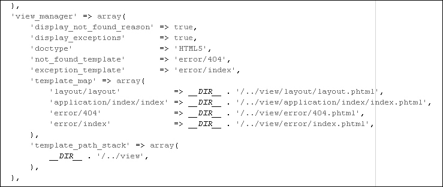
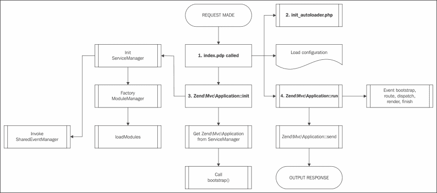

# 附录 A. 设置基本要素

在附录中，我们将涵盖：

+   确保你拥有所有你需要的东西

+   下载 Zend Framework 2 并查找其文档

+   Composer 及其在 Zend Framework 2 中的用途

+   基本 Zend Framework 2 结构

+   关于存储适配器和模式

# 确保你拥有所有你需要的东西

Zend Server 是一款优秀的软件，通过安装我们需要的所有东西（或者至少提供一个良好的平台）来从我们的手中解脱出来，以便编码 Zend Framework 2（以及 Zend Framework 1！）应用程序。尽管 Zend Server 的付费版本可能对于生产应用程序不是必需的，但在 Zend Server 的开发版本中进行开发是一种纯粹的乐趣，因为它将提供系统的适当概述、日志、配置以及我们需要了解的一切。

我们选择通过安装 Zend Server 社区版来走便宜的路，它安装了我们使用 Zend Framework 和 Zend Framework 2 所需的所有东西。关于 Zend Server 的好处不仅在于安装的简便性，还在于服务器本身提供的庞大工具集。这是一款很好的产品，可以了解任何 PHP 相关的配置，并且还能够监控性能和跟踪系统中的事件。

为了安装 Zend Server，我们首先需要从 Zend 网站([`www.zend.com`](http://www.zend.com))下载它，目前 Zend Server 6.2.0 是该应用程序的最新版本，尽管我们使用它，但安装过程对于任何后续版本都应该是相同的。

### 小贴士

Zend Server 不是运行 Zend Framework 2 所必需的，但它确实提供了一个优秀的平台，只需要进行最小配置就可以开始使用。

## 在 Linux 环境中安装 Zend Server 社区版

当我们下载了 Linux 版本的 Zend Server（你需要一个免费的 Zend 账户来下载他们的任何软件）时，我们将有一个名为`ZendServer-6.2.0-RepositoryInstaller-linux.tar.gz`的文件。

接下来，为了安装 Zend Server，我们需要执行以下命令序列：

```php
$ tar -xf ZendServer-6.2.0-RepositoryInstaller-linux.tar.gz

```

这将解压 Gzipped Tarball（这是一种压缩方法）包，并将其提取到`ZendServer-RepositoryInstaller-linux`目录中。现在让我们安装 Zend Server：

```php
$ cd ZendServer-RepositoryInstaller-linux/
$ sudo ./install_zs.sh 5.4

```

我们选择安装 PHP 5.4，如果没有合理的解释说明为什么我们需要 PHP 5.3，我们建议保持在这个版本。如果我们需要 PHP 5.3，我们可以轻松地将 5.4 改为 5.3，并且它会安装较低的 PHP 版本。一旦我们以 root 用户身份执行`install_zs.sh`命令（因此，使用`sudo`，它告诉系统我们想要以超级用户身份执行命令），我们将得到一个简短的确认窗口，询问我们是否真的想要安装 Zend Server。只需按*Enter*键继续安装。

在安装过程中某个时刻，脚本会询问你是否想要安装 X 数量的新包。你想要回答`Y`或`yes`，否则安装将在这里结束。

安装本身只需要几分钟，安装成功后，脚本将显示以下信息：

### 注意

```php
********************************************************
* Zend Server was successfully installed.              *
*                                                      *
* To access the Zend Server UI open your browser at:   *
* https://<hostname>:10082/ZendServer (secure)         *
* or                                                   *
* http://<hostname>:10081/ZendServer                   *
********************************************************

```

在安全方面，最好始终使用 Zend Server 的安全版本，因为您想确保密码被安全地存储。然而，在本地工作的时候，这并不是特别重要。

## 在 Windows 环境下安装 Zend Server 社区版

当我们下载了针对 Microsoft Windows 的 Zend Server（您需要免费的 Zend 账户来下载他们的任何软件）并启动了`ZendServer-6.2.0-php-5.4.21-Windows_x86.exe`文件后，我们发现自己又遇到了一个非常简单的安装。如果我们选择自定义安装，我们可以更改一些选项，但通常默认选项对我们来说已经足够好了。

Windows 环境下安装 Zend Server 的另一个优点是，安装程序会询问我们是否想使用现有的 IIS 网络服务器或安装 Apache 服务器。

您选择哪个选项完全取决于整个项目的配置要求，假设我们有更多的要求；否则，我们真的需要重新考虑是否使用 Windows 作为我们的 PHP 环境。

在即将开始的安装摘要屏幕之后，安装将继续并配置系统。如果安装成功完成，我们将有选项开始使用 Zend Server 并将 Zend Server 添加到桌面图标。

## 首次运行 Zend Server

如果我们第一次在浏览器中访问 Zend Server 界面（请注意，Windows 版本的 Zend Server 没有内置安全连接，就像 Linux 版本那样），我们将看到许可协议，我们需要接受它才能继续。

在下一屏幕中，根据 Zend Server 的目的，我们需要在开发、单服务器或集群许可之间进行选择。单服务器和集群许可都附带 30 天的试用版，如果我们是 Zend Server 的新用户，那么这是查看服务器全部功能的最优选项。

接下来是设置管理员和开发者密码。如果我们不是唯一一个在服务器环境中工作的人，最好使用单独的账户，因为这会在组织中创建更好的维护结构；如果只有一个人（或账户）能够更改系统设置，那么我们可以直接跳过填写开发者详细信息，因为它们实际上并没有什么用处。

一旦我们完成了所有这些，我们就可以准备在我们的全新系统中首次登录。

默认情况下，登录管理面板的 URL 是非安全面板的`http://localhost:10081/ZendServer`，而对于安全管理面板则是`https://localhost:10082/ZendServer`。

我们首先看到的是服务器健康状况概述，它还显示了当前发生的事件，如高内存使用、异常和缓慢的执行时间。

我们现在想查看的主要部分是 PHP 配置，它可以在 **配置** 屏幕下的 **PHP** 下找到。为 PHP 设置时区非常重要，否则 PHP 会通过警告来打扰我们（原因：因为一些应用程序开发者错误地认为机器运行在他们的本地时区，并将许多日期和时间代码基于此），告诉我们应该设置它。如果我们搜索屏幕右上角的搜索栏中的 `date.timezone`，它将立即带我们去（并突出显示）我们需要更改的设置。我们可以在互联网上轻松搜索我们特定时区的相关值；例如，可以是 `Europe/London` 或 `America/New_York`。

## 参见

+   PHP 手册：这是一个支持时区的列表 [`php.net/manual/en/timezones.php`](http://php.net/manual/en/timezones.php)

# 下载 Zend Framework 2 和查找其文档

让我们来了解一下获取所有关于 Zend Framework 的关键文献的地方。

## 查找 Zend Framework 2

Zend Framework 2 的官方网站是 [`framework.zend.com`](http://framework.zend.com)，并且始终包含有关 Zend Framework 2 的最新信息。我们可以轻松地从那里下载框架，以及一些包，例如包含 Zend Server 的框架，或者 Zend Framework 的最小包。

仅下载框架本身，而不包含任何上下文，如骨架应用程序，是从头开始构建应用程序的好方法，无需携带默认骨架带来的任何杂乱。

## 在 phpcloud 中编码

由 Zend 制造的新玩具目前仍处于测试阶段，是 phpcloud，它允许开发者创建一个快速可靠的开发环境，以便开发者进行开发。使用 phpcloud 的一个特性是它不仅包含 Zend Framework 2，而且运行在 Zend Server 上，这允许出色的调试能力和应用程序部署。目前注册 phpcloud 是免费的，但我们预计这将在未来发生变化。然而，结果如何，我们目前还不知道。

## 文档和入门指南

Zend Framework 2 的文档幸运地比原始的 Zend Framework 文档（这确实是个好事，请相信我）要可靠得多。Zend 真正致力于创建一个文档详尽且拥有强大社区和如 Github（而不是原始框架中的 Subversion）支持的开放贡献的框架。文档和入门指南都可以在主 Zend Framework 2 网站的 **学习** 菜单选项下找到。

## 参见

+   可以在 [`framework.zend.com`](http://framework.zend.com) 找到主要的 Zend Framework 2 网站。

+   在 [`framework.zend.com/wiki/x/yQCvAg`](http://framework.zend.com/wiki/x/yQCvAg) 可以找到 Zend Framework 2 编码标准。

+   在 [`media.readthedocs.org/pdf/zf2/latest/zf2.pdf`](https://media.readthedocs.org/pdf/zf2/latest/zf2.pdf) 可以找到最新的 Zend Framework 2 文档 PDF。

+   在 [`framework.zend.com/security/feed/`](http://framework.zend.com/security/feed/) 可以找到 Zend Framework 2 安全 RSS Feed。

+   在 [`framework.zend.com/blog/feed-rss.xml`](http://framework.zend.com/blog/feed-rss.xml) 可以找到 Zend Framework 2 博客的 RSS Feed。

# Composer 和其在 Zend Framework 2 中的用途

Composer 是一个 PHP 依赖管理工具，自 2011 年春季以来一直活跃，在轻松设置项目时非常方便。

Composer 从名为 `composer.json` 的文件中读取其配置，这是一个由 `composer.phar`（PHP 归档）读取的 JSON 文件。

当我们使用 Zend Framework 2 骨架应用时，可以使用 Composer 初始化 Zend Framework 2 库。Zend Framework 2 中的其他功能包括安装新的模块或库，我们可以使用这些来扩展我们的应用。

## `composer.json` 文件

如果我们打开 `composer.json` 文件，我们可以看到文件定义了一些键，这些键告诉 Composer 需要加载什么，以及需要哪些版本。默认情况下，Zend Framework 2 骨架应用的 `composer.json` 将类似于以下内容：

```php
{
    "name": "zendframework/skeleton-application",
    "description": "Skeleton Application for ZF2",
    "license": "BSD-3-Clause",
    "keywords": [
        "framework",
        "zf2"
    ],
    "homepage": "http://framework.zend.com/",
    "require": {
        "php": ">=5.3.3",
        "zendframework/zendframework": ">2.2.0rc1",
    }
}
```

如我们所见，这个文件很容易理解，键也很容易解释，但为了确保我们理解正在发生的事情，我们将快速浏览它们。

+   `name`: 这是带有供应商名称作为前缀的包名，在这种情况下，供应商是 `zendframework`，而 `skeleton-application` 是包名。

+   `description`: 这段简短描述告诉我们这个包的功能。

+   `license`: 这是软件的许可协议，通常这是众多开源/软件许可协议之一，如 BSD、GPL 和 MIT 许可协议。然而，在 'proprietary' 键下也有可用的闭源软件许可协议。

+   `keywords`: 这是一个关键词数组，用于在 getcomposer.org 网站上搜索此包时使用。

+   `homepage`: 这一点非常清楚，不是吗？

+   `require:` 现在变得有趣了，因为它将告诉 Composer 我们需要运行我们的包的确切内容。在这种情况下，它是一个包含 PHP 的数组，我们需要版本 5.3.3 或更高版本，以及 Zend Framework 2 版本 2.2.0rc1 或更高版本。请注意，然而，在生产环境中，我们应该始终避免使用 dev 版本或带有大于符号的包，因为这可能会破坏我们的应用。请记住，在将应用上线时，始终获取所需的精确版本。

虽然这里没有明确说明，但 Composer 总是将 Zend Framework 2 安装到 vendor 目录，因为 `composer.json` 中所需的部分说明我们需要 `zendframework/zendframework` 来运行我们的应用程序。Composer 知道它需要安装到 vendor 目录，因为 `zendframework/zendframework` 包的类型是库，而这种类型总是被 Composer 复制到 vendor 目录。

## 升级包

有时候我们只想更新我们的库，例如，当我们知道 Zend Framework 2 的库中已经解决了某个错误，并且我们真的想要它。幸运的是，Composer 提供了一个出色的自更新和更新命令，我们可以使用。

要通过 Composer 自动更新我们的库，我们应该在终端中执行以下命令（这不能通过网页浏览器正确完成）：

```php
$ php composer.phar self-update

```

首先，我们想要确保我们使用的是最新的 Composer，因为使用过时的 Composer 可能会引发不必要的错误。

```php
$ php composer.phar update

```

这将更新我们放在 `composer.json` 的 `require` 部分中的所有包，以更新到最新（兼容）版本。然而，我们应该小心，当我们想要安装新包，但不更新其他包时，我们应该使用以下命令：

```php
$ php composer.phar update vendor-name/package-name

```

在这里，`vendor-name` 和 `package-name` 是我们想要安装的包的名称。

Composer 之所以能工作，是因为所有包都在其网站上注册了 [getcomposer.org](http://getcomposer.org)。在网站上，他们把所有包放在一起，每次我们尝试更新或安装时，`composer.phar` 都会连接到网站并检索最新的包。

当我们创建自己的模块或库时，我们也可以将其提交到 composer 网站。提交到 composer 的网站将创建一个更好的社区，并在我们开始开发某些应用程序时，更好地理解所需的依赖关系。

## 参见

+   Composer 的官方网站 [`getcomposer.org`](http://getcomposer.org)

# 基本 Zend Framework 2 结构

当我们考虑 Zend Framework 2 结构时，我们必须意识到，只要我们在配置中告诉 Zend Framework 2 所有路径的位置，Zend Framework 2 实际上并不关心我们的目录结构看起来如何。

在骨架应用程序中，我们看到我们的配置可以在 `config/application.config.php` 文件中找到。但那个文件仅仅存在于那里，因为 `public/index.php` 中正在加载它。如果我们，例如，想要将配置文件的存储位置更改为其他地方，我们（在这种情况下）只需要在 `public/index.php` 文件中更改它。同样，对于模块和 vendor 目录也是如此，因为它们可以放在我们喜欢的任何地方，只要我们告诉 `application.config.php` 文件确切的位置即可。

如果我们想更改公共目录，我们可以安全地将其更改为我们想要的任何名称，只要我们告诉我们的 Web 服务器新的`DocumentRoot`在哪里。显然，构建一个好的结构当然是成功应用的关键，因此骨架应用被创建出来。但这并不意味着不同的结构要求必须让我们停止使用 Zend Framework 2，因为框架可以被完全配置以满足这些要求。

然而，我们可以假设，因为我们正在使用由 Zend 提供的骨架，它为我们提供了一个非常优化的结构，以便我们开发。

当我们列出我们骨架应用的初始文件夹时，我们注意到一些以下重要对象：

+   `config`

+   `module`

+   `public`

+   `vendor`

+   `init_autoloader.php`

正如我们所见，我们的文件夹中有许多对象，但这些对我们基本应用没有显著的重要性。

## 文件夹 – config

`config`文件夹默认包含以下对象：

+   `autoload/`

+   `global.php`

+   `local.php.dist`

+   `application.config.php`

在这个文件夹中，最关键的文件可能是`application.config.php`，因为它包含了我们所有的主要配置选项。如果我们打开这个文件，我们可以看到它设置了一些选项，使我们的应用能够工作。

该文件包含，例如，`modules`键，它告诉框架我们需要为我们的应用加载哪些模块。它还包含`module_listener_options - module_paths`，它告诉我们的框架在哪里可以找到我们的模块和库，默认情况下是哪些模块和供应商。

`config`文件夹还包含一个`autoload`文件夹，该文件夹本身包含两个文件，一个是全局配置覆盖文件，另一个是本地配置覆盖文件。这两个文件默认都是空的。

## 文件夹 – module

默认的`module`文件夹包含以下重要对象：

+   `Application/config/`**module.config.php**

+   `Application/language/src/Application/Controller/`**IndexController.php**

+   `Application/src/Application/Controller/`**IndexController.php**

+   `Application/view/Application/index/`**index.phtml**

+   `Application/view/Application/error/`**404.phtml**

+   `Application/view/Application/error/`**index.phtml**

+   `Application/view/Application/layout/`**layout.phtml**

+   `Application/`**Module.php**

应用模块提供了我们创建新模块时希望看到的基本结构。我们在这里看到的最重要文件是`Module.php`，它告诉框架我们的模块是如何构建的，它可以在哪里找到我们的控制器，以及更多。

根据我们的应用程序是如何构建的，我们也希望为每个模块有一个配置文件，因为我们希望尽可能保持应用程序的动态性。在骨架应用程序中，我们可以看到我们的`Module.php`包含一个名为`Module::getConfig()`的方法；它所做的只是简单地包含到`config/module.config.php`文件中。虽然理论上我们可以在`Module.php`中直接定义配置，但如果我们将实际的配置文件与代码分开，会更好一些，因为这样也带来了更多的可维护性，如果我们不需要更改代码来简单地更改配置。

我们还可以在这个文件夹中看到一个`language`文件夹，它包含翻译我们的应用程序所需的全部 i18n（国际化的缩写，因为它在 I 和 N 之间有 18 个字符）文件。尽管可能被许多开发者使用，但并非我们的所有应用程序都需要翻译，所以我们可能根本不需要在我们的项目中使用这个文件夹。

但如果我们确实需要`i18n`和`l10n`（本地化），那么按模块而不是按应用程序来做会更有益，这同样是为了可维护性，因为我们不希望整个应用程序（即整个应用程序）为所有模块定义`i18n/l10n`，因为理论上并非所有模块都必须存在。这就是为什么以模块为导向的工作可以使代码更加动态，同时也更加可维护，因为我们可以安全地假设，如果我们的模块中发生错误，问题也出在那个模块中。

下一个文件夹`src`可能是我们模块中最有趣的文件夹之一，因为它包含——正如我们可能猜测的那样——我们模块的源代码。`src`文件夹只包含另一个名为`Application`的文件夹，这是其中类定义的命名空间。

确保您在`src`中的子目录命名与它们使用的命名空间相匹配。否则，这不仅可能导致冲突，还可能导致混淆和不一致。例如，如果您的模块名为`Winter`，那么我们的目录应该被称为`src/Winter`，以确保所有我们的`Winter`命名空间都在该目录中。这样我们就可以安全地假设所有针对该命名空间的代码都整洁地放在该目录及其子目录中。

在`Application`子文件夹中，我们可以在我们的骨架应用程序`Controller`中找到它，该文件夹只包含`IndexController.php`。`IndexController.php`是`Zend\Mvc\Controller\AbstractActionController`的扩展，通常用于我们的日常控制器；然而，在同一个命名空间中，还有一个`AbstractRestfulController`，如果我们想创建一个 RESTful 服务，我们可以使用它。

接下来是`view`文件夹，它包含了我们所有的视图脚本。视图脚本基本上是我们用来向请求页面的用户实际显示的模板文件。正如我们在`Application`模块的默认`module.config.php`文件中所看到的，我们已经将视图脚本配置为指向`view`目录，这告诉框架当它需要查找任何视图脚本时，应该查看该文件夹。



正如我们所看到的，`view`文件夹的结构与配置文件中的结构相同。`Application`文件夹指的是使用此视图脚本的命名空间，即`Application`，然后我们看到还定义了一个布局，它用作我们模块的全球布局——如果没有在其他地方定义，则用于整个项目——以及一个`error`文件夹，它仅在应用程序发生错误时使用。如果我们想了解更多关于 Zend Framework 2 中布局如何工作的信息，你应该查看第四章，*使用视图*。

### 小贴士

`layout`文件夹和`error`文件夹通常被认为是项目的主体模板文件。但这并不意味着我们只能定义一个布局；我们只需要在我们的模块文件中定义另一个布局配置，这样就可以使特定的模块与其他模块不同。

这就完成了我们的`module`文件夹的构建，当创建其他模块——使用骨架应用程序时——它要求我们使用相同的文件夹结构。

### 文件夹 – public

`public`文件夹包含所有公众可能看到的文件。我们需要确保我们的应用程序是安全的，所以我们只会将图片、样式表和 JavaScript 文件放在这里。这里与框架相关的唯一文件将是`index.php`文件，因为这是初始化我们的应用程序的文件，并且仅在 HTTP 请求时使用。虽然我们可以在这里放置 PHP 文件，但我们强烈建议不要这样做，因为它可能会使你的项目容易受到漏洞的攻击。

### 文件夹 – vendor

`vendor`文件夹包含——正如其名所示——由第三方制作的库。在我们的默认项目中，这只会包含运行项目所需的 Zend Framework 2 库（位于`zendframework/library`文件夹中）。无论何时我们要使用像`Smarty`或`Doctrine`这样的第三方库，这些库都将被放置在这里。

### 小贴士

如果我们有一个非应用程序特定的自定义库（或可以成为），我们建议也将它放在这里，特别是如果库在其他地方维护的话。一旦我们开始在其他文件夹中散布我们的库，几乎不可能保持一致性和可维护性。

### 文件 – init_autoloader.php

`init_autoloader.php`文件确保我们的项目可以找到我们试图使用的类和命名空间。它由`public/index.php`文件调用。

为了让 Zend Framework 2 启动并配置自身，会发生一系列操作。如果我们使用骨架应用程序，可以假设以下信息流：

+   `/public/index.php`: 这是将要运行的第一个文件，因为它是与应用程序相关的唯一公共脚本文件。当运行时，该脚本会将根目录中的`init_autoloader.php`包含到脚本中，然后初始化 Zend Framework 2。

+   `/init_autoloader.php`: 这个文件确实做了它所说的，初始化了自动加载器。Zend Framework 2 最好的特性之一是自动加载器的扩展性。这个文件所做的只是确保在初始化应用程序之前，自动加载器已经知道我们使用的大多数命名空间和类（但尚未加载），这样自动加载器就可以在需要时简单地加载类。尽管骨架应用程序有一个非常懒惰的自动加载器，我们不应该以这种形式使用它，但在生产环境中，它可以是一个非常强大的工具，为您的应用程序创建最佳性能。

### 接下来是什么？

在`public/index.php`加载了已知类和命名空间的位置后，它就准备好启动 Zend Framework 2 MVC 应用程序。

1.  获取`config/application.config.php`文件。实际上，目前这个文件并没有对这个文件做任何事情。

1.  运行`Zend\Mvc\Application::init($configurationArray)`，其中`$configurationArray`是包含从步骤 1 读取的配置的变量。

    +   `ServiceManager`的初始化，它处理应用程序中的所有服务。

        调用`Zend\EventManager\SharedEventManager`。

        工厂`Zend\ModuleManager\ModuleManager`。

    +   从`ServiceManager`请求`ModuleManager`并运行其`loadModules()`方法。

    +   这将解决所有模块并加载模块特定的配置。

    +   从`ServiceManager`请求`Zend\Mvc\Application`。

    +   它将运行`bootstrap()`方法。

1.  `public/index.php`现在将在完全初始化的`Zend\Mvc\Application`上执行`run()`方法，这将确保路由触发引导、路由、调度、渲染和完成事件，确保应用程序完成了所请求的操作。

1.  在`Zend\Mvc\Application`完成其`run()`方法后，它将执行`send()`方法，该方法将`run()`方法生成的输出发送回客户端。

这里有一个流程图来展示这个过程如何更直观地展示：



# 关于存储适配器和模式

不同的存储适配器和模式是我们在缓存适配器中实现不同功能以及在不同平台上存储数据（例如，文件系统或仅内存中）的极好方式。这个配方将告诉我们 Zend Framework 2 中所有默认工具的详细信息。

## 存储适配器的实现

ZF2 中的存储适配器是用于实际缓存我们数据的适配器，这意味着它们还控制数据的存储方式。存储适配器始终实现`Zend\Cache\Storage\StorageInterface`，它包含存储适配器需要遵守的基本功能。大多数存储适配器也扩展自`Zend\Cache\Storage\Adapter\AbstractAdapter`，但无法保证这一点。除了`StorageInterface`之外，存储适配器通常还实现表示增强功能的额外接口。这些实现显然在适配器的功能中扮演着至关重要的角色，因此我们认为最好列出适配器可以使用的、由框架定义的实现列表。

+   `AvailableSpaceCapableInterface`：此接口提供了一个检查缓存可用空间的方法。

+   `Capabilities`：此接口提供了检查存储适配器功能的方法，例如缓存的最小和最大 TTL（生存时间）或支持的数据类型（布尔值、字符串、对象等）。

+   `ClearByNamespaceInterface`：此接口定义了一个可以通过给定命名空间清除缓存的方法。

+   `ClearByPrefixInterface`：此接口定义了一个可以通过给定前缀清除缓存的方法。

+   `ClearExpiredInterface`：此接口提供了一个清除过期缓存项的方法。

+   `FlushableInterface`：此接口能够刷新整个缓存。

+   `IterableInterface`：此接口提供了遍历缓存项的功能。对于使用`foreach`遍历它们来说非常方便！

+   `OptimizableInterface`：此接口提供了优化缓存的能力。

+   `TaggableInterface`：此接口提供了获取和设置特定缓存项标签的方法，以及通过某个标签删除所有缓存项的能力。

+   `TotalSpaceCapableInterface`：此接口有一个返回缓存总空间的方法。

## 存储适配器

现在我们知道了适配器可能实现的接口，是时候给出`Zend\Cache\Storage\Adapter`命名空间中可用的存储适配器的完整列表了。

### Apc 缓存

Apc 或替代 PHP 缓存是一个广为人知的框架，它大量优化 PHP 输出并将编译后的 PHP 代码存储在共享内存中。这样，一些操作码（操作代码）就不需要重新编译，因为它们已经准备好立即使用。Apc 适配器也扩展自`AbstractAdapter`。

此适配器实现了以下接口：

+   `AvailableSpaceCapableInterface`

+   `ClearByNamespaceInterface`

+   `ClearByPrefixInterface`

+   `FlushableInterface`

+   `IterableInterface`

+   `TotalSpaceCapableInterface`

### 小贴士

此适配器只能在 PHP 中启用了 APC 扩展的情况下才能工作，请在尝试之前确保它已启用。

### Dba 缓存

您想将缓存存储在预关系 dbm 数据库中，那么这就是您的机会！此适配器可以将所有内容整齐地存储在漂亮的数据库中。此适配器还扩展了`AbstractAdapter`。

此适配器实现了以下接口：

+   `AvailableSpaceCapableInterface`

+   `ClearByNamespaceInterface`

+   `ClearByPrefixInterface`

+   `FlushableInterface`

+   `IterableInterface`

+   `OptimizableInterface`

+   `TotalSpaceCapableInterface`

### 提示

此适配器在能够工作之前需要在 PHP 中启用 dba 扩展，请确保它已启用。

### 文件系统缓存

文件系统缓存是个人最喜欢的，将缓存存储在古老的文件系统中，这是一个快速且通常可靠的存储位置。此适配器还扩展了`AbstractAdapter`。

此适配器实现了以下接口：

+   `AvailableSpaceCapableInterface`

+   `ClearByNamespaceInterface`

+   `ClearByPrefixInterface`

+   `ClearExpiredInterface`

+   `FlushableInterface`

+   `IterableInterface`

+   `OptimizableInterface`

+   `TaggableInterface`

+   `TotalSpaceCapableInterface`

### 提示

这听起来非常明显，但请确保我们对我们想要存储缓存的目录有写权限。

### Memcached 缓存

Memcached 适配器将缓存存储在内存中，这对于存储不经常更改的静态文件来说是一个很好的方法，可以被认为是半静态的。此适配器还扩展了`AbstractAdapter`。请注意，Memcached 不受 PHP 内存限制设置的约束，因为 Memcached 将内存存储在 PHP 进程之外，在其自己的 Memcached 进程中。

此适配器实现了以下接口：

+   `AvailableSpaceCapableInterface`

+   `FlushableInterface`

+   `TotalSpaceCapableInterface`

### 提示

我们需要`memcached`PHP 扩展才能通过此适配器进行缓存。请确保在您的系统上已安装并启用了该扩展。

### 内存缓存

内存适配器将所有缓存存储在 PHP 进程中，与 Memcached 适配器相比，后者将所有缓存存储在外部 Memcached 进程中。此适配器还扩展了`AbstractAdapter`。

此适配器实现了以下接口：

+   `AvailableSpaceCapableInterface`

+   `ClearByPrefixInterface`

+   `ClearByNamespaceInterface`

+   `ClearExpiredInterface`

+   `FlushableInterface`

+   `IterableInterface`

+   `TaggableInterface`

+   `TotalSpaceCapableInterface`

### Redis 缓存

Redis 是一个键值数据存储，将数据存储在内存中，这做得非常好，肯定是一个值得使用的缓存方法。此适配器还扩展了`AbstractAdapter`。

此适配器实现了以下接口：

+   `FlushableInterface`

+   `TotalSpaceCapableInterface`

### 提示

如果我们要使用此缓存适配器，我们需要确保已加载`redis`扩展，否则此存储适配器无法使用。请确保已安装并启用了该扩展。

### 会话缓存

会话存储适配器使用会话来存储我们的缓存。虽然对于每次只有一个用户来说很方便，但这种方法对于查看相同页面的用户来说并不真正有效，因为它每次用户启动会话时都会构建缓存。此适配器还扩展了 `AbstractAdapter`。

此适配器实现了以下接口：

+   `ClearByPrefixInterface`

+   `FlushableInterface`

+   `IterableInterface`

### WinCache 缓存

WinCache 是一个在 Microsoft Windows 服务器上运行 PHP 时非常有用的优秀适配器。WinCache 支持 opcache 缓存、文件系统缓存和相对路径缓存。此适配器还扩展了 `AbstractAdapter`。

此适配器实现了以下接口：

+   `AvailableSpaceCapableInterface`

+   `FlushableInterface`

+   `TotalSpaceCapableInterface`

### 提示

对于此方法，需要加载 `wincache` 扩展，并且如果这还不够，您还需要在 Microsoft Windows 上运行，才能使用此功能。

### XCache 缓存

XCache 是一个适配器，它利用 PHP 中的 XCache 模块，类似于 APC 的另一个缓存适配器，它是一个快速的 opcache 缓存器，非常有用。此适配器还扩展了 `AbstractAdapter`。

此适配器实现了以下接口：

+   `AvailableSpaceCapableInterface`

+   `ClearByNamespaceInterface`

+   `ClearByPrefixInterface`

+   `FlushableInterface`

+   `IterableInterface`

+   `TotalSpaceCapableInterface`

### 提示

此适配器要求在 PHP 中加载并启用 XCache 扩展。在使用适配器之前，请确保这是正确的。

### ZendServerDisk 缓存

ZendServerDisk 适配器是 Zend Server 应用程序提供的一个优秀的文件系统缓存适配器。如果我们已经安装了 Zend Server，那么此适配器是存储缓存在文件系统上的一个好方法，因为它与 Zend Server 集成得非常好。此适配器还扩展了 `AbstractAdapter`。

此适配器实现了以下接口：

+   `AvailableSpaceCapableInterface`

+   `ClearByNamespaceInterface`

+   `FlushableInterface`

+   `TotalSpaceCapableInterface`

### 提示

要使此适配器工作，您需要安装 Zend Server，否则它将抛出异常。

### ZendServerShm 缓存

ZendServerShm 适配器也要求我们安装 Zend Server，但如果我们已经安装并且我们想在共享内存（shm）中缓存项目，那么这是一种非常棒的方法，因为此适配器与 Zend Server 集成得非常好。此适配器还扩展了 `AbstractAdapter`。

此适配器实现了以下接口：

+   `ClearByNamespaceInterface`

+   `FlushableInterface`

+   `TotalSpaceCapableInterface`

### 提示

要使此适配器工作，您需要安装 Zend Server 以使此适配器工作，否则它将抛出异常。

## 缓存模式

当我们开始缓存时，我们很快就会发现自己处于与性能相反的情况，而我们只是想让一切更快。这就是为什么在 ZF2 中有一些被称为缓存模式的类，这些类是为了我们在想要克服一些常见问题时使用的。

就像适配器一样，模式也是接口的实现；在这种情况下是`PatternInterface`。而且因为我们通常也想要一些基本功能，所以大多数模式也扩展自`AbstractPattern`类。

模式的选项通过`PatternOptions`类定义，这将在稍后进一步解释。

### CallbackCache 模式

我们想要的是回调还是缓存？有时我们确实不知道，所以我们将让模式自己决定！`CallbackCache`模式首先确保我们的回调结果已经定义在缓存中，如果是的话，就返回它。如果结果尚未在缓存中，它将调用我们的回调函数，将输出放入结果中，然后返回它。无论如何，第二次处理该回调时，我们将得到我们的缓存。所以如果这是一个长时间运行的方法，我们不需要再次执行代码，这将大大加快速度。

此模式还考虑了该回调的参数，这意味着你实际上不必过多担心回调会给你提供错误的结果！

此模式使用`AbstractPattern`类。

### CaptureCache 模式

`CaptureCache`模式通过启动`ob_start()`和`ob_implicit_flush()`来捕获我们发送到浏览器的输出。然后我们可以在每次发送输出时检查缓存是否存在，这样我们就可以显示输出而不是生成它。

此模式使用`AbstractPattern`类。

### 小贴士

此模式在定义后不会自动输出缓存，开发者在使用 start 方法之前需要首先获取缓存。如果我们希望在生成新内容之前输出已存在的缓存，我们应该使用`OutputCache`模式。

### ClassCache 模式

`ClassCache`模式缓存类方法调用的输出，并返回该输出而不是实际调用。但当然，这只有在缓存实际可用时才会发生，否则它将只执行方法调用并缓存结果。类名（而不是对象）需要设置在`PatternOptions::setClass`中以使其工作。

此模式使用`AbstractPattern`类。

### ObjectCache 模式

`ObjectCache`模式缓存对象，可以在检索时调用其方法，如果我们有需要长时间持久化的对象，这非常方便。对象需要设置在`PatternOptions::setObject`中以使其工作。

此模式使用`AbstractPattern`类。

### OutputCache 模式

`OutputCache` 模式如果定义了缓存，则会输出缓存。如果没有定义，则 `OutputCache` 会缓存输出并在脚本结束（或调用结束方法，以先到者为准）时设置缓存。

此模式使用 `AbstractPattern` 类。

### `PatternOptions` 模式

`PatternOptions` 模式可以用来设置或从模式中获取选项（分别对应 `setOptions` 和 `getOptions`）。对于大多数模式，在使用模式之前通常需要设置某种形式的选项。例如，考虑 `setStorage` 方法，因为模式在实际上存储东西之前需要知道存储适配器。

## 解释差异

存储适配器存储和检索缓存数据。我们可以设置选项来确定有效期的长度，或者检查缓存是否已满，但我们不能确定它是如何存储的，因为这是适配器工作描述的一部分。

然而，模式本身并不存储任何内容。它们通过检查缓存是否已经存在，或者缓存是否是我们期望的（例如，当我们使用不同的方法调用或不同的参数时）来确定是否需要存储任何内容。它们确实会告诉适配器它们想要检索和存储的内容，这样适配器就可以找出如何从实际存储中再次检索它。

在开发者的眼中，我们更愿意在使用适配器之前使用模式，因为我们不希望过多地干扰适配器，如果已经有模式为我们做了大部分工作的话。
