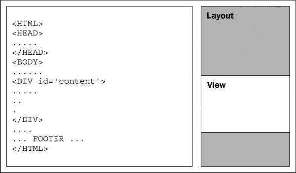
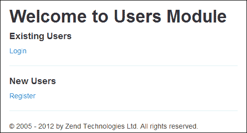
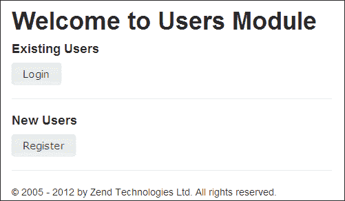
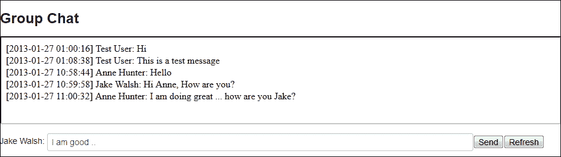
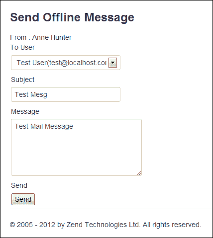
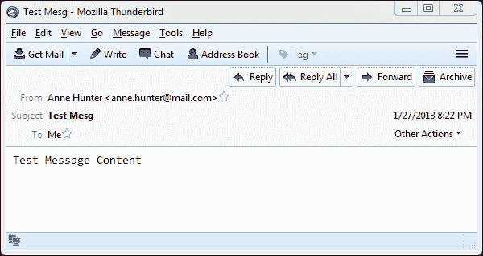
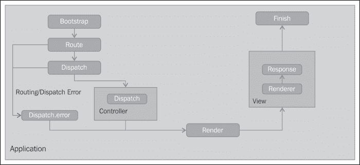
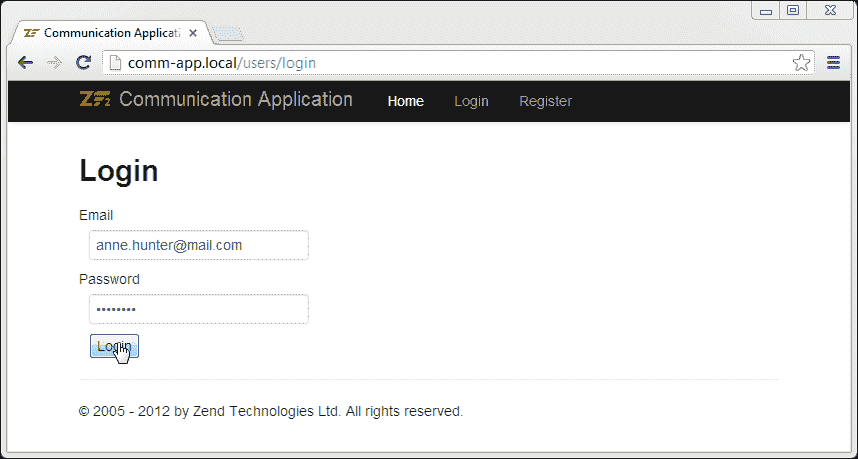
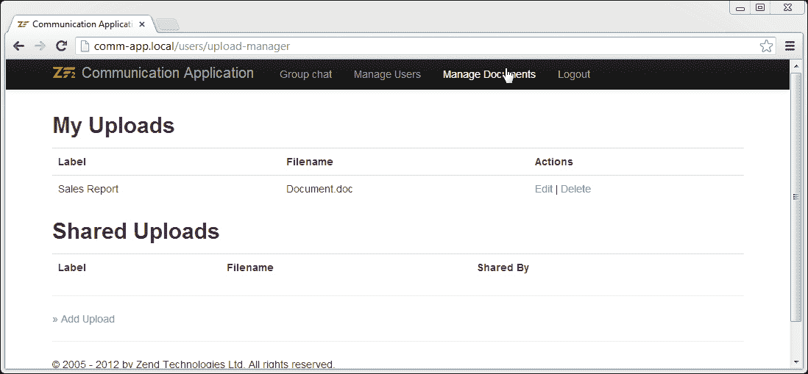

# 第五章：聊天和电子邮件

*在任何 Web 应用程序开发中，都将非常依赖客户端脚本，主要包括 JavaScript 和 CSS。Zend Framework 的 MVC 模型提供了对发送到浏览器输出的基本支持。Zend Framework 2 中的视图辅助工具类提供了对在客户端浏览器中渲染的内容的最大控制。*

在本章中，我们将专注于构建一个简单的群聊和电子邮件组件，该组件将利用 Zend Framework 2.0 的各种前端功能。本章涵盖的一些重要主题包括：

+   在 Zend Framework 2 应用程序中使用外部 JavaScript 库

+   使用 Zend Framework 2 和 JavaScript 实现一个简单的群聊应用程序

+   使用 Zend\Mail 发送电子邮件

+   Zend Framework 事件管理器简介

# 布局和视图

Zend Framework MVC 使用布局和视图在浏览器中渲染页面；整体页面内容由布局规范控制，视图级别的信息包含在视图中。其概念是尽量减少为每个视图生成冗余 HTML 代码的数量。

通过使用布局，应用程序可以拥有一致的用户界面，这也便于定制；视图提供了修改目标内容的灵活性，并允许最大程度地定制。这也被称为 *两步* 视图。

当生成新的视图时，从 `view_manager` 配置中的布局定义中识别适当的布局，并使用该布局渲染视图。



上述示意图解释了布局和视图是如何组合成 HTML 页面的，因此对于每个视图，视图部分会变化，而布局部分保持静态。

## 视图辅助工具

Zend Framework 2 提供了一系列视图辅助工具，帮助我们执行视图上的复杂操作；如果包含的辅助工具不足，你可以通过实现接口 `Zend\View\HelperInterface` 来定义自己的自定义辅助工具。

在本节中，我们将快速回顾一些包含在 Zend Framework 2 中的辅助工具。

### URL 辅助工具

此辅助工具的语法是 `url($name, $urlParams, $routeOptions = array(), $reuseMatchedParams = array())`。

URL 辅助工具用于生成特定路由的 URL。可以将路由段匹配参数传递给 URL 辅助工具，根据路由选项形成 URL；例如，参见以下：

```php
<a href="<?php $this->url('users/upload-manager', array('action'=>'edit', 'id' =>  10));">Edit</a>
```

如果路由定义如下，此代码将生成 `<a href="/users/upload-manager/edit/10">编辑</a>`：

```php
'route' => '/user-manager[/:action[/:id]]'
```

### BasePath 辅助工具

此辅助工具的语法是 `basePath()`。

`BasePath` 辅助工具返回视图的基本 URL，开发者可以使用它来在其自定义 URL 前面添加，并为各种资源创建链接。

### JSON 辅助工具

此辅助工具的语法是 `json($jsonData = array())`。

JSON 辅助函数用于将 PHP 数组渲染为 JSON 编码的数据。大多数 AJAX 库根据其内容头部分类 JSON 内容，此辅助函数也将内容类型头设置为 `application/json`。

## 具体的占位符实现

Zend 框架利用占位符辅助函数在 HTML `head` 部分执行一些标准操作，包括添加/删除对新 JavaScript 库的引用、链接新样式、添加和交叉引用脚本，以及添加/删除 HTML `head` 部分的 `meta` 内容。

这是通过以下称为**具体占位符辅助函数**的辅助函数列表实现的。之所以称它们为占位符辅助函数，是因为辅助函数本身不会对内容的渲染方式做出任何改变。例如，如果你在 HTML 代码中添加 `<?php echo $this->headLink(); ?>`，这不会做任何事情，直到你通过使用 `appendStylesheet` 或其他函数向 `headLink` 辅助函数添加内容。

### HeadLink 辅助函数

`HeadLink` 辅助函数用于修改 HTML `head` 部分的 `<link>` 标签；此辅助函数用于附加或管理外部 CSS。

在此辅助函数中最常用的函数如下列出：

+   `appendStylesheet($href, $media, $conditionalStylesheet, $extras)`

+   `offsetSetStylesheet``($index, $href, $media, $conditionalStylesheet, $extras)`

+   `prependStylesheet``($href, $media, $conditionalStylesheet, $extras)`

+   `setStylesheet($href, $media, $conditionalStylesheet, $extras)`

### 注意

要在 HTML 布局/视图中渲染 `Link` 标签，请使用以下脚本：

```php
<?php echo $this->headLink(); ?>
```

### HeadMeta 辅助函数

`HeadMeta` 辅助函数用于修改 HTML `head` 部分的 `<meta>` 标签；此辅助函数用于操作 HTML `meta` 信息。

在此辅助函数中最常用的函数如下列出：

+   `appendName($keyValue, $content, $conditionalName)`

+   `offsetSetName($index, $keyValue, $content, $conditionalName)`

+   `prependName($keyValue, $content, $conditionalName)`

+   `setName($keyValue, $content, $modifiers)`

+   `appendHttpEquiv($keyValue, $content, $conditionalHttpEquiv)`

+   `offsetSetHttpEquiv($index, $keyValue, $content, $conditionalHttpEquiv)`

+   `prependHttpEquiv($keyValue, $content, $conditionalHttpEquiv)`

+   `setHttpEquiv($keyValue, $content, $modifiers)`

+   `setCharset($charset)`

### 注意

要在 HTML 布局/视图中渲染 `meta` 标签，请使用以下脚本：

```php
<?php echo $this->headMeta(); ?>
```

### HeadScript 辅助函数

`HeadScript` 辅助函数用于修改 HTML `head` 部分的 `<script>` 标签；此辅助函数用于附加外部 JavaScript 并将 `<script>` 标签添加到 HTML `head` 部分中。

在此辅助函数中最常用的函数如下列出：

+   `appendFile($src, $type = 'text/javascript', $attrs = array())`

+   `offsetSetFile($index, $src, $type = 'text/javascript', $attrs = array())`

+   `prependFile($src, $type = 'text/javascript', $attrs = array())`

+   `setFile($src, $type = 'text/javascript', $attrs = array())`

+   `appendScript($script, $type = 'text/javascript', $attrs = array())`

+   `offsetSetScript($index, $script, $type = 'text/javascript', $attrs = array())`

+   `prependScript($script, $type = 'text/javascript', $attrs = array())`

+   `setScript($script, $type = 'text/javascript', $attrs = array())`

### 注意

要在 HTML 布局/视图中渲染 `Script` 标签，请使用以下脚本：

```php
<?php echo $this->headScript(); ?>
```

### HeadStyle 辅助工具

`HeadStyle` 辅助工具用于修改 HTML `head` 部分的 `<style>` 标签；此辅助工具通过向 HTML `head` 部分添加 `<style>` 标签来添加内部样式。

此辅助工具中最常用的函数如下所示：

+   `appendStyle($content, $attributes = array())`

+   `offsetSetStyle($index, $content, $attributes = array())`

+   `prependStyle($content, $attributes = array())`

+   `setStyle($content, $attributes = array())`

### 注意

要在 HTML 布局/视图中渲染 `Style` 标签，请使用以下脚本：

```php
<?php echo $this->headStyle(); ?>
```

### HeadTitle 辅助工具

`HeadTitle` 辅助工具用于在 HTML `head` 部分的 `<title>` 标签中渲染标题；对 `headTitle()` 辅助工具的多次调用会创建一个标题列表，当在布局/视图中输出标签时渲染。可选参数 `$setType` 可以设置为覆盖现有的标题数组，默认为 `APPEND`，可以覆盖为 `PREPEND` 或 `SET`(覆盖)。

此辅助工具的语法是 `headTitle($title, $setType = null);`。

### 注意

要在 HTML 布局/视图中渲染 `Title` 标签，请使用以下脚本：

```php
<?php echo $this->headTitle(); ?>
```

# 使用 jQuery UI 在简单页面中操作的时间

在此任务中，我们将将一些现有的页面转换为使用 jQuery UI 库，并在该页面中使用 jQuery UI 渲染按钮：

1.  查看如下截图所示的现有应用程序主页；我们的下一个任务是转换**登录**和**注册**链接，使其以 jQuery UI 按钮的形式渲染：

    现有的应用程序主页

1.  将 `index` 视图（`module/Users/view/users/index/index.html`）中的**登录**和**注册**链接替换，并将 `ui-button` 类添加到链接中，如下代码片段所示：

    ```php
    <a href="/users/login" class='ui-button'>Login</a>
    <a href="/users/register" class='ui-button'>Register</a>
    ```

1.  在视图的开始处添加对 jQuery UI 的外部引用：

    ```php
    // Attached jQuery UI Scripts
    $this->headScript()
    ->appendFile('http://code.jquery.com/jquery-1.8.3.js','text/javascript');

    $this->headScript()
    ->appendFile('http://code.jquery.com/ui/1.10.0/jquery-ui.js','text/javascript');

    // Attach jQuery UI Styles 
    $this->headLink()->appendStylesheet('http://code.jquery.com/ui/1.10.0/themes/base/jquery-ui.css');
    ```

    ### 提示

    **引用自定义 JavaScript 库**

    除了直接引用外部脚本外，你也可以选择将脚本下载到应用程序的 `/public` 文件夹，并将相对链接作为参数传递给 `appendFile` 和 `appendStylesheet` 函数。你也可以使用 `basePath()` 辅助工具添加基本 URL。

1.  添加一个 UI 初始化脚本以将按钮的外观和感觉应用到链接上：

    ```php
    // UI Initializer for buttons
    $this->headScript()->appendScript(
    '$(function() {
        $("a.ui-button").button();
      });', 'text/javascript');
    ```

1.  现在在浏览器中预览主页，你会看到**登录**和**注册**按钮都使用了 jQuery UI 进行样式化，如下截图所示：

索引页上的 **查看源代码** 链接将揭示 `headScript()` 的应用，如下面的代码所示：

```php
<!DOCTYPE html>
<html lang="en">
...
...
<script type="text/javascript" src="img/jquery-1.8.3.js"></script>
<script type="text/javascript" src="img/jquery-ui.js"></script>
<script type="text/javascript">
    //<!--
    $(function() {
   $("a.ui-button").button();
  });
    //-->
</script>
...
...
</html>
```

## *发生了什么事？*

我们使用了 Zend 框架的视图助手来连接到外部 JavaScript 库；然后我们使用 `headScript()` 视图助手在 HTML `head` 部分添加了自定义 JavaScript。

现在我们已经将我们的应用程序与外部 JavaScript 集成；在下一个练习中，我们将学习更多关于如何将脚本添加到 HTML `head` 部分的内容。

## 尝试一下英雄

在我们继续构建 **群聊** 界面之前，这里有一个简单的任务要你完成。现在你已经了解了如何链接外部 JavaScript 库，你可以从其网站下载 jQuery UI，将其提取到 `public/` 文件夹中，并修改之前列出的页面以使用下载的 jQuery UI 版本。

jQuery UI 可以从 [`jqueryui.com/`](http://jqueryui.com/) 下载。

# 构建简单的群聊

我们接下来的任务是构建一个简单的群聊应用程序，允许多个用户登录到我们的系统并相互聊天。这个工具的后端相当简单。我们需要创建一个表来存储所有用户消息并在单独的视图中渲染它们；我们将创建一个简单的表单，允许用户发送消息。

# 行动时间 - 创建简单的群聊应用程序

1.  创建一个新的 `chat_messages` 表来存储所有用户消息：

    ```php
    CREATE TABLE IF NOT EXISTS chat_messages (
      id INT NOT NULL AUTO_INCREMENT PRIMARY KEY ,
      user_id INT NOT NULL,
      message VARCHAR( 255 ) NOT NULL ,  
      stamp TIMESTAMP DEFAULT CURRENT_TIMESTAMP
    )
    ```

1.  在 `CommunicationApp/module/Users/src/Users/Controller/GroupChatController.php` 中创建一个群聊控制器。

1.  对 `CommunicationApp/module/Users/config/module.config.php` 进行必要的修改，并将新的控制器添加到可调用和路由中：

    ```php
    // Invokable
    'Users\Controller\GroupChat' => 'Users\Controller\GroupChatController',

    // Route
    'group-chat' => array(
      'type'    => 'Segment',
      'options' => array(
        'route'    => '/group-chat[/:action[/:id]]',
        'constraints' => array(
          'action'     => '[a-zA-Z][a-zA-Z0-9_-]*',
          'id'     => '[a-zA-Z0-9_-]*',
        ),
        'defaults' => array(
          'controller' => 'Users\Controller\GroupChat',
          'action'     => 'index',
        ),
      ),
    ),
    ```

1.  在 `CommunicationApp/module/Users/view/users/group-chat/index.phtml` 中创建一个新的视图：

    ```php
    <?php 
    $this->headScript()->appendScript(
    '$(function() {
        $( "#btnRefresh" )
          .click(function( event ) {
      document.getElementById("messageListFrame").contentWindow.location.reload(true);
       })
      });', 'text/javascript');

    $this->headStyle()->appendStyle('
      #userName { width:100px; margin-top:10px; display: inline}
      #messageText { width:700px; margin-top:10px;}
    ');
    ?>
    <h3>Group Chat</h3>
    <iframe src="<?php echo $this->url('users/group-chat', array( 
                            'action' =>  'messageList' 
                        )) ?>" width="80%" height="400px" id="messageListFrame"></iframe>

    <?php 
    // Render the opening tag
    echo $this->form()->openTag($form);

    // ...loop through and render the form elements...
    echo '<label id="userName">'. $userName .': </label>';
    foreach ($form as $element) {
        echo $this->formElement($element);       // <-- Magic!
        echo $this->formElementErrors($element);
    }

    // Render the closing tag
    echo $this->form()->closeTag();
    ?>
    ```

1.  将 `messageList` 动作添加到 `GroupChatController - CommunicationApp/module/Users/src/Users/Controller/GroupChatController.php`；这个动作将查询 `chat_messages` 表并获取该表中的所有记录，并将其传递给视图：

    ```php
    public function messageListAction()
    {
      $userTable = $this->getServiceLocator()->get('UserTable');
      $chatMessageTG = $this->getServiceLocator()->get('ChatMessagesTableGateway');
      $chatMessages = $chatMessageTG->select();

      $messageList = array();
      foreach($chatMessages as $chatMessage) {
        $fromUser = $userTable->getUser($chatMessage->user_id);
        $messageData = array();
        $messageData['user'] = $fromUser->name;
        $messageData['time'] = $chatMessage->stamp;
        $messageData['data'] = $chatMessage->message;
        $messageList[] = $messageData;
      }

      $viewModel  = new ViewModel(array('messageList' => $messageList));
      $viewModel->setTemplate('users/group-chat/message-list');
      $viewModel->setTerminal(true);    
      return $viewModel;
    }
    ```

1.  创建一个简单的消息列表视图，`CommunicationApp/module/Users/view/users/group-chat/message-list.phtml`，它将列出 `$messageList` 数组中的消息：

    ```php
    <!DOCTYPE html>
    <html lang="en">
    <body>
    <section id="messages" >
      <?php foreach ($messageList as $mesg) : ?>
      <div class="message" style="clear:both;">
        <span class='msg-time'>
      [<?php echo $this->escapeHtml($mesg['time']);?>]
        </span> 
        <span class='msg-user'> 
      <?php echo $this->escapeHtml($mesg['user']);?>: 
        </span>
        <span class='msg-data'>
      <?php echo $this->escapeHtml($mesg['data']);?>
        </span>
      </div>
      <?php endforeach; ?> 
    </section>
    </body>
    </html>
    ```

1.  创建一个名为 `sendMessage()` 的方法，当用户发送消息时调用，将消息存储在数据库中，如下面的代码所示。这需要放在群聊控制器 `CommunicationApp/module/Users/src/Users/Controller/GroupChatController.php` 中。

    ```php
    protected function sendMessage($messageTest $fromUserId)
    {
      $chatMessageTG = $this->getServiceLocator()
                        ->get('ChatMessagesTableGateway');
      $data = array(
        'user_id' => $fromUserId,
        'message'  => $messageTest,
        'stamp' => NULL
      );
      $chatMessageTG->insert($data);
      return true;
    }
    ```

1.  修改 `indexAction` 函数以显示一个 `发送消息` 表单，并在表单提交时调用 `sendMessage()`。这需要放在群聊控制器 `CommunicationApp/module/Users/src/Users/Controller/GroupChatController.php` 中。

    ```php
    public function indexAction(
    {
      $user = $this->getLoggedInUser();	
      $request = $this->getRequest();
      if ($request->isPost()) {
        $messageTest = $request->getPost()->get('message');
        $fromUserId = $user->id;
        $this->sendMessage($messageTest, $fromUserId);
        // to prevent duplicate entries on refresh
        return $this->redirect()->toRoute('users/group-chat');
      }

      //Prepare Send Message Form
      $form    = new \Zend\Form\Form();

      $form->add(array(
        'name' => 'message',
        'attributes' => array(
          'type'  => 'text',
          'id' => 'messageText',
          'required' => 'required'
        ),
        'options' => array(
          'label' => 'Message',
        ),
      ));

      $form->add(array(
              'name' => 'submit',
              'attributes' => array(
                  'type'  => 'submit',
                  'value' => 'Send'
              ),
      ));

      $form->add(array(
        'name' => 'refresh',
        'attributes' => array(
          'type'  => 'button',
          'id' => 'btnRefresh',
          'value' => 'Refresh'
        ),
      ));

      $viewModel  = new ViewModel(array('form' => $form, 
                                  'userName' => $user->name));
      return $viewModel;
    }
    ```

1.  为了测试更改，使用不同的凭据从两个不同的计算机或两个不同的浏览器登录到浏览器，并测试 **群聊** 界面。

## *刚才发生了什么？*

我们现在已成功实现了使用 Zend Framework 的 **群组聊天** 界面；该界面适用于多人进行群组聊天。我们的下一个任务将需要构建一个机制向系统中的其他用户发送电子邮件；为此，我们将充分利用 Zend Framework 的邮件功能。

## 尝试一下英雄

在你进入下一节之前，这里有一个简单的练习供你尝试。在 **群组聊天** 界面中，我们有一个 **刷新** 按钮，用于重新加载 `iframe` 标签。编写一些 JavaScript 并将其附加到视图上，这将每五秒重新加载 IFrame。

# 发送邮件

Zend Framework 提供了 `Zend\Mail` 库来发送和接收电子邮件。在本节中，我们将介绍 Zend Framework 的邮件功能的基础，并实现一个简单的邮件脚本。

`Zend\Mail` 支持纯文本和 MIME 兼容的多部分电子邮件消息。框架默认支持 Sendmail、SMTP 和文件传输；可以使用 `Zend\Mail\Transport\TransportInterface` 实现新的传输。

## Zend\Mail\Transport

`Mail` 传输用于将电子邮件消息发送给收件人；`Zend\Mail` 支持以下传输：

+   使用 `Zend\Mail\Transport\Sendmail` 的 Sendmail

+   使用 `Zend\Mail\Transport\Smtp` 的 SMTP

+   使用 `Zend\Mail\Transport\File` 的文件传输

`Mail` 传输实现了 `send()` 方法；此方法接受一个类型为 `Zend\Mail\Message` 的对象作为参数；此对象（`Zend\Mail\Message`）包含电子邮件消息所需的所有必要信息；消息通过传输发送。

## Zend\Mail\Message

`Zend\Mail\Message` 用于在 Zend Framework 中编写邮件消息；此对象接受包括发件人地址、收件人地址、主题和正文在内的各种参数。如果消息是一个 MIME 兼容的多部分消息，则可以使用 `setBody()` 方法将消息的正文设置为 `Zend\Mime\Message` 邮件消息对象，然后发送消息。以下列出了 `Zend\Mail\Message` 中一些最常用的方法：

+   `setFrom()`

+   `setHeaders`

+   `setTo()`

+   `addCc()` 和 `addBcc()`

+   `setSubject()`

+   `setBody()`

## Zend\Mime\Message 和 Zend\Mime\Part

对于发送 HTML 或多部分内容，每个消息部分都定义为 `Zend\Mime\Part` 对象，包括其类型，并使用 `setParts()` 方法与 `Zend\Mime\Message` 对象关联。使用 `setBody()` 方法将 `Zend\Mime\Message` 对象分配给 `Zend\Mail\Message` 对象。

# 动手实践 - 创建简单的电子邮件表单

在这个活动中，我们将创建一个电子邮件表单，利用 Zend 的邮件功能：

1.  创建一个简单的电子邮件表单，包括主题、消息内容和收件人输入字段。

1.  设置一个新的控制器以显示表单并编写必要的视图。

1.  修改控制器，使其引用 `Zend\Mail` 命名空间。

    ```php
    use Zend\Mail;
    ```

1.  创建一个新的控制器方法来执行实际的电子邮件发送；这可以通过以下代码放置在我们的群聊控制器（`CommunicationApp/module/Users/src/Users/Controller/GroupChatController.php`）中：

    ```php
    protected function sendOfflineMessage($msgSubj, 
                             $msgText, $fromUserId, $toUserId)
    {
      $userTable = $this->getServiceLocator()
                                   ->get('UserTable');

      $fromUser = $userTable->getUser($fromUserId);
      $toUser = $userTable->getUser($toUserId);

      $mail = new Mail\Message();
      $mail->setFrom($fromUser->email, $fromUser->name);
      $mail->addTo($toUser->email, $toUser->name);
      $mail->setSubject($msgSubj);
      $mail->setBody($msgText);

      $transport = new Mail\Transport\Sendmail();
      $transport->send($mail);

      return true;
    }
    ```

    ### 提示

    `Sendmail`传输（`Zend\Mail\Transport\Sendmail`）在 Linux 中默认可用，可用于发送电子邮件消息。Windows 用户可以使用 SMTP 传输（`Zend\Mail\Transport\Smtp`）连接 SMTP 服务器以发送电子邮件消息。以下参考链接提供了一个使用 SMTP 传输的快速示例：

    [`packages.zendframework.com/docs/latest/manual/en/modules/zend.mail.transport.html#zend-mail-transport-quick-start-smtp-usage`](https://packages.zendframework.com/docs/latest/manual/en/modules/zend.mail.transport.html#zend-mail-transport-quick-start-smtp-usage)

1.  在网页浏览器中预览表单，并测试是否收到电子邮件；收件人将收到类似以下的消息：

## *发生了什么？*

我们已经使用`Zend\Mail`对象在系统中通过`Sendmail`邮件传输发送电子邮件；我们还学习了如何发送 HTML 或多部分邮件消息。

## 尝试一下英雄

在进入下一节之前，尝试实现用于发送 HTML 电子邮件的电子邮件表单。

# Zend\EventManager

Zend Framework 2 是一个事件驱动的框架；事件管理器允许您将事件附加到几乎任何功能。在 Zend Framework 的事件管理中，有三个主要术语，如下所述：

+   **事件管理器**：`EventManager`对象是包含一组监听器和它们相关事件的集合

+   **监听器**：监听器是对触发事件做出反应的回调

+   **事件**：事件是事件管理器触发的动作

事件管理器提供了`attach()`和`trigger()`来分别创建和触发事件。我们主要将依赖于 MVC 事件进行各种操作，MVC 应用程序事件执行的顺序在以下图中描述：



### 提示

以下链接中的文章解释了 ZF2 应用程序中事件序列：

[`akrabat.com/zend-framework-2/a-list-of-zf2-events/`](http://akrabat.com/zend-framework-2/a-list-of-zf2-events/)

成功执行的事件流如下：

1.  `Zend\Mvc\Application`: **引导**

1.  `Zend\Mvc\Application`: **路由**

1.  `Zend\Mvc\Application`: **分发**

1.  `Zend\Mvc\Controller\ActionController`: **分发**（如果控制器扩展此类）

1.  `Zend\Mvc\Application`: **渲染**

1.  `Zend\View\View`: **渲染器**

1.  `Zend\View\View`: **响应**

1.  `Zend\Mvc\Application`: **完成**

在分发（或）路由过程中出现错误的情况下，事件流将如下所示：

1.  `Zend\Mvc\Application`: **分发错误**

1.  `Zend\Mvc\Application`: **渲染**

1.  `Zend\View\View`: **渲染器**

1.  `Zend\View\View`: **响应**

1.  `Zend\Mvc\Application`: **完成**

在我们的下一个活动中，我们将尝试使用 Zend Framework 中的共享事件管理器为多个控制器设置新布局。

# 操作时间 – 使用 ZF 事件设置模块布局

执行以下步骤以使用 ZF 事件设置模块布局：

1.  为**我的账户**页面创建一个新的布局并将其保存到`CommunicationApp/module/Users/view/layout/myaccount-layout.phtml`。

1.  将布局添加到`CommunicationApp/module/Users/config/module.config.php`文件中的`view_manager -> template_map`下：

    ```php
    'layout/myaccount' => __DIR__ . '/../view/layout/myaccount-layout.phtml',
    ```

1.  打开`CommunicationApp/module/Users/module.php`文件并添加对`MvcEvent`的引用：

    ```php
    use Zend\Mvc\MvcEvent;
    ```

1.  用以下代码覆盖`onBootStrap()`方法：

    ```php
    public function onBootstrap($e)
    {
      $eventManager  = $e->getApplication()->getEventManager();
      $moduleRouteListener = new ModuleRouteListener();
      $moduleRouteListener->attach($eventManager);

      $sharedEventManager = $eventManager->getSharedManager(); // The shared event manager
      $sharedEventManager->attach(__NAMESPACE__, MvcEvent::EVENT_DISPATCH, function($e) {
        $controller = $e->getTarget(); // The controller which is dispatched
        $controllerName = $controller->getEvent()
               ->getRouteMatch()->getParam('controller');
        if (!in_array($controllerName, 
                  array('Users\Controller\Index', 'Users\Controller\Register', 'Users\Controller\Login'))) {
          $controller->layout('layout/myaccount');
        }
      });
    }
    ```

1.  在任何网络浏览器中打开**通信应用程序**页面；注意布局：

1.  登录应用程序并查看新布局的应用：

## *发生了什么？*

我们已经使用 Zend Framework 事件管理器将监听器附加到模块的`Dispatch`事件。因此，每次控制器被分发时，都会触发此事件。回调检查控制器是否有效，如果控制器不在具有`default`布局的控制器列表中，则将这些控制器的`myaccount`布局应用于它们。

## 快速问答 – 聊天和电子邮件

Q1. 以下哪些助手可以用来在 HTML `head`部分定义/附加 CSS 样式？

1.  `HeadLink`

1.  `HeadScript`

1.  `HeadCss`

1.  `HeadStyle`

Q2. 以下哪些是 Zend Framework 2 支持的邮件传输方式？

1.  `Zend\Mail\Transport\Pop`

1.  `Zend\Mail\Transport\Smtp`

1.  `Zend\Mail\Transport\Imap`

1.  `Zend\Mail\Transport\File`

# 摘要

在本章中，我们涵盖了广泛的主题；首先我们学习了如何使用外部 JavaScript。接下来，我们创建了一个简单的群聊应用程序，然后我们学习了`Zend\Mail`并实现了一个简单的邮件表单。最后，我们学习了事件以及如何在 Zend Framework 中使用这些事件。在下一章中，我们将通过处理各种媒体共享 API 来使用 Zend Framework 进行媒体共享。
