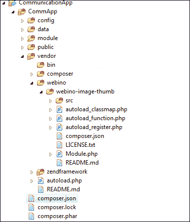
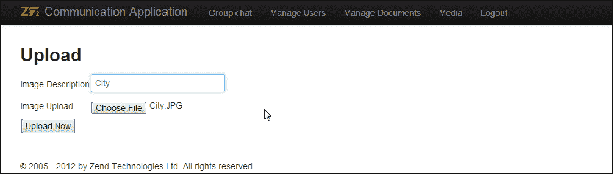
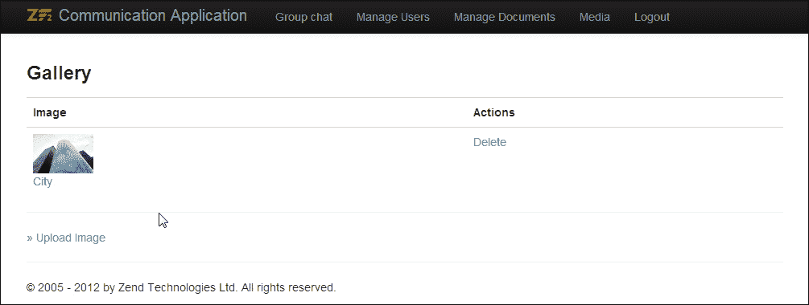
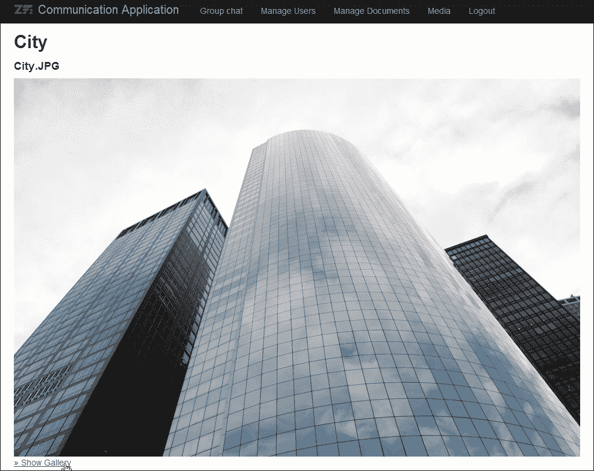
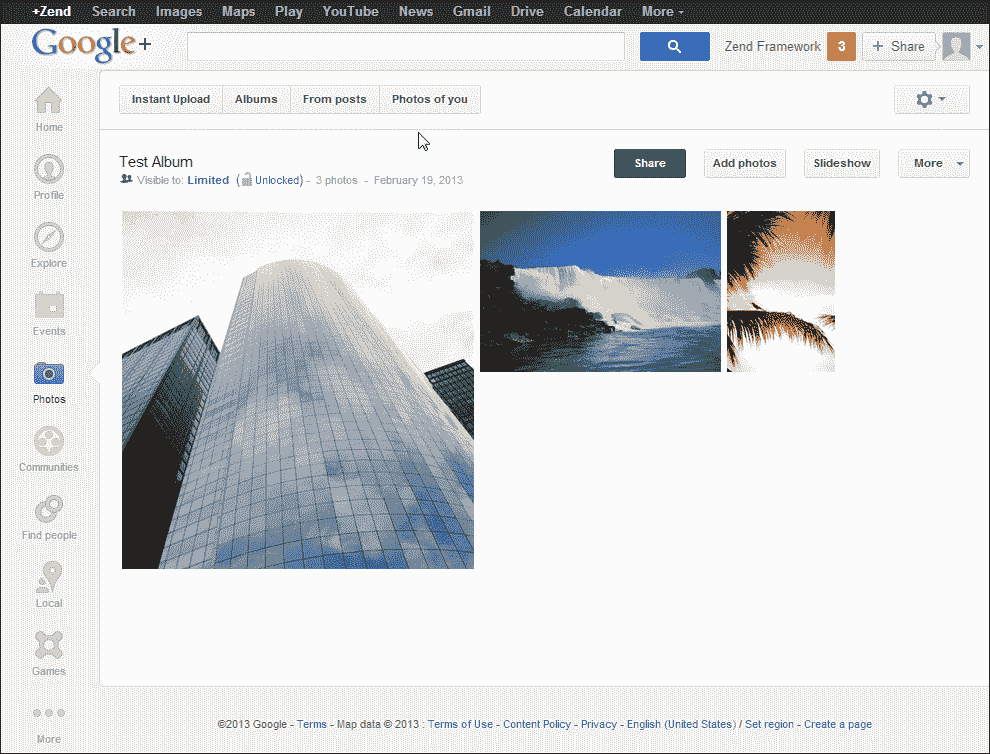
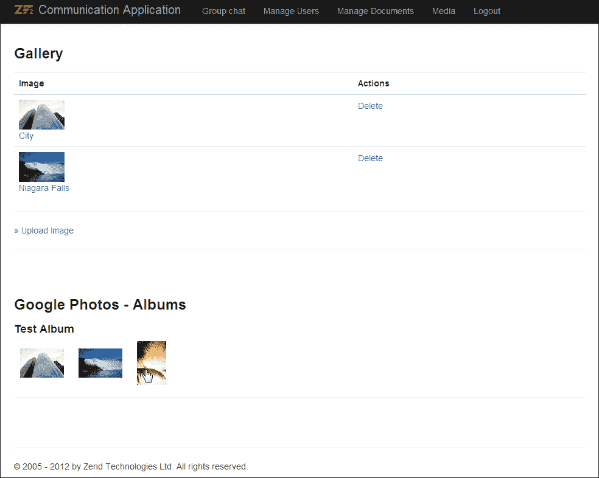
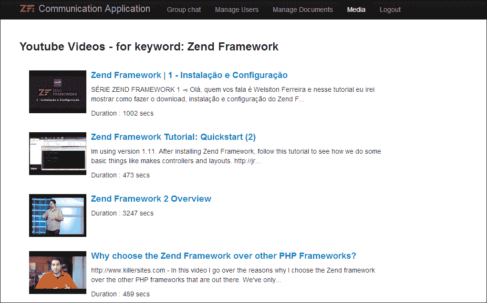

# 第六章：媒体共享

*随着社交媒体的出现，上传和管理图片/视频已成为非常普遍的事情。现在越来越多的应用程序允许您通过外部媒体托管/服务（如 Google、Flickr 和 YouTube）分享和检索媒体。在 Zend Framework 1.0 中，`Zend_Service` 包提供大量第三方集成。这一情况在 ZF2 和新的模块框架中发生了变化。*

在本章中，我们将使用各种外部 Zend Framework 2.0 模块来管理图片和视频。让我们快速看一下本章我们将学习的内容：

+   在 Zend Framework 应用程序中安装外部模块

+   设置简单的照片画廊

+   使用 `WebinoImageThumb` 调整和操作图片

+   Zend GData API 简介

+   使用 GData API 从 Google Photos 和 YouTube 获取相册

# 外部模块

Zend Framework 2.0 最重要的特性之一是能够在 PHP 应用程序中集成外部模块，并且这种集成完全通过依赖管理工具（在我们的例子中是 `Composer`）来管理。

此功能允许在不担心维护应用程序内部外部库的情况下开发 PHP 应用程序。库和应用程序可以解耦并分别维护。

在本章中，我们将使用外部模块来调整图片；我们还将利用外部库来连接 Google 服务。

### 小贴士

**Composer**

Composer 是在 Zend Framework 中使用的依赖管理解决方案之一。Composer 允许开发者声明他们应用程序所需的依赖，并将处理这些库的安装。依赖配置存储在名为 `composer.json` 的文件中。

# 调整图片大小

Zend Framework 1.0 有一个调整大小的过滤器，允许在上传时调整图片大小；在 Zend Framework 2.0 中，此选项不再存在。我们的下一个任务将是找到一个简单的图片调整大小模块，并将其安装到我们的应用程序中。所以，让我们开始吧。

# 使用模块调整图片大小的时间

执行以下步骤：

1.  前往 Zend Framework 2 模块网站：

    [`modules.zendframework.com/`](http://modules.zendframework.com/)

1.  搜索 `WebinoImageThumb`。

1.  要安装此模块，您需要更新应用程序根目录下的 `composer.json` 并将其作为所需模块包含在内。

1.  要做到这一点，请编辑 `CommunicationApp/composer.json` 并修改所需部分：

    ```php
    "require": {
        "php": ">=5.3.3",
        "zendframework/zendframework": "2.0.*",
        "webino/webino-image-thumb": "1.*",
    }
    ```

1.  现在运行 `composer.phar update` 来安装新添加的依赖。

    ```php
    $ php composer.phar update
    Loading composer repositories with package information
    Updating dependencies
     - Installing webino/webino-image-thumb (1.0.0)
     Downloading: 100%

    Writing lock file
    Generating autoload files

    ```

1.  您将能够在 `vendor` 文件夹中看到新安装的模块，如下所示：

1.  现在模块已下载，我们需要在 `CommunicationApp/config/application.config.php` 中激活该模块，通过将 `'WebinoImageThumb'` 添加到 `modules` 数组中。

    ```php
    return array(
        'modules' => array(
            'Application',
          'WebinoImageThumb',
        'Users',
        ),
    ```

## *刚才发生了什么？*

我们已使用依赖管理工具 Composer 将外部模块安装到我们的应用程序中。我们还在应用程序中激活了该模块，以便模块可以在整个应用程序中访问。

## 尝试一下

现在您已经知道如何在 Zend Framework 2 应用程序中安装新模块，这里有一个简单的任务给您。在这个应用程序上安装 Zend GData 包。安装此包的说明可在 [`packages.zendframework.com/`](https://packages.zendframework.com/) 找到。我们将在本章后续部分使用此模块。

# 照片相册应用程序

让我们开始使用 Zend Framework 2 实现我们的自定义相册。由于我们已实现了文件管理界面，我们将使用类似的界面来实现相册。

照片相册的架构将与 `Upload` 实体类似；此外，我们还将有一个字段来存储在上传过程中生成的 `thumbnail` 文件名。图像和生成的缩略图都将存储在 `<Module>\data\images` 文件夹中。我们将使用自定义操作在浏览器中显示图像。

在我们开始之前，让我们快速回顾一下由 `WebinoImageThumb` 支持的一些重要方法：

+   `resize ($maxWidth = 0, $maxHeight = 0)`: 此函数将图像调整到指定的宽度和高度；如果任一值设置为 `0`，则该维度将不被视为限制

+   `adaptiveResize ($width, $height)`: 此函数尝试将图像调整到尽可能接近提供的尺寸，然后裁剪剩余的溢出（从中心）以使图像达到指定的尺寸

+   `crop ($startX, $startY, $cropWidth, $cropHeight)`: 此函数从给定的坐标裁剪图像到指定的宽度和高度

+   `rotateImage ($direction = 'CW')`: 通过顺时针或逆时针旋转图像 90 度

+   `rotateImageNDegrees ($degrees)`: 通过指定的度数旋转图像

+   `save ($fileName, $format = null)`: 通过指定的文件名保存图像

# 行动时间 - 实现一个简单的相册

执行以下步骤：

1.  创建一个名为 `ImageUpload` 的新实体，具有以下表结构：

    ```php
          CREATE TABLE IF NOT EXISTS image_uploads (
            id INT NOT NULL AUTO_INCREMENT PRIMARY KEY ,
            filename VARCHAR( 255 ) NOT NULL ,
            thumbnail VARCHAR( 255 ) NOT NULL ,
            label VARCHAR( 255 ) NOT NULL ,
            user_id INT NOT NULL,
            UNIQUE KEY (filename)
          );
    ```

1.  在 `src/Users/Model/ImageUpload.php` 文件中创建相关的 `ImageUpload` 实体，在 `src/Users/Model/ImageUploadTable.php` 文件中创建 `TableGateway` 对象，以及在模块 (`CommunicationApp/module/Users`) 中的 `src/Users/Controller/MediaManagerController.php` 文件内的 `Controller` (`MediaManagerController`)。

1.  在 `Upload` 表单的 `Submit` 过程中，使用名为 `generateThumbnail()` 的新方法生成缩略图；此方法将现有图像的文件名作为参数。`resize` 方法将图像调整为 75x75 像素，并带有 `tn_` 前缀保存到图像上传目录。

    此方法需要放置在 `MediaManagerController` 文件中，`src/Users/Controller/MediaManagerController.php`。

    ```php
        public function generateThumbnail($imageFileName) 
        {
          $path = $this->getFileUploadLocation();
          $sourceImageFileName = $path . '/' . $imageFileName;
          $thumbnailFileName = 'tn_' . $imageFileName;

          $imageThumb = $this->getServiceLocator()
                ->get('WebinoImageThumb');
          $thumb = $imageThumb->create($sourceImageFileName, $options = array());
     $thumb->resize(75, 75);
     $thumb->save($path . '/' . $thumbnailFileName);

          return $thumbnailFileName;
      }
    ```

1.  我们下一步是编写一个操作，以在 `Full` 和 `Thumbnail` 模式下渲染图像；为此，我们需要创建一个自定义路由，该路由将接受 `action`、`id` 和 `subaction` 参数。这是通过模块配置文件中的以下路由定义实现的，`CommunicationApp/module/Users/config/module.config.php`：

    ```php
        'media' => array(
          'type'    => 'Segment',
          'options' => array(
     'route'    => '/media[/:action[/:id[/:subaction]]]',
            'constraints' => array(
     'action'     => '[a-zA-Z][a-zA-Z0-9_-]*',
     'id'     => '[a-zA-Z0-9_-]*',
     'subaction'     => '[a-zA-Z][a-zA-Z0-9_-]*',

            ),
            'defaults' => array(
              'controller' => 'Users\Controller\MediaManager',
              'action'     => 'index',
            ),
          ),
        ),   
    ```

1.  我们下一步是编写一个响应各种图像请求的操作。这个操作需要放置在 `MediaManagerController` 文件中，`src/Users/Controller/MediaManagerController.php`。

    ```php
        public function showImageAction()
        {  
          $uploadId = $this->params()->fromRoute('id');
          $uploadTable = $this->getServiceLocator()
              ->get('ImageUploadTable');
          $upload = $uploadTable->getUpload($uploadId);

          // Fetch Configuration from Module Config
          $uploadPath    = $this->getFileUploadLocation();
     if ($this->params()->fromRoute('subaction') == 'thumb') 
     {
     $filename = $uploadPath ."/" . $upload->thumbnail;
     } else {
     $filename = $uploadPath ."/" . $upload->filename;
     }
          $file = file_get_contents($filename);

          // Directly return the Response 
          $response = $this->getEvent()->getResponse();
          $response->getHeaders()->addHeaders(array(
            'Content-Type' => 'application/octet-stream',
            'Content-Disposition' => 'attachment;filename="' .$upload->filename . '"',

          ));
          $response->setContent($file);
          return $response;	    
        }
    ```

1.  确保整个过程完全工作，从上传图片到画廊，再到在照片页面上显示。请参阅以下代码，了解在媒体管理器中的 `upload` 视图中 `showImageAction()` 的使用，`CommunicationApp/module/Users/view/users/media-manager/view.phtml`：

    ```php
        <section class="upload">
        <h2><?php echo $this->escapeHtml($upload->label);?></h2>
        <h4><?php echo $this->escapeHtml($upload->filename);?></h4>
     url('users/media',
     array('action'=>'showImage', 
     'id' => $upload->id, 
     'subaction' => 'full'));?>" />
        </section>
        <a href="<?php echo $this->url('users/media');?>">
              &raquo; Show Gallery</a>
    ```

1.  现在在您选择的浏览器上测试应用程序。图像上传页面应如下截图所示：

一旦图像上传表单成功提交，图像将被调整大小并在画廊中显示，如下截图所示：



在调整大小后的图像顶部的 **查看图像** 链接将您带到包含完整尺寸图像的页面：



## *发生了什么事？*

我们通过使用外部图像处理库实现了简单的照片画廊。我们使用了 `resize` 函数来创建缩略图，并为在网页浏览器中处理图像渲染创建了一个自定义操作。

## 尝试一下英雄

现在您已经了解了如何使用 `WebinoImageThumb` 模块，您的下一个任务是将照片画廊扩展以支持 `rotate` 功能。在 **查看图像** 页面上添加一个 `rotate` 函数，并允许用户顺时针和逆时针旋转图像。

# Google 数据 API

Google 数据 API 为应用程序提供了一个简单的接口，用于读取和写入各种 Google 服务中的数据。数据 API 使用与 Atom 发布协议类似的协议进行数据传输。所有服务都在名为 `ZendGdata` 的包中实现。

由 `ZendGdata` API 支持的一些最常用的 Google 服务如下所示：

+   Picasa 网络相册

+   YouTube

+   Google 日历

+   Google 电子表格

+   Google 文档

+   Google 配置

+   Google 分析

+   Google 博客

+   Google 代码搜索

+   Google 笔记本

由于 `ZendGdata` 不包含在默认的 Zend 框架安装中，因此需要手动安装。这可以通过 Composer 和获取 `"zendframework/zendgdata": "2.*"` 来完成。

## Google 照片 API

Google Photos API 允许您从 Picasa 或 Google+ 账户中获取、编辑和管理您的照片和相册。数据 API 提供了各种服务；以下列出了其中一些关键功能：

+   `getUserFeed()`: 获取该用户所有关联的相册

+   `insertAlbumEntry()`: 创建一个新的相册

+   `getAlbumFeed()`: 获取指定的相册

+   `insertPhotoEntry()`: 创建一个新的照片

+   `getPhotoFeed()`: 获取指定的照片

+   `insertCommentEntry()`: 创建一个新的评论

+   `getCommentEntry()`: 获取指定的评论

+   `insertTagEntry()`: 创建一个新的标签

+   `getTagEntry()`: 获取指定的标签

+   `deleteAlbumEntry()`: 删除相册

+   `deletePhotoEntry()`: 删除照片

+   `deleteCommentEntry()`: 删除评论

+   `deleteTagEntry()`: 删除标签

在本例中，我们将获取用户的现有相册以及存储在这些相册中的照片。

### 小贴士

在继续之前，请确保您已使用 Composer 在应用程序中安装了 `ZendGdata` 库。请参考以下安装说明：

+   将以下行添加到 `CommunicationApp/composer.json` 的 `requires` 部分：

    ```php
    "zendframework/zendgdata": "2.*"

    ```

+   使用 Composer 更新应用程序依赖项：

    ```php
    $ php composer.phar update

    ```

```php
"zendframework/zendgdata": "2.*"
$ php composer.phar update

```

在开始之前，请确保您已在您的 Google Photos 账户上上传了一些照片。

# 动手时间 - 从 Google Photos 获取照片

按照以下步骤从您的 Google Photos 账户获取照片：

1.  在您的控制器中创建一个名为 `getGooglePhotos()` 的方法，该方法将连接到 Google Photos 并获取所有相册。此方法需要放置在 `MediaManagerController` 文件中，`src/Users/Controller/MediaManagerController.php`。

1.  设置 API 客户端以使用带有禁用 `sslverifypeer` 选项的 `Curl` 请求。

    ```php
        $adapter = new \Zend\Http\Client\Adapter\Curl();
        $adapter->setOptions(array(
          'curloptions' => array(
            CURLOPT_SSL_VERIFYPEER => false,
          )
        ));

        $httpClient = new \ZendGData\HttpClient();
        $httpClient->setAdapter($adapter);

        $client = \ZendGData\ClientLogin::getHttpClient(
                self::GOOGLE_USER_ID, 
                self::GOOGLE_PASSWORD, 
                \ZendGData\Photos::AUTH_SERVICE_NAME, 
                $httpClient);
    ```

1.  现在创建一个新的 Google Photos 客户端，使用 API 客户端。

    ```php
        $gp = new \ZendGData\Photos($client);
    ```

1.  现在通过 `getUserFeed()` 获取相册列表，并使用 `getAlbumFeed()` 获取相册内的图片列表。

    ```php
        $userFeed = $gp->getUserFeed( self::GOOGLE_USER_ID );
        foreach ($userFeed as $userEntry) {

          $albumId = $userEntry->getGphotoId()->getText();
          $gAlbums[$albumId]['label'] = $userEntry->getTitle()->getText();

          $query = $gp->newAlbumQuery();
          $query->setUser( self::GOOGLE_USER_ID );
          $query->setAlbumId( $albumId  );
          $albumFeed = $gp->getAlbumFeed($query);
          foreach ($albumFeed as $photoEntry) {
            $photoId = $photoEntry->getGphotoId()->getText();
            if ($photoEntry->getMediaGroup()->getContent() != null) {
              $mediaContentArray = $photoEntry->getMediaGroup()->getContent();
              $photoUrl = $mediaContentArray[0]->getUrl();
            }

            if ($photoEntry->getMediaGroup()->getThumbnail() != null) {
              $mediaThumbnailArray = $photoEntry->getMediaGroup()->getThumbnail();
              $thumbUrl = $mediaThumbnailArray[0]->getUrl();
            }

            $albumPhoto = array();
            $albumPhoto['id'] = $photoId;
            $albumPhoto['photoUrl'] = $photoUrl;
            $albumPhoto['thumbUrl'] = $thumbUrl;

            $gAlbums[$albumId]['photos'][] =$albumPhoto;   
          }
        }
    // Return the consolidated array back to the view for rendering
    return $gAlbums;
    ```

1.  在 `album` 视图中的以下代码块用于渲染相册；这可以放置在媒体管理器的 `index` 视图中，`CommunicationApp/module/Users/view/users/media-manager/index.phtml`：

    ```php
        <?php foreach ($googleAlbums as $googleAlbum) : ?>
        <h4> <?php echo $this->escapeHtml($googleAlbum['label']);?> </h4>
        <?php foreach ($googleAlbum['photos'] as $googleAlbumPhoto) : ?>
          <div class = "googleAlbumPhoto" style="padding:10px; display:inline">
            <a href="<?php echo $this->escapeHtml($googleAlbumPhoto['photoUrl']);?>">
            escapeHtml($googleAlbumPhoto['thumbUrl']);?>" />
            </a> 
          </div>
          <?php endforeach; ?>
        <?php endforeach; ?>
        <hr />
    ```

1.  将图片上传到您的 Google Photos 相册：

1.  在浏览器窗口中打开页面；您应该能够看到相册内所有可用的相册和照片：

## *发生了什么？*

我们已成功使用 Google Data APIs 从 Google 获取 Picasa 上传信息，并使用这些信息在我们的应用程序中渲染相册。

## 动手实践英雄

您接下来的任务是在查看照片库中的照片时使用 Google Data APIs 实现照片上传选项；您将有一个按钮，允许您将照片上传到 Google Photos。

# YouTube 数据 API

YouTube 数据 API 允许访问 YouTube 内容；您可以使用此 API 获取视频、播放列表、频道、发表评论以及上传和管理视频。用户允许执行未经身份验证的请求以检索热门视频的源、发表评论等。

以下列出了 YouTube API 中最常用的方法：

+   `getVideoFeed()`: 从视频查询中检索视频

+   `getTopRatedVideoFeed()`: 检索特定视频查询中的顶级视频

+   `getUserUploads()`: 检索用户的上传视频

+   `getUserFavorites()`: 检索用户的收藏视频

+   `getVideoResponseFeed()`: 获取特定视频的回复

+   `getVideoCommentFeed()`: 获取特定视频的评论

+   `getPlaylistListFeed()`: 获取用户的播放列表

+   `getSubscriptionFeed()`: 获取用户的订阅

+   `insertEntry()`: 上传视频到 YouTube

在此示例中，我们将检索特定关键词的视频，并在网页中渲染它们。

# 行动时间 – 列出关键词的 YouTube 视频

执行以下步骤以列出关键词的 YouTube 视频：

1.  创建一个函数，用于获取`Zend Framework`关键词的 YouTube 视频。

1.  以类似的方式建立连接，就像之前为 Google Photos 建立的连接一样。这需要放置在`MediaManagerController`文件中的新方法`getYoutubeVideos()`中，`src/Users/Controller/MediaManagerController.php`：

    ```php
      $adapter = new \Zend\Http\Client\Adapter\Curl();
      $adapter->setOptions(array(
        'curloptions' => array(
          CURLOPT_SSL_VERIFYPEER => false,
        )
      ));

      $httpClient = new \ZendGData\HttpClient();
      $httpClient->setAdapter($adapter);

      $client = \ZendGData\ClientLogin::getHttpClient(
        self::GOOGLE_USER_ID,
        self::GOOGLE_PASSWORD,
        \ZendGData\YouTube::AUTH_SERVICE_NAME,
        $httpClient);      
    ```

1.  初始化 YouTube 客户端并执行关键词`Zend Framework`的视频查询：

    ```php
      $yt = new \ZendGData\YouTube($client);
      $yt->setMajorProtocolVersion(2);
      $query = $yt->newVideoQuery();
      $query->setOrderBy('relevance');
      $query->setSafeSearch('none');
      $query->setVideoQuery('Zend Framework');    
    ```

1.  解析查询结果并将其存储在数组中：

    ```php
      $videoFeed = $yt->getVideoFeed($query->getQueryUrl(2));

      $yVideos = array();
      foreach ($videoFeed as $videoEntry) {
         $yVideo = array();
         $yVideo['videoTitle'] = $videoEntry->getVideoTitle();
         $yVideo['videoDescription'] = $videoEntry->getVideoDescription();
         $yVideo['watchPage'] = $videoEntry->getVideoWatchPageUrl();
         $yVideo['duration'] = $videoEntry->getVideoDuration();
         $videoThumbnails = $videoEntry->getVideoThumbnails();

         $yVideo['thumbnailUrl'] = $videoThumbnails[0]['url'];
         $yVideos[] = $yVideo;
      }
      return $yVideos;
    ```

1.  结果内容在视图中渲染，并显示如下截图中的视频列表：

## *发生了什么？*

我们已经使用了`ZendGData` API 的 YouTube API 来检索特定关键词的 YouTube 视频列表。

## 突击测验 – 媒体共享

Q1. 在 Composer 中，哪个命令用于安装新配置的依赖项？

1.  `php composer.phar setup`

1.  `php composer.phar self-update`

1.  `php composer.phar show`

1.  `php composer.phar update`

Q2. 以下哪个是上传新照片到 Google Photos 的有效方法？

1.  `uploadPhoto()`

1.  `insertPhoto()`

1.  `uploadNewPhoto()`

1.  `insertPhotoEntry()`

# 概述

在本章中，我们学习了各种管理媒体的技术；最初我们从实现自己的相册开始，后来转向使用 Google GData API 在网络上检索和存储媒体。

在我们下一章中，我们将实现一个简单的搜索界面。
