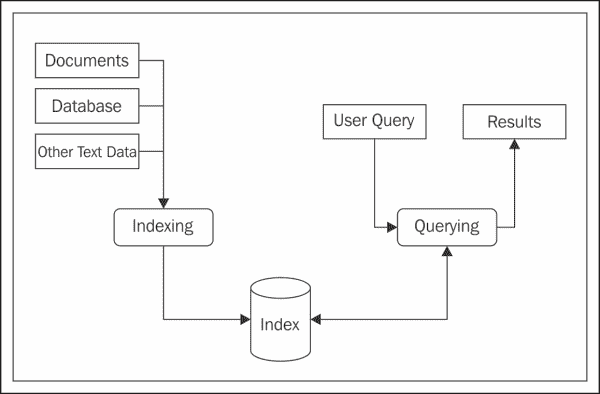
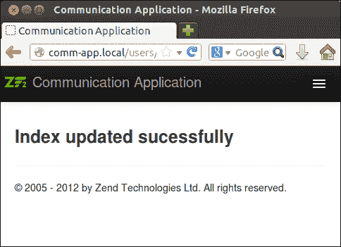
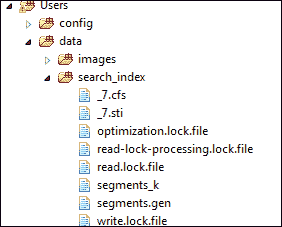
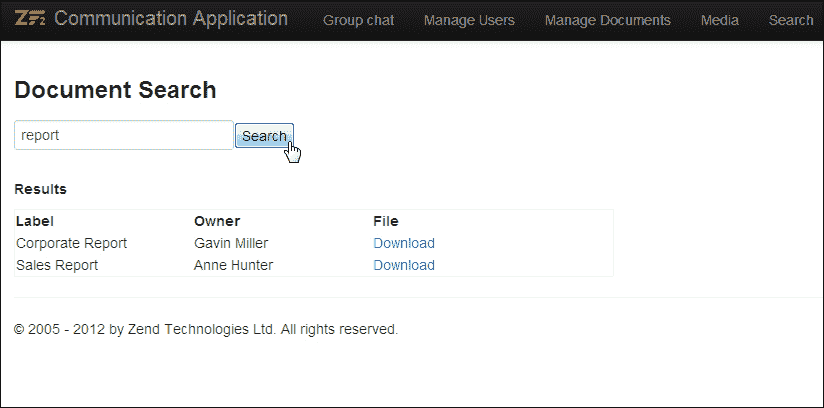
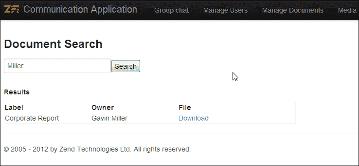
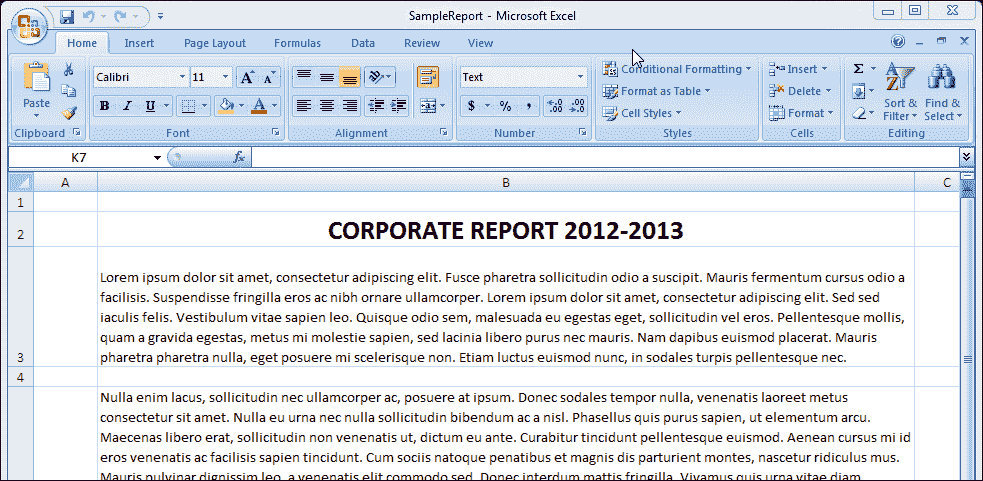
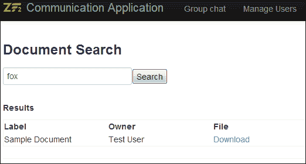
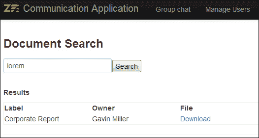

# 第七章：使用 Lucene 进行搜索

*通常情况下，我们会遇到需要内置搜索功能的 Web 应用程序。有时搜索可能涉及在 MySQL 表中搜索一个简单的字段，或者有时你可能想要搜索一个文档或纯文本文件；使用各种搜索库有多种方法来解决搜索需求。Lucene 就是这样一种库，它为实施全文搜索提供了出色的搜索功能。*

在本章中，我们将使用 Zend Framework 的 Lucene 搜索实现。Zend Framework 1.0 内置了`Zend_Search_Lucene`库，该库支持使用 Lucene 进行索引和搜索；在 ZF 2.0 中，这个库作为`ZendSearch\Lucene`提供，可以下载并安装到你的 Web 应用程序中。在本章中，我们将学习使用 Lucene 搜索库实现全文搜索的基本原理，以下是一些主题：

+   在你的应用程序中安装`ZendSearch`库

+   为简单的 MySQL 数据创建数据索引

+   查询 Lucene 索引

+   向索引中添加新的文档文件

# Lucene 简介

Lucene 是由 Apache 基金会开发的一个高性能、可扩展的信息检索（搜索）库，可用于在 Web 应用程序中实现全文搜索。Lucene 提供了一个简单易用的 API，它将为你的 Web 应用程序提供强大的索引和搜索功能。要了解更多关于 Lucene 的信息，请访问[`lucene.apache.org/`](http://lucene.apache.org/)。

Lucene 搜索库最重要的组件解释如下：

+   **索引**：Lucene 索引是存储所有已索引文档的数据存储；查询是针对索引执行的，以获取文档。

+   **文档**：文档是 Lucene 索引的默认构建块；文档可以与表中的记录相比较。每个文档包含多个字段，查询可以针对这些字段执行。

+   **字段**：每个 Lucene 文档包含一个或多个字段；并非所有字段都必须被索引，字段也可以在不索引的情况下存储。

Lucene 搜索基于索引进行，因此有必要更新索引以包含最新内容，以获得最佳的搜索结果。以下图表解释了 Lucene 搜索的概述：



# 现在是时候安装 ZendSearch\Lucene 了

执行以下步骤以安装`ZendSearch\Lucene`：

1.  在撰写本书时，`ZendSearch\Lucene`不是一个 composer 包。因此，我们将从 GitHub 仓库中检出源代码。仓库位于[`github.com/zendframework/ZendSearch`](https://github.com/zendframework/ZendSearch)。

1.  接下来，我们需要导航到`vendor`文件夹：

    ```php
    $ cd /var/www/CommunicationApp/
    vendor/

    ```

1.  将 Zend 搜索仓库克隆到`vendor`文件夹中：

    ```php
    $ git clone https://github.com/zendframework/ZendSearch.git ZendSearch

    ```

1.  接下来，我们应该使用 composer 配置 ZendSearch 库：

    ```php
    $ cd ZendSearch/
    $ curl -s https://getcomposer.org/installer | php
    $ php composer.phar install

    ```

1.  一旦库配置完成，我们需要定义一个模块级别的配置来存储索引位置。为此，我们需要修改 `CommunicationApp/module/Users/config/module.config.php`，并为 `search_index` 添加一个新的配置：

    ```php
       // MODULE CONFIGURATIONS
       'module_config' => array(
          'upload_location'        => __DIR__ . '/../data/uploads',
          'image_upload_location'  => __DIR__ . '/../data/images',
     'search_index'         => __DIR__ . '/../data/search_index'
       ),
    ```

## *发生了什么？*

我们现在已经下载并配置了 Zend Framework 2.0 的 `ZendSearch` 库；之前的教程也为我们提供了下载和安装无法直接从 Composer 下载的包的指南。

现在我们已经安装了 `ZendSearch\Lucene` 搜索库，我们的下一个任务将是为存储在我们通信应用中的某些数据创建一个 Lucene 索引。

# 索引

使用 `ZendSearch\Lucene` 进行索引是一个相当直接的过程。我们只需要创建带有字段和值的文档，并持续将文档添加到索引中。您还可以删除文档、更新文档和清除索引。以下类用于索引生成：

+   `Field` – `ZendSearch\Lucene\Document\Field` 类允许用户定义一个新的文档字段；此字段可以被分类为以下类型之一：

    +   `Field::keyword($name, $value, $encoding = 'UTF-8')`: `keyword` 字段类型用于标识不需要分词但需要索引和存储的字符串字段。例如，日期和 URL。

    +   `Field::unIndexed($name, $value, $encoding = 'UTF-8')`: `unIndexed` 字段类型用于在索引中存储字段，而无需对其进行索引/分词。例如，ID 字段。

    +   `Field::binary($name, $value)`: `binary` 字段类型用于在索引中存储二进制值。

    +   `Field::text($name, $value, $encoding = 'UTF-8')`: `text` 字段类型是最常用的字段类型，用于描述短字符串，这些字符串将被分词并存储在索引中。

    +   `Field::unStored($name, $value, $encoding = 'UTF-8')`: `unStored` 字段类型用于标识那些将被分词和索引但不会存储在索引中的字段。

+   `Document` – `ZendSearch\Lucene\Document` 类允许定义一个新的索引文档。以下是一些在这个类中最常用的方法的描述：

    +   `addField(Document\Field $field)`: 向文档中添加一个新的字段

    +   `getFieldNames()`: 用于从文档中检索所有字段名称

    +   `getField($fieldName)`: 用于从文档中检索特定字段

    +   `getFieldValue($fieldName)`: 用于从文档中检索特定字段值

+   `Index` – 可以使用 `ZendSearch\Lucene` 类中的 `create()` 和 `open()` 方法检索 `Index`。这两个方法都接受索引路径作为参数，并返回一个类型为 `ZendSearch\Lucene\SearchIndexInterface` 的索引。`SearchIndexInterface` 为操作索引内的文档提供了以下方法：

    +   `addDocument(Document $document)`: 向索引中添加一个新的文档

    +   `delete($id)`: 根据内部文档 ID 删除索引中的文档

    +   `optimize()`: 通过合并所有段为一个单一段来优化索引，从而提高性能

    +   `commit()`: 用于将事务提交到搜索索引

现在我们已经了解了用于索引生成的各种方法，让我们开始并为我们的通信应用程序中可用的 `uploads` 表生成索引。

# 执行动作时间 – 生成 Lucene 索引

执行以下步骤以生成 Lucene 索引：

1.  创建一个新的搜索控制器，`CommunicationApp/module/Users/src/Users/Controller/SearchController.php`，它将被用于搜索和生成索引。

1.  添加对 `ZendSearch\Lucene` 的引用：

    ```php
    use ZendSearch\Lucene;
    use ZendSearch\Lucene\Document;
    use ZendSearch\Lucene\Index;
    ```

1.  添加一个方法从模块配置中获取索引位置：

    ```php
    public function getIndexLocation()
    {
      // Fetch Configuration from Module Config
      $config  = $this->getServiceLocator()->get('config');
      if ($config instanceof Traversable) {
        $config = ArrayUtils::iteratorToArray($config);
      }
      if (!empty($config['module_config']['search_index'])) {
        return $config['module_config']['search_index'];
      } else {
        return FALSE;
      }
    }
    ```

1.  索引文档需要以下格式生成：

    | 索引字段 | 描述 |
    | --- | --- |
    | `upload_id` | 这是一个非索引字段，将用于检索在搜索结果中返回的已上传文件 |
    | `label` | 此字段用于索引 `uploads` 表的 `label` 字段 |
    | `owner` | 此字段用于索引上传文档的用户 `name` 字段 |

1.  创建一个新的操作以生成索引：

    ```php
    public function generateIndexAction()
    {
      $searchIndexLocation = $this->getIndexLocation();
      $index = Lucene\Lucene::create($searchIndexLocation);

      $userTable = $this->getServiceLocator()->get('UserTable');
      $uploadTable = $this->getServiceLocator()->get('UploadTable');
      $allUploads = $uploadTable->fetchAll();  
      foreach($allUploads as $fileUpload) {
        //
        $uploadOwner = $userTable->getUser($fileUpload->user_id);

        // create lucene fields
        $fileUploadId = Document\Field::unIndexed(
                              'upload_id', $fileUpload->id);
        $label = Document\Field::Text(
                              'label', $fileUpload->label);
        $owner = Document\Field::Text(
                              'owner', $uploadOwner->name);

        // create a new document and add all fields
        $indexDoc = new Lucene\Document();
        $indexDoc->addField($label);
        $indexDoc->addField($owner);
        $indexDoc->addField($fileUploadId);
        $index->addDocument($indexDoc);
      }
      $index->commit();
    }
    ```

1.  现在在您的网络浏览器中打开操作 URL (`http://comm-app.local/users/search/generateIndex`)，如果一切按预期工作，您将看到在 `search_index` 文件夹中创建的索引文件。

    以下截图显示了成功更新索引后的浏览器响应：

    

您可以在以下截图中看到索引文件已生成并存储在 `search_index` 文件夹中：



## *发生了什么？*

现在我们已经创建了一个方法，将存储在 `MySQL` 表中的数据索引到 Lucene 数据存储中；我们的下一步将是执行针对 Lucene 索引的查询，并获取并显示结果。

# 搜索

使用 `ZendSearch\Lucene` 搜索索引相对简单。需要打开索引以进行查询，并将查询字符串传递给 `ZendSearch\Lucene\Index` 中的 `find()` 方法。`find` 方法返回一个数组，匹配特定查询的命中项，然后可以用来渲染搜索结果。

查询索引有两种选项——你可以将纯文本查询字符串传递给查找函数，或者你可以使用 `ZendSearch\Lucene\Search\Query` 构建自己的 `Query` 对象。

### 小贴士

要了解有关 ZendSearch\Lucene 中各种查询选项的更多信息，请查看以下开发者文档：

[`zf2.readthedocs.org/en/release-2.2.0/modules/zendsearch.lucene.queries.html`](https://zf2.readthedocs.org/en/release-2.2.0/modules/zendsearch.lucene.queries.html )

在以下示例中，我们将使用纯文本查询，并且您可以通过使用操作符如 `:`,`+`,`-` 和字段搜索来操作搜索结果。例如，请参阅以下列表：

+   通过以下查询可以检索到由名为 `Anne` 的用户上传的所有文档：

    ```php
    owner:Anne
    ```

+   通过以下查询可以检索到包含单词 `report` 并由用户名为 `Anne` 上传的所有文档：

    ```php
    report AND owner:Anne
    ```

+   通过以下查询可以检索到包含单词 `report` 的所有文档，并排除由 `Anne` 上传的文档：

    ```php
    report -owner:Anne
    ```

# 执行操作时间 – 显示搜索结果

执行以下步骤以显示搜索结果：

1.  为了显示搜索结果，我们需要创建一个新的表单，该表单将显示搜索文本框，并在搜索表单下方渲染搜索结果。该表单将放置在 `CommunicationApp/module/Users/src/Users/Controller/SearchController.php` 下的 `SearchController` 中。

1.  创建一个新的视图，该视图将用于显示查询窗口并渲染搜索结果。这将放置在 `CommunicationApp/module/Users/view/users/search/index.phtml` 下。

    ```php
    <h3>Document Search</h3>
    <?php 
    // Search Form
    echo $this->form()->openTag($form);
    foreach ($form as $element) {
        echo $this->formElement($element);       
        echo $this->formElementErrors($element);
    }
    echo $this->form()->closeTag();

    // Search Results
    if (count($searchResults)) {
    ?>
    <h5>Results</h5>
    <table  style="width: 600px; border:1px solid #f5f5f5;">
      <tr>
        <th width="30%" align="left"> Label</th>
        <th width="30%" align="left"> Owner</th>
        <th align="left"> File</th>
      </tr>
      <?php   foreach ($searchResults as $searchResult) {
      ?>
      <tr>
        <td><?php echo $searchResult->label; ?></td>
        <td><?php echo $searchResult->owner; ?></td>
        <td><a href="<?php echo $this->escapeHtml($this->url('users/upload-manager',
                array('action'=>'fileDownload', 'id' => $searchResult->upload_id)));?>">Download</a></td>
      </tr>
      <?php 
      }
      ?>
    </table>
    <?php }?>
    ```

1.  现在创建一个新的操作，该操作将显示 `搜索` 表单，并使用 `搜索` 表单中提供的输入查询 Lucene 索引。这将放置在 `CommunicationApp/module/Users/src/Users/Controller/SearchController.php` 下的 `SearchController` 中。

    ```php
    public function indexAction()
    {
      $request = $this->getRequest();
      if ($request->isPost()) {
     $queryText = $request->getPost()->get('query');
     $searchIndexLocation = $this->getIndexLocation();
     $index = Lucene\Lucene::open($searchIndexLocation);
     $searchResults = $index->find($queryText);
      }

      // prepare search form
      $form  = new \Zend\Form\Form();
      $form->add(array(
        'name' => 'query',
        'attributes' => array(
          'type'  => 'text',
          'id' => 'queryText',
          'required' => 'required'
        ),
        'options' => array(
          'label' => 'Search String',
        ),
      ));
      $form->add(array(
              'name' => 'submit',
              'attributes' => array(
                  'type'  => 'submit',
                  'value' => 'Search'
              ),
      ));

      $viewModel  = new ViewModel(array(
          'form' => $form, 
     'searchResults' => $searchResults
        )    
      );
      return $viewModel;
    }
    ```

1.  在您的浏览器中测试页面；您应该能够看到 `标签` 和 `所有者` 字段中可用的关键字搜索结果：

在使用 `所有者名称` 搜索时，您将得到以下搜索结果：



## *发生了什么？*

我们现在已经实现了搜索结果页面，该页面允许我们通过标签和所有者查询上传的文档。检索到的搜索结果在自定义视图中显示，允许我们从搜索结果中下载文档。

我们的下一步将是扩展搜索以搜索上传文档的内容；为此，我们需要更改生成索引的方式。

# 索引 Microsoft Office 文档

如前一个示例所示，仅索引文档的元信息通常是不够的。大多数情况下，查询字符串仅存在于文档的内容中。为了实现这一点，我们需要解析文档并索引内容；`ZendSearch\Lucene` 提供了索引以下文档类型内容的支持：

+   对于 HTML 文档，以下是指示文档创建方法：

    ```php
    ZendSearch\Lucene\Document\Html::loadHTMLFile($filename)
    ZendSearch\Lucene\Document\Html::loadHTML($htmlString)
    ```

+   对于 Word 2007 文档，以下是指示文档创建方法：

    ```php
    ZendSearch\Lucene\Document\Docx::loadDocxFile($filename)
    ```

+   对于 Powerpoint 2007 文档，以下是指示文档创建方法：

    ```php
    ZendSearch\Lucene\Document\Pptx::loadPptxFile($filename)
    ```

+   对于 Excel 2007 文档，以下是指示文档创建方法：

    ```php
    ZendSearch\Lucene\Document\Xlsx::loadXlsxFile($filename)
    ```

所有这些方法都返回一个类型为`ZendSearch\Lucene\Document`的文档，可以通过添加更多索引字段来进一步改进。

让我们从索引`uploads`部分可用的文档开始吧。

# 行动时间 – 索引文档文件

执行以下步骤以索引文档文件：

1.  要索引办公文档，为样本 Word 和 Excel 文档添加一个新的`uploads`部分。在这种情况下，我们将上传一个 Word 文档和一个 Excel 电子表格，如下所示：

    样本 Word 2007 文档

    

    样本 Excel 2007 电子表格

1.  将以下行添加到位于`CommunicationApp/module/Users/src/Users/Controller/SearchController.php`中的`SearchController`索引函数中，以便该方法能够分别索引 Word 文档和 Excel 电子表格：

    ```php
    if (substr_compare($fileUpload->filename, 
            ".xlsx", 
            strlen($fileUpload->filename) - strlen(".xlsx"), 
            strlen(".xlsx")) === 0) {
      // index excel sheet
      $uploadPath = $this->getFileUploadLocation();
     $indexDoc = Lucene\Document\Xlsx::loadXlsxFile(
     $uploadPath ."/" . $fileUpload->filename);
    } else if (substr_compare($fileUpload->filename, 
            ".docx", 
            strlen($fileUpload->filename) - strlen(".docx"), 
            strlen(".docx")) === 0) {
      // index word doc
      $uploadPath= $this->getFileUploadLocation();
     $indexDoc = Lucene\Document\Docx::loadDocxFile(
     $uploadPath ."/" . $fileUpload->filename);
    } else {
      $indexDoc = new Lucene\Document();
    }

    $indexDoc->addField($label);
    $indexDoc->addField($owner);
    $indexDoc->addField($fileUploadId);
    $index->addDocument($indexDoc);
    ```

1.  现在更新索引（导航到`http://comm-app.local/users/search/generateIndex`），回到**文档搜索**页面，尝试搜索文档中存在的关键词。你应该能够看到如下截图所示的搜索结果：

Office 文档内容的搜索结果将如下截图所示：



## *发生了什么？*

在上一个任务中，我们看到了如何实现索引和搜索 Microsoft Office 文档的内容。正如你所见，使用`ZendSearch\Lucene`实现这些功能相对简单。

## 有所作为的英雄

在你进入下一章之前，这里有一个简单的任务给你。现在我们已经实现了索引和搜索，你的任务将是修改实体，以便每次对上传进行更改时，索引都会更新。如果上传了新文件，需要将文档添加到索引中，如果上传被删除，则应从索引中移除，依此类推。

## 快速问答 – 搜索

Q1. 以下哪种字段类型未进行分词，但已索引并存储？

1.  `keyword ()`

1.  `unStored ()`

1.  `text()`

1.  `unIndexed()`

Q2. 以下哪种文件格式不支持作为`ZendSearch\Lucene`内容索引的有效文档格式？

1.  `.docx`

1.  `.pdf`

1.  `.xslx`

1.  `.html`

# 摘要

在本章中，我们学习了如何使用`ZendSearch\Lucene`实现一个简单的搜索界面。这对于实现你正在工作的任何 Web 应用程序中的搜索功能非常有用。在下一章中，我们将学习如何使用 Zend Framework 2.0 实现一个简单的电子商务商店。
