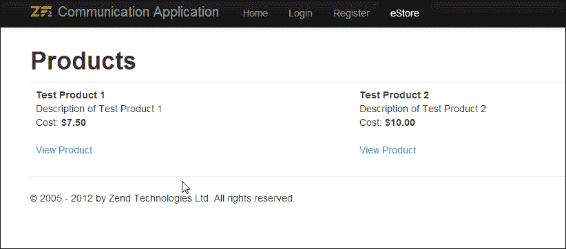
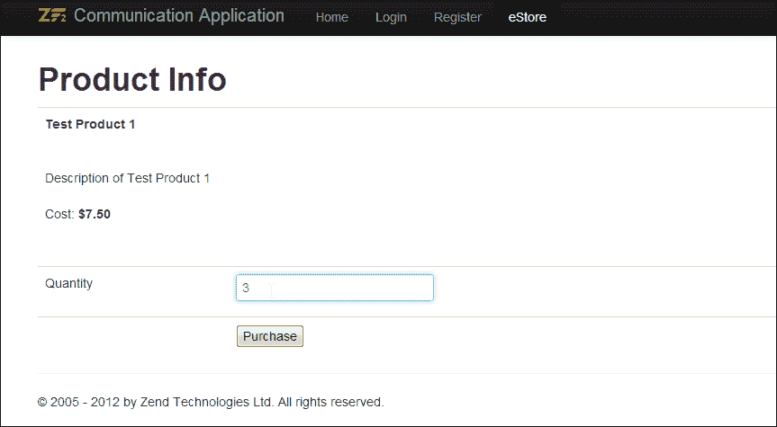
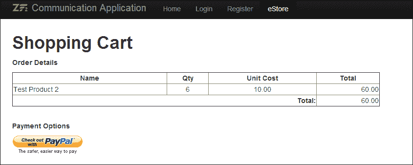
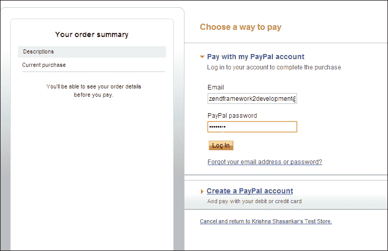
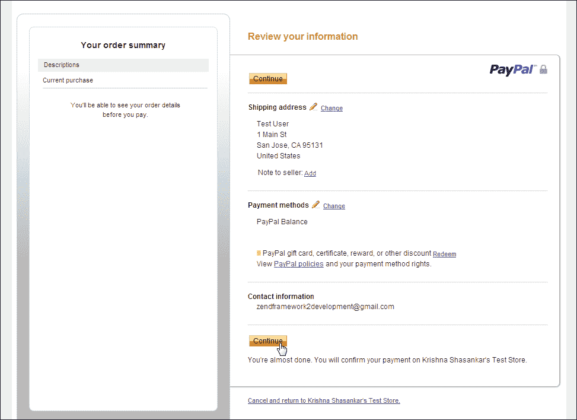
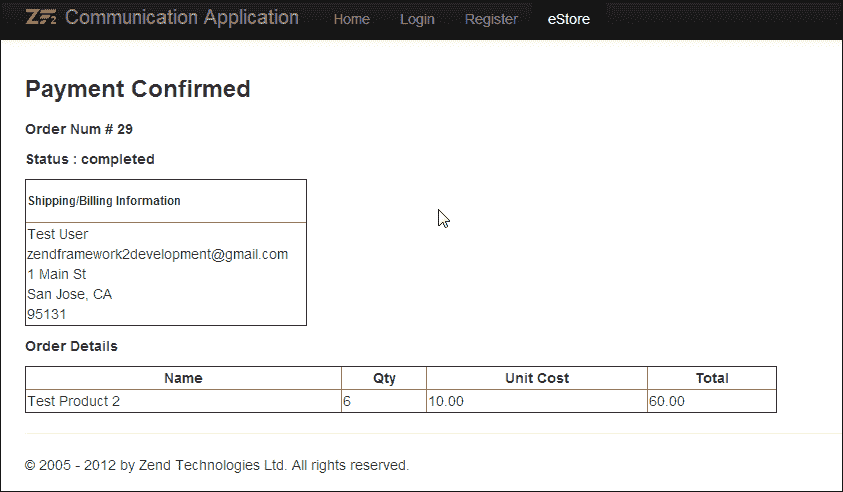
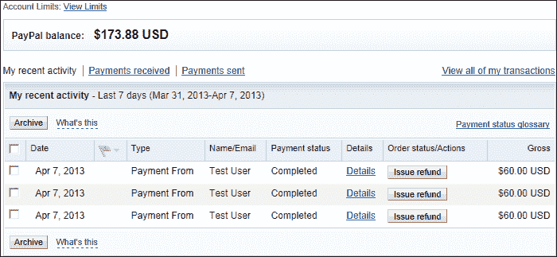

# 第八章：创建简单商店

*在过去的几年里，电子商务已经从仅仅在线广告发展到提供完整的在线购物体验。每天通过使用各种在线支付系统，越来越多的产品和服务在网上提供。电子商务应用和支付网关的作用在这个环境中变得至关重要。*

在本章中，我们将构建一个简单的在线商店来展示设置简单购物车所涉及的过程。在本示例中，我们将使用 PayPal Express Checkout 作为我们的支付处理器。本章将涵盖的一些关键主题包括：

+   设置购物车

+   创建在线商店管理界面

+   为 PayPal 配置 Zend Framework 2.0

+   PayPal Express Checkout 简介

+   PayPal Express Checkout 的实现

# 购物车

在设置在线商店时，必须设计的第一件事之一就是购物车。购物车理想情况下应允许最终用户选择并添加多个产品到购物车，并能够从网站上结账。

结账过程概述如下：

1.  客户访问产品列表页面。

1.  客户选择一个产品；他/她将被带到产品详情页面。

1.  然后，客户选择购买该产品；客户预计将所需数量添加到购物车。

1.  客户将被重定向到购物车页面；在这里，如果需要，客户可以对订单进行任何更改。

1.  客户选择支付方式并输入支付信息。

1.  如果成功，客户将看到一个选项来更新运输详情。

1.  然后，客户确认订单。

1.  订单被零售商接收；然后零售商继续处理订单。

因此，让我们开始创建我们的商店前台；我们的下一步将是设计一个支持此商店的表结构。为此，我们创建了以下两个表：

+   `store_products`：这个表将存储所有与产品相关的信息

+   `store_orders`：这个表将存储所有与订单相关的信息

# 行动时间 - 创建商店前台

为了简化，我们将通过跳过一些步骤来缩短`Checkout`过程。我们已修改过程，以便每个订单只能有一个产品；我们还将跳过更新运输详情和客户订单确认步骤：

1.  创建存储产品和订单数据的表：

    ```php
    CREATE TABLE IF NOT EXISTS store_products (
      id int(11) NOT NULL AUTO_INCREMENT,
      name varchar(255) NOT NULL,
      desc varchar(255) NOT NULL,
      cost float(9,2) NOT NULL,
      PRIMARY KEY (id)
    );

    CREATE TABLE IF NOT EXISTS store_orders (
      id int(11) NOT NULL AUTO_INCREMENT,
      store_product_id int(11) NOT NULL,
      qty int(11) NOT NULL,
      total float(9,2) NOT NULL,
      status enum('new', 'completed', 
            'shipped', 'cancelled')  DEFAULT NULL,
      stamp timestamp NOT NULL DEFAULT CURRENT_TIMESTAMP,
      first_name varchar(255) DEFAULT NULL,
      last_name varchar(255) DEFAULT NULL,
      email varchar(255) DEFAULT NULL,
      ship_to_street varchar(255) DEFAULT NULL,
      ship_to_city varchar(255) DEFAULT NULL,
      ship_to_state varchar(2) DEFAULT NULL,
      ship_to_zip int(11) DEFAULT NULL,
      PRIMARY KEY (id)
    );
    ```

1.  为`StoreOrder`和`StoreProduct`创建实体，并创建必要的数据访问表网关对象。

1.  创建一个`StoreController`控制器，它将被用作我们的购物车。

1.  `StoreController`将支持以下操作：

    +   `indexAction()`：这个操作将列出网站上的所有产品

    +   `productDetailAction()`：这将显示特定产品的详细信息；这还将允许客户将产品添加到购物车

    +   `shoppingCartAction()`: 此操作用于在离开支付处理页面之前渲染购物车

    +   `paypalExpressCheckoutAction()`: 此操作将用户重定向到 PayPal Express Checkout 页面

    +   `paymentConfirmAction()`: 此操作将在支付成功时处理从 PayPal Express Checkout 重定向回购物车的操作

    +   `paymentCancelAction()`: 此操作将在支付失败时处理从 PayPal Express Checkout 重定向回购物车的操作

1.  创建必要的视图以显示购物车的内容。

1.  向 `StoreOrder` 添加必要的函数以在向订单添加项目时计算订单总额。

1.  最终用户界面应如下截图所示。产品列表页面列出了网站/类别的所有产品；在这种情况下，两个测试产品如下截图所示：



产品详情页面允许用户查看产品的详细信息，并将指定数量的产品添加到购物车中：



**购物车**页面列出了添加到购物车中的所有产品，包括它们的单价、数量和总计：


## *发生了什么？*

我们为我们的新商店创建了一个购物车界面；我们将进一步修改此界面以添加对支付处理器的支持。但在达到这一阶段之前，让我们创建一个简单的商店管理界面，以便我们能够管理商店和订单。

# 商店管理

商店管理用户界面用于在创建订单后检查订单状态，以及管理商店中可供销售的产品列表。商店管理用户界面的两个关键方面是：

+   管理员应该能够添加、删除和管理产品

+   管理员应该能够使用此界面管理订单并更改状态

# 操作时间 – 创建 Store Admin 界面

执行以下步骤以创建 `Store Admin` 界面：

1.  为商店管理创建一个新的控制器，并将其命名为 `StoreAdminController`。

1.  此控制器将具有以下基本操作：

    +   `indexAction()`: 用于列出所有产品

    +   `addProductAction()`: 用于添加新产品

    +   `deleteProductAction()`: 用于删除现有产品

    +   `listOrdersAction()`: 用于列出所有订单

    +   `viewOrderAction()`: 用于查看特定订单

    +   `updateOrderStatusAction()`: 用于更新订单状态

1.  创建必要的视图，并相应地映射操作。

1.  打开 phpMyadmin 并在 `store_products` 和 `store_orders` 表中创建测试记录以测试管理 UI 的功能。

1.  打开您喜欢的浏览器，登录到应用程序，并打开 **eStore 管理界面**。界面应如下所示。

    **管理产品** 页面允许您从管理界面添加、删除和编辑产品：

    

订单列表页面列出了店铺中放置的所有订单，并允许您查看订单和修改其状态：


如下所示是显示订单信息和提供更改其状态选项的 **订单信息** 页面的截图：


## *发生了什么？*

店铺管理用户界面现在已准备就绪，我们的下一步是设置 PayPal Express 结账并集成到我们的店铺中，这将使用户能够使用 PayPal 进行支付。在我们继续下一节之前，下面的部分将提供一个简单的任务供您尝试。

## 尝试一下英雄

现在您已经知道如何将搜索集成到 Zend Framework 2.0 应用程序中，尝试为我们店铺应用程序的 **管理产品** 部分添加免费文本搜索功能。

# 使用 PayPal 进行支付

PayPal 是全球最常用的支付处理器；PayPal 成功的关键贡献者之一是其易于使用的 API 和详尽的文档，这些文档支持此支付网关。对于任何新商家，PayPal 提供了一系列设置支付处理器的选项，其中最重要的是提供的集成类型。PayPal 在支付处理下提供各种产品；其中一些包括：

+   快速结账

+   PayPal Payments Standards（网站支付标准）

+   PayPal Payments Pro（网站支付 Pro）

我们将在本章中处理快速结账，因为它是最基本的 PayPal 实现方法。

## PayPal 和 Zend Framework 2.0

在撰写本书时，没有由 Zend Framework 提供的原生包支持 PayPal 集成。始终有支持此集成的第三方选项。在这个例子中，我们使用了这样一个第三方包，名为 `SpeckPaypal`。

# 行动时间 – 设置 PayPal

执行以下步骤以设置 PayPal：

1.  打开 [`packagist.org/`](https://packagist.org/)，搜索 `speckpaypal`。

1.  获取仓库详细信息。

1.  修改应用程序的 Composer 配置文件以包含 `speckpaypal` 仓库：

    ```php
    "require": {
        "php": ">=5.3.3",
        "zendframework/zendframework": "2.0.*",
        "webino/webino-image-thumb": "1.0.0",
        "zendframework/zendgdata": "2.*",
     "speckcommerce/speck-paypal": "dev-master"
    }
    ```

1.  使用 Composer 更新来更新项目依赖项：

    ```php
    .
    Loading composer repositories with package information
    Updating dependencies
     - Removing zendframework/zendframework (2.0.7)
     - Installing zendframework/zendframework (2.0.8)
     Downloading: 100%

     - Installing speckcommerce/speck-paypal (dev-master d951518)
     Cloning d951518fd2c98148da5609e23a41697e6cfca06e

    Writing lock file
    Generating autoload files

    ```

1.  现在我们需要 API 凭证来访问 PayPal Express Checkout。这可以通过使用您的 PayPal 凭证登录到 [`developer.paypal.com`](https://developer.paypal.com) 来访问。

1.  从 **应用程序** 中打开 **沙盒账户**。

1.  选择合适的商家账户，并在 **配置文件** 中选择 **API 凭证**。![行动时间 – 设置 PayPal]

1.  记录 API 凭证。

1.  现在在模块的配置文件 `config` 文件（`CommunicationApp/module/Users/config/module.config.php`）中创建一个新的配置，并将数组索引命名为 `speck-paypal-api`：

    ```php
      'speck-paypal-api' => array(
        'username'  => '',
        'password'  => '',
        'signature' => '',
        'endpoint'  => 'https://api-3t.sandbox.paypal.com/nvp'
      )
    ```

1.  不同的 PayPal 服务有不同的端点。对于沙盒中的 Express Checkout，这是 `https://api-3t.sandbox.paypal.com/nvp`；如果你正在切换到实时/生产环境，则需要将其更改为 `https://api-3t.paypal.com/nvp`。

## *发生了什么？*

现在我们已经在我们的应用程序中配置了 PayPal 和 SpeckPaypal，我们的下一步是测试使用 PayPal Express Checkout 接收支付。

# PayPal Express Checkout

PayPal Express Checkout 允许卖家通过将他们重定向到 PayPal Express Checkout 以进行安全的网络支付，并在交易完成后将他们返回到商家的网站，从而在其网站上接收信用卡/ PayPal 支付。

工作流程解释如下：

1.  在 **购物车** 页面上，客户选择通过 **PayPal Express Checkout** 进行支付；商家调用 `SetExpressCheckout` API 调用并获取支付令牌。

1.  使用支付令牌，客户将被重定向到 PayPal Express Checkout 登录页面；在这里，客户可以输入他的/她的 PayPal 登录信息或获取一个新的 PayPal 账户。

1.  在下一页，客户将看到一个 **审查** 选项，以便在继续与商家结账之前审查支付信息。

1.  现在，客户将被重定向回商家页面；商家随后调用 `GetExpressCheckoutDetails` API 调用并获取客户信息。客户查看订单并确认订单。然后商家使用 `DoExpressCheckoutPayment` API 调用完成支付请求。

1.  客户将看到交易结果以及订单摘要。![PayPal Express Checkout]

    PayPal Express Checkout—概述

### 小贴士

**更多关于 PayPal Express Checkout**

你可以在 PayPal 网站上了解更多关于 PayPal Express Checkout 的信息 [`www.paypal.com/webapps/mpp/express-checkout`](https://www.paypal.com/webapps/mpp/express-checkout).

PayPal Express Checkout 的开发者文档可在以下位置找到：

[`developer.paypal.com/webapps/developer/docs/classic/express-checkout/integration-guide/ECGettingStarted/`](https://developer.paypal.com/webapps/developer/docs/classic/express-checkout/integration-guide/ECGettingStarted/).

# 行动时间 – 使用 PayPal 接受支付

使用 PayPal 接受支付的操作步骤如下：

1.  现在在 **购物车** 页面上添加一个按钮（可选地带有 PayPal 结账图片）。此按钮应链接到 `paypalExpressCheckoutAction()` 函数。

1.  在商店控制器中添加一个方法，该方法将用于生成 PayPal 请求：

    ```php
    protected function getPaypalRequest()
    {
      $config  = $this->getServiceLocator()->get('config');
      $paypalConfig = new \SpeckPaypal\Element\Config(
                  $config['speck-paypal-api']);

      $adapter = new \Zend\Http\Client\Adapter\Curl();
      $adapter->setOptions(array(
        'curloptions' => array(
          CURLOPT_SSL_VERIFYPEER => false,
        )
      ));

      $client = new \Zend\Http\Client;
      $client->setMethod('POST');
      $client->setAdapter($adapter);

      $paypalRequest = new \SpeckPaypal\Service\Request;
      $paypalRequest->setClient($client);
      $paypalRequest->setConfig($paypalConfig);

      return $paypalRequest;
    }
    ```

1.  修改 `paypalExpressCheckoutAction()` 函数以将订单信息发送到 PayPal 并将用户重定向到 PayPal Express Checkout：

    ```php
    public function paypalExpressCheckoutAction()
    {
      $request = $this->getRequest();
      $orderId = $request->getPost()->get('orderId');

      $orderTable = $this->getServiceLocator()->get('StoreOrdersTable');
      $order = $orderTable->getOrder($orderId);

      $paypalRequest = $this->getPaypalRequest();

      $paymentDetails = new \SpeckPaypal\Element\PaymentDetails
      (array('amt' => $order->total
      ));
      $express = new \SpeckPaypal\Request\SetExpressCheckout(
          array('paymentDetails' => $paymentDetails)
      );

      $express->setReturnUrl(
        'http://comm-app.local/users/store/paymentConfirm');
      $express->setCancelUrl(
        'http://comm-app.local/users/store/paymentCancel');

      // Send Order information to PayPal   
      $response = $paypalRequest->send($express);
      $token = $response->getToken();

      $paypalSession = new \Zend\Session\Container('paypal');
      $paypalSession->tokenId = $token; 
      $paypalSession->orderId = $orderId;

      // Redirect user to PayPal Express Checkout
      $this->redirect()->toUrl('https://www.sandbox.paypal.com/webscr?cmd=_express-checkout&token=' . $token);
    }
    ```

1.  添加一个处理 Express Checkout 中成功支付的方法——`paymentConfirmAction()`；此方法将从 PayPal 捕获支付信息，确认支付，然后使用以下代码在我们的系统中更新订单状态：

    +   从 PayPal 捕获支付信息：

        ```php
        // To capture Payer Information from PayPal
        $paypalSession = new \Zend\Session\Container('paypal');
        $paypalRequest = $this->getPaypalRequest();

        $expressCheckoutInfo = 
         new \SpeckPaypal\Request\GetExpressCheckoutDetails();
        $expressCheckoutInfo->setToken($paypalSession->tokenId);
        $response = $paypalRequest->send($expressCheckoutInfo);

        ```

    +   使用 PayPal 确认订单：

        ```php
        //To capture express payment
        $orderTable = $this->getServiceLocator()->get('StoreOrdersTable');
        $order = $orderTable->getOrder($paypalSession->orderId);
        $paymentDetails = new \SpeckPaypal\Element\PaymentDetails(array(
         'amt' => $order->total
        ));

        $token = $response->getToken();
        $payerId = $response->getPayerId();

        $captureExpress = new \SpeckPaypal\Request\DoExpressCheckoutPayment(
         array(
         'token'             => $token,
         'payerId'           => $payerId,
         'paymentDetails'    => $paymentDetails
         ));
        $confirmPaymentResponse = $paypalRequest->send($captureExpress);

        ```

    +   保存带有更新后的发货/账单信息的订单：

        ```php
        //To Save Order Information
        $order->first_name = $response->getFirstName();
        $order->last_name = $response->getLastName();
        $order->ship_to_street = $response->getShipToStreet();
        $order->ship_to_city = $response->getShipToCity();
        $order->ship_to_state = $response->getShipToState();
        $order->ship_to_zip = $response->getShipToZip();
        $order->email = $response->getEmail();
        $order->store_order_id = $paypalSession->orderId;
        $order->status = 'completed';
        $orderTable->saveOrder($order);

        ```

1.  最后添加一个处理 Express Checkout 中失败支付的方法——`paymentCancelAction()`：

    ```php
    public function paymentCancelAction()
    {
      $paypalSession = new \Zend\Session\Container('paypal');

      $storeOrdersTG = $this->getServiceLocator()
                          ->get('StoreOrdersTableGateway');
      $storeOrdersTG->update(
                array('status' => 'cancelled'), 
                array('id' => $paypalSession->orderId));
      $paypalSession->orderId = NULL;
      $paypalSession->tokenId = NULL;  
      $view = new ViewModel();
      return $view;
    }
    ```

1.  现在再次登录到 [`developer.paypal.com`](https://developer.paypal.com)。

1.  生成一个新的个人类型沙箱账户：`PERSONAL`。

1.  现在访问商店并尝试使用新创建的沙箱账户进行购买。最终的商店应如下截图所示：

    在从**购物车**页面选择结账后，您将被重定向到以下截图所示的**使用我的 PayPal 账户**登录页面：

    

    PayPal Express Checkout 的订单查看页面截图如下；此页面用于查看从客户的 PayPal 账户向商户进行的支付：

    

    一旦订单成功提交，用户将被重定向到以下截图所示的订单确认页面：

    

1.  现在登录到沙箱网站以查看商户账户的支付是否已入账：

## *发生了什么？*

我们刚刚使用 PayPal Express Checkout 在我们的网络应用程序中接收支付并完成简单的商店应用程序。如您所见，PayPal API 使得设置支付网关相对容易。

## 尝试一下英雄

在你的下一个任务中，使用 `DoDirectPayment` API 调用来直接在网站上支付，而无需将用户重定向到 PayPal 网站，然后再返回：

## 快速问答 – 创建一个简单的商店

Q1. 以下哪种方法用于发送 PayPal 重定向的初始支付信息？

1.  `RedirectExpressCheckout`

1.  `SetExpressCheckout`

1.  `GetExpressCheckoutDetails`

1.  `DoExpressCheckoutPayment`

Q2. 以下哪个字段是请求 PayPal 支付信息所必需的？

1.  `token`

1.  `payerId`

1.  `paymentDetails`

1.  `orderID`

# 摘要

在本章中，我们学习了在线设置简单商店和尝试使用 PayPal 接收付款的基础知识。正如您从前面的示例中可以看到，Zend 框架通过允许开发者根据他们的集成需求下载和安装外部第三方模块，简化了应用程序的开发。在下一章中，我们将使用 Zend Framework 2.0 进行 HTML5 开发。
