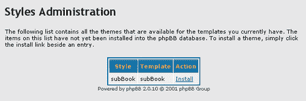
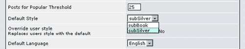
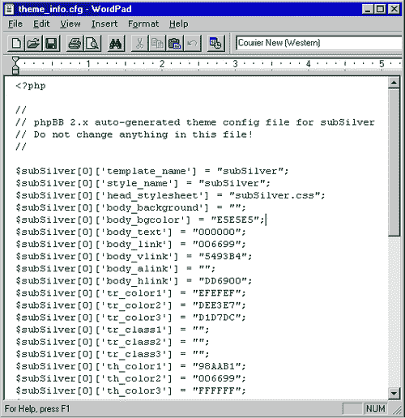
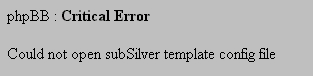
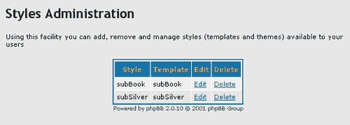
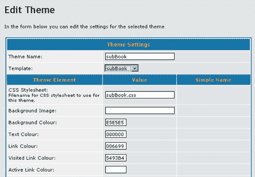

# 第四章：自定义您的论坛

现在你已经安装了 phpBB 并在管理控制面板中积累了一些经验，你准备好开始改变论坛外观和功能的更高级方面了。改变这些 phpBB 区域对于给你的论坛赋予一个独特的身份，使其在在线论坛中脱颖而出至关重要。论坛的外观主要受 phpBB 的样式系统控制，该系统管理论坛的颜色、图像和视觉布局。可以通过安装从 phpBB 相关网站下载的修改脚本来添加、删除或更改功能。

到本章结束时，你将了解以下内容：

+   phpBB 2.0 样式的基础

+   编辑 phpBB 文件的正确方法

+   如何添加和删除样式

+   常见的样式安装问题

+   自定义样式的途径

+   创建和修改样式的益处

+   更改论坛图像的方法

+   如何添加新的论坛功能

# phpBB 样式

如果你查看几个不同的 phpBB 论坛，你可能会注意到每个论坛都有一些差异。它们可能使用不同的颜色和图像，以不同的顺序显示功能，或者完全省略某些功能。通过使用不同的 phpBB 样式，可以实现这些多种效果。phpBB 的**样式**是由布局、颜色和图像的组合创建的论坛外观。当你安装 phpBB 时，默认样式 subSilver 也被安装了。subSilver 是在 phpBB 论坛上最常用的样式，但已经公开发布了超过两百种不同的样式。论坛通常提供多个样式供用户选择。

### 注意

在处理 phpBB 时，你有时会看到术语样式、主题和模板被互换使用。在本章中，主题和模板被定义为整体样式的两个较小方面，以减少混淆。这是在 phpBB 的代码和管理控制面板中最常使用这些术语的方式。即使后者有时也会用主题代替样式。

# 样式的结构

为了有效地自定义样式，你必须首先了解构成该样式设计的各个部分。样式，就像房子一样，是由更小的组件构成的，这些组件共同工作以形成一个框架。这个框架，就像房子的墙壁一样，为显示论坛的内部内容提供了一个结构。这些框架可以是非常复杂的创作，所以在我们进入样式的实际自定义之前，让我们看看这些基本部件是如何组合和存储的。

## 样式元素

样式由三个主要的**样式元素**组成，或更小的部分，它们共同工作以创建样式的整体视觉外观。这些是模板、主题和图像集元素。每个样式都是自包含的，并包含所有必要的样式元素以正确运行。

风格的第一部分也是最重要的部分是模板元素。**模板元素**是一组包含用于生成论坛视觉布局的全部标记的文本文件。**标记**主要由超文本标记语言（**HTML**）和 phpBB 自己的特殊模板功能组成，但也可以包括客户端脚本语言，如 JavaScript。模板文件用于安排论坛显示的大部分信息。你可以通过查看文件名来识别模板文件；所有模板文件都以`tpl`结尾。一些例子包括`index_body.tpl`、`viewtopic_body.tpl`和`message_body.tpl`。尽管这种情况很少见，但多个风格使用一组模板文件，具有不同的主题和/或图像集是可能的。

论坛风格的**主题**元素是一组用于定义论坛视觉装饰的格式化规则。主题最常见的用途是指定字体、颜色、背景颜色和页面元素的边框。主题元素可能难以定位，因为它们可以存储在三个不同的位置。大多数风格将主题数据存储在一个或多个**层叠样式表**（**CSS**）文件中，例如`subSilver.css`和`formIE.css`。CSS 文件的名字会随着每个论坛风格的不同而变化，但很多时候，至少会有一个以论坛风格命名的 CSS 文件。一些风格将它们的 CSS 格式化规则放在`overall_header.tpl`模板文件中，而不是单独的 CSS 文件中。其他可能结合使用`overall_header.tpl`技术和某些值的数据库存储。subSilver 风格使用组合方法，但也包括一个可以在手动更改后使用的 CSS 文件。

**图像集**元素包括构成某种风格的全部图像。一些例子包括文件夹图像、投票结果条形图以及“回复”和“新主题”等特定语言的按钮。还有一些图像主要用于装饰目的，例如背景或页眉图像。装饰图像有时被视为主题的一部分，而不是图像集的一部分。

除了已经讨论过的模板文件之外，模板元素还可以包含与主题和图像集元素相关的两个特殊配置文件。主题配置文件`theme_info.cfg`用于保存与模板关联的主题数据库数据。这些保存的数据可以在以后导入到另一个论坛的数据库中。在大多数情况下，你很少需要编辑此文件。它通常是自动生成或按需提供的。第二个配置文件包含模板配置数据。在大多数情况下，这仅仅是一个列表，列出了风格图像集中的图形文件。这些模板配置文件的名字基于它们匹配的模板，例如`subSilver.cfg`。

## 风格存储

论坛上所有可用的样式细节都存储在论坛的 SQL 数据库中。数据库仅包含已安装样式的列表、每个样式的相关模板元素名称以及一些有限的主题数据。不会在您的数据库中存储图像集数据。

另一方面，样式元素存储在论坛文件系统的 `templates` 目录中。`templates` 目录包含唯一命名的子目录，每个子目录对应一组模板文件。`templates` 的每个子目录将包含一个或多个样式的模板、主题、图像集和配置文件。在安装或创建新样式之前，`templates` 中唯一的子目录将是 `subSilver`。

在大多数情况下，`templates` 目录将包含另外两个子目录：`admin` 和 `images`。`admin` 子目录将包含用于显示管理控制面板的模板文件。`images` 子目录将包含样式使用的图像集，并且可能包含以语言命名的子目录，例如 `lang_english` 或 `lang_dutch`，用于显示不同语言的文本。一些更高级的样式可能包含除 `admin` 和 `images` 之外的其他目录。

# 编辑 phpBB 文件

在本章中，您将学习并使用一项新的技能，这对您作为 phpBB 论坛管理员来说非常有用。您已经了解了一些通过管理控制面板可用的强大配置和功能，但还有很多更多，这些功能只能在编辑 phpBB 的文件时访问（或在某些情况下添加）。在更改文件时，您必须小心遵循适当的程序，因为 phpBB 是一组精致且复杂的脚本。这样做可以节省您很多麻烦，正如许多人亲身体验的那样。

### 注意

您将在本书的几个后续部分再次提醒这些程序。在手动编辑任何文件之前，尽量遵循这些程序，即使没有提醒。这一点非常重要，因为这些程序在处理问题时可以节省您大量时间。

在编辑任何文件之前，您应该做的最重要的事情是备份该文件。这仅仅意味着创建文件当前状态的副本。如果您在编辑后遇到问题，可以使用备份替换已编辑的文件。这将有效地将您的论坛恢复到文件预编辑状态。在您的 phpBB 体验中，您肯定会需要使用文件的备份。每个人在某个时候都会犯错误，这没有什么可羞愧的。在其他时候，事情可能根本不起作用。无论原因如何，如果您在执行任何操作之前进行备份，那么对 phpBB 论坛来说，很少有错误是永久致命的。

当你编辑 phpBB 文件时，使用正确的程序类型非常重要。phpBB 使用三种类型的文件：图形文件、包含程序代码的文本文件和包含显示代码的文本文件。**图形文件**是你在任何网站上都会看到的标准图像文件，应该使用 Jasc Paint Shop Pro、Adobe Photoshop 或其他能够处理它们的任何程序进行编辑。然而，文本文件是特殊的。在图形文件中犯错误不会损坏你的论坛，但在显示代码文件或程序代码中犯错误可能会轻易地破坏你的论坛。

phpBB 的所有**程序代码文件**都包含操作和显示 phpBB 论坛和网站所有方面的必要脚本。它们是 phpBB 的骨架。这些文件可能有`.php`、`.inc`或`.cfg`的文件名扩展名，并且是在 Unix 文本文件格式中创建的纯文本文件。这主要意味着在编辑文件时，你需要使用能够理解 Unix 文本格式的程序。大多数简单的文本编辑软件都不会有问题。Microsoft Notepad，可能是 Microsoft Windows 操作系统中最常用的文本编辑器，无法完全理解 Unix 格式。它将 Unix 文本文件的所有内容显示在一行上，所以 Notepad 不是 phpBB 管理员的最佳选择。WordPad 编辑器，也包含在 Microsoft Windows 中，能够无任何问题地读取 Unix 文件。大多数专门的 phpBB 程序员使用具有与 PHP 编程语言相关的特殊功能的更高级的文本编辑程序。一些流行的例子是 EditPlus、TextPad 和 PHPEdit，但还有更多可供选择。然而，对于这里的示例，你可能不需要比 WordPad 更复杂的任何东西。

**显示代码文件**是模板元素的`.tpl`文件和之前我们了解过的主题元素的`.css`文件。像程序代码文件一样，这些是保存为 Unix 文本文件格式的纯文本文件。对于本章的示例，我们再次选择 WordPad 来编辑这些文件。有一些专门的 HTML 编辑程序，如 Dreamweaver MX，可以用来编辑模板文件。这些程序往往会产生与解决的问题一样多的问题，所以你可能现在想避免使用它们，除非你非常熟悉你选择的程序。

最后，关于编辑程序和显示代码文件还有一个注意事项。在保存这些文件时，你需要确保以正确的文件格式保存。这些应该是纯文本文件，所以你必须以那种格式保存。要在 WordPad 中保存编辑后的 phpBB 文件，只需点击**保存**工具栏图标或从**文件**菜单中选择**保存**。WordPad 应该自动正确保存文件。如果你必须选择**另存为**，确保在**保存类型**选择列表中选择**文本文件**。

### 注意

Microsoft WordPad 可能能够读取 Unix 文件格式，但它不会以该格式保存文件。相反，它以 **个人电脑**（**PC**）格式保存文件。

# 安装新样式

修改您论坛外观的最简单方法之一是下载并安装一个新的 phpBB 样式。基于色彩方案、热门电影、电视节目、爱好、运动等主题，已经创建了数百种不同的样式。这些样式中，大多数可以免费下载和使用，尽管也有一些商业样式和样式设计师。提供样式下载的一些网站还提供演示论坛，您可以在不下载任何内容的情况下预览任何样式。下载 phpBB 样式的两个最佳网站是：

+   phpBB 样式数据库：

    [`www.phpbb.com/styles/`](http://www.phpbb.com/styles/)。

+   phpBBHacks 模板数据库：

    [`www.phpbbhacks.com/templates.php`](http://www.phpbbhacks.com/templates.php)。

    ### 注意

    记住，一些在线社区在提到一个完整的样式时，使用的是“模板”或“主题”这样的术语，而不是样式元素的名称。[phpBBHacks.com](http://phpBBHacks.com) 通常就是这样使用“模板”一词的。

确保选择与您使用的 phpBB 版本兼容的样式。上述两个网站将列出每个样式的兼容 phpBB 版本，但其他网站可能不会。此外，请记住，一些其他网站携带用于与内容管理系统（如 PHP-Nuke）一起使用的特殊移植版本的 phpBB 样式。这些样式将**不**与原始口味的 phpBB 论坛兼容，反之亦然。

一旦您选择了并下载了新的样式，您需要将样式安装到您的论坛上。如果一切准备妥当，安装过程并不困难。但如果过程或样式的创建处理不当，您可能会觉得有些令人畏惧。

大多数下载将以 ZIP 文件格式提供。在您能够安装下载的样式之前，您需要解压缩 ZIP 文件。您可以使用各种软件程序来完成这项任务。如果您以 ZIP 文件格式下载了 phpBB，您可能已经熟悉了解压文件的过程。即使您不熟悉，也有许多解压软件程序可供下载。其中一些更著名的名称包括 WinZip、WinAce 和 WinRAR。其中一些，如 ZipGenius ([`www.zipgenius.it/`](http://www.zipgenius.it/)) 或 XAce，是免费的。WinZip 有一个向导模式，非常易于使用，所以我们在这里不会详细讨论解压过程。

## 创建副本样式

为了说明目的，本章将讨论一个名为 subBook 的示例样式的使用。这个样式不是下载和解压的，而是作为 subSilver 样式的快速重命名副本创建的。如果您想创建自己的 subBook 样式以便跟随，请按照以下简单说明操作。

##### 行动时间——创建副本样式

1.  复制 `templates/subSilver` 目录。该复制应包含在 `subSilver` 下找到的所有相同文件。

1.  将复制目录的名称更改为 `subBook`。

1.  将 `subSilver.cfg` 和 `subSilver.css` 文件分别重命名为 `subBook.cfg` 和 `subBook.css`。

1.  打开 `theme_info.cfg` 文件进行编辑。在这个文件中，您将看到 `subSilver` 被多次使用。将每个实例更改为 `subBook`。请注意，不要删除或更改文件中的其他任何内容。记住要遵循您之前学到的正确编辑程序。

1.  subSilver 样式的名称在您的 `subBook` 目录中的模板文件内大约有四十到五十行被引用。确切文件和次数取决于您使用的 phpBB 2.0 版本。当我们从 subSilver 创建新样式时，我们需要将这些引用更改为新样式的名称（在我们的例子中是 subBook）。显然，这一步骤将花费一些时间。这不会影响我们的安装或卸载示例，因此您现在可以跳过大部分内容。一些高级文本编辑器具有特殊的搜索和替换功能，可以帮助您更快地完成这项工作。至少，您应该在 `overall_header.tpl` 文件上执行这些步骤。

1.  保存并关闭所有打开的文件。

###### 发生了什么？

phpBB 可用的所有样式都是以存储在 `templates` 目录中的一组文件为基础的。创建新样式的最简单方法是将其他样式的文件复制过来，并对其中一些复制的文件进行一些修改。这些文件是配置文件，例如 `subSilver.cfg` 和 `theme_info.cfg`，phpBB 使用这些文件来安装和管理样式。在这种情况下，层叠样式表文件 `subSilver.css` 也被重命名了。因此，`overall_header.tpl` 中对 `subSilver.css` 的引用也必须更改为该文件的新名称。完成这些步骤后，您将获得一个新样式，您可以随意编辑它，而不会影响您论坛的其他样式。

## 逐个安装元素

一旦您有了要安装的新样式，无论是从下载还是复制 `subSilver`，您都需要将此样式的目录和文件放入您论坛的 `templates` 目录中。phpBB 的管理控制面板可以自动检测放入此目录的所有样式。如果您的论坛位于远程服务器上，就像大多数论坛和网站一样，那么您将必须通过您的网络托管公司支持的一种方法将目录和文件上传到该服务器。这通常是通过 **文件传输协议** (**FTP**)、SSH 或其他设置。一旦您将文件复制或放入 `templates`，您已经完成了样式安装的三分之二：



将新样式的文件放置在您的论坛文件系统中后，您现在可以通过 phpBB 的管理控制面板安装样式。使用管理员账户登录到您的论坛，并进入控制面板。在导航菜单框架中，滚动到**样式管理**部分。这里有几个选项；目前我们只对**添加**链接感兴趣。点击此链接进入**样式管理**页面。

**样式管理**页面列出了 phpBB 在您的`templates`目录中检测到的所有未安装的样式。您可能会注意到这个页面既使用**主题**也使用**样式**来指代样式。这种混淆源于我们只是通过将它们放置在`templates`目录中来安装了图像集和模板样式元素。剩下的只是安装主题元素，从而完成样式的安装。要安装主题，只需点击列表中条目旁边的**安装**链接。现在，phpBB 将在用户资料和 phpBB 配置页面中找到的下拉选择列表中显示该样式：



## 故障排除

phpBB 是一套复杂的脚本，所以即使是像安装样式这样简单的事情也可能给您带来问题。这些问题有很多原因，从设计师的错误到文件复制错误，但所有这些问题都很容易解决。让我们来看看论坛管理员在过去遇到的一些更常见的问题。

### 样式未出现在管理中

如果您已经将样式复制到`templates`目录中，但在**样式管理**页面中看不到该样式，通常是因为样式目录中应该存在的`theme_info.cfg`文件有问题。请确保此文件已被复制，并且文件名没有更改。如果文件存在且命名正确，那么问题可能出在文件内部。一些样式在分发时此文件中存在错误。

打开`theme_info.cfg`进行编辑。它应该类似于下图中显示的 subSilver 文件。请注意，每一行都以`$subSilver[0]`开头，后面跟着其他字符。`subSilver`部分非常重要，必须与样式的`templates`目录的名称完全相同，并且不能包含任何空格。当然，每个模板的名称都会不同。phpBB 会将所有这些视为完全不同的事物：

+   `subSilver`

+   `sub Silver`

+   `Subsilver`

+   `SubSilver`

+   `subsilver`



这张截图显示了一个未修改的 subSilver `theme_info.cfg`的部分。在这种情况下，只有我们的第一个选项`subSilver`是正确的。检查`theme_info.cfg`的每一行，并对文件进行必要的更正，或者如果需要，重命名样式的`templates`目录。在某些情况下，后者将是纠正问题的更简单方法。其他样式将在目录和`theme_info.cfg`中使用不同的名称，但这两个地方的名字必须相同。

### 配置文件无法打开

有时 phpBB 可能难以找到模板元素的配置文件。当这种情况发生时，无论是安装期间还是正常论坛操作期间，论坛都会向用户显示一个**严重错误**消息，如以下图所示，提到模板的名称。这个名称是错误消息的一个重要部分，因为它告诉你 phpBB 使用了什么名称来查找配置文件。当模板名称显示为 subSilver 时，phpBB 在`templates/subSilver`目录中找不到名为`subSilver.cfg`的文件。同样，名称 subBook 意味着 phpBB 在`templates/subBook`目录中查找`subBook.cfg`。这里的模式应该是清晰的：



为了修复这个错误，你需要确保 phpBB 可以找到相关的文件。就像样式在“样式管理”中未出现时的错误一样，实际文件和目录的名称必须与错误信息中的名称完全相同。`Subbook`不等于`subBook`。首先，在`templates`目录中查找，并确保存在一个具有模板名称的子目录。接下来，在该子目录内查找模板配置文件。如果目录或文件名称错误，将它们重命名为正确的拼写应该可以修复错误。

如果没有名为`templates`的子目录，或者即使接近正确名称的子目录，有两种方法可以暂时修复错误。第一种方法是重命名另一个子目录（以及其中的模板配置文件）为 phpBB 试图找到的名称。在这样做的时候，一定要记下原始名称，以便稍后快速更改回来。第二种方法更好，即复制另一个模板并重命名它。这个步骤与本章前面“创建副本样式”部分中的步骤相同，只是你不需要编辑`theme_info.cfg`文件。在暂时修复了问题后，你可以尝试卸载有问题的样式，或者找到更持久的解决方案，比如替换样式的`templates`文件。

## 删除已安装的样式

在某个时候，你可能会决定要从你的 phpBB 论坛中删除你添加的风格。与安装风格相比，这是一个更简单的过程。删除风格有两个步骤：从数据库中删除风格和主题信息，以及删除风格的`templates`目录。

在管理控制面板中，将导航菜单向下滚动到**风格管理**部分。点击**管理**链接将加载一个**风格管理**页面，列出论坛上当前安装的风格。它看起来与你已经见过的安装页面非常相似。通过点击某个风格旁边的**删除**链接，你将从论坛的 SQL 数据库中删除与该风格相关的所有信息。在真正删除之前，你会被要求确认删除。任何在个人资料中选择了风格的用户，在删除该风格后，他们的选择将自动更改。他们的个人资料设置将被更改为管理控制面板**常规配置**页面上的**板默认**风格。

### 注意

如果你论坛上只安装了一种风格，你就无法删除它。你也不能删除**板默认**风格



删除风格的第二个方面需要删除该风格相关的子目录，该子目录位于`templates`目录中。这通常是通过与安装时将风格复制到`templates`目录相同的方式进行。由于可能有多个风格使用单个模板或图像集元素，并且具有不同的主题，你应该确保删除这些文件不会损坏你在管理控制面板中未删除的任何风格。

# 创建或定制

到目前为止，我们只看了安装已经存在的新的风格。然而，这只是我们改变 phpBB 外观的众多方法之一。我们的其他两种选择是创建一个全新的风格或定制已经安装的风格，比如 subSilver。这两种选择都有一些优点和缺点。

创建一个新风格真的可以为论坛注入活力。如果你的论坛外观独一无二，你的访客更有可能记住它。你可能记得自己过去访问过的某些独特外观的网站。此外，你不必花时间浏览数百种现有的风格来寻找你喜欢的或与论坛主题搭配得好的风格。有时你可能甚至找不到适合你主题的风格！自己创建风格的诱惑很大。

另一方面，创建一个新的风格是件很费劲的工作！对于正常的 phpBB 操作，需要许多图形，你可能想要用你自己的图形替换它们中的大部分。你可能甚至想要创建新的图形并修改模板文件以创建新的视觉效果。本质上，你将设计一个完整的网站。如果你不是经验丰富的网页设计师或图形艺术家，你可能觉得这项任务超出了你当前的技术水平。

当你自定义现有的风格时，与创建一个新的风格相比，你会节省很多时间。现有的结构将已经完整，除了你想要做的任何更改。你可以快速替换任何图像或颜色来改变论坛的氛围，正如你将在本章后面看到的那样。原始风格创建者的工作将作为指导，帮助你发展知识。然而，如果你自定义了一个风格，那么相同的现有结构将限制你，除非进行大幅度的更改。很可能自定义的风格将与原始风格有相似之处，许多人会一眼就能看出。

那么，哪种方法更好？这实际上取决于你想要改变论坛外观的程度。有很大可能性，你可以找到一个现有的风格来自定义，它不会对你限制太多。然而，如果你看了足够多的风格，你会发现其中许多至少部分基于原始的 subSilver 风格。对于独特的东西，你必须创建一个新的风格。

在本章的剩余部分，我们将学习如何自定义现有的风格。然而，示例将使用本章早期创建的 subBook 风格。这种方法将允许我们保留论坛的原始 subSilver 风格，同时对我们选择的 subBook 副本进行任何更改。

在第六章中，我们将详细讨论设计一个全新的风格。

### 注意

如果你之前没有创建和安装 subBook，或者没有替换 subBook 模板文件中所有 subSilver 名称的使用，你现在可能希望这样做。如果你喜欢，你可以使用 subSilver，但这可能会导致你的论坛在后续章节的示例和截图中看起来与它们大不相同。

# 通过样式表进行自定义

修改论坛外观的最快方法是更改其颜色、字体和其他视觉（但非图形）装饰。当我们之前查看风格的基元素时，我们了解到主题通过**层叠样式表**（**CSS**）的格式化规则定义和控制这些概念。CSS 格式化规则向使用 HTML 等标记语言结构的文档添加风格数据，例如字体、颜色、大小、边框和间距的规范。由于 phpBB 创建此类文档以显示论坛，因此更改论坛外观这些部分的推荐方法是 CSS。

CSS 规则可以存储在三个不同的位置：在外部 CSS 文件中，例如 `subBook.css`，在 `overall_header.tpl` 中，或者将 `overall_header.tpl` 方法与一些数据库存储相结合。subSilver 使用组合方法，因此 subBook 也将采用相同的方法。

## 在管理面板中编辑样式表

我们可以先看看组合方法中的数据库存储部分。它允许我们通过管理控制面板编辑样式表的一些方面。输入到管理功能中的值被放入 SQL 数据库中，稍后用于 phpBB 显示的每一页。

要访问样式编辑工具，请访问管理控制面板的 **样式管理** 部分，并点击 **管理** 链接。这将加载您在探索删除已安装样式时看到的相同的 **样式管理** 页面。然而，我们现在对 **编辑** 链接而不是 **删除** 链接感兴趣。点击 **编辑** 将加载 **编辑主题** 页面，该页面提供了一个简单的表单，用于更改颜色、字体、文本大小以及一些其他主题方面。

##### 行动时间——编辑样式表

1.  在页面上找到标记为 **背景颜色** 的行。

1.  在这一行有一个包含文本 **E5E5E5** 的表单字段。删除该文本。

1.  在表单字段中输入 **CC0000**。使用数字零，而不是大写字母 O。

1.  滚动到页面底部并点击 **保存设置** 按钮。

1.  在下一页，点击文本 **点击此处返回样式管理** 中的 **Here** 字样。这将带您回到 **样式管理** 页面，您的更改将在此处反映。

###### 刚才发生了什么？

如其名所示，**编辑主题** 页面允许您更改论坛主题的一些方面。每个可更改的方面都有一个匹配的表单字段，例如论坛页面背景色的 **背景颜色**。通过将 **E5E5E5** 替换为 **CC0000**，您将页面背景颜色从浅灰色更改为红色。如果您将 **CC0000** 替换为 **E5E5E5** 并再次 **保存设置**，更改将被撤销。

### 编辑其他主题组件

您不仅可以更改页面的背景颜色。**编辑主题** 页面的前两个选项实际上允许您修改样式的两个方面，尽管它们的标签中可能使用了 **主题**。对 **主题名称** 的更改将在板风格选择列表和 **样式管理** 中反映。选择一个新的 **模板** 可以更改论坛的整体布局，同时保持当前的配色方案。您论坛的 `templates` 目录中的所有模板都将列在这个选择框中，即使它们目前没有被安装在某个风格中使用。

剩下的三十八个选项以三列格式呈现。第一列，**主题元素**，描述了单个设置，而第二列则包含当前值。当你安装一个新的样式时，一些值可能自动提供，也可能不提供；这因样式而异。这两列与你的需求最为相关。

第三列，**简单名称**，可以包含一些关于这些设置用途的额外描述信息。如果你查看 subSilver 的**编辑主题**页面，你可以在实际操作中看到这一点。不幸的是，phpBB 在安装新样式时没有导入**简单名称**数据的方法，因此这列通常会被忽略。你可以输入自己的简短描述，但除此之外，只有 subSilver 会使用这一列：



由于这个页面有如此多的选项，让我们集中讨论可以输入的值类型、最常用的设置以及你最可能想要更改的设置。许多设置是其他设置的替代版本，因此详细查看每一个都不是必要的。所有选项都列在本节末尾的表中。

### 注意

并非所有模板都会以相同的方式使用每个设置。一些模板甚至不会使用提供的所有设置。你应该将这里提供的描述视为设置*可以*使用的通用指南，而不是*必须*使用的指南。这里有很大的灵活性，一些模板正是利用了这一点。

### 允许的值

可以输入几种类型的值，并且大多数设置只接受一种类型。那些限制为一种类型的值可以归入文件名、颜色、字体大小和字体样式设置。所有其他设置接受文件名、颜色和 CSS 类名值，但在这些设置的每个组中只能使用一种类型的值。

文件名设置——**CSS 样式表**和**背景图片**——应仅用于样式`templates`目录中现有文件的名称。虽然可以使用不在`templates`子目录中的文件，但这通常需要编辑多个模板文件。一些样式，包括 subSilver，在首次安装时可能不会使用这对中的一个或两个。无论如何，请确保为**CSS 样式表**填写一个值，因为你可能以后会需要它。**背景图片**是可选的。

颜色设置需要十六进制颜色代码。十六进制颜色代码，有时也称为 HTML 颜色代码，是由六个字母和数字组成的组合，代表一种颜色，通常以井号符号（`#`）开头。许多网站提供了显示这些代码示例的图表和列表。当将十六进制颜色代码输入到本页面的颜色设置中时，你必须不包括井号符号。颜色设置只接受六个字符值，因此包括井号将导致代码的最后一位被截断！这可能会导致一些奇怪的颜色效果。你可能想为颜色设置输入一个颜色名称，如红色或绿色。如果你这样做，你将得到一些奇怪的结果。许多网站上有不同的十六进制代码列表。两个好的列表可以在[`www.htmlgoodies.com/tutors/colors.html`](http://www.htmlgoodies.com/tutors/colors.html)和[`webmonkey.wired.com/webmonkey/reference/color_codes/`](http://webmonkey.wired.com/webmonkey/reference)找到。

字体大小设置仅限于简单的整数，如 9、10 或 15。这些通常与像素或点测量的字体大小相关，但测量类型可能因样式而异。由于某些样式也可能使用百分比测量，你可能想在确定样式表中使用的单位类型之前不修改这些设置。

最后一个受限值设置——字体样式——接受逗号分隔的字体名称列表。一个良好的值示例是**Verdana, Arial, Helvetica, sans-serif**。如果你想在一个列表中包含一个由多个单词组成的名称，请将其放在单引号或双引号内：例如，**‘Verdana’，‘Trebuchet MS’**。你也可以使用单个名称，但使用列表会更好。当提供列表时，将使用查看者计算机上安装的第一个字体。

更灵活的设置允许你使用文件名、颜色或 CSS 类名作为值，正如之前所述。文件名值受到与文件特定设置相同的限制。颜色值可以是十六进制颜色代码，包括这次使用的井号符号，或者简单的名称，如蓝色。**CSS 类名**是层叠样式表（Cascading Style Sheet）格式化规则的名称。它们通常是由全部小写字母和数字组成的简短名称。将被命名的格式化规则将用于控制主题元素控制的所有内容的显示。

### 常用和修改过的元素

你已经在上一节中学习了几个设置，例如字体大小和样式。现在让我们来检查一下在**编辑主题**页面中的一些更有用的选项。

#### 表格单元格颜色

**表格单元格颜色 1、表格单元格颜色 2、表格单元格类 1** 和 **表格单元格类 2** 元素很有趣，因为它们可能是最常用的。phpBB 中任何显示表格行数据的方面，如成员列表、论坛和主题，都可以使用这些元素来实现交替行颜色效果。为了与 phpBB 的内部编码兼容，**表格单元格类 1** 通常具有 **row1** 的值，而 **表格单元格类 2** 则有 **row2** 的值。这是一种不成文的标准，但并不总是被使用。

#### 字体颜色

许多论坛管理员喜欢更改的两个选项，但经常在没有帮助的情况下找不到，是 **字体颜色 2** 和 **字体颜色 3**。所有字体颜色设置都用于为各种文本着色，但这两个用于论坛中几个位置（如在线用户列表）上管理员和版主用户名的特殊颜色。**字体颜色 3** 分配管理员名称的颜色，而 **字体颜色 2** 则详细说明了版主名称的颜色。

再次强调，这些颜色也在其他地方使用，所以如果您更改它们，请确保在论坛周围查看。很容易将名称颜色更改得很好，却发现您的表格标题或 BBCodes 代码变得难以阅读。

一旦您已将元素编辑到您的偏好，您应该在 **编辑主题** 页面的底部点击 **保存设置** 按钮以将新值存储到数据库中。您将看到一个确认消息，表明设置已更新，并且新的设置应该在消息之后加载的任何页面上反映出来。

以下表格列出了主题元素的名称并定义了它们：

| 主题元素名称 | 描述 |
| --- | --- |
| **CSS 样式表** | 附加到级联样式表文件的文件名。 |
| **背景图片** | 作为论坛背景使用的图片。在 subSilver 中不使用。 |
| **背景颜色** | 页面背景的颜色。 |
| **文本颜色** | 所有页面的默认文本颜色。 |
| **链接颜色** | 所有未访问链接的默认颜色。 |
| **已访问链接颜色** | 所有已访问链接的颜色。 |
| **活动链接颜色** | 点击链接时，它将改变颜色。在 subSilver 中不使用。 |
| **悬停链接颜色** | 当鼠标指针移到链接上时，它将变为这种颜色。 |
| **表格行颜色 1** | 表格行的背景颜色，通常非常浅。 |
| **表格行颜色 2** | 另一种通常中等的表格行背景颜色。 |
| **表格行颜色 3** | 第三行背景颜色，很少使用，通常是 darkest。 |
| **表格行类 1** | 表格行的 CSS 类名。在 subSilver 中不使用。 |
| **表格行类 2** | 第二组行的类名。在 subSilver 中不使用。 |
| **表格行类 3** | 第三行集合的类名。在 subSilver 中不使用。 |
| **表格标题颜色 1** | 表格标题的颜色。在 subSilver 中也用于页面边框。 |
| **表格标题颜色 2** | 第二个标题颜色。也用于 subSilver 中的表格边框。 |
| **表格标题颜色 3** | 第三个标题颜色。也用于 subSilver 中的内部表格边框。 |
| **表格标题类 1** | 表格标题单元格的 CSS 类名。 |
| **表格标题类 2** | 第二组表格标题单元格的类名。 |
| **表格标题类 3** | 第三组标题的类名。 |
| **表格单元格颜色 1** | 各种常见表格单元格的背景颜色。 |
| **表格单元格颜色 2** | 可选的表格单元格背景颜色。 |
| **表格单元格颜色 3** | 另一个表格单元格的背景颜色。在 subSilver 中未使用。 |
| **表格单元格类 1** | 表格单元格的 CSS 类名。常用于交替行颜色。 |
| **表格单元格类 2** | 第二个单元格类名。常用于交替行颜色。 |
| **表格单元格类 3** | 第三种可能的类名。在 subSilver 中未使用。 |
| **字体样式 1** | 大多数文本的默认字体样式。 |
| **字体样式 2** | 第二种字体样式，有时用于主题标题。 |
| **字体样式 3** | 第三种字体样式。常用于代码 BBCode 标签。 |
| **字体大小 1** | 最小字体大小。 |
| **字体大小 2** | 中等字体大小。 |
| **字体大小 3** | 最大的字体大小，用于大多数文本，包括帖子。 |
| **字体颜色 1** | 引用 BBCode 文本颜色。 |
| **字体颜色 2** | 代码 BBCode 文本颜色。也是版主用户名颜色。 |
| **字体颜色 3** | 表格标题单元格的文本颜色。也是管理员用户名颜色。 |
| **Span 类 1** | 用于 HTML span 标签的 CSS 类名。在 subSilver 中未使用。 |
| **Span 类 2** | 另一个用于 span 标签的类名。在 subSilver 中未使用。 |
| **Span 类 3** | 第三个用于 span 标签的类名。在 subSilver 中未使用。 |

## 通过更改 CSS 样式来改变您网站的外观

组合样式表存储方法的第二部分处理模板 `overall_header.tpl` 文件中放置的 CSS 格式化规则。这些格式化规则，或 **CSS 类**，控制论坛显示的许多方面。通过直接编辑 CSS 类，您可以创建比通过 **编辑主题** 工具可能实现的更广泛的设计更改。|

第一步是定位 `templates/subBook/overall_header.tpl` 中的 CSS 类。在 WordPad 中打开该文件，并向下滚动到包含 `<style type="text/css">` 的行。所有的 CSS 类都位于此行和包含 `</style>` 的另一行之间。每个类有两个主要部分：一个类名，也称为选择器，和一个声明块。

**类名**是一个简短且描述性的名称，将用于将单个类与论坛页面上的元素关联起来。名称可能与 HTML 标签的名称相同，例如 `body, td, hr` 或 `font`，或者以点开头的作者创建的名称，例如 `.postbody` 或 `.quote`。两种名称的组合，如 `td.row1`，也是可接受的。你还会看到包含以逗号分隔的名称的类；这是将一个类应用于所有命名元素的一种快捷方式。

声明块由一个或多个用大括号括起来的声明行组成。每条**声明行**包含一个属性名和值，由冒号分隔，并以分号结束。实际上，可以在一行文本中放置多条声明行，只要每条声明以分号结束，你将在文件中看到几个这样的例子。属性名和值指定了实际的格式化特性，如颜色、边框等。以下是一个用于下划线文本的示例行：

```php
text-decoration: underline;

```

大多数样式的样式表也会包含以 `/*` 开头和以 `*/` 结尾的注释行，这些注释行解释了每个类将影响论坛的哪些显示元素。注释行本身不影响任何布局特性。一个完整的类可能类似于这个示例。

```php
td.row2
{
color: black;
/* White Background */
background-color: #FFFFFF;
}

```

在你达到需要为你的论坛添加新功能的地步之前，你通常不需要非常频繁地更改类名，如果需要的话。另一方面，编辑声明块将让你几乎可以做任何事情。通过检查文件中的现有条目，你可以很好地了解通过在各个类中添加或删除声明行可以做什么。

### 注意

存在着成千上万种属性名称和值的组合。还有一些类型的类名在这里没有涵盖，或者没有在 subSilver 和 subBook 中使用。关于超出本书范围的可层叠样式表（CSS）的更多信息，请查看以下资源：

184 手动选择的样式表资源：[`www.cbel.com/style_sheets/`](http://www.cbel.com/style_sheets/)

W3Schools CSS 教程：[`www.w3schools.com/css/`](http://www.w3schools.com/css/)

css-discuss Wiki [`css-discuss.incutio.com/`](http://css-discuss.incutio.com/)

在 `overall_header.tpl` 中，你会看到许多包含特殊 **模板变量**（如 `{T_BODY_BGCOLOR}`）的声明行。模板变量是 phpBB 的一个特殊功能，用于将数据替换到从模板文件生成的布局中。模板变量的可识别特征包括以大括号开头和结尾，并且只包含字母、数字、下划线和点。你不会看到名称包含分号、冒号或大多数其他特殊字符的模板变量。样式表中的任何模板变量都将被“编辑主题”工具的“主题元素”值替换；它们是数据库和 `overall_header.tpl` 结合发挥作用的地方。有关模板变量及其匹配的主题元素名称的列表，请参阅本节末尾的表格。

模板变量也可以应用于其他类型的主题元素的类。例如，查看 subBook 的 `overall_header.tpl` 中的第一个类。这个 `body` 类影响 HTML `<body>` 标签，从而影响整个网页，在与滚动条相关的声明行中使用了几个表格颜色元素。如果浏览器支持这些元素，这些行将改变浏览器滚动条中某些部分的颜色。滚动条属性不是标准 CSS 功能的一部分，并且仅在特定浏览器中起作用，例如微软的 Internet Explorer。Netscape 和 Mozilla 浏览器忽略滚动条属性。

要找到一个有趣的例子，说明你可以如何改变论坛的外观，找到 `.bodyline` 类。这将在 `body` 类下方大约八行的地方。在行尾附近，你可以看到 `border` 属性，它管理论坛页面的边框。它目前应该有创建一个实心、一像素宽、浅蓝色边框的值，颜色可以在 **编辑主题** 中更改。现在，将单词 `solid` 替换为 `dashed`。保存此更改并查看论坛的索引页面——现在它有一个虚线边框。你也可以尝试 `dotted, ridge` 和 `groove` 以获得其他效果。通过改变同一区域 `1px` 代码的数字部分，你可以增加和减少边框的宽度。尝试 `10px` 和 `dotted` 一起使用，以获得一个不寻常的视图。

### 注意

在 `subBook/overall_header.tpl` 中找到的样式表代码在 `subBook/simple_header.tpl` 中重复，并在 `subBook/admin/page_header.tpl` 中经过一些修改后重复。如果你想在论坛的所有部分保持相同的样式，对其中一个文件所做的任何更改也应应用于其他文件。

### 使用外部样式表

通过在`overall_header.tpl`中放置样式表，phpBB 通过“编辑主题”页面给你提供了很多控制，但这也带来了代价。样式表必须在每个页面上重新加载，这可能会使非常繁忙的论坛变慢。一个替代方案是使用外部样式表文件，例如`subSilver.css`和`subBook.css`。网络浏览器不会像刷新内部样式表那样频繁地刷新外部样式表，这会导致页面尺寸更小，加载时间更快。然而，这种类型的样式表不支持“编辑主题”实用程序，因此该实用程序几乎变得无用。“编辑主题”仍然控制管理员和版主用户名颜色，以及根据样式，行类和颜色。

要为 subBook 启用外部样式表，请在`templates/subBook/overall_header.tpl`中找到以下行：

```php
<!-- link rel="stylesheet" href="templates/subBook/{T_HEAD_STYLESHEET}" type="text/css" -->

```

这一行是一个 HTML 注释行，由于开头和结尾附近有`!--`和`--`字符序列。就像层叠样式表注释行一样，它对页面布局没有影响。通过删除注释字符，可以使这一行成为外部样式表文件的引用。这一行应该看起来像这样：

```php
<link rel="stylesheet" href="templates/subBook/{T_HEAD_STYLESHEET}" type="text/css">

```

你还应该删除`overall_header.tpl`中的所有 CSS 类，否则它们将覆盖外部样式表中的相同类。如果你对那些 CSS 类做了任何更改，在从`overall_header.tpl`中删除代码之前，在`subBook.css`中做出相同更改。你将在`subBook.css`中找到相同的类，但你不能在外部样式表文件中使用模板变量。如果你在`simple_header.tpl`和`admin/page_header.tpl`中做出这些相同的更改，你可以通过单个样式表文件控制整个论坛的外观。注意，`admin/page_header.tpl`中的最后一行将略有不同。你需要在这行中的`templates`之前添加`../`，以便样式表在使用此文件的页面上正确显示。这些页面通常是管理控制面板页面，只有你可能看到（除非你给其他用户管理员权限）。`admin/page_header.tpl`的最后一行是：

```php
<link rel="stylesheet" href="../templates/subBook/{T_HEAD_STYLESHEET}" type="text/css">

```

下表列出了模板变量和相关主题元素：

| 模板变量 | 主题元素名称 |
| --- | --- |
| `{T_HEAD_STYLESHEET}` | CSS 样式表 |
| `{T_BODY_BACKGROUND}` | 背景图片 |
| `{T_BODY_BGCOLOR}` | 背景颜色 |
| `{T_BODY_TEXT}` | 文本颜色 |
| `{T_BODY_LINK}` | 链接颜色 |
| `{T_BODY_VLINK}` | 已访问链接颜色 |
| `{T_BODY_ALINK}` | 活跃链接颜色 |
| `{T_BODY_HLINK}` | 悬停链接颜色 |
| `{T_TR_COLOR1}` | 表格行颜色 1 |
| `{T_TR_COLOR2}` | 表格行颜色 2 |
| `{T_TR_COLOR3}` | 表格行颜色 3 |
| `{T_TR_CLASS1}` | 表格行类 1 |
| `{T_TR_CLASS2}` | 表格行类 2 |
| `{T_TR_CLASS3}` | 表格行类 3 |
| `{T_TH_COLOR1}` | 表格标题颜色 1 |
| `{T_TH_COLOR2}` | 表格标题颜色 2 |
| `{T_TH_COLOR3}` | 表格标题颜色 3 |
| `{T_TH_CLASS1}` | 表格标题类 1 |
| `{T_TH_CLASS2}` | 表头类 2 |
| `{T_TH_CLASS3}` | 表头类 3 |
| `{T_TD_COLOR1}` | 表格单元格颜色 1 |
| `{T_TD_COLOR2}` | 表格单元格颜色 2 |
| `{T_TD_COLOR3}` | 表格单元格颜色 3 |
| `{T_TD_CLASS1}` | 表格单元格类 1 |
| `{T_TD_CLASS2}` | 表格单元格类 2 |
| `{T_TD_CLASS3}` | 表格单元格类 3 |
| `{T_FONTFACE1}` | 字体样式 1 |
| `{T_FONTFACE2}` | 字体样式 2 |
| `{T_FONTFACE3}` | 字体样式 3 |
| `{T_FONTSIZE1}` | 字体大小 1 |
| `{T_FONTSIZE2}` | 字体大小 2 |
| `{T_FONTSIZE3}` | 字体大小 3 |
| `{T_FONTCOLOR1}` | 字体颜色 1 |
| `{T_FONTCOLOR2}` | 字体颜色 2 |
| `{T_FONTCOLOR3}` | 字体颜色 3 |
| `{T_SPAN_CLASS1}` | 段落类 1 |
| `{T_SPAN_CLASS2}` | 段落类 2 |
| `{T_SPAN_CLASS3}` | 段落类 3 |

# 通过图片进行自定义

论坛外观的另一个重要部分是通过图片来创建的。**论坛图片**可以分为两大类：一类是仅用于外观的，另一类则具有某种功能。前者可能包括论坛的标志或菜单链接图片，而后者可能包括新帖子指示器和发帖按钮。通过替换这些图片中的任何一个，您可以创建一个新的用户界面，并同时调整论坛的设计。如果您是一位图形艺术家或对创建自己的图片有经验，您可以创建一些令人惊叹的图片来活跃您的论坛。

当然，您也可以从 phpBB 社区下载新的图形。正如之前提到的，[phpBB.com](http://phpBB.com) 和 [phpBBHacks.com](http://phpBBHacks.com) 提供风格下载，同时也提供一些图形集。他们的一些图片下载包括排名和表情符号图片，但您也可以找到正常论坛按钮的套装。一些风格作者还制作了特殊的 PSD 图像套装，这些套装可以使用 Adobe Photoshop 和其他图像编辑器来创建新图像。如果您安装的风格有 PSD 套装，那么在以后添加论坛新功能时可能会很有用。

## 安装新图片以改变您网站的外观

在 phpBB 论坛中安装新图片有两种方式。第一种是替换现有图片。替换图片需要找到或创建一个图片，将其重命名为与论坛上已使用的图片相同的文件名，删除现有图片，并将新图片放在相同的位置。这是一种快速将新图形添加到论坛的方法，但它将限制您只能使用之前放置的相同类型的图片。如果您有一个像数码照片一样的 JPEG 图片，想要用于 subSilver 或 subBook 中的 **新主题** 按钮，您将不得不将其转换为 GIF 图片，在这个过程中会损失一些图片质量。对于这种情况，使用安装新图片的第二种方法：添加一个具有新文件名的图片会更好。

然而，为了使 phpBB 能够检测到新的文件名，你可能必须编辑你安装新图片的样式的模板配置文件。如果你还记得本章前面的内容，这些文件的名字与 `templates` 子目录的名字相匹配，例如 `subSilver.cfg` 或 `subBook.cfg`，并列出了论坛上找到的许多图形。列表中的条目通常类似于以下示例：

```php
$images[‘name’] = "$current_template_images/image.gif";
$images[‘name’] = "$current_template_images/{LANG}/image.gif";

```

如果你用 WordPad 打开 `subBook.cfg`，你应该会看到几行这种格式的文本。一般来说，你应该只编辑一行中最后一个反斜杠之后和最后一个引号之前的部分，例如示例中的 `image.gif`。如果你的新图片不在样式的 `images` 子目录中，比如 `templates/subBook/images`，那么你需要将 `$current_template_images` 替换为指向图片的正确路径。通常，将新文件直接放入样式的 `images` 目录中会更简单。特殊的 `{LANG}` 占位符允许 phpBB 使用支持多种语言的图片的不同版本。

你可能预期在配置文件中找到的一张图片——论坛的 phpBB 标志——实际上并不在那里。要更改标志的文件名，你必须编辑 `overall_header.tpl`。标志的 HTML 图像标签如下所示：

```php


```

注意，phpBB 的标志是 `logo_phpBB.gif` 文件。大多数人希望快速更改标志，所以这是一个很好的文件来尝试替换或重命名。

# Hacking phpBB

仅通过 phpBB 修改论坛的外观只是你可以执行的自定义操作的一个方面。对于一些有趣的变化，你很可能会想给你的论坛添加一些全新的功能。你也可能想移除一些你计划不使用的功能。为了添加新功能、移除现有功能或以其他方式更改 phpBB 论坛的能力，你必须编辑构成 phpBB 核心的 PHP 脚本文件。你可能还需要编辑或添加新的模板文件到论坛上安装的样式中。进行这类更改的过程被称为 **修改** 或 **hacking** phpBB。

## MODs 和 Hacks

在线 phpBB 社区中提供了许多更改 phpBB 功能的说明。这些下载可能包括更改核心 phpBB 文件或 SQL 数据库的步骤说明，添加新的论坛文件，或这三个类别的任何组合。这些下载通常被称为 MOD 或 Hacks。**Hacks** 是在 phpBB 1 时代使用的原始术语，并且在一些 phpBB 社区中仍然广泛使用。随着 phpBB 2.0 的推出，从“modifications”一词的缩写形式来的 **MODs** 术语也变得流行起来。为了避免混淆，本章中将使用 **修改** 一词。

## phpBB 修改

修改究竟包括什么？这取决于修改的范围。非常简单的修改通常包括一个包含更改现有 phpBB 文件说明的文本文件。更复杂的修改可能还包括要添加到 phpBB 的新文件和一个特殊的安装程序文件。一些极其复杂的修改通常包括所有这些，以及已经编辑过的原始 phpBB 文件的副本。所有这些文件都将一起放入一个压缩文件中，通常是 ZIP 格式。

虽然是一群开发者创建了 phpBB，但修改通常是需要修改效果的个别 phpBB 用户的工作。phpBB 是开源的，并按照 GNU 通用公共许可证发布，因此它及其任何衍生作品（如修改）可以免费提供给他人。修改作者将他们的作品提供给他人，希望其他论坛管理员能从中受益，并最终回馈给更大的 phpBB 社区。因此，存在大量不同编码方法和写作风格的修改。一些修改也处于开发阶段，你应该小心使用。它们通常包含可能导致你的论坛访客烦恼的错误、安全漏洞或不完整的特性。

找到大量 phpBB 修改下载的最佳位置是：

+   phpBBHacks.com: [`www.phpbbhacks.com/`](http://www.phpbbhacks.com/)

+   phpBB 官方网站: [`www.phpbb.com/`](http://www.phpbb.com/)

许多修改作者也会在自己的网站或其他 phpBB 社区上发布他们的作品。如果可能的话，确保你只下载描述为与你的 phpBB 版本兼容的修改。有许多 phpBB 1 和 phpBB 2 的版本，但并非所有修改都适用于每个 phpBB 版本。现在主要在[phpBBHacks.com](http://phpBBHacks.com)找到的 phpBB 1 修改将无法在任何 phpBB 2 版本上运行。一些 phpBB 2 修改可能只与 phpBB 2.0 的早期或后期版本兼容。

## 安装一个修改

当你找到并下载你想要安装的修改时，你需要遵循一系列步骤，将新代码放入你的论坛并完全激活它。像许多其他事情一样，所需的精确步骤因每个修改而异。然而，所有修改都存在一种通用的标准方法。首先，让我们安装这个简单的修改。它为每个用户的帖子添加了一个按钮，允许其他人快速搜索该用户的所有帖子。

```php
#
#-----[ OPEN ]------------------------------------------
#
templates/subSilver/viewtopic_body.tpl
#
#-----[ FIND ]------------------------------------------
#
//--></script><noscript>{postrow.ICQ_IMG}</noscript></td>
#
#-----[ IN-LINE FIND ]------------------------------------------
#
</noscript>
#
#-----[ IN-LINE AFTER, ADD ]------------------------------------------
#
{postrow.SEARCH_IMG}
#
#-----[ SAVE/CLOSE ALL FILES ]------------------------------------------
#
# End

```

##### 行动时间——安装一个小修改

1.  定位你论坛的`templates/subSilver/viewtopic_body.tpl`文件。使用你的文本编辑程序打开此文件。

1.  使用文本编辑程序的搜索功能在文件中找到此行文本。在许多程序中，此功能可以通过菜单访问或通过在 Windows 系统上按**Ctrl+F**来访问。

    ```php
    //--></script><noscript>{postrow.ICQ_IMG}</noscript></td>

    ```

1.  现在，找到该行中的文本`</noscript>`。

1.  在`</noscript>`之后，输入一个空格和文本**{postrow.SEARCH_IMG}**。该行的最终版本应类似于以下示例：

    ```php
    //--></script><noscript>{postrow.ICQ_IMG}</noscript> {postrow.SEARCH_IMG}</td>

    ```

1.  保存并关闭文件。如果需要，将其上传到您的网站，替换那里的现有文件。如果您愿意，可以使用`templates /subBook/viewtopic_body.tpl`文件重复所有这些步骤。

1.  前往您的论坛并查看任何帖子。您应该在帖子下方看到一个新的**搜索**图像。

###### 刚才发生了什么？

恭喜，您刚刚安装了您的第一个 phpBB 修改版！大多数修改版包含一系列与上一页类似的说明。作者希望您将这些说明作为将修改版添加到 phpBB 文件的基本指南。通过在您的`viewtopic_body.tpl`文件中放置一小段新代码，您已经启用了可以与论坛帖子一起显示的搜索按钮。

### 安装下载的修改版

下载并希望安装的修改版后，您必须首先解压缩下载的文件，如果它是 ZIP 文件或其他存档文件格式。这样做时，将创建一个或多个新文件，以及可能包含更多文件的目录。当只有一个文件时，它通常是一个简单的文本文件，您可以在 WordPad 中打开它。文件的名称通常是`readme.txt, install.txt, install.mod`或类似的东西。为了举例，让我们使用`install.txt`。

### 注意

如果修改版包含一个`install.mod`文件，您可能无法通过双击它来打开它，就像其他文件一样。`.mod`文件扩展名已经由一种流行的音乐文件格式使用了多年，所以像 WinAMP 这样的音乐播放器通常会尝试打开双击的`.mod`文件。在这些情况下，您必须通过 WordPad 的**文件 | 打开**菜单打开文件。

`install.txt`将包含安装修改版更改的所有说明，以及作者的致谢和关于更改的注释。较大的修改版可能包括一个`readme.txt`和一个`install.txt`文件。在这种情况下，通常在执行任何其他操作之前检查`readme.txt`是个好主意，因为它可能包含`install.txt`中未找到的特殊说明。

一些修改以段落形式简单列出，但大多数使用一个常见的模板，包括标题和称为操作的简单命令。修改标题将包含基本信息，例如修改的名称、版本号、作者、描述以及安装难度和时间的估计。有关修改及其历史的注意事项也可能在这里找到，因此请务必仔细阅读标题。**操作**描述了使用包含简短描述性名称的标题以及一条或多条代码的修改安装步骤。

下面是一个操作标题的示例，它可能出现在指令文件中。

```php
#
#-----[ ACTION NAME ]------------------------------------------
#

```

每个操作的名称将替换文本`ACTION NAME`。有许多种类的操作，每种操作都有不同的含义。当在一系列指令中使用时，操作名称通常全部大写。

### 注意

在对任何文件进行任何操作之前，请务必备份您被指示更改的任何文件。如果您需要刷新记忆，请参考本章前面的*编辑 phpBB 文件*部分。

### 复制操作

这个标记为**复制**的操作是指将文件放置到某些新的位置。通常，要复制的文件是修改的一部分，必须上传到您的论坛。有时它们已经在论坛中，只需移动即可，但这样的特殊情况应在修改说明中注明。

```php
#
#-----[ COPY ]------------------------------------------
#
db_update.php to db_update.php
functions_new.php to includes/functions_new.php
templates/*.* to templates/subSilver/*.*

```

上面的示例是一个典型的复制操作。每一行列出要复制的文件在左侧，以及复制的目标在右侧。除非另有说明，否则目标路径将与论坛的主要目录相关。在示例中，您将`db_update.php`放置在主目录中，与`viewtopic.php`和`profile.php`以及`functions_new.php`一起位于`includes/`目录中，以及修改的`templates/`目录中的所有文件都位于论坛的`templates/subSilver/`目录中。特殊表示法`*.*`是一种快速表示“此目录中所有文件”的方法。

### SQL 操作和编辑数据库

当黑客添加新功能时，它们通常以某种方式通过论坛的 SQL 数据库进行跟踪。为了使这正常工作，您需要修改数据库。修改作者将使用三种方法之一或多个来包含这些更改。第一种方法，并且在最近创建的修改中最为流行，是包含一个安装脚本文件。安装文件是具有`.php`文件扩展名的特殊文件，可以为您更改数据库。它们通常命名为`install.php`或`db_update.php`，但名称可以有所变化。要使用这些文件，通常只需将它们放置在论坛的目录结构中（复制操作会处理这一点）并运行该文件。

这一部分可能对您来说有些难以理解。学习如何安装修改的人经常问，“*运行* 文件是什么意思？” 要运行 `.php` 文件，您需要像访问普通网页一样在您的网络浏览器中访问它。一个很好的比较是思考您的论坛的 `viewtopic.php`，它显示所有主题。每次您在论坛中阅读一个主题时，您就是在运行 `viewtopic.php` 文件。仅仅访问您上传的 `db_update.php` 文件就会开始编辑数据库的过程。一些复杂的安装程序可能会引导您完成几个步骤。

### 注意

许多安装脚本在您在运行文件之前使用管理员账户登录到论坛之前将不会工作。始终确保首先登录，并在运行后立即删除安装文件！保留安装脚本可能会带来重大的安全风险！

包含数据库更改的第二种方法是在安装说明中的 SQL 操作部分放置一个 SQL 查询命令列表。第三种方法是将相同类型的列表放置在一个单独的文本文件中，该文件可能被命名为 `sql.txt` 或 `schema.sql`。其他名称也是可能的，但重要的是要注意，任何扩展名为 `.sql` 的文件都是一个包含 SQL 查询的文本文件。当使用这两种方法中的任何一种时，您需要执行以下两项操作之一：创建自己的安装脚本或手动运行更改。

创建自己的安装脚本并不难。实际上，有一些生成器可以为您创建 `db_update.php` 文件！可以在 [`www.phpbbhacks.com/forums/db_generator.php`](http://www.phpbbhacks.com/forums/db_generator.php) 找到这样一个生成器。只需从 SQL 操作或文件中复制 SQL 查询，并将它们粘贴到这个或另一个生成器中，提交表单，您将看到 `db_update.php` 文件的代码。您可以直接从该页面下载文件，将其放置在您的论坛中，并以您运行作者提供的安装程序相同的方式运行该文件。

### 注意

一些 SQL 查询可能与 `db_update.php` 生成器不兼容。这些通常会产生在运行时显示解析错误的安装脚本。如果发生这种情况，请访问友好的 phpBB 支持论坛，并寻求帮助以使查询兼容。

为了手动更改数据库，你可以使用 phpMyAdmin 或其他类似的数据库管理工具。然而，在执行此操作之前，你可能需要编辑 SQL 查询。当你安装 phpBB 时，你有一个选项可以输入一个数据库表前缀。phpBB 使用此选项的值作为所有数据库表名的开头。修改中的每个查询都应该提及一个数据库表名，例如`phpbb_posts`或`phpbb_config`。如果你的选择的表前缀是`myforum_`，在使用查询之前，你需要将表名更改为`myforum_posts`和`myforum_config`。安装脚本文件通常会自动进行此更改，所以如果你不熟悉这个过程，你应该考虑生成一个。以下是一些查询，在更改表前缀前后可能看起来是这样的：

```php
CREATE TABLE phpbb_tracker (
tracker_id mediumint(8) DEFAULT ‘0’ NOT NULL,
tracker1 tinyint(1) DEFAULT ‘0’ NOT NULL,
tracker2 varchar(40) NOT NULL,
PRIMARY KEY (tracker_id),
);
CREATE TABLE myforum_tracker (
tracker_id mediumint(8) DEFAULT ‘0’ NOT NULL,
tracker1 tinyint(1) DEFAULT ‘0’ NOT NULL,
tracker2 varchar(40) NOT NULL,
PRIMARY KEY (tracker_id),
);
INSERT INTO phpbb_tracker (tracker_id, tracker1, tracker2)
VALUES (1, 3,’Some text’);
INSERT INTO myforum_tracker (tracker_id, tracker1, tracker2)
VALUES (1, 3,’Some text’);

```

使用正确的格式编写查询后，打开 phpMyAdmin，如果需要，在左侧列中选择你的数据库。点击**SQL**标签或**查询窗口**链接。这两个选项都会加载一个包含大文本框的页面。从修改说明或文本文件中复制 SQL 查询，并将其粘贴到这个框中。点击**执行**按钮应该会自动在数据库上运行这些查询。

### 打开操作

这个简单的操作会告诉你需要编辑的文件的名字和位置。你应该在 WordPad 或你喜欢的文本编辑程序中打开这个文件，并准备好对其进行修改。如果你还没有备份文件，现在就备份。所有跟随打开操作的其他操作都应该在这个操作列出的文件上执行，直到你到达说明的末尾或另一个打开操作。

```php
#
#-----[ OPEN ]------------------------------------------
#
includes/functions.php

```

### 查找操作

每个查找操作后面都跟着一行或多行代码，这些代码应该包含在最后一个打开操作中的文件内。你的目标是找到这段代码，这应该是一个简单的任务。大多数文本编辑程序，包括 WordPad，都有一个**查找**或**搜索**功能，这使得在整个文件中搜索变得快速且简单。**查找**功能应该可以通过程序的菜单访问，或者在 Windows 程序中，通过按*Ctrl+F*。

不幸的是，有些问题可能会使查找行变得繁琐。首先，phpBB 已经发布了几个版本。每个版本都有一定的代码更改，所以 phpBB 2.0 将针对早期版本进行一些修改，其中查找代码与最新版本的代码有很大不同。在这些情况下，如果你认为版本之间的相关更改似乎很小，那么通常最好不安装修改。另一个问题是，一些修改试图查找已经被其他修改更改或删除的代码。一些作者试图通过只列出每行的前几个字符来绕过这个问题。这种做法由于对查找指令之后动作的误解，又产生了另一个问题。最后，一些代码行在某些文件中出现了不止一次。你可能只需要编辑特定的出现，或者编辑所有实例。

我们如何解决这些问题？有时这并不容易。如果你找不到某些查找代码，首先尝试的解决方案是搜索代码的小部分。假设你很难找到这个指令的行：

```php
#
#-----[ FIND ]------------------------------------------
#
‘SOME_TPL_VARIABLE’ => $some_php_variable,

```

寻找行中的关键部分，如`SOME_TPL_VARIABLE`，即使它已经被其他修改或 phpBB 的某个版本更改，也可能帮助你找到该行。在安装修改时，适应代码行的能力是一项关键技能，你可能需要随着时间的推移发展这项技能。

当处理文件中多次出现的行或代码块时，请记住，大多数修改都是根据从上到下的顺序编写的。比如说，你有一个包含两个查找命令的指令，第二个查找命令的代码在文件中出现了两次。作者通常是指让你在第一个查找命令的代码之后找到第一次出现的位置。

### 添加操作

有三种方法可以向文件中添加新代码：**在...之前，添加；在...之后，添加**；和**替换为**。这些添加操作将始终跟随查找操作，并参照查找操作中的代码。对于在...之前，添加操作，动作之后的代码应该放在文件中查找操作代码之前的一行。对于在...之后，添加操作，代码将放在查找操作代码之后的一行。替换为操作将删除查找操作的代码，并用新代码替换旧代码。

大部分情况下，这些是简单的步骤。关于之前添加和之后添加操作的一个要点非常重要，那就是**始终将新代码放在新行上，与其他所有代码分开**。正如已经提到的，一些修改作者在他们的查找操作中只包含部分代码行。这种做法的问题在于，修改用户倾向于在查找操作之后立即在同一行上添加新代码。这会将新代码直接放在原始代码的中间，从而产生一系列语法错误，这可能会使论坛无法访问。如果你总是通过在完全新的行上插入代码来在查找代码之前或之后添加代码，你应该能够避免这个问题。

为了说明文件代码应该如何看起来，这里有一些示例动作序列和正确的结果代码。为了这些例子的目的，假设一个包含以下代码的文件已经在打开操作中引用。

```php
<?php
$number1 = $number2 = $number3 = 0;
$number1 = $x + $y;
$number2 = $y + $z;
$total = $number1 + $number2 + $number3;
echo ‘The total is: ‘ . $total;
?>

```

首先，一个简单的查找和之后添加的组合：

```php
#
#-----[ FIND ]------------------------------------------
#
$number1 = $x + $y;
$number2 = $y + $z;
#
#-----[ AFTER, ADD ]------------------------------------------
#
$number3 = $a + $b;

```

这个序列应该创建：

```php
$number1 = $number2 = $number3 = 0;
$number1 = $x + $y;
$number2 = $y + $z;
$number3 = $a + $b;
$total = $number1 + $number2 + $number3;

```

下一个查找和之前添加的组合：

```php
#
#-----[ FIND ]------------------------------------------
#
$number1 = $x + $y;
$number2 = $y + $z;
#
#-----[ BEFORE, ADD ]------------------------------------------
#
$my_array = array(‘a’ => 1, ‘b’=> 2, ‘x’ => 3, ‘y’ => 4, ‘z’ => 5);
while( list($key, $value) = each($my_array) )
{
$$key = $value;
}

```

应用这个序列后，文件将包含：

```php
$number1 = $number2 = $number3 = 0;
$my_array = array(‘a’ => 1, ‘b’=> 2, ‘x’ => 3, ‘y’ => 4, ‘z’ => 5);
while( list($key, $value) = each($my_array) )
{
$$key = $value;
}
$number1 = $x + $y;
$number2 = $y + $z;

```

一个查找操作后跟一个替换为操作可能是：

```php
#
#-----[ FIND ]------------------------------------------
#
$total = $number1 + $number2 + $number3;
#
#-----[ REPLACE WITH ]------------------------------------------
#
$average = ($number1 + $number2 + $number3) / 3;

```

那个序列会将文件的结尾转换为以下代码片段。

```php
$average = ($number1 + $number2 + $number3) / 3;
echo ‘The total is: ‘ . $total;
?>

```

最后，这里是对之前查找和之后添加序列的另一种版本。这次，查找操作只包含行的一部分。应用该序列的结果应该与给出完整行相同。

```php
#
#-----[ FIND ]------------------------------------------
#
$number1 =
$number2 =
#
#-----[ AFTER, ADD ]------------------------------------------
#
$number3 = $a + $b;

```

### 内联操作

尽管你已经了解到在新的行上添加代码的重要性，但有时你需要在同一行内更改一段代码。内联操作用于此目的。这里有四种：**内联查找；内联之前添加；内联之后添加**；以及**内联替换为**。理想情况下，你会看到一个带有长段代码的查找操作，然后是一个带有该行短片段的内联查找，接着是其他三个内联操作之一。就像使用它们的正常对应物一样使用它们，但这次不要在单独的行上添加新代码。你实际上会在当前行内插入代码。在几个使用内联操作的修改中，你可能需要在几个不同的地方更改一行。

使用上面相同的简短文件，这里是一个内联替换为动作序列的例子，它编辑了一行中的两个部分。

```php
#
#-----[ FIND ]------------------------------------------
#
echo ‘The total is: ‘ . $total;
#
#-----[ IN-LINE FIND ]------------------------------------------
#
total
#
#-----[ IN-LINE REPLACE WITH ]------------------------------------------
#
average
#
#-----[ IN-LINE FIND ]------------------------------------------
#
$total
#
#-----[ IN-LINE REPLACE WITH ]------------------------------------------
#
$average

```

那个序列会改变文件的结尾，看起来像这样：

```php
$average = ($number1 + $number2 + $number3) / 3;
echo ‘The average is: ‘ . $average;
?>

```

### 最后一个操作

几乎每个修改的说明都以这个动作的某种变体结束：

```php
#
#-----[ SAVE/CLOSE ALL FILES ]------------------------------------------
#
# End

```

这是说明的最后一步。它作为提醒，要求您保存更改，关闭任何剩余的打开文件，并在必要时将编辑后的文件传输到您的论坛。完成这些操作后，您应该完成修改安装。您应该使用管理员账户、普通用户账户，并在必要时使用版主账户彻底测试安装。许多修改为具有不同权限的账户添加了不同的功能。为了测试目的，最好一次只安装一个修改。如果您同时安装三个或四个修改，并在论坛中遇到错误，您可能很难找到原因。

以下表格提供了修改动作的快速参考：

| 动作名称 | 定义 |
| --- | --- |
| 复制 | 将一个或多个文件从一个位置复制到另一个位置。 |
| SQL | 在您的论坛数据库上运行一个或多个 SQL 查询。这些通常应该在安装修改的其余部分之前完成。 |
| 打开 | 打开文件以备编辑。从这一步开始直到最后一步或另一个打开操作，所有操作都应在该文件上执行。它后面跟着一个单个的文件名。 |
| 查找 | 这在文件中定位代码，并跟随代码。 |
| 之后，添加 | 在先前的查找操作之后的代码之后放置以下代码，*在新的一行上*。它始终跟随一个查找操作。 |
| 在之前，添加 | 在先前的查找操作之前的代码之前放置以下代码，*在新的一行上*。它始终跟随一个查找操作。 |
| 替换为 | 删除先前的查找操作中找到的代码，并在其位置替换以下代码。它始终跟随一个查找操作。 |
| 在行内查找 | 通常跟随一个查找操作。在较长的代码行中定位以下代码。 |
| 在行内之后，添加 | 在先前的行内查找代码之后放置以下代码，*在同一行代码上*。它始终跟随一个行内查找操作。 |
| 在行内之前，添加 | 在先前的行内查找代码之前放置以下代码，*在同一行代码上*。它始终跟随一个行内查找操作。 |
| 在行内替换为 | 删除先前的行内查找中的代码，并在同一行上替换为以下代码。它始终跟随一个行内查找操作。 |
| 保存/关闭所有文件 | 表示文件更改的结束，并提醒您保存更改。它是修改的最后一个动作。 |
| 添加 SQL | 这是 SQL 动作的较旧形式，与该动作具有相同的意义。 |

### 模板的问题

修改安装的一个非常重要的方面仍然存在，就在您以为您已经完成的时候。当您安装修改时，您会发现几乎所有的修改或添加模板文件的说明中只会提到子 Silver 模板。到这时，您应该在您的论坛上至少安装了一个其他模板。由于存在如此多的模板，作者在说明中提及所有这些模板并不实际。由于每个 phpBB 论坛都可能在某个时候安装了子 Silver，并且许多模板都是基于子 Silver 构建的，所以只提到那个模板，并且有一个不言而喻的理解，即它实际上是对所有模板的引用。

模板的问题在于您必须为所有已安装的模板安装每个修改的模板文件更改，即使说明中没有告诉您这样做。此外，如果您安装了修改并后来安装了新的模板，您必须将这些修改应用到那些模板上。如果您忘记修改模板，使用该模板的任何论坛成员将无法访问修改的功能，除非他们切换到您编辑过的另一个模板。

这个领域另一个问题是模板本身的代码。虽然许多模板是从子 Silver 创建的，但相当多的是不是。后者往往在其文件中有一些非常不同的标记语言编码。除非您将其分解为单个模板变量，否则在查找操作中定位代码几乎是不可能的。您可能实际上必须重写新的模板文件或代码以匹配替代模板的外观，这可能会非常头疼。

### 卸载修改

有时，您可能需要在安装修改后将其移除。也许您发现两个修改相互冲突，或者修改没有达到您的期望。无论原因如何，卸载通常比安装更容易。

有两种方法可以移除修改对您文件所做的更改。由于您在编辑任何文件之前都创建了备份，因此您可以替换当前文件为那些备份副本。这将使论坛的文件恢复到修改安装之前的相同状态。如果您对文件所做的更改除了安装此修改之外，那么您不应该恢复备份文件。在这种情况下这样做会导致您其他更改丢失。

第二种方法是按照安装的说明进行操作，但反转动作命令。例如，如果说明有一个查找动作后跟一个添加动作，您将找到并删除添加动作的代码。在查找和替换组合的情况下，您将搜索替换代码，删除它，并将查找代码放置在那个位置。为了进一步说明这些概念，以下示例删除了在早期修改安装练习中添加到帖子中的**搜索**按钮。

##### 行动时间——卸载小修改

1.  在文本编辑程序中定位并打开您论坛的`templates/subSilver/viewtopic_body.tpl`文件。

1.  使用文本编辑程序的搜索功能在文件中定位此行文本。再次强调，大多数程序允许通过菜单访问此功能或在 Windows 系统上按*Ctrl+F*。

    ```php
    //--></script><noscript>{postrow.ICQ_IMG}</noscript> {postrow.SEARCH_IMG}</td>

    ```

1.  现在，定位该行中的文本`{postrow.SEARCH_IMG}`。

1.  删除此文本及其前面的单个空格。该行应再次看起来像最初的样子：

    ```php
    //--></script><noscript>{postrow.ICQ_IMG}</noscript></td>

    ```

1.  保存并关闭文件。如有必要，将其上传到您的网站，替换那里的现有文件。如果您愿意，也可以用`templates/subBook/viewtopic_body.tpl`文件重复所有这些步骤。

1.  前往您的论坛并查看任何帖子。您应该看到**搜索**图片不再显示。

###### 发生了什么？

通过反转您为安装搜索按钮修改所采取的动作，您已经从您的论坛中移除了它。您不是找到原始代码并添加到它，而是搜索了修改后的代码。然后您移除了原始修改添加的额外代码。这恢复了被更改的文件到其原始状态。

#### 移除其他更改

移除新文件和数据库更改的需求是之前示例中审查的两种移除文件更改方法共有的。修改添加的新文件处理起来既快又简单：只需删除它们。移除数据库更改是卸载的一个更复杂的方面；然而，phpMyAdmin 是一个方便的工具，可以简化这一过程。当一个修改添加了一个新表或表中的一列时，您可以在 phpMyAdmin 中找到这个添加项，并点击旁边的**删除**链接，这通常是一个垃圾桶图标。phpMyAdmin 将要求您确认删除（或称为当处理表或列时的删除，称为删除）；这样做，更改就会消失。

## 示例修改

自 phpBB 首次出现以来，已经发布了数千个针对 phpBB 的修改版本，供公众使用。想想您可能想要添加到或从 phpBB 论坛中删除的任何功能，可能已经至少有一个修改版本。每周都会创建并发布新的修改，因此通过这种方法定制论坛的可能性是无限的。

最受欢迎的修改之一是庞大的**文件附件修改模组**，包含超过 140 个文件。它为 phpBB 的帖子论坛添加了新功能，允许用户上传文件，这些文件将附加并显示在他们的帖子中。另一个常用的例子是修改个人资料，以前称为“向个人资料添加新字段”。这种修改是一个向用户注册和编辑个人资料表单添加新信息字段的指南。可以添加多种不同类型的字段，从简单的文本输入框到下拉选择列表。新字段中存储的数据也可以在公共个人资料、主题、帖子和其他论坛中的其他地方显示。

数十种修改改变了或添加了新的 BBCodes。用户和管理管理工具、在线游戏、商店、聊天室、最近的主题、下载系统、phpBB 错误修复或升级以及网站门户是一些其他广泛使用的修改示例。

这些列表只是描述可用于您的修改类型的一个表面。如果您花时间查看列出修改的网站，您肯定会找到一些您想在论坛上安装的东西。如果您仔细查看，您可能会发现许多可用于自定义论坛的东西。

## 移动元素

可以在不花费时间搜索详细修改的情况下对论坛进行一些布局修改。虽然您可以找到这些修改的下载，但修改通常处理布局问题不佳。模板之间的差异，有时是其他修改创建的，经常迫使论坛管理员在没有帮助的情况下重新排列布局。为了移动这样的元素，您至少需要具备基本的 HTML 编码知识。

您可能已经注意到，subSilver 和 subBook 在其论坛索引页面的底部有一些统计数据和一个登录框。您可以做出的一种流行更改是将这些元素中的一个或多个移动到页面的另一个部分。通过在`index_body.tpl`中找到创建它们的布局代码并将其放置在文件顶部附近，您可以强调用户应该登录或论坛上的用户和帖子数量。

## 向您的论坛添加新元素

在您的论坛中创建新区域通常需要完整的修改，包括说明。然而，有一些简单的事情可以在不进行修改的情况下完成。其中之一是在论坛的页眉菜单中添加一个新的链接。

##### 行动时间——添加菜单链接

1.  定位并打开用于编辑的`templates/subBook/overall_header.tpl`文件。如果您喜欢，可以使用`subSilver overall_header.tpl`文件代替。

1.  在此文件中找到包含代码`<!-- BEGIN switch_user_logged_out -->`的行。该行的开头将有几个制表符。

1.  在你刚才找到的代码之前的新行中插入以下代码：`&nbsp;<a href="{U_VIEWONLINE}" class="mainmenu">{L_WHO_IS_ONLINE}</a></span>&nbsp;`

1.  `4`. 将更改保存到文件并查看您的论坛。你可能需要重新加载或刷新论坛页面，但你应该会看到一个新的**在线用户**链接，它位于论坛顶部附近的链接之一。

###### 发生了什么？

你的论坛的菜单链接，如**个人资料、常见问题解答**和**搜索**，是由存储在`overall_header.tpl`模板文件中的 HTML 创建的。通过复制创建这些链接的一行或一系列行并稍微修改这一行，你可以创建一个新的菜单链接。在这种情况下，新的链接指向`viewonline.php`文件，该文件显示当前正在访问论坛的用户列表。如果这些步骤被写成修改，它们可能看起来像这样：

```php
#
#-----[ OPEN ]------------------------------------------
#
templates/subBook/overall_header.tpl
#
#-----[ FIND ]------------------------------------------
#
<!-- BEGIN switch_user_logged_out -->
&nbsp;<a href="{U_REGISTER}" class="mainmenu">{L_REGISTER}</a></span>&nbsp;
<!-- END switch_user_logged_out -->
#
#-----[ BEFORE, ADD ]------------------------------------------
#
&nbsp;<a href="{U_VIEWONLINE}" class="mainmenu">{L_WHO_IS_ONLINE}</a>
</span>&nbsp;
#
#-----[ SAVE/CLOSE ALL FILES ]------------------------------------------
#
# End

```

### 添加新语言

论坛管理员常见的另一种修改是安装新的语言文件。如果你计划让许多精通英语以外的语言或无法阅读英语的访客访问，你可能需要从 phpBB.com 的下载部分下载并安装一个语言包。每个语言包都会在用户资料和行政控制面板的**板语言**下拉列表中添加一个新选项。选择该选项将使论坛以该语言显示。帖子不会翻译，但许多链接和其他默认文本将会翻译。

在添加语言包时，你应该记住你可能需要编辑新的语言文件。一些修改可能包括新的语言文件或编辑语言文件的说明。如果你添加了新的语言而没有将这些更改复制到该语言，那么一些文本将不会出现在你的论坛上。这种情况与修改和模板类似；你必须编辑每种语言，即使修改说明只提到一种。

# 摘要

phpBB 在许多方面都是一款优秀且功能强大的论坛软件。定制可能性是其中最强有力的。通过你在本章中获得的知识和技能，你可以给你的论坛进行一次彻底的面貌更新，或者扩展其功能，使其超越你想象的任何事物。具体来说，你学习了：

+   phpBB 风格创建论坛的外观

+   编辑样式组件允许你改变外观的任何方面

+   修改是更改 phpBB 功能的说明，通常具有特殊格式

+   如何安装和删除从网站下载的样式和修改

+   编辑 phpBB 文件和解决错误的方法

后续章节将通过讨论创建个人风格和修改的细节来对这些主题进行一些扩展。
