# 第五章。论坛管理

在前面的章节中，您已经了解到您的版面是如何工作的以及如何自定义其外观。一些高级主题被跳过了，这样您可以专注于最重要的和最广泛使用的 phpBB 功能。现在是时候掌握 phpBB，并深入了解将使您成为真正的 power-phpBB-admin 的细节。

在本章中，您将了解：

+   使您的版面多语言化

+   配置头像

+   管理表情符号

+   分配等级

+   论坛权限

+   用户权限

+   用户组和组权限

+   数据库备份和恢复——再次审视

+   人类的一面——版主、网络战争和封禁

# 使您的版面多语言化

phpBB 是为了支持同一版面中的多种语言而开发的。整个界面（屏幕、消息、按钮、电子邮件等）被翻译成 50 多种语言。翻译者不是 phpBB 团队的成员，而是母语为英语的志愿者，这保证了翻译的正确性和准备好安装到您的版面。因此，您为您的社区提供了更好的服务，为他们提供了一个他们感到更舒适的界面。

##### 行动时间——为您的论坛添加西班牙语支持

1.  前往 phpBB.com 下载页面 [`www.phpbb.com/downloads.php`](http://www.phpbb.com/downloads.php)。

1.  滚动到**语言和图像包**部分，找到**西班牙语**（西班牙语）行：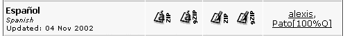

1.  选择您首选的压缩类型——ZIP 或 GZIP，并下载所选格式的两个存档。让我们以 ZIP 格式为例。第一个 ZIP 文件包含 phpBB 界面的文本，第二个包含界面图形，如新帖子、引用等按钮。这些图形仅适用于默认的 subSilver 主题。

1.  解压缩第一个文件，`lang_spanish.zip`（如果您使用托管服务，请通过 FTP 上传），到您的 phpBB 目录中的`language`目录。这应该在`language`目录下创建一个`lang_spanish`子目录。

1.  解压缩第二个文件，`subSilver_spanish.zip`，到选定的目录。当您这样做时，您会注意到它有一个嵌套的目录结构，在您的选定目录中，您将有一个`subSilver/images/lang_spanish`路径。如果您遵循此路径，您将找到许多 GIF 文件。

1.  将最后一个目录（`lang_spanish`，包含所有 GIF 文件的目录）复制（和/或通过 FTP）到您的相应 phpBB 目录，`templates/subSilver/images`。

###### 发生了什么？

在您成功解压缩 ZIP 存档并复制其内容后，您的论坛结构将如下截图所示：

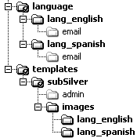

现在如果您登录到您的论坛并访问您的个人资料，您会看到**版面语言**下拉菜单现在有两个值，如图所示：

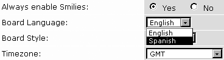

如果您将偏好设置改为**西班牙语**，您将看到整个论坛都使用西班牙语界面。¡Hola!

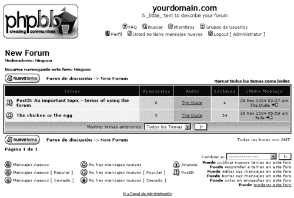

现在您已安装了两种语言，但英语仍然是论坛的默认语言。如果您的社区主要是西班牙语使用者，您可以考虑更改默认语言。为此，您需要前往管理员面板，并在**常规管理**下遵循**配置**链接。

# 头像：启用和配置

头像是那些位于所有帖子用户名下的小图像，在查看用户资料时也会显示。在 phpBB 中它们默认是禁用的，但可以通过管理员面板轻松启用。

使用头像有三个选项，它们不是互斥的；您可以选择其中的任意数量。

+   第一个选项是启用所谓的**相册头像**：可以作为头像使用的图像由您选择，并托管在 phpBB 运行的同一服务器上。用户只能从提供的图像中选择他们偏好的头像。

+   第二个选项是启用**远程头像**：头像图像可以托管在互联网上的任何服务器上，用户只需通过图像 URL 地址（以`http://`开头）链接到它。

+   第三个选项是允许用户**上传头像**：用户将他们的图片复制到您的服务器上，phpBB 在显示帖子时会从那里读取它们。

在做出决定时，所有这些选项都有其优缺点需要考虑。

+   **远程头像**在服务器安全方面是您最安全的赌注；一切都掌握在用户手中，您的论坛不负责托管或管理这些图像。然而，一些用户可能想要使用硬盘上的图像，而这些图像在互联网上无处可寻。此外，由于互联网的动态性，许多页面甚至整个网站可能在一天之内出现和消失。这意味着今天用户选择的图像明天可能就不可用了，并且一些浏览器（如 Internet Explorer）将显示一个损坏的图像图标，这看起来并不美观。或者即使头像可用，但托管在速度较慢的网站上，它可能会减慢整个页面的加载速度。当版主使用不允许热链接的服务器上的头像时，可能会出现问题。此外，您无法控制头像的大小。有人可能会将一个非常大的图片作为头像，从而破坏整个主题的外观。

+   使用**相册头像**，您可以控制图像的大小，因为您是选择它们的人。缺点是这些图像会增加您的带宽使用量，并且对用户来说过于限制性，因为他们只能从预定义的选择中挑选一个图像。

+   **上传的头像**可能会导致带宽增加，这对于用户众多的繁忙论坛来说可能是一个问题。另一个问题可能是，一些主机可能不允许您使用文件上传，因为普遍的担忧是用户对服务器所做的任何操作都可能具有潜在的危险性。除此之外，上传的头像还有许多好处，例如定义图像的像素大小和字节数。使用上传的头像，用户可以自由使用他们能找到的任何可能的图像，而不仅仅是互联网上可用的图像。

要配置头像，您需要以管理员身份登录，转到管理员面板，并显示通用配置表：

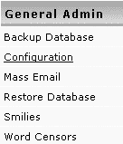

这是在配置表中的头像部分看起来像什么：

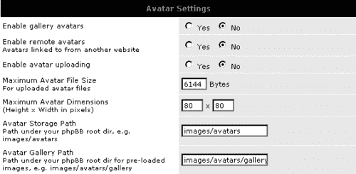

前三个字段代表前面讨论的三个头像选项。接下来的三个字段仅适用于上传的头像，而最后一个字段仅用于相册头像。

要更熟悉头像选项，最好的做法就是启用所有三个选项，并尝试使用头像。之后，您就可以做出选择了。

### 小贴士

**获取相册头像**

您可以从[`www.phpbb.com/styles/`](http://www.phpbb.com/styles/)获取您相册的头像。点击**下载**，然后**头像**。将包解压到配置中指定的`avatars`目录内的子文件夹中（默认为`images/avatars/gallery`）。

### 小贴士

**不要忘记权限**

如果您启用了头像上传，您必须确保指定的包含图像的目录（默认为`images/avatars`）是可写的，这意味着 Linux 系统上的`chmod 777`。在第二章中解释了设置文件权限。

您可以为相册头像设置类别；实际上，您至少需要有一个类别。这意味着您必须将*所有*相册头像复制到主头像相册目录的子目录中。例如，您会将`dog.gif`和`cat.gif`复制到`images/avatars/gallery/pets`，即使您托管的是一个宠物爱好者网站，而`pets`将是您永远需要的唯一相册。无论如何，这个功能有助于您保持相册的有序。

# 管理表情符号

phpBB 自带一组默认的表情符号，但您可以更改默认设置或添加新的表情符号。实际上，您的用户可能要求您添加更多表情符号，因为默认的表情符号可能不足以表达他们的情感。或者，可能只是因为您的某些成员习惯在其他他们访问的论坛中看到不同的表情符号，并怀念您论坛中的那些可爱图形。

如您所知，**表情符号**和**表情图标**是同义词。"表情符号"是一个更广泛使用的术语，而"表情图标"可能更准确，因为并非所有的小圆脸都在微笑。另一个有趣的事情是，"smilie"这个词可以拼写成"smilie"和"smiley"。phpBB 更喜欢"smiley"，但谷歌搜索结果显示"smilie"的结果更多，所以它显然更常用。在这本书中，我们采用了"smilie"。

phpBB 为您提供以下功能：

+   编辑或删除现有表情符号

+   逐个添加新表情符号

+   使用特殊的`.pak`文件批量添加新表情符号

+   使用您当前安装的表情符号创建`.pak`文件；如果您已经创建了许多想要与其他 phpBB 管理员分享的表情符号，这是一个好主意。

## 表情符号的特性

让我们先看看表情符号由什么组成。每个表情符号都有：

+   **一个图像**：如和这样的表情符号图像位于您论坛目录结构的`images/smilies`目录中。

+   **一段代码**：代码是发帖者需要输入（或通过点击相应的图像自动输入）的字符序列，以便在帖子中显示所选表情符号。对于前面提到的示例图标，相应的代码是**:D**和**:?**。有时一个表情符号可能有多个代码，因此有几种方法可以在帖子中包含相同的图像。您可以使用**:D**或**:-D**或**:grin:**，结果始终是图像。

+   **一种情感**：这是表情符号的人类可读表示。它可能（取决于浏览器）在读者将鼠标悬停在帖子表情符号上时显示为工具提示（在 HTML 术语中，它是`img`标签的`alt`属性）。

这里有一对图像展示了示例。左侧插图显示了写作时的帖子；右侧插图显示了在 Internet Explorer 浏览器窗口中（鼠标悬停在表情符号上）显示的帖子。

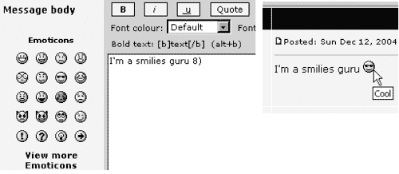

## 表情符号管理面板

所有表情符号操作都可以通过管理面板中的**表情符号**链接在**常规管理**部分下访问：

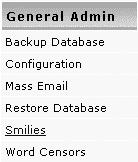

点击此链接将显示现有表情符号列表：

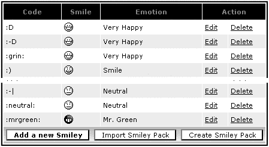

这张插图显示了列表被截断在中间。随着新表情符号的添加，列表可能会变得相当长。您可以看到表情符号的所有属性——代码、图像以及它们所代表的情感——以及您可以对其执行的可能操作。

在进行以下练习之前，备份您的`images/smilies`目录可能是个好主意，以防您想恢复到默认表情符号。

## 编辑或删除表情符号

要编辑或删除一个表情符号，请使用旁边相应的链接。

在操作时要小心，因为当您点击**删除**时，将不会有“您确定吗？”的确认；表情符号将被永久删除。删除表情符号意味着它不能再用于帖子中；这也意味着任何使用此表情符号的旧帖子将显示代码，但不会显示图像。

删除表情符号不会从服务器上删除实际图像，因为很可能这个图像也被其他表情符号使用。例如，如果您删除了带有**:-D**代码的表情符号，的图像不会被删除，因为它也被**:D**表情符号使用。即使您删除了使用特定图像的所有表情符号，该图像也会留在服务器上，并且可以通过定义新的表情符号稍后使用。

要编辑表情符号，请使用旁边的**编辑**链接。这将弹出一个包含所有表情符号属性表单，如图所示。

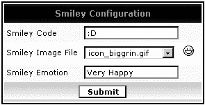

**表情图像文件**下拉字段列出了您板安装的`images/smilies`文件夹中找到的所有文件。从下拉菜单中选择一个图像文件会显示此图像在旁边。

## 添加新表情符号

添加新表情符号最简单的方法是使用现有图像。

##### 行动时间——使用现有图像添加新表情符号

1.  在表情符号管理面板中，点击**添加新表情符号**按钮。显示的表单与编辑表单相同。

1.  在第一个字段中，输入**:mg:**。

1.  在第二个字段（下拉菜单）中选择**icon_mrgreen.gif**。

1.  在最后一个字段中，输入**Mr. Green**。

1.  点击**提交**。

###### 发生了什么？

您使用相同的现有图像创建了一个新的格林先生表情符号。换句话说，您为用户使用此表情符号定义了新的方式。现在用户可以通过两种方式在他们的帖子中显示格林先生：使用默认代码**:mrgreen:**或新代码**:mg:**。

现在让我们添加一个全新的表情符号。假设您取了格林先生的图标并将其全部涂成橙色。现在让我们称这位先生为 Mr. Orange  并将文件命名为`mr_orange.gif`。

##### 行动时间——添加自定义表情符号

1.  将`mr_orange.gif`文件复制/FTP 到您的`images/smilies`目录。

1.  前往表情符号管理面板并点击**添加新表情符号**按钮。

1.  在第一个字段中，输入**:mrorange:**。

1.  在第二个字段中选择**mr_orange.gif**。

1.  在最后一个字段中，输入**Mr. Orange**。

1.  点击**提交**。

###### 发生了什么？

您刚刚为您的板添加了一个全新的闪亮表情符号。您现在可以在表情符号列表中看到它。

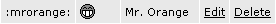

## 使用.pak 文件添加表情符号

您可能想知道如何创建像上面示例中使用的 GIF 文件。嗯，这是一个超出本书范围的话题，但您可以在互联网上找到许多工具和教程。如果您不想处理图形，不用担心；对您来说有好事。网上有很多表情符号图像可供下载和使用在您的论坛上。为了简化安装，phpBB 有一个使用`.pak`文件批量添加表情符号的功能。这个“pak”代表“包”。

如果您访问[`www.phpbb.com/styles`](http://www.phpbb.com/styles)，点击**下载**，然后**表情符号**，您将看到一系列可供选择的表情符号包。让我们选择其中一个包下载，名为**更多表情符号**的包。

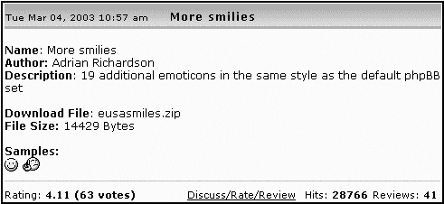

如果您下载`eusasmiles.zip`并解压它，您会看到它包含多个 GIF 文件和一个`eusa.pak`文件。不要被这个文件未知的扩展名吓到，它只是一个纯文本文件。如果您用任何文本编辑程序（如 Windows 中的记事本或 WordPad）打开它并查看文件内容，您会注意到它只包含表情符号属性，由字符序列`=+`：用作分隔符。

例如，文件的最后一行说：

```php
eusa_silenced.gif=+:Silenced=+::-#

```

这意味着**:-#**是表示**静音**的表情符号代码，其图标图像名为`eusa_silenced.gif`。

现在让我们使用提供的`.pak`文件快速将大量新表情符号添加到论坛中。

##### 行动时间——使用.pak 文件添加表情符号

1.  将未压缩的内容（GIF 图像和.pak 文件）复制到您的公告板`images/smilies`目录中。

1.  前往管理面板中的表情符号管理区域，并点击**导入表情符号包**按钮。您将看到**表情符号包导入**表单。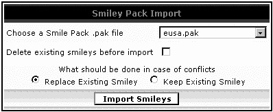

1.  在下拉菜单中，选择**eusa.pak**。

1.  保持其他字段不变。它们代表您对现有表情符号的处理选项以及如何处理任何冲突。

1.  点击**导入表情符号**。

###### 发生了什么？

您一次添加了大量的新表情符号。您现在可以在表情符号列表中看到它们，就在您在上一个练习中添加的橙先生表情符号之后。新的表情符号列表将看起来像这样：

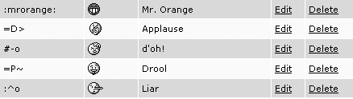

## 创建.pak 文件

您可以使用现有的表情符号配置创建一个`.pak`文件。您可以用它进行备份或分享您的图标。比如说，您不仅创建了橙先生，还创建了白先生、粉先生、棕先生和金发先生，并且按照为橙先生相同的程序手动添加了它们。

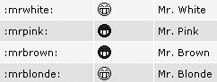

现在让我们创建一个`.pak`文件，该文件将包含您已添加的所有表情符号属性，这样您就可以与其他 phpBB 管理员分享您的表情符号。

### 注意

本章中使用的图片可在书籍的下载区域 [`www.packtpub.com`](http://www.packtpub.com) 获取。

##### 动手时间——创建 .pak 文件

1.  前往表情符号管理并点击 **创建表情符号包** 按钮。

1.  您可以获取有关使用 `.pak` 文件的信息，以及下载为您生成的 `.pak` 文件的选择。下载它。默认情况下，该文件名为 `smilies.pak`，但您始终可以将其重命名为其他名称，例如 `reservoir_dogs.pak` 等。

1.  包含文件包含您论坛上所有表情符号的所有属性，但实际上您只需要您的 *五个* 自定义表情符号。因此，在文本编辑器中打开 `.pak` 文件，删除所有不必要的行，只留下您的五行。现在 `.pak` 文件的内容应该看起来像：

    ```php
    mr_orange.gif=+:Mr. Orange=+::mrorange: mr_white.gif=+:Mr. White=+::mrwhite: mr_pink.gif=+:Mr. Pink=+::mrpink: mr_brown.gif=+:Mr. Brown=+::mrbrown: mr_blonde.gif=+:Mr. Blonde=+::mrblonde:

    ```

1.  将这个 `.pak` 文件与五个图片一起压缩。

###### 发生了什么？

您已经创建了一个包含您创建的所有表情符号的 `.pak` 文件。如果您想安装您自定义的表情符号，您可以将其发送给其他 phpBB 管理员。

## 分配等级

等级是给予社区成员参与信用的一种另一种方式。默认情况下只有一个等级：**网站管理员** 等级。您可以创建两种类型的等级：**按帖子数量划分的等级** 和 **特殊等级**。第一种类型的等级是自动的，并且随着成员不断发帖而分配。第二种类型不依赖于帖子数量，您可以根据需要使用管理面板中的用户管理功能进行分配。

等级被赋予名称，通常像 **新用户、爱好者、论坛迷** 等这样的名称。等级可以可选地包含等级图片。当查看用户的帖子时，分配给用户的等级名称将显示在用户名下方，等级图片将显示在等级名称下方，在头像上方。以下是一个分配等级时帖子作者信息区域的外观示例：


在这个示例中，**The Dude** 是您从上一章中已经知道的用户名，**论坛巫师** 是等级名称，五个星星是等级图片，而油漆刷点画是用户的头像。

以下示例将帮助您获得一些分配等级的实际经验。为了第一个示例，让我们假设您已经创建了五个等级图片。这些图片是 GIF 格式，分别显示一个、两个、三个、四个和五个蓝色星星，如下所示：

+   `rank1.gif`：

+   `rank2.gif`：

+   `rank3.gif`：

+   `rank4.gif`：

+   `rank5.gif`：

如果制作 GIF 文件不是您的强项，别担心，您可以从互联网上下载等级图片：当然，一个可以查看的地方是 phpBB.com 网站。访问样式部分，然后点击 **下载**，接着点击 **等级图片**。您也可以在 phpBBHacks 网站上找到许多等级图片，网址为 [`www.phpbbhacks.com/rankimages.php`](http://www.phpbbhacks.com/rankimages.php)。

##### 行动时间——创建自动等级

1.  在您的论坛的 `images` 目录中，创建一个名为 `ranks` 的子目录。这将把与等级相关的图片与其他图片分开。

1.  将上面列出的文件（`rank1.gif` 至 `rank5.gif`）复制到新创建的目录中。

1.  在管理面板中，点击管理菜单中的 **等级** 链接（最后一个链接）。

1.  点击 **添加新等级** 按钮。

1.  您将看到 **等级管理** 表单。按照说明填写：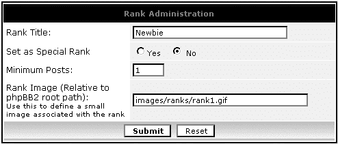

1.  点击 **提交**。

1.  重复步骤 4 至 6，直到使用完所有等级图片。最后，您的等级设置将如下所示：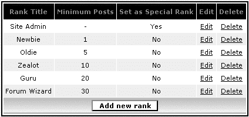

###### 发生了什么？

您已成功设置了一个自动排名系统，该系统将在每个成员的帖子用户名后显示等级名称和等级图片。具体的等级将由 phpBB 根据该成员的总帖子数来确定。

实际上，您可能希望使用更多的帖子数量，但为了测试功能，这已经足够了。

现在我们来看看创建特殊等级的程序以及如何将特殊等级分配给您认为特别成员的方法。

##### 行动时间——创建和分配特殊等级

1.  在等级列表中点击 **添加新等级**。

1.  按照说明填写表单：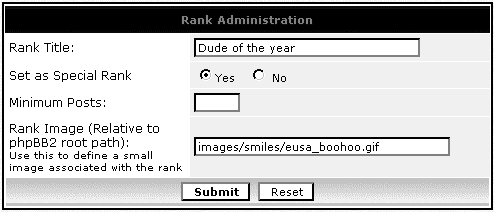

1.  点击 **提交**

1.  现在，在左侧菜单中，点击 **用户管理** 部分的 **管理** 链接。

1.  在文本框中输入 **The Dude** 并点击 **查找用户**。

1.  滚动到用户管理表单的底部。在 **等级标题** 下拉菜单中，选择 **年度达人**。

1.  点击 **提交**。

###### 发生了什么？

步骤 1-3：您创建了一个特殊等级，这意味着它与帖子数量无关。**最小帖子数** 字段留空，因为它不适用于特殊等级。实际上，即使您在其中输入了某些内容，phpBB 也会忽略该值。在这个例子中，您没有创建新的等级图片，而是重新使用了现有的表情图片。

步骤 4-7：您已将新创建的特殊等级分配给用户。如果您现在访问您的论坛前端，并找到 The Dude 的帖子，您将看到新的等级。

# 理解论坛权限

论坛权限已在 第三章 中讨论，但现在我们将采取更深入的方法，以便我们可以更精确地指定谁可以在您的论坛上做什么。

让我们从定义两个重要术语开始：**权限类型**和**权限级别**。

### 权限类型和权限级别

**权限类型**和**权限级别**是处理 phpBB 权限时的重要术语，理解这些将有助于你在考虑如何分配和控制权限时：

+   **权限类型**是用户在版面上可以执行的操作，如查看、回复、投票等。当你考虑权限类型时，想想“什么”，在“可以做什么？”

+   **权限级别**反映了关于谁可以执行特定操作的限制。每个用户至少有一个权限级别。当你考虑权限级别时，想想“谁”在“谁可以做到？”

以下列表讨论了存在的权限类型（“*什么*”），以及它们为用户提供的能力。（你已经知道这些动作的含义，因为它们在前面的章节中已详细描述。）

+   **视图**：用户可以看到在版面首页存在一个论坛。

+   **阅读**：用户可以列出论坛主题，阅读帖子，查看成员资料和他们的联系信息。

+   **回复**：用户可以在现有主题中发表帖子。

+   **发帖**：用户可以开始新主题。

+   **编辑**：用户可以编辑自己的帖子。

+   **删除**：用户可以删除自己的帖子，前提是还没有人回复过它们。

+   **置顶**：用户可以开始置顶主题。这取决于帖子权限——如果你不能发帖，你当然不能发置顶主题。

+   **公告**：用户可以开始公告。就像置顶类型一样，帖子权限是一个先决条件。

+   **投票**：用户可以在投票中投票。

+   **创建投票**：用户可以为其他人创建投票。

权限级别，或“*谁*”，也可以被视为用户类型。

这里是可能的权限级别：

+   **所有人**：访问该版面的人；这包括当前未登录的成员。

+   **注册用户**：在版面上注册并当前登录的成员。

+   **私人**：一个单独分配的特殊权限级别。为了使处于此级别的用户能够与其他人私下交流，必须授予该用户对私人论坛的私人访问权限。这是权限中最复杂的一部分，所以如果你还不理解，不要害怕。这里将有一些例子来阐明这个概念。

+   **版主**：可以对该论坛做任何事情的版主。

+   **管理员**：版面管理员（就像你这样的人，可以访问管理面板）。

### 简单和高级模式设置权限

如你所知，有两种设置权限的方式：简单模式和高级模式。简单模式已在第三章中讨论，正如你所知，它为你提供了预定义的权限选项。

如果你访问高级模式，你会看到我们上面讨论的所有可能的权限类型和权限级别。为此，以管理员身份登录，转到管理员面板，在**论坛管理**部分点击**权限**，查找任何论坛，然后点击**高级模式**。以下是你会看到的内容：

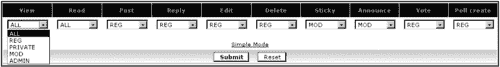

此屏幕显示了所有权限类型（显示为表头）和权限级别（这些是下拉框中的值）。上面插图所示的高级权限在简单模式中显示为**注册用户**，如下面的插图所示：

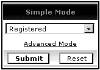

我们已经看到简单模式是一种更快、更简单的方式来设置权限。现在让我们找出简单模式——**公开、注册、私人**和**版主**——的确切含义，以及它们**组合**了哪些高级权限设置。

关于这些模式的大致想法是，它们定义了谁可以在所选论坛中发帖（例如，所有人都可以在**公开**论坛中发帖，但只有登录的成员可以在**注册用户**论坛中发帖，等等）。

除了**公开**模式外，所有其他简单模式都有一个选项，其名称中包含**[隐藏]**。这意味着没有足够权限的用户不仅不能**发帖**，甚至无法**看到**这样的论坛存在。

这里是对简单模式权限的更详细解释：

+   **公开**：所有人（权限级别 ALL）都可以查看公开论坛，阅读它，回复话题，并开始新话题。注册并登录的成员（权限级别 REG）甚至可以编辑和删除自己的帖子、投票和创建投票。

+   **注册用户**：所有人都可以查看和阅读论坛。注册用户（REG）可以发帖、开始话题、编辑和删除自己的帖子、投票和开始投票。

+   **注册[隐藏]**：与上述相同，但所有人现在都无法查看或阅读论坛——他们必须注册才能这样做。

+   **私人**：论坛对所有用户可见，仅为了看到它的存在，但它是私人的，只有明确允许访问此论坛的用户才能阅读帖子、发帖、开始话题、编辑和删除自己的帖子、投票和开始投票。本章的下两个部分将解释如何授予用户私人访问权限。关于私人论坛的另一个特定之处在于，私人成员也可以发表粘性帖子。然而，公告仍然是“仅限版主”区域。

+   **私人[隐藏]**：与上述相同，但所有人现在都无法看到这个论坛的存在。这是一个真正受保护和私人的论坛。

+   **版主**：与**注册用户**和**私人**相同，但只有版主可以阅读、发帖、开始话题、投票等。一个用户必须在这个论坛中是版主才能使用它。在其他论坛中成为版主并不意味着用户可以访问这个论坛。

+   **版主[隐藏]**：与上述内容相同，除了 ALL 甚至看不到这样的论坛存在。

下表解释了与上述要点相同的内容，但更详细。你会发现这实际上是一种理解权限的好方法。

| x | 公开 | 注册用户 | 注册用户[隐藏] | 私人 | 私人[隐藏] | 版主 | 版主[隐藏] |
| --- | --- | --- | --- | --- | --- | --- | --- |
| **查看** | ALL | ALL | REG | ALL | PRIVATE | ALL | MOD |
| **阅读** | ALL | ALL | REG | PRIVATE | PRIVATE | MOD | MOD |
| **发布** | ALL | REG | REG | PRIVATE | PRIVATE | MOD | MOD |
| **回复** | ALL | REG | REG | PRIVATE | PRIVATE | MOD | MOD |
| **编辑** | REG | REG | REG | PRIVATE | PRIVATE | MOD | MOD |
| **删除** | REG | REG | REG | PRIVATE | PRIVATE | MOD | MOD |
| **置顶** | MOD | MOD | MOD | PRIVATE | PRIVATE | MOD | MOD |
| **公告** | MOD | MOD | MOD | MOD | MOD | MOD | MOD |
| **投票** | REG | REG | REG | PRIVATE | PRIVATE | MOD | MOD |
| **创建投票** | REG | REG | REG | PRIVATE | PRIVATE | MOD | MOD |

在设置权限时，选择一种简单的模式总是一个好主意。这些模式已经被 phpBB 团队精心挑选，以匹配最常用的论坛类型。如果你觉得你需要不同的东西，你总是可以切换到高级模式。在这种情况下，首先使用简单模式设置和保存权限，然后再编辑它们，并切换到高级模式进行微调。

##### 行动时间——创建和微调私人论坛

1.  以管理员身份登录并转到管理员面板。

1.  前往**论坛管理**下的**管理**。

1.  在这个类别中创建一个新的类别名为**特殊论坛**，然后在这个类别中创建一个新的论坛名为**The Dudes 论坛**。

1.  在**论坛管理**下点击**权限**链接。

1.  从**选择一个论坛**下拉菜单中选择**The Dudes 论坛**并点击**查找论坛**。

1.  您现在位于**论坛权限控制**区域和**简单模式**。

1.  选择**私人[隐藏]**并点击**提交**。

1.  重复步骤 5。

1.  点击**高级模式**以切换到更强大的编辑表单。

1.  在**置顶**列中，将 PRIVATE 值更改为 MOD。

1.  点击**提交**以保存设置。

###### 发生了什么

步骤 1-3：您已创建了一个新的类别和一个新的论坛。

步骤 4-7：您已使用简单模式设置论坛权限。您已设置权限，以便只有特殊私人成员可以查看、阅读、发布等，在论坛上。唯一私人成员不能做的事情是发布公告。（当然，如果用户不是版主，他们只能编辑或删除**他们自己的**帖子，而不能编辑其他私人成员的帖子。）

步骤 8-11：您再次设置了权限，这次使用的是高级模式，并禁止私人成员发布置顶帖子。

现在，如果你访问你的论坛首页，你会看到新的类别和新的论坛（因为你以管理员身份登录，可以查看和做任何事情），但一旦你登出，论坛和整个类别将不再可见。

在接下来的两个部分中，我们将了解如何通过将某些成员设为私有成员，使私有论坛对某些成员可见。

# 理解用户权限

你已经知道如何使用管理员面板的权限区域将用户设为版主；让我们看看你还能做什么。如果你记得，用户权限可以通过**用户管理**部分下的**权限**链接访问：

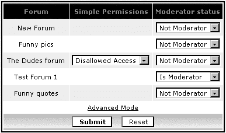

你可以看到，除了在这里设置版主状态外，你还可以为每个论坛指定用户权限（换句话说，指定仅适用于特定用户的论坛权限）。请注意，您只能为此选项使用*私有论坛*；对于所有其他类型的论坛，论坛权限将应用，并且用户权限不能覆盖它们。

### 注意

根据定义，*私有论坛*至少设置了一种权限类型为私有。

在上一节中，我们将**Dudes 论坛**创建为一个私有论坛，因此现在在用户权限控制区域，我们可以允许或禁止用户访问私有论坛。允许访问意味着此用户成为私有成员，可以执行私有成员被允许执行的所有操作——用户将拥有论坛管理中为私有级别设置的权限类型（例如阅读、发帖等）。

##### 行动时间——将 Dudes 论坛的 Dude 设为私有用户

1.  以管理员身份登录并转到管理面板。

1.  在**用户管理**下选择**权限**。

1.  输入**The Dude**并点击**查找用户**。在此阶段，你会看到类似于本节开头所示的上一幅插图。

1.  在**Dudes 论坛**行中，将第一个下拉菜单从**禁止访问**更改为**允许访问**。

1.  点击**提交**以保存权限设置。

###### 发生了什么？

你已经允许 The Dude 访问私有 Dudes 论坛。通过这样做，你使 The Dude 成为此论坛的私有成员，并让他享受论坛管理员中设置为私有的所有权限类型。

如果你再次重复步骤 1-4，然后点击**高级模式**，你会看到一个如下所示的屏幕：

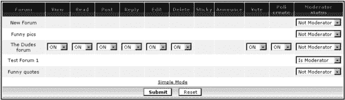

**高级模式**表单允许你在每个用户的基础上更加精确，通过关闭默认允许私有成员的某些权限类型。在**置顶**和**公告**列中，你没有选项，因为这些权限类型在设置论坛权限时被设置为 MOD 而不是私有。

有另一种限制用户权限的方法，这与权限无关——允许或拒绝每个用户的私人消息和头像，以及激活或停用用户的能力。这可以通过在管理员面板（**用户管理员**部分下的**管理**链接）中编辑用户的个人资料并使用以下说明中的**仅管理员可见的特殊字段**来完成：

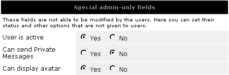

# 用户组和群组权限

用户组是您根据认为合适的某些标准创建用户组的一种方式。您不必使用用户组——在默认的 phpBB 安装中，不存在任何组，但这可能是一个有用的功能。

用户可以通过使用**用户组**  顶部导航菜单图标来访问用户组。作为管理员，您也可以使用此链接；它还为您提供了某些管理选项。当群组管理员访问此链接时，也会弹出管理群组的界面。

每个群组都有一个管理员。这位社区成员负责管理群组，不要与论坛管理员混淆。群组管理员在论坛主题或帖子中没有特殊权限；他们只在管理的群组中拥有特殊权限。他们可以向群组添加和移除成员，可以接受或拒绝成员申请，并可以更改群组类型。

存在哪些类型的群组？一个群组可以是公开的、封闭的或隐藏的。

+   一个**公开**的群组对每个人都是可见的，并接受新成员。为了成为群组成员，用户需要申请加入。群组管理员可以接受或拒绝申请。他或她还可以在不要求这些成员先申请的情况下添加成员到群组。

+   一个**封闭**的群组是不接受申请的群组。群组管理员仍然可以添加新成员。

+   一个**隐藏**的群组就像封闭群组，但不会显示给用户。只有登录的群组成员才能看到它。群组管理员会添加新成员。

##### 行动时间——创建新群组

1.  以管理员身份登录并转到管理面板。

1.  在**群组管理员**菜单部分下点击**管理**链接：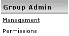

1.  点击**创建新群组**按钮。

1.  按照所示填写表格：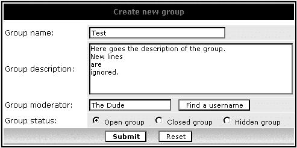

1.  点击**提交**。

###### 发生了什么？

您已成功创建了一个名为**测试**的新用户组，世界闻名的用户**The Dude**担任管理员。这个群组是公开的，并接受成员申请。

如果您现在访问论坛的前端，转到**用户组**，查看**测试**群组的信息，您将看到以下屏幕：

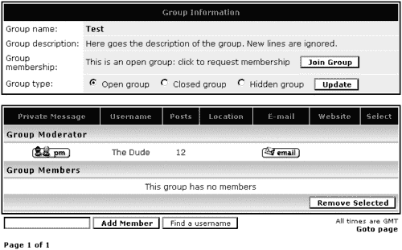

由于你仍然以管理员身份登录，你可以看到更改组类型和添加/删除成员的组管理员选项。你不会看到会员申请界面，因为没有当前申请。此外，因为你不是这个公开组的成员，你看到的是**加入组**按钮。

点击**加入组**按钮申请成为组成员。这将向组管理员发送一封电子邮件，通知有新的待处理申请。管理员登录，进入用户组（上面的屏幕），接受或拒绝此申请。如果申请被接受，你成为组的成员，并会收到一封电子邮件通知这一事实。

##### 行动时间—编辑组

1.  你仍然以管理员身份登录；前往管理面板。

1.  在**组管理员**下，点击**管理**。

1.  **测试**组被选中；点击**查找组**。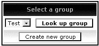

1.  如所示更改组名和描述。同时，将**组状态**更改为**隐藏组**。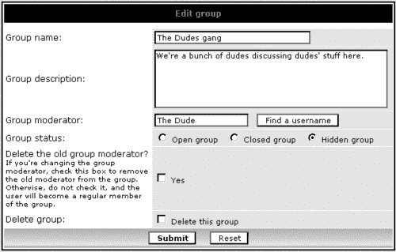

1.  点击**提交**以保存更改。

###### 发生了什么？

你已成功编辑了组。这是一件简单的事情，就像创建组一样。但这次你在**编辑组**表单上有两个额外的复选框：你可以删除组，并且在更改组管理员时，你可以选择前管理员是否作为普通成员留在组中或从组中移除。

## 组权限

管理员有设置组权限的选项。组管理员无法控制它们。组权限的工作方式与用户权限相同。唯一的区别是你可以为每个组设置一次权限类型，它将适用于组中的所有成员。这可以节省你大量的工作。尽管成员是组的组成部分并且有组权限，但你仍然可以基于每个用户覆盖这些权限。这意味着，例如，你可以指定用户组的所有成员都可以发布公告，但随后禁止组中特定用户这样做。

组权限可通过管理面板导航菜单中的**权限**链接访问**组管理员**部分：

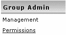

你可能想要执行的一个常见任务是创建一个只能由特定用户使用的特殊隐藏论坛（例如，一个供版主使用的论坛，他们可以在不公开讨论的情况下讨论版面或用户相关的问题）。

为了做到这一点，你需要：

+   创建一个**私有[隐藏]**论坛。

+   创建一个私有组。

+   允许组访问使用私有论坛。

到目前为止，我们已经讨论了前两点。我们已经创建了一个名为 The Dudes 论坛的特殊私有隐藏论坛，并且你有一个名为 The Dudes gang 的隐藏组。现在最后一点：给予 The Dudes gang 访问 The Dudes 论坛的权限。

##### 行动时间—设置分组权限

1.  以管理员身份登录，并转到管理面板。

1.  在导航菜单的**分组管理员**部分下选择**权限**。

1.  在下一屏中，选择**The Dudes gang**并点击**查找分组**。

1.  在**分组权限控制**表单中，切换到**高级模式**。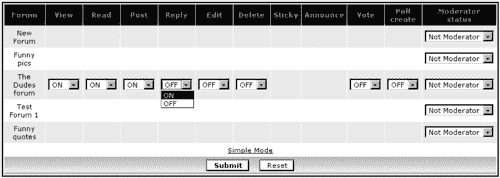

1.  将**The Dudes 论坛**行上的所有下拉菜单从**关闭**更改为**开启**。

1.  点击**提交**以保存权限设置。

###### 发生了什么？

您已经为**The Dudes gang**用户组授予了权限，使其能够在**The Dudes 论坛**中阅读、发帖、投票等。这里有一些额外的点供您思考并实验。

+   您可以使用**高级模式**通过选择性地**开启/关闭**来授予权限；没有必要全部开启或全部关闭。

+   **简单模式**不能用于设置分组权限，在本书所基于的 phpBB 版本中不能使用。

+   论坛版主和分组版主是完全独立的。The Dude 是 The Dudes gang 的分组版主，但不是 The Dudes 论坛的论坛版主。

+   您可以通过设置组的**是否版主**状态，使组中的每个人都能成为版主。

+   分组权限是设置权限的一种快速方式，但您仍然可以使用用户权限来更具体地设置。用户权限会覆盖分组权限。

+   您可以拥有几个具有不同论坛访问权限的用户组。例如，您可以设置一个名为“初级 Dudes”的公开组，该组只能**阅读****The Dudes 论坛**，而古老的**The Dudes gang**用户组仍然可以**发帖**。

# 再次查看数据库备份和恢复

您已经知道如何使用 phpBB 的备份和恢复工具。提到过，如果您有一个非常大的数据库，并且您的托管提供商对服务器资源使用设置了某些规则，它们可能不会按预期工作。所以现在让我们看看使用其他方法来实现相同的结果。MySQL 是本节中使用的 RDBMS；它是运行 phpBB 最流行的。

## 使用 phpMyAdmin

phpMyAdmin 可用于备份和恢复您的论坛数据库。它有一个导出工具，可以帮助您创建一个表的 SQL 转储或数据库或甚至服务器上**所有**数据库的 SQL 转储。SQL 转储是一个包含创建表或数据库所需的所有必要 SQL 命令的文本文件。phpBB 的数据库备份和恢复工具使用相同的 SQL 转储。

如果您感到好奇，可以使用文本编辑器打开一个 SQL 转储，您会看到一系列以如下开头的 SQL 命令：

```php
-- phpMyAdmin SQL Dump
-- version 2.6.0-rc2
-- http://www.phpmyadmin.net
--
-- Host: localhost
-- Generation Time: Dec 14, 2004 at 10:45 PM
-- Server version: 3.23.47
-- PHP Version: 4.3.0
--
-- Database: ‘forums’
--
-- --------------------------------------------------------
--
-- Table structure for table ‘phpbb_auth_access’
--
CREATE TABLE ‘phpbb_auth_access’ (
‘group_id’ mediumint(8) NOT NULL default ‘0’,
‘forum_id’ smallint(5) unsigned NOT NULL default ‘0’,
‘auth_view’ tinyint(1) NOT NULL default ‘0’,
‘auth_read’ tinyint(1) NOT NULL default ‘0’,
‘auth_post’ tinyint(1) NOT NULL default ‘0’,
‘auth_reply’ tinyint(1) NOT NULL default ‘0’,
‘auth_edit’ tinyint(1) NOT NULL default ‘0’,
‘auth_delete’ tinyint(1) NOT NULL default ‘0’,
‘auth_sticky’ tinyint(1) NOT NULL default ‘0’,
‘auth_announce’ tinyint(1) NOT NULL default ‘0’,
‘auth_vote’ tinyint(1) NOT NULL default ‘0’,
‘auth_pollcreate’ tinyint(1) NOT NULL default ‘0’,
‘auth_attachments’ tinyint(1) NOT NULL default ‘0’,
‘auth_mod’ tinyint(1) NOT NULL default ‘0’,
KEY ‘group_id’ (`group_id`),
KEY ‘forum_id’ (`forum_id`)
) TYPE=MyISAM;
--
-- Dumping data for table `phpbb_auth_access`
--

```

如果这看起来像是一种外星语言，请不要担心；您不需要了解任何这些。这只是为了给出 SQL 转储看起来像什么的例子。重要的是要知道如何创建它们并使用它们。

phpMyAdmin 的好处在于它允许你创建单个表的 SQL 转储，而不是整个数据库的单个文件。这很好——如果你需要稍后恢复数据库，并且你的托管提供商对上传文件的大小有限制，那么你可能可以通过将可能很大的数据库分割成几个较小的 SQL 转储来绕过上传限制。

让我们看看一个例子，它将帮助你理解使用 phpMyAdmin 进行数据库备份和恢复的流程。为了本例以及本章后面的其他示例，让我们假设包含你的论坛的数据库被命名为 `forums`，你的数据库用户名为 `dbuser`，访问数据库的密码是 `dbpass`。

##### 时间行动——创建 SQL 数据库转储

你目前位于“forums”数据库的前页。它看起来如下所示：

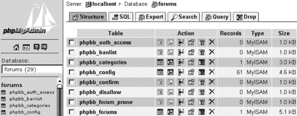

1.  点击标签，将跳转到如下页面：

1.  你可以在数据库的顶部左侧的**导出**下看到所有表。在这里，你可以单独选择要转储的表。点击**全选**以转储所有表。

1.  将所有其他字段保留在默认值。请务必检查**结构**和**数据**复选框都已选中。

1.  选择**另存为文件**复选框。

1.  点击**Go**。

1.  你将弹出一个文件对话框窗口，询问在什么名称和位置保存转储文件。使用 **mydump.sql** 作为文件名，并保存到你认为最合适的位置（例如，一个用于存放所有备份转储的目录）。

###### 发生了什么？

你已经成功创建了包含你的论坛数据库中所有表和数据的 SQL 转储文件。在步骤 2 中，你看到了如何选择性地选择要包含在转储中的表，从而创建几个较小的转储，这些转储一起包含所有数据库表和数据。

如果你现在点击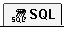标签，你将被带到允许你执行 SQL 查询的页面。

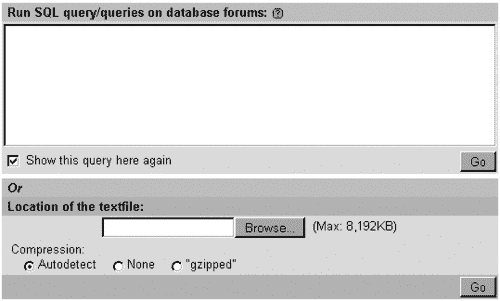

在截图的第二部分，在**文本文件位置**标题下，你可以上传一个 SQL 转储到你的数据库中执行。这是操作的“恢复”部分。通常在完全不同的服务器和空数据库上完成（例如，当你切换托管提供商并移动你的论坛时）。

在图例中所示的情况下，你可以看到有一个 8192KB（或 8MB）的限制；你不能上传比这更大的备份。如果你的 SQL 备份更大，你必须将其分成更小的块。另一个好选择是向你的提供商解释情况（他们可能会建议你使用 FTP 上传文件，然后他们可以从那里使用像命令行 MySQL 实用程序这样的工具导入它）。

## 使用 MySQL 命令行工具

如果你可以从命令行访问 MySQL，那么大型数据库就不会成为问题；你应该能够进行备份，并在需要时进行恢复。第二章已经讨论了如何使用`mysql`实用程序从命令行连接到 MySQL。在这里，我们将讨论另一个实用程序：`mysqldump`。

##### 使用 mysqldump 创建备份

如其名所示，这是一个用于从 MySQL 数据库创建 SQL 备份的实用程序。它有很多选项，你可以通过使用`--help`选项调用实用程序来始终调查这些选项，如下所示：

```php
mysqldump --help

```

你也可以在[`dev.mysql.com/mysqldump`](http://dev.mysql.com/mysqldump)上阅读有关此实用程序的说明，这是 MySQL 在线手册。

这里有一个如何使用此实用程序创建`forums`数据库备份的示例：

```php
mysqldump -u dbuser -pdbpass forums > mydump.sql

```

这行普通的英语意思是“创建一个名为 forums 的数据库的 SQL 备份，并将这个备份写入当前目录下名为 mydump.sql 的文件中。为了证明我有权访问这个数据库，我给你我的用户名，它是 dbuser，以及我的密码，它是 dbpass。”请注意，选项`-p`和密码是粘合在一起的；在`-u`选项和用户名之间没有空格。

如果你可以在服务器上创建一个计划任务（一个**cronjob**），你可以让这个命令行每天执行以创建一个新的数据库副本。这个命令可能因服务器而异，主要是在右尖括号后面的部分，其中指定了备份文件名及其位置。

你甚至可以更进一步，通过创建压缩的 SQL 备份并删除原始备份来节省硬盘空间，原始备份可能很大。在 Linux 系统中，你可以使用`tar`归档程序；你可以作为一个 cronjob 运行的整个命令可能类似于：

```php
mysqldump -u dbuser -pdbpass forums > mydump.sql ; tar cz mydump.sql -f mydump.tgz ; rm f mydump.sql

```

现在 *这* 才是真正的系统管理员工作！如果你想要用普通的英语翻译这句话，它意味着“创建我的论坛数据库的 SQL 备份，并将其写入 mydump.sql 文件中。压缩 mydump.sql 并创建 mydump.tgz 文件。现在删除不再需要的 mydump.sql 文件。”

##### 使用 mysql 实用程序恢复数据库

要恢复数据库，意味着从现有的 SQL 备份中创建一个新的数据库。现在我们有一个包含`forums`数据库所有内容的`mydump.sql`文件，让我们创建一个名为`forums-copy`的新数据库，并将内容复制到那里。你可以在 phpMyAdmin 中这样做，但我们将看到如何从命令行操作。

##### 动手时间——从 SQL 备份创建数据库副本

1.  在命令行中，输入 `mysql -u dbuser pdbpass` 并按 *Enter* 键。

1.  输入 `CREATE DATABASE forums-copy`; 按 *Enter* 键。

1.  输入 `\u forums-copy`. 按 *Enter* 键。

1.  输入 `\. mydump.sql` 按 *Enter* 键。如果一切正常，你们会看到很多这样的消息：`Query OK, 1 row affected (0.00 sec)`

###### 发生了什么？

1.  你们已连接到数据库服务器。

1.  你们创建了一个新的数据库。

1.  你们已选择了新的数据库（`forums-copy`）用于后续操作。

1.  你们已执行了 `mydump.sql` 文件。根据文件所在位置，可能需要调整文件路径。

##### 其他工具

有时候你们可能不会使用命令行 MySQL 工具或 phpMyAdmin。或者托管提供商的限制可能使得 phpMyAdmin 对你们的大规模转储不可用。不要绝望，还有希望！你们可以使用一些专门设计的工具来处理大型数据库。其中一个很好的工具叫做 BigDump，可以从 [`www.ozerov.de/bigdump.php`](http://www.ozerov.de/bigdump.php) 免费下载。

它通过分块执行你的转储的小部分内容，直到所有 SQL 命令都执行完毕，来绕过服务器限制。

# 论坛的人性面：争论战和封禁

让我们暂时放下系统管理的内容，以审视运营在线社区的人性面来结束这一章。你们最有可能遇到的情况，几乎每个论坛管理员都会遇到，所以做好准备或者至少意识到你们并不孤单是很好的。

无论你们的论坛是关于什么的，它很可能开始是一个只有少数几位好伙伴在其中的小型论坛。也许这个论坛将是你们现有网站的一个补充；它的论坛可能会讨论你们网站的内容，在那里你们会回答问题并获得建议。

如果你们有一个内容有趣的网站，你们的社区很可能会逐渐增长。随着越来越多的人加入，会有更多不同的意见被分享。偶尔可能会爆发争论战，其中一些社区成员开始交换敌意。不要慌张！这不是你们、你们的论坛或你们的网站的责任。这只是偶然发生。自从网络通信开始以来，这种情况就一直在发生，在 Usenet 群组、邮件列表等等。争论战是网络社区的一部分；这是人类的行为。

也可能有一些社区成员似乎喜欢挑起新的争论战，看起来他们来到论坛的唯一目的就是让你们社区的成员生活痛苦。这种情况是会发生的。互联网提供的匿名性可能会让一些人表现得与他们真实面目截然不同。你们必须学会接受这个事实。但这并不意味着你们必须容忍这种行为。一些受尊敬和重视的社区成员可能会开始限制他们的参与，甚至因为那些人的不良行为而彻底离开社区。这是你们不希望发生的事情。

在这种情况下很难，没有固定的方法。你必须使用你最好的判断力，你必须像领导者一样行动，并为你的社区树立榜样。在某个时候，你可能最终会写一些像“发帖前请阅读”这样的粘性帖子，类似于使用条款。这是一个好且必要的步骤，因为它设定了基本规则。没有规则就没有对错，每个人都可以对可接受的行为和不可接受的行为有不同的理解。你还需要在撰写这些规则时小心，不要使它们过于严格。这些规则需要被尊重，这就是为什么它们是规则。所以，不要设定不可能实现的目标和愿望清单作为规则；做一个现实主义者。

在某个时候，论坛可能会增长到如此程度，以至于你无法一直跟踪发生的事情。你需要有人来关注它。这就是版主发挥作用的地方。他们是你在论坛上的最佳助手。他们会自愿花时间让论坛成为和平讨论的更好场所。所以，请仔细选择他们。首先，你必须信任你的版主。但可能性是，你甚至从未见过这些人，你怎么能信任他们？再次强调，跟随你的直觉，并使用你最好的判断力。

禁止用户永远不是一件容易的任务。尽可能避免这样做，因为被禁止的用户会找到方法使用虚假 IP 地址一次又一次地重新注册，并且会继续滥用你的社区。而且，被禁止的用户会感到并表现得像受害者。所以，再次强调，尽可能避免禁止。尝试以和平的方式解决任何问题，尝试倾听那个用户的问题，并将禁止作为最后的手段。但当你决定禁止某人时，就要果断执行。

这里有一些可以帮助你进行论坛管理的更多提示。

+   为你的版主创建一个**私人[隐藏]**论坛。让他们在隐私中讨论论坛问题，并做出集体决策。

+   创建一个**私人[隐藏]**论坛，作为回收站。不要删除帖子，而是将其移至那里。当只有少数帖子需要删除，但其他方面主题是好的时，将相关的帖子分成一个新的主题，并将这个主题移至回收站。回收站可以帮助你在需要时了解发生了什么。授予你的版主访问回收站的权限，以便他们可以管理移至那里的主题。

+   当一些版主禁止用户时，他们会暂时禁止，然后在比如说一周后解除那些麻烦制造者的禁令。有时候这会有所帮助。

+   用户会对不同的事情进行投诉——你、论坛、其他用户等等。倾听他们的话。但记住：有很多人对论坛、生活以及一切都很满意。这是一种正常的行为——当你感到满意时，你不会写帖子来说你很满意，但当你对某件事感到愤怒时，你会立刻写下来。

+   阅读弗吉尼亚·希尔的《网络礼仪》一书。您可以在[`www.albion.com/netiquette/book/`](http://www.albion.com/netiquette/book/)在线找到它。这本书写于很久以前，它讲述了 Usenet 群组中的网络战争，而不是在公告板上。因此，看到你不是唯一一个经历这种极端情况的人，你的板块也不是第一个遇到这种情况的，这会让人感到更加安心。你会在其中认出很多社区成员和描述的情况，这肯定会给你带来不少欢笑。比如关于网络战争的类型（“拼写之火”、“生活之火”）等话题，实际上非常有趣。

+   再次强调，这里没有固定的食谱，所有的板块都是不同且独特的，所以请运用你最好的判断力，成为一个领导者。祝你好运！
