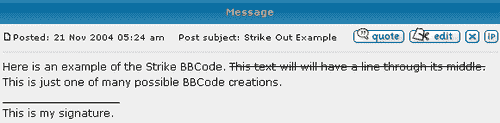
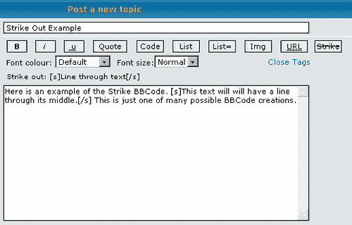

# 第七章：创建新的 MOD

随着你的社区成长，你可能会发现你需要扩展论坛的功能。你可能需要引入新的 BBCode 标签、文件附件、照片画廊或一些新的管理工具。几乎任何你需要的功能都可以通过安装修改来实现，正如你在第四章中学到的。这里的关键词是“几乎”。最终，你可能需要某个功能，但发现自己找不到现有的修改。当这种情况发生时，你有两个选择：请求某人帮助寻找修改，或者自己创建一个新的。在本章中，你将学习：

+   修改是什么

+   创建修改所需的技能和工具

+   如何创建一个简单的修改

+   使你的修改可供其他 phpBB 用户使用的方法

# MOD 和 Hack 介绍

如你所回忆的第四章，修改最常见的是被称为 **MOD** 或 **Hack**，包含添加、删除或更改 phpBB 论坛功能的文件。你还学到了有数千种修改可供下载以及如何在你的论坛上安装修改。这些内容是从修改 *用户* 的角度向你展示的，但现在你需要从 MOD 或 Hack *作者* 的角度来审视它们。

标准修改的最基本形式是一个包含编辑论坛文件指令的简单文本文件。这些指令通常使用修改模板进行格式化，包括标题和动作列表。稍微复杂一些的修改也在同一文件中包含编辑论坛数据库的命令，或者一个 SQL 查询安装程序，如 `db_update.php` 文件。更复杂的修改还包括新的论坛文件。所有文件都放在一个压缩的存档文件中（通常是 ZIP 文件），并在万维网上提供下载。

# 在开始之前

要创建一个修改，你需要一些技能和工具来简化修改的开发和测试。你的具体需求将取决于你开发的修改的范围和目的。较小的修改通常需要更基本的设置，但大型修改有时最好留给专业人士。

## 构建你的技能集

正如你所知，phpBB 是基于四种编程语言的组合：PHP：超文本预处理器，结构化查询语言（SQL），超文本标记语言（HTML）和 JavaScript。如果你之前从未听说过这些，不要担心！你不需要是一位经验丰富的程序员就可以开始创建修改。实际上，很多人都是通过使用 phpBB 来学习编程基础的。随着你开发修改，你会更加熟悉 phpBB 和这些语言。本质上，你可以（并且会）在过程中学习。

**PHP: Hypertext Preprocessor**，通常简称为 PHP，是 phpBB 中用于几乎所有任务的主体编程语言。正如你可能已经注意到的，*phpBB*甚至是以这种语言命名的。你论坛中所有以`.php`结尾的文件都包含 PHP 代码，还有一些其他文件也是如此。了解 PHP 是创建修改时最基本技能之一，因此你可能想要花时间查找并阅读一些关于基本 PHP 编程的教程。你还会想要将位于[`www.php.net/manual/`](http://www.php.net/manual/)的在线 PHP 手册加入书签。手册也可以下载，适用于离线工作。花时间阅读手册的前三章到四章。它们重点介绍了你将反复看到的代码语法等重要细节。

**结构化查询语言**（Structured Query Language，简称 SQL）是一种用于访问 SQL 数据库的编码。你的论坛的 PHP 文件使用**SQL 查询**（或用 SQL 编码编写的命令）将信息存储在几个数据库表中，并在之后从这些表中检索信息。如果你想创建一个跟踪某些数据的修改，比如页面点击计数器，你需要知道如何编写一些 SQL 查询。你应该尝试找到你网站数据库软件的手册，以学习查询的正确结构。大多数软件将支持官方的 SQL 标准形式，但可能会添加一些独特的扩展。MySQL 手册，作为 phpBB 最受欢迎的数据库选择，可在[`www.mysql.com/`](http://www.mysql.com/)找到。

**超文本标记语言**（Hypertext Markup Language，简称 HTML）实际上并不是一种编程语言。正如其名所示，HTML 用于标记文档的显示。在这种情况下，这些文档是论坛页面。你在第四章中了解到，用于显示您的论坛的 HTML 代码或另一种标记语言的代码存储在如`templates/subSilver`之类的目录中的模板文件中。你可以找到的与 HTML 相关的最接近的指南是万维网联盟的 HTML 4.01 规范，位于[`www.w3.org/TR/html401`](http://www.w3.org/TR/html401)。然而，任何主要搜索引擎都可以找到大量更容易理解的 HTML 教程。

最后，**JavaScript**是一种客户端脚本语言，phpBB 用于某些类型的用户交互。客户端脚本语言是运行在远程用户计算机上的编程语言，尽管代码位于你的网站上。JavaScript 代码将在查看者的网络浏览器中运行，因此这不是你可以始终依赖的东西。

大多数现代网络浏览器都有允许禁用 JavaScript 或某些 JavaScript 操作的功能。一些较旧的浏览器根本不支持 JavaScript。大多数修改版不使用 JavaScript 代码，但有些完全基于 JavaScript。就像 HTML 一样，有许多在线教程和网站专门用于教授这种语言的相关方面。

除了编程语言之外，你还需要对每个 phpBB 文件的目的有一个基本的了解。这是你在与 phpBB 合作过程中一定会形成的技能之一，但 phpBB 社区中也有一些在线资源会有所帮助。在这些社区中，你还会找到经验丰富的 MOD 和 Hack 作者成员。他们中的一些人经常能就与这些主题相关的广泛问题提供有用的建议，所以如果你需要帮助，不要犹豫去寻求帮助。

## 适合工作的正确工具

任何人都可以创建一个新的修改版，但如果你有合适的材料和工作环境，这会容易得多。大多数作者使用提供许多有用功能的专用工具。如果你计划创建许多修改版，你应该获取几种类型的资源。

第一个也是最重要的资源是 phpBB 本身。许多作者会创建第二个 phpBB 安装，有时是在自己的电脑上，用于测试和开发代码。这种方法的优点是，在开发过程中出现的问题不会影响人们目前正在访问的实时网站。通常，对测试环境的更大控制也是作者们偏好的另一个因素。

在自己的电脑上创建 phpBB 安装的缺点是，你可能首先需要安装几件其他软件。这些包括一个网络服务器程序，例如 Apache，PHP 语言，一个 SQL 数据库包，以及可能的其他软件。一些作者会使用包含这些软件中一个以上的包。例如，来自[`www.easyphp.org`](http://www.easyphp.org)的 EasyPHP 可以安装并管理 Apache、PHP 和 MySQL。安装了这三个之后，你应该能够安装 phpBB。

总是保留一个完全未修改的 phpBB 副本用于备份和参考是个好主意。你应该确保你正在使用 phpBB 2.0 的最新版本，以确保你有最安全和最新的代码。另一方面，请记住，并非所有社区都基于最新的 phpBB 版本。phpBB 2.0 已经发布了超过十一次更新，有些人没有时间在每个版本发布时都进行升级。

如果你将修改版公开发布，一些论坛管理员可能会尝试使用它，如果在那个 phpBB 版本中遇到问题，他们可能会向你寻求帮助。出于这些原因，你可能还想保留一些较旧版本的 phpBB 副本，即使你不在那些版本上测试你的修改。每个 phpBB 的版本都可以从以下网页下载：

+   SourceForge 上的 phpBB 项目文件列表：[`sourceforge.net/project/showfiles.php?group_id=7885`](http://sourceforge.net/project/showfiles.php?group_id=7885)

+   phpBBHacks phpBB 下载：[`www.phpbbhacks.com/phpbbinfo.php`](http://www.phpbbhacks.com/phpbbinfo.php)

在开发你的修改时，确保你使用的是未经修改的 phpBB 安装。如果你在一个已经安装了其他修改的论坛上创建修改，那些修改可能会对开发过程产生不利影响。它们可能会添加代码，导致你的修改行为与没有这些修改时不同。由于你无法预知其他人的论坛上已经安装了哪些修改，因此在一个被黑掉的 phpBB 安装上开发的修改可能会引起问题。你也可能不小心在自己的修改安装文件中包含了另一个修改的代码。这可能会导致各种意外的反应。

### 注意

有可能你需要开发一个需要另一个存在才能工作的修改，比如一个传送门附加块。在这种情况下，只有绝对必要的修改应该安装在你的测试论坛上。

另一个非常重要的工具是用于编辑 phpBB 文件的优秀程序。对于像第四章中那样的简单修改安装工作，Microsoft WordPad 就足够了。你可以继续使用 WordPad 来完成这一章，但如果你打算开发多个修改，你可能需要一个具有更广泛有用功能的程序。

有许多文本编辑程序具有语法高亮功能，这使得编码变得容易得多。有了语法高亮，代码的不同方面会以不同的颜色显示。这个功能可以让你通过查看文件中使用的颜色来发现错误的代码。其他功能，如多行搜索、查找和替换或代码自动完成，也可以节省时间。你可以在 PHP-Editors 网站上找到具有这些功能的许多文本编辑程序的列表和评论，[`www.php-editors.com/`](http://www.php-editors.com/)。

### 注意

Microsoft WordPad 将足以完成本章中展示的示例。

# 创建一个简单的 MOD：一个新的 BBCode 标签

学习的最佳方式之一是通过实际操作，因此现在是你创建你的第一个 phpBB 修改的时候了。随着你在这个部分的学习，你将完成创建修改的整个过程。由于这是你的第一个修改，重点将放在添加一个简单但实用的新功能上：一个新的 BBCode 标签。此类修改自 phpBB 的早期版本以来一直在开发中。你将遵循多年来传统上用于创建许多 BBCode 标签的过程。如果你从网站上下载了这个修改，它将只是一个包含指令的单个文件，没有其他文件或数据库更改。

## 第一步——确定你的目标

任何项目的第一步是明确你打算实现的目标。也许你想要重新排列主题的显示方式。或者可能是在注册表中添加一个新的条目。无论你选择什么，在你真正动手之前，你需要知道你试图做什么。

正如你所知，这次修改的目标将是向你的论坛添加一个新的 BBCode 标签。通过安装 BBCode 修改，你为论坛成员提供了新的格式化帖子的方式。phpBB 在首次安装时包含了粗体、斜体和下划线文本、文本颜色和大小、图片、项目符号和编号列表以及其他几种格式化选项。你可以下载数十种不同的新标签的修改。一些例子包括发光、阴影、高亮、移动和闪烁的文本。我们将添加到论坛中的**[s]** BBCode 标签创建的是删除线文本，它是一系列带有每个字符中间横线的普通单词。Strike BBCode 的效果可以在以下屏幕截图中看到：



## 第二步——规划你的数据库更改

当创建跟踪某种新信息的修改时，你通常需要通过 SQL 查询编辑或创建数据库表。Strike BBCode 不需要任何数据库更改，但这仍然是修改创建的一个重要部分，因此仍需解决。作者决定进行的数据库更改类型通常决定了修改的剩余结构。

在大多数修改中，通常使用三种类型的数据库更改：添加新的数据库表列、添加整个数据库表以及向表中添加新数据。您将进行哪些更改将非常取决于修改的内容。如果您只是向用户注册和资料中添加新字段，您将向用户数据库表添加新列，通常称为`phpbb_users`。为了记录人们在到达您的论坛之前访问的网站信息，您需要一个新数据库表。当您的修改具有应在**管理控制面板**中更改的配置功能时，向`phpbb_config`表添加新数据是预期的。

您可以使用 phpMyAdmin 或类似的数据库管理软件对数据库的所有更改进行操作。您可以通过 phpMyAdmin 的 SQL 标签编写自己的 SQL 查询并执行它们，或者通过 phpMyAdmin 提供的点选操作系列完成相同的目标。

## 第 3 步—选择您的文件

您的修改需要编辑 phpBB 文件，并可能需要添加新的文件，以实现您的目标。在此阶段，您需要决定哪些文件是最佳编辑对象，并对这些文件进行备份。如果您的修改需要添加新文件，您需要决定每个文件的命名以及它在 phpBB 目录结构中的位置。某些类型的新文件需要放置在特定的位置。例如，如果您需要向**管理控制面板**添加新部分，您将不得不在 phpBB 的`admin`目录中添加至少一个文件。本书的附录包括对 phpBB 文件和目录的描述，这些描述将有助于此步骤。

要添加 BBCode 标签，包括我们的**删除线 BBCode**，只需要编辑两个文件：`includes/bbcode.php`和`templates/subSilver/bbcode.tpl`。这些文件管理 phpBB 中的所有 BBCode 操作。`bbcode.tpl`包含每个 BBCode 标签的 HTML 代码，并采用特殊格式，而`bbcode.php`将 BBCode 标签替换为该 HTML 代码，并在帖子中使用。后一个文件还执行任何必要的特殊处理，以正确格式化文本。

然而，我们还将编辑一些其他文件。如果您在任何 phpBB 论坛上发过帖，您无疑已经注意到发帖表单包含特殊按钮，点击这些按钮会将 BBCode 标签插入到发帖表单中。论坛成员喜欢这些按钮，因此我们将为**删除线 BBCode**也添加一个。为此需要编辑三个其他文件：`posting.php`、`language/lang_english/lang_main.php`和`templates/subSilver/posting_body.tpl`。以下截图显示了添加**删除线**按钮后的最终发帖表单版本：



## 第 4 步—文件编辑和创建

最后，是好的部分。在这一步中，你应该编辑之前步骤中选择的现有 phpBB 文件，并创建任何需要的新文件。新文件将包含创建修改所需的各种效果的代码。由于 Strike BBCode 不需要任何新文件，我们可以专注于第 3 步中列出的文件。正如你将看到的，即使是简单的修改，这一步也可能相当长。要创建 Strike BBCode，你需要执行以下操作：

+   开发代码以处理帖子中的 BBCode 标签

+   修改将替换帖子中标签的现有 HTML 代码

+   为发布表单构建一个按钮，并包含鼠标悬停工具提示

+   学习每个步骤是如何包含进来的以及为什么包含

+   检查创建 Strike BBCode 的一些替代方法

    ### 注意

    在创建或编辑 PHP 文件时，遵循 phpBB 的编码标准是个好主意。这样做可以使你的代码更容易被他人阅读和使用。这些指南的副本包含在 phpBB 下载中，也可以在网上找到，网址为[`area51.phpbb.com/docs/guide-coding.html`](http://area51.phpbb.com/docs/guide-coding.html)。

首先要编辑的文件是`includes/bbcode.php`，它在将帖子插入数据库之前和每次显示帖子时都会处理 BBCode 标签。这里使用了几个**PHP 函数**来完成这项任务。函数是用于执行任务的代码片段，通常是需要经常重复执行或在多个不同地方使用的任务。一个基本的函数可能看起来像以下示例：

```php
function do_some_thing($string)
{
// Lines of code inside the function perform some task
$string = ‘Some random text’;
return $string;
}

```

这是一个名为`do_some_thing()`的非常简单的函数。它仅仅将单词`Some random text`存储在名为`$string`的变量中，然后将`$string`的值返回给使用该函数的代码。你可以通过代码的第一行来识别函数，它总是以单词`function`开头。接下来是函数的名称，然后是一组可能包含参数（如果有）的括号。**变量**是数据或其他某种值的名字。变量总是以**美元符号**`$`开头。`bbcode.php`中的某些函数包括`load_bbcode_template()`、`prepare_bbcode_template()`、`bbencode_second_pass()`、`bbencode_first_pass()`和`make_clickable()`。许多函数前面都有**注释行**，这些注释行描述了代码的目的，但实际上并不影响任何内容。

`bbencode_second_pass()` 和 `bbencode_first_pass()` 函数包含必须扩展以添加任何 BBCode 标签的代码。`bbencode_first_pass()` 必须在将消息放入论坛数据库以供以后检索之前，为每个帖子中的每个 BBCode 标签添加一个特殊、唯一的标识字符串。`bbencode_second_pass()` 将更改后的 BBCode 标签替换为存储在 `bbcode.tpl` 中的匹配 HTML。你需要添加一些代码，以便每个函数都能识别删除线 BBCode。由于 `bbencode_second_pass()` 实际上在文件中列在 `bbencode_first_pass()` 之前，你应该首先编辑 `bbencode_second_pass()`。这并不是一个真正的要求，但按“从上到下”的方式编辑文件通常是良好的实践。

##### 行动时间——第一次编辑

1.  在 `includes/bbcode.php` 文件的 `bbencode_second_pass()` 函数中找到以下行。这是这些行在文件中一起出现的唯一位置：

    ```php
    // [u] and [/u] for underlining text.
    $text = str_replace("[u:$uid]", $bbcode_tpl[‘u_open’], $text);
    $text = str_replace("[/u:$uid]", $bbcode_tpl[‘u_close’], $text);

    ```

1.  高亮（或选择）这些行。复制它们，并将复制的一组行粘贴到现有行下面的文件中。代码现在应该看起来像这样（在我们的复制之后）：

    ```php
    $text = str_replace("[/b:$uid]", $bbcode_tpl[‘b_close’], $text);
    // [u] and [/u] for underlining text.
    $text = str_replace("[u:$uid]", $bbcode_tpl[‘u_open’], $text);
    $text = str_replace("[/u:$uid]", $bbcode_tpl[‘u_close’], $text);
    // [u] and [/u] for underlining text.
    $text = str_replace("[u:$uid]", $bbcode_tpl[‘u_open’], $text);
    $text = str_replace("[/u:$uid]", $bbcode_tpl[‘u_close’], $text);
    // [i] and [/i] for italicizing text.

    ```

1.  在第一行复制的行中，将 `[u] and [/u] for underlining` 标签替换为 `[s] and [/s] for strike out`。

1.  在第二行复制的行中，将 `[u:$uid]` 更改为 `[s:$uid]`，并将 `u_open` 更改为 `s_open`。

1.  将第三行复制的 `[/u:$uid]` 更改为 `[/s:$uid]`，并将 `u_close` 更改为 `s_close`。你的复制行在完全编辑后应该看起来像以下示例：

    ```php
    // [s] and [/s] for strike out text.
    $text = str_replace("[s:$uid]", $bbcode_tpl[‘s_open’], $text);
    $text = str_replace("[/s:$uid]", $bbcode_tpl[‘s_close’], $text);

    ```

###### 发生了什么？

你现在已经完成了对 `bbencode_second_pass()` 函数进行更改，以便与你的删除线 BBCode 标签一起工作所需的更改。完成此操作后，让我们花一点时间看看你更改的行以及它们的一些重要点。

你复制的行是下划线 BBCode 标签的一部分。复制这些行允许你在更改第二组行以创建删除线的同时，保持一个可工作的下划线 BBCode。删除线 BBCode 实际上与下划线非常相似，因此你将使用相关的代码行作为许多即将到来的文件更改的基础。每一行都将成为删除线 BBCode 的一个独特部分，因为它通过你所做的更改而转变。

你首先复制然后编辑的第一行是：

```php
// [u] and [/u] for underlining text.

```

这一行开头的两个正斜杠 `//` 标记了这是一条注释行。这条特定的注释行说明接下来的两行处理的是开启和关闭下划线 BBCode 标签，即 `[u]` 和 `[/u]`。你将注释中的 `[u] and [/u] for underlining` 标签替换为 `[s] and [/s] for strike out`。现在注释行已经更新，以反映后续其他复制行的更改。

其他两行是用于在帖子显示在论坛之前处理帖子的 PHP 代码，因此它们可能相当微妙。确保你的最终行与给出的示例完全匹配。如果你以错误的方式编辑这些行，你可能会在论坛上看到错误消息。在编辑这些行时，特别小心双引号和单引号以及`$uid`变量。在编辑这些行时，这些不应该做任何更改。

`[s:$uid]`和`[/s:$uid]`的编辑与允许用户访问 Strike BBCode（`[s]`和`[/s]`）的 BBCode 格式相关。在编辑这些行时，这可能并不明显，但现在你应该看到这种关联。`s_open`和`s_close`的编辑也很重要，但它们的精确目的最好在编辑`bbcode.tpl`时再进行考察。

##### 行动时间——第二次编辑

1.  在`includes/bbcode.php`文件中的`bbencode_first_pass()`函数内找到以下行。再次强调，这些行在这个文件中只以这种顺序出现。

    ```php
    // [u] and [/u] for underlining text.
    $text = preg_replace("#\u\\[/u\]#si", "[u:$uid]\\1[/u:$uid]",
    $text);

    ```

1.  以与之前的*行动时间*相同的方式重复相同的行。

1.  找到与之前代码中相同的注释行。以之前*行动时间*示例中描述的方式编辑它。完成此操作后，你的文件应该类似于以下内容。

    ```php
    $text = preg_replace("#\b\\[/b\]#si", "[b:$uid]\\1[/b:$uid]",
    $text);
    // [u] and [/u] for underlining text.
    $text = preg_replace("#\u\\[/u\]#si", "[u:$uid]\\1[/u:$uid]",
    $text);
    // [s] and [/s] for strike out text.
    $text = preg_replace("#\u\\[/u\]#si", "[u:$uid]\\1[/u:$uid]", $text);
    // [i] and [/i] for italicizing text.

    ```

1.  在这里重复的第二个行中，将`[u\]`改为`[s\]，`[/u\]`改为`[/s\]，将`[u:$uid]\\1[/u:$uid]`改为`[s:$uid]\\1[/s:$uid]`。现在这些行已经完全修改，如下所示：

    ```php
    // [s] and [/s] for strike out text.
    $text = preg_replace("#\s\\[/s\]#si", "[s:$uid]\\1[/s:$uid]", $text);

    ```

###### 发生了什么？

完成对`bbencode_second_pass()`的更改后，你现在已经转向了`bbencode_first_pass()`函数。在这里，我们再次使用下划线 BBCode 的现有代码作为你的 Strike BBCode 的基础。你看到了与文件中第一组更改中相同的另一个注释行，并且以与其他相同的方式进行了修改。

在这里只编辑了一行其他内容，并且这一重要行会在帖子存储到论坛的 SQL 数据库之前处理包含 Strike BBCode 标签的帖子。这一行的主要目的是为了添加`$uid`变量以便后续引用。你不需要对此过于担心，但请注意，这是 phpBB 众多内置安全措施之一。当显示帖子时，phpBB 会将这里未添加`$uid`的帖子视为纯文本。

这是在`includes/bbcode.php`中需要的最后一个更改。现在你准备好继续编辑第二个文件，即`templates/subSilver/bbcode.tpl`。这个文件包含创建每个 BBCode 视觉效果的 HTML 代码片段。存储在`includes/bbcode.php`中的函数读取此文件并将 BBCode 标签如`[s]`和`[/s]`替换为代码片段。

##### 行动时间——编辑 BBCode HTML

1.  在`templates/subSilver/bbcode.tpl`中找到以下行：

    ```php
    <!-- BEGIN u_open --><span style="text-decoration: underline"><!-- END u_open -->
    <!-- BEGIN u_close --></span><!-- END u_close -->

    ```

1.  复制这些行并将副本集粘贴到文件中，就像你之前对`includes/bbcode.php`所做的那样。

1.  将第一行重复出现的`u_open`替换为`s_open`。

1.  在同一行，将`underline`替换为`line-through`。

1.  在第二行，将两个`u_close`都更改为`s_close`。

1.  最终的完整代码应该是：

    ```php
    <!-- BEGIN s_open --><span style="text-decoration: line-through"><!-- END s_open -->
    <!-- BEGIN s_close --></span><!-- END s_close -->

    ```

###### 发生了什么？

要创建将显示在删除线 BBCode 的`[s]`和`[/s]`标签位置的 HTML，我们再次使用了下划线 BBCode 的现有代码。如果你花点时间查看这个文件中的其他代码片段，你可能会注意到它们大多数都以一些文本开始，比如`<!-- BEGIN u_open -->`，并以类似`<!-- END u_close -->`的文本结束。这些是 HTML 注释，由`<!--`和`-->`字符序列标记。phpBB 使用这些注释来标记每个 BBCode 标签的代码片段的开始和结束。对于下划线 BBCode，`[u]`被替换为`u_open`代码，`[/u]`被替换为`u_close`代码。你可能还记得在`includes/bbcode.php`文件中编辑了`u_open`和`u_close`，分别将它们更改为`s_open`和`s_close`。因此，`s_open`和`s_close`也必须在这里的 HTML 注释中使用。

这里还需要一个额外的更改，这实际上产生了引人注目的效果。下划线 BBCode 使用一个名为`text-decoration`的层叠样式表属性来在文本下方画线。这个代码是`text-decoration: underline`。text-decoration 属性还支持一个值为*line-through*的值，它会在文本中间水平画一条线。所以，通过将`s_open`行中的`underline`更改为**line-through**，你创建了删除线 BBCode。

这就完成了使用删除线 BBCode 所需的所有更改；你现在可以在论坛上使用`[s]`和`[/s]`标签发帖。然而，你必须手动输入这些标签。许多，如果不是大多数，论坛用户更喜欢在发帖表单中点击按钮的便捷性，而不是手动输入 BBCode 标签，所以现在你应该为删除线 BBCode 创建一个新的按钮。

首先，我们可以看看 BBCode 按钮的组成部分。每个按钮做两件事：当点击时，将 BBCode 标签插入到消息体中，当鼠标指针悬停时，在 BBCode 控件和消息区域之间显示一行帮助文本。这些任务的代码大部分在`templates/subSilver/posting_body.tpl`中，但帮助文本部分设置在`language/lang_english/lang_main.php`和`posting.php`中。后两个文件有非常小的更改，所以最容易先编辑它们。

##### 行动时间——添加语言字符串

1.  在你的论坛的`language/lang_english/lang_main.php`文件中找到以下行。像之前示例中的其他行一样复制它：

    ```php
    $lang[‘bbcode_f_help’] = ‘Font size: [size=x-small]small text[/size]’;

    ```

1.  将行中的`bbcode_f_help`部分更改为`bbcode_st_help`。

1.  将最后两个单引号之间的文本替换为：`删除线：[s]划过文本[/s] (alt+t)`。

1.  修改后的行现在看起来是这样的：

    ```php
    $lang[‘bbcode_st_help’] = ‘Strike out: [s]Line through text[/s] (alt+t)’;

    ```

###### 发生了什么？

大多数在 phpBB 论坛的公开部分显示的内置文本存储在 `language/lang_english/lang_main.php` 文件中。此文件是 phpBB 多语言支持的一部分，这也是 phpBB 在全球范围内非常受欢迎的因素之一。所有 BBCode 按钮的帮助文本是你在 `lang_main.php` 中可以找到的许多事物之一。你刚刚找到并复制的行包含的是字体大小 BBCode 的帮助文本。其他帮助文本行都在这一行之上，而你将新的帮助文本放在了字体大小 BBCode 的下面一行。

### 注意

论坛上安装的每种语言都有一个 `lang_main.php` 文件。如果你想在一个非英语语言的文件中找到这一行，搜索该行的 `$lang[‘bbcode_f_help’]` 部分。

如果你将这一行与其他帮助文本行进行比较，你会注意到一些明显的差异。`bbcode_f_help` 中的 `f` 在其他行中被替换成了不同的字母。这一部分是用于稍后引用帮助文本的名称，因此它需要与其他所有名称唯一。已经存在一个名为 `bbcode_s_help` 的行，所以你不能在这里使用那个字母。相反，我们可以使用字母 `st`。我们没有必要将自己限制在只有一个字母。每行第二对单引号之间的文本是将在发帖表单上显示的实际文本。现有的任何一行都不适合字体大小 BBCode，所以你可以在新行中重写这段文本。帮助文本内容的唯一限制是它们不能包含单引号或双引号。

我们接下来要查看的下一个文件是 `posting.php`，它处理论坛发帖的许多方面。目前，我们只关心其中之一：创建发帖表单。表单是通过 phpBB 的语言和模板系统的组合来创建的。我们已经将帮助文本添加到语言系统中，所以现在我们需要将其纳入模板系统。

##### 行动时间——添加模板变量

1.  在 `posting.php` 中找到以下行并复制以进行编辑：

    ```php
    ‘L_BBCODE_F_HELP’ => $lang[‘bbcode_f_help’],

    ```

1.  将 `bbcode_f_help` 替换为 `bbcode_st_help` 以匹配你在语言文件中做的更改。

1.  将 `L_BBCODE_F_HELP` 中的 `F` 修改为匹配的 `ST`。

1.  最终包含这些修改的行是：

    ```php
    ‘L_BBCODE_ST_HELP’ => $lang[‘bbcode_st_help’],

    ```

###### 刚才发生了什么？

在这个最后的例子中，你添加了一个新的模板变量。它将代表字体大小 BBCode 的帮助文本，并将该文本提供给模板系统。phpBB 使用如下类似的行将信息发送到模板系统：

```php
$template->assign_vars(array(
‘L_INFO’ => $l_info,
‘MESSAGE’ => $message,
‘MORE’ => $more)
);

```

此代码的第一行和最后一行，以及`‘MORE’`行的关闭括号，对于文件的功能是必需的，所以你应该保留它们。如果你需要在尚未这样做的情况下向模板系统发送数据的文件中添加代码段，你需要在编辑文件时包含这些行。幸运的是，`posting.php`已经包含了这些行，所以我们继续到其他行，这些行指定了要发送的实际信息。``L_INFO``行是一个很好的例子。它将变量的值，在这个例子中是`$l_info`，通过名称`L_INFO`发送到模板系统。这告诉模板系统，在模板文件中所有`{L_INFO}`的实例都应该替换为变量的值。`{L_INFO}`被称为**模板变量**，因为它被模板系统替换为某个值。`L_INFO`是模板变量的**名称**。

### 注意

这是一个公认的习惯，大多数模板变量及其名称都是全部大写字母、数字或下划线，不包含其他字符。这大多数情况下不是必需的，但你不应在模板变量的名称中使用点。点在模板变量名称中被认为是特殊、保留的字符。

我们需要修改的第三个文件以添加 BBCode 按钮，`templates/subSilver/posting_body.tpl`，也是最复杂的。在你之前编辑的文件中只需添加一行，但这次有多个更改（其中一些相当尴尬）。这是 phpBB 中未考虑到易于扩展的几个部分之一。关于在此文件中正确添加新 BBCode 按钮的许多观点存在，但大多数都需要替换此文件的大部分内容或先安装另一个修改。

##### 行动时间——添加帖子表单按钮

1.  打开`templates/subSilver/posting_body.tpl`文件，找到以下行。像往常一样复制它。但是，这次，将复制的行放在现有代码之前。行的顺序并不重要，但它将在本章后面的部分创建一个有用的示例。

    ```php
    f_help = "{L_BBCODE_F_HELP}";

    ```

1.  在复制的那一行中，你应该将模板变量替换为用于 Strike 帮助线的变量。同时删除行首的小写`f`，并用`st`替换它。这是此文件中最简单的更改。结果行将是：

    ```php
    st_help = "{L_BBCODE_ST_HELP}";
    f_help = "{L_BBCODE_F_HELP}";

    ```

1.  现在找到以下（相当长）的代码行。根据你的文本编辑器的设置，当显示在屏幕上时，它可能被折行到两行或多行。尽你所能找到整个行。

    ```php
    bbtags = new Array(‘[b]’,’[/b]’,’[i]’,’[/i]’,’[u]’,’[/u]’,’[quote]’,’[/quote]’, ‘[code]’,’[/code]’,’[list]’,’[/list]’,’[list=]’,’[/list]’,’[img]’, ‘[/img]’,’[url]’,’[/url]’);

    ```

1.  在你刚刚找到的`bbtags`行之后添加以下行。

    ```php
    // Begin further bbtags indexing at 22 to avoid font size/color conflicts.
    bbtags[22] = ‘[s]’;
    bbtags[23] = ‘[/s]’;

    ```

1.  修改后的代码现在看起来像：

    ```php
    bbcode = new Array();
    bbtags = new Array(‘[b]’,’[/b]’,’[i]’,’[/i]’,’[u]’,’[/u]’,’[quote]’,’[/quote]’,’[code]’,’[/code]’,’[list]’,’[/list]’,’[list=]’,’[/list]’,’[img]’,’[/img]’,’[url]’,’[/url]’);
    // Begin further bbtags indexing at 22 to avoid font size/color conflicts.
    bbtags[22] = ‘[s]’;
    bbtags[23] = ‘[/s]’;
    imageTag = false;

    ```

1.  在文件中找到并复制以下 HTML 代码：

    ```php
    <td><span class="genmed">
    <input type="button" class="button" accesskey="w" name="addbbcode16" value="URL" style="text-decoration: underline; width: 40px" onClick="bbstyle(16)" onMouseOver="helpline(‘w’)" />
    </span></td>

    ```

1.  将复制的行修改成以下样子。

    ```php
    <td><span class="genmed">
    <input type="button" class="button" accesskey="t" name="addbbcode22" value="Strike" style="text-decoration: line-through; width: 44px" onClick="bbstyle(22)" onMouseOver="helpline(‘st’)" />
    </span></td>

    ```

###### 发生了什么？

现在，你已经将实际的按钮添加到发帖表单中，并完成了对删除线 BBCode 修改的文件更改。由于这个最后的“行动时间”示例很长，现在需要详细查看这些更改，从长`bbtags`行之后的添加开始。

那个特定的行是许多作者开始以不同方式修改文件的地方。其中一些替代方案将在稍后进行考察，但现在在这行之后简单添加可以使删除线 BBCode 尽可能简单。使用这种方法有几个优点和缺点，这些将在本章稍后讨论。

在添加了那段代码之后，你继续对这个文件进行最后的修改：添加实际的按钮！你之前所做的与按钮相关的每一个更改都是为了使按钮工作，而不是改变按钮本身。你复制并编辑了 URL 按钮的代码，这是在发帖表单按钮行中的最后一个按钮。这些行是 HTML 代码，中间一行是用于可点击表单按钮的 HTML 代码。

在这里没有必要更改第一行或最后一行。然而，中间一行需要做几个修改，以使其与其他按钮不同。按钮的 HTML 包含几个属性，形式为*name="value"*对。在你完成时，除了前两个属性`button`和`class`之外，所有这些属性都发生了变化。现在让我们详细分析这些更改。

你可能首先注意到的是`accesskey`属性。访问键是一种允许用户在不实际触摸按钮的情况下“点击”按钮的方法。通过按下定义的访问键的特殊键（在 Windows 上是*Alt*键，在 Macintosh 系统上是 Apple 键）与字母键的组合，用户可以触发按钮的效果。当你的论坛上的用户在发帖表单中按下*Alt+B*时，就会插入粗体 BBCode 标签，就像他们点击了该 BBCode 的表单按钮一样。在添加新按钮的过程中，你应该将此属性的值更改为发帖表单上尚未使用的字母或数字。在未经修改的论坛上，“t”是一个很好的选择，因此`accesskey="w"`被更改为`accesskey="t"`。

接下来是`name`属性。它为按钮提供了一个唯一的名称，可以在 JavaScript 代码中引用。这个文件顶部有大量的 JavaScript 代码，它与按钮和消息正文一起添加 BBCodes，跟踪消息中打开的 BBCodes 标签，并更改按钮上显示的文本。`name`属性的值用于访问按钮，尤其是在更改文本时。当用户点击 BBCodes 按钮插入一个开标签，例如**[b]**，按钮上会添加一个星号以提醒你该标签已打开。这个属性的值对于所有的 BBCodes 按钮都是相似的——addbbcodeXX，其中`XX`是某个偶数。如果你还记得，我们在之前添加与`bbtags`行相关的代码时使用了`22`。这是它第一次发挥作用（这个数字的重要性我们稍后会讨论）。这个按钮的名称必须是`addbbcode22`，所以`name="addbbcode16"`被更改为`name="addbbcode22"`。稍微跳过一点到`onClick`属性，`16`再次被替换为`22`。

第三个属性`value`是 BBCodes 按钮上显示的文本。由于你正在创建一个删除线 BBCodes，`"删除线"`似乎是一个合理的显示选择。因此，`value="URL"`被替换为`value="删除线"`。

`style`属性允许你将特定的层叠样式表属性应用到具有该属性的 HTML 元素上。对于 BBCodes 按钮，`style`通常用于演示 BBCodes 的效果并控制按钮的宽度。你将`text-decoration`属性从`underline`更改为`line-through`，就像你在`bbcode.tpl`中做的那样。将`width`属性从`40px`（四十像素）增加到`44px`也是推荐的，以确保添加删除线按钮时星号可见。

最后一个属性`onMouseOver`会触发帮助行文本的显示。完整的属性是`onMouseOver="helpline('w')"`，但在编辑这个属性时需要小心。只有单引号内的`w`应该被更改。如果你回想一下其他与帮助行相关的更改，你可能记得你经常将字母`f`替换为`st`。这是相同的情况，但现在你正在替换一个`w`。

最后，你已经完成了所有必要的文件编辑，以使用你新的删除线 BBCodes！恭喜你走到了这一步。

### 删除线 BBCodes 方法的优缺点

如前所述，我们在编辑`posting_body.tpl`时使用的一些方法有一些优点和缺点。一些更改可以用几种不同的方式完成。为了更好地理解 BBCodes 按钮的工作原理以及为什么有创建 BBCodes 的不同方法，让我们看看一些替代方案。

在创建类似删除这样的 BBCode 修改时，许多作者会要求首先在论坛上安装另一个修改，即多 BBCode MOD。这个修改替换并扩展了 `posting_body.tpl` 和其他文件中的大部分 BBCode 系统，目的是使额外的 BBCode 更容易安装。实际上，如果作者希望在 phpBB 的官方网站上分发 BBCode 修改，那么这个修改必须依赖于多 BBCode MOD。你刚才完成的过程的一个缺点是它是独立于多 BBCode 设计的。因此，产生的修改可能与其他修改不兼容。

你所学的另一种可能的方法集中在文件顶部的 `bbtags` 代码附近。在这段代码之后，你添加了两行新代码，但长期以来，有一种非常不同的方法被视为编辑这个区域的标准方式。这种方法要求在那一行内编辑 `bbtags` 代码。通过这种类型的修改，`bbtags` 行将被删除 BBCode 改变为以下内容：

```php
bbtags = new Array(‘[b]’,’[/b]’,’[i]’,’[/i]’,’[u]’,’[/u]’,’[quote]’,’[/quote]’,’[code]’,’[/code]’,’[list]’,’[/list]’,’[list=]’,’[/list]’,’[img]’,’[/img]’,’[url]’,’[/url]’,’[s]’,’[/s]’);

```

代码行 `bbtags` 创建了一个**数组**，或者说是数据堆栈，包含了所有可能的 BBCode 标签——除了大小和颜色标签——以及它们的闭合标签对应项，按照行上列出的顺序编号。编号从 0 开始；`[b]` 将是编号 0，`[/b]` 将是编号 1，以此类推。在此次方案中，删除 BBCode 的 `[s]` 变成了编号 18。

然而，这会产生一个问题。记住你使用 `addbbcode22` 作为 HTML 中删除按钮的 `name` 属性值吗？使用刚才描述的方法，你需要使用 `addbbcode18`。如果你在 `posting_body.tpl` 中搜索，你会找到 `addbbcode18` 已经被用于字体颜色下拉列表的名称，而 `addbbcode20` 同样被用于字体大小。由于 `name` 的值必须是唯一的，直接编辑 `bbtags` 行迫使你也要更改字体颜色和大小列表的 `name` 属性。如果你添加了多个 BBCode，这将是一项相当多的重复工作。

当你在 `bbtags` 行之后添加 `[s]` 和 `[/s]` 的新行时，新行将删除标签分配给编号 22 和 23。本质上，你跳过了编号 18 到 21，这些编号被大小和颜色 BBCode 使用。

这消除了编辑大小和颜色 HTML 的需要。如果你想要使用本章中介绍的方法添加新的 BBCode，你的代码可能看起来像这个示例。注意每一行上的数字是如何递增的。

```php
bbtags[22] = ‘[s]’;
bbtags[23] = ‘[/s]’;
bbtags[24] = ‘[flash]’;
bbtags[25] = ‘[/flash]’;
bbtags[26] = ‘[hide]’;
bbtags[27] = ‘[/hide]’;

```

## 第 5 步——拆分并修复

在完成您的第一个修改的更改后，下一步是测试您的更改。在测试过程中，尽可能做一切可能导致修改出现问题的操作。任何出现的问题都需要在其他人发现之前修复。缺乏适当的测试可能非常危险，在某些情况下可能会在您的论坛中创建新的安全漏洞。

尝试测试 Strike BBCode 的每个方面。尝试创建一个新主题，预览帖子，甚至回复和编辑包含 BBCode 的帖子。检查发布表单的每个方面，从按钮到帮助行。如果您在论坛上安装了多个风格，请确保您已经编辑了每个风格的模板文件，并在所有风格上测试 BBCode 和按钮。当存在多种语言时，也要进行测试！

您不应该在 Strike BBCode 中遇到任何问题，因为它是一个非常简单的修改。然而，即使是简单的修改也需要彻底的测试。有很多地方，缺少一个逗号就可能导致论坛的部分内容无法访问。

# 让您的 MOD 面向全球

一旦您创建了一个修改，您可能希望将其分发给其他 phpBB 论坛运营商。许多修改的作者将其免费提供给全球 phpBB 社区，作为一种回馈。当然，并非所有修改都是免费的，但那些免费的通常可以在几个网站上找到，甚至可能被翻译成其他语言。

您可以通过几种方式分发一个修改。您可能需要写一篇论文或教程，描述安装时所做的更改，这可能与本章前面的页面类似。最广泛使用的方法是创建一个安装文件，它使用简单的说明，就像在第四章（ch04.html "第四章。自定义您的论坛"）中讨论修改安装的部分所解释的那样，引导用户完成更改。

您也可以选择将修改内容发布在一个或多个网站上。多个修改的作者通常有自己的网站，专门用于展示他们的作品，通常还配备有 phpBB 驱动的论坛，提供支持和演示。一些更通用的网站也提供了 phpBB 的修改。拥有最大修改社区的网站是[`www.phpbb.com/`](http://www.phpbb.com/)，即官方 phpBB 网站，以及[`www.phpbbhacks.com/`](http://www.phpbbhacks.com/)，这是最大的修改网站。还有其他提供修改的网站，您可以使用它们来分发您的作品，其中许多基于非英语语言。

这些大型网站中的每一个都有自己的规则，关于如何在网站上分发修改版。phpBB.com 有非常严格的规则，而 phpBBHacks.com 则相对宽松。这两个网站都有开发区域论坛，可用于创建和测试修改版，但并不专门用于分发任何作品。这两个网站都有一个用于此目的的修改版数据库。

phpBB.com 的修改版数据库可以在其**MOD**部分找到。要包含在这个数据库中，修改版必须通过一个特殊表单提交，并且必须通过一系列特殊的验证程序。验证过程测试下载的几个方面。如果修改版在任何这些测试中失败，这些测试由 phpBB.com 的“MOD 团队”进行，它将被拒绝包含在网站上。作者通常会被告知拒绝的原因，并允许在做出任何必要更改后重新提交作品。相比之下，phpBBHacks.com 允许作者在这些领域有更多的自由，规则要宽松得多。作者在通过简单表单提交修改版之前，预计会广泛测试修改版。

### 注意

您可以通过帖子[`www.phpbb.com/phpBB/viewtopic.php?t=160827`](http://www.phpbb.com/phpBB/viewtopic.php?t=160827)找到所有 phpBB.com 修改版提交要求的相关链接。验证程序也在该论坛的帖子中描述。

一旦您决定在哪里分发您的修改版，请在该网站上查找其具体的规则和提交程序。在任何给定网站上分发修改版的过程通常包括以下步骤：

1.  创建代码，包括任何 PHP、HTML 等等。

1.  将该代码组装成一个打包集合（下一节将详细介绍）。

1.  如果该网站有一个修改版开发论坛，请在那里创建一个关于修改版的主题。其他用户可能会尝试它，并给您反馈、错误报告或其他建议。

1.  根据反馈、错误报告等对代码进行任何您想要的修订，然后重复步骤 1-4，直到您满意地认为修改版已经完全完成。

1.  通过网站提供的程序提交修改版。

## 打包您的 MOD

在将您的修改版发布到任何地方之前，首先需要将其收集成一组文件。这个过程是将您的修改版准备用于分发的过程，称为**打包**。这通常包括创建指令文件，并将其与为修改版创建的任何新论坛文件一起放入一个单独的 ZIP 文件中。非常大的修改版通常还包括其他文件，例如升级说明、技巧或提示列表，以及修改后的原始 phpBB 文件副本，这些文件也放入这个 ZIP 文件中。

为了在 phpBB.com 分发修改，必须使用该网站提供的特殊 "MOD 模板" 创建指令文件。此模板由三个部分组成：一个标题，一个包含几个空白命令的列表，以及一个包含结束命令的页脚。每个部分都是必需的；即使省略其中任何一个，也会导致修改提交被拒绝。phpBBHacks.com 接受使用此模板或其他模板创建的修改，包括没有任何模板的情况，只要指令是可理解的。如果使用模板，则特定部分也不必要求。存在一个官方的 phpBBHacks.com 模板，但使用它是可选的。然而，phpBB.com 只接受使用其自己的模板创建的修改。

在本章前面创建的 Strike BBCode 修改无法在 phpBB.com 提交，因为它不依赖于所有列出的 BBCode 修改所需的 Multi BBCode 修改。同样，phpBBHacks.com 也不会接受它，因为 Strike 不是你的原创作品。然而，为这个修改创建指令文件仍然是学习如何使用 MOD 模板以制作可以提交给 phpBB.com 和其他网站的安装文件的好方法。

### 使用 MOD 模板标题

首先，创建一个新的文本文件。在大多数 Windows 文本编辑器中，这涉及到打开 **文件** 菜单并选择 **新建 | 新建文本文件** 或类似选项。将你的新文件命名为 `strike.mod`。你可能熟悉的多数文本文件使用 `txt` 文件扩展名，结果文件名可能像 `strike.txt`。然而，phpBB.com 要求修改指令文件使用 `.mod` 文件扩展名，这也是音乐文件广泛使用的扩展名之一。

接下来，在你的文件中输入以下行，或者从 phpBB.com MOD 模板中复制并粘贴它们。这些行构成了整个 MOD 模板标题。如果你手动输入，请确保与 MOD 模板的语法、拼写和间距完全匹配（在印刷书中，文本看起来是换行的）。即使你认为它们是错误的，更改这些方面的任何一项也会导致修改被拒绝。

```php
##############################################################
## MOD Title: mod_title_goes_here
## MOD Author: your_phpBB_username < your_email > (your_real_name) your_url
## MOD Description: some_description_goes_here
## MOD Version: x.x.x
##
## Installation Level: (Easy/Intermediate/Advanced)
## Installation Time: x Minutes
## Files To Edit: file_1, file_2, file_3, etc
## Included Files: (n/a, or list of included/required files)
##############################################################
## For Security Purposes, Please Check: http://www.phpbb.com/mods/ for the
## latest version of this MOD. Downloading this MOD from other sites could cause malicious code
## to enter into your phpBB Forum. As such, phpBB will not offer support for MOD’s not offered
## in our MOD-Database, located at: http://www.phpbb.com/mods/
##############################################################
## Author Notes:
##
##############################################################
## MOD History:
##
## YYYY-MM-DD - Version x.x.x
## - version notes go here
##
##############################################################
## Before Adding This MOD To Your Forum, You Should Back Up All Files Related To This MOD
##############################################################

```

这些行中的几行需要为每个修改进行编辑。让我们逐个来看，从顶部开始，逐行向下。标题本身是通过一些完全由 **#** 字符组成的行组织成更小的部分。这些分隔符应保持原样。

#### MOD 标题

需要更改的第一行是 `MOD 标题` 行。正如你可能猜到的，这就是你将放置所有修改名称以便大家都能看到的地方。

```php
## MOD Title: mod_title_goes_here

```

文本 `mod_title_goes_here` 应该替换为正确的名称。在这种情况下，你将输入 `Strike BBCode`。

#### MOD 作者

接下来是 `MOD 作者` 行，其中列出修改的创建者。也可以在此处包含联系信息。

```php
## MOD Author: your_phpBB_username < your_email > (your_real_name) your_url

```

这行本身有四个子部分需要修改。第一个是`your_phpBB_username`，需要替换为在 phpBB.com 社区论坛上注册的账户的用户名。该账户稍后将被用来提交修改。第二个是`< your_email >`部分，这是一个用于你的电子邮件地址的占位符。这里的箭头括号不应被移除，因此最终版本将类似于`< jon@doe.com >`。接下来是一个用于你的给定名字的位置，在(`your_real_name`)中。同样，括号（这次是括号）应保留在原位。最后但同样重要的是`your_url`，这是一个可能包含修改演示的网站地址的位置。只有论坛用户名条目是必需的。如果你不希望输入你的电子邮件地址、真实姓名或网站地址，可以在这些部分输入`N/A`代替。但是，请确保包括括号。这行的最终版本可能是：

```php
## MOD Author: MyAccount < jon@doe.com > (N/A) N/A

```

#### MOD 描述

你应该编辑的第三行是`MOD 描述`。这是一条相当简单的行。

```php
## MOD Description: some_description_goes_here

```

应将`some_description_goes_here`文本替换为一到两句话，简要描述修改的目的。这里可以使用的例子是`在帖子中添加删除线 BBCode`。

#### MOD 版本

在`MOD 版本`行的`x.x.x`中，你可以提供一个三部分数字，描述这个特定的修改版本。如果由于某种原因需要发布多个版本，这个数字对于每个版本都是不同的。

```php
## MOD Version: x.x.x

```

第一个数字代表一个稳定发布号，第二个代表一个次要增加号，第三个代表一个简单的修改号。版本号为 1.2.0 的修改已经经历了一个稳定发布，随后是两个添加新功能的发布。当看到版本号如 2.3.4 时，这表明有两个稳定发布，三个添加新功能的发布，最后是四个包含小更改（如小错误修复）的发布。提交给 phpBB.com 的修改的第一个版本号通常是 1.0.0。任何以小于一的数字开头的都是测试版或预览版。**测试版**和**预览版**是预览发布，可能包含错误、错误或其他问题。在实时论坛上使用测试版或预览版可能不是一个好主意。

#### 安装级别

`安装级别`用一句话描述安装修改的难度。（`简单/中级/高级`）将替换为这些词中的一个：`简单`、`中级`或`高级`。

```php
## Installation Level: (Easy/Intermediate/Advanced)

```

删除线 BBCode 的安装相当`简单`。一般来说，安装文件越长，修改的安装级别就越高。

#### 安装时间

就像上一行一样，`安装时间` 处理安装修改的难度。这次你应该用代表可能需要安装修改的大约分钟的数字替换 `x`。

```php
## Installation Time: x Minutes

```

对于 Strike BBCode，`5` 是一个公平的，尽管略高的数字。当不确定时，尽量高估这个数字。理想情况下，你应该在论坛上安装修改时计时，以了解所需的时间。

#### 要编辑的文件

`Files to Edit` 行列出了修改所编辑的每个 phpBB 文件。你可能还记得编辑了五个文件用于 Strike BBCode：`posting.php, language/lang_english/lang_main.php, includes/bbcode.php, templates/subSilver/bbcode.tpl`，以及 `templates/subSilver/posting_body.tpl`。所有这些文件都会在这里列出，用逗号分隔。由于这是一个相当长的列表，它通常会分成多行在文件中。每一行必须以 **##** 开头，就像所有其他标题行一样。

```php
## Files To Edit: file_1, file_2, file_3, etc

```

#### 包含的文件

标题上部分的最后一行提供了修改中包含的所有新论坛文件的列表。当没有新文件时，例如在 Strike BBCode 中，将括号内的文本替换为简单的 `n/a`，代表不适用。

```php
## Included Files: (n/a, or list of included/required files)

```

#### phpBB.com 的安全通知

标题的下一部分包括由 phpBB.com 创建的安全通知。这个通知必须出现在提交给 phpBB.com 的所有修改中，并且不应以任何方式更改。即使是微小的变化，比如改变大小写或行长度，也会导致提交被拒绝。

```php
## For Security Purposes, Please Check: http://www.phpbb.com/mods/ for the
## latest version of this MOD. Downloading this MOD from other sites could cause malicious code
## to enter into your phpBB Forum. As such, phpBB will not offer support for MOD’s not offered
## in our MOD-Database, located at: http://www.phpbb.com/mods/

```

### 注意

无论安全通知可能或可能没有暗示什么，使用来自其他网站上的修改并不一定会将故意有害的代码放入你的论坛。这种情况可能发生，但很少见。因为安装任何你未创建的软件都存在风险，所以除非你知道它做什么以及可能带来什么问题，否则你永远不应该在你的网站上安装 *任何代码*。即使在 phpBB 的早期版本中也发现了安全漏洞，但这类问题很少是故意的。

#### 作者备注

在安全通知下面的分隔符之后是 `Author Notes` 部分。在这个区域，你可以添加与使用或安装修改相关的额外说明或警告。例如，你可能需要比 `MOD Description` 行更详细地解释修改做了什么。这也是提到安装后任务的好地方，比如更改在 **管理控制面板** 中找到或添加的设置。

在`作者说明`部分中，有一些事情您不应该包含。其中之一是其他网站上可以找到修改的地址、联系方式、许可信息以及可以通过动作命令（您将在下面看到）涵盖的安装说明。在`作者说明`中放置这些看似无害的任何一项都可能导致修改在验证过程中失败。phpBB.com 的管理员对在其网站上放置的链接有问题；这也反映在他们不允许大多数此类链接的论坛规则和安全通知中。此模板允许的唯一联系方式必须放在`MOD 作者`行上。在 phpBB.com 上发布的所有修改都必须在 phpBB 本身所属的 GNU 通用公共许可证下发布。phpBB 中包含此许可证的副本，但不要在本节中提及它。

在`作者说明`之后，提供了一个区域来描述修改的每个版本。`MOD 历史`是每个版本的列表，包括以年-月-日格式的日期以及版本号。版本条目应提供从一个版本到另一个版本所做的更改的简要描述。对于修改的第一个版本，通常可以看到一行写着“初始版本”、“首次发布”或类似的简短声明。

MOD 模板的标题以另一个不应编辑的部分结束；这个部分是给修改用户的快速提醒，指出他们应该备份文件。带有所有您迄今为止所做的更改的 Strike BBCode 的完整标题应该类似于本段之后的示例。这也是保存您文件的好时机。定期保存您的作品以确保您不会因为意外或更糟糕的停电而丢失您所做的一切：

```php
##############################################################
## MOD Title: Strike BBCode
## MOD Author: MyAccount < jon@doe.com > (N/A) N/A
## MOD Description: Adds a strike out BBCode to posting.
## MOD Version: 1.0.0
##
## Installation Level: Easy
## Installation Time: 5 Minutes
## Files To Edit: posting.php, includes/bbcode.php,
## language/lang_english/lang_main.php,
## templates/subSilver/bbcode.tpl,
## templates/subSilver/posting_body.tpl
## Included Files: n/a
##############################################################
## For Security Purposes, Please Check: http://www.phpbb.com/mods/ for the
## latest version of this MOD. Downloading this MOD from other sites could cause malicious code
## to enter into your phpBB Forum. As such, phpBB will not offer support for MOD’s not offered
## in our MOD-Database, located at: http://www.phpbb.com/mods/
##############################################################
## Author Notes:
##
## Once this modification is installed on your forum, users can include
## a strike out BBCode in their posts. The format of the BBCode is:
## [s]This text will have a line through it.[/s]
## A button is also added to the posting form.
##
##############################################################
## MOD History:
##
## 2004-12-06 - Version 1.0.0
## - Initial version.
##
##############################################################
## Before Adding This MOD To Your Forum, You Should Back Up All Files Related To This MOD
##############################################################

```

### 创建动作列表

根据 MOD 模板的定义，您修改说明文件的第二大部分是一个动作列表。**动作**是用于安装修改所需更改的命令。每个动作都通过一个标题后跟一个文件名、一行或多行代码或其他信息来展示。动作标题看起来像以下示例，其中文本`ACTION NAME`将被实际命令的名称所替换。

```php
#
#-----[ ACTION NAME ]------------------------------------------
#

```

请参考第四章中“最后操作”部分下的表格，以获取常用操作及其简要描述列表。phpBB.com 允许使用仅十二个特定的命令，所有这些命令都在该表中列出。表末尾的添加 SQL 操作不允许用于 phpBB.com 的提交；您需要使用 SQL 操作。操作通常应按照表中列出的顺序使用。如果需要，复制操作和 SQL 操作应首先使用，然后是打开操作，接着是查找、添加和内联操作的组合。

要为您的指令文件创建一个针对 Strike BBCode 的操作列表，回顾您在创建修改时采取的步骤。由于没有添加新文件，因此您不需要复制操作。同样，您也没有进行任何数据库更改。这将使这些说明中的 SQL 操作变得不必要。您编辑了五个文件，因此您需要为每个文件提供一个匹配的打开操作。

#### 打开操作

每个打开操作的开头应跟一个单独的行，命名要准备编辑的文件。始终包括相对于主 phpBB 目录的完整路径，并带有此名称。打开操作和复制操作中的文件路径不应以 `root/`、`phpBB2/` 或甚至简单的斜杠 `/` 开头。

这是第一个文件的正确打开操作：

```php
#
#-----[ OPEN ]------------------------------------------
#
includes/bbcode.php

```

### 注意

您不需要按照任何特定的顺序列出要编辑的文件，但请记住，打开操作总是紧随查找操作之后，然后才是其他操作。

#### 查找操作

在打开那个文件之后，您所做的第二件事是在其中找到一些代码。您应该通过在查找操作中包含该代码来指导您的修改用户这样做。这是 Strike BBCode 的第一个查找操作：

```php
#
#-----[ FIND ]------------------------------------------
#
// [u] and [/u] for underlining text.
$text = str_replace("[u:$uid]", $bbcode_tpl[‘u_open’], $text);
$text = str_replace("[/u:$uid]", $bbcode_tpl[‘u_close’], $text);

```

#### 添加操作

找到该代码后，它被复制并修改以满足我们的需求。该过程中涉及了几个步骤，但您不需要在这些说明中描述其每个方面。相反，您只需提供最终代码，并告诉用户将其放置在查找操作中的相对位置。新代码被放置在您找到的代码之后，因此这里需要一个“之后，添加”操作。如果您在现有行之前插入新代码，那么一个“之前，添加”操作将是合适的。当在相同位置删除旧代码并放置新代码时，请使用“替换为”操作。

```php
#
#-----[ AFTER, ADD ]------------------------------------------
#
// ------------------------------------------------
// Strike BBCode - Begin Code Addition
// [s] and [/s] for strike out text.
$text = str_replace("[s:$uid]", $bbcode_tpl[‘s_open’], $text);
$text = str_replace("[/s:$uid]", $bbcode_tpl[‘s_close’], $text);
// Strike BBCode - End Code Addition
// ------------------------------------------------

```

你可能会注意到，在“After，添加”动作示例中包含了一些你未放入`includes/bbcode.php`中的注释行。这些行标记了修改添加的代码的开始和结束。尽管这些行在你的修改中不是必需的，但尽可能添加它们作为一种对最终用户的礼貌。如果以后有必要删除或升级你的修改，用户将能够使用这些行来快速定位修改的代码。你可以以任何你喜欢的格式来格式化这些行；这里使用的格式只是基于作者个人风格的一个示例。

为你对此文件所做的其他更改创建一组查找和“After，添加”动作。这个过程与你刚刚完成的过程相同，并将完成`bbcode.php`的动作。结果对应该类似于以下代码：

```php
#
#-----[ FIND ]------------------------------------------
#
// [u] and [/u] for underlining text.
$text = preg_replace("#\u\\[/u\]#si", "[u:$uid]\\1[/u:$uid]", $text);
#
#-----[ AFTER, ADD ]------------------------------------------
#
// ------------------------------------------------
// Strike BBCode - Begin Code Addition
// [s] and [/s] for strike out text.
$text = preg_replace("#\s\\[/s\]#si", "[s:$uid]\\1[/s:$uid]", $text);
// Strike BBCode - End Code Addition
// ------------------------------------------------

```

#### 额外的打开、查找和添加动作示例

我们编辑了你的模板中的`bbcode.tpl`文件；下一步是为它创建一个打开动作。这里出现了一个问题：你需要包含文件的路径，这会提到一个模板目录，如`subSilver`。假设某人论坛上没有`subSilver`，而只有其他不同名称的模板。这会阻止他们使用你的修改吗？你应该为每个模板列出说明吗？

两个问题的答案都是响亮的“不”。任何人都可以在任何模板上使用这个修改，尽管如果模板文件的内容与 subSilver 完全不同，他们可能需要稍微即兴发挥一下。你无法预测任何论坛上安装了哪些模板，而且有数百种模板可供选择（不包括为单个网站制作的私有模板！）为多个模板添加说明是不切实际的，而且麻烦大于其价值。解决这个问题的方法是始终基于默认安装在所有原始 phpBB 2.0 论坛上的 subSilver 模板文件来修改和编写它们的说明。如果你想让你的修改出现在 phpBB.com 上，这也同样是必需的。

因此，考虑到所有这些，`bbcode.tpl`的打开动作将是：

```php
#
#-----[ OPEN ]------------------------------------------
#
templates/subSilver/bbcode.tpl

```

你可以再次为对此文件的更改创建一个查找和“After，添加”指令组合。要记住的一个重要事情是，你不能在此文件中包含标记新代码的注释行。这样做会导致论坛显示一个**解析错误**，这意味着文件或代码部分存在语法错误。此文件的一组最终命令可能如下所示。

```php
#
#-----[ FIND ]------------------------------------------
#
<!-- BEGIN u_open --><span style="text-decoration: underline"><!-- END u_open -->
<!-- BEGIN u_close --></span><!-- END u_close -->
#
#-----[ AFTER, ADD ]------------------------------------------
#
<!-- BEGIN s_open --><span style="text-decoration: line-through"><!-- END s_open -->
<!-- BEGIN s_close --></span><!-- END s_close -->

```

在文件修改列表中的下一个是 `language/lang_english/lang_main.php` 文件。与模板文件路径的问题类似，语言文件也存在类似的问题。非英语语言的文件将具有不同的文件路径，例如 `language/lang_dutch` 或 `language/lang_french`。对于这种情况，解决方案也是相同的：使用默认安装的论坛上的文件和文件路径，即英语语言。通常允许在指令中包含其他语言，但如果你想在 phpBB.com 的数据库中列出你的工作，则必须使用默认设置。

这个文件的其它动作是标准的单一 Find 和一个 After, Add 动作组合。结合 Open 动作，该文件的完整指令如下：

```php
#
#-----[ OPEN ]------------------------------------------
#
language/lang_english/lang_main.php
#
#-----[ FIND ]------------------------------------------
#
$lang[‘bbcode_f_help’] = ‘Font size: [size=x-small]small text[/size]’;
#
#-----[ AFTER, ADD ]------------------------------------------
#
// ------------------------------------------------
// Strike BBCode - Begin Code Addition
$lang[‘bbcode_st_help’] = ‘Strike out: [s]Line through text[/s] (alt+t)’;
// Strike BBCode - End Code Addition
// ------------------------------------------------

```

继续前进，下一个编辑的 Strike BBCode 文件是 `posting.php`——又一个 Open, Find, 和 After, Add 的序列：

```php
#
#-----[ OPEN ]------------------------------------------
#
posting.php
#
#-----[ FIND ]------------------------------------------
#
‘L_BBCODE_F_HELP’ => $lang[‘bbcode_f_help’],
#
#-----[ AFTER, ADD ]------------------------------------------
#
// ------------------------------------------------
// Strike BBCode - Begin Code Addition
‘L_BBCODE_ST_HELP’ => $lang[‘bbcode_st_help’],
// Strike BBCode - End Code Addition
// ------------------------------------------------

```

最后但同样重要的是，`posting_body.tpl` 的编辑与其他修改相比相当广泛。由于这是一个模板文件，记得在 Open 动作中使用子 Silver 模板文件的路径。

```php
#
#-----[ OPEN ]------------------------------------------
#
templates/subSilver/posting_body.tpl

```

你还记得有一次你复制了代码，但是把它添加在了现有行之前而不是之后吗？在创建指令文件的这个步骤中，将这个添加到复制的行之前的原因是为了创建一个使用 Before, Add 动作而不是 After, Add 动作的示例。就指令中的外观而言，唯一的真正区别是 `AFTER` 被替换成了 `BEFORE`。

```php
#
#-----[ FIND ]------------------------------------------
#
f_help = "{L_BBCODE_F_HELP}";
#
#-----[ BEFORE, ADD ]------------------------------------------
#
// ------------------------------------------------
// Strike BBCode - Begin Code Addition
st_help = ‘{L_BBCODE_ST_HELP}’;
// Strike BBCode - End Code Addition
// ------------------------------------------------

```

现在你已经有了另一个基本的 Find 和 After, Add 动作组合，用于你在这个文件中进行的下一个修改。

```php
#
#-----[ FIND ]------------------------------------------
#
bbtags = new Array(‘[b]’,’[/b]’,’[i]’,’[/i]’,’[u]’,’[/u]’,’[quote]’,’[/quote]’,’[code]’,’[/code]’,’[list]’,’[/list]’,’[list=]’,’[/list]’,’[img]’,’[/img]’,’[url]’,’[/url]’);
#
#-----[ AFTER, ADD ]------------------------------------------
#
// ------------------------------------------------
// Strike BBCode - Begin Code Addition
bbtags[22] = ‘[s]’;
bbtags[23] = ‘[/s]’;
// Strike BBCode - End Code Addition
// ------------------------------------------------

```

最后一步的动作仍然是 Find 和 After, Add。正如你可能已经注意到的，这个组合是修改指令中最常用的。在这一轮中，程序是相同的，但请注意，After, Add 指令中的注释行非常不同。

```php
#
#-----[ FIND ]------------------------------------------
#
<td><span class="genmed">
<input type="button" class="button" accesskey="w" name="addbbcode16" value="URL" style="text-decoration: underline; width: 40px" onClick="bbstyle(16)" onMouseOver="helpline(‘w’)" />
</span></td>
#
#-----[ AFTER, ADD ]------------------------------------------
#
<!-- Strike BBCode - Begin Code Addition -->
<td><span class="genmed">
<input type="button" class="button" accesskey="t" name="addbbcode22" value="Strike" style="text-decoration: line-through; width: 44px" onClick="bbstyle(22)" onMouseOver="helpline(‘st’)" />
</span></td>
<!-- Strike BBCode - End Code Addition -->

```

之前，添加带有注释行的代码片段是 PHP 的行，或者在这个文件更早的部分是 JavaScript 代码。这次你添加的是 HTML 代码。PHP 和 JavaScript 的注释行语法相似：在双斜杠 `//` 之后的内容是注释。然而，HTML 注释以 `<!--` 开头，以 `-->` 结尾。如果你使用的是 PHP 风格的注释，比如 `// Strike BBCode Begin Code Addition`，在这里它会在发布页面上以纯文本形式显示。

### 注意

你可能会想在使用 `bbcode.tpl` 时使用 HTML 风格的注释。遗憾的是，在这个文件中不允许这样做，因为 HTML 注释被 phpBB 用于解析文件本身。此外，在其他模板文件中避免使用以 `<!-- BEGIN` 或 `<!-- END` 开头的 HTML 注释。phpBB 会认为这些是特殊的模板开关，通常会报告解析错误。

这就结束了这个特定修改的动作列表。不要忘记保存你到目前为止完成的内容！

### 使用其他动作

虽然打击 BBCode 只使用了少数几个动作——打开；查找；之后，添加；和之前，添加——但在创建您自己的原始修改时，您可能需要使用其他几个动作。考虑到这一点，以下是一些其他动作的示例。

#### 复制文件——复制动作

当您的修改包含新文件时，您的命令列表中应该首先出现的是复制动作。复制动作表示用户应将新文件上传到他们的论坛，并说明这些文件的位置。在动作标题之后，您应该包括一行提到每个文件，包括在修改从单个文件解压缩时可能包含的任何文件夹，以及相对于论坛主目录的路径。您将在本章后面学习如何在压缩文件内部放置文件夹中的文件。在复制动作中，您可以使用一些特殊的快捷方式，因此现在是查看一个示例动作的好时机。

```php
#
#-----[ COPY ]------------------------------------------
#
my_new_file.php to my_new_file.php
my_functions.php to includes/my_functions.php
new_tpls/new_file.tpl to templates/subSilver/new_file.tpl
language/lang_english/*.* to language/lang_english/*.*

```

包含在修改中的文件列在左侧，然后使用单词 `to` 作为分隔符，后面跟着文件在论坛结构中的正确位置。文件的第一行含义相当简单：将 `my_new_file.php` 文件复制到论坛的主目录（包含 `viewtopic.php` 和 `posting.php` 等文件的目录）。在第二行，您告诉用户将 `my_functions.php` 的远程副本放置在他们的论坛 `includes/` 目录中。在第三行，您可以看到正在复制的文件位于名为 `new_tpls` 的文件夹中。在最后一行的目录名称之后，`*.*` 快捷方式表示用户将复制该目录中的所有文件。您还可以使用类似 `*.php` 或 `*.tpl` 的快捷方式来表示具有特定扩展名的所有文件。

#### 修改数据库——SQL 动作

为了对论坛的 SQL 数据库进行更改或添加，请使用 SQL 动作。始终将 SQL 动作放在您的动作列表的顶部附近；它应该是用户完成的第一或第二个动作。此动作的标题后面跟着一个或多个 SQL 查询。请确保您使用的查询结构正确且有效；它们需要按所示精确工作。请注意，大多数 SQL 动作将使用为 MySQL 数据库创建的查询，但这不是必需的。一个创建简单数据库表的 SQL 动作示例可能是：

```php
#
#-----[ SQL ]------------------------------------------
#
CREATE TABLE phpbb_newtable (
newtable_id int(8) NOT NULL default ‘0’,
newtable_item varchar(255) NOT NULL default ‘’,
PRIMARY KEY (newtable_id)
);

```

#### 替换代码——替换动作

有时您需要修改现有代码行而不是在它之前或之后添加内容。替换动作在这种情况下可能很有用。像之前，添加和之后，添加动作一样，替换动作将始终跟随查找动作。如果您可以使用注释行，那么在替换动作中包含被替换行的注释副本也是一个好主意。这种做法将使用户在稍后如果另一个修改在查找动作中使用它时更容易找到代码。

假设你想要用 Strike BBCode 替换下划线 BBCode，而不仅仅是添加后者。在这种情况下，你可能有一系列这样的操作：

```php
#
#-----[ FIND ]------------------------------------------
#
// [u] and [/u] for underlining text.
$text = preg_replace("#\u\\[/u\]#si", "[u:$uid]\\1[/u:$uid]", $text);
#
#-----[ REPLACE WITH ]------------------------------------------
#
/* Original phpBB Code removed by Strike BBCode.
// [u] and [/u] for underlining text.
$text = preg_replace("#\u\\[/u\]#si", "[u:$uid]\\1[/u:$uid]", $text);
*/
// ------------------------------------------------
// Strike BBCode - Begin Code Addition
// [s] and [/s] for strike out text.
$text = preg_replace("#\s\\[/s\]#si", "[s:$uid]\\1[/s:$uid]", $text);
// Strike BBCode - End Code Addition
// ------------------------------------------------

```

#### 修改行的一部分——内联操作

你还记得在你创建 Strike BBCode 之后讨论的编辑`posting_body.tpl`的替代方法吗？其中一些是使用内联操作的好例子：内联查找；内联之后，添加；内联之前，添加；以及内联替换。内联操作的使用与它们的简短名称相同，唯一的区别是它们总是在单行代码内部操作。通常在使用这些操作时，你应该从一个正常的查找操作开始，然后是内联查找，然后是一个或多个剩余的内联操作。通常你会有一个如查找、内联查找，最后是内联之后，添加的序列。这个序列将用于在`bbtags`代码行中添加`[s]`和`[/s]`的删除线标签。

```php
#
#-----[ FIND ]------------------------------------------
#
bbtags = new Array(‘[b]’,’[/b]’,’[i]’,’[/i]’,’[u]’,’[/u]’,’[quote]’,’[/quote]’,’[code]’,’[/code]’,’[list]’,’[/list]’,’[list=]’,’[/list]’,’[img]’,’[/img]’,’[url]’,’[/url]’);
#
#-----[ IN-LINE FIND ]------------------------------------------
#
‘[/url]’
#
#-----[ IN-LINE AFTER, ADD ]------------------------------------------
#
,’[s]’,’[/s]’

```

### 添加 MOD 模板页脚

要完成修改的指令文件，你需要添加 MOD 模板的页脚。术语“页脚”有点误导；你实际上是在文件的底部放置最后一个操作。提交给 phpBB.com 的所有修改都必须以这个操作结束，而且这种变化的变体通常也见于大多数其他修改的末尾。这个操作在第四章中有解释。

```php
#
#-----[ SAVE/CLOSE ALL FILES ]------------------------------------------
#
# EoM

```

### 注意

`EoM`是短语“End of MOD”或“End of Modification”的缩写。一些作者在提交给除 phpBB.com 以外的网站时，使用`End`或其他标签代替`EoM`。

### 完成的指令文件

在编译了完整的标题、操作列表和页脚后，你就完成了 Strike BBCode 的指令文件。如果你想要将自己的指令文件与一个工作示例进行比较，这里有一个样本指令文件（在书中以文本换行形式呈现）。如果你想要比较自己的指令文件与一个工作示例（此文件也已包含在代码下载中，作为`1132_07_strike.txt`）。

```php
##############################################################
## MOD Title: Strike BBCode
## MOD Author: Thoul < thoul@users.sourceforge.net > (Jeremy Rogers) http://darkmods.sourceforge.net
## MOD Description: Adds a strike out BBCode to posting.
## MOD Version: 1.0.0
##
## Installation Level: Easy
## Installation Time: 5 Minutes
## Files To Edit: posting.php, includes/bbcode.php,
## language/lang_english/lang_main.php,
## templates/subSilver/bbcode.tpl,
## templates/subSilver/posting_body.tpl
## Included Files: n/a
##############################################################
## For Security Purposes, Please Check: http://www.phpbb.com/mods/ for the
## latest version of this MOD. Downloading this MOD from other sites could cause malicious code
## to enter into your phpBB Forum. As such, phpBB will not offer support for MOD’s not offered
## in our MOD-Database, located at: http://www.phpbb.com/mods/
##############################################################
## Author Notes:
##
## Once this modification is installed on your forum, users can include
## a strike out BBCode in their posts. The format of the BBCode is:
## [s]This text will have a line through it.[/s]
## A button is also added to the posting form.
##
##############################################################
## MOD History:
##
## 2004-12-06 - Version 1.0.0
## - Initial version.
##
##############################################################
## Before Adding This MOD To Your Forum, You Should Back Up All Files Related To This MOD
##############################################################
#
#-----[ OPEN ]------------------------------------------
#
includes/bbcode.php
#
#-----[ FIND ]------------------------------------------
#
// [u] and [/u] for underlining text.
$text = str_replace("[u:$uid]", $bbcode_tpl[‘u_open’], $text);
$text = str_replace("[/u:$uid]", $bbcode_tpl[‘u_close’], $text);
#
#-----[ AFTER, ADD ]------------------------------------------
#
// ------------------------------------------------
// Strike BBCode - Begin Code Addition
// [s] and [/s] for strike out text.
$text = str_replace("[s:$uid]", $bbcode_tpl[‘s_open’], $text);
$text = str_replace("[/s:$uid]", $bbcode_tpl[‘s_close’], $text);
// Strike BBCode - End Code Addition
// ------------------------------------------------
#
#-----[ FIND ]------------------------------------------
#
// [u] and [/u] for underlining text.
$text = preg_replace("#\u\\[/u\]#si", "[u:$uid]\\1[/u:$uid]", $text);
#
#-----[ AFTER, ADD ]------------------------------------------
#
// ------------------------------------------------
// Strike BBCode - Begin Code Addition
// [s] and [/s] for strike out text.
$text = preg_replace("#\s\\[/s\]#si", "[s:$uid]\\1[/s:$uid]", $text);
// Strike BBCode - End Code Addition
// ------------------------------------------------
#
#-----[ OPEN ]------------------------------------------
#
templates/subSilver/bbcode.tpl
#
#-----[ FIND ]------------------------------------------
#
<!-- BEGIN u_open --><span style="text-decoration: underline"><!-- END u_open -->
<!-- BEGIN u_close --></span><!-- END u_close -->
#
#-----[ AFTER, ADD ]------------------------------------------
#
<!-- BEGIN s_open --><span style="text-decoration: line-through"><!-- END s_open -->
<!-- BEGIN s_close --></span><!-- END s_close -->
#
#-----[ OPEN ]------------------------------------------
#
language/lang_english/lang_main.php
#
#-----[ FIND ]------------------------------------------
#
$lang[‘bbcode_f_help’] = ‘Font size: [size=x-small]small text[/size]’;
#
#-----[ AFTER, ADD ]------------------------------------------
#
// ------------------------------------------------
// Strike BBCode - Begin Code Addition
$lang[‘bbcode_st_help’] = ‘Strike out: [s]Line through text[/s] (alt+t)’;
// Strike BBCode - End Code Addition
// ------------------------------------------------
#
#-----[ OPEN ]------------------------------------------
#
posting.php
#
#-----[ FIND ]------------------------------------------
#
‘L_BBCODE_F_HELP’ => $lang[‘bbcode_f_help’],
#
#-----[ AFTER, ADD ]------------------------------------------
#
// ------------------------------------------------
// Strike BBCode - Begin Code Addition
‘L_BBCODE_ST_HELP’ => $lang[‘bbcode_st_help’],
// Strike BBCode - End Code Addition
// ------------------------------------------------
#
#-----[ OPEN ]------------------------------------------
#
templates/subSilver/posting_body.tpl
#
#-----[ FIND ]------------------------------------------
#
f_help = "{L_BBCODE_F_HELP}";
#
#-----[ BEFORE, ADD ]------------------------------------------
#
// ------------------------------------------------
// Strike BBCode - Begin Code Addition
st_help = ‘{L_BBCODE_ST_HELP}’;
// Strike BBCode - End Code Addition
// ------------------------------------------------
#
#-----[ FIND ]------------------------------------------
#
bbtags = new Array(‘[b]’,’[/b]’,’[i]’,’[/i]’,’[u]’,’[/u]’,’[quote]’,’[/quote]’,’[code]’,’[/code]’,’[list]’,’[/list]’,’[list=]’,’[/list]’,’[img]’,’[/img]’,’[url]’,’[/url]’);
#
#-----[ AFTER, ADD ]------------------------------------------
#
// ------------------------------------------------
// Strike BBCode - Begin Code Addition
bbtags[22] = ‘[s]’;
bbtags[23] = ‘[/s]’;
// Strike BBCode - End Code Addition
// ------------------------------------------------
#
#-----[ FIND ]------------------------------------------
#
<td><span class="genmed">
<input type="button" class="button" accesskey="w" name="addbbcode16" value="URL" style="text-decoration: underline; width: 40px" onClick="bbstyle(16)" onMouseOver="helpline(‘w’)" />
</span></td>
#
#-----[ AFTER, ADD ]------------------------------------------
#
<!-- Strike BBCode - Begin Code Addition -->
<td><span class="genmed">
<input type="button" class="button" accesskey="t"
name="addbbcode22" value="Strike" style="text-decoration: line-through; width: 44px" onClick="bbstyle(22)" onMouseOver="helpline(‘st’)" />
</span></td>
<!-- Strike BBCode - End Code Addition -->
#
#-----[ SAVE/CLOSE ALL FILES ]------------------------------------------
#
# EoM

```

### 创建 ZIP 文件

现在你有了指令文件，你可以将它放入 ZIP 文件中，以便在网站上分发。对于像这样的简单单个文件修改，例如 Strike BBCode，你可以简单地将其作为单个文件提供。然而，对于包含多个文件的较大修改，则需要打包成一个压缩文件。这使得它们更容易分发。例如，考虑流行的文件附件修改，它包含超过 140 个单独的文件。逐个下载这些文件将是一场噩梦，因此它们被组合压缩成一个 ZIP 文件。这不仅允许你下载整个修改为一个文件，而且这个文件的大小显著减小，使得下载速度更快。

创建 ZIP 文件的实际过程将根据所使用的软件而有所不同。有许多程序可以使用。在第四章的*安装新风格*部分中列出了几个。Windows XP 和 Mac OS X 操作系统也具有创建 ZIP 文件的内建功能。您选择了要使用的软件后，请查阅其帮助文件或网站以确定如何使用该软件创建 ZIP 文件。

首先，将需要作为您修改的一部分分发的所有文件放置在一个文件夹中，并以修改的名称命名此文件夹。对于 Strike BBCode，您可以创建一个`Strike`文件夹并将您的`strike.mod`文件放入其中。如果修改添加了新的论坛文件，您可能希望在该第一个文件夹内创建反映新文件正确位置的文件夹，例如`templates/subSilver/`，用于新模板文件，并将附加文件放置在这些文件夹中。

一旦所有文件和文件夹都按照您的满意程度排列好，导航到包含修改文件夹的文件夹（例如，`Strike`）。右键单击修改文件夹以打开 Windows 上下文菜单。在这个菜单中应该有一个 WinZip 的条目；用鼠标指针悬停在其上以展开一个包含创建 ZIP 文件选项的子菜单。点击**添加到 Strike.zip**行以创建一个名为`Strike.zip`的新文件，该文件包含`Strike`文件夹内的所有文件和文件夹。如果为修改文件夹选择了不同的名称，**添加到 Strike.zip**和`Strike.zip`中使用的名称将不同。下面的图像展示了使用上下文菜单进行此过程。通过双击文件名或图标来测试您的新 ZIP 文件。WinZip 或您选择的存档软件应该打开文件并允许您提取文件。


## 提交您的修改

将您的修改文件的所有文件收集到一个压缩文件包中后，您最终可以将其提供给他人。要将文件提交到 phpBB.com 的修改数据库，您需要登录到该社区论坛的账户。如果您那里还没有账户，您需要先注册才能提交任何文件。

登录后，点击顶部横跨菜单中的**Mods**图标。这将带您进入网站的修改区域，在那里您可以找到修改数据库以及与提交和创建修改相关的文档。点击此页面上的**MODS-Database**链接以查看数据库的分类。正如您将看到的，此数据库中的所有下载都根据修改类型分为几个部分。选择最适合您修改的分类——如果是 BBCode 修改，则为`BBCode`——然后点击该分类以查看当前列出的下载。在列表页面的左侧将显示一个链接列表。点击**添加链接**；这将带您进入提交表单。

提交表单有几个字段用于输入您在说明文件标题中放置的相同信息，例如**MOD 作者、MOD 描述、安装时间**等。您还可以为修改验证团队输入私人消息以及与提交过程相关的其他信息。点击最后一个表单输入处的**浏览**按钮将打开一个对话框，您可以在其中选择您计算机上的 ZIP 文件。提交表单将上传文件到您的计算机。确保在上传完成之前不要关闭您的网络浏览器，否则您的提交将不会被接收。

### 注意

由于本章前面提到的理由，您**不能**将打击 BBCode 提交到网站。然而，您可以分发您创建的任何原始修改。

当您将修改提交到 phpBB.com 的数据库时，它将被放入一个队列中，直到由网站的 MOD 团队进行审查。一旦审查完毕，修改将被列入数据库，或者将被拒绝。在这种情况下，您应该在论坛上收到一条私人消息，解释原因以及您在重新提交之前必须更改的内容。验证可能需要一些时间，尤其是在有大量未审查的提交时，因此在这个阶段您应该保持耐心。过去，这个过程已经知道长达六个月。如果修改被接受并列入修改数据库，社区论坛中将会创建一个宣布发布的主题。如果以后发现任何问题，您可以使用此主题来支持修改。

其他网站的提交流程不同。例如，phpBBHacks.com 有一个非常简单的流程。在该网站上，你只需点击网站菜单上的**提交**链接，然后根据你提交的下载类型选择另一个链接。有针对修改和其他下载的单独提交表单。该网站的提交表单允许你输入与 phpBB.com 表单相同类型的信息：标题、描述、版本号、工作人员信息等。还有一些其他字段，例如 phpBB 版本兼容性。一个重要的区别是，你不会使用此表单上传修改。相反，你必须首先将其上传到自己的网站，并提供上传文件的 URL。由于 phpBBHacks.com 允许作者对自己的作品进行测试，因此该网站没有详细的验证流程。提交的破解程序将定期处理，因此你的提交应在几天内出现。然而，再次提醒，请耐心等待：有时处理可能需要更长的时间。

由于你必须上传包含修改的 ZIP 文件才能将其提交到 phpBBHacks.com，因此你还可以在自己的网站上发布它。许多修改作者都这样做，甚至可能在他们的网站上设置一个特殊的 phpBB 论坛。这样的论坛通常有助于提供修改支持，并为好奇的用户提供演示。

# 摘要

创建修改可以是你作为论坛管理员的一种非常有回报的经历。通过制作更多修改并使它们逐渐变得更加复杂，你可以了解许多关于 phpBB 和 PHP 编程内部工作原理的知识。你不仅能够改进在线社区的论坛，还能获得有助于你提升其他方面的经验。一些作者甚至继续从事雇佣工作，如为 phpBB 书籍撰写章节！

通过本章的示例，你学习了：

+   修改可以使用四种主要编程语言的任何组合编写

+   应在最新的 phpBB 版本中稳定的测试环境中进行开发

+   如何为你的社区创建全新的 BBCode

+   将使你能够创建其他修改的技能和技术

+   将你的修改提交到两个最大的修改数据库的方法
