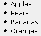
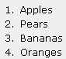
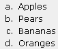
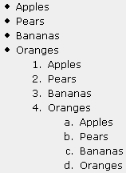
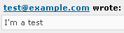
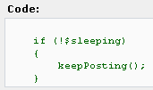
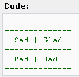

# 附录 C. phpBB 代码和权限速查表

在本附录中，您将找到在发布时使用的 BBCodes 的快速参考，以及描述 phpBB 权限系统的表格。您可以在第三章中找到有关 BBCodes 的更多信息，以及第五章中有关权限的更多信息。

# BBCode 速查表

可用的 BBCode 标签根据其目的分为四个类别——用于格式化的标签、用于创建列表的标签、用于引用和代码片段的标签，最后是用于添加图片和链接的标签。

## 格式化

| 代码 | 结果和注释 |
| --- | --- |
| `这是[粗体]粗体[/粗体]` |  |
| `...这是[斜体]斜体[/斜体]`。 |  |
| `现在 - [下划线]下划线 [/下划线]`。 |  |
| `[u][i][b]嵌套...[/b][/i][/u]` | 对于嵌套标签，首先关闭你打开的最后一个标签，然后按照相反的顺序继续，直到关闭第一个标签。 |
| `[color=darkred]使用颜色名称的深红色颜色[/color]` |  |
| `[color=#000099]蓝色，使用 HTML 颜色代码[/color]` |  |
| `[size=1]几乎看不见的文本[/size]` | ‘1’是文本大小的最小可能值，这会导致文本几乎看不见。 |
| `[size=12]正常文本[/size]` |  |
| `[size=29]最大的[/size]` | ‘29’是最大的字体大小。 |

## 列表

| 代码 | 结果和注释 |
| --- | --- |
| `[list]``[*]苹果``[*]梨``[*]香蕉``[*]橙子``[/list]` | 这是一个无序列表的示例。列表中的每个项目都以`[*]`开头，以新行结尾。 |
| `[list=1]``[*]苹果``[*]梨``[*]香蕉``[*]橙子``[/list]` | 有序列表的创建方式与无序列表相同——通过在列表标签中添加`=1`参数。列表总是从 1 开始，所以输入`=5`不会使列表从 5 开始，而是会使整个列表按原样显示，暴露 BB 标签。 |
| `[list=a]``[*]苹果``[*]梨``[*]香蕉``[*]橙子``[/list]` | 有序列表也可以使用字母而不是数字。 |
| `[list]``[*]苹果``[*]梨``[*]香蕉``[*]橙子``[list=1][*]苹果``[*]梨``[*]香蕉``[*]橙子``[list=a][*]苹果``[*]梨``[*]香蕉``[*]橙子``[/list]``[/list]``[/list]` | 你可以嵌套列表。 |

## 引用和代码片段

| 代码 | 结果和注释 |
| --- | --- |
| `[quote]只是一段引用[/quote]` |  |
| `[quote="The dude"]引用另一个用户[/quote]` |  |
| `[quote=" http://mail.yahoo.com "]Free web mail[/quote]` | 这显示了 BBCode 解析器中的一个未记录行为，允许您引用一个网站并同时创建到该网站的链接。注意 URL 周围的空格。 |
| `[quote=" test@example.com "]I’m a test[/quote]` | phpBB 的 BBCode 解析器中的相同未记录行为允许创建电子邮件链接。 |
| `[code]``if (!$sleeping)``{``keepPosting()`;`}``[/code]` | `code` 标签旨在显示代码片段，使用固定宽度字体。 |
| `[code]``--------------``&#124; Sad &#124; Glad &#124;``--------------``&#124; Mad &#124; Bad &#124;``--------------``[/code]` | `code` 标签的固定宽度字体允许发布缩进的编程代码，但也可以用于发布表格数据和 ASCII 艺术。 |

## 插入图片和链接

| 代码 | 结果和评论 |
| --- | --- |
| `[img]http://www.packtpub.com/images/Packt.png[/img]` | `img` 标签允许您在帖子中包含图片，前提是图片在互联网上可用且您知道其 URL。 |
| `http://www.packtpub.com/``www.packtpub.com` | phpBB 会将任何看起来像 URL 的字符串转换为链接。 |
| `[url]http://www.packtpub.com/[/url]` | 当显式使用`[url]`时，链接不会下划线。它使用 CSS 样式（postlink），而自动链接转换不会使用。 |
| `[url=http://www.packtpub.com/]Packt 书店[/url]` | 这是添加链接的最佳方式。链接的文本与 URL 不同。 |
| `[url=http://www.packtpub.com/]``[img]http://www.packtpub.com/images/Packt.png[/img]``[/url]` | 这是创建可点击链接图片的示例。 |

# 权限速查表

权限在第三章（第三章）中略有讨论，然后在第五章（第五章）中详细讨论。下表提供了此类权限的快速参考。

## 权限类型

| 权限类型 | 描述 |
| --- | --- |
| 查看 | 用户可以在论坛首页看到论坛的存在。 |
| 阅读 | 用户可以列出论坛主题，阅读帖子，并查看成员的资料和联系信息。 |
| 回复 | 用户可以就现有主题发表意见。 |
| 发布 | 用户可以开始新主题。 |
| 编辑 | 用户可以编辑自己的帖子。 |
| 删除 | 用户可以删除自己的帖子，只要没有人回复它们。 |
| 粘贴 | 用户可以开始粘贴主题。 |
| 公告 | 用户可以发布公告。 |
| 投票 | 用户可以在投票中投票。 |
| 投票创建 | 用户可以为他人创建投票。 |

## 权限级别

| 权限级别 | 描述 |
| --- | --- | --- | --- | --- | --- | --- | --- |
| ALL | 访问论坛的所有人，包括当前未登录的成员。 |
| REG | 登录的注册版主。 |
| PRIVATE | 一个单独分配的特殊权限级别。（参考第五章。） |
| MOD | 可以对论坛做任何事情的版主。 |
| ADMIN | 论坛管理员——可以访问**管理面板**的人。 |

## 简易模式权限

|   | 公共 | 注册用户 | 注册用户 [隐藏] | 私有 | 私有 [隐藏] | 管理员 | 管理员 [隐藏] |
| --- | --- | --- | --- | --- | --- | --- | --- |
| **查看** | ALL | ALL | REG | ALL | PRIVATE | ALL | MOD |
| **读取** | ALL | ALL | REG | PRIVATE | PRIVATE | MOD | MOD |
| **发布** | ALL | REG | REG | PRIVATE | PRIVATE | MOD | MOD |
| **回复** | ALL | REG | REG | PRIVATE | PRIVATE | MOD | MOD |
| **编辑** | REG | REG | REG | PRIVATE | PRIVATE | MOD | MOD |
| **删除** | REG | REG | REG | PRIVATE | PRIVATE | MOD | MOD |
| **置顶** | MOD | MOD | MOD | PRIVATE | PRIVATE | MOD | MOD |
| **公告** | MOD | MOD | MOD | MOD | MOD | MOD | MOD |
| **投票** | REG | REG | REG | PRIVATE | PRIVATE | MOD | MOD |
| **投票创建** | REG | REG | REG | PRIVATE | PRIVATE | MOD | MOD |
