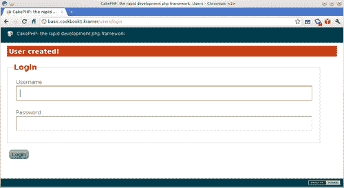
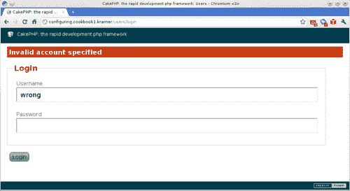
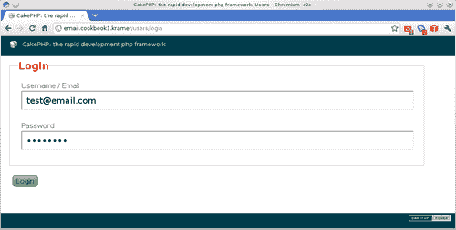
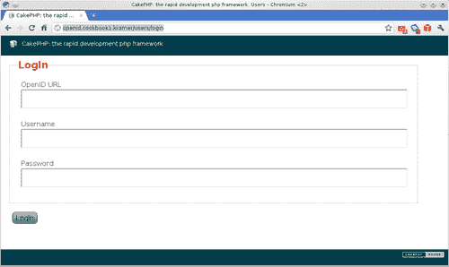

# 第一章. 身份验证

本章将涵盖以下主题：

+   设置基本身份验证系统

+   使用和配置 `Auth` 组件

+   允许使用电子邮件或用户名登录

+   登录后保存用户详情

+   获取当前用户的信息

+   使用前缀进行基于角色的访问控制

+   基于访问控制层的身份验证设置

+   与 OpenID 集成

# 简介

本章解释了如何在 CakePHP 应用程序上设置身份验证，从最基本的设置开始，到高级授权机制结束。这是通过使用框架核心中内置的工具来实现的，这些工具允许我们快速设置安全区域，同时不失构建更复杂解决方案的灵活性。

前两个菜谱展示了如何设置一个基本但完全工作的身份验证系统。接下来的三个菜谱允许我们的用户使用不同的信息登录，在成功登录后保存用户详情，并展示如何获取这些用户信息。第六个菜谱展示了一种更复杂的基于路由前缀的授权技术。第七个菜谱通过使用 CakePHP 的访问控制层设置了一个复杂的身份验证系统。最后，最后一个菜谱展示了如何将我们的应用程序与 OpenID 集成。

# 设置基本身份验证系统

当我们在向应用程序添加身份验证的过程中时，首先要完成的第一项任务是确定哪些控制器需要用户访问。通常，我们会默认保护每个控制器和操作，然后我们会指定我们应用程序的哪些区域允许公开访问。

## 准备工作

我们必须有一个包含至少两个字段的 `users` 表：`username`（用于存储用户名）和 `password`（用于存储由用户密码生成的散列）。

如果您没有为此目的创建表，可以使用以下 SQL 语句来创建它：

```php
CREATE TABLE `users`(
`id` INT UNSIGNED AUTO_INCREMENT NOT NULL,
`username` VARCHAR(255) NOT NULL,
`password` CHAR(40) NOT NULL,
PRIMARY KEY(`id`)
);

```

## 如何操作...

1.  创建一个名为 `users_controller.php` 的文件，并将其放置在您的 `app/controllers` 文件夹中，内容如下：

    ```php
    <?php
    class UsersController extends AppController {
    public function login() {
    }
    public function logout() {
    $this->redirect($this->Auth->logout());
    }
    }
    ?>

    ```

1.  在您的 `app/views/users` 文件夹中创建一个名为 `login.ctp` 的文件（如果您还没有创建该文件夹，请先创建），并添加以下内容：

    ```php
    <?php
    echo $this->Form->create(array('action'=>'login'));
    echo $this->Form->inputs(array(
    'legend' => 'Login',
    'username',
    'password'
    ));
    echo $this->Form->end('Login');
    ?>

    ```

1.  在您的 `app/` 文件夹中创建一个名为 `app_controller.php` 的文件，内容如下：

    ```php
    <?php
    class AppController extends Controller {
    public $components = array(
    'Auth' => array(
    'authorize' => 'controller'
    ),
    'Session'
    );
    public function isAuthorized() {
    return true;
    }
    }
    ?>

    ```

1.  修改 `UsersController`，并在 `login` 方法之前添加以下代码：

    ```php
    public function beforeFilter() {
    parent::beforeFilter();
    $this->Auth->allow('add');
    }
    public function add() {
    if (!empty($this->data)) {
    $this->User->create();
    if ($this->User->save($this->data)) {
    $this->Session->setFlash('User created!');
    $this->redirect(array('action'=>'login'));
    } else {
    $this->Session->setFlash('Please correct the errors');
    }
    }
    }

    ```

1.  创建一个名为 `add.ctp` 的文件，并将其放置在您的 `app/views/users` 文件夹中，内容如下：

    ```php
    <?php
    echo $this->Form->create();
    echo $this->Form->inputs(array(
    'legend' => 'Signup',
    'username',
    'password'
    ));
    echo $this->Form->end('Submit');
    ?>

    ```

    现在我们已经有一个完全工作的身份验证系统。我们可以通过浏览到 `http://localhost/users/add` 来添加新用户，通过浏览到 `http://localhost/users/login` 来登录，最后通过浏览到 `http://localhost/users/logout` 来注销。

    创建用户后，你应该会看到一个带有成功信息的登录表单，如下面的截图所示：

    

## 它是如何工作的...

我们首先在`UsersController`类中创建两个动作：`login()`，用于显示和处理登录表单的提交，以及`logout()`，用于处理用户登出。

你可能会惊讶，`login()`方法没有任何逻辑。要显示表单，我们只需要显示动作的视图。表单提交由`Auth`组件处理，因此我们不需要实现任何控制器逻辑。因此，我们唯一需要实现的是为这个动作创建一个视图，该视图包括一个简单的表单，包含两个字段：`username`和`password`。

### 注意

CakePHP 的`FormHelper`的`inputs`方法是一个旨在避免多次调用`input`方法的快捷方式。通过使用它，我们可以创建一个包含元素的完整表单，而无需多次调用`FormHelper::input()`。

`logout()`控制器动作简单地调用`Auth`组件的`logout()`方法。此方法从会话中删除已登录用户数据，并返回用户登出后应重定向到的地址，该地址来自组件先前配置的`logoutRedirect`设置（如果未配置，则默认为应用程序的主页。）

接下来，我们在控制器中添加两个组件：`Session`和`Auth`。`Session`组件是必需的，用于创建消息（通过使用其`setflash()`方法），告知用户登录尝试是否失败，或者是否创建了用户。

`Auth`组件通过`beforeFilter`回调方法在控制器动作和传入请求之间操作。它使用其`authorize`设置来检查将要使用哪种身份验证方案。

### 注意

要获取有关`authorize`设置的更多信息，请参阅配方*使用和配置 Auth 组件*。

一旦将`Auth`组件添加到控制器中，该控制器中的所有动作在没有有效用户登录的情况下均不可访问。这意味着，如果我们有任何应该公开的动作（例如我们控制器中的`login()`和`add()`动作），我们就必须告诉`Auth`组件这些动作。

如果有人想使某些动作公开，可以将这些动作的名称添加到`Auth`组件的`allowedActions`设置中，或者通过调用其`allow()`方法。我们使用后者来告诉`Auth`组件`add()`动作可以在不登录用户的情况下访问。`login()`动作由`Auth`组件自动添加到公共动作列表中。

当用户尝试访问不在公共操作范围内的操作时，`Auth`组件会检查会话以查看是否有用户已经登录。如果没有找到有效的用户，它将浏览器重定向到`login`操作。如果已登录用户，它将使用控制器的`isAuthorized`方法检查用户是否有权限。如果其返回值为`true`，则允许访问，否则拒绝访问。在我们的案例中，我们在`AppController`，我们的基本控制器类中实现了此方法。如果尝试的操作需要已登录的用户，则执行`login()`操作。在用户使用登录表单提交数据后，组件将首先对密码字段进行哈希处理，然后对`User`模型执行查找操作以找到有效的账户，使用提交的用户名和密码。如果找到有效记录，则将其保存到会话中，标记用户已登录。

### 对密码确认字段进行哈希处理

当`Auth`组件在控制器上启用，并且用户提交了一个名为`password`的字段（无论它是否在登录表单中渲染）的表单时，组件将在执行控制器操作之前自动对`password`字段进行哈希处理。

### 注意

`Auth`组件使用配置设置中定义的盐（在您的`app/config/core.php`文件中的`Security.salt`）来计算哈希。即使使用相同的密码，不同的盐值也会产生不同的哈希值。因此，请确保您更改所有 CakePHP 应用程序中的盐，从而增强您的认证系统的安全性。

这意味着该操作永远不会保留明文密码值，在利用机制进行密码验证确认时，这一点应特别注意。当你实施此类验证时，请确保使用正确的方法对确认字段进行哈希处理：

```php
if (!empty($this->data)) {
$this->data['User']['confirm_password'] = $this->Auth->password($this->data['User']['confirm_password']);
// Continue with processing
}

```

## 参见

+   *使用和配置 Auth 组件*

+   *获取当前用户信息*

# 使用和配置 Auth 组件

如果有什么定义了`Auth`组件，那就是它的灵活性，它负责不同的认证模式，每种模式都满足不同的需求。在本食谱中，您将学习如何修改组件的默认行为，以及如何在不同认证模式之间进行选择。

## 准备工作

我们应该有一个完全工作的认证系统，所以按照整个食谱*设置基本认证系统*。

我们还将添加对禁用用户账户的支持。使用以下 SQL 语句向您的用户表添加一个名为 active 的字段：

```php
ALTER TABLE `users`
ADD COLUMN `active` TINYINT UNSIGNED NOT NULL default 1;

```

## 如何操作...

1.  修改`AppController`类中`Auth`组件的定义，使其看起来如下：

    ```php
    public $components = array(
    'Auth' => array(
    'authorize' => 'controller',
    'loginRedirect' => array(
    'admin' => false,
    'controller' => 'users',
    'action' => 'dashboard'
    ),
    'loginError' => 'Invalid account specified',
    'authError' => 'You don\'t have the right permission'
    ),
    'Session'
    );

    ```

1.  现在，当您仍在编辑`app/app_controller.php`文件时，在`AppController`类中的`beforeFilter`方法声明下方，放置以下代码：

    ```php
    public function beforeFilter() {
    if ($this->Auth->getModel()->hasField('active'))
    {$this->Auth->userScope = array('active' => 1);
    }
    }

    ```

1.  将默认布局从 `cake/libs/view/layouts/default.ctp` 复制到你的 `app/views/layouts` 目录，并确保你在布局中放置以下行，以便显示认证消息：

    ```php
    <?php echo $this->Session->flash('auth'); ?>

    ```

1.  编辑你的 `app/controllers/users_controller.php` 文件，并在 `logout()` 方法下方放置以下方法：

    ```php
    public function dashboard() {
    }

    ```

1.  最后，在名为 `dashboard.ctp` 的文件中创建此新添加的动作视图，并将其放置在你的 `app/views/users` 文件夹中，内容如下：

    ```php
    <p>Welcome!</p>

    ```

    如果你现在浏览到 `http://localhost/users/login` 并输入错误的凭据（错误的用户名和/或密码），你应该会看到以下截图中的错误消息：

    

## 它是如何工作的...

由于 `Auth` 组件在其执行控制器动作之前执行其魔法，我们要么需要在 `beforeFilter` 回调中指定其设置，要么在将组件添加到 `components` 属性时传递它们。一个常见的地方是在 `AppController` 类的 `beforeFilter()` 方法中这样做，因为这样我们可以在所有控制器中共享相同的认证设置。

此配方更改了一些 `Auth` 设置，以便每当有效用户登录时，他们都会自动被带到 `UsersController` 中的 `dashboard` 动作（通过 `loginRedirect` 设置完成。）它还通过组件的相应设置添加了一些默认错误消息：当提供的账户无效时为 `loginError`，当有有效账户但操作未授权时为 `authError`（这可以通过在 `AppController` 中实现的 `isAuthorized()` 方法返回 `false` 来实现。）

它还在 `AppController::beforeFilter()` 中设置了组件的 `userScope` 设置。此设置允许我们定义 `User` 查找操作需要匹配哪些条件才能允许用户账户登录。通过添加 `userScope` 设置，我们确保只有将 `active` 字段设置为 `1` 的用户记录才能访问。

### 更改默认用户模型

正如你可能已经注意到的，`User` 模型的角色至关重要，不仅是为了获取正确的用户账户，还要检查某些认证方案上的权限。默认情况下，`Auth` 组件会寻找一个 `User` 模型，但你可以通过设置 `userModel` 属性或设置数组中的 `userModel` 键来更改要使用的模型。

例如，如果你的用户模型是 `Account`，你会在将 `Auth` 组件添加到控制器时添加以下设置：

```php
'userModel' => 'Account'

```

或者等价地，你可以在 `AppController` 类的 `beforeFilter` 方法中添加以下内容到 `beforeFilter` 方法：

```php
$this->Auth->userModel = 'Account';

```

## 还有更多...

`Auth` 组件的 `$authorize` 属性（或 `Auth` 组件设置数组中的 `authorize` 键）定义了应该使用哪种认证方案。可能的值有：

+   `controller`：它使组件使用控制器的`isAuthorized`方法，该方法返回`true`以允许访问，或返回`false`以拒绝访问。此方法在获取登录用户时特别有用（请参阅*获取当前用户信息*配方）。

+   `model`：它与`controller`类似；而不是使用控制器来调用方法，它会在`User`模型中查找`isAuthorized`方法。首先，它会尝试将控制器的操作映射到 CRUD 操作（`'create'`、`'read'`、`'update'`或`'delete'`之一），然后使用三个参数调用该方法：用户记录、被访问的控制器以及要执行的操作（或实际的控制器操作）。

+   `object`：它与`model`类似；而不是使用模型来调用方法，它会在给定的类中查找`isAuthorized`方法。为了指定哪个类，将`AuthComponent::$object`属性设置为该类的实例。它使用三个参数调用该方法：用户记录、被访问的控制器以及要执行的操作。

+   `actions`：它使用`Acl`组件来检查访问权限，这允许更细粒度的访问控制。

+   `crud`：它与`actions`类似；区别在于它首先尝试将控制器的操作映射到 CRUD 操作（`'create'`、`'read'`、`'update'`或`'delete'`之一）。

## 相关内容

+   *获取当前用户信息*

+   *设置基于访问控制层身份验证*

# 允许使用用户名或电子邮件登录

默认情况下，`Auth`组件将使用登录表单中提交的给定用户名来检查有效用户账户。然而，某些应用程序有两个单独的字段：一个用于定义用户名，另一个用于定义用户的电子邮件。本配方展示了如何允许使用用户名或电子邮件进行登录。

## 准备工作

我们应该有一个完全工作的身份验证系统，所以按照整个配方，*设置基本身份验证系统*。

我们还需要字段来存储用户的电子邮件地址。使用以下 SQL 语句向您的`users`表添加一个名为`email`的字段：

```php
ALTER TABLE `users`
ADD COLUMN `email` VARCHAR(255) NOT NULL;

```

我们需要修改注册页面，以便用户可以指定他们的电子邮件地址。编辑您的`app/views/users/add.ctp`文件并做出以下更改：

```php
<?php
echo $this->Form->create();
echo $this->Form->inputs(array(
'legend' => 'Signup',
'email',
'username',
'password'
));
echo $this->Form->end('Submit');
?>

```

## 如何做到这一点...

1.  编辑您的`app/views/users/login.ctp`文件并对其做出以下更改：

    ```php
    <?php
    echo $this->Form->create(array('action'=>'login'));
    echo $this->Form->inputs(array(
    'legend' => 'Login',
    'username' => array('label'=>'Username / Email'),
    'password'
    ));
    echo $this->Form->end('Login');
    ?>

    ```

1.  编辑您的`UsersController`类，并确保`login`操作看起来如下：

    ```php
    public function login() {
    if (
    !empty($this->data) &&
    !empty($this->Auth->data['User']['username']) &&
    !empty($this->Auth->data['User']['password'])
    ) {
    $user = $this->User->find('first', array(
    'conditions' => array(
    'User.email' => $this->Auth->data['User']['username'],
    'User.password' => $this->Auth->data['User']['password']
    ),
    'recursive' => -1
    ));
    if (!empty($user) && $this->Auth->login($user)) {
    if ($this->Auth->autoRedirect) {
    $this->redirect($this->Auth->redirect());
    }
    } else {
    $this->Session->setFlash($this->Auth->loginError, $this->Auth->flashElement, array(), 'auth');
    }
    }
    }

    ```

    如果您现在浏览到`http://localhost/users/login`，您就可以输入用户的电子邮件和密码进行登录，如下面的截图所示：

    

## 它是如何工作的...

当 `Auth` 组件无法使用用户名和密码字段找到有效的用户账户时，它将控制权交回 `login` 动作。因此，在 `login` 动作中，我们可以检查是否有任何提交的数据。如果是这样，我们知道 `Auth` 组件无法找到有效的账户。

考虑到这一点，我们可以尝试找到与给定用户名匹配的电子邮件地址的用户账户。如果存在，我们登录用户并将浏览器重定向到默认动作，类似于组件在成功尝试时所做的操作。

如果我们找不到有效的用户账户，我们只需将闪存消息设置为 `Auth` 组件中指定的默认错误消息。

## 还有更多...

你可能已经注意到，在查找用户记录时，我们使用了 `$this->Auth->data` 而不是 `$this->data` 来使用实际提交的值。这样做的原因是因为 `Auth` 组件不仅会自动哈希密码字段，还会将其值从控制器中的 `data` 属性中移除，所以如果你需要再次显示登录表单，密码字段将不会为用户预先填充。

## 参见

+   *获取当前用户信息*

# 登录后保存用户详情

具有身份验证功能的网站提供的最典型的功能之一是允许用户选择（通过点击复选框）他们是否希望在登录后让系统记住他们的账户。

## 准备工作

我们应该有一个工作的身份验证系统，所以按照整个配方，*设置基本身份验证系统*。

## 如何操作...

1.  编辑你的 `app/app_controller.php` 文件，并将以下 `Auth` 组件设置添加到 `Auth` 组件中。同时，通过以下更改 `components` 属性来添加 `Cookie` 组件：`AppController`（在 `$components` 属性中）必须包含以下强制性设置（如果尚未存在，请将其添加到组件设置数组的内部）：

    ```php
    public $components = array(
    'Auth' => array(
    'authorize' => 'controller',
    'autoRedirect' => false
    ),
    'Cookie',
    'Session'
    );

    ```

1.  编辑你的 `app/views/users/login.ctp` 视图文件，并做出以下更改：

    ```php
    <?php
    echo $this->Form->create(array('action'=>'login'));
    echo $this->Form->inputs(array(
    'legend' => 'Login',
    'username',
    'password',
    'remember' => array('type' => 'checkbox', 'label' => 'Remember me')
    ));
    echo $this->Form->end('Login');
    ?>

    ```

1.  现在，将以下代码添加到你的 `UsersController` 类的 `login` 动作末尾：

    ```php
    if (!empty($this->data)) {
    $userId = $this->Auth->user('id');
    if (!empty($userId)) {
    if (!empty($this->data['User']['remember'])) {
    $user = $this->User->find('first', array(
    'conditions' => array('id' => $userId),
    'recursive' => -1,
    'fields' => array('username', 'password')
    ));
    $this->Cookie->write('User', array_intersect_key(
    $user[$this->Auth->userModel],
    array('username'=>null, 'password'=>null)
    ));
    } elseif ($this->Cookie->read('User') != null) {
    $this->Cookie->delete('User');
    }
    $this->redirect($this->Auth->redirect());
    }
    }

    ```

1.  接下来，将以下代码添加到你的 `UsersController` 类的 `logout()` 方法开头：

    ```php
    if ($this->Cookie->read('User') != null) {
    $this->Cookie->delete('User');
    }

    ```

1.  最后，将以下方法添加到你的 `AppController` 类中，紧接在 `components` 属性声明下方：

    ```php
    public function beforeFilter() {
    if ($this->Auth->user() == null) {
    $user = $this->Cookie->read('User');
    if (!empty($user)) {
    $user = $this->Auth->getModel()->find('first', array(
    'conditions' => array(
    $this->Auth->fields['username'] => $user[$this->Auth->fields['username']],
    $this->Auth->fields['password'] => $user[$this->Auth->fields['password']]
    ),
    'recursive' => -1
    ));
    if (!empty($user) && $this->Auth->login($user)) {
    $this->redirect($this->Auth->redirect());
    }
    }
    }
    }

    ```

### 它是如何工作的...

我们需要完成的第一项任务是禁用`Auth`组件中的自动重定向。通过这样做，我们能够捕捉到成功和失败的登录尝试，这允许我们检查是否选中了**记住我**复选框。如果复选框确实被选中，我们创建一个名为`User`的 cookie，其中包含`username`和`password`字段的值，其值等于登录的用户 ID。记住，`password`值会自动由`Auth`组件加密，因此存储是安全的。`Cookie`组件通过自动加密和解密给定值，增加了另一层安全性。

在`AppController::beforeFilter()`中，如果没有登录用户，我们会检查 cookie 是否已设置。如果是，我们使用 cookie 中存储的`username`和`password`字段的值来登录用户，然后将浏览器重定向到`login`操作。

最后，我们在适当的时候删除 cookie（当用户未选中复选框登录或用户手动注销时）。

### 参见

+   *获取当前用户信息*

# 获取当前用户信息

CakePHP 的认证系统将为我们提供构建强大、灵活的基于`Auth`的应用程序所需的工具。然后我们可以使用它来获取当前用户信息，并在整个应用程序中使其可用。

在这个菜谱中，我们将看到如何保存当前登录用户的信息，使其可以从我们的 CakePHP 应用程序的任何地方访问，包括布局，同时向`User`模型添加一个有用的方法以简化工作。

## 准备工作

我们应该有一个工作的认证系统，所以按照以下步骤，*设置基本认证系统*。

## 如何做...

1.  将以下方法添加到您的`AppController`类中：

    ```php
    public function beforeFilter() {
    $user = $this->Auth->user();
    if (!empty($user)) {
    Configure::write('User', $user[$this->Auth->getModel()->alias]);
    }
    }

    ```

1.  在您的`AppController`类中，在类定义内添加以下方法：

    ```php
    public function beforeRender() {
    $user = $this->Auth->user();
    if (!empty($user)) {
    $user = $user[$this->Auth->getModel()->alias];
    }
    $this->set(compact('user'));
    }

    ```

1.  将默认的 CakePHP 布局文件`default.ctp`从您的`cake/libs/view/layouts`文件夹复制到您的应用程序的`app/views/layouts`文件夹。在`app/views/layouts/default.ctp`文件夹中放置以下代码。在编辑此布局时，在您想要登录/注销链接出现的地方添加以下代码：

    ```php
    <?php if (!empty($user)) { ?>
    Welcome back <?php echo $user['username']; ?>!
    <?php
    echo $this->Html->link('Log out', array('plugin'=>null, 'admin'=>false, 'controller'=>'users', 'action'=>'logout'));
    } else {
    echo $this->Html->link('Log in', array('plugin'=>null, 'admin'=>false, 'controller'=>'users', 'action'=>'login'));
    }
    ?>

    ```

1.  将以下方法添加到`User`模型中。如果您还没有为`users`表创建模型，请继续创建一个名为`user.php`的文件并将其放置在您的`app/models`目录中。如果您已经有了，请确保将其`get`方法添加进去：

    ```php
    <?php
    class User extends AppModel {
    public static function get($field = null) {
    $user = Configure::read('User');
    if (empty($user) || (!empty($field) && !array_key_exists($field, $user))) {
    return false;
    }
    return !empty($field) ? $user[$field] : $user;
    }
    }
    ?>

    ```

### 它是如何工作的...

通过将用户记录存储在应用程序的全局配置变量中，我们能够在应用程序的任何地方获取当前用户信息，无论是控制器、组件、模型等。这使得我们能够知道在任何时候是否有用户登录。

我们还需要确保视图能够了解是否有已登录的用户。虽然从技术上讲，视图仍然可以访问配置变量，但通常更优雅的做法是设置一个视图变量，以避免视图与 PHP 类之间的任何交互（除了视图助手之外）。

### 注意

当你在 `AppController` 中为视图设置变量时，确保没有任何控制器操作会覆盖这个变量非常重要。明智地选择一个独特的名称，并确保你不在你的控制器中设置具有相同名称的视图变量。

最后，我们在 `User` 模型中添加了一个方便的方法，这样我们就可以从我们的控制器中获取当前用户，而无需处理 `Configure` 变量。我们还可以使用 `get` 方法收集特定的用户信息。例如，要从控制器中获取当前用户的用户名，我们可以做如下操作：

```php
$userName = User::get('username');

```

你不需要自己加载 `User` 模型类，因为 `Auth` 组件会为你做这件事。

### 参见

+   *允许使用电子邮件或用户名登录*。

# 使用前缀进行基于角色的访问控制

尽管 CakePHP 提供了一个非常强大的访问控制层，但有时我们只需要实现用户角色，而不必深入了解指定哪个角色可以访问哪个操作。

这个菜谱展示了如何通过使用路由前缀来限制基于角色的特定操作访问，这构成了一个简单的基于角色的身份验证的完美解决方案。为了完成这个菜谱，我们将假设需要在我们的应用程序中添加三个用户角色：管理员、经理和用户。

## 准备工作

我们应该有一个工作的身份验证系统，所以按照菜谱，*设置基本身份验证系统*。`users` 表也应该包含一个字段来存储用户的角色（命名为 `role`。）使用以下 SQL 语句添加此字段：

```php
ALTER TABLE `users`
ADD COLUMN `role` VARCHAR(255) DEFAULT NULL AFTER `password`;

```

## 如何做...

1.  编辑你的 `app/config/core.php` 文件，查找定义 `Routing.prefixes` 设置的行。如果该行被注释掉了，取消注释它。然后将其更改为：

    ```php
    Configure::write('Routing.prefixes', array('admin', 'manager'));

    ```

1.  在你的 `UsersController` 类定义的末尾添加以下代码：

    ```php
    public function dashboard() {
    $role = $this->Auth->user('role');
    if (!empty($role)) {
    $this->redirect(array($role => true, 'action' => 'dashboard'));
    }
    }
    public function admin_dashboard() {
    }
    public function manager_dashboard() {
    }

    ```

1.  为这些操作中的每一个创建一个视图，并在其中放入内容以反映正在渲染的视图。因此，你需要创建三个文件：

    +   `app/views/users/admin_dashboard.ctp`

    +   `app/views/users/manager_dashboard.ctp`

    +   `app/views/users/dashboard.ctp`

    例如，`dashboard.ctp` 的内容可以简单地是：

    ```php
    <h1>Dashboard (User)</h1>

    ```

1.  编辑你的 `app/controllers/app_controller.php` 文件，并将 `components` 属性声明更改为包括以下设置，用于 `Auth` 组件：

    ```php
    public $components = array(
    'Auth' => array(
    'authorize' => 'controller',
    'loginRedirect' => array(
    'admin' => false,
    'controller' => 'users',
    'action' => 'dashboard'
    )
    ),
    'Session'
    );

    ```

1.  在编辑你的 `AppController` 类的同时，更改 `isAuthorized` 方法，并将其完全替换为以下内容：

    ```php
    public function isAuthorized() {
    $role = $this->Auth->user('role');
    $neededRole = null;
    $prefix = !empty($this->params['prefix']) ?
    $this->params['prefix'] :
    null;
    if (
    !empty($prefix) &&
    in_array($prefix, Configure::read('Routing.prefixes'))
    ) {
    $neededRole = $prefix;
    }
    return (
    empty($neededRole) ||
    strcasecmp($role, 'admin') == 0 ||
    strcasecmp($role, $neededRole) == 0
    );
    }

    ```

1.  将默认的 CakePHP 布局文件 `default.ctp` 从您的 `cake/libs/view/layouts` 文件夹复制到您的应用程序的 `app/views/layouts` 文件夹。在编辑此布局时，将以下代码放置在 `app/views/layouts/default.ctp` 布局文件中，您希望链接到仪表板的位置。

    ```php
    <?php
    $dashboardUrl = array('controller'=>'users', 'action'=>'dashboard');
    if (!empty($user['role'])) {
    $dashboardUrl[$user['role']] = true;
    }
    echo $this->Html->link('My Dashboard', $dashboardUrl);
    ?>

    ```

### 它是如何工作的...

当它们位于正常路由之前时，CakePHP 会识别 `Routing.prefixes` 设置中定义的前缀作为 URL 的一部分。例如，如果 `admin` 是一个已定义的前缀，则路由 `/admin/articles/index` 将转换为 `ArticlesController` 中的 `admin_index` 操作。

由于我们正在利用 `Auth` 配置中的控制器认证方案，我们知道每次用户尝试访问非公开操作时，都会执行 `AppController::isAuthorized()`，在方法内部，我们根据用户是否有权访问设置 `true` 或 `false`。

了解这一点后，我们可以在控制器操作即将执行时检查是否使用了前缀。如果当前访问的路由包含前缀，我们可以将该前缀与用户的角色匹配，以确保他们有权访问请求的资源。

我们可以通过在路由中添加适当的前缀来链接仅对角色可用的资源。例如，要链接到管理员的仪表板，URL 将是：

```php
array(
'manager' => true,
'controller' => 'users',
'action' => 'dashboard'
);

```

### 相关内容

+   *基于访问控制层设置认证*。

# 基于访问控制层设置认证

应用程序拥有的角色越多，其访问控制层就越复杂。幸运的是，`Auth` 组件提供的认证方案之一允许我们通过命令行工具轻松定义哪些操作可以被某些角色（称为组）访问。在本教程中，您将学习如何在您的应用程序上设置访问控制列表（ACL）。

## 准备工作

我们应该有一个名为 `groups` 的表来存储角色。

如果您还没有，请使用以下语句创建它：

```php
CREATE TABLE `groups`(
`id` INT NOT NULL AUTO_INCREMENT,
`name` VARCHAR(255) NOT NULL,
PRIMARY KEY(`id`)
);

```

如果您的 `groups` 表中没有记录，请运行以下 SQL 语句创建一些：

```php
INSERT INTO `groups`(`id`, `name`) VALUES
(1, 'Administrator'),
(2, 'Manager'),
(3, 'User');

```

我们还必须有一个 `users` 表来存储用户，该表应包含一个字段（命名为 `group_id`），用于包含用户所属组的引用。如果您没有这样的表，请使用以下语句创建它：

```php
CREATE TABLE `users`(
`id` INT NOT NULL AUTO_INCREMENT,
`group_id` INT NOT NULL,
`username` VARCHAR(255) NOT NULL,
`password` CHAR(40) NOT NULL,
PRIMARY KEY(`id`),
KEY `group_id`(`group_id`),
CONSTRAINT `users__groups` FOREIGN KEY(`group_id`) REFERENCES `groups`(`id`)
);

```

我们还需要初始化 ARO / ACO 表。使用您的操作系统控制台，切换到您的应用程序目录，并运行：

+   如果您使用的是 GNU Linux / Mac / Unix 系统：

    ```php
    ../cake/console/cake schema create DbAcl

    ```

+   如果您使用的是 Microsoft Windows：

    ```php
    ..\cake\console\cake.bat schema create DbAcl

    ```

### 如何操作...

### 注意

以下初始步骤与 *设置基本认证系统* 中显示的步骤非常相似。然而，两者之间有一些关键的区别，所以请确保仔细阅读这些说明。

1.  为 `User` 模型创建一个控制器（在 `app/controllers` 文件夹内名为 `users_controller.php` 的文件中），它应包含以下内容：

    ```php
    <?php
    class UsersController extends AppController {
    public function login() {
    }
    public function logout() {
    $this->redirect($this->Auth->logout());
    }
    }
    ?>

    ```

1.  在您的`app/views/users`文件夹中创建一个名为`login.ctp`的文件（如果您还没有创建该文件夹，请先创建），内容如下：

    ```php
    <?php
    echo $this->Form->create(array('action'=>'login'));
    echo $this->Form->inputs(array(
    'legend' => 'Login',
    'username',
    'password'
    ));
    echo $this->Form->end('Login');
    ?>

    ```

1.  在您的`app/`文件夹中创建一个名为`app_controller.php`的文件。确保它包含以下内容：

    ```php
    <?php
    class AppController extends Controller {
    public $components = array(
    'Acl',
    'Auth' => array(
    'authorize' => 'actions',
    'loginRedirect' => array(
    'admin' => false,
    'controller' => 'users',
    'action' => 'dashboard'
    )
    ),
    'Session'
    );
    }
    ?>

    ```

1.  修改`UsersController`类，并在其`login()`方法之前添加以下代码：

    ```php
    public function beforeFilter() {
    parent::beforeFilter();
    $this->Auth->allow('add');
    }
    public function add() {
    if (!empty($this->data)) {
    $this->User->create();
    if ($this->User->save($this->data)) {
    $this->Session->setFlash('User created!');
    $this->redirect(array('action'=>'login'));
    } else {
    $this->Session->setFlash('Please correct the errors');
    }
    }
    $this->set('groups', $this->User->Group->find('list'));
    }

    ```

1.  在`app/views/users`文件夹中添加动作视图，通过创建一个名为`add.ctp`的文件并包含以下内容：

    ```php
    <?php
    echo $this->Form->create();
    echo $this->Form->inputs(array(
    'legend' => 'Signup',
    'username',
    'password',
    'group_id'
    ));
    echo $this->Form->end('Submit');
    ?>

    ```

1.  创建一个名为`group.php`的文件，并将其放置在您的`app/models`文件夹中，内容如下：

    ```php
    <?php
    class Group extends AppModel {
    public $actsAs = array('Acl' => 'requester');
    public function parentNode() {
    if (empty($this->id) && empty($this->data)) {
    return null;
    }
    $data = $this->data;
    if (empty($data)) {
    $data = $this->find('first', array(
    'conditions' => array('id' => $this->id),
    'fields' => array('parent_id'),
    'recursive' => -1
    ));
    }
    if (!empty($data[$this->alias]['parent_id'])) {
    return $data[$this->alias]['parent_id'];
    }
    return null;
    }
    }
    ?>

    ```

1.  创建一个名为`user.php`的文件，并将其放置在您的`app/models`文件夹中，内容如下：

    ```php
    <?php
    class User extends AppModel {
    public $belongsTo = array('Group');
    public $actsAs = array('Acl' => 'requester');
    public function parentNode() {
    }
    public function bindNode($object) {
    if (!empty($object[$this->alias]['group_id'])) {
    return array(
    'model' => 'Group',
    'foreign_key' => $object[$this->alias]['group_id']
    );
    }
    }
    }
    ?>

    ```

    ### 注意

    请注意您`groups`表中所有记录的 ID，因为它们需要将每个组链接到一个*ARO*记录。

1.  在您的控制台中运行以下命令（如果您的组 ID 不同，请将引用的 1、2、3 更改为您的组 ID）。

    +   如果您使用的是 GNU Linux / Mac / Unix 系统，命令如下：

        ```php
        ../cake/console/cake acl create aro root Groups
        ../cake/console/cake acl create aro Groups Group.1
        ../cake/console/cake acl create aro Groups Group.2
        ../cake/console/cake acl create aro Groups Group.3

        ```

    +   如果您使用的是 Microsoft Windows，命令如下：

        ```php
        ..\cake\console\cake.bat acl create aro root Groups
        ..\cake\console\cake.bat acl create aro Groups Group.1
        ..\cake\console\cake.bat acl create aro Groups Group.2
        ..\cake\console\cake.bat acl create aro Groups Group.3

        ```

1.  在您的`UsersController`类定义的末尾添加以下代码：

    ```php
    public function dashboard() {
    $groupName = $this->User->Group->field('name',
    array('Group.id'=>$this->Auth->user('group_id'))
    );
    $this->redirect(array('action'=>strtolower($groupName)));
    }
    public function user() {
    }
    public function manager() {
    }
    public function administrator() {
    }

    ```

1.  为这些动作中的每一个创建一个视图，并在每个视图中放置一些独特的内容，以反映正在渲染的视图。因此，您必须创建三个文件：

    +   `app/views/users/user.ctp`

    +   `app/views/users/manager.ctp`

    +   `app/views/users/administrator.ctp`。

    例如，`user.ctp`的内容可以简单地是：

    ```php
    <h1>Dashboard (User)</h1>

    ```

1.  我们必须告诉 ACL 关于这些受限动作的信息。请在您的控制台中运行以下命令。

    +   如果您使用的是 GNU Linux / Mac / Unix 系统，命令如下：

        ```php
        ../cake/console/cake acl create aco root controllers
        ../cake/console/cake acl create aco controllers Users
        ../cake/console/cake acl create aco controllers/Users logout
        ../cake/console/cake acl create aco controllers/Users user
        ../cake/console/cake acl create aco controllers/Users manager
        ../cake/console/cake acl create aco controllers/Users administrator

        ```

    +   如果您使用的是 Microsoft Windows，命令如下：

        ```php
        ..\cake\console\cake.bat acl create aco root controllers
        ..\cake\console\cake.bat acl create aco controllers Users
        ..\cake\console\cake.bat acl create aco controllers/Users logout
        ..\cake\console\cake.bat acl create aco controllers/Users user
        ..\cake\console\cake.bat acl create aco controllers/Users manager
        ..\cake\console\cake.bat acl create aco controllers/Users administrator

        ```

1.  最后，我们必须通过将每个 ARO（组）链接到每个 ACO（控制器动作）来授予权限。请在您的控制台中运行以下命令。

    +   如果您使用的是 GNU Linux / Mac / Unix 系统，命令如下：

        ```php
        ../cake/console/cake acl grant Group.1 controllers/Users all
        ../cake/console/cake acl grant Group.2 controllers/Users/logout all
        ../cake/console/cake acl grant Group.2 controllers/Users/manager all
        ../cake/console/cake acl grant Group.3 controllers/Users/logout all
        ../cake/console/cake acl grant Group.3 controllers/Users/user all

        ```

    +   如果您使用的是 Microsoft Windows，命令如下：

        ```php
        ..\cake\console\cake.bat acl grant Group.1 controllers/Users all
        ..\cake\console\cake.bat acl grant Group.2 controllers/Users/logout all
        ..\cake\console\cake.bat acl grant Group.2 controllers/Users/manager all
        ..\cake\console\cake.bat acl grant Group.3 controllers/Users/logout all
        ..\cake\console\cake.bat acl grant Group.3 controllers/Users/user all

        ```

    现在我们已经有一个完全工作的基于 ACL 的认证系统。我们可以通过浏览到`http://localhost/users/add`，使用 http://localhost/users/login 登录，并最终使用 http://localhost/users/logout 登出来添加新用户。

用户应只能访问`http://localhost/users/user`，经理可以访问`http://localhost/users/manager`，而管理员应该能够访问所有这些动作，包括`http://localhost/users/administrator`。

### 它是如何工作的...

当将`Auth`组件的`authorize`配置选项设置为`actions`，并在控制器组件列表中添加`Acl`之后，CakePHP 将检查当前访问的动作是否是公开动作。如果不是这种情况，它将检查是否有匹配 ACO 记录的已登录用户。如果没有这样的记录，它将拒绝访问。

一旦为控制器操作找到了匹配的 ACO，它将使用`User`模型中的`bindNode`方法来查看用户记录是如何与 ARO 匹配的。我们添加的方法实现指定用户记录应该通过用户所属的组在`aros`表中查找。

在拥有匹配的 ACO 和 ARO 之后，它最后会检查是否为给定的 ARO 和 ACO 记录设置了有效的权限集（在`aros_acos`表中）。如果找到，则允许访问，否则将拒绝授权。

在组表中的每个记录都必须有一个匹配的 ARO 记录，这是至关重要的。我们通过发出`aro create`命令来设置这种关联，将每个组 ID 链接到形式为`Group.ID`的 ARO 记录，其中 ID 是实际的 ID。

类似地，所有不在定义的公共操作中的控制器操作都应该有一个匹配的 ACO 记录。就像 ARO 一样，我们通过发出`aco create`命令来创建控制器操作和 ACO 之间的关联，将 ACO 名称设置为操作名称，并使它们成为名称为控制器名称的 ACO 的子项。

最后，为了授予 ARO（组）对 ACO（控制器操作）的权限，我们发出`acl grant`命令，将 ARO（Group.ID）指定为第一个参数，将第二个参数指定为整个控制器（例如`controllers/Users`）或特定的控制器操作（例如`controllers/Users/logout`）。grant 命令的最后一个参数（all）简单地提供了对访问类型的进一步控制，并在使用 ACL 控制对自定义对象的访问或使用`crud`认证方案时更有意义。

### 还有更多...

在开发应用程序时，将每个控制器操作与 ACO 匹配的任务可能有些麻烦。幸运的是，CakePHP 社区中的几个人感觉到了对更简单解决方案的需求。我推荐的一个解决方案是采用由 CakePHP 1.3 版本的首席开发者 Mark Story 开发的插件`acl_extras`。通过使用此插件，您将能够持续同步您的控制器与`acos`表。更多关于它的信息，包括其安装说明，可以在[`github.com/markstory/acl_extras`](http://github.com/markstory/acl_extras)找到。

### 参见

+   *使用前缀进行基于角色的访问控制*。

# 集成 OpenID

**OpenID** ([`openid.net`](http://openid.net)) 是一种允许用户无需在您的应用程序中实际拥有用户名即可登录的绝佳方式。这是一个被广泛采用且在许多知名网站上（如 Google、Yahoo、MySpace 和 AOL）证明了自己的解决方案。

这个配方展示了如何以透明的方式添加对 OpenID 登录的支持，同时仍然与有效的`Auth`实现一起工作。

## 准备工作

我们应该有一个工作的认证系统，所以按照配方，*设置基本认证系统*。

我们还需要 PHP OpenID 库。从 [`github.com/openid/php-openid/downloads`](http://https://github.com/openid/php-openid/downloads) 下载最新版本，并将下载文件中的 `Auth` 文件夹提取到你的 `app/vendors` 文件夹中。你现在应该在 `vendors` 文件夹内有一个名为 `Auth` 的目录。

最后，我们需要下载 CakePHP 的 OpenID 插件。访问 [`github.com/mariano/openid/downloads`](http://github.com/mariano/openid/downloads) 并下载最新版本。将下载的文件解压缩到你的 `app/plugins` 文件夹中。你现在应该在 `app/plugins` 文件夹内有一个名为 `openid` 的目录。

## 如何操作...

1.  编辑你的 `AppController` 类，将 `Auth` 组件的引用从 `Auth` 更改为 `Openid.OpenAuth`。`components` 属性现在应该看起来像这样：

    ```php
    public $components = array(
    'Openid.OpenAuth' => array(
    'authorize' => 'controller'
    ),
    'Session'
    );

    ```

1.  接下来，编辑登录视图（在 `app/views/users/login.ctp` 中）并添加一个字段，允许用户指定他们的 OpenID URL。视图现在应该看起来像这样：

    ```php
    <?php
    echo $this->Form->create(array('action'=>'login'));
    echo $this->Form->inputs(array(
    'legend' => 'Login',
    'openid' => array('label' => 'OpenID URL'),
    'username',
    'password'
    ));
    echo $this->Form->end('Login');
    ?>

    ```

    现在，你应该能够使用有效的用户名和密码组合，或者 OpenID URL 登录，如下面的截图所示：

    

## 它是如何工作的...

由于 `OpenAuth` 组件（`openid` 插件的一部分）扩展了 CakePHP 内置的 `Auth` 组件，它以类似的方式工作。当组件似乎找不到使用用户名和密码登录用户的方法时，它将检查是否指定了 OpenID URL。

如果是这样，它将尝试将 URL 与 OpenID 服务器进行认证。当它这样做时，用户将被带到 OpenID 服务器，以便应用程序可以授予访问 OpenID 凭证的权限。当权限被授予时，用户将被带回到应用程序，此时 `OpenAuth` 组件能够标记用户为已登录，并继续正常的应用程序工作流程。

## 还有更多...

`openid` 插件有进一步选项来自定义其行为；包括指定应返回哪些用户信息的能力。请查看 [`github.com/mariano/openid`](http://github.com/mariano/openid) 中的文档。

作为标准的 `Auth` 实现，这种集成可以与本章中我们看到的其他任何配方结合使用，从而允许灵活的开放认证解决方案。如果你这样做，请确保注意 `OpenAuth` 组件返回的用户不包含有效的用户记录，因此你应该在登录时创建一个。

即使你在使用名为 `OpenAuth` 的组件，其名称与 `Auth` 明显不同，你仍然可以使用 `$this->Auth` 来设置属性或调用，例如，`allow` 方法。这是可能的，因为该组件创建了一个别名。

## 参见

+   *获取当前用户信息*。
