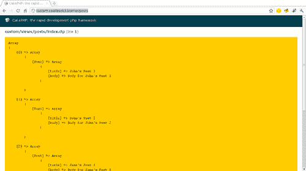
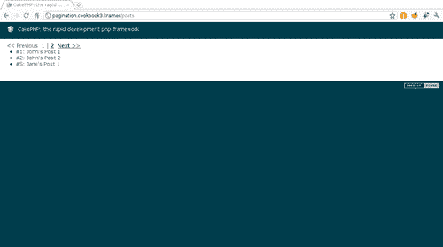

# 第三章。推动搜索

在本章中，我们将涵盖：

+   执行 GROUP 和 COUNT 查询

+   使用虚拟字段

+   使用临时 JOIN 构建查询

+   搜索所有匹配搜索词的项目

+   实现自定义查找类型

+   分页自定义查找类型

+   实现基于 AJAX 的分页

# 简介

使用模型获取数据是任何 CakePHP 应用程序最重要的方面之一。因此，合理使用框架提供的查找函数可以确保我们应用程序的成功，并且同样重要的是确保我们的代码可读性和可维护性。

CakePHP 提供了以下基本查找类型：

+   `all`：用于查找所有匹配给定查找选项的记录。

+   `count`：用于计算匹配给定选项的记录数量。

+   `first`：用于查找匹配给定查找选项的第一个记录。

+   `list`：用于查找所有匹配给定查找选项的记录，并使用提供的格式格式化。

+   `neighbors`：根据特定字段的值查找匹配记录的前一个和后一个记录。

+   `threaded`：查找一组结果，并根据名为`parent_id`的字段值返回它们作为层次结构。

掌握这些类型就像理解所有类型都处理的可用查找选项一样简单。在本章中，我们有几个食谱来充分利用这些选项，并在需要时手动执行基于 SQL 的查询。

CakePHP 还允许我们定义自己的自定义查找类型，这将扩展三个基本类型，使我们的代码更加易于阅读。本章的最后几个食谱展示了如何创建自己的查找类型，并支持分页。

# 执行 GROUP 和 COUNT 查询

这个食谱展示了如何使用 CakePHP 的内置查找类型来执行相对复杂的`GROUP`和`COUNT`查询，包括两者的组合。

## 准备工作

为了完成这个食谱，我们需要一些示例表来操作。

1.  使用以下 SQL 语句创建一个名为`users`的表：

    ```php
    CREATE TABLE `users`(
    `id` INT UNSIGNED AUTO_INCREMENT NOT NULL,
    `name` VARCHAR(255) NOT NULL,
    `email` VARCHAR(255) NOT NULL,
    PRIMARY KEY(`id`)
    );

    ```

1.  使用以下 SQL 语句创建一个名为`blogs`的表：

    ```php
    CREATE TABLE `blogs`(
    `id` INT UNSIGNED AUTO_INCREMENT NOT NULL,
    `user_id` INT UNSIGNED NOT NULL,
    `name` VARCHAR(255) NOT NULL,
    PRIMARY KEY(`id`),
    KEY `user_id`(`user_id`),
    CONSTRAINT `blogs__users` FOREIGN KEY(`user_id`) REFERENCES `users`(`id`)
    );

    ```

1.  使用以下 SQL 语句创建一个名为`posts`的表：

    ```php
    CREATE TABLE `posts`(
    `id` INT UNSIGNED AUTO_INCREMENT NOT NULL,
    `blog_id` INT UNSIGNED NOT NULL,
    `title` VARCHAR(255) NOT NULL,
    `body` TEXT NOT NULL,
    `created` DATETIME NOT NULL,
    `modified` DATETIME NOT NULL,
    PRIMARY KEY(`id`),
    KEY `blog_id`(`blog_id`),
    CONSTRAINT `posts__blogs` FOREIGN KEY(`blog_id`) REFERENCES `blogs`(`id`)
    );

    ```

1.  使用以下 SQL 语句添加一些示例数据：

    ```php
    INSERT INTO `users`(`id`, `name`, `email`) VALUES
    (1, 'John Doe', 'john.doe@example.com'),
    (2, 'Jane Doe', 'jane.doe@example.com');
    INSERT INTO `blogs`(`user_id`, `name`) VALUES
    (1, 'John Doe\'s Blog'),
    (2, 'Jane Doe\'s Blog');
    INSERT INTO `posts`(`blog_id`, `title`, `body`, `created`, `modified`) VALUES
    (1, 'John\'s Post 1', 'Body for John\'s Post 1', '2010-04-19 14:00:00', '2010-04-19 14:00:00'),
    (1, 'John\'s Post 2', 'Body for John\'s Post 2', '2010-04-19 14:30:00', '2010-04-19 14:30:00'),
    (1, 'John\'s Post 3', 'Body for John\'s Post 3', '2010-04-20 14:00:00', '2010-04-20 14:00:00'),
    (1, 'John\'s Post 4', 'Body for John\'s Post 4', '2010-05-03 14:00:00', '2010-05-03 14:00:00'),
    (2, 'Jane\'s Post 1', 'Body for Jane\'s Post 1', '2010-04-19 15:00:00', '2010-04-19 15:00:00'),
    (2, 'Jane\'s Post 2', 'Body for Jane\'s Post 2', '2010-06-18 15:00:00', '2010-06-18 15:00:00'),
    (2, 'Jane\'s Post 3', 'Body for Jane\'s Post 3', '2010-10-06 15:00:00', '2010-10-06 15:00:00');

    ```

1.  我们现在继续创建所需的模型。在名为`post.php`的文件中创建模型`Post`，并将其放置在您的`app/models`文件夹中，内容如下：

    ```php
    <?php
    class Post extends AppModel {
    public $belongsTo = array('Blog');
    }
    ?>

    ```

1.  我们将所有示例代码放入控制器的`index()`方法中。创建一个名为`posts_controller.php`的文件，并将其放置在您的`app/controllers`文件夹中，内容如下：

    ```php
    <?php
    class PostsController extends AppController {
    public function index() {
    $this->set(compact('data'));
    }
    }
    ?>

    ```

1.  现在，创建一个名为`posts`的文件夹，并将其放置在您的`app/views`文件夹中。在这个新创建的文件夹内，创建一个名为`index.ctp`的文件，内容如下：

    ```php
    <?php debug($data); ?>

    ```

### 如何做...

通过指定`find`操作时的分组设置，按某个字段对行进行分组就像简单一样。例如，以下语句虽然本身并不实用，但展示了如何使用设置：

```php
$data = $this->Post->find('all', array(
'group' => array('Blog.id')
));

```

如果我们还想获取每个分组集的行数，在我们的例子中意味着每个博客的帖子数，我们会这样做：

```php
$data = $this->Post->find('all', array(
'fields' => array('COUNT(Post.id) AS total', 'Blog.*'),
'group' => array('Blog.id')
));

```

前面的查询将返回以下数据结构：

```php
array(
array(
0 => array(
'total' => 4
),
'Blog' => array(
'id' => 1,
'user_id' => 1,
'name' => 'John Doe\'s Blog'
)
),
array(
0 => array(
'total' => 3
),
'Blog' => array(
'id' => 2,
'user_id' => 2,
'name' => 'Jane Doe\'s Blog'
)
)
)

```

现在我们确保每次我们有一个计算字段（这些字段在每个结果行的索引`0`中），它们都成为结果模型的一部分，以便更容易阅读。为此，我们覆盖`afterFind()`方法。如果您还没有，请确保在您的`app/`文件夹中创建一个名为`app_model.php`的文件。确保您的`AppModel`类包含以下内容：

```php
<?php
class AppModel extends Model {
public function afterFind($results, $primary = false) {
if (!empty($results)) {
foreach($results as $i => $row) {
if (!empty($row[0])) {
foreach($row[0] as $field => $value) {
if (!empty($row[$this->alias][$field])) {
$field = 'total_' . $field;
}
$results[$i][$this->alias][$field] = $value;
}
unset($results[$i][0]);
}
}
}
return parent::afterFind($results, $primary);
}
}
?>

```

### 注意

每次覆盖模型方法，如`beforeFind()`或`afterFind()`，请确保通过使用`parent`关键字调用父实现。

因此，之前使用`GROUP`和`COUNT`的查询现在将看起来像一个非常可读的结果集：

```php
array(
array(
'Blog' => array(
'id' => 1,
'user_id' => 1,
'name' => 'John Doe\'s Blog'
),
'Post' => array(
'total' => 4
)
),
array(
'Blog' => array(
'id' => 2,
'user_id' => 2,
'name' => 'Jane Doe\'s Blog'
),
'Post' => array(
'total' => 3
)
)
)

```

如果我们想要根据创建月份细分每个博客的帖子数，我们必须添加另一个分组级别：

```php
$data = $this->Post->find('all', array(
'fields' => array(
'CONCAT(YEAR(Post.created), \'-\', MONTH(Post.created)) AS period',
'COUNT(Post.id) AS total',
'Blog.*'
),
'group' => array('Blog.id', 'period')
));

```

考虑到我们的`afterFind`实现，前面的查询将产生以下结果：

```php
array(
array(
'Blog' => array(
'id' => 1,
'user_id' => 1,
'name' => 'John Doe\'s Blog'
),
'Post' => array(
'period' => '2010-4',
'total' => 4
)
),
array(
'Blog' => array(
'id' => 1,
'user_id' => 1,
'name' => 'John Doe\'s Blog'
),
'Post' => array(
'period' => '2010-5',
'total' => 1
)
),
array(
'Blog' => array(
'id' => 2,
'user_id' => 2,
'name' => 'Jane Doe\'s Blog'
),
'Post' => array(
'period' => '2010-10',
'total' => 1
)
),
array(
'Blog' => array(
'id' => 2,
'user_id' => 2,
'name' => 'Jane Doe\'s Blog'
),
'Post' => array(
'period' => '2010-4',
'total' => 1
)
)
array(
'Blog' => array(
'id' => 2,
'user_id' => 2,
'name' => 'Jane Doe\'s Blog'
),
'Post' => array(
'period' => '2010-6',
'total' => 1
)
)
)

```

### 它是如何工作的...

我们使用`group`查找设置来指定将用于对结果行进行分组的字段。该设置以数组的形式给出，其中每个元素是要分组的字段。当我们指定多个字段时，例如菜谱中的最后一个示例，行分组将按照分组字段的给定顺序进行。

计算字段，即产生值的表达式（如菜谱中使用的`COUNT(*) AS total`表达式），放置在每个结果行的索引`0`中，因为它们不是在模型中定义的真实字段。正因为如此，我们覆盖了`afterFind()`方法，在获取查找操作的结果后执行，并使用一些基本逻辑确保这些计算字段被包含在结果行中，以一个更可读的索引：模型名称。

菜谱中的最后一个示例不仅展示了如何在多个字段上进行分组，而且还展示了如何正确使用一些 SQL 方法（如`MONTH`和`YEAR`）以及别名，这样我们就可以轻松返回该表达式的值，并使用它来分组或可选地排序行。

### 参见

+   *使用虚拟字段*

# *使用虚拟字段*

在菜谱中，*执行 GROUP 和 COUNT 查询*，我们学习了如何将计算 SQL 表达式添加到`find`操作中。其中一些表达式可能需要定期用于模型，从而引入了虚拟字段的需求。

使用虚拟字段，我们可以得到 SQL 表达式的结果值，就像它们是我们模型的真实字段一样。这使我们能够以前更透明的方式得到之前菜谱中显示的相同结果，而不需要覆盖`afterFind`。

## 准备工作

我们需要一些示例模型和数据来工作。遵循菜谱中的*准备工作*部分，*执行 GROUP 和 COUNT 查询*。

## 如何做...

打开`Post`模型并添加以下所示的`virtualfields`定义：

```php
<?php
class Post extends AppModel {
public $belongsTo = array('Blog');
public $virtualFields = array(
'period' => 'CONCAT(YEAR(Post.created), \'-\', MONTH(Post.created))',
'total' => 'COUNT(*)'
);
}
?>

```

要获取按创建周期分组的每篇博客的所有帖子计数，我们执行以下操作：

```php
$data = $this->Post->find('all', array(
'fields' => array(
'period',
'total',
'Blog.*'
),
'group' => array('Blog.id', 'period')
));

```

使用我们的示例数据，前面的查询将产生以下数组结构，这与在*执行 GROUP 和 COUNT 查询*的最后一个示例中获得的完全相同的结果：

```php
array(
array(
'Blog' => array(
'id' => 1,
'user_id' => 1,
'name' => 'John Doe\'s Blog'
),
'Post' => array(
'period' => '2010-4',
'total' => 4
)
),
array(
'Blog' => array(
'id' => 1,
'user_id' => 1,
'name' => 'John Doe\'s Blog'
),
'Post' => array(
'period' => '2010-5',
'total' => 1
)
),
array(
'Blog' => array(
'id' => 2,
'user_id' => 2,
'name' => 'Jane Doe\'s Blog'
),
'Post' => array(
'period' => '2010-10',
'total' => 1
)
),
array(
'Blog' => array(
'id' => 2,
'user_id' => 2,
'name' => 'Jane Doe\'s Blog'
),
'Post' => array(
'period' => '2010-4',
'total' => 1
)
)
array(
'Blog' => array(
'id' => 2,
'user_id' => 2,
'name' => 'Jane Doe\'s Blog'
),
'Post' => array(
'period' => '2010-6',
'total' => 1
)
)
)

```

在对模型执行`find`操作时，总是获取虚拟字段。唯一真正避免包含它们的方法是指定要获取的字段列表，并省略虚拟字段：

```php
$data = $this->Post->find('all', array(
'fields' => array_keys($this->Post->schema())
));

```

### 注意

`schema()`模型函数返回模型中的实际字段列表，包括每个字段的信息，例如数据类型和长度。

我们现在将添加一种方法，使我们能够管理哪些虚拟字段（如果有的话）被返回。为此，我们重写`beforeFind()`和`afterFind()`模型方法。如果您还没有，请确保在您的`app/`文件夹中创建一个名为`app_model.php`的文件。确保您的`AppModel`类包含以下内容：

```php
<?php
class AppModel extends Model {
public function beforeFind($query) {
if (!empty($this->virtualFields)) {
$virtualFields = isset($query['virtualFields']) ?
$query['virtualFields'] :
array_keys($this->virtualFields);
if ($virtualFields !== true) {
$this->_backVirtualFields = $this->virtualFields;
$this->virtualFields = !empty($virtualFields) ?
array_intersect_key($this->virtualFields, array_flip((array) $virtualFields)) :
array();
}
}
return parent::beforeFind($query);
}
public function afterFind($results, $primary = false) {
if (!empty($this->_backVirtualFields)) {
$this->virtualFields = $this->_backVirtualFields;
}
return parent::afterFind($results, $primary);
}
}
?>

```

如果我们想在执行`find`操作时禁用虚拟字段，我们可以通过指定`virtualFields`查找设置为`false`来轻松实现。我们也可以将其设置为想要包含的虚拟字段列表。例如，要仅包含`period`虚拟字段，我们执行以下操作：

```php
$person = $this->Post->find('all', array(
'virtualFields' => array('period')
));

```

## 它是如何工作的...

CakePHP 将虚拟字段几乎视为真实模型字段。它们并不完全像真实字段，因为我们不能在创建/编辑模型记录时为虚拟字段指定一个值。然而，在`find`操作方面，它们被像任何其他字段一样对待。

虚拟字段在针对它们所属的模型执行每个`find`操作时都会被包含。然而，有时我们不想或不需要某些虚拟字段。这在我们包含依赖于分组表达式（如`COUNT`）的虚拟字段时尤为重要，因为它们会影响返回的行数。在这些情况下，我们希望能够指定应该返回什么，甚至是否应该返回虚拟字段。

为了允许我们控制从`find`操作返回的虚拟字段，我们通过重写`beforeFind`和`afterFind`模型回调添加一个新的查找设置。在执行`find`操作之前执行的`beforeFind`回调中，我们检查是否存在`virtualFields`设置。如果定义了此设置，我们使用其值来检查是否应该返回虚拟字段。

根据这些设置值，我们更改模型`virtualFields`属性的真正值。我们备份其原始值，然后在`find`操作完成后恢复，即在`afterFind`回调中。

## 参见

+   *执行 GROUP 和 COUNT 查询*

# 使用临时的 JOIN 构建查询

CakePHP 有一个非常简单的方式来处理绑定，并且通过使用`Containable`行为，正如在第二章模型绑定中几个配方所展示的，我们在处理绑定时拥有很多灵活性。

然而，有时我们需要超出正常的查找操作，执行连接多个模型的查询，而不使用正常的绑定操作，以节省一些宝贵的查询。在这个配方中，我们将看到如何在执行模型查找时指定`JOIN`操作。

## 准备工作

我们需要一些示例模型和数据来工作。遵循配方中的*准备工作*部分，*执行 GROUP 和 COUNT 查询*。

为了说明正常绑定操作与这个配方中展示的内容之间的区别，我们需要`Containable`行为。创建一个名为`app_model.php`的文件，并将其放置在您的`app/`文件夹中，内容如下。如果您已经有了，请确保您添加了以下所示的`actsAs`属性，或者您的`actsAs`属性包括`Containable`。

```php
<?php
class AppModel extends Model {
public $actsAs = array('Containable');
}
?>

```

我们还需要`Blog`模型。创建一个名为`blog.php`的文件，并将其放置在您的`app/models`文件夹中，内容如下：

```php
<?php
class Blog extends AppModel {
public $belongsTo = array('User');
}
?>

```

## 如何做...

我们希望获取属于`Blog`的第一篇帖子及其所属的`User`信息。使用`Containable`（有关更多信息，请参阅第二章模型绑定中的配方*限制 find 操作返回的绑定*），我们执行以下操作：

```php
$post = $this->Post->find('first', array(
'contain' => array(
'Blog' => array(
'fields' => array('name'),
'User' => array('fields' => array('name'))
)
)
));

```

这个操作是由 CakePHP 使用三个 SQL 查询来执行的：

```php
SELECT `Post`.`id`, `Post`.`blog_id`, `Post`.`title`, `Post`.`body`, `Post`.`created`, `Post`.`modified`, `Blog`.`name`, `Blog`.`user_id` FROM `posts` AS `Post` LEFT JOIN `blogs` AS `Blog` ON (`Post`.`blog_id` = `Blog`.`id`) WHERE 1 = 1 LIMIT 1;
SELECT `Blog`.`name`, `Blog`.`user_id` FROM `blogs` AS `Blog` WHERE `Blog`.`id` = 1;
SELECT `User`.`name` FROM `users` AS `User` WHERE `User`.`id` = 1;

```

如果我们将相关的表合并到一个单一的操作中，我们可以节省一些这些查询。我们使用适当的连接查找设置来指定这些`JOIN`语句：

```php
$post = $this->Post->find('first', array(
'fields' => array(
'Post.id',
'Post.title',
'Blog.name',
'User.name'
),
'joins' => array(
array(
'type' => 'inner',
'alias' => 'Blog',
'table' => $this->Post->Blog->table,
'conditions' => array(
'Blog.id = Post.blog_id'
)
),
array(
'type' => 'inner',
'alias' => 'User',
'table' => $this->Post->Blog->User->table,
'conditions' => array(
'User.id = Blog.user_id'
)
)
),
'recursive' => -1
));

```

前面的语句将生成以下 SQL 查询：

```php
SELECT `Post`.`id`, `Post`.`blog_id`, `Post`.`title`, `Post`.`body`, `Post`.`created`, `Post`.`modified` FROM `posts` AS `Post` inner JOIN blogs AS `Blog` ON (`Blog`.`id` = `Post`.`blog_id`) inner JOIN users AS `User` ON (`User`.`id` = `Blog`.`user_id`) WHERE 1 = 1 LIMIT 1
And would generate the following data structure:
array(
'Post' => array(
'id' => 1,
'title' => 'John\'s Post 1'
),
'Blog' => array(
'name' => 'John Doe\'s Blog'
),
'User' => array(
'name' => 'John Doe'
)
)

```

## 它是如何工作的...

`joins`查找设置允许我们定义要添加到生成的 SQL 查询中的`JOIN`语句。在定义操作时，我们有完全的控制权，能够更改`type`（`left, right`和`inner`之一），要连接的`table`，要使用的`alias`，以及连接时使用的`conditions`。

我们使用此设置将`Post`模型与两个模型连接起来：通过其表和必需条件与`Blog`连接，以及使用其适当的表和条件与`User`连接。由于`Post`模型`belongsTo``Blog`模型，CakePHP 将自动尝试与它进行`LEFT JOIN`，除非我们告诉它不要这样做。

因此，我们将`recursive`设置为`-1`，强制 CakePHP 只使用我们定义的`JOIN`。如果移除递归语句，我们就必须为我们的`Blog JOIN`定义选择一个不同的`别名`，因为它将与 CakePHP 的内置绑定冲突。

## 参见

+   在第二章的*模型绑定*中添加*可包含*功能

# 搜索所有匹配搜索条件的项目

在大多数网络应用程序中，查找与一组搜索词匹配的记录几乎是必不可少的。即使有大量更深入、更复杂的搜索解决方案，有时我们只需要简单的搜索。

这个配方展示了如何实现基于 `LIKE` 的搜索来查找匹配某些词的记录。

## 准备工作

我们需要一些示例模型和数据来工作。遵循配方中的 *准备工作* 部分，*执行 GROUP 和 COUNT 查询*。

## 如何做到这一点...

如果我们想要找到所有包含单词 `Post 1` 或单词 `Post 2` 的帖子，无论是标题还是帖子内容，我们这样做：

```php
$posts = $this->Post->find('all', array(
'fields' => array('Post.id', 'Post.title'),
'conditions' => array('or' => array(
array('Post.title LIKE ?' => '%Post 1%'),
array('Post.body LIKE ?' => '%Post 1%'),
array('Post.title LIKE ?' => '%Post 2%'),
array('Post.body LIKE ?' => '%Post 2%'),
)),
'recursive' => -1
));

```

前面的语句将产生以下结果：

```php
array(
'Post' => array(
'id' => 1,
'title' => 'John\'s Post 1'
),
'Post' => array(
'id' => 2,
'title' => 'John\'s Post 2'
),
'Post' => array(
'id' => 5,
'title' => 'Jane\'s Post 1'
),
'Post' => array(
'id' => 6,
'title' => 'Jane\'s Post 2'
)
)

```

## 它是如何工作的...

`LIKE-based` 条件类似于任何其他模型查找条件，除了它们以特殊形式指定：它们成为条件键的一部分，并使用字符 `?` 来指示实际值将被插入的位置，该值是一个实际的 `LIKE` 表达式。因此，以下条件：

```php
array('Post.title LIKE ?' => '%term%')

```

将被评估为类似 SQL 的如下：

```php
`Post`.`title` LIKE '%term%'

```

由于 `LIKE` 表达式被指定为数组索引，需要注意的是，我们需要将每个表达式包裹在其自己的数组中，以避免覆盖先前的表达式。为了说明这一点，让我们为 `Post.title` 字段添加另一个条件。

```php
array(
'Post.title LIKE ?' => '%term%',
'Post.title LIKE ?' => '%anotherTerm%'
)

```

这将翻译成以下 SQL 表达式：

```php
`Post`.`title` LIKE '%anotherTerm%'

```

自然地，第二个索引覆盖了第一个，因为它们都是相同的。因此，我们必须将两个表达式都包裹在数组中，以避免覆盖已使用的索引：

```php
array(
array('Post.title LIKE ?' => '%term%'),
array('Post.title LIKE ?' => '%anotherTerm%')
)

```

这将翻译成以下 SQL 语句：

```php
`Post`.`title` LIKE '%term%' OR `Post`.`title` LIKE '%anotherTerm%'

```

## 参见

+   *实现自定义查找类型*

# 实现自定义查找类型

配方，*搜索所有与搜索词匹配的项目*，为我们提供了一个很好的起点来创建自定义查找类型。自定义查找类型允许我们扩展任何模型都有的基本查找类型，使我们的代码更易于阅读和扩展。

这个配方展示了如何创建一个自定义查找类型，允许 `Post` 模型对一组词进行搜索，从而扩展了前一个配方中展示的功能。

## 准备工作

我们需要一些示例模型和数据来工作。遵循配方中的 *准备工作* 部分，*执行 GROUP 和 COUNT 查询*。

## 如何做到这一点...

1.  打开 `post.php` 文件，并将 `search` 查找类型添加到 `_findMethods` 属性的查找方法列表中，同时添加 `_findSearch()` 方法的实际实现。

    ```php
    <?php
    class Post extends AppModel {
    public $belongsTo = array('Blog');
    public $_findMethods = array('search' => true);
    protected function _findSearch($state, $query, $results = array()) {
    if ($state == 'before') {
    if (!empty($query['terms'])) {
    $fields = array('title', 'body');
    $conditions = array();
    foreach ((array) $query['terms'] as $term) {
    foreach ($fields as $field) {
    $model = $this->alias;
    if (strpos($field, '.') !== false) {
    list($model, $field) = explode('.', $field);
    }
    $conditions[] = array(
    $model . '.' . $field . ' LIKE ?' => '%'.$term.'%'
    );
    }
    }
    if (empty($query['fields'])) {
    $query['fields'] = array('Post.title', 'Post.body');
    }
    $query['conditions'][] = array('or' => $conditions);
    }
    return array_diff_key($query, array('terms'=>null));
    }
    return $results;
    }
    }
    ?>

    ```

1.  我们现在可以通过指定要搜索的词列表来使用这些自定义查找类型：

    ```php
    $posts = $this->Post->find('search', array(
    'terms' => array(
    'Post 1',
    'Post 2'
    ),
    'recursive' => -1
    ));

    ```

1.  如果我们现在浏览到 `http://localhost/posts`，我们会得到四个帖子的 `id` 和 `title` 字段，如下面的截图部分所示：

1.  让我们现在也允许自定义查找类型的计数操作。因为我们想要一个通用的解决方案，所以我们将此添加到 `AppModel` 中。打开你的 `app/` 文件夹中的 `app_model.php` 文件（如果没有，则创建它），并按照以下方式重写 `find()` 方法：

    ```php
    <?php
    class AppModel extends Model {
    public function find($conditions=null, $fields=array(), $order=null, $recursive=null) {
    if (
    is_string($conditions) && $conditions=='count' &&
    is_array($fields) && !empty($fields['type']) &&
    array_key_exists($fields['type'],$this->_findMethods)
    ) {
    $fields['operation'] = 'count';
    return parent::find($fields['type'], array_diff_key(
    $fields,
    array('type'=>null)
    ));
    }
    return parent::find($conditions, $fields, $order, $recursive);
    }
    }
    ?>

    ```

1.  现在编辑你的 `app/models/post.php` 文件，并对 `_findSearch()` 方法进行以下更改：

    ```php
    protected function _findSearch($state, $query, $results = array()) {
    if ($state == 'before') {
    if (!empty($query['terms'])) {
    $fields = array('title', 'body');
    $conditions = array();
    foreach ((array) $query['terms'] as $term) {
    foreach ($fields as $field) {
    $model = $this->alias;
    if (strpos($field, '.') !== false) {
    list($model, $field) = explode('.', $field);
    }
    $conditions[] = array(
    $model . '.' . $field . ' LIKE ?' => '%'.$term.'%'
    );
    }
    }
    if (empty($query['fields'])) {
    $query['fields'] = array('Post.title', 'Post.body');
    }
    if (!empty($query['operation']) && $query['operation'] == 'count') {
    $query['fields'] = 'COUNT(*) AS total';
    }
    $query['conditions'][] = array('or' => $conditions);
    }
    return array_diff_key($query, array('terms'=>null));
    } elseif (
    $state == 'after' && !empty($query['operation']) &&
    $query['operation'] == 'count'
    ) {
    return (!empty($results[0][0]['total']) ? $results[0][0]['total'] : 0);
    }
    return $results;
    }

    ```

1.  如果我们想要获取匹配一组术语的帖子数量，我们会这样做：

    ```php
    $count = $this->Post->find('count', array(
    'type' => 'search',
    'terms' => array(
    'Post 1',
    'Post 2'
    )
    ));

    ```

    这将正确返回 4。

## 它是如何工作的...

自定义查找类型在模型的 `_findMethods` 属性中定义。我们通过将查找类型的名称添加到属性中作为其索引，并在包含查找类型的模型中将其值设置为 `true` 来添加类型。

负责处理实际查找类型的方法定名为以下语法：`_findType()`，其中 `Type` 是查找类型名称，首字母大写。对于一个名为 `popular` 的查找类型，方法将被命名为 `_findPopular()`。

每个查找类型方法接收三个参数：

+   `state`: `find` 操作当前所处的状态。这可以是 `before`（在查找操作执行之前使用），或者 `after`（在查找操作完成后执行，这是修改获取到的结果的完美位置。）`before` 状态是我们更改查询参数以满足需求的地方。

+   `query`: 查询的数据，包含典型的查找设置（例如 `fields` 或 `conditions`），以及 `find` 操作中指定的任何额外设置（在我们的案例中，`terms`）。

+   `results`: 仅在状态设置为 `after` 时适用，并包含 `find` 操作的结果。

当查找状态设置为 `before` 时，自定义查找类型实现需要返回查询，作为一个查找设置的数组。因此，在我们的实现中，我们寻找一个名为 `terms` 的自定义查找设置。如果有指定的术语，我们使用它们向一组固定的字段添加基于 `LIKE` 的条件。一旦完成，我们返回修改后的查询。

当状态设置为 `after` 时，实现需要返回结果。这是在返回之前修改结果行（如果需要）的机会。在我们的实现中，我们简单地按收到的样子返回它们。

菜单的最后部分展示了如何为我们的自定义查找类型添加计数支持。这是 CakePHP 默认不提供的功能，因此我们实现了自己的解决方案。我们通过重写 `find()` 方法并确保满足一系列条件来实现这一点：

1.  正在执行的 `find` 操作设置为 `count`

1.  查询中指定了 `type` 设置

1.  `type` 设置实际上是一个有效的自定义查找类型

当这些条件满足时，我们添加一个名为 `operation` 的新查询参数，将其设置为 `count`，然后使用自定义查找类型调用父 `find()` 实现方法。这样，我们的查找实现可以检查 `operation` 查找设置，当它设置为 `count` 时，它将强制 `fields` 查找设置在 `before` 状态下为 `COUNT(*)`，并在 `after` 状态下正确获取计数操作的结果。

## 相关内容

+   *分页自定义查找类型*

+   *搜索所有匹配搜索词的项目*

# 分页自定义查找类型

配方，*实现自定义查找类型*，展示了扩展内置模型查找类型的力量，包括支持使用实现的自定义类型来获取记录或计数。

现在我们知道了如何获取和计数自定义查找类型，我们可以轻松地分页一组结果行。这个配方展示了如何使用 CakePHP 内置的分页支持来分页一组作为自定义查找类型结果出现的行。

## 准备工作

我们需要一些示例模型和数据来工作，并且我们需要在 `AppModel` 中覆盖 `find()` 方法以允许在自定义查找类型上执行 `count` 操作。因此，请确保你遵循整个配方，*实现自定义查找类型*，包括其 *准备工作* 部分。

## 如何操作...

1.  在你的 `app/controllers` 文件夹中创建一个名为 `posts_controller.php` 的文件。如果你已经有了，请确保它的 `index()` 方法如下：

    ```php
    <?php
    class PostsController extends AppController {
    public function index() {
    $this->paginate['Post'] = array(
    'search',
    'fields' => array(
    'Post.id',
    'Post.title'
    ),
    'terms' => array(
    'Post 1',
    'Post 2'
    ),
    'limit' => 3
    );
    $posts = $this->paginate('Post');
    $this->set(compact('posts'));
    }
    }
    ?>

    ```

1.  为 `index` 动作创建视图。如果你的 `app/views` 文件夹中没有名为 `posts` 的文件夹，请创建它。接下来，在你的 `app/views` 文件夹中创建一个名为 `index.ctp` 的文件，内容如下：

    ```php
    <p>
    <?php echo $this->Paginator->prev(); ?>
    &nbsp;
    <?php echo $this->Paginator->numbers(); ?>
    &nbsp;
    <?php echo $this->Paginator->next(); ?>
    </p>
    <ul>
    <?php foreach($posts as $post) { ?>
    <li>#<?php echo $post['Post']['id']; ?>: <?php echo $post['Post']['title']; ?></li>
    <?php } ?>
    </ul>

    ```

1.  如果我们现在浏览到 `http://localhost/posts`，我们会看到一个分页的匹配帖子列表，显示两页中的前三个帖子，如下截图所示：

## 工作原理...

要分页自定义查找类型，我们需要指定查找类型的名称作为分页设置的索引 `0` 的值（或如果没有定义索引，则为第一个值）。然后我们可以将任何自定义查找设置作为分页设置的一部分传递，如下代码片段所示：

```php
$this->paginate['Post'] = array(
'search',
'terms' => array(
'Post 1',
'Post 2'
),
'limit' => 3
);

```

CakePHP 的 `paginate()` 方法首先会发出一个 `count`（在 `type` 查找设置中指定查找类型名称）来获取总行数，然后使用自定义查找类型执行 `find` 操作来获取当前页面的行。

## 相关内容

+   *实现基于 AJAX 的分页*

# 实现基于 AJAX 的分页

之前的配方，*分页自定义查找类型*，展示了如何分页自定义查找类型。每个页面链接都会更改浏览器位置，强制重新加载页面上的所有元素。

这个配方允许我们使用 AJAX（使用 `jQuery javascript 库`）只加载真正需要的内容，因此每次页面更改时，只有行集会更改，而不需要加载整个新页面。

## 准备工作

我们需要一些示例模型和数据来工作，并且需要一个自定义查找类型的完整分页功能。遵循整个配方，包括其*准备就绪*部分，即*分页自定义查找类型*。

## 如何做到这一点...

1.  我们首先将`jQuery javascript`库添加到我们的布局中。如果你还没有，请在你的`app/views/layouts`目录中创建一个名为`default.ctp`的文件。确保你添加了 jQuery 库的链接（这里我们使用的是 Google 托管版本），一个用于显示加载信息的占位符（在 AJAX 连接进行时显示），并且将视图内容包裹在一个 ID 设置为`content`的 DIV 中。

    ```php
    <head>
    <title><?php echo $title_for_layout; ?></title>
    <?php echo $this->Html->script('http://ajax.googleapis.com/ajax/libs/jquery/1.4.2/jquery.min.js'); ?>
    </head>
    <body>
    <div id="main">
    <div id="loading" style="display: none; float: right;">Loading...</div>
    <div id="content">
    <?php echo $content_for_layout; ?>
    </div>
    </div>
    </body>
    </html>

    ```

1.  打开`PostsController`并添加`RequestHandler`组件，以及`Jquery`助手引擎（控制器其余部分保持不变）：

    ```php
    <?php
    class PostsController extends AppController {
    public $components = array('RequestHandler');
    public $helpers = array('Js' => 'Jquery');
    public function index() {
    $this->paginate['Post'] = array(
    'search',
    'terms' => array(
    'Post 1',
    'Post 2'
    ),
    'limit' => 3
    );
    $posts = $this->paginate('Post');
    $this->set(compact('posts'));
    }
    }
    ?>

    ```

1.  现在，让`Paginator`助手知道我们正在使用基于 AJAX 的分页。编辑视图文件`app/views/posts/index.ctp`并添加以下高亮行：

    ```php
    <?php
    $this->Paginator->options(array(
    'evalScripts' => true,
    'update' => '#content',
    'before' => $this->Js->get('#loading')->effect('fadeIn', array('speed'=>'fast')),
    'complete' => $this->Js->get('#loading')->effect('fadeOut', array('speed'=>'fast')),
    ));
    ?>
    <p>
    <?php echo $this->Paginator->prev(); ?>
    &nbsp;
    <?php echo $this->Paginator->numbers(); ?>
    &nbsp;
    <?php echo $this->Paginator->next(); ?>
    </p>
    <ul>
    <?php foreach($posts as $post) { ?>
    <li>#<?php echo $post['Post']['id']; ?>: <?php echo $post['Post']['title']; ?></li>
    <?php } ?>
    </ul>
    <?php echo $this->Js->writeBuffer(); ?>

    ```

### 它是如何工作的...

当更新设置指定给`Paginator`助手的`options()`方法时，`Paginator`知道它正在处理基于 AJAX 的分页。更新设置指向当每个分页链接被点击时内容发生变化的 DOM 元素的 ID。在我们的例子中，这个 DOM 元素是一个 ID 设置为`content`的 DIV，它在布局中定义。

我们指定给`Paginator`助手的另一个选项是`evalScripts`，它告诉助手评估任何作为 AJAX 请求结果获得的 JavaScript 代码。这样，当通过 AJAX 获取结果页面时，JQuery 引擎自动添加的 JavaScript 代码将被执行。同样，我们需要打印出这段生成的代码，我们通过在`index.ctp`视图的末尾调用`writeBuffer()`方法来实现。

我们使用的另外两个选项是`before`和`complete`，它们直接发送到 AJAX 操作。`before`选项在 AJAX 请求之前执行，是我们显示加载 DIV 的理想位置。`complete`选项在 AJAX 操作完成后执行，用于隐藏加载 DIV。

我们也可以将 JavaScript 代码指定给`before`和`complete`选项，而不是使用 jQuery 引擎提供的助手方法。可以通过以下方式更改选项来达到相同的效果：

```php
<?php
$this->Paginator->options(array(
'evalScripts' => true,
'update' => '#content',
'before' => '$("#loading").fadeIn("fast");',
'complete' => '$("#loading").fadeOut("fast");'
));
?>

```
