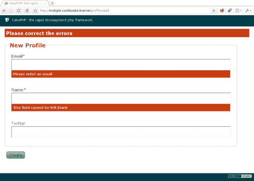
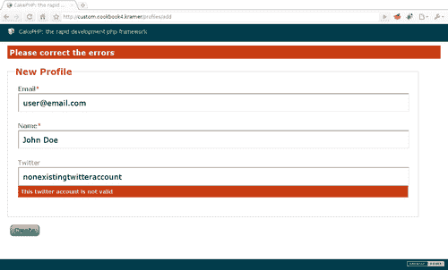
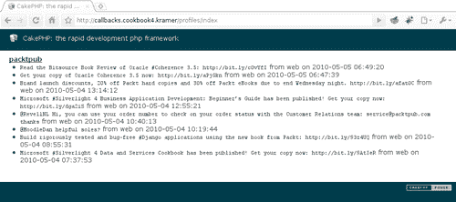
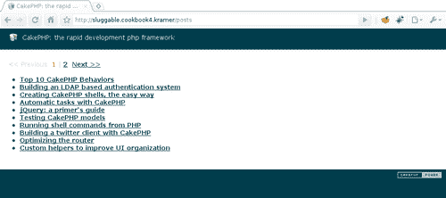
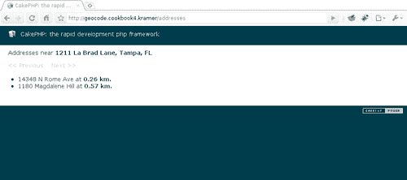

# 第四章：验证和行为

在本章中，我们将涵盖：

+   添加多个验证规则

+   创建自定义验证规则

+   在行为中使用回调

+   使用行为添加新的字段以保存

+   使用 Sluggable 行为

+   使用 Geocodable 行为进行地址地理编码

# 简介

本章讨论了 CakePHP 模型中两个对大多数应用程序至关重要的方面：验证和行为。

当我们将信息保存到数据源（如数据库）时，CakePHP 会自动确保数据被引号包围，以防止攻击，SQL 注入是最常见的一种。如果我们还需要确保数据遵循某种格式，例如，电话号码是有效的，我们使用验证规则。

有时候，我们不仅需要验证我们正在处理的数据。在某些情况下，我们需要为最终用户无法指定的字段设置值，但这些字段是我们应用程序逻辑的一部分。CakePHP 的行为允许我们通过回调在数据保存之前或之后操作数据来扩展模型提供的功能。

第三个食谱展示了如何在行为中使用模型回调（如 `beforeFind` 和 `afterFind`），而第四个食谱展示了如何在使用 `save` 操作时使用行为添加额外的字段值。

本章的最后两个食谱给出了如何使用 `Sluggable` 行为创建 SEO 友好 URL 的示例，以及如何使用 `Geocodable` 行为为 `Address` 模型添加地理编码支持的示例。

# 添加多个验证规则

这个食谱展示了如何不仅使用 CakePHP 提供的一些基本验证规则，而且还展示了如何为每个字段使用多个这些规则。

## 准备工作

为了完成这个食谱，我们需要一个样本表来工作。使用以下 SQL 语句创建一个名为 `profiles` 的表：

```php
CREATE TABLE `profiles`(
`id` INT UNSIGNED AUTO_INCREMENT NOT NULL,
`email` VARCHAR(255) NOT NULL,
`name` VARCHAR(255) default NULL,
`twitter` VARCHAR(255) default NULL,
PRIMARY KEY(`id`)
);

```

我们现在继续创建所需的模型。在 `app/models` 文件夹中创建名为 `Profile` 的模型，文件名为 `profile.php`，内容如下：

```php
<?php
class Profile extends AppModel {
public $validate = array(
'email' => array('rule' => 'notEmpty'),
'name' => array('rule' => 'notEmpty')
);
}
?>

```

在你的 `app/controllers` 文件夹中创建相应的控制器 `ProfilesController`，文件名为 `profiles_controller.php`，内容如下：

```php
<?php
class ProfilesController extends AppController {
public function add() {
if (!empty($this->data)) {
$this->Profile->create();
if ($this->Profile->save($this->data)) {
$this->Session->setFlash('Profile created');
$this->redirect('/');
} else {
$this->Session->setFlash('Please correct the errors');
}
}
}
}
?>

```

在你的 `app/views` 文件夹中创建一个名为 `profiles` 的文件夹。创建一个名为 `add.ctp` 的视图来保存表单，并将其放置在你的 `app/views/profiles` 文件夹中，内容如下：

```php
<?php
echo $this->Form->create();
echo $this->Form->inputs(array(
'email',
'name',
'twitter'
));
echo $this->Form->end('Create');
?>

```

## 如何做到这一点...

我们已经为 `email` 和 `name` 字段设置了基本的验证规则，这保证了这些字段中的任何一个都不能为空。现在我们想要添加另一个验证规则，以确保输入的电子邮件始终是有效的电子邮件地址。编辑 `Profile` 模型，并按以下方式更改定义的验证规则：

```php
class Profile extends AppModel {
public $validate = array(
'email' => array(
'valid' => array(
'rule' => 'email',
'message' => 'The email entered is not a valid email address'
),
'required' => array(
'rule' => 'notEmpty',
'message' => 'Please enter an email'
)
),
'name' => array('rule' => 'notEmpty')
);
}

```

如果我们现在浏览到`http://localhost/profiles/add`并点击**创建**按钮而不输入任何信息，我们应该看到`email`字段的定制错误消息和`name`字段的默认错误消息，如下面的截图所示：



如果我们指定了一个无效的电子邮件地址，验证消息应该更改为视图中指定的消息。

## 它是如何工作的...

模型`validate`属性中指定的每个字段都可以包含任意数量的验证规则。当我们指定多个规则时，我们将它们包裹在一个数组中，并用描述性键对其进行索引，以帮助我们识别哪个规则失败了。因此，我们选择用`required`键索引`notEmpty`规则，用`valid`键索引`email`规则。

当我们指定多个验证规则时，CakePHP 将按照我们添加到`validate`属性时的顺序评估每个规则。如果一个字段有多个验证规则失败，则最后失败的规则将用于触发错误消息。在我们的例子中，第一个规则是`valid`，第二个是`required`。因此，如果两个规则都失败了，该字段将被设置为失败`required`规则。

如果我们想要确保某个规则在所有其他规则之后执行，我们使用`last`规则设置。将其设置为`true`将确保特定规则在所有其他规则之后执行。在我们的例子中，我们可以在`email`字段的规则列表中首先定义`required`验证，并将其`last`设置设置为`true`，这将产生与在所有其他规则之后定义`required`规则相同的结果。

## 更多内容...

在这个菜谱中，我们使用了模型来指定对于每个失败的规则显示哪个错误消息。我们也可以选择在视图中这样做。

使用标识每个规则的索引，我们可以指定在验证失败时应该显示哪个错误消息。我们通过在字段定义中将`error`选项设置为错误消息数组来实现，每个错误消息都通过匹配的验证规则键（在我们的情况下，是`email`字段的`required`和`valid`之一）进行索引。

编辑`app/views/profiles/add.ctp`文件，并按以下方式更改`email`字段定义：

```php
<?php
echo $this->Form->create();
echo $this->Form->inputs(array(
'email' => array(
'error' => array(
'required' => 'Please enter an email',
'valid' => 'The email entered is not a valid email address'
)
),
'name',
'twitter'
));
echo $this->Form->end('Create');
?>

```

## 参见

+   在*国际化应用程序*章节中*国际化模型验证消息*。

# 创建自定义验证规则

CakePHP 提供了一些内置的验证规则，这些规则一起满足了大多数应用程序的需求。以下表格列出了内置的验证规则（位于 CakePHP 的`Validation`类中。）

| 规则 | 目的 |
| --- | --- |
| `_alphaNumeric` | 检查值是否只包含整数或字母。 |
| `_between` | 检查值的字符串长度是否在指定的范围内。 |
| `_blank` | 如果值是空的，或者只包含空格（空白字符、制表符、换行符等），则成功。 |
| `_boolean` | 检查值是否可以解释为布尔值。 |
| `_cc` | 验证信用卡号码。 |
| `_comparison` | 使用指定的运算符将值与给定的值进行比较。 |
| `_custom` | 使用自定义正则表达式验证值。 |
| `_date` | 使用给定的格式或正则表达式将值验证为日期。 |
| `_decimal` | 如果值是有效的十进制数，则成功。 |
| `_email` | 验证电子邮件地址。 |
| `_equalTo` | 如果值等于给定的值，则成功。 |
| `_extension` | 将值解释为文件名并检查给定的扩展名。 |
| `_inList` | 检查值是否在允许值的列表中。 |
| `_ip` | 验证 IP 地址。 |
| `_maxLength` | 检查字符串值的长度不超过一定数量的字符。 |
| `_minLength` | 与 `maxLength` 类似，但确保字符串值至少有给定数量的字符。 |
| `_money` | 检查值是否是有效的货币金额。 |
| `_multiple` | 验证多选与一组选项。 |
| `_numeric` | 如果值是数字，则成功。 |
| `_phone` | 检查电话号码。 |
| `_postal` | 验证邮政编码。 |
| `_range` | 如果值在数值范围内，则成功。 |
| `_ssn` | 检查社会保障/国家身份号码。 |
| `_time` | 将值验证为时间（24 小时格式）。 |
| `_uuid` | 验证值是否为 UUID。 |
| `_url` | 如果值是有效的 URL，则成功。 |

然而，有时我们需要自定义验证，或者我们需要更改现有验证的方式。

在这个菜谱中，我们将学习如何创建自定义验证规则来检查给定 Twitter 用户名的有效性。

## 准备就绪

我们需要一些样本模型来工作。遵循菜谱“添加多个验证规则”中的“准备就绪”部分。

## 如何做...

通过打开你的 `app/models/profile.php` 文件来编辑 `Profile` 模型，并做出以下更改：

```php
class Profile extends AppModel {
public $validate = array(
'email' => array('rule' => 'notEmpty'),
'name' => array('rule' => 'notEmpty'),
'twitter' => array(
'rule' => 'validateTwitter',
'allowEmpty' => true,
'message' => 'This twitter account is not valid'
)
);
protected static $httpSocket;
protected function validateTwitter($data) {
if (!isset(self::$httpSocket)) {
App::import('Core', 'HttpSocket');
self::$httpSocket = new HttpSocket();
}
$value = current($data);
self::$httpSocket->get('http://twitter.com/status/user_timeline/' . $value . '.json?count=1');
return (self::$httpSocket->response['status']['code'] != 404);
}
}

```

如果我们现在浏览到 `http://localhost/profiles/add` 并在输入一个不存在的 Twitter 账号后点击“创建”按钮，我们应该会看到以下截图所示的`twitter`字段的错误信息：



如果我们指定一个有效的账号，或者将其留空，则不会为`twitter`字段显示错误信息。

## 如何工作...

当我们将 `rule` 验证选项设置为模型中可用的方法名称（在我们的例子中是 `validateTwitter()`）时，CakePHP 会在字段需要验证时调用该方法。

`validateTwitter()` 方法，像任何自定义验证方法一样，其第一个参数接收一个数组。这个数组按字段名称索引，值设置为用户输入的值。在前一个截图所示的例子中，`data` 参数如下所示：

```php
array('twitter' => 'nonexistingtwitteraccount')

```

验证方法需要返回一个布尔值来指示成功：如果验证成功，则返回 `true`；如果失败，则返回 `false`。如果我们没有将 `allowEmpty` 选项设置为 `true`，那么当字段值为空时，验证方法也会被调用。

### 注意

如果自定义验证方法返回一个字符串，则字段会被标记为验证失败，并使用返回的字符串作为错误信息。

`validateTwitter()` 方法首先检查 CakePHP 的 `HttpSocket` 类的实例是否已经设置。我们使用静态实例来确保类只初始化一次，从而避免在相同过程中多次调用该方法时进行不必要的处理。

一旦我们有了 `HttpSocket` 实例，我们就获取要验证的值（如上所示，数组中设置的第一个值），并使用它来获取推特 URL 的内容。

### 注意

我们本可以使用 `[`twitter.com/$account`](http://twitter.com/$account)` URL，该 URL 返回包含用户最新推文的 HTML。然而，我们选择使用 `JSON` 请求，并将推文数量限制为 `1`，以减少服务器带宽的使用。

这个公开可用的推特 URL 用于获取推特账户的时间线，当账户未在推特上注册时，返回 HTTP 状态码 `404`。如果状态码确实是 `404`，我们认为推特账户不存在，从而验证失败。任何其他状态码都将导致验证成功。

## 更多内容...

一些自定义验证方法需要除了要验证的值之外的信息才能判断验证是否成功。幸运的是，CakePHP 不仅通过第二个参数发送用于执行验证的选项数组，还提供了一个简单的方法来向我们的验证方法添加参数。使用我们的示例，我们现在希望能够提供在检查推特账户时使用的一个不同的 URL。

要利用选项数组，通过打开 `app/models/profile.php` 文件编辑 `Profile` 模型，进行以下更改：

```php
class Profile extends AppModel {
public $validate = array(
'email' => array('rule' => 'notEmpty'),
'name' => array('rule' => 'notEmpty'),
'twitter' => array(
'rule' => 'validateTwitter',
'allowEmpty' => true,
'url' => 'http://twitter.com/%TWITTER%'
)
);
protected function validateTwitter($data, $options) {
static $httpSocket;
if (!isset($httpSocket)) {
App::import('Core', 'HttpSocket');
$httpSocket = new HttpSocket();
}
$options = array_merge(array(
'url' => 'http://twitter.com/status/user_timeline/%TWITTER%.json?count=1'
), $options);
$value = current($data);
$httpSocket->get(str_ireplace('%TWITTER%', $value, $options['url']));
return ($httpSocket->response['status']['code'] != 404);
}
}

```

如果我们想要利用额外的参数能力，而不是使用选项数组，我们只需向验证方法添加参数，并将这些参数值作为 `validate` 定义中的元素传递。为此，通过打开 `app/models/profile.php` 文件编辑 `Profile` 模型，进行以下更改：

```php
class Profile extends AppModel {
public $validate = array(
'email' => array('rule' => 'notEmpty'),
'name' => array('rule' => 'notEmpty'),
'twitter' => array(
'rule' => array(
'validateTwitter',
'http://twitter.com/%TWITTER%'
),
'allowEmpty' => true
)
);
protected static $httpSocket;
protected function validateTwitter($data, $url = 'http://twitter.com/status/user_timeline/%TWITTER%.json?count=1') {
if (!isset(self::$httpSocket)) {
App::import('Core', 'HttpSocket');
self::$httpSocket = new HttpSocket();
}
$value = current($data);
self::$httpSocket->get(str_ireplace('%TWITTER%', $value, $url));
return (self::$httpSocket->response['status']['code'] != 404);
}
}

```

## 参见

+   *添加多个验证规则*

# 在行为中使用回调

CakePHP 行为不仅是一种扩展模型功能的好方法，还可以在不同模型和应用程序之间共享该功能。使用行为，我们可以使模型代码简洁明了，提取与我们的业务逻辑不直接相关但仍然影响模型行为的代码。

在本教程中，我们将学习如何使用模型回调自动检索每个配置文件的最新推文，以及如何向行为添加自定义验证方法。

## 准备工作

我们需要一些示例模型来工作。遵循食谱*添加多个验证规则*中的*准备就绪*部分。

我们还需要一个列出所有配置文件的方法。编辑您的`app/controllers/profiles_controller.php`文件，并将以下`index()`方法添加到`ProfilesController`类中：

```php
public function index() {
$profiles = $this->Profile->find('all');
$this->set(compact('profiles'));
}

```

在名为`app/views/profiles/index.ctp`的文件中创建相应的视图，内容如下：

```php
<?php foreach($profiles as $profile) { ?>
<p>
<?php echo $this->Html->link(
$profile['Profile']['twitter'],
'http://twitter.com/' . $profile['Profile']['twitter'],
array('title' => $profile['Profile']['twitter'])
); ?>
</p>
<?php } ?>

```

## 如何操作...

1.  在名为`twitter_account.php`的文件中创建一个名为`TwitterAccountBehavior`的类，并将其放置在您的`app/models/behaviors`文件夹中，内容如下：

    ```php
    <?php
    App::import('Core', 'HttpSocket');
    class TwitterAccountBehavior extends ModelBehavior {
    protected static $httpSocket;
    public function setup($model, $config = array()) {
    parent::setup($model, $config);
    $this->settings[$model->alias] = array_merge(array(
    'field' => 'twitter'
    ), $config);
    }
    protected function timeline($twitter, $count = 10, $returnStatus = false) {
    if (!isset(self::$httpSocket)) {
    self::$httpSocket = new HttpSocket();
    }
    $content = self::$httpSocket->get('http://twitter.com/status/user_timeline/' . $twitter . '.json?count=' . $count);
    $status = self::$httpSocket->response['status']['code'];
    if (!empty($content)) {
    $content = json_decode($content);
    }
    if ($returnStatus) {
    return compact('status', 'content');
    }
    return $content;
    }
    }
    ?>

    ```

1.  现在我们已经创建了一个具有实现`setup()`方法和用于从 Twitter 账户获取推文的辅助`timeline()`方法的动作，我们可以继续添加所需的验证。

    将以下自定义验证方法添加到`TwitterAccountBehavior`类中：

    ```php
    public function validateTwitter($model, $data) {
    $field = $this->settings[$model->alias]['field'];
    if (!empty($data[$field])) {
    $value = $data[$field];
    $result = $this->timeline($value, 1, true);
    if ($result['status'] == 404) {
    $result = false;
    }
    }
    return $result;
    }

    ```

1.  让我们现在将行为附加到`Profile`模型，并为`twitter`字段添加验证。打开您的`app/models/profile.php`文件，并添加以下`actsAs`属性和`twitter`字段验证：

    ```php
    <?php
    class Profile extends AppModel {
    public $actsAs = array('TwitterAccount');
    public $validate = array(
    'email' => array('rule' => 'notEmpty'),
    'name' => array('rule' => 'notEmpty'),
    'twitter' => array(
    'rule' => 'validateTwitter',
    'allowEmpty' => true,
    'message' => 'This twitter account is not valid'
    )
    );
    }
    ?>

    ```

1.  就像在*创建自定义验证规则*的食谱中一样，输入不存在的 Twitter 账户应该显示以下截图所示的`twitter`字段的错误消息：

1.  让我们现在使用其他回调在执行查找操作后为每个配置文件获取一定数量的推文。将以下`beforeFind()`和`afterFind()`方法添加到`TwitterAccountBehavior`类中：

    ```php
    public function beforeFind($model, $query) {
    $this->settings[$model->alias]['tweets'] = !isset($query['tweets']) ? true : $query['tweets'];
    return parent::beforeFind($model, $query);
    }
    public function afterFind($model, $results, $primary) {
    $rows = parent::afterFind($model, $results, $primary);
    if (!is_null($rows)) {
    $results = $rows;
    }
    if (!empty($this->settings[$model->alias]['tweets'])) {
    $field = $this->settings[$model->alias]['field'];
    $count = is_int($this->settings[$model->alias]['tweets']) ?
    $this->settings[$model->alias]['tweets'] :
    10;
    foreach($results as $i => $result) {
    $twitter = $result[$model->alias][$field];
    $tweets = array();
    if (!empty($result[$model->alias][$field])) {
    $result = $this->timeline($twitter, $count);
    if (!empty($result) && is_array($result)) {
    foreach($result as $tweet) {
    $tweets[] = array(
    'created' => date('Y-m-d H:i:s', strtotime($tweet->created_at)),
    'source' => $tweet->source,
    'user' => $tweet->user->screen_name,
    'text' => $tweet->text
    );
    }
    }
    }
    $results[$i]['Tweet'] = $tweets;
    }
    }
    return $results;
    }

    ```

1.  编辑`app/views/profiles/index.ctp`视图，并做出以下更改：

    ```php
    <?php foreach($profiles as $profile) { ?>
    <p>
    <?php echo $this->Html->link(
    $profile['Profile']['twitter'],
    'http://twitter.com/' . $profile['Profile']['twitter'],
    array('title' => $profile['Profile']['twitter'])
    ); ?>
    <?php if (!empty($profile['Tweet'])) { ?>
    <ul>
    <?php foreach($profile['Tweet'] as $tweet) { ?>
    <li>
    <code><?php echo $tweet['text']; ?></code>
    from <?php echo $tweet['source']; ?>
    on <?php echo $tweet['created']; ?>
    </li>
    <?php } ?>
    </ul>
    <?php } ?>
    </p>
    <?php } ?>

    ```

在添加有效的 Twitter 账户后，浏览到`http://localhost/profiles`将生成一个列表，如下面的截图所示：



## 它是如何工作的...

我们从我们的`TwitterAccountBehavior`的骨架开始，实现了由 CakePHP 在行为附加到模型时自动调用的`setup()`方法，以及`timeline()`方法，这仅仅是*创建自定义验证规则*食谱中显示的`validateTwitter()`方法，经过优化以供重用。

`beforeFind`回调在 CakePHP 即将执行查找操作时触发，我们使用它来检查自定义的`tweets`查找设置的是否存在。我们使用此设置允许开发者通过将其设置为`false`来禁用推文的获取：

```php
$this->Profile->find('all', array('tweets' => false));

```

或者指定要获取的推文数量。例如，如果我们只想获取最新的推文，我们会这样做：

```php
$this->Profile->find('all', array('tweets' => 1));

```

`afterFind`回调在执行查找操作后执行，并给我们一个修改结果的机会。因此，我们检查是否被告知要获取推文，如果是，我们使用`timeline()`方法获取指定数量的推文。然后我们将每条推文的基本信息追加到每个配置文件的索引`Tweet`中。

## 还有更多...

在我们的实现中，有一件事是明确的，除非我们将 `tweets` 查找选项设置为 `false`，否则我们将在对 `Profile` 模型执行的每个 `find` 操作中获取每个资料记录的推文。添加缓存支持将大大提高我们 `find` 操作的性能，因为我们只有在缓存信息不再有效时才会获取推文。

### 注意

关于通过 CakePHP 的 Cache 类获取更多缓存信息的详细信息，请参阅 [`book.cakephp.org/view/1511/Cache`](http://book.cakephp.org/view/1511/Cache)。

我们将允许开发者指定在缓存推文时使用什么缓存配置。打开 `TwitterAccountBehavior` 类，并对其 `setup()` 方法进行以下修改：

```php
public function setup($model, $config = array()) {
parent::setup($model, $config);
$this->settings[$model->alias] = array_merge(array(
'field' => 'twitter',
'cache' => 'default'
), $config);
}

```

在编辑 `TwitterAccountBehavior` 类时，对其 `afterFind()` 方法进行以下修改：

```php
public function afterFind($model, $results, $primary) {
$rows = parent::afterFind($model, $results, $primary);
if (!is_null($rows)) {
$results = $rows;
}
if (!empty($this->settings[$model->alias]['tweets'])) {
$field = $this->settings[$model->alias]['field'];
$count = is_int($this->settings[$model->alias]['tweets']) ?
$this->settings[$model->alias]['tweets'] :
10;
$cacheConfig = $this->settings[$model->alias]['cache'];
foreach($results as $i => $result) {
$twitter = $result[$model->alias][$field];
$tweets = array();
if (!empty($cacheConfig)) {
$tweets = Cache::read('tweets_' . $twitter, $cacheConfig);
}
if (empty($tweets) && !empty($result[$model->alias][$field])) {
$result = $this->timeline($twitter, $count);
if (!empty($result) && is_array($result)) {
foreach($result as $tweet) {
$tweets[] = array(
'created' => date('Y-m-d H:i:s', strtotime($tweet->created_at)),
'source' => $tweet->source,
'user' => $tweet->user->screen_name,
'text' => $tweet->text
);
}
}
Cache::write('tweets_' . $twitter, $tweets, $cacheConfig);
}
$results[$i]['Tweet'] = $tweets;
}
}
return $results;
}

```

最后，添加以下 `beforeDelete` 和 `afterDelete` 回调实现：

```php
public function beforeDelete($model, $cascade = true) {
$field = $this->settings[$model->alias]['field'];
$this->settings[$model->alias]['delete'] = $model->field($field, array(
$model->primaryKey => $model->id
));
return parent::beforeDelete($cascade);
}
public function afterDelete($model) {
if (!empty($this->settings[$model->alias]['delete'])) {
$cacheConfig = $this->settings[$model->alias]['cache'];
$twitter = $this->settings[$model->alias]['delete'];
Cache::delete('tweets_' . $twitter, $cacheConfig);
}
return parent::afterDelete($model);
}

```

使用 `beforeDelete()` 我们存储要删除的推文。如果确实删除了资料，`afterDelete()` 方法将删除其缓存的推文。

## 参见

+   *添加多个验证规则*

+   *创建自定义验证规则*

+   *使用行为为保存添加新字段*

# 使用行为为保存添加新字段

在 *在行为中使用回调* 的配方中，我们学习了如何实现不同的模型回调来自动执行一些任务。在这个配方中，我们将继续这个过程，并学习如何自动保存可能不在 `save` 操作中提供的资料。

我们将使用本章中一直在使用的 Twitter 示例，这样当保存资料时，其 Twitter URL 和最后一条推文将在创建新记录或更新现有记录时保存。

## 准备工作

我们需要一个工作的 `TwitterAccountBehavior` 以及其控制器、模型和视图。遵循 *在行为中使用回调* 的配方（在行为中不需要启用缓存，因此可以省略 *还有更多* 部分）。

通过以下 SQL 命令向用户资料表添加两个字段，`url` 和 `last_tweet`：

```php
ALTER TABLE `profiles`
ADD COLUMN `url` VARCHAR(255) default NULL,
ADD COLUMN `last_tweet` VARCHAR(140) default NULL;

```

## 如何操作...

1.  编辑你的 `app/models/behaviors/twitter_account.php` 文件，并将以下 `beforeSave` 实现添加到 `TwitterAccountBehavior` 类中：

    ```php
    public function beforeSave($model) {
    $field = $this->settings[$model->alias]['field'];
    $twitter = null;
    if (!array_key_exists($field, $model->data[$model->alias]) && $model->exists()) {
    $twitter = $model->field($field, array(
    $model->primaryKey => $model->id
    ));
    } elseif (array_key_exists($field, $model->data[$model->alias])) {
    $twitter = $model->data[$model->alias][$field];
    }
    $data = array(
    'url' => !empty($twitter) ? 'http://twitter.com/' . $twitter : null,
    'last_tweet' => null
    );
    if (!empty($twitter)) {
    $tweets = $this->timeline($twitter, 1);
    if (!empty($tweets) && is_array($tweets)) {
    $data['last_tweet'] = $tweets[0]->text;
    }
    }
    $model->data[$model->alias] = array_merge(
    $model->data[$model->alias],
    $data
    );
    $this->_addToWhitelist($model, array_keys($data));
    return parent::beforeSave($model);
    }

    ```

1.  每当我们创建一个新的具有有效 Twitter 账户的资料时，`url` 和 `last_tweet` 字段将自动填充。如果我们正在修改资料，则 `last_tweet` 字段将更新以反映相关账户的最新推文。

## 它是如何工作的...

在对模型执行保存操作之前，`beforeSave` 回调会被触发，这给了我们机会向即将保存的字段集合中添加新字段，或者修改其他字段的值。

我们首先确定与要保存的配置文件链接的 Twitter 账户。如果即将保存的数据中没有指定 Twitter 账户，并且如果我们正在修改现有记录（我们使用`$model->exists()`进行检查），则从其`twitter`字段中获取指定的账户。如果数据中指定了账户，则使用该账户。

无论即将进行的保存操作类型（创建或更新记录）如何，我们都将`last_tweet`字段设置为特定 Twitter 账户发布的最后一条推文。然而，只有在我们创建新记录时，我们才将`url`字段设置为基于 Twitter 账户的适当 URL。

一旦我们将要保存的数据设置到`$data`数组中，我们就将该数据追加到包含所有将要保存信息的`$model->data`属性中。然后我们使用行为中定义的`_addToWhitelist()`方法，该方法在 CakePHP 的`ModelBehavior`类中定义，我们的行为是从该类扩展的，这样如果开发者选择仅将保存操作限制在特定字段集，那么我们的字段将保证被保存，不受此限制的影响。

## 参见

+   *在行为中使用回调*

# 使用 Sluggable 行为

大多数应用程序的主要关注点之一是优化其内容以适应搜索引擎，以便在大多数搜索引擎上获得尽可能高的排名。在大多数 SEO（搜索引擎优化）指南中找到的几项建议中，构建包含相关关键词的 URL 是最有效的一项。

如果我们正在构建一个基于内容的网站，这可以通过确保每个项目的永久链接包含项目标题中的大多数单词来实现。例如，如果我们有一个标题为*Top 10 CakePHP Behaviors*的文章，一个 SEO 友好的 URL 可以是：

`http://localhost/articles/view/top-10-cakephp-behaviors`。

`top-10-cakephp-behaviors`部分通常被称为*slug*，它是 URL 的一部分，使用了相关关键词。在这个食谱中，我们将学习如何使用公开可用的`Sluggable`行为自动为我们应用程序添加 slugs。

### 注意

`Sluggable`行为是我发布为开源的许多类之一，旨在帮助其他 CakePHP 开发者。请随时向我提供任何反馈。

## 准备工作

要完成这个食谱，我们需要一个样本表来操作。使用以下 SQL 语句创建一个名为`posts`的表：

```php
CREATE TABLE `posts`(
`id` INT UNSIGNED AUTO_INCREMENT NOT NULL,
`slug` VARCHAR(255) NOT NULL,
`title` VARCHAR(255) NOT NULL,
`text` TEXT NOT NULL,
PRIMARY KEY(`id`),
UNIQUE KEY `slug`(`slug`)
);

```

我们现在继续创建所需的模型。在名为`post.php`的文件中创建模型`Post`，并将其放置在您的`app/models`文件夹中，内容如下：

```php
<?php
class Post extends AppModel {
public $validate = array(
'title' => array('rule' => 'notEmpty'),
'text' => array('rule' => 'notEmpty')
);
}
?>

```

在名为`posts_controller.php`的文件中创建相应的控制器`PostsController`，并将其放置在您的`app/controllers`文件夹中，内容如下：

```php
<?php
class PostsController extends AppController {
public function add() {
if (!empty($this->data)) {
$this->Post->create();
if ($this->Post->save($this->data)) {
$this->Session->setFlash('Post created');
$this->redirect('/');
} else {
$this->Session->setFlash('Please correct the errors');
}
}
}
}
?>

```

在您的`app/views`文件夹中创建一个名为`posts`的文件夹，然后创建一个名为`add.ctp`的视图来保存表单，并将其放置在您的`app/views/posts`文件夹中，内容如下：

```php
<?php
echo $this->Form->create();
echo $this->Form->inputs(array(
'title',
'text'
));
echo $this->Form->end('Create');
?>

```

最后，我们需要下载 Syrup 插件。访问[`github.com/mariano/syrup/downloads`](http://github.com/mariano/syrup/downloads)并下载最新版本。将下载的文件解压缩到你的`app/plugins`文件夹中。现在你应该在`app/plugins`中有一个名为`syrup`的目录。

## 如何操作...

1.  我们首先将`Sluggable`行为附加到`Post`模型上。编辑你的`app/models/post.php`文件并添加`$actsAs`属性：

    ```php
    <?php
    class Post extends AppModel {
    public $actsAs = array('Syrup.Sluggable');
    public $validate = array(
    'title' => array('rule' => 'notEmpty'),
    'text' => array('rule' => 'notEmpty')
    );
    }
    ?>

    ```

1.  让我们创建一个列出帖子的操作。将以下方法添加到`PostsController`类中：

    ```php
    public function index() {
    $this->paginate['limit'] = 10;
    $posts = $this->paginate();
    $this->set(compact('posts'));
    }

    ```

1.  创建视图`views/posts/index.ctp`，内容如下：

    ```php
    <div class="paging">
    <?php echo $this->Paginator->prev(); ?>
    &nbsp;
    <?php echo $this->Paginator->numbers(); ?>
    &nbsp;
    <?php echo $this->Paginator->next(); ?>
    </div>
    <br />
    <ul>
    <?php foreach($posts as $post) { ?>
    <li><?php echo $this->Html->link($post['Post']['title'], array('action'=>'view', $post['Post']['slug'])); ?></li>
    <?php } ?>
    </ul>

    ```

    接下来，创建一个通过 slug 查看帖子的操作。将以下方法添加到`PostsController`类中：

    ```php
    public function view($slug) {
    $post = $this->Post->find('first', array(
    'conditions' => array('Post.slug' => $slug),
    'recursive' => -1
    ));
    $this->set(compact('post'));
    }

    ```

    创建视图`views/posts/view.ctp`，内容如下：

    ```php
    <h1><?php echo $post['Post']['title']; ?></h1>
    <p><?php echo $post['Post']['text']; ?></p>
    <?php echo $this->Html->link('Posts', array('action'=>'index')); ?>

    ```

    在使用`http://localhost/posts`上的表单创建了一些帖子后，帖子的列表可能看起来像以下截图：

    

1.  如果你悬停在链接上，你应该能看到 SEO 友好的链接。例如，对于标题为*使用 CakePHP 自动任务*的帖子，其 URL 将是：

    ```php
    http://localhost/posts/view/automatic-tasks-with-cakephp

    ```

1.  点击此 URL 将显示帖子的详细信息。

## 它是如何工作的...

`Sluggable`行为实现了`beforeSave`回调，以自动在指定的字段上添加生成的 slug。它确保所有生成的 slug 都是唯一的，并提供了一整套选项来修改 slug 的生成方式。在将行为附加到模型时可以指定以下选项：

| 选项 | 目的 |
| --- | --- |
| `ignore` | 不应包含在 slug 中的单词列表。可选，默认为：`and, for, is, of`和`the`。 |
| `label` | 用于创建 slug 的字段名称（字符串），或字段名称列表（数组中）。默认为一个名为`title`的单个字段。 |
| `length` | 生成的 slug 的最大长度。默认为`100`。 |
| `overwrite` | 如果设置为`true`，则在修改已经具有 slug 的记录时也会生成 slug。默认为`false` |
| `real` | 如果设置为`true`，将确保在`label`选项中定义的字段名称存在于表中。默认为`true`。 |
| `separator` | 在 slug 中分隔单词时使用的字符。默认为`-`。 |
| `slug` | 存储 slug 的字段名称。默认为`slug`。 |

# 使用 Geocodable 行为进行地址地理编码

自从 Google Maps 和其他位置服务推出以来，网络应用打开了一系列可能性，允许使用地理信息来构建服务。

这个菜谱展示了如何使用 Geocode 插件将位置信息添加到我们自己的`Address`模型中，使我们能够通过邻近性搜索地址记录。

### 备注

`Geocode`插件是我发布的另一个开源项目。更多关于它的信息可以在[`github.com/mariano/geocode`](http://github.com/mariano/geocode)找到。

## 准备工作

为了完成这个食谱，我们需要一个用于工作的示例表。使用以下 SQL 语句创建一个名为 `addresses` 的表：

```php
CREATE TABLE `addresses`(
`id` INT UNSIGNED AUTO_INCREMENT NOT NULL,
`address_1` VARCHAR(255) NOT NULL,
`city` VARCHAR(255) default NULL,
`state` VARCHAR(255) NOT NULL,
`zip` VARCHAR(10) default NULL,
`latitude` FLOAT(10,7) NOT NULL,
`longitude` FLOAT(10,7) NOT NULL,
PRIMARY KEY(`id`)
);

```

我们现在继续创建所需的模型。在 `app/models` 文件夹中创建名为 `Address` 的模型，在名为 `address.php` 的文件中放置以下内容（我们只指定了几个状态以提高可读性）：

```php
<?php
class Address extends AppModel {
public $validate = array(
'address_1' => array('rule' => 'notEmpty'),
'state' => array('rule' => 'notEmpty')
);
public static $states = array(
'CA' => 'California',
'FL' => 'Florida',
'NY' => 'New York'
);
}
?>

```

创建相应的控制器 `AddressesController`，在名为 `addresses_controller.php` 的文件中，并将其放置在 `app/controllers` 文件夹中。内容如下：

```php
<?php
class AddressesController extends AppController {
public function add() {
if (!empty($this->data)) {
$this->Address->create();
if ($this->Address->save($this->data)) {
$this->Session->setFlash('Address created');
$this->redirect('/');
} else {
$this->Session->setFlash('Please correct the errors');
}
}
$states = $this->Address->states;
$this->set(compact('states'));
}
}
?>

```

在您的 `app/views` 文件夹中创建一个名为 `addresses` 的文件夹，然后创建一个名为 `add.ctp` 的视图文件来保存表单，并将其放置在 `app/views/addresses` 文件夹中，内容如下：

```php
<?php
echo $this->Form->create();
echo $this->Form->inputs(array(
'address_1' => array('label' => 'Address'),
'city',
'state' => array('options'=>$states),
'zip'
));
echo $this->Form->end('Create');
?>

```

我们需要下载 CakePHP 的 Geocode 插件。请访问 [`github.com/mariano/geocode/downloads`](http://github.com/mariano/geocode/downloads) 并下载最新版本。将下载的文件解压缩到您的 `app/plugins` 文件夹中。现在您应该在 `app/plugins` 文件夹内有一个名为 `geocode` 的目录。

最后，我们需要注册一个 Google Maps API 密钥。为此，请访问 [`code.google.com/apis/maps/signup.html`](http://code.google.com/apis/maps/signup.html) 并遵循给出的说明。

### 注意

Geocode 插件也支持 Yahoo 地图。如果您希望使用 Yahoo 地图而不是 Google 地图，请遵循插件主页上的说明。

## 如何做到这一点...

1.  编辑您的 `app/config/bootstrap.php` 文件，并在关闭 PHP 语句之前放置以下语句，将字符串 `APIKEY` 替换为您自己的 Google Maps API 密钥：

    ```php
    Configure::write('Geocode.key', 'APIKEY');

    ```

1.  我们现在将使我们的 `Address` 模型继承插件提供的骨架模型。编辑您的 `app/models/address.php` 文件并做出以下更改：

    ```php
    <?php
    App::import('Model', 'Geocode.GeoAddress');
    class Address extends GeoAddress {
    public $validate = array(
    'address_1' => array('rule' => 'notEmpty'),
    'state' => array('rule' => 'notEmpty')
    );
    public static $states = array(
    'CA' => 'California',
    'FL' => 'Florida',
    'NY' => 'New York'
    );
    }
    ?>

    ```

1.  通过扩展 `GeoAddress`，`Geocodable` 行为会自动附加到我们的模型上。现在我们可以使用 `http://localhost/addresses/add` 上的表单来添加新的地址。添加了相当多的地址后，我们就准备好实现一个支持查找特定位置附近地址的分页列表。

1.  为了简化这个操作，我们将在控制器操作中强制指定起点，而不是让用户指定地址。考虑到这一点，向 `AddressesController` 类中添加以下操作：

    ```php
    public function index() {
    $address = '1211 La Brad Lane, Tampa, FL';
    $this->paginate = array(
    'near',
    'address' => $address
    );
    $addresses = $this->paginate();
    $this->set(compact('address', 'addresses'));
    }

    ```

1.  现在创建视图 `app/views/addresses/index.ctp`，内容如下：

    ```php
    <h1>Addresses near <strong><?php echo $address; ?></strong></h1>
    <div class="paging">
    <?php echo $this->Paginator->prev(); ?>
    &nbsp;
    <?php echo $this->Paginator->numbers(); ?>
    &nbsp;
    <?php echo $this->Paginator->next(); ?>
    </div>
    <br />
    <ul>
    <?php foreach($addresses as $currentAddress) { ?>
    <li>
    <?php echo $currentAddress['Address']['address_1']; ?>
    at
    <strong><?php echo number_format($currentAddress['Address']['distance'], 2) . ' km.'; ?></strong>
    </li>
    <?php } ?>
    </ul>

    ```

如果您插入了靠近指定地址的示例地址，输出可能类似于以下截图所示：



## 它是如何工作的...

我们首先下载了插件，并通过在 `bootstrap.php` 配置文件中设置我们自己的 Google Maps API 密钥来配置它。然后，我们使我们的 `Address` 模型继承插件提供的 `GeoAddress` 模型，这使得我们的模型使用 `Geocodable` 行为，并实现了 `near` 自定义查找类型。

由于我们的`地址`模型现在附加了`可地理编码`行为，每次我们创建新的地址记录时，插件将使用谷歌地图 API 在`纬度`和`经度`字段中保存适当的位置。

使用`near`自定义查找类型，我们可以轻松地找到靠近某个地址的地址，我们还可以看到每个地址与起点之间的距离。

## 还有更多...

地理编码插件非常灵活，甚至包括一个显示地址在可视地图中的辅助工具。要了解它提供的一切，请访问其网站[`github.com/mariano/geocode`](http://github.com/mariano/geocode)。
