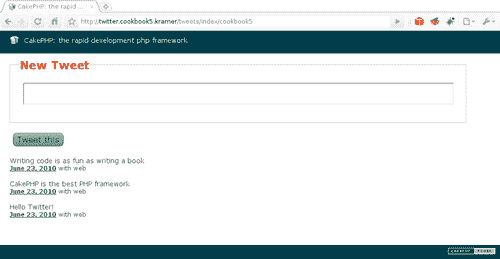

# 第五章 数据源

在本章中，我们将涵盖：

+   改进 SQL 数据源查询日志

+   使用数据源解析 CSV 文件

+   使用数据源消费 RSS 源

+   构建 Twitter 数据源

+   向 MySQL 数据源添加事务和锁定支持

# 简介

数据源是几乎所有模型操作的基础。它们在模型逻辑和底层数据层之间提供了一个抽象，允许更灵活的数据操作方法。通过这个抽象，CakePHP 应用程序能够在不知道数据存储或检索的具体细节的情况下操作数据。

本章展示了如何从现有数据源获取信息，使用预构建的数据源处理非关系数据，并教我们如何创建一个功能齐全的 Twitter 数据源。

# 改进 SQL 数据源查询日志

这个配方展示了如何创建一个组件，该组件将提供对在支持 `EXPLAIN` 命令的任何 SQL 基础数据源上执行的所有查询的扩展日志记录，并在适当的调试设置被设置时显示这些信息（这个配方是为 MySQL 设计的，但可以适应其他基于 SQL 的数据源）。

## 准备工作

为了完成这个配方，我们需要一个样本表来操作。使用以下 SQL 语句创建一个名为 `accounts` 的表：

```php
CREATE TABLE `accounts`(
`id` INT UNSIGNED AUTO_INCREMENT NOT NULL,
`email` VARCHAR(255) NOT NULL,
PRIMARY KEY(`id`)
);

```

使用以下 SQL 语句创建一个名为 `profiles` 的表：

```php
CREATE TABLE `profiles`(
`id` INT UNSIGNED AUTO_INCREMENT NOT NULL,
`account_id` INT UNSIGNED NOT NULL,
`name` VARCHAR(255) default NULL,
PRIMARY KEY(`id`),
KEY `account_id`(`account_id`),
FOREIGN KEY `profiles__accounts`(`account_id`) REFERENCES `accounts`(`id`)
);

```

使用以下 SQL 语句添加一些样本数据：

```php
INSERT INTO `accounts`(`id`, `email`) VALUES
(1, 'john.doe@example.com'),
(2, 'jane.doe@example.com');
INSERT INTO `profiles`(`id`, `account_id`, `name`) VALUES
(1, 1, 'John Doe'),
(2, 2, 'Jane Doe');

```

我们现在继续创建所需的模型。在名为 `profile.php` 的文件中创建模型 `Profile`，并将其放置在你的 `app/models` 文件夹中，内容如下：

```php
<?php
class Profile extends AppModel {
public $belongsTo = array(
'Account' => array('type' => 'INNER')
);
}
?>

```

在一个名为 `profiles_controller.php` 的文件中创建适当的控制器 `ProfilesController`，并将其放置在你的 `app/controllers` 文件夹中，内容如下：

```php
<?php
class ProfilesController extends AppController {
public function index() {
$profiles = $this->Profile->find('all');
$this->set(compact('profiles'));
}
}
?>

```

在你的 `app/views` 文件夹中创建一个名为 `profiles` 的文件夹，然后在名为 `index.ctp` 的文件中创建视图，并将其放置在你的 `app/views/profiles` 文件夹中，内容如下：

```php
<ul>
<?php foreach($profiles as $profile) { ?>
<li>#<?php echo $profile['Profile']['id']; ?>:
<?php echo $this->Html->link($profile['Profile']['name'], 'mailto:' . $profile['Account']['email']); ?></li>
<?php } ?>
</ul>

```

如果你没有布局，将 `cake/libs/view/layouts` 文件夹中的布局文件 `default.ctp` 复制到你的应用程序 `app/views/layouts` 文件夹中。如果你已经有了布局，确保它包括你想要放置 SQL 日志的标准 SQL 视图元素：

```php
<?php echo $this->element('sql_dump'); ?>

```

最后，通过编辑你的 `app/config/core.php` 文件并将 `Configure::write('debug')` 行更改为来设置你的调试级别为 `2`：

```php
Configure::write('debug', 2);

```

## 如何做到这一点...

1.  创建一个名为 `query_log.php` 的文件，并将其放置在你的 `app/controllers/components` 文件夹中，内容如下：

    ```php
    <?php
    class QueryLogComponent extends Object {
    public $minimumTime = 10;
    public $explain = 'EXPLAIN %s';
    public function initialize($controller, $settings = array()) {
    $this->_set($settings);
    if (!is_bool($this->enabled)) {
    $this->enabled = Configure::read('debug') >= 2;
    }
    }
    }
    ?>

    ```

1.  在编辑 `query_log.php` 文件的同时，向 `QueryLogComponent` 添加以下方法：

    ```php
    class:public function beforeRender($controller)
    {
    if ($this->enabled)
    {
    $queryLog = array();
    $datasources = ConnectionManager::sourceList();
    foreach($datasources as $name)
    {
    $datasource = ConnectionManager::getDataSource($name);
    if ($datasource->isInterfaceSupported('getLog'))
    {
    $log = $datasource->getLog();
    foreach($log['log'] as $i => $line)
    {
    if (empty($line['error']) && $line['took'] >= $this->minimumTime && stripos(trim($line['query']), 'SELECT') === 0)
    {
    $explain = $datasource->query(sprint ($this->explain, $line['query']
    ));
    if (!empty($explain))
    {
    foreach($explain as $j => $explainLine)
    {
    $explain[$j] = array_combine (array_map('strtolower', array_keys($explainLine[0])), $explainLine[0]);
    }
    $log['log'][$i]['explain'] = $explain;
    }
    }
    }
    if (!empty($log['log']))
    {
    $queryLog[$name] = $log;
    }
    }
    }
    if (!empty($queryLog))
    {
    $controller->set(compact('queryLog'));
    }
    }
    }

    ```

1.  将 `QueryLog` 组件添加到所有你的控制器中。创建一个名为 `app_controller.php` 的文件，并将其放置在你的 `app/` 文件夹中，内容如下：

    ```php
    <?php
    class AppController extends Controller
    {
    public $components = array( 'QueryLog' => array( 'minimumTime' => 0 )
    );
    }
    ?>

    ```

    如果你已经有了一个 `app_controller.php` 文件，确保你的 `components` 属性包括之前显示的 `QueryLog` 组件。

1.  创建一个名为 `query_log.ctp` 的文件，并将其放置在您的 `app/views/elements` 文件夹中，内容如下：

    ```php
    <?php
    if (empty($queryLog))
    {
    echo $this->element('sql_dump');
    return;
    }
    foreach($queryLog as $datasource => $log)
    {
    ?>
    <table class="cake-sql-log">
    <caption>
    Datasource <strong><?php echo $datasource; ?></strong>:
    <?php echo number_format($log['count']) . ' queries (' . $log['time'] . ' ms. total time)'; ?>
    </caption>
    <thead><tr>
    <th>Query</th>
    <th>Error</th>
    <th>Affected</th>
    <th>Num. rows</th>
    <th>Took</th>
    </tr></thead>
    <tbody>
    <?php foreach($log['log'] as $line) { ?>
    <tr>
    <td>
    <?php echo $line['query']; ?>
    <?php if (!empty($line['explain'])) { ?>
    <br /><br />
    <table class="cake-sql-log-explain">
    <thead><tr>
    <th>ID</th>
    <th>Select Type</th>
    <th>Table</th>
    <th>Type</th>
    <th>Possible Keys</th>
    <th>Key</th>
    <th>Ref</th>
    <th>Rows</th>
    <th>Extra</th>
    </tr></thead>
    <tbody>
    <?php foreach($line['explain'] as $explainLine) { ?>
    <tr>
    <td><?php echo $explainLine['id']; ?></td>
    <td><?php echo $explainLine['select_type']; ?></td>
    <td><?php echo $explainLine['table']; ?></td>
    <td><?php echo $explainLine['type']; ?></td>
    <td><?php echo $explainLine['possible_keys']; ?></td>
    <td><?php
    echo $explainLine['key'];
    if (!empty($explainLine['key_len'])) {
    echo ' (' . number_format($explainLine['key_len']) . ' )';
    }
    ?></td>
    <td><?php echo $explainLine['ref']; ?></td>
    <td><?php echo number_format($explainLine['rows']); ?></td>
    <td><?php echo $explainLine['extra']; ?></td>
    </tr>
    <?php } ?>
    </tbody>
    </table>
    <?php } ?>
    </td>
    <td><?php echo $line['error']; ?></td>
    <td><?php echo number_format($line['affected']); ?></td>
    <td><?php echo number_format($line['numRows']); ?></td>
    <td><?php echo number_format($line['took']) . ' ms.'; ?></td>
    </tr>
    <?php } ?>
    </tbody>
    </table>
    <?php } ?>

    ```

1.  最后，编辑您的 `app/views/layouts/default.ctp` 文件，并将读取 `<?php echo $this->element('sql_dump'); ?>` 的行替换为以下内容：

    ```php
    <?php echo $this->element('query_log'); ?>

    ```

如果我们现在浏览到 `http://localhost/profiles`，我们应该看到改进后的查询日志，其中包含 `SELECT` 查询的解释，如下面的截图所示：


## 它是如何工作的...

SQL 命令 `EXPLAIN` 用于获取 `SELECT` 查询的执行计划。当使用 `EXPLAIN` 时，MySQL 会包括有关查询中连接了哪些表、它们以何种顺序连接以及使用了哪些键（如果有的话）以优化查询的信息。这些信息可用于优化查询并显著减少它们的执行时间。

`QueryLog` 组件检查 `debug` 设置以确定是否应该处理查询日志，并使用 `minimumTime` 设置为那些耗时一定毫秒数或更多的查询添加更多信息。在我们的示例中，当我们将组件添加到 `AppController` 时，我们将此值设置为 `0`，以确保所有 `SELECT` 查询都得到适当的解释。

组件使用 `beforeRender` 回调在视图即将渲染之前执行其处理。它首先使用 `ConnectionManager::sourceList()` 方法获取所有可用的数据源列表（即 `app/config/database.php` 文件中定义的所有连接的名称）。对于这些连接名称中的每一个，它使用 `ConnectionManager::getDataSource()` 方法获取实际的源对象。正如我们将在本章的其他菜谱中看到的那样，源可能不会实现所有方法，因此组件随后使用所有数据源中都有的 `isInterfaceSupported()` 方法，以查看该特定源是否实现了 `getLog()` 方法。

使用 `getLog()` 方法，组件获取特定源上发出的查询列表，并过滤出只包含在 `minimumTime` 设置中指定最小时间的 `SELECT` 查询。一旦它获得了需要解释的 `SELECT` 查询列表，它就会发出一个 `EXPLAIN` SQL 语句，并将结果处理成更易读的格式，确保所有获取的字段都是小写。

最后，现在查询日志已经正确处理，它设置了适当的视图变量，该变量由 `query_log.ctp` 元素用于显示日志。

# 使用数据源解析 CSV 文件

本菜谱展示了如何使用数据源解析 **逗号分隔值** （**CSV**）文件，展示了 CSV 处理的清晰方法。

## 准备工作

我们首先安装 CakePHP 的数据源插件。从 [`github.com/mariano/datasources/downloads`](http://github.com/mariano/datasources/downloads) 下载最新版本，并将其解压缩到您的 `app/plugins` 文件夹中。现在您应该在 `app/plugins` 内部有一个名为 `datasources` 的目录。

数据源插件位于 [`github.com/cakephp/datasources`](http://github.com/cakephp/datasources)，是官方 CakePHP 插件，提供了一些社区提供的源，如 XML-RPC 和 SOAP。此食谱和其他食谱使用插件的定制版本，为本书的目的进行了修改。

我们需要一些样本数据来工作。创建一个名为 `contacts.csv` 的文件，并将其放置在您选择的文件夹中（例如 `/home/mariano`），内容类似于以下所示。此示例仅包含两行数据，但此食谱中使用的文件包含更多行，并且应包括起始标题行：

```php
name,email,country,gender,age
"John Doe","john.doe@email.com","United States of America","Male",34
"Jane Doe","jane.doe@email.com","United Kingdom","Female",25

```

## 如何做...

1.  我们首先创建一个连接以使用 CSV 数据源。打开您的 `app/config/database.php` 文件，并添加以下连接：

    ```php
    public $csv = array(
    'datasource' => 'datasources.CsvSource',
    'path' => '/home/mariano/',
    'readonly' => true
    );

    ```

1.  在名为 `contact.php` 的文件中创建一个名为 `Contact` 的模型，并将其放置在您的 `app/models` 文件夹中，内容如下：

    ```php
    <?php
    class Contact extends AppModel
    {
    public $useDbConfig = 'csv';
    }
    ?>

    ```

1.  在名为 `contacts_controller.php` 的文件中创建其控制器，并将其放置在您的 `app/controllers` 文件夹中，内容如下：

    ```php
    <?php
    class ContactsController extends AppController
    {
    public function index()
    {
    $this->set('contacts', $this->paginate());
    }
    }
    ?>

    ```

1.  最后，我们需要创建视图。在您的 `app/views` 文件夹中创建一个名为 `contacts` 的文件夹，并在该文件夹中创建一个名为 `index.ctp` 的文件，内容如下：

    ```php
    <p>
    <?php echo $this->Paginator->prev(); ?>&nbsp;
    <?php echo $this->Paginator->numbers(); ?>&nbsp;
    <?php echo $this->Paginator->next(); ?>
    </p>
    <table>
    <thead><tr>
    <th>ID</th>
    <th>Name</th>
    <th>Email</th>
    <th>Country</th>
    <th>Gender</th>
    <th>Age</th>
    </tr></thead>
    <tbody>
    <?php foreach($contacts as $contact) { ?>
    <tr>
    <td><?php echo $contact['id']; ?></td>
    <td><?php echo $contact['name']; ?></td>
    <td><?php echo $contact['email']; ?></td>
    <td><?php echo $contact['country']; ?></td>
    <td><?php echo $contact['gender']; ?></td>
    <td><?php echo $contact['age']; ?></td>
    </tr>
    <?php } ?>
    </tbody>
    </table>

    ```

    如果我们现在浏览到 `http://localhost/contacts`，我们应该看到一个分页列表，如下面的截图所示：

    

## 它是如何工作的...

我们首先创建一个新的连接名为 `csv`，指定其类型为 `datasources.CsvSource`，即名为 `CsvSource` 的数据源，它是 `datasources` 插件的一部分。我们使用 `path` 设置将 CSV 文件的路径设置为 CakePHP 的临时目录，并指定我们不想创建该路径，通过将 `readonly` 设置为 true。

### 注意

在这个食谱中我们使用的分支为原始插件添加了一个功能：允许通过模型的 `table` 属性更改所使用的 CSV 文件。

然后，我们创建 `Contact` 模型，指定其底层连接为 `csv`，通过 `useDbConfig` 属性。CSV 数据源将使用相应的表名作为文件名，并将其附加 `csv` 扩展名。在这种情况下，CSV 数据源将使用 `Contact` 模型的 `contacts`，这可以通过模型属性 `table` 进行更改。

使用该文件名，它将在连接设置中定义的路径中查找。如果文件无法加载，或者路径不存在，它将抛出一个缺少表错误，就像任何缺少表的模型一样。

### 注意

默认的`csv`扩展可以通过在连接中指定`extension`设置来更改。

一旦文件被正确加载，数据源允许我们通过发出简单的`find()`调用来获取记录。它支持一些最常见的查找设置：`limit, page, fields`，并且包括对定义设置`conditions`以限制获取的记录的基本支持（见下文*更多内容*部分）。

该食谱的其余部分展示了我们如何像使用任何模型一样使用我们的`Contact`模型，通过解析 CSV 记录的分页列表来展示这种灵活性。

## 更多内容...

除了能够定义获取哪一页（通过`page`查找设置）以及获取多少条记录（使用`limit`查找设置）之外，CSV 数据源还允许通过方便的`Set::matches()`方法进行一些基本的过滤。例如，我们可以修改我们的分页列表以获取年龄超过 30 岁的联系人，通过向我们的`index()`方法添加以下`conditions`设置：

```php
public function index()
{
$this->paginate = array(
'conditions' => array('age >' => 30)
);
$this->set('contacts', $this->paginate());
}

```

### CSV 文件的动态加载

本食谱中使用的示例通过为`Contact`模型命名的默认表绑定到`contacts.csv`文件，但如果我们需要处理多个 CSV 文件并且不想为每个文件创建一个模型，需要什么？

使用`table`模型属性，我们可以动态更改模型导入的底层 CSV 文件，并执行我们的`find`操作，就像我们为该文件创建了一个特定的模型一样。我们首先创建一个使用`csv`连接的模型，但该模型没有绑定到任何文件：

```php
<?php
class Csv extends AppModel
{
public $useDbConfig = 'csv';
public $useTable = false;
}
?>

```

将`useTable`设置为`false`允许我们避免任何文件加载。然后我们可以使用`listSources()`数据源方法获取所有可导入的 CSV 文件列表，然后动态更改每个文件的`table`模型属性，并获取实际的记录。我们在以下`controller`方法中这样做：

```php
public function import()
{
$this->loadModel('Csv');
$sources = array_flip($this->Csv->getDataSource()->listSources());
foreach($sources as $source => $null)
{
$this->Csv->table = $source;
$sources[$source] = $this->Csv->find('all');
}
debug($sources);
exit;
}

```

通过`listSources()`方法获取的文件列表是从数据源配置中指定的`path`设置获取的，如`app/config/database.php`中定义的。此路径可以通过首先清理当前连接来更改，这会释放先前配置的路径的句柄，使用数据源的`setConfig()`方法更改`path`设置，然后调用它的`connect()`方法来加载路径：

```php
$dataSource = $this->Csv->getDataSource();
$dataSource->close();
$dataSource->setConfig(array('path' => '/home/john/'));
$dataSource->connect();

```

# 使用数据源消费 RSS 源

该食谱展示了如何使用数据源从远程 RSS 源获取内容。

## 准备工作

我们首先安装 CakePHP 数据源插件的分支。从 [`github.com/mariano/datasources/downloads`](http://github.com/mariano/datasources/downloads) 下载最新版本，并将下载的文件解压缩到您的 `app/plugins` 文件夹中。现在您应该有一个名为 `datasources` 的目录。本食谱中使用的分支使用由 Loadsys 咨询公司成员 Donatas Kairys 开发的 RSS 数据源的重构版本。此修改版本提高了数据源的性能，并添加了通过查找设置更改馈送 URL 的可能性。有关原始数据源的信息，可以在 [`blog.loadsys.com/2009/06/19/cakephp-rss-feed-datasource`](http://blog.loadsys.com/2009/06/19/cakephp-rss-feed-datasource) 获取。

## 如何做...

1.  我们首先创建一个连接来使用 RSS 数据源。打开您的 `app/config/database.php` 文件，并添加以下连接：

    ```php
    public $feed = array(
    'datasource' => 'datasources.RssSource',
    'url' => 'http://marianoiglesias.com.ar/category/cakephp/feed/'
    );

    ```

1.  在名为 `post.php` 的文件中创建一个名为 `Post` 的模型，并将其放置在您的 `app/models` 文件夹中，内容如下：

    ```php
    <?php
    class Post extends AppModel {
    public $useDbConfig = 'feed';
    }
    ?>

    ```

1.  在名为 `posts_controller.php` 的文件中创建其控制器，并将其放置在您的 `app/controllers` 文件夹中，内容如下：

    ```php
    <?php
    class PostsController extends AppController
    {
    public $helpers = array('Time');
    public function index()
    {
    $this->paginate = array(
    'order' => array('pubDate' => 'desc'),
    'limit' => 9
    );
    $this->set('posts', $this->paginate());
    }
    }
    ?>

    ```

1.  最后，我们需要创建视图。在您的 `app/views` 文件夹中创建一个名为 `posts` 的文件夹，并在该文件夹中创建一个名为 `index.ctp` 的文件，内容如下：

    ```php
    <p>
    <?php echo $this->Paginator->prev(); ?>&nbsp;
    <?php echo $this->Paginator->numbers(); ?>&nbsp;
    <?php echo $this->Paginator->next(); ?>
    </p>
    <table>
    <thead><tr><th>Title</th><th>Published</th></tr></thead>
    <tbody>
    <?php foreach($posts as $post) { ?>
    <tr>
    <td><?php echo $this->Html->link($post['Post']['title'], $post['Post']['link']); ?></td>
    <td><?php echo $this->Time->nice($post['Post']['pubDate']); ?></td>
    </tr>
    <?php } ?>
    </tbody>
    </table>

    ```

如果我们现在浏览到 `http://localhost/posts`，我们应该看到如以下截图所示的帖子分页列表：


## 工作原理...

我们首先创建一个名为 `feed` 的新连接，指定其类型为 `datasources.FeedSource`。我们使用设置 `url` 来指定馈送源的地址。在其他可用的连接设置中，我们有：

+   `encoding`: 设置要使用的字符编码。默认为 CakePHP 的 `App.encoding` 配置设置。

+   `cache`: 如果设置为 `false`，则不会进行缓存。否则，这是要使用的缓存配置名称。默认为名为 `default` 的配置。

然后，我们创建 `Post` 模型，通过 `useDbConfig` 属性指定其底层连接为 `feed`。然后我们继续设置按发布日期（pubDate 字段）降序排列的帖子分页列表，每页限制九个帖子。

正如食谱中所示的 CSV 数据源，*使用数据源解析 CSV 文件*，RSS 数据源允许一些基本的过滤。例如，要仅显示在 2009 年或之后创建的帖子，我们将在 `index()` 方法中添加以下 `conditions` 设置：

```php
public function index()
{
$this->paginate = array(
'conditions' => array('pubDate >=' => '2009-01-01'),
'order' => array('pubDate' => 'desc'),
'limit' => 9
);
$this->set('posts', $this->paginate());
}

```

## 更多内容...

有时候我们可能无法在配置文件中定义馈送 URL，例如，如果 URL 来自动态数据源。幸运的是，对于这些情况，我们有通过自定义查找设置定义馈送地址的选项。

在上述示例中，我们可以从连接设置中移除馈送 URL，并将其指定为名为 `url` 的查找设置：

```php
$this->paginate = array(
'url' => 'http://marianoiglesias.com.ar/category/cakephp/feed/',
'order' => array('pubDate' => 'desc'),
'limit' => 9
);
$this->set('posts', $this->paginate());

```

### 在运行时更改连接设置

我们已经看到，我们可以通过使用自定义查找设置来更改源 URL。然而，我们也可以通过修改连接设置来更改此地址。使用所有数据源中都可用的`setConfig()`方法，我们可以更改任何连接设置。例如，我们不是使用`url`自定义查找设置，而是通过更改连接来更改源 URL：

```php
$this->Post->getDataSource()->setConfig(array(
'url' => 'http://marianoiglesias.com.ar/category/cakephp/feed/'
));
$this->paginate = array(
'order' => array('pubDate' => 'desc'),
'limit' => 9
);
$this->set('posts', $this->paginate());

```

# 构建 Twitter 数据源

在这个菜谱中，我们将学习如何通过提供从 Twitter 账户读取和发送消息的方式来实现我们自己的数据源。

## 准备工作

我们将集成此数据源与 OAuth，这是 Twitter 支持的一种身份验证机制。为此，我们将使用 Neil Crookes 开发的一个名为`HttpSocketOauth`的类，它是 CakePHP 自己的`HttpSocket`类的一个扩展，以干净优雅的方式添加了 OAuth 支持。从 URL [`github.com/neilcrookes/http_socket_oauth/raw/master/http_socket_oauth.php`](http://github.com/neilcrookes/http_socket_oauth/raw/master/http_socket_oauth.php) 下载名为 `http_socket_oauth.php` 的文件，并将其放置在您的 `app/vendors` 文件夹中。

与像 Twitter 这样的`OAuth`提供者通信还有其他方法，最明显的是使用位于[`code.google.com/p/oauth-php`](http://code.google.com/p/oauth-php)的**PHP OAuth 库**。此菜谱使用 Neil 的方法，因为它简单。

让我们继续创建 `Tweet` 模型。创建一个名为 `tweet.php` 的文件，并将其放置在您的 `app/models` 文件夹中，以下是其内容：

```php
<?php
class Tweet extends AppModel {
public $useDbConfig = 'twitter';
}
?>

```

在名为 `tweets_controller.php` 的文件中创建其控制器，并将其放置在您的 `app/controllers` 目录中，以下是其内容：

```php
<?php
class TweetsController extends AppController {
public function index($twitter) {
$tweets = $this->Tweet->find('all', array(
'conditions' => array('username' => $twitter)
));
$this->set(compact('tweets', 'twitter'));
}
public function add($twitter) {
if (!empty($this->data)) {
$this->Tweet->create();
if ($this->Tweet->save($this->data)) {
$this->Session->setFlash('Succeeded');
} else {
$this->Session->setFlash('Failed');
}
}
$this->redirect(array('action'=>'index', $twitter));
}
}
?>

```

我们现在需要适当的视图。在您的 `app/views` 文件夹中创建一个名为 `tweets` 的文件夹，并在其中创建一个名为 `index.ctp` 的文件，以下是其内容：

```php
<?php
echo $this->Form->create(array('url' => array('action'=>'add', $twitter)));
echo $this->Form->inputs(array(
'status' => array('label'=>false)
));
echo $this->Form->end('Tweet this');
?>
<?php foreach($tweets as $tweet) { ?>
<p><?php echo $tweet['Tweet']['text']; ?></p>
<p><small>
<?php echo $this->Html->link(
date('F d, Y', strtotime($tweet['Tweet']['created_at'])),
'http://www.twitter.com/' . $tweet['User']['screen_name'] . '/status/' . $tweet['Tweet']['id']
); ?>
with <?php echo $tweet['Tweet']['source']; ?>
</small></p>
<br />
<?php } ?>

```

接下来，我们需要在 Twitter 上注册我们的应用程序。访问 URL [`twitter.com/apps/new`](http://twitter.com/apps/new) 并填写表格（以下图示了一个示例。）当被要求输入**应用程序网站**时，请确保指定一个不同于`localhost`的域名，并且在被要求输入**默认访问类型**时选择**读/写**。您还需要指定**浏览器**作为**应用程序类型**，并将`http://localhost/tweets`作为**回调 URL**，用您自己的主机替换`localhost`。这个回调实际上不会被利用，因为我们将它在运行时定义，但它强制性的，所以我们需要填写它。


当您成功提交此表单时，Twitter 将为您提供一些有关您新注册的应用程序的信息。在那个屏幕上，请确保抓取显示为**消费者密钥**和**消费者密钥**的内容，因为我们将在执行此菜谱时需要它。

通过以下内容添加一个新的连接`$twitter`到您的`app/config/database.php`，并用您上面获得的**消费者密钥**替换`KEY`，用**消费者密钥**替换`SECRET_KEY`：

```php
public $twitter = array(
'datasource' => 'twitter',
'key' => 'KEY',
'secret' => 'SECRET_KEY'
);

```

## 如何做...

我们首先完全实现数据源。创建一个名为`twitter_source.php`的文件，并将其放置在您的`app/models/datasources`文件夹中，内容如下：

```php
<?php
App::import('Vendor', 'HttpSocketOauth');
class TwitterSource extends DataSource {
public $_baseConfig = array(
'key' => null,
'secret' => null
);
protected $_schema = array(
'tweets' => array(
'id' => array(
'type' => 'integer',
'null' => true,
'key' => 'primary',
'length' => 11,
),
'text' => array(
'type' => 'string',
'null' => true,
'key' => 'primary',
'length' => 140
),
'status' => array(
'type' => 'string',
'null' => true,
'key' => 'primary',
'length' => 140
),
)
);
public function __construct($config = null, $autoConnect = true) {
parent::__construct($config, $autoConnect);
if ($autoConnect) {
$this->connect();
}
}
public function listSources() {
return array('tweets');
}
public function describe($model) {
return $this->_schema['tweets'];
}
public function connect() {
$this->connected = true;
$this->connection = new HttpSocketOauth();
return $this->connected;
}
public function close() {
if ($this->connected) {
unset($this->connection);
$this->connected = false;
}
}
}

```

现在我们已经有了基本的数据源骨架，我们需要为我们的数据源添加连接到 Twitter 的能力，使用 OAuth。向`TwitterSource`添加以下方法：

```php
class created before:public function token($callback = null) {
$response = $this->connection->request(array(
'method' => 'GET',
'uri' => array(
'host' => 'api.twitter.com',
'path' => '/oauth/request_token'
),
'auth' => array(
'method' => 'OAuth',
'oauth_callback' => $callback,
'oauth_consumer_key' => $this->config['key'],
'oauth_consumer_secret' => $this->config['secret']
)
));
if (!empty($response)) {
parse_str($response, $response);
if (empty($response['oauth_token']) && count($response) == 1 && current($response) == '') {
trigger_error(key($response), E_USER_WARNING);
} elseif (!empty($response['oauth_token'])) {
return $response['oauth_token'];
}
}
return false;
}
public function authorize($token, $verifier) {
$return = false;
$response = $this->connection->request(array(
'method' => 'GET',
'uri' => array(
'host' => 'api.twitter.com',
'path' => '/oauth/access_token'
),
'auth' => array(
'method' => 'OAuth',
'oauth_consumer_key' => $this->config['key'],
'oauth_consumer_secret' => $this->config['secret'],
'oauth_token' => $token,
'oauth_verifier' => $verifier
)
));
if (!empty($response)) {
parse_str($response, $response);
if (count($response) == 1 && current($response) == '') {
trigger_error(key($response), E_USER_WARNING);
} else {
$return = $response;
}
}
return $return;
}

```

我们的数据源现在能够通过请求 Twitter 的正确授权来连接。下一步是添加通过实现数据源`read()`方法来获取推文的支持。向`TwitterSource`添加以下方法：

```php
class:public function read($model, $queryData = array()) {
if (
empty($queryData['conditions']['username']) ||
empty($this->config['authorize'])
) {
return false;
}
$response = $this->connection->request(array(
'method' => 'GET',
'uri' => array(
'host' => 'api.twitter.com',
'path' => '1/statuses/user_timeline/' . $queryData['conditions']['username'] . '.json'
),
'auth' => array_merge(array(
'method' => 'OAuth',
'oauth_consumer_key' => $this->config['key'],
'oauth_consumer_secret' => $this->config['secret']
), $this->config['authorize'])
));
if (empty($response)) {
return false;
}
$response = json_decode($response, true);
if (!empty($response['error'])) {
trigger_error($response['error'], E_USER_ERROR);
}
$results = array();
foreach ($response as $record) {
$record = array('Tweet' => $record);
$record['User'] = $record['Tweet']['user'];
unset($record['Tweet']['user']);
$results[] = $record;
}
return $results;
}

```

如果我们无法使用数据源发布新推文，那么工作就不会完成。为了完成我们的实现，向`TwitterSource`添加以下方法：

```php
class:public function create($model, $fields = array(), $values = array()) {
if (empty($this->config['authorize'])) {
return false;
}
$response = $this->connection->request(array(
'method' => 'POST',
'uri' => array(
'host' => 'api.twitter.com',
'path' => '1/statuses/update.json'
),
'auth' => array(
'method' => 'OAuth',
'oauth_token' => $this->config['authorize']['oauth_token'],
'oauth_token_secret' => $this->config['authorize']['oauth_token_secret'],
'oauth_consumer_key' => $this->config['key'],
'oauth_consumer_secret' => $this->config['secret']
),
'body' => array_combine($fields, $values)
));
if (empty($response)) {
return false;
}
$response = json_decode($response, true);
if (!empty($response['error'])) {
trigger_error($response['error'], E_USER_ERROR);
}
if (!empty($response['id'])) {
$model->setInsertId($response['id']);
return true;
}
return false;
}

```

为了使数据源工作，我们将在所有请求 Twitter 时获取 OAuth 授权。为此，我们实现了一个方法，该方法将与数据源通信以获取授权密钥，并处理 Twitter 将发出的授权回调。编辑您的`app/controllers/tweets_controller.php`文件，并在`TweetsController`类的开头添加以下内容：

```php
public function beforeFilter() {
parent::beforeFilter();
if (!$this->_authorize()) {
$this->redirect(null, 403);
}
}
protected function _authorize() {
$authorize = $this->Session->read('authorize');
if (empty($authorize)) {
$source = $this->Tweet->getDataSource();
$url = Router::url(null, true);
if (
!empty($this->params['url']['oauth_token']) &&
!empty($this->params['url']['oauth_verifier'])
) {
$authorize = $source->authorize(
$this->params['url']['oauth_token'],
$this->params['url']['oauth_verifier']
);
$this->Session->write('authorize', $authorize);
} elseif (!empty($this->params['url']['denied'])) {
return false;
} else {
$token = $source->token($url);
$this->redirect('http://api.twitter.com/oauth/authorize?oauth_token=' . $token);
}
}
if (!empty($authorize)) {
$this->Tweet->getDataSource()->setConfig(compact('authorize'));
}
return $authorize;
}

```

假设您的 Twitter 账户名称是**cookbook5**，我们现在浏览到`http://localhost/tweets/index/cookbook5`，应该会看到一个分页的推文列表，如图所示：



使用表单发布新推文应将我们的文本提交到 Twitter，并在列表中显示我们的新推文。

## 它是如何工作的...

Twitter 数据源首先指定两个新的连接设置：

+   `key`：Twitter 应用程序消费者密钥

+   `secret`：Twitter 应用程序消费者密钥

然后通过`_schema`属性和`listSources()`和`describe()`方法实现来定义一个静态模式，以描述推文帖子是如何构建的。这样做纯粹是为了添加对基于 Twitter 的模型的支持，以便与 CakePHP 的`FormHelper`一起工作。这样做允许`FormHelper`在渲染基于 Twitter 的模型的表单时确定使用哪种类型的字段。

`connect()`和`close()`方法分别实例化和删除`HttpSocketOauth`类的一个实例，这是我们与 Twitter API 通信的处理程序。

### 注意

OAuth 是一个复杂的过程，理解它可能是一个挑战。如果您想获取有关此协议的更详细信息，可能没有比[OAuth 入门指南](http://hueniverse.com/oauth)更好的资源了。

`token()` 方法使用连接从 Twitter 请求一个令牌，这对于我们的请求成功是必需的。当获得令牌后，我们使用这个令牌将用户带到特定的 Twitter URL（重定向发生在控制器中的 `_authorize()` 方法中），然后 Twitter 使用这个令牌请求用户进行授权。

如果用户允许访问他的/她的 Twitter 账户，Twitter API 将将浏览器重定向到数据源 `token()` 方法中 `callback` 参数指定的 URL。这个回调在 `_authorize()` 中设置为当前 URL。

当用户被带回到我们的应用程序后，`_authorize()` 方法将检查 Twitter 发送的两个参数的存在：`oauth_token` 和 `oauth_verifier`。这些参数作为参数传递给数据源的 `authorize()` 方法，该方法与 Twitter API 通信以完成 OAuth 授权过程的最后阶段。这一阶段以 Twitter 返回一个有效的令牌和一个令牌密钥结束。它们被保存为控制器中的会话变量，以避免在每次请求时都这样做。

一旦我们有了授权信息，我们就通过使用所有数据源中可用的 `setConfig()` 方法，并将这些信息设置在名为 `authorize` 的设置中，将其设置为连接设置，因为我们没有这个授权就无法从我们的 Twitter 账户读取或发布。

数据源 `read()` 方法是实现我们数据源上所有读取过程的实现。在我们的情况下，我们只允许包含在字段 `username` 上条件的查找操作。这个条件告诉我们从哪个用户账户获取推文。使用这个账户名称和授权信息，我们向 Twitter API 发送请求以获取用户时间线。因为请求使用的是 JSON 格式（可以从请求 URL 中识别出来），所以我们使用 PHP 的 `json_decode()` 函数来解析响应。然后我们浏览生成的项目（如果没有抛出错误），并将它们转换为更友好的格式。

数据源 `write()` 方法是实现保存操作，即创建新的推文（在此实现中不支持现有推文的修改）。与 `read()` 方法类似，我们使用授权信息向 Twitter API 发送 POST 请求，指定作为推文数据的任何字段（`fields` 和 `values` 参数的组合）。

# 向 MySQL 数据源添加事务和锁定支持

CakePHP 内置的 MySQL 数据源通过将所有未知方法调用直接发送到数据源提供一些基本的事务支持。然而，这仅使我们能够使用一些基本的事务命令，并且任何锁定都必须通过手动 SQL 查询来执行。

### 注意

表锁定是一种机制，用于有效地管理不同客户端会话对表内容的并发访问。有关 MySQL 中锁定的更多信息，请参阅[`dev.mysql.com/doc/refman/5.5/en/internal-locking.html`](http://dev.mysql.com/doc/refman/5.5/en/internal-locking.html)。

本菜谱展示了如何通过实现更好的事务支持到 MySQL 驱动程序，添加锁定操作，并最终允许对锁定查询进行恢复程序来修改现有的数据源。

### 注意

有关 MySQL 数据库中事务支持的更多信息，请参阅[`dev.mysql.com/doc/refman/5.5/en/commit.html`](http://dev.mysql.com/doc/refman/5.5/en/commit.html)。

## 准备工作

为了完成这个菜谱，我们需要一个用于操作的示例表。使用以下 SQL 语句创建一个名为 `profiles` 的表：

```php
CREATE TABLE `profiles`(
`id` INT UNSIGNED AUTO_INCREMENT NOT NULL,
`name` VARCHAR(255) default NULL,
PRIMARY KEY(`id`)
) ENGINE=InnoDb;

```

### 注意

上述查询包括对 MySQL 数据库引擎的指定。即使 MyISAM（另一个可用的引擎）可以处理表级锁定，行级锁定也仅在 InnoDb 表上可行。此外，事务仅在 InnoDb 上受支持。有关不同引擎及其支持特性的更多信息，请参阅[`dev.mysql.com/doc/refman/5.5/en/storage-engines.html`](http://dev.mysql.com/doc/refman/5.5/en/storage-engines.html)。

使用以下 SQL 语句添加一些示例数据：

```php
INSERT INTO `profiles`(`id`, `name`) VALUES
(1, 'John Doe'),
(2, 'Jane Doe');

```

我们现在开始创建所需的模型。在名为 `profile.php` 的文件中创建模型 `Profile`，并将其放置在您的 `app/models` 文件夹中，内容如下：

```php
<?php
class Profile extends AppModel {
}
?>

```

在名为 `profiles_controller.php` 的文件中创建相应的控制器 `ProfilesController`，并将其放置在您的 `app/controllers` 文件夹中，内容如下：

```php
<?php
class ProfilesController extends AppController {
public function index() {
}
}
?>

```

## 如何操作...

1.  我们首先创建数据源的骨架。在您的 `app/models/datasources` 文件夹内创建一个名为 `dbo` 的文件夹。在 `dbo` 文件夹中，创建一个名为 `dbo_mysql_transaction.php` 的文件，内容如下：

    ```php
    <?php
    App::import('Core', 'DboMysql');
    class DboMysqlTransaction extends DboMysql {
    protected $backAutoCommit;
    protected $lockTimeoutErrorCode = 1205;
    public function __construct($config = null, $autoConnect = true) {
    $this->_baseConfig = Set::merge(array(
    'lock' => array(
    'log' => LOGS . 'locks.log',
    'recover' => true,
    'retries' => 1
    ),
    'autoCommit' => null
    ), $this->_baseConfig);
    $this->_commands = array_merge(array(
    'lock' => 'LOCK TABLES {$table} {$operation}',
    'unlock' => 'UNLOCK TABLES',
    'setAutoCommit' => 'SET @@autoCommit={$autoCommit}'
    ), $this->_commands);
    parent::__construct($config, $autoConnect);
    if (
    !is_null($this->config['autoCommit']) &&
    !$this->setAutoCommit($this->config['autoCommit'])
    ) {
    trigger_error('Could not set autoCommit', E_USER_WARNING);
    }
    }
    }
    ?>

    ```

1.  我们继续添加锁定和解锁表的方法。编辑您的 `app/models/datasources/dbo/dbo_mysql_transaction.php` 文件，并将以下方法添加到 `DboMysqlTransaction` 类中：

    ```php
    public function lock($model = null, $options = array()) {
    if (!is_object($model) && empty($options)) {
    $options = $model;
    $model = null;
    }
    if (empty($options) && !isset($model)) {
    trigger_error('Nothing to lock', E_USER_WARNING);
    return false;
    } elseif (!is_array($options)) {
    $options = array('table' => $options);
    } elseif (Set::numeric(array_keys($options))) {
    if (count($options) > 1) {
    $options = array('table' => $options[0], 'operation' => $options[1]);
    } else {
    if (!empty($options[0]) && is_array($options[0])) {
    $options = $options[0];
    } else {
    $options = array('table' => $options[0]);
    }
    }
    }
    if (empty($options['table']) && isset($model)) {
    $options = array_merge(array(
    'table' => $model->table,
    'alias' => $model->alias
    ), $options);
    if (!empty($options['operation']) && $options['operation'] == 'read') {
    unset($options['alias']);
    }
    }
    $options = array_merge(array('alias'=>null, 'operation'=>'read', 'local'=>false, 'low'=>false), $options);
    if (!in_array(strtolower($options['operation']), array('read', 'write'))) {
    trigger_error(sprintf('Invalid operation %s for locking', $options['operation']), E_USER_WARNING);
    return false;
    }
    $table = $this->fullTableName($options['table']);
    if (!empty($options['alias'])) {
    $table .= ' AS ' . $this->name($options['alias']);
    }
    $operation = strtoupper($options['operation']);
    if ($options['operation'] == 'read' && $options['local']) {
    $operation .= ' LOCAL';
    } elseif ($options['operation'] == 'write' && $options['low']) {
    $operation = 'LOW_PRIORITY ' . $operation;
    }
    $sql = strtr($this->_commands['lock'], array(
    '{$table}' => $table,
    '{$operation}' => $operation
    ));
    return ($this->query($sql) !== false);
    }
    public function unlock($model = null, $options = array()) {
    return ($this->query($this->_commands['unlock']) !== false);
    }
    While still editing the DboMysqlTransaction class, add the following methods to allow us to get and change the auto commit status:public function getAutoCommit($model = null) {
    if (is_null($this->config['autoCommit'])) {
    if (!$this->isConnected() && !$this->connect()) {
    trigger_error('Could not connect to database', E_USER_WARNING);
    return false;
    }
    $result = $this->query('SELECT @@autocommit AS ' . $this->name('autocommit'));
    if (empty($result)) {
    trigger_error('Could not fetch autoCommit status from database', E_USER_WARNING);
    return false;
    }
    $this->config['autoCommit'] = !empty($result[0][0]['autocommit']);
    }
    return $this->config['autoCommit'];
    }
    public function setAutoCommit($model, $autoCommit = null) {
    if (!$this->isConnected() && !$this->connect()) {
    trigger_error('Could not connect to database', E_USER_WARNING);
    return false;
    }
    if (is_bool($model)) {
    $autoCommit = $model;
    $model = null;
    } elseif (is_array($autoCommit)) {
    list($autoCommit) = $autoCommit;
    }
    $this->config['autoCommit'] = !empty($autoCommit);
    $sql = strtr($this->_commands['setAutoCommit'], array(
    '{$autoCommit}' => ($this->config['autoCommit'] ? '1' : '0')
    ));
    return ($this->query($sql) !== false);
    }

    ```

1.  我们现在将添加基本的事务命令。编辑您的 `app/models/datasources/dbo/dbo_mysql_transaction.php` 文件，并将以下方法添加到 `DboMysqlTransaction` 类中：

    ```php
    public function begin($model) {
    $this->_startTransaction();
    return parent::begin($model);
    }
    public function commit($model) {
    $result = parent::commit($model);
    $this->_endTransaction();
    return $result;
    }
    public function rollback($model) {
    $result = parent::rollback($model);
    $this->_endTransaction();
    return $result;
    }
    protected function _startTransaction() {
    if ($this->getAutoCommit()) {
    $this->backAutoCommit = $this->getAutoCommit();
    $this->setAutoCommit(false);
    }
    }
    protected function _endTransaction() {
    if (isset($this->backAutoCommit)) {
    $this->setAutoCommit($this->backAutoCommit);
    $this->backAutoCommit = null;
    }
    }
    public function query() {
    $args = func_get_args();
    if (!empty($args) && count($args) > 2 && in_array($args[0], array_keys($this->_commands))) {
    list($command, $params, $model) = $args;
    if ($this->isInterfaceSupported($command)) {
    return $this->{$command}($model, $params);
    }
    }
    return call_user_func_array(array('parent', 'query'), $args);
    }

    ```

1.  我们通过添加从锁定查询中恢复的方法以及记录这些锁的方法来结束。再次编辑您的 `app/models/datasources/dbo/dbo_mysql_transaction.php` 文件，并将以下方法添加到 `DboMysqlTransaction` 类中：

    ```php
    public function _execute($sql, $retry = 0) {
    $result = parent::_execute($sql);
    $error = $this->lastError();
    if (
    !empty($error) &&
    $this->config['lock']['recover'] &&
    preg_match('/^\b' . preg_quote($this->lockTimeoutErrorCode) . '\b/', $error)
    ) {
    if ($retry == 0) {
    $message = 'Got lock on query [' . $sql . ']';
    $queries = array_reverse(Set::extract($this->_queriesLog, '/query'));
    if (!empty($queries)) {
    $message .= " Query trace (newest to oldest): \n\t";
    $message .= implode("\n\t", array_slice($queries, 0, 5));
    }
    $this->lockLog($message);
    }
    if ($retry < $this->config['lock']['retries']) {
    $result = $this->_execute($sql, $retry + 1);
    } elseif (!empty($this->config['lock']['log'])) {
    $this->lockLog('Failed after ' . number_format($retry) . ' retries');
    }
    } elseif (empty($error) && $retry > 0 && !empty($this->config['lock']['log'])) {
    $this->lockLog('Succeeded after ' . number_format($retry) . ' retries');
    }
    if (empty($error) && !$this->fullDebug && !empty($this->config['lock']['log'])) {
    $this->logQuery($sql);
    }
    return $result;
    }
    protected function lockLog($message) {
    $message = '['.date('d/m/Y H:i:s') . '] ' . $message . "\n";
    $handle = fopen($this->config['lock']['log'], 'a');
    if (!is_resource($handle)) {
    trigger_error(sprintf('Could not open log file %s', $this->config['lock']['log']), E_USER_WARNING);
    return false;
    }
    fwrite($handle, $message);
    fclose($handle);
    return true;
    }

    ```

1.  为了测试达到锁时会发生什么，编辑您的 `app/controllers/profiles_controller.php` 文件，并将以下方法添加到 `ProfilesController` 类中：

    ```php
    public function index() {
    $this->Profile->setAutoCommit(false);
    if ($this->Profile->lock()) {
    $profile = $this->Profile->find('all');
    debug($profile);
    $this->Profile->unlock();
    }
    exit;
    }

    ```

1.  打开您的 MySQL 客户端并执行以下 SQL 命令（在执行这些命令后不要关闭客户端，因为您可能需要像后面所示释放锁）：

    ```php
    SET @@autocommit=0;
    LOCK TABLE `profiles` WRITE;

    ```

1.  如果我们现在浏览到`http://localhost/profiles`，我们应该得到一个读取的 SQL 错误消息，内容为**SQL 错误：1205：锁定等待超时；尝试重新启动事务**。应在您的`app/tmp/logs`文件夹中创建一个名为`locks.log`的文件，其中包含以下内容（数据库名称`cookbook_chapter5_transaction`应更改为您使用的数据库名称）：

    ```php
    [23/06/2010 09:14:11] Got lock on query [LOCK TABLES `profiles` AS `Profile` READ] Query trace (newest to oldest):
    SET @@autocommit=0
    DESCRIBE `profiles`
    SHOW TABLES FROM `cookbook_chapter5_transaction`;
    [23/06/2010 09:14:17] Failed after 1 retries

    ```

1.  要测试锁定查询的恢复，我们可以通过在 MySQL 客户端发出以下命令来释放锁：

    ```php
    UNLOCK TABLES;

    ```

    并在第一次失败的事务和下一次恢复尝试之间进行。要更改 MySQL 等待锁定可获得的时长，请访问 MySQL 文档中的服务器设置`innodb_lock_wait_timeout`。

## 它是如何工作的...

由于我们扩展了一个基于 DBO 的数据源，我们使用`Dbo`前缀（DboMysqlTransaction）命名我们的类，并将其放置在`dbo`文件夹中，该文件夹位于我们的`app/models/datasources`文件夹中。

初始实现包括两个类属性：

+   `backAutoCommit`：由辅助方法`_startTransaction()`和`_endTransaction()`使用，用于暂时更改自动提交设置。

+   `lockTimeoutErrorCode`：指定 MySQL 用于识别死锁超时错误的代码号。

我们的第一个方法是类构造函数，它被重写以添加我们自己的连接设置，以及锁定和解锁表以及更改自动提交设置的 SQL 命令。我们添加的连接设置是：

+   `lock`：它是一组设置，用于指定处理锁定查询时要执行的操作。其设置子集包括：

    +   `log`：它是存储日志信息的文件路径。如果设置为`false`，则禁用日志记录。默认为在`app/tmp/logs`目录中创建的名为`locks.log`的文件。

    +   `recover`：它决定是否尝试从锁定查询中恢复。如果设置为`false`，则不会尝试恢复。默认为`true`。

    +   `retries`：如果`recover`设置为`true`，则决定重试失败（锁定）查询的次数。默认为`1`。

+   `autoCommit`：它给出初始的自动提交值（启用时为`true`，禁用时为`false`）。如果设置为`null`，它将从数据库服务器获取其值。

然后我们实现`lock()`和`unlock()`方法。`lock()`方法允许我们对表进行锁定以执行特定操作。我们可以直接从模型中使用它来锁定其底层表以执行`read`操作：

```php
$this->Profile->lock();

```

我们可以将锁定操作更改为`write`：

```php
$this->Profile->lock(array('operation'=>'write'))

```

我们还可以使用它来锁定特定的表，使用所有使用此数据源的所有模型上的`lock()`方法，或者直接在数据源中调用该方法：

```php
$this->Profile->getDataSource()->lock(array(
'table' => 'profiles',
'operation'=>'write'
));

```

`unlock()`方法的使用方式类似，无论是通过模型还是直接使用数据源，都可以解锁所有锁定表。

### 注意

当您锁定表时，请确保您使用`setAutoCommit()`方法禁用自动提交，如下所示：`$this->Profile->setAutoCommit(false)`；

在下一块代码中，我们添加了开始、提交和回滚事务的实现。对于这些方法，除了它们在开始事务时负责禁用自动提交，并在事务完成后重置其状态之外，不需要太多细节。

`query()` 方法被重写，以便可以直接从我们的模型中执行一些数据源方法。这适用于我们添加的三个方法：`lock()`、`unlock()` 和 `setAutoCommit()`。

最后，我们重写 `_execute()` 方法以检测何时抛出锁等待超时错误。在这些情况下，我们使用 `lockLog()` 方法记录情况，并且如果我们被告知这样做，我们将继续重试查询。
