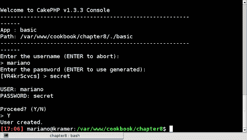
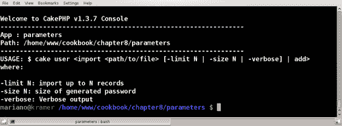
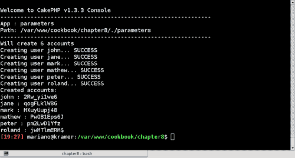
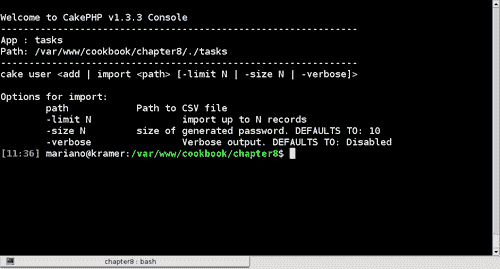
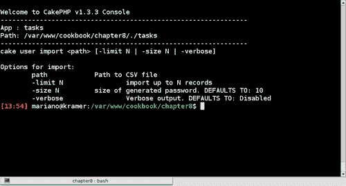
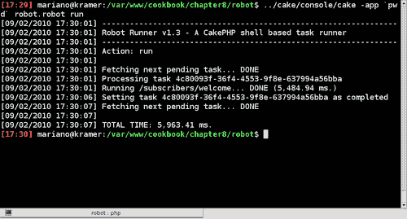

# 第八章。与 Shell 一起工作

在本章中，我们将介绍以下内容：

+   构建 和运行一个 Shell

+   解析命令行参数

+   创建可重用 Shell 任务

+   从 Shell 发送电子邮件

+   使用机器人插件创建非交互式任务

# 简介

CakePHP 最强大且鲜为人知的功能之一是其 Shell 框架。它为应用程序提供了构建命令行工具所需的一切，这些工具可以用于执行密集型任务和其他类型的非交互式处理。

本章通过介绍构建基本 Shell 的过程来向读者介绍 CakePHP Shell，然后继续介绍更高级的功能，例如从 Shell 发送电子邮件和运行控制器操作。最后，它通过介绍机器人插件来结束，该插件提供了一套完整的解决方案，用于调度和运行任务。

# 构建 和运行一个 Shell

在这个食谱中，我们将学习如何构建和运行一个自定义 Shell，该 Shell 将要求输入用户名和密码，并将指定的账户添加到用户账户列表中。基于来自 *第一章* 的食谱 *设置基本认证系统*，这个 Shell 在创建测试账户时非常有帮助。

## 准备工作

为了完成这个食谱，我们需要一个认证系统。遵循来自 *认证* 章节的整个食谱 *设置基本认证系统*。

## 如何做...

创建一个名为 `user.php` 的文件，并将其放置在你的 `app/vendors/shells` 文件夹中，内容如下：

```php
<?php
App::import('Core', 'Security');
class UserShell extends Shell {
public $uses = array('User');
public function main() {
$user = $this->in('Enter the username (ENTER to abort):');
if (empty($user)) {
$this->_stop();
}
$defaultPassword = $this->_randomPassword();;
$password = $this->in('Enter the password (ENTER to use generated):', null, $defaultPassword);
$this->out();
$this->out('USER: '.$user);
$this->out('PASSWORD: '.$password);
$this->out();
if (strtoupper($this->in('Proceed?', array('Y', 'N'), 'N')) != 'Y') {
$this->_stop();
}
$user = array('User' => array(
'username' => $user,
'password' => Security::hash($password, null, true)
));
$this->User->create();
if ($this->User->save($user)) {
$this->out('User created.');
} else {
$this->error('Error while creating user.');
}
}
protected function _randomPassword($size=10) {
$chars = '@!#$_';
foreach(array('A'=>'Z', 'a'=>'z', '0'=>'9') as $start => $end) {
for ($i=ord($start), $limiti=ord($end); $i <= $limiti; $i++) {
$chars .= chr($i);
}
}
$totalChars = strlen($chars);
$password = '';
for($i=0; $i < $size; $i++) {
$password .= $chars[rand(0, $totalChars-1)];
}
return $password;
}
}
?>

```

我们现在可以运行我们的 Shell 了。打开一个终端窗口，访问你的应用程序所在的目录。在这个目录中，你应该有你的 `app/` 和 `cake/` 文件夹。例如，如果你的应用程序安装在 `/var/www/myapp`，那么 `/var/www/myapp/app` 应该是你的 `app/` 文件夹，而 `/var/www/myapp/cake` 应该是你的 `cake/` 文件夹。在你应用程序的主要目录（例如，在这个例子中是 `/var/www/myapp`）中，运行：

### 注意

要了解更多关于运行 Shell 时设置正确路径的信息，或者如何将 cake shell 脚本添加到你的 PATH 环境变量中，请参阅[`book.cakephp.org/view/1106/The-CakePHP-Console`](http://book.cakephp.org/view/1106/The-CakePHP-Console)

如果你使用的是 GNU Linux / Mac / Unix 系统：

```php
../cake/console/cake user

```

如果你使用的是 Microsoft Windows：

```php
..\cake\console\cake.bat user

```

### 注意

如果你收到一个错误信息，例如**错误：无法加载类 UserShell**，这意味着 CakePHP 无法找到你的 `app/` 文件夹，这可能是由于你的 `app/` 文件夹名称不同。在这种情况下，你可以使用 `app` 参数指定文件夹，如下所示：`$ cake/console/cake -app /var/www/myapp/app user`。

一旦 Shell 运行，它将要求我们输入所需的用户名和密码，并在创建账户之前等待最终确认，如下面的截图所示：



现在，我们能够通过应用程序的登录页面登录时使用这个账户。

## 它是如何工作的...

我们首先导入了`Security`类，该类用于在保存用户记录之前对密码进行散列。然后我们创建了一个名为`UserShell`的类，它扩展了 CakePHP 的`Shell`类，这为我们提供了一套在构建 shell 时非常有用的方法和属性。其中之一是`uses`属性，它的工作方式与控制器的`uses`属性相同——通过定义一个列表，列出应该实例化并准备好在 shell 中的任何方法中使用的应用程序模型。

我们 shell 的入口点是`main()`方法。如果你有任何开发 C、C++或 Java 应用程序的经验，这并不会让你感到惊讶，因为`main()`也是它们的入口函数。如果你没有这样的经验，那么你需要知道的是，`main()`将在我们的 shell 通过命令行调用时自动由 CakePHP 执行。

我们的`main()`方法首先请求用户输入他们想要的用户名。为了请求用户输入，我们使用`in()`方法（通过`Shell`父类提供），它最多可以接受三个参数：

+   `prompt`：在请求用户输入之前显示给用户的消息。

+   `options`：一个可选的值集，用户在输入时应该被限制在这些值中。

+   `default`：一个可选的默认值，如果用户在提示符下点击*Enter*而没有输入，则使用此值。

如果用户没有指定用户名，我们将通过调用所有从`Object, Shell`派生的 CakePHP 类都有的`_stop()`方法来退出应用程序。

一旦我们有了用户名，我们需要请求一个密码。作为一个有用的替代方案，我们希望向用户提供一个自动生成的密码。为了生成这个密码，我们实现了一个名为`_randomPassword()`的方法。

此方法接受一个参数，即生成的密码的大小，并通过从定义的字符集中随机选择一个元素来构建它。这个集合是通过包括字母`A`到`Z`，`a`到`z`和`0`到`9`之间的所有字符来构建的。为了生成更安全的密码，我们还包括了符号`@ ! # $`和`_`作为有效字符。

当我们使用`in()`方法请求用户输入密码时，我们使用这个默认生成的密码作为它的第三个参数（`default.`）。在请求密码后，我们向用户展示用户名和密码的选择，并请求确认，利用我们在`in()`调用中的`options`参数。

如果用户确认操作，我们将继续创建用户记录，使用`Security::hash()`方法对输入的密码进行散列，该方法最多可以接受三个参数：

+   `string`：要散列的字符串。

+   `method`：用于哈希的方法，可以是以下之一：`sha1`、`sha256`、`md5`或`hash()` PHP 函数支持的任何其他方法。默认情况下，取决于它们的可用性，使用以下 PHP 函数：`sha1()`（如果选择`sha1`作为方法，也会使用），`mhash()`（如果选择`sha256`作为方法，也会使用），`hash()`，最后是`md5()`。

+   `salt`：如果为`true`，则在字符串前添加应用程序的盐（可在`Configure`设置`Security.salt`中找到）。如果指定了一个字符串，则将其作为应用程序的`Security.salt`设置的前缀添加到要哈希的密码中。如果为`false`，则不带前缀对给定的字符串进行哈希处理。

如果创建了记录，我们通知用户操作成功。否则，我们使用`error()`方法（通过`Shell`父类提供）通过标准错误流发送错误消息并退出应用程序。

### 使用 Auth 组件进行密码哈希处理

在这个菜谱中，我们通过指定与`Auth`组件中使用的相同精确参数调用了`Security::hash()`方法来哈希密码。如果我们没有这样做，相同的密码将会有不同的哈希值，这将使我们的 shell 变得无用，因为使用它创建的任何用户账户都无法登录。

这种方法的缺点是，如果`Auth`组件用于哈希密码的方法被更改，我们需要在我们的 shell 中反映这些更改。因此，我们可能想使用`Auth`组件来进行哈希处理。这个解决方案需要一些额外的努力，因为组件在 shell 中不是原生可用的。编辑你的`app/vendors/shells/user.php`文件，并移除对`Security`类的导入，然后在文件开始处添加以下导入语句：

```php
App::import('Component', 'Auth');

```

我们现在需要实例化`AuthComponent`类。将以下代码添加到`main()`方法的开始部分：

```php
$this->Auth = new AuthComponent();

```

最后更改用于创建`User`记录的数据定义，使其`password`字段使用`Auth`组件进行哈希处理：

```php
$user = array('User' => array(
'username' => $user,
'password' => $this->Auth->password($password)
));

```

## 参见

+   *解析命令行参数*

# 解析命令行参数

菜谱*构建和运行 shell*展示了如何创建一个基于用户提供的信息的记录添加 shell。这个菜谱增加了从 CSV 文件导入账户的支持，同时允许用户通过使用命令行参数来配置不同的设置。

## 准备工作

要完成这个菜谱，我们需要实现用户 shell。遵循整个菜谱*构建和运行 shell*。

我们还需要一个样本 CSV 文件来导入记录。创建一个名为`users.csv`的文件，并将其放置在你选择的目录中（例如，在应用程序的`app/tmp`目录中），内容如下：

```php
"john","John","Doe"
"jane","Jane","Doe"
"mark","Mark","Doe"
"mathew","Mathew","Doe"
"peter","Peter","Doe"
"roland","Roland","Doe"

```

## 如何操作...

1.  编辑你的`app/vendors/shells/user.php`文件，并将`main()`方法的名字改为`add()`。

1.  在`add()`方法下面添加以下方法：

    ```php
    public function help() {
    $this->out('USAGE: $ cake '.$this->shell.' <import <path/to/file> [-limit N | -size N | -verbose] | add>');
    $this->out('where:');
    $this->out();
    $this->out('-limit N: import up to N records');
    $this->out('-size N: size of generated password');
    $this->out('-verbose: Verbose output');
    }

    ```

1.  现在在 `_randomPassword()` 方法之上添加以下方法：

    ```php
    protected function _parseCSV($path) {
    $file = fopen($path, 'r');
    if (!is_resource($file)) {
    $this->error('Can\'t open '.$file);
    }
    $rows = array();
    while($row = fgetcsv($file)) {
    $rows[] = $row;
    }
    fclose($file);
    return $rows;
    }

    ```

1.  最后，在 `help()` 方法之下添加以下内容：

    ```php
    public function import() {
    $this->_checkArgs(1);
    $defaults = array(
    'limit' => null,
    'size' => 10,
    'verbose' => false
    );
    $options = array_merge(
    $defaults,
    array_intersect_key($this->params, $defaults)
    );
    $path = $this->args[0];
    if (!is_file($path) || !is_readable($path)) {
    $this->error('File '.$path.' cannot be read');
    }
    $users = array();
    foreach($this->_parseCSV($path) as $i => $row) {
    $users[$row[0]] = $this->_randomPassword($options['size']);
    if (!empty($options['limit']) && $i + 1 == $options['limit']) {
    break;
    }
    }
    if ($options['verbose']) {
    $this->out('Will create '.number_format(count($users)).' accounts');
    }
    foreach($users as $userName => $password) {
    if ($options['verbose']) {
    $this->out('Creating user '.$userName.'... ', false);
    }
    $user = array('User' => array(
    'username' => $userName,
    'password' => Security::hash($password, null, true)
    ));
    $this->User->create();
    $saved = ($this->User->save($user) !== false);
    if (!$saved) {
    unset($users[$userName]);
    }
    if ($options['verbose']) {
    $this->out($saved ? 'SUCCESS' : 'FAIL');
    }
    }
    $this->out('Created accounts:');
    foreach($users as $userName => $password) {
    $this->out($userName.' : '.$password);
    }
    }

    ```

如果我们不带参数运行 shell，CakePHP 会说没有已知的命令，并建议我们通过将 `help` 作为 shell 的参数来获取帮助。这样做将显示我们的帮助信息，如下面的截图所示：



如果我们使用 `add` 参数运行我们的 shell，我们将看到与在 *构建和运行 shell* 脚本中实现的功能完全相同。

使用 `import` 参数和 `verbose` 参数执行 shell，并使用如下命令指定我们的 CSV 文件的路径：

```php
$ cake/console/cake user import app/tmp/users.csv -verbose

```

将导入 CSV 文件中列出的用户，生成类似于以下截图所示的输出：



## 工作原理...

我们首先将入口方法的名字改为 `add()`。这样做意味着我们不再有入口方法，那么当我们的 shell 被调用时，CakePHP 如何找到要运行的内容呢？通过使用命令。

如果在 shell 中没有定义入口方法，CakePHP 将假设在执行 shell 时使用的第一个参数是一个命令。命令不过是一个不以下划线符号开头的公共方法。因此，当 shell 使用 `add` 参数调用时，会执行名为 `add()` 的方法。如果没有指定参数，CakePHP 会抱怨因为没有可运行的命令，并建议用户使用 `help` 参数，这实际上是通过调用我们的 shell 中的 `help()` 方法（因为 `help` 是一个常规命令）来实现的。

我们使用 `help()` 方法来显示我们 shell 的使用说明，列出可用的命令（添加和 `import`），以及每个命令的参数。虽然 `add` 命令没有可用的参数，但我们为我们的 `import` 命令支持以下参数：

| 设置 | 目的 |
| --- | --- |
| `limit` | 从 CSV 文件中处理的最大记录数。如果省略，将处理所有记录。 |
| `size` | 生成的密码的最大长度。默认为 `10`。 |
| `verbose` | 如果指定，shell 将在创建用户记录时输出信息。 |

`_parseCSV()` 方法是我们解析 CSV 文件的帮助方法，返回文件中找到的行数组，其中每一行本身也是一个值数组。此方法使用 PHP 的 `fgetcsv()` 函数从文件句柄中解析记录，该文件句柄是通过使用 PHP 的 `fopen()` 函数获得的，并在解析完成后使用 `fclose()` 关闭。

我们继续实现 `import()` 方法，即我们的 `import` 命令的主体。该方法使用 `_checkArgs()` 方法（通过 `Shell` 类提供）来确保命令至少接收了指定的参数数量，在我们的例子中是 `1`。如果该方法发现用户没有指定最小数量的参数，它将抛出一个错误消息并终止执行。这是我们确保至少提供了 CSV 文件路径的一种方式。

如果参数数量正确，我们继续处理可选参数。为此，我们使用 `params` 属性。即使没有提供参数，该属性对所有壳子都可用，并包括以下值：

| 设置 | 目的 |
| --- | --- |
| `app` | `app/` 目录的名称。 |
| `root` | 我们应用程序根目录的完整路径，其中包含 `app/` 和 `cake/` 目录。 |
| `webroot` | `webroot/` 目录的名称，它位于 `app/` 目录内部。 |
| `working` | `app/` 目录的完整路径。 |

然而，我们只对用户通过命令行提供的参数感兴趣。因此，我们定义了具有默认值的有效参数集，并将 `params` 属性中可用的那些参数的值合并在一起。我们将这些合并后的值存储在一个名为 `options` 的数组中。

使用 `is_file()` 和 `is_readable()` PHP 函数，我们确保我们得到了一个有效的文件。如果没有，我们使用 `error()` 方法打印出错误消息并终止应用程序。

我们接着使用 `_importCSV()` 函数来获取解析后的行列表，并为这些行中的每一行分配一个随机密码，使用 `size` 选项。如果提供了 `limit` 选项，一旦达到该值，我们就停止生成密码。在这个循环结束时，我们将有一个名为 `users` 的数组，其中索引是用户名，值是给定用户的密码。

对于 `users` 数组中的每个值，我们创建与 `add` 命令中类似的用户记录，如果设置了 `verbose` 选项，则输出每个创建的状态。如果在创建特定记录时遇到错误，我们将有问题的用户从 `users` 数组中删除。

一旦创建过程完成，我们输出成功创建的用户名列表，以及它们生成的密码。

## 参见

+   *在第五章*Parsing CSV files with a datasource*，*数据源*

+   *创建可重用的壳子任务*

# 创建可重用的壳子任务

正如我们有组件可以在控制器之间共享功能一样，我们也有模型的行为和视图的帮助器。那么壳子呢？CakePHP 提供了任务的概念，这些是扩展自 `Shell` 类的类，但可以从其他壳子中重用。

在这个配方中，我们将学习如何构建一个处理 shell 的参数和参数处理的任务，可以自动生成帮助信息，并检查必填参数和可选参数的定义。我们将以最通用的方式实现这个任务，以便我们可以将其用于我们可能决定构建的任何未来的 shell。

## 准备工作

为了完成这个配方，我们需要一个接受参数并且有不同命令可用的 shell。遵循整个配方中的*解析命令行参数*。

## 如何做到这一点...

1.  编辑你的`app/vendors/shells/user.php`文件，并在`uses`属性的声明下方添加以下内容：

    ```php
    public $tasks = array('Help');
    public static $commands = array(
    'add',
    'import' => array(
    'help' => 'Import user records from a CSV file',
    'args' => array(
    'path' => array(
    'help' => 'Path to CSV file',
    'mandatory' => true
    )
    ),
    'params' => array(
    'limit' => array(
    'type' => 'int',
    'help' => 'import up to N records'
    ),
    'size' => array(
    'value' => 10,
    'type' => 'int',
    'help' => 'size of generated password'
    ),
    'verbose' => array(
    'value' => false,
    'type' => 'bool',
    'help' => 'Verbose output'
    )
    )
    )
    );

    ```

1.  在仍然编辑 shell 的同时，删除`help()`方法，并从`import()`方法的开始处删除以下几行：

    ```php
    $this->_checkArgs(1);
    $defaults = array(
    'limit' => null,
    'size' => 10,
    'verbose' => false
    );
    $options = array_merge(
    $defaults,
    array_intersect_key($this->params, $defaults)
    );
    $path = $this->args[0];

    ```

1.  在`import()`方法的开始处添加以下几行：

    ```php
    $options = $this->Help->parameters;
    extract($this->Help->arguments);

    ```

1.  创建一个名为`help.php`的文件，并将其放置在`app/vendors/shells/tasks`中，内容如下：

    ```php
    <?php
    class HelpTask extends Shell {
    public $parameters = array();
    public $arguments = array();
    protected $commands = array();
    public function initialize() {
    $shellClass = Inflector::camelize($this->shell).'Shell';
    $vars = get_class_vars($shellClass);
    if (!empty($vars['commands'])) {
    foreach($vars['commands'] as $command => $settings) {
    if (is_numeric($command)) {
    $command = $settings;
    $settings = array();
    }
    if (!empty($settings['args'])) {
    $args = array();
    foreach($settings['args'] as $argName => $arg) {
    if (is_numeric($argName)) {
    $argName = $arg;
    $arg = array();
    }
    $args[$argName] = array_merge(array(
    'help' => null,
    'mandatory' => false
    ), $arg);
    }
    $settings['args'] = $args;
    }
    if (!empty($settings['params'])) {
    $params = array();
    foreach($settings['params'] as $paramName => $param) {
    if (is_numeric($paramName)) {
    $paramName = $param;
    $param = array();
    }
    $params[$paramName] = array_merge(array(
    'help' => null,
    'type' => 'string'
    ), $param);
    }
    }
    $this->commands[$command] = array_merge(array(
    'help' => null,
    'args' => array(),
    'params' => array()
    ), $settings);
    }
    }
    if (empty($this->command) && !in_array('main', get_class_methods($shellClass))) {
    $this->_welcome();
    $this->_help();
    } elseif (!empty($this->command) && array_key_exists($this->command, $this->commands)) {
    $command = $this->commands[$this->command];
    $number = count(array_filter(Set::extract(array_values($command['args']), '/mandatory')));
    if ($number > 0 && (count($this->args) - 1) < $number) {
    $this->err('WRONG number of parameters');
    $this->out();
    $this->_help($this->command);
    } elseif ($number > 0) {
    $i = 0;
    foreach($command['args'] as $argName => $arg) {
    if ($number >= $i && isset($this->args[$i+1])) {
    $this->arguments[$argName] = $this->args[$i+1];
    }
    $i++;
    }
    }
    $values = array_intersect_key($this->params, $command['params']);
    foreach($command['params'] as $settingName => $setting) {
    if (!array_key_exists($settingName, $values)) {
    $this->parameters[$settingName] = array_key_exists('value', $setting) ?
    $setting['value'] :
    null;
    } elseif ($setting['type'] == 'int' && !is_numeric($values[$settingName])) {
    $this->err('ERROR: wrong value for '.$settingName);
    $this->out();
    $this->_help($this->command);
    } else {
    if ($setting['type'] == 'bool') {
    $values[$settingName] = !empty($values[$settingName]);
    }
    $this->parameters[$settingName] = $values[$settingName];
    }
    }
    }
    }
    }

    ```

1.  向创建的`HelpTask`类添加以下方法：

    ```php
    public function execute() {
    $this->_help(!empty($this->args) ? $this->args[0] : null);
    }
    protected function _help($command = null) {
    $usage = 'cake '.$this->shell;
    if (empty($this->commands)) {
    $this->out($usage);
    return;
    }
    $lines = array();
    $usages = array();
    if (empty($command) || !array_key_exists($command, $this->commands)) {
    foreach(array_keys($this->commands) as $currentCommand) {
    $usages[] = $this->_usageCommand($currentCommand);
    if (!empty($lines)) {
    $lines[] = null;
    }
    $lines = array_merge($lines, $this->_helpCommand($currentCommand));
    }
    } else {
    $usages = (array) $this->_usageCommand($command);
    $lines = $this->_helpCommand($command);
    }
    if (!empty($usages)) {
    $usage .= ' ';
    if (empty($command)) {
    $usage .= '<';
    }
    $usage .= implode(' | ', $usages);
    if (empty($command)) {
    $usage .= '>';
    }
    }
    $this->out($usage);
    if (!empty($lines)) {
    $this->out();
    foreach($lines as $line) {
    $this->out($line);
    }
    }
    $this->_stop();
    }

    ```

1.  在仍然编辑`HelpTask`类的同时，向该类添加以下辅助方法：

    ```php
    protected function _usageCommand($command) {
    $usage = $command;
    if (!empty($this->commands[$command]['args'])) {
    foreach($this->commands[$command]['args'] as $argName => $arg) {
    $usage .= ' ' . ($arg['mandatory'] ? '<' : '[');
    $usage .= $argName;
    $usage .= ($arg['mandatory'] ? '>' : ']');
    }
    }
    if (!empty($this->commands[$command]['params'])) {
    $usages = array();
    foreach(array_keys($this->commands[$command]['params']) as $setting) {
    $usages[] = $this->_helpSetting($command, $setting);
    }
    $usage .= ' ['.implode(' | ', $usages).']';
    }
    return $usage;
    }
    protected function _helpCommand($command) {
    if (
    empty($this->commands[$command]['args']) &&
    empty($this->commands[$command]['params'])
    ) {
    return array();
    }
    $lines = array('Options for '.$command.':');
    foreach($this->commands[$command]['args'] as $argName => $arg) {
    $lines[] = "\t".$argName . (!empty($arg['help']) ? "\t\t".$arg['help'] : '');
    }
    foreach(array_keys($this->commands[$command]['params']) as $setting) {
    $lines[] = "\t".$this->_helpSetting($command, $setting, true);
    }
    return $lines;
    }
    protected function _helpSetting($command, $settingName, $useHelp = false) {
    $types = array('int' => 'N', 'string' => 'S', 'bool' => null);
    $setting = $this->commands[$command]['params'][$settingName];
    $type = array_key_exists($setting['type'], $types) ? $types[$setting['type']] : null;
    $help = '-'.$settingName . (!empty($type) ? ' '.$type : '');
    if ($useHelp && !empty($setting['help'])) {
    $help .= "\t\t".$setting['help'];
    if (array_key_exists('value', $setting) && !is_null($setting['value'])) {
    $help .= '. DEFAULTS TO: ';
    if (empty($type)) {
    $help .= $setting['value'] ? 'Enabled' : 'Disabled';
    } else {
    $help .= $setting['value'];
    }
    }
    }
    return $help;
    }

    ```

如果你现在运行不带任何参数的 shell，使用如下命令：

```php
$ cake/console/cake user

```

我们将得到以下截图所示的详细帮助信息：



我们还可以为特定命令获取详细帮助。使用如下命令运行 shell：

```php
$ cake/console/cake user help import

```

将显示`import`命令的帮助信息，如下截图所示：



使用与配方*解析命令行参数*中使用的相同参数运行 shell 以导入 CSV 文件应该按预期工作。

## 它是如何工作的...

当一个 shell 在其声明中包含`tasks`属性时，它被认为是使用了指定的任务。任务存储在`app/vendors/shells/tasks`文件夹中，并且可以在 shell 中以实例的形式访问。在我们的情况下，我们添加一个名为`Help`的任务，它应该在名为`HelpTask`的类中实现，并放置在`tasks`文件夹中的名为`help.php`的文件中，并且我们在 shell 中通过`$this->Help`来引用它。

在继续之前，必须指出关于这个特定任务的命名问题。因为我们希望我们的任务能够自动为我们的 shell 生成帮助信息，所以我们必须以某种方式捕获对`help()`命令的调用。这只有在首先理解 shell 分发过程如何工作的情况下才能实现。让我们假设以下调用：

```php
$ cake/console/cake user import

```

实现于文件`cake/console/cake.php`中的 shell 分发器将经过以下步骤：

1.  实例化 shell 类`UserShell`。

1.  调用它的`initialize()`方法。

1.  加载 shell 中定义在`tasks`属性下的所有任务。

1.  对于这些任务中的每一个，调用它们的`initialize()`方法，并加载它们可能使用的任何任务。

如果给定的命令（在这种情况下为 `import`）是包含的任务之一，则调用任务 `startup()` 方法，然后调用其 `execute()` 方法。

如果给定的命令不是任务名称，则调用 shell 的 `startup()` 方法，如果存在，则执行命令的方法，或者如果命令未实现，则执行入口方法 `main()`。

这意味着如果我们有一个名为 `Help` 的任务包含在我们的 shell 中，并且用户使用以下命令启动 shell：

```php
$ cake/console/cake user help

```

然后，shell 分发器将调用 `HelpTask` 类的 `execute()` 方法，因为命令 `help` 实际上是 shell 任务之一的名字。了解这一点后，我们可以移除 `User` shell 的 `help()` 实现，让 `Help` 任务处理帮助信息的显示。

此外，我们的 `Help` 任务需要足够通用，以便不与特定 shell 绑定。因此，我们需要一种方法来告知它我们的可用命令、预期参数和可选参数。这就是 `commands` 属性的作用：一个命令数组，其中键是命令名称，值是以下设置中的任何一个：

| 设置 | 目的 |
| --- | --- |
| `帮助` | 描述命令目的的帮助信息。默认没有信息。 |
| `args` | 命令接受的强制性参数和可选参数列表。默认没有参数。 |
| `params` | 命令接受的可选参数列表。默认没有参数。 |

注意，然而，`add` 命令的定义方式不同：它不是在键中定义，而是简单地作为添加到 `commands` 数组中的命令名称。这意味着该命令没有帮助信息，没有参数，也没有参数。

`args` 命令设置是一个通过参数名称索引的参数数组。每个参数可以定义以下设置中的任何一个：

| 设置 | 目的 |
| --- | --- |
| `帮助` | 描述参数的帮助信息。默认没有信息。 |
| `强制性` | 如果 `true`，则此参数必须存在。如果 `false`，则可以省略此参数。默认为 `false`。 |

类似地，`params` 命令设置也是一个数组，通过参数名称索引，其中每个参数可以定义以下设置中的任何一个：

| 设置 | 目的 |
| --- | --- |
| `帮助` | 描述参数的帮助信息。默认没有信息。 |
| `type` | 此参数持有的数据类型。可以是 `int, bool` 或 `string`。任何其他类型都被解释为 `string`。默认为 `string`。 |
| `value` | 如果未指定参数，则使用默认值。默认没有默认值。 |

在`UserShell`类中使用`commands`属性，我们定义了`import`命令可用的参数和参数集，然后修改了`import()`方法，使其选项从`Help`任务的`parameters`属性中获取。我们还使用`extract()`PHP 函数将`Help`任务的`arguments`属性中定义的任何参数转换为局部变量。这样，`path`参数将以变量`$path`的形式对方法可用。

在`UserShell`类中所需的修改都已经完成。注意我们不仅移除了`help()`方法的实现，还去除了`import()`方法中对参数的处理以及正确参数数量的检查。现在这一切都由`Help`任务自动完成，基于我们在`commands`属性中定义的内容。

这意味着我们的`Help`任务确实是我们的 shell 的瑞士军刀，其大部分工作都是在其`initialize()`方法中完成的。该方法首先利用 PHP 方法`get_class_vars()`来获取 shell 中定义的`commands`属性，因为我们的任务没有方法获取`UserShell`类的实例。然后继续遍历命令列表，并规范化所有定义的参数和参数，将结果数组分配给`HelpTask`类的`commands`属性。

一旦我们准备好所有要检查的命令，我们检查用户是否确实通过`command`属性选择了要执行的命令，该属性对所有从`Shell`扩展的类都可用，并设置为当前命令。如果用户没有选择，并且 shell 中没有实现`main()`方法，我们使用`_help()`方法来显示帮助信息。

如果用户确实指定了一个在可用命令列表中的命令，我们确保指定的参数与最小数量的必需参数匹配（如果有），如果检查失败，则通过适当的错误消息终止执行。如果参数数量正确，我们将每个给定参数的值存储在任务的`arguments`属性中。

一旦处理完参数，我们就继续处理参数。遍历指定的参数，我们将提供的值与数据类型进行比较（如果有），如果值类型不正确，则通过适当的错误消息终止 shell。如果没有提供值，则使用默认值（如果有）。参数和值的数组结果存储在任务的`parameters`属性中。

`execute()`方法是在调用`Help`任务时被调用的方法，也就是在调用 shell 时使用`help`命令时。因此，这个方法将简单地通过调用`_help()`方法来显示帮助信息，可以可选地传递第一个参数，这样可以为用户提供给定命令的帮助信息。

`_help()`方法构建整个 shell 或特定命令的帮助信息。它使用存储在`commands`属性中的命令信息，并调用`_usageCommand()`辅助方法来获取给定命令的使用信息，以及调用`_helpCommand()`方法来获取所有可用参数和命令中所有参数的帮助信息。

# 从 shell 发送电子邮件

电子邮件发送不是需要我们的 Web 应用程序访客进行任何交互的任务，因此让他们等待邮件的送达是没有意义的，这正是如果我们从控制器动作发送电子邮件时会发生的情况。

将电子邮件发送推迟到 shell 中，从性能和管理员的角度来看都非常有意义，因为我们还可以添加重新发送失败电子邮件的能力。

此配方使用 CakePHP 提供的`Email`组件来发送虚构的通讯稿，并添加了通过 shell 参数测试发送过程的能力。

## 准备工作

为了完成这个配方，我们需要一些数据来工作。使用以下 SQL 语句创建一个`subscribers`表：

```php
CREATE TABLE `subscribers`(
`id` INT UNSIGNED AUTO_INCREMENT NOT NULL,
`name` VARCHAR(255) NOT NULL,
`email` VARCHAR(255) NOT NULL,
PRIMARY KEY(`id`)
);

```

使用以下语句创建一个`newsletters`表：

```php
CREATE TABLE `newsletters`(
`id` INT UNSIGNED AUTO_INCREMENT NOT NULL,
`title` VARCHAR(255) NOT NULL,
`body` TEXT NOT NULL,
`sent` TINYINT(1) UNSIGNED NOT NULL default 0,
PRIMARY KEY(`id`)
);

```

使用以下语句创建一个`newsletters_subscribers`表：

```php
CREATE TABLE `newsletters_subscribers`(
`id` INT UNSIGNED AUTO_INCREMENT NOT NULL,
`newsletter_id` INT UNSIGNED NOT NULL,
`subscriber_id` INT UNSIGNED NOT NULL,
`sent` TINYINT(1) UNSIGNED NOT NULL default 0,
PRIMARY KEY(`id`)
);

```

现在用以下语句向这些表添加一些示例数据：

```php
INSERT INTO `subscribers`(`name`, `email`) VALUES
('John Doe', 'john.doe@email.com'),
('Jane Doe', 'jane.doe@email.com');
INSERT INTO `newsletters`(`title`, `body`) VALUES
('My first newsletter', 'This is the body for <strong>my first newsletter</strong>');

```

创建一个名为`newsletter.php`的文件，并将其放置在您的`app/models`文件夹中，内容如下：

```php
<?php
class Newsletter extends AppModel {
public $hasMany = array('NewslettersSubscriber');
}
?>

```

## 如何操作...

创建一个名为`email.php`的文件，并将其放置在您的`app/vendors/shells`中，内容如下：

```php
<?php
App::import('Component', 'Email');
class EmailShell extends Shell {
public $uses = array('Newsletter', 'Subscriber');
public function startup() {
$this->Email = new EmailComponent();
$this->Email->delivery = 'smtp';
$this->Email->smtpOptions = array(
'host' => 'smtp.email.com',
'username' => 'smtpUser',
'password' => 'smtpPassword'
);
}
public function main() {
$email = !empty($this->params['to']) ? $this->params['to'] : array();
$newsletter = $this->Newsletter->find('first', array(
'conditions' => array('sent' => false),
'recursive' => -1
));
if (empty($newsletter)) {
$this->out('All newsletters have been sent');
$this->_stop();
}
$this->out('Sending newsletter "'.$newsletter['Newsletter']['title'].'"');
$subscribers = $this->Subscriber->find('all');
foreach($subscribers as $subscriber) {
$this->out('Sending to '.$subscriber['Subscriber']['email'].'... ', false);
$currentEmail = !empty($email) ? $email : $subscriber['Subscriber']['email'];
if (!empty($email)) {
$this->Email->headers['Destination'] = $subscriber['Subscriber']['email'];
}
$this->Email->sendAs = 'html';
$this->Email->subject = $newsletter['Newsletter']['title'];
$this->Email->from = 'My Application <info@email.com>';
$this->Email->to = $subscriber['Subscriber']['name'] . ' <'.$currentEmail.'>';
$sent = $this->Email->send($newsletter['Newsletter']['body']));
if ($sent) {
$this->out('DONE');
} else {
$error = !empty($this->Email->smtpError) ? $this->Email->smtpError : '';
$this->out('ERROR' . (!empty($error) ? ': '.$error : ''));
}
$this->Newsletter->NewslettersSubscriber->create(array(
'newsletter_id' => $newsletter['Newsletter']['id'],
'subscriber_id' => $subscriber['Subscriber']['id'],
'sent' => $sent
));
$this->Newsletter->NewslettersSubscriber->save();
$this->Email->reset();
}
$this->Newsletter->id = $newsletter['Newsletter']['id'];
$this->Newsletter->saveField('sent', true);
}
}
?>

```

确保更改`startup()`函数中的以下行以匹配您的设置：

```php
$this->Email->delivery = 'smtp';
$this->Email->smtpOptions = array(
'host' => 'smtp.email.com',
'username' => 'smtpUser',
'password' => 'smtpPassword'
);

```

如果您想使用 PHP 的`mail()`函数而不是 SMTP，将`Email`组件的`delivery`属性更改为`mail`。一旦配置完成，您可以使用以下命令运行 shell，以强制所有电子邮件发送到您的特定地址（在这种情况下，`my@email.com`）：

```php
$ cake/console/cake email -to my@email.com

```

由于所有电子邮件都通过使用 shell 参数强制发送到`my@email.com`，我们需要一种方法来告诉每个电子邮件是否会发送到真实的电子邮件地址。使用您的电子邮件程序查看电子邮件的标题，您将注意到以下标题行：

```php
To: John Doe <my@email.com>
From: My Application <info@email.com>
Subject: My first newsletter
X-Mailer: CakePHP Email Component
X-Destination: john.doe@email.com

```

从这些标题中我们可以看出，**X-Destination**标题被设置为电子邮件最初打算发送的地址。

## 它是如何工作的...

`EmailShell`首先通过实现`startup()`方法开始，该方法在执行任何 shell 命令或其入口方法之前被调用。在这个方法中，我们创建了一个`Email`组件的实例。一旦我们有了实例，我们就通过`delivery`和`smtpOptions`属性来配置其交付设置。

入口方法`main()`检查是否提供了`to`参数。如果是，这将是要发送所有电子邮件的电子邮件地址，这是一种基本的测试发送过程的方法。然后它继续获取尚未发送的第一份通讯稿和应该接收通讯稿的订阅者列表。

对于每个订阅者，我们设置 `Email` 组件的适当属性：

| 属性 | 目的 |
| --- | --- |
| `sendAs` | 要发送的电子邮件类型。可以是文本、`html` 或 `both`。我们将其设置为 `html` 以指定我们正在发送纯 HTML 电子邮件。 |
| `subject` | 电子邮件的主题。 |
| `from` | 发送电子邮件的地址。 |
| `to` | 目标地址。如果提供了参数，这是要发送的电子邮件 `to`，否则我们使用订阅者的电子邮件。 |

最后，我们通过组件的 `send()` 方法发送实际电子邮件，通知用户操作的结果，并在 `for` 操作的下一个循环之前使用组件的 `reset()` 方法重置电子邮件内容。我们通过标记新闻通讯已发送来结束 shell。

## 参见

+   在 第十一章 *实用类和工具* 中发送电子邮件

# 使用机器人插件的非交互式任务

随着我们的应用程序在规模和复杂性上的增长，我们将发现自己需要创建和自动化某些任务，将非交互式任务的执行推迟到稍后。虽然我们可以创建 shell 来执行这些操作，但我们的某些需求可能可以通过机器人插件得到满足。

### 注意

虽然这个配方展示了纯 CakePHP 方法，但还有更多复杂和可扩展的替代方案。最常用的工具之一是 **Gearman**，可在 [`gearman.org/`](http://gearman.org/) 获取。

机器人插件允许我们安排任务以供稍后执行，并由 shell 运行这些任务。这些任务本身实际上是 CakePHP 控制器操作，由 shell 在指定的时间运行。

这个配方展示了如何使用机器人插件在用户注册我们的新闻通讯后发送电子邮件，以及如何让机器人插件中的 shell 定期检查待处理任务并在它们可用时运行它们。

## 准备工作

为了完成这个配方，我们需要一些数据来工作。遵循前一个配方中的 *准备工作* 部分。

我们需要下载机器人插件。访问 [`github.com/mariano/robot/downloads`](http://github.com/mariano/robot/downloads) 并下载最新版本。将下载的文件解压缩到您的 `app/plugins` 文件夹中。现在您应该在 `app/plugins` 内有一个名为 `robot` 的目录。

运行 `app/plugins/robot/config/sql/robot.sql` 文件中找到的 SQL 语句以创建机器人插件所需的表。

## 如何操作...

1.  创建一个名为 `subscribers_controller.php` 的文件并将其放置在您的 `app/controllers` 文件夹中，内容如下：

    ```php
    <?php
    class SubscribersController extends AppController {
    public function add() {
    if (!empty($this->data)) {
    $this->Subscriber->create();
    if ($this->Subscriber->save($this->data)) {
    $this->Session->setFlash('You have been subscribed!');
    $this->redirect('/');
    } else {
    $this->Session->setFlash('Please correct the errors');
    }
    }
    }
    public function welcome() {
    }
    }
    ?>

    ```

1.  在您的 `app/views` 文件夹中创建一个名为 `subscribers` 的文件夹。创建一个名为 `add.ctp` 的文件并将其放置在 `app/views/subscribers` 文件夹中，内容如下：

    ```php
    <?php
    echo $this->Form->create();
    echo $this->Form->inputs(array(
    'legend' => 'Subscribe',
    'name',
    'email'
    ));
    echo $this->Form->end('Submit');
    ?>

    ```

1.  创建一个名为 `welcome.ctp` 的文件并将其放置在 `app/views/subscribers` 文件夹中，内容如下：

    ```php
    <h1>Welcome to my site!</h1>

    ```

1.  将以下属性添加到`SubscribersController`类的开头（将`Email`组件的投递设置更改为满足你的需求）：

    ```php
    public $components = array(
    'Email' => array(
    'delivery' => 'smtp',
    'smtpOptions' => array(
    'host' => 'smtp.email.com',
    'username' => 'smtpUser',
    'password' => 'smtpPassword'
    )
    )
    );

    ```

1.  编辑`SubscribersController`类的`add()`方法并做出以下更改：

    ```php
    public function add() {
    if (!empty($this->data)) {
    $this->Subscriber->create();
    if ($this->Subscriber->save($this->data)) {
    ClassRegistry::init('Robot.RobotTask')->schedule(
    array('action'=>'welcome'),
    array(
    'name' => $this->data['Subscriber']['email'],
    'email' => $this->data['Subscriber']['email']
    )
    );
    $this->Session->setFlash('You have been subscribed!');
    $this->redirect('/');
    } else {
    $this->Session->setFlash('Please correct the errors');
    }
    }
    }

    ```

1.  在编辑`SubscribersController`类时，将`welcome()`方法替换为以下内容：

    ```php
    public function welcome() {
    if (isset($this->params['robot'])) {
    $subscriber = $this->params['robot'];
    $this->Email->sendAs = 'html';
    $this->Email->subject = 'Welcome to my site!';
    $this->Email->from = 'My Application <info@email.com>';
    $this->Email->to = $subscriber['name'] . ' <'.$subscriber['email'].'>';
    return ($this->Email->send('Hi, and <strong>welcome</strong> to my site!') !== false);
    }
    }

    ```

现在，你可以浏览到`http://localhost/subscribers/add`并输入你的姓名和电子邮件地址。现在使用以下命令运行机器人外壳：

如果你使用的是 GNU Linux / Mac / Unix 系统：

```php
../cake/console/cake robot.robot run

```

如果你使用的是 Microsoft Windows：

```php
..\cake\console\cake.bat robot.robot run

```

你应该得到一个类似于以下截图的输出：



机器人正在通知我们，任务已成功执行了 CakePHP URL `/subscribers/welcome`，之后我们应该收到欢迎电子邮件。

## 它是如何工作的...

我们从一个基本的控制器开始，该控制器处理新的订阅并将它们保存，在记录创建后重定向到欢迎屏幕。然后我们在控制器中添加了`Email`组件，因为它将被用于发送电子邮件。

我们继续修改`add()`方法以创建计划任务。我们使用位于 Robot 插件中的`RobotTask`模型的`schedule()`方法来安排任务。此方法最多接受三个参数：

| 参数 | 目的 |
| --- | --- |
| `action` | CakePHP 操作的 URL，可以是字符串或数组。 |
| `parameters` | 发送到`action`中指定的控制器操作的可选参数。默认为无参数。 |
| `scheduled` | 操作应执行的时间。这可以是特定的时间戳（自 Unix 纪元（1970 年 1 月 1 日 00:00:00 GMT）以来的秒数），或任何可以由 PHP 函数`strtotime()`使用的字符串。默认为`null`，表示任务应尽快执行。 |

在我们的`add()`方法中，我们将`action`参数设置为当前控制器的`welcome`操作，并发送两个参数：`name`和`email`。这些参数可以通过`$this->params['robot']`数组在调用操作中使用。

事实上，每当通过机器人外壳调用控制器操作时，`$this->params['robot']`都将可用。如果在安排任务时未指定参数，则此数组将为空，因此在`welcome()`方法中使用`isset()`而不是`!empty()`进行检查。

当通过机器人外壳调用时，`welcome()`方法使用给定的参数构建并发送电子邮件。它返回一个布尔值以指示执行任务的成败。如果没有返回值，则假定任务已成功执行。

为了测试机器人插件，我们在注册为订阅者后结束了配方，然后运行了机器人。自然地，应用程序不应该需要我们手动运行机器人 shell，以便发送电子邮件。我们需要将 shell 添加到我们的自动化任务列表中，这在大多数操作系统中通常被称为 CRON 任务。

假设你的应用程序位于`/var/www/myapp`，并且你的 PHP 二进制文件的路径是`/usr/bin/php`，以下将是应包含在操作系统中的自动化任务中的命令：

```php
/usr/bin/php -q /var/www/myapp/cake/console/cake.php -app /var/www/myapp/app robot.robot run -silent

```

注意到`silent`选项。这告诉机器人插件除非发现错误，否则不输出任何消息。当我们将此命令添加到我们的自动化任务列表中时，这一点尤为重要，因为它可能被配置为发送任何执行命令的输出电子邮件。

当我们将此命令添加到我们的自动化任务列表中时，我们必须决定我们希望机器人多久检查一次任务。如果我们对即时结果感兴趣，我们应该将机器人设置为每分钟运行一次。然而，如果在给定分钟的秒数为 0 时机器人找不到任务，会发生什么？我们将有 59 秒的空闲时间。

幸运的是，插件提供了一个有趣的解决方案来解决这个问题。使用`daemon`参数，我们告诉机器人插件即使在没有可用任务的情况下也要等待任务。如果我们尝试使用以下命令手动运行它并使用此选项：

```php
$ cake/console/cake robot.robot run -daemon

```

我们会注意到 shell 会抱怨说没有指定限制。这是因为机器人不应该被设置为无限期地等待任务，因为由调用动作可能引发的任何 PHP 致命错误都可能使机器人失效。

相反，我们可以使用`time`参数来限制机器人等待任务的最大秒数。如果我们想每分钟运行机器人一次，这个限制应该设置为 59 秒：

```php
$ cake/console/cake robot.robot run -daemon -time 59

```

这意味着机器人将等待多达 59 秒的任务，之后将触发下一次机器人运行。
