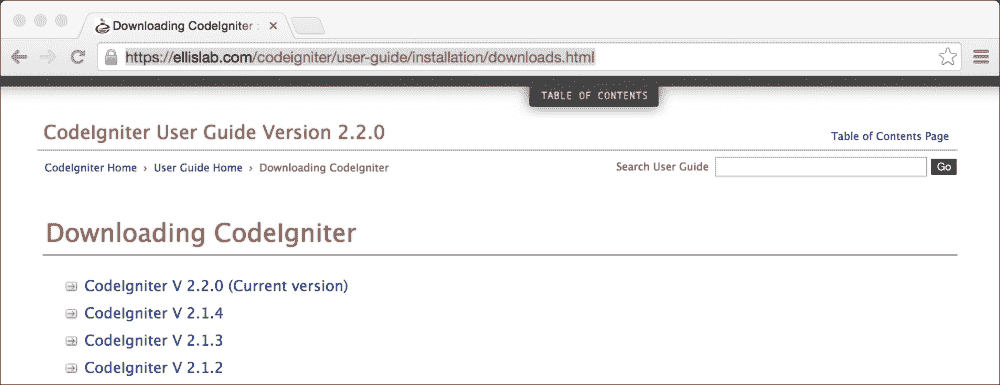
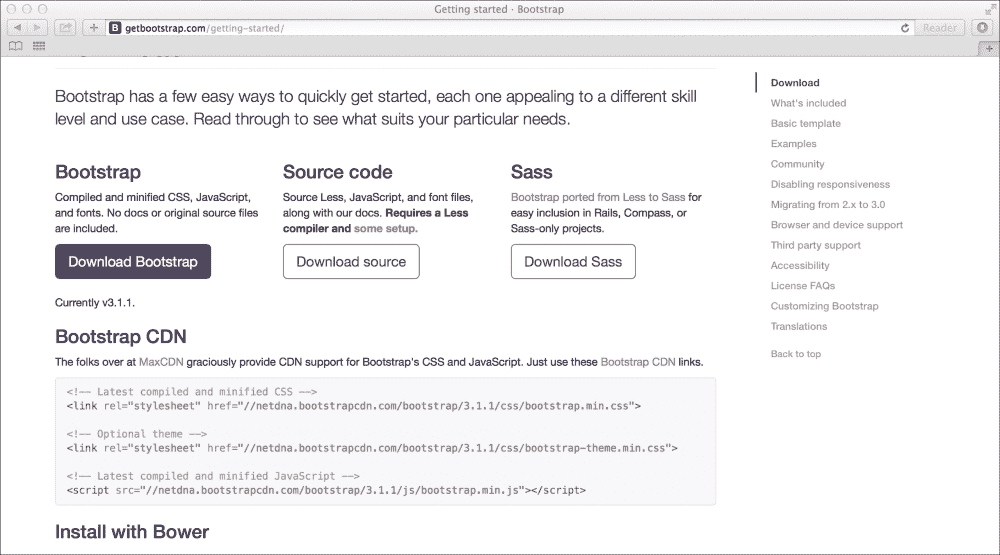

# 第一章. 引言和共享项目资源

这一章的目的是什么？我希望用这一章作为本书所有其他章节和项目的入门指南。我希望你们将引言作为一个包含本书中所有项目共享资源的通用资源使用。

引言将涵盖后续章节中项目所需的第三方软件、库、助手等安装内容。将这些资源放在这一章，可以避免项目被重复的代码淹没，并使项目代码尽可能保持简洁。

在本章中，我们将涵盖以下主题：

+   本书概述

+   下载 CodeIgniter

+   下载并安装 Twitter Bootstrap

+   创建适用于所有项目的通用页眉和页脚文件

+   安装 Sparks

+   通用语言项

# 通用资源

本书使用的通用资源将在接下来的章节中讨论。

## Twitter Bootstrap

本书每一章中的项目都使用 Twitter Bootstrap。我们将下载 Bootstrap，并在我们的文件系统中找到一个合适的位置。然后我们将创建页眉和页脚文件。本书中的所有项目都将调用这些页眉和页脚文件（使用 CodeIgniter 函数`$this->load->view()`来显示视图）。然而，这些项目实际上并不包含页眉和页脚的代码——只有页眉和页脚之间的*有效*代码（你可能认为是在`<body>`和`</body>`标签之间的内容）将在每个项目中详细说明。

## 页眉和页脚

各个项目的菜单将有所不同。在页眉文件中，我们将包含显示菜单的代码，但实际的菜单 HTML 内容将包含在每个项目的章节中。页脚文件包含每个页面的关闭 HTML 标记。

# 下载 CodeIgniter

我们需要一份 CodeIgniter 的副本来开始。这本书并不是针对初学者的，所以你已经有 CodeIgniter 安装副本或者至少足够了解如何跳过这一部分的可能性相当高；然而，简要地介绍 CodeIgniter 的安装是有意义的，这样我们就可以在后续章节中有所讨论！

首先，访问[`ellislab.com/codeigniter/user-guide/installation/downloads.html`](https://ellislab.com/codeigniter/user-guide/installation/downloads.html)。你会看到以下截图所示的内容。这是 CodeIgniter 下载页面。在撰写本文时，当前的 CodeIgniter 版本是 2.2.0；这就是为什么截图在 2.2.0 版本旁边写着**当前版本**；然而，无论你在阅读本书时哪个版本是最新的，你都应该使用这个版本。

点击**当前版本**链接，CodeIgniter 将开始下载。



下载完成后，导航到您保存文件的位置；这将是一个压缩归档文件。解压缩它并将该文件的内容移动到您的网络根目录下的一个文件夹中。

关于路由、配置和数据库使用的具体细节在每个章节中都有（这些细节特定于该章节）。

## PHP 的新版本

如果您在 PHP 的新版本上运行 CodeIgniter，可能会遇到错误。有一个针对此问题的解决方案，在[`ellislab.com/forums/viewthread/244510/`](https://ellislab.com/forums/viewthread/244510/)上有解释。一个名为*milan.petrak*的帖子作者描述了一个解决方案。可以总结如下：

1.  打开`/path/to/codeigniter/system/core/common.php`文件并找到第 257 行。

1.  找到以下行：

    ```php
    $_config[0] =& $config;
    with
    return $_config[0];
    return $_config[0] =& $config;
    ```

1.  保存`common.php`文件。

这可能在 CodeIgniter 的后续版本中得到永久修复，但到目前为止，这是修复方法。

# 安装 Twitter Bootstrap

Twitter Bootstrap 是一个前端 HTML5 框架，它允许任何人轻松构建可靠的界面。在撰写本文时，所使用的 Bootstrap 版本是 3.1.1。

我们将在本书中使用 Twitter Bootstrap 为所有视图文件和模板提供框架。我们将探讨如何下载 Twitter Bootstrap 以及如何在 CodeIgniter 文件系统中安装它。

首先，我们需要下载 Twitter Bootstrap 文件。为此，请执行以下步骤：

1.  打开您的网络浏览器，并访问 Bootstrap 下载链接[`getbootstrap.com/getting-started`](http://getbootstrap.com/getting-started)。您将看到以下截图所示的内容：

1.  找到**下载 Bootstrap**链接并点击它（如前一个截图所示）；下载将自动开始。

下载完成后，转到您的机器上的位置并解压缩归档文件。在解压缩的文件中，您应该看到以下结构类似的内容：

```php
bootstrap/
├── css/
│   ├── bootstrap-theme.css
│   ├── bootstrap-theme.css.map
│   ├── bootstrap-theme.min.css
│   └── bootstrap.css
│   └── bootstrap.css.map
│   └── bootstrap.min.css
├── js/
│   ├── bootstrap.js
│   └── bootstrap.min.js
└── fonts/
    ├── glyphicons-halflings-regular.eot
    ├── glyphicons-halflings-regular.svg
    ├── glyphicons-halflings-regular.ttf
    └── glyphicons-halflings-regular.woff
```

将`bootstrap`文件夹移动到您的 CodeIgniter 安装中，以便文件层次结构看起来如下：

```php
/path/to/web/root/
├── application/
└── views/
    ├── common
        ├── header.php
        ├── footer.php
├── system/
├── bootstrap/
├── index.php
├── license.txt
```

在前面的树结构中，`application`和`system`目录与 CodeIgniter 有关，同样，`index.php`和`license.txt`文件也是如此；然而，`bootstrap`目录包含您 Bootstrap 下载的内容。

我还指出了常见`header.php`和`footer.php`文件的位置。这些文件在本书中到处使用，并作为其他每个视图文件的包装器。

# 从地址栏移除 index.php

当 CodeIgniter 运行时，可以从网络浏览器地址栏中移除`index.php`。这可以通过以下步骤完成：

1.  创建或打开一个`.htaccess`文件。如果尚未存在`.htaccess`文件，您可以使用以下方法创建一个：

    +   **Linux/Mac**：打开一个终端窗口并输入以下命令：

        ```php
        touch /path/to/CodeIgniter/.htaccess

        ```

    +   **Windows**：在你的 CodeIgniter 根目录中创建一个文本文件，命名为 `file.htaccess`。按住 Windows 键，然后按 *R* 打开 **运行** 对话框。输入以下命令并点击 **确定**：

        ```php
        ren "C:\path\to\CodeIgniter\file.htaccess" .htaccess

        ```

1.  一旦打开 `.htaccess` 文件，请在文件顶部写入以下行：

    ```php
    <IfModule mod_rewrite.c>
    RewriteEngine on
    RewriteCond $1 !^(index\.php|images|robots\.txt)
    RewriteRule ^(.*)$ index.php/$1 [L]
    </IfModule>
    ```

# 安装和使用 Sparks

很长时间以来，你必须在网上搜索并从各种地方下载代码——博客、代码仓库等等——以找到和使用扩展、库以及其他有用的代码片段。有用的 CodeIgniter 安装散布在互联网上；因此，它们可能很难找到。Sparks 作为 CodeIgniter 扩展的单一点参考。安装和使用都很简单，并包含数千个有用的 CodeIgniter 扩展：

+   如果你正在使用 Mac 或 Linux，那么命令行界面对你来说是开放的。使用系统上的终端应用程序，导航到你的 CodeIgniter 应用程序的根目录，并输入以下行：

    ```php
    php -r "$(curl -fsSL http://getsparks.org/go-sparks)"

    ```

    如果你的安装成功，你应该会看到以下类似的内容：

    ```php
    user@server:/path/to/codeigniter$ php -r "$(curl -fsSL http://getsparks.org/go-sparks)"
    Pulling down spark manager from http://getsparks.org/static/install/spark-manager-0.0.9.zip ...
    Pulling down Loader class core extension from http://getsparks.org/static/install/MY_Loader.php.txt ...
    Extracting zip package ...
    Cleaning up ...
    Spark Manager has been installed successfully!
    Try: `php tools/spark help`

    ```

+   如果你正在使用 Windows，那么你需要手动下载并解压 Sparks；为此，请遵循以下说明或查看 GetSparks 网站上的最新版本说明：

    1.  在顶级（根目录）或你的 CodeIgniter 目录中创建一个名为 `tools` 的文件夹。

    1.  前往 [`getsparks.org/install`](http://getsparks.org/install)。

    1.  前往 **常规安装** 部分，下载 Sparks 包。

    1.  将下载的文件解压到你在步骤 1 中创建的 `tools` 文件夹中。

    1.  从 [`getsparks.org/static/install/MY_Loader.php.txt`](http://getsparks.org/static/install/MY_Loader.php.txt) 下载 Loader 类扩展。

    1.  将文件 `MY_Loader.php.txt` 重命名为 `MY_Loader.php`，并将其移动到你的 CodeIgniter 实例中的 `application/core/MY_Loader.php` 位置。

现在，Sparks 已安装在你的 CodeIgniter 实例中，你可以开始安装扩展和包。

要从 Sparks 安装包，请在命令行窗口中输入以下内容：

```php
php tools/spark install [Package Version] Spark Name

```

在这里，`Package Version` 是你希望安装的 Spark 的特定版本。你不需要声明版本，如果你不指定，Sparks 将默认下载最新版本。`Spark Name` 是你希望安装的 Spark 的名称；例如，要安装默认安装中包含的 `example-spark`（版本 1.0.0），在命令行窗口中输入以下内容：

```php
php tools/spark install -v1.0.0 example-spark

```

如果安装成功，你应该会看到以下类似的内容：

```php
user@server:/path/to/codeigniter$ php tools/spark install -v1.0.0 example-spark
[ SPARK ] Retrieving spark detail from getsparks.org
[ SPARK ] From Downtown! Retrieving spark from Mercurial repository at https://url/of/the/spark/repo
[ SPARK ] Spark installed to ./sparks/example-spark/1.0.0 - You're on fire!

```

# 创建共享的头部和尾部视图

本书中的每个项目都将使用我们在这里创建的通用头部和尾部文件；导航菜单将因每个项目而异，因此我们将在这本书的项目章节中构建这些文件。但现在，让我们看看通用的头部和尾部文件：

1.  在 `/path/to/codeigniter/application/views/common/` 创建 `header.php` 文件，并将以下代码添加到其中：

    ```php
    <!DOCTYPE html>
    <html lang="en">
      <head>
        <meta charset="utf-8">
        <meta http-equiv="X-UA-Compatible" content="IE=edge">
        <meta name="viewport" content="width=device-width, initial-scale=1">
        <meta name="description" content="">
        <meta name="author" content="">
        <link rel="shortcut icon" href="<?php echo base_url('bootstrap/ico/favicon.ico'); ?>">

        <title><?php echo $this->lang->line('system_system_name'); ?></title>

        <!-- Bootstrap core CSS -->
        <link href="<?php echo base_url('bootstrap/css/bootstrap.min.css'); ?>" rel="stylesheet">
        <!-- Bootstrap theme -->
        <link href="<?php echo base_url('bootstrap/css/bootstrap-theme.min.css'); ?>" rel="stylesheet">

        <!-- Custom styles for this template -->
        <link href="<?php echo base_url('bootstrap/css/theme.css');?>" rel="stylesheet">

        <!-- HTML5 shim and Respond.js IE8 support of HTML5 elements and media queries -->
        <!--[if lt IE 9]>
          <script src="img/html5shiv.js"></script>
          <script src="img/respond.min.js"></script>
        <![endif]-->
      </head>

      <body role="document">

    <!-- END header.php -->

        <div class="container theme-showcase" role="main">
    ```

    前面的视图文件包含文档头部部分的 HTML。也就是说，这个 HTML 在本书的每个项目中都会使用，它包含了从打开的 `html` 标签、打开和关闭 `head` 标签，到打开 `body` 标签的 HTML 标记。

1.  在 `/path/to/codeigniter/application/views/common/` 创建 `footer.php` 文件，并将以下代码添加到其中：

    ```php
        </div> <!-- /container -->
        <link href="<?php echo base_url('bootstrap/css/bootstrap.min.css'); ?>" rel="stylesheet">

            <!-- Bootstrap core JavaScript
        ================================================== -->
        <!-- Placed at the end of the document so the pages load faster -->
        <script src="img/jquery.min.js"></script>
        <script src="img/bootstrap.min.js');?>"></script>
        <script src="img/docs.min.js');?>"></script>
      </body>
    </html>
    ```

    前面的代码块包含用于本书中每个项目的视图文件的 HTML 标记。

# 通用语言项

在本书的每个项目中，我们将创建一个特定的语言文件，包含与该特定项目相关的特定语言项。然而，也有一些通用语言元素，我们不会在每个项目中重复（因为没有必要）；因此，我们可以在这里使用它们。

语言项主要涵盖屏幕元素，如一般导航、一般错误和成功消息，以及 CRUD 操作（编辑、删除等）。

考虑到这一点，让我们继续创建基础语言文件，它将作为本书各章节的模板。

在 `/path/to/codeigniter/application/language/english/` 创建 `en_admin_lang.php` 文件，并将以下代码添加到其中：

```php
// Common form elements
$lang['common_form_elements_next'] = "Next...";
$lang['common_form_elements_save'] = "Save...";
$lang['common_form_elements_cancel'] = "Cancel";
$lang['common_form_elements_go'] = "Go...";
$lang['common_form_elements_go_back'] = "Go back";
$lang['common_form_elements_submission_error'] = "There were errors with the form:";
$lang['common_form_elements_success_notifty'] = "Success:";
$lang['common_form_elements_error_notifty'] = "Error:";
$lang['common_form_elements_actions'] = "Actions";
$lang['common_form_elements_action_edit'] = "Edit";
$lang['common_form_elements_action_delete'] = "Delete";
$lang['common_form_elements_active'] = "Active";
$lang['common_form_elements_inactive'] = "Inactive";
$lang['common_form_elements_seccessful_change'] = "Your changes have been saved";
$lang['common_form_elements_seccessful_delete'] = "The item has been deleted";
$lang['common_form_elements_yes'] = "Yes";
$lang['common_form_elements_no'] = "No";
$lang['common_form_elements_to'] = "to";
$lang['common_form_elements_from'] = "from";
$lang['common_form_elements_history'] = "History";
```

前面的语言项主要是针对 HTML 表单和数据表，例如提交、编辑、删除和历史按钮的文本。还包括一般的错误或成功消息。如果您愿意，可以随意添加。

# 创建 MY_Controller 文件

本书中的所有项目都使用 `MY_Controller` 文件；这对所有项目都是一样的。

在 `/path/to/codeigniter/application/core/` 创建 `MY_Controller.php` 文件，并将以下代码添加到其中：

```php
<?php if ( ! defined('BASEPATH')) exit('No direct script access allowed');
class MY_Controller extends CI_Controller {

    function __construct() {
        parent::__construct();
        $this->load->helper('form');
        $this->load->helper('url');
        $this->load->helper('security');
        $this->load->helper('language');

        // Load language file
        $this->lang->load('en_admin', 'english');
    }
}
```

如您所见，我们加载了适用于所有项目的通用助手，例如 `form` 助手和 `language` 助手，以及其他一些助手。语言文件也在这里加载。

项目中的所有控制器都扩展自这个 `MY_Controller` 文件，而不是默认的 `CI_Controller` 文件。

# 自动加载通用系统资源

我们还自动加载了各种资源，例如数据库访问和会话管理支持。我们需要指定我们正在使用这些资源。

在您的文本编辑器中打开位于 `/path/to/codeigniter/application/config/` 的 `autoload.php` 文件，并找到以下行：

```php
$autoload['libraries'] = array();
```

将此行替换为以下内容：

```php
$autoload['libraries'] = array('database', 'session');
```

这将确保访问数据库和管理会话所需的资源始终在我们身边。

# 安全考虑

无论你正在编写什么程序，你的两个主要优先事项都是安全和可维护性；也就是说，你的应用程序应该尽可能安全，并且应该以其他人可以轻松编程和扩展你正在做的事情的方式编写。我无法讨论可维护性——这取决于你——但我可以就 CodeIgniter 和安全提供指导。

然而，我应该说的是，没有任何安全措施是百分之百万无一失的。即使是花费数亿美元在系统上的银行和安全机构仍然会被黑客攻击，我们有什么机会呢？好吧，我们能做的就是尽量减少有人可能做些可能危害我们的代码或数据库的事情的机会。

## 移动系统文件夹

你应该将你的系统文件夹移出你的网站根目录。这是为了让除了网站服务器之外的其他任何东西都尽可能难以访问。看看主`index.php`文件中的那一行：

```php
$system_path = 'system';
```

确保将前面的行修改为以下内容：

```php
$system_path = '../system';
```

因此，如果我们把`system`文件夹从网站根目录向上移动一级，我们会使用`../`约定，将其添加到`system`之前。

## 错误信息

显然，你不想真的向外界显示错误信息。随着时间的推移，每个人都会了解你网站的架构以及它的弱点在哪里，尤其是如果你允许在生产环境中显示 SQL 错误的话。

因此，你应该将主`index.php`文件中的环境变量从`development`改为`production`。这将抑制错误报告；404 和 500 错误仍然会被捕获并正常显示，但 SQL 错误和其他类似错误将被抑制。

对于这个，看看`index.php`文件中的以下代码：

```php
define('ENVIRONMENT', 'development');
/*
 *---------------------------------------------------------------
 * ERROR REPORTING
 *---------------------------------------------------------------
 *
 * Different environments will require different levels of error reporting.
 * By default development will show errors but testing and live will hide them.
 */

if (defined('ENVIRONMENT'))
{
  switch (ENVIRONMENT)
  {
    case 'development':
      error_reporting(E_ALL);
    break;

    case 'testing':
    case 'production':
      error_reporting(0);
    break;

    default:
      exit('The application environment is not set correctly.');
  }
}
```

看看粗体行（第一行）。这一行已经将 CodeIgniter 设置为开发模式；要改为其他任何模式（特别是实时模式），将粗体行改为以下内容：

```php
define('ENVIRONMENT', 'production');
```

所有的错误现在都将被抑制。

## 查询绑定

查询绑定是一个好主意；它使你的查询更容易阅读；使用 CodeIgniter 绑定的查询会自动转义，从而提高查询的安全性。语法很简单；例如，考虑以下查询：

```php
$query = "SELECT * FROM `users` WHERE user_email = ? AND user_level = ?";
```

看看查询的末尾；你可以看到我们在通常使用变量的地方使用了问号；这通常看起来像这样：

```php
$query = "SELECT * FROM `users` WHERE user_email = $user_email AND user_level = $user_level";
```

CodeIgniter 是如何知道问号的意思，以及 CodeIgniter 是如何将正确的值放入查询中的？看看第二行：

```php
$this->db->query($query, array($user_email, $user_level));
```

这就是它如何将值匹配到正确的问号。我们使用`$this->db->query()`CodeIgniter 函数，向它传递两个参数。第一个是`$query`变量（包含实际查询），第二个是一个数组。数组中的每个位置都与 SQL 字符串中问号的位置相对应。

# 摘要

现在，你会发现我们已经准备好开始这本书，并且一切准备就绪，准备应对每一章。

记住，每个章节的代码以及每个章节的 SQL 都可以在 Packt 网站上找到；这将帮助你避免需要手动输入所有这些内容。
