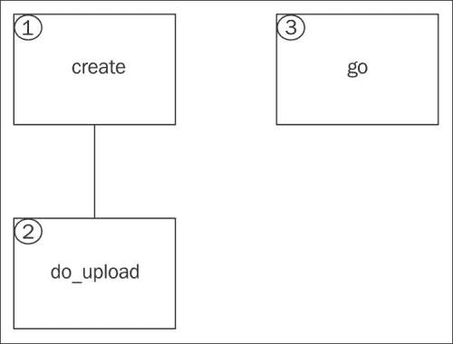
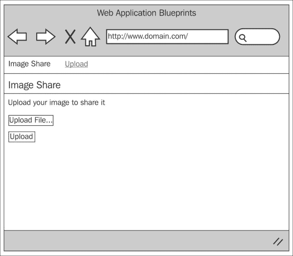
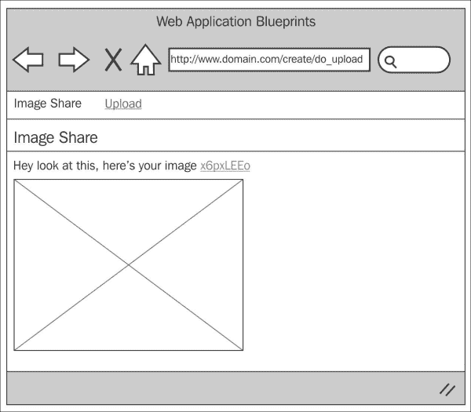
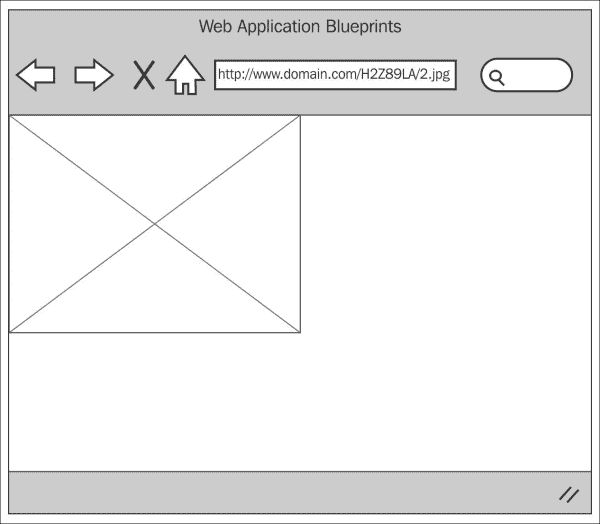

# 第四章。创建照片共享应用程序

目前有很多图像共享网站。它们都具有大致相同的结构：用户上传图像，该图像可以被共享，允许其他人查看该图像。可能对图像的查看设置了限制或约束，可能图像仅在特定时间段内或特定日期内可见，但总体结构是相同的。我很高兴地宣布，这个项目与此完全相同。

我们将创建一个应用程序，允许用户分享图片；这些图片可以通过一个唯一的 URL 访问。为了制作这个应用程序，我们将创建两个控制器：一个用于处理图像上传，另一个用于处理存储图像的查看和显示。

我们将创建一个语言文件来存储文本，以便在需要时支持多种语言。

我们将创建所有必要的视图文件和一个与数据库交互的模型。

然而，这个项目以及本书中的所有其他项目都依赖于我们在第一章中完成的基本设置，*简介和共享项目资源*，尽管你可以将代码的大段内容复制并粘贴到几乎任何你已有的项目中。请记住，第一章中完成的设置是这个章节的基础。

在本章中，我们将涵盖：

+   设计和线框图

+   创建数据库

+   创建模型

+   创建视图

+   创建控制器

+   整合所有内容

所以，无需多言，让我们开始吧。

# 设计和线框图

和往常一样，在我们开始构建之前，我们应该看看我们打算构建什么。

首先，简要描述我们的意图：我们计划构建一个应用程序，允许用户上传图像。该图像将被存储在一个具有唯一名称的文件夹中。还会生成一个包含唯一代码的 URL，该 URL 和代码将被分配给该图像。可以通过该 URL 访问图像。

使用唯一的 URL 来访问该图像的想法是为了我们可以控制对该图像的访问，例如允许图像仅被查看一定次数，或者仅在特定时间段内。

总之，为了更好地了解正在发生的事情，让我们看一下以下网站地图：



所以这就是网站地图。首先要注意的是这个网站有多简单。这个项目只有三个主要区域。让我们逐一了解每个项目，并简要了解它们的功能：

+   **创建**：想象一下这是一个起点。用户将看到一个简单的表单，允许他们上传图像。一旦用户按下上传按钮，他们就会被引导到`do_upload`。

+   **do_upload**：上传的图像会进行大小和文件类型的验证。如果通过验证，则生成一个唯一的八位字符字符串。然后，这个字符串被用作我们将创建的文件夹的名称。这个文件夹位于主 `upload` 文件夹中，上传的图像被保存在其中。然后，图像的详细信息（图像名称、文件夹名称等）传递到数据库模型，为图像 URL 生成另一个唯一的代码。然后，这个唯一的代码、图像名称和文件夹名称被保存到数据库中。

    然后用户会看到一个消息，告知他们图像已上传，并创建了一个 URL。用户还会看到他们上传的图像。

+   **go**：这将接受某人输入浏览器地址栏的 URL、`img src` 标签或其他方法提供的 URL。`go` 项目将查看 URL 中的唯一代码，查询数据库以查看该代码是否存在，如果存在，则获取文件夹名称和图像名称，并将图像返回给调用它的方法。

现在我们对网站的结构和形式有了相当好的了解，让我们来看看每个页面的线框图。

## 创建项目

以下截图显示了上一节中讨论的 `create` 项目的线框图。用户会看到一个简单的表单，允许他们上传图像。



## do_upload 项目

以下截图显示了上一节中讨论的 `do_upload` 项目的线框图。用户会看到他们上传的图像和将其他用户引导到该图像的 URL。



## go 项目

以下截图显示了上一节中描述的 go 项目的线框图。`go` 控制器会从 URL 中获取唯一的代码，尝试在数据库表 images 中找到它，如果找到，则提供与之关联的图像。只提供图像，而不是实际的 HTML 标记。



## 文件概述

这是一个相对较小的项目，总的来说，我们只需要创建七个文件，如下所示：

+   `/path/to/codeigniter/application/models/image_model.php`：这为我们提供了对 `images` 数据库表的读写访问。此模型还会从 `create` 控制器获取上传信息和唯一的文件夹名称（我们将在其中存储上传的图像），并将其存储到数据库中。

+   `/path/to/codeigniter/application/views/create/create.php`：这为我们提供了一个界面，允许用户上传文件。它还会向用户显示任何错误消息，例如文件类型错误、文件大小过大等。

+   `/path/to/codeigniter/application/views/create/result.php`：在图像成功上传后，此页面会向用户显示图像以及查看该图像所需的 URL。

+   `/path/to/codeigniter/application/views/nav/top_nav.php`：在页面顶部提供了一个导航栏。

+   `/path/to/codeigniter/application/controllers/create.php`：这个文件对用户上传的图像进行验证检查，创建一个唯一命名的文件夹来存储上传的图像，并将这些信息传递给模型。

+   `/path/to/codeigniter/application/controllers/go.php`：这个文件对用户输入的 URL 进行验证检查，查找 URL 中的唯一代码并尝试在数据库中找到这个记录。如果找到了，它将显示存储在磁盘上的图像。

+   `/path/to/codeigniter/application/language/english/en_admin_lang.php`：这个文件为应用程序提供语言支持。

前七个文件的文件结构如下：

```php
application/
├── controllers/
│   ├── create.php
│   ├── go.php
├── models/
│   ├── image_model.php
├── views/create/
│   ├── create.php
│   ├── result.php
├── views/nav/
│   ├── top_nav.php
├── language/english/
│   ├── en_admin_lang.php
```

# 创建数据库

好的，你应该已经按照第一章，*简介和共享项目资源*中描述的步骤设置了 CodeIgniter 和 Bootstrap；如果没有，那么你应该知道，本章中的代码是专门针对第一章，*简介和共享项目资源*中的设置编写的。然而，如果你没有这样做，也并非世界末日。代码可以轻松地应用于你独立开发的其它项目和应用程序。

首先，我们将构建数据库。将以下 MySQL 代码复制到你的数据库中：

```php
CREATE DATABASE `imagesdb`;
USE `imagesdb`;

DROP TABLE IF EXISTS `images`;
CREATE TABLE `images` (
  `img_id` int(11) NOT NULL AUTO_INCREMENT,
  `img_url_code` varchar(10) NOT NULL,
  `img_url_created_at` timestamp NOT NULL DEFAULT CURRENT_TIMESTAMP,
  `img_image_name` varchar(255) NOT NULL,
  `img_dir_name` varchar(8) NOT NULL,
  PRIMARY KEY (`img_id`)
) ENGINE=InnoDB AUTO_INCREMENT=1 DEFAULT CHARSET=utf8;
```

好的，让我们来看看每个表中的每一项，看看它们代表什么：

| 表：images |
| --- |
| **元素** | **描述** |
| `img_id` | 这是主键。 |
| `img_url_code` | 这存储了我们用来在数据库中识别图像的唯一代码。 |
| `img_url_created_at` | 这是记录的 MySQL 时间戳。 |
| `img_image_name` | 这是 CodeIgniter 上传功能提供的文件名。 |
| `img_dir_name` | 这是存储图像的目录名称。 |

我们还需要对 `config/database.php` 文件进行修改，即设置数据库访问详情，用户名，密码等。

打开 `config/database.php` 文件，找到以下行：

```php
$db['default']['hostname'] = 'localhost';
$db['default']['username'] = 'your username';
$db['default']['password'] = 'your password';
$db['default']['database'] = 'imagesdb';
```

修改上述代码中的值，确保用你设置和情况更具体的值替换它们——所以输入你的用户名、密码等。

# 调整 config.php 和 autoload.php 文件

在这个项目中，我们实际上不需要调整 `config.php` 文件，因为我们并没有真正使用会话或类似的东西。所以，我们不需要加密密钥或数据库信息。

因此，请确保你不在 `config/autoload.php` 文件中自动加载会话，否则你会得到错误，因为我们没有在 `config/config.php` 文件中设置任何会话变量。

# 调整 routes.php 文件

我们希望将用户重定向到 `create` 控制器而不是默认的 CodeIgniter `welcome` 控制器。为此，我们需要修改 `routes.php` 文件中的默认控制器设置以反映这一点。步骤如下：

1.  打开`config/routes.php`文件进行编辑，并找到以下行（在文件底部附近）：

    ```php
    $route['default_controller'] = "welcome";
    $route['404_override'] = '';
    ```

1.  首先，我们需要更改默认控制器。最初，在 CodeIgniter 应用程序中，默认控制器设置为`welcome`。然而，我们不需要这个，我们希望默认控制器是`create`，所以找到以下行：

    ```php
    $route['default_controller'] = "welcome";
    ```

    用以下行替换它：

    ```php
    $route['default_controller'] = "create";
    $route['404_override'] = '';
    ```

1.  然后我们需要添加一些规则来规范我们如何处理传入的 URL 和表单提交。

    在前两行代码（默认控制器和 404 覆盖）下方留出几行空白，然后添加以下三行代码：

    ```php
    $route['create'] = "create/index";
    $route['(:any)'] = "go/index";
    $route['create/do_upload'] = "create/do_upload";
    ```

# 创建模型

在这个项目中只有一个模型，`image_model.php`。它包含创建和重置密码的特定函数。

创建`/path/to/codeigniter/application/models/image_model.php`文件，并将以下代码添加到其中：

```php
<?php if ( ! defined('BASEPATH')) exit('No direct script access allowed');

class Image_model extends CI_Model {
  function __construct() {
    parent::__construct();
  }

  function save_image($data) {
    do {
      $img_url_code = random_string('alnum', 8); 

      $this->db->where('img_url_code = ', $img_url_code);
      $this->db->from('images');
      $num = $this->db->count_all_results();
    } while ($num >= 1);

    $query = "INSERT INTO `images` (`img_url_code`, `img_image_name`, `img_dir_name`) VALUES (?,?,?) ";
    $result = $this->db->query($query, array($img_url_code, $data['image_name'], $data['img_dir_name']));

    if ($result) {
      return $img_url_code;
    } else {
      return flase;
    }
  }

function fetch_image($img_url_code) {
    $query = "SELECT * FROM `images` WHERE `img_url_code` = ? ";
    $result = $this->db->query($query, array($img_url_code));

    if ($result) {
      return $result;
    } else {
      return false;
    }
  }
}
```

在这个模型中有两个主要函数，如下所示：

+   `save_image()`：这生成一个与上传图像关联的唯一代码，并将图像名称和文件夹名称保存到数据库中。

+   `fetch_image()`: 这根据提供的唯一代码从数据库中获取图像的详细信息。

好的，让我们先来看`save_image()`。`save_image()`函数接受来自`create`控制器的一个数组，包含`image_name`（来自上传过程）和`img_dir_name`（这是图像存储的文件夹）。

使用如下所示的`do…while`循环生成一个唯一的代码：

```php
$img_url_code = random_string('alnum', 8); 
```

首先创建一个包含字母数字字符的八字符长字符串。`do…while`循环检查此代码是否已在数据库中存在，如果已存在，则生成新的代码。如果它不存在，则使用此代码：

```php
do {
  $img_url_code = random_string('alnum', 8); 

  $this->db->where('img_url_code = ', $img_url_code);
  $this->db->from('images');
  $num = $this->db->count_all_results();
} while ($num >= 1);
```

然后使用以下代码将此代码和`$data`数组的内容保存到数据库中：

```php
$query = "INSERT INTO `images` (`img_url_code`, `img_image_name`, `img_dir_name`) VALUES (?,?,?) ";
$result = $this->db->query($query, array($img_url_code, $data['image_name'], $data['img_dir_name']));
```

如果`INSERT`操作成功，则返回`$img_url_code`，如果失败，则返回`false`。实现此目的的代码如下：

```php
if ($result) {
  return $img_url_code;
} else {
  return false;
}
```

# 创建视图

在这个项目中只有三个视图，如下所示：

+   `/path/to/codeigniter/application/views/create/create.php`: 这向用户显示一个表单，允许他们上传图像。

+   `/path/to/codeigniter/application/views/create/result.php`: 这显示一个用户可以使用它将其他人转发到图像的链接，以及图像本身。

+   `/path/to/codeigniter/application/views/nav/top_nav.php`: 这显示顶层菜单。在这个项目中，它非常简单，包含项目名称和一个链接，可以跳转到`create`控制器。

所以，这就是我们的视图，正如我所说的，由于这是一个简单的项目，所以只有三个视图。现在，让我们创建每个视图文件。

1.  创建`/path/to/codeigniter/application/views/create/create.php`文件，并将以下代码添加到其中：

    ```php
    <div class="page-header">
      <h1><?php echo $this->lang->line('system_system_name'); ?></h1>
    </div>

    <p><?php echo $this->lang->line('encode_instruction_1'); ?></p>

      <?php echo validation_errors(); ?>

    <?php if (isset($success) && $success == true) : ?>
      <div class="alert alert-success">
        <strong><?php echo $this->lang->line('common_form_elements_success_notifty'); ?></strong><?php echo $this->lang->line('encode_encode_now_success'); ?> 
      </div>
    <?php endif ; ?>

    <?php if (isset($fail) && $fail == true) : ?>
      <div class="alert alert-danger">
        <strong><?php echo $this->lang->line('common_form_elements_error_notifty'); ?> </strong><?php echo $this->lang->line('encode_encode_now_error'); ?>
        <?php echo $fail ; ?> 
      </div>
    <?php endif ; ?>

    <?php echo form_open_multipart('create/do_upload');?>
      <input type="file" name="userfile" size="20" />
      <br />
      <input type="submit" value="upload" />
    <?php echo form_close() ; ?>
    <br />
    <?php if (isset($result) && $result == true) : ?>
      <div class="alert alert-info">
        <strong><?php echo $this->lang->line('encode_upload_url'); ?> </strong> 
        <?php echo anchor($result, $result) ; ?>
      </div>
    <?php endif ; ?>
    ```

    这个视图文件可以被认为是主视图文件；在这里，用户可以上传他们的图像。错误信息也在这里显示。

1.  创建 `/path/to/codeigniter/application/views/create/result.php` 文件，并将以下代码添加到其中：

    ```php
    <div class="page-header">
      <h1><?php echo $this->lang->line('system_system_name'); ?></h1>
    </div>

    <?php if (isset($result) && $result == true) : ?>
        <strong><?php echo $this->lang->line('encode_encoded_url'); ?> </strong> 
        <?php echo anchor($result, $result) ; ?>
        <br />
        " />
    <?php endif ; ?>
    ```

    此视图将向用户显示编码后的图片资源 URL（以便他们可以复制和分享），以及实际的图片本身。

1.  创建 `/path/to/codeigniter/application/views/nav/top_nav.php` 文件，并将以下代码添加到其中：

    ```php
    <!-- Fixed navbar -->
    <div class="navbar navbar-inverse navbar-fixed-top" role="navigation">
      <div class="container">
        <div class="navbar-header">
          <button type="button" class="navbar-toggle" data-toggle="collapse" data-target=".navbar-collapse">
            <span class="sr-only">Toggle navigation</span>
            <span class="icon-bar"></span>
            <span class="icon-bar"></span>
            <span class="icon-bar"></span>
          </button>
          <a class="navbar-brand" href="#"><?php echo $this->lang->line('system_system_name'); ?></a>
        </div>
        <div class="navbar-collapse collapse">
          <ul class="nav navbar-nav">
            <li class="active"><?php echo anchor('create', 'Create') ; ?></li>
          </ul>
        </div><!--/.nav-collapse -->
      </div>
    </div>

    <div class="container theme-showcase" role="main">
    ```

    此视图相当基础，但仍然发挥着重要作用。它显示了一个返回到 `create` 控制器的 `index()` 函数的选项。

# 创建控制器

在这个项目中，我们将创建两个控制器，如下所示：

+   `/path/to/codeigniter/application/controllers/create.php`：此文件处理创建用于存储图片的唯一文件夹，并执行文件的上传。

+   `/path/to/codeigniter/application/controllers/go.php`：此文件从数据库中检索唯一代码，并返回与该代码关联的任何图片。

这些是我们为该项目创建的两个控制器，现在让我们继续创建它们。

创建 `/path/to/codeigniter/application/controllers/create.php` 文件，并将以下代码添加到其中：

```php
<?php if (!defined('BASEPATH')) exit('No direct script access allowed');

class Create extends MY_Controller {
  function __construct() {
    parent::__construct();
      $this->load->helper(array('string'));
      $this->load->library('form_validation');
      $this->load->library('image_lib');
      $this->load->model('Image_model');
      $this->form_validation->set_error_delimiters('<div class="alert alert-danger">', '</div>');
    }

  public function index() {
    $page_data = array('fail' => false,
                       'success' => false); 
    $this->load->view('common/header');
    $this->load->view('nav/top_nav');
    $this->load->view('create/create', $page_data);
    $this->load->view('common/footer');
  }

  public function do_upload() {
    $upload_dir = '/filesystem/path/to/upload/folder/';
    do {
      // Make code
      $code = random_string('alnum', 8); 

      // Scan upload dir for subdir with same name
      // name as the code
      $dirs = scandir($upload_dir);

      // Look to see if there is already a 
      // directory with the name which we 
      // store in $code 
      if (in_array($code, $dirs)) { // Yes there is
        $img_dir_name = false; // Set to false to begin again
      } else { // No there isn't
        $img_dir_name = $code; // This is a new name
      }

    } while ($img_dir_name == false);

    if (!mkdir($upload_dir.$img_dir_name)) {
      $page_data = array('fail' => $this->lang->line('encode_upload_mkdir_error'),
                         'success' => false);
      $this->load->view('common/header');
      $this->load->view('nav/top_nav');
      $this->load->view('create/create', $page_data);
      $this->load->view('common/footer');
    }

    $config['upload_path'] = $upload_dir.$img_dir_name;
    $config['allowed_types'] = 'gif|jpg|jpeg|png';
    $config['max_size'] = '10000';
    $config['max_width']  = '1024';
    $config['max_height']  = '768';

    $this->load->library('upload', $config);

    if ( ! $this->upload->do_upload()) {
      $page_data = array('fail' => $this->upload->display_errors(),
                         'success' => false);
      $this->load->view('common/header');
      $this->load->view('nav/top_nav');
      $this->load->view('create/create', $page_data);
      $this->load->view('common/footer');
    } else {
      $image_data = $this->upload->data();
      $page_data['result'] = $this->Image_model->save_image(array('image_name' => $image_data['file_name'], 'img_dir_name' => $img_dir_name));
      $page_data['file_name'] = $image_data['file_name'];
      $page_data['img_dir_name'] = $img_dir_name;

      if ($page_data['result'] == false) {
        // success - display image and link
        $page_data = array('fail' => $this->lang->line('encode_upload_general_error'));
        $this->load->view('common/header');
        $this->load->view('nav/top_nav');
        $this->load->view('create/create', $page_data);
        $this->load->view('common/footer');
      } else {
        // success - display image and link
        $this->load->view('common/header');
        $this->load->view('nav/top_nav');
        $this->load->view('create/result', $page_data);
        $this->load->view('common/footer');
      }
    }
  }
}
```

让我们从 `index()` 函数开始。`index()` 函数将 `$page_data` 数组的 `fail` 和 `success` 元素设置为 `false`。这将阻止任何初始消息显示给用户。加载视图，特别是 `create/create.php` 视图，其中包含图片上传表单的 HTML 标记。

当用户在 `create/create.php` 中提交表单后，表单将被提交到 `create` 控制器的 `do_upload()` 函数。正是这个函数负责将图片上传到服务器。

首先，`do_upload()` 定义了 `upload` 文件夹的初始位置。这存储在 `$upload_dir` 变量中。

接下来，我们进入一个 `do…while` 结构。它看起来像这样：

```php
do {
// something
} while ('…a condition is not met');
```

这意味着 *在条件不满足的情况下执行某些操作*。现在考虑到这一点，思考我们的问题——我们必须将上传的图片保存到一个文件夹中。这个文件夹必须有一个唯一的名称。所以我们将生成一个包含八个字母数字字符的随机字符串，然后查看是否存在具有该名称的文件夹。考虑到这一点，让我们详细查看代码：

```php
do {
  // Make code
  $code = random_string('alnum', 8); 

  // Scan uplaod dir for subdir with same name
  // name as the code
  $dirs = scandir($upload_dir);

  // Look to see if there is already a 
  // directory with the name which we 
  // store in $code 
  if (in_array($code, $dirs)) { // Yes there is
    $img_dir_name = false; // Set to false to begin again
  } else { // No there isn't
    $img_dir_name = $code; // This is a new name
  }
} while ($img_dir_name == false);
```

因此，我们使用以下代码行创建一个只包含字母数字字符的八个字符的字符串：

```php
$code = random_string('alnum', 8);
```

然后，我们使用 PHP 函数 `scandir()` 在 `$upload_dir` 中查找。这将存储所有目录名称在 `$dirs` 变量中，如下所示：

```php
$dirs = scandir($upload_dir);
```

我们随后使用 PHP 函数 `in_array()` 在 `scandir()` 的目录列表中查找 `$code` 中的值。

如果我们没有找到匹配项，那么 `$code` 中的值不应被采用，因此我们将采用那个值。如果找到了值，那么我们将 `$img_dir_name` 设置为 `false`，这将由 `do…while` 循环的最后一行捕获：

```php
...
} while ($img_dir_name == false);
```

不管怎样，现在我们已经有了我们的唯一文件夹名称，我们将尝试创建它。我们使用 PHP 函数 `mkdir()`，将其传递给 `$upload_dir` 与 `$img_dir_name` 连接的结果。如果 `mkdir()` 返回 `false`，则表单将再次显示，并显示语言文件中设置的 `encode_upload_mkdir_error` 消息，如下所示：

```php
if (!mkdir($upload_dir.$img_dir_name)) {
  $page_data = array('fail' => $this->lang->line('encode_upload_mkdir_error'),
                     'success' => false);
  $this->load->view('common/header');
  $this->load->view('nav/top_nav');
  $this->load->view('create/create', $page_data);
  $this->load->view('common/footer');
}
```

一旦创建了文件夹，我们就设置上传过程的配置变量，如下所示：

```php
$config['upload_path'] = $upload_dir.$img_dir_name;
$config['allowed_types'] = 'gif|jpg|jpeg|png';
$config['max_size'] = '10000';
$config['max_width']  = '1024';
$config['max_height']  = '768';
```

在这里，我们指定我们只想上传 `.gif`、`.jpg`、`.jpeg` 和 `.png` 文件。我们还指定图片大小不能超过 10,000 KB（尽管你可以将其设置为任何你想要的值——记得调整你的 `php.ini` 文件中的 `upload_max_filesize` 和 `post_max_size` PHP 设置，如果你想上传非常大的文件）。

我们还设置了图像必须的最小尺寸。与文件大小一样，你可以根据需要调整它。

然后，我们加载 `upload` 库，并传递给它的配置设置，如下所示：

```php
$this->load->library('upload', $config);
```

接下来，我们将尝试上传。如果上传失败，CodeIgniter 函数 `$this->upload->do_upload()` 将返回 `false`。我们将寻找这个返回值，并在它返回 `false` 时重新加载上传页面。我们还将传递具体的错误原因，为什么它失败了。这个错误存储在 `$page_data` 数组的 `fail` 项中。可以按照以下方式完成：

```php
    if ( ! $this->upload->do_upload()) {
      $page_data = array('fail' => $this->upload->display_errors(),
                         'success' => false);
      $this->load->view('common/header');
      $this->load->view('nav/top_nav');
      $this->load->view('create/create', $page_data);
      $this->load->view('common/footer');
    } else {
...
```

然而，如果没有失败，我们将从上传中获取 CodeIgniter 生成的信息。我们将按照以下方式将其存储在 `$image_data` 数组中：

```php
$image_data = $this->upload->data();
```

然后，我们尝试在数据库中存储上传记录。我们调用 `Image_model` 的 `save_image` 函数，将其 `file_name` 从 `$image_data` 数组中传递给它，以及 `$img_dir_name`，如下所示：

```php
$page_data['result'] = $this->Image_model->save_image(array('image_name' => $image_data['file_name'], 'img_dir_name' => $img_dir_name));
```

然后，我们测试 `save_image()` 函数的返回值；如果成功，则 `Image_model` 将返回模型中生成的唯一 URL 代码。如果失败，则 `Image_model` 将返回布尔值 `false`。

如果返回 `false`，则表单将加载一个通用错误。如果成功，则加载 `create/result.php` 视图文件。我们向其中传递唯一的 URL 代码（用户需要的链接），以及文件夹名称和图像名称，这是正确显示图像所必需的。

创建 `/path/to/codeigniter/application/controllers/go.php` 文件，并向其中添加以下代码：

```php
<?php if (!defined('BASEPATH')) exit('No direct script access allowed');

class Go extends MY_Controller {
  function __construct() {
  parent::__construct();
    $this->load->helper('string');
  }

  public function index() {
    if (!$this->uri->segment(1)) {
      redirect (base_url());
    } else {
      $image_code = $this->uri->segment(1);
      $this->load->model('Image_model');
      $query = $this->Image_model->fetch_image($image_code);

      if ($query->num_rows() == 1) {
        foreach ($query->result() as $row) {
          $img_image_name = $row->img_image_name;
          $img_dir_name = $row->img_dir_name;
        }

        $url_address = base_url() . 'upload/' . $img_dir_name .'/' . $img_image_name;
        redirect (prep_url($url_address));
      } else {
        redirect('create');
      }
    }
  }
}
```

`go` 控制器只有一个主函数，`index()`。当用户点击 URL 或调用 URL（可能是 HTML `img` 标签的 `src` 值）时，它会调用。在这里，我们获取在 `create` 控制器上传图片时生成的并分配给图片的唯一代码。

此代码位于 URI 的第一个值中。通常它将占用第三个参数——第一个和第二个参数通常用于分别指定控制器和控制器函数。然而，我们使用 CodeIgniter 路由改变了这种行为。这在本章的 *调整 routes.php 文件* 部分有详细解释。

一旦我们有了唯一的代码，我们就将其传递给 `Image_model` 的 `fetch_image()` 函数：

```php
$image_code = $this->uri->segment(1);
$this->load->model('Image_model');
$query = $this->Image_model->fetch_image($image_code);
```

我们检查返回的内容。我们询问返回的行数是否正好等于 `1`。如果不是，我们将重定向到 `create` 控制器。

可能你不想这样做。如果返回的行数不等于 `1`，可能你什么也不做。例如，如果请求的图片在 HTML `img` 标签中，那么如果找不到图片，重定向可能会将某人从他们正在查看的网站发送到本项目的上传页面——这可能是你不希望发生的事情。如果你想移除此功能，请从代码摘录中删除以下加粗行：

```php
....
        $img_dir_name = $row->img_dir_name;
        }

        $url_address = base_url() . 'upload/' . $img_dir_name .'/' . $img_image_name;
        redirect (prep_url($url_address));
      } else {
        redirect('create');
      }
    }
  }
}
....
```

不管怎样，如果返回的值正好是 `1`，那么我们将遍历返回的数据库对象，找到 `img_image_name` 和 `img_dir_name`，这些是我们需要在磁盘上的 `upload` 文件夹中定位图片所需的。这可以按以下方式完成：

```php
foreach ($query->result() as $row) {
  $img_image_name = $row->img_image_name;
  $img_dir_name = $row->img_dir_name;
}
```

我们构建图片文件的地址，并将浏览器重定向到该地址，如下所示：

```php
$url_address = base_url() . 'upload/' . $img_dir_name .'/' . $img_image_name;
redirect (prep_url($url_address));
```

# 创建语言文件

与本书中的所有项目一样，我们正在使用语言文件向用户提供文本。这样，您可以启用多区域/多语言支持。

创建 `/path/to/codeigniter/application/language/english/en_admin_lang.php` 文件，并向其中添加以下代码：

```php
<?php if (!defined('BASEPATH')) exit('No direct script access allowed');

// General
$lang['system_system_name'] = "Image Share";

// Upload
$lang['encode_instruction_1'] = "Upload your image to share it";
$lang['encode_upload_now'] = "Share Now";
$lang['encode_upload_now_success'] = "Your image was uploaded, you can share it with this URL";
$lang['encode_upload_url'] = "Hey look at this, here's your image:";
$lang['encode_upload_mkdir_error'] = "Cannot make temp folder";
$lang['encode_upload_general_error'] = "The Image cannot be saved at this time";
```

# 将所有内容整合在一起

让我们看看用户是如何上传图片的。以下是事件发生的顺序：

1.  CodeIgniter 在 `routes.php` 配置文件中查找，并找到以下行：

    ```php
    $route['create'] = "create/index";
    ```

    它将请求重定向到 `create` 控制器的 `index()` 函数。

1.  `index()` 函数加载 `create/create.php` 视图文件，向用户显示上传表单。

1.  用户点击选择文件按钮，导航到他们想要上传的图片文件，并选择它。

1.  用户点击上传按钮，表单提交到 `create` 控制器的 `index()` 函数。

1.  `index()` 函数在主 `upload` 目录中创建一个文件夹以存储图片，然后执行实际的上传。

1.  在上传成功后，`index()` 将上传的详细信息（新的文件夹名称和图像名称）发送到 `save_image()` 模型函数。

1.  `save_model()` 函数还创建一个唯一的代码，并将其与通过 `create` 控制器传递给它的文件夹名称和图像名称一起保存在 `images` 表中。

1.  在数据库插入期间生成的唯一代码随后返回到控制器，并传递给结果视图，它将形成用户成功消息的一部分。

现在，让我们看看如何查看（或检索）图片。以下是事件发生的顺序：

1.  一个具有 `www.domain.com/226KgfYH` 语法格式的 URL 进入应用程序——无论是有人点击链接还是其他调用（``）

1.  ```php` CodeIgniter looks in the `routes.php` config file and finds the following line:  ``` `$route['(:any)'] = "go/index"; ```php ````

1.  由于传入的请求不匹配其他两个路由，因此前面的路由是 CodeIgniter 应用到此请求的路由。

1.  ``调用`go`控制器，并将`226KgfYH`代码作为`uri`的第一个段传递给它。```

1.  ```go`控制器将此传递给`Image_model.php`文件中的`fetch_image()`函数。`fetch_image()`函数将尝试在数据库中找到匹配的记录。如果找到，它将返回文件夹名称，标记图像的保存位置及其文件名。```

1.  ``返回此信息，并构建该图像的路径。CodeIgniter 随后将用户重定向到该图像，即向请求该图像的用户提供该图像资源。```

``# 摘要    因此，我们有一个基本的图像共享应用程序。它能够接受各种图像，并将它们分配到数据库中的记录和文件系统中的唯一文件夹中。这很有趣，因为它为你留下了改进的空间。例如，你可以做以下事情：    *   你可以添加查看限制。由于图像记录存储在数据库中，你可以调整数据库。添加名为`img_count`和`img_count_limit`的两列，你可以允许用户为每张图像设置查看次数的限制，并在达到该限制时停止提供该图像。 *   你可以根据日期限制查看次数。类似于前面的点，但你可以将图像查看次数限制在特定日期。 *   你可以为不同尺寸提供不同的 URL。你可以添加功能，根据初始上传创建多个尺寸的图像，为不同的图像尺寸提供多个不同的 URL。 *   你可以报告滥用。你可以添加一个选项，允许图像查看者报告可能被上传的不当图像。 *   你可以设置服务条款。如果你计划提供此类应用程序作为公众可以使用的实际网络服务，那么我强烈建议你添加一份服务条款文档，甚至可能要求人们在上传图像之前同意条款。在那些条款中，你将想要提到，为了使用该服务，人们首先必须同意他们不会上传和分享任何可能被视为非法的图像。你还应提到，如果需要，你将配合任何法院。你真的不希望因为拥有或运营一个存储令人不快的图像的网络服务而陷入麻烦；尽可能明确地说明你的责任限制，并强调是上传者提供了图像。在下一章中，我们将创建一个新闻通讯注册系统。你将能够让人们注册，并将他们的详细信息存储在数据库中。人们将被允许取消订阅和选择不同的设置。```
