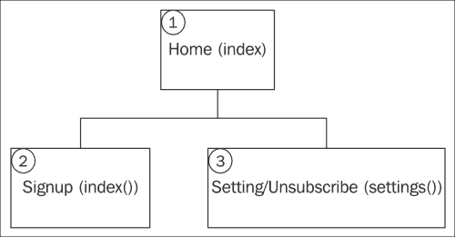
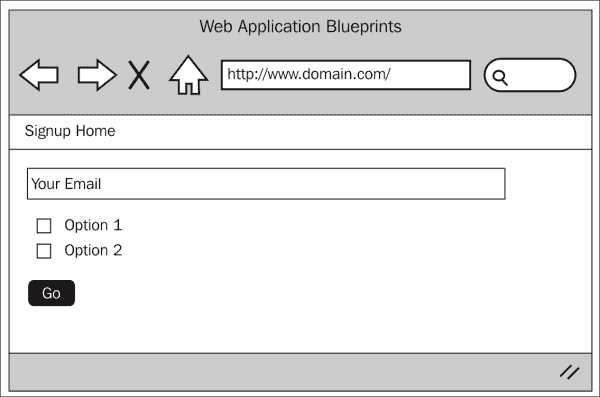
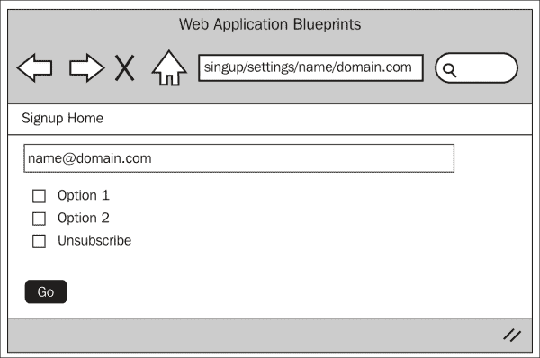

# 第五章 创建通讯订阅

通讯订阅是一个相当方便的应用程序；你可以很容易地适应它以适应大多数应用程序，而无需太多麻烦。它使你能够拥有一个订阅者数据库，并管理他们，编辑他们的设置，如果他们选择取消订阅，则从数据库中删除他们。

在本章中，我们将涵盖：

+   设计和线框图

+   创建数据库

+   创建模型

+   创建视图

+   创建控制器

+   整合所有内容

# 简介

在这个项目中，我们将创建一个应用程序，允许用户注册订阅通讯。将显示一个表单，邀请用户输入他们的电子邮件地址，然后定义一些设置以提交该表单。它还将允许订阅者更改他们的设置，甚至完全取消订阅。

要创建此应用程序，我们将创建一个控制器。这将处理项目的所有部分：订阅、编辑设置和取消订阅。

我们将创建一个语言文件来存储文本，以便在需要时提供多语言支持。

我们将创建所有必要的视图文件和一个与数据库交互的模型。

然而，这个应用程序，以及本书中的所有其他应用程序，都依赖于我们在第一章中做的基本设置，*简介和共享项目资源*。虽然你可以将大量代码复制并粘贴到几乎任何你已有的应用程序中，但请记住，第一章中做的设置是这个章节的基础。

因此，无需多言，让我们开始吧。

# 设计和线框图

正如往常一样，在我们开始构建之前，我们应该看看我们计划构建的内容。

首先，让我们简要了解一下我们的意图：我们计划构建一个应用程序，允许人们注册一个联系人数据库，该数据库将用作通讯订阅数据库。我们将通过注册他们的电子邮件地址和一些选项来启用用户订阅。这些信息将被保存在数据库中。

我们还将允许人们修改他们的设置，如果他们希望的话，甚至可以取消订阅。

总之，为了更好地了解正在发生的事情，让我们看一下以下网站地图：



所以，这就是网站地图；首先要注意的是这个网站是多么简单。在这个项目中只有三个主要区域。让我们逐一了解每个项目，并简要了解它们的功能：

+   **首页**：这是初始着陆区域。`index()` 函数负责向用户显示一个表单，邀请他们订阅。

+   **注册**：这个处理表单输入的验证，并将验证成功的数据（如果验证成功）传递给 `add()` 模型函数。

+   **设置/取消订阅**：它接受用户的电子邮件地址作为第三个和第四个`uri`参数，并向订阅者显示一个表单。此表单包含分配给提供的电子邮件地址的设置。用户可以修改这些设置，如果他们希望的话，还可以取消订阅。

现在我们对网站的结构和形式有了相当好的了解，让我们来看看每个页面的线框。

## 主页 – index() 和注册 – index() 项目

以下截图显示了前图中第**1**点（主页(`index()`)项目）和第 2 点（注册(`index()`)项目）的线框。用户在 HTML 中看到一个名为`signup_email`的文本框，以及两个名为`signup_opt1`和`signup_opt2`的复选框。

### 小贴士

这些选项只是一个例子；如果你愿意，它们可以被删除或修改。它们旨在作为新闻通讯的过滤器。例如，你可以包括频率选项，提供每周、每月或每季度的选项。当你发送新闻通讯时，你只会根据这些选项向订阅者发送新闻通讯——就像我说的，你可以更改它们，添加更多，或者如果你愿意，可以不添加任何选项。

用户可以像以下截图所示输入他们的电子邮件地址，应用他们可能希望添加的任何选项，并提交表单。表单将被提交到`signup`控制器的`index()`函数，该函数将验证这些数据。通过验证后，`Signup_model`的`add()`函数将在`signups`数据库表中创建记录。



## 设置/取消订阅 – settings()

以下截图显示了网站地图图中第**3**点（设置/取消订阅(`settings()`)项目）的线框。用户会看到一个预先填写了他们设置的表单。



我们能够获取正确的详细信息是因为 URL。用户的电子邮件地址作为 URL 的第三和第四部分出现在其中。

当用户点击取消订阅链接时，页面会被加载——可能是在一封电子邮件中。这个链接的 URL 将采用`http://www.domain.com/signup/settings/name/domain.com`格式。

你会注意到我们并没有使用`http://www.domain.com/signup/settings/name@domain.com`格式。

在第二个 URL 中，你可以看到`@`字符；在第一个中，你可以看到该字符被斜杠替换。实际上，我们已经将电子邮件地址的第一部分（`@`之前的所有内容）转换成了第三个`uri`参数，而`uri`的第四个参数来自电子邮件地址的第二部分（`@`之后的所有内容）。

由于安全原因，我们无法在 URL 中使用`@`字符，因此不能有`http://www.domain.com/signup/settings/name@domain.com`这样的 URL。这是 CodeIgniter 的默认行为：出于减少恶意脚本或命令运行机会的考虑，某些字符不允许出现在 URL 中。

## 文件概览

这是一个相对较小的项目，总的来说，我们只需要创建六个文件。具体如下：

+   `/path/to/codeigniter/application/models/signup_model.php`：这提供对数据库的读写访问。

+   `/path/to/codeigniter/application/views/signup/signup.php`：这向用户显示一个小表单，邀请他们输入他们的电子邮件地址并检查两个复选框：**选项 1**和**选项 2**。你可以修改这些选项，添加更多或完全删除它们。这些选项旨在帮助注册的人定义他们希望从应用程序中获得哪些信息。

+   `/path/to/codeigniter/application/views/signup/settings.php`：这向用户显示一个小表单，显示他们当前的应用程序设置。

+   `/path/to/codeigniter/application/views/nav/top_nav.php`：这为页面顶部提供导航栏。

+   `/path/to/codeigniter/application/controllers/signup.php`：这个文件包含所有必要的函数，用于注册新订阅者并修改他们的账户详情。此控制器还处理任何退订请求。

+   `/path/to/codeigniter/application/language/english/en_admin_lang.php`：这为应用程序提供语言支持。

前六个文件的文件结构如下：

```php
application/
├── controllers/
│   ├── signup.php
├── models/
│   ├── signup_model.php
├── views/signup/
│   ├── signup.php
│   ├── settings.php
├── views/nav/
│   ├── top_nav.php
├── language/english/
│   ├── en_admin_lang.php
```

# 创建数据库

好的，你应该已经按照第一章中描述的设置了 CodeIgniter 和 Bootstrap，*简介和共享项目资源*。如果没有，那么你应该知道，本章中的代码是专门针对第一章中的设置编写的。然而，如果你没有这样做，也不是世界末日；代码可以轻松地应用于其他情况。

首先，我们将构建数据库。将以下 MySQL 代码复制到你的数据库中：

```php
CREATE DATABASE `signupdb`;
USE DATABASE `signupdb`;

CREATE TABLE `signups` (
  `signup_id` int(11) NOT NULL AUTO_INCREMENT,
  `signup_email` varchar(255) NOT NULL,
  `signup_opt1` int(1) NOT NULL,
  `signup_opt2` int(1) NOT NULL,
  `signup_active` int(1) NOT NULL,
  `signup_created_at` timestamp NOT NULL DEFAULT CURRENT_TIMESTAMP,
  PRIMARY KEY (`signup_id`)
) ENGINE=InnoDB AUTO_INCREMENT=1 DEFAULT CHARSET=utf8;
```

对，让我们看一下表格中的每一项，看看它代表什么：

| 表格：注册信息 |
| --- |
| **元素** | **描述** |
| `signup_id` | 这是主键。 |
| `signup_email` | 这显示了用户的电子邮件地址。 |
| `signup_opt1` | 这在`views/signup/signup.php`文件中存储用户对选项 1 的选择。 |
| `signup_opt2` | 这在`views/signup/signup.php`文件中存储用户对选项 2 的选择。 |
| `signup_active` | 这是一种软删除。在本章的应用程序中目前不支持，但如果你希望使用它，可以这样做。 |
| `signup_created_at` | 这是表行创建日期的 MySQL 时间戳。 |

我们还需要对`config/database.php`文件进行修改，即设置数据库访问详情、用户名、密码等：

1.  打开`config/database.php`文件，找到以下行：

    ```php
    $db['default']['hostname'] = 'localhost';
    $db['default']['username'] = 'your username';
    $db['default']['password'] = 'your password';
    $db['default']['database'] = 'signupdb';
    ```

1.  编辑前面的值，确保用更具体于您设置和情况的值替换这些值——因此输入您的用户名、密码等。

# 调整 routes.php 文件

我们希望将用户重定向到`signup`控制器而不是默认的 CodeIgniter `welcome`控制器。为此，我们需要修改`routes.php`文件中的默认控制器设置。

打开`config/routes.php`文件进行编辑，并找到以下行（文件底部附近）：

```php
$route['default_controller'] = "welcome";
$route['404_override'] = '';
```

首先，我们需要更改默认控制器。最初，在 CodeIgniter 应用程序中，默认控制器设置为`welcome`。然而，我们不需要这个，我们希望默认控制器是`signup`。所以，找到以下行：

```php
$route['default_controller'] = "welcome";
```

将前面的行替换为以下内容：

```php
$route['default_controller'] = "signup";
$route['404_override'] = '';
```

# 创建模型

在此项目中只有一个模型——`signup_model.php`，它包含将订阅者添加到数据库、修改其设置以及处理订阅者取消订阅时移除订阅者的特定功能。

这是本项目唯一的模型。让我们简要地回顾一下其中的每个函数，以了解其一般功能，然后我们将更详细地讨论代码。

在此模型中有四个主要功能，具体如下：

+   `add()`: 这个函数接受一个参数：当用户在`views/signup/signup.php`中的表单提交成功时，由`signup`控制器的`index()`函数发送的`$data`数组。`add()`函数接收数组，并使用`$this->db->insert()`CodeIgniter Active Record 函数，将用户的注册数据插入到`signups`表中。

+   `edit()`: 这个函数接受一个参数：由`signup`控制器的`settings()`函数发送的`$data`数组。此函数仅在用户编辑设置而不是取消订阅时调用。`edit()`函数将更新用户的个人资料。

+   `delete()`: 这个函数接受一个参数：由`signup`控制器的`settings()`函数发送的`$data`数组。此函数仅在用户取消订阅而不是编辑设置时调用。如果删除成功，函数将返回`true`，如果不成功，则返回`false`。

+   `get_settings()`: 这个函数接受一个参数：由`signup`控制器的`settings()`函数发送的`$data`数组。设置表单需要用正确的数据填充所需的电子邮件地址，而`get_settings()`提供这些信息。

这只是一个简要概述，所以让我们创建模型并讨论其功能。

创建`/path/to/codeigniter/application/models/signup_model.php`文件，并将以下代码添加到其中：

```php
<?php if ( ! defined('BASEPATH')) exit('No direct script access allowed'); 

class Signup_model extends CI_Model { 
  function __construct() { 
    parent::__construct(); 
  } 
```

以下代码片段使用 `$this->db->insert()` CodeIgniter Active Record 函数将订阅者添加到数据库中。这个函数由 `signup` 控制器的 `index()` 函数调用。它接受一个名为 `$data` 的数组；这个数组是用户在 `views/signup/signup.php` 表单中提交的经过验证的表单输入。在成功写入数据库的情况下，它将返回 `true`；如果发生错误，它将返回 `false`：

```php
  public function add($data) { 
    if ($this->db->insert('signups', $data)) {
      return true;
    } else {
      return false;
    }
  } 
```

以下代码片段使用 `$this->db->update()` CodeIgniter Active Record 函数在 `signups` 数据库表上执行更新操作。它接受一个名为 `$data` 的数组。这个数组是用户在 `views/signup/settings.php` 表单中提交的经过验证的表单输入。在成功更新的情况下，它将返回 `true`；如果发生错误，它将返回 `false`：

```php
public function edit($data) {
  $this->db->where('signup_email', $data['signup_email']);
  if ($this->db->update('signups', $data)) {
    return true;
  } else {
    return false;
  }
}
```

以下代码片段使用 `$this->db->delete()` CodeIgniter Active Record 函数在 `signups` 数据库表上执行删除操作。它接受一个名为 `$data` 的数组。这个数组是用户在 `views/signup/settings.php` 表单中提交的经过验证的表单输入，只包含订阅者的电子邮件地址。在成功删除的情况下，它将返回 `true`；如果发生错误，它将返回 `false`：

```php
public function delete($data) {
  $this->db->where('signup_email', $data['signup_email']);
  if ($this->db->delete('signups')) {
    return true;
  } else {
    return false;
  }
}
```

以下代码片段使用 `$this->db->get()` CodeIgniter Active Record 函数在 `signups` 数据库表上执行选择操作。它接受一个名为 `$email` 的变量。这是订阅者的格式化电子邮件地址。此函数返回一个订阅者的数据库记录。这是 `signup` 控制器的 `settings()` 函数所必需的，以便预先填充表单项。在成功选择的情况下，它将返回一个数据库结果对象；如果发生错误，它将返回 `false`：

```php
  public function get_settings($email) {
    $this->db->where('signup_email', $email);
    $query = $this->db->get('signups');
    if ($query) {
      return $query;
    } else {
      return false;
    }
  }
}
```

如您所见，模型相当直接且简洁，因此现在让我们看看视图。

# 创建视图

在这个项目中，有三个视图，具体如下：

+   `/path/to/codeigniter/application/views/signup/signup.php`：此文件向用户显示一个表单，允许他们将自己的电子邮件地址注册到项目中。

+   `/path/to/codeigniter/application/views/signup/settings.php`：此文件向用户显示一个表单，允许他们修改偏好设置，如果他们愿意，还可以取消订阅。

+   `/path/to/codeigniter/application/views/nav/top_nav.php`：此文件显示顶层菜单。在这个项目中，这个文件非常简单，因此它只包含一个链接，用于返回到 `index()` 函数。

这是对观点的良好概述。现在让我们逐一过目，构建代码，并讨论它们的功能：

1.  创建 `/path/to/codeigniter/application/views/signup/signup.php` 文件，并向其中添加以下代码：

    ```php
    <div class="row row-offcanvas row-offcanvas-right">
      <div class="col-xs-12 col-sm-9">
        <div class="row">
          <?php echo validation_errors(); ?> 
          <?php echo form_open('/signup') ; ?>
          <?php echo form_input($signup_email); ?><br /> 
          <?php echo form_checkbox($signup_opt1) . $this->lang->line('signup_opt1'); ?><br /> 
          <?php echo form_checkbox($signup_opt2) . $this->lang->line('signup_opt2'); ?><br />
          <?php echo form_submit('', $this->lang->line('common_form_elements_go'), 'class="btn btn-success"') ; ?><br /> 
          <?php echo form_close() ; ?> 
        </div>
      </div>
    </div>
    ```

    前面的 HTML 包含一个表单，允许用户注册到应用程序。表单还显示了任何验证错误。

1.  创建 `/path/to/codeigniter/application/views/signup/settings.php` 文件，并向其中添加以下代码：

    ```php
    <div class="row row-offcanvas row-offcanvas-right">
      <div class="col-xs-12 col-sm-9">
        <div class="row">
          <?php echo validation_errors(); ?> 
          <?php echo form_open('/signup/settings') ; ?>
          <?php echo form_input($signup_email); ?><br /> 
          <?php echo form_checkbox($signup_opt1) . $this->lang->line('signup_opt1'); ?><br /> 
          <?php echo form_checkbox($signup_opt2) . $this->lang->line('signup_opt2'); ?><br />
          <?php echo form_checkbox($signup_unsub) . $this->lang->line('signup_unsub'); ?><br />
          <?php echo form_submit('', $this->lang->line('common_form_elements_go'), 'class="btn btn-success"') ; ?><br /> 
          <?php echo form_close() ; ?> 
        </div>
      </div>
    </div>
    ```

    前面的 HTML 包含一个表单，允许订阅者编辑他们的设置或完全取消订阅。表单的数据是通过 `signup_model` 的 `get_settings()` 函数获取的。

1.  创建 `/path/to/codeigniter/application/views/nav/top_nav.php` 文件，并向其中添加以下代码：

    ```php
    <!-- Fixed navbar -->
    <div class="navbar navbar-inverse navbar-fixed-top" role="navigation">
      <div class="container">
        <div class="navbar-header">
          <button type="button" class="navbar-toggle" data-toggle="collapse" data-target=".navbar-collapse">
            <span class="sr-only">Toggle navigation</span>
            <span class="icon-bar"></span>
            <span class="icon-bar"></span>
            <span class="icon-bar"></span>
          </button>
          <a class="navbar-brand" href="<?php echo base_url() ; ?>"><?php echo $this->lang->line('system_system_name'); ?></a>
        </div>
        <div class="navbar-collapse collapse">
          <ul class="nav navbar-nav">
            <li class="active"><?php echo anchor('signup', $this->lang->line('nav_home')) ; ?></li>
          </ul>
        </div><!--/.nav-collapse -->
      </div>
    </div>
    <div class="container theme-showcase" role="main">
    ```

# 创建控制器

我们将在本项目创建仅一个控制器，即 `/path/to/codeigniter/application/controllers/signup.php`。

让我们现在来审查这个控制器，看看代码，并讨论它是如何工作的。

创建 `/path/to/codeigniter/application/controllers/signup.php` 文件，并向其中添加以下代码：

```php
<?php if (!defined('BASEPATH')) exit('No direct script access allowed'); 

class Signup extends MY_Controller {
  function __construct() { 
    parent::__construct(); 
    $this->load->helper('form'); 
    $this->load->helper('url'); 
    $this->load->model('Signup_model');
    $this->load->library('form_validation');
    $this->form_validation->set_error_delimiters('<div class="alert alert-danger">', '</div>');
  } 

  public function index() {
```

此函数在数据库中创建一个订阅者，因此我们首先需要做的是设置表单验证规则：

```php
// Set validation rules 
$this->form_validation->set_rules('signup_email', $this->lang->line('signup_emailemail'), 'required|valid_email|min_length[1]|max_length[125]|is_unique[signups.signup_email]');
$this->form_validation->set_rules('signup_emailopt1', $this->lang->line('signup_emailopt1'), 'min_length[1]|max_length[1]'); 
$this->form_validation->set_rules('signup_emailopt2', $this->lang->line('signup_emailopt2'), 'min_length[1]|max_length[1]'); 

// Begin validation 
if ($this->form_validation->run() == FALSE) { 
```

如果表单提交时出现错误，或者这是函数的第一次加载实例，那么我们将到达以下代码。我们在 `views/signup/signup.php` 文件中为表单元素定义以下设置：

```php
  $data['signup_email'] = array('name' => 'signup_email', 'class' => 'form-control', 'id' => 'signup_email', 'value' => set_value('signup_email', ''), 'maxlength' => '100', 'size' => '35', 'placeholder' => $this->lang->line('signup_email'));
  $data['signup_opt1'] = array('name' => 'signup_opt1', 'id' => 'signup_opt1', 'value' => '1', 'checked' => FALSE, 'style' => 'margin:10px');
  $data['signup_opt2'] = array('name' => 'signup_opt2', 'id' => 'signup_opt2', 'value' => '1', 'checked' => FALSE, 'style' => 'margin:10px');

  $this->load->view('common/header');
  $this->load->view('nav/top_nav', $data);
  $this->load->view('signup/signup', $data); 
  $this->load->view('common/footer');
} else { 
```

然而，如果没有验证错误，我们将到达以下代码。我们将表单元素的从数据打包到一个名为 `$data` 的数组中，并将其发送到 `signup_model` 的 `add()` 函数。这将执行将订阅者写入数据库的任务：

```php
    $data = array('signup_email' => $this->input->post('signup_email'),
                  'signup_opt1' => $this->input->post('signup_opt1'),
                  'signup_opt2' => $this->input->post('signup_opt2'),
                  'signup_active' => 1);

    if ($this->Signup_model->add($data)) {
      echo $this->lang->line('signup_success');
    } else {
      echo $this->lang->line('signup_error');
    }
  }
}
```

以下函数负责更新订阅者的设置或处理取消订阅请求。在它能够执行这两者中的任何一项之前，它需要用户的电子邮件地址。电子邮件地址是在订阅者点击链接（例如电子邮件中的取消订阅链接）时提供的：

```php
public function settings() { 
    // Set validation rules 
    $this->form_validation->set_rules('signup_email', $this->lang->line('signup_email'), 'required|valid_email|min_length[1]|max_length[125]'); 
    $this->form_validation->set_rules('signup_opt1', $this->lang->line('signup_opt1'), 'min_length[1]|max_length[1]'); 
    $this->form_validation->set_rules('signup_opt2', $this->lang->line('signup_opt2'), 'min_length[1]|max_length[1]');
    $this->form_validation->set_rules('signup_unsub', $this->lang->line('signup_unsub'), 'min_length[1]|max_length[1]'); 

    // Begin validation 
    if ($this->form_validation->run() == FALSE) { 
```

如果验证失败，或者表单是第一次被访问，那么我们将到达以下代码。我们首先尝试获取订阅者的详细信息，以便我们可以在表单中显示正确的设置。我们将 `uri` 段落的第三个和第四个参数传递给 `signup_model` 的 `get_settings()` 函数。我们通过在两个 `uri` 段落之间写入 `@` 符号来连接它们，记住出于安全原因我们不能在 URL 中接受 `@` 符号。这可以按以下方式完成：

```php
$query = $this->Signup_model->get_settings($this->uri->segment(3) . '@' . $this->uri->segment(4));
if ($query->num_rows() == 1) {
  foreach ($query->result() as $row) {
    $signup_opt1 = $row->signup_opt1;
    $signup_opt2 = $row->signup_opt2;
  }
} else {
  redirect('signup');
}
```

`signup_model` 的 `get_settings()` 函数将在 `signups` 表中查找并返回一个结果对象。

首先，我们测试找到的记录数是否正好是 `1`。如果不是这样，就存在问题：要么数据库中存在属于同一电子邮件地址的多个记录，要么根本找不到电子邮件地址，在这种情况下，我们将用户重定向到 `index()` 函数。

无论如何，如果正好找到一条记录，我们然后使用 `foreach` 循环遍历结果对象，并将我们将用于填充表单选项的值放入局部变量中：`$signup_opt1` 和 `$signup_opt2`。

然后，我们为我们的表单元素定义设置，将 `$signup_email`、`$signup_opt1` 和 `$signup_opt2` 以及取消订阅复选框的设置传递给它们：

```php
$data['signup_email'] = array('name' => 'signup_email', 'class' => 'form-control', 'id' => 'signup_email', 'value' => set_value('signup_email', $this->uri->segment(3) . '@' . $this->uri->segment(4)), 'maxlength' => '100', 'size' => '35', 'placeholder' => $this->lang->line('signup_email'));
$data['signup_opt1'] = array('name' => 'signup_opt1', 'id' => 'signup_opt1', 'value' => '1', 'checked' => ($signup_opt1 == 1) ? TRUE : FALSE, 'style' => 'margin:10px');
$data['signup_opt2'] = array('name' => 'signup_opt2', 'id' => 'signup_opt2', 'value' => '1', 'checked' => ($signup_opt2 == 1) ? TRUE : FALSE, 'style' => 'margin:10px');
$data['signup_unsub'] = array('name' => 'signup_unsub', 'id' => 'signup_unsub', 'value' => '1', 'checked' => FALSE, 'style' => 'margin:10px');
```

这些表单元素设置随后被发送到`views/signup/settings.php`文件：

```php
  $this->load->view('common/header');
  $this->load->view('nav/top_nav', $data);
  $this->load->view('signup/settings', $data); 
  $this->load->view('common/footer');
} else {
```

如果表单提交没有错误，那么我们将到达以下代码。我们首先做的是确定用户是否表示他们希望取消订阅。这是通过查找`signup_unsub`表单复选框的值来完成的。如果用户已经勾选了这个复选框，那么就没有必要更新他们的设置。相反，我们通过调用`signup_model`的`delete()`函数来删除用户：

```php
if ($this->input->post('signup_unsub') == 1) {
  $data = array('signup_email' => $this->input->post('signup_email'));
  if ($this->Signup_model->delete($data)) {
    echo $this->lang->line('unsub_success');
  } else {
    echo $this->lang->line('unsub_error');
  }
} else {
```

然而，如果他们没有通过勾选名为`signup_unsub`的表单复选框来表示他们想要取消订阅，那么我们就会想要更新他们的详细信息。我们将表单输入的值打包到一个名为`$data`的数组中，并使用`signup_model`的`edit()`函数将其准备好写入数据库：

```php
        $data = array('signup_email' => $this->input->post('signup_email'),
                      'signup_opt1' => $this->input->post('signup_opt1'),
                      'signup_opt2' => $this->input->post('signup_opt2')); 
        if ($this->Signup_model->edit($data)) {
          echo $this->lang->line('setting_success');
        } else {
          echo $this->lang->line('setting_error');
        }
      }
    }
  }
}
```

因此，这就是`signup`控制器。正如你所看到的，它是一个小巧、简洁的脚本，我相信你将能够按照你的意愿对其进行修改和扩展。

# 创建语言文件

与本书中的所有项目一样，我们正在使用语言文件来向用户提供文本。这样，你可以启用多区域/多语言支持。让我们创建语言文件。

创建`/path/to/codeigniter/application/language/english/en_admin_lang.php`文件，并向其中添加以下代码：

```php
<?php if (!defined('BASEPATH')) exit('No direct script access allowed');

s// General
$lang['system_system_name'] = "Signup";

// nav
$lang['nav_home'] = "Home";

// index()
$lang['singup_instruction'] = "";
$lang['signup_email'] = "Your Email";
$lang['signup_opt1'] = "Option 1";
$lang['signup_opt2'] = "Option 2";
$lang['signup_unsub'] = "Unsubscribe";
$lang['signup_success'] = "You have signed up";
$lang['signup_error'] = "There was an error in signing up";
$lang['setting_success'] = "Your settings have been amended";
$lang['setting_error'] = "There was an error in amending your settings";
$lang['unsub_success'] = "You have been unsubscribed";
$lang['unsub_error'] = "There was an error in unsubscribing you";
```

# 将所有这些放在一起

好的，这里有一些示例，将有助于将所有这些放在一起。

## 用户订阅

用户订阅时发生的事件顺序如下：

1.  用户访问应用程序，CodeIgniter 将他们路由到`signup`控制器。

1.  `signup`控制器中的`index()`函数显示`views/signup/signup.php`视图文件。

1.  用户在浏览器中查看表单，输入他们的电子邮件地址，并且没有验证错误地提交表单。

1.  `index()`函数将用户的输入打包到一个名为`$data`的数组中，并将其传递给`Signup_model`的`add()`函数。

1.  `add()`函数执行 Active Record 插入，将用户的订阅写入`signups`数据库表。

## 用户更新他们的设置

当用户想要更新设置时，以下事件会发生：

1.  用户点击他们收到的电子邮件中的链接。

1.  URL 将它们路由到`signup`控制器的`settings()`函数。

1.  `settings()`函数将 URL 的第三和第四个参数合并，使用`@`字符连接第三和第四部分，并将这个“重建”的电子邮件地址传递给`signup`控制器的`get_settings()`函数。

1.  `get_settings()`函数在数据库中查找匹配的记录，如果找到正好一条记录，它将作为数据库结果对象返回给`settings()`函数。

1.  现在`settings()`函数有了匹配的记录，它从结果对象中取出各种项目，并将它们分配给局部变量。

1.  这些随后被用来预填充`views/signup/settings.php`文件中的表单项。

1.  用户看到显示的表单，其中包含记录中填写的任何设置。

1.  用户希望勾选**选项 1**但保持**选项 2**未勾选。用户点击了**选项 1**的复选框。

1.  用户提交表单，表单提交到`signup`控制器的`settings()`函数，并且没有错误地成功验证。

1.  由于没有错误，验证测试的第二部分（其余部分）被运行。

1.  检查表单元素`signup_unsub`的值。由于用户没有取消订阅，这不会等于`1`。

1.  由于`signup_unsub`不等于`1`，`signup_model`的`edit()`函数接收一个名为`$data`的数组。这个`$data`数组包含已提交表单的数据内容。

1.  然后`edit()`函数对`$data`数组执行 CodeIgniter Active Record 更新操作。

## 用户取消订阅

当用户想要取消订阅时，以下事件发生：

1.  用户点击他们收到的电子邮件中的一个链接。

1.  URL 将他们路由到`signup`控制器的`settings()`函数。

1.  `settings()`函数获取 URL 的第三和第四个参数，使用`@`字符连接第三和第四个段，并将这个“重建”的电子邮件地址传递给`signup`控制器的`get_settings()`函数。

1.  `get_settings()`函数在数据库中查找匹配的记录，如果找到正好一条记录，它将作为数据库结果对象返回给`settings()`函数。

1.  现在`settings()`函数有一个匹配的记录，它从结果对象中取出各种项目并将它们分配给局部变量。

1.  这些随后被用于在`views/signup/settings.php`文件中预填充表单项。

1.  用户看到显示的表单，其中包含记录中填写的任何设置。

1.  用户希望取消该服务的订阅。

1.  用户勾选取消订阅并提交表单。表单提交到`signup`控制器的`settings()`函数，并且没有错误地成功验证。

1.  由于没有错误，验证测试的第二部分（其余部分）被运行。

1.  检查表单元素`signup_unsub`的值。由于用户正在取消订阅，这等于`1`。

1.  由于`signup_unsub`等于`1`，`signup_model`的`delete()`函数接收一个名为`$data`的数组。这个`$data`数组包含订阅者的电子邮件地址。

1.  然后`delete()`函数对`$data`数组执行 CodeIgniter Active Record 删除操作。

# 摘要

在这个项目中，你将拥有一个有用的注册应用程序的基础。像往常一样，有一些事情你可以做来扩展功能，具体如下：

+   添加更多用户可能应用于其订阅的选项

+   添加 HTML/纯文本设置（并且只发送他们所请求的内容）

+   添加一个注册日落条款：允许某人在特定时间内注册，一旦到达该时间，就停止向他们发送新闻通讯。
