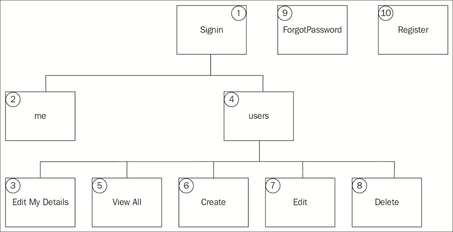
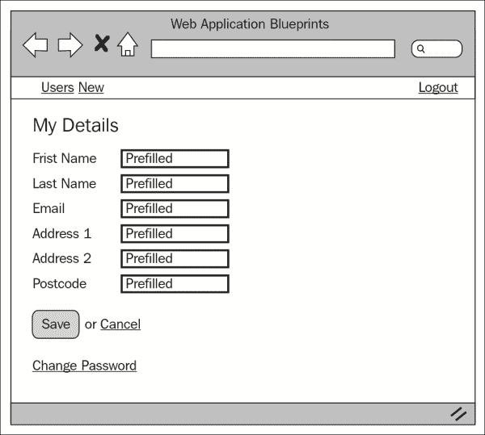
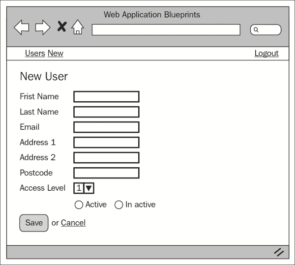
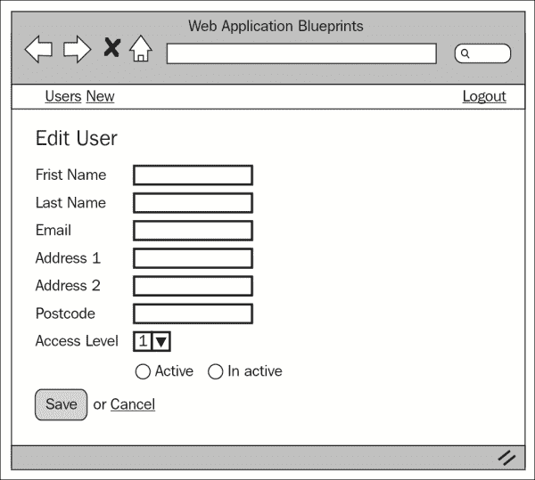
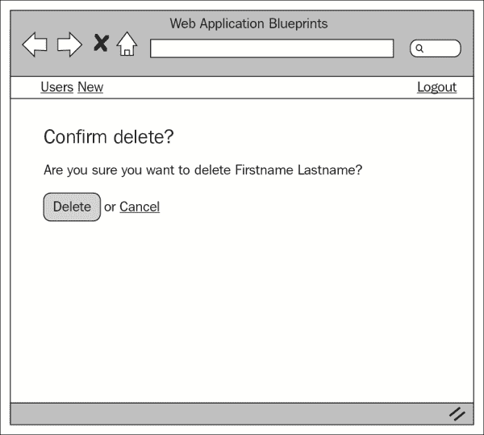
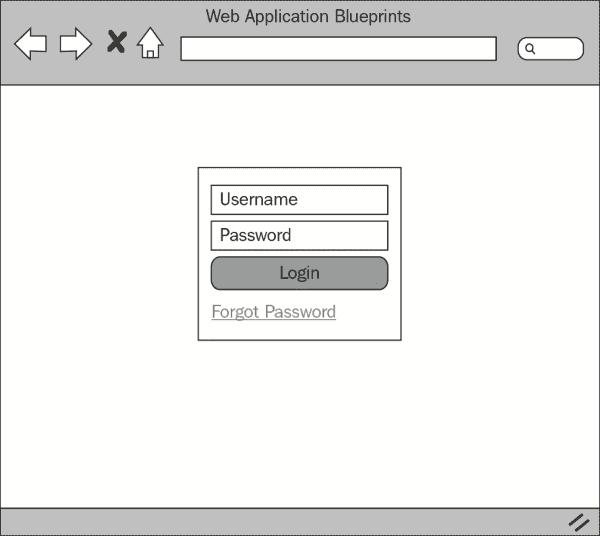
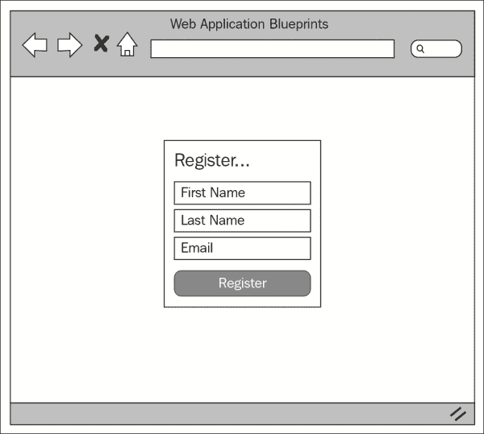

# 第六章：创建认证系统

CodeIgniter 没有自带用户认证系统（呃，那个短语），但无论如何，它没有。如果您想管理用户和会话，您有多种选择。您可以安装 auth Spark，或者您可以开发自己的解决方案——这正是我们将在这里做的。

我对其他“第三方”插件（无论其用途如何）的烦恼之一是代码几乎总是难以理解，这使得维护和集成变得困难。这个认证系统是我能使其尽可能简单，希望它将很容易为您适应和扩展。

本章提供的认证系统将允许您创建和管理用户、密码重置、用户电子邮件通知、用户登录等。

在本章中，我们将涵盖以下主题：

+   设计和线框

+   创建数据库

+   创建模型

+   创建视图

+   创建控制器

+   整合所有内容

# 简介

要创建此应用程序，我们将创建五个控制器：一个用于处理会话登录，一个用于处理管理功能（CRUD 操作），一个用于用户密码管理，一个允许用户注册，以及一个在用户登录后提供功能的控制器。

我们还将创建一个语言文件来存储文本，以便在需要时支持多种语言。

我们将对`config.php`文件进行修改，以允许对会话和密码支持所需的加密支持。

我们将创建所有必要的视图文件，甚至一个 CSS 文件来帮助 Bootstrap 处理一些视图。

然而，这个应用程序以及本书中的其他应用程序，都依赖于我们在第一章中完成的基本设置，*简介和共享项目资源*；尽管你可以将大量代码复制并粘贴到几乎任何你已有的应用程序中，但请记住，第一章中完成的基本设置是本章的基础。

所以，无需多言，让我们开始吧。

# 设计和线框

和往常一样，在我们开始构建之前，我们应该先看看我们打算构建什么。

首先，简要描述我们的意图：我们计划构建一个应用程序，它将提供以下功能：

+   管理员可以管理系统中的所有用户，并允许个别用户编辑和更新自己的数据。

+   如果用户忘记了密码，他们可以重置密码；确认此操作的电子邮件将发送给这些用户

+   新用户可以注册并成为系统的一部分；密码将被生成并通过电子邮件发送给他们

我们还将探讨如何实现代码来检查用户的访问级别。您可以在您的项目中使用此代码来限制用户访问特定的控制器和控制器函数。

为了更好地了解正在发生的事情，让我们看看以下网站地图：



因此，这是网站地图；现在，让我们逐一查看每个项目，并简要了解它们的功能：

+   **登录**：想象这是一个起点。用户将能够在此处登录。根据`users.usr_access_level`的值，他们将被导向`me`或`users`控制器。`me`控制器是普通用户编辑和更新他们详情的地方，而`users`控制器提供了一个管理员管理所有用户的地方。

+   **我的信息**：目前，这向用户显示一个表单；然而，请将此区域视为非管理员用户的仪表板区域。管理员将`users.usr_access_level`值设置为`1`。目前，`me`控制器将加载`index`函数，允许用户编辑他们的详情——说到这里，让我们看看下一个块。

+   **编辑我的详细信息**：这将向当前用户显示一个表单。该表单允许用户更改并保存他们的联系数据。

+   **用户**：`users`控制器处理管理员功能，例如所有用户的 CRUD 操作、密码重置和密码混淆（针对所有用户）。

+   **查看所有**：此列表显示所有用户及其在数据库中的当前状态。用户以表格形式显示。那些活跃的用户（`users.usr_is_active = 1`）的行没有背景色，而不活跃的用户（`users.usr_is_active = 0`）的行有橙色背景色。

+   **创建**：正如其名所示，这将显示包含表单的`users/new_user`视图，允许管理员在系统中创建用户。

+   **编辑**：这显示了一个与上一个类似的表单，但它是预先填充了当前登录用户的详细信息。当管理员在查看所有页面中点击编辑链接时，将加载此表单。

+   **删除**：这显示了一个确认页面，要求管理员确认他们是否希望删除用户。当管理员在查看所有页面中点击编辑链接时，将加载此页面。

+   **忘记密码**：这向用户显示一个表单。用户被邀请在表单文本字段中输入他们的电子邮件地址并点击提交。如果电子邮件地址存在于数据库中，则将发送一封包含在正文中的 URL 的电子邮件到该电子邮件地址。此 URL 是该认证系统的重置 URL。附加到 URL 的是一个系统用于验证密码重置请求是否真实的唯一代码。

+   **注册**：这向用户显示一个表单，邀请他们输入他们的名字、姓氏和电子邮件地址。一旦成功提交（没有验证错误），新用户将被添加到系统中，并向新用户发送一封电子邮件，告知他们密码；他们的密码是在注册时由系统自动生成的。

现在我们对网站的结构和形式有了相当好的了解，让我们看看每个页面的线框图。

## 我 – 编辑详情

以下截图显示了从网站地图中讨论的“编辑我的详情”项的线框图。普通用户（非管理员用户）可以在 HTML 表单中查看他们的详细信息，并通过点击保存，他们可以更新这些详细信息。



## 查看所有用户

以下截图显示了从网站地图中的“查看所有”项的线框图。管理员用户能够以表格网格的形式看到系统中的所有用户。用户被列出，并具有编辑和删除选项，管理员用户可以使用这些选项。


## 创建用户

以下截图显示了从网站地图中的第**6**点（创建用户项）的线框图。它显示了一个包含文本字段的表单，允许管理员输入用户的详细信息。请注意，用户访问级别可以在此设置；级别`1`在系统中被视为管理员，因此用户将能够获得分配给他们的管理员权限，而更高的数字是普通用户。目前，系统只理解级别`2`（作为普通用户）；下拉菜单有五个级别——您可以根据需要应用这些级别或甚至添加更多。将用户设置为活动状态（`users.usr_is_active = 1`）或非活动状态（`users.usr_is_active = 0`）将在登录时限制用户。活动用户将会有他们的登录请求由`signin`脚本处理，而非活动用户则不会。



## 编辑用户详情

编辑用户详情的表单与上一节中讨论的新用户功能类似。当管理员用户点击名称旁边的编辑链接（在`/views/users/view_all_users.php`视图文件中）时，通过网站地图的第**5**点（查看用户功能）访问。这里有趣的不同之处在于带有重置密码电子邮件选项的其他选项面板。这将重置用户的密码，并发送电子邮件通知他们新的密码。



## 删除用户

这是一个最终确认页面，要求允许删除用户。它通过网站地图中的第**5**点（查看用户功能）访问。管理员点击编辑链接以查看编辑用户页面。点击删除将从`users`表中删除用户，而点击“取消”将使管理员返回到第**5**点（查看用户项）。



## 登录

以下截图显示了登录页面的布局。用户可以输入他们的用户名和密码，然后点击登录按钮。验证错误将显示在表单上方（然而，在以下截图中没有显示验证错误）。还有一个链接，供某人启动重置密码的过程。**忘记密码**链接将显示一个新表单，允许该人输入电子邮件地址。



## 注册

注册功能允许非用户注册到系统中。潜在用户被提示输入他们的名字、姓氏和电子邮件地址。我们使用他们的名字和姓氏在欢迎电子邮件中使用，该电子邮件将发送到本阶段输入的电子邮件地址。



## 文件概览

我们将为这个项目创建很多文件，总共 23 个文件，具体如下：

+   `/path/to/codeigniter/application/core/MY_Controller.php`: 这作为`users.php`控制器等子类的一个父类。它提供了常用助手、库和错误分隔符等常用资源。

+   `/path/to/codeigniter/application/models/password_model.php`: 这提供了对数据库的读写访问——特别是在`users`表周围——专注于密码特定操作。

+   `/path/to/codeigniter/application/models/signin_model.php`: 这提供了特定于登录过程的函数。

+   `/path/to/codeigniter/application/models/users_model.php`: 这提供了特定于`users`表的函数。

+   `/path/to/codeigniter/application/model/register_model.php`: 这提供了帮助用户被添加到`users`表中的方法，而无需管理员首先创建它们。

+   `/path/to/codeigniter/application/views/nav/top_nav.php`: 这在页面顶部提供了一个导航栏。

+   `/path/to/codeigniter/application/language/english/en_admin_lang.php`: 这为应用程序提供语言支持。

+   `/path/to/codeigniter/application/views/users/new_user.php`: 这允许管理员创建新用户。用户被保存在`users`表中。

+   `/path/to/codeigniter/application/views/users/view_all_users.php`: 这允许管理员查看`users`表中的所有用户列表。

+   `/path/to/codeigniter/application/views/users/delete_user.php`: 这允许管理员删除用户。

+   `/path/to/codeigniter/application/views/users/edit_user.php`: 这允许管理员编辑用户的详细信息。

+   `/path/to/codeigniter/application/views/users/forgot_password.php`: 这允许未登录的用户重置他们的密码。此视图包含一个简单的表单，要求用户输入他们的电子邮件地址。将带有唯一代码的电子邮件发送到该地址。此代码用于确保更改密码请求是真实的。

+   `/path/to/codeigniter/application/views/users/me.php`: 这允许非管理员用户编辑他们的详细信息。

+   `/path/to/codeigniter/application/views/users/new_password.php`: 这允许未登录的用户输入新密码。

+   `/path/to/codeigniter/application/views/users/register.php`: 这允许尚未成为用户（`users`表中的记录）的人登录并生成`users`表中的新行。

+   `/path/to/codeigniter/application/views/users/signin.php`: 这显示了一个简单的登录表单。

+   `/path/to/codeigniter/application/views/users/change_password.php`：这允许已登录的用户重置他们的密码。

+   `/path/to/codeigniter/application/views/email_scripts/welcome.txt`：这个文件包含简单的欢迎文本。

+   `/path/to/codeigniter/application/views/email_scripts/new_password.txt`：这个文件包含一个简单的说明，指导用户点击链接以打开 `password/new_password` 控制器函数。

+   `/path/to/codeigniter/application/views/email_scripts/reset_password.txt`：这个文件包含一个简单的消息，通知用户他们的密码已被更改。

上述 23 个文件的文件结构如下所示：

```php
application/
├── core/
│   ├── MY_Controller.php
├── controllers/
│   ├── me.php
│   ├── password.php
│   ├── register.php
│   ├── signin.php
│   ├── users.php
├── models/
│   ├── password_model.php
│   ├── register_model.php
│   ├── signin_model.php
│   ├── users_model.php
├── views/users/
│   ├── new_user.php
│   ├── view_all_users.php
│   ├── delete_user.php
│   ├── edit_user.php
│   ├── forgot_password.php
│   ├── me.php
│   ├── new_password.php
│   ├── register.php
│   ├── signin.php
│   ├── change_password.php
├── views/email_scripts/
│   ├── welcome.txt
│   ├── new_password.txt
│   ├── reset_password.txt
├── views/nav/
│   ├── top_nav.php
├── views/common/
│   ├── login_header.php
├── language/english/
│   ├── en_admin_lang.php
bootstrap/
├── css/
    ├── signin.css
```

注意列表中的最后一项，即 `signin.css`。这个文件位于 `bootstrap/css/` 文件夹中，与 CodeIgniter 的 `application` 文件夹处于同一级别。我们在 第一章，*简介和共享项目资源* 中安装了 Twitter Bootstrap。在本章中，我们将介绍如何将 `bootstrap` 文件夹放置在正确的文件夹级别和位置。

# 创建数据库

好吧，你应该已经按照 第一章，*简介和共享项目资源* 中描述的方式设置了 CodeIgniter 和 Bootstrap。如果没有，那么你应该知道，本章中的代码是专门针对 第一章，*简介和共享项目资源* 中的设置编写的。然而，如果你还没有这样做，也不是世界末日——代码可以轻松地应用于其他情况。

首先，我们将构建数据库。将以下 MySQL 代码复制到你的数据库中：

```php
CREATE DATABASE `user_auth`;
USE `user_auth`;

CREATE TABLE `ci_sessions` (
  `session_id` varchar(40) COLLATE utf8_bin NOT NULL DEFAULT '0',
  `ip_address` varchar(16) COLLATE utf8_bin NOT NULL DEFAULT '0',
  `user_agent` varchar(120) COLLATE utf8_bin DEFAULT NULL,
  `last_activity` int(10) unsigned NOT NULL DEFAULT '0',
  `user_data` text COLLATE utf8_bin NOT NULL,
  PRIMARY KEY (`session_id`),
  KEY `last_activity_idx` (`last_activity`)
) ENGINE=MyISAM DEFAULT CHARSET=utf8 COLLATE=utf8_bin;

CREATE TABLE `users` (
  `usr_id` int(11) NOT NULL AUTO_INCREMENT,
  `acc_id` int(11) NOT NULL COMMENT 'account id',
  `usr_fname` varchar(125) NOT NULL,
  `usr_lname` varchar(125) NOT NULL,
  `usr_uname` varchar(50) NOT NULL,
  `usr_email` varchar(255) NOT NULL,
  `usr_hash` varchar(255) NOT NULL,
  `usr_add1` varchar(255) NOT NULL,
  `usr_add2` varchar(255) NOT NULL,
  `usr_add3` varchar(255) NOT NULL,
  `usr_town_city` varchar(255) NOT NULL,
  `usr_zip_pcode` varchar(10) NOT NULL,
  `usr_access_level` int(2) NOT NULL COMMENT 'up to 99',
  `usr_is_active` int(1) NOT NULL COMMENT '1 (active) or 0 (inactive)',
  `usr_created_at` timestamp NOT NULL DEFAULT CURRENT_TIMESTAMP,
  `usr_pwd_change_code` varchar(50) NOT NULL,
  PRIMARY KEY (`usr_id`)
) ENGINE=InnoDB  DEFAULT CHARSET=utf8 AUTO_INCREMENT=1 ;
```

你会看到我们首先创建的表是 `ci_sessions`。我们需要这个表来允许 CodeIgniter 管理会话，特别是登录用户。然而，它只是从 *CodeIgniter 用户指南* 中可用的标准会话表，所以我不包括该表的描述，因为它在技术上并不特定于这个应用程序。不过，如果你感兴趣，可以在 [`ellislab.com/codeigniter/user-guide/libraries/sessions.html`](http://ellislab.com/codeigniter/user-guide/libraries/sessions.html) 找到描述。

好的，让我们逐个查看每个表中的每个条目，看看它的含义：

| 表：users |
| --- |
| **元素** | **描述** |
| `usr_id` | 这是主键。 |
| `acc_id` | 如果你希望将用户与特定账户关联（或将用户分组在某种伞状结构下），`acc_id`（账户 ID）可以是一个钩子，使你能够做到这一点。但是，你需要创建一个 `accounts` 表来完成这个操作。 |
| `usr_fname` | 这是用户的第一个名字。 |
| `usr_lname` | 这是用户的姓氏。 |
| `usr_uname` | 这是用户名的选项。 |
| `usr_email` | 这是用户的电子邮件地址。 |

| `usr_hash` | 这是用户密码的散列。`users.usr_hash`中的值以两种方式生成。第一种是当有人手动更改密码时（可能是通过“忘记密码”过程）。`$this->encrypt->sha1($this->input->post('usr_password1'));` CodeIgniter 函数包含用户的新密码。第二种创建密码的方式是当系统生成密码并发送给用户时，例如，当管理员手动创建新用户时。这种方式下，管理员不知道新用户的密码。为了实现这一点，CodeIgniter 使用相同的`sha1()`加密函数；然而，与通过`$POST`从用户那里提供的密码不同，它是通过创建一个随机字符串并将其传递给`sha1()`来生成的，如下所示：

```php
$password = random_string('alnum', 8);
$hash = $this->encrypt->sha1($password);
```

|

| `usr_add1` | 这是个人地址的第一行。 |
| --- | --- |
| `usr_add2` | 这是个人地址的第二行。 |
| `usr_add3` | 这是个人地址的第三行。 |
| `usr_town_city` | 这是个人地址的城镇或城市。 |
| `usr_zip_pcode` | 这是个人地址的邮政编码或邮编。 |
| `usr_access_level` | 这表示用户的权限级别。权限级别可以控制用户允许执行的操作。 |
| `usr_is_active` | 这表示用户是否活跃（`1`）或非活跃（`0`）——非活跃意味着用户无法登录。 |
| `usr_created_at` | 这是记录创建时创建的 MySQL 时间戳。 |
| `usr_pwd_change_code` | 这是一个当某人希望更改密码时生成的唯一代码。这个唯一代码会生成并发送给希望更改密码的用户。该代码附加在电子邮件正文的 URL 中。用户点击此链接将被重定向到认证系统。系统查看该代码以检查其是否有效并匹配电子邮件。如果匹配，用户可以按照屏幕上的说明创建一个新的密码。 |

我们还需要对`config/database.php`文件进行修改，即设置数据库访问详情、用户名密码等。

打开`config/database.php`文件并找到以下行：

```php
$db['default']['hostname'] = 'localhost';
$db['default']['username'] = 'your username';
$db['default']['password'] = 'your password';
$db['default']['database'] = 'user_auth';
```

编辑前述行中的值，确保用更具体于您设置和情况的值替换这些值；因此，输入您的用户名、密码等。

# 调整 config.php 文件

在此文件中，有一些设置我们需要配置以支持会话和加密。因此，打开`config/config.php`文件并做出以下更改：

1.  我们需要设置一个加密密钥；会话和 CodeIgniter 的加密功能都需要在`$config`数组中设置一个加密密钥，因此找到以下行：

    ```php
    $config['encryption_key'] = '';
    ```

    然后，将其更改为以下内容：

    ```php
    $config['encryption_key'] = 'a-random-string-of-alphanum-characters';
    ```

    ### 小贴士

    现在，显然实际上不要将此值更改为一个随机的字母数字字符序列，而是改为，嗯，一个随机的字母数字字符序列——如果这说得通？是的，你知道我的意思。

1.  接下来，找到以下行：

    ```php
    $config['sess_cookie_name'] = 'ci_session';
    $config['sess_expiration'] = 7200;
    $config['sess_expire_on_close'] = FALSE;
    $config['sess_encrypt_cookie'] = FALSE;
    $config['sess_use_database'] = FALSE;
    $config['sess_table_name'] = 'ci_sessions';
    $config['sess_match_ip'] = FALSE;
    $config['sess_match_useragent'] = TRUE;
    $config['sess_time_to_update'] = 300;
    ```

    然后，将其更改为以下内容：

    ```php
    $config['sess_cookie_name'] = 'ci_session';
    $config['sess_expiration'] = 7200;
    $config['sess_expire_on_close'] = TRUE;
    $config['sess_encrypt_cookie'] = TRUE;
    $config['sess_use_database'] = TRUE;
    $config['sess_table_name'] = 'ci_sessions';
    $config['sess_match_ip'] = TRUE;
    $config['sess_match_useragent'] = TRUE;
    $config['sess_time_to_update'] = 300;
    ```

# 调整 routes.php 文件

我们希望将用户重定向到 `signin` 控制器而不是默认的 CodeIgniter `welcome` 控制器。我们需要修改 `routes.php` 文件中的默认控制器设置以反映这一点：

1.  打开 `config/routes.php` 文件进行编辑，并找到以下行（在文件底部附近）：

    ```php
    $route['default_controller'] = "welcome";
    $route['404_override'] = '';
    ```

1.  首先，我们需要更改默认控制器。最初在 CodeIgniter 应用程序中，默认控制器设置为 `welcome`；然而，我们不需要这个；相反，我们希望默认控制器是 `signin`。所以，找到以下行：

    ```php
    $route['default_controller'] = "welcome";
    ```

    用以下内容替换它：

    ```php
    $route['default_controller'] = "signin";
    ```

# 创建模型

本项目中有四个模型，如下所示：

+   `models/password_model.php`：此文件包含创建和重置密码的特定函数。

+   `models/register_model.php`：此文件包含特定于用户注册的函数。

+   `models/signin_model.php`：此文件包含特定于用户登录系统的函数。

+   `models/users_model.php`：此文件包含本项目的模型函数的主体，特别是对用户执行 CRUD 操作以及各种其他管理功能。

因此，这是本项目的模型概述；现在，让我们去创建每个模型。

创建 `/path/to/codeigniter/application/models/password_model.php` 文件，并将其中的以下代码添加到其中：

```php
<?php if ( ! defined('BASEPATH')) exit('No direct script access allowed');

class Password_model extends CI_Model {
  function __construct() {
      parent::__construct();
  }
```

`does_code_match()` 函数将检查在 URL 中提供的代码是否与数据库中的代码匹配。如果匹配，它返回 `true`；如果不匹配，它返回 `false`。这在此处显示：

```php
  function does_code_match($code, $email) {
    $query = "SELECT COUNT(*) AS `count` 
              FROM `users` 
              WHERE `usr_pwd_change_code` = ?
              AND `usr_email` = ? ";

        $res = $this->db->query($query, array($code, $email));
    foreach ($res->result() as $row) {
      $count = $row->count;
    }

    if ($count == 1) {
      return true;
    } else {
      return false;
    }
  }
}
```

创建 `/path/to/codeigniter/application/models/register_model.php` 模型文件，并将其中的以下代码添加到其中：

```php
<?php if ( ! defined('BASEPATH')) exit('No direct script access allowed');

class Register_model extends CI_Model {
  function __construct() {
    parent::__construct();
  }

  public function register_user($data) {
    if ($this->db->insert('users', $data)) {
      return true;
    } else {
      return false;
    }
  }
}
```

`register` 模型只包含一个函数，即 `register_user()`。它简单地使用 CodeIgniter Active Record `insert()` 类将 `$data` 数组的内 容插入到 `users` 表中。

创建 `/path/to/codeigniter/application/models/users_model.php` 模型文件，并将其中的以下代码添加到其中：

```php
<?php if ( ! defined('BASEPATH')) exit('No direct script access allowed');

class Users_model extends CI_Model {
  function __construct() {
    parent::__construct();
  }

  function get_all_users() {
    return $this->db->get('users');
  } 

  function process_create_user($data) {
    if ($this->db->insert('users', $data)) {
      return $this->db->insert_id();
    } else {
      return false;
    }
  }

  function process_update_user($id, $data) {
    $this->db->where('usr_id', $id);
    if ($this->db->update('users', $data)) {
      return true;
    } else {
      return false;
    }
  }

  function get_user_details($id) {
    $this->db->where('usr_id', $id);
    $result = $this->db->get('users');

    if ($result) {
      return $result;
    } else {
      return false;
    }
  }

  function get_user_details_by_email($email) {
    $this->db->where('usr_email', $email);
    $result = $this->db->get('users');

    if ($result) {
      return $result;
    } else {
      return false;
    }
  }

  function delete_user($id) {
    if($this->db->delete('users', array('usr_id' => $id))) {
      return true;
    } else {
      return false;
    }
  }
```

让我们看看 `make_code()` 函数。此函数创建一个唯一的代码并将其保存到用户的记录中。此代码在电子邮件的 URL 结尾处发送给用户。如果 URL 中的此代码与数据库中的代码匹配，那么它很可能是真正的密码更改，因为不太可能有人能准确猜出代码。

注意 PHP 构造 `do…while` 的样子：

```php
do {
// something
} while ('…a condition is met');
```

因此，这意味着*在满足条件时执行某些操作*。考虑到这一点，思考我们的问题；我们必须将`users.usr_pwd_change_code`分配一个在数据库中不存在的值。该代码应该是一个唯一的值，以确保其他人不会错误地更改其密码。

我们使用`do…while`结构作为创建代码的手段，首先创建代码，然后通过遍历`users`表来查找该代码的另一个实例。如果找到，则返回的行数将大于或等于一。然后，生成另一个代码，并在`users`表中再次进行搜索。

这将重复进行，直到生成一个在`users`表中找不到的代码。然后，这个唯一的代码作为`$url_code`返回：

```php
function make_code() {
  do {
    $url_code = random_string('alnum', 8); 

    $this->db->where('usr_pwd_change_code = ', $url_code);
    $this->db->from('users');
    $num = $this->db->count_all_results();
  } while ($num >= 1);

  return $url_code;
}

function count_results($email) {
  $this->db->where('usr_email', $email);
  $this->db->from('users');
  return $this->db->count_all_results();
}
```

以下`update_user_password()`函数接受包含用户主键和新密码的数据数组。该数组由`password_model`的`new_password()`函数提供。用户的 ID（`users.usr_id`）来自会话（因为他们已登录），新密码来自`new_password()`加载的表单（`views/users/new_password.php`）：

```php
  function update_user_password($data) {
    $this->db->where('usr_id', $data['usr_id']);
    if ($this->db->update('users', $data)) {
        return true;
    } else {
        return false;
    }
  }

  function does_code_match($data, $email) {
    $query = "SELECT COUNT(*) AS `count` 
                    FROM `users` 
                    WHERE `usr_pwd_change_code` = ?
                    AND `usr_email` = ? ";

    $res = $this->db->query($query, array($data['code'], $email));
    foreach ($res->result() as $row) {
      $count = $row->count;
    }

    if ($count == 1) {
        return true;
    } else {
        return false;
    }
  }

  function update_user_code($data) {
    $this->db->where('usr_email', $data['usr_email']);
    if ($this->db->update('users', $data)) {
        return true;
    } else {
        return false;
    }
  }
}
```

创建`/path/to/codeigniter/application/models/signin_model.php`模型文件，并将其中的以下代码添加到其中：

```php
<?php if ( ! defined('BASEPATH')) exit('No direct script access allowed');

class Signin_model extends CI_Model {
    function __construct() {
        parent::__construct();
    } 

    public function does_user_exist($email) {
        $this->db->where('usr_email', $email);
        $query = $this->db->get('users');
        return $query;
    }
}
```

此模型除了`__construct()`函数外，还包含一个函数，即`does_user_exist($email)`。此函数接受用户从登录视图提交的电子邮件地址，并返回活动记录查询。

查询在`signin`控制器中使用 CodeIgniter 数据库函数`num_rows()`进行评估：

```php
$query = $this->Signin_model->does_user_exist($usr_email);
if ($query->num_rows() == 1) {
...
```

如果只有一个匹配项，则`signin`控制器会遍历活动记录结果，并尝试登录用户。

# 创建视图

在此项目中，有相当多的视图文件和电子邮件模板文件——实际上，我们将创建 10 个视图文件，3 个电子邮件脚本，以及一个特定于登录和修改导航文件的头部文件。好吧，让我们开始吧。

以下是在此项目中使用的标准视图文件：

+   `path/to/codeigniter/application/views/users/new_user.php`: 这向管理员用户显示一个表单，允许他们创建用户。新用户会收到一封电子邮件，欢迎他们加入系统，并告知他们密码。电子邮件脚本位于`/views/email_scripts/welcome.txt`。

+   `path/to/codeigniter/application/views/users/view_all_users.php`: 这显示系统中当前的用户列表。管理员用户能够编辑或删除用户。

+   `path/to/codeigniter/application/views/users/delete_user.php`: 这向管理员用户显示一个确认页面。如果管理员用户在`view_all_users/php`视图中按下删除键，则会显示此页面。确认页面询问管理员用户是否真的希望删除所选用户。

+   `path/to/codeigniter/application/views/users/edit_user.php`: 这将向管理员用户显示一个表单。如果管理员用户在 `view_all_users.php` 视图中按下编辑，则会显示此表单。该表单类似于 `new_user.php` 文件，除了有一个面板，管理员用户可以发送电子邮件给用户以重置他们的密码。

+   `path/to/codeigniter/application/views/users/forgot_password.php`: 这将向任何请求电子邮件地址的人显示一个表单。如果此电子邮件地址在系统中，将向他们发送一封电子邮件，其中包含重置密码的说明。

+   `path/to/codeigniter/application/views/users/me.php`: 这将向当前登录用户显示一个表单。该表单类似于 `edit_user.php`。它允许当前登录用户编辑和修改他们的账户详情。

+   `path/to/codeigniter/application/views/users/new_password.php`: 这将向任何人显示一个表单，邀请他们输入他们的电子邮件地址——从忘记密码过程中生成的代码已经是隐藏的表单元素。代码和电子邮件地址将被比较，如果代码匹配，将为用户生成一个新的密码。

+   `path/to/codeigniter/application/views/users/register.php`: 这将向用户显示一个表单，允许他们输入他们的姓名和电子邮件地址。然后他们将被添加到数据库中，并为他们生成一个密码。此密码将通过电子邮件发送给他们，并附有欢迎信息。此电子邮件的文本位于 `/views/email_scripts/welcome.txt`。

+   `path/to/codeigniter/application/views/users/signin.php`: 这将显示一个表单。该表单允许用户（普通或管理员）使用用户名和密码登录系统；请记住，他们的密码没有存储在 `users` 表中，只存储了密码的散列。为了支持这种散列，我们需要在配置文件中更改加密密钥。我们在本章的 *调整 config.php 文件* 部分讨论了这一点。

+   `path/to/codeigniter/application/views/users/change_password.php`: 这将向任何登录用户显示一个表单。该表单允许用户（普通或管理员）更改他们的密码。

以下是在此应用程序中使用的电子邮件脚本：

+   `path/to/codeigniter/application/views/email_scripts/welcome.txt`: 此文件包含当新用户被管理员从 `new_user.php` 表单添加或当他们使用 `register.php` 视图中的表单自行创建账户时发送的欢迎电子邮件的文本。

+   `path/to/codeigniter/application/views/email_scripts/new_password.txt`: 此文件包含通知用户更改密码的文本。

+   `path/to/codeigniter/application/views/email_scripts/reset_password.txt`: 此文件包含一个用户可以点击以开始重置密码过程的 URL。该 URL 包含一个系统用于确保这是一个真实的密码更改请求的唯一代码。

以下是在此应用程序中使用的登录页眉和导航视图：

+   `path/to/codeigniter/application/views/common/login_header.php`：登录表单的 CSS 要求与标准`/views/common/header.php`视图不同。具体来说，它需要`signin.css`文件。

+   `path/to/codeigniter/application/views/nav/top_nav.php`：它包含允许管理员和普通用户打开各种页面的导航选项，并且还包含一个注销链接，允许用户终止他们的会话。

正确，这些是视图文件，包括标准 HTML 和 TXT 文件用于电子邮件等。让我们逐一查看每个文件并创建它们。

创建`/path/to/codeigniter/application/views/users/register.php`文件，并将其中的以下代码添加到该文件中：

```php
<div class="container">
  <?php echo validation_errors(); ?>
  <?php echo form_open('register/index', 'role="form" class="form-signin"') ; ?> 
    <h2 class="form-signin-heading"><?php echo $this->lang->line('register_page_title'); ?></h2>
    <input type="text" class="form-control" name="usr_fname" placeholder="<?php echo $this->lang->line('register_first_name'); ?>" autofocus>
    <input type="text" class="form-control" name="usr_lname" placeholder="<?php echo $this->lang->line('register_last_name'); ?>" >
    <input type="email" class="form-control" name="usr_email" placeholder="<?php echo $this->lang->line('register_email'); ?>" >
    <?php echo form_submit('submit', 'Register', 'class="btn btn-lg btn-primary btn-block"'); ?>
  </form>
</div>
```

这向系统中的潜在用户显示一个表单。它要求用户输入名字、姓氏和电子邮件地址。表单提交到`register/index`，该表单将验证用户输入的数据。如果没有错误，则用户将被添加到`users`表中，为他们生成一个密码，并生成一个哈希值存储为`users.usr_hash`并发送给他们。电子邮件模板是`welcome.txt`，如下所示。

创建`/path/to/codeigniter/application/views/email_scripts/welcome.txt`文件，并将其中的以下代码添加到该文件中：

```php
Dear %usr_fname% %usr_lname%,

Welcome to the site.  Your password is:

%password%

Regards,
The Team
```

这是当用户注册时发送给用户的欢迎电子邮件的文本。请注意，有三个文本字符串被百分号（`%`）包围。这些是将在注册过程中被识别并使用`str_replace()` PHP 函数替换其真实值的文本字符串。例如，假设我注册了该网站。我的名字是 Robert Foster，我的电子邮件可能是`rob-foster@domain.com`。发送到`rob-foster@domain.com`的电子邮件看起来如下：

```php
Dear Robert Foster,
Welcome to the site.  Your password is:

<this-is-the-password>

Regards,
The Team
```

创建`/path/to/codeigniter/application/views/users/forgot_password.php`文件，并将其中的以下代码添加到该文件中：

```php
<?php if (isset($login_fail)) : ?>
  <div class="alert alert-danger"><?php echo $this->lang->line('admin_login_error') ; ?></div>
<?php endif ; ?>
  <?php echo validation_errors(); ?>
  <?php echo form_open('password/forgot_password', 'class="form-signin" role="form"') ; ?>
    <h2 class="form-signin-heading"><?php echo $this->lang->line('forgot_pwd_header') ; ?></h2>
    <p class="lead"><?php echo $this->lang->line('forgot_pwd_instruction') ;?></p>
    <?php echo form_input(array('name' => 'usr_email', 'class' => 'form-control', 'placeholder' => $this->lang->line('admin_login_email'),'id' => 'email', 'value' => set_value('email', ''), 'maxlength' => '100', 'size' => '50', 'style' => 'width:100%')); ?>
    <br />
    <button class="btn btn-lg btn-primary btn-block" type="submit"><?php echo $this->lang->line('common_form_elements_go') ; ?></button>
    <br />
  <?php echo form_close() ; ?>
</div>
```

`forgot_password.php`视图文件为任何用户提供一个简短的表单，以开始重置密码的过程。用户可以输入他们的电子邮件地址并按下“Go”按钮。表单提交到`password`控制器的`forgot_password()`函数，在那里进行验证。

如果电子邮件地址通过验证，则`forgot_password()`函数检查电子邮件地址是否存在于`users`表中。如果存在，则生成一个唯一的代码并存储在`users.usr_pwd_change_code`中。如果代码不存在，则用户将被重定向到`forgot_password()`函数再次尝试。

此代码也被附加到 URL 中，并在电子邮件正文中发送给用户。用户被指示点击电子邮件中的链接，该链接将引导他们到`password`控制器的`new_password()`函数。`new_password()`函数将加载`users/new_password.php`视图文件，该文件将要求用户输入他们的电子邮件地址。

此电子邮件地址经过验证，`new_password()`将检查`users`表中是否存在该电子邮件地址。如果存在，它将检查 URL 中的代码值是否与存储在`users.usr_pwd_change_code`中的值匹配。如果匹配，则很可能是真实的，并将生成一个新的密码。此密码将通过电子邮件发送给用户。使用密码创建一个哈希值并存储在`users.usr_hash`中。

创建`/path/to/codeigniter/application/views/users/signin.php`文件，并将以下代码添加到其中：

```php
<?php if (isset($login_fail)) : ?>
  <div class="alert alert-danger"><?php echo $this->lang->line('admin_login_error') ; ?></div>
<?php endif ; ?>
  <?php echo validation_errors(); ?>
  <?php echo form_open('signin/index', 'class="form-signin" role="form"') ; ?>
    <h2 class="form-signin-heading"><?php echo $this->lang->line('admin_login_header') ; ?></h2>
    <input type="email" name="usr_email" class="form-control" placeholder="<?php echo $this->lang->line('admin_login_email') ; ?>" required autofocus>
    <input type="password" name="usr_password" class="form-control" placeholder="<?php echo $this->lang->line('admin_login_password') ; ?>" required>
    <button class="btn btn-lg btn-primary btn-block" type="submit"><?php echo $this->lang->line('admin_login_signin') ; ?></button>
    <br />
    <?php echo anchor('password',$this->lang->line('signin_forgot_password')); ?>
  <?php echo form_close() ; ?>
</div>
```

`signin`视图相当简单：一个标准的登录界面。用户可以输入他们的电子邮件地址和密码进行登录。如果有任何错误，验证错误会显示在表单上方，并且一个**忘记密码**链接允许用户使用一种方法开始重置密码的过程。

错误消息包含在一个具有`alert alert-danger`Bootstrap 类的`div`元素中；我更喜欢一个大的红色错误消息而不是那些软绵绵的橙色东西；然而，你可以将其更改为更柔和的样式，例如`alert alert-warning`。

创建`/path/to/codeigniter/application/views/users/view_all_users.php`文件，并将以下代码添加到其中：

```php
<h2><?php echo $page_heading ; ?></h2>
<table class="table table-bordered">
    <thead>
        <tr>
          <th>#</th>
          <th>First Name</th>
          <th>Last Name</th>
          <th>Email</th>
         <td>Actions</td>
        </tr>
    </thead>
    <tbody>
    <?php if ($query->num_rows() > 0) : ?>
        <?php foreach ($query->result() as $row) : ?>
          <tr>
            <td><?php echo $row->usr_id ; ?></td>
            <td><?php echo $row->usr_fname ; ?></td>
            <td><?php echo $row->usr_lname ; ?></td>
            <td><?php echo $row->usr_email ; ?></td>
            <td><?php echo anchor('users/edit_user/'.
              $row->usr_id,$this->lang->line('common_form_elements_action_edit')) . ' ' . anchor('users/delete_user/'.
              $row->usr_id,$this->lang->line('common_form_elements_action_delete')) ; ?>
            </td>
          </tr>
        <?php endforeach ; ?>
        <?php else : ?>
          <tr>
            <td colspan="5" class="info">No users here!</td>
          </tr>
        <?php endif; ?>
    </tbody>
</table>
```

`view_all_users.php`视图文件在任何时候都会以表格形式显示系统中的所有用户。只有管理员用户能够看到这个列表。

表格提供了编辑和删除选项，允许用户编辑一个用户（加载`users`控制器的`edit_user()`函数）和删除一个用户（加载`users`控制器的`delete_user()`函数）。

创建`/path/to/codeigniter/application/views/users/new_user.php`文件，并将以下代码添加到其中：

```php
<?php echo validation_errors() ; ?>
<div class="page-header">
  <h1><?php echo $page_heading ; ?></h1>
</div> 
  <p class="lead"><?php echo $this->lang->line('usr_form_instruction_edit');?></p>
  <div class="span8"> 
<?php echo form_open('users/new_user','role="form" class="form"') ; ?>
    <div class="form-group">
      <?php echo form_error('usr_fname'); ?>
      <label for="usr_fname"><?php echo $this->lang->line('usr_fname');?></label>
      <?php echo form_input($usr_fname); ?>
    </div>
    <div class="form-group">
      <?php echo form_error('usr_lname'); ?>
      <label for="usr_lname"><?php echo $this->lang->line('usr_lname');?></label>
      <?php echo form_input($usr_lname); ?>
    </div>
    <div class="form-group">
      <?php echo form_error('usr_uname'); ?>
      <label for="usr_uname"><?php echo $this->lang->line('usr_uname');?></label>
      <?php echo form_input($usr_uname); ?>
    </div>

    <div class="form-group">
      <label for="usr_email"><?php echo $this->lang->line('usr_email');?></label>
      <?php echo form_input($usr_email); ?>
    </div>
    <div class="form-group">
      <label for="usr_confirm_email"><?php echo $this->lang->line('usr_confirm_email');?></label>
      <?php echo form_input($usr_confirm_email); ?>
    </div>

    <div class="form-group">
      <label for="usr_add1"><?php echo $this->lang->line('usr_add1');?></label>
      <?php echo form_input($usr_add1); ?>
    </div>

    <div class="form-group">
      <label for="usr_add2"><?php echo $this->lang->line('usr_add2');?></label>
      <?php echo form_input($usr_add2); ?>
    </div>

    <div class="form-group">
      <label for="usr_add3"><?php echo $this->lang->line('usr_add3');?></label>
      <?php echo form_input($usr_add3); ?>
    </div>

    <div class="form-group">
      <label for="usr_town_city"><?php echo $this->lang->line('usr_town_city');?></label>
      <?php echo form_input($usr_town_city); ?>
    </div>

    <div class="form-group">
      <label for="usr_zip_pcode"><?php echo $this->lang->line('usr_zip_pcode');?></label>
      <?php echo form_input($usr_zip_pcode); ?>
    </div>

    <div class="form-group">
      <label for="usr_access_level"><?php echo $this->lang->line('usr_access_level');?></label>
      <?php echo form_dropdown('usr_access_level', $usr_access_level, 'large'); ?>
    </div>

    <div class="form-group">
      <label for="usr_is_active"><?php echo $this->lang->line('usr_is_active');?></label>
      <input type="radio" name="usr_is_active" value="<?php echo set_value('usr_is_active') ; ?>" /> Active
      <input type="radio" name="usr_is_active" value="<?php echo set_value('usr_is_active') ; ?>" /> Inactive
     </div>

    <div class="form-group">
      <button type="submit" class="btn btn-success"><?php echo $this->lang->line('common_form_elements_go');?></button>  or <? echo anchor('users',$this->lang->line('common_form_elements_cancel'));?>
    </div>
<?php echo form_close() ; ?>
  </div>
</div>
```

`new_user.php`视图文件向管理员用户显示一个表单，允许他们在系统中创建用户。表单提交到`users`控制器的`new_user()`函数。验证错误会在表单上方显示。在成功提交（没有验证错误）的情况下，`new_user()`函数将为用户创建一个密码和一个基于密码的哈希值。密码将通过电子邮件发送给用户。此电子邮件的文本位于`/views/email_scripts/welcome.txt`文件中。

创建`/path/to/codeigniter/application/views/users/edit_user.php`文件，并将以下代码添加到其中：

```php
<div class="page-header">
  <h1><?php echo $page_heading ; ?></h1>
</div> 
  <p class="lead"><?php echo $this->lang->line('usr_form_instruction_edit');?></p>

  <div class="span8"> 
    <?php echo form_open('users/edit_user','role="form" class="form"') ; ?>
      <div class="form-group">
        <?php echo form_error('usr_fname'); ?>
        <label for="usr_fname"><?php echo $this->lang->line('usr_fname');?></label>
        <?php echo form_input($usr_fname); ?>
      </div>
      <div class="form-group">
        <?php echo form_error('usr_lname'); ?>
        <label for="usr_lname"><?php echo $this->lang->line('usr_lname');?></label>
        <?php echo form_input($usr_lname); ?>
      </div>
      <div class="form-group">
        <?php echo form_error('usr_uname'); ?>
        <label for="usr_uname"><?php echo $this->lang->line('usr_uname');?></label>
        <?php echo form_input($usr_uname); ?>
      </div>
      <div class="form-group">
        <?php echo form_error('usr_email'); ?>
        <label for="usr_email"><?php echo $this->lang->line('usr_email');?></label>
        <?php echo form_input($usr_email); ?>
      </div>
      <div class="form-group">
        <?php echo form_error('usr_confirm_email'); ?>
        <label for="usr_confirm_email"><?php echo $this->lang->line('usr_confirm_email');?></label>
        <?php echo form_input($usr_confirm_email); ?>
      </div>
      <div class="form-group">
        <?php echo form_error('usr_add1'); ?>
        <label for="usr_add1"><?php echo $this->lang->line('usr_add1');?></label>
        <?php echo form_input($usr_add1); ?>
      </div>
      <div class="form-group">
        <?php echo form_error('usr_add2'); ?>
        <label for="usr_add2"><?php echo $this->lang->line('usr_add2');?></label>
        <?php echo form_input($usr_add2); ?>
      </div>
      <div class="form-group">
        <?php echo form_error('usr_add3'); ?>
        <label for="usr_add3"><?php echo $this->lang->line('usr_add3');?></label>
        <?php echo form_input($usr_add3); ?>
      </div> 
      <div class="form-group">
        <?php echo form_error('usr_town_city'); ?>
        <label for="usr_town_city"><?php echo $this->lang->line('usr_town_city');?></label>
        <?php echo form_input($usr_town_city); ?>
      </div> 
      <div class="form-group">
        <?php echo form_error('usr_zip_pcode'); ?>
        <label for="usr_zip_pcode"><?php echo $this->lang->line('usr_zip_pcode');?></label>
        <?php echo form_input($usr_zip_pcode); ?>
      </div>
      <div class="form-group">
        <?php echo form_error('usr_access_level'); ?>
        <label id="usr_access_level" for="usr_access_level"><?php echo $this->lang->line('usr_access_level');?></label>
        <?php echo form_dropdown('usr_access_level', $usr_access_level_options, $usr_access_level); ?>
      </div>
      <div class="form-group">
        <?php echo form_error('usr_is_active'); ?>
        <label for="usr_is_active"><?php echo $this->lang->line('usr_is_active');?></label>
        <input type="radio" name="usr_is_active" <?php if ($usr_is_active == 1) { echo 'checked' ;} ?> /> Active
        <input type="radio" name="usr_is_active" <?php if ($usr_is_active == 0) { echo 'checked' ;} ?> /> Inactive
      </div>

      <?php echo form_hidden($id); ?>

      <div class="form-group">
        <button type="submit" class="btn btn-success"><?php echo $this->lang->line('common_form_elements_go');?></button> or <? echo anchor('users',$this->lang->line('common_form_elements_cancel'));?>
      </div>
    <?php echo form_close() ; ?>
  </div>

  <?php echo anchor('users/pwd_email/'.$id['usr_id'],'Send Password Reset Email') ; ?>

</div>
```

`edit_user.php`视图文件向管理员用户显示一个表单，允许他们编辑系统中的用户。当管理员用户从`views/users/list_all_users.php`视图文件中点击编辑时，会访问此表单。表单提交到`users`控制器的`edit_user()`函数。验证错误会在表单上方显示。

创建`/path/to/codeigniter/application/views/users/me.php`文件，并将以下代码添加到其中：

```php
<?php echo validation_errors() ; ?>
<div class="page-header">
  <h1><?php echo $page_heading ; ?></h1>
</div> 
  <p class="lead"><?php echo $this->lang->line('usr_form_instruction');?></p>

  <div class="span8"> 
    <?php echo form_open('me/index','role="form"') ; ?>
      <div class="form-group">
        <?php echo form_error('usr_fname'); ?>
        <label for="usr_fname"><?php echo $this->lang->line('usr_fname');?></label>
        <?php echo form_input($usr_fname); ?>
      </div>
      <div class="form-group">
        <?php echo form_error('usr_lname'); ?>
        <label for="usr_lname"><?php echo $this->lang->line('usr_lname');?></label>
        <?php echo form_input($usr_lname); ?>
      </div>
      <div class="form-group">
        <?php echo form_error('usr_uname'); ?>
        <label for="usr_uname"><?php echo $this->lang->line('usr_uname');?></label>
        <?php echo form_input($usr_uname); ?>
      </div>

      <div class="form-group">
        <label for="usr_email"><?php echo $this->lang->line('usr_email');?></label>
        <?php echo form_input($usr_email); ?>
      </div>
      <div class="form-group">
        <label for="usr_confirm_email"><?php echo $this->lang->line('usr_confirm_email');?></label>
        <?php echo form_input($usr_confirm_email); ?>
      </div>

      <div class="form-group">
        <label for="usr_add1"><?php echo $this->lang->line('usr_add1');?></label>
        <?php echo form_input($usr_add1); ?>
      </div>
      <div class="form-group">
        <label for="usr_add2"><?php echo $this->lang->line('usr_add2');?></label>
        <?php echo form_input($usr_add2); ?>
      </div>
      <div class="form-group">
        <label for="usr_add3"><?php echo $this->lang->line('usr_add3');?></label>
        <?php echo form_input($usr_add3); ?>
      </div> 
      <div class="form-group">
        <label for="usr_town_city"><?php echo $this->lang->line('usr_town_city');?></label>
        <?php echo form_input($usr_town_city); ?>
      </div>
      <div class="form-group">
        <label for="usr_zip_pcode"><?php echo $this->lang->line('usr_zip_pcode');?></label>
        <?php echo form_input($usr_zip_pcode); ?>
      </div>

      <?php echo form_hidden($id); ?>

      <div class="form-group">
        <button type="submit" class="btn btn-success"><?php echo $this->lang->line('common_form_elements_go');?></button> or <? echo anchor('users',$this->lang->line('common_form_elements_cancel'));?>
      </div>
    <?php echo form_close() ; ?>
  </div>

  <?php echo anchor('me/pwd_email/'.$id,'Reset Email') ; ?>
```

同样，像`new_user`和`edit_user`视图中的表单一样，这个表单也是相似的；然而，它包括一个重置电子邮件链接，该链接将运行`me`控制器的`pwd_email()`函数来创建一个新的密码并将其发送给当前用户。密码不会存储在数据库中；只存储一个哈希值（`users.usr_hash`）。

创建`/path/to/codeigniter/application/views/users/register.php`文件，并将以下代码添加到其中：

```php
<div class="container">
  <?php echo validation_errors(); ?>
  <?php echo form_open('register/index', 'role="form" class="form-signin"') ; ?>
    <h2 class="form-signin-heading"><?php echo $this->lang->line('register_page_title'); ?></h2>
    <input type="text" class="form-control" name="usr_fname" placeholder="<?php echo $this->lang->line('register_first_name'); ?>" required autofocus>
    <input type="text" class="form-control" name="usr_lname" placeholder="<?php echo $this->lang->line('register_last_name'); ?>" required>
    <input type="email" class="form-control" name="usr_email" placeholder="<?php echo $this->lang->line('register_email'); ?>" required>
    <?php echo form_submit('submit', 'Register', 'class="btn btn-lg btn-primary btn-block"'); ?>
  </form>
</div>
```

`register.php`视图文件向希望成为系统用户的个人显示一个表单。用户被邀请输入他们的名字、姓氏以及他们的电子邮件地址。然后他们点击注册按钮。

表单提交到`register`控制器的`index()`函数。`index()`函数将执行验证，并将任何错误显示在表单上方。

假设没有错误并且表单提交没有问题，`index()`函数将尝试将它们写入`users`表。生成一个密码并以电子邮件的形式发送给用户。电子邮件的内容存储在`views/email_scripts/welcome.txt`视图文件中。

创建`/path/to/codeigniter/application/views/users/signin.php`文件，并将以下代码添加到其中：

```php
<?php if (isset($login_fail)) : ?>
  <div class="alert alert-danger"><?php echo $this->lang->line('admin_login_error') ; ?></div>
<?php endif ; ?>
  <?php echo validation_errors(); ?>
  <?php echo form_open('signin/index', 'class="form-signin" role="form"') ; ?>
    <h2 class="form-signin-heading"><?php echo $this->lang->line('admin_login_header') ; ?></h2>
    <input type="email" name="usr_email" class="form-control" placeholder="<?php echo $this->lang->line('admin_login_email') ; ?>" required autofocus>
    <input type="password" name="usr_password" class="form-control" placeholder="<?php echo $this->lang->line('admin_login_password') ; ?>" required>
    <button class="btn btn-lg btn-primary btn-block" type="submit"><?php echo $this->lang->line('admin_login_signin') ; ?></button>
    <br />
    <?php echo anchor('password',$this->lang->line('signin_forgot_password')); ?>
  <?php echo form_close() ; ?>
</div>
```

`signin.php`视图文件向用户显示一个表单。用户被邀请输入他们的电子邮件地址和密码。表单提交到`signin`控制器的`index()`函数，该函数将验证输入，并在没有错误的情况下尝试处理登录请求。

只有活跃用户才能登录（`users.usr_is_active = 1`）并且管理员用户（`users.usr_accss_level = 1`）将看到只有管理员才能使用的选项。普通用户（`users.usr_access_level = 2`）将被重定向到`me`控制器。

### 提示

当然，您可以将此行为适应到任何其他控制器。如何在*确保正确访问*部分讨论了如何进行此操作。

创建`/path/to/codeigniter/application/views/users/change_password.php`文件，并将以下代码添加到其中：

```php
<?php if (isset($login_fail)) : ?>
  <div class="alert alert-danger"><?php echo $this->lang->line('admin_login_error') ; ?></div>
<?php endif ; ?>
  <?php echo validation_errors(); ?>
  <?php echo form_open('me/change_password', 'class="form-signin" role="form"') ; ?>
    <h2 class="form-signin-heading"><?php echo $this->lang->line('forgot_pwd_header') ; ?></h2>
    <p class="lead"><?php echo $this->lang->line('forgot_pwd_instruction') ;?></p>
    <table border="0">
        <tr>
            <td><?php $this->lang->line('signin_new_pwd_email') ; ?></td>
        </tr>
        <tr>
            <td><?php echo form_input($usr_new_pwd_1); ?></td>
        </tr>
        <tr>
            <td><?php echo form_input($usr_new_pwd_2); ?></td>
        </tr>
    </table>
    <button class="btn btn-lg btn-primary btn-block" type="submit"><?php echo $this->lang->line('common_form_elements_go') ; ?></button>
    <br />
  <?php echo form_close() ; ?>
</div>
```

这个视图文件向用户显示一个 HTML 表单，允许他们为他们的账户输入两个新密码。表单提交到`me`控制器的`change_password()`函数，该函数验证提供的两个密码并检查它们是否匹配，除了其他各种验证检查。如果验证通过，则从提供的密码创建一个哈希值，并将该哈希值保存到用户的数据库记录中。

# 创建控制器

在这个项目中，有六个控制器，具体如下：

+   `/core/MY_Controller.php`：这是包含公共资源的父控制器类。

+   `/controllers/password.php`：这个文件包含允许用户请求新密码的功能。

+   `/controllers/me.php`：这为普通用户（即非管理员）提供了一个更改账户设置的位置：姓名、电子邮件等。

+   `/controllers/register.php`：此文件包含允许新用户注册并将他们的详细信息记录在 `users` 表中的功能。

+   `/controllers/signin.php`：此文件为用户提供登录账户并开始会话的方法。

+   `/controllers/users.php`：此文件为管理员提供管理已注册用户及其在 `users` 表中的记录的功能。

这些是我们六个控制器（一个用于扩展和五个用于扩展）；让我们逐一过目并创建它们。

创建 `/path/to/codeigniter/application/core/MY_Controller.php` 控制器文件，并将以下代码添加到其中：

```php
<?php if ( ! defined('BASEPATH')) exit('No direct script access allowed');
class MY_Controller extends CI_Controller {
  function __construct() {
    parent::__construct();
    $this->load->helper('form');
    $this->load->helper('url');
    $this->load->helper('security');
    $this->load->helper('language');
    $this->load->library('session');
    $this->load->library('form_validation');
    $this->form_validation->set_error_delimiters('<div class="alert alert-warning" role="alert">', '</div>');
    $this->lang->load('en_admin', 'english');
  }
}
```

`core/MY_Controller.php` 控制器作为所有需要在访问之前要求用户登录的控制器的主父控制器。

创建 `/path/to/codeigniter/application/controllers/password.php` 控制器文件，并将以下代码添加到其中。由于此控制器不需要被登录用户访问，我们不是通过 `MY_Controller` 扩展它，而是仅使用默认的 `CI_Controller`：

```php
<?php if (!defined('BASEPATH')) exit('No direct script access allowed');
class Password extends CI_Controller {
  function __construct() {
    parent::__construct();
    $this->load->library('session');
    $this->load->helper('form');
    $this->load->helper('file');
    $this->load->helper('url');
    $this->load->helper('security');
    $this->load->model('Users_model');
    $this->lang->load('en_admin', 'english'); 
    $this->load->library('form_validation');
    $this->form_validation->set_error_delimiters('<div class="bs-callout bs-callout-error">', '</div>'); 
  }

  public function index() {
    redirect('password/forgot_password');
  }
```

**重置密码页面**为用户提供一个表单，允许他们输入他们的电子邮件地址。一旦用户提交了表单，就会生成一个代码并附加到 URL 链接的开头。此链接以电子邮件的形式发送到提供的电子邮件地址。URL 中的唯一代码由 `password` 控制器的下一个函数 `new_password()` 使用，但稍后我们会详细介绍。

首先，我们在 `users/forgot_password.php` 视图文件中定义表单的验证规则，如下所示：

```php
public function forgot_password() {
  $this->form_validation->set_rules('usr_email', $this->lang->line('signin_new_pwd_email'), 'required|min_length[5]|max_length[125]|valid_email');
```

如果表单是首次查看或已失败之前的验证规则，则 `$this->form_validation()` CodeIgniter 函数返回 `FALSE`，加载 `users/forgot_password.php` 视图文件：

```php
if ($this->form_validation->run() == FALSE) {
  $this->load->view('common/login_header');
  $this->load->view('users/forgot_password');
  $this->load->view('common/footer');
```

如果用户的电子邮件通过验证，那么我们将尝试生成一个唯一的代码并发送电子邮件给他们：

```php
} else {
  $email = $this->input->post('usr_email');
  $num_res = $this->Users_model->count_results($email);
```

首先，我们查看在表单中提供的电子邮件地址是否实际存在于数据库中。如果不是，则 `$num_res` 将不等于 `1`。如果是这种情况，则将用户重定向到 `forgot_password()` 函数。然而，如果它存在，则我们使用 if 语句继续处理请求：

```php
if ($num_res == 1) {
```

我们调用 `Users_model` 的 `make_code()` 函数，该函数将为我们生成一个唯一的代码，并将其作为 `$code` 变量返回。此 `$code` 变量被添加到 `$data` 数组中，并发送到 `Users_model` 的 `update_user_code()` 函数，该函数将刚刚生成的唯一代码写入 `users.usr_pwd_change_code`，为这里显示的 `new_password()` 函数做准备（`new_password()` 在用户点击我们即将发送给他们的电子邮件中的 URL 时运行）：

```php
$code = $this->Users_model->make_code();
$data = array(
  'usr_pwd_change_code' => $code,
  'usr_email' => $email
);

if ($this->Users_model->update_user_code($data)) { // Update okay, so send email
  $result = $this->Users_model->get_user_details_by_email($email);

  foreach ($result->result() as $row) {
    $usr_fname = $row->usr_fname;
    $usr_lname = $row->usr_lname;
  }
```

好的，代码已经创建并保存到数据库中正确的账户，我们现在可以开始发送电子邮件。让我们定义电子邮件中将包含的链接。在这个例子中，它是`http://www.domain.com/password/new_password/UNIQUE-CODE-HERE`；然而，您需要将其更改为反映您服务器上的路径和域名：

```php
$link = "http://www.domain.com/password/new_password/".$code;
```

现在我们需要加载`reset_password.txt`文件。此文件包含我们将发送的电子邮件正文的模板文本。同样，您需要将此文件的文件路径更改为系统上的路径。我们将文件名传递给`read_file()` CodeIgniter 函数，该函数将打开文件并返回其内容。该文件的内容，即文件中的文本，存储在`$file`变量中作为一个字符串：

```php
          $path = '/path/to/codeigniter/application/views/email_scripts/reset_password.txt';
$file = read_file($path);
```

使用`str_replace()` PHP 函数，我们将用正确的值替换`$file`变量中的变量：

```php
$file = str_replace('%usr_fname%', $usr_fname, $file);
$file = str_replace('%usr_lname%', $usr_lname, $file);
echo $file = str_replace('%link%', $link, $file);
```

现在，我们已经准备好向用户发送电子邮件。我们使用 PHP 的`mail()`函数来发送电子邮件。如果电子邮件已发送，则将用户重定向到登录页面。如果没有，则只是重新加载函数：

```php
        if (mail ($email, $this->lang->line('email_subject_reset_password'),$file, 'From: me@domain.com')) {
          redirect('signin');
        }
      } else {
        // Some sort of error happened, redirect user back to form
        redirect('password/forgot_password');
      }
    } else { // Some sort of error happened, redirect user back to form
      redirect('password/forgot_password');
    } 
  }
}
```

当用户点击在执行上一个函数`forgot_password()`期间发送给他们的电子邮件中的 URL 时，会访问`new_password()`函数。它向用户显示一个表单，允许他们输入新密码。

首先，我们在`users/new_password.php`视图文件中定义表单的验证规则：

```php
  public function new_password() {
    $this->form_validation->set_rules('code', $this->lang->line('signin_new_pwd_code'), 'required|min_length[4]|max_length[8]');
    $this->form_validation->set_rules('usr_email', $this->lang->line('signin_new_pwd_email'), 'required|min_length[5]|max_length[125]');
    $this->form_validation->set_rules('usr_password1', $this->lang->line('signin_new_pwd_email'), 'required|min_length[5]|max_length[125]');
    $this->form_validation->set_rules('usr_password2', $this->lang->line('signin_new_pwd_email'), 'required|min_length[5]|max_length[125]|matches[usr_password1]');

    if ($this->input->post()) {
      $data['code'] = xss_clean($this->input->post('code'));
    } else { 
      $data['code'] = xss_clean($this->uri->segment(3));
    }
```

如果表单是第一次查看或未通过前面的验证规则，则`$this->form_validation()` CodeIgniter 函数返回`FALSE`，加载`users/new_password.php`视图文件。该视图文件包含三个表单元素：一个用于用户的电子邮件地址和两个用于他们的新密码：

```php
    if ($this->form_validation->run() == FALSE) {
      $data['usr_email']     = array('name' => 'usr_email',     'class' => 'form-control', 'id' => 'usr_email',     'type' => 'text',     'value' => set_value('usr_email', ''),     'maxlength'   => '100', 'size' => '35', 'placeholder' => $this->lang->line('signin_new_pwd_email'));
      $data['usr_password1'] = array('name' => 'usr_password1', 'class' => 'form-control', 'id' => 'usr_password1', 'type' => 'password', 'value' => set_value('usr_password1', ''), 'maxlength'   => '100', 'size' => '35', 'placeholder' => $this->lang->line('signin_new_pwd_pwd'));
      $data['usr_password2'] = array('name' => 'usr_password2', 'class' => 'form-control', 'id' => 'usr_password2', 'type' => 'password', 'value' => set_value('usr_password2', ''), 'maxlength'   => '100', 'size' => '35', 'placeholder' => $this->lang->line('signin_new_pwd_confirm'));

      $this->load->view('common/login_header', $data);
      $this->load->view('users/new_password', $data);
      $this->load->view('common/footer', $data);
    } else {
```

如果表单通过了验证，那么我们将尝试将 URL 中的代码与使用电子邮件地址作为搜索词的账户进行匹配：

```php
// Does code from input match the code against the email
$email = xss_clean($this->input->post('usr_email'));
```

如果`Users_model`的`does_code_match()`函数返回一个假值，那么数据库中没有记录包含与表单中提供的电子邮件地址和 URL 中的代码匹配的电子邮件地址和代码。如果是这种情况，我们将他们重定向到`forgot_password()`函数以重新开始这个过程。然而，如果它匹配，那么这显然是一个真实的请求：

```php
  if (!$this->Users_model->does_code_match($data, $email)) { // Code doesn't match
        redirect ('users/forgot_password');
      } else {  // Code does match
```

由于这很可能是真实的请求，并且电子邮件和唯一代码已匹配，让我们从提供的密码中创建一个哈希值：

```php
$hash = $this->encrypt->sha1($this->input->post('usr_password1'));
```

我们可以将这个哈希存储在`$data`数组中，同时包含提供的电子邮件：

```php
$data = array(
  'usr_hash' => $hash,
  'usr_email' => $email
);
```

现在，让我们将这封电子邮件和哈希传递给`Users_model`的`update_user_password()`函数：

```php
if ($this->Users_model->update_user_password($data)) {
```

现在用户已经更新了他们的密码，让我们发送一封电子邮件来确认这一点：

```php
$link = 'http://www.domain.com/signin';
$result = $this->Users_model->get_user_details_by_email($email);

foreach ($result->result() as $row) {
  $usr_fname = $row->usr_fname;
  $usr_lname = $row->usr_lname;
}
```

我们需要加载`new_password.txt`文件。此文件包含我们将发送的电子邮件正文的模板文本。同样，您需要将此文件的文件路径更改为您系统上的路径。我们将文件名传递给`read_file()` CodeIgniter 函数，该函数将打开文件并返回其内容。该文件的内容，即文件中的文本，被存储在`$file`变量中作为一个字符串：

```php
$path = '/ path/to/codeigniter/application/views/email_scripts/new_password.txt';
$file = read_file($path);
```

使用`str_replace()` PHP 函数，我们将`$file`变量中的变量替换为正确的值。一旦发送了此电子邮件，我们将他们重定向到`signin`控制器，在那里他们可以使用新密码登录：

```php
          $file = str_replace('%usr_fname%', $usr_fname, $file);
          $file = str_replace('%usr_lname%', $usr_lname, $file);
          $file = str_replace('%password%', $password, $file);
          $file = str_replace('%link%', $link, $file);
          if (mail ($email, $this->lang->line('email_subject_new_password'),$file, 'From: me@domain.com') ) {
            redirect ('signin');
          }
        }
      }
    }
  }
}
```

创建`/path/to/codeigniter/application/controllers/me.php`控制器文件，并向其中添加以下代码：

```php
<?php if ( ! defined('BASEPATH')) exit('No direct script access allowed');

class Me extends CI_Controller {
```

`me`控制器应由非管理员用户使用——换句话说，`users.usr_access_level`的值设置为`2`或以上的用户。

此项目允许用户更改他们的详细信息、姓名、电子邮件地址等。然而，您可以调整`me`控制器以显示任意数量的内容。或者，您可以在另一个控制器的`__construct()`函数中使用以下代码提供特定级别用户的函数：

```php
if ( ($this->session->userdata('logged_in') == FALSE) || 
     (!$this->session->userdata('usr_access_level') >= 2) ) {
        redirect('signin');
}
```

我们将在本章的“整合一切”部分更详细地介绍这一点；然而，我们还是在这里简要提及。前面的代码检查用户是否已登录，然后检查用户的访问级别（`users.usr_access_level`）。

如果`users.usr_access_level`的值不大于或等于`2`（这是普通用户的级别），那么它将重定向他们到`signin`或`signout`——换句话说，它会将他们注销并终止会话。

通过调整比较的值（例如`1`、`2`、`3`等），您可以确保具有特定值的用户只能访问此控制器：

```php
function __construct() {
  parent::__construct();
  $this->load->helper('form');
  $this->load->helper('url');
  $this->load->helper('security');
  $this->load->helper('file'); // for html emails
  $this->load->helper('language');
  $this->load->model('Users_model');
  $this->load->library('session');

  // Load language file
  $this->lang->load('en_admin', 'english');
  $this->load->library('form_validation');
  $this->form_validation->set_error_delimiters('<div class="alert alert-warning" role="alert">', '</div>');

  if ( ($this->session->userdata('logged_in') == FALSE) || 
       (!$this->session->userdata('usr_access_level') >= 2) ) {
          redirect('signin/signout');
  }
}
```

`index()`函数允许普通用户在数据库中更新他们的详细信息。首先，我们为表单设置验证规则：

```php
public function index() {
  // Set validation rules
  $this->form_validation->set_rules('usr_fname', $this->lang->line('usr_fname'), 'required|min_length[1]|max_length[125]');
  $this->form_validation->set_rules('usr_lname', $this->lang->line('usr_lname'), 'required|min_length[1]|max_length[125]');
  $this->form_validation->set_rules('usr_uname', $this->lang->line('usr_uname'), 'required|min_length[1]|max_length[125]');
  $this->form_validation->set_rules('usr_email', $this->lang->line('usr_email'), 'required|min_length[1]|max_length[255]|valid_email');
  $this->form_validation->set_rules('usr_confirm_email', $this->lang->line('usr_confirm_email'), 'required|min_length[1]|max_length[255]|valid_email|matches[usr_email]');
  $this->form_validation->set_rules('usr_add1', $this->lang->line('usr_add1'), 'required|min_length[1]|max_length[125]');
  $this->form_validation->set_rules('usr_add2', $this->lang->line('usr_add2'), 'required|min_length[1]|max_length[125]');
  $this->form_validation->set_rules('usr_add3', $this->lang->line('usr_add3'), 'required|min_length[1]|max_length[125]');
  $this->form_validation->set_rules('usr_town_city', $this->lang->line('usr_town_city'), 'required|min_length[1]|max_length[125]');
  $this->form_validation->set_rules('usr_zip_pcode', $this->lang->line('usr_zip_pcode'), 'required|min_length[1]|max_length[125]');

  $data['id'] = $this->session->userdata('usr_id');

  $data['page_heading'] = 'Edit my details';
  // Begin validation
```

如果表单是第一次查看或已失败之前的验证规则，那么`$this->form_validation()` CodeIgniter 函数返回`FALSE`，加载`users/me.php`视图文件：

```php
if ($this->form_validation->run() == FALSE) { // First load, or problem with form
```

在这里，我们定义了要在`users/me.php`视图文件中显示的 HTML 表单项的设置。由于我们正在编辑一个已经登录的用户，我们需要从数据库中获取他们的详细信息以便预先填充表单元素。

我们调用`Users_model`的`get_user_details()`函数，并将从会话中获取的用户 ID 传递给它：

```php
$query = $this->Users_model->get_user_details($data['id']);
foreach ($query->result() as $row) {
  $usr_fname = $row->usr_fname;
  $usr_lname = $row->usr_lname;
  $usr_uname = $row->usr_uname;
  $usr_email = $row->usr_email;
  $usr_add1 = $row->usr_add1;
  $usr_add2 = $row->usr_add2;
  $usr_add3 = $row->usr_add3;
  $usr_town_city = $row->usr_town_city;
  $usr_zip_pcode = $row->usr_zip_pcode;
}
```

一旦我们获取了用户详细信息并将它们保存到局部变量中，我们就将它们应用到表单项上。为此，我们使用 CodeIgniter 的`set_value()`函数，第一个参数是表单项的名称（例如，`<input type="text" name="this-is-the-name" />`）和第二个参数是表单项的实际值：

```php
  $data['usr_fname'] = array('name' => 'usr_fname', 'class' => 'form-control', 'id' => 'usr_fname', 'value' => set_value('usr_fname', $usr_fname), 'maxlength'   => '100', 'size' => '35');
  $data['usr_lname'] = array('name' => 'usr_lname', 'class' => 'form-control', 'id' => 'usr_lname', 'value' => set_value('usr_lname', $usr_lname), 'maxlength'   => '100', 'size' => '35');
  $data['usr_uname'] = array('name' => 'usr_uname', 'class' => 'form-control', 'id' => 'usr_uname', 'value' => set_value('usr_uname', $usr_uname), 'maxlength'   => '100', 'size' => '35');
  $data['usr_email'] = array('name' => 'usr_email', 'class' => 'form-control', 'id' => 'usr_email', 'value' => set_value('usr_email', $usr_email), 'maxlength'   => '100', 'size' => '35');
  $data['usr_confirm_email'] = array('name' => 'usr_confirm_email', 'class' => 'form-control', 'id' => 'usr_confirm_email', 'value' => set_value('usr_confirm_email', $usr_email), 'maxlength'   => '100', 'size' => '35');
  $data['usr_add1'] = array('name' => 'usr_add1', 'class' => 'form-control', 'id' => 'usr_add1', 'value' => set_value('usr_add1', $usr_add1), 'maxlength'   => '100', 'size' => '35');
  $data['usr_add2'] = array('name' => 'usr_add2', 'class' => 'form-control', 'id' => 'usr_add2', 'value' => set_value('usr_add2', $usr_add2), 'maxlength'   => '100', 'size' => '35');
  $data['usr_add3'] = array('name' => 'usr_add3', 'class' => 'form-control', 'id' => 'usr_add3', 'value' => set_value('usr_add3', $usr_add3), 'maxlength'   => '100', 'size' => '35');
  $data['usr_town_city'] = array('name' => 'usr_town_city', 'class' => 'form-control', 'id' => 'usr_town_city', 'value' => set_value('usr_town_city', $usr_town_city), 'maxlength'   => '100', 'size' => '35');
  $data['usr_zip_pcode'] = array('name' => 'usr_zip_pcode', 'class' => 'form-control', 'id' => 'usr_zip_pcode', 'value' => set_value('usr_zip_pcode', $usr_zip_pcode), 'maxlength'   => '100', 'size' => '35');

  $this->load->view('common/header', $data);
  $this->load->view('nav/top_nav', $data);
  $this->load->view('users/me', $data);
  $this->load->view('common/footer', $data);
} else { // Validation passed, now escape the data
```

现在验证已经通过，我们将发布的数据保存到`$data`数组中，以便将其保存到`Users_model`的`process_update_user()`函数中：

```php
    $data = array(
        'usr_fname' => $this->input->post('usr_fname'),
        'usr_lname' => $this->input->post('usr_lname'),
        'usr_uname' => $this->input->post('usr_uname'),
        'usr_email' => $this->input->post('usr_email'),
        'usr_add1' => $this->input->post('usr_add1'),
        'usr_add2' => $this->input->post('usr_add2'),
        'usr_add3' => $this->input->post('usr_add3'),
        'usr_town_city' => $this->input->post('usr_town_city'),
        'usr_zip_pcode' => $this->input->post('usr_zip_pcode')
    );

    if ($this->Users_model->process_update_user($id, $data)) {
        redirect('users');
    }
  }
}
```

`me`控制器还包含`change_password()`函数。这允许访问控制器的用户更改他们的密码。一旦访问，`/views/users/change_password.php`视图文件将显示一个简单的表单，要求输入新密码。一旦表单提交并成功验证，将使用提供的新密码创建一个哈希值，并将其保存到已登录用户的记录中：

```php
  public function change_password() {
    $this->load->library('form_validation');
    $this->form_validation->set_rules('usr_new_pwd_1', $this->lang->line('signin_new_pwd_pwd'), 'required|min_length[5]|max_length[125]');
    $this->form_validation->set_rules('usr_new_pwd_2', $this->lang->line('signin_new_pwd_confirm'), 'required|min_length[5]|max_length[125]|matches[usr_new_pwd_1]');

    if ($this->form_validation->run() == FALSE) {
      $data['usr_new_pwd_1'] = array('name' => 'usr_new_pwd_1', 'class' => 'form-control', 'type' => 'password', 'id' => 'usr_new_pwd_1', 'value' => set_value('usr_new_pwd_1', ''), 'maxlength'   => '100', 'size' => '35', 'placeholder' => $this->lang->line('signin_new_pwd_pwd'));
      $data['usr_new_pwd_2'] = array('name' => 'usr_new_pwd_2', 'class' => 'form-control', 'type' => 'password', 'id' => 'usr_new_pwd_2', 'value' => set_value('usr_new_pwd_2', ''), 'maxlength'   => '100', 'size' => '35', 'placeholder' => $this->lang->line('signin_new_pwd_confirm'));
      $data['submit_path'] = 'me/change_password';

      $this->load->view('common/login_header', $data);
      $this->load->view('users/change_password', $data);
      $this->load->view('common/footer', $data);
    } else {
      $hash = $this->encrypt->sha1($this->input->post('usr_new_pwd_1')); 

      $data = array(
        'usr_hash' => $hash,
        'usr_id' => $this->session->userdata('usr_id')
      );

      if ($this->Users_model->update_user_password($data)) {
        redirect('signin/signout');
      }
    }
  }
}
```

创建`/path/to/codeigniter/application/controllers/register.php`控制器文件，并将以下代码添加到其中：

```php
<?php if (!defined('BASEPATH')) exit('No direct script access allowed'); 

class Register extends CI_Controller {
  function __construct() {
  parent::__construct();
  $this->load->helper('form');
  $this->load->helper('url');
  $this->load->helper('security');
  $this->load->model('Register_model');
  $this->load->library('encrypt');
  $this->lang->load('en_admin', 'english');
  $this->load->library('form_validation');
  $this->form_validation->set_error_delimiters('<div class="alert alert-warning" role="alert">', '</div>');
  }
```

`index()`函数向新用户显示一个小表单。此表单允许他们输入基本信息，如电子邮件地址和姓名。一旦用户按下注册按钮并且表单成功验证，用户将收到一封欢迎邮件并被添加到数据库中。

首先，我们在`views/users/register.php`中设置表单的验证规则：

```php
public function index() {
  // Set validation rules
  $this->form_validation->set_rules('usr_fname', $this->lang->line('first_name'), 'required|min_length[1]|max_length[125]');
  $this->form_validation->set_rules('usr_lname', $this->lang->line('last_name'), 'required|min_length[1]|max_length[125]');
  $this->form_validation->set_rules('usr_email', $this->lang->line('email'), 'required|min_length[1]|max_length[255]|valid_email|is_unique[users.usr_email]');

  // Begin validation 
  if ($this->form_validation->run() == FALSE) { // First load, or problem with form
    $this->load->view('common/login_header');
    $this->load->view('users/register'); 
    $this->load->view('common/footer');
  } else { 
```

一旦表单成功验证，我们就会为他们创建一封电子邮件。这是通过使用 CodeIgniter 的`random_string()`函数来完成的。我们生成一个由字母数字字符组成的八位字符串。这个字符串存储在`$password`变量中——我们需要这个变量来创建哈希（这将存储在`users.usr_hash`中）并通过电子邮件发送给用户（否则他们不知道自己的密码是是什么）：

```php
// Create hash from user password 
$password = random_string('alnum', 8);
```

在我们创建他们的密码之后，我们为其创建一个哈希值。这是通过将`$password`传递给`$this->encrypt->sha1()`来完成的：

```php
$hash = $this->encrypt->sha1($password);
```

现在，我们将所有内容保存到`$data`数组中，为写入数据库做准备。这是通过调用`Register_model`的`register_user()`函数并传递`$data`数组来完成的：

```php
$data = array( 
  'usr_fname' => $this->input->post('usr_fname'), 
  'usr_lname' => $this->input->post('usr_lname'), 
  'usr_email' => $this->input->post('usr_email'), 
  'usr_is_active' => 1,
  'usr_access_level' => 2,
  'usr_hash' => $hash 
); 
```

如果`register_user()`函数返回`true`，那么我们将给用户发送一封电子邮件，否则我们将他们发送回`register`控制器：

```php
      if ($this->Register_model->register_user($data)) {
        $file = read_file('../views/email_scripts/welcome.txt');
        $file = str_replace('%usr_fname%', $data['usr_fname'], $file);
        $file = str_replace('%usr_lname%', $data['usr_lname'], $file);
        $file = str_replace('%password%', $password, $file);
        redirect('signin');
      } else {
        redirect('register');
      }
    } 
  }
}
```

创建`/path/to/codeigniter/application/controllers/signin.php`控制器文件，并将以下代码添加到其中：

```php
<?php if (!defined('BASEPATH')) exit('No direct script access allowed');

class Signin extends CI_Controller {
  function __construct() {
    parent::__construct();
    $this->load->library('session');
    $this->load->helper('form');
    $this->load->helper('url');
    $this->load->helper('security');
    $this->lang->load('en_admin', 'english'); 
    $this->load->library('form_validation');
    $this->form_validation->set_error_delimiters('<div class="alert alert-warning" role="alert">', '</div>'); 
  }
```

`index()`函数向用户显示一个表单，允许他们输入他们的电子邮件地址和密码。它还处理登录表单的任何验证。

首先，`index()`函数检查用户是否已经登录——毕竟，当用户已经登录时尝试登录是没有意义的。因此，我们检查`logged_in`用户数据项的值。如果存在并且等于`TRUE`，那么他们必须已经登录。如果是这种情况，那么我们将计算出他们的用户级别，以确定他们是否是普通用户还是管理员。如果他们是管理员，他们将被重定向到管理员区域，即`users`控制器；如果他们不是管理员用户，他们将被重定向到`me`控制器：

```php
public function index() {
  if ($this->session->userdata('logged_in') == TRUE) {
    if ($this->session->userdata('usr_access_level') == 1) {
      redirect('users');
    } else {
      redirect('me');
    }
  } else {
```

如果他们到达代码的这个点，那么他们还没有登录，这意味着我们必须显示一个表单，让他们可以登录。现在，我们定义登录表单的验证规则：

```php
      // Set validation rules for view filters
      $this->form_validation->set_rules('usr_email', $this->lang->line('signin_email'), 'required|valid_email|min_length[5]|max_length[125]');
      $this->form_validation->set_rules('usr_password', $this->lang->line('signin_password'), 'required|min_length[5]|max_length[30]');

      if ($this->form_validation->run() == FALSE) {
        $this->load->view('common/login_header');
        $this->load->view('users/signin');
        $this->load->view('common/footer');
      } else {
```

假设验证通过，我们将他们的电子邮件和密码存储在局部变量中，加载`Signin_model`，并调用`does_user_exist()`函数，将用户提供的电子邮件地址传递给它。如果找到的不是一条记录，则表单将重定向到`signin`控制器，让用户再次尝试：

```php
$usr_email = $this->input->post('usr_email');
$password = $this->input->post('usr_password');

$this->load->model('Signin_model');
$query = $this->Signin_model->does_user_exist($usr_email);
```

然而，如果恰好找到一条记录，我们将尝试让他们登录：

```php
if ($query->num_rows() == 1) { // One matching row found
  foreach ($query->result() as $row) {
    // Call Encrypt library
    $this->load->library('encrypt');
```

我们从用户提供的密码生成一个哈希值，并将其与`does_user_exist()`调用返回的数据库结果对象中的哈希值进行比较：

```php
// Generate hash from a their password
$hash = $this->encrypt->sha1($password);

if ($row->usr_is_active != 0) { // See if the user is active or not
  // Compare the generated hash with that in the database
  if ($hash != $row->usr_hash) {
```

如果用户到达代码的这一部分，这意味着哈希值不匹配，因此我们将显示带有错误信息的登录视图：

```php
  // Didn't match so send back to login
  $data['login_fail'] = true;
  $this->load->view('common/login_header');
  $this->load->view('users/signin', $data);
  $this->load->view('common/footer'); 
} else {
```

然而，如果用户到达这里，那么哈希值匹配，用户提供的密码必须是正确的。因此，我们将一些项目打包到`$data`数组中，一旦他们登录，这些项目将对他们很有用：

```php
$data = array(
    'usr_id' => $row->usr_id,
    'acc_id' => $row->acc_id,
    'usr_email' => $row->usr_email,
    'usr_access_level' => $row->usr_access_level,
    'logged_in' => TRUE
);
```

然后，使用`$this->session->set_userdata()`为他们创建一个会话：

```php
// Save data to session
$this->session->set_userdata($data);
```

最后，我们确定将他们重定向到哪个控制器。如果他们是管理员用户（`users.usr_access_level = 1`），他们将重定向到`users`；如果他们是普通用户（`users.usr_access_level = 2`），他们将重定向到`me`控制器；然而，如果`users.usr_access_level`不是`1`或`2`，则默认也将他们重定向到`me`控制器：

```php
if ($data['usr_access_level'] == 2) {
                  redirect('me');
                } elseif ($data['usr_access_level'] == 1) {
                  redirect('users');
                } else {
                  redirect('me');
                }
              }
            } else {
              // User currently inactive
              redirect('signin');
            }
          }
        } 
      }
    }
  }
```

事物有起有落，或者类似这样的话；无论如何。已经登录的必须注销（可怕！）——`signout()`是一个快速函数，用于销毁会话并将用户重定向到`signin`控制器。

当用户（管理员或其他用户）点击`top_nav.php`视图中的注销链接时，将调用`signin`控制器。一旦重定向，`signin`控制器将识别他们已经不再登录，并显示登录表单：

```php
  public function signout() {
    $this->session->sess_destroy();
    redirect ('signin');
  } 
}
```

创建`/path/to/codeigniter/application/controllers/users.php`控制器文件，并向其中添加以下代码：

```php
<?php if ( ! defined('BASEPATH')) exit('No direct script access allowed');

class Users extends MY_Controller {
  function __construct() {
    parent::__construct();
    $this->load->helper('file'); // for html emails
    $this->load->model('Users_model');
    $this->load->model('Password_model');

    if ( ($this->session->userdata('logged_in') == FALSE) || 
       ($this->session->userdata('usr_access_level') != 1) ) {
        redirect('signin');
    }
  }
```

好吧，首先要注意的是`__construct()`函数。我们测试用户的访问级别（`users.usr_access_level`）——如果它不等于`1`，那么他们就不是管理员用户——因此，我们将他们重定向出控制器：

```php
public function index() {
  $data['page_heading'] = 'Viewing users';
  $data['query'] = $this->Users_model->get_all_users();
  $this->load->view('common/header', $data);
  $this->load->view('nav/top_nav', $data);
  $this->load->view('users/view_all_users', $data);
  $this->load->view('common/footer', $data);
}
```

现在，让我们看一下前面的函数。`index()`函数加载`Users_model`的`get_all_users()`函数，正如其名，它获取`users`表中的所有用户。这个结果存储在`$data`数组的`query`项中，然后传递给`views/users/view_all_users.php`视图文件。这个视图文件将以表格格式显示所有用户，并提供编辑和删除的两种选项。

`new_user()`函数处理系统内的用户创建。最初，`new_user()`函数设置验证规则：

```php
public function new_user() {
  // Set validation rules
  $this->form_validation->set_rules('usr_fname', $this->lang->line('usr_fname'), 'required|min_length[1]|max_length[125]');
  $this->form_validation->set_rules('usr_lname', $this->lang->line('usr_lname'), 'required|min_length[1]|max_length[125]');
  $this->form_validation->set_rules('usr_uname', $this->lang->line('usr_uname'), 'required|min_length[1]|max_length[125]');
  $this->form_validation->set_rules('usr_email', $this->lang->line('usr_email'), 'required|min_length[1]|max_length[255]|valid_email|is_unique[users.usr_email]');
  $this->form_validation->set_rules('usr_confirm_email', $this->lang->line('usr_confirm_email'), 'required|min_length[1]|max_length[255]|valid_email|matches[usr_email]');
  $this->form_validation->set_rules('usr_add1', $this->lang->line('usr_add1'), 'required|min_length[1]|max_length[125]');
  $this->form_validation->set_rules('usr_add2', $this->lang->line('usr_add2'), 'required|min_length[1]|max_length[125]');
  $this->form_validation->set_rules('usr_add3', $this->lang->line('usr_add3'), 'required|min_length[1]|max_length[125]');
  $this->form_validation->set_rules('usr_town_city', $this->lang->line('usr_town_city'), 'required|min_length[1]|max_length[125]');
  $this->form_validation->set_rules('usr_zip_pcode', $this->lang->line('usr_zip_pcode'), 'required|min_length[1]|max_length[125]');
  $this->form_validation->set_rules('usr_access_level', $this->lang->line('usr_access_level'), 'min_length[1]|max_length[125]');
  $this->form_validation->set_rules('usr_is_active', $this->lang->line('usr_is_active'), 'min_length[1]|max_length[1]|integer|is_natural');

  $data['page_heading'] = 'New user';
  // Begin validation
```

在我们设置验证规则（如前述代码所示）之后，我们接着测试 `$this->form_validation()` 的返回值。如果是第一次访问页面或任何表单项验证失败，则返回 `FALSE`，然后执行以下代码。在这里，我们定义了在 `views/users/new_user.php` 视图中显示的 HTML 表单元素的设置：

```php
if ($this->form_validation->run() == FALSE) { // First load, or problem with form
  $data['usr_fname'] = array('name' => 'usr_fname', 'class' => 'form-control', 'id' => 'usr_fname', 'value' => set_value('usr_fname', ''), 'maxlength'   => '100', 'size' => '35');
  $data['usr_lname'] = array('name' => 'usr_lname', 'class' => 'form-control', 'id' => 'usr_lname', 'value' => set_value('usr_lname', ''), 'maxlength'   => '100', 'size' => '35');
  $data['usr_uname'] = array('name' => 'usr_uname', 'class' => 'form-control', 'id' => 'usr_uname', 'value' => set_value('usr_uname', ''), 'maxlength'   => '100', 'size' => '35');
  $data['usr_email'] = array('name' => 'usr_email', 'class' => 'form-control', 'id' => 'usr_email', 'value' => set_value('usr_email', ''), 'maxlength'   => '100', 'size' => '35');
  $data['usr_confirm_email'] = array('name' => 'usr_confirm_email', 'class' => 'form-control', 'id' => 'usr_confirm_email', 'value' => set_value('usr_confirm_email', ''), 'maxlength'   => '100', 'size' => '35');
  $data['usr_add1'] = array('name' => 'usr_add1', 'class' => 'form-control', 'id' => 'usr_add1', 'value' => set_value('usr_add1', ''), 'maxlength'   => '100', 'size' => '35');
  $data['usr_add2'] = array('name' => 'usr_add2', 'class' => 'form-control', 'id' => 'usr_add2', 'value' => set_value('usr_add2', ''), 'maxlength'   => '100', 'size' => '35');
  $data['usr_add3'] = array('name' => 'usr_add3', 'class' => 'form-control', 'id' => 'usr_add3', 'value' => set_value('usr_add3', ''), 'maxlength'   => '100', 'size' => '35');
  $data['usr_town_city'] = array('name' => 'usr_town_city', 'class' => 'form-control', 'id' => 'usr_town_city', 'value' => set_value('usr_town_city', ''), 'maxlength'   => '100', 'size' => '35');
  $data['usr_zip_pcode'] = array('name' => 'usr_zip_pcode', 'class' => 'form-control', 'id' => 'usr_zip_pcode', 'value' => set_value('usr_zip_pcode', ''), 'maxlength'   => '100', 'size' => '35');
  $data['usr_access_level'] = array(1=>1, 2=>2, 3=>3, 4=>4, 5=>5);

  $this->load->view('common/header', $data);
  $this->load->view('nav/top_nav', $data);
  $this->load->view('users/new_user',$data);
  $this->load->view('common/footer', $data);
} else { // Validation passed, now escape the data
```

假设表单数据通过了验证，我们开始为用户创建密码。我们使用 CodeIgniter 的 `random_string()` 函数生成一个 8 位长度的字母数字字符串。

然后，我们使用 `$this->encrypt->sha1()` CodeIgniter 函数从这个密码生成哈希值，如下述代码片段所示。稍后，在代码中，我们将密码通过电子邮件发送给用户：

```php
$password = random_string('alnum', 8);
$hash = $this->encrypt->sha1($password);
```

我们将表单输入和 `$hash` 保存到 `$data` 数组中：

```php
$data = array(
  'usr_fname' => $this->input->post('usr_fname'),
  'usr_lname' => $this->input->post('usr_lname'),
  'usr_uname' => $this->input->post('usr_uname'),
  'usr_email' => $this->input->post('usr_email'),
  'usr_hash' => $hash,
  'usr_add1' => $this->input->post('usr_add1'),
  'usr_add2' => $this->input->post('usr_add2'),
  'usr_add3' => $this->input->post('usr_add3'),
  'usr_town_city' => $this->input->post('usr_town_city'),
  'usr_zip_pcode' => $this->input->post('usr_zip_pcode'),
  'usr_access_level' => $this->input->post('usr_access_level'),
  'usr_is_active' => $this->input->post('usr_is_active')
);
```

一旦它存储在 `$data` 数组中，我们尝试使用 `Users_model` 的 `process_create_user()` 函数将哈希值保存到数据库中：

```php
    if ($this->Users_model->process_create_user($data)) {
      $file = read_file('../views/email_scripts/welcome.txt');
      $file = str_replace('%usr_fname%', $data['usr_fname'], $file);
      $file = str_replace('%usr_lname%', $data['usr_lname'], $file);
      $file = str_replace('%password%', $password, $file);
      redirect('users');
    } else {

    }
  }
}
```

如果管理员用户选择编辑用户的详细信息，当他们查看完整的用户列表时，可以点击用户名称旁边的编辑按钮，如前述 `index()` 函数中描述的那样。如果他们点击编辑，则调用 `edit_user()` 函数——这是一个基本函数，它使用表单验证功能来验证用户详细信息，以防表单被提交。

初始时，我们首先定义表单验证规则：

```php
public function edit_user() {
  // Set validation rules
  $this->form_validation->set_rules('usr_id', $this->lang->line('usr_id'), 'required|min_length[1]|max_length[125]');
  $this->form_validation->set_rules('usr_fname', $this->lang->line('usr_fname'), 'required|min_length[1]|max_length[125]');
  $this->form_validation->set_rules('usr_lname', $this->lang->line('usr_lname'), 'required|min_length[1]|max_length[125]');
  $this->form_validation->set_rules('usr_uname', $this->lang->line('usr_uname'), 'required|min_length[1]|max_length[125]');
  $this->form_validation->set_rules('usr_email', $this->lang->line('usr_email'), 'required|min_length[1]|max_length[255]|valid_email');
  $this->form_validation->set_rules('usr_confirm_email', $this->lang->line('usr_confirm_email'), 'required|min_length[1]|max_length[255]|valid_email|matches[usr_email]');
  $this->form_validation->set_rules('usr_add1', $this->lang->line('usr_add1'), 'required|min_length[1]|max_length[125]');
  $this->form_validation->set_rules('usr_add2', $this->lang->line('usr_add2'), 'required|min_length[1]|max_length[125]');
  $this->form_validation->set_rules('usr_add3', $this->lang->line('usr_add3'), 'required|min_length[1]|max_length[125]');
  $this->form_validation->set_rules('usr_town_city', $this->lang->line('usr_town_city'), 'required|min_length[1]|max_length[125]');
  $this->form_validation->set_rules('usr_zip_pcode', $this->lang->line('usr_zip_pcode'), 'required|min_length[1]|max_length[125]');
  $this->form_validation->set_rules('usr_access_level', $this->lang->line('usr_access_level'), 'min_length[1]|max_length[125]');
  $this->form_validation->set_rules('usr_is_active', $this->lang->line('usr_is_active'), 'min_length[1]|max_length[1]|integer|is_natural');
```

用户的主键 (`users.usr_id`) 被附加到编辑链接中，并传递给 `edit_user()` 函数。这用于在 `users` 表中查找用户。`Users_model` 的 `get_user_details($id)` 函数接受一个参数——即 `$id` 的值（如通过编辑链接传递或使用 `$_POST` 提交表单时传递）——并查找用户。一旦找到，查询的详细信息将被写入局部变量并保存到 `$data` 数组中。然后，它被传递到 `edit_user.php` 视图中，用于用正确数据填充表单项：

```php
if ($this->input->post()) {
  $id = $this->input->post('usr_id');
} else {
  $id = $this->uri->segment(3); 
}

$data['page_heading'] = 'Edit user';
// Begin validation
```

在我们设置验证规则之后，我们测试 `$this->form_validation()` 的返回值。如果是第一次访问页面或任何表单项验证失败，则返回 `FALSE`，然后执行以下代码。在这里，我们定义了在 `views/users/edit_user.php` 视图中显示的 HTML 表单元素的设置：

```php
if ($this->form_validation->run() == FALSE) { // First load, or problem with form
      $query = $this->Users_model->get_user_details($id);
      foreach ($query->result() as $row) {
        $usr_id = $row->usr_id;
        $usr_fname = $row->usr_fname;
        $usr_lname = $row->usr_lname;
        $usr_uname = $row->usr_uname;
        $usr_email = $row->usr_email;
        $usr_add1 = $row->usr_add1;
        $usr_add2 = $row->usr_add2;
        $usr_add3 = $row->usr_add3;
        $usr_town_city = $row->usr_town_city;
        $usr_zip_pcode = $row->usr_zip_pcode;
        $usr_access_level = $row->usr_access_level;
        $usr_is_active = $row->usr_is_active;
      }
```

我们在这里构建 HTML 表单元素，并在 `$data` 数组中定义它们的设置，如下述代码所示：

```php
  $data['usr_fname'] = array('name' => 'usr_fname', 'class' => 'form-control', 'id' => 'usr_fname', 'value' => set_value('usr_fname', $usr_fname), 'maxlength'   => '100', 'size' => '35');
  $data['usr_lname'] = array('name' => 'usr_lname', 'class' => 'form-control', 'id' => 'usr_lname', 'value' => set_value('usr_lname', $usr_lname), 'maxlength'   => '100', 'size' => '35');
  $data['usr_uname'] = array('name' => 'usr_uname', 'class' => 'form-control', 'id' => 'usr_uname', 'value' => set_value('usr_uname', $usr_uname), 'maxlength'   => '100', 'size' => '35');
  $data['usr_email'] = array('name' => 'usr_email', 'class' => 'form-control', 'id' => 'usr_email', 'value' => set_value('usr_email', $usr_email), 'maxlength'   => '100', 'size' => '35');
  $data['usr_confirm_email'] = array('name' => 'usr_confirm_email', 'class' => 'form-control', 'id' => 'usr_confirm_email', 'value' => set_value('usr_confirm_email', $usr_email), 'maxlength'   => '100', 'size' => '35');
  $data['usr_add1'] = array('name' => 'usr_add1', 'class' => 'form-control', 'id' => 'usr_add1', 'value' => set_value('usr_add1', $usr_add1), 'maxlength'   => '100', 'size' => '35');
  $data['usr_add2'] = array('name' => 'usr_add2', 'class' => 'form-control', 'id' => 'usr_add2', 'value' => set_value('usr_add2', $usr_add2), 'maxlength'   => '100', 'size' => '35');
  $data['usr_add3'] = array('name' => 'usr_add3', 'class' => 'form-control', 'id' => 'usr_add3', 'value' => set_value('usr_add3', $usr_add3), 'maxlength'   => '100', 'size' => '35');
  $data['usr_town_city'] = array('name' => 'usr_town_city', 'class' => 'form-control', 'id' => 'usr_town_city', 'value' => set_value('usr_town_city', $usr_town_city), 'maxlength'   => '100', 'size' => '35');
  $data['usr_zip_pcode'] = array('name' => 'usr_zip_pcode', 'class' => 'form-control', 'id' => 'usr_zip_pcode', 'value' => set_value('usr_zip_pcode', $usr_zip_pcode), 'maxlength'   => '100', 'size' => '35');
  $data['usr_access_level_options'] = array(1=>1, 2=>2, 3=>3, 4=>4, 5=>5);
  $data['usr_access_level'] = array('value' => set_value('usr_access_level', ''));
  $data['usr_is_active'] = $usr_is_active;
  $data['id'] = array('usr_id' => set_value('usr_id', $usr_id));

  $this->load->view('common/header', $data);
  $this->load->view('nav/top_nav', $data);
  $this->load->view('users/edit_user', $data);
  $this->load->view('common/footer', $data);
} else { // Validation passed, now escape the data
```

假设表单输入通过了验证，我们将新的用户信息保存到 `$data` 数组中：

```php
$data = array(
  'usr_fname' => $this->input->post('usr_fname'),
  'usr_lname' => $this->input->post('usr_lname'),
  'usr_uname' => $this->input->post('usr_uname'),
  'usr_email' => $this->input->post('usr_email'),
  'usr_add1' => $this->input->post('usr_add1'),
  'usr_add2' => $this->input->post('usr_add2'),
  'usr_add3' => $this->input->post('usr_add3'),
  'usr_town_city' => $this->input->post('usr_town_city'),
  'usr_zip_pcode' => $this->input->post('usr_zip_pcode'),
  'usr_access_level' => $this->input->post('usr_access_level'),
  'usr_is_active' => $this->input->post('usr_is_active')
);
```

一旦所有内容都添加到 `$data` 数组中，我们尝试使用 `Users_model` 的 `process_update_user()` 函数更新用户的详细信息：

```php
    if ($this->Users_model->process_update_user($id, $data)) {
      redirect('users');
    }
  }
}
```

通过在`views/users/view_all_users.php`文件中点击删除链接，将调用`users`控制器的`delete_user()`函数。与`edit_user()`函数类似，`delete_user()`使用附加在删除链接 URL 末尾的`users_usr_id`主键，并将其传递给`Users_model`的`delete_user($id)`函数。此模型函数接受一个参数——`$id`（如通过删除链接传递或如果表单被提交则使用`$_POST`传递）——并从`users`表中删除用户：

```php
  public function delete_user() {
    // Set validation rules
    $this->form_validation->set_rules('id', $this->lang->line('usr_id'), 'required|min_length[1]|max_length[11]|integer|is_natural');
    if ($this->input->post()) {
      $id = $this->input->post('id');
    } else {
      $id = $this->uri->segment(3);
    }

    $data['page_heading'] = 'Confirm delete?';
    if ($this->form_validation->run() == FALSE) { // First load, or problem with form
      $data['query'] = $this->Users_model->get_user_details($id);
      $this->load->view('common/header', $data);
      $this->load->view('nav/top_nav', $data);
      $this->load->view('users/delete_user', $data);
      $this->load->view('common/footer', $data);
    } else {
      if ($this->Users_model->delete_user($id)) {
        redirect('users');
      }
    }
  }

  public function pwd_email() {
    $id = $this->uri->segment(3);
    send_email($data, 'reset');
    redirect('users');
  }
}
```

# 创建语言文件

与本书中的所有项目一样，我们正在使用语言文件来为用户提供文本。这样，您就可以启用多区域/多语言支持。

创建`/path/to/codeigniter/application/language/english/en_admin_lang.php`文件，并将以下代码添加到其中：

```php
<?php if (!defined('BASEPATH')) exit('No direct script access allowed');

// General
$lang['system_system_name'] = "Auth System";

// Top Nav
$lang['top_nav_users'] = "Users";
$lang['top_nav_new'] = 'New';
$lang['top_nav_signin'] = "Login";
$lang['top_nav_signout'] = "Logout";

// Login
$lang['signin_email'] = "Email";
$lang['signin_password'] = "Password";
$lang['admin_login_header'] = "Please sign in";
$lang['admin_login_email'] = "Email";
$lang['admin_login_password'] = "Password";
$lang['admin_login_signin'] = "Signin...";
$lang['admin_login_error'] = "Whoops!  Something went wrong - have another go!";
$lang['forgot_pwd_header'] = 'Reset Password...';
$lang['forgot_pwd_instruction'] = 'Enter your email in the box below and if your email is in the database we will send you a new password' ;

$lang['signin_forgot_password'] = "Forgot Password?";

// Register
$lang['register_page_title'] = "Register...";
$lang['register_first_name'] = "First Name";
$lang['register_last_name'] = "Last Name";
$lang['register_email'] = "Email";

// Emails
$lang['email_subject_new_password'] = "Your new password.";
$lang['email_subject_reset_password'] = "Reset your password.";

// New/Edit User
$lang['usr_form_instruction_new'] = "New User Details";
$lang['usr_form_instruction_edit'] = "Edit User Details";
$lang['usr_id'] = "ID";
$lang['usr_fname'] = "First name";
$lang['usr_lname'] = "Last Name";
$lang['usr_uname'] = "Username";
$lang['usr_email'] = "Email";
$lang['usr_confirm_email'] = "Confirm Email";
$lang['usr_add1'] = "Address 1";
$lang['usr_add2'] = "Address 2";
$lang['usr_add3'] = "Address 3";
$lang['usr_town_city'] = "Town/City";
$lang['usr_zip_pcode'] = "Zip/Postal Code";
$lang['usr_access_level'] = "User Access Level";
$lang['is_active'] = "User is active?";

// Forgot password
$lang['forgot_pwd_success_heading'] = "Email Sent:";
$lang['forgot_pwd_success_msg'] = "An email has been sent to the address provided.";

// New password
$lang['signin_new_pwd_instruction'] = "Reset your password";
$lang['signin_new_pwd_email'] = "Your email";
$lang['signin_new_pwd_pwd'] = "Password";
$lang['signin_new_pwd_confirm'] = "Confirm password";
$lang['signin_new_pwd_code'] = "Code";

// Delete
$lang['delete_confirm_message'] = "Are you sure you want to delete the user: ";
```

# 将所有这些整合在一起

好的，这就是代码。现在，让我们看看它可以用作哪些方式——这将帮助我们了解它如何相互交互。

## 用户注册

以下是一系列步骤：

+   用户在浏览器中打开`register`控制器，并被提示输入他们的名字、姓氏和电子邮件地址

+   用户提交表单，表单被发送到`index()`注册函数

+   `register`控制器将用户的详细信息保存到`users`表中，并为它们生成密码

+   这将通过电子邮件发送给他们，并发送到之前提交的电子邮件地址

+   然后，用户可以登录系统并修改他们想要的详细信息

## 确保正确的访问权限

可以将控制器和某些特定功能分配给只有特定访问级别的用户访问。我们之前在章节中提到了这一点；然而，我们还将在这里讨论它。

看以下代码片段，特别是粗体部分：

```php
if ( ($this->session->userdata('logged_in') == FALSE) || 
 ($this->session->userdata('usr_access_level') != 1) ) {
   redirect('signin');
}
```

您可以将此函数放置在任何控制器或函数中，如您所愿；这样做将保护此代码块免受没有正确访问级别的用户的访问。第一部分检查用户是否已登录（即，如果存在会话），但第二个比较查看在登录时设置的用户的访问级别。通过调整检查的值，您可以定制对特定用户、用户组或访问级别的访问。

# 摘要

所以，这就是您所看到的——一个使用 Twitter Bootstrap 作为前端的前端简单的认证系统。它应该很容易适应和修改以满足您的需求，但仍然允许您完成基本操作。

在下一章中，我们将探讨创建一个简单的电子商务网站，这将允许您拥有一个简单的商店，并查看您可以如何扩展它的选项。
