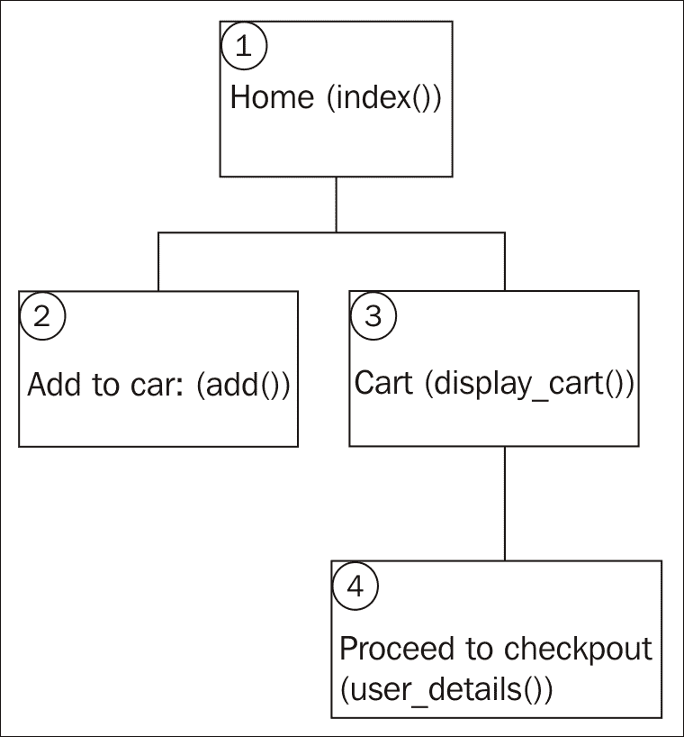
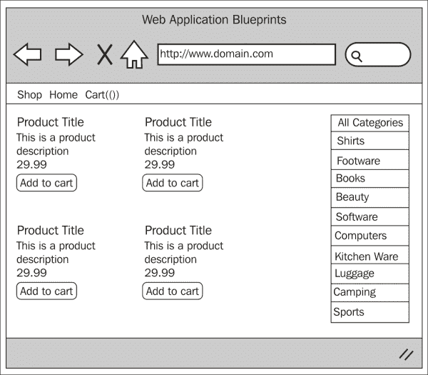
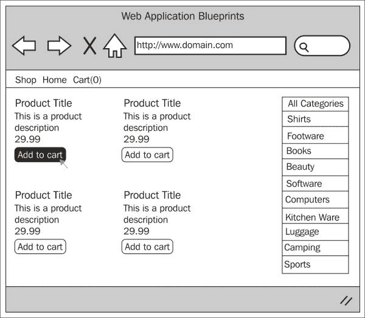
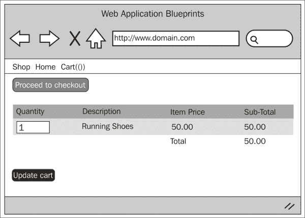
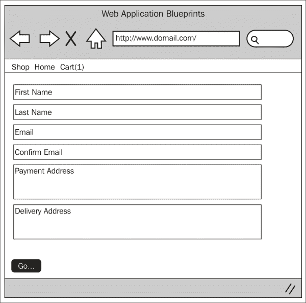

# 第七章 创建电子商务网站

这是一个小型、简洁的电子商务应用程序。没有管理 CMS 来管理产品（在本章中写太多会过于复杂），但有一个易于使用（并且对于您来说易于适应）的过程来显示产品并让客户订购它们。

在本章中，我们将涵盖：

+   设计和线框

+   创建数据库

+   创建模型

+   创建视图

+   创建控制器

+   整合所有内容

# 简介

在这个项目中，我们将创建一个简单的购物车。这个应用程序将允许客户查看产品，按类别过滤产品，并将产品添加到他们的购物车中。

它还将允许客户通过删除项目或更改这些项目的数量来更改他们的购物车。

最后，有一个客户详细信息表，允许将他们的个人详细信息保存到订单中以便处理。

为了创建这个项目的网络应用程序，我们将创建一个控制器；这将处理产品的显示、修改购物车中产品的数量，并处理订单的处理。

我们将创建一个语言文件来存储文本，这样在需要的情况下，您就可以拥有多种语言支持。

我们将创建所有必要的视图文件和一个与数据库接口的模型。

然而，这个应用程序以及本书中的其他所有应用程序都依赖于我们在第一章中做的基本设置，*简介和共享项目资源*；尽管您可以取大量代码并将其放入您可能已经拥有的任何应用程序中，但请记住，第一章中做的设置是这个章节的基础。

因此，无需多言，让我们开始吧。

# 设计和线框

和往常一样，在我们开始构建之前，我们应该看看我们打算构建什么。

首先，我们将简要描述我们的意图。我们计划构建一个应用程序，让人们可以像在线商店一样查看产品。他们可以按类别对这些产品进行排序。将产品添加到购物车中，并输入他们的详细信息以创建订单。将生成一个称为`order_fulfilment_code`的特殊代码（保存在`orders.order_fulfilment_code`数据库中）。此代码将允许您通过支付系统跟踪任何订单。

总之，为了更好地了解正在发生的事情，让我们看看以下网站地图：



所以这就是网站地图——首先要注意的是网站有多简单。这个项目只有四个主要区域。让我们逐一了解每个项目，并简要了解它们的功能：

+   **首页**：这是初始着陆区域。`index()`函数显示要查看的产品，并显示用户可以过滤产品以查看相关项目的类别。因此，通过点击书籍类别，他们将只能看到被分配为书籍类别的产品。

+   **添加到购物车**：这处理将产品添加到用户购物车中的过程。购物车中的项目数量始终在导航栏中显示。

+   **购物车**：这显示了购物车中的项目列表以及增加或减少该购物车中每个项目数量的选项。

+   **前往结账**：这向用户显示一个表单，邀请他们输入信息。一旦他们点击“前往”，他们的订单和详细信息就会被添加到数据库中进行处理。

现在我们对网站的结构和形式有了相当好的了解，让我们来看看每个页面的线框图。

## 首页 – index()

以下截图展示了网站地图中**1**（首页`index()`项）的线框图。最初，用户会看到一个产品列表。该列表未经过筛选。在线框图的右侧是一个类别列表（如`categories`表中所示）。用户可以点击这些类别来筛选左侧查看的结果，点击**所有类别**将再次清除筛选。

每个产品下方都有一个**添加到购物车**按钮，允许用户将特定产品添加到购物车中。



## 添加到购物车 – add()

以下截图展示了用户点击并添加产品到购物车的过程。这是通过点击特定产品下方的**添加到** **购物车**按钮完成的。点击此按钮将调用`shop`控制器的`add()`函数，然后该函数将调用 CodeIgniter `Cart`类的`$this->cart->insert()`函数，该函数将产品添加到购物车中。



## 购物车 – display_cart()

以下截图展示了网站地图中**3**（购物车`display_cart()`项）的线框图。用户会看到一个当前购物车中的项目列表。`display_cart()`函数可以通过两种方式访问——要么点击顶部导航菜单中的**购物车**链接，要么在点击网站地图中**1**（首页`index()`项）下显示的产品**添加到购物车**后立即进行。

点击**前往结账**将调用网站地图中**4**（前往结账项）的`user_details()`函数。



## 用户详情 – user_details()

以下截图展示了网站地图中**4**（前往结账`user_details()`项）的线框图。用户会看到一个表单，可以在其中添加他们的联系和配送详情。一旦用户输入详细信息并点击“前往”，他们的订单（购物车内容）和联系详情就会被写入`orders`和`customer`表，这两个表通过客户 ID 在`orders`表中连接。



## 文件概览

这是一个相对较小的项目，总的来说，我们只需要创建七个文件；具体如下：

+   `/path/to/codeigniter/application/models/shop_model.php`: 该文件提供对数据库的读写访问。

+   `/path/to/codeigniter/application/views/shop/display_products.php`: 该文件向用户显示产品列表，允许他们添加产品到购物车，并按类别过滤产品——如`categories`表中所定义的。

+   `/path/to/codeigniter/application/views/shop/display_cart.php`: 该文件向用户显示购物车的内容。有表单选项可以修改产品数量并进入结账流程。

+   `/path/to/codeigniter/application/views/shop/user_details.php`: 该文件向用户显示一个表单，允许他们输入订单履行的联系详情。用户信息存储在`customer`表中，该表通过`customer`表的主键与`orders`表（在`orders`表中）关联。

+   `/path/to/codeigniter/application/views/nav/top_nav.php`: 该文件在页面顶部提供导航栏。

+   `/path/to/codeigniter/application/controllers/shop.php`: 该文件包含显示产品、将产品添加到购物车、修改购物车和处理客户详情所需的所有必要函数。

+   `/path/to/codeigniter/application/language/english/en_admin_lang.php`: 该文件为应用程序提供语言支持。

前述七个文件的文件结构如下：

```php
application/
├── controllers/
│   ├── shop.php
├── models/
│   ├── shop_model.php
├── views/shop/
│   ├── display_products.php
│   ├── display_cart.php
│   ├── user_details.php
├── views/nav/
│   ├── top_nav.php
├── language/english/
│   ├── en_admin_lang.php
```

# 创建数据库

好的，你应该已经按照第一章中所述设置了 CodeIgniter 和 Bootstrap，*简介和共享项目资源*。如果没有，那么你应该知道，本章中的代码是专门针对第一章中的设置编写的。然而，如果你还没有设置，也不是世界末日；代码可以轻松应用于其他情况。

首先，我们将构建数据库。将以下 MySQL 代码复制到您的数据库中：

```php
CREATE DATABASE `shopdb`;
USE DATABASE `shopdb`;

CREATE TABLE `categories` (
  `cat_id` int(11) NOT NULL AUTO_INCREMENT,
  `cat_name` varchar(50) NOT NULL,
  `cat_url_name` varchar(15) NOT NULL,
  PRIMARY KEY (`cat_id`)
) ENGINE=InnoDB AUTO_INCREMENT=11 DEFAULT CHARSET=latin1;

INSERT INTO `categories` VALUES (1,'Shirts','shirts'),(2,'Footware','footware'),(3,'Books','books'),(4,'Beauty','beauty'),(5,'Software','software'),(6,'Computers','computers'),(7,'Kitchen Ware','kitchenware'),(8,'Luggage','luggage'),(9,'Camping','camping'),(10,'Sports','sports');

CREATE TABLE `ci_sessions` (
  `session_id` varchar(40) COLLATE utf8_bin NOT NULL DEFAULT '0',
  `ip_address` varchar(16) COLLATE utf8_bin NOT NULL DEFAULT '0',
  `user_agent` varchar(120) COLLATE utf8_bin DEFAULT NULL,
  `last_activity` int(10) unsigned NOT NULL DEFAULT '0',
  `user_data` text COLLATE utf8_bin NOT NULL
) ENGINE=MyISAM DEFAULT CHARSET=utf8 COLLATE=utf8_bin;

CREATE TABLE `customer` (
  `cust_id` int(11) NOT NULL AUTO_INCREMENT,
  `cust_first_name` varchar(125) NOT NULL,
  `cust_last_name` varchar(125) NOT NULL,
  `cust_email` varchar(255) NOT NULL,
  `cust_created_at` timestamp NOT NULL DEFAULT CURRENT_TIMESTAMP,
  `cust_address` text NOT NULL COMMENT 'card holder address',
  PRIMARY KEY (`cust_id`)
) ENGINE=InnoDB AUTO_INCREMENT=1 DEFAULT CHARSET=latin1;

CREATE TABLE `orders` (
  `order_id` int(11) NOT NULL AUTO_INCREMENT,
  `cust_id` int(11) NOT NULL,
  `order_details` text NOT NULL,
  `order_subtotal` int(11) NOT NULL,
  `order_created_at` timestamp NOT NULL DEFAULT CURRENT_TIMESTAMP,
  `order_closed` int(1) NOT NULL COMMENT '0 = open, 1 = closed',
  `order_fulfilment_code` varchar(255) NOT NULL COMMENT 'the unique code sent to a payment provider',
  `order_delivery_address` text NOT NULL,
  PRIMARY KEY (`order_id`)
) ENGINE=InnoDB AUTO_INCREMENT=1 DEFAULT CHARSET=latin1;

CREATE TABLE `products` (
  `product_id` int(11) NOT NULL AUTO_INCREMENT,
  `product_name` varchar(255) NOT NULL,
  `product_code` int(11) NOT NULL,
  `product_description` varchar(255) NOT NULL,
  `category_id` int(11) NOT NULL,
  `product_price` int(11) NOT NULL,
  PRIMARY KEY (`product_id`)
) ENGINE=InnoDB AUTO_INCREMENT=14 DEFAULT CHARSET=latin1;

INSERT INTO `products` VALUES (1,'Running Shoes',423423,'These are some shoes',2,50),(2,'Hawaiian Shirt',34234,'This is a shirt',1,25),(3,'Slippers',23134,'Nice comfortable  slippers',2,4),(4,'Shirt',2553245,'White Office Shirt',1,25),(5,'CodeIgniter Blueprints',5442342,'Some excellent projects to make and do (in CodeIgniter) - it\'s good value too!',3,25),(6,'Office Suite',34234123,'Writer, Calc, Presentation software',5,299),(7,'Anti-Virus',324142,'Get rid of those pesky viruses from your computer',5,29),(8,'Operating System',12341,'This can run your computer',5,30),(9,'Web Browser',42412,'Browse the web with a web browser (that\'s what they\'re for)',5,5),(10,'Dinner set',3241235,'6 dinner plates, 6 side plates, 6 cups',7,45),(11,'Champagne Glasses',1454352,'Crystal glasses to drink fizzy French plonk from ',7,45),(12,'Toaster',523234,'Capable of toasting 4 slices at once!',7,35),(13,'Kettle',62546245,'Heat water with this amazing kettle',7,25);
```

### 小贴士

现在看看最后那段 SQL 代码；它相当大且复杂。不要慌张；所有 SQL 代码都可以从本书在 Packt 网站上的支持页面在线获取。

你会看到我们首先创建的表是`ci_sessions`。我们需要这个表来允许 CodeIgniter 管理会话，特别是客户的购物车。然而，这只是从*CodeIgniter 用户指南*中可用的标准会话表，因此我不会包括该表的描述，因为它不是技术特定于这个应用程序的。但是，如果你感兴趣，可以在[`ellislab.com/codeigniter/user-guide/libraries/sessions.html`](http://ellislab.com/codeigniter/user-guide/libraries/sessions.html)找到描述。

好的，让我们逐个查看每个表中的每个项目，看看它们代表什么。首先，我们将查看`categories`表。

| 表：categories |
| --- |
| **元素** | **描述** |
| `cat_id` | 这是主键 |
| `cat_name` | 这是分类的名称，并在`views/shop/display_products.php`文件中右侧分类过滤器列表中作为标题显示 |
| `cat_url_name` | 这是`cat_name`元素的简短版本；当用户在`views/shop/display_products.php`文件中点击右侧分类过滤器列表中的分类时，它用作 URL 的第三个参数 |

现在看看`products`表：

| 表：products |
| --- |
| **元素** | **描述** |
| `product_id` | 这是主键 |
| `product_name` | 这是产品的名称 |
| `product_code` | 这是您可以存储产品内部参考代码的地方 |
| `product_description` | 这是产品的描述 |
| `category_id` | 这是产品所属的分类，也是`categories`表的主键 |
| `product_price` | 这是产品的价格 |

接下来我们将看到`customer`表：

| 表：customer |
| --- |
| **元素** | **描述** |
| `cust_id` | 这是主键 |
| `cust_first_name` | 这是客户的姓氏 |
| `cust_last_name` | 这是客户的姓氏 |
| `cust_email` | 这是客户的电子邮件地址 |
| `cust_created_at` | 这是数据库中创建行的 MySQL 时间戳 |
| `cust_address` | 这是客户地址（支付地址） |

最后，让我们看看`orders`表：

| 表：orders |
| --- |
| **元素** | **描述** |
| `order_id` | 这是主键 |
| `cust_id` | 这是来自`customer`表的客户主键 |
| `order_details` | 这是`cart`表序列化的输出，由`serialize($this->cart->contents())`行填充 |
| `order_subtotal` | 这是订单的值 |
| `order_created_at` | 这是数据库中创建行的 MySQL 时间戳 |
| `order_closed` | 默认值是`0`但可以是`1`。`0`表示这是一个新订单，而`1`表示订单已履行 |
| `order_fulfilment_code` | 这是`shop`控制器中的`user_details()`函数生成的`$payment_code`的值，它可以用来通过支付系统跟踪订单 |
| `order_delivery_address` | 这是订单的配送地址 |

我们还需要对`config/database.php`文件进行修改，即设置数据库访问详情、用户名、密码等。

打开`config/database.php`文件并找到以下行：

```php
$db['default']['hostname'] = 'localhost';
$db['default']['username'] = 'your username';
$db['default']['password'] = 'your password';
$db['default']['database'] = 'shopdb';
```

现在编辑前面的行中的值，确保将这些值替换为更适合您设置和情况的值；因此，输入您的用户名、密码等。

# 调整`config.php`文件

在这个文件中有几件事情我们需要配置以支持会话和加密。因此，打开`config/config.php`文件并做出以下更改：

1.  我们需要设置一个加密密钥；会话和 CodeIgniter 的加密功能都需要在`$config`数组中设置一个加密密钥，所以找到以下行：

    ```php
    $config['encryption_key'] = '';
    ```

    用以下内容替换它：

    ```php
    $config['encryption_key'] = 'a-random-string-of-alphanum-characters';
    ```

    ### 小贴士

    显然，实际上不要将值改为一个随机的字母数字字符序列；相反，改为，嗯，一个随机的字母数字字符序列——如果这说得通的话？是的，你知道我的意思。

1.  找到以下行：

    ```php
    $config['sess_cookie_name'] = 'ci_session';
    $config['sess_expiration'] = 7200;
    $config['sess_expire_on_close'] = FALSE;
    $config['sess_encrypt_cookie'] = FALSE;
    $config['sess_use_database'] = FALSE;
    $config['sess_table_name'] = 'ci_sessions';
    $config['sess_match_ip'] = FALSE;
    $config['sess_match_useragent'] = TRUE;
    $config['sess_time_to_update'] = 300;
    ```

    用以下内容替换这些行：

    ```php
    $config['sess_cookie_name'] = 'ci_session';
    $config['sess_expiration'] = 7200;
    $config['sess_expire_on_close'] = TRUE;
    $config['sess_encrypt_cookie'] = TRUE;
    $config['sess_use_database'] = TRUE;
    $config['sess_table_name'] = 'ci_sessions';
    $config['sess_match_ip'] = TRUE;
    $config['sess_match_useragent'] = TRUE;
    $config['sess_time_to_update'] = 300;
    ```

# 调整 routes.php 文件

我们希望将用户重定向到`shop`控制器而不是默认的 CodeIgniter `welcome`控制器。我们需要修改`routes.php`文件中的默认控制器设置以反映这一点：

1.  打开`config/routes.php`文件进行编辑，并找到以下行（文件底部附近）：

    ```php
    $route['default_controller'] = "welcome";
    $route['404_override'] = '';
    ```

1.  首先，我们需要更改默认控制器。最初在一个 CodeIgniter 应用程序中，默认控制器被设置为`welcome`；然而，我们不需要它。相反，我们希望默认控制器是`shop`。所以，找到以下行：

    ```php
    $route['default_controller'] = "welcome";
    ```

    改成以下内容：

    ```php
    $route['default_controller'] = "shop";
    $route['404_override'] = '';
    ```

# 创建模型

在本项目中有且只有一个模型——`shop_model.php`——它包含特定于搜索和将产品写入数据库的函数。

这是本项目唯一的模型；让我们简要地回顾一下其中的每个函数，以了解其一般功能，然后我们将更详细地进入代码部分。

在这个模型中有五个主要函数，具体如下：

+   `get_product_details()`: 这个函数接受一个参数——即将添加到购物车的产品的`$product_id`——并返回一个包含特定产品信息的数据库结果对象。这个模型函数被`shop`控制器的`add()`函数用来在产品添加到购物车之前获取正确的产品详情。

+   `get_all_products()`: 这个函数不接受任何参数。这个模型函数将返回产品列表（如`products`表中定义的）到`shop`控制器的`index()`函数。

+   `get_all_products_by_category_name()`: 这个函数接受一个参数——`$cat_url_name`（在数据库中定义为`categories.cat_url_name`）。当用户点击了分类筛选链接（在本章“首页 – index()”部分的页面右侧显示）时，会调用此函数。

+   `get_all_categories()`: 这个函数从`categories`表中获取分类。它用于填充分类列表（在本章“首页 – index()”部分的页面右侧显示）。

+   `save_cart_to_database()`: 这个函数接受两个参数：`$cust_data` 和 `$order_data`。`$cust_data` 是用户在网站地图中第 **4** 点（继续结账的 `user_details()` 项目）提交的数据，而 `$order_data` 是他们购物车的内容。客户数据被添加到 `customer` 表中，生成的主键被用作 `orders` 表的外键。

这只是一个简要概述，所以让我们创建模型并讨论其功能。

在 `/path/to/codeigniter/application/models/shop_model.php` 文件中创建文件，并将以下代码添加到其中：

```php
<?php if ( ! defined('BASEPATH')) exit('No direct script access allowed'); 

class Shop_model extends CI_Model { 
  function __construct() { 
    parent::__construct(); 
    $this->load->helper('url');
  } 

  public function get_product_details($product_id) { 
    $this->db->where('product_id', $product_id); 
    $query = $this->db->get('products'); 
    return $query; 
  }
```

前面的 `get_product_details()` 函数返回所有产品的列表。如果用户没有过滤任何结果，即他们没有在 `views/shop/display_products.php` 文件中点击类别链接，这个函数将由 `shop` 控制器的 `index()` 函数调用：products() {

```php
  $q
public function get_all_uery = $this->db->get('products'); 
  return $query; 
}
```

前面的 `get_all_products()` 函数返回应用了过滤条件的产品列表。如果用户通过类别过滤了产品，即他们点击了 `views/shop/display_products.php` 文件中的类别链接，这个函数将由 `shop` 控制器的 `index()` 函数调用：

```php
public function get_all_products_by_category_name($cat_url_name = null) {
  if ($cat_url_name) {
    $this->db->where('cat_url_name', $cat_url_name);
    $cat_query = $this->db->get('categories');

    foreach ($cat_query->result() as $row) {
      $category_id = $row->cat_id;
    }

    $this->db->where('category_id', $category_id);
  }

  $query = $this->db->get('products'); 
  return $query; 
}
```

前面的 `get_all_products_by_category_name()` 函数返回 `categories` 表中所有类别的列表。这个模型函数是从 `shop` 控制器的 `index()` 函数中调用的，以向 `views/shop/display_products.php` 文件右侧的产品类别列表提供数据：

```php
public function get_all_categories($cat_url_name = null) {
  if ($cat_url_name) {
    $this->db->where('cat_url_name', $cat_url_name);
  }

  $query = $this->db->get('categories');
  return $query;
}
```

前面的 `get_all_categories()` 函数返回 `categories` 表中所有类别的列表。这个列表在 `views/shop/display_products.php` 文件中使用，其中 `foreach` 循环遍历数据库对象并显示类别给用户。用户可以点击一个类别并过滤他们的结果。

现在，看一下以下片段：

```php
  public function save_cart_to_database($cust_data, $order_data) { 
    $this->db->insert('customer', $cust_data); 
    $order_data['cust_id'] = $this->db->insert_id(); 
    if ($this->db->insert('orders', $order_data)) {
      return true;
    } else {
      return false;
    }
  } 
}
```

前面的 `save_cart_to_database()` 函数将订单保存到数据库中；它将购物车中的数据以及用户在 `views/shop/user_details.php` 文件中输入的数据进行转换。

如您所见，模型相当直接和简洁，因此现在让我们看看视图。

# 创建视图

本项目中有四个视图，具体如下：

+   `/path/to/codeigniter/application/views/shop/display_products.php`: 这个视图向用户显示产品列表，并允许他们添加产品到购物车，也可以过滤产品。

+   `/path/to/codeigniter/application/views/shop/display_cart.php`: 这个视图显示用户购物车中的所有产品，允许他们更改购物车中产品的数量，并提供一个选项跳转到结账阶段。这是从 CodeIgniter 文档中可用的购物车模板的定制版本。

+   `/path/to/codeigniter/application/views/shop/user_details.php`: 这个视图向用户显示一个表单，允许他们输入有关订单的信息，例如他们的联系细节和送货地址。

+   `/path/to/codeigniter/application/views/nav/top_nav.php`：此视图显示顶级菜单。在此项目中，这非常简单，包含项目名称和链接到 `shop` 控制器以及名为 **购物车** 的链接；旁边有一个变量，显示值（默认为 0）；然而，这实际上是任何时刻购物车中的项目数量。如果购物车中有七个项目，链接将显示为购物车（7）。

那是对视图的良好概述；现在让我们逐一查看每个视图，构建代码，并讨论它们的功能。

创建 `/path/to/codeigniter/application/views/shop/display_products.php` 文件，并将以下代码添加到其中：

```php
<div class="row row-offcanvas row-offcanvas-right">

  <div class="col-xs-12 col-sm-9">
    <div class="row">
      <?php foreach ($query->result() as $row) : ?> 
        <div class="col-6 col-sm-6 col-lg-4">
          <h2><?php echo $row->product_name ; ?></h2>
          <p>&pound;<?php echo $row->product_price ; ?></p>
          <p><?php echo $row->product_description ; ?></p>
          <?php echo anchor('shop/add/'.$row->product_id, $this->lang->line('index_add_to_cart'), 'class="btn btn-default"') ; ?>
        </div>
      <?php endforeach ; ?> 
    </div>
  </div>
```

上述代码块输出产品列表，并显示描述（`products.product_description`）、价格（`products.product_price`）和添加到购物车的链接。

使用 `foreach` 循环遍历 `$query` 中的产品。`$query` 的值由 `Shop_model` 的 `get_all_products()` 函数返回的数据填充；或者，如果用户已按类别（在下述 HTML 中解释）过滤，则 `$query` 由 `Shop_model` 的 `get_all_products_by_category_name()` 函数填充：

```php
  <div class="col-xs-6 col-sm-3 sidebar-offcanvas" id="sidebar" role="navigation">
    <div class="list-group">
      <?php echo anchor(base_url(), $this->lang->line('index_all_categories'), 'class="list-group-item"') ; ?>
      <?php foreach ($cat_query->result() as $row) : ?>
        <?php echo anchor('shop/index/'.$row->cat_url_name, $row->cat_name, 'class="list-group-item"') ; ?>
      <?php endforeach ; ?>
    </div>
  </div>
</div>
```

上述代码块输出用户可以使用以过滤结果的类别列表。我们使用 `foreach` 循环遍历 `$cat_query` 数组。此数组由 `Shop_model` 的 `get_all_categories()` 函数提供。

创建 `/path/to/codeigniter/application/views/shop/display_cart.php` 文件，并将以下代码添加到其中：

```php
<?php echo anchor('shop/user_details', $this->lang->line('display_cart_proceed_to_checkout'), 'type="button" class="btn btn-primary btn-lg"') ; ?> 
<br /><br />
<?php echo form_open('shop/update_cart'); ?> 

<table class="table"> 

  <tr> 
    <th><?php echo $this->lang->line('display_cart_quantity') ; ?></th> 
    <th><?php echo $this->lang->line('display_cart_description') ; ?></th> 
    <th><?php echo $this->lang->line('display_cart_item_price') ; ?></th> 
    <th><?php echo $this->lang->line('display_cart_sub_total') ; ?></th> 
  </tr> 
```

此视图负责向用户显示购物车的内容，并允许用户调整购物车中的项目数量。

查看以下代码行；通过它，我们创建了 `$i` 变量。这个变量在 `foreach` 循环中递增。我们使用 `$i` 变量给产品数量文本框赋予一个唯一的名称，即 1、2、3、4，依此类推：

```php
  <?php $i = 1; ?> 
```

此 `foreach` 循环遍历 CodeIgniter `Cart` 类的 `$this->cart->contents()` 函数中的每个项目。每次迭代被视为 `$item` 变量：

```php
  <?php foreach ($this->cart->contents() as $items): ?> 

    <?php echo form_hidden($i . '[rowid]', $items['rowid']); ?> 

    <tr> 
      <td><?php echo form_input(array('name' => $i . '[qty]', 'value' => $items['qty'], 'maxlength' => '3', 'size' => '5')); ?></td> 
      <td> 
        <?php echo $items['name']; ?> 

        <?php if ($this->cart->has_options($items['rowid']) == TRUE): ?> 

          <p> 
            <?php foreach ($this->cart->product_options($items['rowid']) as $option_name => $option_value): ?> 

              <strong><?php echo $option_name; ?>:</strong> <?php echo $option_value; ?><br /> 

            <?php endforeach; ?> 
          </p> 

        <?php endif; ?> 

      </td> 
      <td><?php echo $this->cart->format_number($items['price']); ?></td> 
      <td>&pound;<?php echo $this->cart->format_number($items['subtotal']); ?></td> 
    </tr> 

    <?php $i++; ?> 

  <?php endforeach; ?> 

  <tr> 
    <td colspan="2"> </td> 
    <td><strong>Total</strong></td> 
    <td>&pound<?php echo $this->cart->format_number($this->cart->total()); ?></td> 
  </tr> 

</table> 
```

在 `foreach` 循环之后，我们向用户显示一个按钮。以下代码是用于提交表单以及任何调整后的项目数量的按钮：

```php
<p><?php echo form_submit('', $this->lang->line('display_cart_update_cart'), 'class="btn btn-success"'); ?></p> 
<?php echo form_close() ; ?>
```

创建 `/path/to/codeigniter/application/views/shop/user_details.php` 文件，并将以下代码添加到其中：

```php
<div class="row row-offcanvas row-offcanvas-right">
  <div class="col-xs-12 col-sm-9">
    <div class="row">
      <?php echo validation_errors(); ?> 
      <?php echo form_open('/shop/user_details') ; ?> 
      <?php echo form_input($first_name); ?><br /> 
      <?php echo form_input($last_name); ?><br /> 
      <?php echo form_input($email); ?><br /> 
      <?php echo form_input($email_confirm); ?><br /> 
      <?php echo form_textarea($payment_address); ?><br /> 
      <?php echo form_textarea($delivery_address); ?><br /> 
      <?php echo form_submit('', $this->lang->line('common_form_elements_go'), 'class="btn btn-success"') ; ?><br /> 
      <?php echo form_close() ; ?> 
    </div>
  </div>
</div>
```

上述代码块创建了一个表单，用户可以输入完成订单所需的联系详细信息。

创建 `/path/to/codeigniter/application/views/nav/top_nav.php` 文件，并将以下代码添加到其中：

```php
<!-- Fixed navbar -->
<div class="navbar navbar-inverse navbar-fixed-top" role="navigation">
  <div class="container">
    <div class="navbar-header">
      <button type="button" class="navbar-toggle" data-toggle="collapse" data-target=".navbar-collapse">
        <span class="sr-only">Toggle navigation</span>
        <span class="icon-bar"></span>
        <span class="icon-bar"></span>
        <span class="icon-bar"></span>
      </button>
      <a class="navbar-brand" href="<?php echo base_url() ; ?>"><?php echo $this->lang->line('system_system_name'); ?></a>
    </div>
    <div class="navbar-collapse collapse">
      <ul class="nav navbar-nav">
        <li class="active"><?php echo anchor('shop', $this->lang->line('nav_home')) ; ?></li>
        <li><?php echo anchor('shop/display_cart', ($items > 0) ? $this->lang->line('nav_cart_count') . '(' . $items . ')' : $this->lang->line('nav_cart_count') .'(0)') ; ?></li>
      </ul>
    </div><!--/.nav-collapse -->
  </div>
</div>
<div class="container theme-showcase" role="main">
```

上述代码块在页面顶部创建导航菜单。请查看以下加粗的代码，此处再次展示（重构后）：

```php
<li>
  <?php 
    echo anchor('shop/display_cart', 
    ($items > 0) ? $this->lang->line('nav_cart_count') . 
    '(' . $items . ')' : $this->lang->line('nav_cart_count').'(0)') ; 
  ?>
</li>
```

上述代码块显示了与括号中的值一起的单词“Cart”。这个值最初被设置为 0（零）。然而，这个值实际上是购物车中的物品数量——如果没有物品在购物车中，这个数字将默认为零。

首先，我们使用 PHP 三元运算符在显示零和购物车中实际物品数量之间进行切换。如果物品数量大于零，那么购物车中肯定有一些物品。因此，我们显示那个数量，否则显示零。

单词“Cart”是在语言文件中设置的，但购物车中物品数量的值是从哪里来的呢？

购物车中的物品数量是由`shop`控制器中的几个函数计算得出的，这些函数包括`index()`、`update_cart()`和`user_details()`。让我们看看其中的一个（因为它们的工作方式相同）并看看它在`index()`函数中的工作方式；查看以下来自`index()`函数的代码段：

```php
...
$cart_contents = $this->session->userdata('cart_contents');
$data['items'] = $cart_contents['total_items'];

$this->load->view('common/header');
$this->load->view('nav/top_nav', $data);
...
```

我们从存储在`cart_contents`会话项中的购物车内容中获取内容，并将其存储在`$cart_contents`变量中（为了简单起见）。

CodeIgniter 的`Cart`类会自动跟踪购物车中所有物品的总数，并方便地将它存储在`$cart_contents`数组中的`total_items`项中。

然后，我们将`$data['items']`的值设置为`total_items`（这应该是购物车中的物品数量），并将其发送到`nav/top_nav.php`视图文件，在那里它紧挨着“Cart”这个词显示。

# 创建控制器

在这个项目中，我们将只创建一个控制器，即`/path/to/codeigniter/application/controllers/shop.php`。

现在我们来回顾一下那个控制器，看看代码，并讨论它是如何工作的。

创建`/path/to/codeigniter/application/controllers/shop.php`文件，并向其中添加以下代码：

```php
<?php if (!defined('BASEPATH')) exit('No direct script access allowed'); 

class Shop extends MY_Controller {
  function __construct() { 
    parent::__construct(); 
    $this->load->library('cart'); 
    $this->load->helper('form'); 
    $this->load->helper('url'); 
    $this->load->helper('security'); 
    $this->load->model('Shop_model');
    $this->load->library('form_validation');
    $this->form_validation->set_error_delimiters('<div class="alert alert-danger">', '</div>');
  } 

  public function index() {
```

我们希望显示正确的产品，因此我们需要测试用户是否点击了`views/shop/display_products.php`文件右侧的其中一个筛选链接。我们测试是否存在第三个`uri`参数。

如果第三个参数不存在，那么我们可以安全地假设用户不想进行任何过滤。因此，我们调用`Shop_model`的`get_all_products()`函数。

如果存在第三个参数，那么用户必须正在过滤他们的结果。因此，我们调用`get_all_products_by_category_name($this->uri->segment(3))`函数，并将第三个参数传递给它。

第三个参数来自数据库中的`categories.cat_url_name`列，在`views/shop/display_products.php`文件中通过一个`foreach`循环写出来。

循环遍历由`Shop_model`的`get_all_categories()`函数填充的`cat_query`数据库对象，如下所示：

```php
if (!$this->uri->segment(3)) {
  $data['query'] = $this->Shop_model->get_all_products();
} else {
  $data['query'] = $this->Shop_model->get_all_products_by_category_name($this->uri->segment(3));
}
```

如前一段所述，调用`Shop_model`的`get_all_categories()`函数，将其结果返回到`$data['cat_query']`。在`views/shop/display_products.php`文件中，它通过`foreach`循环遍历以创建分类列表：

```php
$data['cat_query'] = $this->Shop_model->get_all_categories();
```

现在，我们从`cart_contents`会话项中获取购物车中的商品数量。关于这一点的完整解释在本章的*创建视图*部分，特别是在对`/path/to/codeigniter/application/views/nav/top_nav.php`视图文件的解释中：

```php
  $cart_contents = $this->session->userdata('cart_contents');
  $data['items'] = $cart_contents['total_items'];

  $this->load->view('common/header');
  $this->load->view('nav/top_nav', $data);
  $this->load->view('shop/display_products', $data); 
  $this->load->view('common/footer');
}
```

以下`add()`函数将商品添加到购物车。它从`views/shop/display_products.php`文件中调用，当用户点击“添加到购物车”时。**添加到购物车**链接的第三个参数是产品 ID（`products.product_id`）。我们从 URI（它是第三个部分）中获取产品 ID，并将其传递给`Shop_model`的`get_product_details($product_id)`函数。这将返回产品详情到`$query`变量。我们遍历`$query`，提取产品的单个详情并将其保存到`$data`数组中：

```php
public function add() { 
  $product_id = $this->uri->segment(3);
  $query = $this->Shop_model->get_product_details($product_id); 
  foreach($query->result() as $row) { 
    $data = array( 
      'id'   => $row->product_id, 
      'qty' => 1, 
      'price'  => $row->product_price, 
      'name' => $row->product_name, 
     ); 
  } 
```

我们使用 CodeIgniter `Cart`类的`$this->cart->insert();`函数将`$data`数组保存到购物车中：

```php
$this->cart->insert($data);
```

我们随后获取所有分类列表以及购物车中新的商品数量，并将它们发送到`nav/top_nav.php`视图文件。

`shop/display_cart.php`视图文件将使用 CodeIgniter `Cart`类的`$this->cart->contents()`函数遍历购物车的内容：

```php
  $data['cat_query'] = $this->Shop_model->get_all_categories();
  $cart_contents = $this->session->userdata('cart_contents');
  $data['items'] = $cart_contents['total_items'];

  $this->load->view('common/header');
  $this->load->view('nav/top_nav', $data);
  $this->load->view('shop/display_cart', $data); 
  $this->load->view('common/footer');
}
```

当用户在`views/shop/display_cart.php`文件中点击**更新购物车**按钮时，将调用`update_cart()`函数。当它被调用时，它遍历来自`views/shop/display_cart.php`表单的输入并将其保存到`$data`数组中；让我们看一下：

```php
public function update_cart() { 
  $data = array(); 
  $i = 0; 
```

首先，我们创建一个名为`$data`的数组，在其中我们可以存储调整后的购物车数据（我们稍后会用到）。然后，我们创建一个`$i`变量；我们将使用这个变量来创建一个多维数组，在循环的每次迭代中增加`$i`的值——`$i`保持`rowid`值（购物车中产品的 ID）和`qty`值相关联。

我们遍历提交的数据（来自`views/shop/display_cart.php`中的表单），将循环的每次迭代视为`$item`。

每个`$item`都有一个`rowid`元素（产品在购物车中的位置）和`qty`，这是调整后的产品数量：

```php
foreach($this->input->post() as $item) { 
  $data[$i]['rowid']  = $item['rowid']; 
  $data[$i]['qty']    = $item['qty'];
  $i++;
} 
```

现在购物车数据已经迭代完毕，并且已经进行了任何数量的调整，我们将使用 CodeIgniter `Cart`类的`$this->cart->update()`函数来更新购物车。然后，我们使用`redirect()`函数将用户重定向到`shop`控制器的`display_cart()`函数，该函数将向用户报告新的值：

```php
  $this->cart->update($data); 
  redirect('shop/display_cart'); 
} 
```

实际上，对购物车数据的迭代是在`views/shop/display_cart.php`视图文件中完成的，但`display_cart()`函数的存在是为了提供一种特定方式来查看购物车中的商品。调用此函数将加载`views/shop/display_cart.php`视图：

```php
public function display_cart() { 
  $data['cat_query'] = $this->Shop_model->get_all_categories();
  $cart_contents = $this->session->userdata('cart_contents');
  $data['items'] = $cart_contents['total_items'];
  $this->load->view('common/header');
  $this->load->view('nav/top_nav', $data);
  $this->load->view('shop/display_cart', $data); 
  $this->load->view('common/footer');
}

public function clear_cart() { 
  $this->cart->destroy(); 
  redirect('index');
}
```

`user_details()` 函数负责向用户显示表单，允许他们输入联系信息，验证这些信息，并将购物车转换为订单。让我们详细看看它是如何工作的。

首先，我们开始设置表单提交的验证规则：

```php
public function user_details() { 
    // Set validation rules 
    $this->form_validation->set_rules('first_name', $this->lang->line('user_details_placeholder_first_name'), 'required|min_length[1]|max_length[125]'); 
    $this->form_validation->set_rules('last_name', $this->lang->line('user_details_placeholder_last_name'), 'required|min_length[1]|max_length[125]'); 
    $this->form_validation->set_rules('email', $this->lang->line('user_details_placeholder_email'), 'required|min_length[1]|max_length[255]|valid_email'); 
    $this->form_validation->set_rules('email_confirm', $this->lang->line('user_details_placeholder_email_confirm'), 'required|min_length[1]|max_length[255]|valid_email|matches[email]'); 
    $this->form_validation->set_rules('payment_address', $this->lang->line('user_details_placeholder_payment_address'), 'required|min_length[1]|max_length[1000]'); 
    $this->form_validation->set_rules('delivery_address', $this->lang->line('user_details_placeholder_delivery_address'), 'min_length[1]|max_length[1000]'); 
```

如果这是初始页面加载或表单提交出现错误，则 `$this->form_validation->run()` 函数将返回 `FALSE`。如果发生任何一种情况，我们将开始构建表单元素，为每个表单项定义设置：

```php
if ($this->form_validation->run() == FALSE) { 
  $data['first_name'] = array('name' => 'first_name', 'class' => 'form-control', 'id' => 'first_name', 'value' => set_value('first_name', ''), 'maxlength' => '100', 'size' => '35', 'placeholder' => $this->lang->line('user_details_placeholder_first_name'));
  $data['last_name'] = array('name' => 'last_name', 'class' => 'form-control', 'id' => 'last_name', 'value' => set_value('last_name', ''), 'maxlength' => '100', 'size' => '35', 'placeholder' => $this->lang->line('user_details_placeholder_last_name'));
  $data['email'] = array('name' => 'email', 'class' => 'form-control', 'id' => 'email', 'value' => set_value('email', ''), 'maxlength'   => '100', 'size' => '35', 'placeholder' => $this->lang->line('user_details_placeholder_email'));
  $data['email_confirm'] = array('name' => 'email_confirm', 'class' => 'form-control', 'id' => 'email_confirm', 'value' => set_value('email_confirm', ''), 'maxlength' => '100', 'size' => '35', 'placeholder' => $this->lang->line('user_details_placeholder_email_confirm'));
  $data['payment_address'] = array('name' => 'payment_address', 'class' => 'form-control', 'id' => 'payment_address', 'value' => set_value('payment_address', ''), 'maxlength' => '100', 'size' => '35', 'placeholder' => $this->lang->line('user_details_placeholder_payment_address'));
  $data['delivery_address'] = array('name' => 'delivery_address', 'class' => 'form-control', 'id' => 'delivery_address', 'value' => set_value('delivery_address', ''), 'maxlength' => '100', 'size' => '35', 'placeholder' => $this->lang->line('user_details_placeholder_delivery_address'));
```

现在我们从 `cart_contents` 会话项中获取购物车中的项目数量。关于这一点的完整解释在本章的 *创建视图* 部分中，在 `/path/to/codeigniter/application/views/nav/top_nav.php` 视图文件的说明下。在获取导航栏中 **Cart** 链接的购物车内容后，我们将加载 `views/shop/user_details.php` 文件，该文件将负责显示表单：

```php
  $cart_contents = $this->session->userdata('cart_contents');
  $data['items'] = $cart_contents['total_items'];
  $this->load->view('common/header');
  $this->load->view('nav/top_nav', $data);
  $this->load->view('shop/user_details', $data); 
  $this->load->view('common/footer'); 
} else { 
```

如果在提交表单时没有错误，那么我们将到达以下代码。我们定义两个数组——一个称为 `$cust_data`，它将存储用户在 `views/shop/user_details.php` 文件中的表单提交的信息，另一个称为 `$order_details`，它将存储购物车的序列化输出。因此，以下代码块保存用户的表单数据：

```php
$cust_data = array( 
'cust_first_name' => $this->input->post('cust_first_name'), 
'cust_last_name' => $this->input->post('cust_last_name'), 
'cust_email'=> $this->input->post('cust_email'), 
'cust_address'  => $this->input->post('payment_address')); 
```

`$payment_code` 值充当一种钩子，可用于支付处理。例如，大多数支付处理系统支持添加一个 *代码*——通常是由商店应用程序生成的一串文本和/或数字，保存到数据库中，并发送给支付提供商。支付完成后，webhook 脚本将从支付处理系统接收一个信号，其中包含成功或错误消息（来自客户银行账户的尝试支付的成功或失败），以及 *代码*。这样，您可以确保正确的订单已被支付（或未支付）；无论如何，`$payment_code` 是当前项目中以下方法：

```php
$payment_code = mt_rand(); 
```

以下代码块将购物车数据保存到 `$order_data` 数组中。通过 CodeIgniter `Cart` 类的 `$this->cart->contents()` 函数从购物车中获取购物车内容。返回的数组传递给 `serialize()` PHP 函数，并写入 `$order_data['order_details']`：

```php
$order_data = array( 
'order_details' => serialize($this->cart->contents()), 
'order_delivery_address' => $this->input->post('delivery_address'),
'order_closed' => '0', 
'order_fulfilment_code' => $payment_code,
'order_delivery_address' => $this->input->post('payment_address')); 
```

现在客户的联系信息和订单详情都存储在数组中，我们可以开始将它们保存到数据库中。我们调用 `Shop_model` 的 `save_cart_to_database()` 函数，并将 `$cust_data` 和 `$order_data` 数组传递给它。

`Shop_model` 的 `save_cart_to_database()` 函数首先将客户信息保存到 `customer` 表中，返回插入的主键，并使用该主键作为外键值放入 `orders.cust_id`：

```php
      if ($this->Shop_model->save_cart_to_database($cust_data, $order_data)) {
        echo $this->lang->line('user_details_save_success');
      } else {
        echo $this->lang->line('user_details_save_error');
      }
    }
  }
}
```

# 创建语言文件

与本书中的所有项目一样，我们正在使用语言文件向用户提供服务。这样，您就可以启用多区域/多语言支持。让我们创建语言文件。

创建`/path/to/codeigniter/application/language/english/en_admin_lang.php`文件，并向其中添加以下代码：

```php
<?php if (!defined('BASEPATH')) exit('No direct script access allowed');

// General
$lang['system_system_name'] = "Shop";

// nav
$lang['nav_cart_count'] = "Cart ";
$lang['nav_home'] = "Home";

// index()
$lang['index_all_categories'] = "All categories";
$lang['index_add_to_cart'] = "Add to cart";

// display_cart()
$lang['display_cart_proceed_to_checkout'] = "Proceed to checkout";
$lang['display_cart_quantity'] = "Quantity";
$lang['display_cart_description'] = "Description";
$lang['display_cart_item_price'] = "Item Price";
$lang['display_cart_sub_total'] = "Sub-Total";
$lang['display_cart_update_cart'] = "Update Cart";

// user_details()
$lang['user_details_placeholder_first_name'] = "First Name";
$lang['user_details_placeholder_last_name'] = "Last Name";
$lang['user_details_placeholder_email'] = "Email";
$lang['user_details_placeholder_email_confirm'] = "Confirm Email";
$lang['user_details_placeholder_payment_address'] = "Payment Address";
$lang['user_details_placeholder_delivery_address'] = "Delivery Address";
$lang['user_details_save_success'] = "Order and Customer saved to DB";
$lang['user_details_save_error'] = "Could not save to DB";
```

# 将所有内容整合起来

好的，这里有一些示例，将帮助您将所有内容整合在一起。

## 过滤搜索

当你过滤搜索时，以下事件会发生：

1.  用户访问网站，CodeIgniter 将他们路由到`shop`控制器。`shop`控制器加载`index()`函数

1.  `index()`函数识别出 URL 中没有第三个参数，因此它调用`Shop_model`的`get_all_products()`函数。

1.  `index()`函数加载`Shop_model`的`get_all_categories()`函数，将返回的结果传递给`$data['cat_query']`。这被传递到`views/shop/display_products.php`文件，该文件使用`foreach`循环输出类别。

1.  用户点击列表中的某个类别。URL 调用`index()`函数，但这次带有第三个参数。

1.  `index()`函数识别出这个第三个参数，并加载`Shop_model`的`get_all_products_by_category_name()`函数，将第三个`uri`段传递给它。

1.  `Shop_model`的`get_all_products_by_category_name()`函数然后查找`categories`表中一个`categories.cat_url_name`值与第三个参数中提供的值相匹配的类别，并返回该类别的主键。

1.  然后它在`products`表中查找所有`products.category_id`值与上一步中找到的类别的主键相匹配的产品，使用`get_all_products_by_category_name()`返回查询，并将其发送到`shop`控制器的`index()`函数，该函数将其发送到`views/shop/view_products.php`文件。

## 添加到购物车

将商品添加到购物车的事件顺序如下：

1.  用户访问网站，CodeIgniter 将他们路由到`shop`控制器。`shop`控制器加载`index()`函数

1.  `index()`函数识别出 URL 中没有第三个参数，因此它调用`Shop_model`的`get_all_products()`函数。

1.  使用`foreach`循环，`views/shop/display_products.php`文件遍历`get_all_products()`的结果对象，并依次显示每个产品。

1.  用户点击了**添加到购物车**按钮

1.  CodeIgniter 调用`shop`控制器的`add()`函数

1.  `add()`函数从第三个`uri`段中获取产品 ID，并将其发送到`Shop_model`的`get_product_details()`函数。

1.  `get_product_details()`函数在`products`表中查找与传递给它的参数中的主键匹配的产品，并将其返回给`$query`变量。

1.  使用`foreach`循环遍历`$query`，获取产品的详细信息，如`product_name`和`product_price`，并将它们保存到名为`$data`的数组中，我们将将其添加到购物车中。我们还设置`qty`值为`1`（因为他们只添加一个商品）。

1.  使用 CodeIgniter `Cart`类的`$this->cart->insert()`函数，通过传递`$data`数组将产品添加到购物车中。

1.  然后我们将用户引导到`display_cart()`，以便他们可以做出任何修改。

## 修改产品数量

用户可以通过以下两种方式之一访问购物车：

+   通过点击页面顶部的导航栏中的**购物车**

+   在他们向购物车添加商品后自动跳转至购物车页面

我们将假设用户使用了这两种方法之一（因为它们都带我们到这里）：

1.  CodeIgniter 调用`display_cart()`购物功能。

1.  显示购物车的大部分工作发生在`views/shop/display_cart.php`文件中，这是 CodeIgniter 文档中找到的模板的修改版本。

1.  创建了一个变量`$i`并赋予其值为`1`；这将随着循环的迭代而递增。

1.  使用`foreach`循环遍历 CodeIgniter `Cart`类的`$this->cart->contents()`函数。对于每次迭代，我们调用`$item`。

1.  迭代将每个产品的详细信息写入 HTML 表格中。

1.  创建了一个名为`$i`的 HTML 文本输入框，因此如果当前迭代是`1`，则文本框的名称将是`1`，如果当前迭代是`4`，则文本框的名称将是`4`。

1.  购物车中有三个商品（三行）。每一行显示购物车中每种商品各有一个。用户希望更改第三行中产品的数量。

1.  用户选择名为`3`的文本框的值，并将该文本框中的值替换为数字`2`（这意味着用户希望购买产品 1 的一个商品，产品 2 的一个商品，和产品 3 的两个商品）。

1.  用户按下**更新购物车**按钮。

1.  CodeIgniter 调用`update_cart()`购物功能。

1.  `update_cart()`函数调整购物车中第三种产品的数量。

对于详细说明，请查看本章*创建控制器*部分的解释——寻找`update_cart()`函数描述。

# 摘要

在这个项目中，你看到了一个伟大的购物平台的开端。像往常一样，有一些事情你可以做来扩展功能，如下所示：

+   **产品内容管理系统**：本项目不附带用于管理产品或类别的 CMS——这仅仅是因为添加此类功能将是一个过于庞大的主题，难以涵盖。然而，也许你可以添加某种功能来管理产品，添加新产品、删除旧产品等。

+   **产品图片**：你可以在`products`表中添加一列，用于存储图片文件名，然后通过 HTML ``回显该值。

+   ``**产品页面**：你可以在产品标题中添加一个链接，打开新页面并显示有关该产品的详细信息，例如颜色、尺寸、重量、“盒内物品”等等。当然，你需要向`products`表添加额外的列来支持新信息，但这可以相当容易地完成。```

+   `**BOGOFF**: 动词，英国俚语——一个人对另一个人的一种鼓励，离开！离开！永远不再出现！ 嗯，不是完全如此，但你可以添加一个**买一送一**（呃，不确定最后一个 F）选项。你可以添加逻辑，以便在选择了特定数量的产品时应用折扣。`
