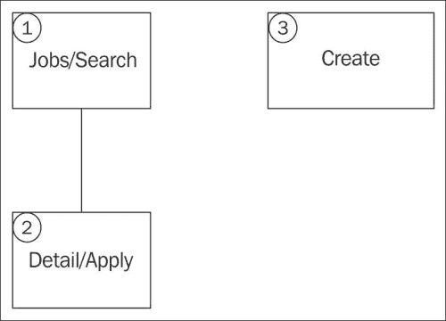
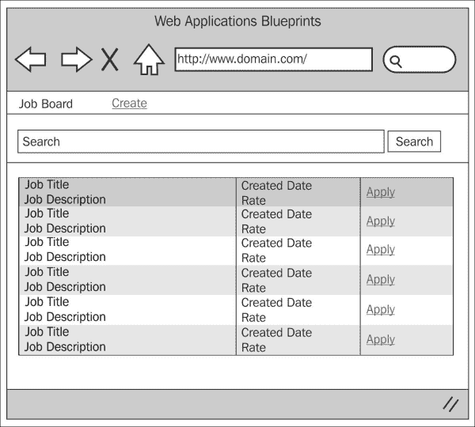
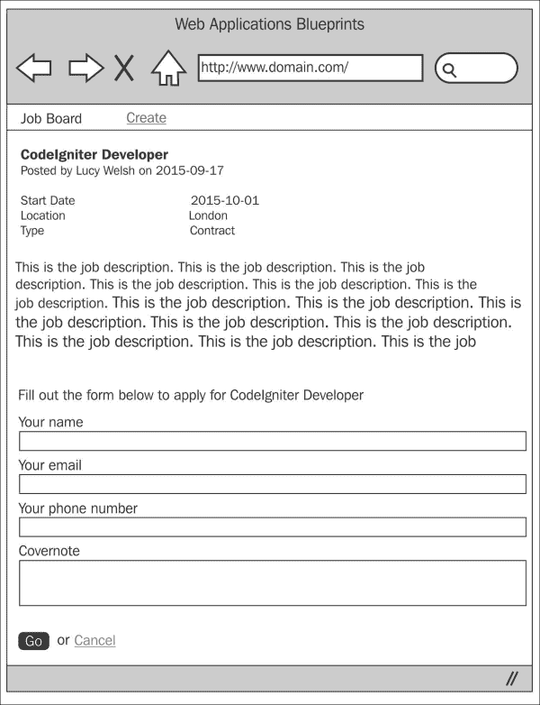
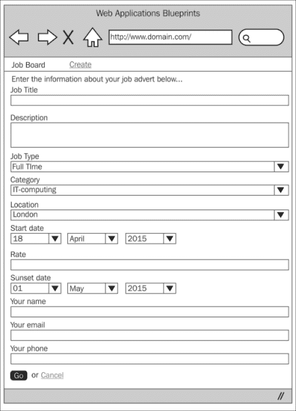

# 第九章。创建职位发布板

现在有一些相当复杂的职位发布板，也有一些设计得非常糟糕。有些我想到的甚至根本不能像你想象的那样工作，有些则完全不能正常工作。我相信它们都有大量的风险投资资金，可能还赚了一些利润，所以我真不明白为什么它们不能齐心协力，做出真正能工作的事情；实际上，这并不是一件特别困难的事情。

在这个项目中的职位发布板虽然小而简洁，但仍有扩展的空间——如果你跳到*总结*部分，你会看到一些你可以添加的功能，使其更加丰富，但我相信你也有自己的想法。

在本章中，我们将涵盖以下主题：

+   设计和线框图

+   创建数据库

+   创建模型

+   创建视图

+   创建控制器

+   整合一切

# 简介

那么我们这个项目到底要做什么呢？我们将创建一个应用程序，允许用户创建将在“板”上显示的职位广告。用户可以搜索特定术语，并将返回一些结果。

其他用户可以创建将在这些板上显示的广告。

为了创建这个应用程序，我们将创建一个控制器；这将处理职位的显示、新职位的创建以及申请职位。

我们将创建一个语言文件来存储文本，以便在需要时提供多语言支持。

我们将创建所有必要的视图文件和一个与数据库交互的模型。

然而，这个应用程序以及本书中的其他应用程序都依赖于我们在第一章中完成的基本设置，*简介和共享项目资源*；尽管你可以将大量代码提取出来并放入你几乎已经拥有的任何应用程序中，但请记住，第一章中完成的基本设置是这个章节的基础。

因此，我们不再拖延，让我们开始吧。

# 设计和线框图

和往常一样，在我们开始构建之前，我们应该看看我们打算构建什么。

首先，简要描述我们的意图：我们计划构建一个应用程序，让人们能够以职位发布板的形式浏览职位广告。

人们将能够创建将在搜索列表中出现的职位广告。其他人将被允许申请这些广告中的职位，申请将连同工作详情和申请者信息以电子邮件的形式发送给广告商。

总之，为了更好地了解正在发生的事情，让我们看一下以下网站地图：



所以这就是网站地图；首先要注意的是网站有多简单。这个项目只有三个主要区域。让我们逐一了解每个项目，并简要了解它们的功能：

+   **Jobs/Search**: 想象这是一个起点。用户将看到网站上可用的活跃职位的列表。用户可以查看职位详情并申请（带他们到网站地图的**2**点），或者点击导航栏上的**创建**并转到网站地图的**3**点（创建项）。

+   **Detail/Apply**: 用户将看到招聘广告的详细信息，例如开始日期、地点和工作描述，以及广告商的联系方式。在职位详情下方还有一个表单，允许用户申请该职位。申请的详细信息将通过电子邮件发送给招聘广告商（`jobs.job_advertiser_email`）。

+   **Create**: 这将向用户显示一个表单，允许他们创建一个招聘广告。一旦广告创建，它将在搜索列表中显示。

现在我们对网站的结构和形式有了相当好的了解，让我们来看看每个页面的线框图。

## Job/Search

以下截图显示了网站地图中**1**点（Create 项）的线框图。最初，用户会看到一个当前职位的列表。显示职位标题和描述。描述保持固定长度——即职位描述的前 50 个单词。他们可以点击职位标题或**申请**链接，转到网站地图的**2**点（Detail/Apply 项）。



## Detail/Apply

以下截图显示了网站地图中**2**点（Detail/Apply 项）的线框图。用户可以看到招聘广告的详细描述和一个允许用户输入他们的详细信息并发送职位申请的表单——这个申请的详细信息将通过电子邮件发送给招聘广告商。



## Create

以下截图显示了网站地图中**3**点（Create 项）的线框图。任何用户都可以发布招聘广告。这向用户显示一个表单，允许他们输入他们的招聘广告详情并将其保存到数据库中。



## 文件概述

这是一个相对较小的项目，总的来说，我们只需要创建七个文件；这些文件如下：

+   `/path/to/codeigniter/application/models/jobs_model.php`: 这提供了对`jobs`数据库表的读写访问。

+   `/path/to/codeigniter/application/views/jobs/apply.php`: 这为我们提供了一个界面，允许用户查看招聘广告的详细信息，以及一个允许任何用户申请职位的表单。

+   `/path/to/codeigniter/application/views/jobs/create.php`: 这向用户显示一个表单，允许他们创建一个招聘广告。

+   `/path/to/codeigniter/application/views/jobs/view.php`: 这是`jobs`控制器`index()`函数的视图。它显示搜索表单并列出任何结果。

+   `/path/to/codeigniter/application/views/nav/top_nav.php`: 这在页面顶部提供了一个导航栏。

+   `/path/to/codeigniter/application/controllers/jobs.php`：这包含三个主要函数：`index()`、`apply()`和`create()`。

+   `/path/to/codeigniter/application/language/english/en_admin_lang.php`：这为应用程序提供语言支持。

前面七个文件的结构如下：

```php
application/
├── controllers/
│   ├── jobs.php
├── models/
│   ├── jobs_model.php
├── views/create/
│   ├── create.php
│   ├── apply.php
│   ├── view.php
├── views/nav/
│   ├── top_nav.php
├── language/english/
│   ├── en_admin_lang.php
```

# 创建数据库

好吧，你应该已经按照第一章中描述的方式设置了 CodeIgniter 和 Bootstrap；如果没有，那么你应该知道本章中的代码是专门针对第一章中的设置编写的。但是，如果你没有这样做，也没有关系——代码可以轻松地应用于其他情况。

首先，我们将构建数据库。将以下 MySQL 代码复制到你的数据库中：

```php
CREATE DATABASE `jobboarddb`;
USE `jobboarddb`;

DROP TABLE IF EXISTS `categories`;
CREATE TABLE `categories` (
  `cat_id` int(11) NOT NULL AUTO_INCREMENT,
  `cat_name` varchar(25) NOT NULL,
  PRIMARY KEY (`cat_id`)
) ENGINE=InnoDB AUTO_INCREMENT=5 DEFAULT CHARSET=utf8;

INSERT INTO `categories` VALUES (1,'IT'),(2,'Legal'),(3,'Management'),(4,'Purchasing');

DROP TABLE IF EXISTS `ci_sessions`;
CREATE TABLE `ci_sessions` (
  `session_id` varchar(40) COLLATE utf8_bin NOT NULL DEFAULT '0',
  `ip_address` varchar(16) COLLATE utf8_bin NOT NULL DEFAULT '0',
  `user_agent` varchar(120) COLLATE utf8_bin DEFAULT NULL,
  `last_activity` int(10) unsigned NOT NULL DEFAULT '0',
  `user_data` text COLLATE utf8_bin NOT NULL
) ENGINE=MyISAM DEFAULT CHARSET=utf8 COLLATE=utf8_bin;

DROP TABLE IF EXISTS `jobs`;
CREATE TABLE `jobs` (
  `job_id` int(11) NOT NULL AUTO_INCREMENT,
  `job_title` varchar(50) NOT NULL,
  `job_desc` text NOT NULL,
  `cat_id` int(11) NOT NULL,
  `type_id` int(11) NOT NULL,
  `loc_id` int(11) NOT NULL,
  `job_start_date` datetime NOT NULL,
  `job_rate` int(5) NOT NULL,
  `job_advertiser_name` varchar(50) NOT NULL,
  `job_advertiser_email` varchar(50) NOT NULL,
  `job_advertiser_phone` varchar(20) NOT NULL,
  `job_sunset_date` datetime NOT NULL,
  `job_created_at` timestamp NULL DEFAULT CURRENT_TIMESTAMP,
  PRIMARY KEY (`job_id`)
) ENGINE=InnoDB AUTO_INCREMENT=4 DEFAULT CHARSET=utf8;

INSERT INTO `jobs` VALUES (1,'PHP Developer','PHP Developer required for a large agency based in London.  Must have MVC experience\n',1,1,1,'2014-09-24 00:00:00',400,'Rob Foster','rob@bluesuncreative.com','01234123456','2015-09-26 00:00:00','2014-09-17 09:00:18'),(2,'CodeIgniter Developer','Small London agency urgently requires a CodeIgniter developer to work on small eCommerce project.',1,1,1,'0000-00-00 00:00:00',350,'Lucy','lucy@londonagencycomain.com','01234123456','2015-09-26 00:00:00','2014-09-17 11:22:19'),(3,'Flash Developer','Paris based agency requires Flash Developer to work on new built project',1,1,2,'0000-00-00 00:00:00',350,'Brian','brian@frenchdesignagenct.fr','01234123456','2015-09-26 00:00:00','2014-09-17 11:23:39');

DROP TABLE IF EXISTS `locations`;

CREATE TABLE `locations` (
  `loc_id` int(11) NOT NULL AUTO_INCREMENT,
  `loc_name` varchar(25) NOT NULL,
  PRIMARY KEY (`loc_id`)
) ENGINE=InnoDB AUTO_INCREMENT=5 DEFAULT CHARSET=utf8;

INSERT INTO `locations` VALUES (1,'England'),(2,'France'),(3,'Germany'),(4,'Spain');

DROP TABLE IF EXISTS `types`;
CREATE TABLE `types` (
  `type_id` int(11) NOT NULL AUTO_INCREMENT,
  `type_name` varchar(25) NOT NULL,
  PRIMARY KEY (`type_id`)
) ENGINE=InnoDB AUTO_INCREMENT=4 DEFAULT CHARSET=utf8;

INSERT INTO `types` VALUES (1,'Contract'),(2,'Full Time'),(3,'Part Time');
```

### 提示

现在，看看最后那段 SQL 代码，它相当大且复杂。别慌，所有 SQL 代码都可以在 Packt 网站上的本书支持页面上找到。

你会看到我们创建的第一个表是`ci_sessions`。我们需要这个表来允许 CodeIgniter 管理会话，特别是登录用户。然而，这只是从*CodeIgniter 用户指南*中可用的标准会话表，因此我不会包括该表的描述，因为它不是技术特定于这个应用程序的。但是，如果你感兴趣，可以在[`ellislab.com/codeigniter/user-guide/libraries/sessions.html`](http://ellislab.com/codeigniter/user-guide/libraries/sessions.html)找到描述。

好的，让我们逐个查看每个表中的每个条目，看看它们代表什么。首先，我们将查看`categories`表：

| 表：categories |
| --- |
| **元素** | **描述** |
| `cat_id` | 这是主键。 |
| `cat_name` | 这存储类别的名称。 |

接下来，我们将查看`types`表：

| 表：types |
| --- |
| **元素** | **描述** |
| `type_id` | 这是主键。 |
| `type_name` | 这存储类型的名称。 |

现在，让我们看看`locations`表：

| 表：locations |
| --- |
| **元素** | **描述** |
| `loc_id` | 这是主键。 |
| `loc_name` | 这存储位置的名称。 |

最后，我们将查看`jobs`表：

| 表：jobs |
| --- |
| **元素** | **描述** |
| `job_id` | 这是主键。 |
| `job_title` | 这是广告中职位标题。 |
| `job_desc` | 这是广告中职位的通用职位说明。 |
| `cat_id` | 这是来自`categories`表的外键，表示职位的类别——IT、管理、制造、医疗保健等 |
| `type_id` | 这是来自`types`表的外键，表示职位的类型——全职、兼职、合同等 |
| `loc_id` | 这是来自`locations`表的键，表示职位所在的地点。 |
| `job_start_date` | 这是发布职位的起始日期。 |
| `job_rate` | 这是提供的金钱（报酬）——薪水、日薪等。 |
| `job_advertiser_name` | 这是发布职位的人的名字，以便申请者知道联系谁以跟进他们的申请。 |
| `job_advertiser_email` | 这是发布职位的人的联系方式电子邮件。申请是通过用户在`views/jobs/apply.php`中填写并提交表单时发送到这个电子邮件地址的。 |
| `job_advertiser_phone` | 这是发布职位的人的电话号码。如果申请者希望联系发布职位的人，则包括此项。 |
| `job_sunset_date` | 这是职位将不再在搜索中显示的日期。这是必需的，因为职位不会永远被宣传，应用一个限制职位申请时间的日期可以防止人们申请已经填补或不再存在的职位。 |
| `job_created_at` | 这是将新记录添加到数据库时应用的 MySQL 时间戳。 |

我们还需要对`config/database.php`文件进行修改，即设置数据库访问详情、用户名、密码等。

打开`config/database.php`文件并找到以下行：

```php
$db['default']['hostname'] = 'localhost';
$db['default']['username'] = 'your username';
$db['default']['password'] = 'your password';
$db['default']['database'] = 'jobboarddb';
```

编辑上一行中的值，确保用更具体于你的设置和情况的值替换这些值；因此，输入你的用户名、密码等。

# 调整`config.php`文件

在这个文件中有几件事情我们需要配置以支持会话和加密。因此，打开`config/config.php`文件并做出以下更改。

1.  我们需要设置一个加密密钥；会话和 CodeIgniter 的加密功能都需要在`$config`数组中设置一个加密密钥，所以找到以下行：

    ```php
    $config['encryption_key'] = '';
    ```

    更改为以下内容：

    ```php
    $config['encryption_key'] = 'a-random-string-of-alphanum-characters';
    ```

    ### 提示

    现在显然，实际上不要将这个值直接改为一个随机的字母数字字符序列，而是改为，嗯，一个随机的字母数字字符序列——如果这样理解的话？是的，你知道我的意思。

1.  找到这些行：

    ```php
    $config['sess_cookie_name'] = 'ci_session';
    $config['sess_expiration'] = 7200;
    $config['sess_expire_on_close'] = FALSE;
    $config['sess_encrypt_cookie'] = FALSE;
    $config['sess_use_database'] = FALSE;
    $config['sess_table_name'] = 'ci_sessions';
    $config['sess_match_ip'] = FALSE;
    $config['sess_match_useragent'] = TRUE;
    $config['sess_time_to_update'] = 300;
    ```

    将它们更改为以下内容：

    ```php
    $config['sess_cookie_name'] = 'ci_session';
    $config['sess_expiration'] = 7200;
    $config['sess_expire_on_close'] = TRUE;
    $config['sess_encrypt_cookie'] = TRUE;
    $config['sess_use_database'] = TRUE;
    $config['sess_table_name'] = 'ci_sessions';
    $config['sess_match_ip'] = TRUE;
    $config['sess_match_useragent'] = TRUE;
    $config['sess_time_to_update'] = 300;
    ```

# 调整`routes.php`文件

我们希望将用户重定向到`jobs`控制器，而不是默认的 CodeIgniter `welcome`控制器。为此，我们需要修改`routes.php`文件中的默认控制器设置：

1.  打开`config/routes.php`文件进行编辑，并找到以下行（文件底部附近）：

    ```php
    $route['default_controller'] = "welcome";
    $route['404_override'] = '';
    ```

1.  首先，我们需要更改默认控制器。最初在一个 CodeIgniter 应用程序中，默认控制器设置为`welcome`；然而，我们不需要这个——相反，我们希望默认控制器是`jobs`。所以，找到以下行：

    ```php
    $route['default_controller'] = "welcome";
    ```

    用以下内容替换：

    ```php
    $route['default_controller'] = "jobs";
    $route['404_override'] = '';
    ```

# 创建模型

在此项目中只有一个模型——`jobs_model.php`——它包含特定于搜索和将职位广告写入数据库的函数。

这是此项目的唯一模型，因此让我们创建模型并讨论其功能。

创建`/path/to/codeigniter/application/models/jobs_model.php`文件，并将其中的以下代码添加到该文件中：

```php
<?php if ( ! defined('BASEPATH')) exit('No direct script access allowed');

class Jobs_model extends CI_Model {
  function __construct() {
    parent::__construct();
  }

  function get_jobs($search_string) {
    if ($search_string == null) {
      $query = "SELECT * FROM `jobs` WHERE DATE(NOW()) < DATE(`job_sunset_date`) ";
    } else {
      $query = "SELECT * FROM `jobs` WHERE `job_title` LIKE '%$search_string%' 
                OR `job_desc` LIKE '%$search_string%' AND DATE(NOW()) < DATE(`job_sunset_date`)";
    }

    $result = $this->db->query($query);
    if ($result) {
      return $result;
    } else {
      return false;
    }
  }

  function get_job($job_id) {
    $query = "SELECT * FROM `jobs`, `categories`, `types`, `locations` WHERE 
              `categories`.`cat_id` = `jobs`.`cat_id` AND
              `types`.`type_id` = `jobs`.`type_id` AND
              `locations`.`loc_id` = `jobs`.`loc_id` AND
              `job_id` = ? AND
              DATE(NOW()) < DATE(`job_sunset_date`) ";

    $result = $this->db->query($query, array($job_id));
    if ($result) {
      return $result;
    } else {
      return flase;
    }
  } 

  function save_job($save_data) {
    if ($this->db->insert('jobs', $save_data)) {
      return $this->db->insert_id();
    } else {
      return false;
    }
  }

  function get_categories() {
    return $this->db->get('categories');
  }

  function get_types() {
    return $this->db->get('types');
  }

  function get_locations() {
    return $this->db->get('locations');
  }
}
```

此模型中有六个主要函数，具体如下：

+   `get_jobs()`: 此函数有两个作用：首先，显示所有职位——例如，当用户首次访问网站时——其次，当用户输入搜索词时，查询将更改以在`job_title`和`job_desc`中查找特定的搜索词。

+   `get_job()`: 此函数获取特定职位广告的详细信息，用于网站地图的**2**（详情/申请）项。

+   `save_job()`: 当用户从网站地图的**3**（创建项目）处提交表单时，此函数会将职位广告保存到数据库中。

+   `get_categories()`: 此函数从`categories`表获取类别。它用于在创建过程中填充类别下拉菜单。

+   `get_types()`: 此函数从`types`表获取类型。它用于在创建过程中填充类型下拉菜单。

+   `get_locations()`: 此函数从`locations`表获取位置。它用于在创建过程中填充位置下拉菜单。

首先考虑`get_jobs()`函数，如前所述，此函数有两个用途：

+   要返回所有结果，即列出所有职位

+   返回与用户搜索匹配的结果

当用户访问网站时，他们会被路由到`jobs/index`。这将导致`get_jobs()`模型函数搜索数据库。在这次初次访问中，`$search_string`变量将是空的（因为用户没有搜索任何内容）。这将导致`if`语句的第一部分执行，基本上返回所有有效的职位。

然而，如果用户正在搜索某些内容，那么`$search_string`变量将不会为空；它将包含用户在`views/jobs/view.php`表单中输入的搜索词。

这将导致`if`语句的第二部分执行，将`$search_term`添加到数据库查询中：

```php
function get_jobs($search_string) {
  if ($search_string == null) {
    $query = "SELECT * FROM `jobs` WHERE DATE(NOW()) < DATE(`job_sunset_date`) ";
  } else {
    $query = "SELECT * FROM `jobs` WHERE `job_title` LIKE '%$search_string%' 
              OR `job_desc` LIKE '%$search_string%' AND DATE(NOW()) < DATE(`job_sunset_date`)";
  }

  $result = $this->db->query($query);
  if ($result) {
    return $result;
  } else {
    return false;
  }
}
```

这两个查询都只会返回日落日期尚未过去的查询结果。`jobboarddb.job_sunset_date`字段包含一个日期，即职位广告将停止在搜索词中显示。

接下来，我们将查看`get_job()`函数。此函数接收来自`jobs`控制器的`$job_id`值。当用户在`views/jobs/view.php`中点击**申请**链接时，`jobs`控制器从`$this->uri->segment(3)`获取职位广告的 ID。

`get_job()`函数简单地返回网站地图**2**（详情/申请）项的所有数据。

它将`categories`、`types`和`locations`表连接到`jobs`表，以确保在`views/jobs/apply.php`视图中显示正确的类别、类型和位置，以及特定的职位广告详情。

然后我们继续到 `save_job()` 函数。该函数接受来自 `jobs` 控制器的一个数据数组。`jobs` 控制器的 `create()` 函数将 `$save_data` 数组发送到 `save_job()` 模型函数。`$save_data` 数组包含 `views/jobs/create.php` 视图文件中的表单输入。

在成功保存后，返回插入的主键。

现在我们将同时介绍三个函数——`_categories()`、`get_types()` 和 `get_locations()`（因为它们执行的功能相当相似）。这三个函数从各自的表中获取所有类别、类型和位置。这些函数由 `jobs` 控制器的 `create()` 函数调用，以确保下拉列表填充了正确的数据。

# 创建视图

在此项目中，有四种视图，具体如下：

+   `/path/to/codeigniter/application/views/jobs/view.php`：此视图向用户显示当前工作的列表。

+   `/path/to/codeigniter/application/views/jobs/create.php`：此视图允许工作发布者输入工作广告详情。表单提交到 `jobs` 控制器的 `create()` 函数。

+   `/path/to/codeigniter/application/views/jobs/apply.php`：此视图向用户显示一个表单，允许他们输入申请工作的信息。它还显示验证错误。

+   `/path/to/codeigniter/application/views/nav/top_nav.php`：此视图显示顶级菜单。在此项目中，这非常简单，因为它包含项目名称和链接到 `jobs` 控制器。

这些是我们的四个视图文件。现在，让我们逐一过目，构建代码，并讨论其功能。

创建 `/path/to/codeigniter/application/views/jobs/view.php` 文件，并向其中添加以下代码：

```php
<div class="page-header">
  <h1>
    <?php echo form_open('jobs/index') ; ?>
      <div class="row">
        <div class="col-lg-12">
          <div class="input-group">
            <input type="text" class="form-control" name="search_string" placeholder="<?php echo $this->lang->line('jobs_view_search'); ?>">
            <span class="input-group-btn">
              <button class="btn btn-default" type="submit"><?php echo $this->lang->line('jobs_view_search'); ?></button>
            </span>
          </div><!-- /input-group -->
        </div><!-- /.col-lg-6 -->
      </div><!-- /.row -->
    <?php echo form_close() ; ?>
  </h1>
</div>

<table class="table table-hover">
  <?php foreach ($query->result() as $row) : ?>
  <tr>
    <td><?php echo anchor ('jobs/apply/'.$row->job_id, $row->job_title) ; ?><br /><?php echo word_limiter($row->job_desc, 50) ; ?>
    </td>
    <td>Posten on <?php echo $row->job_created_at ; ?><br />Rate is &pound;<?php echo $row->job_rate ; ?>
    </td>
    <td><?php echo anchor ('jobs/apply/'.$row->job_id, $this->lang->line('jobs_view_apply')) ; ?>
    </td>
  </tr>
<?php endforeach ; ?>
</table>
```

此视图有两个功能：

+   在页面顶部显示一个简单的搜索表单。这是用户可以搜索匹配搜索词的工作的地方。

+   在网页顶部显示工作列表的 HTML 表格。这些是数据库中的当前活动工作。如果工作的日落日期（`jobs.job_sunset_date`）尚未过去，则认为该工作处于活动状态。

搜索表单提交到 `jobs` 控制器的 `index()` 函数——此控制器函数将搜索词传递给 `Jobs_model` 的 `get_jobs($search_term)` 函数。它将被添加到数据库查询中；此查询将在 `jobs.job_title` 和 `jobs.job_desc` 中查找匹配该词的文本。

创建 `/path/to/codeigniter/application/views/jobs/create.php` 文件，并向其中添加以下代码：

```php
<?php if ($this->session->flashdata('flash_message')) : ?>
  <div class="alert alert-info" role="alert"><?php echo $this->session->flashdata('flash_message');?></div>
 <?php endif ; ?>

  <p class="lead"><?php echo $this->lang->line('job_create_form_instruction_1');?></p>
  <div class="span8"> 
  <?php echo form_open('jobs/create','role="form" class="form"') ; ?>
    <div class="form-group">
      <?php echo form_error('job_title'); ?>
      <label for="job_title"><?php echo $this->lang->line('job_title');?></label>
      <?php echo form_input($job_title); ?>
    </div>

    <div class="form-group">
      <?php echo form_error('job_desc'); ?>
      <label for="job_desc"><?php echo $this->lang->line('job_desc');?></label>
      <?php echo form_textarea($job_desc); ?>
    </div>
```

类型下拉列表由 `Jobs_model` 中的 `get_types()` 函数填充。它返回一个结果对象，我们可以遍历它，使用户能够选择类型：

```php
<div class="form-group">
  <?php echo form_error('type_id'); ?>
  <label for="type_id"><?php echo $this->lang->line('type');?></label>
  <select name="type_id" class="form-control">
  <?php foreach ($types->result() as $row) : ?>
    <option value="<?php echo $row->type_id ; ?>"><?php echo $row->type_name ; ?></option>
  <?php endforeach ; ?>
  </select>
</div>
```

类别下拉列表由 `Jobs_model` 中的 `get_categories()` 函数填充。它返回一个结果对象，我们可以遍历它，使用户能够选择类别：

```php
<div class="form-group">
  <?php echo form_error('cat_id'); ?>
  <label for="cat_id"><?php echo $this->lang->line('cat');?></label>
  <select name="cat_id" class="form-control">
  <?php foreach ($categories->result() as $row) : ?>
    <option value="<?php echo $row->cat_id ; ?>"><?php echo $row->cat_name ; ?></option>
  <?php endforeach ; ?>
  </select>
</div>
```

位置下拉菜单由`Jobs_model`中的`get_locations()`函数填充。它返回一个结果对象，我们遍历它，允许用户选择位置：

```php
    <div class="form-group">
      <?php echo form_error('loc_id'); ?>
      <label for="loc_id"><?php echo $this->lang->line('loc');?></label>
      <select name="loc_id" class="form-control">
      <?php foreach ($locations->result() as $row) : ?>
        <option value="<?php echo $row->loc_id ; ?>"><?php echo $row->loc_name ; ?></option>
      <?php endforeach ; ?>
      </select>
    </div>
    <label for="sunset_d"><?php echo $this->lang->line('job_start_date');?></label>
    <div class="row">
      <div class="form-group">
        <div class="col-md-2">
          <?php echo form_error('startd'); ?>
          <select name="startd" class="form-control">
          <?php for ( $i = 1; $i <= 30; $i++) : ?>
            <?php if (date('j', time()) == $i) : ?> 
              <option selected value="<?php echo $i ; ?>"><?php echo date('jS', mktime($i,0,0,0, $i, date('Y'))) ; ?></option>
            <?php else : ?>
              <option value="<?php echo $i ; ?>"><?php echo date('jS', mktime($i,0,0,0, $i, date('Y'))) ; ?></option>
            <?php endif ; ?>
          <?php endfor ; ?>
          </select>
        </div>

        <div class="col-md-2">
          <?php echo form_error('startm'); ?>
          <select name="startm" class="form-control">
          <?php for ( $i = 1; $i <= 12; $i++) : ?>
            <?php if (date('m', time()) == $i) : ?> 
              <option selected value="<?php echo $i ; ?>"><?php echo date('F', mktime(0,0,0,$i, 1, date('Y'))) ; ?></option>
            <?php else : ?>
              <option value="<?php echo $i ; ?>"><?php echo date('F', mktime(0,0,0,$i, 1, date('Y'))) ; ?></option>
            <?php endif ; ?>
          <?php endfor ; ?>
          </select>
        </div>

        <div class="col-md-2">
          <?php echo form_error('starty'); ?>
          <select name="starty" class="form-control">
          <?php for ($i = date("Y",strtotime(date("Y"))); $i <= date("Y",strtotime(date("Y").' +3 year')); $i++) : ?>
            <option value="<?php echo $i;?>"><?php echo $i;?></option>
          <?php endfor ; ?>
          </select>
        </div> 
      </div>
    </div> 

    <div class="form-group">
      <?php echo form_error('job_rate'); ?>
      <label for="job_rate"><?php echo $this->lang->line('job_rate');?></label>
      <?php echo form_input($job_rate); ?>
    </div>

    <div class="form-group">
      <?php echo form_error('job_advertiser_name'); ?>
      <label for="job_advertiser_name"><?php echo $this->lang->line('job_advertiser_name');?></label>
      <?php echo form_input($job_advertiser_name); ?>
    </div>

    <div class="form-group">
      <?php echo form_error('job_advertiser_email'); ?>
      <label for="job_advertiser_email"><?php echo $this->lang->line('job_advertiser_email');?></label>
      <?php echo form_input($job_advertiser_email); ?>
    </div>

    <div class="form-group">
      <?php echo form_error('job_advertiser_phone'); ?>
      <label for="job_advertiser_phone"><?php echo $this->lang->line('job_advertiser_phone');?></label>
      <?php echo form_input($job_advertiser_phone); ?>
    </div>

    <label for="sunset_d"><?php echo $this->lang->line('job_sunset_date');?></label>
    <div class="row">
      <div class="form-group">
        <div class="col-md-2">
          <?php echo form_error('sunset_d'); ?>
          <select name="sunset_d" class="form-control">
          <?php for ( $i = 1; $i <= 30; $i++) : ?>
            <?php if (date('j', time()) == $i) : ?> 
              <option selected value="<?php echo $i ; ?>"><?php echo date('jS', mktime($i,0,0,0, $i, date('Y'))) ; ?></option>
            <?php else : ?>
              <option value="<?php echo $i ; ?>"><?php echo date('jS', mktime($i,0,0,0, $i, date('Y'))) ; ?></option>
            <?php endif ; ?>
          <?php endfor ; ?>
          </select>
        </div>

        <div class="col-md-2"> 
          <?php echo form_error('sunset_m'); ?>
          <select name="sunset_m" class="form-control">
          <?php for ( $i = 1; $i <= 12; $i++) : ?>
            <?php if (date('m', time()) == $i) : ?> 
              <option selected value="<?php echo $i ; ?>"><?php echo date('F', mktime(0,0,0,$i, 1, date('Y'))) ; ?></option>
            <?php else : ?>
              <option value="<?php echo $i ; ?>"><?php echo date('F', mktime(0,0,0,$i, 1, date('Y'))) ; ?></option>
            <?php endif ; ?>
          <?php endfor ; ?>
          </select>
        </div>

        <div class="col-md-2">
          <?php echo form_error('sunset_y'); ?>
          <select name="sunset_y" class="form-control">
          <?php for ($i = date("Y",strtotime(date("Y"))); $i <= date("Y",strtotime(date("Y").' +3 year')); $i++) : ?>
            <option value="<?php echo $i;?>"><?php echo $i;?></option>
          <?php endfor ; ?>
          </select>
        </div> 
      </div>
    </div>

    <span class="help-block"><?php echo $this->lang->line('job_sunset_date_help') ; ?></div>
    <div class="form-group">
      <button type="submit" class="btn btn-success"><?php echo $this->lang->line('common_form_elements_go');?></button>  or <? echo anchor('jobs',$this->lang->line('common_form_elements_cancel'));?>
    </div>
<?php echo form_close() ; ?>
  </div>
</div>
```

与验证过程相关的任何错误消息——例如缺少的必填表单字段——也会在这个视图文件中显示在表单字段旁边，触发错误。为此，我们使用 CodeIgniter 的`form_error()`验证函数。

创建`/path/to/codeigniter/application/views/jobs/apply.php`文件，并将以下代码添加到其中：

```php
  <?php if ($this->session->flashdata('flash_message')) : ?>
    <div class="alert alert-info" role="alert"><?php echo $this->session->flashdata('flash_message');?></div>
  <?php endif ; ?>

  <div class="row">
    <div class="col-sm-12 blog-main">
      <div class="blog-post">
        <?php foreach ($query->result() as $row) : ?>
          <h2 class="blog-post-title"><?php echo $row->job_title ; ?></h2>
          <p class="blog-post-meta">Posted by <?php echo $row->job_advertiser_name . ' on ' . $row->job_created_at ; ?></p> 
          <table class="table">
            <tr>
              <td>Start Date
              </td>
              <td><?php echo $row->job_start_date ; ?>
              </td>
              <td>Contact Name
              </td>
              <td><?php echo $row->job_advertiser_name ; ?>
              </td>
            </tr>
            <tr>
              <td>Location
              </td>
              <td><?php echo $row->loc_name ; ?>
              </td>
              <td>Contact Phone
              </td>
              <td><?php echo $row->job_advertiser_phone ; ?>
              </td>
            </tr>
            <tr>
              <td>Type
              </td>
              <td><?php echo $row->type_name ; ?>
              </td>
              <td>Contact Email
              </td>
              <td><?php echo $row->job_advertiser_email ; ?>
              </td>
            </tr>
          </table>
          <p><?php echo $row->job_desc ; ?></p>
        <?php endforeach ; ?>
      </div>
    </div>
  </div>

  <p class="lead"><?php echo $this->lang->line('apply_instruction_1') . $job_title ;?></p>
  <div class="span12"> 
  <?php echo form_open('jobs/apply','role="form" class="form"') ; ?>
    <div class="form-group">
      <?php echo form_error('app_name'); ?>
      <label for="app_name"><?php echo $this->lang->line('app_name');?></label>
      <?php echo form_input($app_name); ?>
    </div>

    <div class="form-group">
      <?php echo form_error('app_email'); ?>
      <label for="app_email"><?php echo $this->lang->line('app_email');?></label>
      <?php echo form_input($app_email); ?>
    </div>

    <div class="form-group">
      <?php echo form_error('app_phone'); ?>
      <label for="app_phone"><?php echo $this->lang->line('app_phone');?></label>
      <?php echo form_input($app_phone); ?>
    </div>

    <div class="form-group">
      <?php echo form_error('app_cover_note'); ?>
      <label for="app_cover_note"><?php echo $this->lang->line('app_cover_note');?></label>
      <?php echo form_textarea($app_cover_note); ?>
    </div>

    <input type="hidden" name="job_id" value="<?php echo $this->uri->segment(3) ; ?>" />

    <div class="form-group">
      <button type="submit" class="btn btn-success"><?php echo $this->lang->line('common_form_elements_go');?></button>  or <? echo anchor('jobs',$this->lang->line('common_form_elements_cancel'));?>
    </div>
  <?php echo form_close() ; ?>
  </div>
</div>
```

看一下视图文件顶部，特别是`foreach($query->result() as $row)`循环中的代码，该循环显示职位的详细信息。它被组织成一个 HTML 表格，清楚地分隔了职位广告的主要点，如开始日期、工作地点和联系详情。唯一不在表格中的是职位描述。

在`foreach()`循环下方有一个 HTML 表单，允许用户输入他们的联系详情和一小段说明他们对该职位兴趣的封面信。当用户点击**Go**时，表单将被提交。

有一个名为`job_id`的隐藏字段元素，其外观如下：

```php
<input type="hidden" name="job_id" value="<?php echo $this->uri->segment(3) ; ?>" />
```

这个包含职位广告 ID 的隐藏字段确保当表单提交时，`jobs/apply()` 函数可以使用正确的 ID 查询数据库，并获取与职位关联的正确电子邮件地址（`jobs.job_advertiser_email`），然后使用 PHP 的`mail()`函数，将包含申请者详情的电子邮件发送给职位发布者。

创建`/path/to/codeigniter/application/views/nav/top_nav.php`文件，并将以下代码添加到其中：

```php
    <!-- Fixed navbar -->
<div class="navbar navbar-inverse navbar-fixed-top" role="navigation">
  <div class="container">
    <div class="navbar-header">
      <button type="button" class="navbar-toggle" data-toggle="collapse" data-target=".navbar-collapse">
        <span class="sr-only">Toggle navigation</span>
        <span class="icon-bar"></span>
        <span class="icon-bar"></span>
        <span class="icon-bar"></span>
      </button>
      <a class="navbar-brand" href="<?php echo base_url() ; ?>"><?php echo $this->lang->line('system_system_name'); ?></a>
    </div>
    <div class="navbar-collapse collapse">
      <ul class="nav navbar-nav">
        <li class="active"><?php echo anchor('jobs/create', 'Create') ; ?></li>
      </ul>
    </div><!--/.nav-collapse -->
  </div>
</div>

<div class="container theme-showcase" role="main">
```

这个视图相当基础，但仍然发挥着重要作用。它显示了一个返回到`jobs`控制器`index()`函数的选项。

# 创建控制器

在这个项目中，我们将只创建一个控制器，即`/path/to/codeigniter/application/controllers/jobs.php`。

在这个项目中只有一个控制器，现在让我们来看看它。我们将查看代码并讨论其功能。

在这个控制器中有三个主要功能，如下所示：

+   `index()`: 这将向用户显示初始的职位广告列表。它还显示搜索框并显示可能返回的任何结果。

+   `create()`: 这将向任何用户显示一个表单，允许用户创建一个职位广告。

+   `apply()`: 如果用户点击**Apply**按钮或职位标题，则会访问此功能。

创建`/path/to/codeigniter/application/controllers/jobs.php`文件，并将以下代码添加到其中：

```php
<?php if (!defined('BASEPATH')) exit('No direct script access allowed');

class Jobs extends MY_Controller {
  function __construct() {
  parent::__construct();
    $this->load->helper('string');
    $this->load->helper('text');
    $this->load->model('Jobs_model');
    $this->load->library('form_validation');
    $this->form_validation->set_error_delimiters('<div class="alert alert-danger">', '</div>');
  }
```

首先查看`index()`，你会看到这个函数首先做的事情之一是调用`Jobs_model`的`get_jobs()`函数，并将搜索字符串传递给它。如果用户在搜索框中没有输入搜索字符串，那么这个 POST 数组项将是空的，但那没关系，因为我们已经在模型中测试了它。

此查询的结果存储在`$page_data['query']`中，准备好传递给`views/jobs/view.php`文件，其中`foreach()`循环将显示每个工作广告：

```php
public function index() {
  $this->form_validation->set_rules('search_string', $this->lang->line('search_string'), 'required|min_length[1]|max_length[125]');
  $page_data['query'] = $this->Jobs_model->get_jobs($this->input->post('search_string'));
```

我们为`search_string`设置验证规则。如果是第一次查看页面或验证失败，则`$this->form_validation()`将返回一个假值：

```php
if ($this->form_validation->run() == FALSE) {
  $page_data['search_string'] = array('name' => 'search_string', 'class' => 'form-control', 'id' => 'search_string', 'value' => set_value('search_string', $this->input->post('search_string')), 'maxlength'   => '100', 'size' => '35');
```

为了向用户显示工作列表，我们调用`Jobs_model`的`get_jobs()`函数，将其传递给用户输入的任何搜索字符串，并将数据库结果对象存储在`$page_data`数组的项目查询中。我们将`$page_data`数组传递给`views/jobs/view.php`文件：

```php
    $page_data['query'] = $this->Jobs_model->get_jobs($this->input->post('search_string'));
    $this->load->view('common/header');
    $this->load->view('nav/top_nav');
    $this->load->view('jobs/view', $page_data);
    $this->load->view('common/footer');
  } else {
    $this->load->view('common/header');
    $this->load->view('nav/top_nav');
    $this->load->view('jobs/view', $page_data);
    $this->load->view('common/footer');
  }
}
```

`create()`函数稍微复杂一些；最初，我们设置表单验证规则——那里没有什么真正有趣的东西可以看——但紧接着，我们调用三个模型函数：`get_categories()`、`get_types()`和`get_locations()`，其结果存储在各自的`$save_data`数组项中，如下所示：

```php
$page_data['categories'] = $this->Jobs_model->get_categories();
$page_data['types'] = $this->Jobs_model->get_types();
$page_data['locations'] = $this->Jobs_model->get_locations(); 
```

我们将在`view/jobs/create.php`文件中遍历这些结果，并填充 HTML 选择下拉菜单。

无论如何，在此之后，我们检查表单是否已提交，如果是的话，是否提交时存在错误。我们构建表单元素，指定每个元素的设置，并将它们发送到`$page_data`数组中，以供`views/jobs/create.php`视图使用。

如果表单提交后没有错误，我们将打包所有帖子输入并发送到`Jobs_model`的`save_job()`函数：

如果保存操作成功，我们将设置成功消息的闪存数据，向用户表明他们的工作已被保存，以便他们知道它现在将出现在搜索结果中。然而，如果它没有成功，我们将返回一个错误消息：

```php
public function create() {
  $this->form_validation->set_rules('job_title', $this->lang->line('job_title'), 'required|min_length[1]|max_length[125]');
  $this->form_validation->set_rules('job_desc', $this->lang->line('job_desc'), 'required|min_length[1]|max_length[3000]');
  $this->form_validation->set_rules('cat_id', $this->lang->line('cat_id'), 'required|min_length[1]|max_length[11]');
  $this->form_validation->set_rules('type_id', $this->lang->line('type_id'), 'required|min_length[1]|max_length[11]');
  $this->form_validation->set_rules('loc_id', $this->lang->line('loc_id'), 'required|min_length[1]|max_length[11]');
  $this->form_validation->set_rules('start_d', $this->lang->line('start_d'), 'min_length[1]|max_length[2]');
  $this->form_validation->set_rules('start_m', $this->lang->line('start_m'), 'min_length[1]|max_length[2]');
  $this->form_validation->set_rules('start_y', $this->lang->line('start_y'), 'min_length[1]|max_length[4]');
  $this->form_validation->set_rules('job_rate', $this->lang->line('job_rate'), 'required|min_length[1]|max_length[6]');
  $this->form_validation->set_rules('job_advertiser_name', $this->lang->line('job_advertiser_name'), 'required|min_length[1]|max_length[125]');
  $this->form_validation->set_rules('job_advertiser_email', $this->lang->line('job_advertiser_email'), 'min_length[1]|max_length[125]');
  $this->form_validation->set_rules('job_advertiser_phone', $this->lang->line('job_advertiser_phone'), 'min_length[1]|max_length[125]');
  $this->form_validation->set_rules('sunset_d', $this->lang->line('sunset_d'), 'min_length[1]|max_length[2]');
  $this->form_validation->set_rules('sunset_m', $this->lang->line('sunset_m'), 'min_length[1]|max_length[2]');
  $this->form_validation->set_rules('sunset_y', $this->lang->line('sunset_y'), 'min_length[1]|max_length[4]');

  $page_data['categories'] = $this->Jobs_model->get_categories();
  $page_data['types'] = $this->Jobs_model->get_types();
  $page_data['locations'] = $this->Jobs_model->get_locations();

  if ($this->form_validation->run() == FALSE) {
    $page_data['job_title']            = array('name' => 'job_title', 'class' => 'form-control', 'id' => 'job_title', 'value' => set_value('job_title', ''), 'maxlength'   => '100', 'size' => '35');
    $page_data['job_desc']             = array('name' => 'job_desc', 'class' => 'form-control', 'id' => 'job_desc', 'value' => set_value('job_desc', ''), 'maxlength'   => '3000', 'rows' => '6', 'cols' => '35');
    $page_data['start_d']              = array('name' => 'start_d', 'class' => 'form-control', 'id' => 'start_d', 'value' => set_value('start_d', ''), 'maxlength'   => '100', 'size' => '35');
    $page_data['start_m']              = array('name' => 'start_m', 'class' => 'form-control', 'id' => 'start_m', 'value' => set_value('start_m', ''), 'maxlength'   => '100', 'size' => '35');
    $page_data['start_y']              = array('name' => 'start_y', 'class' => 'form-control', 'id' => 'start_y', 'value' => set_value('start_y', ''), 'maxlength'   => '100', 'size' => '35');
    $page_data['job_rate']             = array('name' => 'job_rate', 'class' => 'form-control', 'id' => 'job_rate', 'value' => set_value('job_rate', ''), 'maxlength'   => '100', 'size' => '35');
    $page_data['job_advertiser_name']  = array('name' => 'job_advertiser_name', 'class' => 'form-control', 'id' => 'job_advertiser_name', 'value' => set_value('job_advertiser_name', ''), 'maxlength'   => '100', 'size' => '35');
    $page_data['job_advertiser_email'] = array('name' => 'job_advertiser_email', 'class' => 'form-control', 'id' => 'job_advertiser_email', 'value' => set_value('job_advertiser_email', ''), 'maxlength'   => '100', 'size' => '35');
    $page_data['job_advertiser_phone'] = array('name' => 'job_advertiser_phone', 'class' => 'form-control', 'id' => 'job_advertiser_phone', 'value' => set_value('job_advertiser_phone', ''), 'maxlength'   => '100', 'size' => '35');
    $page_data['sunset_d']             = array('name' => 'sunset_d', 'class' => 'form-control', 'id' => 'sunset_d', 'value' => set_value('sunset_d', ''), 'maxlength'   => '100', 'size' => '35');
    $page_data['sunset_m']             = array('name' => 'sunset_m', 'class' => 'form-control', 'id' => 'sunset_m', 'value' => set_value('sunset_m', ''), 'maxlength'   => '100', 'size' => '35');
    $page_data['sunset_y']             = array('name' => 'sunset_y', 'class' => 'form-control', 'id' => 'sunset_y', 'value' => set_value('sunset_y', ''), 'maxlength'   => '100', 'size' => '35');

    $this->load->view('common/header');
    $this->load->view('nav/top_nav');
    $this->load->view('jobs/create', $page_data);
    $this->load->view('common/footer');
  } else {
```

在这一点上，数据已经通过验证，并存储在`$save_data`数组中，准备将其保存到数据库中：

```php
$save_data = array(
  'job_title' => $this->input->post('job_title'),
  'job_desc' => $this->input->post('job_desc'),
  'cat_id' => $this->input->post('cat_id'),
  'type_id' => $this->input->post('type_id'),
  'loc_id' => $this->input->post('loc_id'),
  'job_start_date' => $this->input->post('start_y') .'-'.$this->input->post('start_m').'-'.$this->input->post('start_d'),
  'job_rate' => $this->input->post('job_rate'),
  'job_advertiser_name' => $this->input->post('job_advertiser_name'),
  'job_advertiser_email' => $this->input->post('job_advertiser_email'),
  'job_advertiser_phone' => $this->input->post('job_advertiser_phone'),
  'job_sunset_date' => $this->input->post('sunset_y') .'-'.$this->input->post('sunset_m').'-'.$this->input->post('sunset_d'),
  );
```

`$save_data`数组随后被发送到`Jobs_model`的`save_job()`函数，该函数将使用`set_flashdata()`生成确认消息，如果保存操作成功，或者错误消息，如果操作失败：

```php
    if ($this->Jobs_model->save_job($save_data)) {
      $this->session->set_flashdata('flash_message', $this->lang->line('save_success_okay'));
      redirect ('jobs/create/'); 
    } else {
      $this->session->set_flashdata('flash_message', $this->lang->line('save_success_fail'));
      redirect ('jobs'); 
    }
  }
} 
```

最后，我们到达`apply()`函数。这稍微简单一些。像`create()`一样，我们首先定义我们的表单项验证规则，然后检查表单是否被提交（提交）。我们这样做是因为工作 ID 可以通过两种方式传递。

第一种方式是使用`$this->uri->segment(3)`。如果用户点击`views/jobs/view.php`文件中的**申请**链接或工作标题，ID 将通过第三个`uri`段传递给`apply()`函数。

第二种方式是`$this->input->post('job_id')`。如果表单已被提交，ID 将通过 POST 数组传递给`apply()`函数。在`views/jobs/view.php`文件中有一个隐藏的表单元素，名为`job_id`，其值被填充为正在查看的工作的实际 ID：

```php
public function apply() {
  $this->form_validation->set_rules('job_id', $this->lang->line('job_title'), 'required|min_length[1]|max_length[125]');
  $this->form_validation->set_rules('app_name', $this->lang->line('app_name'), 'required|min_length[1]|max_length[125]');
  $this->form_validation->set_rules('app_email', $this->lang->line('app_email'), 'required|min_length[1]|max_length[125]');
  $this->form_validation->set_rules('app_phone', $this->lang->line('app_phone'), 'min_length[1]|max_length[125]');
  $this->form_validation->set_rules('app_cover_note', $this->lang->line('app_cover_note'), 'required|min_length[1]|max_length[3000]');

  if ($this->input->post()) {
```

ID 存储在`$page_data`数组中的`job_id`项中，并传递给`Jobs_model`的`get_job()`函数：

```php
  $page_data['job_id'] = $this->input->post('job_id');
} else {
  $page_data['job_id'] = $this->uri->segment(3);
}

$page_data['query'] = $this->Jobs_model->get_job($page_data['job_id']);
```

我们接着测试是否有任何返回。我们使用 CodeIgniter 的`num_rows()`函数来查看返回的数据库对象中是否有任何行。如果没有，我们就设置一个闪存消息，说明该工作已不再可用。

可能是在用户点击**申请**链接和实际提交申请之间，工作广告已经变得不可用；也就是说，其`job_sunset_date`已经过去，或者有人可能手动输入了一个随机的 ID，而这个 ID 恰好不存在。无论如何，无论是什么原因，如果没有返回结果，就会向用户显示一个闪存消息。然而，如果找到了，我们就从数据库中提取数据，并将其存储为局部变量：

```php
if ($page_data['query']->num_rows() == 1) {
  foreach ($page_data['query']->result() as $row) {
    $page_data['job_title'] = $row->job_title;
    $page_data['job_id'] = $row->job_id;
    $job_advertiser_name = $row->job_advertiser_name;
    $job_advertiser_email = $row->job_advertiser_email;
  }
} else {
  $this->session->set_flashdata('flash_message', $this->lang->line('app_job_no_longer_exists'));
  redirect('jobs');
}
```

然后我们继续进行表单验证过程。如果是初始页面视图或者提交过程中有错误，那么`$this->form_validation->run()`将返回`FALSE`；如果是这样，我们就构建表单项，定义它们的设置：

```php
if ($this->form_validation->run() == FALSE) {
  $page_data['job_id']         = array('name' => 'job_id', 'class' => 'form-control', 'id' => 'job_id', 'value' => set_value('job_id', ''), 'maxlength'   => '100', 'size' => '35');
  $page_data['app_name']       = array('name' => 'app_name', 'class' => 'form-control', 'id' => 'app_name', 'value' => set_value('app_name', ''), 'maxlength'   => '100', 'size' => '35');
  $page_data['app_email']      = array('name' => 'app_email', 'class' => 'form-control', 'id' => 'app_email', 'value' => set_value('app_email', ''), 'maxlength'   => '100', 'size' => '35');
  $page_data['app_phone']      = array('name' => 'app_phone', 'class' => 'form-control', 'id' => 'app_phone', 'value' => set_value('app_phone', ''), 'maxlength'   => '100', 'size' => '35');
  $page_data['app_cover_note'] = array('name' => 'app_cover_note', 'class' => 'form-control', 'id' => 'app_cover_note', 'value' => set_value('app_cover_note', ''), 'maxlength'   => '3000', 'rows' => '6', 'cols' => '35');

  $this->load->view('common/header');
  $this->load->view('nav/top_nav');
  $this->load->view('jobs/apply', $page_data);
  $this->load->view('common/footer');
```

如果提交过程中没有错误，那么我们将构建一封要发送给工作广告发布者的电子邮件；这封电子邮件将发送到`jobs.job_advertiser_email`中包含的电子邮件地址。

```php
    } else {
```

我们使用 PHP 函数`str_replace();`在电子邮件中替换变量，将变量替换为从数据库或表单提交中提取的详细信息，例如申请人的联系信息和求职信：

```php
$body = "Dear %job_advertiser_name%,\n\n";
$body .= "%app_name% is applying for the position of %job_title%,\n\n";
$body .= "The details of the application are:\n\n";
$body .= "Applicant:  %app_name%,\n\n";
$body .= "Job Title:  %job_title%,\n\n";
$body .= "Applicant Email:  %app_email%,\n\n";
$body .= "Applicant Phone:  %app_phone%,\n\n";
$body .= "Cover Note:  %app_cover_note%,\n\n";

$body = str_replace('%job_advertiser_name%', $job_advertiser_name, $body);
$body = str_replace('%app_name%', $this->input->post('app_name'), $body);
$body = str_replace('%job_title%', $page_data['job_title'], $body);
$body = str_replace('%app_email%', $this->input->post('app_email'), $body);
$body = str_replace('%app_phone%', $this->input->post('app_phone'), $body);
$body = str_replace('%app_cover_note%', $this->input->post('app_cover_note'), $body);
```

如果电子邮件成功发送，我们将向申请人发送一个闪存消息，通知他们他们的申请已经发送，如下面的代码所示；这并不等同于验证错误。验证错误已经在之前处理过，如果验证没有通过，我们不会进入表单处理的这一步。实际上，我们说的是如果电子邮件没有正确发送——可能是因为某些原因`mail()`失败了——那么申请就不会被发送。这就是我们想要表达的意思：

```php
      if (mail($job_advertiser_email, 'Application for ' . $page_data['job_title'], $body)) {
        $this->session->set_flashdata('flash_message', $this->lang->line('app_success_okay'));
      } else {
        $this->session->set_flashdata('flash_message', $this->lang->line('app_success_fail'));
      }

      redirect ('jobs/apply/'.$page_data['job_id']);
    }
  }
}
```

# 创建语言文件

就像本书中的所有项目一样，我们正在使用语言文件来向用户提供文本。这样，你可以启用多区域/多语言支持。让我们创建语言文件。

创建`/path/to/codeigniter/application/language/english/en_admin_lang.php`文件，并将其中的以下代码添加到该文件中：

```php
<?php if (!defined('BASEPATH')) exit('No direct script access allowed');

// General
$lang['system_system_name'] = "Job Board";

// Jobs - view.php
$lang['jobs_view_apply'] = "Apply";
$lang['jobs_view_search'] = "Search";

// Jobs - create.php
$lang['job_create_form_instruction_1'] = "Enter the information about your job advert below...";

$lang['job_title'] = "Title";
$lang['job_desc'] = "Description";
$lang['type'] = "Job type";
$lang['cat'] = "Category";
$lang['loc'] = "Location";
$lang['job_start_date'] = "Start date";
$lang['job_rate'] = "Rate";
$lang['job_advertiser_name'] = "Your name (or company name)";
$lang['job_advertiser_email'] = "Your email address";
$lang['job_advertiser_phone'] = "Your phone number";
$lang['job_sunset_date'] = "Sunset date";
$lang['job_sunset_date_help'] = "Your job advert will be live up to this date, after which it will not appear in searches and cannot be applied for";

$lang['save_success_okay'] = "Your advert has been saved";
$lang['save_success_fail'] = "Your advert cannot be saved at this time";

// Jobs - Apply
$lang['apply_instruction_1'] = "Fill out the form below to apply for ";
$lang['app_name'] = "Your name ";
$lang['app_email'] = "Your email ";
$lang['app_phone'] = "Your phone number ";
$lang['app_cover_note'] = "Cover note ";
$lang['app_success_okay'] = "Your application has been sent ";
$lang['app_success_fail'] = "Your application cannot be sent at this time ";
$lang['app_job_no_longer_exists'] = "Unfortunately we are unable to process your application as the job is no longer active";
```

# 将所有内容整合在一起

好的，以下是一些示例，将有助于将所有内容整合在一起。

## 用户创建工作广告

让我们看看创建工作广告的过程是如何具体工作的：

1.  用户访问网站，会看到一个工作列表、搜索框和导航栏。

1.  如果用户想要创建一个新的工作，他们就会点击`views/nav/top_nav.php`文件中包含的**创建**链接。

1.  CodeIgniter 加载`jobs`控制器的`create()`函数。

1.  `create()`函数在`views/jobs/create.php`视图文件中显示表格。有三个 HTML 下拉表单元素允许用户选择工作类型、类别和位置。这些下拉列表分别由`Jobs_model`的`get_types()`、`get_categories()`和`get_locations()`函数填充。

1.  用户填写表格并点击**Go**按钮提交表格。

1.  表单被提交到`jobs`控制器的`create()`函数；经过验证后通过。

1.  `jobs`控制器的`create()`函数将验证后的表单输入发送到`Jobs_model`的`save_job()`函数，其中它被保存到`jobs`数据库表中。

## 用户查看工作

现在我们将看到用户如何查看工作：

1.  用户访问网站，并显示一份工作列表、搜索框和导航栏。

1.  用户点击列表中第一个工作的标题。

1.  CodeIgniter 加载`jobs`控制器的`apply()`函数。

1.  `apply()`函数查看 URI 中的第三个部分（这是在上一步骤中工作标题 URL 中传递的`job_id`值）并将其传递给`Jobs_model`中的`get_job()`函数。

1.  `get_job()`函数从数据库中提取工作的详细信息，并将数据库结果对象返回给`jobs`控制器。

1.  `jobs`控制器将数据库结果对象发送到`views/jobs/apply.php`视图文件，其中`foreach()`循环遍历对象，输出工作的详细信息。

## 用户搜索工作

用户搜索工作时遵循的步骤流程如下：

1.  用户访问网站，并显示一份工作列表、搜索框和导航栏。

1.  用户在搜索框中输入单词`CodeIgniter`并按下*Enter*键。

1.  CodeIgniter 框架随后调用`jobs`控制器的`index()`函数。

1.  `index()`函数调用`Jobs_model`的`get_jobs()`函数，并传递`search_string`帖子项：

    ```php
    $page_data['query'] = $this->Jobs_model->get_jobs($this->input->post('search_string'));
    ```

1.  `Jobs_model`的`get_jobs()`函数识别到有搜索字符串作为输入，并运行正确的数据库查询，查看`jobs.job_title`和`jobs.job_desc`以查看是否有文本字符串与用户的搜索字符串匹配。

1.  找到与工作广告匹配的字符串。

1.  结果对象被返回到`views/jobs/view.php`文件，其中`foreach()`循环遍历结果对象，显示工作的摘要详情。

1.  用户可以自由点击**申请**链接进一步了解详情或申请工作。

## 用户申请工作

当用户想要申请工作时，会执行以下步骤：

1.  用户访问网站，并显示一份工作列表、搜索框和导航栏。

1.  用户点击列表中第一个工作的标题。

1.  CodeIgniter 加载`jobs`控制器的`apply()`函数。

1.  `apply()` 函数查看 URI 的第三个部分（这是在上一步骤中工作标题的 URL 中传递的 `job_id` 值）并将其传递给 `Jobs_model` 中的 `get_job()` 函数。

1.  `get_job()` 函数从数据库中提取工作详情，并将数据库结果对象返回给 `jobs` 控制器。

1.  `jobs` 控制器将数据库结果对象发送到 `views/jobs/apply.php` 视图文件，其中 `foreach()` 循环遍历对象，输出工作的详细信息。

1.  用户在职位描述下方填写他们的详细信息，然后点击 **Go**。

1.  表单提交到 `jobs` 控制器的 `apply()` 函数进行验证；一旦通过，`jobs` 控制器将查询 `Jobs_model` 的 `get_job()` 函数以找到 `jobs.job_advertiser_email` 和 `jobs.job_advertiser_name` 值，以便将申请电子邮件发送给广告商。

# 摘要

因此，我们有一个基本的招聘板应用程序；它能够允许人们创建工作，显示这些工作，搜索工作，并且它还允许人们申请这些工作。然而，仍然有改进和扩展更多功能的空间；也许您可以做以下事情：

+   为申请人添加电子邮件确认。您可以在 `jobs/apply()` 函数中添加一个功能，当申请人申请工作时发送确认电子邮件。

+   限制申请数量。您可以为每个工作添加限制申请数量的功能；需要逻辑来计算哪个先到：日落日期或申请限制。

+   您可以对结果进行分页。目前，所有活跃的工作都在 `jobs/index()` 函数中显示。您可能希望添加分页功能，将每页的工作数量限制为一定的数量——例如每页 25 个。

+   您可以拥有详细的搜索选项。您可以添加更复杂的搜索，例如添加一个下拉菜单来指定位置或工作类型等。

+   您可以删除旧的工作广告。您可以创建一个小型的 Cron 脚本，删除那些超过其日落日期（`jobs.job_sunset_date`）的工作。这将使数据库的大小更加合理，并确保只有活跃的工作被保留。

那么，我们就到这里——我们结束了！我们学到了什么……嗯，你应该有一系列的项目可以准备使用——最好的是，它们都非常简单，所以您可以很容易地在此基础上扩展并添加更多功能和功能；至少，您应该有一个 *基础* 平台，您可以在其上构建任何数量的应用程序。

一定要查看 CodeIgniter 网站 ([`www.codeigniter.com/`](http://www.codeigniter.com/)) 以获取常规更新和新版本。别忘了这本书中的代码可以从 Packt 网站在线获取，所以您不必痛苦地从页面复制到屏幕，每个项目的 SQL 语句也在那里。

对了——就是这样，结束了！
