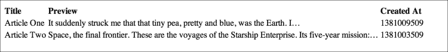
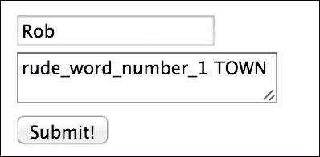

# 第四章：电子邮件、HTML 表格和文本库

在本章中，你将学习：

+   使用 CodeIgniter 电子邮件发送纯文本电子邮件

+   使用 CodeIgniter 电子邮件发送 HTML 电子邮件

+   使用 CodeIgniter 电子邮件发送附件

+   使用 CodeIgniter 电子邮件发送批量电子邮件

+   使用 DataTable 中的 HTML 表格

+   使用 DataTable 和数据库中的 HTML 表格

+   使用`word_limiter()`进行表格输出

+   使用`word_censor()`进行输入清理

# 简介

CodeIgniter 附带了一些有用的库和函数，用于处理应用程序开发的许多方面。在本章中，我们将探讨电子邮件和 HTML 表格。CodeIgniter 电子邮件库能够发送纯文本和 HTML 电子邮件，包括和不包括附件，这些附件可以用作（经过一些配置）替代标准的 PHP `mail()`函数。CodeIgniter 的 HTML 表格库在生成所需的 HTML 方面非常出色，几乎可以满足你对表格的所有需求——并且与 DataTable 一起，可以为用户提供出色的交互式表格。

# 使用 CodeIgniter 电子邮件发送纯文本电子邮件

能够发送电子邮件总是很有用的，CodeIgniter 附带了一个用于发送电子邮件的优秀库。本章中有几个关于发送电子邮件的食谱。然而，这是一个非常简单的 Hello World 类型示例。

## 如何操作...

使用 CodeIgniter 电子邮件发送纯文本电子邮件的简单方法如下：

1.  在`path/to/codeigniter/application/controllers/`路径下创建一个名为`email.php`的文件。

1.  将以下代码添加到控制器文件`email.php`中：

    ```php
    <?php if ( ! defined('BASEPATH')) exit('No direct script access allowed');

    class Email extends CI_Controller {
        function __construct() {
            parent::__construct();
            $this->load->helper('url');
            $this->load->library('email');
        }

        public function index() {
            redirect('email/send_email');
        }

        public function send_email() {
            $config['protocol'] = 'sendmail';
            $config['mailpath'] = '/usr/sbin/sendmail';
            $config['charset'] = 'iso-8859-1';
            $config['wordwrap'] = TRUE;
            $config['mailtype'] = 'text';

            $this->email->initialize($config);
            $this->email->from('from@domain.com', 'Your Name');
            $this->email->to('to@domain.com');
            $this->email->subject('This is a text email');
            $this->email->message('And this is some content for the text email.');

            $this->email->send();

            echo $this->email->print_debugger();
        }
    }
    ```

## 工作原理...

在构造函数控制器中，我们加载了电子邮件库（以下代码中突出显示），它提供了发送电子邮件的支持：

```php
function __construct() {
    parent::__construct();
    $this->load->helper('url');
    $this->load->library('email');
}
```

接下来，`public function index()`将我们重定向到`public function send_mail()`函数，该函数为 CodeIgniter 电子邮件库设置了一些初始配置变量，以便与它一起工作，例如用于发送电子邮件的系统（在本例中为`sendmail`）、在系统上发送电子邮件的路径、`mailtype`变量（文本或 HTML）等。看看以下代码行：

```php
$config['mailtype'] = 'text';

```

在这里，我们告诉 CodeIgniter 以纯文本而不是 HTML 的形式发送电子邮件。

这些配置设置被初始化（即传递给电子邮件库），然后我们通过设置`to`、`from`、`subject`和`message`属性来开始构建电子邮件：

```php
$this->email->from('from@domain.com', 'Your Name');
$this->email->to('to@domain.com');

$this->email->subject('This is a text email');
$this->email->message('And this is some content for the text email.');
```

然后，发送电子邮件：

```php
    $this->email->send();
```

如果一切按计划进行，你应该会看到一个类似以下输出的结果：

```php
User-Agent: CodeIgniter
Date: Fri, 4 Oct 2013 08:51:03 +0200
From: "Your Name" <from@domain.com>
Return-Path: <from@domain.com>
To: to@domain.com
Subject: =?iso-8859-1?Q?This_is_a_text_email?=
Reply-To: "from@domain.com" <from@domain.com>
X-Sender: from@domain.com
X-Mailer: CodeIgniter
X-Priority: 3 (Normal)
Message-ID: <524e6557968c5@domain.com>
Mime-Version: 1.0

Content-Type: text/plain; charset=iso-8859-1
Content-Transfer-Encoding: 8bit

And this is some content for the text email.
```

# 使用 CodeIgniter 电子邮件发送 HTML 电子邮件

有时候你可能希望显示格式化的电子邮件而不是纯文本，因此你可能希望在电子邮件正文中包含图片、文本格式和 URL。HTML 电子邮件将允许你这样做，并且 CodeIgniter 电子邮件库可以轻松地设置为执行此操作。

## 如何操作...

通过执行以下步骤可以发送 HTML 电子邮件：

1.  在`/path/to/codeigniter/application/controllers/`路径下创建一个名为`email.php`的文件。

1.  将以下代码添加到控制器文件 `email.php` 中：

    ```php
    <?php if ( ! defined('BASEPATH')) exit('No direct script access allowed');

    class Email extends CI_Controller {
        function __construct() {
            parent::__construct();
            $this->load->helper('url');
            $this->load->library('email');
    }

        public function index() {
            redirect('email/send_email');
        }

        public function send_email() {
            $config['protocol'] = 'sendmail';
            $config['mailpath'] = '/usr/sbin/sendmail';
            $config['charset'] = 'iso-8859-1';
            $config['wordwrap'] = TRUE;
            $config['mailtype'] = 'html';

            $this->email->initialize($config);

            $this->email->from('from@domain.com', 'Your Name');
            $this->email->to('to@domain.com');

            $this->email->subject('This is a html email');
            $html = 'This is an <b>HTML</b> email';
            $this->email->message($html);

            $this->email->send();

            echo $this->email->print_debugger();
        }
    }
    ```

## 工作原理...

在构造函数控制器中，我们加载了 Email 库（以下代码中突出显示），它为我们提供了发送电子邮件的支持：

```php
function __construct() {
    parent::__construct();
    $this->load->helper('url');
    $this->load->library('email');
}
```

接下来，`public function index()` 将我们重定向到函数 `public function send_mail()`，该函数为 CodeIgniter Email 库设置了一些初始配置变量，以便与电子邮件发送系统（在这种情况下，`sendmail`）、系统上发送电子邮件的路径、`mailtype` 变量（文本或 HTML）等一起工作。请看以下代码行：

```php
$config['mailtype'] = 'html';

```

在这里，我们告诉 CodeIgniter 以 HTML 格式而不是文本格式发送电子邮件。

这些配置设置被初始化（即传递给 Email 库），我们通过设置 `to`、`from`、`subject` 和 `message` 属性来开始构建电子邮件：

```php
$this->email->from('from@domain.com', 'Your Name');
$this->email->to('to@domain.com');
$this->email->subject('This is a text email');
$this->email->message('And this is some content for the text email.');
```

然后，使用以下代码发送电子邮件：

```php
    $this->email->send();
```

如果一切按计划进行，你应该会看到以下类似的输出代码：

```php
Your message has been successfully sent using the following protocol: sendmail
User-Agent: CodeIgniter
Date: Fri, 4 Oct 2013 08:56:59 +0200
From: "Your Name" <from@domain.com>
Return-Path: <from@domain.com>
To: to@domain.com
Subject: =?iso-8859-1?Q?This_is_a_html_email?=
Reply-To: "from@domain.com" <from@domain.com>
X-Sender: from@domain.com
X-Mailer: CodeIgniter
X-Priority: 3 (Normal)
Message-ID: <524e66bbf282f@domain.com>
Mime-Version: 1.0

Content-Type: multipart/alternative; boundary="B_ALT_524e66bbf2868"

This is a multi-part message in MIME format.
Your email application may not support this format.

--B_ALT_524e66bbf2868
Content-Type: text/plain; charset=iso-8859-1
Content-Transfer-Encoding: 8bit

This is an HTML email

--B_ALT_524e66bbf2868
Content-Type: text/html; charset=iso-8859-1
Content-Transfer-Encoding: quoted-printable

This is an <b>HTML</b> email

--B_ALT_524e66bbf2868--
```

# 使用 CodeIgniter Email 发送附件

有时候你可能希望在电子邮件中发送附件，例如向客户发送最近购买的发票或图片。CodeIgniter Email 库可以轻松设置以实现这一点。

## 如何操作...

你可以通过以下步骤使用 CodeIgniter Email 发送附件：

1.  在 `/path/to/codeigniter/application/controllers/` 创建一个名为 `email.php` 的文件。

1.  将以下代码添加到控制器文件 `email.php` 中：

    ```php
    <?php if ( ! defined('BASEPATH')) exit('No direct script access allowed');
    class Email extends CI_Controller {
        function __construct() {
            parent::__construct();
            $this->load->helper('url');
            $this->load->library('email');
    }
        public function index() {
            redirect('email/send_email');
        }
        public function send_email() {
            $config['protocol'] = 'sendmail';
            $config['mailpath'] = '/usr/sbin/sendmail';
            $config['charset'] = 'iso-8859-1';
            $config['wordwrap'] = TRUE;
            $config['mailtype'] = 'html';
            $this->email->initialize($config);
            $this->email->from('from@domain.com', 'Your Name');
            $this->email->to('to@domain.com');
            $this->email->subject('This is a html email');
            $html = 'This is an <b>HTML</b> email with an attachment, <i>lovely!</i>';
            $this->email->message($html);
            $this->email->attach('/path/to/attachment');
            $this->email->send();
            echo $this->email->print_debugger();
        }
    }
    ```

## 工作原理...

在构造函数控制器中，我们加载了 Email 库（以下代码中突出显示），它为我们提供了发送电子邮件的支持：

```php
function __construct() {
    parent::__construct();
    $this->load->helper('url');
    $this->load->library('email');
}
```

接下来，`public function index()` 将我们重定向到函数，`public function send_mail()`，该函数为 CodeIgniter Email 库设置了一些初始配置变量，以便与电子邮件发送系统（在这种情况下，`sendmail`）、系统上发送电子邮件的路径、`mailtype` 变量（文本或 HTML）等一起工作。这些配置设置被初始化（即传递给 Email 库），我们开始构建电子邮件；设置 `to`、`from`、`subject` 和 `message` 属性，以及我们发送电子邮件中附件的路径（以下代码中突出显示）：

```php
    $this->email->from('from@domain.com', 'Your Name');
    $this->email->to('to@domain.com');
    $this->email->subject('This is a html email');
    $html = 'This is an <b>HTML</b> email with an attachment, <i>lovely!</i>';
    $this->email->message($html);
    $this->email->attach('/path/to/attachment');

```

然后，使用以下代码发送电子邮件：

```php
$this->email->send();
```

# 使用 CodeIgniter Email 发送大量电子邮件

有时候你可能希望发送大量电子邮件；也许是要发送给所有支付了旅行费用的人。你可能希望给他们每个人发送个性化的电子邮件，并附加文件。你可能还希望从数据库中的账户中提取他们的电子邮件偏好（纯文本或 HTML）并发送正确的电子邮件格式。这正是我们要做的。

## 准备工作

我们需要了解每个人的偏好，例如他们是否想要 HTML 电子邮件或文本，以及他们旅行的个人参考号（或预订 ID）。根据这一要求，我们将有一个数据库来存储所有信息；因此，将以下代码复制到您的数据库中：

```php
CREATE TABLE `bookers` (
    `id` int(11) NOT NULL AUTO_INCREMENT,
    `firstname` varchar(50) NOT NULL,
    `lastname` varchar(50) NOT NULL,
    `email` varchar(255) NOT NULL,
    `email_pref` varchar(4) NOT NULL,
    `booking_ref` varchar(10) NOT NULL,
    PRIMARY KEY (`id`)
) ENGINE=InnoDB  DEFAULT CHARSET=latin1 AUTO_INCREMENT=3 ;
INSERT INTO `bookers` (`id`, `firstname`, `lastname`, `email`, `email_pref`, `booking_ref`) VALUES
(1, 'Robert', 'Foster', 'example1@domain1.com', 'html', 'ABC123'),
(2, 'Lucy', 'Welsh', 'example2@domain2.com', 'html', 'DEF456');
```

## 如何做...

1.  在 `/path/to/codeigniter/application/controllers/` 创建一个名为 `email.php` 的文件。

1.  将以下代码添加到控制器文件中，`email.php`:

    ```php
    <?php if ( ! defined('BASEPATH')) exit('No direct script access allowed');
    class Email extends CI_Controller {
        function __construct() {
            parent::__construct();
            $this->load->helper('url');
            $this->load->library('email');
    }
        public function index() {
            redirect('email/send_email');
    }
        public function send_email() {
            $config['protocol'] = 'sendmail';
            $config['mailpath'] = '/usr/sbin/sendmail';
            $config['charset'] = 'iso-8859-1';
            $config['wordwrap'] = TRUE;
            $query = "SELECT * FROM bookers ";
            $result = $this->db->query($query);
            foreach ($result->result() as $row) {
                $this->email->clear();
                if ($row->email_pref == 'text') {
                    $config['mailtype'] = 'text';
                    $body = 'Hi ' . $row->firstname . ', Thanks you for booking with us, please find attached the itinerary for your trip. This is your booking reference number: ' . $row->booking_ref . ' Thanks for booking with us, have a lovely trip.';
                } else {
                    $config['mailtype'] = 'html';
                    $body = 'Hi ' . $row->firstname . ',<br /><br />Thanks you for booking with us, please find attached the itinerary for your trip. </p>This is your booking reference number: <b>' . $row->booking_ref . '</b><br /><br />Thanks for booking with us, have a lovely trip.';
                }

                $this->email->initialize($config);
                $this->email->to($row->email);
                $this->email->from('bookings@thecodeigniterholidaycompany.com');
                $this->email->subject('Holiday booking details');

                $this->email->message($body);
                $this->email->send();
                }

            echo $this->email->print_debugger();
        }
    }
    ```

## 它是如何工作的...

在构造函数控制器中，我们加载 Email 库（以下代码中突出显示），它为我们提供发送电子邮件的支持：

```php
function __construct() {
    parent::__construct();
    $this->load->helper('url');
    $this->load->library('email');
}
```

接下来，`public function index()` 将我们重定向到函数 `public function send_mail()`，该函数为 CodeIgniter 邮件库设置一些初始配置变量，以便与系统一起工作，例如用于发送电子邮件的系统（在本例中为 `sendmail`），从您的系统发送邮件的路径。

然后，我们查询数据库以获取每位客户的预订详情：

```php
        $query = "SELECT * FROM bookers ";
        $result = $this->db->query($query);

        foreach ($result->result() as $row) {

        }
```

查询将遍历每个结果，并根据每个循环从数据库中检索的值发送特定的电子邮件：

首先，我们通过使用 CodeIgniter 的 `email` 函数清除前一个循环迭代中的所有设置和变量，给自己一个干净的起点：

```php
$this->email->clear();
```

然后，我们查看他们的电子邮件偏好，并根据需要设置电子邮件发送（`mailtype`）变量，以及电子邮件正文的文本。所以，如果有人更喜欢 HTML，我们会查找该偏好并定义 HTML 电子邮件的正文，否则对于文本电子邮件，我们会查找文本电子邮件偏好并定义文本电子邮件的正文：

```php
    if ($row->email_pref == 'text') {
        $config['mailtype'] = 'text';
        $body = 'Hi ' . $row->firstname . ', Thank you for booking with us, please find attached the itinerary for your trip. This is your booking reference number: ' . $row->booking_ref . ' Thanks for booking with us, have a lovely trip.';
    } else {
        $config['mailtype'] = 'html';
        $body = 'Hi ' . $row->firstname . ',<br /><br />Thank you for booking with us, please find attached the itinerary for your trip. </p>This is your booking reference number: <b>' . $row->booking_ref . '</b><br /><br />Thanks for booking with us, have a lovely trip.';
    }
```

在此之后，我们初始化配置变量。那些查看过前几个菜谱的人会注意到，初始化在这个菜谱的代码中比在其他菜谱中晚。这是因为我们不能提前初始化 `config` 变量，因为一些变量依赖于个别客户的偏好，这些偏好是从数据库中获取的。因此，我们必须等待每个用户的详细信息从数据库中获取，然后初始化配置设置的每个迭代。最后，我们发送电子邮件：

```php
    $this->email->send();
```

如果一切顺利，您应该会看到一个类似于以下输出的结果：

```php
Your message has been successfully sent using the following protocol: sendmail
User-Agent: CodeIgniter
Date: Fri, 4 Oct 2013 20:06:13 +0200
To: to@domain.com
From: <bookings@thecodeigniterholidaycompany.com>
Return-Path: <bookings@thecodeigniterholidaycompany.com>
Subject: =?iso-8859-1?Q?Holiday_booking_details?=
Reply-To: "bookings@thecodeigniterholidaycompany.com" <bookings@thecodeigniterholidaycompany.com>
X-Sender: bookings@thecodeigniterholidaycompany.com
X-Mailer: CodeIgniter
X-Priority: 3 (Normal)
Message-ID: <524f0395942a2@thecodeigniterholidaycompany.com>
Mime-Version: 1.0

Content-Type: multipart/alternative; boundary="B_ALT_524f0395942bb"

This is a multi-part message in MIME format.
Your email application may not support this format.

--B_ALT_524f0395942bb
Content-Type: text/plain; charset=iso-8859-1
Content-Transfer-Encoding: 8bit

Hi RobertThanks you booking with us,
 please find attached the itinerary for your trip.
 This is your booking reference number:
 ABC123
 Thanks for booking with us, have a lovely trip.

--B_ALT_524f0395942bb
Content-Type: text/html; charset=iso-8859-1
Content-Transfer-Encoding: quoted-printable

Hi Robert<br /><br />Thanks you booking with us,=20
                please find attached the itinerary for your trip.
                </p>This is your booking reference number:=20
                <b>ABC123</b><br /><br />
                Thanks for booking with us, have a lovely trip.

--B_ALT_524f0395942bb--
```

# 使用带有 DataTable 的 HTML 表格

DataTable 是一个免费使用的库，可以将您的普通外观 HTML 表格转换为交互式的奇迹，具有可排序和可搜索的列以及更多功能；我们将与 CodeIgniter 一起使用它，合并 DataTable 和 CodeIgniter 表功能。它简单易用，能够处理您需要的几乎所有事情。在这里，在这个菜谱中，我们将使用它与 DataTable 创建一个可排序和可搜索的交互式 HTML 表格。它还具有分页功能！如果您想要数据库结果，请继续查看下一个菜谱，*使用带有 DataTable 和数据库的 HTML 表格*，我们将查看如何从数据库查询中填充表格。

## 准备工作

对于这个示例，你需要遵循给定的程序：

1.  确保你已经从以下链接下载了 DataTable：

    [`datatables.net/download/`](https://datatables.net/download/)

1.  解压下载的`.zip`文件，并将文件移动到你的 Web 服务器或本地主机上的一个位置，这样 CodeIgniter 就可以访问了。对于这个示例，我已经将文件夹放在了`application/views`；但如果你愿意，你可以自己选择位置。

## 如何做到这一点...

1.  按照要求创建四个文件：

    +   `/path/to/codeigniter/application/controllers/table.php`

    +   `/path/to/codeigniter/application/views/table_header.php`

    +   `/path/to/codeigniter/application/views/table_body.php`

    +   `/path/to/codeigniter/application/views/table_footer.php`

1.  创建控制器文件，`table.php`，并将以下代码添加到其中：

    ```php
    <?php if ( ! defined('BASEPATH')) exit('No direct script access allowed');

    class Table extends CI_Controller {

        function __construct() {
            parent::__construct();
            $this->load->library('table');
    }

        public function index() {
            $tmpl = array (
                'table_open'          => '<table border="0" cellpadding="4" cellspacing="0" id="example">',

                'heading_row_start'   => '<tr>',
                'heading_row_end'     => '</tr>',
                'heading_cell_start'  => '<th>',
                'heading_cell_end'    => '</th>',

                'row_start'           => '<tr>',
                'row_end'             => '</tr>',
                'cell_start'          => '<td>',
                'cell_end'            => '</td>',

                'row_alt_start'       => '<tr>',
                'row_alt_end'         => '</tr>',
                'cell_alt_start'      => '<td>',
                'cell_alt_end'        => '</td>',

                'table_close'         => '</table>'
            );

            $this->table->set_template($tmpl);

            $this->table->set_heading(array('ID', 'First Name', 'Last Name'));

            $this->table->add_row(array('1', 'Rob', 'Foster'));
            $this->table->add_row(array('2', 'Lucy', 'Welsh'));
            $this->table->add_row(array('3', 'George', 'Foster'));
            $this->table->add_row(array('4', 'Jackie', 'Foster'));
            $this->table->add_row(array('5', 'Antony', 'Welsh'));
            $this->table->add_row(array('6', 'Rowena', 'Welsh'));
            $this->table->add_row(array('7', 'Peter', 'Foster'));
            $this->table->add_row(array('8', 'Jenny', 'Foster'));
            $this->table->add_row(array('9', 'Oliver', 'Welsh'));
            $this->table->add_row(array('10', 'Felicity', 'Foster'));
            $this->table->add_row(array('11', 'Harrison', 'Foster'));
            $this->table->add_row(array('12', 'Mia', 'The Cat'));

            $data['table'] = $this->table->generate();

            $this->load->view('tables/table_header');
            $this->load->view('tables/table_body',$data);
            $this->load->view('tables/table_footer');
        }

    }
    ```

1.  创建视图文件，`table_header.php`，并将以下代码添加到其中：

    ```php
    <html>
        <head>
            <style type="text/css" title="currentStyle">
                @import "<?php echo $this->config->item('base_url') ; ?>application/views/DataTables-1.9.4/media/css/demo_page.css";
                @import "<?php echo $this->config->item('base_url') ; ?>application/views/DataTables-1.9.4/media/css/jquery.dataTables.css";
            </style>
            <script type="text/javascript" language="javascript" src="img/jquery.js"></script>
            <script type="text/javascript" language="javascript" src="img/jquery.dataTables.js"></script>
            <script type="text/javascript" charset="utf-8">
                $(document).ready(function() {
                    $('#example').dataTable();
                } );
            </script>
        </head>
        <body>
    ```

    看一下`<script>`标签：

    ```php
        <script type="text/javascript" charset="utf-8">
            $(document).ready(function() {
                $('#example').dataTable();
            } );
        </script>
    ```

    `#example`参数是表格的 ID（在以下*工作原理...*部分中详细说明）。确保`<script>`和表格标记中的`example`值相同。

1.  创建视图文件，`table_body.php`，并将以下代码添加到其中：

    ```php
    <?php echo $table ; ?>
    ```

1.  创建控制器文件，`table_footer.php`，并将以下代码添加到其中：

    ```php
        </body>
    </html>
    ```

## 工作原理...

表格控制器中的构造函数加载了 CodeIgniter 的表格库：

```php
    function __construct() {
        parent::__construct();
        $this->load->library('table');
    }
```

`public function index()`函数被调用。然后我们定义我们想要的 HTML 表格标记的样式。这是你可以放置任何特定 CSS 标记的地方，使用它可以样式化表格的元素：

```php
$tmpl = array (
    'table_open'          => '<table border="0" cellpadding="4" cellspacing="0" id="example">',

    'heading_row_start'   => '<tr>',
    'heading_row_end'     => '</tr>',
    'heading_cell_start'  => '<th>',
    'heading_cell_end'    => '</th>',

    'row_start'           => '<tr>',
    'row_end'             => '</tr>',
    'cell_start'          => '<td>',
    'cell_end'            => '</td>',

    'row_alt_start'       => '<tr>',
    'row_alt_end'         => '</tr>',
    'cell_alt_start'      => '<td>',
    'cell_alt_end'        => '</td>',

    'table_close'         => '</table>'
);
```

更仔细地看看`$tmpl`数组中的`table_open`元素。查找前面代码中突出显示的项目。`id="example"`项目被 DataTable（在`table_header.php`文件的`<script>`标签中）用来应用其 CSS 和功能。当然，你可以将其命名为任何你喜欢的名字，但请确保在 JavaScript 中反映这一变化。

然后我们调用`$this->table->set_template()`来应用 HTML 表格标记：

```php
$this->table->set_template($tmpl);
```

然后我们设置表格标题并应用行数据。确保表格标题中的项目数与表格数据中的项目数相同：

```php
    $this->table->set_heading(array('ID', 'First Name', 'Last Name'));

    $this->table->add_row(array('1', 'Rob', 'Foster'));
    $this->table->add_row(array('2', 'Lucy', 'Welsh'));
    $this->table->add_row(array('3', 'George', 'Foster'));
    $this->table->add_row(array('4', 'Jackie', 'Foster'));
    $this->table->add_row(array('5', 'Antony', 'Welsh'));
    $this->table->add_row(array('6', 'Rowena', 'Welsh'));
    $this->table->add_row(array('7', 'Peter', 'Foster'));
    $this->table->add_row(array('8', 'Jenny', 'Foster'));
    $this->table->add_row(array('9', 'Oliver', 'Welsh'));
    $this->table->add_row(array('10', 'Felicity', 'Foster'));
    $this->table->add_row(array('11', 'Harrison', 'Foster'));
    $this->table->add_row(array('12', 'Mia', 'The Cat'));
```

然后我们生成表格。`$this->table->generate()`函数将返回一个 HTML 字符串，我们将其保存到`$data['table']`。

```php
    $data['table'] = $this->table->generate();
```

然后将`$data`数组传递给我们的视图文件以在浏览器中渲染：

```php
    $this->load->view('tables/table_header');
    $this->load->view('tables/table_body',$data);
    $this->load->view('tables/table_footer');
```

# 使用带有 DataTable 的 HTML 表格和数据库

CodeIgniter 附带了一个有用的库来处理 HTML 表格。它易于使用，并且能够处理你需要的几乎所有事情。在这个示例中，我们将使用它与 DataTable 一起创建一个可排序和可搜索的交互式 HTML 表格。它甚至有分页功能！这个示例使用数据库查询来填充表格。如果你不想要这个功能，只想创建一个简单的表格，请尝试前面的示例——*使用带有 DataTable 的 HTML 表格*。

## 准备工作

对于这个示例，你必须：

1.  确保你已经从[`datatables.net/download/`](https://datatables.net/download/)下载了 DataTable。

1.  解压下载的`.zip`文件，并将文件移动到你的 Web 服务器或本地主机上的一个位置，这将使 CodeIgniter 能够访问。对于这个食谱，我已经将文件夹放在了`application/views`文件夹中；但如果你愿意，你可以自己选择。

1.  由于我们正在使用 CodeIgniter 的 HTML 表格库来创建一个包含数据库表格数据的表格，我们首先需要创建这个表格；因此，将以下代码复制到你的数据库中：

    ```php
    CREATE TABLE IF NOT EXISTS `person` (
        `id` int(11) NOT NULL AUTO_INCREMENT,
        `first_name` varchar(50) NOT NULL,
        `last_name` varchar(50) NOT NULL,
        `email` varchar(255) NOT NULL,
        PRIMARY KEY (`id`)
    ) ENGINE=InnoDB  DEFAULT CHARSET=latin1 AUTO_INCREMENT=5 ;
    INSERT INTO `person` (`id`, `first_name`, `last_name`, `email`) VALUES
    (1, 'Rob', 'Foster', 'rfoster@dudlydog.com'),
    (2, 'Lucy', 'Welsh', 'lwelsh@cocopopet.com'),
    (3, 'Chloe', 'Graves', 'cgraves@mia-cat.com'),
    (4, 'Claire', 'Strickland', 'cstrickland@an-other-domain.com');
    ```

## 如何做到这一点...

1.  按照要求创建四个文件：

    +   `/path/to/codeigniter/application/controllers/table.php`

    +   `/path/to/codeigniter/application/views/table_header.php`

    +   `/path/to/codeigniter/application/views/table_body.php`

    +   `/path/to/codeigniter/application/views/table_footer.php`

1.  创建控制器文件`table.php`，并将以下代码添加到其中：

    ```php
    <?php if ( ! defined('BASEPATH')) exit('No direct script access allowed');

    class Table extends CI_Controller {

        function __construct() {
            parent::__construct();
            $this->load->library('table');
            $this->load->database();
        }

        public function index() {
            $tmpl = array (
                'table_open'          => '<table border="0" cellpadding="4" cellspacing="0" id="example">',

                'heading_row_start'   => '<tr>',
                'heading_row_end'     => '</tr>',
                'heading_cell_start'  => '<th>',
                'heading_cell_end'    => '</th>',

                'row_start'           => '<tr>',
                'row_end'             => '</tr>',
                'cell_start'          => '<td>',
                'cell_end'            => '</td>',

                'row_alt_start'       => '<tr>',
                'row_alt_end'         => '</tr>',
                'cell_alt_start'      => '<td>',
                'cell_alt_end'        => '</td>',

                'table_close'         => '</table>'
            );

            $this->table->set_template($tmpl);

            $this->table->set_heading(array('ID', 'First Name', 'Last Name', 'Email'));	
            $query = $this->db->query("SELECT * FROM person");
            $data['table'] = $this->table->generate($query);

            $this->load->view('tables/table_header');
            $this->load->view('tables/table_body',$data);
            $this->load->view('tables/table_footer');
        }
    }
    ```

1.  创建视图文件`table_header.php`，并将以下代码添加到其中：

    ```php
    <html>
        <head>
            <style type="text/css" title="currentStyle">
                @import "<?php echo $this->config->item('base_url') ; ?>application/views/DataTables-1.9.4/media/css/demo_page.css";
                @import "<?php echo $this->config->item('base_url') ; ?>application/views/DataTables-1.9.4/media/css/jquery.dataTables.css";
            </style>
            <script type="text/javascript" language="javascript" src="img/jquery.js"></script>
            <script type="text/javascript" language="javascript" src="img/jquery.dataTables.js"></script>
            <script type="text/javascript" charset="utf-8">
            $(document).ready(function() {
                $('#example').dataTable();
                } );
            </script>
        </head>
        <body>
    ```

    `#example`参数是表格的 ID（在以下*How it works*部分中详细说明）。确保`<script>`和表格标记中的`example`值相同。

1.  创建视图文件`table_body.php`，并将以下代码添加到其中：

    ```php
    <?php echo $table ; ?>
    ```

1.  创建控制器文件`table_footer.php`，并将以下代码添加到其中：

    ```php
        </body>
    </html>
    ```

## 它是如何工作的...

`table`控制器中的构造函数加载了 CodeIgniter 的表格库：

```php
    function __construct() {
        parent::__construct();
        $this->load->library('table');
    }
```

调用了`public function index()`函数。然后我们定义了我们的 HTML 表格标记应该如何看起来。这就是你可以放置任何用于特定 CSS 的标记的地方，使用它可以对表格的元素进行样式化：

```php
$tmpl = array (
    'table_open'          => '<table border="0" cellpadding="4" cellspacing="0" id="example">',

    'heading_row_start'   => '<tr>',
    'heading_row_end'     => '</tr>',
    'heading_cell_start'  => '<th>',
    'heading_cell_end'    => '</th>',

    'row_start'           => '<tr>',
    'row_end'             => '</tr>',
    'cell_start'          => '<td>',
    'cell_end'            => '</td>',

    'row_alt_start'       => '<tr>',
    'row_alt_end'         => '</tr>',
    'cell_alt_start'      => '<td>',
    'cell_alt_end'        => '</td>',

    'table_close'         => '</table>'
);
```

仔细查看`$tmpl`数组中的`table_open`元素。在前面代码中查找我突出显示的项目。`id="example"`项被 DataTable（在`table_header.php`文件的`<script>`标签中）用于应用其 CSS 和功能。当然，你可以将其命名为任何你喜欢的名字，但请确保在 JavaScript 代码中反映这一变化。

然后我们调用`$this->table->set_template()`来应用 HTML 表格标记：

```php
$this->table->set_template($tmpl);
```

然后我们设置表格标题，并从数据库查询中应用我们的行数据。确保表格标题中的项目数与表格数据中的项目数相同：

```php
    $this->table->set_heading(array('ID', 'First Name', 'Last Name', 'Email'));	
    $query = $this->db->query("SELECT * FROM person");
    $data['table'] = $this->table->generate($query);
```

然后我们生成表格。`$this->table->generate()`函数将返回一个 HTML 字符串，我们将它保存到`$data['table']`中。

```php
    $data['table'] = $this->table->generate();
```

然后将`$data`数组传递到我们的视图文件中，以便在浏览器中渲染：

```php
    $this->load->view('tables/table_header');
    $this->load->view('tables/table_body',$data);
    $this->load->view('tables/table_footer');
```

# 使用 word_limiter()进行表格输出

假设你正在制作一个 CMS 或某种类型的管理员界面，并且你目前正在制作一个列出——哦，我不知道——文章的视图。假设你的数据库中有些文章，你必须列出它们。对于 CMS 的用户来说，提供文章的简要预览可能是有用的，这样他们就可以确定他们正在删除、编辑或只是查看正确的文章。预览——类似于电子邮件客户端中的预览——显示前几行，这样用户就可以确定他们正在查看的内容。CodeIgniter 提供了一个方便的函数，用于限制从文本字符串中显示的单词数量；这个函数非常适合这样的用途。在这里，我们将为我们的视图配方构建一个非常小的示例，列出一些文章并预览每篇文章的前几行。

## 准备工作

由于文章将存储在数据库中，我们需要构建一个表来存储它们；这将是一个包含文章的简单表。在任何应用程序中，你很可能会自己构建文章和文章管理（或你托管的内容）的数据库表，并且会有比这里示例中更多的不同设计和模式。然而，这只是一个简短的示例——请随意根据需要调整和修改配方：

在你的数据库中创建以下表：

```php
CREATE TABLE `articles` (
    `id` int(11) NOT NULL AUTO_INCREMENT,
    `title` varchar(255) NOT NULL,
    `body` text NOT NULL,
    `created_at` int(11) NOT NULL,
    PRIMARY KEY (`id`)
) ENGINE=InnoDB  DEFAULT CHARSET=latin1 AUTO_INCREMENT=3 ;
```

将以下条目插入到表中：

```php
INSERT INTO `articles` (`id`, `title`, `body`, `created_at`) VALUES
(1, 'Article One', '<p>It suddenly struck me that that tiny pea, pretty and blue, was the Earth. I put up my thumb and shut one eye, and my thumb blotted out the planet Earth. I didn't feel like a giant. I felt very, very small.</p>\r\n<p>Houston, Tranquillity Base here. The Eagle has landed.</p>\r\n<p>That's one small step for [a] man, one giant leap for mankind.</p>', 1381009509),
(2, 'Article Two', '<p>Space, the final frontier. These are the voyages of the Starship Enterprise. Its five-year mission: to explore strange new worlds, to seek out new life and new civilizations, to boldly go where no man has gone before.</p>\r\n<p>We choose to go to the moon in this decade and do the other things, not because they are easy, but because they are hard, because that goal will serve to organize and measure the best of our energies and skills, because that challenge is one that we are willing to accept, one we are unwilling to postpone, and one which we intend to win.</p>\r\n<p>The sky is the limit only for those who aren't afraid to fly!</p>', 1381003509);
```

我们在这里显示文章（通常相当长）。因此，为了节省书籍的空间并限制你需要输入的代码量，我只包括了 2 篇简短的文章。我从 Space Ipsum 网站（[`spaceipsum.com/`](http://spaceipsum.com/)）获取了文章的文本。如果你不想输入前面代码中的所有文本（你为什么要这样做呢），你可以去 Space Ipsum 获取你自己的文章内容用于这个配方。无论如何，这都是好的。

## 如何操作...

我们将创建以下三个文件：

+   `/path/to/codeigniter/application/controllers/` 下的 `limit.php`：这将为我们运行程序，调用模型并将数据传递到 `limit/` 下的视图文件 `view_all.php`。

+   `/path/to/codeigniter/application/views/limit/view_all.php`：这将显示每个文章的表格摘要，并通过 `word_limiter()` 限制正文字段的内容

+   `/path/to/codeigniter/application/models/limit_model.php`：这将使用 Active Record 从数据库检索文章

1.  我们将创建以下三个文件：创建控制器文件，`limit.php`，并将以下代码添加到其中：

    ```php
    <?php if ( ! defined('BASEPATH')) exit('No direct script access allowed');

    class Limit extends CI_Controller {
        function __construct() {
            parent::__construct();
            $this->load->helper('url');
            $this->load->helper('text');
            $this->load->model('Limit_model');
    }

        public function index() {
            redirect('limit/view_all');
        }

        public function view_all() {
            $data['query'] = $this->Limit_model->get_all();
            $this->load->view('limit/view_all', $data);
        }
    }
    ```

1.  创建视图文件，`views/limit/view_all.php`，并将以下代码添加到其中：

    ```php
    <table>
        <tr>
            <td><b>Title</b></td>
            <td><b>Preview</b></td>
            <td><b>Created At</b></td>
        </tr>
        <?php foreach ($query->result() as $row) : ?>
            <tr>
                <td><?php echo $row->title ; ?></td>
                <td><?php echo word_limiter($row->body, 15) ; ?></td>
                <td><?php echo $row->created_at ; ?></td>
            </tr>
        <?php endforeach ; ?>

    </table>
    ```

1.  创建模型文件，`limit_model.php`，并将以下代码添加到其中：

    ```php
    <?php if ( ! defined('BASEPATH')) exit('No direct script access allowed');

    class Limit_model extends CI_Model {
        function __construct() {
            parent::__construct();
        }

        function get_all() {
            $query = $this->db->get('articles');
            return $query;
        }
    }
    ```

## 工作原理...

我们首先在构造函数中加载支持资源：

```php
    function __construct() {
        parent::__construct();
        $this->load->helper('url');
        $this->load->helper('text');
        $this->load->model('Limit_model');
    }
```

`url`和`text`变量将分别为`redirect()`和`word_limit()`函数提供支持，而`Limit_model`类将为我们提供数据库访问支持。

`public function index()`函数将我们重定向到公共函数`view_all`，该函数调用`Limit_model`的`get_all()`函数：

```php
        $data['query'] = $this->Limit_model->get_all();
        $this->load->view('limit/view_all', $data);
```

`get_all()`函数将使用 Active Record 查询数据库并提取内容，然后将这些内容传递回我们的控制器，并保存在`$data`数组中（以下代码中突出显示），然后传递给`limit/view_all`视图文件：

```php
 $data['query'] = $this->Limit_model->get_all();
        $this->load->view('limit/view_all', $data);
```

如果一切按计划进行，您应该会看到以下截图类似的内容：



您可以看到**预览**列的单词计数限制为 15 个单词，其中被截断并附加了三个句点（**...**）。

# 使用`word_censor()`函数进行输入清理

在构建应用程序的过程中，可能会有需要不仅验证不受欢迎的数据，还要检查该数据内容中是否存在任何不受欢迎的单词或短语的情况。例如，假设您正在构建一个简单的博客引擎，并且不希望人们用粗鲁的词语和短语回复您的博客文章——这是合理的。因此，您需要能够查看用户输入并过滤掉可能存在的任何不受欢迎的内容。CodeIgniter 提供了这样的功能，即`word_censor()`函数。让我们看看如何使用它。

## 准备工作

我们将把审查后的词语存储在数据库中；因此，我们将寻找可以替代实际粗鲁词语的词语，例如`rude_word_number_1`等。

在您的数据库中运行以下 MySQL 代码：

```php
CREATE TABLE `censored_words` (
    `id` int(11) NOT NULL AUTO_INCREMENT,
    `word` varchar(255) NOT NULL,
    PRIMARY KEY (`id`)
) ENGINE=InnoDB  DEFAULT CHARSET=latin1 AUTO_INCREMENT=5 ;

INSERT INTO `censored_words` (`id`, `word`) VALUES
(1, 'rude_word_number_1'),
(2, 'rude_word_number_2'),
(3, 'rude_word_number_3'),
(4, 'rude_word_number_4');
```

我们将把审查后的文本存储在另一个表中。由于没有更好的标题，我将其表命名为`censor`。以下是该表的架构代码，您可以在您的数据库中运行：

```php
CREATE TABLE `censor` (
    `id` int(11) NOT NULL AUTO_INCREMENT,
    `name` varchar(255) NOT NULL,
    `body` text NOT NULL,
    PRIMARY KEY (`id`)
) ENGINE=InnoDB DEFAULT CHARSET=latin1 AUTO_INCREMENT=1 ;
```

## 如何操作...

1.  按照以下所示创建三个文件：

    +   `/path/to/codeigniter/application/controllers/censor.php`

    +   `/path/to/codeigniter/application/views/censor/create.php`

    +   `/path/to/codeigniter/application/models/censor_model.php`

1.  创建控制器文件`censor.php`，并向其中添加以下代码：

    ```php
    <?php if ( ! defined('BASEPATH')) exit('No direct script access allowed');

    class Censor extends CI_Controller {
        function __construct() {
            parent::__construct();
            $this->load->helper('url');
            $this->load->helper('text');
            $this->load->model('Censor_model');
        }

        public function index() {
            redirect('censor/create');
        }

        public function create() {
            $this->load->library('form_validation');
            $this->form_validation->set_error_delimiters('', '<br />');
            $this->form_validation->set_rules('name', 'Name', 'required|min_length[1]|max_length[225]|trim');
            $this->form_validation->set_rules('body', 'Body', 'required|min_length[1]|max_length[2000]|trim');

            if ($this->form_validation->run() == FALSE) {
                $this->load->view('censor/create');
            } else {
                $query = $this->Censor_model->get_censored_words();
                $censored_words = array();

                foreach ($query->result() as $row) {
                    $censored_words[] = $row->word;
                }

                $data = array(
                    'name' => $this->input->post('name'),
                    'body' => word_censor($this->input->post('body'), $censored_words, 'BOOM')
                );

                if ($this->Censor_model->create($data)) {
                    echo 'Entered into DB:<br /><pre>';
                    var_dump($data);
                    echo '</pre>';
                }
            }
        }
    }
    ```

1.  在`/path/to/codeigniter/application/views/censor/`目录下创建视图文件`create.php`，并向其中添加以下代码：

    ```php
    <?php echo validation_errors() ; ?>
    <?php echo form_open('censor/create');?>
        <input type="text" name="name" size="20" value="<?php echo set_value('body') ; ?>" />
        <br />
        <textarea name="body"><?php echo set_value('body') ; ?></textarea>
        <br />
    <?php echo form_submit('submit','Submit!') ; ?>
    <?php echo form_close() ; ?>
    ```

1.  在`/path/to/codeigniter/application/models/`目录下创建模型文件`censor_model.php`，并向其中添加以下代码：

    ```php
    <?php if ( ! defined('BASEPATH')) exit('No direct script access allowed');

    class Censor_model extends CI_Model {
        function __construct() {
            parent::__construct();
        }

        function get_censored_words() {
            $query = $this->db->get('censored_words');
            return $query;
        }

        function create($data) {
            if ($this->db->insert('censor', $data)) {
                return true;
            } else {
                return false;
            }
        }
    }
    ```

## 如何工作...

我们`Censor`类中的构造函数加载我们的支持文件：助手`url`和`text`，以及我们的模型`Censor_model`：

```php
    function __construct() {
        parent::__construct();
        $this->load->helper('url');
        $this->load->helper('text');
        $this->load->model('Censor_model');
    }
```

`public function index()`函数将我们重定向到`public function create()`，在那里我们开始表单验证。我们加载表单验证库并设置错误定界符，之后我们在视图文件`create.php`中设置表单元素的规则，该文件位于`/path/to/codeigniter/application//views/censor/`。

如果有错误，或者控制器第一次被访问，`$this->form_validation->run()`将等于`FALSE`，我们将只显示视图文件供用户填写。

然而，一旦表单已经提交（并且假设 CodeIgniter 的验证功能没有发现任何错误），我们现在想要检查输入中是否有任何不想要的词。为了做到这一点，我们首先需要获取一个不想要的词列表。因为我们把这些词存储在数据库表`censored_words`中，所以我们也应该获取它们。因此，我们使用`censor_model`函数的`get_censored_words()`从数据库中获取它们，并将它们添加到一个名为`$censored_words`的数组中：

```php
$query = $this->Censor_model->get_censored_words();
$censored_words = array();

foreach ($query->result() as $row) {
    $censored_words[] = $row->word;
}
```

然后，我们构建一个`$data`数组，准备传递给`Censor_model`函数的`create()`。看看数组的`body`元素，我在以下代码中已经突出显示了：

```php
$data = array(
    'name' => $this->input->post('name'),
    'body' => word_censor($this->input->post('body'), $censored_words, 'BOOM')
   	);
```

在这里，我们调用文本辅助函数`word_censor()`，传递我们希望检查的字符串。在这种情况下，`body`包含提交表单的项目，以及一个包含审查词的数组作为第二个参数；第三个参数是可选的。留空第三个参数将导致 CodeIgniter 用默认字符串`####`替换审查词。然而，对于这个食谱，我们用字符串`BOOM`替换每个审查词。

然后，`$data`数组被写入数据库表`censor`（我真的必须为这个表想一个更好的名字）。

让我们试一试。在你的浏览器中运行审查控制器，你应该会看到一个类似于以下截图的输出：



在这里，我们输入了值`Rob`和`rude_word_number_1 TOWN`。当你点击**提交**按钮时，你应该会看到`$data`的`var_dump`数组显示：

```php
Entered into DB:
array(2) {
  ["name"]=>
  string(3) "Rob"
  ["body"]=>
  string(9) "BOOM TOWN"
}
```

如果你看到**BOOM TOWN**，你就知道它已经工作了！
