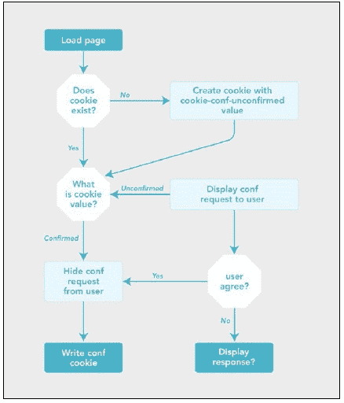

# 第五章. 管理数据输入和输出

在本章中，我们将涵盖：

+   向多个视图发送不同的数据

+   验证用户输入

+   准备用户输入

+   CodeIgniter 中的粘性表单元素

+   在表单项旁边显示错误

+   从文件系统中读取文件

+   将文件写入文件系统

+   创建和下载 ZIP 文件

+   使用 CodeIgniter 上传文件

+   创建和使用验证回调

+   使用语言类

+   使用语言类 – 动态切换语言

+   从用户处确认 cookie 接受

# 简介

管理数据是一个重要的主题，不仅涵盖输出数据的格式、数据库结构和访问方法，还包括安全性；关于数据和管理的任何讨论显然都会涉及安全性和保护您的系统和数据。因此，这将与安全章节有一些交叉，我建议您在阅读本章的同时也阅读那个章节。

# 向多个视图发送不同的数据

最近有人问我是否可以在同一浏览器页面上向不同的视图发送不同的数据，并在其自己的部分显示这些数据。幸运的是，这可以轻松完成；你可以同时向多个视图传递多个数据数组。

如果您的网页被分成几个部分，每个部分显示其自己的数据，这可能会非常有用。例如，您可能希望一个部分显示最受欢迎的文章，另一个部分显示最受欢迎的分享文章。

## 准备工作

由于我们将从数据库中提取数据，我们需要确保一些 `config` 变量被设置为允许我们这样做。打开 `/path/to/codeigniter/application/config/database.php` 文件并找到以下设置。然后，根据您的需求修改它们：

| 选项名称 | 有效选项 | 描述 |
| --- | --- | --- |
| `$db['default']['hostname']` | 通常为 localhost | 这是数据库所在的服务器 |
| `$db['default']['username']` | ? | 数据库访问用户名 |
| `$db['default']['password']` | ? | 数据库密码 |
| `$db['default']['database']` | ? | 数据库名称 |

现在我们已经配置了 CodeIgniter 以连接到数据库，将以下代码复制到您的数据库中：

```php
CREATE TABLE IF NOT EXISTS `articles` ( 
  `article_id` int(11) NOT NULL AUTO_INCREMENT, 
  `article_title` varchar(255) NOT NULL, 
  `article_body` text NOT NULL, 
  `is_main` varchar(3) NOT NULL, 
  PRIMARY KEY (`article_id`) 

); 

INSERT INTO `articles` (`article_id`, `article_title`, `article_body`, `is_main`) VALUES 
(1, 'Article One', 'Article One Body', 'yes'), 
(2, 'Article Two', 'Article Two Body', 'no'), 
(3, 'Article Three', 'Article Three Body', 'no'), 
(4, 'Article Four', 'Article Four Body', 'no'), 
(5, 'Article Five', 'Article Five Body', 'no'), 
(6, 'Article Six', 'Article Six Body', 'no'); 
```

## 如何做到...

我们将创建四个文件：

+   `/path/to/codeigniter/application/controllers/articles.php`

+   `/path/to/codeigniter/application/models/content_model.php`

+   `/path/to/codeigniter/application/views/articles/left.php`

+   `/path/to/codeigniter/application/views/articles/right.php`

1.  创建 `/path/to/codeigniter/application/controllers/articles.php` 文件并将以下代码复制到其中：

    ```php
    <?php if (!defined('BASEPATH')) exit('No direct script access allowed'); 
    class Articles extends CI_Controller { 
      function __construct() { 
        parent::__construct(); 
        $this->load->helper('url'); 
      } 

      public function index() { 
        // Load content model 
        $this->load->model('content_model'); 

        // Fetch stuff from database and store in specific arrays 
        $left_data['main_article'] = $this->content_model->get_main_article();   
        $right_data['article_list'] = $this->content_model->get_article_list();        

        // Load views and pass data to them 
        $this->load->view('articles/left', $left_data); 
        $this->load->view('articles/right', $right_data); 
      } 
    } 
    ```

1.  创建 `/path/to/codeigniter/application/models/content_model.php` 文件并将以下代码复制到其中：

    ```php
    class Content_model extends CI_Model { 
      function get_main_article() { 
        $this->db->where('is_main', 'yes'); 
        return $this->db->get('articles'); 
      } 

      function get_article_list() { 
        return $this->db->get('articles');        
      }    
    } 
    ```

1.  创建 `/path/to/codeigniter/application/views/articles/left.php` 文件并将以下代码复制到其中：

    ```php
    <?php foreach ($main_article->result() as $main_row) : ?> 
        <h2><?php echo $main_row->article_title ; ?></h2> 
        <p><?php echo $main_row->article_body ; ?></p> 
    <?php endforeach ; ?> 
    ```

1.  创建 `/path/to/codeigniter/application/views/articles/right.php` 文件并将以下代码复制到其中：

    ```php
    <?php foreach ($article_list->result() as $list_row) : ?> 
        <?php echo anchor('#', $list_row->article_title) ; ?><br /> 
    <?php endforeach ; ?> 
    ```

## 它是如何工作的...

`public function index()` 通过 `$this->load->model('content_model');` 加载 `content_model` 模型，并调用两个模型函数 `get_main_article()` 和 `get_article_list()`。`get_main_article()` 函数获取左侧视图的行并将其存储在 `$left_data` 数组中，而 `get_article_list()` 函数获取右侧视图的结果并将其存储在 `$right_data` 数组中：

```php
// Fetch stuff from database and store in $data 
$left_data['main_article'] = $this->content_model->get_main_article();   
$right_data['article_list'] = $this->content_model->get_article_list();        
```

左视图和右视图都被调用，并且将数组（`$left_data` 和 `$right_data`）传递给它们：

```php
// Load views and pass $data variable to them 
$this->load->view('articles/left', $left_data); 
$this->load->view('articles/right', $right_data); 
```

然后，每个视图将遍历特定的数组，输出我们想要的字段。

# 验证用户输入

验证用户输入允许您设置规则，以便可以对来自用户的输入进行判断。例如，您可能希望对电子邮件字段强制执行某些条件，最明显的是检查有效的电子邮件语法，但也可以检查最小和最大长度，以及是否为必填项。CodeIgniter 甚至可以检查数据库中的重复值。在这个菜谱中，我们将构建一个控制器和视图，它们一起将允许用户输入数据，并对其与设置的规则进行验证；如果有任何错误，将反馈给用户。

## 准备工作

在开始之前，您需要了解一些事情。以下是一个所有可用 CodeIgniter 验证规则的表格：

| 规则 | 参数 | 描述 |
| --- | --- | --- |
| 必填 | 否 | 它指定特定的表单元素在用户提交时是否必须具有数据。如果为空，则返回 `FALSE`。 |

| 匹配 | 是 | 它比较两个表单元素之间的数据，以查看它们是否匹配。如果不匹配，则返回 `FALSE`；如果匹配，则返回 `TRUE`。示例用法：

```php
$this->form_validation->set_rules('item1', 'Item1', ''); 
$this->form_validation->set_rules('item2', 'Item2', 'matches[Item1]'); 
```

|

| 唯一 | 是 | 它查询数据库以查看表记录项的值是否与提交的表单元素的值匹配。如果表单元素不是唯一的，则返回 `FALSE`。示例用法：

```php
$this->form_validation->set_rules('item1','Item1', 'matches[users.username]'); 
```

|

| 最小长度 | 是 | 它检查表单元素中的值的长度是否小于指定的参数。如果表单元素小于指定的值，则返回 `FALSE`。示例用法：

```php
$this->form_validation->set_rules('item1', 'Item1', 'min_length[12]'); 
```

|

| 最大长度 | 是 | 它是 min_length 的反义词；它检查表单元素中的值的长度是否大于指定的参数。如果表单元素大于指定的值，则返回 `FALSE`。示例用法：

```php
$this->form_validation->set_rules('item1', 'Item1', 'max_length[12]'); 
```

|

| 精确长度 | 是 | 它检查表单元素中的值的长度是否与指定的参数完全相同。如果表单元素不是指定的内容，则返回 `FALSE`。示例用法：

```php
$this->form_validation->set_rules('item1', 'Item1', 'exact_length [12]'); 
```

|

| 大于 | 是 | 它检查表单元素中的值是否大于提供的参数。如果表单元素小于参数值或该值不是数字，则返回 `FALSE`。示例用法：

```php
$this->form_validation->set_rules('item1', 'Item1', 'greater_than[12]'); 
```

|

| less_than | 是 | 它是 greater_than 的反义词。它检查表单元素中的值是否小于提供的参数。如果表单元素大于参数值或该值不是数字，它将返回 `FALSE`。示例用法：

```php
$this->form_validation->set_rules('item1', 'Item1', 'less_than[12]');
```

|

| alpha | 否 | 它检查表单元素中的值是否只包含字母字符。如果表单元素值不是这样，它将返回 `FALSE`。 |
| --- | --- | --- |
| alpha_numeric | 否 | 它检查表单元素中的值是否只包含字母和整数。如果表单元素值不是这样，它将返回 `FALSE`。 |
| alpha_dash | 否 | 它检查表单元素的值是否只包含字母数字字符、下划线或破折号。如果包含其他任何值，它将返回 `FALSE`。 |
| numeric | 否 | 它检查表单元素的值是否只包含数字字符。如果表单元素包含除数字以外的任何内容，它将返回 `FALSE`。 |
| integer | 否 | 它检查表单元素的值是否只包含整数。如果表单元素包含除整数以外的任何内容，它将返回 `FALSE`。 |
| decimal | 是 | 它检查表单元素的值是否包含十进制值，即用小数点（`.`）分隔的数字，否则它将返回 `FALSE`。 |
| is_natural | 否 | 它检查表单元素的值是否只包含自然数——也就是说，除了 1、2、3、4、5 等等之外的内容。如果表单元素包含除这些之外的内容，它将返回 `FALSE`。 |
| is_natural_no_zero | 否 | 它检查表单元素的值是否只包含大于零的自然数。如果值不是自然数或零，它将返回 `FALSE`。 |
| valid_email | 否 | 它检查表单元素的值是否包含由 CodeIgniter 内部的正则表达式计算出的有效电子邮件。如果表单元素不包含有效电子邮件地址，它将返回 `FALSE`。 |
| valid_emails | 否 | 它检查表单元素的值是否包含由 CodeIgniter 内部的正则表达式计算出的有效电子邮件地址。如果表单元素不包含有效电子邮件地址，它将返回 `FALSE`。 |
| valid_ip | 否 | 它检查提供的 IP 地址是否有效。 |
| valid_base64 | 否 | 如果提供的字符串包含除有效的 Base64 字符以外的任何内容，它将返回 `FALSE`。 |

在我们开始处理我们的食谱之前，我们需要做一些基本的配置更改。我们将修改 `path/to/codeigniter/application/config/config.php` 文件。

| 配置项 | 更改为值 | 描述 |
| --- | --- | --- |
| `$config['global_xrsf_filtering']` | 是 | 它指定 CodeIgniter 是否始终过滤跨站脚本。出于安全考虑，建议将其设置为 `TRUE`。 |
| `$config['csrf_protection']` | TRUE | 它指定是否使用跨站请求伪造保护。出于安全考虑，建议将其设置为 `TRUE`。 |
| `$config['csrf_token_name']` | 您自己的字符串 | 它指定如果用户关闭他的/她的浏览器，会话将变为无效。 |
| `$config['csrf_cookie_name']` | 您选择的另一个字符串 | 它指定了是否应在用户的计算机上对 cookie 进行加密。出于安全考虑，应将其设置为 `TRUE`。 |
| `$config['csrf_expire']` | 7200 | 它指定了以秒为单位的时间长度。 |

## 如何操作...

在您的 CodeIgniter 安装中创建以下文件：

+   `/path/to/codeigniter/application/controllers/form.php`

+   `/path/to/codeigniter/application/views/new_record.php`

1.  将以下代码添加到 `path/to/codeigniter/application/controllers/form.php` 文件中：

    ```php
    <?php if (!defined('BASEPATH')) exit('No direct script access allowed'); 

    class Form extends CI_Controller { 
      function __construct() { 
        parent::__construct(); 
        $this->load->helper('form'); 
        $this->load->helper('url'); 
        $this->load->helper('security'); 
        $this->load->library('form_validation'); 
      } 

      public function index() { 
        redirect('form/submit_form'); 
      } 

      public function submit_form() { 
        $this->form_validation->set_error_delimiters('', '<br />'); 

        $this->form_validation->set_rules('first_name', 'First Name', 'required|min_length[1]|max_length[125]'); 
        $this->form_validation->set_rules('last_name', 'Last Name', 'required|min_length[1]|max_length[125]'); 
        $this->form_validation->set_rules('email', 'Email', 'required|min_length[1]|max_length[255]|valid_email'); 
        $this->form_validation->set_rules('contact', 'Contact','required|min_length[1]|max_length[1]|integer|is_natural'); 
        $this->form_validation->set_rules('answer', 'Question','required|min_length[1]|max_length[2]|integer|is_natural'); 

        // Begin validation 
        if ($this->form_validation->run() == FALSE) { // First load, or problem with form 
          $this->load->view('new_record'); 
        } 
        else { 
          // Validation passed, now escape the data 
          $data = array( 
            'first_name'    => $this->input->post('first_name'), 
            'last_name'     => $this->input->post('last_name'), 
            'email'         => $this->input->post('email'), 
            'contact'       => $this->input->post('contact'), 
            'answer'        => $this->input->post('answer') 
          ); 

          echo '<pre>'; 
          var_dump($data); 
          echo '</pre>'; 
        }        
      } 
    } 
    ```

1.  将以下代码添加到 `path /to/codeigniter/application/views/new_record.php` 文件中：

    ```php
    <?php echo form_open('form/submit_form') ; ?> 
        <?php if (validation_errors()) : ?> 
            <h3>Whoops! There was an error:</h3> 
            <p><?php echo validation_errors(); ?></p> 
        <?php endif; ?> 
        <table border="0" > 
            <tr> 
                <td>First Name</td> 
                <td><?php echo form_input(array('name' => 'first_name', 'id' => 'first_name', 'value' => '', 'maxlength' => '100', 'size' => '50', 'style' => 'width:100%')); ?></td> 
            </tr>   
            <tr> 
                <td>Last Name</td> 
                <td><?php echo form_input(array('name' => 'last_name', 'id' => 'last_name', 'value' => '', 'maxlength' => '100', 'size' => '50', 'style' => 'width:100%')); ?></td> 
            </tr> 
            <tr> 
                <td>User Email</td> 
                <td><?php echo form_input(array('name' => 'email', 'id' => 'email', 'value' => '', 'maxlength' => '100', 'size' => '50', 'style' => 'width:100%')); ?></td> 
            </tr> 
            <tr> 
                <td>Do you want to be contacted in the future?</td> 
                <td><?php echo 'Yes'.form_checkbox('contact', '1', TRUE).'No'.form_checkbox('contact', '0', FALSE); ?></td> 
            </tr> 
            <tr> 
                <td>What is 10 + 5?</td> 
                <td><?php echo form_input(array('name' => 'answer', 
    'id' => 'answer', 'value' => '', 'maxlength' => '100', 'size' => '50', 'style' => 'width:100%')); ?></td> 
            </tr> 
        </table> 
        <?php echo form_submit('submit', 'Submit'); ?> 
        or <?php echo anchor('form', 'cancel'); ?> 
    <?php echo form_close(); ?> 
    ```

## 它是如何工作的...

CodeIgniter 首先运行 `public function index()`，这将立即重定向到 `public function submit_form()`。`submit_form()` 函数将使用以下行设置我们的错误定界符 `$this->form_validation->set_error_delimiters('', '<br />');` 并列出每个表单元素的验证规则：

```php
  $this->form_validation->set_rules('first_name', 'First Name', 'required|min_length[1]|max_length[125]'); 
  $this->form_validation->set_rules('last_name', 'Last Name', 'required|min_length[1]|max_length[125]'); 
  $this->form_validation->set_rules('email', 'Email', 'required|min_length[1]|max_length[255]|valid_email'); 
  $this->form_validation->set_rules('contact', 'Contact', 'required|min_length[1]|max_length[1]|integer|is_natural'); 
  $this->form_validation->set_rules('answer', 'Question', 'required|min_length[1]|max_length[2]|integer|is_natural'); 
```

当表单首次运行时，`$this->form_validation->run()` 将返回 `FALSE`，因此加载视图文件 `$this->load->view('new_record');`，这将向用户渲染表单。用户可以随后将他的/她的详细信息输入到表单中。一旦用户点击**提交**按钮，CodeIgniter 再次加载公共函数 `submit_form()`，但这次，由于表单正在提交，验证规则将应用于提交的数据。CodeIgniter 将比较提交的数据与规则，如果数据未通过验证规则，则返回 `FALSE`。如果这些规则未满足，用户将在视图中看到错误消息。以下代码检查是否存在任何验证错误，如果有，则逐个显示：

```php
    <?php if (validation_errors()) : ?> 
        <h3>Whoops! There was an error:</h3> 
        <p><?php echo validation_errors(); ?></p> 
    <?php endif; ?> 
```

# 准备用户输入

验证规则也可以用来为您准备输入。例如，您可以从输入中删除空白字符或应用 `htmlspecialchars()`。只要该函数默认接受一个参数作为参数，就可以使用任何 PHP 函数。

## 如何操作...

假设我们想要从输入的开始和结束处删除空白字符并生成输入的 `md5` 哈希：

```php
$this->form_validation->set_rules('input_name', 'Input Name', 'trim|md5'); 
```

# CodeIgniter 中的粘性表单元素

提供反馈对用户体验很有好处；我们在前面的部分中使用 `validation_errors()` 来做这件事，但保留用户数据在表单元素中也很有用，以避免在出现错误时需要重新输入所有内容。为此，我们需要使用 CodeIgniter 的 `set_value()` 函数。

## 准备工作

确保你在控制器中的 `__constructor()` 内加载 `$this->load->helper('form');`；然而，你始终可以从 `/path.to/codeigniter/application/config/autoload.php` 中自动加载辅助函数。

## 如何做到这一点...

我们将编辑 `/path/to/codeigniter/application/views/new_record.php` 文件。

1.  修改文件以显示以下内容（粗体表示更改）：

    ```php
    <?php echo form_open('form/submit_form') ; ?> 
        <?php if (validation_errors()) : ?> 
            <h3>Whoops! There was an error:</h3> 
            <p><?php echo validation_errors(); ?></p> 
        <?php endif; ?> 
        <table border="0" > 
            <tr> 
                <td>First Name</td> 
                <td><?php echo form_input(array('name' => 'first_name', 'id' => 'first_name', 'value' => set_value('first_name', ''), 'maxlength' => '100', 'size' => '50', 'style' => 'width:100%')); ?></td> 
            </tr>   
            <tr> 
                <td>Last Name</td> 
                <td><?php echo form_input(array('name' => 'last_name', 'id' => 'last_name', 'value' => set_value('last_name', ''), 'maxlength' => '100', 'size' => '50', 'style' => 'width:100%')); ?></td> 
            </tr> 
            <tr> 
                <td>User Email</td> 
                <td><?php echo form_input(array('name' => 'email', 'id' => 'email', 'value' => set_value('email', ''), 'maxlength' => '100', 'size' => '50', 'style' => 'width:100%')); ?></td> 
            </tr> 
            <tr> 
                <td>Do you want to be contacted in the future?</td> 
                <td><?php echo 'Yes'.form_checkbox('contact', '1', TRUE).'No'.form_checkbox('contact', '0', FALSE); ?></td> 
            </tr> 
            <tr> 
                <td>What is 10 + 5?</td> 
                <td><?php echo form_input(array('name' => 'answer', 'id' => 'answer', 'value' => set_value('answer', ''), 'maxlength' => '100', 'size' => '50', 'style' => 'width:100%')); ?></td> 
            </tr> 
        </table> 
        <?php echo form_submit('submit', 'Submit'); ?> 
        or <?php echo anchor('form', 'cancel'); ?> 
    <?php echo form_close(); ?> 
    ```

## 它是如何工作的...

实质上，这与 *验证用户输入* 食谱中的功能完全相同，但现在 CodeIgniter 函数 `set_value()` 将用户之前提交的数据填充到表单元素值中。

# 在表单项旁边显示错误

在前面的例子中，我们在 HTML 页面的顶部逐个显示错误；然而，你可能希望将每个单独的错误显示在它所引用的表单元素附近。

## 如何做到这一点...

我们将修改 `/path/to/codeigniter/application/views/new_record.php` 文件。

1.  修改代码以反映以下内容（粗体表示更改）：

    ```php
    <?php echo form_open('form/submit_form') ; ?> 
        <?php if (validation_errors()) : ?> 
            <h3>Whoops! There was an error:</h3> 
        <?php endif; ?> 
        <table border="0" > 
            <tr> 
                <td>First Name</td> 
          <?php if (form_error('first_name')) : ?> 
            <?php echo form_error('first_name') ; ?> 
          <?php endif ; ?> 
                <td><?php echo form_input(array('name' => 'first_name', 'id' => 'first_name', 'value' => set_value('first_name', ''), 'maxlength' => '100', 'size' => '50', 'style' => 'width:100%')); ?></td> 
            </tr>   
            <tr> 
                <td>Last Name</td> 
          <?php if (form_error('last_name')) : ?> 
            <?php echo form_error('last_name') ; ?> 
          <?php endif ; ?>       
                <td><?php echo form_input(array('name' => 'last_name', 'id' => 'last_name', 'value' => set_value('last_name', ''), 'maxlength' => '100', 'size' => '50', 'style' => 'width:100%')); ?></td> 
            </tr> 
            <tr> 
                <td>User Email</td> 
          <?php if (form_error('email')) : ?> 
            <?php echo form_error('email') ; ?> 
          <?php endif ; ?>       
                <td><?php echo form_input(array('name' => 'email', 'id' => 'email', 'value' => set_value('email', ''), 'maxlength' => '100', 'size' => '50', 'style' => 'width:100%')); ?></td> 
            </tr> 
            <tr> 
          <?php if (form_error('contact')) : ?> 
            <?php echo form_error('contact') ; ?> 
          <?php endif ; ?>     
                <td>Do you want to be contacted in the future?</td> 
                <td><?php echo 'Yes'.form_checkbox('contact', '1', TRUE).'No'.form_checkbox('contact', '0', FALSE); ?></td> 
            </tr> 
            <tr> 
                <td>What is 10 + 5?</td> 
                <td><?php echo form_input(array('name' => 'answer', 'id' => 'answer', 'value' => set_value('answer', ''), 'maxlength' => '100', 'size' => '50', 'style' => 'width:100%')); ?></td> 
            </tr> 
        </table> 
        <?php echo form_submit('submit', 'Submit'); ?> 
        or <?php echo anchor('form', 'cancel'); ?> 
    <?php echo form_close(); ?>
    ```

## 它是如何工作的...

实质上，这与前面的食谱中的验证功能完全相同；唯一的区别是我们显示错误的方式。我们已经移除了 `<p><?php echo validation_errors(); ?></p>` 这一行，因为我们不是逐个列出错误。我们添加了 CodeIgniter 的 `form_error()` 语句，传递给它 HTML 表单元素的名称，这样如果 CodeIgniter 的验证类发现提交的表单数据不符合分配给它的验证规则，错误将显示在表单元素上方。

# 从文件系统中读取文件

尽管你可能会在数据库中编写和读取数据，但你肯定会接触到将内容写入磁盘和从存储在其上的文件中读取的需求。CodeIgniter 可以支持多种与文件交互的方法。

## 准备工作

这里没有配置选项可以更改，但请确保你在控制器构造函数中加载文件辅助函数（以及 `url` 辅助函数）：

```php
    function __construct() { 
        parent::__construct(); 
        $this->load->helper('url'); 
        $this->load->helper('file'); 
    } 
```

## 如何做到这一点...

我们将读取磁盘上的文件并将它们的详细信息显示给视图。首先，我们将创建两个文件：

+   `/path/to/codeigniter/application/controllers/file.php`

+   `/path/to/codeigniter/application/views/file/view_file.php`

1.  将以下代码添加到 `/path/to/codeigniter/application/controllers/file.php`：

    ```php
    <?php if (!defined('BASEPATH')) exit('No direct script access allowed'); 

    class File extends CI_Controller { 
        function __construct() { 
            parent::__construct(); 
            $this->load->helper('url'); 
            $this->load->helper('file'); 
        } 

        public function index() { 
            redirect('file/view_all_files'); 
        } 

        public function view_all_files() { 
            $data['dir'] = '/full/path/to/read';        
            $data['files'] = get_dir_file_info($data['dir']); 
            $this->load->view('files/view_file', $data); 
        } 
    } 
    ```

1.  将以下代码添加到 `/path/to/codeigniter/application/views/files/view_file.php`：

    ```php
    <html> 
        <head> 
            <title>Viewing Files</title> 
        </head> 
        <body> 
            <?php echo anchor('file/create_file', 'Create File'); ?> 
            <?php echo anchor('file/read_file', 'Read File'); ?> 
            <?php echo anchor('file/view_all_files', 'View Files'); ?> 
            <table border="1"> 
                <tr> 
                    <td><b>Filename</b></td> 
                    <td><b>Size</b></td> 
                    <td><b>Created</b></td> 
                    <td colspan="3">Actions</td> 
                </tr> 
                <?php foreach ($files as $file) : ?> 
                    <tr> 
                        <td> 
                            <?php if (is_dir($file['server_path'])) : ?> 
                                <b><?php echo $file['name']; ?></b> 
                            <?php else : ?> 
                                <?php echo $file['name']; ?> 
                            <?php endif; ?> 
                        </td> 
                        <td> 
                            <?php echo $file['size']; ?> 
                        </td> 
                        <td> 
                            <?php echo date("d/m/Y H:i:s", $file['date']); ?> 
                        </td> 
                        <td> 
                            <?php echo anchor('file/edit_file/' . $file['name'], 'Edit'); ?>&nbsp; 
                            <?php echo anchor('file/delete_file/' . $file['name'], 'Delete'); ?>&nbsp; 
                            <?php echo anchor('file/view_file/' . $file['name'], 'View'); ?> 
                        </td> 
                    </tr> 
                <?php endforeach; ?> 
            </table>
    </body> 
    </html> 
    ```

## 它是如何工作的...

这一部分的业务逻辑是控制器中的 `function view_all_files()` 函数。我们做了三件事。首先，是设置我们希望读取的目标目录，使用 `$data['dir'] = '/full/path/to/read';` 这行代码，显然将 '`/full/path/to/read'` 替换为实际路径。

然后，我们将 `$data['dir']` 传递给 CodeIgniter 函数，它为我们做繁重的工作，`get_dir_file_info()` 为目标目录中的每个项目返回一个数组。我们将其存储在 `$data['files']` 中。

`$this->load->view('files/view_file', $data);` 调用 HTML 模板，将其文件数组传递给它，然后它反过来遍历 `$files` 数组，输出到 HTML 表格中。

我们还使用 PHP 函数 `is_dir()` 来测试一个项目是否是目录；如果是，我们在 HTML 代码中将其加粗——没有其他原因，只是知道你在看什么是个好习惯。

将这部分功能移动到库或辅助函数中是个不错的想法，这样在必要时可以更容易地被应用程序的其他部分共享。

# 将文件写入文件系统

如果你正在从磁盘读取（如我们之前所见），你可能希望将数据写入磁盘。现在，我们将查看创建几种类型的文件并将它们写入磁盘上的位置。

## 如何操作...

我们将修改以下文件：

+   `/path/to/codeigniter/application/controllers/write_file.php`

修改 `/path/to/codeigniter/application/controllers/file/file.php` 以反映以下内容：

```php
  public function write() { 
    // Set data 
    $data_to_write = 'This is text which will be written to the file'; 
    // Define path for file 
    $path = "/path/to/write/to/with/filename.extension"; 

    if (!write_file($path, $data_to_write)) { // Error 
      echo 'Error writing to file: ' . $path; 
    } else { // Everything worked 
    echo 'Data written to '. $path; 
  } 
} 
```

## 它是如何工作的...

`public function write()` 函数将 `$data_to_write` 变量设置为一个字符串；然而，这可以被修改为接受用户输入、数据库结果等。`$path` 数组也被定义，这应该是带有文件扩展名的完整路径。目标目录应该有足够的权限允许 CodeIgniter 写入。然后，我们测试 CodeIgniter 函数 `write_file()` 的返回结果。如果有错误，我们显示一条简短的消息；然而，你可以修改它，也许报告到错误日志。如果成功，它将显示一条成功消息；同样，这也可以被修改为其他行为。

# 创建和下载 ZIP 文件

你可能希望从你的应用程序中生成 ZIP 文件夹并强制用户下载；例如，如果你有一组文件，如新闻包，你希望它们保持在一起，或者一组 CSV 文件。将它们保存到 ZIP 文件中并允许下载是做这件事的一个很好的方法。

## 如何操作...

我们将创建一个新文件：

+   `/path/to/codeigniter/application/controllers/zip.php`

将以下代码复制到其中：

```php
<?php if (!defined('BASEPATH')) exit('No direct script access allowed'); 
class Zip extends CI_Controller { 
  function __construct() { 
    parent::__construct(); 
    $this->load->helper('form'); 
    $this->load->helper('url'); 
    $this->load->library('zip'); 
  } 

  public function index() { 
    redirect('zip/zipme'); 
  } 

  public function zipme() {        

  $file_name = '/path/to/zip/tozip.txt'; 

  // Create some data for the file 
  $data = 'This is a string of text which we will use to write to the file in the variable $file_name'; 

  // Set the time (to be used as ZIP filename) 
  $date = date("d-m-Y", time()); 

  // Save some data to the ZIP archive 
  $this->zip->add_data($file_name, $data); 

  // Create the ZIP archive on your server - make sure this path is 
  // outside of your web root 
  $this->zip->archive('/path/in/zip/'.$date.'.zip'); 

  // Download the ZIP archive 
  $this->zip->download($date.'.zip'); 

  // Clear the cached ZIP archive 
  $this->zip->clear_data(); 
  } 
} 
```

## 它是如何工作的...

这实际上非常简单，我们首先声明一个 `$file_name`。这是一个字符串，你会注意到文件名还包含一个文件夹名 `my_zipped_files_folder`——你不必包含文件夹，但如果你这样做，CodeIgniter 将会自动在 ZIP 存档中创建一个文件夹。

然后，我们创建一些数据——在这种情况下，它被写成一个文本字符串；然而，它可以从数据库中轻松输出。例如，我们可以将 `$data` 行更改为：

```php
$data = ''; 

foreach ($database_result->result() as $row) { 
  $data .= $row->item_1; 
  $data .= $row->item_2; 
  $data .= $row->item_3; 
} 
```

在我们创建 `$data` 之后，我们接着创建日期，我们将使用该日期作为 ZIP 文件名。行 `$this->zip->add_data($file_name, $data);` 将我们之前创建的文件名和数据作为参数，并在 ZIP 文件内创建一个文件，并用 `$data` 中的字符串填充它。`$this->zip->archive('/path/to/your/zip/folder/'.$date.'.zip');` 将使用 `$date` 作为 ZIP 文件名将 ZIP 文件写入磁盘。`$this->zip->download($date.'.zip');` 将强制 ZIP 文件在客户端浏览器中打开，而 `$this->zip->clear_data();` 将清除 ZIP 文件缓存。

# 使用 CodeIgniter 上传文件

CodeIgniter 提供了非常好的文件上传支持，这可以减少编写上传函数的许多麻烦。

## 准备工作

您应该注意一些设置，您可能需要根据您的环境进行更改。首先，确保您使用以下方式加载上传库：

```php
$this->load->library('upload'); 
```

以下是在您使用的控制器（如以下 `Fileupload` 控制器）中的 `$config` 数组中应放置的设置表：

| Setting | Default | Change to | Description |
| --- | --- | --- | --- |
| `upload_path` | None | None | 它指定了上传文件应放入的文件夹路径。请确保您已设置正确的权限以启用 CodeIgniter 向其写入。 |

| `allowed_types` | None | None | 它指定了允许上传的 MIME 类型。这很有用，因为它允许您将上传的文件类型列入白名单；也就是说，它允许您仅定义允许的类型。您应该使用管道（`&#124;`）分隔每个类型。例如：

```php
$config['allowed_types'] ="jpg&#124;gif&#124;bmp&#124;png"; 
```

|

| `file_name` | None | Desired file name | 如果设置了此值，CodeIgniter 将在上传时尝试将文件重命名为此值。 |
| --- | --- | --- | --- |
| `overwrite` | FALSE | TRUE/FALSE | CodeIgniter 会检查上传目标文件夹中是否存在具有匹配文件名的文件。如果设置为 `TRUE`，则该文件将被覆盖；如果设置为 `FALSE`，则会在文件名后附加一个数字。 |
| `max_size` | 0 | None | 它指定了文件允许的最大大小（以千字节为单位）。将其设置为零将告诉 CodeIgniter 没有限制。 |
| `max_width` | 0 | None | 它指定了以像素为单位的最大宽度。将其设置为零将告诉 CodeIgniter 没有限制。 |
| `max_height` | 0 | None | 它指定了以像素为单位的最大高度。将其设置为零将告诉 CodeIgniter 没有限制。 |
| `max_filename` | 0 | None | 它指定了上传文件的文件名最大字符长度。将其设置为零将告诉 CodeIgniter 没有限制。 |
| `encrypt_name` | FALSE | TRUE/FALSE | 它告诉 CodeIgniter 您希望在上传时加密图像的文件名。 |
| `remove_spaces` | TRUE | TRUE/FALSE | 它指定了您是否希望在上传时从文件名中删除空格。 |

## 如何操作...

我们将创建两个文件：

+   `/path/to/codeigniter/application/controllers/fileupload.php`

+   `/path/to/codeigniter/application/views/upload/upload.php`

1.  将以下代码添加到文件`/path/to/codeigniter/application/controllers/fileupload.php`中：

    ```php
    <?php if ( ! defined('BASEPATH')) exit('No direct script access allowed'); 
    class Fileupload extends CI_Controller { 
        function __construct() { 
            parent::__construct(); 
            $this->load->helper('form'); 
            $this->load->helper('url'); 
        } 

        function index() { 
            $this->load->view('upload/upload_form'); 
        } 

        function upload() { 
            $config['upload_path'] = '/path/to/upload/dir/'; 
            $config['allowed_types'] = 'gif|jpg|png'; 
            $config['max_size'] = '100'; 

            $this->load->library('upload', $config); 

            if (!$this->upload->do_upload()) { // Upload error, display form & errors 
                $data['error'] = $this->upload->display_errors(); 
                $this->load->view('upload/upload_form', $data); 
            } else { // Success, display success message 
                $data['upload_data'] = $this->upload->data(); 
                $data['success'] = TRUE; 
                $this->load->view('upload/upload_success', $data); 
            } 
        } 
    } 
    ```

1.  将以下代码添加到文件`/path/to/codeigniter/application/views/upload.php`中：

    ```php
    <html> 
    <body> 
        <?php if (isset($error)) : ?> 
            <?php echo $error;?> 
        <?php endif ; ?> 
        <?php echo form_open_multipart('fileupload/upload');?> 
            <input type="file" name="userfile" size="20" /><br /> 
            <input type="submit" value="Upload File!" /> 
        </form> 
    <?php if (isset($success)) : ?> 
            <h2>Success</h2> 
            <p>The file was successfully uploaded, here's some information about the file:</p> 
            <ul> 
                <?php foreach ($upload_data as $key => $value):?> 
                    <li><?php echo $key . " : " . $value ;?></li> 
                <?php endforeach; ?> 
            </ul> 
    <?php endif ; ?> 
    </body> 
    </html> 
    ```

## 它是如何工作的...

这很幸运地非常简单；当`Fileupload`运行时，`function index()`将`redirect()`到`function upload()`，然后`function upload()`将加载 HTML 上传表单。一旦用户提交了该表单，`function upload()`将再次运行并尝试使用 CodeIgniter 函数`do_upload()`上传文件。`do_upload()`函数将执行上传文件的任务，并为写入文件系统做准备，例如检查文件大小、文件类型等是否与你的设置匹配，确保上传目标目录存在且可写，最后使用 PHP 函数`move_uploaded_file()`来完成上传文件的任务。

`if`语句捕获了这个结果；如果返回`TRUE`，文件上传成功，并显示成功表单，`$data`数组被填充了 CodeIgniter 函数`$this->upload->data()`的输出。

然而，如果`do_upload()`返回`FALSE`，HTML 上传表单将再次显示，这次会向用户显示错误消息。

## 更多...

你第一次尝试时可能会遇到一些错误，通常是因为上传路径不正确，或者目标文件夹可能被分配了错误的权限。可能需要一点调整才能正确设置。以下是一些更常见的错误：

+   **上传路径似乎不正确**：这意味着你在`$config['upload_path']`中输入了错误的值，请检查你是否有了正确的上传文件夹路径。确保你的路径末尾有一个尾随斜杠 /。

+   **上传目标文件夹似乎不可写**：这意味着你想要上传的目录没有写权限；通常可以在命令行上通过`chmod 777 -R [dir_name]`来修复，其中`[dir_name]`是你想要上传到的目录的路径。当然，拥有权限为`777`的文件夹可能会给你带来麻烦，所以请确保上传文件夹位于 Web 根目录之外。

# 创建和使用验证回调

当你想以可能不被 CodeIgniter 验证类支持的方式验证数据时，会使用回调函数。使用回调的好处是可以通过你定义的自定义函数轻松验证提交的数据，如果有错误，错误会被传递到错误报告函数中。

## 如何做到这一点...

我们将修改文件：

+   `/path/to/codeigniter/application/controllers/form.php`

修改该文件以显示以下内容：

```php
        $this->form_validation->set_rules('first_name', 'First Name', 'required|min_length[1]|max_length[125]'); 
        $this->form_validation->set_rules('last_name', 'Last Name', 'required|min_length[1]|max_length[125]'); 
        $this->form_validation->set_rules('email', 'Email', 'required|min_length[1]|max_length[255]|valid_email|callback_email_check'); 
        $this->form_validation->set_rules('contact', 'Contact', 'required|min_length[1]|max_length[1]|integer|is_natural'); 
        $this->form_validation->set_rules('answer', 'Question', 'required|min_length[1]|max_length[2]|integer|
            is_natural'); 

public function email_check($email) { 
  if ($email_is_unique == false) { 
    $this->form_validation->set_message('email_check', 'The value entered in %s already exists in the database.'); 
    return false; 
  } else { 
    return true; 
  } 
} 
```

## 它是如何工作的...

这实际上非常简单，尤其是如果你在其他应用程序中使用过回调。当用户提交表单时，CodeIgniter 会像通常那样验证表单，除了当 CodeIgniter 到达验证用户电子邮件时，会运行函数 `callback_email_check($email)`。这个函数可以执行任何测试并返回 `TRUE` 或 `FALSE`，如果 `FALSE` 则返回一条消息。

# 使用语言类

CodeIgniter 最有用的功能之一是其语言类和对其的支持。它允许你存储内容并将内容设置为属于各种语言；然后可以在视图文件中的相同占位符之间切换语言以显示不同的文本。设置起来非常简单，这就是你如何操作的方法。

## 准备工作

关于语言文件的简要信息。你需要了解它们的命名规则。语言文件存储在 `/path/to/codeigniter/application/system/language/[language_name]/`。

其中 `[language_name]` 是你希望支持的语言的名称。例如，如果你想支持英语、法语和德语，你将创建三个文件名：

+   `/path/to/codeigniter/application/language/english/en_lang.php`

+   `/path/to/codeigniter/application/language/french/fr_lang.php`

+   `/path/to/codeigniter/application/language/german/de_lang.php`

你可以看到上面的三个文件分别命名为 'en'、'fr' 和 'de'。名称后附加的是 `_lang.php`；你必须将每个文件附加 `_lang.php`，这样 CodeIgniter 才知道它是一个语言文件。

## 如何操作...

因此，为了创建一个英语语言文件，你需要创建以下文件：

+   `/path/to/codeigniter/application/system/language/english/en_lang.php`

+   `/path/to/codeigniter/application/controllers/lang.php`

+   `/path/to/codeigniter/application/views/lang/english.php`

1.  将以下代码添加到 `/path/to/codeigniter/application/controllers/lang.php`

    ```php
    <?php if (!defined('BASEPATH')) exit('No direct script access allowed'); 
    class Lang extends CI_Controller { 
      function __construct() { 
        parent::__construct(); 
        $this->load->helper('form'); 
        $this->load->helper('url'); 
        $this->load->helper('language'); 
        $this->lang->load('en', 'english'); 
      } 

      public function index() { 
        redirect('lang/submit'); 
      } 

      public function submit() {  
        $this->load->library('form_validation'); 
        $this->form_validation->set_error_delimiters('', '<br />'); 

        // Set validation rules 
        $this->form_validation->set_rules('email', $this->lang->line('form_email'), 'required|min_length[1]|max_length[50]|valid_email'); 

        // Begin validation 
        if ($this->form_validation->run() == FALSE) {	 
          $this->load->view('lang/form'); 
        } else { 
          echo $this->lang->line('form_confirm_email') . $this->input->post('email');
        } 
      } 
    } 
    ```

1.  将以下代码添加到 `/path/to/codeigniter/application/views/lang/form.php`

    ```php
    <html> 
    <body> 

    <h2><?php echo $this->lang->line('form_title') ; ?></h2> 
    <?php echo validation_errors() ; ?>
    <?php echo form_open('lang/submit') ; ?> 
    <?php echo $this->lang->line('form_email') ; ?> 
    <?php echo form_input(array('name' => 'email','id' => 'email','value' => '','maxlength' => '100','size' => '50','style' => 'width:10%')) ; ?> 

    <?php echo form_submit('', $this->lang->line('form_submit_button')) ; ?> 
    <?php echo form_close() ; ?> 

    </body> 
    </html> 
    ```

1.  将以下代码添加到 `/path/to/codeigniter/application/language/english/en_lang.php`

    ```php
    <?php 
    $lang['form_title'] = "Form title in English"; 
    $lang['form_email'] = "Email"; 
    $lang['form_submit_button'] = "Submit"; 
    $lang['form_confirm_email'] = "Your email is: "; 
    ?>
    ```

## 它是如何工作的...

在控制器 `/path/to/codeigniter/application/controllers/lang.php` 的构造函数中，我们正在加载辅助函数，如表单和 URL，但我们也在做两个与语言相关的事情：加载语言辅助函数并设置要使用的语言：

```php
$this->load->helper('language'); 
$this->lang->load('en', 'english'); 
```

其中 `'en'` 是语言，`'English'` 是我们存储所有与英语相关内容的文件夹。

我们正在加载语言辅助函数并声明语言文件名和要使用的语言，具体如下：

```php
$this->lang->load('filename','language');
```

在这里，第一个参数是语言文件名（不带 `_lang.php`），所以 en_lang.php 将是 `'en'`，fr_lang.php 将是 `'fr'` 等等。第二个参数是语言（在这种情况下，它是 `/path/to/codeigniter/application/language/` 文件夹中的文件夹）。

一旦我们加载了语言类并定义了正确的语言和文件名，我们就可以开始从 `$lang` 数组中提取项目。我们从 `$lang` 数组中提取项目的方式是通过输出 `$this->lang->line(array_element_name);`，因此，要提取表单标题，我们将编写 `echo $this->lang->line('form_title');`

# 确认用户接受 cookie

现在许多州和地区要求网站询问用户是否同意该网站向他们的计算机写入 cookie。关于网站如何提供这种服务以及用户的同意构成什么存在一些争议。你可能已经注意到，最近网站向用户显示了一个请求批准的通知。所谓的默示同意是目前的观点；显示一个通知告知用户，如果他们继续使用该网站，他们将满意 cookie 的写入。

以下配方正是如此；并且会向用户显示一个通知，如果他们点击链接表示他们同意写入 cookie，则该通知会消失。

## 准备工作

我们需要确保一些配置变量被设置，以便我们能够读取和写入用户的计算机上的 cookie。

打开 `/path/to/codeigniter/application/config/config.php` 文件并做出以下更改：

| $config 数组项 | 描述 |
| --- | --- |
| `$config[‘cookie_prefix’] = “”;` | 它指定了是否希望在 cookie 名称之前有一个字符；例如，`$config[‘cookie_prefix’] = “thisprefix_”;` 将生成一个名为 `thisprefix_cookie_con` 的 cookie（`cookie_conf` 是示例 cookie，在你的应用程序中，你将用你正在处理的 cookie 名称替换它）。 |
| `$config[‘cookie_domain’] = “”;` | 它指定了服务器的域名；如果你在本地主机上进行开发，最好将此值留空，一旦你离开本地主机环境，再替换为域名和路径。 |
| `$config[‘cookie_path’] = `/`;` | 它指定了 cookie 的路径——你可能会想要保持它为 `/`。 |
| `$config[‘cookie_secure’] = FALSE;` | 它指定了是否希望加密 cookie 值，如果想要加密则设置为 TRUE，如果不加密则设置为 FALSE。 |

## 如何操作...

我们将创建两个文件：

+   `/path/to/codeigniter/application/controllers/cookie_conf.php`

+   `/path/to/codeigniter/application/views/cookie_conf/cookie_conf.php`

1.  创建文件 `/path/to/codeigniter/application/controllers/cookie_conf.php` 并将以下代码复制到其中：

    ```php
    <?php if (!defined(‘BASEPATH’)) exit(‘No direct script access allowed’); 

    class Cookie_conf extends CI_Controller { 
      function __construct() { 
        parent::__construct(); 
        $this->load->helper(‘url’); 
        $this->load->helper(‘cookie’); 
      } 

      public function index() { 
        // If the cookie doesn’t exist, make it 
        if ( ! $this->input->cookie(‘cookie_conf’)) { 
        $cookie = array( 
          ‘name’   => ‘cookie_conf’, 
          ‘value’  => ‘cookie-conf-unconfirmed’, 
          ‘expire’ => 7200, 
          ‘domain’ => ‘’, 
          ‘path’   => ‘/’, 
          ‘prefix’ => ‘’, 
          ‘secure’ => FALSE 
        ); 

        $this->input->set_cookie($cookie); 
      } 

      if ( $this->input->cookie(‘cookie_conf’)) { // If cookie exists 
      // Is the cookie unconfirmed? 
      if ($this->input->cookie(‘cookie_conf’, FALSE) == ‘cookie-conf-unconfirmed’) { 
      $data[‘display_cookie_conf’] = TRUE; 
      } else { 
      $data[‘display_cookie_conf’] = FALSE; 
      } 
      } else { // If cookie doesn’t exist yet 
    $data[‘display_cookie_conf’] = TRUE; 
            } 

            $this->load->view(‘cookie_conf/cookie_conf’, $data); 
      } 

      public function agree() { 
        $cookie = array( 
          ‘name’   => ‘cookie_conf’, 
          ‘value’  => ‘confirmed’, 
          ‘expire’ => 7200, 
          ‘domain’ => ‘’, 
          ‘path’   => ‘/’, 
          ‘prefix’ => ‘’, 
          ‘secure’ => FALSE 
        ); 

        // Set the cookie to confirmed 
        $this->input->set_cookie($cookie); 
        echo ‘You agree to the cookie’; 
      } 

      public function disagree() { 
      echo ‘You don\’t agree to the cookie’; 
      } 
    } 
    ```

1.  创建文件 `/path/to/codeigniter/application/views/cookie_conf/cookie_conf.php` 并将以下代码复制到其中：

    ```php
    <html> 
        <head> 
            <script type=”text/javascript” src=”http://ajax.googleapis.com/ajax/libs/jquery/1.9.1/jquery.min.js”></script> 
            <?php if (isset($display_cookie_conf) && ($display_cookie_conf == TRUE)) : ?> 
                <script type=”text/javascript”> 
                    $(document).ready(function() { 
                        // User has agreed 
                        $(‘#agree’).click(function(answer){ 
                            $.ajax({ 
                                type: “POST”, 
                                url: “cookie_conf/agree”, 
                                success: function(data) { 
                                    // If they have agreed then remove the cookie-conf-container from their browser 
                                    $(‘#cookie-conf-container’).slideUp(500); 
                                }, 
                                error: function(){alert(‘error in agree response’);} 
                            }); 
                        }); 

                        // User has disagreed 
                        $(‘#disagree’).click(function(answer) { 
                            $.ajax({ 
                                type: “POST”, 
                                url: “cookie_conf/disagree”, 
                                success: function(data){ 
                                    // They’ve not approved - we can display an error if we want 
                                    $(‘#response’).html(data); 
                                }, 
                                error: function(){alert(‘error in disagree response’);} 
                            }); 
                        }); 
                    }); 

                </script> 
            <?php endif; ?> 
        </head> 
        <body> 
            <?php if (isset($display_cookie_conf) && ($display_cookie_conf == TRUE)) : ?> 
                <span id=”cookie-conf-container”> 
                    <p>This is a message to the user regarding cookies - obviously replace it with the text appropriate to your site. </p> 
                    <span id=’agree’>Agree</span> 
                    <span id=’disagree’>Disagree</span> 
                    <div id=’response’></div> 
                </span> 
            <?php endif; ?> 

        </body> 
    </html>
    ```

## 如何工作...

这里发生了一些事情，但本质上非常简单。看看下面的流程图，它给出了一个相当好的概述：



我们从页面加载开始。cookie 存在吗？以下代码来自`cookie_conf`控制器。它检查是否存在名为`cookie_conf`的 cookie，如果不存在，则创建该 cookie，其值为`cookie-conf-unconfirmed`。

```php
if ( ! $this->input->cookie(‘cookie_conf’)) { 
  $cookie = array( 
    ‘name’   => ‘cookie_conf’, 
    ‘value’  => ‘cookie-conf-unconfirmed’, 
    ‘expire’ => 7200, 
    ‘domain’ => ‘’, 
    ‘path’   => ‘/’,
    ‘prefix’ => ‘’, 
    ‘secure’ => FALSE 
  ); 

  $this->input->set_cookie($cookie); 
} 
```

以下代码也来自`cookie_conf`。在检查 cookie 是否存在（如果不存在则创建一个）之后，控制器会查看该 cookie 的值。如果 cookie 不存在或包含值`cookie-conf-unconfirmed`，则`$data[‘display_cookie_conf’]`被设置为`TRUE`，否则设置为`FALSE`。

```php
if ( $this->input->cookie(‘cookie_conf’)) { // If cookie exists 
  // Is the cookie unconfirmed? 
  if ($this->input->cookie(‘cookie_conf’, FALSE) == ‘cookie-conf-unconfirmed’) { 
  $data[‘display_cookie_conf’] = TRUE; 
  } else { 
    $data[‘display_cookie_conf’] = FALSE; 
  } 
} else { // If cookie doesn’t exist yet 
  $data[‘display_cookie_conf’] = TRUE; 
} 
```

`cookie_conf`随后加载视图。在视图中有一些 PHP 代码，它检查`$display_cookie_conf`是否已设置，如果是，则查看其值。如果它是`FALSE`，则代码会被跳过；然而，如果它是`TRUE`，则显示 HTML 代码。用户有两个选择，一个是同意 cookie 策略，另一个是不同意。

如果用户不同意，你将不得不实现自己的动作来处理这个事件。前面的代码将通过输出文本`‘您不同意 cookie’`来响应；但在实际情况中，你必须决定你想要如何进行。

如果用户同意，`cookie-conf-container`将会滑动上升，并且通过 AJAX 调用`Cookie_conf`控制器中的`public function agree()`，将 cookie 的值从`cookie-cong’unconfirmed’`更改为`‘confirmed’`。

```php
public function agree() { 
  $cookie = array( 
    ‘name’   => ‘cookie_conf’, 
    ‘value’  => ‘confirmed’, 
    ‘expire’ => 7200, 
    ‘domain’ => ‘’, 
    ‘path’   => ‘/’, 
    ‘prefix’ => ‘’, 
    ‘secure’ => FALSE 
  ); 

  // Set the cookie to confirmed 
  $this->input->set_cookie($cookie); 
  echo ‘You agree to the cookie’; 
} 
```

任何随后的访问都会让`cookie_conf`寻找那个 cookie，只要它存在并且包含值`‘confirmed’`，则`‘cookie-cong-container’`将不会显示。

## 还有更多...

我想提及一些你可能在使用 cookie 授权配方实现过程中遇到的问题。

+   **本地主机和 Cookies**：首先，是域属性。如果你在本地主机上进行开发，你应该留空这个值。原因是网络浏览器在域设置为本地主机时经常难以实现 cookie。为什么？因为浏览器被编程为期望域属性中至少有两个项目，即域名和顶级域名（tld），因此浏览器期望类似 domain.com 的东西——显然 localhost 看起来不像那样。所以，在本地主机上进行开发时，请留空域属性，一旦你离开本地主机环境，就替换为正确的域名和路径。

+   **过期值**：确保将过期值定义为整数而不是字符串；因此不要将过期值放在单引号或双引号中，你应该这样写：12345，而不是这样：‘12345’。
