# 代码质量工具

在本书的前几部分，我们学习了编写清洁代码的基础知识。现在，是时候将那些知识应用到我们的日常工作中了。对于 PHP 生态系统，实际上有数十种工具可以帮助我们检测缺陷和潜在的 bug，应用正确的代码风格，并通常让我们了解质量方面的问题。

为了确保在代码质量工具的世界中快速轻松地开始，本节将向你介绍最常用的工具。对于每一个，你将学习如何安装、配置和使用它直接在你的代码上。你还将了解它们提供的一些有用的额外功能。

我们将探讨以下工具组：

+   语法检查和代码风格

+   静态代码分析

+   IDE 扩展

# 技术要求

对于本章，你只需要设置好最基本的一组工具。如果你之前曾经使用过 PHP 代码，那么你很可能已经安装了它们：

+   本地安装最新版本的 PHP（建议使用 PHP 8.0 或更高版本）。

+   一个代码编辑器——通常被称为**集成开发环境**（**IDE**）。

+   Composer，无论是作为二进制安装还是全局安装。如果你还不熟悉 Composer，请查看[`getcomposer.org/`](https://getcomposer.org/)。

请注意，本书的其余部分，所有示例都是基于 Linux 环境，如 Ubuntu 或 macOS。如果你使用 Windows 进行开发，你很可能需要做一些调整，如这里所述：[`www.php.net/manual/en/install.windows.commandline.php`](https://www.php.net/manual/en/install.windows.commandline.php)。

本章的代码文件可以在以下位置找到：[`github.com/PacktPublishing/Clean-Code-in-PHP`](https://github.com/PacktPublishing/Clean-Code-in-PHP)

# 语法检查和代码风格

我们想要讨论的第一组工具帮助我们保持代码在语法上正确（即，可以被 PHP 正确执行）并以结构化的方式格式化。代码需要无错误地编写似乎是显而易见的，但总是好的进行双重检查，因为一些工具可以主动更改你的代码。在我们稍后在本书中自动化整个代码质量过程时，有一个简单快捷的方式来确保这一点将是至关重要的。

按照一个通用的风格指南格式化你的代码可以减少阅读和理解代码，以及他人代码所需的努力。特别是当你在一个团队中工作时，一个被接受的风格指南可以节省你数小时的讨论，关于如何正确格式化代码。

我们将学习以下工具：

+   PHP 内置的 linter

+   PHP CS Fixer 工具

## PHP 内置的 linter

我们要首先探讨的工具实际上并不是一个独立的代码质量工具，而是一个内置在 PHP 二进制文件中的选项：Linter。它检查任何代码的语法错误而不执行它。这在确保代码在重构会话之后或代码被外部工具更改后仍然可以工作特别有用。

### 安装和使用

由于 Linter 已经是 PHP 安装的一部分，我们可以通过查看一个示例立即开始使用它。如果您仔细观察，您可能会注意到作者在以下类示例中犯的错误：

```php
<?php
class Example 
{
    public function doSomething() bool
    {
        return true;
    }
}
```

如果您没有立即发现错误，请不要担心——这正是 Linter 存在的原因！只需使用 `-l` 选项将待检查文件的完整名称和路径传递给 PHP 二进制文件。通过添加 `-f` 选项，PHP 还会检查致命错误，这是我们想要的。这两个选项可以组合为 `-lf`。

假设前面的类可以在当前文件夹中的 `example.php` 文件中找到——那么，我们只需要输入以下内容：

```php
$ php -lf example.php
```

我们将得到以下输出：

```php
PHP Parse error: syntax error, unexpected identifier
  "bool", expecting ";" or "{" in example.php on line 5
Errors parsing example.php
```

您可以让代码检查器检查整个目录：

```php
$ php -lf src/*
```

注意

内置的 PHP 代码检查器会在第一个错误处停止——也就是说，它不会给出所有检测到的错误的全列表。所以，在解决问题后，您最好再次运行命令。

### PHP 内置 Linter 的回顾

内置的 PHP 代码检查器是一个方便的工具，可以快速检查代码，但它的功能并不仅限于此。还有其他更复杂的代码检查器，例如 [`github.com/overtrue/phplint`](https://github.com/overtrue/phplint)。这个工具不仅会返回一个完整的错误列表，还可以并行运行多个进程，这在大型代码库上会明显更快。然而，其他代码质量工具已经包含了代码检查器，例如我们将在下一节检查的工具。

## PHP CS Fixer：一个代码嗅探器

另一个必不可少的工具是代码嗅探器。它扫描 PHP 代码中的编码标准违规和其他不良实践。*PHP CS Fixer* ([`github.com/FriendsOfPHP/PHP-CS-Fixer`](https://github.com/FriendsOfPHP/PHP-CS-Fixer)) 是一个可行的起点，因为正如其名所暗示的，它不仅报告发现的问题，还可以立即修复它们。

其他代码嗅探器

*PHP CS Fixer* 并不是唯一的代码嗅探器。另一个广为人知的是 *PHP_CodeSniffer* ([`github.com/squizlabs/PHP_CodeSniffer`](https://github.com/squizlabs/PHP_CodeSniffer))，我们也可以强烈推荐使用它。

### 安装和使用

使用 Composer，安装过程非常简单：

```php
$ composer require friendsofphp/php-cs-fixer --dev
```

Composer 的替代方案

在这本书中，我们将介绍多种安装工具的方法。我们将在本书的后面部分检查更多选项。

代码嗅探器的典型用途是处理括号的放置和缩进的数量，无论是空格还是制表符。让我们检查以下具有丑陋格式的 PHP 文件：

```php
<?php
class Example
{
  public function doSomething(): bool { return true; }
}
```

如果我们使用默认设置运行代码嗅探器，命令既简洁又简短：

```php
$ vendor/bin/php-cs-fixer fix example.php
```

这将一次性扫描并修复 `example.php` 文件，使我们的代码整洁且光亮：

```php
<?php
class Example
{
    public function doSomething(): bool
    {
        return true;
    }
}
```

如果您不想立即修复文件，可以使用 `--dry-run` 选项仅扫描问题。同时添加 `-v` 选项，以显示发现的内容：

```php
$ vendor/bin/php-cs-fixer fix example.php --dry-run -v
```

与所有代码质量工具一样，你还可以在文件夹中的所有文件上运行它。以下命令将递归地扫描 `src` 文件夹，因此所有子文件夹也会被扫描：

```php
$ vendor/bin/php-cs-fixer fix src
```

### 规则和规则集

到目前为止，我们使用的是 *PHP CS Fixer* 的默认设置。在我们改变这些默认设置之前，让我们更仔细地看看它是如何知道要检查和修复什么的。

在代码质量工具中，规则在规则集中的组织是一个常见的模式。规则是一个简单的指令，告诉 *PHP CS Fixer* 我们应该如何格式化代码的某个方面。例如，如果我们想在 PHP 中使用严格类型，每个 PHP 文件都应该包含 `declare(strict_types=1);` 指令。

在 *PHP CS Fixer* 中有一个规则可以强制执行：

```php
$ vendor/bin/php-cs-fixer fix src 
  --rules=declare_strict_types
```

这个命令将检查 `src` 中的每个文件，并在 PHP 标签后添加 `declare(strict_types=1);`。

由于像 PSR-12 ([`www.php-fig.org/psr/psr-12/`](https://www.php-fig.org/psr/psr-12/)) 这样的编码标准包含了大量关于代码应该如何格式化的指令，将这些规则全部添加到前面的命令中会显得很繁琐。这就是为什么引入了规则集，它们只是规则的组合，甚至还可以是其他规则集的组合。

如果我们想明确按照 PSR-12 格式化代码，我们可以直接运行这个命令：

```php
$ vendor/bin/php-cs-fixer fix src --rules=@PSR12
```

如您所见，规则集是通过 `@` 符号指示的。

规则和规则集文档

在本书的范围内不可能讨论 *PHP CS Fixer* 的每个规则和规则集。如果您对它还能提供什么感兴趣，请查看官方 GitHub 仓库：[`github.com/FriendsOfPHP/PHP-CS-Fixer/tree/master/doc`](https://github.com/FriendsOfPHP/PHP-CS-Fixer/tree/master/doc)

### 配置

手动执行命令可以作为一个起点，但到了某个阶段，我们可能不想每次都记住所有的选项。这时配置文件就派上用场了：大多数 PHP 代码质量工具允许我们将所需的配置存储在一个或多个文件中，并支持多种格式，例如 YAML、XML 或纯 PHP。

对于 *PHP CS Fixer*，所有相关设置都可以通过 `.php-cs-fixer.dist.php` 配置文件来控制。在这里，您将找到一个示例：

```php
<?php
$finder = PhpCsFixer\Finder::create()
    ->in(__DIR__)
    ->exclude('templates');
$config = new PhpCsFixer\Config();
return $config->setRules([
    '@PSR12' => true,
    'declare_strict_types' => true,
    'array_syntax' => ['syntax' => 'short'],
])
->setFinder($finder);
```

这里发生了许多事情。首先，创建了一个 `PhpCsFixer\Finder` 的实例，该实例被配置为使用与配置文件相同的目录来查找 PHP 文件。由于应用程序的 `root` 文件夹通常位于此处，我们可能希望排除某些子目录（例如本例中的 `templates`）不被扫描。

其次，创建了一个 `PhpCsFixer\Config` 的实例。在这里，我们告诉 *PHP CS Fixer* 应该应用哪些规则和规则集。我们已经讨论了 `@PSR-12` 规则集以及 `declare_strict_types` 规则。`array_syntax` 规则强制使用短数组语法。

您可能已经注意到配置文件名，`.php-cs-fixer.dist.php`，包含缩写 `dist`。这代表分发，通常表示此文件是项目分发的文件。换句话说，这是添加到 Git 仓库并在检出后立即可用的文件。

如果您想在本地系统上使用自己的配置，可以创建它的副本并将其重命名为 `.php-cs-fixer.php`。如果此文件存在，*PHP CS Fixer* 将使用它而不是 `dist-file`。让 Git 忽略此文件是一个好习惯。否则，您可能会意外地将本地设置添加到仓库中。

### 高级用法

*PHP CS Fixer* 的能力不仅限于自动修复编码标准违规。它还可以用于应用小的重构任务。一个很好的用例，例如，是自动迁移到更高的 PHP 版本：*PHP CS Fixer* 随附迁移规则集，可以将一些新的语言特性引入到您的代码库中。

例如，在 PHP 8.0 中，可以使用 `class` 关键字代替 `get_class()` 函数。*PHP CS Fixer* 可以扫描您的代码并替换某些行——例如，请参见以下内容：

```php
$class = get_class($someClass);
```

它可以将前面的行替换为以下内容：

```php
$class = $someClass::class;
```

迁移规则集被分为无风险和有风险两类。有风险的规则集可能会引起副作用，而无风险的规则集通常不会引起任何问题。一个有风险的更改的例子是我们之前讨论过的 `declare_strict_types` 规则。在应用它们之后，务必彻底测试您的应用程序。

这些迁移的能力有限——您的代码不会突然包含所有新的 PHP 版本特性。

代码修复器不能为我们修复语法错误。例如，我们在上一节中用 PHP 内置的代码检查器检查的 `Example` 类仍然需要开发者先手动修复。

代码检查

*PHP CS Fixer* 将检查您希望进行语法检查的文件，这是第一步，如果发现语法错误，将不会应用任何更改。这意味着您不需要作为额外步骤运行 PHP 内置的代码检查器。

### PHP CS Fixer 概述

代码嗅探器，如 *PHP CS Fixer*，应该是每个严肃的 PHP 项目的组成部分。自动修复规则违规的能力可以为您节省许多工作时间。如果您选择不应用任何有风险的修复，几乎不会引起任何问题。

我们现在已经学会了如何确保我们的代码格式良好且语法正确。虽然这是任何高质量代码的基础，但它并不能帮助我们避免错误或维护性问题。在这个时候，静态代码分析工具就派上用场了。

# 静态代码分析

静态代码分析意味着唯一的信息来源是代码本身。仅通过扫描源代码，这些工具就能发现即使是团队中最资深的开发者也可能在代码审查中遗漏的问题和问题。

这些是我们将在下一节中向您介绍的工具：

+   phpcpd

+   PHPMD

+   PHPStan

+   诗篇

## phpcpd – 复制粘贴检测器

复制粘贴编程可能从简单的烦恼到对项目构成的真实威胁。错误、安全问题和不规范的做法会被复制并因此变得更加难以修复。把它想象成一种通过你的代码传播的瘟疫。

这种编程形式相当常见，尤其是在经验较少的开发者中，或者在截止日期非常紧张的项目中。幸运的是，我们的清洁代码工具包提供了一种补救措施——**PHP 复制粘贴检测器**（**phpcpd**）。

### 安装和使用

此工具只能作为*自包含的 PHP 存档*（`phar`）下载，因此这次我们不会使用 Composer 来安装它：

```php
$ wget https://phar.phpunit.de/phpcpd.phar
```

处理 phar 文件

在*第九章*“组织 PHP 质量工具”中，我们将学习如何保持`phar`文件的组织。现在，只需下载它就足够了。

下载后，*phpcpd*可以立即使用，无需进一步配置。它只需要目标目录的路径作为参数。以下示例展示了如何使用默认设置扫描`src`目录中的所谓“克隆”（即被多次复制的代码）。让我们首先以默认设置执行它：

```php
$ php phpcpd.phar src
phpcpd 6.0.3 by Sebastian Bergmann.
No clones found.
Time: 00:00, Memory: 2.00 MB
```

如果*phpcpd*没有检测到任何克隆，值得检查控制其“挑剔性”的两个选项，`min-lines`和`min-tokens`：

```php
$ php phpcpd.phar --min-lines 4 --min-tokens 20 src
phpcpd 6.0.3 by Sebastian Bergmann.
Found 1 clones with 22 duplicated lines in 2 files:
- /src/example.php:12-23 (11 lines)
  /src/example.php:28-39
  /src/example3.php:7-18
32.35% duplicated lines out of 68 total lines of code.
Average size of duplication is 22 lines, largest clone has
  11 of lines
Time: 00:00.001, Memory: 2.00 MB
```

`min-lines`选项允许我们设置一个代码片段需要具有的最小行数，直到它被视为克隆。

要理解`min-tokens`的用法，我们首先必须明确在这个上下文中“标记”的含义：当你执行脚本时，PHP 会内部使用所谓的“标记化器”将源代码分割成单个标记。标记是 PHP 程序的一个独立组件，例如关键字、运算符、常量或字符串。把它们想象成人类语言中的单词。因此，`min-tokens`选项控制代码在被视为克隆之前包含的指令数量。

你可能想尝试调整这两个参数，以找到适合你的代码库的“挑剔性”的良好平衡。代码中的某些冗余并不一定是问题，你也不想过多地打扰你的同事。因此，从默认设置开始是一个不错的选择。

### 进一步的选项

你还应该了解两个额外的选项：

+   `--exclude <path>`：从分析中排除一个路径。例如，单元测试通常包含大量的复制粘贴代码，所以你想排除`tests`文件夹。如果你需要排除多个路径，选项可以多次给出。

+   `--fuzzy`: 使用这个特别有用的选项，*phpcpd* 在执行检查时会混淆变量名。这样，即使变量名被一个聪明但懒惰的同事更改，也能检测到克隆。

### phpcpd 概述

虽然 *phpcpd* 使用简单，但它对项目中复制粘贴代码的缓慢传播具有重大帮助。这就是为什么我们建议将其添加到您的清洁编码工具包中。

## PHPMD：PHP 混乱检测器

混乱检测器会扫描代码中的潜在问题，也称为“代码异味”——这些是可能导致错误、意外行为或通常更难维护的代码部分。与代码风格一样，有一些规则应该遵循以避免问题。混乱检测器将这些规则应用于我们的代码。PHP 生态系统中的标准工具是 *PHPMD*，我们将在本节中向您展示。

### 安装和使用

在我们更详细地了解这个工具为我们提供的内容之前，让我们首先使用 Composer 安装它：

```php
$ composer require phpmd/phpmd --dev
```

安装完成后，我们可以在命令行上运行 *PHPMD*。它需要三个参数：

+   要扫描的文件名或路径（例如，`src`）。多个位置可以用逗号分隔。

+   报告应生成的以下格式之一：`html`、`json`、`text` 或 `xml`。

+   一个或多个内置规则集或规则集 XML 文件（逗号分隔）。

为了快速入门，让我们扫描 `src` 文件夹，创建文本输出，并使用内置的 `cleancode` 和 `codesize` 规则集。我们可以通过运行以下命令来完成此操作：

```php
$ vendor/bin/phpmd src text cleancode,codesize
```

*PHPMD* 将所有输出写入标准输出（`stdout`），这在命令行上。然而，除了 `text` 格式之外的所有输出格式都不适合在那里阅读。如果您想获得一个初步的概述，您可能想使用 `html` 输出，因为它会生成格式良好且交互式的报告。要将输出存储在文件中，我们将使用以下方式将其重定向到文件：使用 `>` 操作符。

```php
$ vendor/bin/phpmd src html cleancode,codesize > phpmd_report.html
```

简单地打开您的浏览器上的 HTML 文件，您将看到类似于 *图 7.1* 中所示的报告：

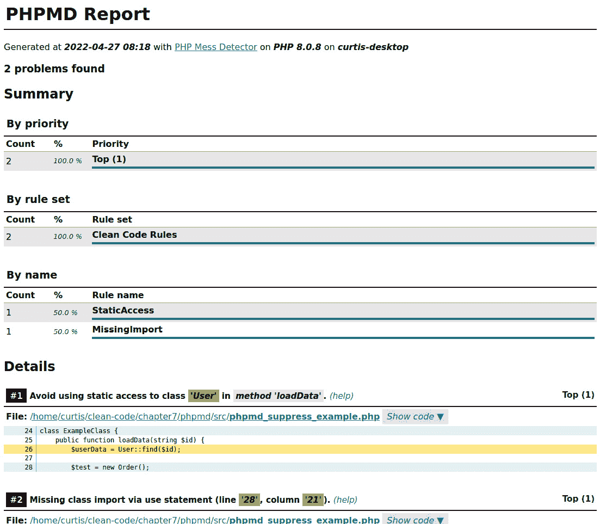

图 7.1：浏览器中的 PHPMD HTML 报告

报告是交互式的，所以请确保点击按钮，如**显示详细信息**或**显示代码**，以显示所有信息。

### 规则和规则集

在前面的示例中，我们使用了内置的 `cleancode` 和 `codesize` 规则集。首先，规则集的命名是根据规则检查的问题域来命名的——例如，对于 `cleancode` 规则，您将只能找到帮助保持代码库清洁的规则。然而，您仍然可能遇到具有许多复杂函数的大类。为了避免这种情况，添加 `codesize` 规则集是必要的。

以下表格显示了可用的规则集及其用法：

| **规则集** | **简称** | **描述** |
| --- | --- | --- |
| 清洁代码规则 | `cleancode` | 强制执行一般清洁代码 |
| 代码大小规则 | `codesize` | 检查长或复杂的代码块 |
| 有争议的规则 | `controversial` | 检查存在争议意见的最佳和不良实践 |
| 设计规则 | `design` | 帮助发现与软件设计相关的问题 |
| 命名规则 | `naming` | 避免过短或过长的名称 |
| 未使用代码规则 | `unused` | 检测可以删除的未使用代码 |

表 7.1：PHPMD 规则集

这些内置规则可以通过将上述简短名称作为函数调用的参数来简单地使用，正如先前的例子所示。

如果你足够幸运，可以从零开始（即从头开始）启动一个项目，那么你可以并且应该从一开始就尽可能多地强制执行规则。这将使你的代码库从一开始就保持清洁。对于现有项目，所需的努力会更大，我们将在下一节中看到。

### 在遗留项目中使用 PHPMD

通常情况下，你可能会想要在一个现有的项目中使用 *PHPMD*。在这种情况下，你可能会在第一次运行时被它抛出的无数警告所淹没。不要放弃——有一些选项可以帮助你！

#### 调整规则集

如果你计划将 *PHPMD* 添加到现有项目中，一次性使用所有规则集肯定会因为报告的问题数量而让你感到沮丧。你可能一次只想集中在一到两个规则集上。

你也很可能最终会得到一些你一开始觉得烦人或反生产力的规则——例如，`ElseExpression` 规则，它禁止在 `if` 表达式中使用 `else`。抛开这个规则是否有用的讨论，重写无数运行良好的语句的努力是不值得的。所以，如果你不想在你的项目中使用那个规则，你需要创建自己的规则集。

规则集通过 XML 文件进行配置，这些文件指定了属于它们的规则。每个规则基本上是一个包含规则逻辑的 PHP 类。以下 XML 文件定义了一个自定义规则集，它仅包括 `cleancode` 和 `codesize` 规则集：

```php
<?xml version="1.0"?>
<ruleset name="Custom PHPMD rule set"
    xmlns=http://pmd.sf.net/ruleset/1.0.0
    xmlns:xsi=http://www.w3.org/2001/XMLSchema-instance
    xsi:schemaLocation=http://pmd.sf.net/ruleset/1.0.0  http://pmd.sf.net/ruleset_xml_schema.xsd
xsi:noNamespaceSchemaLocation=
  "http://pmd.sf.net/ruleset_xml_schema.xsd">
    <description>
        Rule set which contains all codesize and cleancode
        rules
    </description>
    <rule ref="rulesets/codesize.xml" />
    <rule ref="rulesets/cleancode.xml" />
</ruleset>
```

现在 XML 似乎已经过时了，但它仍然很好地完成了它的任务。你通常不需要担心 `<ruleset>` 标签的所有属性——只需确保它们存在即可。《description>` 标签可以包含任何你认为是对规则集的良好描述的文本。

`<rule>` 标签对我们来说很重要。在先前的例子中，我们引用了 `codesize` 和 `cleancode` 规则。

小贴士

在这一点上，深入挖掘 GitHub 仓库 https://github[.com/phpmd/phpmd/tree/master/src/main/resources/rulesets](https://github.com/phpmd/phpmd/tree/master/src/main/resources/rulesets) 中内置的规则集是个好主意。由于 XML 是一个非常冗长的文件格式，你将很快熟悉它。

假设我们想要从检查中移除提到的`ElseExpression`规则。为了实现这一点，你只需在相应的`<rule>`标签内添加一个`<exclude>`标签，如下所示：

```php
<rule ref="rulesets/cleancode.xml">
    <exclude name="ElseExpression" />
</rule>
```

这样，你可以从规则集中排除必要的规则。如果你只想从不同的规则集中选择某些规则，你也可以反过来直接引用所需的规则。如果你想让你的自定义规则集只包含`StaticAccess`和`UndefinedVariable`规则，你的 XML 文件应该包含以下两个标签：

```php
<rule ref="rulesets/cleancode.xml/StaticAccess" />
<rule ref="rulesets/cleancode.xml/UndefinedVariable" />
```

关于 XML 配置文件，还有最后一个重要的事情要知道，那就是如何更改规则的单个属性。同样，了解所有属性的一个好方法是查看实际的规则集文件。或者，你也可以查看每个规则的 PHP 类，具体可以在[`github.com/phpmd/phpmd/tree/master/src/main/php/PHPMD/Rule`](https://github.com/phpmd/phpmd/tree/master/src/main/php/PHPMD/Rule)找到。

一个典型的例子是为`StaticAccess`规则定义异常。通常，避免静态访问是一个好的做法，但通常情况下，你无法避免。假设你的团队同意允许`DateTime`和`DateTimezone`对象使用静态访问，你可以简单地按照以下方式配置：

```php
<rule ref="rulesets/cleancode.xml/StaticAccess">
    <properties>
        <property name="exceptions">
            <value>
                \DateTime,
                \DateTimezone
            </value>
        </property>
    </properties>
</rule>
```

要在未来使用此自定义规则集，只需将前面的 XML 保存到文件中（通常称为`phpmd.xml`），并在下一次运行*PHPMD*时传递它：

```php
$ vendor/bin/phpmd src text phpmd.xml
```

配置文件的存储位置

将`phpmd.xml`（包含你想要使用的规则集）放置在项目的`root`文件夹中，并将其用作配置的唯一来源，这是一种常见的做法。如果将来有任何修改，你只需要调整一个中央文件。

#### 抑制警告

处理遗留代码的另一个有用工具是`@SuppressWarnings` DocBlock 注解。假设你的项目中有一个类使用了静态方法调用，但目前无法更改。默认情况下，任何静态访问都会抛出警告。由于你不想在代码的其他地方使用静态访问，而只是在当前类中使用，因此移除`StaticAccess`规则将适得其反。

在这些情况下，你可以使用`@SuppressWarnings`注解：

```php
/**
* @SuppressWarnings(PHPMD.StaticAccess)
*/
class ExampleClass {
    public function getUser(int $id): User {
        return User::find($id);
    }
}
```

如果需要，你可以在一个 DocBlock 中使用多个注解。最后，如果你想在一个类上抑制任何警告，只需使用`@SuppressWarnings(PHPMD)`注解。

请注意，使用`Suppress`注解应该是你的最后选择。它非常有诱惑力，可以随意添加。然而，它将使输出静音，但不会解决问题。

#### 接受违规

除了在文件级别抑制警告或从规则集中排除规则之外，你也可以选择承认现有的违规。例如，当你想在遗留项目中使用*PHPMD*时，你可以决定暂时忽略代码中已经存在的所有违规。然而，如果新的类引入了新的违规，它们将被报告。

幸运的是，*PHPMD* 通过提供一个所谓的基线文件，使得这项任务变得相当简单，该文件会通过运行以下命令自动为您生成：

```php
$ vendor/bin/phpmd src text phpmd.xml --generate-baseline
```

在前面的命令中，我们期望在项目 `root` 文件夹中已经存在一个 `phpmd.xml` 文件。使用前面的命令，*PHPMD* 现在将创建一个名为 `phpmd.baseline.xml` 的文件。

现在，您可以运行以下命令：

```php
$ vendor/bin/phpmd src text phpmd.xml
```

下次，*PHPMD* 将自动检测之前生成的基线文件，并使用它来抑制所有警告。然而，如果在新位置引入了新的规则违规，它仍然会被检测并报告为违规。

一个警告：与 `@SuppressWarning` 注解一样，基线功能不是一个可以用一次并安全忽略未来的工具。有问题的代码块仍然是您项目中的技术债务，带有所有负面效应。这就是为什么如果您决定使用基线功能，您应该确保您不会忘记在未来解决这些隐藏问题。

我们将在本书的后面讨论如何处理这些问题。现在，对于您来说，重要的是如何定期更新基线文件。同样，*PHPMD* 使这项任务变得简单。只需运行以下命令：

```php
$ vendor/bin/phpmd src text phpmd.xml --update-baseline
```

在您的代码中不再存在的所有违规将被从基线文件中删除。

### PHPMD 概述

除非您是从零开始一个项目，否则 *PHPMD* 的配置将需要更多的时间。特别是如果您在一个团队中工作，您将花费更多的时间争论使用哪些规则以及排除哪些规则。不过，一旦完成，您将拥有一个强大的工具，它将帮助开发者编写高质量、可维护的代码。

## PHPStan – PHP 静态分析器

您可能已经注意到，我们在上一节中讨论的 *PHPMD* 并非非常特定于 PHP，而是通常关注最佳编码实践。虽然这当然非常重要，但我们现在想使用 *PHPStan* 来分析我们的代码，并考虑到不良的 PHP 实践。

与每个静态分析工具一样，*PHPStan* 只能使用从代码中获取的信息来工作。因此，它更适合现代面向对象代码。例如，如果代码大量使用严格类型，分析器将处理额外的信息，因此会返回更多结果。但对于旧项目，它也将非常有帮助，正如我们将在下一节中看到的那样。

### 安装和使用

使用 Composer 安装 *PHPStan* 仍然只需要一行命令：

```php
$ composer require phpstan/phpstan --dev
```

与大多数代码质量工具一样，*PHPStan* 可以使用 PHAR 安装。然而，只有当使用 Composer 时，您才能安装扩展。我们将在本节的稍后部分探讨这些内容。

让我们使用以下简化的示例并将其存储在 `src` 文件夹中：

```php
<?php
class Vat
{
    private float $vat = 0.19;

    public function getVat(): int
    {
        return $this->vat;
    }
}
class OrderPosition
{
    public function getGrossPrice(float $netPrice): float
    {
        $vatModel = new Vat();
        $vat = $vatModel->getVat();
        return $netPrice * (1 + $vat);
    }
}
$orderPosition = new OrderPosition();
echo $orderPosition->getGrossPrice(100);
```

要执行扫描，您需要指定 `analyse` 关键字，以及扫描的路径，在我们的例子中是 `src`：

```php
$ vendor/bin/phpstan analyse src
```

*图 7.2* 展示了 *PHPStan* 生成的输出：

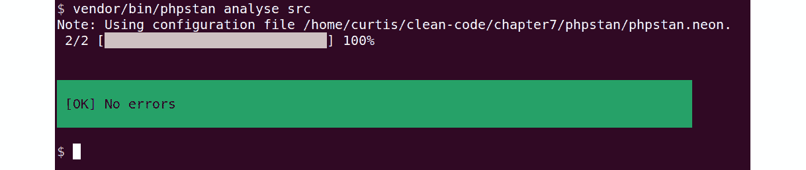

图 7.2：PHPStan 的一个示例输出

当我们执行 PHP 脚本时，它将输出 `100`。不幸的是，这是不正确的，因为将 19% 的税费加到净价上应该返回 119，而不是 100。所以，肯定哪里出了 bug。让我们看看 *PHPStan* 如何在这里帮助我们。

### 规则级别

与 *PHPMD* 不同，在 *PHPMD* 中你需要详细配置要应用哪些规则，我们在这里将使用不同的报告级别。这些级别是由 *PHPStan* 的开发者定义的，从级别 0（仅执行基本检查）到级别 9（对问题非常严格）。为了不让用户一开始就被错误淹没，*PHPStan* 默认将使用级别 0，这只会执行非常少的检查。

你可以使用 `level`（`-l|--level`）选项来指定级别。让我们尝试下一个更高的级别：

```php
$ vendor/bin/phpstan analyse --level 1 src
```

使用级别方法，你可以轻松地逐步提高代码的质量，正如我们将使用以下虚构的示例来展示。级别 1 和 2 也不会返回任何错误。然而，当我们最终达到级别 3 时，我们最终会找到一个问题：

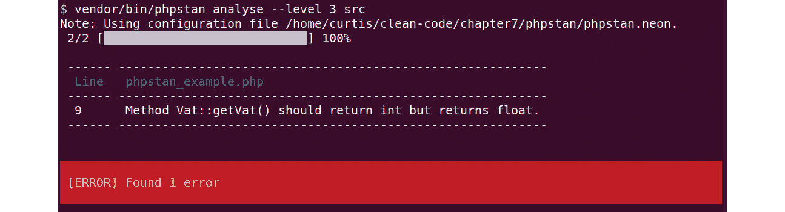

图 7.3：PHPStan 报告了一个级别 3 的错误

再次检查我们的代码，我们可以快速发现问题：`getVat()` 方法返回一个浮点数（0.19），但使用 `int` 返回类型将其转换为 0。

严格类型

如果我们在示例代码的顶部添加了 `declare(strict_types=1);` 语句来使用严格模式，PHP 将会抛出一个错误，而不是静默地将返回值转换为 `int`。

这展示了静态代码分析的魅力和力量：修复这个小 bug 将使我们的代码按预期工作，而且由于我们仍然处于开发环境中，我们只需几秒钟就能完成。然而，如果这个 bug 已经到达了生产环境，修复它将花费我们更长的时间，并且会留下一些愤怒的客户。

### 配置

你可以使用配置文件来确保始终检查相同的级别和相同的文件夹。配置是用 NEON（https://ne[-on.org/](https://ne-on.org/)) 编写的，这是一种与 YAML 非常相似的文件格式；如果你能读写 YAML，它就会正常工作。

基本配置只包含级别和要扫描的文件夹：

```php
parameters:
    level: 4
    paths:
        - src
```

将此配置保存为名为 `phpstan.neon` 的文件，放在项目的 `root` 文件夹中是一个好习惯。这是 *PHPStan* 默认期望的位置。如果你遵循这个约定，下次你想运行它时，你只需要指定所需的操作：

```php
$ vendor/bin/phpstan analyse
```

如果你使用了上面的示例配置，*PHPStan* 现在将扫描 `src` 文件夹，使用从级别 0 到级别 4 的所有规则。

这并不是你可以在这里配置的所有内容。在下一节中，我们将了解一些额外的参数。

### 在遗留项目中使用 PHPStan

如果你想在一定年龄的现有项目中使用*PHPStan*，你可能会遇到数百甚至数千个错误，具体取决于选择哪个级别。当然，你可以选择继续使用较低级别；但这也意味着分析器会错过更多的错误，不仅包括现有的错误，还包括新或修改的代码。

在一个理想的世界里，你会从 0 级开始，解决所有错误，然后继续到 1 级，解决所有新的错误，依此类推。然而，这需要很多时间，而且如果没有可用的自动化测试，最后还需要进行一次完整的手动测试运行。你可能没有那么多时间，所以让我们看看我们还有哪些其他选项。

有两种方式可以告诉*PHPStan*忽略错误：首先，使用*PHPDocs*注释，其次，使用配置文件中的特殊参数。

#### 使用 PHPDocs 注释

要忽略一行代码，只需在受影响的行之前或之上添加一个注释，使用特殊的`@phpstan-ignore-next-line`和`@phpstan-ignore-line` *PHPDocs*注释：

```php
// @phpstan-ignore-next-line
$exampleClass->foo();
$exampleClass->bar(); // @phpstan-ignore-line
```

这两行代码将不再被扫描错误。你可以选择你喜欢的任何方式。不过，无法忽略更大的代码块或整个函数或类（除非你想要在每一行添加注释）。

#### 使用 ignoreErrors 参数

*PHPDocs* 注释非常适合在几个位置快速修复，但如果你希望忽略许多错误，你将需要修改许多文件。然而，在配置文件中使用`ignoreErrors`参数并不太方便，因为你必须为每个想要忽略的错误编写一个正则表达式。

以下示例将解释它是如何工作的。让我们假设我们持续收到以下错误：

```php
Method OrderPosition::getGrossPrice() has no return type specified.
```

虽然从理论上讲，这很容易修复，但团队决定不添加类型提示，以避免任何副作用风险。`OrderPosition`类写得非常糟糕，没有经过测试，但仍然按预期工作。由于它很快就会被替换，我们不愿意承担风险去修改它。

要忽略此错误，我们需要将`ignoreErrors`参数添加到我们的`phpstan.neon`配置文件中：

```php
parameters:
    level: 6
    paths:
        - src
    ignoreErrors:
        - '#^Method OrderPosition\:\:getGrossPrice\(\) has no return type specified\.$#'
```

我们不需要定义一个规则或规则集来忽略，而是需要提供一个正则表达式，以匹配应该忽略的错误消息。

小贴士

编写正则表达式可能具有挑战性。幸运的是，*PHPStan*网站提供了一个非常有用的工具，可以从错误消息生成必要的`phpstan.neon`部分：[`phpstan.org/user-guide/ignoring-errors#generate-an-ignoreerrors-entry`](https://phpstan.org/user-guide/ignoring-errors#generate-an-ignoreerrors-entry)。

在下一次运行时，无论错误出现在哪里，都不会再显示，因为它与这里的正则表达式匹配。

*PHPStan* 不会告诉你错误被忽略了的事实。不要忘记在某个时候修复它们！然而，如果你随着时间的推移进一步改进你的代码，*PHPStan* 将会通知你那些被设置为忽略的错误不再匹配。那时你可以安全地从列表中移除它们。

如果你想要完全忽略某些错误，但只是在文件或路径中，你可以通过使用稍微不同的符号来实现：

```php
ignoreErrors:
    -
        message: '#^Method
          OrderPosition\:\:getGrossPrice\(\) has no return
          type specified\.$#'
        path: src/OrderPosition.php
```

路径需要相对于 `phpstan.neon` 配置文件的位置是相对的。当给出时，只有当错误发生在 `OrderPosition.php` 中时，才会忽略该错误。

#### 基线

正如我们在上一节中看到的，手动将你想要忽略的错误添加到配置文件中是一个繁琐的任务。但有一个更简单的方法：类似于 *PHPMD*，你可以通过执行以下命令并使用 `--generate-baseline` 选项一次性自动将所有当前错误添加到忽略错误列表中：

```php
$ vendor/bin/phpstan analyse --generate-baseline
```

新生成的文件 `phpstan-baseline.neon` 与配置文件位于同一目录下。尽管如此，PHPStan 不会自动使用它。你必须手动将其包含在 `phpstan.neon` 文件中，如下所示：

```php
includes:
    - phpstan-baseline.neon
parameters:
    …
```

下次你运行 PHPStan 时，之前报告的错误将不再被报告。

在内部，基线文件不过是一个自动创建的 `ignoreErrors` 参数列表。请随意根据你的需求进行修改。你可以通过再次执行带有 `--generate-baseline` 选项的 `phpstan` 命令来重新生成它。

### 扩展

可以扩展 *PHPStan* 的功能。充满活力的社区已经创建了许多有用的扩展。例如，像 Symfony、Laminas 或 Laravel 这样的框架通常使用魔法方法（如 `__get()` 和 `__set()`），这些方法无法自动分析。这些框架有针对 *PHPStan* 的扩展，为它提供必要的信息。

尽管我们无法在这本书中涵盖这些扩展，但我们鼓励你查看扩展库：[`phpstan.org/user-guide/extension-library`](https://phpstan.org/user-guide/extension-library)。还有针对 PHPUnit、phpspec 和 WordPress 的扩展。

### PHPStan 概述

*PHPStan* 是一个强大的工具。我们无法在几页中涵盖其所有功能，但我们已经给你一个如何开始使用它的好主意。一旦你熟悉了其基本用法，请访问 [`phpstan.org`](https://phpstan.org) 了解更多！

## Psalm：一个 PHP 静态分析 linting 机器

我们接下来要介绍的最后静态代码分析器是 *Psalm*。它将检查我们的代码库中的所谓问题，并报告任何违规行为。此外，它还可以自动解决其中的一些问题。让我们更深入地了解一下。

### 安装和使用

再次强调，使用 Composer 安装 *Psalm* 只需要几个按键：

```php
$ composer require --dev vimeo/psalm
```

它也以 `phar` 文件的形式提供。

安装完成后，我们并不能直接开始——相反，我们首先需要为当前项目设置一个配置文件。我们可以使用方便的`--init`选项来创建它：

```php
$ vendor/bin/psalm --init
```

此命令将在当前目录中写入一个名为`psalm.xml`的配置文件，这应该是项目根目录。在其创建过程中，*Psalm*会检查它是否可以找到任何 PHP 代码，并决定从哪个错误级别开始。运行*Psalm*不需要任何更多选项：

```php
$ vendor/bin/psalm
```

### 配置

配置文件已经在安装过程中创建，例如，可能看起来像这样：

```php
<?xml version="1.0"?>
<psalm
    errorLevel="7"
    resolveFromConfigFile="true"
    xmlns:xsi=http://www.w3.org/2001/XMLSchema-instance
    xmlns=https://getpsalm.org/schema/config
    xsi:schemaLocation=https://getpsalm.org/schema/config vendor/vimeo/psalm/config.xsd
>
    <projectFiles>
        <directory name="src" />
        <ignoreFiles>
            <directory name="vendor" />
        </ignoreFiles>
    </projectFiles>
</psalm>
```

让我们看看`<psalm>`节点的属性。你不需要担心与模式和相关信息的名称空间，只需关注以下两点：

+   `errorLevel`：级别从 8（基本检查）到 1（非常严格）。换句话说，级别越低，应用的规则越多。

+   `resolveFromConfigFile`：将此设置为`true`允许*Psalm*从配置文件的位置解析所有相对路径（如`src`和`vendor`）——通常是从项目根目录。

Psalm 文档

Psalm 提供了许多我们在这本书中无法涵盖的配置选项。一如既往，我们建议查看文档（https://psalm.dev/docs）以了解更多关于这个工具的信息。

在`<psalm>`节点内部，你可以找到更多设置。在上一个示例中，*Psalm*被指示只扫描`src`文件夹，并忽略`vendor`文件夹中的所有文件。忽略`vendor`文件夹很重要，因为我们不想扫描任何第三方代码。

### 在遗留项目中使用 Psalm

现在，我们将探讨如何调整*Psalm*以更好地处理现有项目。与之前的工具一样，基本上有两种方式来忽略问题：使用配置文件或 docblock 注释。

有三种代码问题级别：`info`、`error`和`suppress`。当发现轻微问题时，`info`只会打印信息消息，而另一方面，处于`error`类型级别的问题则需要你采取行动。`suppress`类型的问题根本不会显示。

持续集成

当构建持续集成管道时，`info`和`error`之间的区别变得更加重要。`info`问题会让构建通过，而`error`问题则会中断它。我们稍后会更详细地探讨这个话题。

#### Docblock 抑制

`@psalm-suppress`注释可以在函数 docblock 或下一行的注释中使用。前一个示例中的`Vat`类可能看起来如下：

```php
class Vat
{
    private float $vat = 0.19;
    /**
     * @psalm-suppress InvalidReturnType
     */
    public function getVat(): int
    {
        /**
         * @psalm-suppress InvalidReturnStatement
         */
        return $this->vat;
    }
}
```

#### 配置文件抑制

如果我们要抑制问题，我们需要为它们配置`issueHandler`，其中我们可以手动设置抑制类型。这是通过在`<psalm>`节点内添加`<issueHandler>`节点来在配置文件中完成的：

```php
<issueHandlers>
    <InvalidReturnType errorLevel="suppress" />
    <InvalidReturnStatement errorLevel="suppress" />
</issueHandlers>
```

上述配置将抑制整个项目中所有 `InvalidReturnType` 和 `InvalidReturnStatement` 问题。不过，我们可以使这个设置更加具体：

```php
<issueHandlers>
    <InvalidReturnType>
        <errorLevel type="suppress">
            <file name="Vat.php" />
        </errorLevel>
    </InvalidReturnType>
    <InvalidReturnStatement>
        <errorLevel type="suppress">
            <dir name="src/Vat" />
        </errorLevel>
    </InvalidReturnStatement>
</issueHandlers>
```

在文档中（[`psalm.dev/docs/running_psalm/dealing_with_code_issues/`](https://psalm.dev/docs/running_psalm/dealing_with_code_issues/)），你会发现更多抑制问题的方法——例如，通过变量名。

#### 基准

与我们之前讨论的静态代码分析器一样，*Psalm* 也提供了一个生成基准文件的功能，该文件将包含所有当前错误，以便在下次运行时忽略它们。请注意，基准功能仅适用于 `error` 问题，但不适用于 `info` 问题。让我们首先创建该文件：

```php
$ vendor/bin/psalm --set-baseline=psalm-baseline.xml
```

*Psalm* 为此文件没有默认名称，因此你需要将其作为选项传递给命令：

```php
$ vendor/bin/psalm --use-baseline=psalm-baseline.xml
```

你也可以将其添加为配置文件中 `<psalm>` 节点的附加属性：

```php
<psalm
    ...
    errorBaseline="./psalm-baseline.xml"
>
```

最后，你可以更新基准文件——例如，在你对代码进行了一些改进之后：

```php
$ vendor/bin/psalm --update-baseline
```

### 自动修复问题

*Psalm* 不仅会找到问题，还可以自动修复其中许多问题。当这种情况发生时，它会通知你，你可以使用 `--alter` 选项：

```php
Psalm can automatically fix 1 issues.
Run Psalm again with
--alter --issues=InvalidReturnType --dry-run
to see what it can fix.
```

让我们按照 *Psalm* 建议执行命令：

```php
$ vendor/bin/psalm --alter --issues=InvalidReturnType --dry-run
```

`--dry-run` 选项告诉 *Psalm* 只显示它将如何作为 `diff` 进行更改，但不会应用这些更改。这样，你可以检查更改是否正确：

![图 7.4：Psalm 显示建议的更改

![img/Figure_7.04_B19050.jpg]

图 7.4：Psalm 显示建议的更改

如果你移除了 `--dry-run` 选项，更改将被应用。

### Psalm 概述

*Psalm* 是清洁编码者工具箱中的标准工具，原因有很多。它速度快，易于使用，功能强大。此外，代码操作功能将为您节省大量时间。当然，它与 *PHPStan* 有许多相似之处，但通常，你会在没有问题的同一代码库上找到这两个工具共同工作。至少，你应该考虑尝试一下。

# IDE 扩展

我们迄今为止查看的工具有一个共同点：在我们编写代码之后，我们需要将它们应用到我们的代码上。当然，这比没有好得多，但如果工具能在我们编写代码时立即给我们反馈，那岂不是更好？

许多其他开发者也有同样的想法，因此他们为最流行的 IDE 创建了扩展，目前是 **Visual Studio Code** （**VS Code**）和 **PhpStorm**：

+   *PhpStorm* 是来自 JetBrains 的一个成熟的商业 IDE，具有多个针对 PHP 的工具、检查和内置集成，用于我们本章讨论的许多代码质量工具。它也有许多有用的扩展可用。你可以免费试用 30 天。

+   *VS Code* 是微软的一个高度灵活的代码编辑器，拥有大量的第三方（部分为商业）扩展，可以将这些工具变成适用于今天几乎所有相关编程语言的 IDE。由于代码编辑器本身是免费的，因此它变得越来越受欢迎。

其他 PHP IDE

*PhpStorm* 和 *VS Code* 并不是唯一适用于 PHP 的 IDE。其他替代方案包括 *NetBeans* ([`netbeans.apache.org`](https://netbeans.apache.org))、*Eclipse PDT* ([`www.eclipse.org`](https://www.eclipse.org)) 或 *CodeLobster* ([`www.codelobster.com`](https://www.codelobster.com))。

在本节中，我们将向您介绍这两个 IDE 的三个扩展：

+   **PHP 检查**（EA 扩展）for PhpStorm

+   **Intelephense** for VS Code

PhpStorm 中的代码质量工具集成

PhpStorm 为我们讨论的以下工具提供了无缝集成：*PHP CS Fixer*、PHPMD、PHPStan 和 Psalm。更多信息请参阅此处：[`www.jetbrains.com/help/phpstorm/php-code-quality-tools.html`](https://www.jetbrains.com/help/phpstorm/php-code-quality-tools.html)。

## PHP 检查（EA 扩展）

此插件（[`github.com/kalessil/phpinspectionsea`](https://github.com/kalessil/phpinspectionsea)）是为 PhpStorm 设计的。它将为已有的检查类型增加更多种类，涵盖代码风格、架构或可能的错误等方面。

IDE 检查

现代 IDE 已经配备了大量的有用代码检查。在 PHPStorm 中，它们被称为 *检查*。一些默认启用，更多的可以通过手动激活（[`www.jetbrains.com/help/phpstorm/code-inspection.html#access-inspections-and-settings`](https://www.jetbrains.com/help/phpstorm/code-inspection.html#access-inspections-and-settings)）。对于 VS Code，你首先需要安装一个扩展。查看文档（[`code.visualstudio.com/docs/languages/php`](https://code.visualstudio.com/docs/languages/php)）以获取更多信息。

### 安装

与每一个 PhpStorm 插件一样，安装是通过 `文件 -> 设置 -> 插件` 对话框完成的。你可以在供应商网站上找到有关如何安装插件的详细信息（[`www.jetbrains.com/help/phpstorm/managing-plugins.html`](https://www.jetbrains.com/help/phpstorm/managing-plugins.html)）。只需搜索 `EA 扩展`。请注意，此插件还有一个名为 EA Ultimate 的第二个版本，你需要付费。本书中不会涉及它。

安装后，并非所有检查都立即激活。让我们看看 PHPStorm 检查配置，如图 *7.4* 所示：

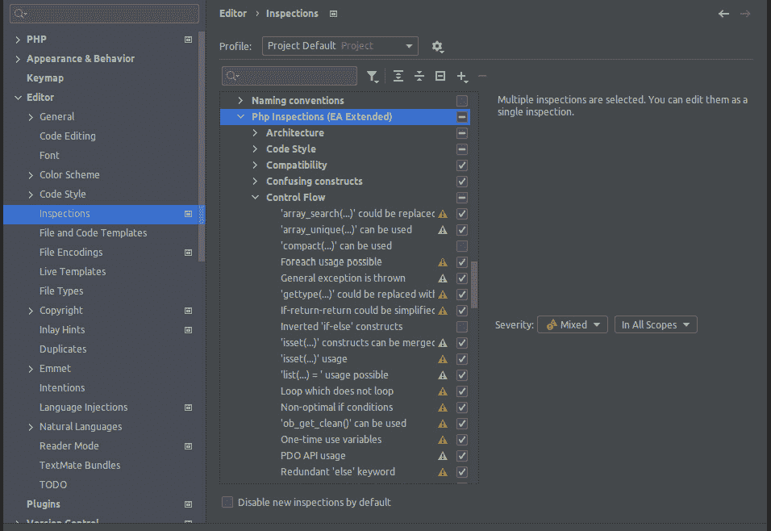

图 7.5：PHPStorm 中检查配置对话框

所有此插件的检查都可以在 **Php 检查（EA 扩展）** 部分找到。默认未激活的检查可以通过勾选旁边的复选框轻松激活。我们建议在激活任何进一步的检查之前阅读文档（https://github.com/kalessil/phpinspectionsea/tree/master/docs）——否则，你可能会结束时有太多的规则。你可以在以后重新访问它们。

### 用法

第 7 行的 `if` 子句：

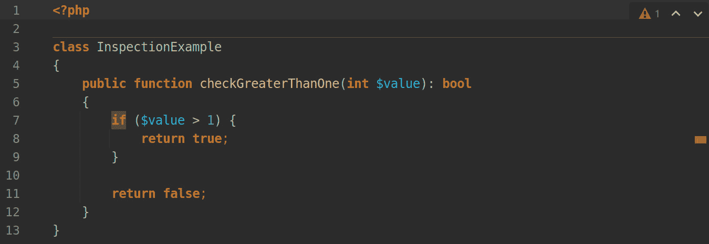

图 7.6：PHP 检查（EA 扩展）发现问题的示例代码

当你将鼠标指针悬停在突出显示的区域时，PhpStorm 将显示一个弹出窗口，其中包含有关建议改进的进一步说明：

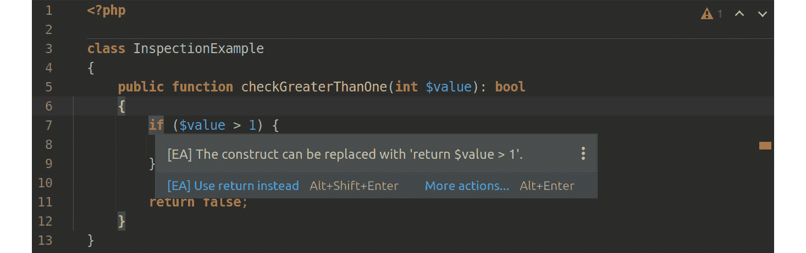

图 7.7：PHP 检查（EA 扩展）建议代码改进

你可以选择直接按 *Alt + Shift + Enter* 同时修复问题，或者你可以点击突出显示的区域以显示快速修复气泡。如果你点击气泡，你将看到一个包含更多选项的菜单。你也可以通过按 *Alt + Enter* 调用以下对话框：

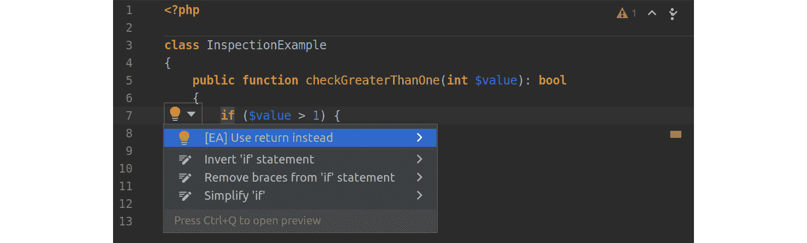

图 7.8：快速修复选项菜单

PhpStorm 现在为你提供了几个修复方案。第一个，标记为 `[EA]`，是由插件提出的建议。再点击一次将应用修复：

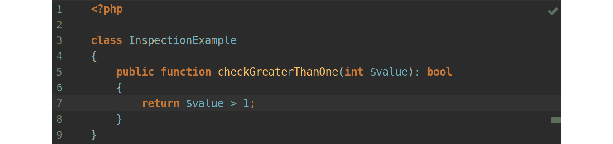

图 7.9：应用快速修复后的代码

就这样！仅仅几秒钟，你就使你的代码变得更短、更易于阅读。**PHP 检查（EA 扩展）** 是 PhpStorm 的一个很好的补充，因为它提供了合理的检查，并且无缝地整合了它们。如果你使用这个 IDE，你不应该犹豫安装它。

团队协作中的检查

这些检查是改进你的代码并了解最佳实践的好方法。然而，有一个巨大的缺点：你如何确保每个在你项目上工作的开发者都激活了相同的检查？我们将在 *团队协作* 中讨论这个话题。

## Intelephense

我们要介绍的第二个扩展是 VS Code 的 *Intelephense*。它是此编辑器中最常下载的 PHP 扩展，提供了许多功能（如代码补全和格式化），将 VS Code 转换成了一个完全功能的 PHP IDE。此扩展还有一个商业的、高级版本，它提供了更多的功能。要安装它，请按照此插件的市场网站上的说明进行操作（https://marketplace.visualstudio.com/items?itemName=bmewburn.vscode-intelephense-client）。

*Intelephense* 并没有像成熟的商业 IDE 那样提供广泛的功能，但对于一个免费服务来说，它是一个完美的选择。它提供了所谓的诊断功能（与 PhpStorm 中的检查类似），可以在插件设置屏幕中进行配置，如图 7.9 所示：

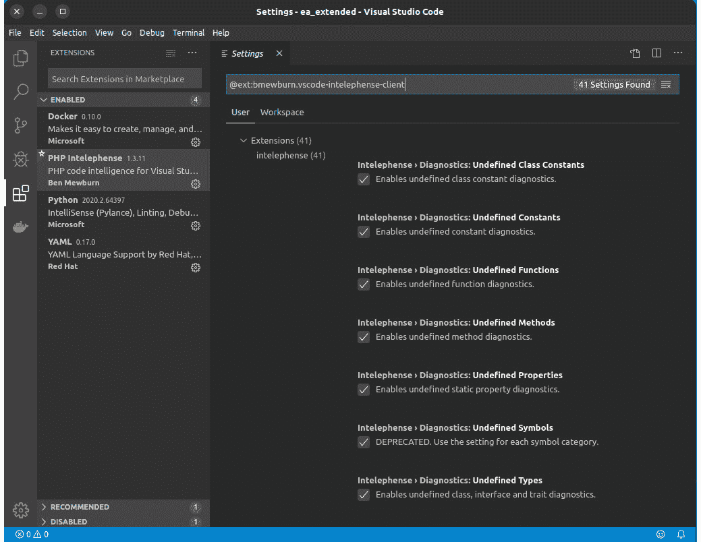


图 7.10：Intelephense 设置屏幕

### 用法

下图展示了 Intelephense 中的诊断功能：

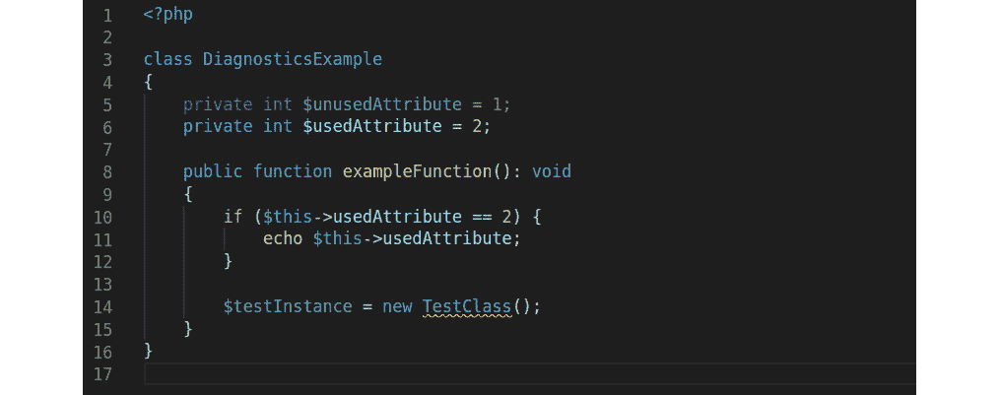


图 7.11：一个示例类，展示了 Intelephense 如何突出显示问题

在这里可以看到两件事。首先，并且更为明显的是，在`TestClass`下面有一条红线。将鼠标指针悬停在`TestClass`上时，会弹出一个包含解释的窗口：**未定义类型 TestClass**。这很合理，因为这个类不存在。

其次，并且更为微妙的是，你会注意到`$ununsedAttribute`和`$testInstance`的颜色比其他变量略深。这表明了另一个问题，可以通过将鼠标悬停在其中一个变量上来揭示：

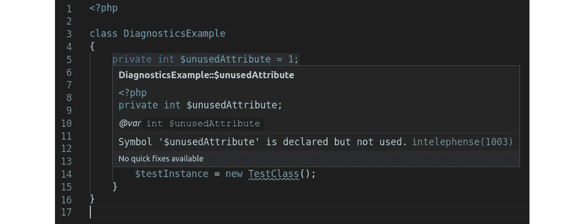


图 7.12：Intelephense 中的信息弹出窗口

弹窗告诉我们`$unsuserAttribute`在代码的其他地方没有被使用。同样也适用于`$testInstance`。

虽然它提供了一些基本的错误检测规则和代码格式化功能，但可以明确地说，在撰写本文时，这个插件的重点并不在于编写干净的代码。然而，鉴于 VS Code 和这个插件都是免费提供的，你已经有了一个不错的 PHP 集成开发环境来开始编码。

VS Code 中的代码质量工具集成

就像在 PhpStorm 中一样，可以通过插件将一些常见的代码质量工具集成到 VS Code 中，例如 PHPStan ([`marketplace.visualstudio.com/items?itemName=calsmurf2904.vscode-phpstan`](https://marketplace.visualstudio.com/items?itemName=calsmurf2904.vscode-phpstan))、*PHP CS Fixer* ([`marketplace.visualstudio.com/items?itemName=junstyle.php-cs-fixer`](https://marketplace.visualstudio.com/items?itemName=junstyle.php-cs-fixer)) 和 PHPMD ([`marketplace.visualstudio.com/items?itemName=ecodes.vscode-phpmd`](https://marketplace.visualstudio.com/items?itemName=ecodes.vscode-phpmd))。因此，如果你想用 VS Code 编码，确保时不时地检查市场中的新插件。

# 摘要

在本章中，我们学习了最先进的技术来帮助你创建高质量的 PHP 代码。它们将帮助你尽早在**软件开发生命周期**（**SDLC**）中发现问题，这可以为你节省大量时间。PHP 社区仍然充满活力且非常高效，我们在这本书中无法涵盖所有那些出色的软件。然而，通过本章中我们介绍的工具，你现在已经为你的清洁代码之旅做好了充分准备。

在下一章中，你将学习如何通过使用既定的指标以及当然必要的工具来收集它们来评估代码质量。那里见！

# 进一步阅读

如果你想要尝试更多的代码质量工具，请考虑以下项目：

+   *Exakat* (https://www.exakat.io) – 一个也涵盖安全问题和性能的工具，例如。它还可以自动修复问题。

+   *Phan* (https://github.com/phan/phan) – 一个你可以立即在浏览器中尝试的静态代码分析器

+   *PHP Insights* (https://phpinsights.com/) – 另一个分析器，但在代码、架构、复杂性和风格方面提供了易于使用的指标
