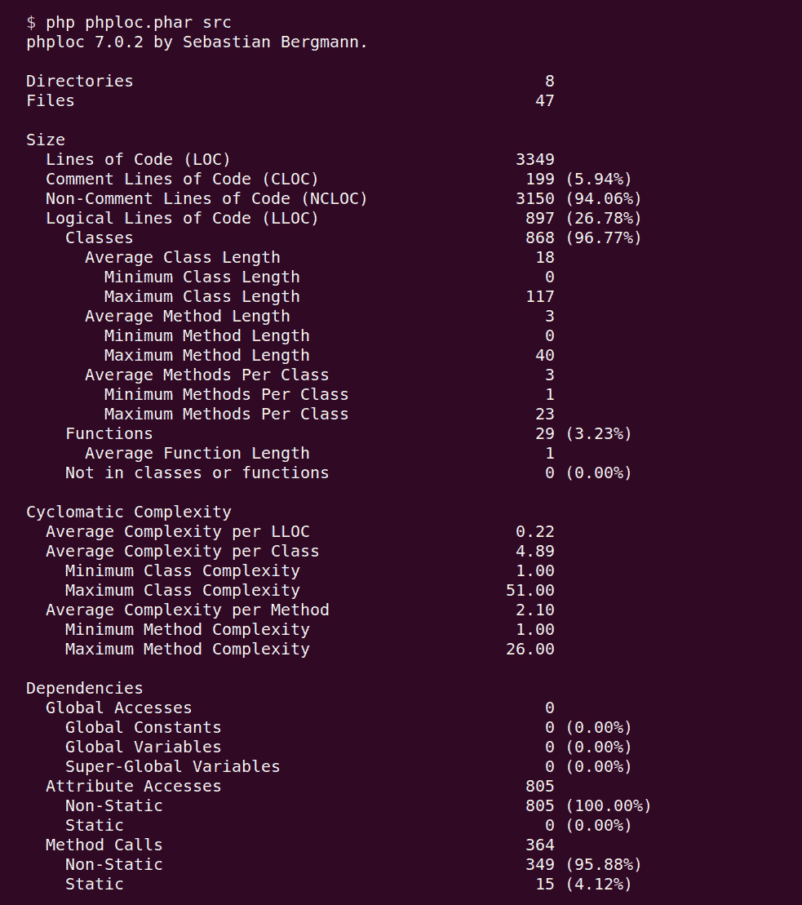
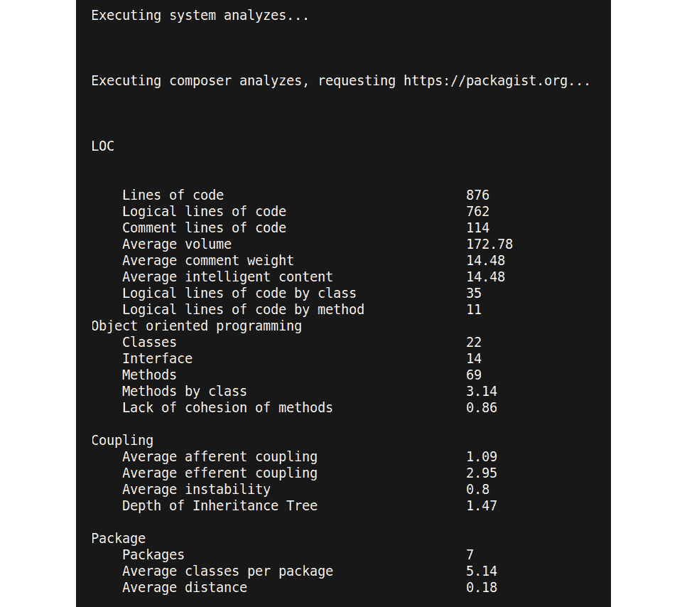
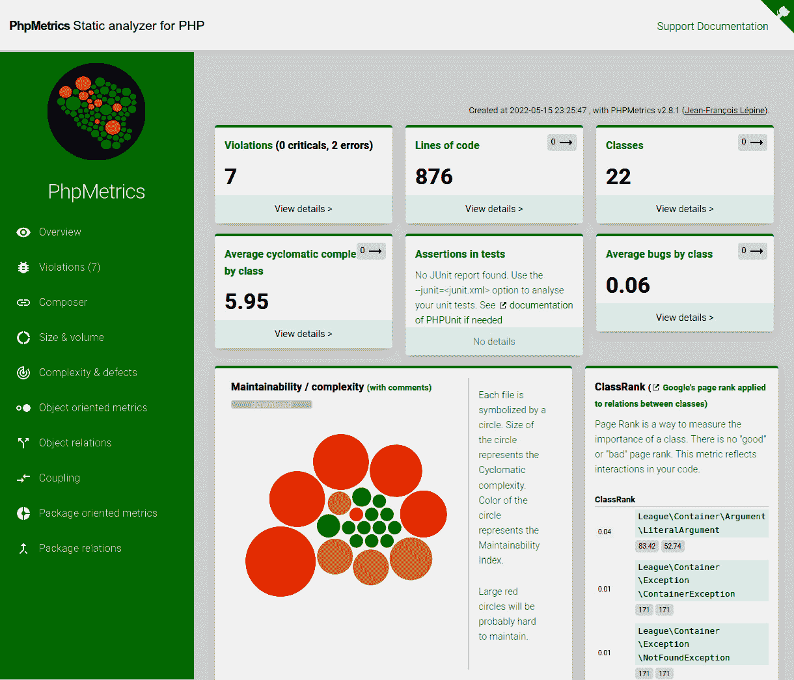

# 代码质量指标

如果我们能衡量我们软件的质量会怎么样？软件开发者经常想要不断改进他们的软件——但也许它已经“足够好了”。我们如何知道它达到了良好的状态？

软件质量指标是在编程的早期由聪明人提出的。在 20 世纪 70 年代，他们考虑了这个话题，并产生了今天仍在使用的想法。当然，我们希望从这些知识中受益，并将其应用于我们的项目中。

在本章中，我们将涵盖以下主题：

+   介绍代码质量指标

+   在 PHP 中收集指标

+   使用指标的优势和劣势

# 技术要求

如果你已经阅读了上一章并尝试了所有工具，那么你已经安装了这一章所需的所有内容。如果没有，请在运行即将到来的示例之前确保这样做。

本章的代码文件可以在以下位置找到：[`github.com/PacktPublishing/Clean-Code-in-PHP`](https://github.com/PacktPublishing/Clean-Code-in-PHP)

# 介绍代码质量指标

在本节中，你将了解如何衡量软件的整体质量。我们将探讨 PHP 世界中一些最常用的指标，并解释它们能告诉你关于你代码的什么信息，如何收集它们，以及它们何时有用或无用。

## 软件质量方面

在我们深入研究数字之前，我们首先需要澄清一个重要的事情：软件质量实际上是什么意思？当然，每个人对质量都有一定的理解，但可能很难用言语表达出来。幸运的是，已经存在一些现成的模型，例如 20 世纪 80 年代在惠普开发的**FURPS**模型。这个缩写代表以下内容：

+   **功能性**：软件能否处理各种用例？它是否在考虑安全性的情况下开发？

+   **可用性**：用户体验有多好？它是否被文档化并且易于理解？

+   **可靠性**：软件是否始终可用？崩溃或可能影响输出的错误的可能性有多大？

+   **性能**：表明软件的速度。它是否有效地使用了可用资源？它是否具有良好的可扩展性？

+   **可维护性**：软件能否被很好地测试和维护？它是否易于安装，并且能否被翻译（本地化）成其他语言？

其他质量方面包括，但不仅限于，可访问性和法律合规性。正如你所见，这个模型涵盖了比我们作为 PHP 开发者通常工作的更多方面，如用户体验和文档。这就是为什么我们可以从两个不同的角度来审视软件质量：外部质量和内部质量。让我们更深入地了解一下这意味着什么：

+   **外部质量**：外部或面向用户的方面是软件外部质量的一部分。这包括我们之前介绍的大多数方面。它们的共同之处在于，它们可以在不接触或分析代码本身的情况下进行测量——想想性能测试工具，它们测量请求的响应时间，或者端到端测试，它们通过自动在应用程序上执行测试来模拟用户。

+   **内部质量**：作为软件开发者，我们通常更关心软件的内部质量。代码是否易于阅读和理解？是否容易扩展？我们能否为其编写测试？虽然用户永远不会看到代码，或者不关心其可测试性，但它会间接地影响他们：高质量的代码包含更少的错误，并且通常（但不总是）更快、更高效。它也更容易扩展和维护。通常，这些方面可以通过自动单元测试或代码分析器来检查。

在这本书中，我们专注于内部代码质量。这就是为什么我们特别谈论代码质量，而不是使用更广泛的概念，即软件质量。

## 代码质量指标

现在我们对代码质量有了更好的理解，让我们看看在本节中我们想要讨论哪些代码质量指标：

+   代码行数

+   圈复杂度

+   NPath 复杂性

+   Halstead 度量

+   变更风险反模式索引

+   维护性指标

### 代码行数

计算项目中的**代码行数**（**LOC**）不是一个质量指标。然而，它是一个有用的工具，可以帮助我们掌握项目的大小——例如，当你开始工作的时候。此外，正如我们将看到的，它被其他指标用作计算的基础。了解你正在处理的代码行数也是一个有用的概念——例如，当你需要估计某些类的重构工作量时。

正因如此，我们现在想更深入地了解它。首先，我们可以进一步区分 LOC：

+   **代码行数**（**LOC**）：LOC 简单地计算所有代码行，包括注释和空白行。

+   **注释行代码**（**CLOC**）：这个指标告诉你你的代码中有多少行是注释。它可以是一个指标，表明源代码的注释是否良好。然而，正如我们所知，注释往往会过时（即，它们很快就会过时，并且通常比有用更有害），所以我们没有推荐任何百分比或其他经验法则。尽管如此，了解这一点仍然很有趣。

+   **非注释行代码**（**NCLOC**）：如果你想比较一个项目与另一个项目的大小，省略注释将能更好地展示你需要处理的真实代码量。

+   **逻辑行代码**（**LLOC**）：对于这个指标，假设每个语句等于一行代码。以下代码片段说明了它应该如何工作。考虑以下代码行：

    ```php
    while($i < 5) { echo “test”; /* Increment by one */
      $i++; }
    ```

在这里，LOC 将是 1。因为我们在这行中有三个可执行语句，LLOC 将计算为 3，因为代码也可以用每个语句一行的方式编写：

```php
while($i < 5) {
    echo “test”; 
    /* Increment by one */
    $i++; 
}
```

在前面的示例中，我们强调了可执行语句。注释、空行和如括号之类的语法元素不是可执行语句——这就是为什么整行注释和循环末尾的闭合括号不被计为一个逻辑行。

### 循环复杂度

我们不仅可以计算代码的行数，还可以测量代码的复杂性——例如，通过计算函数内的执行路径数量。这种度量中的一个常见指标是`if`、`while`、`for`和`case`语句。此外，函数入口也计为一个语句。

以下示例说明了该度量是如何工作的：

```php
// first decision point
function someExample($a, $b)
{
    // second decision point
    if ($a < $b) {
        echo "1"; 
    } else {
        echo "2";
    }
    // third decision point
    if ($a > $b) {
        echo "3";
    } else {
        echo "4";
    }
}
```

上一段代码片段的 CC 值为 3：函数入口算作第一条决策路径，两个`if`语句各自算作一条决策路径。然而，根据定义，两个`else`语句没有被考虑在内，因为它们是`if`子句的一部分。这个度量对于快速评估你还不了解的代码的复杂性特别有用。它通常用于检查单个函数，但也可以应用于类或整个应用程序。如果你有一个 CC 值高的函数，考虑将其拆分为几个更小的函数以降低其值。

### NPath 复杂性

代码复杂性的第二个度量是定义在 CC 上的`if`、`while`、`for`和`case`等语句。此外，对于这个度量，函数入口点不计为一个决策路径。

观察上述示例，NPath 复杂性将是 4，因为我们有 2 * 2 通过函数的可能路径：两个`if`语句，以及两个`else`语句。所以，所有四个`echo`语句都被视为决策路径。如前所述，函数调用本身不被考虑。现在，如果我们添加另一个`if`语句，NPath 复杂性将增加到 8。这是因为我们会有 2 * 2 * 2 种可能的路径。换句话说，这个度量是指数增长的，所以它可以迅速变得相当高。

NPath 复杂性比 CC 更好地描述了测试函数的实际工作量，因为它直接告诉我们为了达到 100%的测试覆盖率，我们需要测试函数的多少种可能的结果。

### Halstead 度量

莫里斯·哈斯泰德在 20 世纪 70 年代末引入了一套八项度量，这些度量至今仍在使用，并被称为`==`、`!=`和`&&`等运算符（例如，函数名、变量和常量），但正如你将看到的，它们已经告诉你很多关于检查的代码的信息。

我们不需要确切地知道这些度量是如何工作的。如果你感兴趣，可以在这里了解更多关于这些度量的信息：https://www.verifysoft.com/en_halstead_metrics.html。然而，你应该对现有的 Halstead 度量有一个大致的了解：

+   *长度*：计算操作符和操作数总数的总和，告诉我们必须处理多少代码

+   *词汇量*：已使用的唯一操作符和操作数的总和已足以表明代码的复杂性

+   *体积*：根据长度和词汇描述代码的信息内容

+   *难度*：表示错误倾向性（即引入错误的可能程度）

+   *级别*：反转难度——即在级别越高，错误倾向性越低

+   *努力度*：理解代码所需的努力

+   *时间*：告诉我们大致需要多长时间来实现它

+   *错误*：估计代码中包含的错误数量

这些值将为您提供关于您正在处理的代码类型的大致指示。是否易于理解？开发它花费了多少时间？可以预期多少错误？然而，如果不将这些值与其他应用程序的结果进行比较，它们对您的帮助不大。

### 变更风险反模式指数

另一个特别有用的指标是**变更风险反模式指数**（**CRAP**）。它使用考虑中的代码的 CC 和代码覆盖率。

代码覆盖率

您可能已经多次听说过代码覆盖率这个术语。它是在自动化测试的上下文中使用的指标，描述了单元测试已编写的代码行数（以总行数的百分比表示）。我们将在本书稍后更详细地讨论这个指标及其先决条件。

这两个指标的结合相当有用。既不复杂又有高测试覆盖率的代码，比复杂且测试不多的代码更有可能没有错误且易于维护。

### 维护性指数

作为本节最后一个指标，我们将查看**维护性指数**。它将为您提供仅一个值，表示检查的代码的可维护性，换句话说，它告诉您在不引入新错误的情况下更改它的难易程度。有两件事使这个指标对我们特别有趣。

首先，它基于上述指标，并使用 LOC、Halstead 指标和 CC 来计算指数。再次强调，我们并不真的需要知道确切的公式。如果您感兴趣，可以在这里查找：[`www.verifysoft.com/en_maintainability.html`](https://www.verifysoft.com/en_maintainability.html)。

其次，此指标将返回一个可以直接用于评估代码质量的值：

+   85 及以上：良好可维护性

+   65 到 85：中等可维护性

+   65 以下：差的可维护性

使用此指标，您无需与其他代码进行比较。这就是为什么它特别适用于快速评估代码质量。

在本节中，我们已经讨论了很多理论。到目前为止，做得很好——您一定会后悔学习这些知识的，因为在下一节中，我们将向您展示如何使用更多的 PHP 工具来收集这些指标。

# 在 PHP 中收集指标

在本节中，我们想看看 PHP 世界中用于收集代码质量指标的工具。如您很快就会看到的，这些指标不仅仅是数字——它们将允许您对重构代码所需的工作量做出明智的猜测。它们还将帮助您识别需要最多关注的代码部分。

再次，我们为您精选了一系列工具：

+   `phploc`

+   PHP Depend

+   PhpMetrics

## phploc

正如我们在上一节中学到的，LOC 的缩写代表代码行数，所以这个名字已经揭示了此工具的主要目的。作为一个基本指标，它已经告诉我们很多关于代码库的信息。`phploc`还提供了其他指标，如 CC，因此值得更仔细地研究它。

### 安装和使用

此工具的作者 Sebastian Bergmann 因`phpunit`而闻名，`phpunit`是 PHP 世界中事实上的自动化测试标准。他建议不要使用 Composer 安装它，而是直接使用`phar`。我们将在下一章讨论这种方法的优缺点。现在，让我们遵循作者的建议，直接下载`phar`：

```php
$ wget https://phar.phpunit.de/phploc.phar
```

这将下载`phploc`的最新版本到当前目录。下载后，我们可以直接使用它来扫描项目：

```php
$ php phploc.phar src
```

扫描单个文件

虽然`phploc`旨在用于整个项目，但也可以指定单个文件进行扫描。虽然平均指标没有意义，因为它们是用于整个项目的，但如果您需要找出 LOC 指标或类的 CC 值，它仍然很有用。

之前的命令将扫描包含所有子文件夹的`src`文件夹，并收集有关它的信息，这些信息将直接在命令行上显示，如图*图 8.1*所示：



图 8.1：phploc 的一个示例输出（摘录）

这比仅仅 LOC 的信息要多得多。信息分为以下类别：

+   **大小**: 显然，这个工具存在的主要原因是通过计算代码行数来衡量项目的大小，使用我们在上一节中介绍的各种计数方法。重点在于代码行数（LLOC），你将得到每个类、类方法和函数的此指标平均值。

+   `phploc`将计算每个代码行数（LLOC）、类和方法的平均 CC 值。

+   **依赖关系**：本节告诉你对全局状态进行了多少次访问，以及有多少属性和方法被静态访问。全局和静态访问都被视为实践，应该避免，因此这些数字为你提供了关于代码质量的更多线索。

+   `phploc`返回有关代码结构的更多详细信息。没有明确的规则来解释它们；然而，你可以从中得出一些结论。例如，参见以下：

    +   关于整体代码大小，使用了多少个命名空间？只有少数命名空间的庞大代码库表明项目结构不佳。

    +   接口是否被使用以及与项目规模相比使用了多少个？接口的使用增加了类的可互换性，并表明代码结构良好。

这就是我们目前需要了解的关于`phploc`功能的所有内容。这是一个简单易用且有用的工具，可以帮助你快速了解项目的整体代码质量和结构，因此应该成为你的工具包的一部分。尽管如此，它并没有告诉你如何解释这些数字，这需要一些经验。

## PHP Depend

如果有一个奖项是授予在单一工具中结合最多指标的人，那么它肯定属于**PHP Depend**（**PDepend**）。它涵盖了我们在上一节中讨论的所有指标，还有更多。然而，它并不是最用户友好的工具。此外，网站和存储库文档并不完美。尽管如此，你应该检查一下。

### 安装和使用

如前所述，这个工具可以使用 Composer 安装或直接下载`phar`。我们现在将采用基于 Composer 的安装方式：

```php
$ composer require pdepend/pdepend --dev
```

如果没有不愉快的惊喜，你可以直接执行：

```php
$ vendor/bin/pdepend --summary-xml=pdepend_summary.xml src
```

在这里，我们已可以看到 PDepend 的祖先是 JDepend，这是一个 Java 代码质量工具，因为输出被写入 XML 文件。文件名使用`--summary-xml`选项指定。此外，我们必须指定要扫描的文件夹作为参数。

虽然`PDepend`确实输出了一些数字，如下面的示例输出所示：

```php
PDepend 2.10.3
Parsing source files:
...............................................          47
Calculating Cyclomatic Complexity metrics:
.................                                        355
Calculating Node Loc metrics:
.............                                            279
Calculating NPath Complexity metrics:
.................                                        355
Calculating Inheritance metrics:
.....                                                    101
```

这里我们跳过了一些行。数字只会告诉你对于给定的文件夹，每个指标被计算了多少次，所以直接输出并不特别有帮助。要查看实际的指标，我们需要打开 XML 报告。在我们的例子中，生成的文件被命名为`pdepend_summary.xml`。

由于 XML 报告太大，无法在本书中打印，所以你最好亲自尝试一下，看看它的全貌。然而，我们可以向你展示它的结构：

```php
<?xml version="1.0" encoding="UTF-8"?>
<metrics>
  <files>
    <file name="/path/to/Namespace/Classname.php"/>
    <!-- ... -->
  </files>
  <package name="Namespace">
    <class name="Classname" fqname="Namespace\Classname">
      <file name="/path/to/Namespace/Classname.php"/>
      <method name="methodName"/>
      <!-- ... -->
    </class>
    <!-- ... -->
  </package>
</metrics>
```

`<metrics>`节点代表完整扫描的目录。它有以下子节点：

+   `<files>`，它使用`<file>`子节点列出所有扫描的文件。

+   `<package>`，列出了所有命名空间。在这个节点中，有进一步 `<class>` 子节点。对于每个类，都有一个 `<method>` 节点列表，每个类中有一个方法对应一个 `<method>` 节点。最后，类的文件名在另一个 `<file>` 节点中提到。

当然，这并不是 *PDepend* 将生成的所有输出。对于每个节点，它都会添加数十个属性，这些属性包含计算出的度量的名称和值。这是一个从 *PDepend* 本身源代码生成的 XML 报告的示例节点：

```php
<method name="setConfigurationFile" start="80" end="89"
  ccn="2" ccn2="2" loc="10" cloc="0" eloc="8" lloc="3"
  ncloc="10" npath="2" hnt="15" hnd="21"
  hv="65.884761341681" hd="7.3125" hl="0.13675213675214"
  he="481.78231731105" ht="26.765684295058"
  hb="0.020485472371812" hi="9.0098818928795"
  mi="67.295865328327"/>
```

您应该能够识别一些度量，例如 `lloc`（LOC）或 `ccn`（CC Number）。对于其他度量，您可以在在线文档中的 *XML* 报告中找到解释，或者至少是缩写的长名称：[`pdepend.org/documentation/software-metrics/index.html`](https://pdepend.org/documentation/software-metrics/index.html)。

### 进一步选项

*PDepend* 有两个选项您应该了解：

+   `--exclude`：这将排除一个命名空间（或在此术语中为包）的扫描。您可以使用多个命名空间，用逗号分隔。确保在命名空间（们）周围加上引号：

`$ vendor/bin/pdepend --summary-xml=pdepend_summary.xml` `src`

+   `--ignore`：允许您忽略一个或多个文件夹。同样，不要忘记引号：

`$ vendor/bin/pdepend --summary-xml=pdepend_summary.xml` `src`

它还可以生成带有更多信息的 SVG 格式图像。尽管如此，我们在这本书中不会涉及它们，因为有一个更好的工具，您将在下一节中找到。

*PDepend* 功能强大，但同时也难以掌握。生成的输出难以阅读，一旦项目变得稍微大一些，除非您使用其他工具来解析 XML 文件，否则变得不可用。然而，您可能有一天需要它提供的先进度量，或者您可能在一个已经使用它的项目中工作。所以，至少您现在已经准备好了。

## PhpMetrics

到目前为止，PHP 质量度量世界仅基于文本。现在将会有所改变，因为我们现在将查看 *PhpMetrics*，它将生成更适合人类眼睛且甚至具有交互性的报告。

### 安装和使用

让我们使用 Composer 将 *PhpMetrics* 添加到您的项目中：

```php
$ composer require phpmetrics/phpmetrics --dev
```

在所有文件下载完毕后，您可以直接开始生成您的第一个报告：

```php
$ vendor/bin/phpmetrics --report-html=phpmetrics_report src
```

`--report-html` 选项指定报告将被创建的文件夹。您可以通过提供以逗号分隔的列表来指定要扫描的多个文件夹。然而，在我们的例子中，我们只会使用 `src` 文件夹。

因此，*PhpMetrics* 将列出一些统计信息，这将让您对代码有一些了解。*图 8.2* 展示了输出的摘录，可能会让您想起 `phploc` 生成的输出：



图 8.2：PhpMetrics 控制台输出（摘录）

要打开刚刚生成的实际 HTML 报告，只需在浏览器中打开该文件夹中的 `index.html` 文件。在我们更仔细地查看生成的报告之前，让我们先看看 *PhpMetrics* 还提供了哪些其他有用的选项：

+   `--metrics`：此选项将返回可用指标列表。它有助于解释像 `mIwoC` 这样的缩写。

+   `--exclude`：使用此选项，你可以指定一个或多个要排除的目录。

+   `--report-[csv|json|summary-json|violations]`：允许你以不同的报告格式保存结果，而不是 HTML——例如，`--report-json`。

从命令行打开浏览器

如果你使用的是基于 Linux 的操作系统，例如 Ubuntu，你可以按以下方式快速从命令行打开 HTML 文件：

`$ firefox phpmetrics_report/index.html`

或者，查看以下内容：

`$ chromium phpmetrics_report/index.html`

### 理解报告

如果你第一次打开 *PhpMetrics* 报告，你会看到各种各样的信息。我们不会深入到每一个细节，但会向你展示我们认为开始时最有价值的报告部分。

为了更好地说明 *PhpMetrics* 的用法，我们随机选择了一个名为 `thephpleague/container` 的现有开源软件包作为代码库进行工作。它是一个优秀的 PSR-11 兼容的依赖注入容器，大小适中，非常适合作为示例。*图 8.3* 展示了我们为它生成的示例报告的概览页：



图 8.3：PhpMetrics 报告概览

#### 关键指标

在左侧，你可以找到菜单，可以访问报告的其他页面。页面的顶部填充了一些关键指标，其中最有趣的是：

+   **代码行数**告诉你更多关于这个项目的大小。点击标签后，你将被发送到另一个页面，其中列出了所有类及其相关的尺寸指标，如 LOC。

+   **违规** 显示了 *PhpMetrics* 发现的违规数量。再次点击标签，你将被发送到另一个页面，其中列出了类及其违规情况——例如，如果它们过于复杂（*过于复杂的方法代码*），有很高的错误概率（*可能存在错误*），或者使用了过多的其他类或其他依赖（*过度依赖*）。

+   **平均循环复杂度按类**确切地告诉你它所说的内容。详细视图为你提供了关于类级别复杂性的更多信息。

其他框也提供了有趣的信息，但前面的那些已经足够让你快速查看代码中最有问题的地方。

#### 维护性或复杂性

在关键指标下方，*PhpMetrics*显示了一个图表，以及其他内容，你肯定在第一次打开报告时已经注意到了：**可维护性/复杂性**图。它由项目每个命名空间的一个彩色圆圈组成，圆圈的大小代表类的 CC（复杂度）。圆圈越大，复杂性越高。颜色显示可维护性指数，从绿色（高）到红色（低）。

如果你将鼠标悬停在圆圈上，你可以看到这个圆圈代表的命名空间以及两个详细指标：

![Figure 8.4: The Maintainability / complexity graph with a popup

![img/Figure_8.04_B19050.jpg]

图 8.4：带有弹出窗口的可维护性/复杂性图

这个图对于快速把握整体代码质量非常有用——红色大圆圈越少，越好。这样，你可以轻松地看到代码中的问题部分。

#### 对象关系

当你从左侧菜单中选择**对象关系**时，将出现显示每个命名空间之间关系的图表。将鼠标指针悬停在文本标签上会突出显示其关系。由于图表很大，我们无法在这本书中展示其全部美，但我们至少可以给出一个初步印象：

![Figure 8.5: An Object relations graph

![img/Figure_8.05_B19050.jpg]

图 8.5：对象关系图

#### 耦合

类之间的耦合表示它们如何相互依赖。有两个主要指标：

+   **入耦合**（**Ca**）告诉你有多少个类依赖于这个类。依赖太多表明这个类对项目的重要性。

+   **出耦合**（**Ce**）给你一个关于一个类使用多少依赖的印象。这个值越高，类对其他类的依赖性就越大。

#### 包导向指标

我们想要展示的最后一个是**抽象度与不稳定性**图。正如其名称所暗示的，它显示了包的抽象度与不稳定性之间的关系。它是由罗伯特·马丁引入的，基于他对面向对象指标的深入研究。*图 8.6*展示了示例：

![Figure 8.6: An Abstractness vs. Instability graph

![img/Figure_8.06_B19050.jpg]

图 8.6：抽象度与不稳定性图

但这两个术语在软件开发中的确切含义是什么？让我们看看以下定义：

+   从`0`（具体）到`1`（抽象）。

+   从`0`（稳定）到`1`（不稳定）。

马丁指出，稳定且因此高度独立于其他类的包也应该有高水平的*A*。反之，不稳定的包应由具体类组成。所以，从理论上讲，类的*A*抵消了它的*I*。这意味着理想情况下，*A*加上*I*应该是`1`（*A + I = 1*）。这个等式也画出了从左上角到右下角的斜线。你应该努力使你的包接近这条线。

在实际报告中，你会在图表下方找到一个表格，其中更详细地列出了数值。如果你将鼠标指针悬停在圆圈上，会出现一个弹出窗口，告诉你该圆圈代表的类的名称，以及 *A*（第一位数字）和 *I*（第二位数字）。

#### 其他信息

这标志着我们通过 *PhpMetrics* 的旅程结束。还有很多东西可以探索，例如，例如，*ClassRank*，其中使用了谷歌著名的 *PageRank* 算法来根据其重要性（即与其他代码部分的交互数量）对类进行排名。在这本书中我们无法涵盖所有内容——然而，到目前为止，你已经了解了许多指标。它的文档对你非常有帮助。你可以在每一页的右上角找到它的链接。

# 使用指标的优点和缺点

在本书的前两章中，你已经了解了许多工具和指标，它们的存在只是为了帮助你编写更好的软件。成百上千的软件工程师的知识、智慧和无数小时的努力可以在几分钟内添加到你的项目中。

另一方面，你可能已经感到完全被众多的可能性所压倒。你应该选择哪些工具？你未来应该关注哪些指标？

如果你已经有了这种感觉，请不要担心。我们不会让你在这片混乱中孤立无援，但在接下来的章节中，我们会帮助你找到一个适合你需求的设置。首先，让我们花时间看看使用代码质量指标的优点和缺点。 

## 优点

首先，每个软件项目都是一项独特的工作。它根据某些情况增长，例如开发者的技能组合和当时可用的包或框架，但也受到外部因素的影响，例如截止日期，这些因素往往会对代码质量产生负面影响。

代码指标帮助你了解项目当前的状态。例如，如果你接管了一个前团队成员的项目，你想要知道等待你的是什么。通过了解代码质量，你可以立即调整你对未来票据的预估工作量，无论方向如何。

代码质量指标也有助于你了解代码需要改进的地方。重构代码是一项极好的训练，通过使用指标，你知道何时取得了成功。无论你是在自己的项目上工作，想要为开源项目做出贡献，还是在团队中工作，最终在报告中获得更多的绿灯总是一件令人愉快的事情。

如果你发现了一段代码迫切需要重构，有合理的理由，但你的项目经理不想让你这么做，你可以使用指标向他们展示情况有多么糟糕，以及这仅仅是你个人观点的判断。代码指标是客观的，并且（痛苦地）诚实。

最后，这些指标的一个重要用途是防止你一开始就编写出糟糕的代码。有时候，编写遵循所有这些规则的代码可能会有些烦恼，但请放心，最终这些努力会得到回报。

## 缺点

此前，我们提到过，截止日期可能会损害代码质量，因为它们让我们无法重构代码异味或添加更多测试。虽然这是真的，但我们必须意识到，一旦他们开始通过衡量代码质量来衡量，一些开发者会开始重构比必要的更多代码，因为他们得到了更好的指标作为奖励。这为什么会成为问题？

例如，想象一下，在你的当前项目中有一个类，它的可维护性指数低，NPath 复杂性高，仅通过观察，你就可以立即看出它有多糟糕。然而，随着时间的推移，它已经变得成熟，经常被修复，到了某个时候，它已经证明可以无 bug 地工作。现在，你的工具告诉你这个类质量不好。你应该仍然跳上去开始重构它吗？

当然，并没有明确的“是”或“否”。如前所述，如果你在业余时间编写代码，那么重构一个类以移除大部分代码异味是有意义的（而且也很有趣）。如果你在从事商业项目，也就是说，作为软件工程师谋生，你并不总是有足够的时间这样做。你需要解决 bug，这会让你的软件用户感到不快，而另一方面，还有需要实现的功能，用户正焦急地等待着。总的来说，满意的客户才是支付你账单的人。在开发速度和代码质量之间找到最佳平衡点从来都不容易——你只需要意识到有时你必须吞下苦果，暂时放弃糟糕的代码。

不要用指标来与同事竞争，或者更糟的是，去说前开发者的坏话，他们已经让你独自承担项目。请记住，每个人都尽其所能工作，基于他们的技能。没有人故意尝试编写糟糕的代码——通常情况下，这是由于开发者从未听说过清洁编码原则，或者他们承受了巨大的时间压力，不得不进行复制粘贴式编程来让他们的经理或客户满意。你的工作环境应该是一个尊重、乐于助人和宽容的地方，而不是竞争。

# 摘要

本章向您介绍了 PHP 世界中一些最常用的代码质量指标。此外，我们还向您展示了帮助你收集这些指标的工具。当然，还有许多我们在这本书中没有涵盖的工具，但你不必知道它们全部——你现在已经拥有了扎实的代码质量指标理解，这将有助于你在日常工作中。

代码质量工具和指标当然不是所有问题的万能药。一方面，它们对于提高你的代码质量非常有帮助。另一方面，你不应该把它们当作终极衡量标准。有许多成功的软件类型在事先不知道的情况下永远不会通过这些质量检查，例如 WordPress。不过，请确信，如果 WordPress 的创造者在事先知道的话，他们可能会采取不同的做法。

在下一章中，我们将离开理论领域。我们将学习如何将上一两章中介绍的工具组织到我们的项目中。每个项目都是独特的，因此我们将提供不同的版本以满足你的需求。

# 进一步阅读

+   **dePHPend** ([`dephpend.com/`](https://dephpend.com/)) 是一个可以为你绘制 PHP 代码 UML 图形并用于发现你架构中问题的工具。
