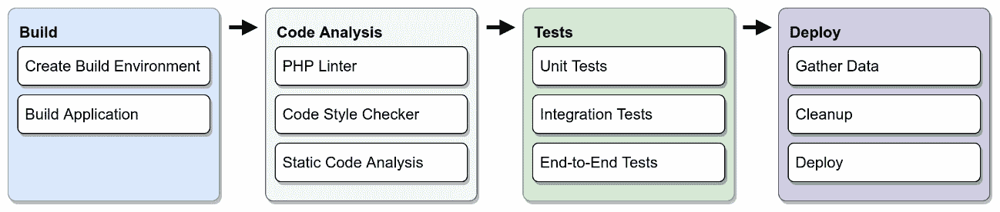
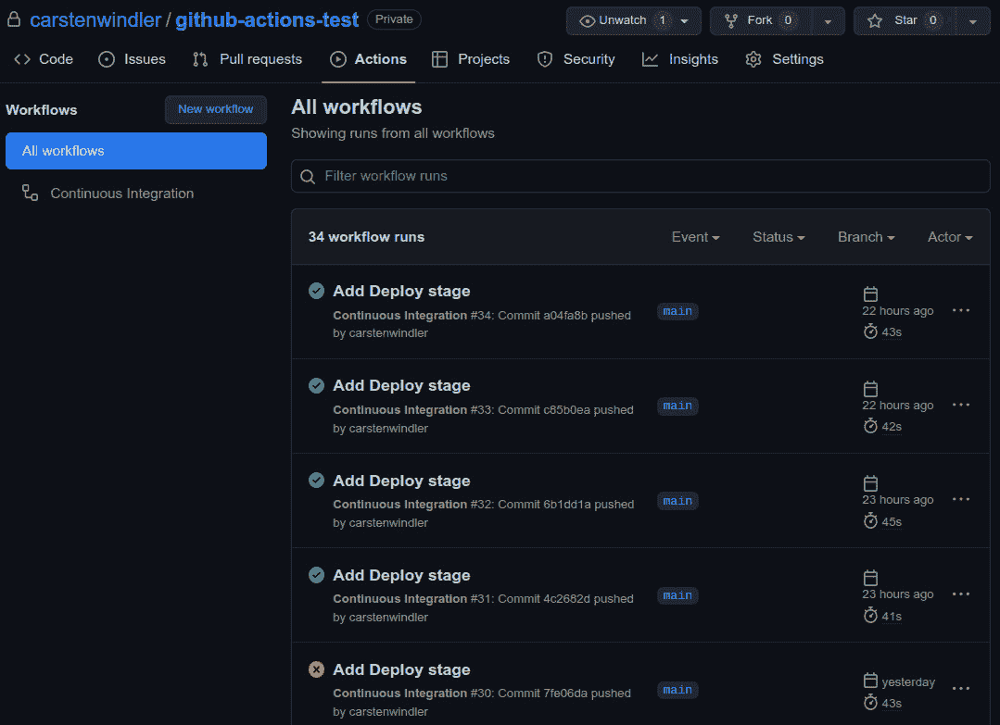
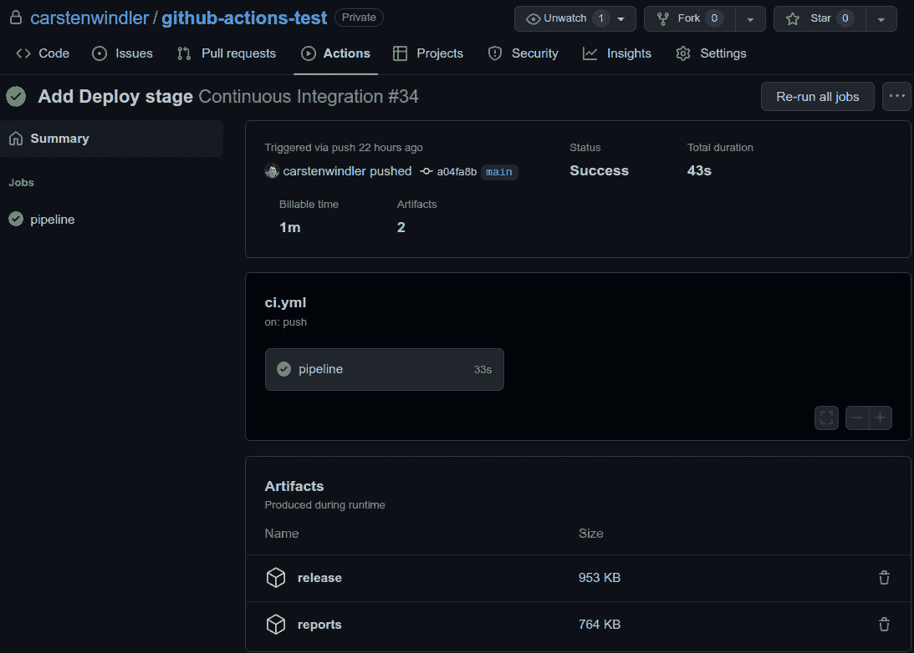
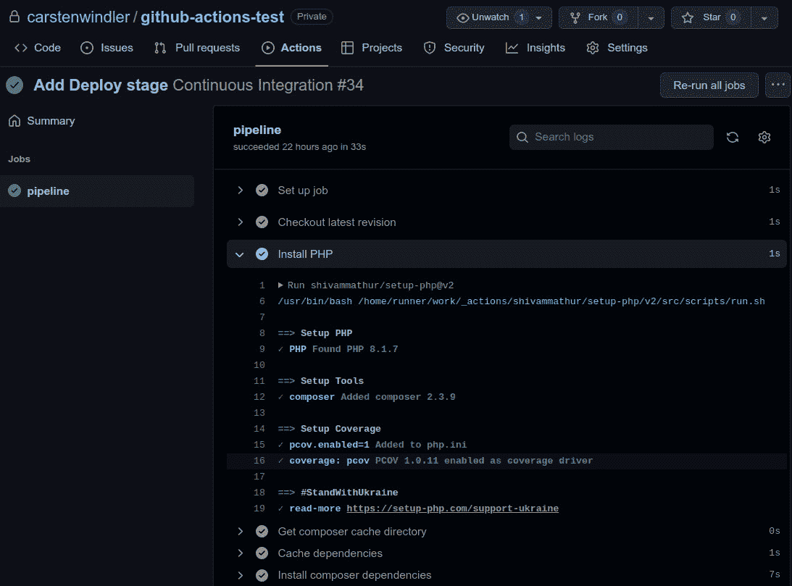
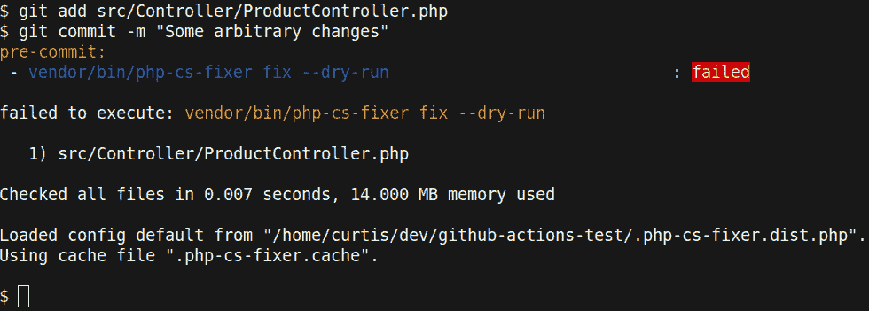
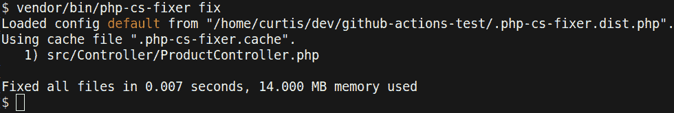
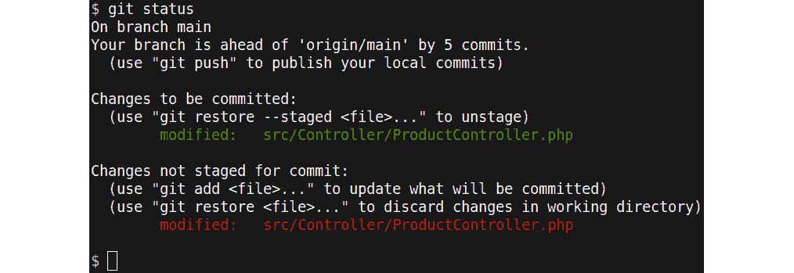
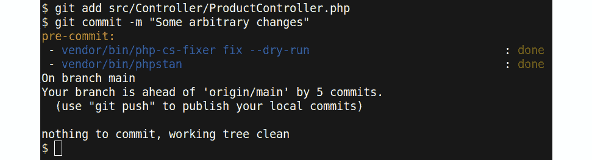

# 11

# 持续集成

您已经学习了关于编写干净的 **PHP：超文本预处理器**（**PHP**）代码的理论，并且现在您知道必要的工具和指标，这些工具和指标帮助我们实现并保持高质量水平。然而，仍然缺少的是将这些技术集成到一个便于您日常工作的工作流程中。

在以下页面中，我们将详细阐述**持续集成**（**CI**）并通过示例学习如何设置一个简单但有效的自动化工作流程。

此外，我们将向您展示如何在本地上设置一系列代码质量工具，以便它们以最支持您的方式工作，而无需手动运行它们。此外，我们还将告诉您一些关于如何将这些工作流程添加到现有项目中的最佳实践。

我们将涵盖的主要主题如下：

+   为什么你需要 CI

+   构建管道

+   使用 GitHub Actions 构建管道

+   您的本地管道——Git 钩子

+   探索——将 CI 添加到现有软件中

+   对 **持续交付**（**CD**）的展望

# 技术要求

除了前几章的设置外，您还需要一个 GitHub 账户才能跟随所有示例。不过，这不会带来额外的费用，因为我们只使用免费计划。

我们在本章中将使用的示例应用程序可以从本书的 GitHub 仓库下载：[`github.com/PacktPublishing/Clean-Code-in-PHP/tree/main/ch11/example-application`](https://github.com/PacktPublishing/Clean-Code-in-PHP/tree/main/ch11/example-application)。

# 为什么你需要 CI

编写软件是一个耗时且因此昂贵的流程。如果您为了乐趣开发软件，它“仅”会消耗您的休闲时间。如果您为一家公司工作（无论是作为承包商还是全职员工），时间就更加宝贵，因为您为此获得报酬。事实上，公司希望降低成本，因此他们不希望在一个功能上花费比必要的更多钱。

我们日常工作中的一大部分是修复缺陷。交付无缺陷的软件是所有开发者可能都希望实现的目标。我们并不是故意犯错误，但它们总会发生。然而，有一些方法可以降低错误成本。

## 错误的成本

一个错误相当昂贵，因为它对产品没有任何价值。因此，我们的目标是尽早捕捉这些错误——我们捕捉得越早，它们造成的成本就越少。以下截图展示了修复一个错误的成本如何在开发过程中出现得越晚而显著增加：

![图 11.1：根据检测时间估计修复一个错误的相对成本]

![img/Figure_11.1_B19050.jpg]

图 11.1：根据检测时间估计修复一个错误的相对成本

但是什么原因导致成本随时间大幅增加？为什么错误甚至要花钱？

在早期阶段，成本主要来自于解决问题所需的时间。如果通过更好的需求就能避免一个错误，例如，那么在手动测试期间发现它所需的努力就较少。如果在生产中发现了一个错误，那么很多人都会参与修复它：首先，客服人员需要确认客户报告的错误并将其转交给**质量保证**（**QA**）工程师，该工程师会重现错误并编写适当的错误报告。

然后，这个工单会被分配给产品经理，他会在花时间重现和验证缺陷之后，将其计划到下一个迭代中。最终，这个工单会被分配给一位开发者，他将需要一些时间来重现和修复它。但事情还没有结束，因为错误修复可能需要另一位开发者的代码审查，并且在最终发布之前还需要产品经理或 QA 工程师的双重检查。

一旦“逃离”开发者的本地环境，所有这些开销都会显著提高缺陷的成本。此外，如果错误已经存在于生产环境中，它可能导致客户不再愿意使用该产品，因为他们对它不再满意。这被称为**客户流失**。

即使你不在商业产品上工作，而是在例如开源项目上工作，这个概念也可以转化为时间或努力。一个错误会导致一个问题报告，你首先需要阅读和理解它，可能还会提出更多问题，并等待错误报告作者回复。如果你的软件错误太多，人们就会少用，你之前所有的努力可能在某个时候都白费了。

## 如何防止错误

幸运的是，我们现在有一整套工具箱在您身边，可以帮助我们在别人之前找到代码中的错误。我们只需要使用它——这本身就是一个问题，因为我们开发者通常是懒惰的人。

当然，你可以在每次部署之前手动运行所有工具。让我们假设你想要将一些代码部署到生产环境中。在将代码合并到`main`分支后，应执行以下步骤以确保不会将损坏的代码交付到生产环境中：

1.  使用 PHP 代码检查器以确保代码的语法正确性

1.  执行代码风格检查器和修复器以保持代码风格一致

1.  使用静态代码分析查找潜在问题

1.  执行所有自动化测试套件以确保你的代码仍然工作

1.  为使用的代码质量指标创建报告

1.  清理构建文件夹并创建要部署的代码存档

这是一个需要记住的相当长的清单。没有人会在更长的时间内不犯错误，所以，自然地，你会开始编写脚本以帮助你在一次操作中执行这些步骤。这已经是一个很好的改进，我们将在本章的后面也稍微利用一下它。

## 引入持续集成（CI）

在你的本地环境中运行上一节中所有步骤将花费一些时间，并且在检查运行期间，你几乎无法做其他任何事情，所以你必须等待它们完成。那么，为什么不把这个整个工作流程加载到另一个专用服务器上呢？

这正是 CI 所做的：它描述了将你应用程序的所有必要组件自动组合成一个**可交付产品**的过程，以便它可以部署到所需的环境。在这个过程中，自动检查将确保代码的整体质量。重要的是要记住，如果其中一个检查失败，整个构建将被视为失败。

有许多 **CI 工具** 可用，例如 Jenkins，它通常是自己托管的（也就是说，由你或你的团队或公司中的某人运营）。或者，你可以选择付费服务，如 GitHub Actions、GitLab CI、Bitbucket Pipelines 或 CircleCI。

你经常会看到缩写 *CI/CD*，我们也会在这本书中一直使用它。**CD** 代表 **持续交付**，这是一个我们将在本章末尾讨论的概念。现在，你不需要关心它。

设置这些工具之一听起来像是一项繁重的工作，但它也有一些显著的优点，例如以下这些：

+   **可扩展性**：如果你在一个团队中工作，使用本地设置会很快引起问题。对构建过程的任何更改都需要在每个开发者的计算机上完成。尽管构建脚本将是你的存储库的一部分，但人们可能会忘记在部署之前从其中拉取最新更改，或者可能发生其他问题。

+   **速度**：自动测试或静态代码分析是一项相当消耗资源的任务。尽管今天的计算机很强大，但它们必须执行许多并发任务，你不希望在你的本地系统上额外运行构建管道。**CI/CD 服务器**只做这项工作，而且它们通常做得很快。即使它们速度较慢，它们仍然会从你的本地系统卸载负载。

+   **非阻塞**：你需要一个构建环境来运行你代码上的所有工具和检查。使用你的本地开发环境来做这件事将简单地阻塞它，直到构建完成，尤其是当你使用较慢的测试类型，如集成测试或**端到端**（**E2E**）测试时。在你的本地系统上运行两个环境——一个用于开发，一个用于 CI/CD——是不推荐的，因为你很快就会陷入配置地狱（想想阻塞数据库或网络服务器端口）。

+   **监控**：使用专门的 CI/CD 服务器将让你对谁部署了什么以及何时部署有一个全面的了解。想象一下，如果你的生产系统突然出现故障——使用 CI/CD 服务器，你可以立即看到最新的更改，并通过几个点击部署你应用程序的上一版本。此外，CI/CD 工具会让你保持最新状态，并通过电子邮件或你喜欢的消息应用等方式通知你任何构建和部署活动。

+   **处理**：一个手写的部署脚本当然可以完成工作，但让它变得像现代 CI/CD 解决方案一样舒适和灵活需要花费很多时间。此外，如果你遵循业务标准，那么你的团队中的其他开发者很可能已经对它有经验。

前面的几点可能让你对使用 CI 将会受益多少有一个概念。每个 CI/CD 工具的一个基本组成部分是所谓的构建管道，我们将在下一节中详细解释。

# 构建管道

在上一节中，我们列出了许多必要的步骤，以便使我们的代码准备好被部署到生产环境中。在 CI 的背景下，这些步骤的组合就是我们所说的**构建管道**：它接收输入（在我们的案例中，是所有应用程序代码），通过几个工具运行它，并从中创建所谓的**构建工件**。它们是构建的结果——通常，这包括**可交付成果**（一个准备移动到目标环境的应用程序代码包），以及额外的数据，如构建日志、报告等。

下面的图表为你提供了一个典型的构建管道的概要图。由于它不是在本地环境中执行的，因此需要额外的两个步骤：*创建构建环境*和*构建应用程序*：



图 11.2：CI 管道架构图

管道中的其他语言

在这本书中，我们只会查看与管道相关的 PHP 部分，但一个现代的 Web 应用程序不仅仅由 PHP 组成。特别是对于面向前端的代码，还有另一个完整的工具集需要成为管道的一部分。然而，最终的过程是非常相似的。

在接下来的几节中，我们将更详细地介绍每个构建阶段。一开始我们将保持理论性，然后在本章的后面部分给出技术实现的例子。

## 第 1 阶段：构建项目

CI 管道需要一个专门的应用程序构建实例，我们可以在其中运行所有工具和检查，使其隔离。这可以大致分为两个步骤：创建构建环境和运行必要的构建工具。

### 创建构建环境

要在本地开发系统之外构建应用程序，我们首先需要创建一个**构建环境**。具体如何提供环境取决于所使用的 CI/CD 工具。这可以是一个为每个项目提供独立工作空间的专用服务器，或者是一个完全容器化的 Docker 环境，每次需要时都会启动，并且只持续构建的持续时间。

一旦存在构建环境，我们需要在那里下载所有源代码，但现在不要下载外部包或其他依赖项。很可能是你的代码存储在 Git 仓库中，并托管在私有 Git 服务器上或商业服务上。下载仓库特定分支的副本称为**检出**。

我们必须注意代码是从仓库的哪个分支检出的。这取决于你想要构建什么。如果你打算检查`main`分支的代码。

主分支与 master 分支

在计算机的历史中，术语*master*和*slave*被广泛使用，无论是硬盘配置、数据库复制，还是当然——Git。然而，这些术语对许多人来说是有害的，所以现在的`main`分支简单地称为*main*而不是*master*。你仍然会找到使用旧分支名称的仓库。然而，在这本书中，我们将坚持使用新的术语。

然而，如果你的项目不是使用 Git 托管，不要担心——这一步仍然是必要的，因为我们需要在 CI/CD 服务器上获取代码。无论是通过 Git、Mercurial、**Subversion**（**SVN**）还是甚至直接文件下载，最终并不重要。这一步骤的结果是我们想要的代码在 CI/CD 服务器上准备好，以便我们可以开始安装依赖项。

### 构建应用程序

构建应用程序类似于在新系统上安装它。在上一个步骤中，我们确保源代码在环境中可用。在这个步骤中，我们需要执行任何必要的构建步骤。这通常包括以下内容：

+   **安装外部依赖项**：你的仓库应只包含你自己的代码，不包含外部依赖项。我们通过 Composer 或**PHAR 安装和验证环境**（**Phive**）等来管理这些依赖项。

+   在这个阶段，例如`.env`文件。

+   **准备测试数据库**：为了运行集成或端到端测试，构建实例需要一个可工作的数据库。通常，这是通过创建测试数据库、导入数据库模式、运行任何额外的数据库迁移，并最终用测试数据填充数据库来完成的。

为了减少构建时间，许多现代 CI/CD 工具提供了缓存功能。如果已启用，它们将在第一次下载后将依赖项保存在临时存储中。如果不默认启用，通常是一个好主意将其打开。

## 第二阶段——代码分析

我们在*第七章**，代码质量工具*中详细介绍了代码质量工具。现在，是时候将这些工具添加到我们的流程中，以确保它们会在引入的每个更改时执行。

### PHP 代码检查器

如果你将代码合并到另一个分支中，代码总是可能断裂。Git 有非常复杂的合并算法，但仍然不能做魔法。考虑到你有一个高覆盖率的测试套件，如果合并导致了语法错误，一些测试肯定会失败。那么，为什么我们要运行这个额外的步骤呢？我们推荐这样做，因为 PHP 代码检查器有两个优点：它运行得非常快，并且会检查所有 PHP 文件，无论是否有测试。

我们希望我们的管道在检测到任何问题后快速失败。因此，在执行任何长时间运行的任务之前，在开始时运行一个快速的语法检查是有意义的。无论如何，它们都会中断，你也会浪费一些宝贵的时间。作为一个经验法则，检查运行得越快，它就会越早出现在管道中。

### 代码风格检查器

在检查代码语法之后，是时候检查代码风格了。这个操作也很快，所以在管道的早期运行它是有意义的。在我们的例子中，我们将使用**PHP 编码标准修复器**（**PHP-CS-Fixer**），这是我们已经在*第七章**，代码质量工具*中介绍过的。

在本地运行 PHP-CS-Fixer 和在 CI/CD 管道中运行之间有一个微妙但重要的区别：对于后者，我们只会用它来检查代码，但不会修复它。我们不希望管道*更改*我们的代码，只是*分析*它。换句话说，我们的管道只会检查代码是否正确格式化（根据我们定义的规则），但不会尝试自动修复；如果违反了任何规则，构建就会失败。

没有规则说 CI/CD 管道不应该更改代码。然而，在过程中自动提交更改到仓库会增加复杂性。此外，它需要一个经过充分测试的应用程序，并且你需要信任你选择的工具不会破坏任何东西。通常，它们工作得很好，但你愿意冒险吗？

在您的本地环境中，同时运行修复器和代码风格检查器是有意义的。我们将在本章的下一节中讨论本地设置。

### 静态代码分析

在这个阶段，我们知道我们的代码在语法上是正确的，并且按照我们的规则进行了格式化。这两个之前的检查通常都很快，所以如果发生了那些容易检测到的问题，我们的构建过程会在早期失败。

现在，是时候运行较慢的任务了。静态代码分析通常比前两个阶段花费的时间要长一些，但它远远没有运行自动测试那么慢。本质上，这一步与代码检查和代码风格检查没有太大区别：如果我们之前定义的规则被违反，构建将失败。

如果你正在将 CI 引入现有项目，挑战在于找到错误报告的最佳平衡点。一方面，你希望让开发者满意，不要强迫他们在每次触摸文件时修复其他开发者引入的数十个问题。另一方面，你需要设置一个足够严格的阈值，以确保每次代码更改至少进行一些重构。

很遗憾，这里没有金科玉律，你需要对设置进行实验。在稍后，当大多数静态代码分析报告的问题都解决后，你需要稍微收紧错误报告规则，这样你的项目就不会在某一个水平上停滞不前。

## 第 3 阶段 – 测试

当我们的代码达到管道的这个阶段时，我们确信它是语法正确的，遵循我们的代码风格指南，并且根据我们的静态代码分析规则没有一般性的缺陷。因此，我们现在将运行管道中的这一步，这通常需要最长时间：自动测试。

正如我们在上一章中介绍的，除了单元测试之外，还有更多需要考虑的。通常，像网络服务这样的项目至少有一些集成测试来确保整个服务运行良好，包括数据库事务。或者，如果你的项目是一个传统的网络应用程序，你可能有一个端到端测试套件，它使用浏览器来模拟点击。

我们希望在这里应用与构建步骤相同的方法：从快速运行的测试开始，然后继续进行较慢的测试。如果单元测试已经失败，你不需要等待端到端测试的结果。因此，对于测试，执行顺序通常是这样的：

1.  单元测试

1.  集成测试

1.  端到端测试

如果任何类型的测试失败，构建将被标记为失败。如果它们都通过，我们已经通过了管道中最关键的部分。我们的应用程序准备就绪，可以部署了，现在是时候清理和准备交付物了。

## 第 4 阶段 – 部署

我们已经通过各种工具彻底检查了我们的代码，并且我们确信它符合我们的标准。我们现在可以准备**构建工件**，并最终部署应用程序。让我们看看为此需要做些什么。

### 收集数据

在之前的阶段，我们使用的所有工具都产生了一些数据，无论是通过写入**标准输出**（**stdout**），还是如果你配置了，通过创建总结执行操作的报告。

例如，您可以上传生成的报告到专用存储或将其推送到您的仓库。或者，您可以使用 PHPUnit 的代码覆盖率报告并自动从它创建一个代码覆盖率徽章，您可以将它添加到 GitHub 项目的 README 中。

尽管如此，最重要的用例是调试任何阶段是否失败。在出现问题时，您永远都不可能有足够的调试输出，因此将工具的详细程度设置为较高级别是一个好主意。您的 CI/CD 工具通常会确保在构建管道执行后，所有写入到 stdout 的内容都可用。

### 清理

在我们将应用程序上传到某个地方之前，我们想要确保它不包含任何不必要的冗余。这包括删除前一个阶段的日志或报告，或者删除代码质量工具。记住，我们只应该部署运行应用程序所必需的代码——例如 PHPUnit 这样的开发工具并不是以安全性为设计目标的([`phpunit.readthedocs.io/en/9.5/installation.html#webserver`](https://phpunit.readthedocs.io/en/9.5/installation.html#webserver))。

### 部署

要将代码部署到目标环境，我们需要将其打包成一个可以轻松移动的资产。这个资产也被称为**交付物**。我们选择的交付物类型取决于应用程序如何部署到生产环境。这种交付物的常见类型就是需要部署的代码的存档。

例如，如果您的生产环境运行在传统的本地 Web 服务器上，我们需要创建应用程序代码的存档，将其上传到目标服务器，并从那里提取它。

当前的既定标准是使用 Docker 的容器化环境。一旦构建实例经过彻底测试，就可以从它创建一个**Docker 镜像**。然后，这个镜像将被上传到**镜像仓库**，例如**Amazon Web Services Elastic Container Repository**（**AWS ECR**）。这样的**镜像仓库**托管了所有您的镜像，因此当需要时，可以使用它们启动新的容器。这种方法为今天我们所拥有的高度可扩展的 Web 应用铺平了道路，因此如果您的应用程序在某个时刻需要扩展，从一开始就设计应用程序为**可 Docker 化**的将会带来回报。

容器和镜像

如果您是 Docker 的新手，容器和镜像的概念可能会令人困惑。简而言之，镜像包含所有数据，但它是只读的，不能单独使用。为了使其在 Docker 环境中可用，它需要一个包含镜像所有信息的容器，并提供连接到您设置中其他容器的所需功能。由于您可以从一个镜像创建所需数量的容器，您也可以将其视为一个容器模板。

如果你想了解更多关于 Docker 的信息，我们建议你查看官方文档[`docs.docker.com/get-started/overview`](https://docs.docker.com/get-started/overview)。互联网上还有大量的教程、在线课程和其他信息可以找到。

我们现在对构建管道可能的样子有了很好的了解。在我们开始设置示例管道之前，还有一件事需要明确——它将在何时执行？

## 将管道集成到你的工作流程中

在设置所有必要的步骤之后，我们最终需要将管道集成到你的工作流程中。CI/CD 工具通常会提供不同的选项来决定何时执行管道。最初，当然可以通过点击按钮手动完成。但这并不方便。如果你使用 GitHub、GitLab 或 Bitbucket 等托管 Git 仓库，你可以将它们与你的构建管道连接起来，并在创建 PR 或分支合并到 `main` 分支时开始构建。

对于需要数小时构建的大型项目，在夜间（所谓的是**夜间构建**）运行当前代码库的构建也很常见。开发者将在第二天从管道中获得反馈。

运行构建需要一些时间，当然，开发者不应该坐在屏幕前等待，直到他们可以继续工作。他们更应该在被构建成功或失败时立即得到通知。如今，所有 CI/CD 工具都提供了多种方式来通知开发者，主要是通过电子邮件和在 Slack 或 Microsoft Teams 等聊天工具中的消息。此外，它们通常还提供仪表板视图，你可以在一个屏幕上看到所有构建的状态。

你现在应该对你的项目构建管道可能的样子有了很好的了解。因此，现在是时候向你展示一个实际示例了。

# 使用 GitHub Actions 构建管道

在了解了 CI 的所有阶段之后，是时候进行实践了。本书的范围不包括介绍一个或多个 CI/CD 工具的所有功能；然而，我们仍然想向你展示设置一个工作构建管道是多么容易。为了尽可能降低你的入门门槛并避免任何费用，我们决定使用 **GitHub Actions**。

GitHub Actions 不是一个像 Jenkins 或 CircleCI 这样的经典 CI 工具，而是一种围绕 GitHub 仓库构建工作流程的方式。只要有点创意，你就可以做比“仅仅”一个经典的 CI/CD 管道更多的事情。当然，我们只会关注这个方面。

你可能已经有了 GitHub 账户，如果没有，注册一个也不会花费你任何费用。截至写作时，你可以免费使用 GitHub Actions，每月最多 2,000 分钟，用于公共仓库，这使得它成为一个极好的游乐场或开源项目的有用工具。

示例项目

我们创建了一个小型的演示应用程序，在本章中使用。您可以在以下位置找到它：[`github.com/PacktPublishing/Clean-Code-in-PHP/tree/main/ch11/example-application`](https://github.com/PacktPublishing/Clean-Code-in-PHP/tree/main/ch11/example-application)。请注意，它没有其他用途，只是演示 GitHub Actions 和 Git hooks 的基本使用。

## GitHub Actions 简而言之

GitHub Actions 提供了没有花哨用户界面的配置方式，您可以通过存储在存储库中的 **YAML Ain’t Markup Language** (**YAML**) 文件来配置所有阶段。作为一个 PHP 开发者，您可能已经熟悉了使用 YAML 文件进行各种配置——如果不熟悉，请不要担心，因为它们很容易理解和使用。

GitHub 动作是围绕工作流程组织的。当某些事件发生时，工作流程会被触发，并包含一个或多个需要执行的工作。一个工作由一个或多个执行单个操作的步骤组成。

文件必须存储在存储库的 `.github/workflows` 文件夹中。让我们看看 `ci.yml` 文件的最初几行，它将成为我们的 CI 工作流程：

```php
name: Continuous Integration
on:
  workflow_dispatch:
  push:
    branches:
      - main
  pull_request:
jobs:
  pipeline:
    runs-on: ubuntu-latest
    steps:
      - name: ...
        uses: ...
```

已经有了相当多的信息。让我们逐行过一遍：

+   `name` 定义了工作流程在 GitHub 中的标签，可以是任何字符串

+   `on` 指定了哪些事件应该触发此工作流程；这些包括以下内容：

    +   `workflow_dispatch` 允许我们从 GitHub 网站手动触发工作流程，这对于创建和测试工作流程来说非常棒。否则，我们每次都需要向 `main` 分支推送提交或创建 PR。

    +   `push` 告诉 GitHub 在发生推送时执行此工作流程。我们将其限制为仅在 `main` 分支上的推送。

    +   `pull_request` 会在每个新的 PR 上额外触发工作流程。配置可能看起来有点不完整，因为冒号后面没有更多信息。

+   `jobs` 包含了此工作流程要执行的工作列表，具体如下：

    +   `pipeline` 是 `_`) 或破折号 (`-`）。

    +   `runs-on` 告诉 GitHub 使用最新的 Ubuntu 版本作为此工作的运行者（即平台）。其他可用的平台是 Windows 和 macOS。

    +   `steps` 标记了执行此工作所需的一系列步骤。在下一节中，我们将更详细地探讨这一点。

现在我们已经配置了工作流程的基本设置，因此我们可以开始添加构建阶段。

## 第 1 阶段 – 构建项目

步骤是使 GitHub Actions 变得如此强大的原因：在这里，您可以从大量已存在的 *actions* 中选择用于您的工作流程。它们组织在 *GitHub Marketplace* ([`github.com/marketplace`](https://github.com/marketplace)) 中。让我们按照以下方式将一些步骤添加到工作流程 YAML 中：

```php
steps:
  ###################
  # Stage 1 - Build #
  ###################
  - name: Checkout latest revision
    uses: actions/checkout@v3
  - name: Install PHP
    uses: shivammathur/setup-php@v2
    with:
      php-version: '8.1'
      coverage: pcov
```

由 GitHub 维护的动作可以在`actions`命名空间中找到。在我们的例子中，这是`actions/checkout`，它用于检出仓库。目前我们不需要指定任何参数，因为这个动作将自动使用此工作流程文件所在的仓库。

`@V3`注解用于指定要使用的*主要*版本。对于`actions/checkout`，这将是指版本`3`。请注意，总是使用最新的*次要*版本，在撰写本文时将是版本`3.0.2`。

另一个动作`shivammathur/setup-php`是由许多提供开源工作的优秀人士之一提供的。对于这一步，我们使用`with`关键字来指定进一步参数。在这个例子中，我们使用`php-version`选项来在之前选定的*Ubuntu*机器上安装 PHP `8.1`。使用`coverage`参数，我们可以告诉`setup-php`启用`pcov`扩展以生成代码覆盖率报告。

动作参数

之前介绍的两个动作提供的参数比我们在这里能描述的要多得多。您可以通过在*Marketplace*中查找它们来获取更多关于它们功能的信息。

关于格式化，我们使用注释和步骤之间的空白行来使文件更易于阅读。没有约定，完全取决于您如何格式化您后面的 YAML 文件。

下一步是安装项目依赖项。对于 PHP 来说，这通常意味着运行`composer install`。请注意，我们**不**使用`--no-dev`选项，因为我们需要安装`dev`依赖项来执行所有质量检查。我们将在管道末尾再次删除它们。

依赖项管理

我们详细使用`--no-dev`选项。

这就是下一步可能的样子：

```php
- name: Get composer cache directory
  id: composer-cache
  run: echo "::set-output name=dir::$(composer config cache
    files-dir)"
- name: Cache dependencies
  uses: actions/cache@v2
  with:
    path: ${{ steps.composer-cache.outputs.dir }}
    key: ${{ runner.os }}-composer-${{
      hashFiles('**/composer.lock') }}
    restore-keys: ${{ runner.os }}-composer-
- name: Install composer dependencies
  run: composer install
```

GitHub 动作需要一些手动工作来使 Composer 依赖项的缓存成为可能。在第一步中，我们将从 Composer 使用`config cache-files-dir`命令获取的 Composer 缓存目录的位置存储在一个名为`dir`的输出变量中。注意这里`id: composer-cache`——我们将在下一步中需要这个来引用变量。

然后，我们在下一步通过使用`steps.composer-cache.outputs.dir`引用（这是我们在上一步设置的`id`值和变量名的组合）来访问这个变量，以定义应该由`actions/cache`动作缓存的目录。`key`和`restore-key`用于生成唯一的缓存键——即存储我们的 Composer 依赖项的缓存条目。

最后，我们使用`run`参数直接执行`composer install`，就像我们会在 Ubuntu 机器上本地执行它一样。这一点很重要：您可以使用，但不必在每一步都使用现有的 GitHub 动作——您也可以执行纯 shell 命令（或在 Windows 运行器上的等效命令）。

在**Marketplace**中也有一些操作会接管命令的编写，例如`php-actions/composer`。我们在这里没有首选解决方案；两者都可以正常工作。

因为我们想在示例应用的 API 上运行集成测试，我们需要有一个正在运行的 Web 服务器。对于我们的简单用例，使用 PHP 内置的 Web 服务器就完全足够了，我们可以在以下步骤中开始使用它：

```php
- name: Start PHP built-in webserver
  run: php -S localhost:8000 -t public &
```

`-S`选项告诉 PHP 二进制文件启动一个监听在`localhost`地址和端口`8000`的 Web 服务器。由于我们从项目的根目录开始，我们需要使用`-t`选项定义一个**文档根**文件夹（Web 服务器查找要执行文件的文件夹）。在这里，我们想要使用公共文件夹，它只包含`index.php`文件。将任何其他代码存储在文档根文件夹中都不是一个好的做法，因为这会使攻击者更难攻击我们的应用程序。

PHP 内置 Web 服务器

请注意，PHP 的内置 Web 服务器仅应用于**开发**目的。它绝不应该在生产环境中使用，因为它并不是为了性能或安全性而构建的。

你肯定注意到了命令末尾的`&`符号。这告诉 Linux 执行命令，但不要等待其终止。没有它，我们的工作流程会在这一点上卡住，因为 Web 服务器不会自行终止，因为它需要继续监听请求，直到我们在稍后的阶段运行我们的**集成测试**。

我们的构建环境设置已完成。现在，是时候在我们的示例应用程序上运行第一次代码质量检查了。

## 第二阶段 – 代码分析

在第一个构建阶段，我们创建了我们的构建环境并检出我们的应用程序代码。在这个阶段，应用程序应该完全功能正常，并准备好进行测试。现在，我们想要进行一些静态代码分析。

标准方法是为每个工具使用专门的 GitHub 动作。好处是我们将开发工具与构建环境分开，因为它们将在单独的 Docker 容器中执行，并在使用后立即丢弃。尽管如此，这种方法也有一些缺点。

首先，每个动作都会引入另一个依赖项，我们依赖于作者保持其更新，并在一段时间后不会失去维护它的兴趣。此外，我们增加了一些开销，因为 Docker 镜像通常比实际工具大得多。最后，当我们的应用程序设置变得更加复杂时，在单独的 Docker 容器中运行代码质量工具可能会引起问题，仅仅是因为它不是与构建环境相同的环境。有时，已经非常小的差异也可能导致问题，这些问题可能会让你花费数小时或数天来解决。

正如我们在上一节中看到的，我们可以在构建环境中简单地执行 Linux shell 命令，所以没有理由在我们的构建环境中直接执行代码质量工具——我们只需要确保之后删除它们，以免它们被发布到生产环境中。

在我们的示例应用程序中，我们将 PHP-CS-Fixer 和 PHPStan 添加到了`composer.json`文件的`require-dev`部分。通过将以下代码行添加到我们的工作流程 YAML 中，我们将让它们作为下一步执行：

```php
###########################
# Stage 2 - Code Analysis #
###########################
- name: Code Style Fixer
  run: vendor/bin/php-cs-fixer fix --dry-run
- name: Static Code Analysis
  run: vendor/bin/phpstan
```

在这里我们不需要很多参数或选项，因为我们的示例应用程序提供了`.php-cs-fixer.dist.php`和`phpstan.neon`配置文件，这两个工具默认都会查找。只有对于 PHP-CS-Fixer，我们会使用`--dry-run`选项，因为我们只想在 CI/CD 管道中检查问题，而不是解决它们。

设置检查范围

对于我们的小型示例应用程序，运行前面的检查在所有文件上是可以的，因为它们会快速执行。然而，如果我们的应用程序增长，或者我们希望将 CI/CD 引入现有的应用程序（我们将在本章后面进一步讨论），则只需在最新提交中只更改的文件上运行这些检查即可。以下操作在这种情况下可能对您有所帮助：[`github.com/marketplace/actions/changed-files`](https://github.com/marketplace/actions/changed-files)。

如果 PHP-CS-Fixer 或 PHPStan 没有报告任何问题，我们就可以安全地执行下一阶段的自动化测试：测试。

## 第三阶段 – 测试

我们已经彻底分析了代码，并检查了错误和语法错误，但我们还需要检查代码中的逻辑错误。幸运的是，我们有一些自动化测试来确保我们没有无意中引入任何错误。

由于与*第二阶段*中的代码质量工具相同的原因，我们不希望为运行我们的 PHPUnit 测试套件使用专用操作。我们只是像在本地开发系统中一样执行 PHPUnit。使用`phpunit.xml`文件在这里显然很有用，因为我们不需要记住所有许多选项。让我们首先看看*工作流程 YAML*，如下所示：

```php
###################
# Stage 3 - Tests #
###################
- name: Unit Tests
  run: vendor/bin/phpunit --testsuite Unit
- name: Integration Tests
  run: vendor/bin/phpunit --testsuite Api
```

这里唯一值得注意的事情是我们不仅运行所有测试，而且将它们分成两个测试套件：`Unit`和`Api`。由于我们的单元测试应该执行得最快，我们希望首先运行它们（并失败），然后是较慢的集成测试。请注意，我们没有添加任何端到端测试，因为我们的应用程序不在浏览器中运行，而是一个简单的 Web 服务。

我们通过使用`phpunit.xml`配置文件来分割测试。以下代码片段展示了其`<testsuites>`节点，其中我们根据目录（`Api`和`Unit`）来分离测试套件：

```php
<testsuites>
    <testsuite name="Api">
        <directory>tests/Api</directory>
    </testsuite>
    <testsuite name="Unit">
        <directory>tests/Unit</directory>
    </testsuite>
</testsuites>
```

我们还配置了 PHPUnit 以创建代码覆盖率报告，如下所示：

```php
<coverage processUncoveredFiles="false">
    <include>
        <directory suffix=".php">src</directory>
    </include>
    <report>
        <html outputDirectory="reports/coverage" />
        <text outputFile="reports/coverage.txt" />
    </report>
</coverage>
```

要创建这些报告，PHPUnit 将自动使用我们在第 1 阶段配置的`pcov`扩展。它们将被写入`reports`文件夹，我们将在下一阶段处理。

这就是测试阶段需要做的所有事情。如果我们的测试没有发现任何错误，我们就可以进入管道的最后一个阶段，并完成所有工作。

## 第 4 阶段 - 部署

我们的应用程序现在已经彻底检查和测试过了。在我们准备好将其部署到我们预想的任何环境中之前，我们首先需要处理移除`dev`依赖项。幸运的是，这非常简单，正如我们在这里可以看到的：

```php
####################
# Stage 4 - Deploy #
####################
- name: Remove dev dependencies
  run: composer install --no-dev --optimize-autoloader
```

运行`composer install --no-dev`将简单地从`vendor`文件夹中删除所有`dev`依赖项。另一个值得注意的特性是 Composer 的`--optimize-autoloader`选项：由于在生产环境中，我们不会像在开发中那样添加或更改任何类或命名空间，因此 Composer 的自动加载器可以通过不检查任何更改来优化，从而减少磁盘访问，稍微提高其速度。

作为最后一步，我们想要创建构建工件：一个是可交付成果——即我们打算部署的代码。另一个是我们在第 3 阶段创建的代码覆盖率报告。GitHub Actions 在执行工作流程 YAML 之后不会保留任何比 GitHub 网站上显示的日志信息更多的数据，因此我们需要确保它们在最后被存储起来。代码如下所示：

```php
- name: Create release artifact
  uses: actions/upload-artifact@v2
  with:
    name: release
    path: |
      public/
      src/
      vendor/
- name: Create reports artifact
  uses: actions/upload-artifact@v2
  with:
    name: reports
    path: reports/
```

我们使用`actions/upload-artifacts`操作创建两个 ZIP 存档（在这里称为*工件*）：`release`和`reports`。第一个包含我们运行生产环境中的应用程序所需的所有文件和目录，不再需要其他任何东西。我们省略了项目根目录中的所有配置文件，甚至包括`composer.json`和`composer.lock`文件。我们不再需要它们，因为我们的`vendor`文件夹已经存在。

`reports`工件将仅包含`reports`文件夹。在构建完成后，你可以在 GitHub 上单独下载这两个 ZIP 存档。更多内容将在下一节中介绍。

## 将管道集成到你的工作流程中

在将工作流程 YAML 添加到`.github/workflows`文件夹（例如，`.github/workflows/ci.yml`）之后，你只需要将其提交并推送到仓库。我们配置了我们的管道，使其在每次打开 PR 或有人向`main`分支推送提交时运行。

当你打开[`github.com`](https://github.com)并进入你的仓库页面时，你将在**操作**标签页中找到你最后的工作流程运行概览，如下面的截图所示：



图 11.3：github.com 上的仓库页面

绿色勾号标记成功的运行，而红色交叉——当然——标记失败的运行。您还可以看到它们何时执行以及这花了多长时间。通过点击每个条目右侧的三个点，您将找到更多选项——例如，您可以在这里删除工作流程运行。点击运行的标题，即运行的相应提交信息，您将进入 **摘要** 页面，如下面的截图所示：



图 11.4：工作流程运行摘要页面

在这里，您可以查看工作流程的所有作业。由于我们的示例只包含一个作业，即 `pipeline`，您只会看到一个。在此页面上，您还可以找到任何生成的工件（例如我们的发布和报告工件）并下载或删除它们。GitHub 免费提供的磁盘空间有限，所以当您快用完空间时，请确保删除它们。

另一个重要的信息是计费时间。尽管我们的作业总共只运行了 43 秒，GitHub 仍将从您的月度使用量中扣除 1 分钟。GitHub 提供了慷慨的免费计划，但您应该时不时地查看您的使用情况。您可以在用户设置页面中的 **计费和计划** 部分找到更多关于此的信息（[`github.com/settings/billing`](https://github.com/settings/billing)）。

如果您想查看工作流程运行期间确切发生了什么——例如，如果出了问题——您可以点击 `pipeline` 作业以获取所有步骤的详细概述，如下面的截图所示：



图 11.5：作业详情页面

每个步骤都可以展开和折叠以获取有关其执行期间确切发生了什么的额外信息。在上面的截图中，我们展开了 **安装 PHP** 步骤以查看动作的详细操作。

恭喜——您现在为您的项目拥有了一个工作的 CI 管道！这标志着我们通过 GitHub Actions 的小型之旅结束。当然，您可以按需扩展管道——例如，通过将发布工件上传到 **SSH 文件传输协议**（**SFTP**）服务器或 AWS **简单存储服务**（**S3**）存储桶。还有更多的事情可以做，所以请确保尝试一下。

在下一节中，我们将向您展示如何设置您本地的管道。这将为您节省一些时间，甚至可能通过避免不必要的早期检查来节省成本。

# 您的本地管道 – Git 钩子

在我们成功设置了一个简单但已经非常有用的 CI/CD 管道之后，我们现在想看看在将它们提交到仓库之前，如何在本地开发环境中运行一些步骤。这听起来可能像是重复工作——为什么我们要运行相同的工具两次呢？

记住本章开头的*图 11.1-根据检测时间估计修复错误的相对成本*：我们越早发现错误，它造成的成本或努力就越少。当然，如果在 CI/CD 管道中找到错误，这仍然比在生产环境中要早得多。

虽然管道不是免费的。我们的示例应用程序构建速度快，只需大约一分钟。想象一下，一个完整的 Docker 设置已经花费相当多的时间来创建所有必要的容器。现在，它因为一个小错误而无法构建，如果您在提交代码之前没有忘记执行单元测试，您本可以在 2 分钟内解决这个错误。您可能刚刚享受了一个应得的茶或咖啡休息，结果回来发现构建失败了，这很烦人，也是金钱和计算能力的浪费。

正是那些快速运行的检查，比如单元测试、代码嗅探器或静态代码分析，是我们希望在开始全面构建我们的更改之前执行的。我们不能依赖我们自己自动执行这些检查，因为我们都是人类。我们会忘记事情，但机器不会。

如果您使用 Git 进行开发，像今天的大多数开发者一样，我们可以利用 Git 钩子的内置功能来自动化这些检查。Git 钩子是在某些事件上自动执行的 shell 脚本，例如在每次提交之前或之后。

对于我们的需求，*pre-commit*钩子特别有用。每次您运行`git commit`命令时，它都会执行，如果执行的脚本返回了错误，它还可以中止提交。在这种情况下，不会将任何代码添加到仓库中。

## 设置 Git 钩子

手动设置 Git 钩子确实需要一些 shell 脚本的了解，因此我们希望使用一个名为`CaptainHook`的包来帮助我们。使用这个工具，我们可以安装任何我们喜欢的钩子，甚至可以使用一些高级功能，而无需掌握 Linux。

您可以使用 Phive 轻松下载 Phar（有关更多信息，请参阅*第九章**，组织 PHP 质量工具*），或者使用 Composer 安装它，就像我们现在要做的：

```php
$ composer require --dev captainhook/captainhook
```

接下来，我们需要创建一个`captainhook.json`文件。此文件包含项目的钩子配置。由于此文件将被添加到仓库中，我们确保我们的团队中的其他开发者可以使用它。要创建此文件，我们可以运行以下命令：

```php
$ vendor/bin/captainhook configure
```

CaptainHook 将向您提出几个问题，并根据您的答案生成一个配置文件。然而，您可以跳过此步骤，直接创建文件，就像我们现在要做的。打开您最喜欢的编辑器，并写下以下代码：

```php
{
    "config": {
        "fail-on-first-error": true
    },
    "pre-commit": {
        "enabled": true,
        "actions": [
            {
             "action": "vendor/bin/php-cs-fixer
               fix --dry-run"
            },
            {
                "action": "vendor/bin/phpstan"
            }
        ]
    }
}
```

每个钩子都有自己的部分。在`pre-commit`钩子部分，`enabled`可以是`true`或`false`——后者禁用钩子但保留文件中的配置，这在调试时可能很有用。`actions`包含要执行的命令。正如你所看到的，这些命令就像你从*第七章**，代码质量工具*中已经了解的那样。

你想要执行的所有操作都需要在单独的操作部分中编写。在上面的例子中，我们配置了 PHP-CS-Fixer 和 PHPStan 在`pre-commit`时执行。

由于我们为这两个工具都有额外的配置文件，所以我们不需要指定任何其他选项，除了告诉 PHP-CS-Fixer 只进行 dry run——也就是说，只在我们发现代码风格违规时通知我们。

在`config`部分，你可以指定更多的配置参数。我们希望在错误发生后立即停止钩子执行，因此将`fail-on-first-error`设置为`true`。否则，CaptainHook 会首先运行所有检查，然后告诉你结果。这当然只是个人喜好的问题。

CaptainHook 文档

我们无法在这本书中列出 CaptainHook 的所有功能。然而，我们鼓励你查看官方文档[`captainhookphp.github.io/captainhook`](https://captainhookphp.github.io/captainhook)，以了解更多关于这个工具的信息。

现在我们已经完成了配置，请将此`captainhook.json`文件存储在项目根目录中。这就是我们关于配置需要做的所有事情。

我们现在只需要安装钩子——也就是说，在`.git/hooks`中生成钩子文件。这可以简单地这样做：

```php
$ vendor/bin/captainhook install -f
```

我们在这里使用`-f`选项，代表*强制*。没有这个选项，CaptainHook 会单独询问我们是否要安装每个钩子。请注意，CaptainHook 将为它支持的每个 Git 钩子安装一个文件，即使是你没有配置的钩子也不例外。不过，这些钩子不会做任何事情。

要测试`pre-commit`钩子，你可以使用以下命令手动执行，而无需提交任何内容：

```php
$ vendor/bin/captainhook hook:pre-commit
```

对于 CaptainHook 支持的其它所有钩子，都有类似的命令可用。如果你对`captainhook.json`文件进行了修改，别忘了再次使用`install -f`命令来安装它。

为了确保钩子被安装在本地的开发环境中，你可以在你的`composer.json`文件的`scripts`部分添加以下代码：

```php
"post-autoload-dump": [
    "if [ -e vendor/bin/captainhook ]; then
      vendor/bin/captainhook install -f -s; fi"
]
```

我们使用 Composer 的`post-autoload-dump`事件来运行`install -f`命令。该命令将在 Composer 自动加载器每次刷新时执行，这将在每次执行`composer install`或`composer update`时发生。这样，我们确保任何参与此项目的开发者的开发环境中钩子定期安装或更新。通过使用`if [ -e vendor/bin/captainhook ]`，我们检查 CaptainHook 二进制文件是否存在，如果未安装，则避免破坏 CI 构建。

## 实践中的 Git 钩子

我们完成了`pre-commit`钩子的配置，并测试和安装了它。现在，我们准备看到它的实际应用：如果你在应用程序代码中做了任何更改——例如，在`ProductController.php`文件中添加一个空白行——然后尝试提交更改，`pre-commit`钩子应该被执行。如果更改违反了*PSR-12*标准，PHP-CS-Fixer 步骤应该失败，如下面的截图所示：



图 11.6：pre-commit 钩子失败

自动修复代码风格问题

当然，在执行 PHP-CS-Fixer 时，你可以移除`--dry-run`选项，让它自动修复问题。实际上，这是一个常见的做法，我们鼓励你尝试一下。然而，这需要做更多的工作，因为你必须让用户知道他们的更改文件已经被修复，并且需要重新提交。为了使这个例子简单，我们决定省略这一点。

我们现在知道`ProductController.php`文件需要被修复。我们可以让 PHP-CS-Fixer 来完成这项工作，如下所示：



图 11.7：使用 PHP-CS-Fixer 自动修复代码风格问题

`ProductController.php`文件现在再次被更改，那些额外的更改尚未被暂存——也就是说，它们还没有被添加到提交中。之前的更改仍然被暂存。下面的截图显示了如果你现在运行`git status`会是什么样子：



图 11.8：未暂存更改

现在需要做的只是再次添加`ProductController.php`文件并再次运行`git commit`，如下面的截图所示：



图 11.9：pre-commit 钩子通过

`pre-commit`钩子的两个步骤现在都通过了。你现在需要做的只是提交更改并执行`git push`。

## 高级用法

之前的例子是一个非常基础的例子。当然，在本地开发环境中，你可以做更多的事情。例如，你可以添加更多的工具，如`phpcpd`复制粘贴检测器或`phpmd`混乱检测器，这两者我们都在*第七章**，代码质量工具*中介绍过。

如果你的测试不是太慢（这究竟意味着什么取决于你和你的队友的耐心），你应该考虑在本地运行你的测试。即使你有运行缓慢的测试，你也可以将它们分成几个测试套件，并且只在`pre-commit`上执行快速运行的测试。

你还应该考虑只对修改过的文件进行代码质量检查，而不是整个项目，就像我们在示例中所做的那样。CaptainHook 提供了有用的`{$STAGED_FILES}`占位符，它包含所有暂存文件。使用起来非常方便，如下所示：

```php
{
    "pre-commit": {
        "enabled": true,
        "actions": [
            {
                "action": "vendor/bin/php-cs-fixer fix
                  {$STAGED_FILES|of-type:php} --dry-run"
            },
            {
                "action": "vendor/bin/phpstan analyse
                  {$STAGED_FILES|of-type:php}"
            }
        ]
    }
}
```

之前的示例只对修改过的 PHP 文件运行检查。这有两个主要好处：首先，它更快，因为你不需要检查你未触及的代码。当然，这种加速取决于你的代码库的大小。

其次，特别是如果你正在处理一个现有的项目并且刚刚开始引入这些检查，在整个代码库上运行它们不是一种选择，因为你需要一次性修复太多的文件。我们将在下一节中更详细地讨论这个问题。

# 远足 - 向现有软件添加 CI

如果你在一个公司工作，你并不总是从“绿色”开始——也就是说，从头开始构建一个新项目。事实上，很可能是相反的：当你加入一个公司时，你将被添加到一个已经为了一或多个项目工作了很长时间的团队中。

你可能已经遇到了*遗留软件*或*遗留系统*这样的术语。在我们的上下文中，它们描述的是已经存在很长时间并且仍在业务关键过程中使用的软件。它不再符合现代开发标准，因此不能轻易更新或更改。随着时间的推移，它变得如此脆弱和难以维护，以至于没有开发者愿意再碰它。更糟糕的是，由于系统在更长的时间内增长，它具有如此多的功能，以至于没有任何利益相关者（即用户）愿意错过它。因此，替换遗留系统并不那么容易。

毫不奇怪，遗留软件有一个不好的含义，但可能，整个系统需要的只是一些“关注”。想想看，就像修复一台旧机器，旧零件被现代零件所取代，而外观保持不变。一些开发者甚至发现，在这样软件上工作更具挑战性。它已经走了很长的路，赚了钱，并且——最有可能的是（至少部分如此）——推动了公司的成功，因此它值得一些尊重。

因此，如果你必须处理这样的项目，不要轻易放弃。在这本书中，我们为你提供了必要的知识和工具，以开始重新塑造它——这需要更长的时间，你可能永远达不到完美的水平。但完美并不是必要的。

## 逐步进行

从添加集成和端到端（E2E）测试开始。这两种测试类型通常不需要对代码进行任何或只有很少的更改，但会带来巨大的好处，因为它们可以间接覆盖大量代码，而无需编写单元测试。一旦你用测试覆盖了应用程序的关键路径（即最常用的工作流程），你就可以开始重构类，并开始引入额外的单元测试。这些测试将帮助你快速发现错误和副作用，而无需反复点击应用程序。

如你所知，引入一种代码风格，如*PSR-12*，就像一次性在整个代码库上运行一个工具，例如`PHP-CS-Fixer`一样简单。当然，生成的提交将会非常大，所以在你这样做之前，你想要与任何其他开发者达成代码冻结的协议。代码冻结意味着每个人都将他们的更改提交到仓库中，这样你的重构就不会在他们在之后检查更改时引起巨大的合并冲突。

为了决定要重构哪些代码，我们打算使用你现在所知道的许多代码质量工具中的一个或多个。在`0`级别使用 PHPStan 是一个不错的选择。你也可能想考虑使用 PSalm，因为它也可以自动解决一些问题。根据项目的大小，错误列表可能会非常长。利用如*第七章*中所述的基线功能，*代码质量工具*在这里可以提供一些外观上的帮助，但它只会隐藏而不是解决代码问题。

你不需要急于求成。如果你配置你的 CI/CD 管道只检查已修改的文件，你可以随着时间的推移，逐步改进代码。这确实会给你留下一个问题，一旦你接触到一个文件，你必须重构它以满足规则。特别是对于旧但庞大的类，这可能会成为问题。然而，在*第七章*中，*代码质量工具*，我们解释了如何排除文件或代码的一部分以进行执行检查。你甚至可以设置一个管道，允许你在提交信息中包含某些关键字（例如，`skip ci`）时跳过检查。然而，这种方法只能是最后的手段——否则，你永远不会开始重构旧代码。这需要开发者有一定的自我克制，不要滥用这个功能。

随着时间的推移，参与项目工作的团队将积累新的信心，随着测试覆盖率的提高，他们将开始越来越多地重构代码。确保也安装一个本地管道，以缩短等待时间。

# 对 CD 的展望

最终，你的持续集成（CI）管道将运行得如此之好，以至于你可以完全信任它。它将可靠地防止将损坏的代码部署到生产环境中，在某个时刻，如果你发现部署顺利，你发现自己做的检查越来越少，也越来越不手动。到了这个时候，你可以考虑使用持续部署（CD）：这描述了将代码自动部署到任何环境的工具和流程的组合。

常见的流程是，每当更改合并到某个分支（例如，用于生产环境的`main`分支）时，CI/CD 管道将自动触发。如果更改通过了所有检查和测试，那么过程被信任得如此之高，以至于代码被部署到目标位置，而无需再手动测试构建结果。

如果你曾经有机会在这样的环境中工作，你肯定不希望错过。除了一个出色的 CI/CD 管道和对其 99%的信任之外，还需要一些流程来快速应对部署出现的问题。即使最好的工具也无法防止在更大负载下才会出现的逻辑错误或基础设施问题。

部署后出现问题时，你的团队应该是第一个注意到的人！你不仅需要完全信任管道，还需要信任监控和日志记录设置。外面有众多概念和工具，我们最终将离开代码质量的话题，进入**开发运维**（**DevOps**）和系统管理的领域。尽管如此，我们仍想给你一些关于一些你可能想要深入了解的关键概念的简要指导，如下所示：

+   **监控**收集有关系统状态的信息。在我们的环境中，这通常是有关所有服务器或实例的中央处理单元（**CPU**）负载、随机存取存储器（**RAM**）使用或数据库流量的信息。例如，如果 CPU 负载突然大幅增加，这是一个很好的迹象，表明前方可能有麻烦。

+   **日志记录**帮助你将应用程序产生的所有日志消息组织在一个单一、易于访问的地方。当系统出现问题时，如果需要先在多个服务器上搜索任何日志文件，那么这并没有帮助，此时所有警报都在响起。

+   有多种**部署方法**可供选择。特别是当你的设置已经增长并包含多个服务器或云实例时，你只需在少数实例或甚至一个单独的部署环境中推出新代码，并监控那里的行为。如果一切顺利，你可以继续将部署扩展到剩余的实例。这些方法被称为**金丝雀**、**滚动**和**蓝绿**部署。你将在本章末尾找到更多关于这些方法的链接。

+   无论你如何监控你的软件，如果出了问题（而且它们会），你需要回到应用程序的早期版本。这被称为**回滚**。你应该总是准备好尽可能快、尽可能容易地回到上一个版本。这要求你拥有几个早期版本的交付成果。保留至少 5 个或 10 个版本是个好主意，因为有时并不清楚哪个版本确切地导致了问题。

当然，CD 超出了编写干净 PHP 代码的范围。然而，我们认为这是一个值得追求的目标，因为它将大大加快您的开发速度，并使您接触到各种迷人的工具和概念。

# 摘要

我们希望，在阅读这一章后，您会像我们一样坚信 CI 极其有用，因此是您工具箱中不可或缺的工具。我们不仅从理论上，而且通过使用 GitHub Actions 构建一个简单但实用的管道，在实践中也解释了这一主题的必要术语以及管道的不同阶段。最后，我们为您展望了 CD。

您现在拥有了编写出色 PHP 代码所需的知识和工具基础。当然，学习永远不会停止，而且还有许多知识等待您去发现，我们无法将它们全部放入这本书中。

如果您将开发 PHP 软件作为职业，那么您通常会在开发团队中工作。即使您在维护自己的开源项目，您也会与其他人互动——例如，当他们向您提交代码更改时。CI 是一个重要的构建块，但不是您在成功团队设置中需要考虑的唯一事情。

对于我们来说，这个话题非常重要，以至于我们专门用接下来的两章来介绍现代协作技术，这些技术将帮助您在团队中编写出色的 PHP 代码。我们希望在下章中见到您！

# 进一步阅读

如果您想了解更多，请查看以下资源：

+   关于 GitHub Actions 的更多信息：

    +   包含大量示例的官方*GitHub Actions*文档：[`docs.github.com/en/actions`](https://docs.github.com/en/actions)

    +   `setup-php`不仅对 PHP 开发者非常有用，还提供了大量有用的信息——例如，关于*矩阵设置*（如何针对多个 PHP 版本测试代码）或*缓存 Composer 依赖项*以加快构建速度：[`github.com/marketplace/actions/setup-php-action`](https://github.com/marketplace/actions/setup-php-action)

+   关于 CD 和相关主题的更多信息可以在这里找到：

    +   CD 的良好概述：[`www.atlassian.com/continuous-delivery`](https://www.atlassian.com/continuous-delivery)

    +   日志和监控解释：[`www.vaadata.com/blog/logging-monitoring-definitions-and-best-practices/`](https://www.vaadata.com/blog/logging-monitoring-definitions-and-best-practices/)

    +   高级部署方法的精彩介绍：[`www.techtarget.com/searchitoperations/answer/When-to-use-canary-vs-blue-green-vs-rolling-deployment`](https://www.techtarget.com/searchitoperations/answer/When-to-use-canary-vs-blue-green-vs-rolling-deployment)

+   与您本地管道相关的工具和链接：

    +   关于 Git 钩子的更多见解：[`git-scm.com/book/en/v2/Customizing-Git-Git-Hooks`](https://git-scm.com/book/en/v2/Customizing-Git-Git-Hooks)

    +   GrumPHP 是一个“开箱即用”的本地 CI 管道：[`github.com/phpro/grumphp`](https://github.com/phpro/grumphp)
