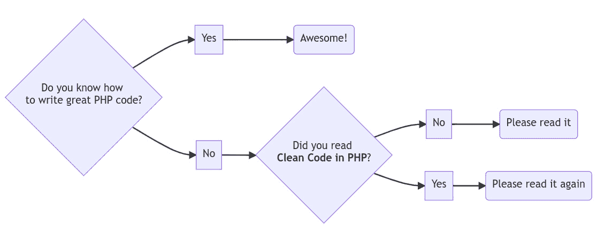
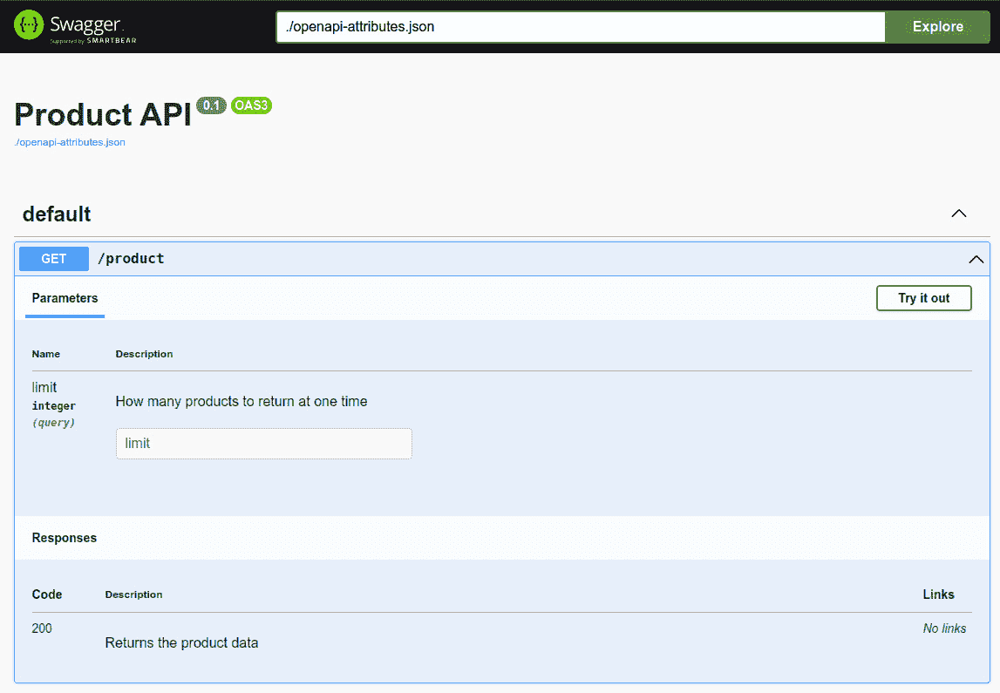

# 创建有效的文档

许多开发者认为文档是一种负担，而不是有意义的活动。这是可以理解的，因为通常文档在编写后就不再更新。很快，它就会充满错误陈述和过时信息，这确实是没有人希望看到的。

我们坚信，文档的重要性不容忽视，不能放弃。如果做得恰当，它将是一个宝贵的补充，也是编写干净代码的重要基石，尤其是在团队工作中。

因此，在本书的最后一章，我们想给你一些关于如何编写实用且可维护的文档的想法。

本章我们将涵盖以下主要主题：

+   为什么文档很重要

+   创建文档

+   内联文档

# 技术要求

对于本章，没有额外的技术要求。所有代码示例都可以在我们的 GitHub 仓库中找到：[`github.com/PacktPublishing/Clean-Code-in-PHP`](https://github.com/PacktPublishing/Clean-Code-in-PHP)。

# 为什么文档很重要

欢迎来到本书的最后一章。你已经走得很远了，在你暂时放下这本书之前，我们想将你的注意力引向经常被忽视的话题——创建文档。让我们在接下来的几页中说服你，文档并不一定必须是枯燥乏味的，反而可以带来宝贵的益处。

## 为什么文档很重要

我们为什么要创建任何文档呢？我们的代码或测试不是已经足够作为文档了吗？这些想法中有些是真实的，我们将在本节中进一步讨论这个话题。然而，多年来，无数的开发者从未停止过创建无数的文档，这肯定有它的道理。

我们创建文档是因为我们可以让其他人更容易地使用我们的软件。这关乎上下文，而这些上下文往往不能从阅读几个类的代码中轻易提取出来。文档往往不仅关乎“什么”或“如何”，还关乎“为什么”。

了解导致决策的动机或外部因素对于理解和接受为什么项目以某种方式构建至关重要。例如，你可能会抱怨你的前同事实现了一个脆弱的、由 cronjob 触发的从外部**文件传输协议**（**FTP**）服务器下载**逗号分隔值**（**CSV**）文件的下载，除非你从文档中了解到客户在项目截止日期前根本无法提供一个**表示状态转移**（**REST**）**应用程序编程接口**（**API**）端点来提供数据。

一个新同事加入你的项目，如果至少有一些文档可以阅读，就不需要（可能还会打扰）其他开发者询问每一个小问题，这肯定会让他感到高兴。而且让我们不要忘记我们的未来自己，他们已经好几个月没有接触那个项目了，现在必须修复一个关键错误。如果我们当时知道我们过去自己做了什么……以及为什么。

如果你开发**开源软件**（**OSS**），那么文档也同样重要。如果你需要评估几个第三方软件包以决定在项目中使用哪一个，那么拥有良好文档的软件包更有可能被考虑。如果你在一个工具上投入了无数小时，但没有人使用它，因为它没有或没有良好的文档，这难道不是一件遗憾的事情吗？

最后，如果你以软件开发为职业，你应该将其视为专业开发者职责的一部分，即编写文档。这正是你获得报酬的原因。

## 开发者文档

当我们想到文档时，通常首先想到的是**用户文档**：关于如何使用软件产品的每个功能的冗长、难以阅读且无聊的文本，例如——例如——文字处理器。当然，这份文档存在有很好的理由，但在本书的背景下，这不应该引起我们的兴趣，因为它通常不是由（和为）开发者编写的。

**软件文档**是一个广泛的领域，因此在本章中无法全面涵盖。我们更希望关注那些支持你在开发过程中，并使你能够编写如以下非详尽列表中所述的**清洁代码**的文档：

+   **管理和配置指南**：除了描述如何安装和配置软件的明显需求外，确保包括一个关于**代码质量**的部分。这应该包含有关本地使用哪些工具以及它们如何配置的信息。

+   **系统架构文档**：一旦你的项目变得足够大，以至于基本的服务器设置（通常是一个物理机器上的 Web 服务器和数据库）成为瓶颈，并且你开始对其进行扩展，你应该考虑记录你的基础设施。最终，这将为你和其他人节省大量时间寻找正确的**统一资源定位符**（**URLs**）或服务器访问，尤其是在关键情况下。也许这是一个添加有关**持续集成**（**CI**）管道信息的好地方。

+   **软件架构文档**：你的软件是如何构建的内部结构？它是否使用**事件**在模块之间进行通信？是否有应该使用的队列？这些问题应该在**软件架构文档**中得到解答。这使得其他开发者更容易遵循原则。

+   **编码规范**：除了软件架构文档之外，*编码规范*还提供了关于如何编写代码的建议。我们在*第十二章**，*团队合作*中深入讨论了这一主题。

+   **API 文档**：如果你的**PHP：超文本预处理器**（**PHP**）应用程序有一个由其他开发者甚至客户使用的 API，你需要提供一个关于 API 功能的良好概述。这使他们的生活和你自己的生活都变得更轻松，因为你会收到更少的关于 API 如何工作的询问。你还可以提供如何构建额外 API 端点的良好示例。

在下一节中，我们想更详细地看看如何使编写这些类型的文档变得更加容易。

# 创建文档

文档可以以多种方式编写。没有一种正确的方法，通常它是由已经使用的工具预先决定的，例如存储库服务或公司维基。尽管如此，还有一些技巧和窍门可以帮助你编写和维护文档，我们希望在本节中向你介绍这些技巧。

## 文本文档

让我们首先关注典型的、手动编写的文本文档。经典的方法是建立一个维基，因为它们有一个很大的优点，那就是即使是技术不那么熟练的人也可以访问和使用。这使得它们成为公司的绝佳选择。现代维基，无论是自托管还是**软件即服务**（**SaaS**），提供了许多保证和有用的功能，如内联注释或版本控制。它们还可以连接到许多外部工具，例如票务系统。

另一个选项是将文档添加到存储库中，使其靠近代码——例如，在子文件夹中。这也是一个有效的方法，特别是对于小型团队或开源项目。不过，你不应该使用像**Word**或**便携式文档格式**（**PDF**）这样的膨胀格式，而应该专注于基于文本的格式，如**Markdown**。它们通常要小得多，而且通过版本控制历史记录跟踪对它们的更改也很容易。

手动编写文档的关键是要保持其更新。文本文件或维基很有耐心且不会忘记，随着时间的推移，许多页面的文档几乎堆积在它们的存储中。当不清楚哪些文档是正确的，哪些是过时的时，就会变得有问题。一旦产生怀疑，就完全不可信了。

解决这个问题的唯一方法就是建立一个确保文档得到更新的流程。在前一章中，我们已经介绍了一种可能的方法：与**完成定义**（**DoD**）相结合的*代码审查*。这确保了每次我们即将向代码库添加一些新代码或更改代码时，都会通过清单提醒我们更新文档（如果需要的话）。

尤其是系统和软件架构通常使用图表进行文档化。因此，在下一节中，我们想向您展示如何有效地创建这些图表。

## 图表

一个好的图表通常比长篇大论更有说服力。有许多免费使用的*图表工具*可供选择，您可以选择手动绘制图表或从文本定义中生成它们。

### 手动绘制图表

创建图表的传统方式是使用允许您手动绘制的图表工具。这些工具专门设计用于协助您在创建过程中的工作——例如，通过提供模板和图标集，或者当对象移动时保持连接箭头。

在本章中，我们想向您介绍的一个多功能工具是*diagrams.net*（[`www.diagrams.net`](https://www.diagrams.net)）。实际上，我们也用它来创建本书的插图。它提供了一个元素库，例如，可以用来创建**统一建模语言**（**UML**）图表和*流程图*。它还提供了最受欢迎的云服务提供商的图标，例如**谷歌云平台**（**GCP**）、**亚马逊网络服务**（**AWS**）和微软 Azure。

如果您打算使用它，我们建议将您的图表保存为**可缩放矢量图形**（**SVG**）。SVG 基于**可扩展标记语言**（**XML**），尽管 XML 相当冗长，但它仍然比**便携式网络图形**（**PNG**）等图形格式消耗更少的磁盘空间。

更重要的是，它可以在编辑器中反复加载和修改，因此每次系统发生变化时，您不必重新开始。大多数**集成开发环境**（**IDE**）和所有浏览器都将 SVG 文件作为可以无限缩放的图形图像显示，如果需要，它们可以轻松地导出为最流行的图像格式。

### 从定义生成图表

虽然不是每个人都喜欢使用繁琐的编辑器来绘制图表，但幸运的是，有多种*图表工具*可以从定义中生成图表。为了展示它们的一般工作原理，我们选择了*Mermaid.js*（[`mermaid-js.github.io`](https://mermaid-js.github.io)）作为示例。它是用*JavaScript*编写的，并使用 Markdown 启发的语言来定义图表。

在我们检查这种方法的优势之前，让我们先看看一个简单的流程图示例：

```php
graph LR 
    A{Do you know how to write great PHP code?} --> B[No]
    A --> C[Yes] 
    C --> E(Awesome!) 
    B --> D{Did you read Clean Code in PHP?} --> F[No] 
    D --> G[Yes] 
    G --> H(Please read it again) 
    F --> I(Please read it)
```

上述代码将渲染一个图表，如下所示：



图 13.1：Mermaid 图表示例

图表生成工具可以帮助您创建多种图表类型，例如*序列图*、*甘特图*，甚至是众所周知的*饼图*。您无需考虑如何设计它们或它们的布局。主要工作由图表工具接管。当然，Mermaid.js 提供了许多方法来影响生成图表的外观。

由于图表定义是简单的文本块，它们可以被添加到代码仓库中。对这些更改的追踪通过版本历史记录非常舒适。Mermaid 图表与 Markdown 文档集成得非常好，因为最流行的 IDE 可以通过额外的扩展直接在文档中显示这些图表。

最后，如果您只是想探索 Mermaid 的可能性，可以使用 *Mermaid Live Editor* ([`mermaid.live`](https://mermaid.live)) 来更好地理解它是如何工作的。

Mermaid 的替代方案

其他值得注意的绘图工具包括 *PlantUML* ([`plantuml.com`](https://plantuml.com))，它提供了更多实用的绘图类型来记录软件架构，以及 *Diagrams* ([`diagrams.mingrammer.com`](https://diagrams.mingrammer.com))，它在记录系统架构方面表现强劲。

## 文档生成器

可能最好的文档是我们不需要自己创建的，但仍然像人类编写的内容一样有用。不幸的是，这现在仍然是一个梦想，尽管我们不知道机器学习（**ML**）在未来会带我们走向何方。

目前，我们已可以使用工具从我们的代码中创建文档。至少，我们可以使用它们来汇总项目众多类中分散的信息。

### API 文档

在本节中，我们将通过 API 文档的示例向您展示如何从代码中创建文档。如果您的应用程序提供了 API，那么拥有最新的文档是至关重要的。编写此类文档是一个耗时且容易出错的过程，但我们至少可以使其变得容易一些。

存在许多记录 API 的方法。在本书中，我们将向您介绍一种越来越受欢迎的格式：**OpenAPI**。这种格式，以前称为 **Swagger**，在 YAML Ain’t Markup Language（**YAML**）文档中描述了 API 的所有方面，可能看起来像这样：

```php
openapi: 3.0.0
info:
  title: 'Product API'
  version: '0.1'
paths:
  /product:
    get:
      operationId: getProductsUsingAnnotations
      parameters:
        -
          name: limit
          in: query
          description: 'How many products to return'
          required: false
          schema:
            type: integer
      responses:
        '200':
          description: 'Returns the product data'
```

初看起来，这可能会有些信息过多。不过，请放心——它并不那么复杂。简而言之，前面的 YAML 描述了 `Product` API 的 `0.1` 版本，它提供了一个端点 `/product`。这个端点可以通过 `GET` 方法调用，并接受可选参数 `limit`，该参数类型为 `integer`，必须写入 URL 查询中（例如，`/product?limit=50`）。如果一切顺利，端点将以 HTTP 状态码 `200` 返回。

OpenAPI 文档

OpenAPI 格式相当广泛，所以我们无法在本书中涵盖它。如果您想了解更多关于它的信息，请查看官方文档：[`oai.github.io/Documentation`](https://oai.github.io/Documentation)。

作为一项受欢迎的好处，IDEs，例如默认支持 *PhpStorm*，会通过检查模式的有效性来帮助你编写这些 YAML 文件。例如，如果你将 `operation` 错误地写成了 `operationId`，IDE 会突出显示错误的使用。

你可以手动编写一个 YAML 文件，或者让它自动生成。我们想更仔细地看看后者的情况。为了实现这一点，我们需要一个名为`swagger-php`的*Composer*包的帮助（[`github.com/zircote/swagger-php`](https://github.com/zircote/swagger-php)）。请参考包文档了解如何安装它。

当然，这个包不能从无到有地神奇地创建文档。相反，`swagger-php`解析直接写在 PHP 代码中的元信息，无论是作为*DocBlock 注解*，还是从 PHP `8.1`开始作为*属性*。换句话说，我们需要确保在生成 YAML 文件之前，元信息已经存在。

这些信息看起来是什么样子？让我们看看第一个示例，使用*注解*：

```php
/**
 * @OA\Info(
 *     title="Product API",
 *     version="0.1"
 * )
 */
class ProductController
{
    /**
     * @OA\Get(
     *     path="/product",
     *     operationId="getProducts",
     *     @OA\Parameter(
     *         name="limit",
     *         in="query",
     *         description="How many products to return",
     *         required=false,
     *         @OA\Schema(
     *             type="integer"
     *         )
     *     ),
     *     @OA\Response(
     *         response="200",
     *         description="Returns the product data"
     *     )
     * )
     */
    public function getProducts(): array
    {
        // ...
    }
}
```

基于 DocBlocks 内的信息，`swagger-php`将返回我们的 API 文档作为一个 YAML 文件，其外观将完全像前面的示例。但为什么我们要使用`swagger-php`，而不是直接编写 YAML 文件呢？

事实上，并不是每个人都想在代码中包含大块的文档，而且根据你想要记录的详细程度，它们可能会比我们之前的示例大得多。如果你想到一个 API，它有多个端点分散在你的代码中的各种控制器上，那么你可能已经意识到了好处：所有必要的元信息都存储在代码附近，所以如果端点有变化，开发者只需简单地修改 DocBlock 注解，而不是在额外的文档或维基上做这些更改，这要容易得多。由于注释是代码的一部分，这些更改也已经处于版本控制之下。最终，是否使用`swagger-php`的决定取决于你或你的团队。

在本章的*内联文档*部分，我们将讨论为什么 DocBlocks 不是存储元信息的最佳位置。自从 PHP `8.0`以来，我们幸运地有了更好的地方来存储它们——即属性，我们已经在*第六章**，PHP is Evolving- Deprecations and Revolutions*中讨论过。

在我们讨论为什么它们是更好的选择之前，让我们看看如何使用属性来记录我们的端点文档：

```php
use OpenApi\Attributes as OAT;
#[OAT\Info(
    version: '0.1',
    title: 'Product API',
)]
class ProductController
{
    #[OAT\Get(
        path: '/v2/product',
        operationId: 'getProducts',
        parameters: [
            new OAT\Parameter(
                name: 'limit',
                description: 'How many products to return',
                in: 'query',
                required: false,
                schema: new OAT\Schema(
                    type: 'integer'
                ),
            ),
        ],
        responses: [
            new OAT\Response(
                response: 200,
                description: 'Returns the product data',
            ),
        ]
    )]
    public function getProducts(): array
    {
        // ...
    }
}
```

虽然属性语法可能看起来有些不熟悉，但我们仍然建议使用属性而不是注解，因为它们带来了方便的优势。首先，它们是真正的代码；它们会被 PHP 解释器解析，并且你的 IDE 将能够支持你编写它们。在前面的示例的第一行，你可以看到我们需要导入`OpenApi\Attributes`命名空间才能使这个示例工作。

在这个命名空间中，你可以找到这里引用的实际类。这些文件位于你的项目的 `vendor` 文件夹中。这使得你可以使用诸如自动完成等功能，如果你的 IDE 发现某些内容不正确，你会立即得到反馈，这使得编写此类文档变得更加容易。

作为最后一步，你需要从代码生成一个 YAML 文件。当然，这一步可以在我们介绍的 *CI 流水线* 中自动化*第十一章**，持续集成*。你可以在我们这本书的 Git 仓库中找到使用示例。

你可能会想：我能用这个 API 文档做什么呢？当然，它已经可以作为其他开发者的文档使用，但还有更多。例如，你可以将其导入到 *Insomnia* 或 *Postman* 这样的 HTTP 客户端。这样，你就可以立即开始与 API 交互，而无需查找确切的模式。

另一个用例是帮助你为你的 API 编写功能测试。有一些包，如 *PHP Swagger Test* ([`github.com/byjg/php-swagger-test`](https://github.com/byjg/php-swagger-test)) 或 *Spectator* ([`github.com/hotmeteor/spectator`](https://github.com/hotmeteor/spectator))，可以帮助你编写针对 `contract` 的测试。

最后，可能是最重要的用例，是使用 OAS 规范与 *Swagger UI* ([`github.com/swagger-api/swagger-ui`](https://github.com/swagger-api/swagger-ui))，这是一个 API 的视觉和交互式文档。

以下截图显示了我们的示例 API 的外观：



图 13.2：Swagger UI

探索 `OpenAPI` 和 Swagger UI 的所有可能性超出了我们这本书的范围。如果你想了解更多关于这两个工具的信息，我们建议你检查一下。

OpenAPI 替代方案

还有其他格式，例如 **RESTful API Modeling Language** (**RAML**) ([`raml.org`](https://raml.org)) 或 *API Blueprint* ([`apiblueprint.org`](https://apiblueprint.org))，你可以使用，我们不对任何解决方案有偏见。

# 内联文档

一个特殊情况是我们中的许多人自从开始编写软件以来就一直在做的文档：注释。这些注释直接写在代码中，开发者可以立即看到它们，所以这似乎是一个放置文档的好地方。但是，注释真的应该被视为或用于文档吗？

在我们看来，通常应该避免注释。让我们看看下一页的一些论点。

## 注解不是代码

注释不是代码的一部分。虽然可以通过 PHP 的反射 API 解析注释，但它们最初并不是为了存储元信息而设计的。理想情况下，你的软件在移除所有注释后仍然应该能够正常工作。

然而，现在这种情况往往不再是这样了。框架和包，如**对象关系映射器**（**ORMs**）使用 DocBlock 注释来存储信息，例如路由定义或数据库对象之间的关系。一些*代码质量工具*使用注释来控制它们在代码某些部分的行为。

PHP 无法在您的注释错误时抛出错误信息。如果它们有重要的用途，您的测试可能会在它们部署到生产环境之前发现这些错误。更好的选择是属性，它们是真正的语言结构。我们在本章前面讨论 API 文档时已经详细讨论了这些内容。

## 不可读的代码

此外，正如我们在*第十二章*中已经讨论过的，*团队合作*，注释通常是代码过于复杂的指标。与其解释你的代码，你更应该努力编写不需要注释的代码。

将整个函数压缩成一行代码可能是一种有趣的练习——例如，通过使用一些四重嵌套的三元运算符或一个令人恐惧的复杂`if`条件，没有人会理解。当你发现生产环境中有一个高优先级的错误，而你又完全不知道你的神秘杰作原本应该做什么时，你将后悔写下它。

或者，更糟糕的是，你的新同事在他们的第一次值班时，有幸在深夜调试，这时警报不断传来。有更好的方式开始一段工作关系。

## 过时的注释

注释很快就能写出来，但也很快会被忘记。由于 PHP 解释器不会解析注释，当它们不再正确时，你将不会得到通知——例如，当它们应该解释的函数被重写并突然服务于不同的目的时。除了开发者尝试阅读和理解它们的含义，并将其与实际函数代码进行比较之外，没有其他方法来验证注释。

在撰写本文时，这可能听起来不是问题，但想象一下一年后回到一个类，发现你不再理解的注释。你当初为什么要写它？如果你不知道原因，其他人又怎么知道呢？

过时的注释是代码中的错误信息。它们会分散注意力，并且成本高昂，因为开发者的时间不是免费的。因此，在添加它们之前，请三思。

## 无用的注释

尽量避免那些陈述明显事实且不提供任何额外信息的注释。以下代码片段是这种情况的真实例子：

```php
// write the string to the log file
file_put_contents($logFileName, $someString)
```

虽然开发者花时间解释`file_put_contents`函数可能是一种好的姿态，但这并不增加代码的价值。如果你不知道一个函数，你可以查阅它。除此之外，它只是一行不必要的代码，你需要在阅读代码时扫描。

有时很难在有用的和无用的注释之间划清界限。你可以使用代码审查来解决这个问题；如*第十二章*中讨论的，*在团队中工作*，让团队中的其他人诚实地审查你的代码将有助于避免这些注释。

## 错误或无用的 DocBlocks

我们已经讨论了 DocBlocks 以及它们在*第十二章*中造成的问题，*在团队中工作*，当我们介绍编码指南时。简而言之，由于 DocBlocks 基本上是注释（但遵循一定的结构），如果函数调用的参数发生变化而 DocBlock 中的必要更改没有更新，它们可能会很快过时或出错。你的 IDE 可能会抛出警告，但 PHP 不会。

随着 PHP 中更好的类型提示的引入，许多 DocBlocks 可以简单地被移除。这种冗余没有任何好处，如果实际代码与注释不符，反而可能会让读者感到困惑。

## TODO 注释

注释不是存储任务的合适地方。你可能知道这样的注释：

```php
// TODO refactor once new version of service XY is released
```

虽然一些 IDE 可以帮助你管理你的`TODO`注释，但这种方法只有在你是项目唯一成员的情况下才会有效。一旦你在团队中工作，使用 JIRA、Asana 或甚至 Trello 这样的工作管理工具，写这样的注释就只是创建*技术债务*的一种方式，换句话说，你是在将任务推迟到未来的某个不确定的日子。希望有人有一天能修复它——但大多数情况下，这种情况是不会发生的。

不要用注释，而是考虑在你的首选工作管理工具中创建一个任务。这样，你的同事可以清楚地看到，而且更容易规划这项工作。

## 当注释有用时

在讨论了不应该注释的内容之后，还有哪些情况下注释是有用的呢？确实，并不多，但仍然有一些场合下注释是有意义的，例如以下情况：

+   **为了避免混淆**：如果你能预见到其他开发者可能会对你的实现选择感到疑惑，你应该通过添加注释来提供更多的上下文。

+   **在实现复杂算法时**：即使我们试图避免，有时我们不得不编写难以理解的代码——例如，如果我们需要实现某个算法或某些未知的业务逻辑。在这些情况下，简短的注释可能是一个救命稻草。

+   **仅供参考**：如果你的代码实现了某些已经在其他地方解释过的逻辑——例如，在维基或工单中——你可以添加一个链接到相应的源，以便其他人更容易找到更多关于它的信息。这应该只是一种例外，而不是规则。

请记住，我们不想过于教条。如果你觉得在某些地方需要注释，就写下来。它仍然可以被删除，可能是在与另一位开发者在代码审查中讨论了该主题之后。

## 测试作为文档

经常编写测试的开发者常说，这些测试也起到了文档的作用。我们也在*第十章**自动化测试*中提出了这个观点，当时我们讨论了*自动化测试*的好处。

如果你不知道一个类的目的是什么，你至少可以从测试中推断出它的预期行为，因为这正是测试所做的：它们对代码进行断言，代码将被测试。通过查看这些断言，你知道代码应该做什么。

如果测试失败，你至少知道断言和实际代码之间存在差异，你现在不能信任它们。除非在你的项目中通常不忽略测试失败，你可以确信有人会很快修复它们——换句话说，隐含的文档会得到更新。

如果所有测试都通过，你就知道你可以信任类的实现——前提是测试写得很好，并且不仅仅测试模拟对象的实现，正如我们在*第十章**自动化测试*中讨论的，当时我们讨论了*单元测试*。

当然，阅读和理解测试并不是最容易的文档形式，但如果没有其他文档，它们可以是一个可靠的**真相来源**（**SOT**）。然而，它们不应该成为你项目中唯一的文档类型。

# 摘要

编写干净的代码不仅要知道如何自己做到，还要确保其他开发者也会遵循这条道路。为了做到这一点，他们需要知道适用于项目的规则。

在本章中，我们讨论了如何创建可以帮助你实现这一目标的文档。我们讨论了手动编写文档的最佳实践，以及创建信息丰富且同时易于维护的图表。最后，我们介绍了从代码生成文档的方法，并详细阐述了内联文档的优缺点。

恭喜！你已经读完了这本书的结尾。我们希望你喜欢阅读它，并且现在已经完全有动力去编写干净的代码。

你可能一开始不会成功。加强你的编码技能是一个可能令人沮丧，有时甚至在商业项目中很难做到的过程。试着保持耐心，随着时间的推移，你会越来越好。

仅仅阅读一本关于编写清洁代码的书肯定是不够的。在这本书的过程中，我们往往只能仅仅触及表面的话题，我们鼓励你深入探索那些你感兴趣的话题——以及那些你一开始可能并不认为有趣的话题。这需要更多的研究、开放的心态，以及愿意接受他人反馈的意愿来提升你的技能。

然而，我们确信，通过这本书，我们为你未来的 PHP 开发者之路提供了不仅仅是坚实的起点。如果你也这样认为，我们将非常高兴。

# 进一步阅读

如果你想要了解更多关于 Mermaid.js 的信息，我们推荐由 Knut Sveidqvist 和 Ashish Jain 合著，并由 Packt 在 2021 年出版的《Mermaid.js 官方指南》一书。
