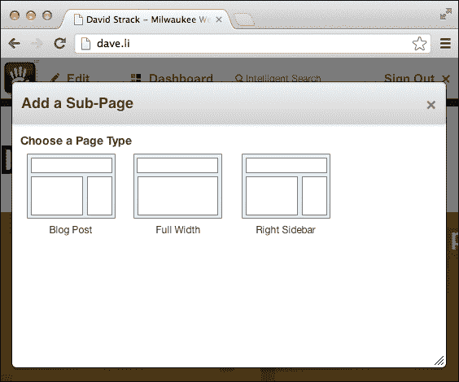
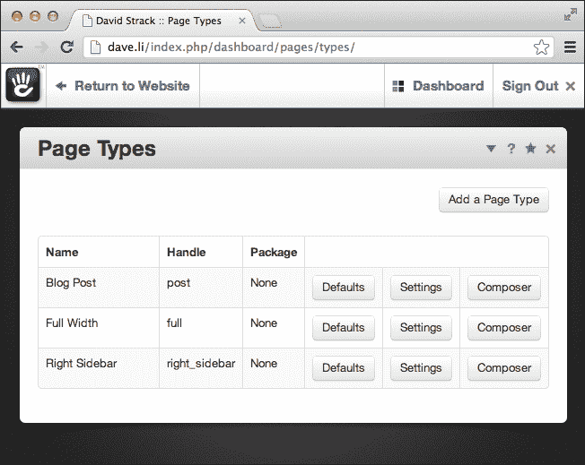
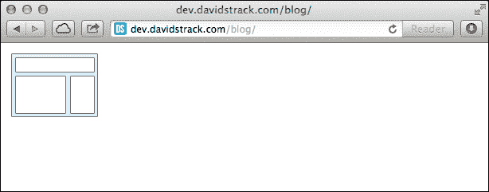
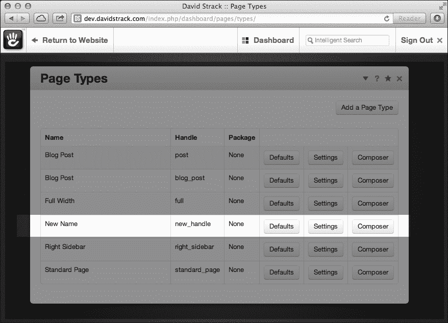
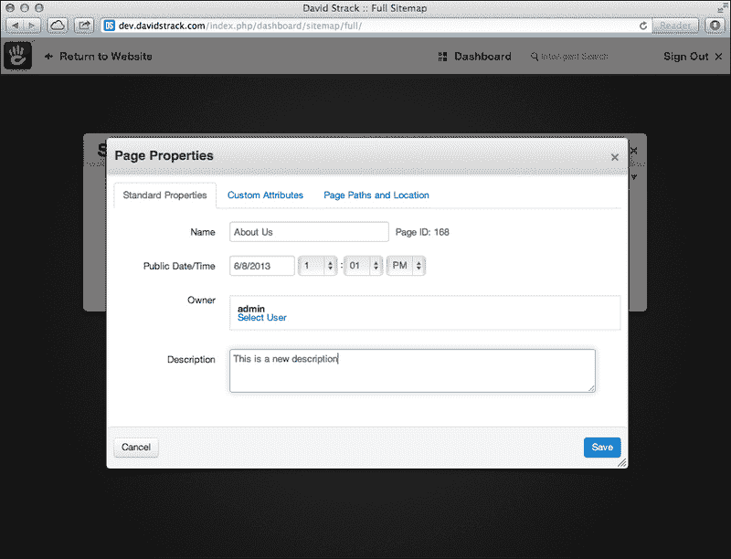

# 第一章. 页面和页面类型

在本章中，我们将涵盖以下主题：

+   获取当前页面对象

+   通过 ID 获取页面对象

+   通过路径获取页面对象

+   通过 ID 获取页面类型

+   通过句柄获取页面类型

+   获取页面类型的 ID

+   获取页面类型的名称

+   获取页面类型的句柄

+   获取页面类型的图标

+   获取属于页面类型的页面列表

+   创建页面类型

+   更新页面类型

+   删除页面类型

+   创建页面类型

+   更新现有页面

+   设置页面属性

+   获取页面属性

+   获取页面的 ID

+   获取页面的路径

+   获取页面的句柄

+   获取页面的名称

+   获取页面的描述

+   获取页面页面的 ID

+   获取页面页面的句柄

+   获取页面的主题对象

+   获取页面下的子页面

+   移动页面

+   删除页面（及其子页面）

+   获取页面列表

+   将页面选择字段添加到表单中

# 简介

几乎任何内容管理系统都围绕着页面的概念。**concrete5**页面包含可重用的内容部分，称为**块**。块可以包含您自己输入的格式化文本内容，到照片幻灯片，到视频，到您开发的包含特殊功能的自定义表单。concrete5 页面是内部`Collection`对象的扩展，其名称来源于它包含构成页面的块集合。

由于网站上的页面通常包含重复的信息区域（可能是一个带有一些持久小部件的侧边栏），concrete5 包括页面类型的概念。页面类型允许您为在 concrete5 中创建新页面定义不同的模板。它们用于指定添加到该类型新页面上的默认块集、内容和特殊属性，以及通过 concrete5 网站创建不同的视觉布局。

一个常见的页面类型是**左侧边栏**，它包含侧边栏中的链接列表，以及一个在右侧添加内容块的区域。标准的 concrete5 安装默认包含一些页面类型，包括左侧边栏和全宽。在代码中，页面类型可以通过数据库中唯一的数值 ID 或更常见的人类可读标识符（称为**句柄**）来引用。例如，左侧边栏页面类型将有一个句柄`left_sidebar`。



当通过用户界面向 concrete5 网站添加页面时，你可能会注意到第一步是选择页面类型。页面类型也由 concrete5 的 Composer 功能使用，这可以帮助创建同一类型的多个页面（如博客文章）。

concrete5 中有两种页面类型，第一种是标准页面，它会被添加到网站地图中并分配一个页面类型，第二种是**单页**，它处理方式略有不同，不会分配页面类型。本章将处理第一种类型的页面。

## 关于本章代码的说明

通常，您将在 concrete5 应用程序的块、控制器或模型中编写与页面和页面类型交互的代码。为了演示目的，您可以将代码放置在 concrete5 允许您执行任意 PHP 代码的任何位置。

一个很好的做法是将`site_process.php`或`site_post.php`文件添加到您网站的根目录`/config`中。concrete5 将在所有核心类和库加载完毕后执行该文件中的所有代码（`site_post`在当前页面加载之前执行，`site_process`在当前页面设置之后执行）。我们将使用经典的 PHP 调试技术来验证我们的代码是否正常工作。通常，我们将使用 PHP 的`var_dump`或`print_r`函数来导出一个变量的内容，然后跟一个`exit`命令。

由于本书中使用的调试技术可能会中断 concrete5 网站的常规功能，建议您在 concrete5 的开发副本上执行这些练习。

完成后，请确保注释掉或删除调试代码，以恢复您 concrete5 网站的正常功能。

# 创建一个自定义调试函数

为了帮助变量导出，我们可以创建一个简单的调试函数，该函数将我们的输出包裹在`<pre>`标签中，并自动为我们`exit`。

将以下代码放置在`/config/site_post.php`的顶部（如果不存在，则创建该文件）：

```php
function my_debug($var) {
  echo '<pre>';
  print_r($var);
  echo '</pre>';
  exit;
}
```

### 小贴士

**下载示例代码**

您可以从您在[`www.packtpub.com`](http://www.packtpub.com)的账户中下载所有已购买 Packt 书籍的示例代码文件。如果您在其他地方购买了这本书，您可以访问[`www.packtpub.com/support`](http://www.packtpub.com/support)并注册，以便将文件直接通过电子邮件发送给您。

现在，当我们希望检查一个变量或其他对象的内容时，我们可以简单地调用`my_debug($variable)`，并得到一个格式良好、易于阅读的响应。

当然，您完全可以使用自己的调试变量技术。

# 获取当前 Page 对象

对于 concrete5 开发者来说，从当前显示的页面中检索信息是一个非常常见的任务。您会遇到这种情况，无论是需要更新当前页面的某些信息（如页面标题），检查当前用户在此页面的权限，还是仅显示页面标题。幸运的是，这相当简单。

## 如何做到这一点...

获取当前`Page`对象的步骤如下：

1.  如果不存在，创建`/config/site_process.php`。

1.  在你偏好的文本编辑器中打开`/config/site_process.php`。

1.  我们可以通过调用`Page`类的`getCurrentPage`静态函数来获取当前的`Page`对象。

    ```php
    $currentPage = Page::getCurrentPage();
    ```

1.  如果我们检查`$currentPage`变量的内容，我们可以看到它是一个`Page`对象，现在我们可以对它执行进一步的操作。在这个例子中，我们使用在章节介绍中创建的自定义调试函数。

    ```php
    my_debug($currentPage);
    ```

## 它是如何工作的...

在`Page`类上调用静态的`getCurrentPage`函数将会在 concrete5 的`Request`对象中查找当前页面。如果未设置，concrete5 将使用全局变量`$c`。注意使用`site_process.php`来输出当前页面变量。我们使用这个文件是因为它在 concrete5 设置当前`Page`对象之后被读取。使用`site_post.php`会导致返回一个空对象。

## 还有更多...

你可能已经注意到，有时开发者会在他们的代码中使用全局变量`$c`来获取当前的`Collection`或`Page`对象。这通常工作得很好，但最佳实践是使用`getCurrentPage`函数来为你处理这个问题。

## 参见

+   通过 ID 获取页面对象的配方

+   通过路径获取页面对象的配方

# 通过 ID 获取页面对象

在许多情况下，你需要使用数据库中页面的唯一数字 ID 来加载`Page`对象。如前所述，页面实际上是`Collection`对象的扩展，所以你实际上是通过集合 ID 来加载页面的。

## 准备工作

我们需要知道你试图加载的页面的数字 ID。通常这个 ID 会存储在其他对象中，可能甚至是你存储在数据库中的自定义实体。例如，假设你在数据库中有一个食谱表，每个食谱在 concrete5 网站上都有自己的页面。你为每个食谱存储页面 ID，这样你就可以在需要时加载相关的`Page`对象。

## 如何做到这一点...

首先，你必须获取你试图加载的`Page`对象的页面 ID。在这个例子中，我们将直接硬编码我们正在加载的页面 ID。步骤如下：

1.  在你喜欢的代码编辑器中打开`/config/site_post.php`。

1.  首先，让我们将我们正在加载的页面 ID 存储到一个变量中。在实际应用中，你可能会在数据库表中存储这个 ID，或者从你运行的其他代码中获取。在 concrete5 中，主页的 ID 默认为`1`，所以我们将使用这个 ID 作为我们页面的 ID：

    ```php
    $pageId = 1; // load the home page
    ```

1.  现在我们已经得到了需要加载的页面 ID，使用`getByID`函数来获取所需的`Page`对象：

    ```php
    $page = Page::getByID($pageId);
    ```

1.  我们可以检查`$page`变量并验证它是否包含一个`Page`对象。

    ```php
    my_debug($page);
    ```

## 它是如何工作的...

页面 ID（也称为集合 ID）在数据库中是唯一的，所以调用`getByID`函数将加载正确的页面数据并返回一个你可以与之交互的`Page`对象。

## 参见

+   获取当前页面对象的配方

+   *通过路径获取页面对象* 的配方

# 通过路径获取页面对象

concrete5 也支持通过在网页浏览器中显示的路径来加载 `Page` 对象。这是一种方便的加载页面方式，而无需知道它们的数字 ID。在这个练习中，我们将通过路径加载一个关于我们的页面。

## 准备工作

我们将加载路径为 `/about-us` 的页面。如果此页面在您的 concrete5 网站中不存在，请在尝试此练习之前将其添加到网站地图中。

## 如何操作...

使用静态函数 `getByPath`，我们可以轻松获取 `Page` 对象，而无需知道其 ID。步骤如下：

1.  在您的代码编辑器中打开 `/config/site-post.php` 文件。

1.  声明您要加载的页面的路径。

    ```php
    $path = '/about-us';
    ```

1.  我们可以通过传递路径字符串到 `getByPath` 函数来加载位于 `http://example.com/about-us` 的页面。

    ```php
    $aboutPage = Page::getByPath($path);
    ```

1.  为了确保我们获取了正确的页面，我们将输出 `$aboutPage` 变量以验证我们有一个完全加载的 `Page` 对象。我们将使用我们在章节介绍中创建的自定义调试函数。

    ```php
    my_debug($aboutPage);
    ```

## 它是如何工作的...

concrete5 将查询数据库以获取分配了指定路径的页面。在通过路径加载页面时，您需要明智地判断，因为该数据可以通过 concrete5 界面轻松更改。想象一下，您正在为一个有 15 个编辑者的网站工作，任何一位编辑者都有权编辑页面的路径。concrete5 默认会在更改新路径时保存旧页面路径，但这不是必需的。在您的自定义应用程序中硬编码页面路径仅应在适当的情况下使用。在可能的情况下，通过 ID 加载页面是一个更好的主意，因为该 ID 不会更改。

## 更多内容...

您可以使用此技术加载网站上的任何页面。要加载位于我们刚刚加载的“关于”页面之下的“职业”页面，您会编写以下内容：

```php
$careersPage = Page::getByPath('/about-us/careers');
```

您应该知道，concrete5 会缓存与每个路径相关的页面 ID，所以如果您在使用此功能时遇到意外结果，请确保通过访问 concrete5 网站的 `/dashboard/system/optimization/clear_cache/` 来清除您的网站缓存。

## 相关内容

+   *获取当前页面对象* 的配方

+   *通过 ID 获取页面对象* 的配方

# 通过 ID 获取页面类型

在 concrete5 开发中创建和编辑页面时，您不可避免地需要加载将被分配给页面的所需页面类型对象。请注意，页面类型实际上是代码中 `CollectionType` 对象的实例。为了保持一致性，我们将在代码之外继续将它们称为页面类型。

## 准备工作

我们将继续在 `/config/site-post.php` 文件中执行这些示例，因为这是一个快速且易于运行任意代码的地方。我们还将继续使用我们在章节介绍中定义的自定义 `my_debug` 函数。

在这个菜谱中，我们将加载 ID 为`4`的页面类型。请确保此页面类型存在于您的 concrete5 实例中，否则将 ID 更改为适合您环境的内容。

## 如何做...

与加载页面类似，您需要在`CollectionType`类上调用一个静态函数。步骤如下：

1.  打开文本编辑器中的`/config/site_post.php`。

1.  首先，我们需要知道页面类型的数字 ID。在这种情况下，我们将假设存在一个名为“Left Sidebar”的页面类型，并且它具有数字 ID `4`。

    ```php
    $leftSidebarId = 4;
    ```

1.  既然我们已经有了我们想要加载的页面类型的 ID，我们可以调用`CollectionType`类的`getByID`函数。

    ```php
    $leftSidebarPageType = CollectionType::getByID($leftSidebarId);
    ```

1.  我们可以通过检查`$leftSidebarPageType`变量并验证它是否是`CollectionType`类的实例来验证我们是否加载了正确的页面类型。

    ```php
    my_debug($leftSidebarPageType);
    ```

## 它是如何工作的...

`getByID`函数执行一个简单的数据库查询以找到属于该 ID 的页面类型。在成功查找时返回一个`CollectionType`对象。

## 参见

+   通过句柄获取页面类型的菜谱

# 通过句柄获取页面类型

如章节介绍中所述，页面类型也有人类可读的句柄，这为在不了解它们的数字 ID 的情况下加载页面类型提供了一个方便的方法。句柄总是由单词之间带有下划线的字母数字字符串组成，不包含任何文件扩展名，如`.php`。例如，名为“Left Sidebar”的页面类型的句柄很可能是`left_sidebar`，但 concrete5 允许用户为句柄指定任何字母数字字符串，因此 Left Sidebar 的句柄也可能是`left`。



您可以通过访问 concrete5 仪表板的**页面类型**区域来找到页面类型的句柄，该区域位于您的 concrete5 网站上的`/dashboard/pages/types/`。

## 准备工作

在这个菜谱中，我们将加载句柄为`left_sidebar`的页面类型。请确保该页面类型存在于您的 concrete5 安装中，否则您可以添加一个新的页面类型并使用该句柄，或者调整菜谱以适应您的环境。

## 如何做...

这是我们如何通过句柄`left_sidebar`加载页面类型的方法。这与通过路径加载页面类似。步骤如下：

1.  在您的首选代码编辑器中打开`/config/site_post.php`。

1.  声明您要加载的页面类型的句柄。

    ```php
    $handle = 'left_sidebar';
    ```

1.  使用我们刚刚定义的句柄加载页面类型。

    ```php
    $pageType = CollectionType::getByHandle($handle);
    ```

1.  您可以通过输出`$pageType`变量来验证您是否已加载页面类型。

    ```php
    my_debug($pageType);
    ```

## 它是如何工作的...

执行一个简单的数据库查询，如果成功，将返回一个`CollectionType`对象。

## 更多内容...

就像加载页面路径时的警告一样，当通过处理器加载页面类型时，您也需要进行相同的良好判断。由于这些处理器只是可以通过 concrete5 界面编辑的字符串，您需要确保您编写的代码不会因为网站编辑更改页面类型的处理器而损坏。

## 相关内容

+   *通过 ID 获取页面类型*配方

# 获取页面类型的 ID

一旦页面类型被加载，我们可以从中获取不同的信息。有时，如果页面类型是通过其处理器加载的，或者是从另一个函数调用中提供的，开发者将需要从现有的页面类型对象中获取页面类型的 ID。在这个练习中，我们将通过处理器加载页面类型，然后找出页面类型的 ID。

## 准备工作

在这个例子中，我们将加载一个处理器为`right_sidebar`的页面类型。如果该页面类型在您的 concrete5 系统中不存在，请根据您的具体情况调整此配方。

## 如何操作...

获取页面类型 ID 的步骤如下：

1.  在您的代码编辑器中打开`/config/site_post.php`。

1.  通过路径加载页面类型：

    ```php
    $pageType = CollectionType::getByHandle('right_sidebar');
    ```

1.  从页面类型获取 ID。

    ```php
    $id = $pageType->getCollectionTypeId();
    ```

1.  输出页面类型 ID（我们使用本章引言中解释的自定义调试器）。

    ```php
    my_debug($id);
    ```

## 工作原理...

一旦页面类型对象被加载，开发者可以调用多个函数来从其中检索数据，包括数字 ID。

## 相关内容

+   *通过处理器获取页面类型*配方

# 获取页面类型的名称

页面类型对象还包含检索页面类型名称的方法。在这个练习中，我们将通过处理器加载页面类型，然后检索页面类型的名称。

## 准备工作

我们将加载一个具有`right_sidebar`处理器的页面类型，所以如果该页面类型在您的 concrete5 实例中不存在，请根据您的需求调整此配方。

## 如何操作...

获取页面类型名称的步骤如下：

1.  在您首选的代码编辑器中打开`/config/site_post.php`。

1.  通过处理器加载页面类型：

    ```php
    $pageType = CollectionType::getByHandle('right_sidebar');
    ```

1.  获取页面类型的名称。

    ```php
    $name = $pageType->getCollectionTypeName();
    ```

1.  使用我们的自定义调试器输出名称。

    ```php
    my_debug($name);
    ```

## 工作原理...

`getCollectionTypeName`函数简单地返回页面类型名称的字符串值。

## 相关内容

+   *通过处理器获取页面类型*配方

# 获取页面类型的处理器

如果页面类型已经通过其 ID 加载或以其他方式提供，开发者可能希望从现有的页面类型对象中检索页面类型的处理器。在这个例子中，我们将加载一个 ID 为`4`的页面类型，并使用 concrete5 API 获取其处理器。

## 准备工作

我们将加载一个 ID 为 4 的页面类型，所以请确保它在您的 concrete5 网站上存在。您可以根据您的 concrete5 实例更改此配方中的 ID 为适当的值。

## 如何操作...

获取页面类型处理器的步骤如下：

1.  在您首选的代码编辑器中打开`/config/site_post.php`。

1.  通过 ID 加载页面类型。

    ```php
    $pageType = CollectionType::getByID(4);
    ```

1.  获取页面类型的处理程序。

    ```php
    $handle = $pageType->getCollectionTypeHandle();
    ```

1.  使用我们的自定义调试函数输出处理程序。

    ```php
    my_debug($handle);
    ```

## 它是如何工作的...

页面类型对象的`getCollectionTypeHandle`函数返回页面类型的处理程序字符串。

## 参见

+   通过 ID 获取页面类型的配方

# 获取页面类型的图标

在 concrete5 仪表板界面中，页面类型与图标相关联。在某些高级应用中，您可能希望检索页面类型的图标。在这个配方中，我们将通过处理程序加载页面类型并获取其图标。

## 准备工作

我们将加载一个处理程序为`right_sidebar`的页面类型。如果`right_sidebar`不存在，请随意将其更改为适合您的 concrete5 实例的适当处理程序。

## 如何操作...

获取页面图标步骤如下：

1.  在您最喜欢的代码编辑器中打开`/config/site_post.php`，因为这是一个尝试随机代码的好地方。

1.  通过路径加载页面类型。

    ```php
    $pageType = CollectionType::getByHandle('right_sidebar');
    ```

1.  获取图标图像。

    ```php
    $icon = $pageType->getCollectionTypeIconImage();
    ```

1.  输出图像。您应该看到图标图像出现。

    ```php
    echo $icon;
    exit;
    ```

    

## 它是如何工作的...

concrete5 返回一个包含集合类型图标的实际 HTML 图像标签的字符串。

## 更多内容...

如果您想获取包含页面类型图标的文件的数字 ID，您可以简单地调用此函数：

```php
$iconId = $pageType->getCollectionTypeIcon();
```

数字 ID 在处理 concrete5 文件管理器时很有用，这在本书第三章（第三章。文件和文件集）中详细讨论。

## 参见

+   通过 ID 获取页面类型的配方

# 获取属于页面类型的页面列表

在许多高级 concrete5 应用中，开发者可能需要找到属于给定页面类型的所有页面的列表。在这个例子中，我们将获取具有`right_sidebar`处理程序的页面类型的页面数组。

## 准备工作

如果您的 concrete5 实例没有名为`right_sidebar`的页面类型，请随意调整配方以满足您的需求。我们将继续使用`/config/site_post.php`作为我们的沙盒来运行随机代码片段，以及我们在本章引言中创建的自定义调试函数。

## 如何操作...

获取属于页面类型的页面列表的步骤如下：

1.  在您的代码编辑器中打开`/config/site_post.php`以尝试以下代码。

1.  通过处理程序加载页面类型。

    ```php
    $pageType = CollectionType::getByHandle('right_sidebar');
    ```

1.  获取`Page`对象数组。

    ```php
    $pages = $pageType->getPages();
    ```

1.  输出数组以查看其内容。

    ```php
    foreach ($pages as $page) {
      echo $page->getCollectionTitle().'<br />';
    }
    exit;
    ```

## 它是如何工作的...

concrete5 简单地使用关系型 MySQL 数据库来查找与页面类型相关的所有页面。请注意，当调用此函数时，concrete5 会忽略权限设置，因此这实际上仅应用于内部目的。

## 参见

+   通过处理程序获取页面类型的配方

# 创建页面类型

您可以通过 concrete5 用户界面轻松添加新的页面类型，但有些情况可能需要您使用 PHP 代码动态创建页面类型。

## 准备工作

首先，你需要创建一个包含你正在创建的页面类型数据的关联数组。

数组可以包含以下字段：

| 属性 | 是否必需？ | 描述 |
| --- | --- | --- |
| `ctHandle` | 是 | 集合类型处理程序：单词之间用下划线分隔的字母数字字符串。 |
| `ctName` | 是 | 集合类型名称：将在 concrete5 界面中显示的字符串。 |
| `ctIcon` | 否 | 如果你想要为此页面类型指定一个图标，请传递来自文件管理器的图标数值 ID。 |
| `ctIsInternal` | 否 | 一个布尔值，表示此页面类型是否为内部页面类型。内部页面类型不会在 concrete5 界面的页面创建对话框中显示。 |
| `akID` | 否 | 要添加到新页面类型中的属性键 ID 数组。 |

## 如何操作...

我们将只使用所需的字段：`ctHandle` 和 `ctName` 来创建页面类型。步骤如下：

1.  在你喜欢的代码编辑器中打开 `/config/site_post.php`。

1.  声明要创建的新页面类型的处理程序。

    ```php
    $handle = 'page_type_handle';
    ```

1.  声明包含 `ctHandle` 和 `ctName` 字段数据的数组。

    ```php
    $data = array(
      'ctHandle' => $handle,
      'ctName' => 'Page Type Name'
    );
    ```

1.  通过加载新的处理程序来检查页面类型是否已存在。

    ```php
    $pageType = CollectionType::getByHandle($handle);
    ```

1.  如果页面类型不存在，则创建它。

    ```php
    if (!$pageType) {
      $newPageType = CollectionType::add($data);
    }
    ```

1.  如果它存在，将现有页面类型分配给新页面类型变量。

    ```php
    else {
      $newPageType = $pageType;
    }
    ```

1.  输出新页面类型变量以确保它已成功。

    ```php
    my_debug($newPageType);
    ```

## 它是如何工作的...

concrete5 将会接收你传递的数据数组，并使用它来在数据库中创建一个新的 `CollectionType` 记录。concrete5 还会自动在数据库中生成一个主集合页面。主集合是一个模板页面，concrete5 将将其用作该类型所有页面的基础。任何分配给主集合的块、属性或其他数据将自动添加到使用该页面类型创建的任何新页面中。

## 更多...

如果你在一个自定义包中创建此页面类型，你需要将你的包对象传递给 `add()` 函数，这样 concrete5 就知道此页面类型属于你的包。这样，当用户卸载你的包时，他们将有选择删除它创建的所有页面类型的选项。

假设你知道你的包的处理程序，使用以下代码来创建一个带有它的页面类型：

```php
$data = array(
  'ctHandle' => $handle,
  'ctName' => 'Page Type Name'
);
$pkg = Package::getByHandle('my_package');
$newPageType = CollectionType::add($data, $pkg);
```

## 参见

+   *创建自定义插件包* 的配方

+   *更新页面类型* 的配方

# 更新页面类型

更新页面类型与之前配方中讨论的创建页面类型非常相似。

## 如何操作...

首先，你需要加载一个现有的页面类型。在更新页面类型时，你需要传递与创建时相同的数据数组。步骤如下：

1.  在你的代码编辑器中打开 `/config/site_post.php`。

1.  声明旧处理程序和新处理程序变量。

    ```php
    $handle = 'page_type_handle';
    $newHandle = 'new_handle';
    ```

1.  使用新的处理程序和新的名称定义新的 `$data` 数组。

    ```php
    $data = array(
      'ctHandle' => $newHandle,
      'ctName' => 'New Name'
    );
    ```

1.  如果页面类型存在，则更新它。

    ```php
    $pageType = CollectionType::getByHandle($handle);
    if ($pageType) {
      $pageType->update($data);
    }
    ```

1.  通过访问 concrete5 网站的 `/dashboard/pages/types` 来验证页面类型是否已更新。

## 它是如何工作的...

concrete5 将更新数据库中加载的页面类型的记录。当调用此函数时，主收藏页面不会被更新。您也不能将包装对象传递给更新函数，因为这只有在首次创建页面类型时才是必要的。

## 相关链接

+   *创建页面类型* 的食谱

+   *删除页面类型* 的食谱

# 删除页面类型

除了添加和编辑页面类型外，您还可以删除它们。

## 准备工作

由于删除页面类型是一个破坏性的不可逆操作，因此为这次练习创建一个句柄为 `delete_me` 的虚拟页面类型是个好主意。我们还将继续使用 `site_post.php` 来执行任意代码。

## 如何操作...

删除页面类型的步骤如下：

1.  在您偏好的代码编辑器中打开 `/config/site_post.php`。

1.  定义要删除的页面的句柄。

    ```php
    $handle = 'delete_me';
    ```

1.  通过其句柄加载页面类型。

    ```php
    $pageType = CollectionType::getByHandle($handle);
    ```

1.  现在，删除页面类型。

    ```php
    $pageType->delete();
    ```

## 它是如何工作的...

`delete()` 函数删除页面类型、主收藏以及所有使用它的页面。请谨慎使用此函数，因为一旦数据被删除，就无法恢复（除非您有网站的数据库备份副本）。

## 相关链接

+   *通过 ID 获取页面类型* 的食谱

# 创建页面类型

动态创建页面是 concrete5 开发的一个核心概念，并且可以在自定义应用程序中解锁许多强大的功能。想象一个拥有食谱数据库的 concrete5 网站。您可以使其每次将食谱添加到数据库时，都会在网站地图中添加一个新的食谱页面，从而立即提高您网站的内容深度、可用性，甚至搜索引擎性能。

在这个例子中，我们将创建一个“关于我们”页面并将其添加到网站地图中。

## 准备工作

我们继续将代码放在 `/config/site_post.php` 中进行演示和测试。在实际应用中，您的动态页面创建将在控制器文件或附加包中发生。

我们将分配一个具有句柄 `right_sidebar` 的新页面类型。如果这在您的 concrete5 安装中不存在，请根据您的需求调整此食谱。

## 如何操作...

创建页面的步骤如下：

1.  在您的代码编辑器中打开 `/config/site_post.php`。

1.  加载新页面将使用的页面类型。我们将使用句柄（在这种情况下为 `right_sidebar`）加载页面类型。

    ```php
    $pageType = CollectionType::getByHandle('right_sidebar');
    ```

1.  创建一个包含您希望为新页面指定的字段的关联数组。在这个例子中，我们只指定页面的名称和句柄。

    ```php
    $data = array(
      'cName' => 'About Us',
      'cHandle' => 'about'
    );
    ```

1.  加载新页面将放置其下的父页面。在这种情况下，我们正在加载主页，因为新页面将在顶级可用。

    ```php
    $parent = Page::getByID(1);
    ```

1.  通过将`$pageType`对象和`$data`数组传递给父`Page`类的`add()`函数来添加页面。

    ```php
    $newPage = $parent->add($pageType, $data);
    ```

1.  输出消息并退出进程。

    ```php
    echo 'done!';
    exit;
    ```

1.  访问你的网站主页以执行`site_post.php`中的代码。

1.  如果你看到成功消息，请注释掉`site_post.php`中的代码，这样你就可以访问新创建的页面。否则，每次将网站加载到浏览器中时，concrete5 都会创建一个新页面。

1.  访问新创建的页面`http://example.com/about`。

## 它是如何工作的...

`add()`函数是`Collection`类`add()`函数的包装器。调用它将在数据库中创建一个新的`Collection`记录，并创建一个新的待批准的`CollectionVersion`记录（如果`cvIsApproved`变量设置为`true`或留空，则将予以批准）。然后新页面将继承必要的权限，并从相关页面类型的 Master Collection 中获取所有块和其他属性。

## 还有更多...

你需要向`add()`函数提供两个参数，一个`CollectionType`对象（我们在本章前面已经使用过），以及包含创建页面所需所有数据的关联数组。关联数组可以包含以下字段。

| 属性 | 是否必需 | 描述 |
| --- | --- | --- |
| `cName` | 是 | 这是页面的名称。这将是整个网站中引用页面的方式，并且将自动用于页面的`<title>`标签（除非被元标题属性覆盖，你可以在页面创建后指定。） |
| `cHandle` | 否 | 这是页面的处理程序，即页面标题将如何在页面 URL 中显示。如果你省略此字段，concrete5 将根据`cName`字段生成一个处理程序。这有点令人困惑，因为 concrete5 允许在页面处理程序中使用破折号（"-"），但似乎在其他地方不支持它们。不过，这很好，因为网页路径的典型约定是使用破折号而不是下划线。 |
| `cDescription` | 否 | 这是页面的内部描述。它只是一个描述页面目的的字符串。一些主题可能会在主题的某个地方使用这些数据，但这不是必需的。concrete5 的旧版本会在仪表板中显示页面的描述，但自更新到 5.5 版本后，这一功能已经取消。 |
| `uID` | 否 | 这是一个整数 ID，用于表示页面的作者。将任何用户在 concrete5 的`Users`表中的 ID 传递进去，可以将该用户设置为页面作者。如果省略，则当前登录用户将被注册为页面作者。 |
| `pkgID` | 否 | 这是创建此页面的包的整数 ID。如果你是从包中创建页面，请确保包含此字段。如果你省略了此字段，但附加的页面类型属于一个包，则页面类型的包 ID 将附加到该页面上。这将帮助用户在卸载你的包时可选地删除由你的包创建的任何页面。 |
| `cDatePublic` | 否 | 这是页面应在网站上公开可见的 MySQL 格式日期字符串（`YYYY-MM-DD`）。如果省略，则使用来自 Web 服务器的当前日期和时间。 |
| `cvIsApproved` | 否 | 这是一个布尔值，表示初始页面版本是否应该被批准。如果没有指定，默认为 true。当页面被批准时，它们将立即对所有有权访问该页面的网站用户可见。对页面的任何后续编辑都需要在用户可以看到更改之前批准页面的新版本。 |

## 参考以下内容

+   更新现有页面的配方

+   通过 ID 获取页面类型的配方

+   通过句柄获取页面类型的配方

# 更新现有页面

更新页面与创建页面类似，你必须首先传递一个包含你希望在页面上更新的所有数据的关联数组。

## 准备工作

在这个配方中，我们将修改路径为`/about`的页面。我们在上一个配方中创建了该页面，但如果它在你系统中不存在，请根据你的需求调整代码。

## 如何做到这一点...

在此示例中，我们将更新`About`页面的名称。步骤如下：

1.  首先，我们需要通过其路径加载`Page`对象。

    ```php
    $page = Page::getByPath('/about');
    ```

1.  创建一个包含你希望更新的数据的关联数组。

    ```php
    $data = array(
      'cName' => 'About Our Company'
    );
    ```

1.  将数据数组传递给`$page`对象的`update`函数。

    ```php
    $page->update($data);
    ```

1.  输出成功消息并退出进程。

    ```php
    echo 'done!';
    exit;
    ```

## 它是如何工作的...

`update`函数更新数据库中必要的表以包含新指定的信息。concrete5 还将重新扫描此页面及其所有相关页面路径的所有权限。当函数完成后，将触发`on_page_update`事件，你可以编写自定义代码来监听并在页面更新时执行自定义操作。监听系统事件将在后面的章节中介绍。

## 还有更多...

就像创建页面一样，你需要传递一个关联数组到`update()`函数以更新现有页面。你可以使用上一个配方中指定的所有字段来添加页面，以及这些其他可选字段。

| 属性 | 描述 |
| --- | --- |
| `ctID` | 这是更改页面类型的页面类型的数值 ID。提供此字段以更改给定页面的页面类型。 |
| `cCacheFullPageContent` | 一个布尔值，指定页面是否应支持完整页面缓存（某些块类型不支持完整页面缓存，因此仅在页面上提供的块支持完整缓存支持时使用）。 |
| `cCacheFullPageContentOverrideLifetime` | 一个字符串，告诉 concrete5 缓存寿命应该如何执行。可能的值是 `default`、`custom` 或 `forever`。 |
| `cCacheFullPageContentLifetimeCustom` | 当覆盖模式设置为 `custom` 时，缓存应持续多长时间的分钟设置。 |

## 相关内容

+   *创建页面类型* 食谱

# 设置页面属性

页面，像 concrete5 中的大多数对象一样，可以附加任何类型的自定义属性。这提供了极大的灵活性，但使用原始 SQL 读写这些属性可能很困难。concrete5 API 使设置和读取页面属性变得简单。

## 准备工作

您至少需要知道要分配给页面的属性键句柄。一个常见的设置属性是 `Meta Title` 属性，它更新出现在 HTML `<title>` 标签中的文本。

## 如何操作...

在本例中，我们将设置 `Meta Title` 属性到关于我们页面。步骤如下：

1.  在您首选的代码编辑器中打开 `/config/site_post.php`。

1.  加载您希望设置属性的 `Page` 对象。

    ```php
    $page = Page::getByPath('/about');
    ```

1.  在 `$page` 对象上调用 `setAttribute` 函数，传入两个参数：属性句柄（键）和值。

    ```php
    $page->setAttribute('meta_title', 'New Page Meta Title');
    ```

1.  输出成功消息并退出进程。

    ```php
    echo 'done!';
    exit;
    ```

## 工作原理...

`setAttribute` 函数是 `Collection` 类的一个成员，该类由 `Page` 类扩展。它要求您提供两个参数，一个属性键（可以是表示属性键句柄的字符串（我们在这里提供），或者实际的 `AttributeKey` 对象），以及值。

## 更多内容...

`setAttribute` 函数对于设置任何类型的页面属性数据非常方便。可以更新页面的元信息（如描述、关键词和标题），还可以为页面提供各种选项，例如，将其排除在导航之外（如之前所见）或从搜索引擎查找的 `sitemap.xml` 文件中。

您可以更新 concrete5 系统中安装的任何属性。要查看所有可用的页面属性或创建新的属性，请访问您网站仪表板的 **页面属性** 区域（位于 `/dashboard/pages/attributes/`）。

## 相关内容

+   *通过路径获取页面* 食谱

+   *获取页面属性* 食谱

# 获取页面属性

除了能够设置页面属性外，开发者还可以轻松检索属性。在本练习中，我们将获取关于页面的 `Meta Title` 属性。

## 准备工作

在本食谱中，我们假设存在一个路径为 `/about` 的页面。如果该页面不存在，您可以创建它，或者修改本食谱中的代码以适应您的环境。

## 如何操作...

获取页面属性的步骤如下：

1.  在您首选的编辑器中打开 `/config/site_post.php`。这是一个运行一些任意代码的好地方。

1.  加载 `Page` 对象。

    ```php
    $page = Page::getByPath('/about');
    ```

1.  获取 `meta_title` 属性。

    ```php
    $title = $page->getAttribute('meta_title');
    ```

1.  使用我们在章节介绍中创建的自定义调试函数输出变量。

    ```php
    my_debug($title);
    ```

## ...工作原理...

concrete5 使用属性处理字符串来在数据库中找到相应的记录并返回其值。concrete5 以 EAV 格式（**实体**、**属性**、**值**）存储属性，这使得直接使用 SQL 查询读取这些值变得困难。concrete5 API 简化了这一过程，方便开发者使用。

## 相关内容

+   **通过路径获取页面**的教程

+   **设置页面属性**的教程

# 获取页面 ID

开发者通常会需要知道页面的 ID，尤其是在将页面与其他数据库对象（如博客文章或日历事件）相关联时。在本例中，我们将加载我们一直在处理的`/about`页面，并获取其 ID。

## 准备工作

请确保在您的 concrete5 实例中存在`/about`页面。如果该页面不存在，您可以自由修改本教程中的代码。

## 如何操作...

获取页面 ID 的步骤如下：

1.  在您的代码编辑器中打开`/config/site_post.php`。

1.  通过路径加载`Page`对象。

    ```php
    $page = Page::getByPath('/about');
    ```

1.  获取页面的 ID。

    ```php
    $id = $page->getCollectionId();
    ```

1.  将`$id`变量的内容输出，以查看 ID 是什么。

    ```php
    my_debug($id);
    ```

## 相关内容

+   **通过路径获取页面**的教程

# 获取页面的路径

除了能够获取页面的 ID 之外，开发者还可以检索页面的路径。在本教程中，我们将通过页面的 ID 来加载页面，然后检索其路径。

## 如何操作...

获取页面路径的步骤如下：

1.  在您首选的代码编辑器中打开`/config/site_post.php`。

1.  通过 ID 加载页面。这里我们将使用`4`的 ID，它应该属于仪表板上的一个页面。

    ```php
    $page = Page::getByID(4);
    ```

1.  获取页面的路径。

    ```php
    $path = $page->getCollectionPath();
    ```

1.  使用自定义调试函数输出路径。

    ```php
    my_debug($path);
    ```

## 相关内容

+   **通过 ID 获取页面**的教程

# 获取页面的处理程序

页面，就像页面类型和其他 concrete5 中的对象一样，除了路径外还有处理程序。处理程序在其他内容管理系统中的 slug 类似。在本练习中，我们将通过 ID 加载页面，然后检索其处理程序。

## 如何操作...

获取页面处理程序的步骤如下：

1.  在您的代码编辑器中打开`/config/site_post.php`。

1.  通过 ID 加载页面。

    ```php
    $page = Page::getByID(4);
    ```

1.  获取页面的处理程序。

    ```php
    $handle = $page->getCollectionHandle();
    ```

1.  输出处理程序变量以查看其内容。

    ```php
    my_debug($handle);
    ```

## 相关内容

+   **通过 ID 获取页面**的教程

# 获取页面的名称

页面名称通常在 concrete5 中用作事实上的标题。在本练习中，我们将通过路径加载页面，然后获取其名称。

## 如何操作...

获取页面名称的步骤如下：

1.  在您的代码编辑器中打开`/config/site_post.php`。

1.  通过路径加载页面。

    ```php
    $page = Page::getByPath('/about');
    ```

1.  获取页面的标题。

    ```php
    $name = $page->getCollectionName();
    ```

1.  输出标题变量的内容。

    ```php
    my_debug($name);
    ```

## 相关内容

+   **通过路径获取页面**的教程

# 获取页面的描述

页面描述在 concrete5 中并不广泛使用。一些主题会将它们视为内容摘录，而其他插件会将描述用作通用属性存储区域。无论如何，它们仍然内置在 concrete5 中，在这个配方中，我们将通过路径加载页面并检索其描述。

## 准备工作

concrete5 中的许多页面都没有描述。如果您愿意，可以编辑页面以添加描述，如下面的截图所示：



## 如何操作...

获取页面描述的步骤如下：

1.  在您的代码编辑器中打开`/config/site_post.php`文件。

1.  通过路径加载页面。

    ```php
    $page = Page::getByPath('/about');
    ```

1.  获取页面的描述。

    ```php
    $description = $page->getCollectionDescription();
    ```

1.  输出描述变量的内容。

    ```php
    my_debug($description);
    ```

## 参见

+   *通过路径获取页面* 的配方

# 获取页面页面类型 ID

如我们在本章前面所讨论的，页面被分配了一个页面类型。在这个配方中，我们将从`Page`对象中获取页面类型 ID。

## 如何操作...

获取页面页面类型 ID 的步骤如下：

1.  在您的代码编辑器中打开`/config/site_post.php`，以便我们可以运行一些任意代码。

1.  通过路径加载页面。

    ```php
    $page = Page::getByPath('/about');
    ```

1.  获取此页面的页面类型 ID。

    ```php
    $pageTypeId = $page->getCollectionTypeID();
    ```

1.  使用我们的自定义调试函数输出页面类型 ID。

    ```php
    my_debug($pageTypeId);
    ```

## 参见

+   *通过路径获取页面* 的配方

# 获取页面页面类型句柄

除了能够检索页面页面类型的 ID 之外，开发者还可以获取句柄。

## 如何操作...

获取页面页面类型句柄的步骤如下：

1.  在您的代码编辑器中打开`/config/site_post.php`，因为我们只是要运行一些任意代码。

1.  通过路径加载页面。

    ```php
    $page = Page::getByPath('/about');
    ```

1.  获取页面类型句柄。

    ```php
    $handle = $page->getCollectionTypeHandle();
    ```

1.  输出句柄变量以查看其内容。

    ```php
    my_debug($handle);
    ```

## 参见

+   *通过路径获取页面* 的配方

# 获取页面主题对象

在 concrete5 中，每个页面都可以有自己的独立主题。虽然对于大多数网站来说，只使用一个全局主题是典型的，但 concrete5 确实允许开发者为每个页面设置独立主题。在这个配方中，我们将获取页面的主题对象，这可以用来查看给定页面上激活的主题。

## 如何操作...

获取页面主题对象的步骤如下：

1.  在您首选的代码编辑器中打开`/config/site_post.php`。

1.  通过路径加载页面。

    ```php
    $page = Page::getByPath('/about');
    ```

1.  获取主题对象。

    ```php
    $theme = $page->getCollectionThemeObject();
    ```

1.  输出主题对象以检查其类。

    ```php
    my_debug($theme);
    ```

## 参见

+   *通过路径获取页面* 的配方

# 获取页面下方的子页面

如果您需要访问页面的子项，您可以要求 concrete5 返回一个数字 ID 数组。然后，可以使用这些 ID 分别加载每个`Page`对象。

## 如何操作...

获取页面下方子页面的步骤如下：

1.  在您首选的代码编辑器中打开`/config/site_post.php`。

1.  通过 ID 加载父页面。

    ```php
    $page = Page::getByID(1);
    ```

1.  获取子 ID 数组。

    ```php
    $children = $page->getCollectionChildrenArray();
    ```

1.  遍历子 ID 数组并输出每个页面的名称。

    ```php
    foreach ($children as $childId) {
      $child = Page::getByID($childId);
      echo $child->getCollectionName().'<br />';
    }
    ```

1.  退出进程。

    ```php
    exit;
    ```

## 工作原理...

concrete5 将为父页面下的每个页面返回一个数字 ID 数组。在这个例子中，我们加载了主页，所以结果应该是网站上每个页面的列表。这个函数忽略权限，如果有很多页面要加载，可能会对数据库造成压力。使用`PageList`类遍历页面会更好，这个类在本章后面会进行描述。

# 移动页面

concrete5 的网站地图是一个管理网站页面层次结构的强大工具。它允许你安排页面的顺序，甚至可以将页面拖放到网站的不同区域。幸运的是，你不仅限于使用图形界面来移动页面。你还可以在你的自定义 concrete5 应用程序中动态地重新排列页面。

## 准备工作

在这个例子中，我们将把职业页面移动到“关于我们”页面之下。在我们能够移动页面之前，我们需要有新父页面的`Page`对象，我们将把当前页面移动到这个新父页面。

这个练习假设在你的 concrete5 网站上存在`/about`和`/careers`这两个页面。你可以通过 concrete5 界面创建这些页面，或者修改这个配方中的代码以适应你自己的网站。

## 如何做到...

移动页面的步骤如下：

1.  打开`/config/site_post.php`，因为那是一个安全的地方来尝试一些随机的代码。

1.  首先，加载“关于我们”页面，这是职业页面将要移动到的位置。

    ```php
    $newParent = Page::getByPath('/about');
    ```

1.  现在，我们需要加载我们要移动的职业页面。

    ```php
    $careersPage = Page::getByPath('/careers');
    ```

1.  最后，在职业页面上调用`move`函数，传递新父页面和一个可选的布尔值，告诉 concrete5 我们是否希望同时保存旧页面路径和新页面路径。

    ```php
    $careersPage->move($newParent, true);
    ```

## 它是如何工作的...

移动函数非常容易使用。你只需要提供一个参数，即你将页面移动到其下的新父页面的`Page`对象。还有一个可选的第二个参数，表示你是否希望保留旧页面路径以及当前路径。该参数默认为 false。

页面移动后，它将继承新父页面的权限（如果页面没有明确设置自己的权限）。

页面移动后，将触发`on_page_move`事件。

## 参见

+   在第九章中*监听系统事件*，*系统事件和高级配置*

+   通过路径获取页面对象的配方

# 删除页面（及其子页面）

concrete5 还使得从网站地图中删除页面变得容易。

## 准备工作

删除页面是一个永久性的破坏性操作。在尝试这段代码时，创建一个路径为`/delete-me`的虚拟页面会是一个好主意。

## 如何做到...

我们将永久删除“关于我们”页面及其所有子页面。步骤如下：

1.  首先，加载你想要删除的页面。我们将删除一个虚拟页面。

    ```php
    $page = Page::getByPath('/delete-me');
    ```

1.  在`Page`对象上调用`delete()`函数。

    ```php
    $page->delete();
    ```

## 它是如何工作的...

concrete5 在实际删除之前将触发 `on_page_delete` 事件。事件触发后，页面（及其所有子页面）将从数据库中删除。此操作是永久的，因此确保您只在确定不再需要页面时删除页面非常重要。

## 更多...

如果您不想永久删除页面，可以将它移动到回收站。截至 concrete5 版本 5.5，页面可以被“临时”删除并移动到称为回收站的特殊内部页面。

```php
$page->moveToTrash();
```

## 参考信息

+   通过路径获取页面的菜谱

# 获取页面列表

许多应用程序将需要获取页面列表并在列表上执行各种过滤和排序函数。为此，存在 `PageList` 类，它公开了许多方便的辅助函数，以帮助处理大量页面列表。

## 准备工作

在此示例中，我们将查找 `/blog` 页面下的所有页面。这是页面列表模型的一个常见用途。`PageList` 类不是由 concrete5 自动加载的，因此我们需要使用 `Loader` 类来使其对我们可用。

如果您的网站没有位于 `/blog` 的页面，创建该页面以及其下的几个子页面将很有帮助。否则，请随意根据您的需求调整此菜谱中的代码。

## 如何做...

在此菜谱中，我们将获取 `/blog` 在网站地图下存在的 20 个页面列表。步骤如下：

1.  首先，我们必须使 `PageList` 类对我们可用。

    ```php
    Loader::model('page_list');
    ```

1.  创建 `PageList` 类的新实例。我们将将其分配给一个名为 `$list` 的变量。

    ```php
    $list = new PageList();
    ```

1.  过滤列表，只包括 `/blog` 页面下的页面。

    ```php
    $list->filterByPath('/blog');
    ```

1.  限制页面列表，只包括前 20 个结果。

    ```php
    $list->setItemsPerPage(20);
    ```

1.  执行数据库查询并获取第一个“页面”的结果，这将返回一个包含 20 个 `Page` 对象的数组。

    ```php
    $pages = $list->getPage();
    ```

1.  将页面变量的内容输出以查看数组。

    ```php
    foreach ($pages as $page) {
      echo $page->getCollectionTitle().'<br />';
    }
    exit;
    ```

## 它是如何工作的...

`PageList` 类扩展了核心的 `DatabaseItemList` 类，该类本身就有许多有用的函数。`get()` 函数接受两个参数，即要检索的记录数和偏移量。

## 更多...

页面列表类实现了“魔法方法”，这允许我们通过任何页面属性来过滤列表。我们只需创建一个基于属性处理程序驼峰式命名的函数名，并在其前加上“filterBy”。因此，要过滤所有具有 `exclude_nav` 属性的页面，我们会编写以下函数：

```php
$list->filterByExcludeNav(true);
```

或者，如果您只想获取前 99 个 `Page` 对象的数组并忽略分页，请使用 `get()` 函数。

```php
$pages = $list->get(99);
```

自从 5.5 版本以来，concrete5 使用 Twitter 的开源 Bootstrap CSS 框架来处理许多内部样式。你可以通过打印/输出以下函数的结果（最好在视图或模板文件中使用此函数）来获取格式良好的 HTML（带有相关的 Bootstrap CSS 类）的分页控件：

```php
echo $list->displayPagingV2();
```

`DatabaseItemList` 类和 `PageList` 类有多个函数，使得处理页面集合变得更容易。你可以通过关键字、集合类型、父页面以及任何属性使用魔法方法进行筛选。我们将在 第五章 中进一步介绍 `DatabaseItemList` 类，*与数据库和模型一起工作*。

# 在表单中添加页面选择器字段

在表单中添加页面选择器字段很容易。当点击时，网站地图将在模态窗口中显示，允许轻松浏览和选择页面。这允许用户友好的自定义应用程序，可以允许用户将页面附加到任何类型的自定义对象，例如博客文章或烹饪食谱。

## 准备工作

我们需要使用 `FormPageSelectorHelper` 类，我们需要使用 `Loader` 库来加载它。

此配方需要写入你网站中的某个 HTML 表单内。我们为此创建了一个基本的单页，可以从本书的网站上下载代码。要安装单页，将此配方的代码复制到你的 concrete5 网站目录中，并访问 `/dashboard/pages/single`。添加一个路径为 `/example` 的新单页。

## 如何做到...

concrete5 包含一个生成显示网站地图选择器小部件所需的必要 JavaScript 和 HTML 文本的辅助工具。我们将使用 `Loader` 类来包含并返回 `PageSelectorHelper` 类，然后它将返回我们需要的整个 HTML。步骤如下：

1.  使 `pageSelector` 辅助类可供我们使用。当辅助工具被加载时，`Loader` 类将自动实例化并返回实例化的辅助对象。

    ```php
    $pageSelector = Loader::helper('form/page_selector');
    ```

1.  输出所需的 HTML 和 JavaScript，以便用户可以选择一个页面。

    ```php
    echo $pageSelector->selectPage('page_id');
    ```

## 它是如何工作的...

`selectPage` 函数返回生成页面选择器字段所需的 HTML 和 JavaScript。只需要一个参数，即表示字段名称的字符串。concrete5 将在表单中添加一个隐藏的 `<input>` 元素，允许从 POST 请求中读取选定的页面 ID。

在这个例子中，一旦表单提交，你可以通过查看 `$_POST` 超全局变量来检索选定的页面 ID。

```php
$pageId = $_POST['page_id'];
```

## 还有更多...

你可以在可选的第二个参数中指定页面 ID，这将用现有页面填充页面选择器。

```php
$page = Page::getByCollectionPath('/about-us');
echo $pageSelector->selectPage('page_id', $page->getCollectionID());
```

`pageSelector` 辅助工具还有一个函数可以在模态窗口中显示网站地图。

```php
$args = array(
'display_mode' => 'full'
);
$pageSelector->sitemap($args);
```

注意，`sitemap()` 函数加载一个元素，该元素会自动打印到屏幕上，因此不需要回显或打印结果。
