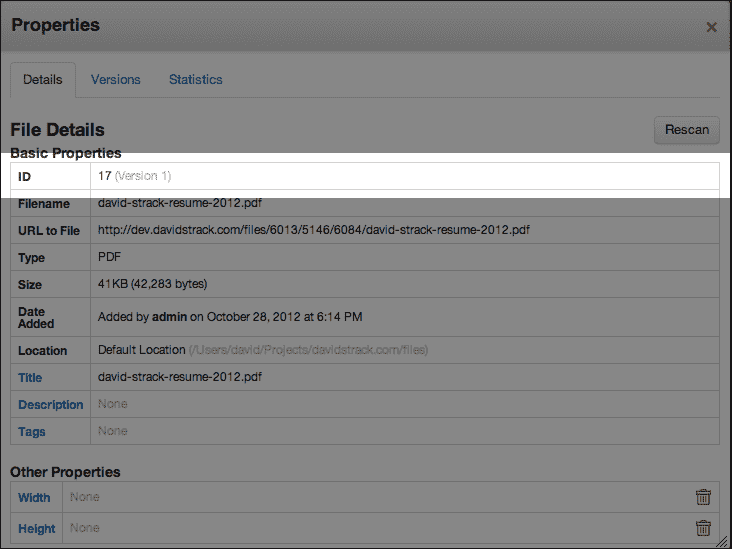

# 第三章。文件和文件集

在本章中，我们将涵盖以下内容：

+   通过 ID 加载文件

+   获取文件的路径

+   获取文件列表

+   将文件上传到文件管理器

+   通过 ID 加载文件集

+   将文件添加到文件集中

+   从文件集中移除文件

+   检查文件是否属于文件集

+   获取文件集中的所有文件

+   复制文件

+   删除文件

+   重新索引文件的搜索属性

+   在文件对象上设置密码

+   在文件上设置权限

+   获取文件的下载 URL

+   获取文件的下载统计信息

+   在表单中添加文件选择器

# 简介

除了强大的内容编辑功能外，**concrete5** 还附带了一个强大的工具来管理网站上的静态文件，称为 **文件管理器**。文件管理器是您可以存储任何类型的静态文档的地方，包括图片、视频、PDF、文档和音频文件。文件管理器允许您创建文件的下载链接，将图片嵌入到网站内容中，等等。您甚至可以分配文件管理器内文件的权限，以便在决定用户可以下载哪些文件时拥有更大的控制权。

通过 concrete5 接口处理文件是一种乐趣，但有时你可能希望将文件管理器的强大功能集成到你自己构建在 concrete5 中的自定义应用程序中。在本章中，我们将展示如何与文件交互、上传新文件，甚至将新文件上传到文件管理器。

## 关于本章代码的说明

本章中展示的大部分代码几乎可以在 concrete5 应用程序的任何地方使用。由于我们只是将要尝试简单的代码片段，所以在沙盒区域进行实验是有意义的。在 concrete5 中有几个地方适合这样做，但我们将使用 `/config/site_post.php` 来测试我们的代码。

在每个菜谱之后删除 `site_post.php` 中的任何实验性和任意代码是个好主意，这样您的网站就为下一个练习做好了准备。

此外，我们有时还需要转储变量的内容。每个 PHP 开发者都有自己的方式来做这件事，但本章我们将使用自定义的调试函数。您可能已经从 第一章，*页面和页面类型* 中认出了这个函数。我们在这里将继续使用它，因为它使得输出易于阅读，并在开发过程中节省了一些时间。

将以下 PHP 函数放置在 `/config/site_post.php` 的顶部：

```php
function my_debug($var) {
   echo '<pre>';
   print_r($var);
   echo '</pre>';
   exit;
}
```

现在，我们可以通过调用 `my_debug($variableName)` 来转储变量内容，并看到变量内容的格式化输出。您可以使用 `print_r` 或 `var_dump` 作为替代。

在 `site_post.php` 中放置调试代码对于实验和尝试 concrete5 API 非常好，但它会干扰 concrete5 网站的正常操作。建议在本章中执行的所有菜谱都在 concrete5 的测试副本上执行。

# 通过文件 ID 加载文件

对于大多数 concrete5 开发者来说，最常见的文件交互是加载文件并与它们交互。为此，我们必须通过 ID 加载文件。此配方中的代码可以放置在你需要加载文件并检索或修改其属性的地方。

## 准备工作

我们需要知道我们正在加载的文件的 ID。在这个配方中，我们将加载 ID 为`17`的文件。如果你的 concrete5 网站没有 ID 为`17`的文件，请上传一个新的文件到文件管理器，并将此配方中的**ID**更改为与新上传文件的**ID**相匹配。你可以通过访问文件管理器，点击一个文件，并选择**属性**来获取文件的**ID**。



## 如何操作...

查看以下步骤：

1.  在你的代码编辑器中打开`/config/site_post.php`，或者将此代码放置在你自己的应用程序中适当的位置。

1.  声明要加载的文件的 ID，并确保将其设置为对你系统相关的内容：

    ```php
    $fileId = 17;
    ```

1.  加载文件：

    ```php
    $file = File::getByID($fileId);
    ```

1.  输出文件变量的内容：

    ```php
    my_debug($file);
    ```

## 它是如何工作的...

concrete5 将使用此函数根据你传入的数字 ID 从数据库中加载相关文件。静态`getByID`函数将返回一个完全加载的`file`对象，你可以进一步操作。

# 获取文件的路径

一旦你加载了`文件`对象，你可以调用多种不同的方法，以获取与该文件相关联的所有不同属性。其中最常见且重要的属性是文件的路径。

## 准备工作

在这个配方中，我们将获取一个文件的路径，并使用它来显示存储在文件管理器中的图像。

再次强调，我们将引用 ID 为`1`的图像。请确保将此配方中的代码修改为加载你 concrete5 安装中实际存在的图像。

## 如何操作...

查看以下步骤：

1.  在你的编辑器中打开`/config/site_post.php`。

1.  声明要加载的文件的 ID：

    ```php
    $fileId = 1;
    ```

1.  通过文件 ID 加载文件：

    ```php
    $file = File::getByID($fileId);
    ```

1.  获取文件的路径：

    ```php
    $path = $file->getRelativePath();
    ```

1.  将路径输出到屏幕：

    ```php
    echo $path;
    exit;
    ```

## 它是如何工作的...

文件管理器通过 concrete5 网站将文件存储在多个位置，通常位于`files/`文件夹下，该文件夹被分割成几个由整数组成的机器可读文件夹。由于这些路径难以定期确定和预测，文件对象 API 允许我们通过简单的函数调用获取这些路径。

## 更多...

如果你正在使用 PHP 的`fopen`函数处理图像，你需要文件的实际绝对路径。为此，你将使用`getPath`函数：

```php
$fullPath = $file->getPath();
```

## 相关内容

+   通过文件 ID 加载文件的方法

# 获取文件列表

许多时候，你需要一次性获取多个文件。例如，如果你正在构建一个相册，你将想要获取要在相册中显示的文件列表。

在这个菜谱中，我们将获取文件管理器中存储的前一百个图像的列表，并输出它们的文件路径。

## 准备工作

这个菜谱假设 concrete5 的文件管理器中至少存储了一个图像。请确保您的 concrete5 版本中至少存储了一个或多个图像。

## 如何操作...

1.  在您偏好的代码编辑器中打开 `/config/site_post.php`。

1.  加载文件列表模型：

    ```php
    Loader::model('file_list');
    ```

1.  创建 `FileList` 类的新实例：

    ```php
    $list = new FileList();
    ```

1.  过滤列表以仅显示图像：

    ```php
    $list->filterByType(FileType::T_IMAGE);
    ```

1.  获取图像数组。

    ```php
    $images = $list->get();
    ```

1.  遍历图像数组并输出每个图像的路径。

    ```php
    foreach ($images as $img) {
       echo $img->getRelativePath().'<br />';
    }
    exit;
    ```

## 工作原理...

与在 concrete5 中列出页面和其他对象类似，我们加载了一个扩展核心 `DatabaseItemList` 类的 `FileList` 对象。这为我们提供了一种面向对象的方式来过滤、搜索和检索文件数组。

我们调用了 `get()` 函数来返回文件管理器中找到的图像。

## 更多内容...

concrete5 在 `FileType` 类中存储了一些文件类型常量，您可以在 `concrete/libraries/file/types.php` 中查看。以下常量可用于根据不同的文件类型进行过滤：

+   `FileType::T_APPLICATION`

+   `FileType::T_AUDIO`

+   `FileType::T_DOCUMENT`

+   `FileType::T_IMAGE`

+   `FileType::T_TEXT`

+   `FileType::T_UNKNOWN`

+   `FileType::T_VIDEO`

`FileList` 类上提供了许多函数来搜索和过滤文件列表。以下是一些您可以使用的更多函数：

+   通过文件扩展名过滤列表（不要在扩展名参数中提供点）：

    ```php
    $list->filterByExtension('mp3');
    ```

+   通过关键词短语过滤列表（通过文件标题、文件名和一些其他属性进行搜索）：

    ```php
    $list->filterByKeywords('guacamole');
    ```

对于 `FileList` 类，还有一些更具体的过滤器可用。您可以通过浏览 `FileList` 类的源代码或查看在线 concrete5 开发者文档 [`www.concrete5.org/documentation/developers/files/searching-and/`](http://www.concrete5.org/documentation/developers/files/searching-and/) 来深入了解这些过滤器函数。

## 参见

+   *获取文件集中的所有文件* 的菜谱

# 将文件上传到文件管理器

有时您可能需要在文件管理器中存储用户提供的文件，或者可能想要将服务器上现有的文件迁移到文件管理器。在处理用户生成内容时，您总会遇到明显的安全问题，但有许多合法的理由想要通过编程方式将文件添加到文件管理器中。

## 准备工作

这个菜谱要求我们创建一个基本的 HTML 表单，其中包含文件上传输入。我们将 HTML 表单放置在位于 `/single_pages/upload.php` 的单个页面上。确保通过访问 `/dashboard/pages/single` 并添加一个路径为 `/upload` 的新页面来安装单页。

由于这个菜谱稍微复杂一些，因此查看本书网站上这一章的免费代码下载可能很有用。

我们还将使用我们在章节介绍中讨论的自定义调试函数。

## 如何操作...

请看以下步骤：

1.  在 `/single_pages/upload.php` 创建一个新的单页。

1.  通过访问 `/dashboard/pages/single` 并输入路径 `/upload` 将单页添加到 concrete5 网站。

1.  在 `upload.php` 文件中创建一个基本的 HTML 表单，包含文件输入：

    ```php
    <form method="POST" enctype="multipart/form-data">
       File to upload: <input type="file" name="example_file"><br />
       <input type="hidden" name="file_upload" value="yes">
       <input type="submit" value="Upload!">
    </form>
    ```

1.  如果不存在，请创建 `/config/site_process.php`。

1.  在 `site_process.php` 中，检查是否有文件已上传：

    ```php
    if ($_POST['file_upload'] == 'yes') {
    }
    ```

1.  在 `if` 语句内部，加载 `FileImporter` 库：

    ```php
    Loader::library('file/importer');
    ```

1.  然后，创建 `FileImporter` 类的新实例：

    ```php
    $importer = new FileImporter();
    ```

1.  从 `$_FILES` 超全局变量中获取上传的文件：

    ```php
    $file = $_FILES['example_file'];
    ```

1.  获取文件名：

    ```php
    $name = $file['name'];
    ```

1.  获取文件的当前临时位置：

    ```php
    $path = $file['tmp_name'];
    ```

1.  将文件添加到文件管理器：

    ```php
    $newFile = $importer->import($path, $name);
    ```

1.  如果 `$newFile` 是一个整数，concrete5 遇到了错误。输出错误信息：

    ```php
    if (is_numeric($newFile)) {
       die(FileImporter::getErrorMessage($newFile));  
    }
    ```

1.  否则，文件上传成功。

1.  访问网站的文件管理器 `/dashboard/files/search/` 以查看新上传的文件。

## 工作原理...

`FileImporter` 类接受上传文件的临时路径（从 `$_FILES` 超全局变量中获取）和文件名。然后，文件被添加到文件管理器，在整个 concrete5 网站上都可以使用。

## 参见

+   *将文件选择器添加到表单* 的配方

# 通过 ID 加载文件集

concrete5 允许您将文件分组到集合中。一些开发者认为文件集类似于在您的计算机上使用文件夹，只不过一个文件可以同时属于多个集合（或没有任何集合），因此一个更恰当的描述可能是，这些是文件类别。

文件集非常适合组织 concrete5 网站上用于不同目的的文件。例如，您可能有一个用于主页幻灯片的文件集，同时还有一个用于员工照片的文件集，还有一个用于内部文件。

在本配方中，我们将使用其数字 ID 加载文件集。

## 准备工作

在本节中，我们假设存在一个 ID 为 `1` 的文件集。请根据您的 concrete5 环境调整本配方中的代码。

## 如何操作...

我们将假设我们想要加载一个 ID 为 `1` 的文件集。请看以下步骤：

1.  首先，确保您知道要加载的文件集的 ID：

    ```php
    $id = 1;
    ```

1.  加载文件集：

    ```php
    $fileSet = FileSet::getByID($id);
    ```

1.  如果您愿意，可以通过输出 `$fileSet` 变量来验证文件集是否正确加载：

    ```php
    my_debug($fileSet);
    ```

## 工作原理...

concrete5 将查询数据库以找到具有您提供的 ID 的文件集。一旦找到合适的记录，它将返回一个 `FileSet` 对象，您可以与之交互。

## 更多...

您还可以通过提供它们的名称来检索文件集，如下面的代码片段所示：

```php
$fileSet = FileSet::getByName('File Set Name');
```

## 参见

+   *将文件添加到文件集* 的配方

+   *获取文件列表* 的配方

# 将文件添加到文件集

与文件集一起工作的一个有用方面是能够使用 PHP 代码将文件添加到指定的集合中。幸运的是，这是一个非常简单的任务。

## 准备工作

您需要知道您要添加的文件 ID，或者已经加载了 `File` 对象。本菜谱将假设存在一个 ID 为`1`的文件和一个 ID 也为`1`的文件集。

## 如何操作...

以下是一些步骤：

1.  在您的代码编辑器中打开 `/config/site_post.php`。

1.  声明要加载的文件 ID。

    ```php
    $fileId = 1;
    ```

1.  声明要加载的文件集 ID：

    ```php
    $fileSetId = 1;
    ```

1.  通过其 ID 加载文件：

    ```php
    $file = File::getByID($fileId);
    ```

1.  通过其 ID 加载文件集：

    ```php
    $fileSet = FileSet::getByID($fileSetId);
    ```

1.  将文件添加到文件集：

    ```php
    $fileSetFile = $fileSet->addFileToSet($file);
    ```

1.  输出结果 `FileSetFile` 对象：

    ```php
    my_debug($fileSetFile);
    ```

## 它是如何工作的...

concrete5 将在完成后将文件与文件集之间创建关联，并返回一个 `FileSetFile` 对象。

## 更多内容...

或者，如果您不想加载文件对象，只需提供您要添加的文件 ID。请查看以下代码片段：

```php
$fileSet = FileSet::getByID($filesetID);
$filesetFile = $fileSet->addFileToSet($fileId);
```

## 相关内容

+   *从文件集中删除文件* 菜单

+   *检查文件是否属于文件集* 菜单

# 从文件集中删除文件

除了能够将文件添加到文件集外，开发者还可以从他们的文件集中删除文件。

## 准备工作

在本菜谱中，我们将再次假设存在一个 ID 为`1`的文件，以及一个 ID 也为`1`的文件集。请确保根据您的 concrete5 实例调整代码。

## 如何操作...

以下是一些步骤：

1.  在您的代码编辑器中打开 `/config/site_post.php`，以便我们可以玩一些任意代码。

1.  声明文件 ID：

    ```php
    $fileId = 1;
    ```

1.  声明文件集 ID：

    ```php
    $fileSetId = 1;
    ```

1.  通过其 ID 加载文件：

    ```php
    $file = File::getByID($fileId);
    ```

1.  通过其 ID 加载文件集：

    ```php
    $fileSet = FileSet::getByID($fileSetId);
    ```

1.  从文件集中删除文件：

    ```php
    $fileSet->removeFileFromSet($file);
    ```

## 它是如何工作的...

concrete5 简单地破坏了文件与文件集之间的关系。

## 相关内容

+   *将文件添加到文件集* 菜单

+   *检查文件是否属于文件集* 菜单

# 检查文件是否属于文件集

开发者有时可能想知道一个文件是否是某个特定文件集的成员。在本菜谱中，我们将加载一个文件，加载一个文件集，然后找出该文件是否是给定文件集的成员。

## 准备工作

如往常一样，在本菜谱中，我们将假设存在一个文件和一个文件集。我们将使用文件和文件集的 ID `1`，所以请确保对代码进行必要的调整，以便在您的 concrete5 系统中运行。

## 如何操作...

以下是一些步骤：

1.  打开 `/config/site_post.php` 并清除任何现有代码。

1.  声明要加载的文件 ID：

    ```php
    $fileId = 1;
    ```

1.  声明我们将要处理的文件集 ID：

    ```php
    $fileSetId = 1;
    ```

1.  通过其 ID 加载文件：

    ```php
    $file = File::getByID($fileId);
    ```

1.  通过其 ID 加载文件集：

    ```php
    $fileSet = FileSet::getByID($fileSetId);
    ```

1.  如果文件是文件集的成员，输出一条 `yes` 消息：

    ```php
    if ($file->inFileSet($fileSet)) {
       echo 'yes!';
    }
    ```

1.  如果文件不是集的成员，输出 `no`：

    ```php
    else {
       echo 'no';
    }
    ```

## 它是如何工作的...

concrete5 将执行查询数据库的繁重工作，以确定文件是否是给定集的成员。

## 相关内容

+   *将文件添加到文件集* 菜单

+   *从文件集中删除文件* 菜单

# 获取文件集中的所有文件

现在我们知道了如何加载文件集并将文件添加到其中，我们可以学习如何从文件集中获取所有文件。我们将使用 `FileList` 类，这是我们在此章中较早描述过的。

## 准备工作

我们将继续假设在 concrete5 中至少安装了一个文件和一个文件集，它们的 ID 都是 `1`。请根据您的需求调整此配方中的变量。

## 如何操作...

请查看以下步骤：

1.  在您的代码编辑器中打开 `/config/site_post.php`，移除其中可能存在的任何现有代码。

1.  加载 `FileList` 模型：

    ```php
    Loader::model('file_list');
    ```

1.  创建 `FileList` 模型的新实例：

    ```php
    $list = new FileList();
    ```

1.  声明要过滤的文件集的 ID：

    ```php
    $fileSetId = 1;
    ```

1.  加载文件集：

    ```php
    $fileSet = FileSet::getByID($fileSetId);
    ```

1.  通过加载的文件集过滤列表：

    ```php
    $list->filterBySet($fileSet);
    ```

1.  获取文件集中的文件数组：

    ```php
    $files = $list->get();
    ```

1.  遍历数组，将每个文件的路径打印到屏幕上：

    ```php
    foreach ($files as $file) {
      echo $file->getRelativePath().'<br />';
    }
    exit;
    ```

1.  刷新您的网站以查看结果。

## 它是如何工作的...

在此示例中，我们只是实例化 `FileList` 类，这将公开几个用于过滤文件的方法。我们感兴趣的方法是 `filterBySet`。

我们必须传递一个 `FileSet` 对象给此函数，然后我们可以调用 `get` 函数，该函数将返回属于该文件集的文件数组。

## 参见

+   *获取文件列表的配方*

+   *通过 ID 加载文件集的配方*

# 复制文件

正如传统的文件系统一样，concrete5 允许开发人员复制文件；在此配方中，我们将通过 ID 加载一个文件，然后创建一个副本。

## 准备工作

请确保在此配方中调整文件 ID 以匹配您 concrete5 数据库中存在的 ID。

## 如何操作...

请查看以下步骤：

1.  在您首选的代码编辑器中打开 `/config/site_post.php`。

1.  声明要复制的文件的 ID：

    ```php
    $fileId = 1;
    ```

1.  通过 ID 加载文件：

    ```php
    $file = File::getByID($fileId);
    ```

1.  复制文件：

    ```php
    $newFile = $file->duplicate();
    ```

1.  使用我们在章节简介中创建的自定义调试函数，转储新副本的内容：

    ```php
    my_debug($newFile);
    ```

## 它是如何工作的...

concrete5 将创建原始文件的碳副本，并在函数完成后返回新文件。

# 删除文件

concrete5 允许开发人员通过 PHP API 删除文件。在此配方中，我们将通过 ID 加载一个文件，然后永久删除它。

## 准备工作

一旦文件被删除，就无法恢复。在此配方中尝试使用临时或虚拟文件是一个好主意，这样您就不会删除任何重要的内容。此配方将使用 `1` 作为要删除的文件的 ID，但请确保将其更改为您愿意删除的任何内容。

## 如何操作...

请查看以下步骤：

1.  在您的代码编辑器中打开 `/config/site_post.php`。

1.  声明要删除的文件的 ID：

    ```php
    $fileId = 1;
    ```

1.  通过 ID 加载文件：

    ```php
    $file = File::getByID($fileId);
    ```

1.  删除文件：

    ```php
    $file->delete();
    ```

## 它是如何工作的...

concrete5 将从您的服务器文件系统中删除文件，并从 MySQL 数据库中删除对它的引用。

# 重新索引文件的搜索属性

当以编程方式更改文件属性时，有时 concrete5 搜索引擎需要知道新的更改。在这个练习中，我们将重新索引文件的搜索属性。

## 准备工作

我们将假设在您的 concrete5 安装中存在一个 ID 为 `1` 的文件。请将本菜谱中的 ID 调整为存在的文件。

## 如何操作...

看看以下步骤：

1.  在您的代码编辑器中打开 `/config/site_post.php` 文件。

1.  声明要重新索引的文件 ID：

    ```php
    $fileId = 1;
    ```

1.  通过 ID 加载文件：

    ```php
    $file = File::getByID($fileId);
    ```

1.  重新索引搜索属性：

    ```php
    $file->reindex();
    ```

## 工作原理...

concrete5 将查询数据库并更新给定文件的搜索索引。这将确保内部搜索引擎能够根据文件最新的属性找到文件。

# 在文件对象上设置密码

concrete5 支持向单个文件添加密码，因此网站管理员可以限制只有拥有共享密码的人才能下载这些文件。

## 准备工作

本菜谱将继续假设有一个 ID 为 `1` 的文件。请确保调整此 ID 以匹配您自己的 concrete5 网站中存在的某个文件。

## 如何操作...

看看以下步骤：

1.  打开 `/config/site_post.php` 文件，以便我们有一个地方来尝试这段代码。

1.  声明文件 ID：

    ```php
    $fileId = 1;
    ```

1.  通过 ID 加载文件：

    ```php
    $file = File::getByID($fileId);
    ```

1.  声明密码：

    ```php
    $password = 'secret';
    ```

1.  在文件上设置密码：

    ```php
    $file->setPassword($password);
    ```

## 工作原理...

concrete5 将以纯文本形式将密码存储在数据库中。由于此密码打算与多个人共享，因此它本质上是不安全的。因此，concrete5 不会在数据库中对文件密码进行散列或加密。一旦设置密码，就会触发 `on_file_set_password` 事件。

## 更多内容...

可以通过在文件上调用 `getPassword` 函数来简单地检索文件的密码：

```php
$password = $file->getPassword();
```

## 相关内容

+   *通过 ID 加载文件* 菜谱

# 在文件上设置权限

在上一个菜谱中，我们讨论了如何在文件上设置共享密码。不过，有时人们希望有更健壮的安全性。为此，我们可以挂钩到 concrete5 权限模型以提供更高级的访问控制。

在本菜谱中，我们将给用户赋予文件的读取权限。

## 准备工作

此示例将假设存在一个 ID 为 `1` 的文件和一个 ID 为 `1` 的用户。根据需要调整这些 ID。

## 如何操作...

看看以下步骤：

1.  在您的代码编辑器中打开 `/config/site_post.php` 文件。

1.  声明我们将应用权限的文件 ID：

    ```php
    $fileId = 1;
    ```

1.  加载文件：

    ```php
    $file = File::getByID($fileId);
    ```

1.  声明将获得这些权限的用户 ID：

    ```php
    $userId = 1;
    ```

1.  加载用户：

    ```php
    $user = UserInfo::getByID($userId);
    ```

1.  在文件上设置权限：

    ```php
    $file->setPermissions($user, FilePermissions::PTYPE_MINE);
    ```

## 更多内容...

concrete5 使用静态常量来设置权限模式（无、我的和所有）。这些常量如下：

+   `FilePermissions::PTYPE_NONE`

+   `FilePermissions::PTYPE_MINE`

+   `FilePermissions::PTYPE_ALL`

## 相关内容

+   第七章, *与用户和权限一起工作*

# 获取文件的下载 URL

concrete5 可以通过将所有下载请求通过一个特殊 URL 来过滤，对文件执行权限控制以及跟踪下载统计数据。这也有额外的优势，即向用户计算机发送正确的 HTTP 头，强制下载。

## 准备工作

如往常一样，我们必须假设文件管理器中存在一个 ID 为`1`的文件。请随意将此 ID 更改为适合您自己网站的适当 ID。

## 如何操作...

看看以下步骤：

1.  在您喜欢的代码编辑器中打开`/config/site_post.php`。

1.  声明要加载的文件 ID：

    ```php
    $fileId = 1;
    ```

1.  加载文件：

    ```php
    $file = File::getByID($fileId);
    ```

1.  获取下载 URL：

    ```php
    $url = $file->getDownloadURL();
    ```

1.  将下载 URL 输出到屏幕：

    ```php
    echo $url;
    exit;
    ```

## 它是如何工作的...

concrete5 通过一个能够跟踪权限、下载并能够发送正确 HTTP 头部的特殊 URL 来传递下载请求。

## 参见

+   *通过 ID 加载文件*的菜谱

# 获取文件的下载统计数据

如果您使用前面菜谱中描述的下载函数提供文件服务，那么下载次数将被存储在数据库中。您只需几行代码就可以获取这些统计数据。

## 准备工作

我们将假设文件管理器中存在一个 ID 为`1`的文件。根据您自己的 concrete5 网站需要，相应地更改此变量。

## 如何操作...

看看以下步骤：

1.  在您首选的代码编辑器中打开`/config/site_post.php`。

1.  声明我们想要获取统计数据的文件 ID：

    ```php
    $fileId = 1;
    ```

1.  加载文件：

    ```php
    $file = File::getByID($fileId);
    ```

1.  获取统计数据数组：

    ```php
    $stats = $file->getDownloadStatistics(false);
    ```

1.  将数组内容导出：

    ```php
    my_debug($stats);
    ```

## 它是如何工作的...

当我们调用文件对象的`getDownloadStatistics`方法时，concrete5 默认将只返回最近的 20 次下载。通过将`false`作为参数提供，我们告诉 concrete5 返回所有结果。

# 在表单中添加文件选择器

在 concrete5 中构建应用程序时，您经常会发现自己需要在仪表板上创建**CRUD**（创建、读取、更新、删除）界面，以便网站编辑和管理员管理自定义内容。在某些情况下，您可能需要在这些后端表单上处理文件上传。在这样的表单上，提供一个用于浏览文件管理器的界面将是一个有用的工具，而不是使用标准的 HTML 文件输入。concrete5 使用资产库小部件来为我们提供这种便利。

## 准备工作

在这个菜谱中，我们将创建一个基本的 HTML 表单，该表单将发送来自文件管理器的所选文件 ID，以及表单提交。此菜谱的完整代码可以从本书的网站上下载。

## 如何操作...

看看以下步骤：

1.  在`/single_pages/upload.php`中创建一个新的单页（如果尚未存在）。

1.  如果需要，通过访问`/dashboard/pages/single`并输入`upload`作为页面路径，将单个页面添加到网站地图中。

1.  在`upload.php`中，加载资产库助手：

    ```php
    <?php $assetLibrary = Loader::helper('concrete/asset_library'); ?>
    ```

1.  创建一个输出文件选择器的 HTML 表单：

    ```php
    <form method="POST" enctype="multipart/form-data">
       <?php echo $assetLibrary->file('file_id', 'file_id', 'Select a file...') ?>
       <input type="hidden" name="file_upload" value="yes">
       <input type="submit" value="Upload the file!">
    </form>
    ```

1.  如果尚不存在，则创建 `/config/site_process.php`。

1.  检查是否有文件上传发生：

    ```php
    if ($_POST['file_upload'] == 'yes') {
    }
    ```

1.  在 `if` 语句内部，获取所选文件的文件 ID：

    ```php
    $fileId = $_POST['file_id'];
    ```

1.  将所选文件 ID 输出到屏幕：

    ```php
    echo 'You have chosen file #'.$fileId;
    exit;
    ```

## 它是如何工作的...

资产库助手将输出所有必要的 HTML 和 JavaScript，为用户提供一个优雅的模式界面，以便从文件管理器中选择文件（或上传新文件到文件管理器）。一旦用户选择了一个文件，文件 ID 将被添加到一个隐藏的输入框中，该输入框的名称与您在 `file()` 函数的第二参数中提供的名称相同。

一旦用户提交了围绕文件选择器的表单，文件 ID 将包含在 `$_POST` 数组中（在这个例子中，它将在 `$_POST['file_id']` 中），然后您可以在服务器端进行进一步存储或处理。

## 更多内容...

您还可以调出一个仅限于图像的文件管理器窗口。使用以下代码来完成此操作：

```php
<form action="save" method="POST">
  <p>Choose a file...</p>
  <?php 
    $assetLibrary = Loader::helper('concrete/asset_library'); 
    $assetLibrary->image('file_id', 'file_id', 'Select a file...');
  ?>
</form>
```

您可能会注意到这里唯一的改变是，我们不是在 `asset` `library` 类上调用 `file()`，而是调用 `image()`。这将与 `file()` 做完全相同的事情，但会将模式窗口限制为仅包含图像。

## 参见

+   *上传文件到文件管理器* 菜单
