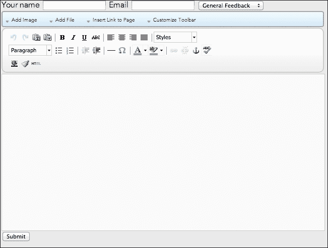

# 第四章。使用 Core 辅助工具

在本章中，我们将涵盖以下内容：

+   加载辅助类

+   使用 Date 辅助工具

+   使用 Encryption 辅助工具

+   使用 Feed 辅助工具加载 RSS 源

+   使用 File 辅助工具管理文件和目录

+   使用 Form 辅助工具创建自定义表单

+   在表单上包含 WYSIWYG 编辑器

+   使用 HTML 辅助工具生成 HTML 代码

+   使用 Image 辅助工具生成和缓存缩略图

+   使用 JSON 辅助工具进行 JSON 编码和解码

+   使用 Mail 辅助工具发送电子邮件

+   使用 MIME 辅助工具确定文件扩展名的 MIME 类型

+   使用 Navigation 辅助工具获取页面 URL 和面包屑

+   使用 Text 辅助工具处理字符串

+   使用 URL 辅助工具生成 URL

+   使用 Validation 辅助工具验证输入数据

+   使用 Captcha 辅助工具防止垃圾邮件

+   获取国家的列表

+   获取州和省的列表

+   在表单上显示颜色选择器

+   在表单上显示日期/时间选择器

+   在表单上显示评分小部件

+   使用禁止使用的单词列表

+   读取和写入系统缓存

+   将信息写入调试日志

+   读取和写入配置注册表

# 简介

在开发 concrete5 内容管理系统中的自定义应用程序的过程中，您可能会发现自己需要多次执行某些任务。例如，创建自定义表单、发送电子邮件或解析 RSS 源等任务都可以通过使用 concrete5 内置的 Core 辅助类来加速。

concrete5 中的辅助工具概念可能对之前在其他流行的 MVC 框架中工作过的开发者来说很熟悉。辅助工具是提供各种杂项、可重复功能的类，可以在代码的任何地方使用。我们将首先展示如何加载辅助类。

## 关于本章代码的说明

正如我们在前几章中所做的那样，我们将使用 `/config/site_post.php` 文件来运行一些任意代码。concrete5 没有一个很好的地方来尝试 API，所以我们将使用 `site_post` 作为我们的游乐场。在开始新的食谱之前，请确保清空任何实验性代码，并在开发服务器上执行所有这些课程。

我们将继续使用我们在第一章中创建的自定义调试函数，即“页面和页面类型”。如果您也想跟随，请将以下函数放置在 `site_post.php` 的顶部：

```php
function my_debug($var) {
   echo '<pre>';
   print_r($var);
   echo '</pre>';
   exit;
}
```

当然，您完全可以替换我们的自定义调试器，使用您喜欢的任何工具。

# 加载辅助类

concrete5 中的 `Loader` 类在加载 concrete5 中多种不同类型的文件时非常有用。我们将使用 `Loader` 类来包含和实例化 Form 辅助工具。

## 如何做到...

1.  在您的代码编辑器中打开 `/config/site_post.php`。

1.  确保你知道你想要加载的助手的 "handle"。handle 是包含助手类的文件名，不带 `.php` 扩展名。由于我们想要加载存在于 `/concrete/helpers/form.php` 的表单助手，因此 handle 将是 `form`：

    ```php
    $handle = 'form';
    ```

1.  使用 handle 加载助手：

    ```php
    $formHelper = Loader::helper($handle);
    ```

1.  让我们通过输出 `$formHelper` 变量的内容来检查助手是否正确加载：

    ```php
    my_debug($formHelper);
    ```

## 它是如何工作的...

`Loader` 类包含 PHP 脚本，使其可用于使用。此外，当加载助手时，包含的文件也将被实例化并返回，使其立即可用于你的代码中。

## 更多...

如果你需要加载一个包含在附加包中的助手，只需在加载助手时提供一个包处理程序作为第二个参数：

```php
$helper = Loader::helper($handle, $packageHandle);
```

# 使用日期助手

使用日期助手可以简化许多与日期相关的任务。我们将探讨使用日期助手来协助处理自定义代码中的日期的几种方法。

## 准备工作

在本菜谱中，我们将探索日期助手的一些功能。

## 如何操作...

1.  在你的编辑器中打开 `/config/site_post.php`。

1.  加载日期助手：

    ```php
    $date = Loader::helper('date');
    ```

1.  获取用户的时间：

    ```php
    $userTime = $date->getLocalDateTime();
    ```

1.  获取系统时间：

    ```php
    $systemTime = $date->getSystemDateTime();
    ```

1.  获取时区数组：

    ```php
    $timezones = $date->getTimezones();
    ```

1.  将这些值输出到屏幕上：

    ```php
    echo 'User time: ' . $userTime . '<br />';
    echo 'System time: ' . $systemTime . '<br />';
    my_debug($timezones);
    ```

## 它是如何工作的...

concrete5 通过包装 PHP 和 Zend 框架的函数来创建单行任务，这些任务通常需要几行代码。

# 使用加密助手

concrete5 使得开发者可以使用包含的加密助手轻松地对字符串进行加密和解密。在本菜谱中，我们将使用加密助手来加密和解密一些字符串。

## 准备工作

大多数 Web 服务器都内置了它，但确保你的 Web 服务器已安装 `mcrypt` 非常重要，因为它是此助手正常工作所必需的。

## 如何操作...

1.  在你的代码编辑器中打开 `/config/site_post.php`。

1.  加载助手：

    ```php
    $eh = Loader::helper('encryption');
    ```

1.  加密基本字符串：

    ```php
    $encrypted = $eh->encrypt('hello');
    ```

1.  输出加密的字符串：

    ```php
    echo $encrypted . '<br />';
    ```

1.  解密加密的字符串：

    ```php
    $decrypted = $eh->decrypt($encrypted);
    ```

1.  输出解密后的字符串：

    ```php
    echo $decrypted;
    exit;
    ```

## 它是如何工作的...

加密助手包装 `mcrypt` PHP 扩展，并将加密文本编码为 Base64 编码的字符串。

## 参见

+   *加载助手类* 菜谱

# 使用 Feed 助手加载 RSS 源

concrete5 随附一个名为 `SimplePie` 的第三方库，该库有助于解析 RSS 源。Feed 助手围绕 `SimplePie` 库提供了一种更方便的加载 RSS 源的方法。

## 如何操作...

1.  加载 Feed 助手：

    ```php
    $rss = Loader::helper('feed');
    ```

1.  定义要加载的 RSS 源的 URL。我们将加载 Packt Publishing 的新闻源：

    ```php
    $url = 'http://www.packtpub.com/rss.xml';
    ```

1.  加载源：

    ```php
    $feed = $rss->load($url);
    ```

1.  将源对象的内容输出以验证它是否正确加载：

    ```php
    my_debug($feed);
    ```

## 它是如何工作的...

`load` 函数简单地创建 `SimplePie` 类的新实例并加载参数中指定的源。然后 `load` 函数返回一个基于加载的源的 `SimplePie` 对象。

## 更多...

您可以通过访问[`simplepie.org`](http://simplepie.org)了解更多关于`SimplePie`以及如何使用 feed 对象的信息。

# 使用文件助手管理文件和目录

在网络服务器上处理已存在的文件和目录有时可能是一项繁琐的任务。concrete5 文件助手提供了便利的方法，使得处理文件和目录变得更加简单。

## 准备工作

这个练习将大量涉及假设的文件和文件名。这更多的是作为一个对文件助手 API 的探索，所以您可以随意将这里的一些文件名替换为您系统中的实际文件。

## 如何操作...

1.  加载文件助手：

    ```php
    $fh = Loader::helper('file');
    ```

1.  清理文件名，使其适合保存：

    ```php
    $filename = 'Make This Eligible!';
    $cleanName = $fh->sanitize($filename);
    echo $cleanName; // outputs 'make_this_eligible'
    ```

1.  获取文件名扩展名：

    ```php
    $ext = $fh->getExtension('image.png');
    echo $ext; // outputs 'png'
    ```

1.  修改文件的扩展名：

    ```php
    $newFilename = $fh->replaceExtension('image.png', 'jpeg');
    echo $newFilename; // outputs 'image.jpeg' 
    ```

1.  获取文件的全部内容：

    ```php
    $contents = $fh->getContents('data.txt');
    ```

1.  强制文件下载到用户的计算机：

    ```php
    $fh->forceDownload('/path/to/file.zip');
    ```

1.  将目录的内容复制到另一个目录：

    ```php
    $fh->copyAll('/source', '/target');
    ```

1.  删除目录中的所有文件：

    ```php
    $fh->removeAll('/directory/to/delete');
    ```

## 它是如何工作的...

文件助手利用了 PHP 的许多内置函数，例如`file_get_contents`、`unlink`和`copy`。助手通过将这些函数包装在额外的逻辑中，使得大多数这些操作只需要一行代码。

## 更多...

文件助手还提供了一些其他功能，您可以通过查看`concrete/core/helpers/file.php`文件中的源代码来发现它们。

## 参见

+   **加载助手类**食谱

# 使用表单助手创建自定义表单

创建表单是网络开发者经常面临的最常见任务之一。concrete5 提供了表单助手来简化创建表单的过程。在本食谱中，我们将使用表单助手创建一个反馈表单。

## 准备工作

本食谱中的代码将被插入到我们网站上的`<form>`元素中。请参阅此书的网站上的完整示例代码。我们的表单将包含以下字段：

+   **名称**（文本输入）

+   **电子邮件地址**（文本输入）

+   **联系原因**（选择框）

+   **消息**（文本区域）

## 如何操作...

1.  通过添加位于`/single_pages/example_form.php`的新文件来创建一个新的单页。

1.  通过访问 concrete5 网站的`/dashboard/pages/single`来安装单页。将新页面的路径输入为`example_form`。

1.  加载表单助手：

    ```php
    $form = Loader::helper('form');
    ```

1.  输出**名称**输入字段：

    ```php
    echo $form->text('name');
    ```

1.  输出**电子邮件地址**输入字段：

    ```php
    echo $form->email('email');
    ```

1.  创建一个包含将出现在**联系原因**选择框中的选项的关联数组：

    ```php
    $options = array(
       'general' => 'General Feedback',
       'support' => 'Technical Support',
       'return' => 'Returns / Refunds'
    );
    ```

1.  输出**联系原因**选择框：

    ```php
    echo $form->select('reason_for_contacting', $options);
    ```

1.  显示**消息**文本区域：

    ```php
    echo $form->textarea('message');
    ```

## 它是如何工作的...

表单助手的函数返回可以直接插入到网站表单中的 HTML。如果您向这些函数提供额外的参数，您可以用您喜欢的任何内容预先填充字段的值（除非该值存在于 HTTP 请求参数中，在这种情况下，concrete5 将用该值填充字段）。以这种方式创建表单有许多好处，并且可以通过遵循这里提出的简单约定节省大量时间。

## 还有更多...

可以使用表单助手生成许多表单元素。单选按钮、复选框、选择元素、文本输入等。请参阅`concrete/core/helpers/form.php`中的表单助手类或访问[`www.concrete5.org/documentation/developers/forms/`](http://www.concrete5.org/documentation/developers/forms/)的 concrete5 开发者文档。

## 参见

+   *加载助手类*菜谱

# 在表单中包含一个 WYSIWYG 编辑器

concrete5 作为一个内容管理系统，内置了**所见即所得**（**WYSIWYG**）编辑器，具体来说，是一个流行的开源编辑器，称为**TinyMCE**。开发者可以将此编辑器包含在他们的自定义 HTML 表单中。在这个菜谱中，我们将向我们在前一个菜谱中创建的表单添加一个 WYSIWYG 编辑器。

## 准备工作

我们将在前一个菜谱中创建的表单基础上进行构建。如果您需要赶上进度，本书网站上的免费代码下载将为您提供一个良好的起点。

## 如何做...

1.  打开`/single_pages/example_form.php`。

1.  在文件顶部，包含初始化编辑器的 JavaScript 元素：

    ```php
    Loader::element('editor_init');
    ```

1.  在下面，包含默认的 TinyMCE 配置元素：

    ```php
    Loader::element('editor_config');
    ```

1.  在现有的文本区域输出上方，加载包含编辑器控制元素的元素：

    ```php
    Loader::element('editor_controls');
    ```

1.  用新的文本区域替换现有的输出：

    ```php
    echo $form->textarea('content', '', array('style' => 'width:100%;', 'class' => 'ccm-advanced-editor'));
    ```

    

## 它是如何工作的...

concrete5 使用的修改后的 TinyMCE 编辑器需要在网页上包含大量的 JavaScript 之前才能使用。concrete5 元素包含可重复的 HTML 块（或以`<style>`和`<script>`标签形式存在的 CSS 和 JavaScript）。在我们的表单顶部，我们包括包含 TinyMCE JavaScript 和配置设置的元素。

这不是必需的，但将编辑器的控制元素放在将成为 WYSIWYG 编辑器的文本区域上方是一个好主意。这些控件具有 concrete5 特定的功能，例如在网站地图中插入页面链接或从文件管理器中包含图片。请注意，由于这些控件主要提供与网站编辑器相关的功能，因此这些控件更适合用于后端表单，而不是供最终用户使用。

最后，我们输出一个普通的文本区域元素，但带有`ccm-advanced-editor`类，这告诉 TinyMCE 将其转换为所见即所得编辑器。

## 参见

+   *使用表单助手创建自定义表单*菜谱

# 使用 HTML 助手生成 HTML 代码

在许多情况下，您会希望避免在 PHP 服务器端代码中编写 HTML 字符串，因为它真的会弄乱您的代码并使其更难阅读。concrete5 中的 HTML 助手可以通过提供一种优雅的面向对象的方式来生成 HTML 代码，帮助您避免这种情况。

## 准备工作

此配方假定`/css/example.css`、`/js/example.js`和`/images/icon.png`都存在于您的网站上。即使这些文件不存在，您也可以执行此配方，concrete5 将简单地输出这些不存在文件的路径。

## 如何操作...

1.  使 HTML 助手可用于使用：

    ```php
    $html = Loader::helper('html');
    ```

1.  输出一个 CSS `<link>`标签，链接到存储在`/css/example.css`的 CSS 文件：

    ```php
    echo $html->css('example.css');
    ```

1.  输出一个 JavaScript `<script>`标签，将`src`属性设置为位于`/js/example.js`的文件：

    ```php
    echo $html->javascript('example.js');
    ```

1.  输出一个图像``标签，显示存储在`/images/icon.png`的图像：

    ```php
    echo $html->image('icon.png');
    exit;
    ```

## 它是如何工作的...

concrete5 会递归地查找几个目录以找到所需的文件。然后，它会将源路径包裹在适当的标签中，无论是脚本、CSS 链接还是图像。

## 相关内容

+   *加载助手类*的配方

# 使用 Image 助手生成和缓存缩略图

许多类型的应用程序使用缩略图来显示大图像的表示。这使用户能够在不等待多个大文件大小的图像加载的情况下，在一页上查看多个图像。

## 准备工作

Image 助手的缩略图生成器接受一个`File`对象，因此请确保参考第三章，了解如何加载这些文件。

## 如何操作...

1.  在您的代码编辑器中打开`/config/site_post.php`。

1.  加载 Image 助手：

    ```php
    $ih = Loader::helper('image');
    ```

1.  加载我们想要创建缩略图的`File`对象。这应该是一个图像（JPEG、PNG 或 GIF），并且应该存在于文件管理器中。我们将使用示例图像的 ID 为`1`：

    ```php
    $fileId = 1;
    $image = File::getByID($fileId);
    ```

1.  生成一个高度和宽度为 100 像素的缩略图，并裁剪图像以适应：

    ```php
    $thumbnail = $ih->getThumbnail($image, 100, 100, true);
    ```

1.  回显缩略图的源位置：

    ```php
    echo $thumbnail->src;
    exit;
    ```

## 它是如何工作的...

Image 助手将获取`File`对象（或文件路径字符串），首先检查是否已创建该大小的缩略图。如果已创建，它将从缓存中提供该缩略图。如果缩略图不存在，concrete5 将使用`gd`PHP 扩展来调整图像大小和裁剪（如果第四个参数指定并设置为`true`），然后将新副本保存到缓存中。

助手返回一个具有几个属性的标准类对象，包括`src`、`height`和`width`。在这个例子中，我们关注的是`src`属性。

## 更多内容...

您可以通过调用以下代码使 Image 助手应用输出已包裹在``标签中的缩略图：

```php
echo $ih->outputThumbnail($image, 100, 100);
```

## 相关内容

+   第三章中关于“通过 ID 加载文件”的配方，*文件和文件集*，*加载文件*

+   *加载助手类*的配方

# 使用 JSON 助手进行 JSON 编码和解码

大多数 PHP 安装都包括方便的 JSON 函数，如 `encode_json` 和 `decode_json`，这允许开发者轻松生成 JSON 数据以传递给用户的浏览器。concrete5 包含 JSON 助手，允许你在没有这些函数的系统中进行编码和解码 JSON。这对于开发将在多个不同环境中运行的插件尤其有用。

## 如何做...

1.  加载 JSON 助手：

    ```php
    $json = Loader::helper('json');
    ```

1.  创建一个将被转换为 JSON 字符串的数组：

    ```php
    $data = array(
       'name' => 'John Doe',
       'age' => '31'
    );
    ```

1.  将数组编码为 JSON 字符串：

    ```php
    $jsonStr = $json->encode($data);
    ```

1.  将 JSON 字符串解码回对象：

    ```php
    $newObject = $json->decode($jsonStr);
    ```

## 它是如何工作的...

如果存在本机 JSON 函数，这些助手函数将简单地围绕它们包装。在 JSON 编码和解码函数不可用的环境中，concrete5 将使用第三方 JSON 库来促进 JSON 字符串的编码和解码。

## 参见

+   *加载助手类* 的配方

# 使用邮件助手发送电子邮件

从您的网络应用中发送电子邮件的能力可以为最终用户添加一层强大的功能。在这个配方中，我们将使用简单的主题和正文发送电子邮件。

## 如何做...

1.  加载邮件助手：

    ```php
    $mail = Loader::helper('mail');
    ```

1.  指定我们希望发送电子邮件的地址：

    ```php
    $mail->to('test@example.com');
    ```

1.  指定此电子邮件的发送地址（以及收件人可以回复的人）：

    ```php
    $mail->from('noreply@example.com');
    ```

1.  设置电子邮件的主题行：

    ```php
    $mail->setSubject('Hello from your concrete5 website!');
    ```

1.  设置邮件正文：

    ```php
    $mail->setBody('This email was sent from your webserver!');
    ```

1.  发送电子邮件：

    ```php
    $mail->sendMail();
    ```

## 它是如何工作的...

邮件助手围绕 `Zend_Mail` 对象，这是 concrete5 构建在之上的 Zend 框架的一部分。邮件助手将遵守 concrete5 安装设置，通过使用 PHP 内置的邮件函数或使用外部 SMTP 服务器来发送邮件。

## 还有更多...

您可以使用邮件助手发送带有模板、HTML 文本等电子邮件。邮件模板可以存储在您的 concrete5 网站的 `/mail` 目录中。以下是一个示例模板，它将存在于 `/mail/test.php`：

```php
$subject = 'Hello from your website!';
$body = 'This is the body! Hello, '.$name;
```

注意在这个模板中，我们引用了一个名为 `$name` 的变量。要将该变量传递到模板中，请调用邮件助手的 `addParameter` 函数：

```php
$mail->addParameter('name', 'John Doe');
```

为了加载模板并应用额外参数，请在发送前调用 `load` 函数。请记住，我们的模板位于 `/mail/test.php`：

```php
$mail->load('test');
```

## 参见

+   *加载助手类* 的配方

# 使用 MIME 助手确定文件扩展名的 MIME 类型

concrete5 可以轻松地使用 MIME 助手确定文件的 **多用途互联网邮件扩展**（**MIME**）类型。

## 如何做...

1.  加载 MIME 助手：

    ```php
    $mime = Loader::helper('mime');
    ```

1.  确定 JavaScript 文件的内容类型：

    ```php
    $jsMime = $mime->mimeFromExtension('js');
    ```

1.  验证 MIME 类型是否正确：

    ```php
    echo $jsMime; // outputs 'application/x-javascript'
    exit;
    ```

## 它是如何工作的...

MIME 助手包含一个常见 MIME 类型及其相关扩展的数组。当你给 MIME 助手一个扩展来查找时，它将简单地找到相关的 MIME 类型并将其返回给你。

## 还有更多...

MIME 助手还可以返回给定 MIME 类型的文件扩展名：

```php
$jsExt = $mime->mimeToExtension('application/x-javascript');
echo $jsExt;
```

## 参见

+   *加载助手类*配方

# 使用导航助手获取页面 URL 和面包屑

导航助手可以协助执行两个非常重要的功能：获取准确的页面 URL 和为给定的`Page`对象生成面包屑路径。

## 准备工作

我们需要加载一个`Page`对象并将其传递给导航助手，所以请确保您熟悉这一点。

## 如何操作...

1.  加载导航助手：

    ```php
    $nav = Loader::helper('navigation');
    ```

1.  加载我们将要处理的`Page`对象。在这个示例中，我们将使用位于`example.com/about-us`的页面：

    ```php
    $page = Page::getByPath('/about-us');
    ```

1.  获取页面的 URL：

    ```php
    $url = $nav->getCollectionURL($page);
    ```

1.  获取给定页面的面包屑项数组（作为`Page`对象）：

    ```php
    $breadcrumbs = $nav->getTrailToCollection($page);
    ```

## 它是如何工作的...

导航助手检查您的配置设置，并将任何基本 URL 或重写逻辑附加到页面集合路径上。对于面包屑，助手会从给定页面开始递归遍历网站地图，以找到其上方的所有父页面。

## 相关内容

+   *加载助手类*配方

+   在第一章的*通过路径获取页面对象*配方中，*页面和页面类型*

# 使用文本助手处理字符串

concrete5 提供的另一个有用助手是文本助手。文本助手允许您使用非常少的代码在字符串上执行几个常见（有时复杂）的操作。

## 如何操作...

1.  加载文本助手：

    ```php
    $text = Loader::helper('text');
    ```

1.  创建一个用于示例的字符串：

    ```php
    $str = 'This is a test';
    ```

1.  将字符串转换为驼峰式命名（CamelCase）：

    ```php
    $camelCased = $text->camelcase($str);
    echo $camelCased; // outputs "ThisIsATest"
    ```

1.  将字符串转换为非驼峰式命名：

    ```php
    $uncamelcased = $text->uncamelcase($camelCased);
    echo $uncamelcased; // outputs 'this_is_a_test'
    ```

1.  创建一个带有短横线的 URL 友好字符串：

    ```php
    $url = $text->urlify($str);
    echo $url; // outputs 'this-is-a-test'
    ```

1.  创建一个下划线命名的处理程序：

    ```php
    $handle = $text->handle($str);
    echo $handle; // outputs 'this_is_a_test'
    ```

1.  删除所有非字母数字字符：

    ```php
    $alphaNum = $text->alphanum($str);
    echo $alphaNum; // outputs 'This is a test'
    Truncate a string and append an ellipsis at the end.
    $trunc = $text->short$trunc = $text->short$trunc = $text->short
    echo $trunc; // outputs 'This...'
    exit;
    ```

## 它是如何工作的...

文本助手围绕几个内置的 PHP 函数以及一些第三方库，提供方便的、一行代码的函数，允许您快速轻松地修改文本。

## 还有更多...

文本助手还有一些其他有用的函数，这些函数超出了本配方的作用范围，例如自动从字符串中的任何 URL 创建链接，甚至自动链接到 Twitter 账号。建议开发者探索文本助手的源代码，以了解它提供的更多特定功能。

## 相关内容

+   *加载助手类*配方

# 使用 URL 助手生成 URL

URL 助手可以使用一些简单的函数生成 URL。

## 如何操作...

1.  加载 URL 助手：

    ```php
    $uh = Loader::helper('url');
    ```

1.  创建一个包含我们想要传递的 URL 参数的数组。我们将在这个示例中随意创建一些内容：

    ```php
    $params = array(
       'page' => '1',
       'filter' => 'events'
    );
    ```

1.  构建 URL：

    ```php
    $url = $uh->buildQuery('http://example.com', $params);
    ```

1.  输出 URL 以查看结果：

    ```php
    echo $url; // outputs http://example.com?page=1&filter=events
    exit;
    ```

## 它是如何工作的...

此函数使用了 PHP 的`http_build_query`函数，该函数可以在给定参数数组时生成有效的 URL。

## 还有更多...

URL 助手还有一个使用 TinyURL 服务创建短 URL 的函数。

```php
$short = $uh->shortenURL('http://example.com');
echo $short; // outputs http://tinyurl.com/123abc
```

## 相关内容

+   *加载助手类*配方

# 使用验证助手验证输入数据

当构建接受用户数据的应用程序时，确保用户填写了表单上的所有必需字段绝对是一个好主意。

## 准备工作

考虑一个包含以下字段的评论表单：姓名、电子邮件、网站和评论内容。姓名、电子邮件和内容字段是必需的，但网站字段是可选的。我们将使用验证助手来确定用户是否填写了所有必需的字段。

## 如何操作...

1.  加载验证助手：

    ```php
    $val = Loader::helper('validation/form');
    ```

1.  让我们创建一个数组来模拟 `POST` 请求（通过 `$_POST` 超全局变量）中包含的数据。我们将故意留空 `email` 以查看验证助手在测试失败时的行为：

    ```php
    $data = array(
       'name' => 'Jane Doe',
       'email' => '',
       'website' => 'http://example.com',
       'content' => 'Great post!'
    );
    ```

1.  将数组传递给验证助手，以便它知道要验证什么：

    ```php
    $val->setData($data);
    ```

1.  指定必需的字段，并为每个字段提供错误信息：

    ```php
    $val->addRequired('name', 'Please enter a name.');
    $val->addRequiredEmail('email', 'Please enter an email address.');
    $val->addRequired('content', 'Please enter some content.');
    ```

1.  测试数组以查看它是否满足要求。

    ```php
    $passed = $val->test();
    Output the list of errors so the user knows what fields are missing.
     if ($passed === false) {
       foreach ($val->getError()->getList() as $error) {
          echo $error . '<br />';
       }
     }
    exit;
    ```

## 它是如何工作的...

在功能方面，验证助手相当基础，它基本上检查数据数组中是否存在某个变量，并确保它具有某种类型的值。注意步骤 4 中的 `addRequiredEmail` 的使用。这个函数确保电子邮件地址存在，并验证它是一个有效的电子邮件地址（而不仅仅是任何字符串）。

验证助手上的 `getError` 函数返回一个 `ValidationErrorHelper` 对象，该对象有一个名为 `getList` 的函数，可以提供一个易于使用的错误信息数组。

## 还有更多...

除了测试常规字符串和电子邮件，你还可以测试整数值：

```php
$val->addRequiredInteger('age', 'Please enter your age.');
```

## 参见

+   *加载助手类* 的配方

# 使用验证码助手防止垃圾邮件

如大多数曾经在线发布表单的网页开发者所知，垃圾邮件对网站所有者来说是一个令人烦恼且可能造成损害的问题。concrete5 可以通过内置的验证码助手帮助减轻这个问题，该助手可以验证表单提交是否来自人类，而不是自动化脚本。

## 准备工作

这个配方将解释如何使用验证码助手。通常，你将在你的最终用户会看到的 HTML 视图中使用这个助手（单页视图、块视图等）。书中代码下载中包含了这个助手在单页上下文中的一个示例。

## 如何操作...

1.  加载验证码助手：

    ```php
    $captcha = Loader::helper('validation/captcha');
    ```

1.  在表单底部显示 CAPTCHA 图像和输入，以便用户解决它：

    ```php
    <?php echo $captcha->display(); ?> <br />
    <?php echo $captcha->showInput(); ?>
    ```

1.  在处理表单提交的服务器端代码中，验证 CAPTCHA 是否正确解决：

    ```php
    if ($captcha->check()) {
       // User passed, continue processing.
    }
    ```

## 它是如何工作的...

验证码助手利用名为 `SecureImage` 的第三方库来生成 CAPTCHA 图像和相关逻辑。如果用户正确地输入了图像中的单词，`check` 函数将返回 `true`，然后你可以继续处理表单提交。

## 参见

+   *加载助手类* 的配方

# 获取国家列表

许多时候，网络开发者发现自己需要向用户提供国家列表。而不是寻找这些数据或甚至手动组装数据，concrete5 提供了一个辅助器来生成世界上所有国家的列表。在这个菜谱中，我们将使用国家列表并创建一个可以放置在表单中的 `<select>` 元素，允许用户选择一个国家。

## 如何做...

1.  在 `/single_pages/example_form.php` 创建一个单个页面。

1.  通过访问 `/dashboard/pages/single` 并在路径输入中键入 `example_form` 来安装单个页面。

1.  在你的代码编辑器中打开 `/single_pages/example_form.php`。

1.  在文件顶部加载国家列表辅助器：

    ```php
    $list = Loader::helper('lists/countries');
    ```

1.  获取可用国家的数组：

    ```php
    $countries = $list->getCountries();
    ```

1.  加载 Form 辅助器：

    ```php
    $form = Loader::helper('form');
    ```

1.  创建一个包含所有国家的 `<select>` 元素的 HTML 表单：

    ```php
    <form>
       <?php echo $form->select('country', $countries); ?>
    </form>
    ```

## 它是如何工作的...

concrete5 承担了组装和维护国家列表的重任，并将其构建到核心列表辅助器中。国家的两位字符代码作为数组键提供，完整名称字符串作为值。

## 相关链接

+   *加载辅助类* 菜单

+   *使用 Form 辅助器创建自定义表单* 菜单

# 获取州和省的列表

除了提供国家列表之外，concrete5 还可以提供适用于有此类列表的国家列表、州、省和县。

在这个菜谱中，我们将获取英国所有县的列表并将它们呈现为 `<select>` 输入。

## 如何做...

1.  如果它还不存在，在 `/single_pages/example_form.php` 创建一个单个页面。

1.  加载 List 辅助器：

    ```php
    $list = Loader::helper('lists/states_provinces');
    ```

1.  获取英国的县列表：

    ```php
    $counties = $list->getStateProvinceArray('UK');
    ```

1.  加载 Form 辅助器：

    ```php
    $form = Loader::helper('form');
    ```

1.  创建一个包含县列表的 `<select>` 元素的 HTML 表单：

    ```php
    <form>
       <?php echo $form->select('county', $counties); ?>
    </form>
    ```

## 它是如何工作的...

状态/县/省列表辅助器与国家辅助器的工作方式非常相似，因为 concrete5 团队为各种国家组装了一个州/县/省列表，可以通过提供两位字符代码来访问。

## 更多内容...

如果你想获取存储在辅助器中的所有州和省，可以使用以下代码：

```php
$allProvinces = $list->getAll();
```

## 相关链接

+   *加载辅助类* 菜单

+   *使用 Form 辅助器创建自定义表单* 菜单

# 在表单上显示颜色选择器

concrete5 提供辅助器来生成标准的 HTML 表单元素，但对于需要允许用户选择颜色的应用程序怎么办？对于这些应用程序，concrete5 也包含一个颜色选择器辅助器！

## 准备工作

颜色选择器依赖于 jQuery UI，除非你以管理员身份登录，否则它不会自动包含在 concrete5 中。如果你在网站的前端使用颜色选择器，请确保在页面上包含 jQuery UI 的 JavaScript 和 CSS 文件。

## 如何做...

1.  如果它还不存在，在 `/single_pages/example_form.php` 创建一个单个页面。

1.  如果需要，在仪表板上安装此单个页面。

1.  在文件顶部加载颜色选择器辅助器：

    ```php
    $color = Loader::helper('form/color');
    ```

1.  在 HTML 表单元素中输出颜色选择器小部件：

    ```php
    <form>
       <?php echo $color->output('color', 'Choose a color...') ?>
    </form>
    ```

## 工作原理...

concrete5 将生成必要的 HTML 和 JavaScript，以提供交互式颜色选择器小部件。传递给 `output` 函数的第一个参数是字段的名称，这是表单提交后访问值的方式。第二个参数是将在颜色选择器旁边的 `<label>` 元素中出现的文本。

## 参见

+   *加载辅助类* 菜谱

# 在表单上显示日期/时间选择器

使用需要日期输入的 Web 应用程序时，一个非常常见的用户体验是让用户在交互式日历中选择日期，而不是输入完整的日期。concrete5 提供一个辅助工具，可以轻松生成此类小部件。在这个菜谱中，我们将生成一个日期选择器，它将显示迷你日历来允许用户选择日期。

## 准备工作

concrete5 仅在用户以管理员身份登录时自动包含 jQuery UI 的 JavaScript 文件。如果您希望在非管理员可以使用的网站区域使用日期选择器，请确保在页面中包含 jQuery UI JavaScript 和 CSS 文件。

## 如何操作...

1.  如果单个页面 `/single_pages/example_form.php` 还不存在，请创建一个。

1.  请确保通过访问 `/dashboard/pages/single` 来在仪表板上安装单个页面。

1.  加载日期/时间辅助工具：

    ```php
    $datePicker = Loader::helper('form/date_time');
    ```

1.  将日期选择器输出到 HTML 表单中：

    ```php
    <form>
       <?php echo $datePicker->date('date') ?>
    </form>
    ```

## 工作原理...

concrete5 使用 jQuery UI 库生成创建交互式日期选择器所需的 JavaScript 和 CSS。日期/时间辅助工具生成所有必要的样板 HTML 和 JavaScript，这使得使用日期选择器变得非常简单。

## 更多内容...

有时开发者需要为用户提供一个界面，以便同时选择与日期一起的时间。这只是一个在日期/时间辅助工具上调用不同函数的问题：

```php
echo $datePicker->datetime('date')
```

## 参见

+   *加载辅助类* 菜谱

# 在表单上显示评分小部件

现代网络应用程序提供一组星形图标供用户点击，为给定项目提供“评分”。在 concrete5 应用程序中使用评分辅助工具包含这些类型的 UI 组件非常简单。

## 如何操作...

1.  如果单个页面 `/single_pages/example_form.php` 还不存在，请创建一个。

1.  通过访问 `/dashboard/pages/single` 并输入 `example_form` 作为页面位置来安装单个页面。

1.  加载评分表单辅助工具：

    ```php
    $rh = Loader::helper('form/rating');
    ```

1.  输出评分小部件：

    ```php
    <form>
       <?php echo $rh->rating('rating', 60) ?>
    </form>
    ```

## 工作原理...

评分辅助工具利用第三方 jQuery 插件提供交互式评分选择器。辅助工具将负责生成使用此小部件所需的所有 HTML 和 JavaScript。

输出函数需要两个参数：输入名称和初始值（一个整数，可以是 20、40、60、80 或 100）。

## 更多内容...

如果您只想简单地提供一种只读方式来显示评分，评分辅助工具可以做到这一点：

```php
$rating = Loader::helper('rating');
$rating->outputDisplay(84);
```

简单地调用 `outputDisplay` 方法并提供一个介于 0 和 100 之间的值。

## 参见

+   *加载辅助类*食谱

# 使用禁止单词列表

concrete5 附带了一系列粗俗和不恰当的英文单词列表，网站管理员可以使用这些单词从他们的网站上移除不适当的内容。在这个例子中，我们将检查一个单词，看看它是否在禁止单词列表中。

## 如何做到这一点...

1.  加载禁止单词助手：

    ```php
    $bannedWords = Loader::helper('validation/banned_words');
    ```

1.  检查一个单词，看看它是否在禁止单词列表中：

    ```php
    $isBanned = $bannedWords->isBannedWord('friendly');
    ```

1.  如果单词在禁止单词列表中，则`$isBanned`将等于`true`：

    ```php
    var_dump($isBanned);
    exit;
    ```

## 它是如何工作的...

concrete5 会检查禁止单词列表（存储在`/concrete/config/banned_words.txt`），以查看它是否包含参数中提供的单词。

## 还有更多...

网站管理员可以通过将其复制到`/config/banned_words.txt`并添加或删除条目来自定义和编辑禁止单词列表。

## 参见

+   *加载辅助类*食谱

# 读取和写入系统缓存

负责任的开发者会采取额外措施确保他们的应用程序针对最佳性能进行了优化。concrete5 内置了一个缓存 API，开发者可以将其挂钩以缓存自己的自定义数据并提高性能，尤其是在大型数据库查找中。

## 准备工作

我们将从数据库中加载大量行（这可能会以负面方式影响性能），然后将结果数组存储在缓存中，以防止未来的资源密集型数据调用。这个食谱将从包含数千行的假设表`Customers`中加载。

## 如何做到这一点...

1.  从数据库中加载大量记录，这将消耗服务器的资源。我们将使用一个假设的表`Customers`：

    ```php
    $db = Loader::db();
    $customers = $db->getAll('SELECT * FROM Customers');
    ```

1.  将结果存储在系统缓存中：

    ```php
    Cache::set('customerList', false, $customers);
    ```

1.  从缓存中读取结果，防止进行另一个密集的数据库查询：

    ```php
    $cachedCustomers = Cache::get('customerList', false);
    ```

## 它是如何工作的...

concrete5 的缓存库是对`Zend_Cache`库的定制实现，该库与 Zend 框架一起提供，而 concrete5 就是基于这个框架构建的。调用`set`函数时，您将指定要保存的项目类型（在这种情况下，我们称之为`customerList`），以及要保存的项目 ID（如果您正在保存多个相同类型的对象，这将很有用——在这种情况下我们不是，所以我们只需将此变量设置为`false`）。

## 还有更多...

您可以通过发送已保存到缓存的项目类型和 ID 来删除您已保存到缓存中的项目。要删除我们之前保存的客户列表，您将编写以下内容：

```php
Cache::delete('customerList', false);
```

您还可以刷新整个缓存，删除存储在其中的所有项目：

```php
Cache::flush();
```

## 参见

+   *加载辅助类*食谱

+   在第五章的*加载数据库对象*食谱中，*与数据库和模型一起工作*，*加载数据库对象*食谱

+   在第五章的*从数据库检索数据*食谱中，*与数据库和模型一起工作*，*从数据库检索数据*食谱

# 写入调试日志

记录日志是应用程序开发中的常见做法，但有时你可能想要将 concrete5 应用程序中的错误与特定于 PHP 或 Apache 的错误分开。为此，你可以写入 concrete5 的内部日志，该日志可以通过仪表板由网站管理员查看。在这个菜谱中，我们将简单地写入几个基本字符串到网站的内部日志。

## 如何操作...

1.  想出一个你想要写入日志的消息字符串：

    ```php
    $message = 'Hello, log!';
    ```

1.  将消息写入日志：

    ```php
    Log::addEntry($message);
    ```

# 读取和写入配置注册表

在数据字典中存储键值对是任何现代编程语言中的常见任务。concrete5 允许你使用 `Config` 类来存储配置设置，而不是在数据库或其他地方存储键/值设置。在这个菜谱中，我们将写入一个配置首选项，表示网站管理员是否希望允许在网站上允许评论。

## 如何操作...

1.  将首选项写入系统配置字典：

    ```php
    Config::save('allow_comments', true);
    ```

1.  读取首选项项的值：

    ```php
    $allowComments = Config::get('allow_comments');
    ```

## 它是如何工作的...

concrete5 将键值对存储在数据库的 `Config` 表中。`Config` 类提供了一个干净且简单的 API，使得写入和读取配置值尽可能容易。这些配置键在 concrete5 中持续存在，因此开发者应该格外小心，以防止与同名的其他配置值冲突。在这种情况下，给配置键加上一些你自己的代码中独特的名称，例如 `cookbook_allow_comments` 是一个好主意。
