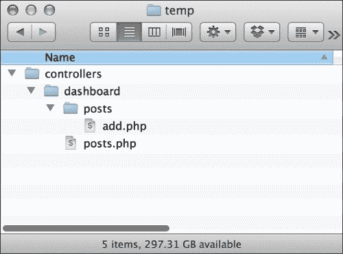
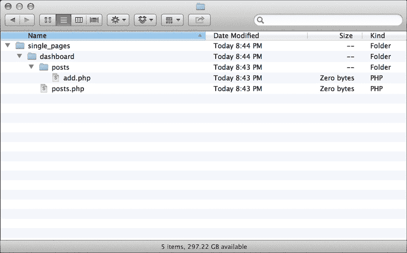
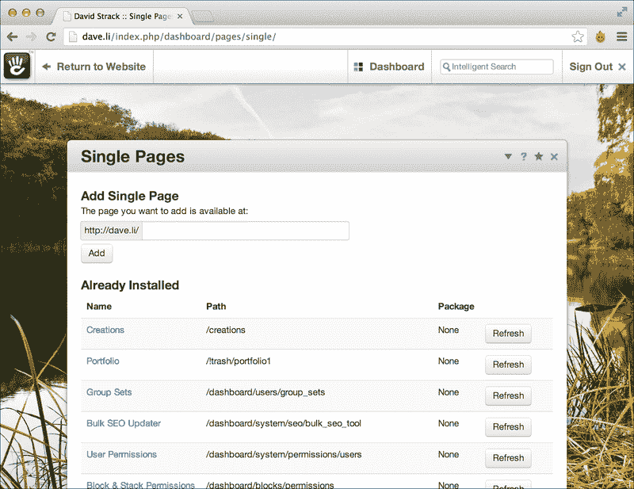

# 第六章：创建 CRUD 接口

在本章中，我们将涵盖以下内容：

+   在仪表板上创建单页的控制器文件

+   在仪表板上创建单页的视图文件

+   将单页添加到仪表板

+   创建创建项的表单

+   从控制器将数据保存到数据库

+   创建用于显示数据库项列表的视图

+   添加编辑功能以创建表单

+   创建删除操作

# 简介

concrete5 作为内容管理系统越来越受欢迎的一个特性是它允许开发者快速轻松地自定义它。在自定义内容管理系统时，一个常见的任务是创建自定义界面，以便网站编辑以一致的方式编辑特殊内容。

考虑一个管理数据库中书籍列表的网站。当然，网站编辑可以简单地像典型内容块一样维护这个列表，但这可能很繁琐，而且结果可能无法保证一致。这就是创建 CRUD 接口可以有益的地方。

CRUD（代表创建、读取、更新和删除）接口可以轻松添加到 concrete5 中，使用户能够轻松管理数据库中的自定义数据。在本章中，我们将学习如何在 concrete5 仪表板中创建 CRUD 接口。结合本章中的不同菜谱将产生一个完全功能的 CRUD，用于管理博客文章。

CRUD 接口主要围绕 **单页** 展开。在 concrete5 中，单页就像常规页面一样，只不过它们可以有一个 PHP 控制器文件和一个单独的视图文件，这允许高级功能。这允许开发者使用 MVC 规范并保持代码整洁。单页也被认为比常规页面更永久，因为它们不会被频繁地添加或删除。

## 关于本章数据的说明

本章将围绕在数据库中管理简单的博客文章。要处理这些数据，请在您的数据库上执行以下 SQL 代码。代码也将可在本书的网站上下载。

```php
CREATE TABLE BlogPosts (
  id int(11) unsigned NOT NULL AUTO_INCREMENT,
  title varchar(255) NOT NULL DEFAULT '',
  content longtext NOT NULL,
  post_date datetime NOT NULL,
  PRIMARY KEY (id)
);
INSERT INTO BlogPosts (id, title, content, post_date)
VALUES
  (1,'Hello World','This is my first post!','2013-05-01 13:05:00'),
  (2,'Another Sample Post','Some more great content.','2013-05-10 14:42:00');
```

# 在仪表板上创建单页的控制器文件

在仪表板上创建用于显示的单页的第一步是为每个页面创建控制器文件。由于我们将创建用于添加、编辑和列出博客文章的页面，我们需要在仪表板上添加两个单页，一个是默认视图（将列出博客文章）和一个添加视图（将是一个用于添加和编辑文章的表单）。

## 准备工作

文件和目录的名称很重要；concrete5 需要它们与网站 URL 中显示的路径相匹配。例如，如果我们想让我们的博客文章列表出现在 `http://example.com/dashboard/posts`，我们命名文件和类时必须考虑到这一点。在这个菜谱中，我们将向 `/dashboard/posts` 和 `/dashboard/posts/add` 添加单页。

## 如何做到这一点...

创建仪表板简单页面控制器文件的步骤如下：

1.  使用您的操作系统文件管理器（或您喜欢的 FTP 工具或文本编辑器），在`/controllers`目录下创建一个名为`dashboard/`的目录。

1.  现在，添加一个名为`posts.php`的文件。

1.  接下来，在`/controllers/dashboard`中添加一个名为`posts/`的新目录。

1.  在`/controllers/dashboard/posts/add.php`中添加添加/编辑表单的控制器文件。

1.  您的文件和目录应如下截图所示：

1.  在您首选的代码编辑器中打开`/controllers/dashboard/posts.php`文件。

1.  声明控制器类，扩展核心控制器类，如下代码片段所示。保存此文件并关闭它。

    ```php
    class DashboardPostsController extends Controller {
    }
    ```

1.  在`/controllers/dashboard/posts/add.php`中打开文件。

1.  声明表单控制器类，确保扩展核心控制器，如下代码片段所示。关闭此文件并保存它。

    ```php
    class DashboardPostsAddController extends Controller {
    }
    ```

## 它是如何工作的...

concrete5 在处理单页时采用了约定优于配置的概念。开发者只需记住 concrete5 期望文件如何呈现，然后 concrete5 将负责加载类和实例化它们的所有工作。因此，文件和目录名称，以及控制器的类名都很重要。我们在这里创建的文件最终将在`http://example.com/dashboard/posts`和`http://example.com/dashboard/posts/add`处可用。

## 参见

+   *为仪表板上的单页创建视图文件*配方

+   *将单页添加到仪表板*配方

# *为仪表板上的单页创建视图文件*

单页需要控制器和视图文件。遵循 MVC 设计原则规定，表示代码（HTML）应与控制器逻辑分开。添加视图文件与添加控制器非常相似，我们在前面的配方中已经学习过。

## 准备工作

就像我们添加控制器时一样，文件和目录名称在这里也很重要。

## 如何做...

创建简单页面视图文件的步骤如下：

1.  在`/single_pages`目录下创建一个名为`dashboard/`的新目录。

1.  在`/single_pages/dashboard/posts.php`中添加一个名为`posts.php`的文件。

1.  在`/single_pages/dashboard`中添加一个名为`posts/`的目录。

1.  现在，在`/single_pages/dashboard/posts/`中创建一个名为`add.php`的文件。

1.  您的`single_pages/`目录的内容应如下截图所示：

## 它是如何工作的...

文件和目录名称应与页面在网站地图和 URL 中显示的方式一致。本配方中的文件和目录将生成位于`http://example.com/dashboard/posts`和`http://example.com/dashboard/posts/add`的单页。我们添加的 PHP 文件目前不需要包含任何内容。

## 参见

+   *为仪表板上的单页创建控制器文件*配方

+   *将单页添加到仪表板* 菜谱

# 将单页添加到仪表板

一旦在 concrete5 文件系统中创建了控制器和视图文件，在我们可以通过浏览器访问这些页面并开始添加自定义 CRUD 逻辑之前，还需要执行一个步骤。页面必须添加到 concrete5 网站地图中，这样 CMS 就知道页面存在，并且可以将请求定向到它们。

## 准备工作

在你可以将单页添加到网站之前，视图和控制器文件必须在文件系统中存在。请参考之前的两个菜谱了解如何正确执行此操作。

## 如何操作...

1.  通过访问 `/dashboard/pages/single`（你可能需要登录）进入仪表板的单页管理器。页面将看起来像以下截图：

1.  输入文章页面的路径（`/dashboard/posts`）并点击 **添加**。

1.  输入添加页面的路径（`/dashboard/posts/add`）并点击 **添加**。

1.  页面现在已经被添加，可以通过访问它们的相应 URL 来查看。

## 它是如何工作的...

concrete5 将验证控制器和视图文件是否存在，然后会将新的单页添加到网站地图中。这使得页面可以通过 URL 访问，如果页面存储在仪表板中，concrete5 将自动对用户执行访问控制检查。

## 参见

+   *为仪表板上的单页创建控制器文件* 菜谱

+   *为仪表板上的单页创建视图文件* 菜谱

# 创建用于创建项目的表单

现在我们已经知道了如何将裸骨单页添加到仪表板中，我们可以创建真正的 CRUD 接口。我们将要编写的第一个接口是用于创建和编辑博客文章的表单。

## 准备工作

首先，你需要确保你知道如何为单页添加控制器和视图文件。请参考本章前三个菜谱，了解如何进行操作。

我们在本章中的博客文章将包含三个字段：`标题`、`内容`和`发布日期`。`标题`和`内容`字段将由用户通过本菜谱中的表单设置，而`发布日期`将由我们的控制器在表单提交后设置。

为了使本章内容集中，我们省略了围绕表单的大部分无关 HTML。如果你在表单的标记方面遇到麻烦，请参考本书的网站以查看完整的 HTML 代码。

## 如何操作...

创建用于创建项目的表单的步骤如下：

1.  在你喜欢的代码编辑器中打开 `/single_pages/dashboard/posts/add.php`。

1.  我们将使用表单助手，所以请将此助手加载到文件顶部。

    ```php
    <?php $form = Loader::helper('form') ?>
    ```

1.  将所有内容包裹在一个带有 `ccm-ui` 类的 `div` 标签中，这样我们的表单就能利用 concrete5 中包含的 Bootstrap 样式。

    ```php
    <div class="ccm-ui">
    ```

1.  使用仪表板助手输出表单标题的适当 HTML。

    ```php
    <?php
       $dashboard = Loader::helper('concrete/dashboard');
       echo $dashboard->getDashboardPaneHeader('Title');
    ?>
    ```

1.  将表单的 `action` 设置为控制器的 `save` 函数，并确保它以 `POST` 请求发送数据。

    ```php
    <form action="<?php echo $this->action('save') ?>" method="POST">
    ```

1.  输出 `title` 字段的输入。

    ```php
    <?php echo $form->text('title') ?>
    ```

1.  输出 `content` 字段的输入。

    ```php
    <?php echo $form->textarea('content') ?>
    ```

1.  创建提交按钮。

    ```php
    <input class="btn btn-primary" type="submit" value="Save">
    ```

1.  创建一个取消按钮，并在点击时将用户带回到文章列表。

    ```php
    <a href="<?php echo $this->url('/dashboard/posts') ?>" class="btn">Cancel</a>
    ```

1.  保存 `add.php` 视图文件，因为现在是时候移动到控制器了。

## 它是如何工作的...

`add.php` 视图文件是一个 concrete5 `View` 对象的界面。因此，`$this` 关键字被设置为 `View` 类的一个实例。在 `$this` 关键字上使用 `action` 和 `url` 等函数将生成了解 concrete5 网站设置的 URL，例如，如果网站启用了漂亮 URL，或者网站位于子目录中。

使用表单辅助工具，我们可以快速输出需要在表单上显示的字段。当我们在本章后面添加编辑数据的能力时，表单辅助工具将更加有用。

## 更多内容...

如本章开头所述，这里围绕表单的大多数样板 HTML 都被省略了。如果您想查看整个页面的结构，请从本书的网站上下载完整的源代码。

## 相关内容

+   *为仪表板上的单页创建控制器文件* 的菜谱

+   *为仪表板上的单页创建视图文件* 的菜谱

+   *将单页添加到仪表板* 的菜谱

+   *在 第四章 中加载辅助类* 的菜谱，*使用核心辅助工具*

+   *使用 Form 辅助工具创建自定义表单* 的菜谱在 第四章，*使用核心辅助工具*

+   *从控制器将数据保存到数据库* 的菜谱

# 从控制器将数据保存到数据库

一旦您创建了表单的 HTML（和相关辅助 PHP），就是时候让这个表单做些事情了。在前一个菜谱中，我们将 HTML 表单的动作设置为控制器的 `save` 动作。在这个菜谱中，我们将编写那个保存动作的代码，这样一旦点击保存按钮，我们的博客文章就会被存储到数据库中。

## 准备工作

这个菜谱继续本章的主题，为管理简单的博客文章创建一个 CRUD 接口。在开始这一部分之前，请确保本章中之前的菜谱已经完成。同时，请确保在章节介绍中指定的数据库表存在。

## 如何做到这一点...

从控制器将数据保存到数据库的步骤如下：

1.  在 `/models/blog_post.php` 中创建一个新的模型。

1.  在您的代码编辑器中打开 `/models/blog_post.php` 并创建 `BlogPost` 类。

    ```php
    class BlogPost extends Model {
       var $_table = 'BlogPosts';
    }
    ```

1.  在您首选的代码或文本编辑器中打开 `/controllers/dashboard/posts/add.php`。

1.  定义 `save` 函数。

    ```php
    public function save() {
    }
    ```

1.  在 `save` 函数中，加载 `BlogPost` 模型。

    ```php
    Loader::model('blog_post');
    ```

1.  创建 `BlogPost` 模型的新实例。

    ```php
    $post = new BlogPost();
    ```

1.  将 `title` 设置为 HTTP `POST` 请求中提交的值。

    ```php
    $post->title = $this->post('title');
    ```

1.  将 `内容` 设置为表单 `POST` 请求中提交的值。

    ```php
    $post->content = $this->post('content');
    ```

1.  将 `发布日期` 设置为当前日期/时间。

    ```php
    $post->post_date = date('YYYY-MM-DD H:i:s');
    ```

1.  保存模型。

    ```php
    $post->save();
    ```

1.  将用户重定向到帖子列表，这将表明保存成功。

    ```php
    $this->redirect('/dashboard/posts');
    ```

## 它是如何工作的...

当对 `/dashboard/posts/add/save` 发起 HTTP 请求（`GET` 或 `POST`）时，会运行 `save` 函数，这正是 HTML 表单提交数据的地方。我们加载 `BlogPost` 模型并设置其每个属性，最后将新项目保存到数据库中，并将用户重定向到帖子列表。

## 更多内容...

在实际使用中，您可能希望使用验证助手来确保用户已正确填写表单，并且标题和内容字段均不为空。

## 参见

+   *在仪表板上为单页创建控制器文件* 菜谱

+   *在仪表板上为单页创建视图文件* 菜谱

+   *将单页添加到仪表板* 菜谱

+   *创建用于创建项目的表单* 菜谱

+   第五章, *使用数据库和模型*

# 创建用于显示数据库项目列表的视图

现在我们可以向数据库中添加项目，确实很希望有一个界面来显示表中已经存在的项目，并从那里添加、编辑和删除这些项目。

在本菜谱中，我们将通过创建一个列出数据库中所有博客文章的 HTML 表格来处理 CRUD 接口的读取方面，并提供编辑和删除这些项目的按钮。

## 准备工作

与本章中的其他菜谱一样，我们将处理简单的博客文章。确保在处理此菜谱之前已完成前面的菜谱，否则可能会有缺失的步骤！

为了保持本章重点在重要的代码上，本节中省略了此菜谱中的一些样板 HTML。本书的网站包含一个完整的源代码下载，允许您探索此界面中的整个 HTML 代码。

## 如何操作...

创建用于显示数据库项目列表的视图的步骤如下：

1.  在您首选的文本编辑器中打开 `/controllers/dashboard/posts.php`。

1.  定义 `view` 函数，该函数将在页面加载时自动运行。

    ```php
    public function view() {
    }
    ```

1.  在 `view` 函数中，加载 `BlogPost` 模型。

    ```php
    Loader::model('blog_post');
    ```

1.  创建 `BlogPost` 的新实例。

    ```php
    $post = new BlogPost();
    ```

1.  通过向 `find` 函数传递一个真值条件（1=1）来查找所有博客文章。

    ```php
    $posts = $post->find('1=1');
    ```

1.  在视图中设置一个名为 `$posts` 的变量，其值等于模型查询的结果。

    ```php
    $this->set('posts', $posts);
    ```

1.  保存控制器文件。

1.  打开位于 `/single_pages/dashboard/posts.php` 的帖子索引视图。

1.  确保创建一个具有 `ccm-ui` 类的 `div` 标签，以便使用内置的 Bootstrap 样式。

    ```php
    <div class="ccm-ui">
    ```

1.  使用仪表板助手生成标题部分的 HTML。

    ```php
    <?php
      $dashboard = Loader::helper('concrete/dashboard');
      echo $dashboard->getDashboardPaneHeader('Blog Posts');
    ?>
    ```

1.  创建一个表格来存放帖子。

    ```php
    <table class="table table-striped table-bordered">
    ```

1.  我们需要为将要显示的四个列添加标题。

    ```php
    <th>ID</th>
    <th>Title</th>
    <th>Post Date</th>
    <th>Actions</th>
    ```

1.  遍历控制器中设置的`$posts`变量，输出每行的帖子。最后一列将包含编辑或删除每个帖子的按钮。

    ```php
    <?php foreach ($posts as $post): ?>
      <tr>
        <td><?php echo $post->id ?></td>
        <td><?php echo $post->title ?></td>
        <td><?php echo date('DATE_APP_GENERIC_MDY_FULL,strtotime($post->post_date)) ?></td>
        <td>
          <a href="<?php echo $this->url('/dashboard/posts/add/edit/', $post->id) ?>" class="btn">Edit</a>
          <a href="<?php echo $this->action('/dashboard/posts/delete/', $post->id) ?>" class="btn danger">Delete</a>
        </td>
       </tr>
    <?php endforeach; ?>
    ```

1.  保存视图文件。

## 它是如何工作的...

当对`/dashboard/posts/`进行 HTTP `GET`或`POST`请求时，帖子控制器的`view`函数会自动执行。在这个函数中，我们从`BlogPost`模型加载数据，然后将这些数据发送到视图。这允许我们将真实业务逻辑从视图文件中分离出来，创建更多可重用和可维护的代码。

## 参见

+   *在仪表板上创建单页控制器文件*的配方

+   *在仪表板上创建单页视图文件*的配方

+   *将单页添加到仪表板*的配方

+   *创建创建项的表单*的配方

+   *从控制器将数据保存到数据库*的配方

# 为创建表单添加编辑功能

现在我们已经添加了创建和查看项的功能，是时候为 CRUD 界面添加第三个方面：编辑。在这个配方中，我们将实现编辑项所需的逻辑，使用我们在*创建创建项的表单*配方中创建的表单。

## 准备工作

与本章中其他配方一样，这个配方围绕管理简单博客文章的概念展开，每篇文章都有一个标题、一段内容文本和一个帖子日期。在开始这段最新的旅程之前，请确保已经完成了之前的配方！本配方的 MySQL 数据也包含在本章的开头以及本书的网站上。

## 如何操作...

为创建表单添加编辑功能的步骤如下：

1.  打开添加表单的控制器文件（位于`/controllers/dashboard/posts/add.php`）。

1.  声明一个名为`edit`的函数，该函数有一个参数用于编辑帖子的`ID`参数。

    ```php
    public function edit($id) {
    }
    ```

1.  在`edit`函数中，加载`blog post`模型。

    ```php
    Loader::model('blog_post');
    ```

1.  创建`model`类的实例。

    ```php
    $post = new BlogPost();
    ```

1.  使用通过编辑 URL 传递的`ID`参数加载`post`对象。

    ```php
    $post->load('id = ?', $id);
    ```

1.  将`post`变量设置到视图中，将`post`对象转换为数组，以防止在没有设置帖子对象时添加表单损坏。

    ```php
    $this->set($post, (array) $post);
    ```

1.  在控制器的`save`函数中，在`$post = new BlogPost()`下方添加以下代码；

    ```php
    if ($this->post('id')) {
      $post->load('id = ?', $this->post('id'));
    }
    ```

1.  将`save`函数调用更改为使用`replace`函数。

    ```php
    $post->replace();
    ```

1.  保存控制器文件。

1.  打开位于`/single_pages/dashboard/posts/add.php`的`view`文件

1.  向`title`输入添加第二个参数，如果存在，将填充帖子的标题。

    ```php
    <?php echo $form->text('title', $post['title']) ?>
    ```

1.  向`content`输入参数添加第二个参数，当表单处于编辑模式时将预填充内容。

    ```php
    <?php echo $form->textarea('content', $post['content']) ?>
    ```

1.  在关闭表格标签下方，添加以下代码片段以在表单处于编辑模式时添加一个隐藏的输入：

    ```php
    <?php if ($post['id']): ?>
       <?php echo $form->hidden('id', $post['id']) ?>
    <?php endif; ?>
    ```

1.  保存`view`文件。

## 它是如何工作的...

当请求 URL `/dashboard/posts/add/edit/<id>` 时，concrete5 将自动触发控制器的 `edit` 函数，并将 `ID` 参数作为第一个参数传递。然后我们可以加载相应的模型并将数据发送到视图。我们需要将帖子数据转换为数组，这样即使在非编辑模式下表单也能正常工作。

我们还在 `save` 函数中添加了一个小片段，以确保如果 `POST` 请求中包含 ID，则需要保存现有帖子而不是创建一个新的。通过将 `save` 函数调用更改为 `replace`，我们告诉模型如果不存在，则创建一个新的记录，否则将简单地更新现有的模型。

## 更多...

在实际使用中，检查编辑函数中的 `ID` 参数以确保它已设置是明智的。同时，处理加载不存在的帖子请求也是一个好主意。

## 相关内容

+   *为仪表板上的单个页面创建控制器文件* 配方

+   *为仪表板上的单个页面创建视图文件* 配方

+   *添加单个页面到仪表板* 配方

+   *创建创建项的表单* 配方

+   *从控制器将数据保存到数据库* 配方

# 创建删除操作

CRUD 界面的最后一个支柱是删除项的能力。在 concrete5 中，这比其他 CRUD 任务要简单一些，因为删除项通常不需要视觉组件。在这个配方中，我们将删除一个博客文章，并将用户简单地重定向回帖子的索引视图。

## 准备工作

我们将继续使用简单博客文章的概念。这个配方假设你已经完成了本章中的前一个配方，并且创建了适当的数据库表。

## 如何操作...

1.  打开位于 `/controllers/dashboard/posts.php` 的控制器文件。

1.  声明一个新的名为 `delete` 的函数，它有一个参数，`$id`。

    ```php
    public function delete($id) {
    }
    ```

1.  在 `delete` 函数中，加载 `博客帖子` 模型。

    ```php
    Loader::model('blog_post');
    ```

1.  创建模型的新实例。

    ```php
    $post = new BlogPost();
    ```

1.  通过其 ID 加载帖子。

    ```php
    $post->load('id = ?', $id);
    ```

1.  通过调用 `delete` 函数删除帖子。

    ```php
    $post->delete();
    ```

1.  将用户重定向回帖子索引。

    ```php
    $this->redirect('/dashboard/posts');
    ```

## 工作原理...

当请求 `/dashboard/posts/delete/<id>` 时，将执行帖子控制器的 `delete` 函数。在这个控制器中，我们简单地通过其 ID 加载一个帖子，然后调用模型的内置 `delete` 函数。然后，我们只需将用户重定向回帖子列表。

## 更多...

在删除之前验证指定 ID 的帖子是否存在是明智的。此外，大多数用户在执行此类破坏性操作之前都会期望某种类型的确认对话框，所以在现实生活中添加这个功能会很好。

## 相关内容

+   *为仪表板上的单个页面创建控制器* 配方

+   *为仪表板上的单个页面创建视图文件* 配方

+   *添加单个页面到仪表板* 配方
