# 第九章。系统事件和高级配置

本章我们将涵盖以下食谱：

+   声明高级配置变量

+   启用 concrete5 中的事件

+   监听系统事件

+   将参数传递给事件处理器

+   定义页面类型事件

+   当用户创建账户时发送电子邮件

+   当文件被上传时发送电子邮件

+   创建自定义计划任务

+   使您的插件翻译准备就绪

+   将 concrete5 重命名为白标 CMS

+   更改仪表板背景图片

# 简介

concrete5 包含许多针对开发者的杂项高级功能。在本书早期，我们已经提到了 concrete5 中的事件概念。在本章中，我们将探讨监听系统事件并对其采取行动的食谱，以及创建自定义配置设置，甚至更改 concrete5 的品牌以实现白标 CMS。

## 关于本章中的代码

本章有时会在 `/config/site_post.php` 等位置放置代码，这可能会干扰网站的正常操作。请确保您在开发服务器上执行这些食谱！

# 声明高级配置变量

concrete5 自带了许多“秘密”的高级配置变量，开发者可以设置这些变量以增强 concrete5 的行为。在本食谱中，我们将设置一个假设的配置设置。

## 如何操作...

声明高级配置变量的步骤如下：

1.  打开位于 `/config/site.php` 的网站配置文件，使用您首选的代码编辑器打开。

1.  声明一个新的常量变量，名为 `FOO`，并将其值设置为 `BAR`，如下所示：

    ```php
    define('FOO', 'BAR');
    ```

1.  保存 `site.php` 文件。

## 它是如何工作的...

concrete5 在每次页面请求开始时简单地加载此文件。通过在此处定义配置设置，开发者可以覆盖默认的 concrete5 设置，并创建他们自己的常量变量。如果开发者导出常量 `FOO` 的内容，他们将看到字符串 `BAR`。

# 在 concrete5 中启用事件

concrete5 自带了一个发布/订阅事件模型，这使得开发者能够使他们的代码响应系统事件。如果开发者希望在 `/config/site_events.php` 中声明事件（我们将在本章中这样做），则必须在 `site.php` 中启用它们。

## 如何操作...

启用事件的步骤如下：

1.  定位文件 `/config/site.php` 并使用您首选的代码编辑器打开它。

1.  将以下配置设置添加到 `config.php` 文件中：

    ```php
    define('ENABLE_APPLICATION_EVENTS', true);
    ```

1.  保存文件。

1.  通过访问 `/dashboard/system/optimization/clear_cache/` 并点击 **清除缓存** 按钮来清除 concrete5 缓存。

## 它是如何工作的...

在 concrete5 允许开发者在 `/config/site_events.php` 中注册事件监听器之前，它会检查此配置设置是否存在并设置为 `true`。

## 更多内容...

在 later concrete5 版本（5.5 及以上版本）中，可以忽略此步骤，尽管作者的个人偏好是无论如何都要放置配置，以便可以轻松启用或禁用事件（通过将值设置为 `false`）。

## 参见

+   *声明高级配置变量* 菜谱

+   *监听系统事件* 菜谱

# 监听系统事件

一旦在 concrete5 中启用了事件，开发者就可以编写自己的代码来响应不同的事件。在本菜谱中，我们将创建一个基本的 "Hello World!" 事件，当访问页面时立即运行并输出一条消息到屏幕上。

## 准备工作

在 `site_events.php` 中注册一个事件之前，concrete5 必须配置为启用事件系统。请参考前面的菜谱了解如何启用事件。

## 如何操作...

步骤如下：

1.  在 `/config` 目录下创建一个名为 `site_events.php` 的新文件。

1.  在你喜欢的代码编辑器中打开 `site_events.php`。

1.  添加以下代码以监听 `on_start` 事件。

    ```php
    Events::extend('on_start', 'MyClass', 'onStartFired', 'libraries/my_class.php');
    ```

1.  在 `/libraries` 目录下创建一个名为 `my_class.php` 的新文件。

1.  在 `my_class.php` 中定义一个名为 `MyClass` 的新类。

    ```php
    class MyClass {
    }
    ```

1.  向 `MyClass` 添加一个名为 `onStartFired` 的方法。

    ```php
    public function onStartFired() { 
    }
    ```

1.  在 `onStartFired` 中，使用 `die` 函数输出 **hello world!**。

    ```php
    die('hello world!');
    ```

1.  访问你网站上的任何页面。你将看到一个带有文字 **hello world!** 的白色屏幕，如下截图所示：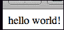

1.  随意取消注释 `MyClass` 中 `onStartFired` 函数的 `die` 语句以恢复你的网站到正常工作状态。

## 工作原理...

concrete5 将在网站加载时自动检查 `/config/site_events.php` 文件的存在，并执行其中包含的任何代码（这与 `/config/site_post.php` 的行为类似）。这是进行事件注册实验的完美地方。当我们调用 `Event::extend()` 时，我们传入的参数指定了我们想监听的事件、我们的事件处理器所在类的名称（在这个例子中是 `MyClass`），当事件被触发时将在该类中执行的方法（在这种情况下是 `onStartFired`），以及包含我们的处理器类的文件路径。

## 参见

+   *在 concrete5 中启用事件* 菜谱

+   *向事件处理器传递参数* 菜谱

# 向事件处理器传递参数

事件处理器是 concrete5 在事件被触发时执行的功能。在先前的菜谱中，我们使用了自定义类 `MyClass` 和其函数 `onStartFired` 作为事件处理器。concrete5 允许开发者向这些处理器传递参数。在本菜谱中，我们基于先前的事件处理器构建，并向 `onStartFired` 处理器传递一条消息，该消息将被输出。

## 准备工作

我们将使用在先前的菜谱中创建的代码作为本菜谱的基础。同时，确保你已经按照本章第一菜谱中的描述启用了事件。

## 如何操作...

将参数传递给事件处理函数的步骤如下：

1.  在代码编辑器中打开位于`/config`的`site_events.php`文件。

1.  在事件注册代码中添加一个新参数，使其看起来像以下代码：

    ```php
    Events::extend('on_start', 'MyClass', 'onStartFired', 'libraries/my_class.php', array('This is a custom message!'));
    ```

1.  打开`/libraries/my_class.php`，将`onStartFired`修改为以下代码：

    ```php
    public function onStartFired($view, $message) {
      die($message);
    }
    ```

1.  你现在可以在刷新你的网站时看到新的消息，如下面的截图所示：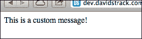

1.  随意取消注释`die`语句以允许您的网站正常工作。

## 它是如何工作的...

通过向`Events::extend()`函数调用添加第五个参数，我们可以向事件处理函数发送参数。这个新参数需要是一个数组，它包含我们希望发送到处理函数的各种参数。

你可能会注意到，我们的处理函数`onStartFired`有两个参数（`$view`和`$message`），尽管我们只指定了消息参数。这是因为 concrete5 将当前的`View`对象作为一点上下文提供给处理函数，这可能很有用。如果你对函数应用了哪些参数不确定，可以将 PHP 的`func_get_args()`函数的结果输出，以查看所有已发送参数的数组，因为它们可以在事件之间有所不同。

## 参见

+   *在 concrete5 中启用事件*的食谱

+   *监听系统事件*的食谱

# 定义页面类型事件

除了提供各种开发者可以挂钩的事件外，concrete5 还在页面类型级别提供事件系统。我们在本书的第一章详细讨论了页面类型，但现在我们可以向我们的页面类型添加自定义事件。在本食谱中，我们将创建一个名为`blog_post`的页面类型，并挂钩该页面类型的`on_page_add`事件。

## 准备工作

页面类型及其使用方法在第一章*页面和页面类型*中有更详细的描述。确保在 concrete5 中启用事件，并且你的`/config/site_events.php`文件存在。

## 如何做...

定义页面类型事件的步骤如下：

1.  在`/config/site_events.php`中注册事件处理程序：

    ```php
    Events::extendPageType('blog_post', 'on_page_add');
    ```

1.  首先，在`/page_types`中创建一个名为`blog_post.php`的新页面类型文件。

1.  接下来，在`/controllers/page_types/blog_post.php`中为页面类型创建控制器文件。

1.  创建控制器类，扩展核心`Controller`类：

    ```php
    class BlogPostPageTypeController extends Controller {
    }
    ```

1.  在控制器类中添加一个名为`on_page_add`的方法：

    ```php
    public function on_page_add() {
    }
    ```

1.  在`on_page_add`函数中，创建一个简单的`die`语句，这样我们就能知道这个事件正在工作：

    ```php
    die('blog post added');
    ```

1.  通过访问`/dashboard/pages/types`安装页面类型。

1.  点击**添加页面类型**。

1.  给页面类型起一个名字，并确保处理程序设置为`blog_post`。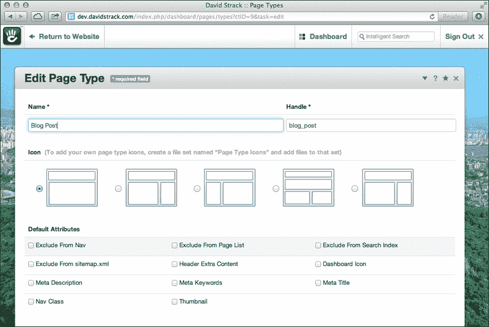

1.  现在，访问位于`/dashboard/sitemap/full/`的网站地图。

1.  向网站添加一个新页面，选择博客文章作为页面类型。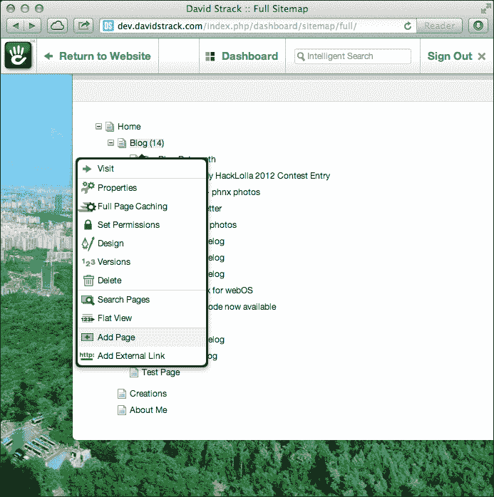

1.  添加一个博客文章，如下面的截图所示：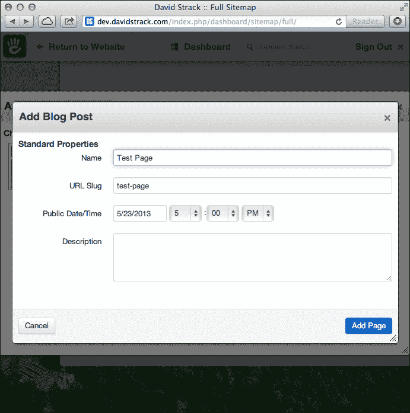

1.  当页面添加时，您将看到事件处理器中创建的消息，如下面的截图所示：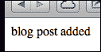

1.  不要忘记从事件处理器中删除`die`语句，以便您的网站恢复正常功能。

## 工作原理...

当向页面类型添加事件时，concrete5 消除了开发者手动指定事件处理器类名、函数名和文件位置的需求。因为页面类型遵循特定的约定（控制器名称称为`BlogPostPageTypeController`）并且通常位于`/controllers/page_types`目录中，所以 concrete5 可以自动确定应该加载哪个文件和类来处理事件。

## 更多...

参数可以像在常规事件处理器中一样传递给页面类型事件处理器。只需在事件声明中添加一个第三个参数，一个包含要传递给处理器函数的每个参数的数组，如下所示：

```php
Events::extendPageType('blog_post', 'on_page_add', array('This is a custom parameter'));
```

然后可以从处理器函数中访问新参数：

```php
public function on_page_add($view, $message) {
  die($message);
}
```

## 参见

+   *在 concrete5 中启用事件*配方

+   *监听系统事件*配方

+   *传递参数到事件处理器*配方

# 当用户创建账户时发送电子邮件

在本章中，我们已经介绍了许多与 concrete5 事件相关的配方。现在我们可以尝试一个常见的现实世界示例，即使用系统事件来执行自定义代码。在这个配方中，每当用户在网站上注册时，我们将向网站管理员发送一封电子邮件。

## 准备工作

在 PHP 中发送电子邮件可能很棘手，因为很多都取决于服务器配置。我们将使用 concrete5 的邮件助手（在第四章中更详细地讨论），这有助于一点，但配置错误的服务器仍然可能有问题。我们将假设您的服务器（开发或其他）能够发送电子邮件。

此外，确保在 concrete5 中启用事件，如本章中*声明高级配置变量*配方所述！

## 如何操作...

当用户创建账户时发送电子邮件的步骤如下：

1.  在`/config/site_events.php`中声明事件监听器：

    ```php
    Events::extend('on_user_add', 'UserEmailer', 'newAccountCreated', 'libraries/user_emailer.php');
    ```

1.  创建在事件注册中提到的`user_emailer.php`文件，位于/libraries：

1.  在`user_emailer.php`中定义一个新的类，名为`UserEmailer`：

    ```php
    class UserEmailer {
    }
    ```

1.  向`UserEmailer`添加一个名为`newAccountCreated`的方法，该方法接受一个参数，一个名为`$user`的`UserInfo`对象：

    ```php
    public function newAccountCreated($user) {
    }
    ```

1.  在`newAccountCreated`函数中，加载邮件助手：

    ```php
    $mail = Loader::helper('mail');
    ```

1.  设置电子邮件的主题：

    ```php
    $mail->setSubject('New account created!');
    ```

1.  设置电子邮件正文：

    ```php
    $mail->setBody('Someone with the email address of '.$user->uEmail.' has created an account.');
    ```

1.  设置电子邮件的目的地址（将其设置为您的电子邮件，以确保它能够正常工作）：

    ```php
    $mail->to('somebody@example.com');
    ```

1.  将`from`地址设置为适合您自己网站的地址：

    ```php
    $mail->from('noreply@example.com');
    ```

1.  发送电子邮件：

    ```php
    $mail->sendMail();
    ```

1.  通过向您的网站添加新用户来测试此事件是否正常工作。

1.  访问您的 concrete5 网站的 `/dashboard/users/add/` 以添加新用户。如何操作...

1.  用户添加后，您应该会收到一封电子邮件。如何操作...

## 它是如何工作的...

当事件监听器在 `site_events.php` 中定义时，concrete5 会记住在相关事件触发时执行提供的函数。在这种情况下，每当数据库中添加新用户时，concrete5 会触发 `on_user_add` 事件，从而运行我们创建的自定义代码。使用邮件助手，我们可以程序化地生成电子邮件并立即发送。

## 相关内容

+   第四章 *使用核心助手* 中的 *使用邮件助手发送电子邮件* 配方

+   *监听系统事件* 的配方

# 当文件上传时发送电子邮件

我们将再次尝试发送电子邮件；这次，每当文件被添加到文件管理器时，我们将向某人发送电子邮件。电子邮件将包含下载文件的链接。

## 如何操作...

当文件上传时发送电子邮件的步骤如下：

1.  在 `/config/site_events.php` 中设置事件监听器：

    ```php
    Events::extend('on_file_add', 'FileEmailer', 'fileUploaded', 'libraries/file_emailer.php');
    ```

1.  在 `/libraries/file_emailer.php` 中创建一个新的库：

1.  声明新的 `FileEmailer` 类：

    ```php
    class FileEmailer {
    }
    ```

1.  向类中添加一个名为 `fileUploaded` 的方法：

    ```php
    public function fileUploaded($file, $fv) {
    }
    ```

1.  加载邮件助手：

    ```php
    $mail = Loader::helper('mail');
    ```

1.  设置消息的主题：

    ```php
    $mail->setSubject('A file has been added to the file manager');
    ```

1.  设置消息正文，包括下载文件的链接：

    ```php
    $mail->setBody('A new file has been uploaded. Download it here: '.
      $fv->getDownloadURL());
    ```

1.  添加收件人的电子邮件地址（将其更改为您可访问的电子邮件地址）：

    ```php
    $mail->to('somebody@example.com');
    ```

1.  设置回复地址：

    ```php
    $mail->from('noreply@example.com');
    ```

1.  发送电子邮件：

    ```php
    $mail->sendMail();
    ```

1.  访问您的网站文件管理器在 `/dashboard/files/search`。如何操作...

1.  上传新文件。

1.  您将收到一封包含下载新文件链接的电子邮件，如下截图所示：如何操作...

## 它是如何工作的...

当文件上传时，concrete5 会自动触发 `on_file_add` 事件，我们在 `/config/site_events.php` 中注册了监听器。concrete5 将 `File` 和 `FileVersion` 对象作为事件回调的两个参数传递。`FileVersion` 对象包含获取下载 URL 的方法。

## 相关内容

+   *当用户创建账户时发送电子邮件* 的配方

# 创建自定义计划任务

concrete5 允许开发者创建特殊的任务，通过服务器上的计划任务自动运行。这些任务可以是您希望定期自动执行的各种操作。在这个配方中，我们将编写一个任务，将早上好电子邮件发送给网站上的每个用户。

## 准备工作

可能不需要说，但请确保在测试服务器上使用测试用户和电子邮件地址执行此配方。您不希望每天早上用愚蠢的电子邮件打扰整个用户群。

## 如何操作...

创建自定义计划任务的步骤如下：

1.  在`/jobs/email_everyone.php`创建一个新文件。

1.  声明一个名为`EmailEveryone`的新类：

    ```php
    class EmailEveryone extends Job {
    }
    ```

1.  在类中创建一个方法来返回工作的名称：

    ```php
    public function getJobName() {
      return 'Wakeup Email';
    }
    ```

1.  创建另一个方法来返回工作的描述：

    ```php
    public function getJobDescription() {
      return 'Give all of your site members a morning wakeup email!';
    }
    ```

1.  创建一个名为`run`的函数：

    ```php
    public function run() {
    }
    ```

1.  加载`UserList`模型：

    ```php
    Loader::model('user_list');
    ```

1.  创建`UserList`类的新实例：

    ```php
    $ul = new UserList();
    ```

1.  获取网站上所有用户的数组：

    ```php
    $users = $ul->get();
    ```

1.  遍历数组：

    ```php
    foreach ($users as $user) {
    }
    ```

1.  在循环中，加载邮件助手：

    ```php
    $mail = Loader::helper('mail');
    ```

1.  设置电子邮件的主题：

    ```php
    $mail->setSubject('Good morning!');
    ```

1.  设置回复地址：

    ```php
    $mail->from('noreply@example.com');
    ```

1.  在循环中将目标地址设置为当前用户：

    ```php
    $mail->to($user->getUserEmail());
    ```

1.  设置电子邮件正文，包括用户的用户名：

    ```php
    $mail->setBody('Good morning, '.$user->getUserName());
    ```

1.  发送电子邮件：

    ```php
    $mail->sendMail();
    ```

1.  返回要在仪表板上显示的消息：

    ```php
    return 'Emailed '.count($users).' users.';
    ```

1.  访问仪表板的**自动化任务**页面，位于`/dashboard/system/optimization/jobs/`。

1.  你将在列表底部看到你的新工作，如下面的截图所示。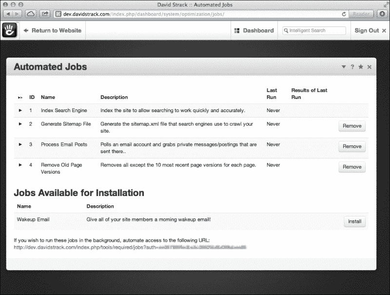

1.  点击前面的截图所示的**安装**按钮。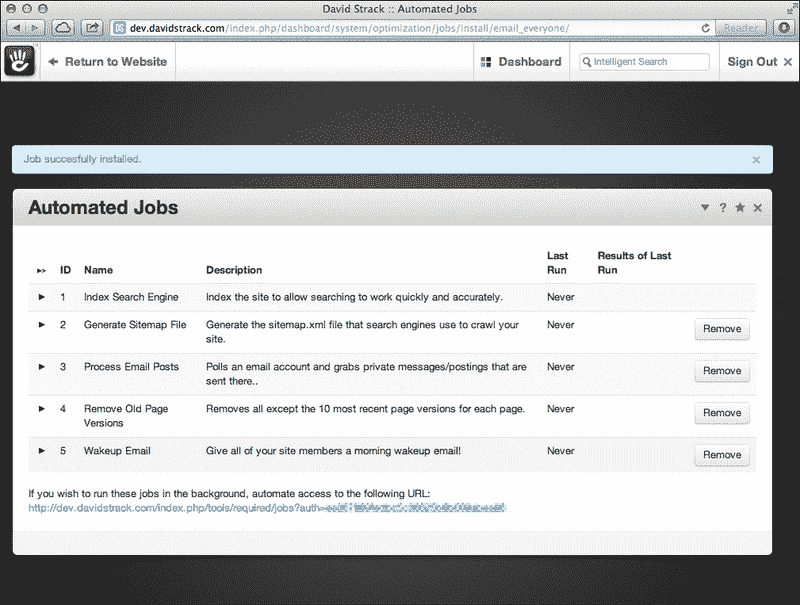

1.  点击三角形播放图标来运行你的工作。你将看到一个显示已邮寄用户数量的消息。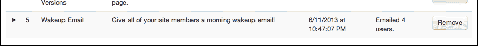

1.  你将在你的收件箱中收到一封电子邮件（如果你的电子邮件地址分配给了网站成员之一），如下面的截图所示：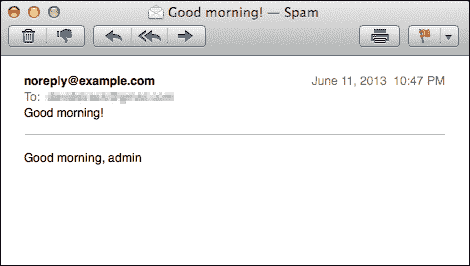

## 它是如何工作的...

concrete5 将在点击“播放”按钮后异步运行新任务。该任务简单地加载网站上所有用户的列表，并向他们中的每一个人发送电子邮件。在生产使用中，对于大量成员来说，这可能是低效的，甚至可能导致你的服务器因垃圾邮件而被列入黑名单。

## 更多...

你可能想知道如何自动运行这样的任务。答案在于服务器自动化任务。在大多数 Linux Web 服务器上，网站管理员将使用`cron`调度程序来管理自动化任务，并可能使用`curl`命令向任务运行器发送 HTTP 请求。要自动运行此任务，请创建一个计划任务来 ping 工作页面底部的 URL。此 URL 包含一个令牌，将允许你的系统在不登录的情况下访问 concrete5。请确保保持此 URL 及其令牌的私密性，否则未经授权的用户可能会触发你的网站的自动化任务。

有关在基于 Linux 的 Web 服务器上创建计划任务的更多信息，请参阅[`en.wikipedia.org/wiki/Cron`](https://en.wikipedia.org/wiki/Cron)。

# 使你的附加翻译准备就绪

concrete5 允许开发者采取高级步骤以确保他们的代码与 concrete5 翻译兼容。在本菜谱中，我们将展示如何为翻译准备字符串。

## 如何操作...

使附加翻译准备就绪的步骤如下：

1.  在你的代码编辑器中打开`/config/site_post.php`。

1.  声明一个用于测试的字符串：

    ```php
    $str = 'Hello world!';
    ```

1.  使用翻译函数输出你的字符串：

    ```php
    echo t($str);
    exit;
    ```

## 它是如何工作的...

concrete5 使用 Zend 翻译库。concrete5 定义全局 `t()` 函数作为字符串可用性的快捷方式，以便于各种翻译。然后翻译人员将使用 Poedit 等工具准备翻译文件以辅助翻译这些字符串。要了解更多关于 Poedit 和创建翻译文件的信息，请参阅 [`www.poedit.net`](http://www.poedit.net)。

# 将 concrete5 重新品牌化为白色标签 CMS

concrete5 允许开发者将 CMS 的标志、标题和一般品牌信息更改为他们想要的任何内容。通常，像大型组织这样的客户喜欢以这种方式重新品牌化他们的产品，而 concrete5 使这变得很容易。在这个配方中，我们将通过更改编辑栏中的标志来重新品牌化 concrete5。

## 准备工作

您需要一个 49 x 49 像素的标志图像。我们在这个配方中使用了一个示例标志，它包含在此书的网站上的代码下载中。

## 如何操作...

步骤如下：

1.  将您的新标志上传到您的网站。在此示例中，我们的标志位于 `/images/new-logo.png`（您可能需要创建图像目录）

1.  在您的代码编辑器中打开 `/config/site.php` 文件。

1.  将以下配置添加到文件中：

    ```php
    define('WHITE_LABEL_LOGO_SRC', '/images/new-logo.png');
    ```

1.  保存文件。现在您将在以下截图所示的编辑栏中看到新的标志：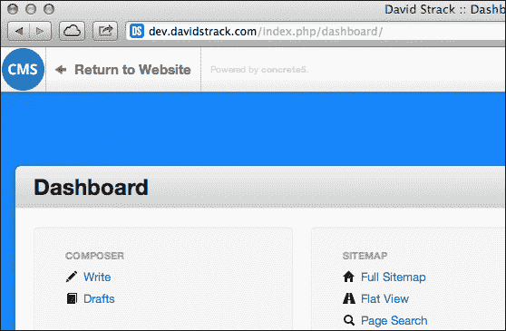

## 它是如何工作的...

concrete5 会检查此配置变量的存在，如果存在，则会更改标志源。如果更改了标志，concrete5 还会在编辑栏中添加 **由 concrete5 驱动** 的消息。

## 更多内容...

对于开发者来说，还有一些其他白色标签方面可供使用。在 [`www.concrete5.org/documentation/how-tos/developers/white-labelling/`](http://www.concrete5.org/documentation/how-tos/developers/white-labelling/) 可以找到一份很好的列表。

## 参见

+   *声明高级配置变量* 的配方

# 更改仪表板背景图片

默认情况下，concrete5 在每个仪表板页面的背景中显示大而明亮的照片。这些图像由在 concrete5 官方服务器上运行的源提供支持，并且图像每天都会更改。

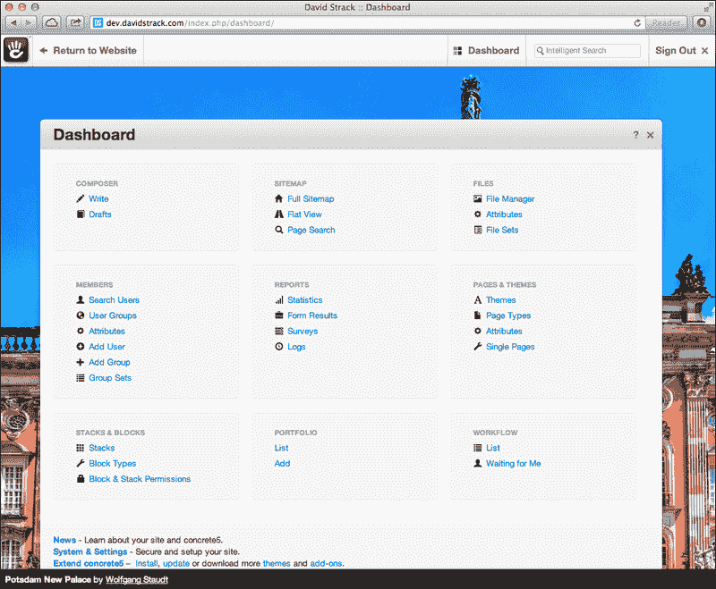

这是一个有趣的效果，为仪表板带来了很多色彩，但一些客户和代理可能不喜欢在他们的网站上显示随机的照片，尤其是如果它用于商业目的。幸运的是，concrete5 使更改背景图片变得很容易。

## 准备工作

您需要一个新图像作为背景，其大小至少为 1024 x 768 像素。在此示例中，我们将使用 Adobe Photoshop 中可以快速创建的微妙深色渐变，但您可以使用任何喜欢的图像。背景图像包含在此书的代码下载中。

## 如何操作...

更改仪表板背景图片的步骤如下：

1.  在您的代码编辑器中打开 `/config/site.php` 文件。

1.  将以下配置添加到文件中。

    ```php
    define('WHITE_LABEL_DASHBOARD_BACKGROUND_SRC', '/images/new-background.png');
    ```

1.  保存文件。仪表板的背景现在将发生变化。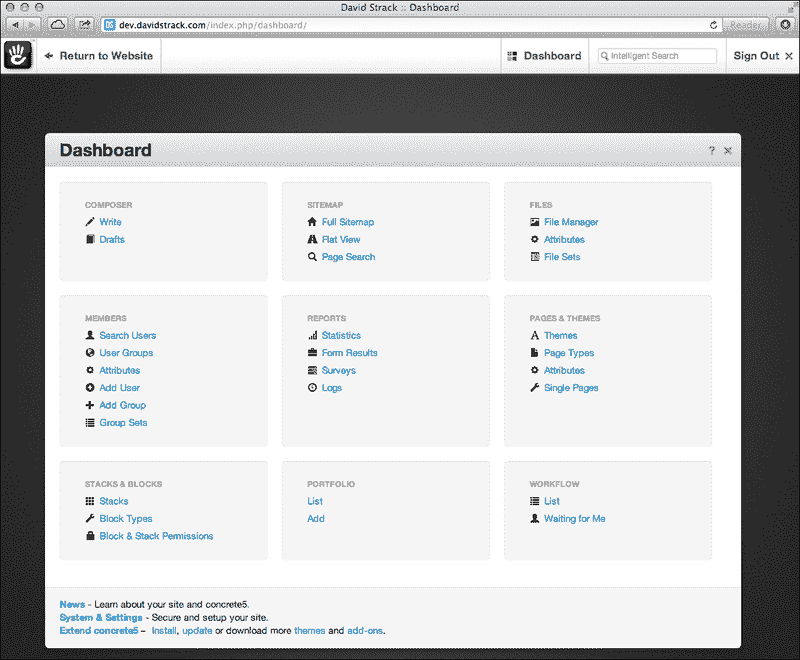

## 它是如何工作的...

concrete5 会检查`WHITE_LABEL_DASHBOARD_BACKGROUND_SRC`配置设置，并用您提供的新的背景图片替换每日图片。

## 更多内容...

开发者可以通过将背景源设置为"none"来完全去除背景图片。

## 参见

+   *声明高级配置变量*的配方。
