# 附录 A. 蓝图 – 创建图像库插件

现在我们已经学习了数十个 concrete5 的食谱，是时候将它们付诸实践了。将本章视为一个巨大的食谱，其唯一目的是创建一个图像库插件，你可以在 concrete5 网站上安装并立即开始使用。如果你访问本书的网站，有一个完整的源代码下载，以帮助你解决问题。

# 在我们开始之前...

整个章节是在 concrete5 版本 5.6.1.2 的全新安装下开发的，尽管代码在技术上可以在 5.6 版本之后的任何 concrete5 上工作。如果你想完全跟随，在你的开发服务器上运行一个新的 concrete5 版本，并使用它安装示例内容。这将给我们一些页面和图像来工作。

# 创建包控制器

创建我们的插件的第一步是创建目录和文件。

在 `/packages` 中创建一个名为 `cookbook_gallery` 的新目录。我们需要的第一个文件是 `controller.php`。

在 `controller.php` 文件中输入以下代码以定义插件：

```php
<?php
defined('C5_EXECUTE') or die(_("Access Denied."));

class CookbookGalleryPackage extends Package {
  protected $pkgHandle = 'cookbook_gallery';

  protected $appVersionRequired = '5.6.0';
  protected $pkgVersion = '0.9.0';

  public function getPackageName() {
    return t('Cookbook Gallery');
  }

  public function getPackageDescription() {
    return t('An image gallery that ties into the file manager.');
  }

}
```

你可能还记得来自第八章，*与主题和插件一起工作*，的内容，即插件只需要一个文件，即 `controller` 文件。`controller` 文件包含告诉 concrete5 插件名称的方法，以及插件的文本描述。

在这里我们需要注意几件事情。首先，注意控制器的类名。由于我们的包处理程序是 `cookbook_gallery`，我们需要将处理程序驼峰化并将其附加到末尾，以创建 concrete5 可以预测和正确加载的类名。

我们接下来需要的是文件顶部的 `defined` 或 `die` 语句。这是 concrete5 的一个特殊安全要求，以确保脚本不能任意执行。所有内容都必须通过 concrete5 分发器运行。如果你打算将包提交到 concrete5 市场的话，这个语句在每个 `.php` 文件（不包括存在于 `libraries/3rd_party` 中的第三方库）的顶部都是必需的。

我们还需要注意的另一件事是，所有面向公众的字符串都被包含在 `t()` 函数中（参见包名称和描述）。正如在第九章系统事件和高级配置中讨论的，`t()` 函数允许翻译者提供给定字符串的替代翻译。这是插件提交到 concrete5 市场的要求之一。

我们还没有完成控制器；一旦我们的块创建完成，我们还需要回来添加安装功能。

# 创建块类型

我们的形象画廊将是一个自定义块类型。这种块类型可以被添加到 concrete5 网站的任何页面，并在放置的地方显示图像画廊。我们首先需要做的是创建块的目录。在`/packages/cookbook_gallery/blocks`中添加一个新的目录。在新的块目录内，添加一个名为`cookbook_gallery`的目录。这将包含我们的块文件。

## 块的控制器

我们块类型的首要任务是`controller`文件。在`/packages/cookbook_gallery_blocks/cookbook_gallery`中创建`controller.php`。

声明块的`controller`类并添加以下方法：

```php
<?php defined('C5_EXECUTE') or die(_("Access Denied."));

class CookbookGalleryBlockController extends BlockController {

  protected $btTable = "btCookbookGallery";
  protected $btInterfaceWidth = "350";
  protected $btInterfaceHeight = "300";

  var $defaultCount = 20;

  public function getBlockTypeName() {
    return t('Photo Gallery');
  }

  public function getBlockTypeDescription() {
    return t('Shows photos from a file set.');
  }

}
```

再次注意文件顶部的`defined`或`die`语句以及使用`t()`函数包装我们的公共字符串。我们还定义了块的数据库表名称，使用成员变量`$btTable`。

保存`controller`文件，我们稍后会回来添加我们块的函数。

## 数据库 XML 文件

我们块类型需要的下一个文件是数据库 XML 文件。在`/packages/cookbook_gallery/blocks/cookbook_gallery/db.xml`中创建它。此文件定义了块类型将需要的所有表和字段。当块类型安装时，concrete5 将自动创建定义的表。

你可能还记得第二章 *与块一起工作*，这个文件使用了 ADOdb 的 XML 模式（或 AXMLS）。你可以在 ADOdb 网站上了解更多关于 AXMLS 的信息，网址为[`phplens.com/lens/adodb/docs-datadict.htm#xmlschema`](http://phplens.com/lens/adodb/docs-datadict.htm#xmlschema)。

在`db.xml`中输入以下 XML 代码：

```php
<?xml version="1.0"?>
<schema version="0.3">
  <table name="btCookbookGallery">
    <field name="bID" type="I">
      <key />
      <unsigned />
    </field>
    <field name="file_set" type="I"></field>
    <field name="count" type="I"></field>
  </table>
</schema>
```

我们创建了一个与块类型控制器中指定的同名数据库表。该表有两个字段，一个唯一的整数 ID 称为`bID`（这是块安装所必需的），以及一个整数文件集 ID 字段。保存此`db.xml`文件，如果你愿意的话，可以关闭它，因为我们不会再需要它了。

## 块类型的视图文件

最后，我们需要为块的各个视图创建文件。块有三个视图——添加、编辑和查看。在块的目录中创建`add.php`、`edit.php`和`view.php`。由于添加和编辑共享相同的 HTML，我们将创建一个共享模板，这两个视图都将包含它，称为`form.php`。哦，为什么不创建`view.css`呢，因为我们的视图文件将需要使用一些样式。

我们新包的结果内容如下截图所示：

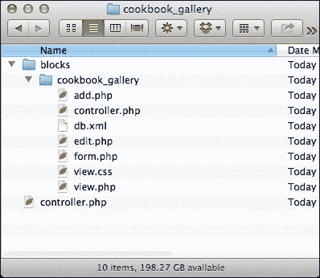

让我们暂时留空这些视图文件，因为我们想将我们的块类型及其包安装到网站上！

# 使用包安装块类型

现在，如果我们安装这个包，块类型将不会随它一起安装，你的插件用户会感到困惑和失望。不过，我们可以告诉包在包安装期间安装块类型。

在你的代码编辑器中打开包的`controller`（`/packages/cookbook_gallery/controller.php`）。

在`controller`类中添加一个名为`install`的新方法，如下所示：

```php
public function install() {
  $pkg = parent::install();

  // install the block type
  BlockType::installBlockTypeFromPackage('cookbook_gallery', $pkg); 
}
```

这里发生了什么？嗯，`Package`类有一个名为`install`的函数，正如你所猜到的，它将包安装到 concrete5 数据库中。由于我们的包控制器扩展了`Package`类，所以`install`函数自动对我们可用。

第一步是调用`Package`类的`install`函数，并获取它返回的对象。这将使我们能够安装块类型，并将其分配给我们的包。

将`$pkg`对象传递给块类型安装程序很重要，因为如果用户卸载或重新安装你的附加组件，块类型将随之来去。

保存控制器文件。现在是时候安装我们的附加组件了！

## 在 concrete5 中安装包

访问你的 concrete5 网站的`/dashboard/extend/install/`（如果你还没有登录，你需要先登录）。你会看到你的附加组件等待安装。

等待安装的画廊附加组件如下截图所示：

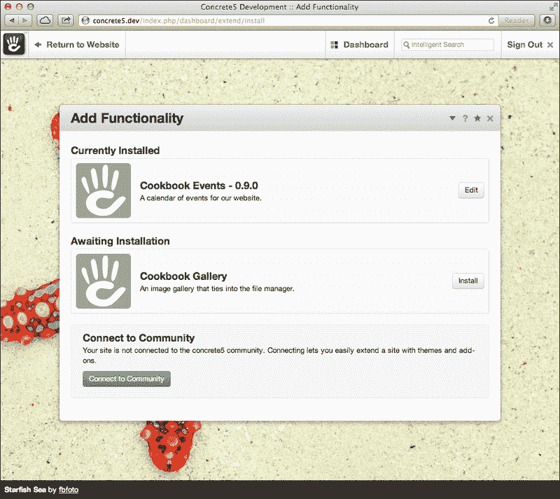

点击**安装**按钮。concrete5 将添加你的包及其块控制器到网站中。如果成功，你将在屏幕顶部看到一个消息。

附加组件安装成功后，我们看到以下截图：

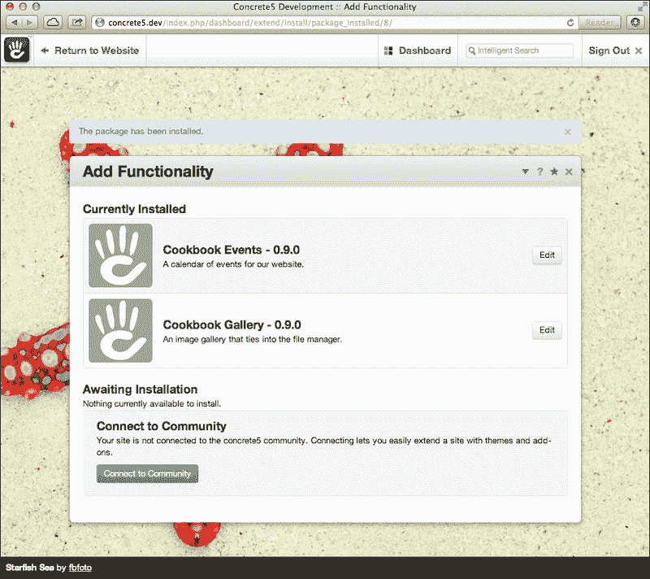

## 创建画廊页面

访问你的 concrete5 首页，并将鼠标悬停在**编辑**按钮上，在主页下添加一个子页面。

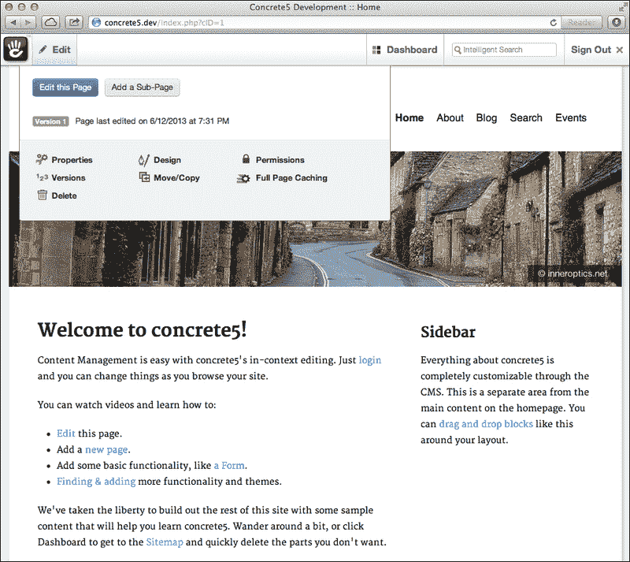

让我们为这个画廊页面使用**全**布局。

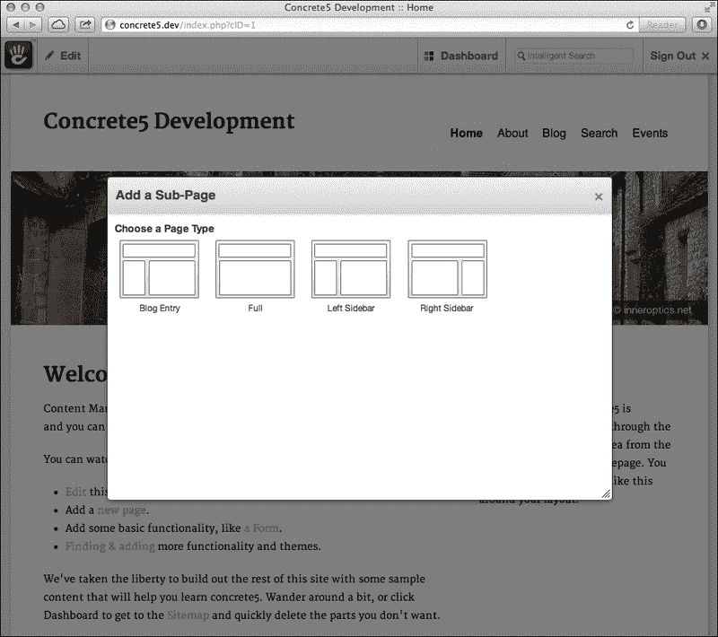

给页面一个标题和路径。比如叫`图片画廊`？

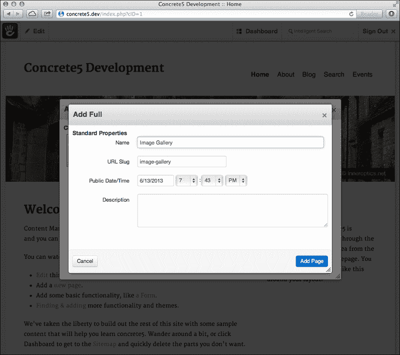

将页面添加到网站中。现在我们已经有一个合适的地方放置我们的块了，让我们实际让我们的块做一些事情吧！

# 使块活跃起来

在你的代码编辑器中打开你的块的控制器（位于`/packages/cookbook_gallery/blocks/cookbook_gallery/controller.php`）。我们需要添加一些函数来使这个类工作。首先，让我们让块的添加和编辑表单活跃起来。将以下函数添加到`controller`类中。

```php
public function add() {
  $this->addEdit();
}

public function edit() {
  $this->addEdit();
}

public function addEdit() {
  $fsList = new FileSetList();
  $sets = $fsList->get();

  $options = array();

  foreach ($sets as $fs) {
    $options[$fs->fsID] = $fs->fsName;
  }

  $this->set('sets', $options);
}
```

哇，我们在做什么呢？你可能还记得前面的章节，concrete5 控制器使用回调函数，这些函数在类中自动执行，当某些事情发生时。每当一个块首次添加到页面时，concrete5 将在`add.php`视图显示时调用`add`函数。对于`edit`函数和`edit.php`视图也是同样的道理。

由于我们希望添加和编辑表单都运行相同的代码，为什么不创建一个它们各自都可以使用的函数呢？`addEdit`函数包含了我们后端工作的实际代码。

首先，我们加载 concrete5 数据库中所有文件集的列表。然后，我们将文件集列表转换为简单的键/值数组，我们可以将其输入到 HTML 表单中的选择框中。最后，我们将`<select>`选项的数组发送到视图作为变量`$sets`。

太棒了。现在，当画廊块实际上在网站上查看时，也有一个回调函数。

```php
public function view() {
  if ($this->file_set) {
    $list = new FileList();
    $set = FileSet::getByID($this->file_set);

    $list->filterBySet($set);
    $list->filterByType(FileType::T_IMAGE);

    $count = ($this->count) ? $this->count : $this->defaultCount;

    $this->set('images', $list->get($count));
  }
  else {
    $this->set('images', false);
  }
}
```

当块在网站上显示时，`view`函数将由 concrete5 自动运行。正是在这里，我们从所选的文件集中加载图片并发送到视图。

首先，我们需要创建`FileList`类的新实例。这个类允许我们在文件管理器中过滤文件，只显示属于我们图片画廊的文件。

接下来，我们根据在添加/编辑表单中设置的文件集 ID 加载文件集对象。使用文件集对象，我们能够过滤集合，只显示属于该集合的文件。我们不想显示所有类型的文件（想象一下图片画廊中的 PDF 文件——那可不好玩！），所以我们添加另一个过滤器，只显示图片。

接下来，我们编写一个三元表达式，如果添加块到页面时没有选择画廊限制，则回退到默认的画廊限制。

最后，让我们将图片数组发送到视图，这样我们就可以显示我们的画廊了！

## 填写添加和编辑视图文件

好的，所以我们控制器中有一些很棒的代码，但我们的视图中还没有 HTML。让我们现在就解决这个问题。

在你的代码编辑器中打开`form.php`。我们将创建一个 HTML 表单，当块在页面上添加或编辑时，网站编辑将看到这个表单。

在`form.php`中输入以下 HTML 和 PHP 代码：

```php
<?php 
defined('C5_EXECUTE') or die(_("Access Denied.")); 
$form = Loader::helper('form');
?>	

<div class="ccm-ui">
  <table class="table table-striped table-bordered">
    <tr>
      <td>
        <?php echo t('File set to show photos from') ?>
      </td>
      <td>
        <?php echo $form->select('file_set', $sets, $file_set) ?>
      </td>
    </tr>
    <tr>
      <td>
        <?php echo t('How many images to show?') ?>
      </td>
      <td>
        <?php echo $form->text('count', $count) ?>
      </td>
    </tr>
  </table>
</div>
```

嘿，这并不难！这个表单将包含两个字段——一个包含 concrete5 中文件集列表的选择框，以及一个文本输入来限制图片画廊。不用担心将其包裹在表单元素中或添加保存控件，concrete5 会处理所有这些。

现在，让我们将此表单包含在`add.php`和`edit.php`中。向这两个文件添加以下代码：

```php
<?php 
defined('C5_EXECUTE') or die(_("Access Denied.")); 
 $this->inc('form.php');
```

就这样！现在当我们的块添加到网站上时，编辑将看到我们漂亮的新表单。

## 创建画廊视图文件

当然，我们的画廊还缺少最重要的组件，即画廊本身。让我们在`view.php`中添加一些 HTML 和 PHP 代码，以显示所选文件集中的各种图片，如下所示：

```php
<?php 
  defined('C5_EXECUTE') or die(_("Access Denied.")); 
  $ih = Loader::helper('image');
?>

<h1><?php echo t('Image Gallery') ?></h1>

<?php if ($images !== false): ?>
  <div class="gallery-wrapper">
    <?php foreach ($images as $image): ?>
      <?php $thumbnail = $ih->getThumbnail($image, 100, 100, true); ?>
      <a class="gallery-image" href="<?php echo $image->getRelativePath() ?>">
        src ?>" />
      </a>
    <?php endforeach; ?>
  </div>
<?php else: ?>
  <p><?php echo t('There are no images!') ?></p>
<?php endif; ?>
```

太好了。现在让我们看看我们做了什么。当然，在文件的顶部，我们包含了所有 PHP 文件所需的`defined`或`die`语句。随后，我们加载 Image 辅助工具，我们将在后面使用它来生成缩略图。

接下来，我们使用`t()`包装器输出画廊的标题，当然是为了保持翻译友好性。

在那之后不久，我们开始遍历图片数组。这些是 `File` 对象，因此我们可以访问所有相关属性。让我们使用 Image 辅助工具生成一个 100 x 100 像素的图片裁剪（传递 `true` 作为第二个参数告诉 Image 辅助工具裁剪图片，而不仅仅是调整大小）。这将使我们的画廊看起来整洁且一致。

接下来，让我们将图片包裹在一个 `<a>` 标签中，这样我们就可以链接到全尺寸图片。使用缩略图的源输出图片标签。

不要忘记将整个内容包裹在一个 `if` 语句中，以处理没有图片的文件集。

最后，让我们向 `view.css` 添加一些基本样式，以便我们的画廊看起来如下：

```php
.gallery-wrapper {
  margin: 50px 0;
}

.gallery-image {
  opacity: .85;
}

.gallery-image:hover {
  opacity: 1;
}
```

## 尝试使用块

好的，让我们看看我们做得怎么样！在我们可以使用块之前，让我们在 concrete5 中添加一个文件集。在浏览器中访问 `/dashboard/files/sets/` 并点击大蓝色按钮来添加文件集。在使用画廊之前，我们需要至少添加一个文件集。

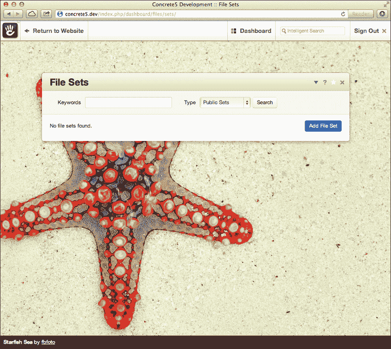

创建一个名为 `Gallery Images` 的新文件集。

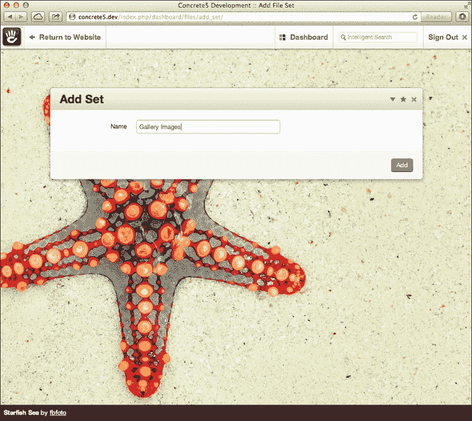

现在我们有一个文件集，但仍然为空。让我们通过访问文件管理器 `/dashboard/files/search/` 来添加一些图片到这个文件集中。

选择一些图片添加到集合中。

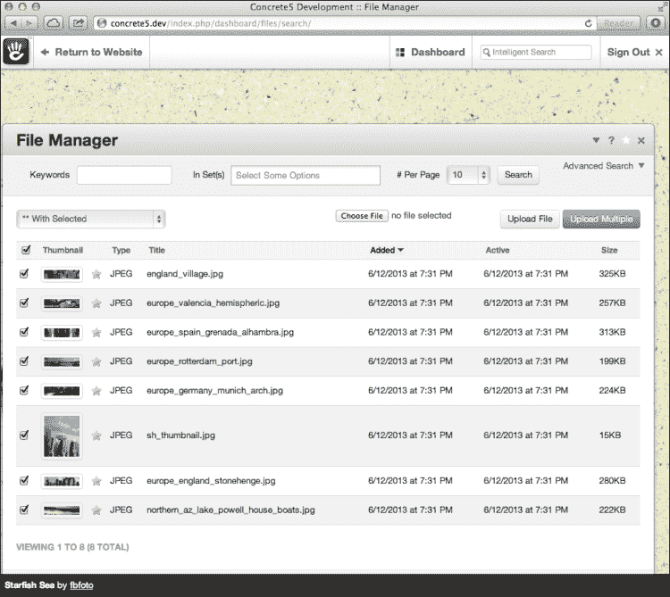

点击左上角的下拉菜单。选择 **Sets**，如以下截图所示：

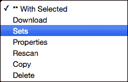

选择我们刚刚创建的文件集，将这些图片分配到该集合中。

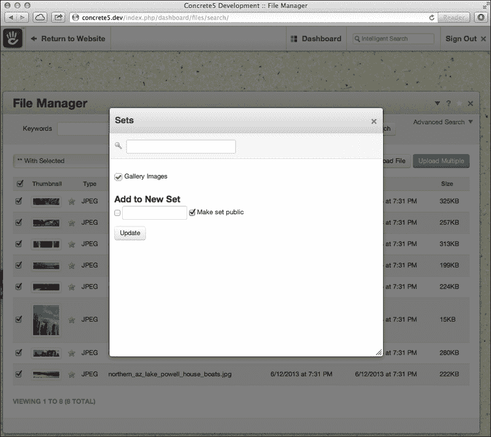

太棒了！现在我们准备好尝试我们的块了。访问我们之前创建的图片画廊页面并进入编辑模式。点击主要内容区域以添加新块。

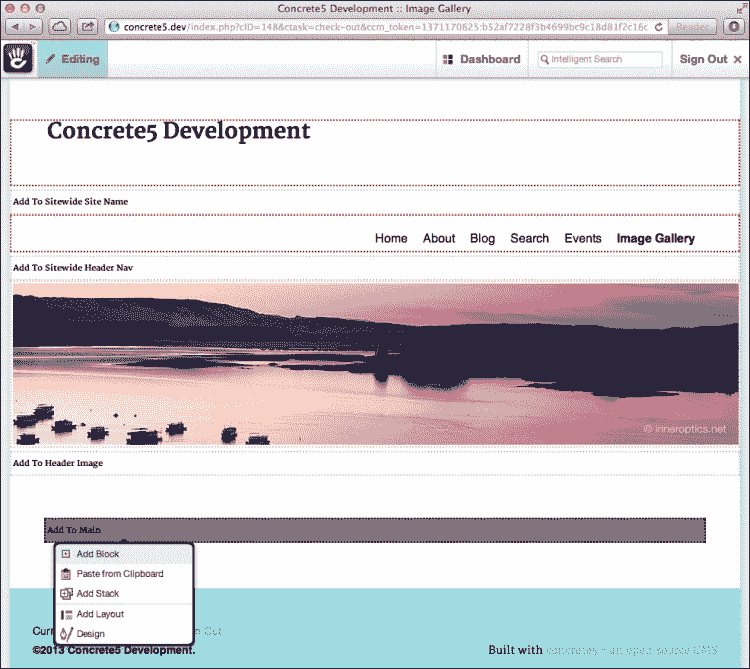

滚动到块列表的底部，找到我们创建的相册块。

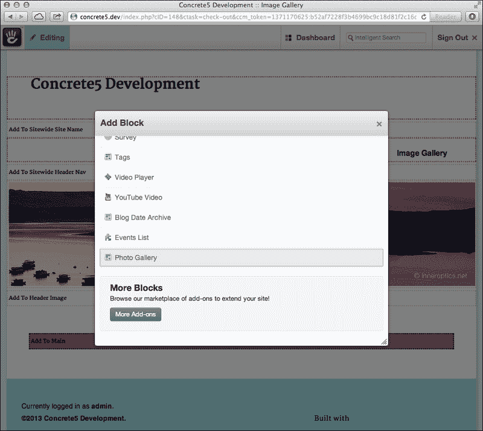

现在，填写表格以添加块。选择文件集并设置可以出现的图片数量限制（或留空以使用默认的 20 张）。

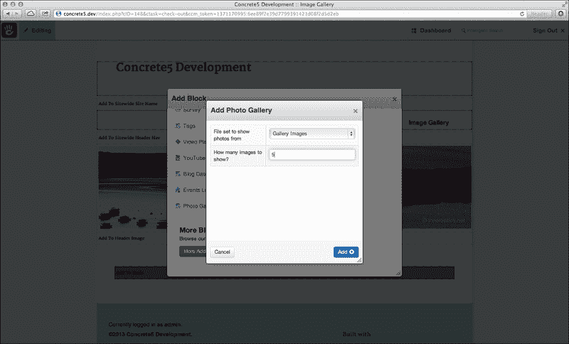

将块添加到页面并发布更改。您将看到一个看起来很棒的照片画廊！

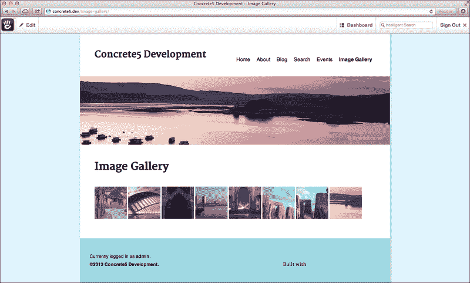

点击其中一张图片，查看其原始大小。


嗯，看起来我们的代码是有效的！恭喜，您已经创建了一个可以安装在任何 concrete5 网站上并自动工作的插件。

# 总结

我们在本章中取得了许多成就。我们从无到有，最终完成了一个功能齐全的图片库。尽管如此，仍有很大的扩展和改进空间。如果我们当时添加了一个 jQuery 灯箱插件，比如 fancyBox（可在[`fancyapps.com/fancybox/`](http://fancyapps.com/fancybox/)找到）会怎样？或者如果画廊有多个页面呢？这种块类型是许多不同可能性的绝佳起点。所有这些任务都可以使用 concrete5 API 实现，所以尽情探索和学习新事物吧。
