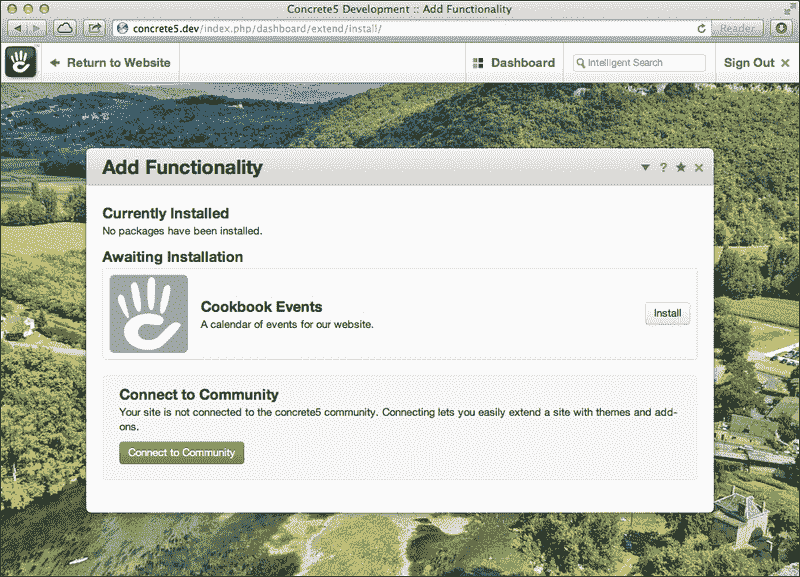
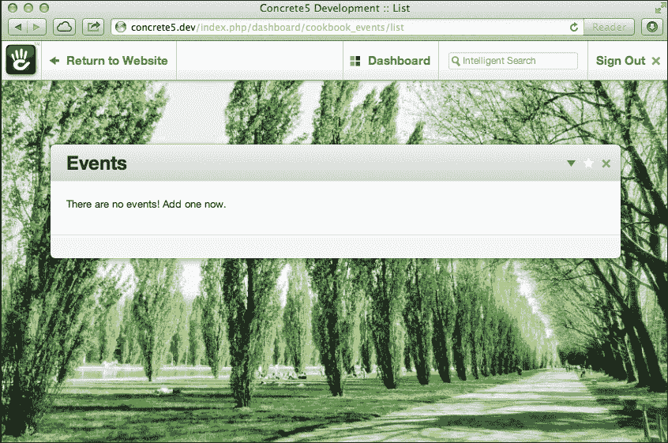
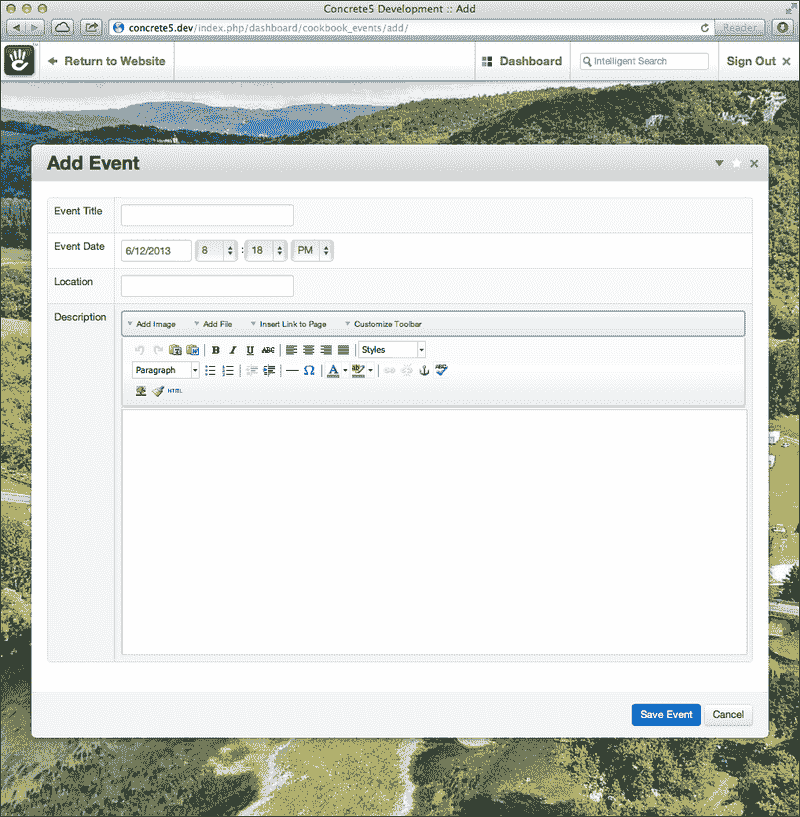
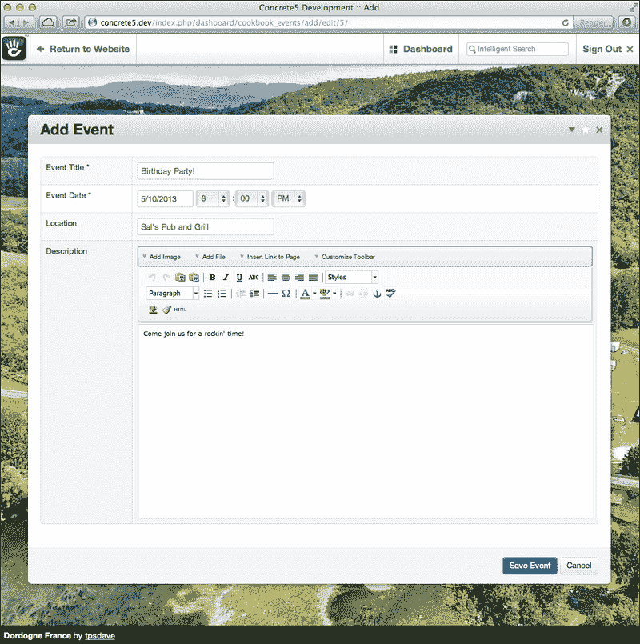
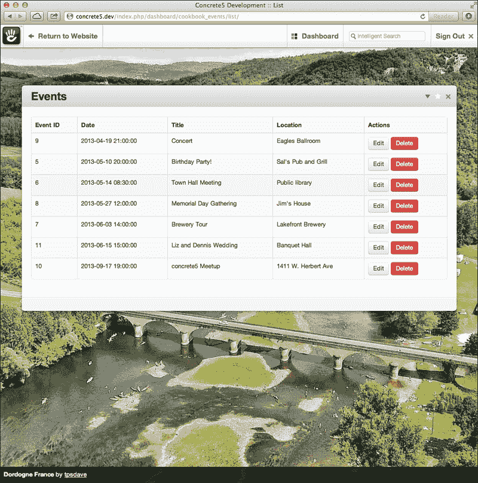
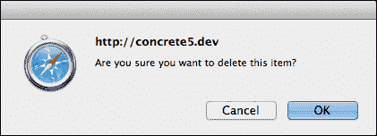
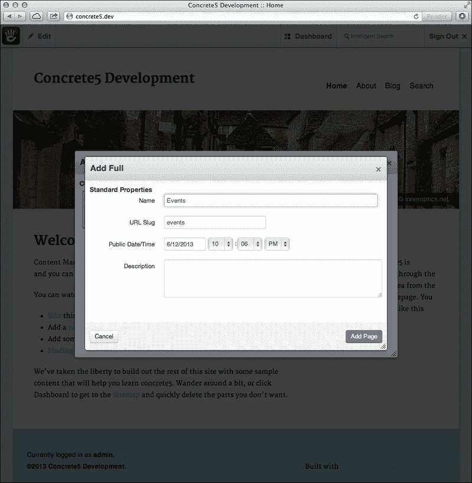
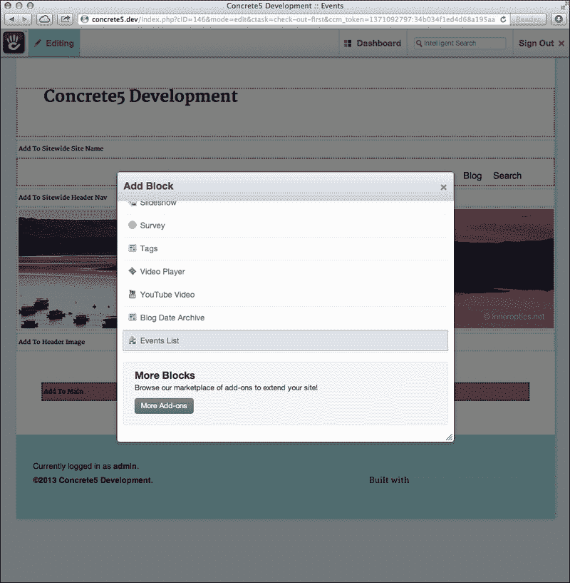
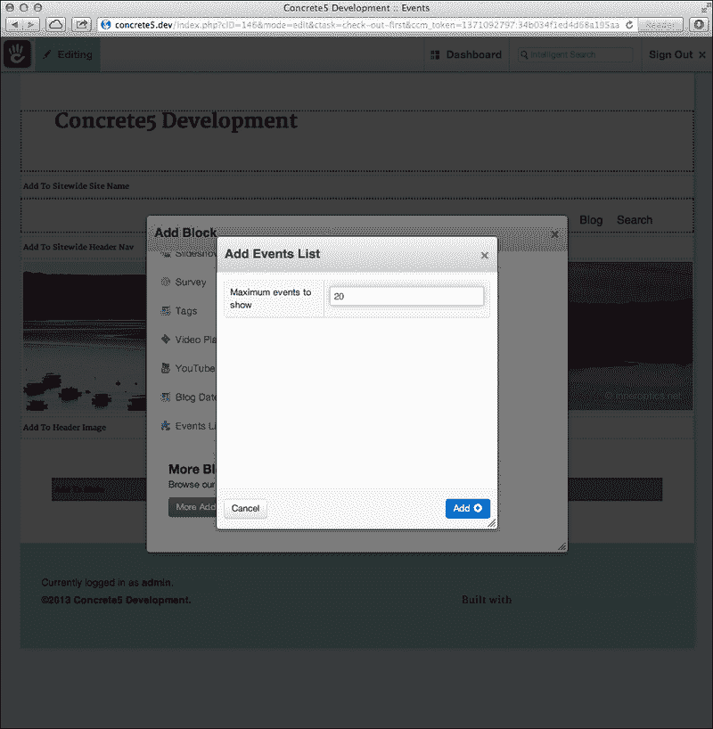
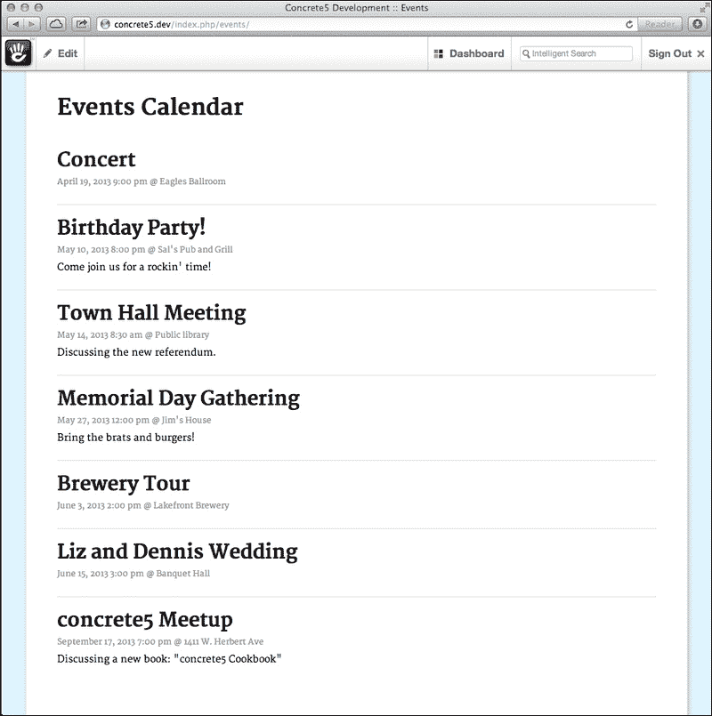

# 附录 B. 蓝图 – 创建事件日历插件

许多开发者必须创建的插件最终会结合仪表板界面和自定义块类型，不仅为网站的后端提供强大的编辑能力，还在网站的前端提供独特且强大的界面。网站上的一个常见请求是拥有一个事件日历。此蓝图将结合我们在前几章中获得的大部分知识来创建一个事件日历插件。该插件将在仪表板上具有 CRUD 界面，以及一个自定义块类型来显示事件。

# 在我们开始之前...

在我们开始之前，我们应该注意，本章中的蓝图是基于一个全新的混凝土 5 安装，并加载了所有示例内容。这将为我们提供一些不错的页面和干净的设计来工作。

此插件的完整工作代码可在书籍网站上免费获取。您可以将其作为起点下载，或用于解决您可能遇到的问题。

# 创建包

让我们开始行动。首先，我们将创建包的目录。在 `/packages` 中添加一个名为 `cookbook_events` 的新目录。在此目录内，创建包的控制器文件。

## 包控制器

您可能已经熟悉包控制器了；它们告诉混凝土 5 有关包的信息，并为开发者提供执行高级任务的功能。

在 `controller.php` 文件中输入以下代码：

```php
<?php
defined('C5_EXECUTE') or die(_("Access Denied."));
class CookbookEventsPackage extends Package {
    protected $pkgHandle = 'cookbook_events';
    protected $appVersionRequired = '5.6.0.0';
    protected $pkgVersion = '0.9.0';
    public function getPackageName() {
        return t('Cookbook Events');
    }
    public function getPackageDescription() {
        return t('A calendar of events for our website.');
    }
}
```

注意文件顶部使用的 `defined or die` 语句。这是在包中的每个 PHP 文件顶部必需的，否则如果将您的插件提交到市场，混凝土 5 将拒绝您的插件。

此外，请注意在包名称和描述字符串周围使用 `t()` 函数。这将允许翻译者以简单和一致的方式提供这些字符串的翻译。

我们将最小混凝土 5 版本设置为 5.6.0，因为我们使用了一些在混凝土 5 旧版本上不完全工作的 CSS 样式。然而，通过一些额外的工作，我们也可以支持旧版本。

## 包数据库 XML 文件

我们的包需要创建一个数据库表来存储事件数据。而不是执行原始 SQL，首选的方法是创建一个包含所有要创建的表和字段的 `db.xml` 文件。当包安装时，混凝土 5 将读取此文件并执行必要的数据库操作。

在 `/packages/cookbook_events/db.xml` 创建 `db.xml` 文件。

在文件中输入以下 XML 代码：

```php
<?xml version="1.0"?>
<schema version="0.3">
   <table name="CookbookEvents">
      <field name="id" type="I">
         <key />
         <unsigned />
         <autoincrement />
      </field>
      <field name="title" type="C" size="255"></field>
      <field name="event_date" type="T"></field>
      <field name="location" type="C" size="255"></field>
      <field name="description" type="X2"></field>
      <field name="created_by" type="I"></field>
      <field name="created_at" type="T"></field>
   </table>
</schema>
```

保存此文件。这告诉混凝土 5 创建一个名为 `CookbookEvents` 的表，其中包含标题、日期、地点、描述和一些元数据字段。使用 `db.xml` 也使得在您的插件更新时数据库升级更容易。

你可能记得这个 XML 文件使用了 ADOdb XML 模式格式，或**AXMLS**。你可以在[`phplens.com/lens/adodb/docs-datadict.htm#xmlschema`](http://phplens.com/lens/adodb/docs-datadict.htm#xmlschema)了解更多关于 AXMLS 和不同字段类型的信息。

## 模型

现在我们知道了我们的数据库表的样子，让我们创建我们将用来与表交互的模型。

在`/packages/cookbook_events/models/cookbook_event.php`创建一个新的文件。

创建`model`类并指定数据库表名：

```php
<?php
defined('C5_EXECUTE') or die(_("Access Denied."));
class CookbookEvent extends Model {
   var $_table = 'CookbookEvents';
    public function getDate() {
        return date(DATE_APP_GENERIC_MDY_FULL, strtotime($this->event_date));
    }
}
```

注意我们命名类为`CookbookEvent`而不是仅仅`Event`。这是为了防止与其他类冲突。由于`Event`是一个相当常见的类名，可能存在冲突。始终让类名尽可能独特，同时遵循约定并易于理解。

我们还添加了一个函数来返回事件的格式化版本。这将在以后很有用。

## 单页控制器

为了让我们的附加组件在仪表板上具有接口，我们需要创建几个带有控制器的单页。

在`/packages/cookbook_events/controllers/dashboard/cookbook_events.php`创建一个文件。这是附加组件的根控制器文件。给它一个基本的类文件：

```php
<?php
defined('C5_EXECUTE') or die(_("Access Denied."));
class DashboardCookbookEventsController extends Controller {
    public function on_start() {
        $this->redirect('/dashboard/cookbook_events/list');
    }
}
```

`on_start`函数将确保如果有人访问这个页面，他们将被重定向到默认视图，显示事件列表。现在让我们为这个视图创建控制器。

现在在`/packages/cookbook_events/controllers/dashboard/cookbook_events/`创建一个新的目录。向这个目录添加两个文件：`add.php`和`list.php`。

在`list.php`中添加以下类：

```php
<?php
defined('C5_EXECUTE') or die(_("Access Denied."));
class DashboardCookbookEventsListController extends Controller {   
}
```

太棒了！现在在`add.php`中添加另一个类：

```php
<?php
defined('C5_EXECUTE') or die(_("Access Denied."));
class DashboardCookbookEventsAddController extends Controller {
}
```

看起来不错！我们的单页现在有了基本的控制器，但它们仍然需要视图文件。

## 单页视图

在`/packages/cookbook_events/single_pages/cookbook_events.php`创建我们界面的根视图文件。留这个文件为空。在`/packages/cookbook_events/single_pages/cookbook_events`创建一个目录。将两个文件`add.php`和`list.php`添加到这个目录中。我们现在可以留这些文件为空。

## 事件列表块类型

在我们能够安装我们的包之前，我们需要确保该块类型也存在。这将允许我们在包安装期间自动安装块类型。

我们正在创建的这个块类型将显示已输入数据库的事件列表。它将作为网站事件的简单日程视图。

在`/packages/cookbook_events/blocks`创建一个新的目录。现在，在这个目录中创建另一个名为`cookbook_events`的目录。

我们将首先添加到我们的块中的第一个文件是控制器。在块的目录中创建`controller.php`。

在`controller.php`中输入以下代码：

```php
<?php defined('C5_EXECUTE') or die(_("Access Denied."));
class CookbookEventsBlockController extends BlockController {
    protected $btTable = "btCookbookEvents";
    protected $btInterfaceWidth = "350";
    protected $btInterfaceHeight = "300";
    public function getBlockTypeName() {
        return t('Events List');
    }
    public function getBlockTypeDescription() {
        return t('A list of events!');
    }
}
```

注意我们记得在文件顶部包含所需的 `defined or die` 语句。我们将继续使用 `Cookbook` 前缀来命名我们的类名，以便我们的类避免与现有类冲突。

我们还定义了此块类型将使用的数据库表名称。现在让我们使用数据库 XML 格式创建该表。

## 块的数据库 XML 文件

在块目录中创建一个名为 `db.xml` 的新文件。在 XML 文件中输入以下代码：

```php
<?xml version="1.0"?>
<schema version="0.3">
   <table name="btCookbookEvents">
      <field name="bID" type="I">
         <key />
         <unsigned />
      </field>
      <field name="item_limit" type="I"></field>
   </table>
</schema>
```

此 XML 代码将告诉 concrete5 创建一个包含两个字段的新表：一个唯一 ID 用于识别块，以及一个字段用于存储我们想要显示的事件数量。

## 块视图文件

如果您还记得前面的章节，块有三个可激活的视图：添加、编辑和查看。创建 `add.php`、`edit.php` 和 `view.php` 来表示这些视图。在我们的块中，`add.php` 和 `edit.php` 将显示相同的 HTML，因此我们将为这些视图创建一个第四个文件，命名为 `form.php`。另外，添加一个 `view.css` 文件，该文件将用于应用块的前端样式。

目前请留这些文件为空，因为我们准备安装我们的块！

# 安装包

在您的代码编辑器中打开包控制器（位于 `/packages/cookbook_events/controller.php`）。向控制器类中添加一个名为 `install` 的新方法。它应该看起来像以下代码片段：

```php
public function install() {
    $pkg = parent::install();
    // Add the dashboard pages
    $mainPage = SinglePage::add('/dashboard/cookbook_events', $pkg);
    $listPage = SinglePage::add('/dashboard/cookbook_events/list', $pkg);
    $addPage = SinglePage::add('/dashboard/cookbook_events/add', $pkg);
    // install the block type
    BlockType::installBlockTypeFromPackage('cookbook_events', $pkg); 
}
```

这里发生了什么？好吧，如果您还记得，我们创建了三个带有控制器的单个页面用于仪表板界面。这些页面需要添加到网站地图中，因此我们挂钩到包的安装例程，以确保它们在安装包时被安装。

接下来，我们还安装了块类型。这将确保我们的块可以在网站的前端使用。

当 concrete5 安装该包时，它将运行我们的包的 `db.xml` 文件，创建其中定义的数据库表。这将使我们的包保持完全可移植，并且可以在任何 concrete5 网站上安装。

让我们现在安装这个包。

## 将包安装到仪表板

访问您的 concrete5 网站上的包安装页面，位于 `/dashboard/extend/install/`。您应该看到等待安装的事件包，如下面的截图所示：



点击包上的 **安装** 按钮。如果一切顺利，包将被安装！我们应该在仪表板上有一些新页面，所以访问 `/dashboard/cookbook_events`。

您注意到发生了什么吗？当我们访问 `/dashboard/cookbook_events` 页面时，它将我们重定向到 `/dashboard/cookbook_events/list/`。这是故意的。仪表板的组织方式要求插件有一个父页面。这将允许我们的 **事件列表** 和 **添加事件** 单个页面在仪表板菜单中正确显示。

此列表页面仍然是完全空的。让我们添加一些 HTML 并填充它。

# 创建列表单页

首先，我们将向列表页面的控制器文件中添加一些逻辑。在您的代码编辑器中打开 `/packages/cookbook_events/controllers/dashboard/cookbook_events/list.php`。

向控制器类中添加一个视图方法：

```php
public function view() {
    Loader::model('cookbook_event', 'cookbook_events');
    $event = new CookbookEvent();
    $events = $event->find('1=1 ORDER BY event_date');
    $this->set('events', $events);
}
public function delete($id = null) {
    if ($id) {
        Loader::model('cookbook_event', 'cookbook_events');
        $event = new CookbookEvent();
        $event->load('id = ?', $id);
        $event->delete();
        $this->redirect('/dashboard/cookbook_events/list?deleted');
    }
}
```

记住`view()`是单页查看时自动执行的回调函数之一。在这里，我们正在加载我们创建并使用的`model`类，并使用它来查找数据库中所有事件的实例。然后我们使用`$this->set()`将事件对象的数组发送到视图。

我们还添加了一个函数来从系统中删除事件，使用`model`类和活动记录。

## 创建列表视图

让我们打开视图并添加一些 HTML 到其中。在您的编辑器中打开 `/packages/cookbook_events/single_pages/dashboard/cookbook_events/list.php`。

将以下 HTML 代码添加到视图文件中：

```php
<?php defined('C5_EXECUTE') or die(_("Access Denied.")); ?>
<div class="ccm-ui">

   <?php if (isset($_GET['success'])): ?>
      <div class="alert-message">
         <?php echo t('The event was saved successfully!') ?>
      </div>
   <?php endif; ?>
   <?php if (isset($_GET['deleted'])): ?>
      <div class="alert-message">
         <?php echo t('The event was deleted successfully!') ?>
      </div>
   <?php endif; ?>
   <div class="ccm-pane">
      <?php
         $dashboard = Loader::helper('concrete/dashboard');
         echo $dashboard->getDashboardPaneHeader(t('Events'));
      ?>
      <div class="ccm-pane-body">
         <?php if (!empty($events)): ?>
            <table class="table table-striped table-bordered">
               <tr>
                  <th><?php echo t('Event ID') ?></th>
                  <th><?php echo t('Date') ?></th>
                  <th><?php echo t('Title') ?></th>
                  <th><?php echo t('Location') ?></th>
                  <th><?php echo t('Actions') ?></th>
               </tr>
               <?php foreach ($events as $event): ?>
                  <tr class="event-row">
                     <td><?php echo $event->id ?></td>
                     <td><?php echo $event->getDate() ?></td>
                     <td><?php echo $event->title ?></td>
                     <td><?php echo $event->location ?></td>
                     <td>
                        <a href="<?php echo $this->url('/dashboard/cookbook_events/add/edit/', $event->id) ?>" class="btn"><?php echo t('Edit') ?></a>
                        <a href="<?php echo $this->action('delete', $event->id) ?>" class="btn danger delete"><?php echo t('Delete') ?></a>
                     </td>
                  </tr>
               <?php endforeach; ?>
            </table>
         <?php else: ?>
            <p>
               <?php echo t('There are no events! Add one now.'); ?>
            </p>
         <?php endif; ?>
      </div>
      <div class="ccm-pane-footer"></div>
   </div>
</div>
```

这里有很多东西，但实际上并不复杂。首先，我们确保在文件顶部包含`defined or die`语句。接下来，我们输出仪表板面板的标题。这包括用于在添加组件中导航的控件，以及将页面添加到主仪表板菜单中。

有一点更往下，我们检查`$events`数组中是否有内容。如果有，我们可以用 HTML 表格显示事件列表。如果没有，我们将向用户显示一条消息，说明系统中没有事件。

接下来，我们创建一个 HTML 表格来存放事件。该表格有五个列：事件 ID、事件日期、标题、地点以及一个用于对事件执行某些操作的列。

一旦我们开始遍历事件数组，我们将为系统中的每个事件输出一行表格。事件行中的每一列将输出事件对应的字段。注意使用了日期获取函数来输出格式良好的日期。

最后一个列包含编辑和删除事件的按钮。我们给**删除**按钮添加了一个额外的 CSS 类`.delete`，这将允许我们使用 JavaScript 显示一个确认消息。让我们保存这个文件并刷新页面：



看起来不错，但我们系统中还没有任何事件。让我们创建一个表单来添加事件。

# 创建添加表单单页

在您的代码编辑器中打开 `/packages/cookbook_events/controllers/dashboard/cookbook_events/add.php`。让我们向这个类中添加几个函数：

```php
public function edit($id = null) {
   if ($id) {
      // in edit mode, load the event to be edited
       Loader::model('cookbook_event', 'cookbook_events');
      $event = new CookbookEvent();
      $event->load('id = ?', $id);
      // pass the event object to the view as an array
      $this->set('data', (array) $event);
   }
}

public function save() {
   $data = $_POST;
   // verify that all required fields have been filled out
   $val = Loader::helper('validation/form');
   $val->setData($data);
   $val->addRequired('title', t('Please enter a title.'));
   $passed = $val->test();
   if (!$passed) {
      $this->set('errors', $val->getError()->getList());
   }
   else {
      $dth = Loader::helper('form/date_time');
      Loader::model('cookbook_event', 'cookbook_events');
      $event = new CookbookEvent();
      if ($data['id']) {
         $event->load('id = ?', $data['id']);
      }
      $event->title = $data['title'];
      $event->event_date = $dth->translate('event_date');
      if ($data['location']) {
         $event->location = $data['location'];
      }
      if ($data['description']) {
         $event->description = $data['description'];
      }
      if (!$data['id']) {
         $user = new User();
         $event->created_by = $user->getUserID();
         $event->created_at = date('Y-m-d H:i:s');
      }
      $event->save();

      $this->redirect('/dashboard/cookbook_events/list?success');
   }
}
```

首先，我们添加了一个函数来为这个表单提供编辑功能。本质上，如果 URL 中提供了 ID，我们将使用事件模型加载相应的事件并将其作为数组发送到视图。我们使用数组是因为如果数组为空，视图不会像对象那样产生错误。

接下来，我们定义一个实际保存新事件的函数。我们使用验证助手来验证所需字段是否已填写。之后，我们开始填充要保存到数据库的事件对象。这里需要注意的一个重要事项是我们检查`POST`数据中是否存在事件 ID。这是为了允许我们编辑现有事件，而不是创建一个重复的事件。我们还使用这个区域来设置事件的元数据，例如添加该事件的用户 ID 和创建时的时间戳。

最后，我们将事件对象保存到数据库中，并将用户重定向回事件列表，显示成功消息。

## 表单视图文件

当然，我们仍然需要编写这个单页面的另一半，即视图。让我们打开`/packages/cookbook_events/single_pages/dashboard/cookbook_events/add.php`，并向其中添加以下 HTML 和 PHP 代码：

```php
<?php 
   defined('C5_EXECUTE') or die(_("Access Denied."));
   $form = Loader::helper('form');
   $dth = Loader::helper('form/date_time');

   Loader::element('editor_init');
   Loader::element('editor_config');
?>
<div class="ccm-ui">
   <?php if (!empty($errors)): ?>
      <div class="alert-message block-message error">
         <strong><?php echo t('There were some problems saving the event.') ?></strong>
         <ul style="margin-top: 5px;">
            <?php foreach ($errors as $e): ?>
               <li><?php echo $e ?></li>
            <?php endforeach ?>
         </ul>
      </div>
   <?php endif; ?>
   <div class="ccm-pane">
      <?php
         $dashboard = Loader::helper('concrete/dashboard');
         echo $dashboard->getDashboardPaneHeader(t('Add Event'));
      ?>
      <form action=<?php echo $this->action('save') ?> method="POST">
         <div class="ccm-pane-body">
            <table class="table table-striped table-bordered">
               <tr>
                  <td class="form-label">
                     <?php echo t('Event Title') ?>
                     <span class="req">*</span>
                  </td>
                  <td>
                     <?php echo $form->text('title', $data['title']) ?>
                  </td>
               </tr>
               <tr>
                  <td class="form-label">
                     <?php echo t('Event Date') ?>
                     <span class="req">*</span>
                  </td>
                  <td>
                     <?php echo $dth->datetime('event_date', $data['event_date']) ?>
                  </td>
               </tr>
               <tr>
                  <td class="form-label">
                     <?php echo t('Location') ?>
                  </td>
                  <td>
                     <?php echo $form->text('location', $data['location']) ?>
                  </td>
               </tr>
               <tr>
                  <td class="form-label">
                     <?php echo t('Description') ?>
                  </td>
                  <td>
                     <?php
                        Loader::element('editor_controls');
                        echo $form->textarea('description', $data['description'], array('style' => 'width:100%;', 'class' => 'ccm-advanced-editor'));
                     ?>
                  </td>
               </tr>
            </table>
         </div>
         <div class="ccm-pane-footer">
            <div class="pull-right">
               <input type="submit" class="btn primary" value="<?php echo t('Save Event') ?>">
               <a href="<?php echo $this->url('/dashboard/cookbook_events/list') ?>" class="btn"><?php echo t('Cancel') ?></a>
            </div>
         </div>
         <?php if (!empty($data)): ?>
            <input type="hidden" name="id" value="<?php echo $data['id'] ?>">
         <?php endif; ?>
      </form>
   </div>
</div>
```

哇，这代码好多！别担心，它并没有看起来那么复杂。在文件顶部，我们当然添加了我们的`defined or die`语句，然后加载两个助手，即表单助手和日期字段助手。

由于我们的事件描述字段可以包含 HTML 格式，我们需要使用一个所见即所得（WYSIWYG）编辑器。这个编辑器在加载之前需要在页面上添加一些特殊的 JavaScript，所以我们立即使用`editor_init`和`editor_config`元素输出它。

接下来，我们首先显示在保存过程中发生的任何错误（例如，如果标题字段被留空）。之后，我们使用 concrete5 的仪表板助手输出页面的标题，包括原生页面控件。

之后，我们将定义表单，设置表单的动作使用本页面控制器中的`save`函数，并设置 HTTP 方法为`POST`。

在表单内部，我们使用表格来为我们的表单提供一个简单的布局。我们输出标题、位置、日期和描述的字段。在页面底部，我们显示一些按钮来保存数据或取消并返回到事件列表。现在让我们在我们的浏览器中查看这个表单！



看起来很棒！现在让我们使用这个表单添加一些事件到网站上。

# 将事件添加到数据库

填写出现的**添加事件**表单，添加一些要添加到数据库的事件：



一旦你输入了几个事件，你的列表视图应该看起来像以下这样：



看起来很棒！让我们点击这些事件中的一个的**删除**按钮。它有效，但如果用户改变主意，他们没有任何机会取消这个操作。我们应该使用 JavaScript 询问用户他们是否确定要删除该事件。

# 添加删除确认

让我们在`/packages/cookbook_events/js/list.js`中添加一个新的 JavaScript 文件。添加一些 JavaScript（使用 jQuery 库）以监听**删除**按钮的点击：

```php
$(document).ready(function() {
   $('.delete').on('click', function(e) {
      return confirm('Are you sure you want to delete this item?');
   });
});
```

接下来，我们需要确保这个脚本包含在我们的列表页面上。打开位于`/packages/cookbook_events/controllers/dashboard/cookbook_events/list.php`的列表页面的控制器。

向页面添加一个新函数以包含 JavaScript 文件：

```php
public function on_before_render() {
    $html = Loader::helper('html');
    $this->addHeaderItem($html->javascript('list.js', 'cookbook_events'));
}
```

这个函数将使用 HTML 助手自动将`<script>`标签添加到页面的`<head>`区域。

现在，如果你尝试删除一个事件，你应该会看到一个确认对话框，如下面的截图所示：



完美！我们可以认为插件的后端已经完成！剩下要做的就是在前端显示事件。

# 创建自定义块类型

如果你记得，我们为我们的块类型创建了一些样板文件，但实际上并没有做任何事情。我们希望创建一个显示数据库中输入的事件列表的块。

首先，让我们向`form.php`添加 HTML 表单，该表单将在网站编辑器添加或编辑块时显示：

```php
<?php
defined('C5_EXECUTE') or die(_("Access Denied.")); 
$form = Loader::helper('form');
?>
<div class="ccm-ui">
   <table class="table table-striped table-bordered">
      <tr>
         <td>
            <?php echo t('Maximum events to show') ?>
         </td>
         <td>
            <?php echo $form->text('item_limit', $item_limit) ?>
         </td>
      </tr>
   </table>
</div>
```

太好了！让我们将此文件包含在`add.php`和`edit.php`中。向每个文件添加以下内容：

```php
<?php 
defined('C5_EXECUTE') or die(_("Access Denied.")); 
include('form.php');
```

好吧！我们现在要做的就是创建块的客户端视图。在你的代码编辑器中打开`view.php`，并输入以下 HTML 和 PHP 代码：

```php
<?php defined('C5_EXECUTE') or die(_("Access Denied.")); ?>
<h1 class="events-title"><?php echo t('Events Calendar') ?></h1>
<div class="events-list">
   <?php if (!empty($events)): ?>
      <?php foreach ($events as $event): ?>
         <div class="event-item">
            <h2><?php echo $event->title ?></h2>
            <div class="event-date">
               <?php echo $event->getDate() ?>
               <?php if ($event->location): ?>
                  @ <?php echo $event->location ?>
               <?php endif; ?>
            </div>
            <?php if ($event->description): ?>
               <div class="event-description">
                  <?php echo $event->description ?>
               </div>
            <?php endif; ?>
         </div>
      <?php endforeach; ?>
   <?php else: ?>
      <p><?php echo t('There are no events!') ?></p>
   <?php endif; ?>
</div>
```

看起来很棒！在这里，我们实际上是在遍历`$events`数组并为每个事件显示一行。我们再次利用事件模型上的`getDate()`函数来输出干净友好的日期。

最后，让我们向`view.css`添加一些简单的 CSS 样式：

```php
h1.events-title {
    margin-bottom: 30px !important;
}
.event-item {
    padding: 20px 0;
    border-bottom: 1px solid #ddd;
}
.event-item:last-child {
    border-bottom: 0;
}
.event-item p {
    margin: 0 !important;
}
.event-date {
    font-size: 12px;
    color: #888;
}
```

很好！现在我们准备好看到它的实际效果了！

# 将块添加到页面

在网站上创建一个新页面来保存事件：



在此页面上添加一个新块。滚动到块列表的底部，查看我们创建的块：



填写表格以将块添加到页面。设置要显示的事件数量限制。



现在将页面上的更改发布。你应该会看到一个令人印象深刻的事件列表！



# 总结

哇，我们取得了很大的成就！我们从一无所有开始，构建了一个完全功能的事件日历插件。这个插件可以扩展以显示事件的不同模板，或者包括高级功能，例如隐藏已发生的事件，或者在网站地图中为每个事件提供自己的页面。

希望这次练习能帮助你获得如何为任何需求或情况创建包的想法。
