# 模块

当你在模块中将一些类放在一起时，你是在告诉下一个查看你设计的设计师将它们一起考虑。如果你的模型在讲述一个故事，模块就是章节。

[《领域驱动设计：软件核心的复杂性处理》](https://www.amazon.com/Domain-Driven-Design-Tackling-Complexity-Software/dp/0321125215)

-埃里克·埃文斯

在遵循领域驱动设计（Domain-Driven Design）构建应用程序时，一个常见的担忧是代码的放置位置。具体来说，如果你正在使用 PHP 框架，了解推荐的代码放置方式、基础设施代码的放置位置以及模型内部不同概念应该如何结构化是很重要的。

在领域驱动设计中，有一个战术模式用于此：**模块**。如今，每个人都以模块的形式结构化代码。所有语言都有某种工具可以将类和语言定义分组在一起。Java 有包。Ruby 有模块。**PHP 有命名空间**。

领域驱动设计更进一步，将你的类打包和分组，并给这些构建块赋予语义意义。确实，**它将模块视为模型的一部分**。作为模型的一部分，找到最佳命名、将彼此接近的领域对象分组在一起，以及保持不相关的领域对象解耦是很重要的。**模块不应被视为分离代码的方式，而应被视为在模型中分离有意义概念的方式**。

# 概述

如第一章“领域驱动设计入门”中所述，我们的领域在内部组织为子领域。每个子领域理想情况下由一个边界上下文（Bounded Context）建模和实现，但有时可能需要多个。如果设计得当，每个边界上下文都是一个独立的系统，将由一个团队开发和维护。我们的建议是使用整个应用程序来实现每个边界上下文。这意味着两个边界上下文不会生活在同一个代码仓库中。因此，它们可以独立部署，有不同的开发周期，甚至可以使用不同的语言进行开发。在你的边界上下文中，你会使用模块来分组彼此之间有强关系的领域对象。

# 利用 PHP 中的模块

直到 PHP 5.3，模块没有得到完全支持。但自从 PHP 5.3 的引入以来，我们可以使用 PHP 命名空间来实现模块模式。出于历史原因，我们将展示在 PHP 5.3 之前如何使用命名空间，但你应努力使用支持 PHP 命名空间的 PHP 版本。最佳选择始终是 PHP 的最新稳定版本。

# 一级命名空间

常见的方法是使用一级命名空间来标识您的公司。这将有助于避免与第三方库发生冲突。如果您使用 PSR-0，您将有一个真实的文件夹用于命名空间；如果您使用 PSR-4，则不需要。我们稍后会深入探讨这个问题。但首先，让我们看看 PHP 命名空间的约定。

# PEAR 风格命名空间

在 PHP 5.3 之前，由于缺乏命名空间结构，使用了 PEAR 风格的命名空间。PEAR 是 PHP 扩展和应用仓库的缩写，在那些美好的日子里，它是一个可重用组件的仓库。它仍然活跃，但不是很方便，而且很少有人再使用它——尤其是在 Composer 和 Packagist 引入之后。作为可重用组件的来源，PEAR 需要一种避免类名冲突的方法，因此贡献者开始将命名空间前缀添加到类名中。还有一些项目使用这种命名空间形式（例如 *PHPUnit* 和 *Zend* 框架 1）。以下是一个 PEAR 风格命名空间的示例：

以下是一个 PEAR 风格命名空间的示例：

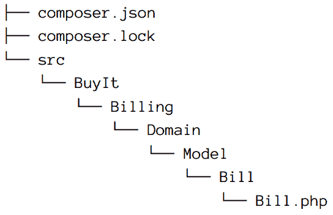

使用 PEAR 风格命名空间，Bill 实体的类名将变为 `BuyIt_Billing_Domain_Model_Bill_Bill`。然而，这有点难看，并且它没有遵循领域驱动设计的主要原则之一：每个类名都应该用通用语言来命名。因此，我们强烈反对使用它。

# PSR-0 和 PSR-4 命名空间

当 PHP 5.3 引入时，命名空间进入了场景，以及其他一些重要特性。这是一个重大转变，一些最重要的框架合作者组成了 [PHP-FIG](http://www.php-fig.org/)，即 PHP 框架互操作性小组的缩写，试图标准化和统一框架和库创建的常见方面。该小组发布的第一个 **PHP 标准建议**（**PSR**）是一个自动加载标准，简而言之，它提出了一个类与 PHP 文件之间的一对一关系，使用命名空间。今天，[PSR-4](http://www.php-fig.org/psr/psr-4/) —— 这是 [PSR-0](http://www.php-fig.org/psr/psr-0/) 的简化版本，仍然保持了类与物理 PHP 文件之间的关系 —— 是结构代码的首选和推荐方式。我们相信，这应该是用于在项目中实现模块的方式。

回顾上一节中显示的相同文件夹结构，让我们看看 PSR-0 会有什么变化。使用命名空间和 PSR-0，Bill 实体的类名将简单地成为 Bill，完全限定类名将是 `BuyIt\Billing\Domain\Model\Bill\Bill`。

如您所见，这使我们能够用通用语言命名域对象，这是组织和结构代码的首选方式。如果您使用 Composer（您应该这样做），您需要在您的 `composer.json` 文件中设置一些自动加载配置：

```php
...
"autoload": {
    "psr-0": {
        "BuyIt\\": "src/BuyIt/"
    }
},
"autoload-dev": {
    "psr-0": {
        "BuyIt": "tests/BuyIt/"
    }
},
...

```

如果你还没有使用 PSR-4 或尚未从 PSR-0 迁移，我们强烈建议这样做。你可以去掉一级命名空间文件夹，你的代码结构将更好地匹配通用语言：

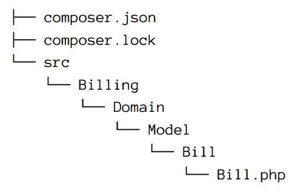

然而，为了避免与第三方库冲突，仍然建议在`composer.json`文件中添加一级命名空间：

```php
...
"autoload": {
    "psr-4": {
        "BuyIt\\": "src/"
    }
},
"autoload-dev": {
    "psr-4": {
        "BuyIt\\": "tests/"
    }
},
...

```

如果你更喜欢使用一级命名空间但使用 PSR-4，需要做一些小的修改：

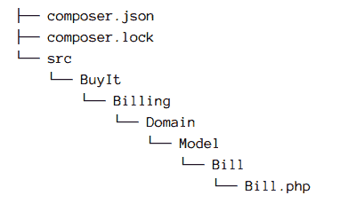

```php
...
"autoload": {
    "psr-4": {
        "BuyIt\\": "src/BuyIt/"
    }
},
"autoload-dev": {
    "psr-4": {
        "BuyIt\\": "tests/BuyIt/"
    }
},
...

```

正如你可能在示例中注意到的，我们拆分了`src`和`tests`文件夹。这样做是为了优化 Composer 生成的自动加载文件，这将减少存储类映射所需的内存。它还将帮助你设置在生成单元测试代码覆盖率报告时的白名单和黑名单选项。如果你想了解更多关于 Composer 自动加载配置的信息，请查看[文档](https://getcomposer.org/doc/04-schema.md#autoload)。

那么，PHAR 文件怎么办？

它们也可以被使用，但我们不建议这样做。作为一个练习，列出使用 PHAR 文件来建模模块的优缺点列表。

# 边界上下文和应用程序

如果以一家名为`BuyIt`的虚构公司为例，该公司从事电子商务领域，为解决特定的领域区域，为每个不同的边界上下文创建不同的应用程序可能是有意义的。

如果一些不同的边界上下文是订单管理、支付管理、目录管理和库存管理，我们建议为每个一个创建一个应用程序：

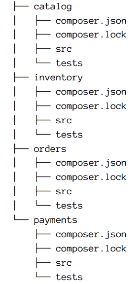

每个应用程序都公开任何所需的交付机制。随着微服务趋势的兴起，越来越多的人构建最终向外界暴露 REST API 的边界上下文。然而，边界上下文不仅仅是 API。记住，API 只是许多交付机制之一；边界上下文还可以提供一个用于交互的 Web 界面。

两个边界上下文能否在同一个应用程序中？反过来呢？

最佳选择是一个子域，一个边界上下文，一个应用程序。如果我们有一个使用两个应用程序实现的边界上下文，维护和部署会变得有些棘手。如果一个应用程序实现了两个边界上下文，部署过程、运行测试的时间和合并问题可能会减慢开发速度。

注意，每个边界上下文名称代表我们电子商务领域中的一个有意义的概念，并且是以通用语言命名的：

+   **目录**用于存放所有与产品描述、产品组合等相关代码。

+   **库存**用于存放所有与产品库存管理相关的代码。

+   **订单**用于存放所有与订单处理系统相关的代码。它将包含负责处理订单的有限状态机。

+   **Payments** 用于存放所有与支付、账单和运单相关的代码。

# 在模块中组织代码

让我们进一步探讨其中一个边界上下文。以订单上下文为例，并检查结构细节。正如其名称所暗示的，这个边界上下文负责表示订单所经过的所有流程——从其创建到交付给购买者的过程。此外，它是一个独立的应用程序，因此包含源代码文件夹和测试文件夹。源代码文件夹包含使此边界上下文正常工作所需的所有代码：领域代码、基础设施代码和应用层。

以下图表应说明组织结构：

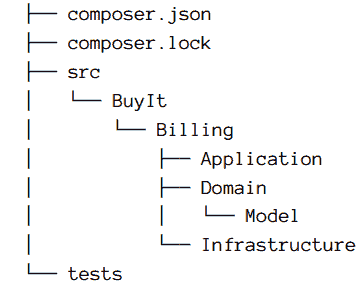

所有代码都以前缀为组织名称（在这种情况下为 `BuyIt`）的供应商命名空间命名，并包含两个子文件夹：**Domain** 包含所有领域代码，**Infrastructure** 包含基础设施层，从而将所有领域逻辑与基础设施层的细节隔离开来。遵循此结构，我们明确表示我们将使用六边形架构作为基础架构。以下是一个可用的替代结构示例：

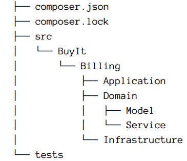

上述结构风格使用一个额外的子文件夹来存储在领域模型中定义的服务。虽然这种组织方式可能是有意义的，但我们的偏好是不要使用它，因为这种分离代码的方式往往更关注于架构元素，而不是模型中的相关概念。我们相信这种风格很容易导致在领域模型之上出现某种服务层，这并不一定是一件坏事。记住，领域服务用于描述不属于实体或值对象的领域中的操作。因此，从现在起，我们将坚持使用之前的代码组织方式。

可以直接在 `Domain/Model` 子文件夹中放置代码。例如，可能习惯于在其中放置常见的接口和服务，如 `DomainEventPublisher` 或 `DomainEventSubscriber`。

如果我们必须对订单管理上下文进行建模，我们可能会有一个 `Order` 实体及其存储库和所有状态信息。因此，我们的第一次尝试可能是直接将这些元素放置在 `Domain/Model` 子文件夹中。乍一看，这似乎是最简单的方法：

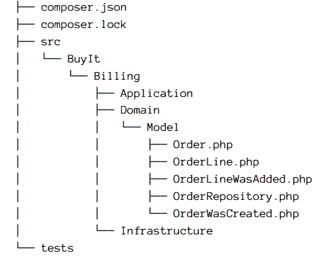

# 设计指南

考虑一些基本规则和典型问题，在实现模块时要注意：

+   命名空间应使用通用语言命名。

+   不要根据模式或构建块（值对象、服务、实体等）来命名你的命名空间。

+   创建命名空间，使得其内部内容尽可能松散地与其他命名空间耦合。

+   以与你的代码相同的方式重构命名空间。移动它们、重命名它们、分组它们、提取它们，等等。

+   不要使用商业产品名称，因为它们可能会改变。坚持使用通用语言。

我们已经将订单和`OrderLine`实体、`OrderLineWasAdded`和`OrderWasCreated`事件以及`OrderRepository`放入同一个子文件夹`Domain/Model`中。这种结构可能很好，但这是因为我们仍然有一个简单的模型。那么`Bill`实体及其仓库呢？或者`Waybill`实体及其相应的仓库？让我们添加所有这些元素，看看它们如何适应实际的代码结构：

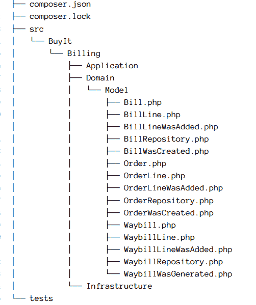

虽然这种代码组织风格可能很好，但从长远来看，它可能变得不切实际且难以维护。每次我们迭代并添加新功能时，模型都会变得更大，子文件夹将消耗更多的代码。我们需要以某种方式拆分代码，以便我们可以一眼看出模型的全貌。没有技术问题，只有领域问题。为了达到这个目标，我们可以使用通用语言来拆分模型，通过找到有助于我们在领域内逻辑地分组元素的有意义的概念。

为了做到这一点，我们可以尝试以下方法：

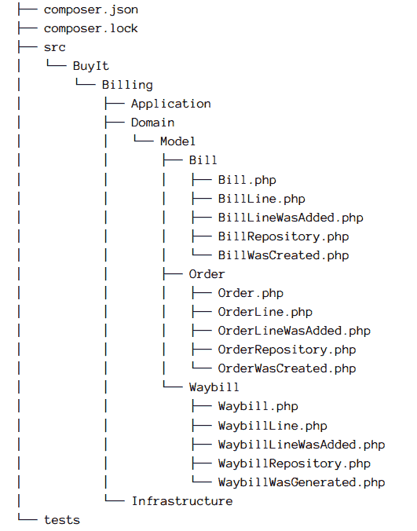

这样做，代码在概念上更加有序。正如埃里克·埃文斯在[《蓝皮书》](http://www.amazon.com/Domain-Driven-Design-Tackling-Complexity-Software/dp/0321125215)中指出的，模块是沟通的一种方式，因为它们为我们提供了关于领域模型内部工作方式的见解，同时帮助我们增加概念之间的内聚性并减少耦合性。如果我们看看之前的例子，我们可以看到概念`Order`和`OrderLine`之间有很强的关联，所以它们位于同一个模块中。另一方面，订单和运单，尽管共享相同的环境，但它们是不同的概念，所以它们位于不同的模块中。模块不仅仅是将模型中的相关概念分组的一种方式，也是表达模型设计部分的一种方式。

我们是否应该将仓库、工厂、领域事件和服务放在各自的子文件夹中？

实际上，它们可以被放入它们自己的子文件夹中，但强烈建议不要这样做。这样做，我们会混淆技术问题和领域问题——记住，模块的主要兴趣是分组来自领域模型的相关概念，并将它们与不相关的概念解耦。模块不是分离代码，而是分离有意义的概念。

# 基础设施层的模块

到目前为止，我们一直在讨论如何在领域层中结构和组织代码，但我们几乎没有提到基础设施层。由于我们正在使用六边形架构来反转领域层和基础设施层之间的依赖关系，我们需要一个可以放置所有在领域层中定义的接口实现的地方。回到计费上下文的例子，我们需要一个放置`BillRepository`、`OrderRepository`和`WaybillRepository`实现的地方。

很明显，它们应该放在基础设施文件夹中，但具体在哪里？假设我们决定使用 Doctrine ORM 来实现持久性层。我们如何将我们的存储库的 Doctrine 实现放入基础设施文件夹？让我们直接操作并看看效果：

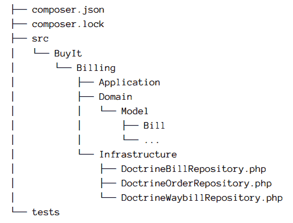

我们可以保持现状，但正如我们在领域层看到的，这种结构和组织会很快腐烂，并在几个模型迭代后变得混乱。每次模型增长，可能需要更多的基础设施，我们最终会混合不同的技术问题，如持久性、消息传递、日志记录等。我们第一次尝试避免基础设施实现混乱的方法是为每个技术问题在边界上下文中定义一个模块：

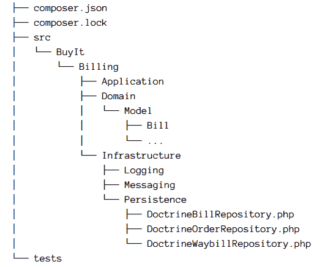

这看起来要好得多，并且从长远来看，比我们的第一次尝试更容易维护。然而，我们的命名空间缺少某种与通用语言的关系。让我们考虑一种变化：

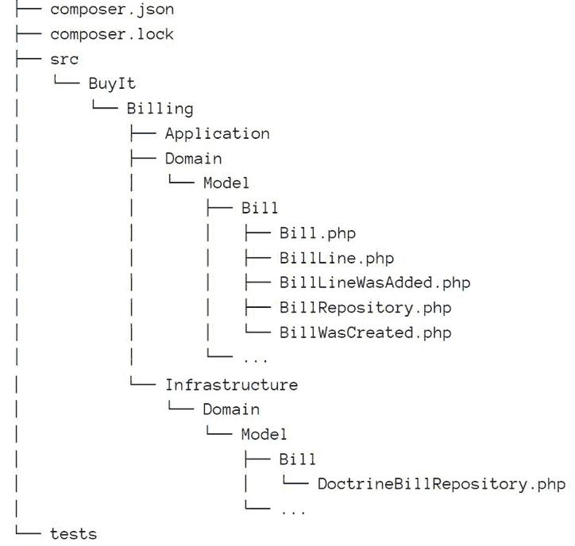

这要好得多。它与我们的领域模型组织相匹配，但位于基础设施层——而且似乎一切都更容易找到。如果你事先知道你将始终只有一个持久性机制，你可以坚持这种结构和组织。它相当简单且易于维护。

但当你必须与几种持久性机制打交道时怎么办？如今，拥有关系型持久性机制和一些共享内存持久性（如 Redis 或 Riak）或拥有某种本地内存实现以便能够测试代码是很常见的。让我们看看这如何与实际方法相匹配：

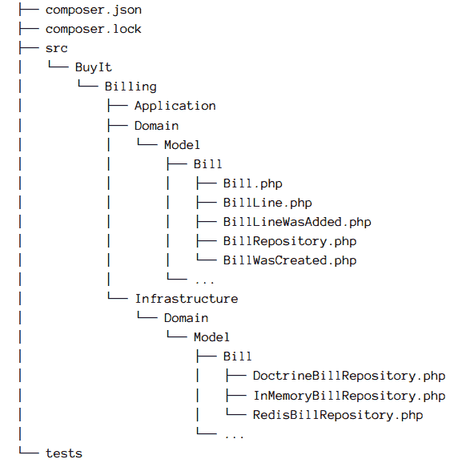

我们推荐上述方法。然而，所有存储库实现都生活在同一个模块中。当有这么多不同的技术时，这可能会显得有些奇怪。如果你对此感兴趣，你可以创建一个额外的模块来按其底层技术分组相关实现：

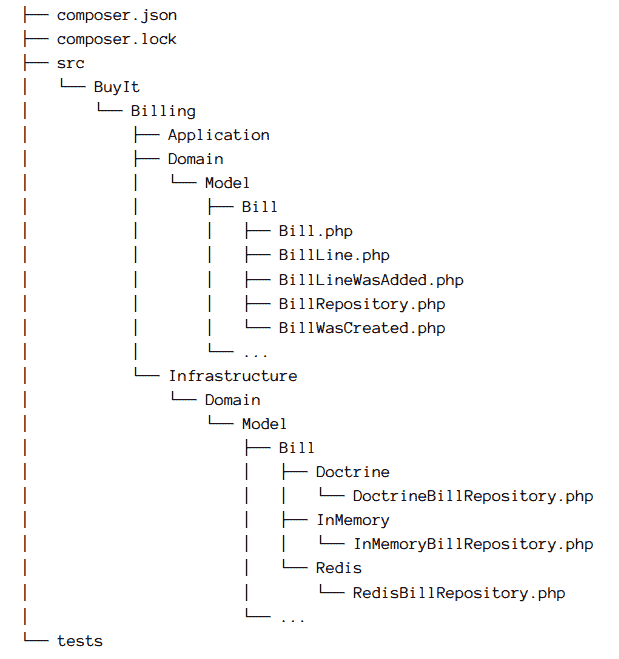

这种方法与单元测试组织类似。然而，有一些类、配置、模板等无法与领域模型匹配。这就是为什么你可能在基础设施模块内部有额外的模块，它们与特定技术相关。

你应该把 Doctrine 映射文件或 Twig 模板放在哪里？

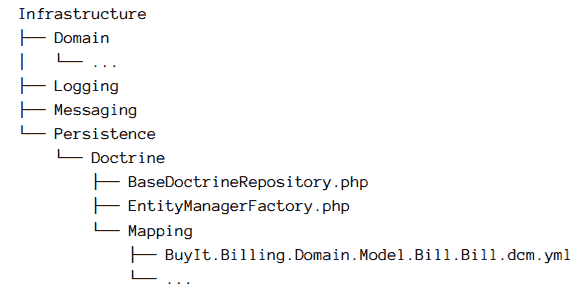

如您所见，为了使 Doctrine 工作，我们需要一个 `EntityManagerFactory` 和所有映射文件。我们还可以包括任何其他作为基类的所需基础设施对象。因为它们与我们的领域模型没有直接关系，所以将这些资源放在不同的模块中会更好。同样的事情也发生在交付机制（API、Web、控制台命令等）上。实际上，您可以为每个交付机制使用不同的 PHP 框架或库：

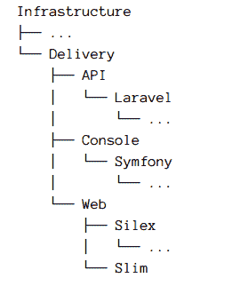

在前面的示例中，我们使用了 Laravel 框架来提供 API 服务，使用 Symfony Console 组件作为命令行的入口点，使用 Silex 和 Slim 作为 Web 交付机制。关于`用户界面`，你应该将其放置在每个交付机制内部。然而，如果有可能在不同交付机制之间共享 UI，你可以在持久化或交付同一级别创建一个名为 UI 的模块。一般来说，我们的建议是努力按照框架指示的方式来组织代码。框架应该服从你，而不是反过来。

# 混合不同技术

在大型业务关键型应用中，混合使用几种技术是很常见的。例如，在读取密集型的 Web 应用中，通常会有某种去规范化数据源（如 Solr、Elasticsearch、Sphinx 等），它提供应用的所有读取操作，而传统的 RDBMS 如 MySQL 或 Postgres 主要负责处理所有写入操作。当这种情况发生时，通常会出现的一个问题是，我们是否可以让读取操作与搜索引擎一起进行，而写入操作与传统的 RDBMS 数据源一起进行。我们在这里的一般建议是，这类情况是 CQRS 的信号，因为我们需要独立扩展应用的读取和写入。所以，如果您能采用 CQRS，那可能是最佳选择。

但如果您由于任何原因不能采用 CQRS，则需要另一种方法。在这种情况下，使用来自*四人帮*的代理模式很有用。我们可以根据代理模式定义一个仓库的实现：

```php
namespace BuyIt\Billing\Infrastructure\FullTextSearching\Elastica;

use BuyIt\Billing\Domain\Model\Order\OrderRepository;
use BuyIt\Billing\Infrastructure\Domain\Model\Order\Doctrine\
    DoctrineOrderRepository;

class ElasticaOrderRepository implements OrderRepository 
{ 
    private $client; 
    private $baseOrderRepository;

    public function __construct(
        Client $client,
        DoctrineOrderRepository $baseOrderRepository
    ) {
        $this->client = $client;
        $this->baseOrderRepository = $baseOrderRepository;
    }

    public function find($id) 
    {
        return $this->baseOrderRepository->find($id);
    }

    public function findBy(array $criteria)
    {
        $search = new \Elastica\Search($this->client);
        // ...
        return $this->toOrder($search->search());
    }

    public function add($anOrder)
    {
        // First we attempt to add it to the Elastic index
        $ordersIndex = $this->client->getIndex('orders');
        $orderType = $ordersIndex->getType('order');
        $orderType->addDocument(
            new \ElasticaDocument(
                $anOrder->id(),
                $this->toArray($anOrder)
            )
        );

        $ordersIndex->refresh();

        // When it is done, we attempt to add it to the RDBMS store
        $this->baseOrderRepository->add($anOrder);
    }
}

```

本例提供了一个使用`DoctrineOrderRepository`和 Elastica 客户端的简单实现，Elastica 客户端是一个用于与 Elasticsearch 服务器交互的客户端。请注意，对于某些操作，我们使用 RDBMS 数据源，而对于其他操作，我们使用 Elastica 客户端。此外，请注意，添加操作由两部分组成。第一部分尝试将订单存储到 Elasticsearch 索引中，第二部分尝试将订单存储到关系型数据库中，并将操作委托给 Doctrine 实现。请记住，这只是一个示例和一种做法。它可能需要改进——例如，现在整个添加操作是同步的。我们可以将操作入队到某种消息中间件中，例如，以便将订单存储在 Elasticsearch 中。有很多可能性，具体取决于您的需求。

# 应用层中的模块

我们已经看到了领域和基础设施模块，现在让我们看看应用程序层。在领域驱动设计中，我们建议使用应用程序服务作为从客户端解耦领域模型及其交互所需必要知识的一种方式。正如你将在第十一章中看到的，*应用程序*，一个应用程序服务与其依赖项一起构建，使用 DTO 请求执行，并返回 DTO 响应。

它还可以使用输出依赖项来返回结果：

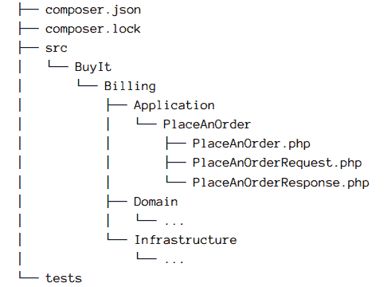

我们的建议是围绕应用程序服务创建模块。每个模块将包含其请求和响应。如果你使用数据转换器作为输出依赖项，就像处理 UI 一样，遵循基础设施方法。

# 总结

模块是我们应用中分组和分离概念的一种方式。模块的命名应遵循通用语言。我们不应忘记模块是传达高级概念的一种方式，这有助于我们保持耦合度低、内聚度高。我们已看到，通过使用前缀，即使在旧版本的 PHP 中，我们也能创建有意义的模块。如今，遵循 PSR-0 和 PSR-4 命名空间约定来构建模块变得很容易。
