# 第五章 用户、角色和权限

是时候看看运营 Drupal 网站的一个完全不同的方面了。到目前为止，我们一直专注于添加和组织网站的基本功能。我们还没有考虑过这些功能是如何被访问的，或者由谁访问。随着网站的发展，你很可能会觉得需要将某些责任委托给不同的人。或者，你可能组织一个团队来处理网站的特定方面。无论你的需求是什么，在某个阶段，你将不得不做出关于谁可以做什么的决定，而 Drupal 的好人们已经确保了这一点是可能的。

与上一章类似，Drupal 简化了你的访问控制策略的实施，并不意味着这项任务微不足道。在幕后仍然需要很多思考，以便创建一个复杂且最重要的是有效的策略来控制对网站的访问。因此，我们将花一些时间探讨各种选择的后果，而不仅仅是列出它们。以整体的方法来考虑你的访问控制策略将确保你不会在将来遇到任何令人不快的惊喜。

由于我们已经在 Drupal 上工作了一段时间，我们将开始尝试一些由贡献模块提供的更高级的方法。具体来说，本章将探讨以下主题：

+   规划访问策略

+   角色

+   权限——包括使用*分类访问控制*模块

+   用户

+   访问规则

在我们继续之前，值得指出的是，目前你很可能正在使用管理用户（用户编号 1）来满足所有网站的开发需求。这是完全可以接受的，但一旦你对网站进行了任何重大更改，你应该开始使用只有完成日常任务所需权限的正常管理用户。下一节将强调用户访问背后的总体理念，这将使这一做法的原因变得清晰。

# 规划访问策略

当你思考你的网站应该如何运作时，你需要专注于自己、其他社区成员或甚至匿名用户需要做什么。换句话说，*是否会有一个团队的中介人员来确保网站内容符合良好的品味，避免仇恨言论等材料？是否会有允许创建和维护自己内容的主题专家？匿名访客将被允许参与多少，或者他们是否只能被动浏览而无法贡献？*

一些用户可能觉得希望网站的使用能够随着社区的自然增长而发展，因此希望自己的方法非常灵活。然而，鉴于在 Drupal 中更改设置非常容易，你可以认为你的网站和访问政策已经足够灵活。这意味着没有人可以免除制定一个适当的访问控制计划。如果你随着时间的推移需要更改它，那就这么做吧，但至少从开始就会有一套连贯的角色。

那么，我们从哪里开始呢？可以直接应用于我们情况的第一个也是最重要的安全规则是：

### 注意

授予用户完成预期任务所需的权限，不要更多！

我们的所有方法都将受此规则支配。稍加思考，你应该能够理解为什么这一点如此重要。显然，任何人都不会希望匿名用户能够修改一位受人尊敬的行业专家的个人博客。这意味着每种类型的用户都应该拥有经过仔细控制的权限，以有效地阻止他们超出其角色范围的行为。

这样做的结果是，你会发现创建更多具体的角色比创建一个或两个通用角色，然后让每个人都使用这些万能权限要好。Drupal 让我们能够精细控制用户可以完成的事情，你应该充分利用这一功能。思考以下图示（这并不一定代表你网站上实际的角色——它只是一个例子）可能会有所帮助：

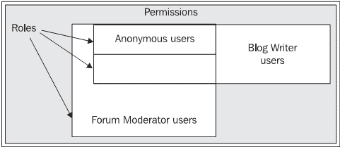

阴影区域代表网站可用的总权限数量。这个集合中包含了默认存在的各种角色，比如**匿名用户**角色，或者你创建的以适应网站所需的不同类型用户的角色——在这个例子中，是**博客作者用户**和**论坛管理员用户**角色。每个角色可以包含任意数量的用户。

从之前的图中可以看出，**匿名用户**拥有最小的权限集合，因为他们拥有整个图中最小的区域。这个权限集合完全被**论坛管理员用户**和**博客作者用户**所包含——这意味着论坛管理员和博客作者可以做任何匿名用户能做的事情，还能做更多。

当然，博客作者有一项不同的职责。虽然他们与论坛管理员共享一些共同权限，但他们也有一些自己的权限。作为主要或管理用户，你的权限涵盖了整个集合，因为你不应该有任何无法控制的事情。

由您决定哪些角色最适合网站，但在尝试之前，重要的是要问自己：**什么是角色？它们最初是如何被使用的？**为了回答这个问题，让我们更详细地看看实际操作的方面。

# 角色

我们没有从用户讨论开始我们的实际访问控制探讨，这看起来可能有些奇怪。毕竟，这全部关乎用户可以做什么和不能做什么！立即讨论用户的问题在于，单个用户的焦点过于狭窄，通过更广泛地使用角色来控制访问，我们可以学到更多。一旦我们了解了关于角色的一切，实际处理用户就变得微不足道了。

在 Drupal 中，用户角色类似于戏剧中的角色。在戏剧中，演员必须始终忠于自己的角色——换句话说，有明确的行为方式，角色永远不会偏离（无论哪个演员扮演该角色），否则就会打破幻觉。同样，Drupal 允许定义角色，这些角色决定了用户的行为。在 Drupal 中创建角色非常简单！只需点击**管理**下的**访问控制**链接，然后选择**角色**标签，即可打开以下简单的界面：

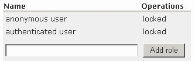

如您所见，我们默认已经定义了两个角色——**匿名用户**和**认证用户**。这些角色无法更改，因此**操作**列永久设置为**锁定**。一开始，匿名用户（这是指那些未登录就浏览网站的用户）的权限设置非常少，尽管可以赋予他们任何权限，但您很可能希望保持这种状态。

同样，默认情况下，认证用户比匿名用户只有少数更多的权限，也有道理将这些权限保持在最低限度。我们很快就会看到如何决定谁应该拥有哪些权限。

要添加新角色，只需输入角色的名称，然后点击**添加角色**，任务就完成了！**但您想添加什么名称呢？**这是一个问题！如果您不确定使用什么名称，那么很可能您还没有清楚地定义该角色想要服务的目的。为了了解如何做到这一点，让我们假设*Contechst Wildlife Community*需要一个论坛管理员，这个管理员在所有方面都将是普通用户，除了能够直接在**保护**论坛上工作（从管理员手中分担一些责任）以创建新主题和必要时编辑内容。

因此，为了开始操作，我们输入**论坛管理员用户**并点击**添加角色**——实际上，你可能甚至想要更具体一些，在这个例子中使用**保存论坛管理员用户**，但基本概念是一样的。就这样！我们已经成功添加了角色。现在，当你看到**角色**页面时，你应该能够查看新角色，页面的右侧显示了编辑选项。你可以点击**编辑**来更改角色的名称或完全删除它。

我们的工作才刚刚开始，因为现在我们需要授予或拒绝**论坛管理员用户**角色所需的各项权限，以便成功履行其职责。一开始，新角色根本没有任何权限——如果你这么想的话，这是有道理的，因为我们最不希望的是创建一个角色，结果发现它和行政用户的权限相同。

根据网站的需求，你可能需要添加几个角色。现在，让我们继续前进，看看我们如何通过设置权限来具体化这个新角色。

# 权限

为了处理权限，点击**访问控制**页面上的**权限**选项卡，你应该会看到一个类似于这样的屏幕（注意页面右侧的新**论坛管理员用户**角色）：

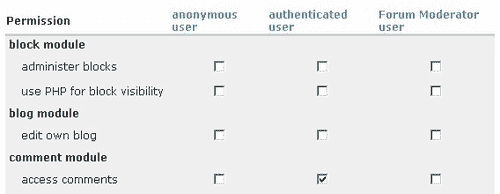

如你所见，这个页面列出了所有可用的权限在左侧列，并允许你通过在相关列中勾选或取消勾选复选框来启用或禁用该权限。很容易看出，一个人只需沿着列表选择每个角色所需的权限即可。实际上并不容易确定最初应该启用或禁用哪些权限。

注意，左侧列表中给出的权限与特定模块相关。这意味着，如果我们通过添加或删除模块来更改网站的设置，那么我们也必须更改此页面上的权限。这意味着：

### 注意

大多数时候，当你添加一个模块时，你需要确保权限设置符合该模块的需求，因为默认情况下不会授予任何权限。

*我们从上一张截图所示的权限页面还能学到什么？嗯，每个权限究竟意味着什么？* 有很多动词允许执行完全不同的操作。以下列出了一些更常见、更通用的动词，尽管你可能会偶尔发现一两个其他动词来适应特定的模块：

+   **管理**：赋予用户影响模块功能的能力。例如，授予本地模块的管理权限意味着用户可以添加或删除语言，管理字符串，甚至导出`.po`文件。这个权限应该只授予可信赖的用户，绝不应该授予匿名用户。

+   **访问**：赋予用户使用一个模块的能力，而不会以任何方式影响它。例如，授予评论模块的访问权限允许用户查看评论，而无法删除、编辑或回复它们。

+   **创建**：赋予用户创建某种内容的能力。例如，授予创建故事的权限允许用户这样做，但并不也赋予他们编辑这些故事的能力。

+   **编辑自己的内容**：赋予用户使用他们自己创建的内容的能力。例如，授予**编辑自己的内容**权限给**故事**模块意味着用户可以随意修改自己的故事。

还有其他特定模块的权限可用，建议你尝试并理解你设置的任何新权限（大多数都很直观）。

现在，由于默认角色赋予的权限相当稀疏，你可能会想在你工作于任何新角色时同时查看那些用户能做什么。很可能，你希望允许匿名用户访问网站的大部分内容，但不允许他们以任何方式修改它。我将这些选择留给你。但我们是怎样设置**论坛管理员用户**所需的权限呢？

如果我们查看**权限**页面上显示的权限列表，我们会看到以下与论坛相关的选项（目前，**论坛管理员用户**的权限在最外一列）：

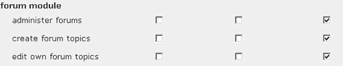

启用这三个选项并测试一下新获得的能力应该会很快证明这并不是我们想要的。

如果你在想如何实际测试这一点，你需要注册一个新用户并将他们分配到**论坛管理员用户**角色。以下关于**用户**的部分解释了如何创建新用户并正确管理他们，所以如果你不确定如何操作，快速跳到前面查看，以便你有一个可以工作的新用户。

以下这一点可能会让你的生活变得容易一些：

### 小贴士

使用两个浏览器来测试你的网站！演示站点的开发机器有 IE 和 Firefox。保留一个浏览器供管理员使用，另一个用于匿名用户或其他用户以测试更改。这将帮助你避免在测试新权限时需要频繁登录和登出。

假设你愿意以某种方式测试新的权限，你会发现论坛管理员可以访问并处理**所有论坛**，而我们希望将这个特定的用户限制在**与保护相关的**主题中。我们需要更具体的东西——也许是在**其他模块之一**？

查看剩余的权限，我们可以看到有一个 **管理节点** 选项——让我们试试。在保存并登出之前，禁用 **管理论坛** 选项并启用 **管理节点** 选项供匿名用户使用。你现在应该会发现 **论坛管理员用户** 可以轻松地通过在主菜单中选择 **内容** 链接来编辑论坛上的 *任何帖子*。*那么问题是什么？* 好吧，首先，这个用户现在也可以配置网站上所有不同类型的内容，以及编辑任何类型的内容，包括其他人的博客。这种情况比第一个问题还要糟糕！

哎呀，尽管我们现在对谁做什么有相当大的控制权，但已经有迹象表明，有些事情没有其他地方的协助是难以完成的。为了完成这个任务，我们需要利用我们在上一章下载并安装的 *分类访问控制* 模块，因为当前问题的解决方案在于迫使 Drupal 定义可以基于其类别访问和操作内容的用户。

## 使用分类访问控制设置权限

假设你已经启用了这个模块，前往 **管理** 链接下的 **访问控制** 部分（你需要再次以管理员身份登录）。你应该会注意到这个页面上有一个新的标签页，标题为 **分类权限**。这个页面应该包含一个可用角色的列表以及编辑它们分类权限的能力。然而，一开始可能不会工作，因为你需要首先启用该模块。如果是这种情况，以下链接应该会显示：

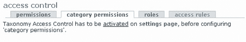

他们是老板！前往 **设置** 下的 **taxonomy_access** 页面并启用该模块。现在当你查看 **访问控制** 下的 **分类权限** 页面时，你会看到一个可供你工作的角色列表。点击列表中的 **论坛版主用户** 来查看任何和所有类型分类内容的权限（顺便说一句，如果你对内容分类和类别还不确定，不要担心——所有这些内容将在接下来的几章中讨论），如下所示：

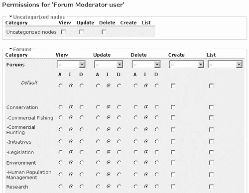

这里有很多东西要考虑！现在在 **管理** 下的 **帮助** 中有一个分类访问帮助页面在 **taxonomy_access** 下，你应该与这个页面一起阅读。让我们快速查看所有这些选项的实际操作。

可用的前三个列选项是**查看、更新**和**删除**。这些选项相当直观，允许用户分别查看、处理或删除内容。下一个选项**创建**允许用户将指定的术语固定到帖子中。**列表**会导致指定的术语在帖子的页面、类别列表中甚至面包屑导航中显示。如果您希望该术语实际上出现在您的页面、页面上或其周围，请确保已启用**列表**——如果禁用，可能会产生一些意外的结果。

前三个选项有三个设置可供选择：

+   **允许**（A）：为任何给定类别授予用户相关权限

+   **忽略**（I）：实际上拒绝用户的相关权限，但可以使用其他**允许**命令来覆盖

+   **拒绝**（D）：拒绝用户对任何给定类别的相关权限

列表中的第二个要点引出了一个关于优先级的重要问题：

### 注意

**拒绝**指令优先于**允许**！

*为什么这很重要？* 想想如果在某个阶段，一个帖子被链接到几个类别（这种情况是可能的，我们将在本书后面的章节中遇到这种情况）。如果权限设置得如此，即用户在一个*词汇表*中的术语上设置了**允许**指令（词汇表和其他与分类法相关的术语都在第七章的*高级内容*中详细讨论），但在另一个中设置了**拒绝**，那么**拒绝**指令将具有优先权。这就是为什么**忽略**如此重要的原因，因为它允许您有效地在一个类别中拒绝一个术语的权限，而不会影响其他类别。

### 注意

只有在您确定某个角色将**永远**不需要访问该术语时，才使用**拒绝**。

每个词汇表顶部显示的下拉列表允许您做出影响整个列的通用声明。例如，您可能希望允许用户查看词汇表中的所有术语，而不是必须手动更改每个设置。如果是这种情况，只需从下拉列表中选择**允许所有**即可继续操作。下拉列表下方是**默认**选项，它会导致该列中任何新的术语自动获得在此处设置的权限——如果您不确定在这里想要什么，请坚持使用**忽略**。

现在，如果您尝试使用默认权限设置的**论坛管理员**用户访问论坛，您很可能会感到失望：


这实际上是可以预料的（尽管我们知道论坛确实存在），因为默认情况下论坛管理员只有**忽略**指令设置。将您的页面设置为以下样式，并确保您的**论坛管理员**用户有权**创建论坛主题**和**编辑自己的论坛主题**（在**访问控制**页面的**权限**选项卡上设置）：

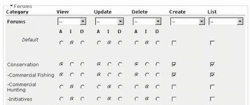

点击**保存分类权限**将捕获这些设置，现在您可以尝试使用新的权限。具体来说，我们需要检查此用户是否可以执行预期的操作。*预期的操作是什么？*根据设置，我们希望用户只能访问**商业捕鱼**论坛，该论坛位于**保护**容器内。用户应该能够在此论坛上发帖，以及编辑此论坛内的任何帖子（即使不是用户自己的帖子）。

从论坛管理员的视角来看**论坛**页面，我们得到以下结果：

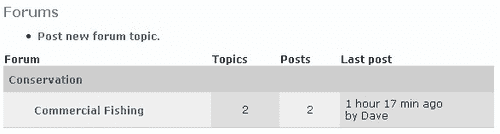

这太完美了！用户只能按预期访问一个论坛，但真正的测试在于我们是否可以编辑他人的帖子。在这种情况下，我使用我的管理员用户在此论坛上发布了一条笔记，通过**论坛管理员用户**访问它时，会出现以下页面：

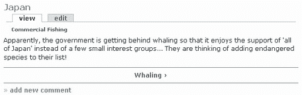

从这里您可以看到，已启用的**列表**指令正在正常工作，因为显示出了分类术语**商业捕鱼**。显然，**查看**和**更新**指令工作得很好，因为我们可以看到帖子并且可以编辑它。如果您想确认**删除**指令是否工作，只需点击**编辑**并检查页面底部是否有**删除**帖子的选项。

这是一个好消息！在测试了在单个论坛上授予权限的最简单情况后，您现在需要返回并设置所有需要的权限。在这个过程中，您可能会遇到一些其他有趣的问题。我将在下面详细说明其中的一些——最终，您需要练习使用分类和权限，以便能够实现您想要的确切效果。尽管如此，我建议在更详细地介绍分类之前再进行操作。

返回**论坛管理员**用户的**分类权限**页面，禁用所有**创建**指令，并保存您的设置。现在尝试使用**论坛管理员**用户发布一个新的论坛主题。您应该会看到一个像这样的页面：

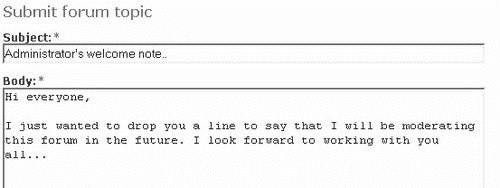

*问题是什么？* **提交**这条消息，然后回到论坛查看。*你看到问题了吗？* 我们已经禁用了**创建**，因此我们没有指定这条帖子应关联哪个术语的选项。因此，因为我们只能查看**保护**容器和**商业捕鱼**论坛，所以新的内容对我们不可用。*“但我们会最终允许论坛管理员“查看”所有论坛主题”，你可能会反驳。这是真的，这样做确实会使帖子可访问，但这不会帮助论坛管理员实际上发布到他或她负责的论坛中。

这可能已经展示了选择你的设置是一项相当微妙的工作。重新启用**创建**指令并再次尝试发帖会带来以下额外选项，然后就能解决问题：

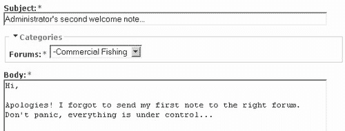

现在这个内容提交后，它会在**商业捕鱼**论坛中正确显示。我们将保留分类权限在那里，因为我们还没有详细讨论分类，一旦我们讨论了分类的来龙去脉，你将能够更有效地练习。例如，有些人可能会想知道如何将这条笔记发布到论坛管理员职责范围内的**所有**论坛，而不是一次只发布一个——像这样的任务将在第七章中处理。

一旦你确定可以控制**论坛管理员用户**，让我们尝试一些稍微不同的事情。点击**管理**下的**访问控制**页面中的**权限**标签页，并确保你的**匿名用户**已经选择了所有可用的**论坛模块**权限。保存这些更改并从 Drupal 注销。现在，你已经看到了这些权限的作用；匿名用户很可能会能够管理所有论坛。确实如此，主菜单显示了前往论坛以及管理论坛的链接。点击底部的链接，它会带你到论坛的管理页面。你应该会注意到一些相当奇怪的事情，就像这样：

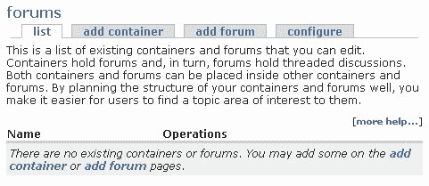

嗯，这很奇怪，因为我们知道那里有论坛。让我们尝试主菜单中的另一个**论坛**链接。这次，跟随那个链接仅仅会弹出一个空白页面。这非常奇怪，我们在论坛上拥有完整的管理权限，但 Drupal 表现得好像它们不存在一样。*你能想出为什么吗？*

作为管理员，在**访问控制**部分移除**匿名用户**的**论坛模块**权限并保存设置。现在，点击**分类权限**标签页，然后选择**匿名用户**的**编辑**链接。您将看到与最初为**论坛管理员用户**看到的相同的未更改的设置页面。现在答案应该很明显。由于匿名用户在这里没有设置任何权限，我们实际上通过说这个用户是论坛管理员，但不允许访问论坛中与分类术语相关的任何内容，向 Drupal 提供了相互冲突的指令。

在我们的情况下，我们希望匿名用户能够查看论坛中的所有内容（尽管，如果您想隐藏任何主题，只需简单地取消选中即可），所以我们从**列表**下拉菜单中选择**全选**，并在**查看**列下拉菜单中选择**允许所有**并保存设置。以匿名用户身份查看结果。您应该会发现可以像预期的那样查看所有论坛，但您需要登录才能发布任何内容。

这说明了定期彻底测试您网站的需要，以便未预见的变化不会产生灾难性的影响。在讨论权限的某个阶段，您可能已经问过自己：*一个用户可以属于多个角色吗？* 当然，这个问题紧随其后的就是*属于多个角色的用户会收到哪些权限？* 为了回答这些非常重要的问题，让我们来看看我们讨论的下一个主题。

# 用户

您可以通过使用角色来为单个用户账户分配您想要的任何数量或数量的权限。Drupal 用户除非他们已经有一个定义了他们在 Drupal 框架内操作方式的角色的权限，否则实际上什么都不是。因此，我们首先讨论了角色。

用户可以通过两种方式创建。最常见的方式是在网站上注册——如果您还没有，请点击主页上的**创建新账户**链接，注册您网站上的新用户，以便自己测试一下。请记住提供有效的电子邮件地址，否则您将无法正确登录。这将创建一个经过身份验证的用户，具有分配给**经过身份验证的用户**角色的所有权限。

第二种方式是使用您的管理用户创建新用户。为了做到这一点，以管理用户身份登录，然后点击**管理**下的**用户**。选择**添加用户**标签页并遵循该页面的说明——您需要向 Drupal 提供用户名、电子邮件地址和密码。一旦您有几个用户可以玩，就是时候开始与他们一起工作了。

## 管理用户

作为网站管理员，你被赋予了完全访问其他用户账户信息的能力。通过点击在**administer**下的**users**页面中每个用户账户右侧显示的**编辑**链接（位于**操作**列标题下），你可以对特定用户进行任何所需的更改。

现在，当我们最初在第二章中设置管理用户时，我们已经简要地浏览过这个页面，但现在值得更深入地查看，因为它有一个第一次设置时没有的重要设置。如果你将页面向下滚动一点，你会注意到你现在可以选择指定该用户属于哪些角色。目前演示网站的**角色**部分看起来如下：

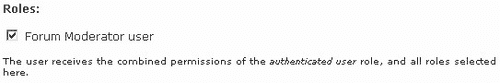

在此截图中的复选框下方阅读这些行，你可以看到，每次你将用户添加到另一个角色时，该用户将获得这些角色的合并权限。因此，这就回答了我们在早期关于*权限*部分提出的问题。但是，这一切的喧嚣究竟是为了什么？通过了解这一点，你应该按照以下方式来委派角色：

1.  通过设置**匿名用户**权限来定义网站最基本的使用者。

1.  为基本**认证用户**设置权限——很可能是那些已经在您的网站上注册的人。

1.  通过仅添加该角色所需的具体额外权限来创建特殊角色，不要重新分配认证用户已经拥有的权限。

1.  通过组合他们职责或需求所需的任何角色来创建新用户。

如果你遵循上述步骤，你将确保始终为每个角色分配正确的权限。这是因为你正在从最基本到最复杂逐步构建用户的权限，而不必每次都分配每个单独的权限。很明显，论坛管理员将拥有匿名用户和认证用户的全部权限，再加上一些额外的权限。所以，如果你回顾章节中的第一个图表，你可以看到在这种情况下，我们会：

1.  定义**匿名用户**和**认证用户**的角色权限——认证用户应该拥有匿名用户的全部权限，以及你的基本网站用户所需的其他权限。

1.  创建仅包含**论坛管理员用户**和**博客作者用户**所需额外权限的新角色，除了已授予认证用户的权限之外。

1.  将博客作者分配到**博客作者用户**角色（他们自动获得授予认证用户的权限），并为论坛管理员及其角色做同样的事情。

除了使用该策略为用户分配角色之外，本节中的信息相当容易直观理解；因此，让我们继续前进。

## 配置用户

这一节实际上讨论的是网站如何对待用户，而不是讨论用户可以做什么和不可以做什么。然而，你会发现这一节中的一些信息对于网站的外观和感觉非常重要。点击**管理**链接下的**设置**，然后点击**用户**。你将看到一个选项集，从用户注册设置开始，如下所示：

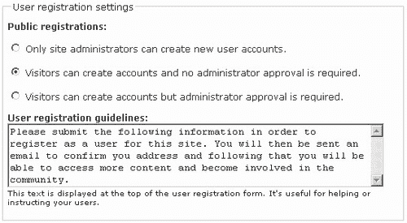

根据你对网站功能的设想，你可能需要非常仔细地考虑选择前三个选项中的哪一个。例如，你可能希望允许每个人都能够阅读和发表论坛上的评论，或者做任何事情，而不需要先注册。如果是这样的话，那么可能只需要注册的人是那些将要执行某种管理职责的人，在这种情况下，你可能想要选择第一个选项，或者至少第三个选项。

为了演示网站，第二个选项是可行的，因为我们希望尽可能让更多的人能够参与到社区中来，同时又不允许每个人都发布内容，从而可能引起问题。还增加了一条有用的信息，以解释注册流程给潜在用户。

页面上的下一节讨论了用户电子邮件定制的流程。然而，这里有一个有趣的方面，那就是 Drupal 提供了一些变量，可以在输入的静态文本中使用。让我们看看如何修改一行或几行，以便了解这是如何工作的。

例如，我们将修改**欢迎电子邮件的主题**文本，从：

**%username 在 %site 的账户详情**，使其更加活泼：

**恭喜 %username，您已在 %date 在 %site 注册！**

这里没有太多复杂的事情！以**%**符号开头的关键词只是其他值的占位符，这些值将根据特定时间如何设置而插入到你的电子邮件中。这让你能够个性化你的通信。在这种情况下，注册为**David**的用户欢迎电子邮件的主题现在显示如下：

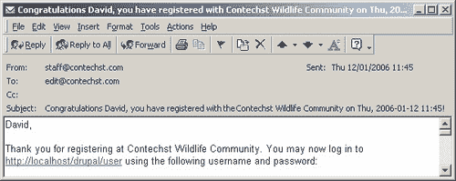

如您所见，**%username, %site**和**%date**占位符已正确更改，以反映该特定设置的变量内容。有几个标准电子邮件的设置可供选择，如**密码恢复**和**欢迎（等待管理员批准）**。当然，默认值是相当合理且易于更改的。记住，每个文本片段下面都提到了可用的占位符，所以请尝试使用它们，直到你对它们的用法感到舒适。

最后一个部分是关于**图片**的。现在，如果您希望为用户启用**图片支持**，则从列表中选择**启用**，如果您想要一个默认图片，请提供，然后点击**保存配置**（其他设置相当直观和合理，您可以在任何阶段返回更改它们，如果它们不适合您）。

Drupal 将在您的 Drupal 安装中的`files`文件夹内创建一个`pictures`文件夹来存放所有图片。一旦完成所有操作，用户将在他们的**编辑**标签页的**我的账户**页面中添加一个新的部分，如下所示：

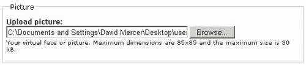

当图片成功上传后，它将出现在**我的账户**页面，以及用户在该网站的博客和论坛帖子中。

如果图片没有显示，你看到的是一个链接，类似于以下内容：


然后，您需要确保在**访问控制**页面正确设置**上传模块**的权限，如下所示：

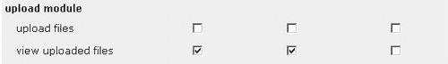

记住，由于**论坛管理员**用户自动接收所有**认证用户**的权限，因此没有必要为**论坛管理员**启用**查看上传文件**的权限，因为这将是多余的，并且会使你的用户目的变得不明确。

允许用户将图片整合到网站中是让人们能够个性化他们贡献的好方法，同时也为每个人提供了与帖子关联的视觉元素。这是培养社区的一个好方法，因为它有助于给不同的用户提供某种身份。

编辑图片很简单！只需在用户编辑页面的**图片**部分进行修改，如下所示：

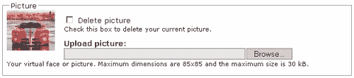

这基本上就是配置用户的结束。在我们继续之前，还有一些关于安全性的问题需要讨论。

# 访问规则

到目前为止，Drupal 在确保能够控制网站上谁做什么方面似乎已经做得差不多了。这确实是事实，但还有一些我们尚未讨论的情况，可能会在某个阶段影响网站。例如，*如果你发现有一家公司反复在你的论坛上发布广告和营销信息会发生什么？* 或者，*如果你想只允许特定公司的人访问你的网站会发生什么？*

这种性质的问题确实可能成为你心中的刺。访问问题甚至可能导致社区成员流失——除非你有设置访问规则的能力。

有一些技术可以通过在**管理**主菜单项下的**访问控制**页面中的**访问规则**标签页来设置访问规则。要实施任何访问规则，您需要选择**添加规则**选项，这将打开以下页面：

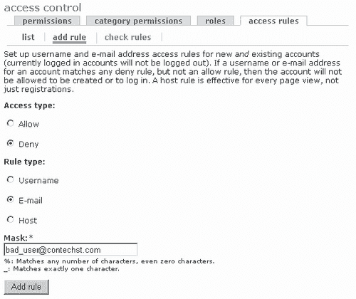

从这里你可以看出，我正在创建一个基于电子邮件地址拒绝访问的规则。在我们继续这条线之前，重要的是要注意，这里既有**允许**和**拒绝**选项可供选择，并且这些选项将根据在**规则类型**部分提供的**用户名、电子邮件**或**主机**地址执行。最后一个选项**掩码**允许你指定规则将应用的实际用户名或主机名。

在上述情况下，点击**添加规则**后，电子邮件地址`bad_user@contechst.com`将创建一个**拒绝**规则。

继续创建这样的规则，完成后你将看到该规则现在出现在**列表**标签下。现在已经有了一个拒绝规则，我们如何使用它呢？答案是它已经被使用了。如果有人试图使用规则中提供的电子邮件地址注册，他们将无法访问。目前来看，这可能不是很有帮助，因为你可能无法提前知道要阻止哪些具体的电子邮件地址。

为了应对你不确定具体地址的情况，提供了两个通配符字符，可以作为通用字符串或字符使用。假设你想禁止一个运营小型垃圾邮件业务的人。仅仅阻止他们当前的电子邮件地址并不足够，因为他们可以简单地创建另一个地址并使用它来在 Drupal 上注册。如果你知道这些地址来自一个位置，例如：

```php
<some characters>@irritating_spammer.com

```

你可以使用`%`字符来匹配`@`符号之前出现的任何字符，从而阻止该电子邮件服务器上的任何人注册，如下所示：

```php
%@irritating_spammer.com

```

如果你有一个 Hotmail 账户或类似的东西，尝试阻止任何以`@hotmail.com`结尾的地址，然后尝试在该网站上注册账户。你应该会发现 Drupal 会显示以下信息：

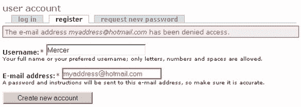

当你不想在网站上允许使用 Hotmail 地址，除非是那位正在世界各地旅行的亲密朋友，他只能使用 Hotmail 地址时，就会出现一个新的问题。在这种情况下，你也需要设置一个**允许**规则。如果这个人的电子邮件地址是`good_friend@hotmail.com`，那么你可以在**添加规则**页面选择适当的选项来设置允许规则。

你的规则可能看起来像这样：

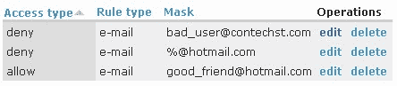

这实际上是在网站上禁止所有 Hotmail 地址。然而，由于**允许规则优先于拒绝规则**，截图中所显示的单个**允许**规则中指定的唯一 Hotmail 地址将正常工作。现在，当你的好朋友尝试注册时，一切都会顺利进行。

经过一段时间，你可能会发现现有的规则集可能会变得有些令人困惑，或者，简单地来说，持续不断地尝试注册新名称以确保它们按计划工作变得不可行。在这种情况下，请使用**访问规则**页面右侧的**检查规则**标签。这允许输入用户名、电子邮件地址和主机，以检查它们是否有访问权限。只需将这些结果与你的预期进行比较，以确定一切是否按计划进行。

最后需要注意的一点是，如果你使用主机标准拒绝访问，那么这一限制将会在整个网站上实施，而不仅仅是注册页面。对于垃圾邮件发送者的情况，你可能希望一般性地拒绝其访问网站；因此，你会在**掩码**选项中选择类似以下的内容：**主机**

```php
%irritating_spammer%

```

这样就会匹配包含`irritating_spammer`的任何主机。例如：

```php
www.really_irritating_spammer.com
www.mildly_irritating_spammer.com
www.extremelyirritating_spammer.org
www.unbelievably_irritating_spammer.comms.org.co.sz

```

等等。请记住检查你添加的所有规则是否对网站的访问策略产生了预期的效果。如果制定了一条规则，阻止了可能对社区有价值的成员访问内容，导致他们去其他地方，那将是一件遗憾的事情。

在结束之前，如果不提及其他一些与**用户访问/身份验证相关**的模块，我会感到疏忽。Drupal 网站上有很多这样的模块。在`http://drupal.org/project/Modules/category/74`上查看这些模块可能是有价值的，以防你发现某些特别适合你需求的模块。

特别值得注意的是**按角色节点隐私**和**路径访问**模块，它们提供了控制内容访问的另一种方法。在看到**分类访问**模块的工作方式后，你应该有足够的信心去处理这些贡献，前提是你不能完全实现你想要的功能。

# 概述

本章为你提供了关于控制网站内容访问的基础知识。你看到 Drupal 提供了一系列设施和选项，以确保通过管理员用户保持整体控制，以及通过使用角色将重要任务委托给可信赖的用户，来确保网站的适当维护。

我们探讨了如何规划访问策略。这不仅是一个重要的要求，确保网站顺利运行，而且通过迫使你考虑许多可能情况，有助于巩固网站最终的工作方式。在此之后，我们对 Drupal 中访问控制的基本方面进行了探讨，讨论了角色、权限和用户，并学习了如何根据网站的要求规划和实施访问策略。

关于如何使用基于分类法的访问控制模块的讨论，展示了如何实现对内容访问权限的更细致的控制。然而，你可能也发现，创建一个设计良好且连贯的访问策略需要一些时间。规划，更重要的是，测试，将有助于确保一切按预期工作。

随后，引入了访问规则作为进一步控制谁可以进入网站的方法，并讨论了如何有效地使用通配符字符。至此，我们完成了访问控制，尽管强烈建议你花些时间尝试各种选项，直到你对能够进行更改并了解其效果感到舒适为止。

接下来的两章将深入探讨内容——Drupal 的核心所在！
